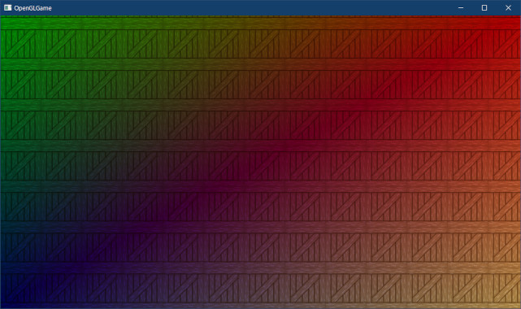

[OpenGL 3D 2023 第02回]

# グラフィックス・パイプラインとシェーダ

## 習得目標

* GPUにはグラフィックスパイプラインというものがあり、パイプラインの一部はシェーダで作成する、ということを説明できる。
* イン変数、アウト変数を定義して、シェーダからシェーダへとデータを送ることができる。
* ユニフォーム変数を定義して、C++プログラムからシェーダへとデータを送ることができる。
* テクスチャオブジェクトを作成し、サンプラ型を定義して図形にテクスチャを表示できる。
* テクスチャ座標が`(0, 0)`から`(1, 1)`の範囲であることを理解している。

## 1. グラフィックス・パイプライン

### 1.1 グラフィックス・パイプラインの概要

OpenGLはプリミティブを描画することできる、ということが分かりました。早速描画しよう！となるところですが、その前に、OpenGLがどのような手順でプリミティブを描画するのかを説明しましょう。

OpenGLの描画は、それぞれが異なる処理を行う「ステージ」という単位に分けられています。ステージが順番に実行されることで、最終的にレンダー・バッファ(Render Buffer。描画した画像を格納するメモリ上の領域)にプリミティブが描画されます。

この、「ステージが順番に実行される仕組み」のことを「グラフィックス・パイプライン」と呼びます。グラフィックス・パイプラインは次のような構造になっています。

<p align="center">

</p>

「石油パイプライン」という言葉を聞いたことがあるでしょうか。金属製の<ruby>筒<rt>つつ</rt></ruby>を長くつないだもので、石油はこの中を通って、ある地点から別の地点へと運ばれていきます。

グラフィックス・パイプラインは名前の通り、石油の代わりに画像(になるデータ)を運びます。

石油パイプラインと違うところは、データがパイプラインの中を進んでいくごとに、少しずつ加工されていく点です。

より近いイメージとしては、自動車工場で製品がベルトコンベアの上を流れていって、それをちょっとずつ組み立てていく「ライン生産方式」が挙げられるでしょう。

>今はまだ、グラフィックス・パイプライン全体を理解する必要はありません。「流れ作業の過程で様々なデータが分解・再構築され、最終的にピクセルの集合としての画像が作られる」という仕組みを、なんとなく想像できれば十分です。詳しい知識が必要になったとき、改めてテキストを復習したり、インターネットで調べるとよいでしょう。

<div style="page-break-after: always"></div>

### 1.2 <ruby>Vertex Puller<rt>バーテックス・プラー</rt></ruby>(VP)

ここからは、パイプラインの動作を順番に説明します。VP(バーテックス・プラー)はグラフィックス・パイプラインの最初のステージです。

VPはGPUメモリからひとつずつ頂点データを取り出し、Vertex  Shaderステージへ渡します。

取り出されるのは、頂点データのうちVertex Shaderが実際に必要とする情報だけです。どの情報を取り出せばいいかは、「頂点アトリビュート」というパラメーターで設定します。

>**【補足】**<br>
>Vertex(バーテックス)は「頂点」という意味で、Pull(ぷる)は「引っ張る」という意味です。つまり、Vertex Pull-erは「頂点データを引っ張り出す装置」といった意味合いになります。

### 1.3 <ruby>Vertex Shader<rt>バーテックス・シェーダ</rt></ruby>(VS)

VS(バーテックス・シェーダ)は最初のプログラム可能なステージです。VPで読み取られた全ての頂点データは、最初にこのステージで処理されます。

VSでは、プリミティブの回転、拡大縮小、移動のほか、座標系の変換、頂点単位のライティングなど、様々な操作を行うことができます。VSは省略できません。

>**【補足】**<br>
>Shade(シェード)は「光を遮る、陰影を付ける」という意味です。ですから、Shade-rは「陰影を付ける装置」といった意味になります。

### 1.4 <ruby>Tessellation Control Shader<rt>テッセレーション・コントロール・シェーダ</rt></ruby>(TCS)

TCS(テッセレーション・コントロール・シェーダ)は「テッセレーション」ステージの最初のステージです。テッセレーション・ステージは3つのステージで構成され、共同で「テッセレーション」と呼ばれる処理を行います。

テッセレーションは「同じ模様を隙間なく敷き詰める」という意味の単語です。コンピューター・グラフィックスの世界では「描画する画像に細かなディテールを加えるために、プリミティブをより多くの小さなプリミティブに分割する」操作のことを指します。

基本的な使い方は、頂点データを低ポリゴンモデルにしておき、テッセレーション・ステージで高ポリゴンモデルを生成する、というものです。頂点データは低ポリゴンモデルのみ用意すればいいので、GPUメモリを節約できます。

TCSは、新たに作成する小さなプリミティブの頂点データを、どこに、どのように作成するかを指定する作業を担当します。TCSはVSと同様にプログラム可能なステージです。

テッセレーション・ステージは省略可能ですが、3つのステージはセットで扱われるため、3つ全てを使用するか、全て省略するかのいずれかになります。

> 本テキストではテッセレーションについては扱いません。そのため、TCSについてもこれ以上詳細な説明はしませんが、このようなステージがあるということは覚えておいてください。

### 1.5 <ruby>Tessellation Primitive Generation<rt>テッセレーション・プリミティブ・ジェネレーター</rt></ruby>(TPG)

TPG(テッセレーション・プリミティブ・ジェネレーション)は「テッセレーション」ステージの2番目のステージです。これはVPと同じく固定機能のステージです。

TPGはTCSからの情報を受け取り、実際に小さなプリミティブへと分割し、最後のテッセレーション・ステージであるTESへと送ります。

### 1.6 <ruby>Tessellation Evaluation Shader<rt>テッセレーション・エバリュエーション・シェーダ</rt></ruby>(TES)

TES(テッセレーション・エバリュエーション・シェーダ)は最後の「テッセレーション」ステージです。TESはTCS同様にプログラム可能なステージで、TPGから受け取ったプリミティブの座標や色を変形し、実際に複雑なディテールを加える役割を持ちます。

### 1.7 <ruby>Geometry Shader<rt>ジオメトリ・シェーダ</rt>(GS)

GS(ジオメトリ・シェーダ)は、ひとつのプリミティブの全頂点データを受け取り、0個以上のプリミティブの頂点データを生成して後段のステージへ送ります。

プリミティブを増やすという点は「テッセレーション」ステージと似ていますが、このステージの特徴は、頂点を増やすだけでなく、削除もできることです。

テッセレーションは「元のプリミティブを分割する」という処理に最適化され、大量のプリミティブを生成するのに向いているのに対して、GSは「プリミティブの頂点データから別のプリミティブを生成する、あるいは削除する」という、比較的小規模かつ汎用的な処理を得意とします。

GSはプログラム可能なステージです。また、テッセレーション・ステージと同様に省略することができます。GSはパーティクルの描画や輪郭線の生成など、様々な用途で使われています。本テキストではGSは扱いません。

### 1.8 <ruby>Primitive Assembly<rt>プリミティブ・アセンブリ</rt></ruby>(PA)

PA(プリミティブ・アセンブリ)は、前段のステージで変換された1つ以上の頂点データを蓄積し、プリミティブを構成できる数になった段階で、まとめて次のステージへ渡します。例えば`GL_TRIANGLES`の場合は3つです。PAは固定機能のステージです。

### 1.9 <ruby>Rasterization<rt>ラスタライゼーション</rt></ruby>(RS)

RS(ラスタライゼーション)は、PAから送られたプリミティブをもとにフラグメントと呼ばれるピクセル片を生成し、後段のFragment Shaderへと送ります。RSは固定機能ステージです。各フラグメントは2～3つの頂点データを補間した値を持ちます。

RSはまた、裏向きのプリミティブを除去したり(カリングといいます)、プリミティブの画面に表示されない部分を切り捨てたり (クリッピングといいます) します。

また、RSは「ビューポート」というパラメータを使って、「クリッピング空間」から「スクリーン空間」への変換を行います。これらについては今後のテキストで説明します。

### 1.10 <ruby>Fargment Shader<rt>フラグメント・シェーダ</rt></ruby>(FS)

FS(フラグメント・シェーダ)は最後のプログラム可能なステージで、RSより送られてきたフラグメントから、実際の色を計算します。

VSがひとつの頂点データを受けとり、ひとつの頂点を送り出すように、FSもひとつのフラグメントを受け取り、ひとつの色を送り出します。FSは主に、フラグメント単位のライティングを行うために使用されます。

>**【補足】**<br>
>Fragment(フラグメント)は「破片、断片」という意味です。OpenGLにおける「Fragment」とは、RSがプリミティブを分解したあとの、ピクセル単位の個々の領域を指す単語です。

### 1.11 <ruby>Per-Fragment Operations<rt>パー・フラグメント・オペレーション</rt></ruby>(PFO)

PFO(パー・フラグメント・オペレーションズ)はグラフィックス・パイプラインの最後のステージです。

PFOは固定機能のステージです。FSから送られてきた色情報と深度情報を「レンダー・バッファ」や「デプス・バッファ」、「ステンシル・バッファ」と呼ばれるメモリ上の領域に書き込みます。

PFOはまた、FSからの色情報とレンダー・バッファの色を、さまざまな方法で合成する機能も備えています。このステージの結果が、レンダー・バッファに書き込まれることになります。

>**【1章のまとめ】**<br>
>
>* プリミティブを描画する仕組みのことを「グラフィックス・パイプライン」と呼ぶ。
>* グラフィックス・パイプラインに、頂点データや座標変換行列などのパラメータを送り込むことで、プリミティブを描画する。
>* グラフィックス・パイプラインのパラメータを変えることで、同じ頂点データでも描画結果が異なる。

<div style="page-break-after: always"></div>

## 2. シェーダを使う

### 2.1 シェーダについて

シェーダ・プログラム(`Shader Program`)は、GPUが実行するプログラムのことです。ご存知かと思いますが、GPUはピクセルの陰影を付けるためのハードウェアです。

「陰影をつける」ことを英語で「`Shade`(シェード)」と言います。これに「～するモノ」を示す`-er`を付けたものが`Shader`(シェーダ)です。つまり、`Shader`は「陰影を付けるためのモノ(プログラムやステージ、プロセッサ)」という意味になります。

一般的に、「シェーダ」といえば「シェーダ・プログラム」のことを指します。「シェーダ・ステージ」を指すこともありますが、どちらなのかは文脈から判断できると思います。

本テキストでは、特にことわりがない限り「シェーダ」は「シェーダ・プログラム」のことを指します。

さて、OpenGLのシェーダは`GLSL`(ジー・エル・エス・エル)という言語で記述します。<br>`GLSL`は(Open**GL** **S**hading **L**anguage, オープン・ジーエル・シェーディング・ランゲージ)の短縮形です。

GLSLはC言語をベースにして、シェーダにとって必要な機能や型を追加し、不要な機能を削除した言語です。このため、普通のCコンパイラではGLSLをビルドできません。GLSLはOpenGLの関数を呼び出してビルドします。

グラフィックスパイプラインの章で説明したように、シェーダには以下の5種類があります。

>* 頂点(バーテックス)・シェーダ
>* テッセレーション・コントロール・シェーダ
>* テッセレーション・エバリュエーション・シェーダ
>* ジオメトリ・シェーダ
>* フラグメント・シェーダ

このうち、最低限必要なのは「頂点シェーダ」と「フラグメントシェーダ」の2つです。残りの3種類は、より高度な画面効果を表現する場合に使います。本テキストでは、頂点シェーダとフラグメントシェーダの2つだけを扱います。

>**【第6のシェーダ】**<br>
>グラフィックスパイプラインとは別に、計算だけを行う「コンピュート・シェーダ」というシェーダが存在します。つまり、実際には全部で6種類のシェーダあることになります。

<div style="page-break-after: always"></div>

### 2.2 シェーダを書く

さっそくシェーダを書いてみしょう。ソリューションエクスプローラーの「リソースファイル」フィルタを右クリックしてコンテキストメニューを開き、「追加→新しい項目」を選択してください。

<p align="center">

</p>

そして、以下の手順で頂点シェーダファイルを追加してください。

>1. 左のリストから「ユーティリティ」を選択。
>2. 中央のリストから「テキストファイル(.txt)」を選択。
>3. 名前欄に`standard.vert`を入力。
>4. 場所欄をプロジェクトの`Res`フォルダに設定。
>5. 「追加」ボタンをクリック。

追加した`standard.vert`(スタンダード・バート)を開き、次のプログラムを追加してください。

```diff
+/**
+* @file standard.vert
+*/
+#version 450
+
+// シェーダへの入力
+layout(location=0) in vec3 inPosition; // 頂点座標
+
+void main()
+{
+  gl_Position = vec4(inPosition, 1);
+}
```

これは「頂点シェーダ」です。頂点シェーダは「図形の頂点の座標を決定する」シェーダです。頂点シェーダは「図形の頂点ひとつにつき1回実行」されます。


同様にして、プロジェクトの`Res`フォルダに`standard.frag`(スタンダード・フラグ)というファイルを追加してください。追加したファイルを開き、次のプログラムを追加してください。

```diff
+/**
+* @file standard.frag
+*/
+#version 450
+
+// 出力する色データ
+out vec4 outColor;
+
+void main()
+{
+  outColor = vec4(0.2, 0.3, 1.0, 1.0);
+}
```

これは「フラグメントシェーダ」です。フラグメントシェーダは「画面に表示するピクセルの色を決定する」シェーダです。フラグメントシェーダは「図形のピクセルひとつにつき1回実行」されます。

先頭にある`#version 450`はシェーダの「バージョン指定」です。ここにはGLSLのバージョン番号を100倍した値を指定します。例えばバージョン4.5の場合は`4.5*100=450`を指定します。

バージョン番号の下にあるのは、各シェーダ・ステージへの入力、および出力に使われる変数です。見慣れない定義なので、最初のうちは分かりづらいと思います。しかし、以下のように「型」と「変数名」と手前に、「修飾子(しゅうしょくし)」と呼ばれる属性が追加されているだけです。

<p align="center">

</p>

修飾子は「他のプログラムとやり取りするための属性」を設定します。多くのシェーダは単独では意味をなさず、他のシェーダと協力しながらグラフィックスを作り上げます。そのため、他のシェーダからデータをもらったり、逆にデータを渡したりするための書式が決められています。

`layout`(レイアウト)は「レイアウト修飾子」です。レイアウト修飾子は、他のプログラムが変数にアクセスするための番号を付けたり、型やステージに固有の属性を設定するために使います。番号を付けるには`location`(ロケーション)を使います。

`in`(イン)、`out`(アウト)は「イン/アウト修飾子」です。`in`修飾子のついた変数を「イン変数」、`out`修飾子のついた変数を「アウト変数」といいます。

頂点シェーダの場合、「イン変数」にはバーテックスプラーステージから送られた値が設定されます。これは、実際には`glVertexArrayAttribPointer`関数によって指定した頂点データです。「イン変数」は書き換え禁止です。

シェーダからの出力は「アウト変数」に格納します。基本的に、シェーダはすべての「アウト変数」に値を設定しなければなりません。「アウト変数」に格納した値は、次のシェーダ・ステージの「イン変数」にコピーされます。

フラグメントシェーダはグラフィックスパイプラインの最後のステージなので、「アウト変数」に格納した値がピクセルの色になります。

これらの変数に使われている`vec3`(ベク・スリー)、`vec4`(ベク・フォー)は、3つまたは4つの要素を持つGLSLの組み込み型です。基本的には、以下の構造体と同じものだと考えてください。

>```c++
>struct vec3 {
>  float x;
>  float y;
>  float z;
>};
>
>struct vec4 {
>  float x;
>  float y;
>  float z;
>  float w;
>};
>```

GLSLのすべての組み込み型はコンストラクタを持っていて、`vec4(inPosition, 1)`のように書くことができます。

`gl_Position`はGLSLが自動的に定義する特別な変数です。この変数は`vec4`型の出力変数になります。自動的に定義されるとはいえ出力変数には違いないので、頂点シェーダでは必ず`gl_Position`を設定しなくてはなりません。

>グローバル変数は`gl_Position`だけではありません。くわしくは以下のURLを参照してください。<br>
>`https://www.khronos.org/opengl/wiki/Built-in_Variable_(GLSL)`

### 2.2 シェーダのコンパイル

作成したシェーダファイルをグラフィックス・パイプラインで使えるようにするには、以下の手順で「コンパイル」と「リンク」を行う必要があります。

>1. 頂点シェーダファイルを読み込む。
>2. 頂点シェーダをコンパイルする。
>3. フラグメントシェーダファイルを読み込む。
>4. フラグメントシェーダをコンパイルする。
>5. 頂点シェーダとフラグメントシェーダをリンクする。

頂点シェーダとフラグメントシェーダは「ファイルを読み込んでコンパイルする」という、よく似た処理を行います。このように、よく似た処理を2回以上行う場合、処理を関数として作成します。

処理を関数にすると、同じことを何度も書かなくてよいので書く量を減らせます。その結果、「書く量が減る→プログラムが短くなる→プログラムが読みやすくなる」という、良い影響が生まれます。

さて、ファイルの読み込みには`ifstream`(アイ・エフ・ストリーム)クラスと`filesystem`名前空間を使います。`Main.cpp`を開き、以下の2つのヘッダファイルをインクルードしてください。

```diff
 #include <GLFW/glfw3.h>
 #include <Windows.h>
 #include <string>
+#include <vector>
+#include <fstream>
+#include <filesystem>
+#include <stdio.h>

 /**
 * OpenGLからのメッセージを処理するコールバック関数
```

次に、`DebugCallback`関数の定義の下に、次のプログラムを追加してください。

```diff
   s += '\n'; // メッセージには改行がないので追加する
   OutputDebugStringA(s.c_str());
 }
+
+/**
+* シェーダファイルを読み込んでコンパイルする
+*
+* @param type     シェーダの種類
+* @param filename シェーダファイル名
+* 
+* @return シェーダの管理番号
+*/
+GLuint CompileShader(GLenum type, const char* filename)
+{
+  std::ifstream file(filename, std::ios::binary); // ファイルを開く
+  if ( ! file) {
+    char s[256];
+    snprintf(s, 256, "[ERROR] %s: %sを開けません\n", __func__, filename);
+    OutputDebugString(s);
+    return 0;
+  }
+
+  // ファイルを読み込む
+  const size_t filesize = std::filesystem::file_size(filename);
+  std::vector<char> buffer(filesize);
+  file.read(buffer.data(), filesize);
+  file.close();
+
+  // ソースコードを設定してコンパイル
+  const char* source[] = { buffer.data() };
+  const GLint length[] = { int(buffer.size()) };
+  const GLuint object = glCreateShader(type);
+  glShaderSource(object, 1, source, length);
+  glCompileShader(object);
+  return object;
+}

 /**
 * エントリーポイント
```

ファイルを読み込むには`ifstream`クラスを使います。`ifstream`には様々なメンバ関数が定義されていますが、今回は以下の3つを使います。

| メンバ関数名 | 用途 |
|:--|:--|
| コンストラクタ(ファイル名, フラグ) | ファイルを開く。フラグに`std::ios::binary`を<br>指定するとバイナリモードになる。 |
| read(バッファアドレス,<br>&emsp;読み込むバイト数) | ファイルを読み込む。 |
| close() | ファイルを閉じる。 |

`ifstream`コンストラクタの引数に`std::ios::binary`(エスティーディー・アイオーエス・バイナリ)フラグを指定すると、バイナリモードでファイルを開きます。バイナリモードは改行文字の変換等を行わないため、読み込みが速くなります。

`ifstream`クラスには「`bool`型への変換演算子」が定義されています。そのおかげで、`if`文などの条件式に`ifstream`クラスのオブジェクトを指定すると、`bool`型として扱われます。

変換結果は、ファイルが正常に開かれていれば`true`、「ファイルを開けない」、「読み込めない」などのエラーが起きていたら`false`になります。

エラーが起きた場合、エラーメッセージを出力して`0`を返します。OpenGLでは、管理番号`0`は「オブジェクトが存在しない」ことを意味します(nullptrのような扱い)。

ファイルを開くことができたらファイルを読み込みます。今回はファイル全体を一気に読み込みたいので、先にファイルサイズを取得します。ファイルサイズを取得するには`filesystem`名前空間の`file_size`(ファイル・サイズ)関数を使います。

<p><code class="tnmai_code"><strong>【書式】</strong><br>
uintmax_t file_size(ファイルパス);
</code></p>

`unitmax_t`は、「処理系で表現可能な最大の符号なし整数型」と定義されています。x64系のCPUでは`uint64_t`相当であることが多いです。

サイズを取得したら、`vector`クラスを使ってサイズ分の領域を用意し、そこにシェーダプログラムを読み込みます。読み込みには`read`(リード)関数を使います。ファイルを読み込んだら`close`関数でファイルを閉じます。

続いて、読み込んだシェーダプログラムをコンパイルします。まず「シェーダを管理するオブジェクト」を作成します。「シェーダを管理するオブジェクト」を作成するには`glCreateShader`(ジーエル・クリエイト・シェーダ)関数を使います。

<p><code class="tnmai_code"><strong>【書式】</strong><br>
GLuint glCreateShader(作成するシェーダの種類);
</code></p>

「作成するシェーダの種類」には`GL_????_SHADER`という値を指定します。`????`の部分には`VERTEX`, `FRAGMENT`などが入ります。よく似た`GL_????_SHADER_BIT`という値が存在するので、間違えないように注意してください。

この関数の戻り値は「作成したシェーダオブジェクトの管理番号」です。

次に、シェーダプログラムをコンパイルします。シェーダプログラムをコンパイルするには、まず`glShaderSource`(ジーエル・シェーダ・ソース)関数でシェーダ文字列を設定します。

<p><code class="tnmai_code"><strong>【書式】</strong><br>
void glShaderSource(シェーダの管理番号, 文字列の数, 文字列の配列,<br>
&emsp;文字列長の配列);
</code></p>

C++コンパイラと異なり、GLSLコンパイラにはインクルード文を扱う機能がありありません。そのかわり、複数の文字列を指定できるようになっています。

複数のシェーダプログラムで同じプログラムを使いたい場合、それらを文字列配列に指定することで、インクルード文に近いことが実現できます。

シェーダ文字列を設定したら、`glCompileShader`(ジーエル・コンパイル・シェーダ)関数を呼び出します。この関数は、直前の`glShaderSource`関数で指定されたシェーダ文字列をコンパイルします。

<p><code class="tnmai_code"><strong>【書式】</strong><br>
void glCompileShader(シェーダの管理番号);
</code></p>

それでは、作成した`CompileShader`関数を使ってシェーダをコンパイルしましょう。、`main`関数にある「エラーメッセージコールバックを設定」するプログラムの下に、次のプログラムを追加してください。

```diff
   // メッセージコールバックの設定
   glDebugMessageCallback(DebugCallback, nullptr);
+
+  // シェーダを読み込んでコンパイル
+  const GLuint vs = CompileShader(GL_VERTEX_SHADER, "Res/standard.vert");
+  const GLuint fs = CompileShader(GL_FRAGMENT_SHADER, "Res/standard.frag");

   // 頂点データをGPUメモリにコピー
   const float vertexData[][3] = {
```

### 2.3 シェーダのリンク

頂点シェーダとフラグメントシェーダをコンパイルしたら、この2つをリンクして、実行可能なプログラムオブジェクトを作成します。

フラグメントシェーダをコンパイルするプログラムの下に、次のプログラムを追加してください。

```diff
   // シェーダを読み込んでコンパイル
   const GLuint vs = CompileShader(GL_VERTEX_SHADER, "Res/standard.vert");
   const GLuint fs = CompileShader(GL_FRAGMENT_SHADER, "Res/standard.frag");
+
+  // 2つのシェーダをリンク
+  GLuint prog3D = glCreateProgram();
+  glAttachShader(prog3D, vs);
+  glAttachShader(prog3D, fs);
+  glLinkProgram(prog3D);

   // 頂点データをGPUメモリにコピー
   const float vertexData[][3] = {
```

プログラムオブジェクトを作成するには`glCreateProgram`(ジーエル・クリエイト・プログラム)関数を使います。

<p><code class="tnmai_code"><strong>【書式】</strong><br>
GLuint glCreateProgram();
</code></p>

`glCreateShader`と異なり、プログラムオブジェクトは1種類しかないので引数はありません。戻り値は「作成したプログラムオブジェクトの管理番号」です。

管理番号は適当な変数に代入しておきます。今回は`prog3D`(プログ・スリーディ)という名前の変数に代入しました。

シェーダをリンクするには、まず`glAttachShder`(ジーエル・アタッチ・シェーダ)関数を使って、リンクしたいシェーダを指定します。

<p><code class="tnmai_code"><strong>【書式】</strong><br>
GLuint glAttachShader(プログラムオブジェクトの管理番号,<br>
&emsp;シェーダの管理番号);
</code></p>

指定したシェーダをリンクするには`glLinkProgram`(ジーエル・リンク・プログラム)関数を使います。

<p><code class="tnmai_code"><strong>【書式】</strong><br>
void glLinkProgram(プログラムオブジェクトの管理番号);
</code></p>

これで、シェーダを使う準備が整いました。

### 2.4 シェーダを使う

それではシェーダを使って描画してみましょう。メインループに次のプログラムを追加してください。

```diff
     // バックバッファをクリア
     glClearColor(0.3f, 0.6f, 0.9f, 1.0f);
     glClear(GL_COLOR_BUFFER_BIT | GL_DEPTH_BUFFER_BIT);
+
+    // 描画に使うシェーダを指定
+    glUseProgram(prog3D);

     // 図形を描画
     glDrawElementsInstanced(GL_TRIANGLES, 9, GL_UNSIGNED_SHORT, 0, 1);
```

プログラムが書けたらビルドして実行してください。図形が青色になっていたら成功です。

<p align="center">

</p>

うまく表示されない場合は、Visual Studioの出力ウィンドウに、次のようなエラーが表示されていないか確認してください。

>```txt
>SHADER_ID_COMPILE error has been generated. GLSL compile failed for shader 1, "":
>FLEX: Unknown char 1
>ERROR: 0:20: '1' : syntax error syntax error
>
>SHADER_ID_LINK error has been generated. GLSL link failed for program 3, "":
>Attached vertex shader is not compiled.
>
>Error has been generated. GL error GL_INVALID_OPERATION in UseProgram:
>(ID: 1001309929) Generic error

これらは「OpenGLデバッグコンテキスト」からのエラーメッセージです。`SHADER_ID_COMPILE`で始まるエラーはシェーダのコンパイルエラーです。

次の行の`ERROR: 0:20:`と書かれた行がエラーの場所です。これは「文字列配列の0番目の文字列の中の20行目でエラーが起きた」ことを示しています。

複数のエラーが表示されている場合、できるだけ最初に表示されたエラーから調べていくことをおすすめします。後続のエラーは、それより前のエラーが大本の原因である可能性が高いためです。

さて、図形が青色になるのは、`standard.frag`に書いてもらった以下の行で、「赤=0.2, 緑=0.3, 青=1.0, 不透明度=1.0」をアウト変数に設定しているからです。

>```c++
>outColor = vec4(0.2, 0.3, 1.0, 1.0);
>```

数値を変更して、本当に色が変化するか見てみましょう。`standard.frag`を開き、メイン関数を次のように変更してください。

```diff
 void main()
 {
-  outColor = vec4(0.2, 0.3, 1.0, 1.0);
+  outColor = vec4(1.0, 1.0, 0.2, 1.0);
 }
```

プログラムが書けたらビルドして実行してください。図形が黄色で表示されたら成功です。

<p align="center">

</p>

このように、フラグメントシェーダの最終出力が、画面に実際に表示される色になります。

### 2.5 シェーダ間でデータを送る

頂点シェーダからフラグメントシェーダにデータを送るには、対応するイン変数とアウト変数を定義します。実験として、頂点の色を送ってみましょう。

まず頂点シェーダにアウト変数を追加します。`standard.vert`を開き、次のプログラムを追加してください。

```diff
 #version 450

 // シェーダへの入力
 layout(location=0) in vec3 inPosition; // 頂点座標
+
+// シェーダからの出力
+layout(location=0) out vec4 outColor; // 頂点色

 void main()
 {
  gl_Position = vec4(inPosition, 1.0);
```

次に`standard.frag`を開き、次のプログラムを追加してください。

```diff
 * @file standard.frag
 */
 #version 450
+
+// シェーダへの入力
+layout(location=0) in vec4 inColor; // 頂点色

 // 出力する色データ
 out vec4 outColor;
```

>**【変数名について】**<br>
>変数名の頭に`in`や`out`を付けているのは、主にイン変数とアウト変数で名前が重複しないようにするためです。特にルールがあるわけではありません。

アウト変数は、次に実行するシェーダのイン変数とつながっています。そのため、シェーダ間でデータをやり取りする場合、先に実行するシェーダのアウト変数と次に実行するシェーダのイン変数は、ロケーション番号を一致させなくてはなりません。

下図に示すように、前段のステージのアウト変数に書き込んだ値は、同じロケーション番号を持つ次のシェーダのイン変数にコピーされます。

<p align="center">

</p>

また、アウト変数とイン変数の組み合わせについて、ロケーション番号と型が一致しない場合、シェーダのリンクに失敗します。

対して、同じシェーダ内ではイン変数とアウト変数は完全に別物です。例えば、頂点シェーダの`inPosition`と`outColor`のロケーション番号が重複しています。

しかし、`inPosition`は`VP`からの0番目の入力、`outColor`は次のステージへの0番目の出力なので、番号は同じでも全く異なる場所を意味しています。

それでは、頂点シェーダの`outColor`変数に値を設定しましょう。`standard.vert`を開き、次のプログラムを追加してください。

```diff
 void main()
 {
+  const vec4 colors[] = {
+    { 1, 0, 0, 1 }, // 赤
+    { 0, 1, 0, 1 }, // 緑
+    { 0, 0, 1, 1 }, // 青
+  };
+  outColor = colors[gl_VertexID % 3];
   gl_Position = vec4(inPosition, 1.0);
 }
```

`gl_VertexID`(ジーエル・バーテックス・アイディ)は、GLSLが自動的に定義している変数です。この変数は「頂点データのインデックス」を表し、IBOに設定した数値と一致します。

次にフラグメントシェーダの`inColor`変数を使って、図形に色を付けてみます。`standard.frag`を開き、プログラムを次のように変更してください。

```diff
 void main()
 {
-  outColor = vec4(0.0, 0.0, 1.0, 1.0);
+  outColor = inColor;
 }
```

プログラムが書けたらビルドして実行してください。図形が赤、緑、青で塗られていたら成功です。このように、イン変数、アウト変数を使うことで、頂点シェーダからフラグメントシェーダへと数値を送ることができます。

<p align="center">

</p>

<pre class="tnmai_assignment">
<strong>【課題01】</strong>
<code>colors</code>配列に白色の要素を追加して、四角形が4色で塗られるようにしなさい。
</pre>

### 2.6 C++プログラムからシェーダへデータを送る

C++プログラムからシェーダへデータを送るには、「ユニフォーム変数」というものを使います。例として、アプリ起動時からの経過時間をシェーダに送ってみましょう。

ユニフォーム変数を定義するには`uniform`(ユニフォーム)という修飾子を使います。
`standard.vert`を開き、次のプログラムを追加してください。

```diff
 // シェーダからの出力
 layout(location=0) out vec4 outColor; // 頂点色
+
+// プログラムからの入力
+layout(location=0) uniform float timer;

 void main()
 {
   const vec4 colors[] = {
```

ユニフォーム変数のロケーション番号は、C++プログラムからデータを送るときの「送り先番号」になります。ユニフォーム変数はイン変数、アウト変数とは全く別の場所に作られるので、ロケーション番号がイン変数、アウト変数と重複していても大丈夫です。

次にC++プログラムからユニフォーム変数にデータを送ります。`Main.cpp`を開き、シェーダを指定するプログラムの下に、次のプログラムを追加してください。

```diff
     // 描画に使うシェーダを指定
     glUseProgram(prog3D);
+
+    // ユニフォーム変数にデータをコピー
+    const float timer = static_cast<float>(glfwGetTime());
+    glProgramUniform1f(prog3D, 0, timer);

     // 図形を描画
     glDrawElementsInstanced(GL_TRIANGLES, 9, GL_UNSIGNED_SHORT, 0, 1);
```

アプリ起動時からの経過時間を取得するには、`glfwGetTime`(ジーエルエフダブリュー・ゲット・タイム)関数を使います。

<p><code class="tnmai_code"><strong>【書式】</strong><br>
double glfwGetTime();
</code></p>

この関数の戻り値は`double`型なので、`static_cast`(スタティック・キャスト)を使って`float`型にしています。

ユニフォーム変数にデータを送る(コピーする)には、`glProgramUniform???`(ジーエル・プログラム・ユニフォーム・\[送る型によって変化。`float`の場合は`1f`(ワン・エフ)\])関数を使います。

<p><code class="tnmai_code"><strong>【書式】</strong><br>
void glProgramUniform1f(プログラムオブジェクトの管理番号,<br>
&emsp;送り先ロケーション番号, 送るデータ);
</code></p>

ユニフォーム変数にコピーする関数は、コピーする型によって名前の末尾が決まります。名前の末尾に付く文字のことを「接尾辞(せつびじ)」といいます。

| 型 | 接尾辞 |
|:--:|:--:|
| int   | 1i |
| float | 1f |
| vec2  | 2f |
| vec3  | 3f |
| vec4  | 4f |

>配列を含む全ての型と対応する関数のリストは、以下のURLを参照してください。<br>
>`www.khronos.org/registry/OpenGL-Refpages/gl4/html/glUniform.xhtml`

シェーダに正しくデータが送られたことを確認する方法は、データを最終出力である色データに反映することです。そこで、送られた時間データを使って、頂点の色を周期的に変更してみます。

`standard.vert`を開き、`outColor`を設定するプログラムを次のように変更してください。

```diff
     { 0, 1, 0, 1 }, // 緑
     { 0, 0, 1, 1 }, // 青
     { 1, 1, 1, 1 }, // 白
   };
+  int i = gl_VertexID + int(timer);
-  outColor = colors[gl_VertexID % 4];
+  outColor = colors[i % 4];
   gl_Position = vec4(inPosition, 1.0);
 }
```

プログラムが書けたら、プログラムを実行する前に、どのような結果になるかを想像してください。

…想像してみましたか？<br>
それでは、ビルドして実行してください。

頂点の色が1秒間隔で切り替わっていたら成功です。想像通りの結果だったでしょうか、それとも、想像したものと違っていたでしょうか。

<pre class="tnmai_assignment">
<strong>【課題02】</strong>
頂点の色が2.0秒間隔で切り替わるように、C++プログラムまたはシェーダを変更しなさい。
</pre>

>**【2章のまとめ】**
>
>* 「シェーダ・プログラム」はGPUが実行するプログラムのこと。
>* 「頂点シェーダ」は頂点ごとに実行され、頂点の位置などを決める。
>* 「フラグメントシェーダ」はピクセルごとに実行され、ピクセルの色を決める。
>* シェーダを使えるようにするには「コンパイル」と「リンク」が必要。
>* あるシェーダの「アウト変数」に設定した値は、次のシェーダの「ロケーション番号が等しいイン変数」に送られる。
>* C++プログラムからシェーダにデータを送るには「ユニフォーム変数」を使う。

<div style="page-break-after: always"></div>

## 3. テクスチャ

### 3.1 PNG形式の画像をTGA形式に変換する

物体の表面の細かな模様や凹凸まで全てを`GL_LINES`や`GL_TRIANGLES`で作成し、色などの属性を指定すれば、理論上はあらゆる物体を表現できます。しかし、この方法では信じられない数のプリミティブが必要になってしまいます。

そこで、プリミティブに画像を貼り付ける「テクスチャ・マッピング」という技法が考案されました。`texture`(テクスチャ)は「織物の出来栄え、手触り、物の質感」という意味です。

テクスチャとシェーダを組み合わせることで、物体の色だけでなく、凹凸や物体の濡れ具合といったさまざまな状態を表すことができます。

テクスチャデータはGPUが読める場所、つまりGPUメモリに作成する必要があります。一般的には、CPUが読み書きできるメモリ(つまり「通常のメモリ」)に画像データを作成し、それをGPUメモリにコピーします。

>**【GPUメモリがCPUから直接読み書きできない理由】**<br>
>これは、GPUとCPUがハードウェア的に離れていることが多いためです。そして、GPUメモリはGPUが高速に読み書きできなくてはならないので、GPUのすぐそばに配置されます。
>その結果、CPUからGPUメモリを読み書きするには、特別な命令を使う必要があります。OpenGLでは`glNamedBufferStorage`などの関数がそれらの命令を実行します。

基本的には、画像ファイルを読み込んで、それをGPUメモリにコピーすることになります。ただし、どんな画像ファイルでもよいわけではありません。

例えば、`PNG`形式や`JPG`形式のファイルはデータが「<ruby>圧縮<rt>あっしゅく</rt></ruby>」されているため、単純に読み込むだけではテクスチャにできません。また、`JPG`形式や`BMP`形式は透明度を持たないため、透明度が必要なテクスチャには使えません。

そこで今回は、読み込むだけで使えて、透明度を持っている画像形式として、`TGA`(ティージーエー)形式を使うことにしました。

`TGA`は1984年に開発された画像形式で、現在ではあまり使われていません。しかし、GIMPやPhotoShopなどの主要な画像編集ソフトは`TGA`形式に対応しています。

また、Visual Studioの画像編集機能でも、`TGA`を作成・編集したり、`PNG`や`JPG`形式から`TGA`に変換できます。実際に変換してみましょう。

次のURLから`box.png`という画像ファイルをダウンロードしてください(Downloadボタンを`右`クリックして、メニューから「名前をつけてリンク先を保存」を選ぶ)。

>`https://github.com/tn-mai/OpenGL3D2023/blob/master/res/box.png`

次に、ダウンロードした`box.png`を、Visual Studioの編集ウィンドウにドラッグ&ドロップしてください。

<p align="center">

</p>

するとPNGファイルが表示されます。表示されない場合は、`box.png`というタブを探してクリックしてください。

>**【PNGファイルを表示できない場合】**<br>
>ツールがインストールされていない可能性があります。Visual Studio Installerを起動して「変更」ボタンを押し、「個別のコンポーネント」タブを選択します。次に検索ボックスに`3D`と入力します。すると「画像と3Dモデルのエディター」が表示されるので、チェックを付けてインストールしてください。

PNGファイルをTGAに変換するには「名前をつけて～を保存」を選択します。

<p align="center">

</p>

まず、変換したい画像のタブをクリックして画像を表示します(①)。次に「ファイル」メニューをクリックし(②)、「名前をつけて`box.png`を保存」を選択します(③)。すると、次のようなウィンドウが表示されます。

<p align="center">

</p>

ウィンドウ左側のツリーをたどり、保存先をプロジェクトの`Res`フォルダにしてください(①)。続いて「ファイルの種類」をクリックすると、保存可能な形式の一覧が表示されます(②)。一覧から`TGAファイル(*.tga)`を選択してください(③)。

`TGAファイル(*.tga)`を選択すると、ファイル拡張子が`tga`に変化します。そうしたら、「保存」ボタンをクリックしてください。画像がTGA変換され、指定したフォルダに保存されます。用は済んだので`box.tga`を閉じてください。

>**【拡張子を変えても内容は変わらない】**<br>
>エクスプローラー等でファイル名を直接`box.tga`に書き換えても、内容はPNGのままで変わりません。

### 3.2 テクスチャを作成する

それでは、変換したTGAファイルを読み込んでテクスチャを作成しましょう。`CompileShader`関数の定義の下に、次のプログラムを追加してください。

```diff
   glCompileShader(object);
   return object;
 }
+
+/**
+* テクスチャを読み込む
+*
+* @param filename テクスチャファイル名
+*
+* @return テクスチャの管理番号
+*/
+GLuint LoadTexture(const char* filename)
+{
+  std::ifstream file(filename, std::ios::binary);
+  if ( ! file) {
+    char s[256];
+    snprintf(s, 256, "[ERROR] %s: %sを開けません\n", __func__, filename);
+    OutputDebugString(s);
+    return 0;
+  }
+
+  // ファイルを読み込む
+  const size_t filesize = std::filesystem::file_size(filename);
+  std::vector<uint8_t> buffer(filesize);
+  file.read(reinterpret_cast<char*>(buffer.data()), buffer.size());
+  file.close();
+
+  // ヘッダから情報を取得
+  const size_t tgaHeaderSize = 18; // ヘッダ情報のバイト数
+  const int width = buffer[12] + buffer[13] * 256;
+  const int height = buffer[14] + buffer[15] * 256;
+
+  // テクスチャを作成
+  GLuint object = 0; // テクスチャの管理番号
+  glCreateTextures(GL_TEXTURE_2D, 1, &object);
+  glTextureStorage2D(object, 1, GL_RGBA8, width, height);
+  glTextureSubImage2D(object, 0, 0, 0, width, height,
+    GL_BGRA, GL_UNSIGNED_BYTE, buffer.data() + tgaHeaderSize);
+  return object;
+}

 /**
 * エントリーポイント
```

テクスチャを作成するには、`glCreateTextures`(ジーエル・クリエイト・テクスチャーズ)関数を使います。

<p><code class="tnmai_code"><strong>【書式】</strong><br>
void glCreateTextures(テクスチャの種類, 作成する個数,<br>
&emsp;番号を格納する配列のアドレス);
</code></p>

`glCreateTextures`関数は、画像データを管理する「テクスチャ・オブジェクト」を作成します。「テクスチャの種類」には、作成するテクスチャの種別を指定します。よく使われる値を以下に示します。

| 定数名 | 種類 |
|---|---|
| <ruby>GL_TEXTURE_1D<rt>ジーエル・テクスチャ・ワンディ</rt></ruby>               | 一次元画像 |
| <ruby>GL_TEXTURE_2D<rt>ジーエル・テクスチャ・ツーディ</rt></ruby>               | 二次元画像 |
| <ruby>GL_TEXTURE_3D<rt>ジーエル・テクスチャ・スリーディ</rt></ruby>             | 三次元画像 |
| <ruby>GL_TEXTURE_CUBE_MAP<rt>ジーエル・テクスチャ・キューブ・マップ</rt></ruby> | キューブマップ画像 |
| <ruby>GL_TEXTURE_2D_ARRAY<rt>ジーエル・テクスチャ・ツーディ・アレイ</rt></ruby> | 二次元画像の配列 |
| <ruby>GL_TEXTURE_BUFFER<rt>ジーエル・テクスチャ・バッファ</rt></ruby>           | 数値を格納するテクスチャ |

TGAファイルを読み込むには`ifstream`クラスを使います。手順はシェーダのときと同じです。

ただし、TGAファイルの先頭18バイトには「TGAヘッダ」と呼ばれるデータ領域があります。画像データはTGAヘッダの後ろにあるので、先頭の18バイトを読み飛ばす必要があります。

データを読み飛ばすには`ignore`(イグノア, 「無視する」という意味)関数を使います。

<p><code class="tnmai_code"><strong>【書式】</strong><br>
ifstream& ifstream::ignore(読み飛ばすバイト数);
</code></p>

`glTextureStorage2D`(ジーエル・テクスチャ・ストレージ・ツーディ)関数は、画像データのコピー先であるGPUメモリ領域を確保します。

<p><code class="tnmai_code"><strong>【書式】</strong><br>
void glTextureStorage2D(テクスチャの管理番号, 作成するレベル数,<br>
&emsp;ピクセル形式, 幅, 高さ);
</code></p>

「レベル数」は、「ミップマップ」という「視点からオブジェクトまでの距離に応じて、大きさの違うテクスチャを使い分ける機能」に関連した引数です。今回はミップマップ機能を使わないので、最小値の`1`を指定しています。

`glCreateTextures`と`glTextureStorage2D`のペアは、GPUメモリについて`new`や
`malloc`と同じことを行う機能だと考えてください。

機能的には、以前に説明した`glCreateBuffers`と`glNamedBufferStorage`関数のペアとほぼ同じですが、管理対象の種類が異なります。

以下の表は、`malloc`, `new`とOpenGLのメモリ確保関数を比較したものです。

| 名前                 | どこから確保するか | 管理対象   | 機能説明 |
|:--------------------:|:------------------:|:----------:|:-----|
| malloc               | メインメモリ       | (なし)     | メインメモリ上の領域を確保し、確保したメモリのアドレスを返す |
| new                  | メインメモリ       | 任意の型   | メインメモリ上の領域を確保し、コンストラクタを実行し、確保したメモリのアドレスを返す |
| glCreateBuffers      | (なし)             | バッファ   | GPUメモリを管理するバッファオブジェクトを作成する |
| glNamedBufferStorage | GPUメモリ          | バッファ   | GPUメモリ上の領域を確保し、バッファオブジェクトに割り当てる |
| glCreateTextures     | (なし)             | テクスチャ | GPUメモリを管理するテクスチャオブジェクトを作成する |
| glTextureStorage2D   | GPUメモリ          | テクスチャ | GPUメモリ上の領域を確保し、テクスチャオブジェクトに割り当てる |

「ピクセル形式」は、画像データがどのようにGPUメモリに格納されるかを指定します。よく使われる形式を以下に示します。

| 定数名 | 赤成分のbit数 | 緑成分のbit数 | 青成分のbit数 | 透明度のbit数 |
|:-:|:-:|:-:|:-:|:-:|
| <ruby>GL_R8<rt>ジーエル・アール・はち</rt></ruby> | 8 | - | - | - |
| <ruby>GL_RGB8<rt>ジーエル・アールジービー・はち</rt></ruby> | 8 | 8 | 8 | - |
| <ruby>GL_RGBA8<rt>ジーエル・アールジービーエー・はち</rt></ruby> | 8 | 8 | 8 | 8 |
| <ruby>GL_RGBA16F<rt>ジーエル・アールジービーエー・じゅうろく・エフ</rt></ruby> | 16 | 16 | 16 | 16 |
| <ruby>GL_RGB565<rt>ジーエル・アールジービー・ごーろくご</rt></ruby> | 5 | 6 | 5 | - |

一部の色成分だけを格納する形式を指定した場合、格納されない色成分は`0`、透明度は`1`になります。例えば`GL_R8`を指定すると、赤成分だけを持つテクスチャが作られます。このテクスチャの緑や青成分は`0`、透明度は`1`になります。

画像データをGPUメモリにコピーするには`glTextureSubImage2D`(ジーエル・テクスチャ・サブ・イメージ・ツーディ)関数を使います。

<p><code class="tnmai_code"><strong>【書式】</strong><br>
void glTextureSubImage2D(テクスチャの管理番号, コピー先レイヤー番号,<br>
&emsp;コピー先のX座標, コピー先のY座標, コピーする画像の幅, コピーする画像の高さ,<br>
&emsp;ピクセルに含まれる要素と順序, 要素の型, 画像データのアドレス);
</code></p>

`glTextureSubImage2D`関数は、画像データをGPUメモリにコピーする関数です。画像データはテクスチャの`(コピー先のX座標, コピー先のY座標)`の位置にコピーされます。

コピー先の座標指定は、スプライトシートやテクスチャアトラスのように、複数の画像データをひとつのテクスチャにまとめたい場合に使います。

「ピクセルに含まれる要素と順序」と「要素の型」には、画像データのピクセル形式を指定します。以下に指定可能な名前の一部を示します。

| 名前    | ピクセルに含まれる要素と順序 |
|:-------:|:-----------------------------|
| <ruby>GL_RED <rt>ジーエル・レッド</rt></ruby> | 赤 |
| <ruby>GL_RG  <rt>ジーエル・アールジー</rt></ruby> | 赤, 緑 |
| <ruby>GL_RGB <rt>ジーエル・アールジービー</rt></ruby> | 赤, 緑, 青 |
| <ruby>GL_BGR <rt>ジーエル・ビージーアール</rt></ruby> | 青, 緑, 赤 |
| <ruby>GL_RGBA<rt>ジーエル・アールジービーエー</rt></ruby> | 赤, 緑, 青, 透明度 |
| <ruby>GL_BGRA<rt>ジーエル・ビージーアールエー</rt></ruby> | 青, 緑, 赤, 透明度 |

この引数は、要素のビット数を指定しないことに注意してください。`GL_RGBA8`のように、末尾にビット数の書かれた名前を指定するとエラーになります。

要素のビット数は「要素の型」という引数で指定します。以下に指定可能な名前の一部を示します。

| 名前 | 型 |
|:----:|:---|
| <ruby>GL_UNSIGNED_BYTE<rt>ジーエル・アンサインド・イント</rt></ruby> | 8ビット符号なし整数 |
| <ruby>GL_UNSIGNED_SHORT<rt>ジーエル・アンサインド・ショート</rt></ruby> | 16ビット符号なし整数 |
| <ruby>GL_FLOAT<rt>ジーエル・フロート</rt></ruby> | 32ビット浮動小数点数 |
| <ruby>GL_UNSIGNED_SHORT_5_6_5<rt>ジーエル・アンサインド・ショート・ごーろくご</rt></ruby> | 16ビット符号なし整数<br>(上位ビットから5/6/5ビットに分割) |
| <ruby>GL_UNSIGNED_SHORT_5_6_5_REV<rt>ジーエル・アンサインド・ショート・ごーろくご・リブ</rt></ruby> | 16ビット符号なし整数<br>(下位ビットから5/6/5ビットに分割) |

末尾に数字が並んでいる名前は、特定のビット数で分割して扱うことを意味します。

ピクセル形式の指定が2種類あるのは、コピー元とコピー先で異なる形式を指定できるようになっているからです。異なる形式を指定すると、OpenGLコンテキストが自動的にデータを変換します。

ただ、変換が行なわれるとコピー終了までに余分な時間がかかるため、あまり使われることはありません。

### 3.3 テクスチャを表示する

それでは、テクスチャを読み込んで表示しましょう。`main`関数にある`VAO`を作成するプログラムの下に、次のプログラムを追加してください。

```diff
   // このとき、OpenGLコンテキストにバインドされているVBOが、頂点アトリビュートにバインドされる
   glEnableVertexAttribArray(0); // 0番目の頂点アトリビュートを有効化
   glVertexAttribPointer(0, 3, GL_FLOAT, GL_FALSE, 0, 0);
+
+  // テクスチャを作成
+  GLuint tex = LoadTexture("Res/box.tga");

   // メインループ
   while (!glfwWindowShouldClose(window)) {
```

テクスチャを表示するには、テクスチャを「テクスチャ・イメージ・ユニット」に割り当てます。ユニフォーム変数にデータをコピーするプログラムの下に、次のプログラムを追加してください。

```diff
     // ユニフォーム変数にデータをコピー
     const float timer = static_cast<float>(glfwGetTime());
     glProgramUniform1f(prog3D, 0, timer);
+
+    // 描画に使うテクスチャを指定
+    glBindTextures(0, 1, &tex);

     // 図形を描画
     glDrawElementsInstanced(GL_TRIANGLES, 9, GL_UNSIGNED_SHORT, 0, 1);
```

テクスチャを割り当てるには`glBindTextures`(ジーエル・バインド・テクスチャーズ)関数を使います。

<p><code class="tnmai_code"><strong>【書式】</strong><br>
void glBindTextures(割り当て開始インデックス, 割り当てる個数,<br>
&emsp;テクスチャ管理番号配列のアドレス);
</code></p>

「テクスチャ・イメージ・ユニット」は「GPUのテクスチャ割り当てスロット」のことです。ユニット数はGPUによって異なりますが、OpenGLの仕様では最少でも16個はあることになっています。

GPUにテクスチャを差し込むスロットが16個空いていて、`glBindTextures`はその穴にテクスチャオブジェクトを差し込む、というようなイメージです。

上記のプログラムでは、「`0`番ユニットから`1`個テクスチャを割り当てる」ように設定しています。

次に、ユニット割り当てたテクスチャを使うようにシェーダを修正します。
`standard.frag`を開き、プログラムを次のように変更してください。

```diff
 // シェーダへの入力
 layout(location=0) in vec4 inColor; // 頂点色
+
+// テクスチャサンプラ
+layout(binding=0) uniform sampler2D texColor;

 // 出力する色データ
 out vec4 outColor;

 void main()
 {
+  vec4 c = texture(texColor, gl_FragCoord.xy * 0.01);
-  outColor = inColor;
+  outColor = c * inColor;
 }
```

「テクスチャ・イメージ・ユニット」に割り当てられたテクスチャを使うには、`sampler`(サンプラ)型のユニフォーム変数を使います。

サンプラ変数が使用するユニットを選択するには、`binding`(バインディング)識別子にユニット番号を指定します。C++プログラムで0番ユニットにテクスチャを割り当てたので、ここも0番を指定しています。

実際にテクスチャを読み込むには`texture`(テクスチャ)関数を使います。

<p><code class="tnmai_code"><strong>【書式】</strong><br>
vec4 texture(サンプラ変数, テクスチャ座標);
</code></p>

`texture`関数は、「サンプラ変数」が参照するユニットに割り当てられたテクスチャから、「テクスチャ座標」の位置のピクセル値を読み取って返します。テクスチャが割り当てられていないユニットを参照すると、「`vec4(0, 0, 0, 1)` = 不透明の黒」が返されます。

`gl_FragCoord`(ジーエル・フラグ・コード)は、GLSLが自動的に定義する変数のひとつで、ピクセルのウィンドウ座標が代入されています。

フラグメントシェーダがウィンドウ中央のピクセルを処理する場合、本テキストで作成したウィンドウのサイズは`1280x720`なので、`gl_FragCoord`の`x`メンバには`639.5`、`y`メンバには`359.5`が代入されます。

>`z`メンバ、`w`メンバには、頂点シェーダで`gl_Position`変数に代入した値が入っています。

テクスチャ座標は「画像の左下が`(0, 0)`、右上が`(1, 1)`」である座標系で指定します。例えば`(0.5, 0.5)`を指定すると、画像の中央にあるピクセルが読み取られます。

テクスチャ座標として使うには、`gl_FragCoord`の値は大きすぎます。画像が表示される程度に値を小さくするために`0.01`を掛けています。

プログラムが書けたらビルドして実行してください。図形の中に画像が表示されていたら成功です。

<p align="center">

</p>

### 3.4 テクスチャ座標を追加する

図形の中に画像の特定の範囲を表示するには、頂点データにテクスチャ座標のパラメータを追加します。

テクスチャ座標は`float`2個分なので、頂点座標と合わせて`float`5個の配列になります。しかし、意味の異なる値をを添字だけ表すのは悪い考えです。添字は意味を伝えられないからです。

例えば、最初の3つが頂点座標、次の2つがテクスチャ座標とします。この場合、`0-2`なら頂点座標、`3-4`はテクスチャ座標だと覚えておく必要があります。もし要素を追加したら、その番号も覚える必要があります。

そこで、頂点データを表現する構造体を作成します。構造体の名前は`Vertex`(バーテックス、「頂点」という意味)とします。`Main.cpp`を開き、頂点データをGPUメモリにコピーするプログラムに、次の構造体定義を追加してください。

```diff
   glLinkProgram(prog3D);

   // 頂点データをGPUメモリにコピー
+  struct vec2 { float x, y; };
+  struct vec3 { float x, y, z; };
+  struct Vertex {
+    vec3 position; // 頂点座標
+    vec2 texcoord; // テクスチャ座標
+  };
   const float vertexData[][3] = {
     {-0.2f,-0.2f, 0}, { 0.2f,-0.2f, 0}, { 0.0f, 0.2f, 0},
```

`vec2`(ベク・ツー)と`vec3`(ベク・スリー)はそれぞれ2要素、3要素を表す構造体です。`vec`は`vector`(ベクトル)の短縮形です。

頂点データを構造体として定義することで、「頂点座標」は`position`(ポジション)、「テクスチャ座標」は`texcoord`(テックスコード)で表せるようになりました。


>**【もしも構造体がなかったら】**<br>
>構造体のない古いプログラミング言語では、プログラマが番号を表す定数を定義することで対応していました。

それでは、頂点データにテクスチャ座標を追加しましょう。現在、頂点データ配列には11個の頂点が定義されています。ただ、11個もテクスチャ座標を追加するのは少し面倒です。

今回は頂点データの定義とテクスチャ座標の性質を理解することが目的なので、頂点数は最小限にしたいです。そこで、頂点数を4個だけに減らします。`vertexData`配列を次のように変更してください。


```diff
     vec3 position; // 頂点座標
     vec2 texcoord; // テクスチャ座標
   };
-  const float vertexData[][3] = {
-    {-0.2f,-0.2f, 0}, { 0.2f,-0.2f, 0}, { 0.0f, 0.2f, 0},
-    {-0.8f,-0.2f, 0}, {-0.4f,-0.2f, 0}, {-0.4f, 0.2f, 0}, {-0.8f, 0.2f, 0},
-    { 0.4f,-0.2f, 0}, { 0.8f,-0.2f, 0}, { 0.8f, 0.2f, 0}, { 0.4f, 0.2f, 0},
+  const Vertex vertexData[] = {
+    { {-1,-1, 0 }, { 0, 0 } },
+    { { 1,-1, 0 }, { 1, 0 } },
+    { { 1, 1, 0 }, { 1, 1 } },
+    { {-1, 1, 0 }, { 0, 0 } },
   };
   GLuint vbo = 0; // 頂点バッファの管理番号
```

今回は頂点ごとに改行してるので、「1行=1頂点」になっていることに注意してください。ところで、上記の配列は一箇所間違っています。上の配列の右下(4つめのテクスチャ座標のY)を`1.0f`に変更してください。

頂点数を減らしたので、対応するインデックスデータも減らさなくてはなりません。`indexData`配列を次のように変更してください。

```diff
   // インデックスデータをGPUメモリにコピー
   const GLushort indexData[] = {
-    0, 1, 2,
+    0, 1, 2, 2, 3, 0,
-    3, 4, 5, 5, 6, 3,
-    7, 8, 9, 9,10, 7,
   };
   GLuint ibo = 0; // インデックスバッファの管理番号
```

それから、描画するインデックス数も減らす必要があります。図形を描画するプログラムを次のように変更してください。

```diff
     // テクスチャを指定する
     glBindTextures(0, 1, &tex);

     // 図形を描画
-    glDrawElementsInstanced(GL_TRIANGLES, 15, GL_UNSIGNED_SHORT, 0, 1);
+    glDrawElementsInstanced(GL_TRIANGLES, 6, GL_UNSIGNED_SHORT, 0, 1);

     glfwSwapBuffers(window);
     glfwPollEvents();
```

プログラムが書けたらビルドして実行してください。画面全体を覆うように木箱テクスチャが表示され・・・ませんね？？？

<p align="center">

</p>

### 3.5 表示が崩れる原因を探す

3Dグラフィックスにおいて、表示が崩れてしまう原因はさまざまです。これは、グラフィックスパイプラインには非常に多くのパラメータがあるためです。面倒でもパイプラインの先頭から順番に調べていくのが確実です。

>1. 頂点データやテクスチャといった、入力データは適切か？
>2. VBO, IBO, VAOは入力データと一致しているか?
>3. 描画パラメータは適切か？
>4. ユニフォーム変数は正しく設定されているか？
>5. 適切なシェーダプログラムを指定できているか？
>6. シェーダプログラムでやっている計算に間違いはないか？

まず1ですが、頂点データわずか4個なので、あまり間違ってなさそうです。次に2を調べますが、VBOとIBOはあまり間違えません。というのは、サイズくらいしかパラメータがないからです。そこでVAOを調べます。

VAOは頂点属性の配列ですが、現在はまだ頂点座標を設定しているだけです。頂点データにテクスチャ座標を追加したので、頂点属性もそれに合わせて追加、変更しなくてはなりません。

・・・ええと、なんとなく原因が分かった気がしますね。頂点データにテクスチャ座標を追加したのに、`VAO`はなにも変更していませんでした。実際のデータとGPUへ指示した頂点属性が違っているのですから、正しく表示されないのも当然です。

頂点属性の設定には`glVertexAttribPointer`(ジーエル・バーテックス・アトリブ・ポインタ)関数を使うのでした。この関数の書式は次のとおりです。

<p><code class="tnmai_code"><strong>【書式】</strong><br>
void glVertexAttribPointer(頂点属性配列のインデックス, データの要素数,<br>
&emsp;データの型, 次のデータまでのバイト数, 最初のデータの位置);
</code></p>

注目してほしいのは「次のデータまでのバイト数」という引数です。プログラムでは`0`が指定されています。`0`は「データ型のバイト数(`float`なら`4`)×データの要素数」に変換されます。

以前は頂点データが頂点座標だけだったため、`0`は適切な値でした。しかし、テクスチャ座標を追加したことにより、「次の頂点座標データまでのバイト数」が変化してしまいました。そのため、GPUに間違った頂点座標を取得させていたわけです。

問題を修正するには、正しいバイト数を指定します。現在、`vertexData`変数は「`Vertex`構造体の配列」になっているので、「頂点データ1つのサイズ = `Vertex`構造体のサイズ」ということになります。

ある型のバイト数を取得するには`sizeof`(サイズ・オブ)演算子を使います。`VAO`を作成するプログラムを次のように変更してください。

```diff
   // 0番目の頂点属性を設定
   // このとき、OpenGLコンテキストにバインドされているVBOが、頂点属性にバインドされる
   glEnableVertexAttribArray(0);
-  glVertexAttribPointer(0, 3, GL_FLOAT, GL_FALSE, 0, 0);
+  glVertexAttribPointer(0, 3, GL_FLOAT, GL_FALSE, sizeof(Vertex), 0);

   // テクスチャを作成する
   GLuint tex = 0; // テクスチャの管理番号
```
<pre class="tnmai_assignment">
<strong>【課題03】</strong>
<code>glVertexAttribPointer</code>関数の「次のデータまでのバイト数」引数の値を変更して、図形が画面全体に表示されるようにしなさい。
</pre>

<p align="center">

</p>

### 3.6 テクスチャ座標を活用する

テクスチャ座標の設定を続けましょう。テクスチャ座標に対応する頂点属性を`VAO`に追加します。`VAO`を作成するプログラムを次のように変更してください。

```diff
   // 0番目の頂点属性を設定
   // このとき、OpenGLコンテキストにバインドされているVBOが、頂点属性にバインドされる
   glVertexAttribPointer(0, 3, GL_FLOAT, GL_FALSE, sizeof(Vertex), 0);
+
+  // 1番目の頂点属性を有効化
+  glEnableVertexAttribArray(1);
+
+  // 1番目の頂点属性を設定
+  glVertexAttribPointer(1, 2, GL_FLOAT, GL_FALSE, sizeof(Vertex),
+    reinterpret_cast<const void*>(offsetof(Vertex, u)));

   // テクスチャを作成
   GLuint tex = 0; // テクスチャの管理番号
```

頂点属性によって`glVertexAttribPointer`の引数がどのように違うかに注意してください。配列のインデックスが0と1で異なるのはもちろんですが、第2引数の「データの要素数」が3と2というように異なっています。

これは、頂点座標がx, y, zの3要素なのに対して、テクスチャ座標はx, yの2要素だからです。第3引数は、どちらも`float`型なので変わりません。また、浮動小数点数は正規化できないため第4引数はどちらも`GL_FALSE`です。

第5引数には、どちらも`Vertex`型のサイズを指定しています。同じ構造体の一部である以上、次のデータまでの距離は開始位置にかかわらず等しいからです。

「データの開始位置」は第6引数によって指定します。第6引数は`const void*`型ですが、`VAO`を使う場合は「データの先頭から対象のメンバまでのバイト数」を`const void*`型に強制的にキャストして指定することになっています。

この値は、`offsetof`(オフセット・オブ)マクロを使うと簡単に求めることができます。`offsetof`は「構造体の先頭から特定のメンバまでのバイト数」を計算するマクロです。

<p><code class="tnmai_code"><strong>【書式】</strong><br>
size_t offsetof(構造体名, メンバ名);
</code></p>

>**【ポインタ型の引数に整数を指定する理由】**<br>
>古いOpenGLでは`VAO`がなく、本当に頂点データのアドレスを渡していたからです。しかし時代は進み、OpenGLに`VAO`という新機能を追加する必要が生じました。ただ、当時の開発者たちは、既に十分に多いライブラリ関数をさら増やすことに消極的でした。そこで、「既存の関数に新しい機能を追加しよう！　新しい機能を使うときはキャストが必要だけど、大した問題じゃないよ、きっと！」と考えたそうです。<br>
>後にこの考えは大間違いだったことが判明し、「新しい機能には新しい関数を！」という方針に変わる(そしてまた別の混乱を招いた)のですが、それはまた別のお話です。

1番目の頂点属性を設定したことで、頂点データの`texcoord`メンバに指定した値が、シェーダのロケーション1番のイン変数に送られるようになります。

ということで、次はシェーダにイン変数を追加しましょう。`standard.vert`を開き、次のプログラムを追加してください。

```diff
 // シェーダへの入力
 layout(location=0) in vec3 inPosition; // 頂点座標
+layout(location=1) in vec2 inTexcoord; // テクスチャ座標

 // シェーダからの出力
 layout(location=0) out vec4 outColor; // 頂点色
+layout(location=1) out vec2 outTexcoord; // テクスチャ座標

 // プログラムからの入力
 layout(location=0) uniform float timer;

 void main()
 {
   const vec4 colors[] = {
     { 1, 0, 0, 1 }, // 赤
     { 0, 1, 0, 1 }, // 緑
     { 0, 0, 1, 1 }, // 青
     { 1, 1, 1, 1 }, // 白
   };
   int i = gl_VertexID + int(timer * 0.5);
   outColor = colors[i % 4];
+  outTexcoord = inTexcoord;
   gl_Position = vec4(inPosition, 1.0);
 }
```

次に、`standard.frag`を開き、プログラムを次のように変更してください。

```diff
 // シェーダへの入力
 layout(location=0) in vec4 inColor; // 頂点色
+layout(location=1) in vec2 inTexcoord; // テクスチャ座標

 // テクスチャサンプラ
 layout(binding=0) uniform sampler2D texColor;

 // 出力する色データ
 out vec4 outColor;

 void main()
 {
-  vec4 c = texture(texColor, gl_FragCoord.xy * 0.01);
+  vec4 c = texture(texColor, inTexcoord);
   outColor = c * inColor;
 }
```

頂点データにテクスチャ座標を追加したことで、図形に任意のテクスチャ座標を指定できるようになりました。プログラムが書けたらビルドして実行してください。次のようにテクスチャが引き伸ばされて表示されていたら成功です。

<p align="center">

</p>

ところで、ポリゴンが原色で着色されているためにテクスチャが分かりにくいように思えます。実際、頂点ごとに色を変える必要はそんなにありません。そこで、ユニフォーム変数を使ってひとつの色だけを指定するように変更します。

指定した色をピクセルに反映するには、以下の3つの方法が考えられます。

>1. 「色を表すユニフォーム変数」をフラグメントシェーダに追加し、直接ピクセルに反映する。
>2. 「色を表すユニフォーム変数」を頂点シェーダに追加し、頂点シェーダの`outColor`からフラグメントシェーダの`inColor`に送る。
>3. 頂点データに「色要素」を追加し、頂点シェーダの`outColor`からフラグメントシェーダの`inColor`に送る。

今回は、いちばん簡単な1の方法を使います。

まず、頂点シェーダから色に関するプログラムを削除します。`standard.vert`を開き、プログラムを次のように変更してください。

```diff
 // シェーダへの入力
 layout(location=0) in vec3 inPosition; // 頂点座標
 layout(location=1) in vec2 inTexcoord; // テクスチャ座標

 // シェーダからの出力
-layout(location=0) out vec4 outColor; // 頂点色
 layout(location=1) out vec2 outTexcoord; // テクスチャ座標

 // プログラムからの入力
-layout(location=0) uniform float timer;

 void main()
 {
-  const vec4 colors[] = {
-    { 1, 0, 0, 1 }, // 赤
-    { 0, 1, 0, 1 }, // 緑
-    { 0, 0, 1, 1 }, // 青
-    { 1, 1, 1, 1 }, // 白
-  };
-  int i = gl_VertexID + int(timer * 0.5);
-  outColor = colors[i % 4];
   outTexcoord = inTexcoord;
   gl_Position = vec4(inPosition, 1.0);
```

次に、フラグメントシェーダに「色を表すユニフォーム変数」を追加し、それをピクセルに反映します。`standard.frag`を開き、プログラムを次のように変更してください。

```diff
 // シェーダへの入力
-layout(location=0) in vec4 inColor; // 頂点色
 layout(location=1) in vec2 inTexcoord; // テクスチャ座標

 // テクスチャサンプラ
 layout(binding=0) uniform sampler2D texColor;
+
+// プログラムからの入力
+layout(location=100) uniform vec4 color; // 物体の色

 // 出力する色データ
 out vec4 outColor;

 void main()
 {
   vec4 c = texture(texColor, inTexcoord);
-  outColor = c * inColor;
+  outColor = c * color;
 }
```

`color`変数のロケーション番号を100にしているのは、頂点シェーダと番号が重複しないようにするためです。GLSLでは「ユニフォーム変数のロケーション番号は全ステージで共有される」ルールになっているためです。

もし異なる変数に対して同じロケーション番号を指定すると、シェーダプログラムのリンクに失敗します。

最後に、C++プログラム側に「色データをユニフォーム変数にコピーするプログラム」を追加します。

ところで、「物体の色」は「物体のパラメータ」のひとつと考えられます。そして、物体には色以外にも位置や大きさといった、さまざまなパラメータが必要になるはずです。

そこで、物体のパラメータを表す`GameObject`(ゲームオブジェクト)というクラスを作ることにします。`Main.cpp`を開き、テクスチャを作成するプログラムの下に、次のプログラムを追加してください。

```diff
   // テクスチャを作成する
   const GLuint tex = LoadTexture("Res/box.tga");
+
+  // 物体のパラメータ
+  class GameObject
+  {
+  public:
+    float color[4] = { 1, 1, 1, 1 }; // 物体の色
+  };
+  GameObject box0;

   // メインループ
   while (!glfwWindowShouldClose(window)) {
```

次に、ユニフォーム変数にデータをコピーするプログラムを、次のように変更してください。

```diff
     // 描画に使うシェーダを指定
     glUseProgram(prog3D);

     // ユニフォーム変数にデータをコピー
-    const float timer = static_cast<float>(glfwGetTime());
-    glProgramUniform1f(prog3D, 0, timer);
+    glProgramUniform4fv(prog3D, 100, 1, box0.color);

     // 描画に使うテクスチャを指定
     glBindTextures(0, 1, &tex);
```

>`timer`変数は使っていないので削除しました。

`glProgramUniform4fv`(ジーエル・プログラム・ユニフォーム・フォー・エフ・ブイ)は、GLSLの`vec4`型ユニフォーム変数に値をコピーする関数です。

<p><code class="tnmai_code"><strong>【書式】</strong><br>
void glProgramUniform4fv(プログラムオブジェクトの管理番号,<br>
&emsp;送り先ロケーション番号, データ数, データのアドレス);
</code></p>

関数名の末尾の`v`は、「複数個のデータをコピーする」関数であることを示す接尾辞です。基本的には配列用の関数ですが、ひとつの変数にも使えます。

もちろん、`v`なしの関数も使えます。しかし、`v`なしの関数の場合、例えば`glProgramUniform4f`では引数を4つも書く必要があります。これは面倒なので、`float`以外は`v`付きの関数が使われることが多いです。

>**【なぜ第4引数は`const vec4*`ではないの？】**<br>
>C++言語には`vec4`のようなベクトル型がないからです。

プログラムが書けたらビルドして実行してください。原色グラデーションが消えていたら成功です。

<p align="center">

</p>


>**【3章のまとめ】**
>
>* 画像をTGAファイルに変換するには、Visual Studioで画像ファイルを開き「ファイル→名前をつけて～を保存」を選択する。
>* テクスチャを表示するには`glBindTextures`関数を使って、テクスチャを「テクスチャ・イメージ・ユニット」に割り当てる。
>* テクスチャ座標は`(0, 0)`から`(1, 1)`の範囲で指定する。
>* アルファブレンドを有効にするには、`GL_BLEND`を有効にして、`glBlendEquation`, `glBendFunc`関数を使ってブレンド式を指定する。
