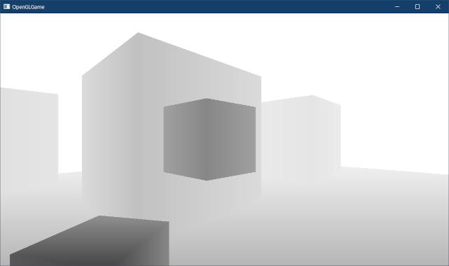
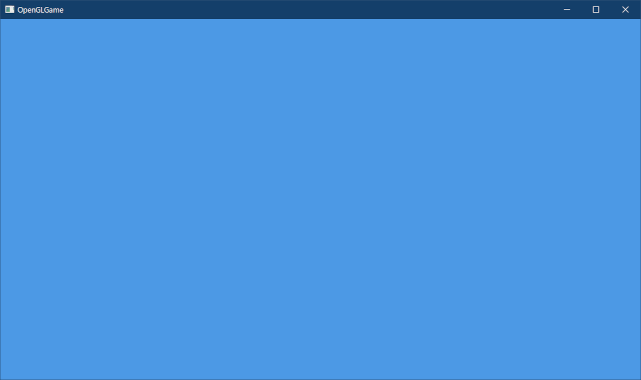
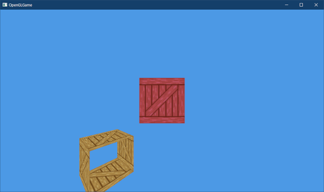

[OpenGL 3D 2023 第03回]

# 図形の操作と遠近法

## 習得目標

* 図形を平行移動・拡大縮小する方法を説明できる。
* 三角関数を使って図形を回転させる方法を説明できる。
* 3Dグラフィックスにおいて、様々な座標系を使い分ける必要性を説明できる。
* 遠近法、アスペクト比、視野角について説明できる。
* 「すべての警告に対応するべき理由」を説明できる。

## 1. 図形の大きさと位置を制御する

### 1.1 図形の大きさ(スケール)を変えられるようにする

一般的に、頂点データは一度作成したら二度と変更しません。そのため、なんの工夫もしないと、常に同じ位置に同じ図形が表示されます。しかし、ゲームでは図形の大きさや位置を自由に変更できないと困ります。

OpenGLで図形の大きさや位置を変更する方法は何種類もあり、時と場合によって適切な方法は異なります。一番簡単なのはユニフォーム変数を使うことです。そこで、拡大率を表すユニフォーム変数を追加して、図形の大きさを変更できるようにしましょう。

大きさは、X, Y, Zの3軸に対して個別に指定できると便利です。そこで、ユニフォーム変数の型は`vec3`とします。名前は`scale`(スケール、「規模、尺度」という意味)がいいでしょう。`standard.vert`を開き、プログラムを次のように変更してください。

```diff
 // シェーダからの出力
 layout(location=1) out vec2 outTexcoord; // テクスチャ座標
+
+// プログラムからの入力
+layout(location=0) uniform vec3 scale; // 拡大率

 void main()
 {
   outTexcoord = inTexcoord;
+  vec3 pos = inPosition * scale;
-  gl_Position = vec4(inPosition, 1);
+  gl_Position = vec4(pos, 1);
}
```

GLSLのベクトル型は、`float`型と同様に四則演算が可能です。演算結果は「各要素を個別に演算した値」です。例えば、`vec3`型の変数A, B, Cがあるとします。A, Bを乗算し結果をCに代入する式は、以下のように計算されます。

>```txt
>C = A * B
>→ C.x = A.x * B.x;
>   C.y = A.y * B.y;
>   C.z = A.z * B.z;
>```

これは乗算の例ですが、加算、減算、除算の場合も計算方法は同じです。

次に`Main.cpp`を開き、`GameObject`クラスの定義に次のプログラムを追加してください。

```diff
   class GameObject
   {
   public:
+    vec3 scale     = { 1, 1, 1 };    // 物体の拡大率
     float color[4] = { 1, 1, 1, 1 }; // 物体の色
   };
   GameObject box0;
+  box0.scale = { 0.1f, 0.1f, 0.1f };

   // メインループ
   while (!glfwWindowShouldClose(window)) {
```

続いて、物体のパラメータをユニフォーム変数にコピーするプログラムを、次のように変更してください。

```diff
     // ユニフォーム変数にデータをコピー
     glProgramUniform4fv(prog3D, 100, 1, box0.color);
+    glProgramUniform3fv(prog3D, 0, 1, &box0.scale.x);

     // 描画に使うテクスチャを指定
     glBindTextures(0, 1, &tex);
```

`glProgramUniform3fv`の第4引数の型は`const GLfloat*`です。しかし、`vec3`型は`float`ではないので、`color`変数のように直接アドレス指定することができません。そこで、先頭のメンバ変数のアドレスで代用します。

このように、座標と拡大率を乗算することで、図形全体を拡大縮小させることができます。プログラムが書けたらビルドして実行してください。図形が小さく表示されていたら成功です。

<p align="center">

</p>

<pre class="tnmai_assignment">
<strong>【課題01】</strong>
図形のX, Y, Z軸すべての大きさを0.2にしなさい。
</pre>

### 1.2 平行移動

次は、図形の位置を変えられるようにします。3次元ではX, Y, Zの3軸が必要なので`vec3`型を使うことにします。変数名は`position`(ポジション、「位置」という意味)とします。`standard.vert`を開き、プログラムを次のように変更してください。

```diff
 // プログラムからの入力
 layout(location=0) uniform vec3 scale; // 拡大率
+layout(location=1) uniform vec3 position; // 位置

 void main()
 {
   outTexcoord = inTexcoord;
-  vec3 pos = inPosition * scale;
+  vec3 pos = inPosition * scale + position;
   gl_Position = vec4(pos, 1);
}
```

計算の順序は必ず「スケール→平行移動」にします。「平行移動→スケール」だと、平行移動にもスケールが乗算されてしまうからです。

次に`Main.cpp`を開き、`GameObject`クラスの定義に次のプログラムを追加してください。

```diff
   class GameObject
   {
   public:
+    vec3 position  = { 0, 0, 0 };    // 物体の位置
     vec3 scale     = { 1, 1, 1 };    // 物体の拡大率
     float color[4] = { 1, 1, 1, 1 }; // 物体の色
   };
   GameObject box0;
   box0.scale = { 0.2f, 0.2f, 0.2f };
+  box0.position = { -0.6f, -0.6f, 0 };

   // メインループ
   while (!glfwWindowShouldClose(window)) {
```

物体のパラメータをユニフォーム変数にコピーするプログラムに、次のプログラムを追加してください。

```diff
     // ユニフォーム変数にデータをコピー
     glProgramUniform4fv(prog3D, 100, 1, color);
     glProgramUniform3fv(prog3D, 0, 1, &scale.x);
+    glProgramUniform3fv(prog3D, 1, 1, &position.x);

     // 描画に使うテクスチャを指定
     glBindTextures(0, 1, &tex);
```

プログラムが書けたらビルドして実行してください。図形が左端に表示されていたら成功です。

<p align="center">

</p>

<pre class="tnmai_assignment">
<strong>【課題02】</strong>
図形の座標をX=-0.6f, Y=-0.6fに変更しなさい。
</pre>

### 1.3 図形を複数表示する

図形を複数表示するには、新しい図形のための値をユニフォーム変数にコピーして、`glDrawElementsInstanced`関数を呼び出します。`box0`変数の定義の下に、次のプログラムを追加してください。

```diff
   GameObject box0;
   box0.scale = { 0.2f, 0.2f, 0.2f };
   box0.position = { -0.6f, -0.6f, 0 };
+
+  GameObject box1;
+  box1.color[1] = 0.5f; // 緑成分の明るさを半分にしてみる
+  box1.scale = { 0.2f, 0.2f, 0.2f };
+  box1.position = { 0, 0, 0 };

   // メインループ
   while (!glfwWindowShouldClose(window)) {
```

次に、`box0`を描画するプログラムの下に、次のプログラムを追加してください。

```diff
     glBindTextures(0, 1, &tex);

     // 図形を描画
     glDrawElementsInstanced(GL_TRIANGLES, 6, GL_UNSIGNED_SHORT, 0, 1);
+
+    // ふたつめの図形を描画
+    glProgramUniform4fv(prog3D, 100, 1, box1.color);
+    glProgramUniform3fv(prog3D, 0, 1, &box1.scale.x);
+    glProgramUniform3fv(prog3D, 1, 1, &box1.position.x);
+    glDrawElementsInstanced(GL_TRIANGLES, 6, GL_UNSIGNED_SHORT, 0, 1);

     glfwSwapBuffers(window);
     glfwPollEvents();
```

プログラムが書けたらビルドして実行してください。赤っぽい図形が増えていたら成功です。

<p align="center">

</p>

このように、ユニフォーム変数を使うことで、図形を描画する位置や大きさ、色などを自由に設定できます。

### 1.4 表示座標と座標変換

図形は表示されているものの、本当に3Dで表示されているのかは分かりません。そこで、図形をY軸回転してみることにします。図形の回転は、高校数学IIの三角関数の単元で登場する「点の回転」の式を使えば実現できます。

>```txt
>点P(x, y)を原点まわりにθ度回転させた点Q(x', y')を求める式
>x' = x * cosθ + y * -sinθ
>y' = x * sinθ + y * cosθ
>```

ただ、この式はXY平面上の回転です。3次元として捉えると、回転軸はZ軸になります。今回はY軸まわりの回転を行いたいので、回転軸はY軸、操作対象となる座標はXとZです。つまり以下の式になります。

>```txt
>x' = x * cosθ + z * -sinθ
>z' = x * sinθ + z * cosθ
>```

ただし、これは「Z軸の向きが奥に向かってプラスの場合」の式です。しかし、OpenGLのZ軸は「手前に向かってプラス」なので、それを考慮した式に変形しなくてはなりません。

OpenGLのように、手前に向かってプラスのものを「右手座標系(みぎてざひょうけい)」といいます。Z軸が奥に向かってプラスのものを「左手座標系(ひだりてざひょうけい)」といいます。

<p align="center">
<br>
[親指を右、人差し指を上に向けたとき、中指が指す方向が+Zになる]
</p>

>数学(幾何学)も右手座標系ですが、「Z軸の向きが上に向かってプラス」という違いがあります。

この2つの座標系の違いはZ軸の向きだけです。そこで、X座標に加算するZ成分と、Z座標に加算するX成分の符号を反転します。前の式の符号を反転したものが以下の式です。

>```txt
>x' = x * cosθ + z * sinθ
>z' = x * -sinθ + z * cosθ
>```

それでは、この式を頂点シェーダに追加しましょう。`standard.vert`を開き、プログラムを次のように変更してください。

```diff
 // プログラムからの入力
 layout(location=0) uniform vec3 scale;    // 拡大率
 layout(location=1) uniform vec3 position; // 位置
+layout(location=2) uniform vec2 sinCosY;  // Y軸回転

 void main()
 {
   outTexcoord = inTexcoord;

-  vec3 pos = inPosition * scale + position;
-  gl_Position = vec4(pos, 1);
+  // スケール
+  vec3 pos = inPosition * scale;
+
+  // Y軸回転
+  float sinY = sinCosY.x;
+  float cosY = sinCosY.y;
+  gl_Position.x = pos.x * cosY + pos.z * sinY;
+  gl_Position.y = pos.y;
+  gl_Position.z = pos.x * -sinY + pos.z * cosY;
+
+  // 平行移動
+  gl_Position.xyz += position;
+  gl_Position.w = 1;
 }
```

sinとcosをひとつの`vec2`型にまとめているのは、ユニフォーム変数を節約するためです。OpenGLの仕様では、ユニフォーム変数はステージごとに256個しか使えません。

計算順序を「スケール→Y軸回転→平行移動」としている点に注意してください。これ以外の順番だと、スケールが回転に影響されたり平行移動が回転に影響されたりして、図形の制御が難しくなります。

>**【プログラムを書くときは「読みやすさ」を優先しよう】**<br>
>`sinY`, `cosY`変数は、プログラムを読みやすくするために定義しています。
>このプログラムのように、GLSLのベクトル型は座標を表すだけでなく「複数の変数の入れ物」として使われることも多いです。そのため、最初のうちは理解しにくい部分があると思います。
>「複数の変数の入れ物」として使われている場合、プログラム中で単独の変数として定義し直すことで、プログラムが読みやすくなります。
>(実際のゲーム開発では`sinCosY.x`や`sinCosY.y`を直接使うことのほうが多いのですが、それは「ベクトル型の扱いに慣れている」からです)。

`gl_Position.xyz`という書き方は、GLSLの「スウィズリング(`swizzling`)」という機能です。ベクトル型のx, y, z, wの任意の要素を最大4つまで組み合わせて、その長さのベクトル型を作成できます。

例えば、`v3.zyx`のように要素の順番を入れ替えたり、`v2.xxyy`のように要素を複製することができます。例えば、上記の平行移動プログラムは以下の書き方と同じ意味です。

>```c++
>// スウィズリングを使わない場合
>gl_Position.x = position.x;
>gl_Position.y = position.y;
>gl_Position.z = position.z;
>```

このように、要素に分けて計算しても結果は同じです。しかし、スウィズリングを使うほうがプログラムが短くなり、理解しやすくなります。できるだけウィズリングを使って書くほうがよいでしょう。

次に`GameObject`クラスに回転角度を追加します。メンバ変数名は`rotation`(ローテーション、「回転」という意味)とします。`Main.cpp`を開き、`GameObject`クラスの定義に次のプログラムを追加してください。

```diff
     {
     public:
       vec3 position  = { 0, 0, 0 };    // 物体の位置
+      vec3 rotation  = { 0, 0, 0 };    // 物体の回転角度
       vec3 scale     = { 1, 1, 1 };    // 物体の拡大率
       float color[4] = { 1, 1, 1, 1 }; // 物体の色
```

次に、sinとcosを計算してユニフォーム変数にコピーするプログラムを追加します。ユニフォーム変数にデータをコピーするプログラムに、次のプログラムを追加してください。

```diff
     glProgramUniform4fv(prog3D, 100, 1, box0.color);
     glProgramUniform3fv(prog3D, 0, 1, &box0.scale.x);
     glProgramUniform3fv(prog3D, 1, 1, &box0.position.x);
+    glProgramUniform2f(prog3D, 2, sin(box0.rotation.y), cos(box0.rotation.y));

     // 描画に使うテクスチャを指定
     glBindTextures(0, 1, &tex);
```

今回はY軸回転しか使いませんが、今後の拡張を考慮してX, Y, Zの3軸の回転を持たせています。`sin`と`cos`はC言語のライブラリ関数で、`math.h`に定義されています。

C言語の三角関数では、円周を0～360度で表す「度数法(どすうほう)」ではなく、0～2πで表す「弧度法(こどほう)」を使います。度数法から弧度法への変換は以下の式で行います。

&emsp;`弧度法の値 = 度数法の値 / 180 * π`

最後に回転角度を更新するプログラムを追加します。メインループの先頭に次のプログラムを追加してください。

```diff
   // メインループ
   while (!glfwWindowShouldClose(window)) {
+    // box0を回転
+    box0.rotation.y += 0.0001f;
+
     // バックバッファをクリア
     glClearColor(0.3f, 0.6f, 0.9f, 1.0f);
```

プログラムが書けたらビルドして実行してください。図形が横に伸び縮みしていたら成功です。

### 1.5 box1の回転を設定する

ところで、回転を更新しているのは`box0`だけのはずです。しかし、画面では`box1`のほうも回転しています。なぜなのでしょう？

答えは、「`box1`の回転データをユニフォーム変数にコピーしていないから」です。一般的な感覚では、変数ニアコピーしていないなら回転しなさそうですが、ユニフォーム変数は違います。

ユニフォーム変数変数は、あたかもプログラムオブジェクトのメンバ変数であるかのように機能します。そのため、一度コピーした値は、次に上書きコピーするまで変更されません。

つまり、「`box0`のためにコピーした値がそのまま`box1`でも使われた」ために、2つの図形が回転してしまったのです。この問題を修正するには、`box1`の回転をユニフォーム変数にコピーします。

`box1`を描画するプログラムに次のプログラムを追加してください。

```diff
     glProgramUniform4fv(prog3D, 100, 1, box1.color);
     glProgramUniform3fv(prog3D, 0, 1, &box1.scale.x);
     glProgramUniform3fv(prog3D, 1, 1, &box1.position.x);
+    glProgramUniform2f(prog3D, 2, sin(box1.rotation.y), cos(box1.rotation.y));
     glDrawElementsInstanced(GL_TRIANGLES, 6, GL_UNSIGNED_SHORT, 0, 1);

     glfwSwapBuffers(window);
```

プログラムが書けたらビルドして実行してください。`box0`だけが回転していたら成功です。

<p align="center">

</p>

### 1.6 遠近法を有効にする

Y軸回転をしているはずですが、見たところは図形が横に拡大縮小しているだけで、回転しているようには見えません。これは、遠近法が有効になっていないためです。

遠近法を有効にするには、以下の2つの処理を追加します。

>1. Z軸の値を0より小さくする。
>2. Z軸の値を符号反転して`gl_Position.w`に代入。

GPUは、グラフィックス・パイプラインの「ラスタライゼーション(RS)」ステージにおいて以下の計算を行います。

`gl_Position /= gl_Position.w`

GPUはこの計算によって、画面に表示される図形の大きさを制御しています。頂点シェーダで`gl_Position.w`に`1`を代入していたのは、この計算の影響を避けるためです。

W要素にZ軸の値を代入すると、「Z軸の値が大きい(距離が遠い)ほど`gl_Position.xy`の値が小さくなる」という効果になります。これが、コンピューター・グラフィックスにおける遠近法の仕組みです。

また、「Z軸の値が`0`以上だと何も表示されない」ことに注意してください。GPUは`0`以上のZ座標を「視点の後ろ側にある」と判断します。そして、視点の後ろは見えないので描画されません。

Z軸の値を`0`未満にする方法はいくつか考えられます。一般的には「図形の座標を変える」または「視点の座標を変える」の、どちらかの方法を使います。

「図形の座標を変える」方法は作成済みなので、こちらを使うことにします。`Main.cpp`を開き、`position`の値を次のように変更してください。

```diff
   GameObject box0;
   box0.scale = { 0.2f, 0.2f, 0.2f };
-  box0.position = { -0.6f, -0.6f, 0 };
+  box0.position = { -0.6f, -0.6f, -1 };

   GameObject box1;
   box1.color[1] = 0.5f; // 緑成分の明るさを半分にしてみる
```

次に、2の「Z軸の値を符号反転して`gl_Position.w`に代入」を追加します。これはシェーダでやることなので、`standard.vert`を開いてください。そして、`gl_Position.w`を設定するプログラムの下に次のプログラムを追加してください。

```diff
   gl_Position.z = pos.x * -sinY + pos.z * cosY;
   gl_Position.xyz += position;
-  gl_Position.w = 1;
+
+  // 遠近法を有効にする
+  gl_Position.zw = -gl_Position.zz;
 }
```

OpenGLは「右手座標系」なので「遠くの物体ほどZの値が小さくなる」仕組みになっています。ところが、GPUは伝統的に「左手座標系」を採用しています。そのため、「遠くの物体ほどZの値が大きくなる」ようにZの符号を反転する必要があります。

プログラムが書けたらビルドして実行してください。図形の回転に奥行きを感じられたら成功です。

<p align="center">

</p>

<pre class="tnmai_assignment">
<strong>【課題03】</strong>
<code>box1</code>が画面に表示されるように、Z軸の値(Z座標)を変更しなさい。OpenGLで図形を表示するルールは以下のとおりです。
- Z軸の値を0より小さくする。
- Z軸の値が小さい(図形が遠くにある)ほど、図形が小さく表示される。
</pre>

>**【GPUが左手座標系を採用している理由】**<br>
>それは「符号ビットのない符号なし整数のほうが、デジタル回路に必要なトランジスタが少なくて済む」からです。PC用GPUの黎明期は使用できるトランジスタ数が少なかったため、可能な限りトランジスタを効率的に利用しなくてはなりませんでした。<br>
>それに対して、映画制作などで使われるグラフィックス専用機(「グラフィックス・ワークステーション」と呼ばれていました)は非常に高価で(数百万～数億円)、PC用GPUと比べるとトランジスタ数にはかなりの余裕がありました。OpenGLはこれらのグラフィックス・ワークステーション向けに開発されたため、負数を扱うことによるトランジスタ数の増加は問題視されなかったのです。<br>
>その後、PC用GPUが高性能化すると、PC用GPUもOpenGLに対応しはじめました。その結果、異なる座標系が混在することになり、OpenGLとGPUの境界で座標系を変換する必要が生じたのです。

### 1.7 アスペクト比

図形のサイズは2x2なのに、画面では横長で表示されています。これは、グラフィックス・パイプラインの初期設定では、-1～+1の範囲で座標を指定し、実際の画面サイズを無視するようになっているからです。

この「-1～+1の範囲の座標」のことを「正規化デバイス座標系」または「NDC(エヌ・ディー・シー)座標系」といいます。GPUは、この「NDC座標系」を処理するように作られています。

これまでに作成した「図形の拡大縮小・回転・平行移動」は、NDC座標系ではなく「標準的な座標を扱う空間」での操作です。この「標準的な座標を扱う空間」のことを「ワールド座標系」または「ワールド空間」といいます。

CPUは主に「ワールド座標系」を扱います。思い通りに図形を描画するには、CPUが扱うワールド座標系の値を、GPUが扱うNDC座標系の値に変換しなくてはなりません。

>**【絵画は座標系を変換している】**<br>
>視点の100cm先に160x90cmの枠を置き。この枠内に見える図形を画用紙に描き写すとします。このとき、「枠の端からの距離」を参考にして図形を描き写すでしょう。この「枠の端からの距離」がNDC座標系の値だと考えてください(正確には「枠の中心からの比率」)。「風景という3Dを画用紙という2Dに描き写す」という行為をコンピューター・グラフィックスの用語に置き換えると、「ワールド座標系という3DをNDC座標系という2Dに変換する」となるわけです。<br>
>(実際の描画はもう少し複雑で、「クリップ座標系→NDC座標系→スクリーン座標系」という変換が行われます)。

ただし、遠近法を利用している場合は、NDC座標系ではなく、よく似た「クリップ座標系」に変換します。「クリップ座標系」は「ワールド座標系とNDC座標系の中間の座標系」です。クリップ座標系からNDC座標系への変換はGPUが自動的に行います。

ワールド座標系からクリップ座標系に変換する処理は「頂点シェーダ」で行います。やることは以下の2つです。

>1. アスペクト比を利用して縦横の比率を1:1にする。
>2. `gl_Position.w`に`-gl_Position.z`を設定し、遠近法を有効にする。

2はすでに実装していますので、あとは1の「縦横の比率を1:1にする」処理を追加するだけです。

描画ウィンドウは1280x720で作っているので、アスペクト比は16:9です。これを1:1に変換するとクリップ座標系の値になります。ウィンドウのサイズは今後変更するかもしれないので、アスペクト比を定数にするのは避けたいです。

そこで、ユニフォーム変数として定義します。変数名は`aspectRatio`(アスペクト・レシオ、レシオは「比率」という意味)とします。`standard.vert`を開き、次のプログラムを追加してください。

```diff
 layout(location=0) uniform vec3 scale;    // 拡大率
 layout(location=1) uniform vec3 position; // 位置
 layout(location=2) uniform vec2 sinCosY;  // Y軸回転
+layout(location=3) uniform float aspectRatio; // アスペクト比
 
 void main()
 {
```

縦横比(アスペクト比)は「画面の縦の長さに対する横の長さの比率」のことです。横方向、つまりX座標をアスペクト比で割ると、縦横の長さが一致して比率が1:1になります。`gl_Position`を計算するプログラムに、次のプログラムを追加してください。

```diff
   gl_Position.y = pos.y;
   gl_Position.z = pos.x * -sinY + pos.z * cosY;
   gl_Position.xyz += position;
+
+  // ワールド座標系からクリップ座標系に変換
+  gl_Position.x /= aspectRatio;

   // 遠近法を有効にする
   gl_Position.zw = -gl_Position.zz;
```

次に、C++プログラム側で「アスペクト比」を計算します。描画に使うシェーダを設定するプログラムの下に、次のプログラムを追加してください。

```diff
     // 描画に使うシェーダを指定
     glUseProgram(prog3D);
+
+    // フレームバッファの大きさを取得
+    int fbWidth, fbHeight;
+    glfwGetFramebufferSize(window, &fbWidth, &fbHeight);
+
+    // アスペクト比を設定
+    const float aspectRatio = float(fbWidth) / float(fbHeight);
+    glProgramUniform1f(prog3D, 3, aspectRatio);

     // ユニフォーム変数にデータをコピー
     glProgramUniform4fv(prog3D, 100, 1, box0.color);
```

アスペクト比を計算するには、描画ウィンドウのサイズが分からなくてはなりません。描画ウィンドウを管理しているのはGLFWライブラリなので、GLFWライブラリの関数を使います。

<p><code class="tnmai_code"><strong>【書式】</strong><br>
void glfwGetFramebufferSize(GLFWウィンドウオブジェクトのアドレス,<br>
&emsp;描画ウィンドウの幅を格納する変数のアドレス,<br>
&emsp;描画ウィンドウの高さを格納する変数のアドレス);
</code></p>

`glfwGetFramebufferSize`(ジーエルエフダブリュー・ゲット・フレームバッファ・サイズ)関数を使うと、描画ウインドウのサイズを取得できます。

幅と高さを受け取る変数名は`fbWidth`(エフビー・ウィス、ウィスは「幅」という意味)と、`fbHeight`(エフビー・ハイト、ハイトは「高さ」という意味)としました。なお、`fb`は`framebuffer`の短縮形です。

また、幅と高さは`int`型で取得しますが、アスペクト比は浮動小数点数で計算する必要があることに注意してください。プログラムが書けたらビルドして実行してください。図形が以前よりも正方形ぽく見えていたら成功です。

<p align="center">

</p>

### 1.8 ビューポート

毎回アスペクト比を設定するようにしたことで、縦横の比率が正しく表示されるようになりました。ところで、ちょっと描画ウィンドウの端をドラッグして、ウィンドウのサイズをいろいろと変えてみてください。

せっかく正しくしたと思った図形の縦横比が、簡単に狂ってしまいましたね。縦横比が狂う原因は「ウィンドウサイズが変更されたことをOpenGL側に知らせていない」からです。

描画ウィンドウのサイズをOpenGLに知らせるには、`glViewport`(ジーエル・ビューポート)関数を使います。

<p><code class="tnmai_code"><strong>【書式】</strong><br>
void glViewport(描画範囲の左下Xの座標, 描画範囲の左下のY座標,<br>
&emsp;描画範囲の幅, 描画範囲の高さ);
</code></p>

実際にOpenGLに伝えるのは、描画ウィンドウのサイズではなく「描画する範囲」の情報です。この「描画する範囲」のことを「ビューポート」といいます。OpenGLはビューポートの情報を利用して、NDC座標系の値から実際のピクセル座標を計算します。

ほとんどの場合「描画ウィンドウのサイズ = 描画する範囲」ですが、上下または左右に違う映像を表示したい場合など、意図的に描画ウィンドウのサイズとは異なるビューポートをすることがあります。

それでは、ビューポートを指定しましょう。`Main.cpp`を開き、フレームバッファの大きさを取得するプログラムの下に、次のプログラムを追加してください。

```diff
     // フレームバッファの大きさを取得
     int fbWidth, fbHeight;
     glfwGetFramebufferSize(window, &fbWidth, &fbHeight);
+
+    // ビューポートを設定
+    glViewport(0, 0, fbWidth, fbHeight);

     // アスペクト比を設定
     const float aspectRatio = float(fbWidth) / float(fbHeight);
```

プログラムが書けたらビルドして実行してください。ウィンドウのサイズを変えても、図形の縦横比が維持されていたら成功です。

<p align="center">

</p>

また、ビューポートを指定する前は、ウィンドウを大きくしても図形が常に左下に表示されていたと思います。これは、ビューポートを更新しなかったために、描画範囲が左下に固定されていたからです。しかし、この問題も解決しているはずです。

>**【1章のまとめ】**
>
>* 図形を拡大縮小するには、座標に拡大率を乗算する。
>* 図形を平行移動するには、座標に平行移動させる距離を加算する。
>* 図形を回転させるにはcosとsinを使う。
>* 三角関数で図形を回転させるときは、軸の種類と符号に注意する。
>* GPUはXYZをWで除算することで遠近法を実現している。遠近法を有効にするにはZ座標の値をWに代入する。
>* GPUは画面のアスペクト比を考慮しない。プログラマがアスペクト比を考慮するシェーダを書く必要がある。
>* ウィンドウのサイズが変化したときは、ビューポートを再設定しなくてはならない。

<div style="page-break-after: always"></div>

## 2. 座標系とカメラ

### 2.1 さまざまな座標系の紹介

1章では正しく図形を表示するために、ワールド座標系、NDC座標系、クリップ座標系という、3つの「座標系(ざひょうけい)」が登場しました。

コンピューター・グラフィックスでは、用途に応じてさまざまな座標系を使い分けます。「座標系」とは「座標を定めるためのルール」です。このルールには「原点の位置」「距離の単位」「軸の数と方向」などが含まれます。

以下の図は、コンピューター・グラフィックスで使われる一般的な座標系とその関係を表しています。それぞれの座標系が、異なる原点と軸を持っていることに注目してください。

<p align="center">


<br>
[ローカル座標系]&emsp;&emsp;&emsp;&emsp;
[ワールド座標系]&emsp;&emsp;&emsp;&emsp;&emsp;
[ビュー座標系]&emsp;&emsp;&emsp;<br>
<br>


<br>
[クリップ座標系]&emsp;&emsp;&emsp;&emsp;
[正規化デバイス座標系]&emsp;&emsp;&emsp;
[スクリーン座標系]
</p>

* **ローカル座標系**<br>
3Dモデルを定義する座標系です。モデル座標系、オブジェクト座標系とも呼ばれます。一般的に、頂点シェーダの入力はこの座標系になります。原点は、3Dモデルの中心か足元とされることが多いです。2Dゲームの場合、回転、拡大縮小を行ったり、ゲームオブジェクトに複数の画像を貼り付けたりするときに登場します。それらを行わない場合は登場しません。

* **ワールド座標系**<br>
3Dモデル同士の位置関係を定義する座標系です。原点はシーンの中心とされることが多いです。ローカル座標系からワールド座標系への変換は「モデル変換」または「ワールド変換」と呼ばれます。2Dゲームと3Dゲームの両方にとって、もっとも重要な座標系になります。

* **ビュー座標系**<br>
視点を基準とする座標系です。カメラ座標系、視点(Eye)座標系とも呼ばれます。原点は視点の座標になります。ワールド座標系からビュー座標系への変換は「ビュー変換」と呼ばれます。多くの2Dゲームでは、カメラの位置と向きが固定されていることから、ビュー座標系を飛ばして直接クリップ座標系へと変換するほうが効率的です。そのため、表に見えることは少ないです。

* **クリップ座標系**<br>
クリッピングという、画面に映らない部分を除去する処理のための座標系です。頂点シェーダ(テッセレータやジオメトリシェーダも使う場合、それらの中で最後に実行されるシェーダ)から出力される座標は、この座標系で定義されていなければなりません。ビュー座標系からクリップ座標系への変換は「プロジェクション変換」と呼ばれます。GPUが直接扱えるのはこの座標系だけなので、2Dでも3Dでも意識せざるを得ません。

* **正規化デバイス(NDC)座標系**<br>
クリップ座標系のX,Y,Z要素をW要素で除算した座標系です。この変換はクリッピングの直後に行われ、PAへの入力になります。英語の頭文字(Normalized Device Coordinates)から、NDC座標系とも呼ばれます。<br>
頂点座標を正規化デバイス座標系に変換したとき、XYZのいずれかの要素が1より大きいか、または-1より小さい場合は描画がスキップされます。画面外の頂点を描画するのは無駄だからです。クリップ座標系から正規化デバイス座標系への変換は`GPU`が自動的に行います。そのため、この変換には特に名前はありません。<br>
2Dゲームの場合、クリップ座標系の`w`要素は常に`1`です。座標を`1`で除算しても結果は変わらないため、正規化デバイス座標系を意識することはありません。

* **スクリーン座標系**<br>
フレームバッファ上の座標系です。ウィンドウ座標系とも呼ばれます。OpenGLでは左下が原点です。ここまでの座標系は3D座標(2Dは3Dの特殊ケース)を扱いましたが、スクリーン座標系は2Dの座標系になります。3Dの正規化デバイス座標系から2Dスクリーン座標系への変換は`GPU`が自動的に行います。そのため、この変換には特に名前はありません。

このように多くの座標系を扱わなくてはならない理由は、それぞれの座標系ごとに、得意な座標の操作、苦手な座標の操作が存在するためです。例えば、物体の向きや大きさを変更するにはローカル座標系が適しています。

一方で、カメラから見た景色を扱うにはビュー座標系が、「画面外」を判定するにはクリップ座標系が適しています。

### 2.2 カメラオブジェクトを作成する

ある座標系で定義された座標を、別の座標系で表される座標に変換する操作を「座標変換」といいます。

1章では、ワールド座標系からクリップ座標系への変換を行いました。実は、ローカル座標系からワールド座標系への変換も既に行っています。それは、図形の位置や回転、拡大縮小を行う処理です。

そして、クリップ座標系から先はGPUが自動的に行うので、プログラマはパラメータを設定するだけです。すると、上図の中で使っていないのは「ビュー座標系」だけ、ということになります。

3Dゲームにおいて、ビュー座標系は「カメラや視点から見た風景」を作り出す役割を持ちます。カメラは空間内を自由に移動でき、さらに自由に向きを変えられます。

ビュー座標系への変換を言い換えると、「元の座標を、カメラを原点とした座標に変換する」ことです。

例として、あなたが暮らしている部屋を考えます。この部屋の南東の隅を原点とします。このとき、部屋の入口の位置は、原点からの距離で説明することができます(「東に1m、北に2m」など)。これが「ワールド座標」に当たります。

それから、あなたが部屋の中心にいるとします。あなたから見た部屋の入口は「左に2m、前に3m」のように説明できるでしょう。これが「ビュー座標」です。数値が変わってはいますが、入口が移動したわけではありませんね。

ベッド、本棚、机、窓など、部屋の中にあるどんなものでも、2つの座標で位置を説明できます。しかし、引越し業者に物を配置してもらうときは、業者の位置からではなく、原点からの距離で説明したほうがやりやすいでしょう。

ところが、部屋に友達が遊びに来たとき、友達に本棚の位置を教える場合は「友達から見た方向や距離」で説明するはずです。「本棚は部屋の南東隅から東に4m、北に3mにあるよ」なんて言いませんよね。

ワールド座標系からビュー座標系への変換は、図形の移動、回転とほぼ同じ方法で行います。ただし、動かすのは「カメラ以外の物体」で、カメラ自体は動かしません。これは、回転方向と移動方向を逆にすることで実現できます。

`standard.vert`を開き、次のプログラムを追加してください。

```diff
 layout(location=2) uniform vec2 sinCosY;  // Y軸回転
 layout(location=3) uniform float aspectRatio; // アスペクト比
+layout(location=4) uniform vec3 cameraPosition; // カメラの位置
+layout(location=5) uniform vec2 cameraSinCosY;  // カメラのY軸回転

 void main()
 {
   outTexcoord = inTexcoord;

+  // ローカル座標系からワールド座標系に変換
   vec3 pos = inPosition * scale;
   float sinY = sinCosY.x;
   float cosY = sinCosY.y;
   gl_Position.x = pos.x * cosY + pos.z * sinY;
   gl_Position.y = pos.y;
   gl_Position.z = pos.x * -sinY + pos.z * cosY;
   gl_Position.xyz += position;
+
+  // ワールド座標系からビュー座標系に変換
+  float cameraSinY = cameraSinCosY.x;
+  float cameraCosY = cameraSinCosY.y;
+  pos = gl_Position.xyz - cameraPosition;
+  gl_Position.x = pos.x * cameraCosY + pos.z * cameraSinY;
+  gl_Position.y = pos.y;
+  gl_Position.z = pos.x * -cameraSinY + pos.z * cameraCosY;

-  // ワールド座標系からクリップ座標系に変換
+  // ビュー座標系からクリップ座標系に変換
   gl_Position.x /= aspectRatio;
```

回転と平行移動の順序が逆になっている点と、`cameraPosition`を足すのではなく引いている点に注目してください。これは、図形をカメラからの相対座標に移動させてから、カメラの回転を反映するためです。

カメラ自体は、ゲームオブジェクトの一種として扱うのが簡単です。そこで、カメラを表すゲームオブジェクトを追加します。`Main.cpp`を開き、`GameObject`クラスの定義の下に、次のプログラムを追加してください。

```diff
     vec3 scale     = { 1, 1, 1 };    // 物体の拡大率
     float color[4] = { 1, 1, 1, 1 }; // 物体の色
   };
+
+  // カメラオブジェクト
+  GameObject camera;

   GameObject box0;
   box0.scale = { 0.2f, 0.2f, 0.2f };
```

次にカメラのパラメータをユニフォーム変数にコピーします。アスペクト比を設定するプログラムの下に、次のプログラムを追加してください。

```diff
     // アスペクト比を設定
     const float aspectRatio = float(fbWidth) / float(fbHeight);
     glProgramUniform1f(prog3D, 3, aspectRatio);
+
+    // カメラパラメータを設定
+    glProgramUniform3fv(prog3D, 4, 1, &camera.position.x);
+    glProgramUniform2f(prog3D, 5, sin(-camera.rotation.y), cos(-camera.rotation.y));

     // ユニフォーム変数にデータをコピー
     glProgramUniform4fv(prog3D, 100, 1, box0.color);
```

ここでは、「sinとcosを計算するときに符号を反転している」点に注目してください。実際に試してほしいのですが、みなさんが顔を右に向けると、周囲の物体は左に回転するように見えるはずです。

つまり、カメラの回転を反映するには、逆方向に回転させる必要があるのです。

さて、カメラの位置や回転を変更しないと本当にビュー座標系へ変換できているのか分かりません。そこで、キー入力によってカメラを動かせるようにしましょう。キー入力の判定には`glfwGetKey`(ジーエルエフダブリュー・ゲット・キー)関数を使います。

<p><code class="tnmai_code"><strong>【書式】</strong><br>
int glfwGetKey(GLFWウィンドウオブジェクトのアドレス, キー番号);
</code></p>

キー番号には、`glfw3.h`ヘッダに定義されている`GLFW_KEY_????`というマクロ定数を指定します。

この関数は、「キー番号」で指定したキーが押されている場合は`GLFW_PRESS`(ジーエルエフダブリュー・プレス)、押されていない場合は`GLFW_RELEASE`(ジーエルエフダブリュー・リリース)を返します。

| 定数 | 意味 |
|:----:|:-----|
| <ruby>GLFW_RELEASE<rt>ジーエルエフダブリュー・リリース</rt></ruby> | キーは押されていない |
| <ruby>GLFW_PRESS<rt>ジーエルエフダブリュー・プレス</rt></ruby> | キーが押されている |

box0を回転させるプログラムの下に、次のプログラムを追加してください。

```diff
   while (!glfwWindowShouldClose(window)) {
     // box0を回転
     box0.rotation.y += 0.0001f;
+
+    // カメラのX軸移動
+    if (glfwGetKey(window, GLFW_KEY_A) == GLFW_PRESS) {
+      camera.position.x -= 0.0005f;
+    }
+    if (glfwGetKey(window, GLFW_KEY_D) == GLFW_PRESS) {
+      camera.position.x += 0.0005f;
+    }
+
+    // カメラのY軸回転
+    if (glfwGetKey(window, GLFW_KEY_E) == GLFW_PRESS) {
+      camera.rotation.y -= 0.0005f;
+    }
+    if (glfwGetKey(window, GLFW_KEY_Q) == GLFW_PRESS) {
+      camera.rotation.y += 0.0005f;
+    }

     // バックバッファをクリア
     glClearColor(0.3f, 0.6f, 0.9f, 1.0f);
```

プログラムが書けたらビルドして実行してください。A, DキーでカメラをX軸方向に移動、EQキーでY軸回転できます。

<pre class="tnmai_assignment">
<strong>【課題04】</strong>
カメラのX軸移動の下に、カメラのZ軸移動を行うプログラムを追加しなさい。<code>W</code>キーで前方(-Z方向)、<code>S</code>キーで後方(+Z方向)に移動させること。
</pre>

### 2.3 立方体を定義する

視点を動かせるようになると、ただの板切れでは3D空間らしさが分かりにくいことに気が付きます。そこで、板切れを「立体的な箱」にパージョンアップしましょう。作成する箱の頂点座標を以下に示します。

<p align="center">

</p>

まず現在の板切れは、箱の手前の面にします。これは、Z座標を0から1に変更するだけです。`Main.cpp`を開き、`vertexData`配列を次のように変更してください。

```diff
     vec2 texcoord; // テクスチャ座標
   };
   const Vertex vertexData[] = {
+    // +Z(手前の面)
-    { {-1,-1, 0 }, { 0, 0 } },
-    { { 1,-1, 0 }, { 1, 0 } },
-    { { 1, 1, 0 }, { 1, 1 } },
-    { {-1, 1, 0 }, { 0, 1 } },
+    { {-1,-1, 1 }, { 0, 0 } },
+    { { 1,-1, 1 }, { 1, 0 } },
+    { { 1, 1, 1 }, { 1, 1 } },
+    { {-1, 1, 1 }, { 0, 1 } },
   };
   GLuint vbo = 0; // 頂点バッファの管理番号
```

次に奥側の面を追加します。`vertexData`配列に次のプログラムを追加してください。X座標の符号に注意してください。

```diff
     { { 1,-1, 1 }, { 1, 0 } },
     { { 1, 1, 1 }, { 1, 1 } },
     { {-1, 1, 1 }, { 0, 1 } },
+
+    // -Z(奥の面)
+    { { 1,-1,-1 }, { 0, 0 } },
+    { {-1,-1,-1 }, { 1, 0 } },
+    { {-1, 1,-1 }, { 1, 1 } },
+    { { 1, 1,-1 }, { 0, 1 } },
   };
   GLuint vbo = 0; // 頂点バッファの管理番号
```

頂点数を増やしたので、インデックスデータも増やさなくてはなりません。頂点とインデックスの関係は、以下の図を参考にしてください。下図では、矢印の順序で頂点を定義することを想定しています。

<p align="center">

</p>

それでは、`indexData`配列を次のように変更してください。

```diff
   // インデックスデータをGPUメモリにコピー
   const GLushort indexData[] = {
     0, 1, 2, 2, 3, 0,
+    4, 5, 6, 6, 7, 4,
   };
   GLuint ibo = 0; // インデックスバッファの管理番号
```

増やしたインデックスデータを描画するには、`glDrawElementsInstanced`関数に渡すインデックス数を変更する必要があります。図形の面を増やすたびに変更するのは面倒なので、`std::size`関数を使うことにします。

図形を描画するプログラムを次のように変更してください。

```diff
     // 描画に使うテクスチャを指定
     glBindTextures(0, 1, &tex);

     // 図形を描画
+    const GLsizei indexCount = std::size(indexData);
-    glDrawElementsInstanced(GL_TRIANGLES, 6, GL_UNSIGNED_SHORT, 0, 1);
+    glDrawElementsInstanced(GL_TRIANGLES, indexCount, GL_UNSIGNED_SHORT, 0, 1);

     // ふたつめの図形を描画
     glProgramUniform4fv(prog3D, 100, 1, box1.color);
     glProgramUniform3fv(prog3D, 0, 1, &box1.scale.x);
     glProgramUniform3fv(prog3D, 1, 1, &box1.position.x);
     glProgramUniform2f(prog3D, 2, sin(box1.rotation.y), cos(box1.rotation.y));
-    glDrawElementsInstanced(GL_TRIANGLES, 6, GL_UNSIGNED_SHORT, 0, 1);
+    glDrawElementsInstanced(GL_TRIANGLES, indexCount, GL_UNSIGNED_SHORT, 0, 1);

     glfwSwapBuffers(window);
     glfwPollEvents();
```

<p><code class="tnmai_code"><strong>【書式】</strong><br>
size_t std::size(サイズを求めたい配列);
</code></p>

C++標準ライブラリの`size`(サイズ)関数は、指定した配列や`vector`型の要素数を返します。目的に応じて、バイト数を返す`sizeof`と使い分けてください。

プログラムが書けたらビルドして実行してください。図形が2枚の平面として表示されていたら成功です。

<p align="center">

</p>

### 2.4 深度テスト

2枚の平面が表示されてはいますが、奥にあるはずの平面が、手前の平面より前に見えることがあります。この原因は、GPUがピクセルを「描いた順番で上書き」するためです。OpenGLの初期設定では、空間における前後関係は一切考慮されません。

OpenGLで前後関係を考慮させるには「深度テスト」を有効にする必要があります。
カメラパラメータを設定するプログラムの下に、次のプログラムを追加してください。

```diff
     // カメラパラメータを設定
     glProgramUniform3fv(prog3D, 4, 1, &camera.position.x);
     glProgramUniform2f(prog3D, 5, sin(-camera.rotation.y), cos(-camera.rotation.y));
+
+    // 深度テストを有効化
+    glEnable(GL_DEPTH_TEST);
 
     // ユニフォーム変数にデータをコピー
     glProgramUniform4fv(prog3D, 100, 1, box0.color);
```

`glEnable`(ジーエル・イネーブル)関数は、指定されたOpenGLコンテキストの機能を有効にします。

<p><code class="tnmai_code"><strong>【書式】</strong><br>
void glEnable(有効にする機能を表すマクロ定数);
</code></p>

深度テストを示すマクロ定数は`GL_DEPTH_TEST`(ジーエル・デプス・テスト)という名前なので、上記のプログラムではこれを指定しています。

#### - 深度テストと深度バッファ -

<p align="center">
 <br>
[左=カラーバッファ 右=深度バッファ]
</p>

ピクセルの深度値(奥行き方向の位置をあらわす値)は、自動的に「深度バッファ」に書き込まれます。深度バッファの縦横サイズはカラーバッファと同じで、画面に表示される各ピクセルの深度値が記録されます。

深度テストを有効にすると、以前の描画で書き込まれた深度バッファの値と、これから書き込もうとするピクセルの深度値が比較されるようになります。

比較の結果、「これから書き込もうとするピクセルの深度値」のほうが手前にあると判断された場合のみ、ピクセルが書き込まれます。その結果、ピクセル単位の前後関係が正しく処理されるという仕組みです。

プログラムが書けたらビルドして実行してください。・・・何も表示されませんね？

<p align="center">

</p>

### 2.5 深度値の計算方法を改善する

実は、深度テストを有効にしただけでは意図した描画結果になりません。遠近法を有効にするために、頂点シェーダには以下の式を追加しました。

```c++
gl_Position.zw = -gl_Position.zz;
```

深度バッファには、この計算を行った後の深度値(Z値)が記録されます。

見てのとおり、`gl_Position.z`と`gl_Position.w`の両方に`-gl_Position.z`を設定しています。当然ですが、`gl_Position.z / gl_Position.z`の結果は常に`1`になります(`z`がゼロの場合を除く)。

深度テストは「深度バッファの値と、描画するピクセルの深度値を比較する」ことで行われるため、深度値の計算結果が常に同じ値になると比較する意味がなくなってしまいます。

そこで、計算結果が深度値によって異なるように、`gl_Position.z`に設定する値を調整します。この方法では、次の2つの段階を踏んで深度値を補正します。

>1. 「奥行き(Z軸)方向の描画範囲」を決める。手前側の境界を`near`(ニア)、奥側の境界を`far`(ファー)とする。
>2. 計算結果について、深度値が`near`と等しい場合に`-1`、`far`と等しい場合に`1`となるような計算式を求める。

1の「奥行方向の描画範囲」は、例えば`near=1m`、`far=1000m`のように設定します。

>深度バッファの最適な範囲はゲーム内容によって異なります。手前側をできるだけ遠くに設定するのが定石です。そうすることで、深度バッファのビット数を効率的に利用できます。

OpenGLの深度バッファは最小値(手前)が`-1`、最大値(奥)が`+1`となります。そこで、深度値が`near`のとき`-1`、`far`のとき`+1`となるような計算式を求めます。

これは、定数`A`と`B`があるとして、次の条件を満たす式を求めるということです。

`-1 <= (A * 深度値 + B) <= +1`

しかし、実際には深度値ではなく、`gl_Position.w`で除算したものが計算結果になります。
`w`は深度値そのものなので、正しい式は次のようになります。

`-1 <= (A / 深度値 + B) <= +1`

そして、深度値が`near`のとき`-1`、`far`のとき`+1`になるのですから、

`A / near + B = -1` ...①<br>
`A / far + B = 1` ...②

を満たす`A`と`B`を求めればよいことになります。まず`A`を求めるために`B`を消去します。これは②-①とすれば求められます。

>```c++
>(A / far + B) - (A / near + B) = 2
>
>Bを消し、Aを共通因数としてくくり出す
>A * (1 / far - 1 / near) = 2
>
>両辺を(1 / far - 1 / near)で割る
>A = 2 / (1 / far - 1 / near)
>
>1/farと1/nearを通分
>A = 2 / ((near / far * near) - far / near * far))
>
>整理する
>A = 2 / ((near - far) / (far * near))
>A = 2 * far * near / (near - far)
>```

そして、`B`を求めるには①(または②)に`A`を代入します。

>```c++
>(2 * far * near / (near - far)) / near + B = -1
>
>整理する
>(2 * far / (near -far)) + B = -1
>
>両辺から(2 * far / (near - far))を引く
>B = -1 - (2 * far / (near - far))
>
>-1を通分
>B = (-(near - far) - 2 * far) / (near - far)
>B = (-far - near) / (near - far)
>
>右辺の分子分母に-1を掛けて整理する
>B = -(-far - near) / -(near - far)
>B = (far + near) / (far - near)
>```

最後に、`A`と`B`の分母を合わせるために、`A`の式を次のように変形します。

>```c++
>A = 2 * far * near / (near - far)
>
>右辺の分子分母に-1を掛けて整理する
>A = -2 * far * near / -(near - far)
>A = -2 * far * near / (far - near)
>```

これで`A`と`B`を求めることができました。ただし、最終的な計算結果は

`gl_Position.z / gl_Position.w`

になるので、頂点シェーダで`gl_Position.z`に値を設定するには少し工夫が必要です。
`gl_Position.z`に設定する値は、次のように式を変形することで求められます。

```c++
gl_Position.z / gl_Position.w = A / gl_Position.z + B

両辺にgl_Position.wを掛ける
gl_Position.z = A + B * gl_Position.w

ここでgl_Position.w = -gl_Position.zなので
gl_Position.z = A + B * -gl_Position.z

順番を整理すると
gl_Position.z = -gl_Position.z * B + A
```

それでは、`A`と`B`の値を計算し、深度値の式を修正しましょう。`standard.vert`を開き、`gl_Position`の計算を次のように変更してください。

```diff
   // ワールド座標系からクリップ座標系に変換
   gl_Position.x /= aspectRatio;
+
+  // 深度値の計算結果が-1～+1になるようなパラメータA, Bを計算
+  const float near = 0.5;
+  const float far = 1000;
+  const float A = -2 * far * near / (far - near);
+  const float B = (far + near) / (far - near);

   // 遠近法を有効にする
-  gl_Position.zw = -gl_Position.zz;
+  gl_Position.w = -gl_Position.z;
+  gl_Position.z = -gl_Position.z * B + A; // 深度値を補正
 }
```

プログラムが書けたらビルドして実行してください。図形が表示され、図形が回転したときに前後関係がおかしくなっていなければ成功です。

<p align="center">

</p>

### 2.6 残りの面を設定する

箱には6つの面がありますが、まだ2面しか定義できていません。残りの4面を定義して箱を完成させましょう。`Main.cpp`を開き、`vertexData`配列に次のプログラムを追加してください。

```diff
     { {-1,-1,-1 }, { 1, 0 } },
     { {-1, 1,-1 }, { 1, 1 } },
     { { 1, 1,-1 }, { 0, 1 } },
+
+    // +Y(上の面)
+    { { 1, 1, 1 }, { 0, 0 } },
+    { { 1, 1,-1 }, { 1, 0 } },
+    { {-1, 1,-1 }, { 1, 1 } },
+    { {-1, 1, 1 }, { 0, 1 } },
+
+    // -Y(下の面)
+    { { 1,-1,-1 }, { 0, 0 } },
+    { { 1,-1, 1 }, { 1, 0 } },
+    { {-1,-1, 1 }, { 1, 1 } },
+    { {-1,-1,-1 }, { 0, 1 } },
   };
   GLuint vbo = 0; // 頂点バッファの管理番号
```

次に`indexData`に次のプログラムを追加してください。

```diff
   const GLushort indexData[] = {
     0, 1, 2, 2, 3, 0,
     4, 5, 6, 6, 7, 4,
+    8, 9,10,10,11, 8,
+   12,13,14,14,15,12,
   };
   GLuint ibo = 0; // インデックスバッファの管理番号
```

プログラムが書けたらビルドして実行してください。図形の上下に平面が追加されていたら成功です。

<p align="center">

</p>

<pre class="tnmai_assignment">
<strong>【課題05】</strong>
<code>vertexData</code>と<code>indexData</code>に「+Xおよび-Xの面を表すデータ」を追加し、箱を完成させなさい。
</pre>

### 2.7 視野角を設定する

画面に表示する範囲を決めるパラメータは`near`と`far`だけではありません。もうひとつ「視野角(しやかく)」と呼ばれるパラメータが存在します。視野角を設定することで、図形が画面の端に近づいても歪みにくくなります。

視野角は名前のとおり、視野、つまり画面に映る領域の角度を決めるものです。カメラを触ったことがある方であれば「画角」という単語を聞いたことがあるかもしれません。画角と視野角はほぼ同じものです。

視野角は角度で指定しますが、シェーダにはX,Y座標の拡大率に変換してから送られます。視野角を狭くするとX, Y座標が拡大され、画面に映る範囲が狭くなります。これはズームレンズと同じ効果です。

逆に視野角を広くすると、X, Y座標が縮小されて広い範囲が描画されるので、広角レンズで撮影したような画面になります。

視野角を拡大率に変換するには`tan`(タンジェント)を使います。

<p align="center">
<br>
[視野角θとZ値の拡大率<code>Z*tan(θ/2)</code>の関係]
</p>

一般的に、視野角には左右を合わせた角度を指定します。そのため、`tan`の引数は「視野角/2」になります。遠近法のために、実際の拡大率は深度値`Z`によって変化します。

式`Z*tan(θ/2)`にある`Z`成分は、遠近法を有効にすることでGPUが自動的に処理します。プログラムでは残った`tan(θ/2)`の部分を処理すればよいです。

まず「視野角による拡大率」をあらわすユニフォーム変数を追加します。しかし、`float`型をひとつのために貴重なロケーション番号を消費するのは悪い考えです。このような場合、既存のユニフォーム変数に付け加えるのが得策です。

やり方は、既存のユニフォーム変数の型を、要素数を増やした型に変えるだけです。場合によりますが、できるだけ関連性のあるユニフォーム変数を変更するとよいでしょう。

今回増やすのは「視野角による拡大率」ということで、似た効果を持つ「アスペクト比」に付け加えることにします。`standard.vert`を開き、`aspectRatio`ユニフォーム変数の定義を次のように変更してください。

```diff
 layout(location=0) uniform vec3 scale;    // 拡大率
 layout(location=1) uniform vec3 position; // 位置
 layout(location=2) uniform vec2 sinCosY;  // Y軸回転
-layout(location=3) uniform float aspectRatio; // アスペクト比
+
+// アスペクト比と視野角による拡大率
+layout(location=3) uniform vec2 aspectRatioAndScaleFov;
+
 layout(location=4) uniform vec3 cameraPosition; // カメラの位置
 layout(location=5) uniform vec2 cameraSinCosY;  // Y軸回転
```

`ScaleFov`(スケール・フォブ)の`fov`は`field of view`(フィールド・オブ・ビュー、「視野角」という意味)の短縮形です。

視野角には「水平視野角」と「垂直視野角」があり、どちらかが決まれば、他方はアスペクト比から計算できます。

次に、CPU側で`aspectRatioAndFovY`(アスペクト・レシオ・アンド・フォブ・ワイ)のX要素にアスペクト比、Y要素に視野角による拡大率を設定します。`Main.cpp`を開き、アスペクト比を設定するプログラムを次のように変更してください。

```diff
     // ビューポートを設定
     glViewport(0, 0, fbWidth, fbHeight);

-    // アスペクト比を設定
-    // アスペクト比と視野角を設定
     const float aspectRatio = float(fbWidth) / float(fbHeight);
+    const float degFovY = 60; // 垂直視野角
+    const float radFovY = degFovY * 3.1415926535f / 180;
+    const float scaleFov = tan(radFovY / 2); // 視野角による拡大率
-    glProgramUniform1f(prog3D, 3, aspectRatio);
+    glProgramUniform2f(prog3D, 3, aspectRatio, scaleFov);

     // 深度テストを有効化
     glEnable(GL_DEPTH_TEST);
```

視野角θは`degFovY`(デグ・エフオーブイ・ワイ)変数で指定しています。`deg`は`degree`(デグリー、「角度」という意味)の短縮形です。末尾の`Y`は「Y軸方向の視野角(垂直視野角)」であることを表しています。

`rad`(ラッド)は`radian`(ラジアン、「弧度法」といういみ)の短縮形です。C/C++言語の三角関数は、弧度法(ラジアン)で角度を指定する必要があるので、度数法から弧度法に変換しています。

次に、設定した拡大率を座標に反映します。再び`standard.vert`を開き、ワールド座標からクリップ座標に変換するプログラムに次のプログラムを追加してください。

```diff
   gl_Position.z = pos.x * -cameraSinY + pos.z * cameraCosY;

   // ワールド座標系からクリップ座標系に変換
+  const float aspectRatio = aspectRatioAndScaleFov.x;
   gl_Position.x /= aspectRatio;

+  // 視野角を反映
+  const float scaleFov = aspectRatioAndScaleFov.y;
+  gl_Position.xy /= scaleFov;

   // 深度値の計算結果が-1～+1になるようなパラメータA, Bを計算
   const float near = 0.5;
```

プログラムが書けたらビルドして実行してください。視野角を指定しない状態は視野角90°に相当します(`tan(45°)=1`なので)。視野角を60°に<ruby>狭<rt>せば</rt></ruby>めたことで、図形が少し拡大気味に表示されるはずです。

なお、垂直視野角60°のときの水平視野角は、画面サイズが1280x720の場合、約107°となります(`60 * 1280 / 720 = 107`)。FPSタイプのゲームでは水平視野角を設定することが多いので、こちらを基準として採用するのも悪くない考えです。

<p align="center">

</p>

「深度値の変換」と「視野角による拡大率」および「遠近法」は、合わせて「投影変換(とうえいへんかん)」または「射影変換(しゃえいへんかん)」と呼ばれます。

>**【透視投影と平行投影】**<br>
>3Dモデルの表示のように「視点からの距離によって見かけの大きさが変化する」ような変換を「透視投影変換」と呼びます。2Dゲームのように「視点からの距離が違っても大きさは変わらない」変換を「平行投影変換」と呼びます。

### 2.8 シェーダの除算をCPU側に移す

ところで、コンピューターにとって「除算」は時間のかかる計算のひとつです。ひとつひとつはわずかな時間に過ぎませんが、シェーダのように何回も実行されるプログラムでは、わずかな時間が積もり積もって多くの時間が消費されることになります。

とはいえ、除算自体は必要なので消すことはできません。しかし、除算を行うタイミングを変えることで、全体の計算時間を減らすことは可能です。基本戦略は

>除算は可能な限りCPU側で実行する(シェーダには除算を書かない)。

です。

除算をCPU側に移動させるには、計算式を少しだけ変形します。例えばアスペクト比の計算は、

&emsp;`gl_Position.x /= aspectRatio;`

となっています。これを次のように変形します。

&emsp;`gl_Position.x *= 1 / aspectRatio;`

つまり、`aspectRatio`で割るのではなく、`1/aspectRatio`を掛けるわけです。たったこれだけの変更で、`1/aspectRatio`の部分をシェーダからCPU側に移せるようになるため、大幅に計算時間が削減できます。

>シェーダを書く上で重要な知見:「除算と乗算は交換できる」

また、アスペクト比と視野角の計算は、どちらもX座標に対する乗算です。これは1回の乗算にまとめることができます。つまり、以下の2行を

&emsp;`gl_Position.x *= 1 / aspectRatio;`<br>
&emsp;`gl_Position.xy *= 1 / scaleFov;`<br>

次のように変形します。

&emsp;`gl_Position.x *= 1 / (aspectRatio * scaleFov);`<br>
&emsp;`gl_Position.y *= 1 / scaleFov;`<br>

この変更により、X座標に対する乗算をひとつ減らすことができます。シェーダは大量に実行されるものなので、このような小さな改善の積み重ねが最終的に大きな違いとなります。

それでは計算を改良しましょう。`Main.cpp`を開き、アスペクト比と視野角を設定するプログラムを次のように変更してください。

```diff
     const float degFovY = 60; // 垂直視野角
     const float radFovY = degFovY * 3.1415926535f / 180;
     const float fovScale = tan(radFovY / 2); // 視野角による拡大率
-    glProgramUniform2f(prog3D, 3, aspectRatio, fovScale);
+    glProgramUniform2f(prog3D, 3,
+      1 / (aspectRatio * fovScale), 1 / fovScale);
 
     // 深度テストを有効化
     glEnable(GL_DEPTH_TEST);
```

次に`standard.vert`を開き、アスペクト比と視野角の計算を次のように変更してください。

```diff
   gl_Position.z = pos.x * -cameraSinY + pos.z * cameraCosY;

   // ワールド座標系からクリップ座標系に変換
-  const float aspectRatio = aspectRatioAndScaleFov.x;
-  gl_Position.x /= aspectRatio;
-
-  // 視野角を反映
-  const float scaleFov = aspectRatioAndScaleFov.y;
-  gl_Position.xy /= scaleFov;
+  gl_Position.xy *= aspectRatioAndScaleFov;

  // 深度値の計算結果が-1～+1になるようなパラメータA, Bを計算
  const float near = 0.5;
```

プログラムが書けたらビルドして実行してください。図形が、除算をCPU側に移動する前と同じように表示されていたら成功です。

### 2.9 カメラの向いている方向に移動する

現在、カメラの移動方向はワールド座標系のX軸とZ軸になっています。向いている方向にまっすぐ移動することができないため、少々操作しづらく感じると思います。

操作しやすくするために、カメラの向いている方向を基準に移動できるようにしましょう。新しい移動方向は、ワールド座標系のX軸とZ軸の方向にある座標を、カメラのY軸回転の値で回転させたものになります。

座標(1, 0)と(0, 1)をカメラに合わせて回転させた方向になります。回転といえば三角関数の出番です。

`Main.cpp`を開き、カメラの移動を制御するプログラムを次のように変更してください。

```diff
     box0.rotation.y += 0.0001f;

     // カメラの移動
+    const float cameraSpeed = 0.0005f;
+    const float cameraCos = cos(camera.rotation.y);
+    const float cameraSin = sin(camera.rotation.y);
     if (glfwGetKey(window, GLFW_KEY_A) == GLFW_PRESS) {
-      camera.position.x -= 0.0005f;
+      camera.position.x -= cameraSpeed * cameraCos;
+      camera.position.z -= cameraSpeed * -cameraSin;
     }
     if (glfwGetKey(window, GLFW_KEY_D) == GLFW_PRESS) {
-      camera.position.x += 0.0005f;
+      camera.position.x += cameraSpeed * cameraCos;
+      camera.position.z += cameraSpeed * -cameraSin;
     }
     if (glfwGetKey(window, GLFW_KEY_W) == GLFW_PRESS) {
-      camera.position.z -= 0.0005f;
+      camera.position.x -= cameraSpeed * cameraSin;
+      camera.position.z -= cameraSpeed * cameraCos;
     }
     if (glfwGetKey(window, GLFW_KEY_S) == GLFW_PRESS) {
-      camera.position.z += 0.0005f;
+      camera.position.x += cameraSpeed * cameraSin;
+      camera.position.z += cameraSpeed * cameraCos;
     }

     // カメラのY軸回転
```

プログラムが書けたらビルドして実行してください。向いている方向に対して前後左右に移動できていたら成功です。

### 2.10 警告に対処する

ビルドしたとき、Visual Studioの「出力」ウィンドウに以下のような警告が出力されていると思います(見たことがなければ、今すぐ出力ウィンドウを確認してください)。

<p align="center">

</p>

このメッセージは4行ありますが、よく見ると1, 3, 4行目は`warning`(ワーニング)、2行目は`message`(メッセージ)となっており、実際の警告は3つだということがわかります。

各メッセージはコロンによって以下の4つの部分に分けられます。

>`メッセージを発生させたファイル`: `種類`: `要因`: `メッセージ本体`

例えば3番目の`warning`メッセージの場合、「メッセージを発生させたファイル」は、

&emsp;`C:\usr\local\projects\OpenGL\2023\OpenGL3DGame\Src\Main.cpp(325,52)`

の部分です。`Main.cpp`の352行目、52文字目で起きたことが分かります。次の「種類」は

&emsp;`warning C4267`

の部分です。前半が「分類」、後半は「詳細な種類を示す番号」となっています。基本的には「分類」だけを見ればOKです。よく見る分類は次の3つです。

| 分類 | 意味 |
|:----:|:-----|
| error(エラー) | ビルドエラー。直さないとビルドできない。 |
| warning(ワーニング) | 警告。直さなくてもビルドできるが、バグの原因になるかもしれない。 |
| message(メッセージ) | 直前のエラーまたはメッセージに関するヒント。 |

3つめの「要因」は、「原因となった単語(またはタイミング)」です。3行目の場合、

&emsp;`初期化中`

の部分です。これは「変数やオブジェクトを初期化する過程で発生した」ことを意味します。他に「メッセージの原因となった変数名やマクロ名」が表示される場合も多いです。

さて、最後の「メッセージ本体」は、

&emsp;`'初期化中': 'size_t' から 'GLsizei' に変換しました。データが失われているかもしれません。`

の部分です。基本的には、この文章をヒントにしてエラーや警告を修正します。次の行に`message`がある場合はそちらもヒントになりえます。

修正は次の手順で行います。

>1. 直したいメッセージをダブルクリックして、メッセージを発生させた行を表示する。
>2. 表示された行とメッセージの内容を見比べて、エラーまたは警告の原因を特定する。
>3. 原因が「表示された行の前の行」にある(「行末にセミコロンがない」など)場合もあるので、前の行も調べること。
>4. 原因を特定したら、プログラムを修正する。
>5. ビルドを行い、メッセージが表示されないことを確認する。
>6. 修正してもメッセージが消えない場合は1に戻り、修正方法を改善する。

それでは、3行目の警告から修正しましょう。メッセージをダブルクリックすると、以下の行が問題であることがわかります。

>```c++
>const GLsizei indexCount = std::size(indexData);
>```

メッセージには「'size_t'から'GLsizei'に変換しました」とあります。`indexCount`が`GLsizei`型なので、右辺の`std::size`が怪しいです。

`std::size`関数にカーソルを合わせると(クリックはしない)、次のツールチップが表示されます。

<p align="center">

</p>

関数や変数にカーソルを合わせると、このように関数の詳細や変数の値が表示されます。表示内容を見てみると、`std::size`の戻り値型は`size_t`のようです。

つまりコンパイラは「`size_t`型の値を`GLsizei`型の変数に代入するのは危険だよ」と警告しているわけです。`

つまり、「`GLsizei`型に入り切らない値が代入される危険性」を警告しています(`GLsizei`は実質`int`型です)。しかし、このプログラムの場合、`indexData`の要素数が`GLsizei`に入り切らない値になることは考えられません。

そこで、キャストを追加して「入り切らないことはありえない」ことを示します。`indexCount`変数の定義を次のように変更してください。

```diff
     // 描画に使うテクスチャを指定
     glBindTextures(0, 1, &tex);

     // 図形を描画
-    const GLsizei indexCount = std::size(indexData);
+    const GLsizei indexCount = static_cast<GLsizei>(std::size(indexData));
     glDrawElementsInstanced(GL_TRIANGLES, indexCount, GL_UNSIGNED_SHORT, 0, 1);

     // ふたつめの図形を描画
```

この程度の変更ではわざわざ実行する必要はありません。しかし、念のために`Ctrl+Shift+B`(ソリューションのビルド)または`Ctrl+F7`(コンパイル)キーを押して、ビルドに成功することだけは確認しましょう。

ついでなので「マクロが再定義されました。」という警告にも対処しましょう。この警告は、`APIENTRY`(エーピーアイ・エントリ)というマクロが`glad.h`と`Windows.h`の両方で定義されているために起こります。

修正方法は以下の2つが考えられます。

>1. `#pragma warning`で警告を無効化する。
>2. `#undef`でマクロ名を未定義にする。

ただ、現在の`Visual Studio`のインテリセンス(単語に色を付けたりエラーや警告の波線を表示する機能)は、`#undef`は正しく処理できないようです。そこで、`#pragma warning`(プラグマ・ワーニング)を使うことにします。

`Main.cpp`を開き、`Windows.h`のインクルード文の手前に次のプログラムを追加してください。

```diff
 */
 #include "glad/glad.h"
 #include <GLFW/glfw3.h>
+
+#pragma warning(push)
+#pragma warning(disable:4005)
 #include <Windows.h>
+#pragma warning(pop)
+
 #include <stdio.h>
```

`#pragma warning`指令を使うと、警告機能を有効化したり無効化したりできます。

<p><code class="tnmai_code"><strong>【書式】</strong><br>
#pragma warning(命令:番号)
</code></p>

よく使われる「命令」を以下に示します。

| 命令 | 機能 |
| default | 指定された番号の警告の動作をデフォルトに戻す |
| disable | 指定された番号の警告を無効化する |
| push | 現在の警告機能の状態を保存 |
| pop  | pushで保存された状態に戻す |

>以下のURLに全ての命令が記載されています。参考にしてください。<br>
>`https://learn.microsoft.com/ja-jp/cpp/preprocessor/warning`

`#pragma warning`による警告の無効化は、他に手がない場合に限って使ってください。`#pragma warning`は「警告メッセージを非表示にする」だけで、問題はそこに残ったままだからです。

プログラムが書けたらビルドしてください(実行する必要はありません)。出力ウィンドウに警告が表示されなくなっていたら成功です。

>**【すべての警告に対処しよう】**<br>
>本節で見たように、多くの警告は実際には無害です。しかし、無害であっても「出力ウィンドウを見るときに邪魔」なのは確かで、このような警告を放置しておくと「本当にバグの原因となる警告」を見つけられなくなってしまいます。そのため、無害な警告であろうと対処するべきです。それから、警告が多いコードは就職活動において不利なので、就職を目指すなら警告には「適切に」対処しましょう。例えば「`#pragma warning`を利用してすべての警告を消す」は不採用への最短ルートのひとつです。

>**【2章のまとめ】**
>
>* 3Dグラフィックスでは目的によってさまざまな座標系を使い分ける。
>* カメラを原点とする座標系を「カメラ座標系」という。
>* 深度バッファにはピクセルの深度値(Z座標の値)が記録される。
>* 深度テストを有効にすると、ピクセルの深度値が深度バッファの値より小さい(カメラに近い)場合のみピクセルが描画される。
>* 画面に表示される範囲を表す角度のことを「視野角」という。視野角が小さいほど範囲が狭くなり、大きいほど範囲が広くなる。
>* ビルドツールが出力する警告には適切に対応すること。警告を放置するとバグに気づきにくくなる。
