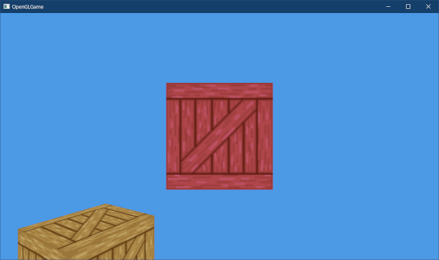

[OpenGL 3D 2023 第04回]

# プログラムの構造化

## 習得目標

* 個々のプログラムが持つ役割の違いを見分けて構造化できる。
* エンジンがゲームオブジェクトを管理し、ゲームオブジェクトがコンポーネントを管理するという階層構造を理解する。
* 新規にコンポーネントを作成し、ゲームオブジェクトに割り当てることができる。
* プライベートメンバを利用した「カプセル化」について説明できる。

## 1. プログラムの構造化

### 1.1 プログラムを構造化する

ここまでは、OpenGLの機能の説明に集中するために、ほぼすべてのプログラムを`main`関数に書いてきました。しかし、今後も多くのプログラムを追加することを考えると、全て`main`関数に書いていくのは限界があります。

今後もプログラムの読みやすさを維持するには、何らかの対策が必要です。ここで登場するのが「構造化」という技法です。ひとくちに「構造化」といってもいろいろな手法がありますが、本テキストでは以下の考え方でプログラムを構造化していきます。

>1. プログラムのすべての構成要素を洗い出し、正しさ(意図したとおりに動くこと)を容易に証明できる程度に小さな単位へと分解する(分割、モジュール化)。
>2. 分解した構成要素を階層化して、プログラム全体の正しさを段階的に証明できるようにする(可読性、テスト容易性)。

C++言語のプログラムを構造化するには、関数、構造体、クラスなどを使います。この「構造化」をゲームプログラムに活用するために、まずゲームプラグラムの構成を考えてみます。一般的なゲームプログラムは、以下の2つの部分から構成されます。

>* どのゲームでも必要な要素(入出力制御、画面描画、ゲームオブジェクト管理など)
>* ゲーム固有の要素(プレイヤーの操作方法、敵の行動、ゲームルールの管理など)

「どのゲームでの必要な要素」は、多くのゲームエンジンで`Engine`(エンジン)または`GameEngine`クラスとして定義されます。本テキストでは`Engine`という名前のクラスを定義することにします。

「ゲーム固有の要素」の実装方法は、ゲームエンジンによって異なります。`Unreal Engine`や`CryEngine`のように専用のクラスやスクリプトを持つエンジンもあれば、`Unity`のように汎用スクリプトを流用するエンジンもあります。

筆者の個人的な好みは「専用クラスを持つ」方法ですが、専用クラスを作る手間が必要です。対して、「汎用スクリプトを流用する」方法は、追加の実装が不要なために作成が簡単です。本テキストでは実装が簡単な`Unity`方式を選ぶことにします。

さて、`Engine`クラスは非常に多くの要素を扱わなくてはなりません。しかし、すべての要素を直接`Engine`クラスに実装すると、`Engine`クラスがとても巨大になり、正しさを証明することが困難になってしまいます。

そこで、`Engine`クラスが持つべき要素を複数のクラスに分割します。そして、`Engine`クラスはそれらのクラスを所有、管理します。`Engine`クラスはさらに以下の要素に分解できます。

>* ゲームループの制御
>* OpenGLの制御
>* シーン(レベル)の管理
>* ゲームオブジェクトの管理
>* アセット(モデル, テクスチャ, シェーダなど)の管理

これらの要素は、さらに細かい要素に分解できます。例えば、「ゲームオブジェクトの管理」は「ゲームオブジェクトクラス」と「ゲームオブジェクト配列を管理するクラス」に分解できるでしょう。

なお、完全なゲームエンジンには上記以外にもさまざまな要素が必要ですが、それらまで考慮するといつまでたってもプログラムが完成しません。そこで、本テキストでは「これまでに作成したプログラムに存在する要素」だけを考えます。

また、構造化はゲームの動作を一切変更しません。そのため、本テキストを最後まで進めても、表示される画面は全く変化しません。少しつまらないかもしれませんが、後々のためですので我慢してください。

>**【どこまで分解するべきか】**<br>
>「個々の要素が持つ全ての機能を説明できる程度に細かく分解する」というのが基本です。ただ、「どこまで分解するべきか」は状況次第です。あまり細かく分解しすぎると、今度は要素の階層が複雑になってしまいます。ちょうどいい細かさを選ぶのは難しい問題です。しかし、構造化の経験を積むことで、より適切な細かさを選べるようになるでしょう。

### 1.2 エンジンクラスを定義する

最初は「エンジン」クラスを作ります。目標は、「`WinMain`関数の全てのプログラムをエンジンクラスのメンバにする」ことです。ゲームエンジンの要素をもう少しだけ分解し、それらを階層化すると次のようになるでしょう。

>```text
>ゲームエンジン
>+-+-- ゲームループ
>| +---- 初期化
>| +---- 更新
>| +---- 描画
>|
>+----- OpenGL制御
>|
>+-+-- ゲームオブジェクト管理
>| +---- ゲームオブジェクトリスト
>| +---- ゲームオブジェクト
>| +---- ゲームオブジェクトの追加
>| +---- ゲームオブジェクトの削除
>|
>+-+-- アセット管理
>   +---- モデルの追加
>   +---- テクスチャの追加
>   +---- シェーダの追加
>```

上の表では省略していますが、実際にはゲームループ以外の要素にも「初期化」が必要です。どんな要素も、最初に最低限のパラメータを設定しなくては使えないからです。

それでは、ヘッダファイルを追加してクラスを定義しましょう。まず、プロジェクトの`Src`フォルダに`Engine`という名前のフォルダを追加してください。エンジン関連のファイルは全てこのフォルダに配置します。

次に、`Engine`フォルダに`Engine.h`という名前のヘッダファイルを追加してください。追加した`Engine.h`を開いて先頭の`#pragma once`を削除し、次のプログラムを追加してください。

```diff
+/**
+* @file Engine.h
+*/
+#ifndef ENGINE_H_INCLUDED
+#define ENGINE_H_INCLUDED
+#include "glad/glad.h"
+#include <GLFW/glfw3.h>
+#include <string>
+
+/**
+* ゲームエンジン
+*/
+class Engine
+{
+public:
+  Engine() = default;
+  ~Engine() = default;
+  int Run();
+
+private:
+};
+
+#endif // ENGINE_H_INCLUDED
```

`VECMATH_H_INCLUDED`(ベク・マス・エイチ・インクルーデッド)マクロは、「インクルードガード」と呼ばれる手法です。インクルードガードは、同じヘッダファイルが重複してインクルードされることを防止します。

インクルードガード名が、異なるヘッダファイルの間で重複すると、ガードが適切に機能せずとてもまずいことになります。そこで、一般的にはファイル名をガード名に使うことで重複を避けます。

末尾の`INCLUDED`(インクルーデッド)は「インクルード済み」という意味です。この単語を付けることで「インクルードガードとして作られた名前」だということを明確にしています。

>**【インクルードガードの簡単なつくりかた】**<br>
>インクルードガードを作るときは、最初の`#ifndef`を2回コピペして`#ifndef`部分を書き換えると簡単です。同じ単語を3回書くのはつづりを間違えやすいのでやめましょう。それから英単語を学習しましょう。知っている単語は間違えにくくなるからです。

`Run`(ラン)メンバ関数はゲームエンジンを実行します。エンジンの構成要素というより、単にエンジンの実行の起点として使用します。

次に、プロジェクトの`Engine`フォルダに`Engine.cpp`というソースファイルを追加してください。追加した`Engine.cpp`を開き、次のプログラムを追加してください。

```diff
+/**
+* @file Engine.cpp
+*/
+#include "Engine.h"
+
```

このCPPファイルには、あとでさまざまなメンバ関数を定義する予定です。これでファイルの準備はできました。次は`main`関数の内容を、`Engine`クラスのメンバ関数に変形していきます。`Main.cpp`を開き、`Engine.h`をインクルードしてください。

```diff
 * @file Main.cpp
 */
 #include "glad/glad.h"
+#include "Engine/Engine.h"
 #include <GLFW/glfw3.h>
 #pragma warning(push)
```

次に、`WinMain`関数を次のように変更してください。

```diff
   _In_ LPSTR lpCmdLine,
   _In_ int nShowCmd)
 {
+  Engine engine;
+  return engine.Run();
+}
+
+/**
+* ゲームエンジンを実行する
+*
+* @retval 0     正常に実行が完了した
+* @retval 0以外 エラーが発生した
+*/
+int Engine::Run()
+{
   // GLFWの初期化
   if (glfwInit() != GLFW_TRUE) {
```

これで`WinMain`のすべてのプログラムを、`Engine`クラスの`Run`メンバ関数に移動させることができました。プログラムが書けたらビルドして実行してください。これまでと同じ画面が表示されていたら成功です。

>コメント行の`retval`(レット・バル)は`return value`(リターンバリュー)の短縮形で、「戻り値」を意味します。

<p align="center">

</p>

### 1.3 ローカル変数をメンバ変数にする

この時点では、プログラム全体を`Run`関数として再定義しただけで、まだ何も「構造化」していません。構造化のために、`Run`メンバ関数内のプログラムを以下の3つの役割に分解します。

>* 初期化
>* 更新
>* 描画

役割によって分けることで、今後プログラムを追加するとき「これはどの役割に属するプログラムなのか」という視点が生まれます。

例えば、何かを描画するプログラムを追加するとしましょう。このとき「初期化」要素として追加するよりも、「描画」要素として追加するほうが自然ですよね。

既存のプログラムを分解するとき、要素をまたいで利用する変数が問題になります。変数を要素のメンバにしてしまうと、他の要素から参照できなくなってしまうからです。この問題は、より上位階層の要素のメンバにすることで解決できます。

ローカル変数をメンバ変数に変換する手順は、次のとおりです。

>1. ローカル変数の宣言を切り取る。変数の宣言と初期化を同時に行っている場合、まず宣言と初期化に分ける。その後、宣言だけを切り取る。
>2. 切り取った変数宣言を、移動先のクラス定義に貼り付ける。
>3. プログラムをビルドして、正しく動作することを確認する。

さて、現時点で「要素をまたいで利用している」あるいは「今後、要素をまたいで利用する可能性がある」のは、以下の種類の変数です。

>* GLFWウィンドウオブジェクト(`window`)
>* ウィンドウタイトル文字列
>* OpenGLのオブジェクト管理番号(`vs`,`fs`,`prog3D`,`vbo`,`ibo`,`vao`)

まず最初の2種類を`Engine`クラスに移動させます。`Main.cpp`を開き、`Shift+矢印キー`かマウスドラッグで以下のプログラムを選択し、`Ctrl+X`キーで切り取ってください。

```diff
     return 1; // 初期化失敗
   }

   // 描画ウィンドウの作成
-  GLFWwindow* window = nullptr; // ウィンドウオブジェクト
-  const std::string title = "OpenGLGame"; // ウィンドウタイトル
   glfwWindowHint(GLFW_OPENGL_DEBUG_CONTEXT, GLFW_TRUE);
   window = glfwCreateWindow(1280, 720, title.c_str(), nullptr, nullptr);
```

`Engine.h`を開き、切り取ったプログラムを`Ctrl+V`キーで貼り付けてください。

```diff
   int Run();

 private:
+  GLFWwindow* window = nullptr; // ウィンドウオブジェクト
+  const std::string title = "OpenGLGame"; // ウィンドウタイトル
 };

 #endif // ENGINE_H_INCLUDED
```

これで、2つのローカル変数をメンバ変数にすることができました。

次に、シェーダの管理番号を移動します。これらは定義と同時に初期化しているため、先にメンバ変数を用意します。`Engine.h`を開き、次のプログラムを追加してください。

```diff
 private:
   GLFWwindow* window = nullptr; // ウィンドウオブジェクト
   const std::string title = "OpenGLGame"; // ウィンドウタイトル
+  GLuint vs = 0;     // 頂点シェーダの管理番号
+  GLuint fs = 0;     // フラグメントシェーダの管理番号
+  GLuint prog3D = 0; // シェーダプログラムの管理番号
 };

 #endif // ENGINE_H_INCLUDED
```

続いて`Main.cpp`を開き、シェーダを読み込んでコンパイルするプログラムを次のように変更してください。

```diff
   glDebugMessageCallback(DebugCallback, nullptr);

   // シェーダを読み込んでコンパイルする
-  const GLuint vs = CompileShader(GL_VERTEX_SHADER, "Res/standard.vert");
-  const GLuint fs = CompileShader(GL_FRAGMENT_SHADER, "Res/standard.frag");
-  GLuint prog3D = glCreateProgram();
+  vs = CompileShader(GL_VERTEX_SHADER, "Res/standard.vert");
+  fs = CompileShader(GL_FRAGMENT_SHADER, "Res/standard.frag");
+  prog3D = glCreateProgram();
   glAttachShader(prog3D, vs);
   glAttachShader(prog3D, fs);
```

これで、3つのローカル変数`vs`, `fs`, `prog3D`がメンバ変数に置き換えられました。このように、ローカル変数をメンバ変数で置き換えるには、置き換えたいローカル変数と同名のメンバ変数を追加し、元のローカル変数の宣言を削除します。

<pre class="tnmai_assignment">
<strong>【課題01】</strong>
「ローカル変数をメンバ変数に変換する手順」を参考に、以下のローカル変数を<code>Engine</code>クラスのメンバ変数に変換しなさい。
<table>
  <tr><td>頂点バッファ</td><td>vbo, ibo, vao</td></tr>
  <tr><td>テクスチャ</td><td>tex</td></tr>
</table>
</pre>

課題01が完了したら、プログラムをビルドして実行してください。置き換え前と同じ画面が表示されていたら成功です。

### 1.4 GameObjectクラスをファイルに分離する

`GameObject`クラスは`Engine`の広い範囲で使われています。ゆくゆくは`Engine`以外のクラスからも使うことになるでしょう。

また、`GameObject`クラスで使用している`vec2`, `vec3`の2つの構造体も、今後はさまざまな場面で使うことになります。そこで、それぞれ専用のヘッダファイルに分離します。

プロジェクトの`Engine`フォルダに`VecMath.h`(ベク・マス・エイチ)とい名前のヘッダファイルを追加してください。追加したファイルを開き、次のプログラムを追加してください。

```diff
+/**
+* @file VecMath.h
+*/
+#ifndef VECMATH_H_INCLUDED
+#define VECMATH_H_INCLUDED
+#include <cmath>
+
+
+#endif // VECMATH_H_INCLUDED
```

次に`Main.cpp`を開き、Ctrl+Xで`vec2`と`vec3`の定義を切り取ってください。

```diff
   glLinkProgram(prog3D);

   // 頂点データをGPUメモリにコピー
-  struct vec2 { float x, y; };
-  struct vec3 { float x, y, z; };
   struct Vertex {
     vec3 position; // 頂点座標
```

`VecMath.h`を開き、Ctrl+Vで切り取った`vec2`と`vec3`の定義を貼り付けてください。

```diff
 #ifndef VECMATH_H_INCLUDED
 #define VECMATH_H_INCLUDED
 #include <cmath>

+struct vec2 { float x, y; };
+struct vec3 { float x, y, z; };

 #endif // VECMATH_H_INCLUDED
```

続いて`GameObject`用のヘッダファイルを作成します。プロジェクトの`Engine`フォルダに`GameObject.h`という名前のヘッダファイルを追加してください。追加したファイルを開き、次のプログラムを追加してください。

```diff
+/**
+* @file GameObject.h
+*/
+#ifndef GAMEOBJECT_H_INCLUDED
+#define GAMEOBJECT_H_INCLUDED
+#include "VecMath.h"
+
+#endif // GAMEOBJECT_H_INCLUDED
```

次に`Main.cpp`を開き、Ctrl+Xで`GameObject`の定義を切り取ってください。

```diff
   // テクスチャを作成する
   tex = LoadTexture("Res/box.tga");
-
-  // 物体のパラメータ
-  class GameObject
-  {
-  public:
-    vec3 position  = { 0, 0, 0 };    // 物体の位置
-    vec3 rotation  = { 0, 0, 0 };    // 物体の回転
-    vec3 scale     = { 1, 1, 1 };    // 物体の拡大率
-    float color[4] = { 1, 1, 1, 1 }; // 物体の色
-  };

   // カメラオブジェクト
   GameObject camera;
```

`GameObject.h`を開き、Ctrl+Vで切り取った定義を貼り付けてください。

```diff
 #ifndef GAMEOBJECT_H_INCLUDED
 #define GAMEOBJECT_H_INCLUDED
 #include "VecMath.h"
+
+// 物体のパラメータ
+class GameObject
+{
+public:
+  vec3 position  = { 0, 0, 0 };    // 物体の位置
+  vec3 rotation  = { 0, 0, 0 };    // 物体の回転
+  vec3 scale     = { 1, 1, 1 };    // 物体の拡大率
+  float color[4] = { 1, 1, 1, 1 }; // 物体の色
+};

 #endif // GAMEOBJECT_H_INCLUDED
```

次に`Engine.h`を開き、`VecMath.h`をインクルードしてください。

```diff
 #ifndef ENGINE_H_INCLUDED
 #define ENGINE_H_INCLUDED
 #include "glad/glad.h"
+#include "GameObject.h"
 #include <GLFW/glfw3.h>
 #include <string>
```

最後に、`GameObject`型のローカル変数を`Engine`クラスのメンバ変数で置き換えます。

<pre class="tnmai_assignment">
<strong>【課題02】</strong>
以下のローカル変数を、<code>Engine</code>クラスのメンバ変数で置き換えなさい。
&emsp;<code>camera</code>
&emsp;<code>box0</code>
&emsp;<code>box1</code>
</pre>

課題02が完了したら、プログラムをビルドして実行してください。置き換え前と同じ画面が表示されていたら成功です。

### 1.5 Run関数を3つのパートに分割する

それでは`Run`関数を分割しましょう。まず、分割先となる3つのメンバ関数を「宣言」します。`Engine.h`を開き、`Engine`クラスの定義に次のプログラムを追加してください。

```diff
   int Run();

 private:
+  int Initialize();
+  void Update();
+  void Render();
+
   GLFWwindow* window = nullptr; // ウィンドウオブジェクト
   const std::string title = "OpenGLGame"; // ウィンドウタイトル
```

`Initialize`(イニシャライズ)は「初期化」、`Update`(アップデート)は「更新」、`Render`(レンダー)は「描画」を担当するメンバ関数です。

次に`Run`関数に、3つの関数を呼び出すプログラムを追加します。`Main.cpp`を開き、`Run`関数に次のプログラムを追加してください。

```diff
 int Engine::Run()
 {
+  const int result = Initialize();
+  if (result) {
+    return result;
+  }
+  while (!glfwWindowShouldClose(window)) {
+    Update();
+    Render();
+  }
+  glfwTerminate();
+  return 0;
+
   // GLFWの初期化
   if (glfwInit() != GLFW_TRUE) {
```

続いて`Run`関数を分割して、追加した関数の「定義」を作ります。3つの関数を呼び出すプログラムの下に、次のプログラムを追加してください。

```diff
   }
   glfwTerminate();
   return 0;
+}

+/**
+* ゲームエンジンを初期化する
+*
+* @retval 0     正常に初期化された
+* @retval 0以外 エラーが発生した
+*/
+int Engine::Initialize()
+{
   // GLFWの初期化
   if (glfwInit() != GLFW_TRUE) {
```

`box1`変数に値を設定するところまでが「初期化」要素の範囲です。メインループの内側は「更新」と「描画」の<ruby>範疇<rt>はんちゅう</rt></ruby>になります。

メインループの開始部分を、次のように変更してください。

```diff
   box1.color[1] = 0.5f; // 緑成分の明るさを半分にしてみる
   box1.scale = { 0.2f, 0.2f, 0.2f };
   box1.position = { 0, 0, -1 };
 
-  // メインループ
-  while (!glfwWindowShouldClose(window)) {
+  return 0; // 正常に初期化された
+}
+
+/**
+* ゲームエンジンの状態を更新する
+*/
+void Engine::Update()
+{
    // box0を回転
    box0.rotation.y += 0.0001f;
```

カメラの移動処理までが「更新」要素の範囲です。カメラを移動させるプログラムの下に、次のプログラムを追加してください。

```diff
   if (glfwGetKey(window, GLFW_KEY_Q) == GLFW_PRESS) {
     camera.rotation.y += 0.0005f;
   }
+}
+
+/**
+* ゲームエンジンの状態を描画する
+*/
+void Engine::Render()
+{
    // バックバッファをクリア
    glClearColor(0.3f, 0.6f, 0.9f, 1.0f);
```

「バックバッファのクリア」から下は、ほぼすべてが「描画」要素の範囲です。末尾の不要部分を削除します。

```diff
    glfwSwapBuffers(window);
    glfwPollEvents();
- }
-
-  // GLFWの終了
-  glfwTerminate();
-
-  return 0;
 }
```

`glfwTerminate`関数は「描画」要素ではないため、`Render`メンバ関数に含めるわけにはいきません。そのため削除しているのですが、`glfwTerminate`関数自体はどこかで呼び出す必要があります。これは、`Run`メンバ関数に追加済みです。

これで、既存のプログラムを3つの要素に分解することができましたが、`indexCount`変数を定義している行にエラーが表示されていると思います。

このような要素分解おいて起きるエラーは、「要素をまたぐローカル変数」が残っている場合に発生します。対処方法は「ローカル変数をメンバ変数で置き換える」ことです。

まず`indexCount`メンバ変数を追加します。`Engine.h`に次のプログラムを追加してください。

```diff
   GameObject camera;
   GameObject box0;
   GameObject box1;
+  GLsizei indexCount = 0;
 };
 
 #endif // ENGINE_H_INCLUDED
```

次に、`Render`メンバ関数にある`indexCount`変数を定義している行を切り取ってください。

```diff
     glBindTextures(0, 1, &tex);

     // 図形を描画
-    const GLsizei indexCount = static_cast<GLsizei>(std::size(indexData));
     glDrawElementsInstanced(GL_TRIANGLES, indexCount, GL_UNSIGNED_SHORT, 0, 1);

     // ふたつめの図形を描画
```

そして、`Initialize`メンバ関数にある`indexData`配列の定義の下に、切り取った行を貼り付けてください。

```diff
     8, 9,10,10,11, 8,
    12,13,14,14,15,12,
   };
+  const GLsizei indexCount = static_cast<GLsizei>(std::size(indexData));
 
   glCreateBuffers(1, &ibo);
   glNamedBufferStorage(ibo, sizeof(indexData), indexData, 0);
```

最後に、メンバ変数にするために型を削除します。上記のプログラムを次のように変更してください。

```diff
     8, 9,10,10,11, 8,
    12,13,14,14,15,12,
   };
-  const GLsizei indexCount = static_cast<GLsizei>(std::size(indexData));
+  indexCount = static_cast<GLsizei>(std::size(indexData));
 
   glCreateBuffers(1, &ibo);
   glNamedBufferStorage(ibo, sizeof(indexData), indexData, 0);
```

プログラムが書けたらビルドして実行してください。これまでと同じ画面が表示されていたら成功です。

### 1.6 メンバ関数をEngine.cppに移動する

最後の仕上げとして、すべてのメンバ関数を`Engine.cpp`に移動します。`Main.cpp`を開き、「Shift+カーソルキー(またはマウスドラッグ)」で`Run`, `Initialize`, `MainLoop`, `Finalize`の3つの関数を選択し、`Ctrl+X`キーで切り取ってください。

```diff
   Engine engine;
   return engine.Run();
 }
-
-/**
-* ゲームエンジンを実行する
-*
-* @retval 0     正常に実行が完了した
-* @retval 0以外 エラーが発生した
-*/
-int Engine::Run()
-{
-        ・
-        ・
-      [省略]
-        ・
-        ・
-  glfwSwapBuffers(window);
-  glfwPollEvents();
-}
```

次に`Engine.cpp`を開き、切り取ったプログラムを`Ctrl+V`キーで貼り付けてください。

```diff
 * @file Engine.cpp
 */
 #include "Engine.h"
+
+/**
+* ゲームエンジンを実行する
+*
+* @retval 0     正常に実行が完了した
+* @retval 0以外 エラーが発生した
+*/
+int Engine::Run()
+{
+        ・
+        ・
+      [省略]
+        ・
+        ・
+  glfwSwapBuffers(window);
+  glfwPollEvents();
+}
```

この時点では、メンバ関数内で使われている関数が`Main.cpp`に残っていたり、必要なヘッダファイルがインクルードされていなかったりします。以下の課題を行って、構造化を完成させてください。

<pre class="tnmai_assignment">
<strong>【課題03】</strong>
<code>DebugCallback</code>、<code>CompileShader</code>、<code>LoadTexture</code>関数を、<code>Main.cpp</code>から<code>Engine.cpp</code>の先頭(インクルード文の直後)に移動しなさい。
</pre>

<pre class="tnmai_assignment">
<strong>【課題04】</strong>
<code>Main.cpp</code>のインクルード文を参考に、<code>Engine.cpp</code>にインクルード文を追加して、ビルドできるようにしなさい。
</pre>

<pre class="tnmai_assignment">
<strong>【課題05】</strong>
<code>Main.cpp</code>のインクルード文について、以下の手順に従って不要なインクルード文を削除しなさい。
1. 不要そうなインクルード文を削除する。
2. ビルドする。
3. ビルドに失敗したら、1で削除したインクルード文を元に戻し、2に戻る。
4. ビルドに成功したら1に戻る。
5. 削除できるインクルード文がなくなったら終了。
</pre>

完全に構造化できたとは言えませんが、ひとまず`WinMain`関数のプログラムを構造化することができました。

<p align="center">

</p>

>**【1章のまとめ】**
>
>* 役割の異なるプログラムを関数に分割することで、プログラムを構造化することができる。
>* 複数の役割にまたがって使われる変数はメンバ変数にする。
>* プログラムの追加先を選ぶときは、関数の役割を考えるとよい。

<div style="page-break-after: always"></div>

## 2. ゲームオブジェクトの管理

### 2.1 コンポーネントクラスを作る

この章では、`GameObject`(ゲーム・オブジェクト)クラスにキャラクターを制御する機能を追加します。ゲームオブジェクトは以下の機能を持ちます。

>* 更新、衝突などの「イベント」の管理。
>* 表示する「3Dモデル」の管理。
>* 「衝突判定」の管理。

まずは「イベント」の管理から作っていきましょう。

最初に、イベント処理のベースとなる`Component`(コンポーネント)クラスを作成します。<br>
プロジェクトの`Engine`フォルダに`Component.h`というファイルを追加してください。追加したファイルを開き、次のプログラムを追加してください。

```diff
+/**
+* @file Component.h
+*/
+#ifndef COMOPNENT_H_INCLUDED
+#define COMOPNENT_H_INCLUDED
+#include <memory>
+
+// 先行宣言
+class GameObject;
+using GameObjectPtr = std::shared_ptr<GameObject>;
+class Component;
+using ComponentPtr = std::shared_ptr<Component>; // コンポーネントのポインタ
+
+#endif // COMOPNENT_H_INCLUDED
```

`Component`クラスはポインタで管理することにします。バグを起こしにくくするため、普通のポインタではなくC++11から追加された`shared_ptr`(シェアード・ポインタ)クラスを使います。

`shared_ptr`の場合、ポインタ変数の宣言は

&emsp;`Component* p;`

ではなく、

&emsp;`std::shared_ptr<Component> p;`

のように書かなくてはなりません。しかし、毎回`std::shared_ptr`を書くのは面倒です。そこで、`using`によって`ComponentPtr`(コンポーネント・ポインタ)という別名を定義しておきます。

別名を定義することで、

&emsp;`ComponentPtr p;`

のように、短く書けるようになります。

>**【shared_ptrって何？】**<br>
>`shared_ptr`(シェアード・ポインタ)は、ポインタのコピー数を記録して、全てのコピーが削除されたときにポインタの`delete`を実行するクラスです。
>`delete`を使うタイミングを`shared_ptr`に任せられるので、`delete`を書き忘れることがなくなります。`shared_ptr`のような、管理機能を備えたポインタクラスは「スマート・ポインタ(賢いポインタ)」と呼ばれます。


```diff
 using GameObjectPtr = std::shared_ptr<GameObject>;
 class Component;
 using ComponentPtr = std::shared_ptr<Component>; // コンポーネントのポインタ
+
+/**
+* コンポーネントの基底クラス
+*/
+class Component
+{
+  friend GameObject;
+public:
+  Component() = default;
+  virtual ~Component() = default;
+
+  // コンポーネントの所有者を取得
+  GameObject* GetOwner() const { return owner; }
+
+  // コンポーネントをゲームオブジェクトから削除する
+  void Destroy() { isDestroyed = true; }
+
+  // コンポーネントが破壊されていたらtrueを返す
+  bool IsDestroyed() const { return isDestroyed; }
+
+  // ゲームオブジェクトに追加された時に呼び刺される
+  virtual void Awake() {}
+
+  // 最初のUpdateの直前で呼び出される
+  virtual void Start() {}
+
+  // 毎フレーム1回呼び出される
+  virtual void Update(float deltaTime) {}
+
+  // 衝突が起きたときに呼び出される
+  virtual void OnCollision(
+    const ComponentPtr& self, const ComponentPtr& other) {}
+
+  // ゲームオブジェクトがエンジンから削除されるときに呼び出される
+  virtual void OnDestroy() {}
+
+private:
+  GameObject* owner = nullptr; // このコンポーネントの所有者
+  bool isStarted = false;      // Startが実行されたらtrueになる
+  bool isDestroyed = false;    // Destroyが実行されたらtrueになる
+};
+

 #endif // COMOPNENT_H_INCLUDED
```

`Component`クラスは、5つのイベントに対応する仮想関数を定義します。`Component`クラス自体は、これらのイベントに対して何も行いません。<br>
イベントを処理するには`Component`の派生クラスを作り、関数をオーバーライドします。

#### プライベートメンバはバグを減らす

クラスにとって重要な変数をプライベートメンバにすると、バグを起こしにくくなります。その代わり、他のクラスから変数を参照したり操作したりできないため、やりたい操作が行えない場合があります。

そのため、プライベートメンバ変数は、それらの変数を操作するメンバ関数とセットで定義しなくては意味がありません。`Component`クラスでは、`Destory`(デストロイ)と`IsDestoyed`(イズ・デストロイド)の2つのメンバ関数を定義しています。

プライベートメンバ変数とパブリックメンバ関数を組み合わせることで、「`isDestroyed`メンバ変数を`false`に戻す」という操作を禁止しています。この操作は「`Component`の削除をキャンセルする」という意味になります。

しかし、意図的に削除をキャンセルすることは考えにくいため、もしそのようなコードがあった場合はバグ(変数名を間違えた等)の可能性が高いです。キャンセル操作を禁止することで、バグの可能性をつぶすことができています。

このように「プログラムを管理しやすくするために、クラス内部の仕様を隠す」ことを「カプセル化」といいます。

#### プライベートメンバを操作する方法その2

プライベートメンバを操作するもうひとつの方法は、「変数や関数を操作させたいクラス」をフレンド指定することです。フレンド指定されたクラスはプライベートメンバを操作できるので、無関係なクラスや関数から操作される危険性を減らせます。

`Component`クラスの場合、`GameObject`をフレンド指定しています。`owner`(オーナー)と`isStarted`(イズ・スターテッド)の2つは、`GameObject`クラスに設定してもらう予定です。

>「フレンド」は便利な機能ですが、用法用量を守ってお使いください。使いすぎると思わぬバグの原因になるでしょう。

### 2.2 ゲームオブジェクトクラスを拡張する

続いて、`Component`を扱えるようにゲームオブジェクトの機能を拡張します。`GameObject.h`を開き、次のインクルード文と先行宣言を追加してください。

```diff
 #ifndef GAMEOBJECT_H_INCLUDED
 #define GAMEOBJECT_H_INCLUDED
+#include "Component.h"
 #include "VecMath.h"
+#include <string>
+#include <vector>
+#include <memory>
+
+// 先行宣言
+class Engine;
+class GameObject;
+using GameObjectPtr = std::shared_ptr<GameObject>; // ゲームオブジェクトのポインタ
+using GameObjectList = std::vector<GameObjectPtr>; // ゲームオブジェクトポインタの配列
+
 // 物体のパラメータ
 class GameObject
 {
```

これまでは`GameObject`型の変数を使っていましたが、今後は`Component`クラスと同様に`shared_ptr`で管理することにします。`shared_ptr`を使うと`delete`を書き忘れることがなくなるため、気軽にポインタを利用できます。

次に、以下のメンバ変数を追加します。

>* 名前(ゲームオブジェクトの識別用)
>* ゲームエンジンへのポインタ(ゲームエンジンと連携を取るため)
>* 死亡フラグ(オブジェクトの死亡判定を共通化するため)
>* コンポーネントの配列(追加したコンポーネントの管理用)

`GameObject`クラスの定義に次のプログラムを追加してください。

```diff
 class GameObject
 {
 public:
+  std::string name;                // オブジェクト名
   vec3 position  = { 0, 0, 0 };    // 物体の位置
   vec3 rotation  = { 0, 0, 0 };    // 物体の回転
   vec3 scale     = { 1, 1, 1 };    // 物体の拡大率
   float color[4] = { 1, 1, 1, 1 }; // 物体の色
+
+private:
+  Engine* engine = nullptr;        // エンジンのアドレス
+  bool isDestroyed = false;        // 死亡フラグ
+  std::vector<ComponentPtr> components; // コンポーネント配列
 };

 #endif // GAMEOBJECT_H_INCLUDED
```

`name`は自由に変更できるべきなので、パブリックメンバとしています。他の3つは自由に変更できるとバグの原因になりかねないため、プライベートメンバとしています。

そこで、プライベートメンバ変数を操作するメンバ関数を追加します。`GameObject`クラスの定義に次のプログラムを追加してください。

```diff
 class GameObject
 {
+  friend Engine;
 public:
+  GameObject() = default;
+  virtual ~GameObject() = default;
+
+  // ゲームエンジンを取得
+  Engine* GetEngine() const { return engine; }
+
+  // ゲームオブジェクトをエンジンから削除する
+  void Destroy() { isDestroyed = true; }
+
+  // ゲームオブジェクトが破壊されていたらtrueを返す
+  bool IsDestroyed() const { return isDestroyed; }
+
+  // ゲームオブジェクトにコンポーネントを追加する
+  template<typename T>
+  std::shared_ptr<T> AddComponent() {
+    auto p = std::make_shared<T>();
+    p->owner = this;
+    components.push_back(p);
+    p->Awake();
+    return p;
+  }
+
+  // ゲームオブジェクトからコンポーネントを削除する
+  void RemoveDestroyedComponent();
+
+  // イベント制御
+  virtual void Start();
+  virtual void Update(float deltaTime);
+  virtual void OnCollision(
+    const ComponentPtr& self, const ComponentPtr& other);
+  virtual void OnDestroy();

   std::string name;                // オブジェクト名
   vec3 position  = { 0, 0, 0 };    // 物体の位置
```

`Engine`クラスをフレンド指定しているのは、`GameObject`の管理を`Engine`クラスに担当させる予定だからです。

`AddComponent`(アド・コンポーネント)はコンポーネントを追加する「関数テンプレート」です。テンプレート引数には、`Component`クラスの派生クラスを指定します。

関数テンプレートを使うと「異なる型に対して同じ処理をする」関数を書くことができます。関数テンプレートを使うと、型が異なる以外は同じ処理をする関数を何度も書かなくて済みます。

ただし、テンプレートには「定義をヘッダファイルに書かなくてはならない」という制限があります。そのため、長く複雑な関数はテンプレート化に向いていません(できないわけではありませんが)。

`RemoveDestoryedComponent`(リムーブ・デストロイド・コンポーネンツ)メンバ関数は、`Destroy`関数によって破棄されたコンポーネントを削除します。

「イベント制御」というコメントの下にある4つのメンバ関数は、`Engine`クラスから呼び出す予定です。

なお、C++のポインタや参照は、C#のように「破棄されたオブジェクトの参照をnullにする」という機能を持ちません。そこで、「破棄状態」を示す`IsDestroyed`(イズ・デストロイド)メンバ関数を定義し、破棄の有無をチェックできるようにしています。

>**【C++で「破棄されたオブジェクトの参照をnullにする」】**<br>
>実は`weak_ptr`(ウィーク・ポインタ)というクラスを使うと、これに近い挙動を実現できます。ただ、`weak_ptr`は使い方が少し特殊なため今回は扱いません。

### 2.3 クラスの説明文を修正する

機能を追加したことで、`GameObject`は単なる「物体のパラメータ」ではなくなってしまいました。そこで、クラスを説明するコメントを修正します。`GameObject`のコメントを次のように変更してください。

```diff
 using GameObjectPtr = std::shared_ptr<GameObject>; // ゲームオブジェクトのポインタ
 using GameObjectList = std::vector<GameObjectPtr>; // ゲームオブジェクトポインタの配列

-// 物体のパラメータ
+/**
+* ゲームに登場するさまざまなオブジェクトを表す基本クラス
+*/
 class GameObject
 {
```

クラスや関数に変更を加えた結果、コメントが不正確、あるいは間違ったものになるのはよくあることです。しかし、それらを放置するとバグの原因になりかねません。ですから、気づいた時点で適切なコメントに書き換えるのはとても重要です。

### 2.4 ゲームオブジェクトのメンバ関数を定義する

次に`GameObject`クラスのメンバ関数を定義します。プロジェクトの`Engine`フォルダに
`GameObject.cpp`という名前のCPPファイルを追加してください。

追加したファイルを開き、次のプログラムを追加してください。

```diff
+/**
+* @file GameObject.cpp
+*/
+#include "GameObject.h"
+#include <algorithm>
+
+/**
+* ゲームオブジェクトから削除予定のコンポーネントを削除する
+*/
+void GameObject::RemoveDestroyedComponent()
+{
+  if (components.empty()) {
+    return; // コンポーネントを持っていなければ何もしない
+  }
+
+  // 破棄予定の有無でコンポーネントを分ける
+  const auto iter = std::stable_partition(
+    components.begin(), components.end(),
+    [](const auto& p) { return !p->IsDestroyed(); });
+
+  // 破棄予定のコンポーネントを別の配列に移動
+  std::vector<ComponentPtr> destroyList(
+    std::move_iterator(iter),
+    std::move_iterator(components.end()));
+
+  // 配列から移動済みコンポーネントを削除
+  components.erase(iter, components.end());

+  // 破棄予定のコンポーネントのOnDestoryを実行
+  for (auto& e : destroyList) {
+    e->OnDestroy();
+  }
+
+  // ここで実際にコンポーネントが削除される(destoyListの寿命が終わるため)
+}
```

`RemoveDestroyedComponent`(リムーブ・デストロイド・コンポーネント)メンバ関数は、`Destory`によって破棄されたコンポーネントをゲームオブジェクトから削除します。

削除するだけなら`vector`クラスの`erase`メンバ関数で実行できます。しかし、削除する前に、削除するコンポーネントの`OnDestroy`メンバ関数を呼び出す必要があります。

そこで、`stable_partition`(ステーブル・パーティション)という関数を使って、「削除しない要素」と「削除する要素」に振り分けます。

<p><code class="tnmai_code"><strong>【書式】</strong><br>
iterator stable_partition(範囲の先頭, 範囲の終端, 振り分け条件);
</code></p>

`stable_partition`関数は、指定された範囲について、振り分け条件を「満たす」要素を範囲の前側に、条件を「満たさない」要素を範囲の後ろ側に移動します。

戻り値は「(条件を満たさない要素が集められた)後ろ側の範囲の先頭位置」です。上記のプログラムの場合、条件は「破棄予定がない」なので、範囲の後ろ側には「破壊予定のあるコンポーネント」が集められます。

そして、変数`iter`(イター、またはイテレータ、`iterator`の短縮形)」にはその先頭位置が格納されます。

振り分けが終わったら、破棄予定のコンポーネントを`destroyList`(デストロイ・リスト)配列に移動します。配列から別の配列へ要素を移動させるには、`move_iterator`(ムーブ・イテレータ)クラスを使います。

`move_iterator`を作成するには、コンストラクタに`begin()`メンバ関数などで取得したイテレータを指定します。

<p><code class="tnmai_code"><strong>【書式】</strong><br>
move_iterator(元になるイテレータ);
</code></p>

ただし、`move_iterator`によって移動されるのは、要素の内容だけです。今回の場合はポインタの値が`destroyList`にコピーされ、`components`の要素はnullptrに変更されます。つまり、`components`の要素数は変化しません。

nullptrになった要素を削除するには、`erase`を呼び出す必要があります。要素を削除した後、破棄予定のコンポーネントに対して`OnDestroy`を呼び出します。

なお、`components`から`destroyList`に要素を移動させる理由は、`OnDestroy`で新しいコンポーネントが追加される可能性があるためです。

コンポーネントは`components`の末尾に追加されます。そのため、もし要素を移動させないと、破棄予定のないコンポーネントが後ろ側に追加されてしまい、せっかくの振り分けが無意味になってしまいます。

`destroyList`配列はローカル変数なので、関数が終了するときに削除されます。この時点で、ようやく実際にコンポーネントが削除されます。

>**【他のオブジェクトがコンポーネントへのポインタを持っている場合】**<br>
>コンポーネントへのポインタを持っているオブジェクトが存在する場合、コンポーネントはゲームオブジェクトから削除されるだけで、破棄は行われません。`shared_ptr`は、ポインタのコピーが全てnullptrになった時点で破棄を実行するからです。

### 2.5 ゲームオブジェクトのメンバ関数を定義する(その2)

次に、イベントを処理するメンバ関数を定義します。どの関数もやることはほとんど同じなので、まとめて定義します。`RemoveDestroyedComponent`メンバ関数の定義の下に、次のプログラムを追加してください。

```diff
   // ここで実際にコンポーネントが削除される(destoyListの寿命が終わるため)
 }
+
+/**
+* スタートイベント
+*/
+void GameObject::Start()
+{
+  for (auto& e : components) {
+    if ( ! e->isStarted) {
+      e->Start();
+      e->isStarted = true;
+    }
+  }
+}
+
+/**
+* 更新イベント
+*
+* @param deltaTime 前回の更新からの経過時間(秒)
+*/
+void GameObject::Update(float deltaTime)
+{
+  for (auto& e : components) {
+    e->Update(deltaTime);
+  }
+}
+
+/**
+* 衝突イベント
+*
+* @param self  衝突したコンポーネント(自分)
+* @param other 衝突したコンポーネント(相手)
+*/
+void GameObject::OnCollision(
+  const ComponentPtr& self, const ComponentPtr& other)
+{
+  for (auto& e : components) {
+    e->OnCollision(self, other);
+  }
+}
+
+/**
+* 削除イベント
+*/
+void GameObject::OnDestroy()
+{
+  for (auto& e : components) {
+    e->OnDestroy();
+  }
+}
```

ゲームオブジェクトのイベント関数は、全てのコンポーネントに対してイベントに対応するメンバ関数を呼び出すだけです。

### 2.6 エンジンにゲームオブジェクト配列を追加する

ゲームオブジェクトはエンジンクラスが管理します。`Engine.h`を開き、`GameObject.h`をインクルードしてください。

```diff
 #ifndef ENGINE_H_INCLUDED
 #define ENGINE_H_INCLUDED
 #include "glad/glad.h"
+#include "GameObject.h"
 #include <GLFW/glfw3.h>
 #include <string>
```

次に、エンジンクラスの定義に次のプログラムを追加してください。

```diff
   GLuint vao = 0; // 構成情報の管理番号
   GLuint vbo = 0; // 頂点バッファの管理番号
   GLuint ibo = 0; // インデックスバッファの管理番号
+  GameObjectList gameObjects; // ゲームオブジェクト配列
   GLuint tex;
   GameObject camera;
```

最初にやることは、`gameObjectList`(ゲームオブジェクト・リスト)の容量を予約することです。`Engine.cpp`を開き、`Initialize`メンバ関数の定義に次のプログラムを追加してください。

```diff
   // 1番目の頂点アトリビュートを設定
   glVertexAttribPointer(1, 2, GL_FLOAT, GL_FALSE, sizeof(Vertex),
     reinterpret_cast<const void*>(offsetof(Vertex, texcoord)));
+
+  // ゲームオブジェクト配列の容量を予約
+  gameObjects.reserve(1000);

   // テクスチャを作成する
   tex = LoadTexture("Res/box.tga");
```

### 2.7 ゲームオブジェクトを操作する機能を追加する

続いて、ゲームオブジェクトを作成する関数を定義します。`Engine.h`を開き、エンジンクラスの定義に次のプログラムを追加してください。

```diff
   // 次のシーンを設定する
   template<typename T>
   void SetNextScene() { nextScene = std::make_shared<T>(); }
+
+  /**
+  * ゲームオブジェクトを作成する
+  *
+  * @param name     オブジェクトの名前
+  * @param position オブジェクトを配置する座標
+  * @param rotation オブジェクトの回転角度
+  */
+  template<typename T>
+  std::shared_ptr<T> Create(const std::string& name
+    const vec3& position = { 0, 0, 0 },
+    const vec3& rotation = { 0, 0, 0 })
+  {
+    std::shared_ptr<T> p = std::make_shared<T>();
+    p->engine = this;
+    p->name = name;
+    p->position = position;
+    p->rotation = rotation;
+    gameObjects.push_back(p); // エンジンに登録
+    return p;
+  }
 
 private:
   int Initialize();
   void Update();
```

`Create`(クリエイト)関数テンプレートは、テンプレート引数で指定されたゲームオブジェクトクラス(またはその派生クラス)を作成して、`gameObjects`(ゲーム・オブジェクツ)配列に追加します。

ところで、Unityでゲームオブジェクトを作成するには

&emsp;`new GameObject();`

と書きます。C#のポインタにはC++の`shared_ptr`のように、自動的にコピーを追跡する機能があります。そのため、比較的安全にポインタを利用できます。

しかし、C++のポインタにはそのような機能はありません。C#のポインタと同じレベルの安全性を実現するには`shared_ptr`を使う必要があります。

ただ、`new`はC++組み込みの機能なので、`shared_ptr`を返すように変えることはできません。そこで、ゲームオブジェクトを作成する`Create`(クリエイト)メンバ関数を定義することにしました。

`Create`メンバ関数は、`GameObject::AddComponent`と同様に、テンプレートを利用して`GameObject`及び、その派生クラスを作成します。

また、プログラムを書きやすくするために、`position`(ポジション)引数と`rotation`(ローテーション)引数にはデフォルト値を指定し、デフォルト値のままで構わない場合は省略できるようにしています。

### 2.8 ゲームオブジェクトを削除する関数を定義する

次に、全てのゲームオブジェクトを削除するメンバ関数を定義します。ゲームを開始、または終了するときに、既存のゲームオブジェクトをすべて破棄してやり直すために使えるでしょう。

関数名は`ClearGameObjectAll`(クリア・ゲームオブジェクト・オール)とします。`Create`メンバ関数の定義の下に、次のプログラムを追加してください。

```diff
     gameObjects.push_back(p);
     return p;
   }
+
+  // すべてのゲームオブジェクトを削除する
+  void ClearGameObjectsAll();

 private:
   int Initialize();
```

`Engine.cpp`を開き、`Run`メンバ関数の定義の下に、次のプログラムを追加してください。

```diff
   }
   return 0;
 }
+
+/**
+* ゲームエンジンから全てのゲームオブジェクトを破棄する
+*/
+void Engine::ClearGameObjectAll()
+{
+  for (auto& e : gameObjects) {
+    e->OnDestroy();
+  }
+  gameObjects.clear();
+}

 /**
 * ゲームエンジンを初期化する
```

この関数はすべてのゲームオブジェクトに対して`OnDestroy`を呼び出し、次にゲームオブジェクトの配列を空にします。

### 2.9 ゲームオブジェクトを更新する関数を定義する

続いて、「全てのゲームオブジェクトの状態を更新する」メンバ関数を定義します。関数名は`UpdateGameObject`(アップデート・ゲームオブジェクト)とします。`Engine.h`を開き、`Render`メンバ関数の宣言の下に、次のプログラムを追加してください。

```diff
   int Initialize();
   void Update();
   void Render();
+  void UpdateGameObject(float deltaTime);

   GLFWwindow* window = nullptr; // ウィンドウオブジェクト
   const std::string title = "OpenGLGame"; // ウィンドウタイトル
```

`Engine.cpp`を開き、`Render`メンバ関数の宣言の下に、次のプログラムを追加してください。

```diff
   glfwSwapBuffers(window);
   glfwPollEvents();
 }
+
+/**
+* ゲームオブジェクトの状態を更新する
+*
+* @param deltaTime 前回の更新からの経過時間(秒)
+*/
+void Engine::UpdateGameObject(float deltaTime)
+{
+  // 要素の追加に対応するため添字を選択
+  for (int i = 0; i < gameObjects.size(); ++i) {
+    GameObject* e = gameObjects[i].get();
+    if ( ! e->IsDestroyed()) {
+      e->Start();
+      e->Update(deltaTime);
+    }
+  }
+} // UpdateGameObject
```

この関数は最初に`Start`メンバ関数を実行し、次に`Update`メンバ関数を実行します。

vectorの全要素を操作する場合、範囲for、イテレータ、添字の3種類が考えられます。この3つは状況によって使い分ける必要があります。

例えば、操作中に要素の追加や削除が起こる場合、範囲forは正しく動作しません。イテレータも通常とは異なる使い方になるため、あまり向いていません。

添字は効率の点で他の2つに劣りますが、添字より後ろ側に追加・削除が行われる場合は安全に要素を操作できます。ただし、添字より前に追加される場合は危険があり、要素が2回以上操作されたり、全く操作されない可能性があります。

さて、`gameObjects`配列の場合、追加は`Create`、削除は`Destroy`で行います。`Create`による追加は配列の末尾であり、`Destroy`は「削除予定」とマークするだけで、実際には要素を削除しません。

これらの理由から、上記のプログラムでは添字を使ってvectorを操作しています。

>**【閉じカッコにコメントを付ける意味】**<br>
>最後の閉じカッコのコメントはテキストの都合です。テキストでプログラムを追加・変更するとき、その位置を特定するために前後2～3行のコードを含めています。しかし、3行ともカッコの場合は位置を特定しにくいため、位置特定の助けとなるように、コメントを追加しています。

### 2.10 経過時間を計測する

ゲーム内容やPCの動作状態によって、1フレームにかかる処理時間は変化します。そのため、「1フレームに10cm移動」のようにプログラムを書いてしまうと、見かけの移動速度がフレームごとに変動するため、ぎこちない動きになってしまいます。

そこで、多くのゲームでは「秒間移動速度×経過時間」とすることで、見かけの移動速度を一定に保ちます。この「経過時間」のことを「デルタ・タイム」といいます。デルタタイムは次の式で計算します。

&emsp;`デルタタイム = 現在の時刻 - 前回の時刻`

この式から、デルタタイムを計算するためには「前回の時刻」を覚えておく必要があることが分かります。そこで、ゲームエンジンに「前回の時刻」を表すメンバ変数を追加します。

変数名は`previousTime`(プレビアス・タイム、プレビアスは「前回の」という意味)とします。`Engine.h`を開き、次のプログラムを追加してください。

```diff
   GLuint fs = 0;     // フラグメントシェーダの管理番号
   GLuint prog3D = 0; // シェーダプログラムの管理番号
   GameObjectList gameObjects; // ゲームオブジェクト配列
+  double previousTime = 0; // 前回更新時の時刻
+  float deltaTime = 0;     // 前回更新からの経過時間
   GLuint tex;
   GameObject camera;
```

次に、`Engine.cpp`を開き、`Update`メンバ関数に次のプログラムを追加してください。

```diff
   if (glfwGetKey(window, GLFW_KEY_Q) == GLFW_PRESS) {
     camera.rotation.y += 0.0005f;
   }
+
+  // デルタタイム(前回の更新からの経過時間)を計算
+  const double currentTime = glfwGetTime(); // 現在時刻
+  deltaTime = static_cast<float>(currentTime - previousTime);
+  previousTime = currentTime;
+
+  // 経過時間が長すぎる場合は適当に短くする(主にデバッグ対策)
+  if (deltaTime >= 0.5f) {
+    deltaTime = 1.0f / 60.0f;
+  }
 }

 /**
 * ゲームエンジンの状態を描画する
```

現在の時間は`glfwGetTime`(ジーエルエフダブリュー・ゲット・タイム)関数で取得します。

<p><code class="tnmai_code"><strong>【書式】</strong><br>
double glfwGetTime(GLFWウィンドウオブジェクトのアドレス);
</code></p>

この関数は「プログラムが起動してからの経過時間」を返します。現実の時計とは無関係なことに注意してください。

デルタタイムが0.5秒以上のときに強制的に1/60秒に変更しているのは、デバッグ用のブレークポイントでプログラムが一時停止したときも、タイマーは動作し続けているためです。

タイマーが止まらないので、プログラムを再開するとデルタタイムが数十秒から数分という、普通にプログラムを実行している限りまず起こらないであろう数値になってしまいます。

デバッグのときだけ特殊な状態になるのでは、本来の動作をデバッグすることがやりにくくなってしまいます。そこで、デルタタイムが大きすぎる場合は一般的な1フレームの時間である1/16秒を設定することで、デバッグしやすくしています。

これでデルタタイムを計算することができました。それでは、デルタタイムを使って`UdpateGameObject`を呼び出しましょう。デルタタイムを計算するプログラムの下に、次のプログラムを追加してください。

```diff
   if (deltaTime > 0.5f) {
     deltaTime = 1.0f / 60.0f;
   }
+
+  UpdateGameObject(deltaTime);
 }

 /**
 * ゲームエンジンの状態を描画する
```

### 2.11 破棄予定のゲームオブジェクトを削除する関数を定義する

次に「破棄予定のゲームオブジェクトを削除する」メンバ関数を追加します。関数名は`RemoveDestroyedGameObject`(リムーブ・デストロイド・ゲームオブジェクト)とします。

`Engine.h`を開き、`UpdateGameObject`メンバ関数の定義の下に、次のプログラムを追加してください。

```diff
   void Update();
   void Render();
   void UpdateGameObject(float deltaTime);
+  void RemoveDestroyedGameObject();

   GLFWwindow* window = nullptr; // ウィンドウオブジェクト
   const std::string title = "OpenGLGame"; // ウィンドウタイトル
```

次に`Engin.cpp`を開き、`UpdateGameObject`メンバ関数の定義の下に、次のプログラムを追加してください。

```diff
     }
   } // for list
 }
+
+/**
+* 破棄予定のゲームオブジェクトを削除する
+*/
+void Engine::RemoveDestroyedGameObject()
+{
+  if (gameObjects.empty()) {
+    return; // ゲームオブジェクトを持っていなければ何もしない
+  }
+
+  // 破棄予定の有無でゲームオブジェクトを分ける
+  const auto iter = std::partition(
+    gameObjectList.begin(), gameObjectList.end(),
+    [](const GameObjectPtr& e) { return !e->isDead; });
+
+  // 破棄予定のオブジェクトを別の配列に移動
+  GameObjectList destroyList(
+    std::make_move_iterator(iter),
+    std::make_move_iterator(gameObjects.end()));
+
+  // 配列から移動済みオブジェクトを削除
+  gameObjects.erase(iter, gameObjects.end());
+
+  // 破棄予定のオブジェクトのOnDestroyを実行
+  for (auto& e : destroyList) {
+    e->OnDestroy();
+  }
+
+  // ここで実際にゲームオブジェクトが削除される(destoyListの寿命が終わるため)
+}
```

関数の内容は`RemoveDestroyedComponent`とほとんど同じです。違いは、対象がコンポーネント配列からゲームオブジェクト配列に変わったことだけです。

それでは`RemoveDestroyedGameObject`関数を呼び出しましょう。`Run`メンバ関数の定義に次のプログラムを追加してください。

```diff
   while (!glfwWindowShouldClose(window)) {
     Update();
     Render();
+    RemoveDestroyedGameObject();
   }
   return 0;
```

### 2.12 ゲームオブジェクトを描画する

最後に、ゲームオブジェクトを描画する機能を実装します。`Render`メンバ関数の定義を次のように変更してください。

```diff
   // 深度テストを有効化
   glEnable(GL_DEPTH_TEST);

+  // ゲームオブジェクトを描画
+  for (const auto& e : gameObjects) {
     // ユニフォーム変数にデータをコピー
- glProgramUniform4fv(prog3D, 100, 1, box0.color);
- glProgramUniform3fv(prog3D, 0, 1, &box0.scale.x);
- glProgramUniform3fv(prog3D, 1, 1, &box0.position.x);
- glProgramUniform2f(prog3D, 2, sin(box0.rotation.y), cos(box0.rotation.y));
+    glProgramUniform4fv(prog3D, 100, 1, e->color);
+    glProgramUniform3fv(prog3D, 0, 1, &e->scale.x);
+    glProgramUniform3fv(prog3D, 1, 1, &e->position.x);
+    glProgramUniform2f(prog3D, 2, sin(e->rotation.y), cos(e->rotation.y));

     // 描画に使うテクスチャを指定
     glBindTextures(0, 1, &tex);

     // 図形を描画
     glDrawElementsInstanced(GL_TRIANGLES, indexCount, GL_UNSIGNED_SHORT, 0, 1);
+  }
-
-  // ふたつめの図形を描画
-  glProgramUniform4fv(prog3D, 100, 1, box1.color);
-  glProgramUniform3fv(prog3D, 0, 1, &box1.scale.x);
-  glProgramUniform3fv(prog3D, 1, 1, &box1.position.x);
-  glProgramUniform2f(prog3D, 2, sin(box1.rotation.y), cos(box1.rotation.y));
-  glDrawElementsInstanced(GL_TRIANGLES, indexCount, GL_UNSIGNED_SHORT, 0, 1);

   glfwSwapBuffers(window);
   glfwPollEvents();
```

これでゲームオブジェクト管理システムは完成です。ただ、元の図形の描画プログラムを消してしまったので、このままでは箱が表示されません。そこで、箱をゲームオブジェクトで置き換えます。`Engine.h`を開き、box0とbox1を削除してください。

```diff
   float deltaTime = 0;     // 前回更新からの経過時間
   GLuint tex;
   GameObject camera;
-  GameObject box0;
-  GameObject box1;
   GLsizei indexCount = 0;
 };
```

次に`Engine.cpp`を開き、`Initialize`メンバ関数の定義に次のプログラムを追加してください。

```diff
   // テクスチャを作成する
   tex = LoadTexture("Res/box.tga");

+  auto& box0 = *Create<GameObject>("box0");
   box0.scale = { 0.2f, 0.2f, 0.2f };
   box0.position = { -0.6f, -0.6f, -1 };

+  auto& box1 = *Create<GameObject>("box1");
   box1.color[1] = 0.5f; // 緑成分の明るさを半分にしてみる
   box1.scale = { 0.2f, 0.2f, 0.2f };
```

<pre class="tnmai_assignment">
<strong>【課題06】</strong>
box0, box1メンバ変数を削除した結果、box0を回転させるコードがエラーになります。box0を回転させるコードを削除して、エラーを解消しなさい。
</pre>

課題06が完了したら、プログラムをビルドして実行してください。特に問題なく実行できていれば大丈夫です。

<p align="center">

</p>

### 2.13 カメラ操作用のコンポーネントを作成する

コンポーネントクラスの実験として、現在ゲームエンジンの`Update`メンバ関数で行っている「カメラの操作」をコンポーネントにしましょう。

プロジェクトの`Src`フォルダ(`Engine`フォルダではありません)に`PlayerComponent.h`という名前のヘッダファイルを追加してください。追加したヘッダファイルを開き、次のプログラムを追加してください。

```diff
+/**
+* @file PlayerComponent.h
+*/
+#ifndef PLAYERCOMPONENT_H_INCLUDED
+#define PLAYERCOMPONENT_H_INCLUDED
+#include "Engine/Component.h"
+#include "Engine/Engine.h"
+
+/**
+* プレイヤー
+*/
+class PlayerComponent : public Component
+{
+public:
+  PlayerComponent() = default;
+  virtual ~PlayerComponent() = default;
+
+  virtual void Update(float deltaTime) override
+  {
+  }
+};
+
+#endif // PLAYERCOMPONENT_H_INCLUDED
```

とりあえず、ゲームオブジェクトを作ってこのコンポーネントをくっつけます。`Engine.cpp`を開き、次のプログラムを追加してください。

```diff
 * @file Engine.cpp
 */
 #include "Engine.h"
+#include "../PlayerComponent.h"
 #pragma warning(push)
 #pragma warning(disable:4005)
```

そして、`Initialize`メンバ関数にある「床を作成」するプログラムに、次のプログラムを追加してください。

```diff
   box1.color[1] = 0.5f; // 緑成分の明るさを半分にしてみる
   box1.scale = { 0.2f, 0.2f, 0.2f };
   box1.position = { 0, 0, -1 };
+
+  // カメラ操作用コンポーネントを追加
+  auto player = Create<GameObject>("camera", { 0, 10, 0 });
+  player->AddComponent<PlayerComponent>();
 
   return 0; // 正常に初期化された
 }
```

これで、`PlayerComponent`が動作するようになります。

### 2.14 カメラ操作プログラムを移動する

それでは、カメラ操作プログラムを`PlayerComponent`クラスに移動しましょう。`Engine.cpp`を開き、カメラを操作するプログラムを選択してCtrl+Xで切り取ってください。

```diff
   // box0を回転
   box0.rotation.y += 0.0001f;
-
-  // カメラの移動
-  const float cameraSpeed = 0.0005f;
-  const float cameraCos = cos(camera.rotation.y);
-  const float cameraSin = sin(camera.rotation.y);
-  if (glfwGetKey(window, GLFW_KEY_A) == GLFW_PRESS) {
-    camera.position.x -= cameraSpeed * cameraCos;
-    camera.position.z -= cameraSpeed * -cameraSin;
-  }
-          ・
-          ・
-        (省略)
-          ・
-          ・
-  if (glfwGetKey(window, GLFW_KEY_Q) == GLFW_PRESS) {
-    camera.rotation.y += 0.0005f;
-  }

  // デルタタイム(前回の更新からの経過時間)を計算
  const double currentTime = glfwGetTime();
```

再び`PlayerComponent.h`を開き、切り取ったプログラムをCtrl+Vで`Update`メンバ関数に貼り付けてください。

```diff
   virtual void Update(float deltaTime) override
   {
+
+  // カメラの移動
+  const float cameraSpeed = 0.0005f;
+  const float cameraCos = cos(camera.rotation.y);
+  const float cameraSin = sin(camera.rotation.y);
+  if (glfwGetKey(window, GLFW_KEY_A) == GLFW_PRESS) {
+    camera.position.x -= cameraSpeed * cameraCos;
+    camera.position.z -= cameraSpeed * -cameraSin;
+  }
+          ・
+          ・
+        (省略)
+          ・
+          ・
+  if (glfwGetKey(window, GLFW_KEY_Q) == GLFW_PRESS) {
+    camera.rotation.y += 0.0005f;
+  }
   }
 };
```

貼り付けたプログラムにはいくつかエラーが表示されると思います。原因は`PlayerComponent`クラスから、`window`変数と`camera`変数が参照できないことです。

そこで、ゲームエンジンに`camera`変数を取得するメンバ関数を追加します。`Engine.h`を開き、次のプログラムを追加してください。

```diff
   // 次のシーンを設定する
   template<typename T>
   void SetNextScene() { nextScene = std::make_shared<T>(); }
+
+  // カメラを取得する
+  GameObject& GetMainCamera() { return camera; }
+  const GameObject& GetMainCamera() const { return camera; }

 private:
   int Initialize();
```

次に`PlayerComponent.h`を開き、`Update`メンバ関数に次のプログラムを追加してください。

```diff
   virtual void Update(float deltaTime) override
   {
+    Engine* engine = GetOwner()->GetEngine();
+    GameObject& camera = engine.GetMainCamera();

     // カメラの移動
     const float cameraSpeed = 0.0005f;
```

これで`camera`変数のエラーは消えるはずです。

`window`変数はGLFWライブラリの制御に必要な重要な変数なので、ゲームエンジンの外にさらけ出すのは避けたいです。プログラムを見返してみると、本当に必要なのは「キーの状態を取得する」機能のようです。

ということは、「キーの状態を取得するメンバ関数」を追加すれば良さそうです。`Engine.h`を開き、次のプログラムを追加してください。

```diff
   // カメラを取得する
   GameObject& GetMainCamera() { return camera; }
   const GameObject& GetMainCamera() const { return camera; }
+
+  // キーが押されていたらtrue, 押されてなければfalseを返す
+  bool GetKey(int key) const {
+    return glfwGetKey(window, key) == GLFW_PRESS;
+  }

 private:
   int Initialize();
```

次に`PlayerComponent.h`を開き、`Update`メンバ関数にある「キーの状態を判定するプログラム」を次のように変更してください。

```diff
   const float cameraSpeed = 0.0005f;
   const float cameraCos = cos(camera.rotation.y);
   const float cameraSin = sin(camera.rotation.y);
-  if (glfwGetKey(window, GLFW_KEY_A) == GLFW_PRESS) {
+  if (engine.GetKey(GLFW_KEY_A)) {
     camera.position.x -= cameraSpeed * cameraCos;
     camera.position.z -= cameraSpeed * -cameraSin;
   }
-  if (glfwGetKey(window, GLFW_KEY_D) == GLFW_PRESS) {
+  if (engine.GetKey(GLFW_KEY_D)) {
     camera.position.x += cameraSpeed * cameraCos;
     camera.position.z += cameraSpeed * -cameraSin;
```

<pre class="tnmai_assignment">
<strong>【課題07】</strong>
<code>PlayerComponent::Update</code>のエラーを全て解決しなさい。
</pre>

課題01が完了したら、プログラムをビルドして実行してください。カメラの操作に支障がなければ成功です。

<p align="center">

</p>

<div style="page-break-after: always"></div>

>**【2章のまとめ】**
>
>* エンジンクラスはOpenGLの初期化や基本的な描画機能を担当する。それ以外の処理は、役割に応じたクラスを作って担当させる。
>* プライベートメンバを利用するとクラスの仕様を隠すことができる。仕様に関わるプログラムを制限できるので、バグが生まれにくくなる。これは「カプセル化」と呼ばれる。
>* やむを得ずプライベートメンバを操作する場合は「フレンド」機能を利用する。
>* コンポーネントは構造化の一例で、ゲームオブジェクトを構成する部品に当たる。ゲームオブジェクトの派生クラスを作らなくても、コンポーネントの種類や数を変えるだけでさまざまな動作をさせられる。
>* 必要な機能がなかったら作る。
