[OpenGL 3D 2023 第05回]

# 壁と衝突判定

## 習得目標

* 「シーン」の目的が「ゲームプレイに必要なゲームオブジェクトを配置と制御」であることを理解する。
* OpenGLオブジェクトを多重解放してはいけないことを理解する。
* 「スマートポインタ」と「コピーと代入の禁止」によって、多重解放を防ぐ仕組みを説明できる。
* 複数の図形データをひとつのバッファにまとめる利点を説明できる。
* 「軸平行境界ボックス(`AABB`)」がどのようなものかを説明できる。

## 1. シーン管理

### 1.1 シーンクラスを定義する

ほとんどのゲームは、遊び方・演出のような「ゲームプレイ」部分と、画像の表示や音声出力を制御する「ゲームエンジン」部分に分けることができます。

「ゲームプレイ」とは、背景の設定、自機の操作、敵の移動・攻撃、といった部分のことです。本章では、ゲームプレイを管理するクラスを定義します。これを「`Scene`(シーン)クラス」としましょう。

「シーン」(Unreal Engineでは「レベル」と呼ばれます)はゲームプレイの管理方法のひとつです。シーンとは、

>ゲームプレイを定義するための一連のゲームオブジェクトを配置し、制御するシステム

のことです。

プロジェクトの`Src/Engine`フォルダに`Scene.h`というヘッダファイルを追加してください。追加したファイルを開き、次のプログラムを追加してください。

```diff
+/**
+* @file Scene.h
+*/
+#ifndef SCENE_H_INCLUDED
+#define SCENE_H_INCLUDED
+#include <memory>
+
+// 先行宣言
+class Engine;
+
+/**
+* シーンの基底クラス
+*/
+class Scene
+{
+public:
+  Scene() = default;
+  virtual ~Scene() = default;
+  virtual bool Initialize(Engine& engine) { return true; }
+  virtual void Update(Engine& engine, float deltaTime) {}
+  virtual void Finalize(Engine& engine) {}
+};
+
+using ScenePtr = std::shared_ptr<Scene>; // シーンポインタ型
+
+#endif // SCENE_H_INCLUDED
```

「シーン」には「映画、演劇、本の中の単一の出来事、またはその舞台設定」という意味があります。ゲームには「タイトル」、「メインゲーム」、「イベント」、「メニュー」のように、目的に応じたシーンが存在します。

これらのシーンは見た目こそ異なりますが、シーンが「開始」され、状態が「更新」されてゆき、最後に「終了」して次のシーンに切り替わる、という流れは同じです。

この流れを表現するのが`Scene`基底クラスの役割です。このクラスを継承して「タイトルシーン」や「メインゲームシーン」などを作成し、物体を配置して動作をプログラムします。

### 1.2 エンジンにシーン制御を追加する

実際にシーンの流れを制御するのは、ゲームエンジンの仕事になります。`Engine.h`を開き、
`Scene.h`をインクルードしてください。

```diff
 #define ENGINE_H_INCLUDED
 #include "glad/glad.h"
 #include "GameObject.h"
+#include "Scene.h"
 #include <GLFW/glfw3.h>
 #include <string>
```

そして、`Engine`クラスの定義に次のメンバ変数を追加してください。

```diff
   GameObjectList gameObjects; // ゲームオブジェクト配列
   double previousTime = 0; // 前回更新時の時刻
   float deltaTime = 0;     // 前回更新からの経過時間
+  ScenePtr scene;     // 実行中のシーン
+  ScenePtr nextScene; // 次のシーン
   GLuint tex = 0;
   GameObject camera;
```

さらに、`Engine`クラスの定義に「次のシーン」を設定するメンバ関数を追加してください。

```diff
   // すべてのゲームオブジェクトを削除する
   void ClearGameObjectAll();
+
+  // 次のシーンを設定する
+  template<typename T>
+  void SetNextScene() { nextScene = std::make_shared<T>(); }

   // カメラを取得する
   GameObject& GetMainCamera() { return camera; }
```

続いて、`Update`メンバ関数に次のプログラムを追加してください。

```diff
   if (deltaTime > 0.5f) {
     deltaTime = 1.0f / 60.0f;
   }
+
+  // シーンの切り替え
+  if (nextScene) {
+    if (scene) {
+      scene->Finalize(*this);
+    }
+    nextScene->Initialize(*this);
+    scene = std::move(nextScene);
+  }
+
+  // シーンを更新
+  if (scene) {
+    scene->Update(*this, deltaTime);
+  }

  UpdateGameObject(deltaTime);
}
```

これで、シーン制御機能は完成です。

### 1.3 メインゲームシーンを作成する

最初のシーンとして、ゲームプレイの中心となる「メインゲームシーン」を作成しましょう。<br>
メインゲームシーンでは、簡単な迷路を表示しようと思います。

迷路の定義ファイルが必要なので、次のURLから`maze00.txt`というテキストファイルをダウンロードし、プロジェクトの`Res`フォルダに保存してください。

>`https://github.com/tn-mai/OpenGL3D2023/tree/main/res`

次に、ダウンロードしたファイルを読み込むプログラムを作成します。<br>
プロジェクトの`Src`フォルダに`MainGameScene.h`という名前のヘッダファイルを追加してください。追加したファイルを開き、次のプログラムを追加してください。

```diff
+/**
+* @file MainGameScene.h
+*/
+#ifndef MAINGAMESCENE_H_INCLUDED
+#define MAINGAMESCENE_H_INCLUDED
+#include "Engine/Scene.h"
+#include <vector>
+
+/**
+* メインゲーム画面
+*/
+class MainGameScene : public Scene
+{
+public:
+  MainGameScene() = default;
+  virtual ~MainGameScene() = default;
+  virtual bool Initialize(Engine& engine) override;
+
+private:
+  char GetMapData(int x, int y) const { return map[y * mapSizeX + x]; }
+  char& GetMapData(int x, int y) { return map[y * mapSizeX + x]; }
+
+  std::vector<char> map; // マップデータ
+  int mapSizeX = 11;     // マップの広さ(横)
+  int mapSizeY = 11;     // マップの広さ(縦)
+  float squareSize = 2;  // マップの1マスの大きさ
+  float squareScale = squareSize / 2; // 壁・床の拡大率
+};
+
+#endif // MAINGAMESCENE_H_INCLUDED
```

`GetMapData`(ゲット・マップ・データ)は、マップの特定のマス目を参照するためのメンバ関数です。

マップの広さは`mapSizeX`と`mapSizeY`に保存します。マップの1マスのサイズは`squareSize`(スクエア・サイズ)で変更できるようにしています。壁に使う予定の箱モデルが2x2x2の大きさなので、デフォルト値は2としています。

>`square`(スクエア)の基本的な意味は「正方形」で、そこから転じて「マス目」や「四角い広場」といった「正方形のもの全般」に使われます。

続いて、プロジェクトの`Src`フォルダに`MainGameScene.cpp`という名前のソースファイルを追加してください。追加したファイルを開き、次のプログラムを追加してください。

```diff
+/**
+* @file MainGameScene.cpp
+*/
+#include "MainGameScene.h"
+#include "Engine/Engine.h"
+#include <string>
+#include <fstream>
+
+/**
+* シーンを初期化する
+*
+* @retval true  初期化成功
+* @retval false 初期化失敗
+*/
+bool MainGameScene::Initialize(Engine& engine)
+{
+  // ファイルからマップデータを作成
+  std::ifstream ifs("Res/maze00.txt");
+  if ( ! ifs) {
+    return false; // マップファイルの読み込みに失敗
+  }
+
+  ifs >> mapSizeX >> mapSizeY; // マップの大きさを読み込む
+  ifs.ignore(); // 改行を飛ばす
+
+  // マップデータを読み込む
+  map.resize(mapSizeX * mapSizeY);
+  for (int y = 0; y < mapSizeY; ++y) {
+    std::string s;
+    std::getline(ifs, s);
+    for (int x = 0; x < mapSizeX; ++x) {
+      GetMapData(x, y) = s[x];
+    } // for x
+  } // for y
+
+  return true; // 初期化成功
+}
```

マップデータを読み込むには、シェーダを読み込むときにも使った`ifstream`(アイ・エフ・ストリーム)クラスを使います。

最後に、マップデータから床と壁のゲームオブジェクトを作成します。マップデータを読み込むプログラムの下に、次のプログラムを追加してください。

```diff
       GetMapData(x, y) = s[x];
     } // for x
   } // for y
+
+  // 床を作成
+  auto floor = engine.Create<GameObject>("floor");
+  floor->scale = {
+    static_cast<float>(mapSizeX) * squareScale, 1,
+    static_cast<float>(mapSizeY) * squareScale };
+  floor->position = { floor->scale.x, -1, floor->scale.z };
+  floor->color[0] = 0.4f;
+  floor->color[2] = 0.2f;
+
+  // 壁を作成
+  for (int y = 0; y < mapSizeY; ++y) {
+    for (int x = 0; x < mapSizeX; ++x) {
+      const float posX = static_cast<float>(x + 0.5) * squareSize;
+      const float posZ = static_cast<float>(y + 0.5) * squareSize;
+      if (GetMapData(x, y) == '#') {
+        auto wall = engine.Create<GameObject>(
+          "wall", { posX, 0.5f * squareSize, posZ });
+        wall->scale = { squareScale, squareScale, squareScale };
+      }
+    } // for x
+  } // for y
+
   return true; // 初期化成功
 }
```

このプログラムは、原点に箱モデルの角を合わせ、+X方向と+Z方向に向かってマップを作成します。箱モデルは1辺が2単位、中心座標が(0, 0, 0)なので、そのまま配置すると箱モデルの角が(-1, -1, -1)に来てしまいます。

そこで、X座標とZ座標に0.5を足してモデルを半分だけずらしています。Y座標については、壁の下側の面がY=0となるように設定しています。これにより、壁の下側の角が(0, 0, 0)に来るようになります。

また、床の大きさと座標は壁に合うように設定しています。床の色を変えているのは、迷路を見やすくするためです。

>本テキストのゲームエンジンには「エディタ」機能がないので、ゲームオブジェクトの配置はシーンクラスに「プログラムとして記述」する必要があります。とはいえ、今回の例のように「外部で作成されたデータを読み込んでゲームオブジェクトを配置する」場合、エディタ機能があったとしてもプログラム(スクリプト)で記述することになるでしょう。

それでは、ゲームエンジンに作成したシーンを設定しましょう。<br>
`Main.cpp`を開き、`MainGameScene.h`をインクルードしてください。

```diff
 * @file Main.cpp
 */
 #include "Engine/Engine.h"
+#include "MainGameScene.h"
 #pragma warning(push)
 #pragma warning(disable:4005)
```

続いて、`Initialize`関数の末尾に、次のプログラムを追加してください。

```diff
   _In_ int nShowCmd)
 {
   Engine engine;
+  engine.SetNextScene<MainGameScene>();
   return engine.Run();
 }
```

プログラムが書けたらビルドして実行してください。後ろを振り向むいたときに箱が並んでいて、内部の箱が迷路状に配置されていたら成功です。

<p align="center">
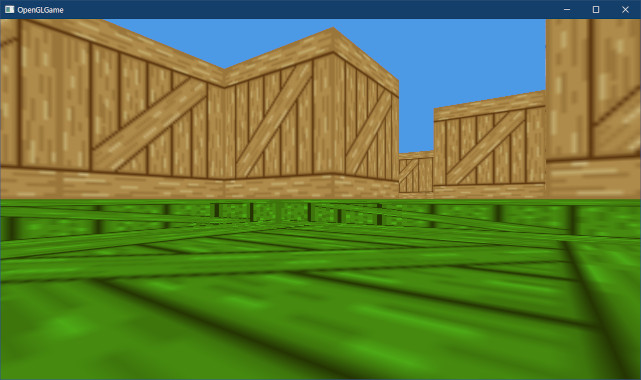
</p>

### 1.4 カメラの位置と向きを調整する

迷路を見るためにいちいち振り向かないといけないのは面倒です。それに、目線が床の高さにあって見づらいです。そこで、カメラの向きと位置と変更します。`Engine.cpp`を開き、
`Initialize`メンバ関数の末尾に次のプログラムを追加してください。

```diff
   // カメラ操作用コンポーネントを追加
   auto player = Create<GameObject>("player", { 0, 10, 0 });
   player->AddComponent<PlayerComponent>();
+
+  // カメラの初期設定
+  camera.position = { 3, 1, 3 };
+  camera.rotation.y = 3.14159265f;

   return 0; // 正常に初期化された
 }
```

プログラムが書けたらビルドして実行してください。最初から迷路の中が表示され、さらに目線が少し高くなっていたら成功です。

<p align="center">
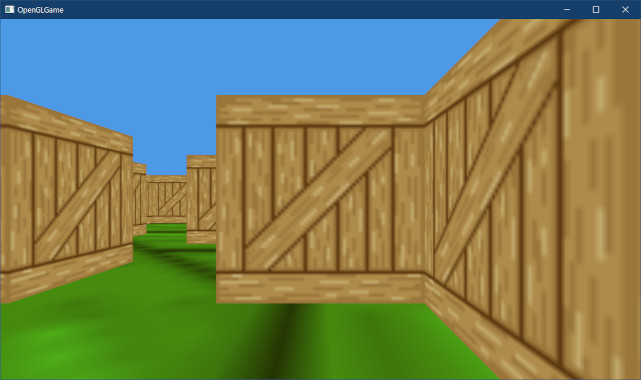
</p>

>**【1章のまとめ】**
>
>* ゲームプログラムは「ゲームプレイ」部分と、「ゲームエンジン」部分に分けられる。ゲームプレイ部分を作成する方法のひとつに、ゲームを「シーン」や「レベル」と呼ばれる単位で管理する手法がある。
>* シーンの目的は、ゲームプレイに必要なゲームオブジェクトを配置し、それらを制御すること。
>* エディタがない、または外部にある配置データを読み込む場合、ゲームオブジェクトの配置はプログラムで記述する。

<div style="page-break-after: always"></div>

## 2. テクスチャを切り替える

### 2.1 テクスチャクラスを定義する

現在の迷路は、床も壁も全て「木箱テクスチャ」が貼られています。一応、床の色を変えてはいますが、せいぜい倉庫にしか見えません。子供用の迷路アトラクションでも、もう少し見た目に気を使うでしょう。

そこで、オブジェクトごとにテクスチャを変えられるようにします。やり方は簡単で、オブジェクトを描画するたびに使うテクスチャを指定するだけです。

これまでは「最初にテクスチャを設定してあとは放置」という、言ってみれば「手抜き」だったわけで、「面倒だけど毎回ちゃんと設定しよう」ということですね。

複数のテクスチャを扱うことになるので、テクスチャを手軽に扱うためのクラスを用意します。プロジェクトの`Src/Engine`フォルダに`Texture.h`(テクスチャ・エイチ)という名前のヘッダファイルを追加してください。

追加したヘッダファイルを開き、次のプログラムを追加してください。

```diff
+/**
+* @file Texture.h
+*/
+#ifndef TEXTURE_H_INCLUDED
+#define TEXTURE_H_INCLUDED
+#include "glad/glad.h"
+#include <string>
+#include <memory>
+
+// 先行宣言
+class Texture;
+using TexturePtr = std::shared_ptr<Texture>;
+
+/**
+* テクスチャ管理クラス
+*/
+class Texture
+{
+public:
+  explicit Texture(const char* filename);
+  ~Texture();
+
+  // コピーと代入を禁止
+  Texture(const Texture&) = delete;
+  Texture& operator=(const Texture&) = delete;
+
+  // 管理番号を取得
+  operator GLuint() const { return id; }
+
+  // 幅と高さを取得
+  int GetWidth() const { return width; }
+  int GetHeight() const { return height; }
+
+  // 名前を取得
+  const std::string& GetName() const { return name; }
+
+private:
+  std::string name; // テクスチャ名(主にデバッグ用)
+  GLuint id = 0;    // オブジェクト管理番号
+  int width = 0;    // テクスチャの幅
+  int height = 0;   // テクスチャの高さ
+};
+
+#endif // TEXTURE_H_INCLUDED
```

この`Texture`(テクスチャ)クラスは「OpenGLのテクスチャオブジェクトを管理するクラス」です。役割は「OpenGLのオブジェクト管理番号を保持し、デストラクタでオブジェクトを削除する」ことです。

OpenGLのオブジェクト管理番号は、ポインタと同様に「リソース(コンピュータが利用可能な資源)」を指しています。`new`で作ったポインタを2回以上`delete`すると致命的なエラーになるように、OpenGLのオブジェクトも削除できるのは1回だけです。

また、ポインタを手動で管理するとバグを生みやすいため、C++には「スマートポインタ」という「リソース管理を自動化する仕組み」が用意されています。しかし、OpenGLには該当する機能がありません。

そこで、「オブジェクト管理番号を扱うクラス」と「スマートポインタ」を組み合わせて管理を自動化します。OpenGLのオブジェクトは種類によって削除関数が異なるため、オブジェクトの種類ごとに管理クラスを定義する必要があります。

#### 【deleteによる関数定義の禁止】

また、管理すべき資源のコピーがあるとエラーになる場合、「コピーコンストラクタ」と「コピー代入演算子」の定義を禁止して、コピー及び代入をできなくする必要があります。

この2つのメンバ関数を明示的に定義しない場合、コンパイラによって自動的(暗黙)に定義されます。だから、コピーに関するコードを何も書いていないのに、クラスのコピーや代入ができるわけです。

関数の定義を禁止するには、メンバ関数宣言の末尾に`= delete`を付けます。この`delete`
(デリート)宣言によって関数の定義が禁止されます。

コピーコンストラクタとコピー代入演算子の関数定義を禁止することで、次のようなコードはビルドエラーになります。

>```c++
>Texture a;
>Texture b(a); // エラー。コピーコンストラクタが禁止されている。
>Texture c;
>c = a;        // エラー。コピー代入演算子が禁止されている。
>```

実際、`Texture`クラスで上記のコードが許可されてしまうと、同じ管理番号に対して
`glDeleteTextures`が複数回呼ばれてしまい、多重解放のエラーが発生してしまいます。

つまり、`Texutre`クラスの定義でコピーと代入を禁止しているのは、多重解放エラーが起きないようにするためなのです。

### 2.2 コンストラクタを定義する

次に`Texture`クラスのコンストラクタを定義します。プロジェクトの`Src/Engine`フォルダに`Texture.cpp`という名前のCPPファイルを追加してください。追加したCPPファイルを開き、次のプログラムを追加してください。

```diff
+/**
+* @file Texture.cpp
+*/
+#include "Texture.h"
+#include <vector>
+#include <fstream>
+#include <filesystem>
+
+#pragma warning(push)
+#pragma warning(disable:4005)
+#include <Windows.h>
+#pragma warning(pop)
```

コンストラクタではテクスチャを作成します。これは、以前作成した`LoadTexture`関数とほとんど同じなので、コピペして再利用しましょう。`Engine.cpp`を開き、`LoadTexture`関数を切り取ってください

```diff
   glCompileShader(object);
   return object;
 }
-
-/**
-* テクスチャを読み込む
-*
-* @param filename テクスチャファイル名
-*
-* @return テクスチャの管理番号
-*/
-GLuint LoadTexture(const char* filename)
-{
-  std::ifstream file(filename, std::ios::binary);
-  if ( ! file) {
-    char s[256];
-    snprintf(s, 256, "[ERROR] %s: %sを開けません\n", __func__, filename);
-            ・
-            ・
-          (省略)
-            ・
-            ・
-  glTextureStorage2D(object, 1, GL_RGBA8, width, height);
-  glTextureSubImage2D(object, 0, 0, 0, width, height,
-    GL_BGRA, GL_UNSIGNED_BYTE, buffer.data() + tgaHeaderSize);
-  return object;
-}

 /**
 * ゲームエンジンを実行する
```

再び`Texture.cpp`を開き、切り取ったプログラムを貼り付けてください。

```diff
 #include <Windows.h>
 #pragma warning(pop)
+
+/**
+* テクスチャを読み込む
+*
+* @param filename テクスチャファイル名
+*
+* @return テクスチャの管理番号
+*/
+GLuint LoadTexture(const char* filename)
+{
+  std::ifstream file(filename, std::ios::binary);
+  if ( ! file) {
+    char s[256];
+    snprintf(s, 256, "[ERROR] %s: %sを開けません\n", __func__, filename);
+            ・
+            ・
+          (省略)
+            ・
+            ・
+  glTextureStorage2D(object, 1, GL_RGBA8, width, height);
+  glTextureSubImage2D(object, 0, 0, 0, width, height,
+    GL_BGRA, GL_UNSIGNED_BYTE, buffer.data() + tgaHeaderSize);
+  return object;
+}
```

続いて、貼り付けた`LoadTexture`関数をコンストラクタに改造します。`LoadTexture`関数の定義を次のように変更してください。

```diff
 #pragma warning(pop)

 /**
-* テクスチャを読み込む
+* コンストラクタ
 *
 * @param filename テクスチャファイル名
-*
-* @return テクスチャの管理番号
 */
-GLuint LoadTexture(const char* filename)
+Texture::Texture(const char* filename)
 {
   std::ifstream file(filename, std::ios::binary);
   if ( ! file) {
     char s[256];
     snprintf(s, 256, "[ERROR] %s: %sを開けません\n", __func__, filename);
     OutputDebugString(s);
-    return 0;
+    return;
   }
 
   // ファイルを読み込む
   const size_t filesize = std::filesystem::file_size(filename);
   std::vector<uint8_t> buffer(filesize);
   file.read(reinterpret_cast<char*>(buffer.data()), buffer.size());
   file.close();
 
   // ヘッダから情報を取得
   const size_t tgaHeaderSize = 18; // ヘッダ情報のバイト数
-  const int width = buffer[12] + buffer[13] * 256;
-  const int height = buffer[14] + buffer[15] * 256;
+  width = buffer[12] + buffer[13] * 256;
+  height = buffer[14] + buffer[15] * 256;
 
   // テクスチャを作成
   GLuint object = 0; // テクスチャの管理番号
   glCreateTextures(GL_TEXTURE_2D, 1, &object);
   glTextureStorage2D(object, 1, GL_RGBA8, width, height);
   glTextureSubImage2D(object, 0, 0, 0, width, height,
     GL_BGRA, GL_UNSIGNED_BYTE, buffer.data() + tgaHeaderSize);
-  return object;
+
+  id = object;
+  name = filename;
 }
```

これでコンストラクタは完成です。

### 2.3 デストラクタを定義する

次にデストラクタを定義します。コンストラクタの定義の下に、次のプログラムを追加してください。

```diff
   id = object;
   name = filename;
 }
+
+/**
+* デストラクタ
+*/
+Texture::~Texture()
+{
+  glDeleteTextures(1, &id);
+}
```

デストラクタでは`glDeleteTextures`関数を使ってテクスチャオブジェクトを削除します。<br>
これで`Texture`クラスは完成です。

### 2.4 GameObjectにテクスチャを追加する

次に、ゲームオブジェクトごとに異なるテクスチャが使えるようにします。<br>
`GameObject.h`を開き、`Texture.h`をインクルードしてください。

```diff
 #ifndef GAMEOBJECT_H_INCLUDED
 #define GAMEOBJECT_H_INCLUDED
 #include "Component.h"
+#include "Texture.h"
 #include "VecMath.h"
 #include <string>
```

そして、`GameObject`クラスの定義に、次の変数定義を追加してください。

```diff
   vec3 rotation  = { 0, 0, 0 };    // 物体の回転
   vec3 scale     = { 1, 1, 1 };    // 物体の拡大率
   float color[4] = { 1, 1, 1, 1 }; // 物体の色
+  TexturePtr texColor;             // 表示に使うカラーテクスチャ

 private:
   Engine* engine = nullptr;        // エンジンのアドレス
```

追加した変数にテクスチャを設定しましょう。まず画像ファイルを用意します。

<pre class="tnmai_assignment">
<strong>【課題01】</strong>
次のURLからfloor.pngとwall.pngという画像ファイルをダウンロードしなさい。
ダウンロードした2つのファイルをTGA形式に変換し、プロジェクトの<code>Res</code>フォルダに保存しなさい。

https://github.com/tn-mai/OpenGL3D2023/tree/main/res/
</pre>

画像ファイルの用意ができたら、`MainGameScene.cpp`を開き、`Initialize`メンバ関数を次のように変更してください。

```diff
     static_cast<float>(mapSizeX) * squareScale, 1,
     static_cast<float>(mapSizeY) * squareScale };
   floor->position = { floor->scale.x, -1, floor->scale.z };
-  floor->color[0] = 0.4f;
-  floor->color[2] = 0.2f;
+  floor->texColor = std::make_shared<Texture>("Res/floor.tga");

   // 壁を作成
+  auto texWall = std::make_shared<Texture>("Res/wall.tga");
   for (int y = 0; y < mapSizeY; ++y) {
     for (int x = 0; x < mapSizeX; ++x) {
       const float posX = static_cast<float>(x + 0.5) * squareSize;
       const float posZ = static_cast<float>(y + 0.5) * squareSize;
       if (GetMapData(x, y) == '#') {
         auto wall = engine.Create<GameObject>(
           "wall", { posX, 0.5f * squareSize, posZ });
         wall->scale = { squareScale, squareScale, squareScale };
+        wall->texColor = texWall;
       }
     } // for x
```

これで、床と壁に異なるテクスチャを設定することができました。

### 2.5 描画にtexColor変数を使うようにする

`GameObject`にテクスチャを設定しただけでは画面には表示されません。設定したテクスチャを「描画に使うテクスチャ」としてGPUに通知する必要があります。

`Engine.cpp`を開き、「ゲームオブジェクトを描画」するプログラムに次のプログラムを追加してください。

```diff
     glProgramUniform2f(prog3D, 2, sin(e->rotation.y), cos(e->rotation.y));

     // 描画に使うテクスチャを指定
+    if (e->texColor) {
+      const GLuint tex = *e->texColor;
       glBindTextures(0, 1, &tex);
+    }

     // 図形を描画
     glDrawElementsInstanced(GL_TRIANGLES, indexCount, GL_UNSIGNED_SHORT, 0, 1);
```

`texColor`はスマートポインタなので、`*`演算子で値を取り出さなくてはならない点に注意してください。

<pre class="tnmai_assignment">
<strong>【課題02】</strong>
ここまでの変更の結果、<code>Engine</code>クラスの<code>tex</code>メンバ変数は不要になります。<code>tex</code>メンバ変数と、このメンバ変数を使用しているプログラムを全て削除しなさい。
</pre>

課題02が完了したら、プログラムをビルドして実行してください。床と壁に異なる石テクスチャが表示されていたら成功です。

<p align="center">
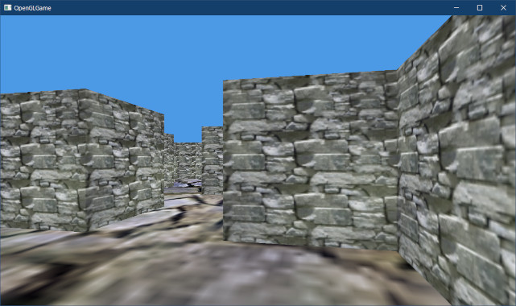
</p>

>**【2章のまとめ】**
>
>* OpenGLオブジェクトの管理番号は、C++の`new`で取得したポインタと同様に、多重解放しようとするとエラーになる。
>* 管理番号をスマートポインタによって管理し、コピーと代入を禁止することで、多重解放を防ぐことができる。
>* 関数の定義を禁止するには、関数宣言に`= delete`を付ける。

<div style="page-break-after: always"></div>

## 3. 複数の図形を表示する

### 3.1 描画パラメータを定義する

これまで図形といえば直方体でした。直方体は使い勝手の良い便利な図形ではありますが、直方体だけで作られたゲームというのはほとんど存在しません。

なぜなら、3Dゲームが<ruby>模倣<rt>もほう</rt></ruby>しようとしている現実の世界には、直方体以外にもさまざまな図形が存在するからです。つまり、それらの図形を3Dゲームに取り込めば、より現実に近い映像を作れると考えられます。

OpenGLで多数の図形を扱う方法は主に2つあります。

>1. ひとつのバッファに複数の図形を格納し、図形ごとに異なる描画パラメータを使う。
>2. 図形ごとにバッファを作成し、描画する際にバッファを切り替える。

一般的には、1の「ひとつのバッファ+異なる描画パラメータ」の方法を使います。GPUは複雑なシステムなので、わずかな状態を変更であっても大きく速度が低下する可能性があるからです。

そのため、頻繁にバッファを切り替える2の方法より、バッファを切り替えない1の方法のほうが多くの図形を描画できます。

>**【2を使うことはない？】**<br>
>実際のゲームでは、1と2のハイブリッド構成にして、目的に応じてバッファを使い分けることが多いです。

そういうわけで、本テキストでも1の「ひとつのバッファ+異なる描画パラメータ」を使うことにします。

最初に「描画パラメータ」を定義します。プロジェクトの`Src/Engine`フォルダに`Mesh.h`
(メッシュ・エイチ)という名前のヘッダファイルを追加してください。追加したファイルを開き、次のプログラムを追加してください。

```diff
+/**
+* @file Mesh.h
+*/
+#ifndef MESH_H_INCLUDED
+#define MESH_H_INCLUDED
+#include "glad/glad.h"
+#include "VecMath.h"
+
+/**
+* 描画パラメータ
+*/
+struct DrawParams
+{
+  GLenum mode = GL_TRIANGLES; // プリミティブの種類
+  GLsizei count = 0;          // 描画するインデックス数
+  const void* indices = 0;    // 描画開始インデックスのバイトオフセット
+  GLint baseVertex = 0;       // インデックス0となる頂点配列内の位置
+};
+
+#endif // MESH_H_INCLUDED
```

描画パラメータの名前は`DrawParams`(ドロー・パラムス)としました。<br>
`Params`は`Parameter`(パラメータ)の複数形を短縮した名前です。

`DrawParams`のメンバには、`glDrawElementsInstancedBaseVertex`(ジーエル・ドロー・エレメンツ・インスタンスド・ベース・バーテックス)関数の引数をほぼそのまま使っています。

<p><code class="tnmai_code"><strong>【書式】</strong><br>
void glDrawElementsInstancedBaseVertex(図形の種類, インデックスデータ数,<br>
&emsp;インデックスデータの型, インデックスデータの開始位置, 描画する図形の数,<br>
&emsp;インデックス0とみなす頂点データの位置);
</code></p>

この関数は、`glDrawElementsInstanced`関数に「インデックス0とみなす頂点データの位置」を追加したものです。これを「ベース・バーテックス」と呼びます。

ベースバーテックスを使うと、頂点配列内の好きな頂点データを「インデックス0番」にすることができます。この機能は、ひとつのVBOに大量の図形を格納する場合に役立ちます。

>`indices`は「インディシズ」と読みます。これは`index`(インデックス)の複数形です。`idnex`の複数形には`indexes`(インデクシス)もあって、厳密には使い分けがあるらしいのですが、まあ、どちらでも好きな方を使えばよいです。

これで描画パラメータの定義は完了ですが、ついでに`Engine.cpp`にある`Vertex`構造体を
`Mesh.h`に移動しておきます。理由は、今後`Engine.cpp`以外のファイルから`Vertex`構造体を参照する可能性があるからです。

`Engine.cpp`を開き、`Initialize`メンバ関数にある`Vertex`構造体の定義を切り取ってください。

```diff
   glAttachShader(prog3D, fs);
   glLinkProgram(prog3D);

   // 頂点データをGPUメモリにコピー
-  struct Vertex {
-    vec3 position; // 頂点座標
-    vec2 texcoord; // テクスチャ座標
-  };
   const Vertex vertexData[] = {
     // +Z(手前の面)
```

再び`Mesh.h`を開き、切り取った`Vertex`構造体を貼り付けてください。

```diff
 #define MESH_H_INCLUDED
 #include "glad/glad.h"
 #include "VecMath.h"
+
+struct Vertex {
+  vec3 position; // 頂点座標
+  vec2 texcoord; // テクスチャ座標
+};

 /**
 * 描画パラメータ
```

移動した構造体に説明コメントを追加します。`Vertex`構造体の定義に、次のプログラムを追加してください。

```diff
 #define MESH_H_INCLUDED
 #include "glad/glad.h"
 #include "VecMath.h"
+
+/**
+* 頂点データ形式
+*/
-struct Vertex {
+struct Vertex
+{
   vec3 position; // 頂点座標
   vec2 texcoord; // テクスチャ座標
```

これで、`Mesh.h`をインクルードすれば`Vertex`構造体が使えるようになります。

### 3.2 図形データをGPUメモリにコピーする

描画パラメータの管理はゲームエンジンが行うことにします。`Engine.h`を開き、`Mesh.h`インクルードしてください。

```diff
 #include "glad/glad.h"
 #include "GameObject.h"
 #include "Scene.h"
+#include "Mesh.h"
 #include <GLFW/glfw3.h>
 #include <string>
```

次に、描画パラメータを管理するメンバ変数を追加します。変数名は`drawParamsList`<br>
(ドロー・パラムス・リスト)とします。`ibo`メンバ変数の定義の下に、次のプログラムを追加してください

```diff
   GLuint vbo = 0;    // 頂点バッファの管理番号
   GLuint ibo = 0;    // インデックスバッファの管理番号
   GLuint vao = 0;    // 構成情報の管理番号
+  std::vector<DrawParams> drawParamsList; // 描画パラメータ配列
   GameObjectList gameObjects; // ゲームオブジェクト配列
   double previousTime = 0; // 前回更新時の時刻
```

それと、図形を追加するときに使うメンバ変数も追加しておきましょう。`ibo`メンバ変数の定義の下に、次のプログラムを追加してください。

```diff
   GLuint vbo = 0;    // 頂点バッファの管理番号
   GLuint ibo = 0;    // インデックスバッファの管理番号
   GLuint vao = 0;    // 構成情報の管理番号
+  GLintptr vboSize = 0; // 頂点バッファの現在のサイズ
+  GLintptr iboSize = 0; // インデックスバッファの現在のサイズ
   std::vector<DrawParams> drawParamsList; // 描画パラメータ配列
   GameObjectList gameObjects; // ゲームオブジェクト配列
```

`vboSize`(ブイビーオー・サイズ)と`iboSize`(アイビーオー・サイズ)は、各バッファに格納されたデータのバイト数を示します。

続いて、`drawParamsList`に描画パラメータを追加します。まず、追加する図形データの情報を定義しましょう。

`Engine.cpp`を開き、`Initialize`メンバ関数の定義にある「インデックスデータをGPUメモリにコピー」するプログラムの下に、次のプログラムを追加してください。

```diff
   indexCount = static_cast<GLsizei>(std::size(indexData));

   glCreateBuffers(1, &ibo);
   glNamedBufferStorage(ibo, sizeof(indexData), indexData, 0);
+
+  // 図形データの情報
+  struct MeshData {
+    size_t vertexSize;      // 頂点データのバイト数
+    size_t indexSize;       // インデックスデータのバイト数
+    const void* vertexData; // 頂点データのアドレス
+    const void* indexData;  // インデックスデータのアドレス
+  };
+  const MeshData meshes[] = {
+    { sizeof(vertexData), sizeof(indexData), vertexData, indexData },
+  };

   // 頂点属性配列(VAO)を設定
   glCreateVertexArrays(1, &vao); // VAOを作成
```

「図形データの情報」は、`MeshData`(メッシュ・データ)構造体の配列として定義することにしました。この構造体は、図形の頂点データとインデックスデータに関する情報を保持します。

今はひとつの図形しか定義していませんが、後ほど図形を追加します。

>**【メッシュ？】**<br>
>Mesh(メッシュ)は「網、網目模様の織物」という意味の単語です。多角形で作られた図形の頂点をつなぐと網目模様に似ていることから、古くから3Dモデルの形状データを指す単語として使われています。

次に、頂点データとインデックスデータをGPUメモリにコピーします。CPU側のあるデータをGPU側の既存のバッファにコピーするには、以下の手順を踏みます。

>1. コピーするデータを入れる一時的なGPU側バッファを作成(`glCreateBuffers`)。
>2. 作成した一時的なGPU側バッファに、CPU側にあるデータをコピー(`glNamedBufferStorage`)。
>3. 一時的なバッファから、既存のバッファにコピー(`glCopyNamedBufferSubData`)。
>4. 一時的なバッファを削除。

GPU側のメモリの間でデータをコピーするには、`glCopyNamedBufferSubData`(ジーエル・コピー・ネームド・バッファ・サブデータ)という関数を使います。

<p><code class="tnmai_code"><strong>【書式】</strong><br>
void glCopyNamedBufferSubData(コピー元バッファの管理番号,<br>
&emsp;コピー先バッファの管理番号, コピー元の読み取り開始位置,<br>
&emsp;コピー先の書き込み開始位置, コピーするバイト数);
</code></p>

しかし、この関数はGPUメモリにあるバッファの間でしかコピーできません。そのため、先に
`glNamedBufferStorage`関数を使って、CPUメモリからGPUメモリへデータをコピーしておく必要があります。

`glNamedBufferStorage`関数は常に「新しいGPUメモリ領域を確保」するので、既存のバッファを上書きすることはできません。そのため、CPU側のデータを既存のGPU側のバッファへコピーするには、上記のような少し回りくどい方法を使うことになります。

>**【別のコピー方法】**<br>
>他の方法として、既存のバッファを「上書きを許可」するように作成し、直接データをコピーする関数(`glNamedBufferSubData`)を使う、というやりかたもあります。<br>
>この方法の利点は、プログラムは簡単になることです。欠点は、「上書きを許可」したバッファによる描画は、通常のバッファよりも描画速度が低下することです。<br>
>大抵の場合、描画速度が低下するのは許容できないため、主にデータを頻繁に上書きする用途(UIの文字描画など)でのみ使われます。

それでは、図形データをコピーするプログラムを作成しましょう。図形データの情報を定義するプログラムの下に、次のプログラムを追加してください。

```diff
   const MeshData meshes[] = {
     { sizeof(vertexData), sizeof(indexData), vertexData, indexData },
   };
+
+  // 図形データから描画パラメータを作成し、データをGPUメモリにコピーする
+  drawParamsList.reserve(std::size(meshes));
+  for (const auto& e : meshes) {
+    // 図形データをGPUメモリにコピー
+    GLuint tmp[2];
+    glCreateBuffers(2, tmp);
+    glNamedBufferStorage(tmp[0], e.vertexSize, e.vertexData, 0);
+    glNamedBufferStorage(tmp[1], e.indexSize, e.indexData, 0);
+    glCopyNamedBufferSubData(tmp[0], vbo, 0, vboSize, e.vertexSize);
+    glCopyNamedBufferSubData(tmp[1], ibo, 0, iboSize, e.indexSize);
+    glDeleteBuffers(2, tmp);
+
+    // バッファの現在のサイズを更新
+    vboSize += e.vertexSize;
+    iboSize += e.indexSize;
+  }

   // 頂点属性配列(VAO)を設定
   glCreateVertexArrays(1, &vao); // VAOを作成
```

「一時的なバッファ」は`tmp`(テンプ, `temporary`(テンポラリ)の短縮形, 「一時的な、仮の」という意味)という名前の変数で作成しています。

また、図形データには「頂点データ」と「インデックスデータ」の2種類があるため、2つのバッファを作成し、コピーも2回行っています。

最後に、図形に対応する「描画パラメータ」を作成します。図形データをGPUメモリにコピーするプログラムの下に、次のプログラムを追加してください。

```diff
     glCopyNamedBufferSubData(tmp[0], vbo, 0, vboSize, e.vertexSize);
     glCopyNamedBufferSubData(tmp[1], ibo, 0, iboSize, e.indexSize);
     glDeleteBuffers(2, tmp);
+
+    // 描画パラメータを作成
+    DrawParams params;
+    params.mode = GL_TRIANGLES;
+    params.count = static_cast<GLsizei>(e.indexSize / sizeof(uint16_t));
+    params.indices = reinterpret_cast<void*>(iboSize);
+    params.baseVertex = static_cast<GLint>(vboSize / sizeof(Vertex));
+    drawParamsList.push_back(params); // 描画パラメータを配列に追加

     // バッファの現在のサイズを更新
     vboSize += e.vertexSize;
```

`indexSize`や`vertexSize`は「バイト数」なので、「インデックス数」や「頂点数」に変換するにはデータのバイト数で割る必要があります。

また、`indices`はポインタ型の変数なので`reinterpret_cast`(リ・インタープリト・キャスト, 再解釈キャスト)を使って整数型からポインタ型に変換しています。

>**【どうしてキャストが必要なの？ ていうか、何故この引数はポインタ型なの？】**<br>
>`indices`引数がポインタ型な理由は、元々は(OpenGL 1.4までは)、本当にインデックスデータ配列のアドレスを指定していたからです。OpenGL 1.5において「バッファオブジェクト(VBOとIBOのこと)」機能が追加される段階で、既存の(配列アドレスを使う)関数とは別の関数を作るか、既存の関数を使い回すかが検討されました。<br>
>その結果、「1.4の時点で既に多くの描画関数が存在しており、このうえバッファオブジェクト用に新しい関数を追加するとなると、描画関数の総数が大変なことになる」という理由から、既存の関数を使い回すことが決定されたのです。これが2003年のことで、当時のOpenGLの利用者はコンピューターグラフィックスを専攻する限られた人々だけだったため、「型が異なると利用者が混乱するし、最適化に影響するかもしれない」などということは、あまり考慮されなかったようです(詳細は次のURLの`Issues`を参照)。
>
>`https://registry.khronos.org/OpenGL/extensions/ARB/ARB_vertex_buffer_object.txt`

### 3.3 バッファサイズを変更する

これで`meshes`配列にデータを追加すれば、図形を増やせるようになりました。しかし、追加できる数はバッファのサイズに制限されます。そして、現在のバッファのサイズはというと、「立方体ひとつぶん」です。

これでは図形を追加したくてもできないので、バッファサイズを増やしましょう。まず、VBOを作成するプログラムを次のように変更してください。

```diff
     { { -1, 1, -1 }, { 0, 1 } },
   };
   glCreateBuffers(1, &vbo);
-  glNamedBufferStorage(vbo, sizeof(vertexData), vertexData, 0);
+  glNamedBufferStorage(vbo, sizeof(Vertex) * 10'000, nullptr, 0);

   // インデックスデータをGPUメモリにコピー
   const GLushort indexData[] = {
```

次に、IBOを作成するプログラムを次のように変更してください。

```diff
   indexCount = static_cast<GLsizei>(std::size(indexData));

   glCreateBuffers(1, &ibo);
-  glNamedBufferStorage(ibo, sizeof(indexData), indexData, 0);
+  glNamedBufferStorage(ibo, sizeof(uint16_t) * 40'000, nullptr, 0);

   // 図形データの情報
   struct MeshData {
```

これで、1万頂点、4万インデックスまでの図形を追加できるようになりました。頂点のほうが数が少ないのは、頂点は複数の平面で共有されることがあるためです。<br>
例えば、四角形の頂点は4個ですが、インデックスは三角形2個分なので6個必要です。

なお、設定するデータには`nullptr`を指定して「データ未定義」としています。
`glNamedBufferStorage`関数は指定したサイズと同じ量のをコピーしようとするため、十分なサイズを持つ図形データを指定しないと実行時エラーになってしまうからです。

### 3.4 ゲームオブジェクトに図形番号を追加する

複数の図形を使い分けるために、ゲームオブジェクトに図形番号を示すメンバ変数を追加します。`GameObject.h`を開き、`GameObject`クラスの定義に次のプログラムを追加してください。

```diff
   vec3 scale     = { 1, 1, 1 };    // 物体の拡大率
   float color[4] = { 1, 1, 1, 1 }; // 物体の色
   TexturePtr texColor;             // 表示に使うカラーテクスチャ
+  int meshId = -1;                 // 表示する図形の番号

 private:
   Engine* engine = nullptr;        // エンジンのアドレス
```

次に、ゲームエンジンが図形番号を使って描画する図形を切り替えるようにします。<br>
まず、図形番号が有効かどうかをチェックします。`Engine.cpp`を開き、`Render`メンバ関数の定義に次のプログラムを追加してください。

```diff
   // ゲームオブジェクトを描画
   for (const auto& e : gameObjects) {
+    // 図形番号がリストにない場合は描画しない
+    if (e->meshId < 0 || e->meshId >= drawParamsList.size()) {
+      continue;
+    }
+
     // ユニフォーム変数にデータをコピー
     glProgramUniform4fv(prog3D, 100, 1, e->color);
```

続いて、図形番号に対応する描画パラメータを取得し、取得した描画パラメータを使って描画するようにします。図形を描画するプログラムを次のように変更してください。

```diff
       glBindTextures(0, 1, &tex);
     }

     // 図形を描画
-    glDrawElementsInstanced(GL_TRIANGLES, indexCount, GL_UNSIGNED_SHORT, 0, 1);
+    const DrawParams& params = drawParamsList[e->meshId];
+    glDrawElementsInstancedBaseVertex(params.mode, params.count,
+      GL_UNSIGNED_SHORT, params.indices, 1, params.baseVertex);
   }

   glfwSwapBuffers(window);
```

これで、ゲームオブジェクトの図形番号に指定した図形データが描画されるようになりました。

### 3.5 図形を追加する

いよいよ図形データを追加します。といっても、直方体のときのように手作業で図形データを作成するのは大変です。そこで、以下のURLに、図形データを定義したヘッダファイルを用意しておきました。

図形データは`?????_mesh.h`のように、ファイル名の末尾が`_mesh.h`になっています。

>`https://github.com/tn-mai/OpenGL3D2023/tree/master/res/meshdata`

下準備として、他のヘッダファイルと混同しないように、図形データ用のフォルダを作りましょう。プロジェクトの`Res`フォルダの中に`MeshData`という名前のフォルダを作成してください。

<pre class="tnmai_assignment">
<strong>【課題03】</strong>
プロジェクトの<code>Res</code>フォルダに<code>MeshData</code>という名前の新規フォルダを作成しなさい。
次に、上記のURLから<code>crystal_mesh.h</code>と<code>crystal_blue.png</code>をダウンロードし、
<code>Res/MeshData</code>フォルダに保存しなさい。PNGファイルはTGAファイルに変換すること。

このとき、誤ってHTML形式でダウンロードしないように注意すること。HTML形式かどうかは、実際にファイルを開いてみるか、ファイルサイズを見れば判断できます。
HTML形式でダウンロードしてしまった場合、ダウンロード方法を確認してテキスト形式でダウンロードしなおすこと。
</pre>

それでは図形データをプログラムに組み込みましょう。`Engine.cpp`を開き、`filesystem`
ヘッダのインクルード文の下に、次のプログラムを追加してください。

```diff
 #include <fstream>
 #include <filesystem>
 #include <stdio.h>
+
+// 図形データ
+#include "../../Res/MeshData/crystal_mesh.h"

 /**
 * OpenGLからのメッセージを処理するコールバック関数
```

次に、`Initialize`メンバ関数の中の`meshes`配列変数に、次のプログラムを追加してください。

```diff
   };
   constexpr MeshData meshes[] = {
     { sizeof(vertexData), sizeof(indexData), vertexData, indexData },
+    { sizeof(crystal_vertices), sizeof(crystal_indices),
+      crystal_vertices, crystal_indices },
   };

   // 図形データから描画パラメータを作成し、データをGPUメモリにコピーする
```

これで、図形番号1番に「クリスタル」の図形データが読み込まれます。今度はクリスタルを画面に表示しましょう。実はマップデータには壁の`#`以外にもいくつかの文字が書き込まれています。

文字`C`の場所にクリスタルを表示しましょう。`MainGameScene.cpp`を開き、`Initialize`
メンバ関数にある壁を作成するプログラムに、次のプログラムを追加してください。

```diff
   floor->position = { floor->scale.x, -1, floor->scale.z };
   floor->texColor = std::make_shared<Texture>("Res/floor.tga");
+  floor->meshId = 0;

   // 壁を作成
   auto texWall = std::make_shared<Texture>("Res/wall.tga");
+  auto texCrystalBlue = std::make_shared<Texture>("Res/MeshData/crystal_blue.tga");
   for (int y = 0; y < mapSizeY; ++y) {
     for (int x = 0; x < mapSizeX; ++x) {
       const float posX = static_cast<float>(x + 0.5) * squareSize;
       const float posZ = static_cast<float>(y + 0.5) * squareSize;
       if (GetMapData(x, y) == '#') {
         auto wall = engine.Create<GameObject>(
           "wall", { posX, 0.5f * squareSize, posZ });
         wall->scale = { squareScale, squareScale, squareScale };
         wall->texColor = texWall;
+        wall->meshId = 0;
+      } else if (GetMapData(x, y) == 'C') {
+        // クリスタルを配置
+        auto crystal = engine.Create<GameObject>("crystal", { posX, 1, posZ });
+        crystal->scale = { 0.5f, 0.5f, 0.5f };
+        crystal->texColor = texCrystalBlue;
+        crystal->meshId = 1;
       }
     } // for x
```

プログラムが書けたらビルドして実行してください。迷路の何処かに青いクリスタルが浮いていたら成功です。

<p align="center">
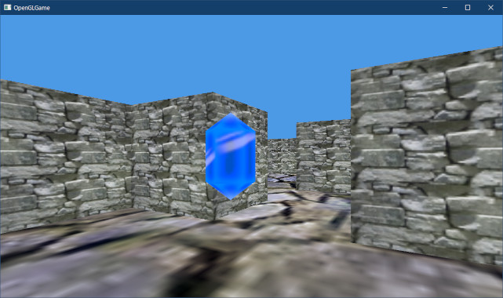
</p>

<pre class="tnmai_assignment">
<strong>【課題04】</strong>
前掲のURLから<code>wall_mesh.h</code>をダウンロードし、図形データを<code>Engine::Initialize</code>メンバ関数の<code>meshes</code>配列に追加しなさい。
追加した図形の番号を、壁(<code>#</code>)の<code>meshId</code>に設定しなさい。
なお、この図形は「中心座標(0, 1, 0)、1辺の長さが2の立方体」です。最初に作った立方体は中心が(0, 0, 0)なので、単に置き換えた状態ではY方向に1単位ずれて表示されます。そこで、壁を配置するY座標を0に変更して「ずれ」を解消しなさい。
</pre>

>**【3章のまとめ】**
>
>* 複数の図形データをひとつのバッファにまとめておくと、バッファの切替が不要になるため描画を高速化できる。
>* GPU側にある既存のバッファオブジェクトにCPU側のデータをコピーするには、まずデータから新しいバッファオブジェクトを作成し、次に作成したバッファオブジェクトから既存のバッファオブジェクトへとコピーする。
>* 空のバッファを作成するには`glNamedBufferStorage`関数の引数に`nullptr`を指定する。

<div style="page-break-after: always"></div>

## 4. 壁の衝突判定

### 4.1 軸平行境界ボックス

ここまで作成したプログラムでは、壁を表示して自由に動き回れるようになっています。しかし、壁に衝突判定がないので、簡単にすり抜けて好きな場所へ移動できてしまいます。これでは迷路の意味がなく、ゲームとして成立しているとはいえません。

そこで、壁の衝突判定を行うことにします。衝突判定用の図形には様々なものがあり、どれも一長一短です。「すべての状況において最適な単一の図形」などというものは存在しません。

<p align="center">
計算が高速/少ない消費メモリ <---> 図形に近い判定<br>
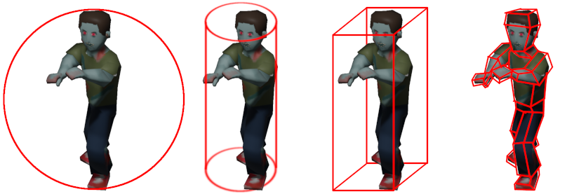<br>
球体、垂直円柱、直方体(AABB)、複数図形
</p>

今回は、最も一般的な形状である「直方体」を使うことにします。直方体の利点はなんといっても「作成が簡単なわりに使いやすい」という点です。

ただし、回転させた直方体の衝突判定を扱うのは結構大変です。そこで、プログラムを簡単にするために、ワールド座標系のXYZ軸に沿った直方体だけを扱い、回転は行わないことにします。

このような直方体のことを「<ruby>軸平行境界<rt>じくへいこうきょうかい</rt></ruby>ボックス」といいます。英語では`Axis Aligned Bounding Box`(アクシス・アラインド・バウンディング・ボックス)といい、`AABB`(エーエービービー)と略されます。

`AABB`の表現方法は複数ありますが、今回は次のように「各軸の最小値(`min`)と最大値(`max`)」によって表現することにします。

<p align="center">
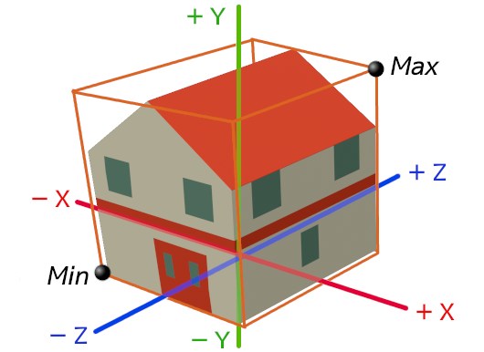
</p>

プロジェクトの`Src/Engine`フォルダに`Collision.h`(コリジョン・エイチ)という名前のヘッダファイルを追加してください(`Collision`は「衝突」という意味)。追加したファイルを開き、次のプログラムを追加してください。

```diff
+/**
+* @file Collision.h
+*/
+#ifndef COLLISION_H_INCLUDED
+#define COLLISION_H_INCLUDED
+#include "VecMath.h"
+
+/**
+* 軸平行境界ボックス
+*/
+struct AABB
+{
+  vec3 min;
+  vec3 max;
+};
+
+bool Intersect(const AABB& a, const AABB& b, vec3& penetration);
+
+#endif // COLLISION_H_INCLUDED
```

衝突判定は`Intersect`(インターセクト, 「交差する」という意味)関数で行います。この関数は衝突の有無を戻り値で返し、交差している距離を`penetration`(ペネトレーション, 「貫通」、「浸透」という意味)引数で返します。

### 4.2 交差判定

それでは`Intersect`関数を定義しましょう。プロジェクトの`Src/Engine`フォルダに
`Collision.cpp`という名前のCPPファイルを追加してください。追加したファイルを開き、次のプログラムを追加してください。

```diff
+/**
+* @file Collision.cpp
+*/
+#include "Collision.h"
+
+/**
+* AABB同士の交差判定
+*
+* @param a           判定対象のAABBその1
+* @param b           判定対象のAABBその2
+* @param penetration 貫通ベクトル
+*
+* @retval true  交差している
+* @retval false 交差していない
+*/
+bool Intersect(const AABB& a, const AABB& b, vec3& penetration)
+{
+  return true;
+}
```

直方体同士の衝突の有無を調べるには、X, Y, Zの3つの軸について、個別に衝突しているかどうかを調べます。次の図では、2つの直方体`a`と`b`の関係を表したものです。`min`がマイナス方向の平面、`max`がプラス方向の平面の座標を表していると考えてください。

<p align="center">
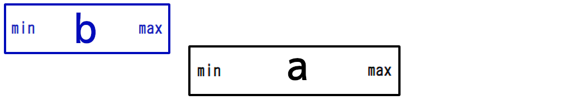<br>
[衝突していない(a.min > b.max)]
</p>

記述を簡単にするため、直方体`a`の`min`の値のことを`a.min`、`a`の`max`の値のことを
`a.max`のように書くことにします。さて、上の図のように`a.min`が`b.max`より右にある(`b.max`より大きい)場合、直方体`a`と`b`は衝突していません。

<p align="center">
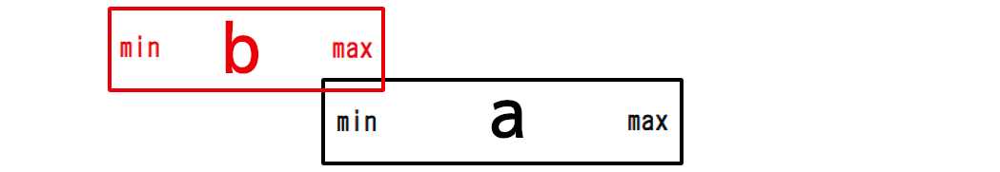<br>
[衝突している(a.min &lt;= b.max)]
</p>

`a.min`が`b.max`の左にある(`b.max`以下)の場合、直方体`a`と`b`は衝突している可能性があります。「可能性がある」と書いたのは、次の場合がありうるからです。

<p align="center">
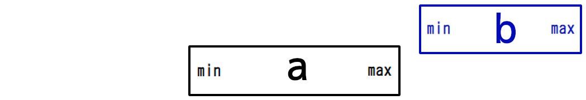<br>
[(a.min &lt;= b.max)なのに衝突していない]
</p>

上の図では`a.min`が`b.max`の左にあります(`b.max`以下)。しかし、図から明らかなように、実際には直方体`a`と`b`は衝突していません。衝突していることを判定するには、反対側の`a.max`と`b.min`についても比較する必要があります。

<div style="page-break-after: always"></div>

`a.min`が`b.max`の左にあり(`a.min <= b.max`)、さらに以下の図のように`a.max`が
`b.min`以上の場合、直方体`a`と`b`は衝突しています。

<p align="center">
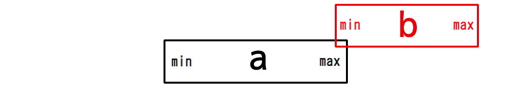<br>
[衝突している(b.min &lt;= a.max)]
</p>

このように、直方体の両側の平面の座標を比較することで、「ある軸において直方体が衝突しているかどうか」を調べることができます。

この判定をX, Y, Zの3つの軸について実行し、「すべての軸で衝突している」と判定された場合、直方体`a`と`b`は実際に衝突しています。「ひとつでも衝突していない軸がある」場合は衝突していません。

まずX軸の衝突判定を作成します。`Intersect`関数に次のプログラムを追加してください。

```diff
 */
 bool Intersect(const AABB& a, const AABB& b, vec3& penetration)
 {
+  // aの左側面がbの右側面より右にあるなら、交差していない
+  const float dx0 = b.max.x - a.min.x;
+  if (dx0 <= 0) {
+    return false;
+  }
+  // aの右側面がbの左側面より左にあるなら、交差していない
+  const float dx1 = a.max.x - b.min.x;
+  if (dx1 <= 0) {
+    return false;
+  }
   return true;
 }
```

このプログラムでは、値を直接比較するのではなく「2つの値の差分」を変数`dx0`と`dx1`に代入し、その差分から交差判定を行っています。この差分は、あとで「貫通距離」を求めるために使います。

同様にして、Y軸とZ軸の判定を行います。X軸の判定の下に、次のプログラムを追加してください。

```diff
   if (dx1 <= 0) {
     return false;
   }
+
+  // aの下面がbの上面より上にあるなら、交差していない
+  const float dy0 = b.max.y - a.min.y;
+  if (dy0 <= 0) {
+    return false;
+  }
+  // aの上面がbの下面より下にあるなら、交差していない
+  const float dy1 = a.max.y - b.min.y;
+  if (dy1 <= 0) {
+    return false;
+  }
+
+  // aの奥側面がbの手前側面より手前にあるなら、交差していない
+  const float dz0 = b.max.z - a.min.z;
+  if (dz0 <= 0) {
+    return false;
+  }
+  // aの手前側面がbの奥側面より奥にあるなら、交差していない
+  const float dz1 = a.max.z - b.min.z;
+  if (dz1 <= 0) {
+    return false;
+  }
+
+  // この時点で交差が確定
   return true;
 }
```

ここまでで、2つのAABBが本当に衝突しているかどうかを決定できます。

### 4.3 貫通距離

さて、壁を貫通させないためには「衝突の有無」だけでは情報が不足しています。「衝突している」と判定されたなら、すでに壁にめりこんでしまったあとだからです。

現実世界のほとんどの物質は、衝突したからといって互いにめり込むことはありません。そのため、自然な衝突を再現するには「めり込み状態を解決」しなくてはなりません。

めり込み状態を解決する方法にはさまざまなものがありますが、今回は最も一般的に使われている「衝突したと思われる方向の平面に向かって移動させる」という方法を使います。

これは次の図のように、貫通距離が0になるように物体を移動させる方法です。

<p align="center">
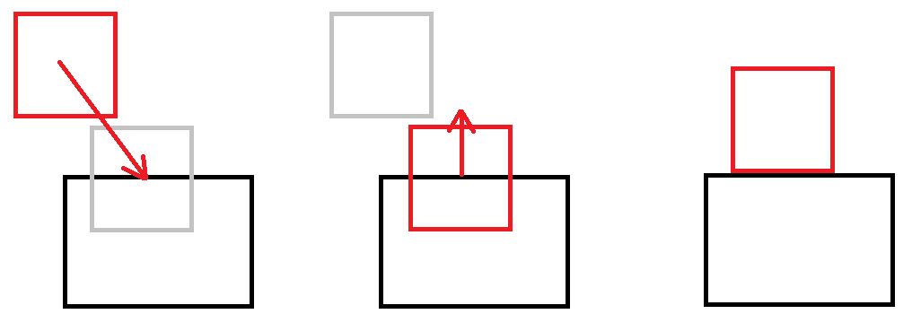<br>
[貫通 -> 移動 -> 未貫通]
</p>

「貫通距離が0になるように物体を移動させる」には、貫通距離と方向が分かっていなくてはなりません。貫通距離はすべての方向について計算済みですが「どの方向から貫通したのか(貫通方向)」はまだ決まっていません。

そこで、貫通方向を選択するプログラムを追加しなくてはなりません。貫通方向を選択する主な方法は以下の2種類です。

>1. 貫通距離が最も短い方向を選ぶ(不正確な方向を選ぶことがある。しかし、実装が簡単で計算が早い)。
>2. 移動速度の情報から、もっとも早く衝突した方向を求める(1より正確。ただし、実装が複雑で計算に時間がかかる)。

ただ、2は移動速度の情報が必要となり、さらに計算時間も長くなります。また、大半の衝突判定において、1と2は同じ貫通方向を選ぶことが分かっています。そのため、今回は1の方法を使います。

さて、AABBにはX, Y, Zの3つの軸があり、それぞれにプラスとマイナスの2つの面があるため、貫通方向の候補は全部で6個です。最も手軽なのはソートを使うことですが、たかだか6個の要素をソートするのは無駄が多すぎます。

そこで、愚直にif文で比較していくことにします。まずプラスマイナスのうち小さいほうを選びます。Z軸の交差判定プログラムの下に、次のプログラムを追加してください。


```diff
     return false;
   }
   // この時点で交差が確定
+
+  // XYZの各軸について、重なっている距離が短い方向を選択
+  vec3 length = { dx1, dy1, dz1 }; // 貫通距離の絶対値
+  vec3 signedLength = length;      // 符号付きの貫通距離
+  if (dx0 < dx1) {
+    length.x = dx0;
+    signedLength.x = -dx0;
+  }
+  if (dy0 < dy1) {
+    length.y = dy0;
+    signedLength.y = -dy0;
+  }
+  if (dz0 < dz1) {
+    length.z = dz0;
+    signedLength.z = -dz0;
+  }
   return true;
 }
```

計算済みの貫通距離`dx0`～`dz1`は絶対値で、方向を表す符号を持っていません。そこで、符号付きの貫通距離を計算して`signedLength`(サインド・レングス, サインドは「符号付き」、レングスは「長さ」という意味)変数に代入しておきます。

これで3方向に絞られるので、あとは地道に比較していきます。距離が短い方向を選択するプログラムの下に、次のプログラムを追加してください。

```diff
     length.z = dz0;
     signedLength.z = -dz0;
   }
+
+  // XYZのうち最も短い方向を選択
+  if (length.x < length.y) {
+    if (length.x < length.z) {
+      penetration = { signedLength.x, 0, 0 };
+      return true;
+    }
+  } else if (length.y < length.z) {
+    penetration = { 0, signedLength.y, 0 };
+    return true;
+  }
+  penetration = { 0, 0, signedLength.z };
   return true;
 }
```

これで、貫通した方向と距離が分かるようになりました。

### 4.4 マップ座標を計算する

衝突判定を行うためには、壁とカメラのAABBを作成する必要があります。しかし、すべての壁にAABBを作成する必要はありません。実際にカメラが衝突する可能性があるのは「マップ上で隣接するマス目」だけだからです。

そこで、カメラの周囲にある壁とだけ衝突判定を行うことにします。「カメラの周囲のマス」を調べるには、「カメラが存在するマス」が分かっていなくてはなりません。

というわけで、ワールド座標からマス目の座標を求める関数を作成します。それから、「マス目の座標」は言いにくいので、今後は「マップ座標」と呼ぶことにします。

`MainGameScene.h`を開き、`VecMath.h`をインクルードしてください。

```diff
 #ifndef MAINGAMESCENE_H_INCLUDED
 #define MAINGAMESCENE_H_INCLUDED
 #include "Engine/Scene.h"
+#include "Engine/VecMath.h"
 #include <vector>
```

次に、`MainGameScene`クラスにある`GetMapData`メンバ関数の宣言の下に、次のプログラムを追加してください。

```diff
 private:
   char GetMapData(int x, int y) const { return map[y * mapSizeX + x]; }
   char& GetMapData(int x, int y) { return map[y * mapSizeX + x]; }
+  void MapPosition(const vec3& position, int& mapX, int& mapY) const;
 
   std::vector<char> map; // マップデータ
   int mapSizeX = 11;     // マップの広さ(横)
```

次に`MainGameScene.cpp`を開き、`Initialize`メンバ関数の定義の下に、次のプログラムを追加してください。

```diff
   return true; // 初期化成功
 }
+
+/**
+* ワールド座標に対応するマップ座標を取得する
+*
+* @param position 元になるワールド座標
+* @param mapX     マップ座標Xを格納する変数
+* @param mapY     マップ座標Yを格納する変数
+*/
+void MainGameScene::MapPosition(const vec3& position, int& mapX, int& mapY) const
+{
+  mapX = static_cast<int>(position.x / squareSize);
+  mapY = static_cast<int>(position.z / squareSize);
+}
```

ワールド座標からマップ座標を求めるには、ワールド座標をマス目のサイズで割って小数点以下を切り捨てます。

### 4.5 壁にめり込まない座標を計算する

続いて、壁にめり込まない座標を計算する関数を作成します。関数名は`AdjustPosition`(アジャスト・ポジション, `adjust`は「調整する」という意味)とします。

`MainGameScene.h`を開き、`MapPosition`メンバ関数の宣言の下に、次のプログラムを追加してください。

```diff
   char GetMapData(int x, int y) const { return map[y * mapSizeX + x]; }
   char& GetMapData(int x, int y) { return map[y * mapSizeX + x]; }
   void MapPosition(const vec3& position, int& mapX, int& mapY) const;
+  vec3 AdjustPosition(const vec3& position, const vec3& size) const;

   std::vector<char> map; // マップデータ
   int mapSizeX = 11;     // マップの広さ(横)
```

>**【英単語の成り立ち】**<br>
>`adjust`は`ad`(～に向かって)と`just`(ちょうど、ぴったり)を組み合わせた単語です。「ちょうどいいところに向かわせる」というイメージですね。ここから「調整する、解決する、訂正する」といった意味が派生したわけです。
>このように、`ad+単語`は基本的に「`単語`に向かわせる」というイメージになります。ちなみに、「加算」を意味する`add`も、ラテン語の`ad`+`dere`(置く、与える)から変化した単語だったりします。

`AdjustPosition`メンバ関数では、以下の手順で壁を処理します。

>1. マップ座標を求める。
>2. 1で求めたマップ座標の周囲のマス目を調べる。<br>調べたマス目が「壁」の場合、マス目の位置に壁を表すAABBを作成する。
>3. 座標を調整したい物体を表すAABBを作成する。
>4. 壁と物体のAABBの衝突判定を実行し、衝突していたら物体の座標を調整する。
>5. 壁に重ならない座標を返す。

とりあえず衝突判定で使う`Collision.h`をインクルードしましょう。
`MainGameScene.cpp`を開き、次のプログラムを追加してください。

```diff
 #include "MainGameScene.h"
 #include "Engine/Engine.h"
+#include "Engine/Collision.h"
 #include <string>
 #include <fstream>
```

マップ座標を求めるには`MapPosition`メンバ関数を使います。`MainGameScene.cpp`を開き、`MapPosition`メンバ関数の定義の下に、次のプログラムを追加してください。

```diff
   mapX = static_cast<int>(position.x / squareSize);
   mapY = static_cast<int>(position.z / squareSize);
 }
+
+/**
+* 壁にめり込まない座標を取得する
+*
+* @param position 物体の座標
+* @param size     物体の大きさ
+*
+* @return 壁に埋まらないように補正された座標
+*/
+vec3 MainGameScene::AdjustPosition(const vec3& position, const vec3& size) const
+{
+  // マップ座標を求める
+  int mx, my;
+  MapPosition(position, mx, my);
+}
```

次に周囲のマス目を調べます。まず、「調べるマス目の位置」を配列にします。配列名は
`neighborOffsets`とします(ネイバー・オフセッツ, `neighbor`は「隣の」、`offset`は「差分、相殺」という意味なので、「隣のマスまでの差分」のような意味)。

マップ座標を求めるプログラムの下に、次のプログラムを追加してください。

```diff
   // マップ座標を求める
   int mx, my;
   MapPosition(position, mx, my);
+
+  // 隣接するマス目の位置
+  constexpr struct {
+    int x, y;
+  } neighborOffsets[] = {
+    { +0, -1 }, { +0, +1 }, { -1, +0 }, { +1, +0 }, 
+    { -1, -1 }, { +1, -1 }, { -1, +1 }, { +1, +1 } };
 }
```

隣接マスは8個ありますが、定義順は最初に「上下左右」、次に「斜め4方向」としています。定義順の理由は、先に斜め方向と衝突判定を行ってしまうと、角に引っかかることがあるためです。

また、座標のプラス記号は本来不要なのですが、あるとマイナスと見分けやすくなり、さらに上下で位置が揃うため見やすくなることから、あえて付けています。

次に、この配列を使って周囲のマス目の種類を調べ、壁であればAABBを作成します。ネイバーオフセッツ配列の定義の下に、次のプログラムを追加してください。

```diff
   } neighborOffsets[] = {
     { -1, +0 }, { +1, +0 }, { +0, -1 }, { +0, +1 },
     { -1, -1 }, { +1, -1 }, { -1, +1 }, { +1, +1 } };
+
+  // 周囲のマスを調べ、壁があればAABBを作成
+  std::vector<AABB> walls;
+  walls.reserve(std::size(neighborOffsets)); // 容量を予約
+  for (const auto& e : neighborOffsets) {
+    // 範囲外の場合は飛ばす
+    const int x = mx + e.x;
+    if (x < 0 || x >= mapSizeX) {
+      continue;
+    }
+    const int y = my + e.y;
+    if (y < 0 || y >= mapSizeY) {
+      continue;
+    }
+
+    // マス(x, y)が壁ならばAABBを作成
+    if (GetMapData(x, y) == '#') {
+      AABB aabb;
+      aabb.min = {
+        static_cast<float>(x) * squareSize, -1,
+        static_cast<float>(y) * squareSize };
+      aabb.max = { aabb.min.x + squareSize, 1, aabb.min.z + squareSize };
+      walls.push_back(aabb);
+    }
+  } // for neighborOffsets
 }
```

`std::size`は、配列やコンテナのサイズを返す関数です。`vector`クラスの`reserve`(リザーブ)メンバ関数は、将来必要となるメモリを確保します。事前にメモリを確保することで、メモリの再確保による処理能力の低下を防ぐことができます。

続いて、物体のAABBを作成します。壁のAABBを作成するプログラムの下に、次のプログラムを追加してください。

```diff
       walls.push_back(aabb);
     }
   } // for neighborOffsets
+
+  // 物体のAABBを作成
+  AABB a;
+  a.min = {
+    position.x - size.x * 0.5f,
+    position.y - size.y * 0.5f,
+    position.z - size.z * 0.5f, };
+  a.max = {
+    position.x + size.x * 0.5f,
+    position.y + size.y * 0.5f,
+    position.z + size.z * 0.5f, };
 }
```

これで衝突判定に必要なAABBが揃ったので、衝突判定を実行して結果を返します。物体のAABBを作成するプログラムの下に、次のプログラムを追加してください。

```diff
     position.x + size.x * 0.5f,
     position.y + size.y * 0.5f,
     position.z + size.z * 0.5f, };
+
+  // 物体と壁の衝突判定を実行
+  vec3 newPos = position;
+  for (const auto& e : walls) {
+    vec3 penetration;
+    if (Intersect(a, e, penetration)) {
+      // 交差しているので座標を補正
+      newPos.x -= penetration.x;
+      newPos.y -= penetration.y;
+      newPos.z -= penetration.z;
+      a.min = { a.min.x - penetration.x,
+                a.min.y - penetration.y,
+                a.min.z - penetration.z };
+      a.max = { a.max.x - penetration.x,
+                a.max.y - penetration.y,
+                a.max.z - penetration.z };
+    }
+  }
+  return newPos; // 壁に重ならない座標を返す
 }
```

物体の新しい座標を示す`newPos`(ニュー・ポス)だけでなく、AABBの座標も補正していることに注意してください。これをしないと補正前の座標で次々に衝突判定が行われるため、正しい衝突判定にならない可能性があります。

>この`pos`(ポス)は`position`(ポジション)の短縮形です。プログラムでは、一般的な英文ではあまり使われないような短縮形もよく利用されます。同じ単語を何度も書くことになるため、単語が長いとコードが読みづらくなるからです。

### 4.6 カメラ座標が壁に埋まらないようにする

衝突判定が完成したので、カメラと壁の衝突判定を行って、カメラが壁に埋まらないようにしましょう。`MainGameScene.h`を開き、`Initialize`メンバ関数の宣言の下に、次のプログラムを追加してください。

```diff
   MainGameScene() = default;
   virtual ~MainGameScene() = default;
   virtual bool Initialize(Engine& engine) override;
+  virtual void Update(Engine& engine, float deltaTime) override;

 private:
   char GetMapData(int x, int y) const { return map[y * mapSizeX + x]; }
```

次に`MainGameScene.cpp`を開き、`Initialize`メンバ関数の定義の下に、次のプログラムを追加してください。

```diff
   return true; // 初期化成功
 }
+
+/**
+* シーンを更新する
+*/
+void MainGameScene::Update(Engine& engine, float deltaTime)
+{
+  constexpr vec3 playerSize = { 1, 1.5f, 1 };
+
+  GameObject& camera = engine.GetMainCamera();
+  camera.position = AdjustPosition(camera.position, playerSize);
+}

 /**
 * ワールド座標に対応するマップ座標を取得する
```

プログラムが書けたらビルドして実行してください。壁に向かって移動したとき、壁に埋まらないようになっていたら成功です。

### 4.7 描画範囲を調整する

壁にぶつかったとき、壁の一部が透明になって中が見えてしまうと思います。今回の場合、その原因は「描画範囲が不適切」だからです。

現在、奥行方向の描画範囲は0.5～1000に設定しています(この数値に見覚えがない場合は
`standard.vert`を調べて確認すること)。

3.6節では、カメラのためのAABBのサイズを`{1, 2, 1}`としました。X, Z方向の直径が`1`なので、カメラから壁までの直線距離は`0.5`になります。この値は描画範囲と一致します。

そのため、少しでもカメラを回転させると、壁がカメラの描画範囲より手前に来てしまいます。その結果、壁の一部が描画されなくなってしまうわけです。これは、3Dゲームでよく見かける現象です。

衝突判定が軸に平行なため、最も壁の内側が見えるのはカメラが斜め45°を向いたときです。
`cos(45°)=約0.7`から、壁が常に描画されるようにするには、描画開始距離を衝突判定の半径の`0.7`倍にしなくてはなりません。

`standard.vert`を開き、`near`変数の定義を次のように変更してください。

```diff
   gl_Position.xy *= aspectRatioAndScaleFov;

   // 深度値の計算結果が-1～+1になるようなパラメータA, Bを計算
-  const float near = 0.5;
+  const float near = 0.35;
   const float far = 1000;
   const float A = -2 * far * near / (far - near);
```

プログラムが書けたらビルドして実行してください。壁に密着したときに、壁が透明にならなくなっていたら成功です。

<p align="center">
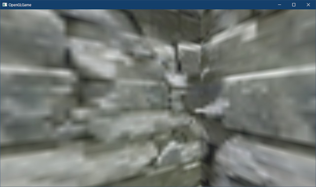
</p>

>**【nearをあまり短くしたくない理由】**<br>
>計算式の性質で、nearが小さすぎると深度バッファの精度が低下するためです。nearは可能な限り大きい値にするのが望ましいです。<br>
>補足: 本テキストでは扱いませんが、「Reversed-Z(リバースド・ゼット)」という技法を使うと、nearとfarに関する制限を取りのぞくことができます。

>**【4章のまとめ】**
>
>* ワールド座標系のXYZ軸に沿った直方体のことを「軸平行境界ボックス(`Axis Aligned Bounding Box`、`AABB`)」という。
>* AABBの衝突判定は、2次元の直方体の衝突判定にZ軸の判定を加えたものになる。
>* 衝突によって物体同士がめりこんで重なってしまうことを防ぐには、物体を衝突したと思われる方向の平面に向かって移動させる。
>* ある座標が「マス目状のマップデータのどのマスに存在するか」を求めるには、座標をマス目のサイズで割る。
>* 描画範囲の`near`より近くにある物体や、`far`より遠くにある物体は、たとえ視野角の範囲内であっても描画されない。
