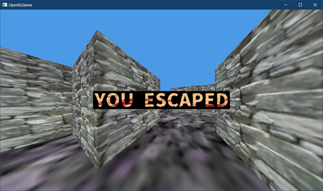
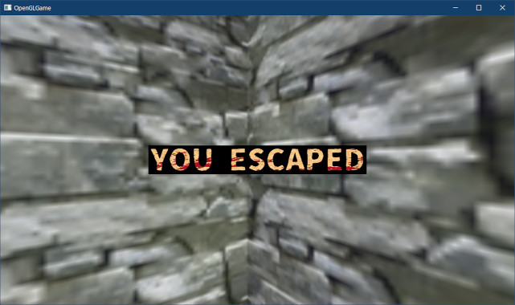

[OpenGL 3D 2023 第06回]

# 衝突判定とUI

## 習得目標

* TGAファイルヘッダの内容を調べることができる。
* 「呼び出し履歴」ウィンドウを使って、エラーの発生位置をさがすことができる。
* 変数の値を調べて、エラーの原因を考えることができる。
* ライブラリを使って音声を再生できる。

## 1. 衝突判定(エンジン編)

### 1.1 コライダーを定義する

壁の衝突判定では、衝突するのは「壁とそれ以外」に限定されていました。しかし、ゴール判定などを行うためには、壁に限定されない、自由度の高い衝突判定が必要となります。

そこで、コライダーを定義し、ゲームエンジンにコライダー同士の衝突判定を行うプログラムを追加することにします。

コライダーはコンポーネントの派生クラスとして定義することにします。プロジェクトの`Src/Engine`フォルダに`AabbCollider.h`(エーエービービー・コライダー・エイチ)という名前のヘッダファイルを追加してください。

追加したファイルを開き、次のプログラムを追加してください。

```diff
+/**
+* @file AabbCollider.h
+*/
+#ifndef AABBCOLLIDER_H_INCLUDED
+#define AABBCOLLIDER_H_INCLUDED
+#include "Component.h"
+#include "Collision.h"
+
+/**
+* AABBコライダー
+*/
+class AabbCollider : public Component
+{
+public:
+  AabbCollider() = default;
+  virtual ~AabbCollider() = default;
+
+  bool isTrigger = false; // true=重複を許可, false=重複を禁止
+  bool isStatic = false;  // true=動かない物体, false=動く物体
+  AABB aabb;              // 衝突判定
+};
+using AabbColliderPtr = std::shared_ptr<AabbCollider>;
+
+#endif // AABBCOLLIDER_H_INCLUDED
```

コライダーは、衝突した相手をブロックするか、通過させるかを選択できます。これは`isTrigger`(イズ・トリガー)メンバ変数で指定します。

また、コライダーには「位置などが変化する動的なコライダー」と「位置やサイズが変化することのない静的なコライダー」があります。これは`isStatic`(イズ・スタティック)メンバ変数で指定します。

静的コライダーは地形などに使われることを想定しています。地形の作成では、コライダーが交差するように配置できると便利なことがあります。これを実現するために「静的コライダー同士は衝突しない」というルールを設けることにします。

### 1.2 GameObjectにコライダーを追加する

コライダーはゲームオブジェクトに設定します。そのために、ゲームオブジェクトにコライダーを扱う機能を追加します。まずヘッダファイルをインクルードしましょう。`GameObject.h`を開き、次のプログラムを追加してください。

```diff
 #ifndef GAMEOBJECT_H_INCLUDED
 #define GAMEOBJECT_H_INCLUDED
 #include "Component.h"
+#include "AabbCollider.h"
 #include "Texture.h"
 #include "VecMath.h"
```

次に`GameObject`クラスの定義に次のプログラムを追加してください。

```diff
   Engine* engine = nullptr;        // エンジンのアドレス
   bool isDestroyed = false;        // 死亡フラグ
   std::vector<ComponentPtr> components; // コンポーネント配列
+  std::vector<AabbColliderPtr> colliders;  // コライダー配列
 };

 #endif // GAMEOBJECT_H_INCLUDED
```

コライダーは衝突判定を行うたびに必要となりますが、コンポーネント配列からコライダーを検索するのは時間がかかります。しかし、ゲームのようにリアルタイム性が求められるアプリでは、時間がかかる処理は避けたいところです。

そこで、コライダーだけを格納する配列を追加します。コライダーを追加するときには、コンポーネント用の配列とコライダー用の配列の両方に追加します。この構造によって、コライダーの検索は不要になります。

そういう理由なので、コライダーを追加するときは、`components`ではなく`colliders`(コライダーズ)に追加しなくてはなりません。それには、「追加する型Tが`AabbCollider`かどうか」を判定する必要があります。

幸いなことにC++には、まさにこれを行う`is_base_of`(イズ・ベース・オブ)というクラスが存在します。

<p><code class="tnmai_code"><strong>【書式】</strong><br>
struct is_base_of<ベースクラス, 判定するクラス>;
</code></p>

`is_base_of`は、「判定するクラス」が「ベースクラス」自身、またはその派生クラスかどうかを、メンバ変数`value`に設定するクラステンプレートです。

さて、`is_base_of`は`type_traits`(タイプ・トレイツ)ヘッダに定義されています。ということで、`GameObject.h`に次のインクルード文を追加してください。

```diff
 #include <string>
 #include <vector>
 #include <memory>
+#include <type_traits>

 // 先行宣言
 class Engine;
```

それでは`is_base_of`を使って型を判定しましょう。`AddComponet`メンバ関数の定義を、次のように変更してください。

```diff
   std::shared_ptr<T> AddComponent() {
     auto p = std::make_shared<T>();
     p->owner = this;
+    if constexpr (std::is_base_of_v<T, AabbCollider>) {
+      colliders.push_back(p);
+    }
     components.push_back(p);
     p->Awake();
     return p;
```

「判定するクラス」には、`AddComponent`のテンプレート引数`T`を指定します。これにより、`T`が`AabbCollider`かその派生クラスの場合のみ`colliders.push_back(p)`が実行されます。

それから、`if constexpr`(イフ・コンストエクスプル)は「コンパイル時if」という書式です。これは「コンパイル時に判定が行われ、実行時にはすでに結果が決まっている」という特殊な`if`文です。

条件式には「コンパイル時に`bool`に評価できる式」を指定する必要があります(そうでないとコンパイル時に評価できないため)。

コンパイル時ifを使うことで、実行速度に一切影響を与えることなく、`T`によって異なる処理を実行することができます。

普通のifでは駄目な理由は、`colliders`配列には`AabbCollider`しか代入できないからです。普通のifでは双方の分岐が存在するためにコンパイルエラーになってしまいます。

しかし、コンパイル時ifの場合、Tが`AabbCollider`以外なら`colliders.push_back(p)`の分岐は完全に削除されます。そのため、エラーが発生しないのです。これで`AabbCollider`が専用の配列に追加されるようになりました。

>**【コンパイル時の分岐、今と昔】**<br>
>C++14まで、コンパイル時の条件分岐は「テンプレートの特殊化」や「SFINAE(スフィナエ)」を使って実装していました。しかし、特殊化などによる分岐を使うとプログラムが必要以上に複雑になるため、保守管理が難しく、バグが入り込みやすくなる、という問題がありました。C++17でコンパイル時ifが導入されたことで、保守管理しやすくバグの少ないプログラムを書けるようになりました。

### 1.3 コライダーを削除する

3.2ではコライダーを`components`と`colliders`の両方に追加しました。ゲームオブジェクトは`components`をループ処理することでコンポーネントを制御しているため、コライダーも`components`に追加する必要があるからです。

しかし、2つの配列に追加されたことで、コライダーを削除するには両方の配列から削除する必要が生まれました。そこで、`colliders`からコライダーを削除するプログラムを追加します。

`GameObject.cpp`を開き、`RemoveDestroyedComponent`メンバ関数の定義に次のプログラムを追加してください。

```diff
   // 配列から移動済みオブジェクトを削除
   components.erase(iter, components.end());
+
+  // コライダーはcollidersにも登録されているので、両方から削除する必要がる
+  const auto iter2 = std::remove_if(
+    colliders.begin(), colliders.end(),
+    [](const auto& p) { return p->IsDestroyed(); });
+  colliders.erase(iter2, colliders.end());

   // 破棄予定のコンポーネントのOnDestoryを実行
   for (auto& e : destroyList) {
```

コライダーの削除では、`stable_partition`ではなく`remove_if`(リムーブ・イフ)関数を使います(`remove`は「削除」という意味)。`remove_if`は次の書式を持ちます。

<p><code class="tnmai_code"><strong>【書式】</strong><br>
iterator remove_if(調査範囲の先頭, 調査範囲の終端, 振り分け条件);
</code></p>

`remove_if`は、指定された範囲にある要素をすべて調べ、振り分け条件を「満たさない」要素を、範囲の前側に集めます。それ以外の削除してよい要素は後ろ側に残されます。

この説明だけだと`stable_partition`と同じに聞こえますが、大きな違いは「実行中に要素が削除される場合がある」ことです。これは、`stable_partition`の目的が「分類」なのに対して、`remove_if`の目的は「削除」だからです。

`stable_partition`は削除以外にも「ある属性によって分類する」などの用途に使えます(というか、こちらが本分)。それに対して`remove_if`は削除のためにしか使えませんが、そのぶん高速に動作します。

ただし、必ず要素が削除されるわけではありません。`remove_if`が実際に行うのは「削除しない要素を前に移動させること」で、その過程で「削除してもよい要素が削除される場合がある」だけだからです。

全ての要素を削除するには`erase`メンバ関数を併用しなくてはなりません。`remove_if`は、「削除してよい範囲」の先頭位置を返します。この位置から後ろの範囲を`erase`(イレース)メンバ関数に指定することで、要素の削除が完了します。

>**【remove_ifの通常版とメンバ関数版の違いについて】**<br>
>実は、標準ライブラリの`list`クラスや`unordered_map`クラスには「`remove_if`**メンバ**関数」が定義されています。これら「メンバ関数の`remove_if`」は名前どおりに要素を削除します。<br>
>要素を削除しないのは、「通常の(メンバ関数ではない)`remove_if`」だけです。

### 1.4 衝突機能をゲームエンジンに追加する

次に、ゲームエンジンに「コライダーの衝突を扱う機能」を追加します。`Engine.h`を開き、`UpdateGameObject`メンバ関数の宣言の下に、次のプログラムを追加してください。

```diff
   void Update();
   void Render();
   void UpdateGameObject(float deltaTime);
+  void HandleGameObjectCollision();
   void RemoveDestroyedGameObject();

   GLFWwindow* window = nullptr; // ウィンドウオブジェクト
```

関数名は`HandleGameObjectCollision`(ハンドル・ゲームオブジェクト・コリジョン, `handle`は「操作する、処理する」という意味)とします。

続いて`Engine.cpp`を開き、`UpdateGameObject`メンバ関数の定義の下に、次のプログラムを追加してください。

```diff
     }
   }
 } // UpdateGameObject
+
+/**
+* ゲームオブジェクトの衝突を処理する
+*/
+void Engine::HandleGameObjectCollision()
+{
+} // HandleGameObjectCollision

 /**
 * 破棄予定のゲームオブジェクトを削除する
```

コライダーはゲームオブジェクトに合わせて設定します。しかし、ゲームオブジェクトは移動可能なので、コライダーの座標をゲームオブジェクトに合わせる必要があります。

そこで、ゲームオブジェクトの座標とコライダーの座標を合わせる処理を作成します。注意するのは、「元のコライダーの座標を変えてはいけない」ことです。元になる座標が変わってしまうと、正しい座標を計算できなくなってしまうからです。

元のコライダーをいじらずにゲームオブジェクトの座標に合わせたコライダーを作るために、コライダーをコピーします。まずコピーを扱う構造体を定義しましょう。`Engine.h`を開き、次のプログラムを追加してください。

```diff
     return glfwGetKey(window, key) == GLFW_PRESS;
   }

 private:
+  // ワールド座標系のコライダーを表す構造体
+  struct WorldCollider
+  {
+    AabbColliderPtr origin;
+    AABB worldAabb;
+  };
+  using WorldColliderList = std::vector<WorldCollider>;

  int Initialize();
  void Update();
```

次に`Engine.cpp`を開き、`HandleGameObjectCollision`メンバ関数の定義に次のプログラムを追加してください。

```diff
 */
 void Engine::HandleGameObjectCollision()
 {
+  // ワールド座標系の衝突判定を作成
+  std::vector<WorldColliderList> colliders;
+  colliders.reserve(gameObjects.size());
+  for (const auto& e : gameObjects) {
+    if (e->colliders.empty()) {
+      continue;
+    }
+    WorldColliderList list(e->colliders.size());
+    for (int i = 0; i < e->colliders.size(); ++i) {
+      // オリジナルのコライダーをコピー
+      list[i].origin = e->colliders[i];
+      list[i].worldAabb = e->colliders[i]->aabb;
+
+      // コライダーの座標をワールド座標に変換
+      list[i].worldAabb.min.x *= e->scale.x;
+      list[i].worldAabb.min.y *= e->scale.y;
+      list[i].worldAabb.min.z *= e->scale.z;
+      list[i].worldAabb.max.x *= e->scale.x;
+      list[i].worldAabb.max.y *= e->scale.y;
+      list[i].worldAabb.max.z *= e->scale.z;
+      list[i].worldAabb.min.x += e->position.x;
+      list[i].worldAabb.min.y += e->position.y;
+      list[i].worldAabb.min.z += e->position.z;
+      list[i].worldAabb.max.x += e->position.x;
+      list[i].worldAabb.max.y += e->position.y;
+      list[i].worldAabb.max.z += e->position.z;
+    }
+    colliders.push_back(list);
+  }
 } // HandleGameObjectCollision

 /**
 * 破棄予定のゲームオブジェクトを削除する
```

このプログラムでは、コライダーを持つ全てのゲームオブジェクトについて「コライダーをコピーしてワールド座標系に変換する」という処理を行っています。

### 1.5 演算子オーバーロード

ところで、このプログラムではベクトルの乗算と加算を2回ずつ行っています。三次元ベクトルは3つも要素があるため、要素ごとに計算するとこのような記述にならざるをえません。

しかし、これは長いだけであまり見やすくありません。それに、コメントがなければ何をやっているのかを読み取るのにも苦労するでしょう。もし、ベクトル型をそのまま加算したり乗算したりできれば、プログラムが読みやすくなるはずです。

そこで、「演算子オーバーロード」を使ってベクトル型の計算を定義します。`VecMath.h`を開き、`vec3`型の定義の下に、次のプログラムを追加してください。

```diff
 struct vec2 { float x, y; };
 struct vec3 { float x, y, z; };
+
+// vec3同士の加算
+inline vec3& operator+=(vec3& a, const vec3& b)
+{
+  a.x += b.x;
+  a.y += b.y;
+  a.z += b.z;
+  return a;
+}
+inline vec3 operator+(const vec3& a, const vec3& b) { vec3 n = a; return n += b; }
+
+// vec3同士の乗算
+inline vec3& operator*=(vec3& a, const vec3& b) 
+{
+  a.x *= b.x;
+  a.y *= b.y;
+  a.z *= b.z;
+  return a;
+}
+inline vec3 operator*(const vec3& a, const vec3& b) { vec3 n = a; return n *= b; }

 #endif // VECMATH_H_INCLUDED
```

演算子オーバーロードは「C++の機能」のひとつです。「`operator`(オペレータ)」という名前で始まる関数を定義することで、ユーザー型に「組み込み型と同様の演算機能を追加」することができます。

それでは、オーバーロードした演算子を使ってコライダーの座標変換プログラムを修正しましょう。`Engine.cpp`を開き、コライダーの座標変換プログラムを次のように変更してください。

```diff
       list[i].origin = e->colliders[i];
       list[i].worldAabb = e->colliders[i]->aabb;

       // コライダーの座標をワールド座標に変換
-      list[i].worldAabb.min.x *= e->scale.x;
-      list[i].worldAabb.min.y *= e->scale.y;
-      list[i].worldAabb.min.z *= e->scale.z;
+      list[i].worldAabb.min *= e->scale;
-      list[i].worldAabb.max.x *= e->scale.x;
-      list[i].worldAabb.max.y *= e->scale.y;
-      list[i].worldAabb.max.z *= e->scale.z;
+      list[i].worldAabb.max *= e->scale;
-      list[i].worldAabb.min.x += e->position.x;
-      list[i].worldAabb.min.y += e->position.y;
-      list[i].worldAabb.min.z += e->position.z;
+      list[i].worldAabb.min += e->position;
-      list[i].worldAabb.max.x += e->position.x;
-      list[i].worldAabb.max.y += e->position.y;
-      list[i].worldAabb.max.z += e->position.z;
+      list[i].worldAabb.max += e->position;
     }
     colliders.push_back(list);
```

12行あったのが4行に減ったことで、プログラムが見やすくなりました。

### 1.6 衝突機能をゲームエンジンに追加する(続き)

衝突機能の作成に戻りましょう。まず、ゲームオブジェクト同士の衝突を扱うための2重forを書きます。コライダーのコピーを作成するプログラムの下に、次のプログラムを追加してください。

```diff
     }
     colliders.push_back(list);
   }
+
+  if (colliders.size() >= 2) {
+    // ゲームオブジェクト単位の衝突判定
+    for (auto a = colliders.begin(); a != colliders.end() - 1; ++a) {
+      const GameObject* goA = a->at(0).origin->GetOwner();
+      if (goA->IsDestroyed()) {
+        continue; // 削除済みなので飛ばす
+      }
+      for (auto b = a + 1; b != colliders.end(); ++b) {
+        const GameObject* goB = b->at(0).origin->GetOwner();
+        if (goB->IsDestroyed()) {
+          continue; // 削除済みなので飛ばす
+        }
+      } // for b
+    } // for a
+  }
} // HandleGameObjectCollision

/**
* 破棄予定のゲームオブジェクトを削除する
```

衝突判定には2つ以上のコライダーが必要です。そのため、最初に個数をチェックしています。

それから、衝突判定の結果、ゲームオブジェクトが削除される場合があります。削除されたオブジェクトに衝突判定を行うべきではありません。そこで、削除されていたら処理を飛ばすようにしています。

さて、ゲームオブジェクトには複数のコライダーが付けられます。そのため、ゲームオブジェクトが持つ全てのコライダーをループ処理しなくてはなりません。そのため、コライダー用の2重forが必要となります。

ゲームオブジェクトの2重forの中に、次のプログラムを追加してください。

```diff
         if (b->gameObject->IsDestroyed()) {
           continue; // 削除済みなので飛ばす
         }
+        // コライダー単位の衝突判定
+        for (const auto& colA : *a) {
+          for (const auto& colB : *b) {
+          } // for colB
+        } // for colA
       } // for b
     } // for a
```

最後に衝突判定本体を書き加えます。コライダー単位の衝突判定を行う2重forの中に、次のプログラムを追加してください。

```diff
         // コライダー単位の衝突判定
         for (const auto& colA : a->colliders) {
           for (const auto& colB : b->colliders) {
+            // スタティックコライダー同士は衝突しない
+            if (colA.origin->isStatic && colB.origin->isStatic) {
+              continue;
+            }
+            // 衝突判定を行う
+            vec3 penetration;
+            if (Intersect(colA.worldAabb, colB.worldAabb, penetration)) {
+              GameObject* goA = colA.origin->GetOwner();
+              GameObject* goB = colB.origin->GetOwner();
+
+              // イベント関数の呼び出し
+              goA->OnCollision(colA.origin, colB.origin);
+              goB->OnCollision(colB.origin, colA.origin);
+            }
           } // for colB
         } // for colA
```

それでは`HandleGameObjectCollision`メンバ関数を呼び出しましょう。`Update`メンバ関数の末尾に次のプログラムを追加してください。

```diff
     scene->Update(*this, deltaTime);
   }

   UpdateGameObject(deltaTime);
+  HandleGameObjectCollision();
 }

 /**
 * ゲームエンジンの状態を描画する
```

### 1.7 コライダー単位の衝突判定を関数にする

ここまでで衝突判定プログラムはほぼ完成しています。しかし、ひとつだけ考慮されていない場合があります。それは、「`OnCollision`の結果、ゲームオブジェクトが削除された場合」です。

ゲームオブジェクトが削除されたなら、もはやそのオブジェクトは衝突判定を続けるべきではありません。そこで、ゲームオブジェクトが削除されていたらコライダーの衝突判定ループを終了させます。

ただ、これは2重forなので`break`を書くだけではループを終了させられません。フラグ変数や`goto`を使えば解決できますが、どちらもあまり良い解決策とは言えません。

よりよい解決策として「ループ部分を関数に分離する」というやり方があります。また、今回のプログラムの場合、そもそものループが深く複雑になりすぎて読みにくくなっています。関数に分けることで読みやすさの向上も期待できます。

さて、ループが深くなってしまう原因は「複数の処理をひとつにまとめてしまっている」ことにあります。ここでは以下の2つの処理がまとめられていると考えられます。

>1. ゲームオブジェクト単位の衝突判定
>2. コライダー単位の衝突判定

これらは、それぞれ単独の関数にできる程度に複雑な処理です。単独の関数に分けることでプログラムが読みやすくなり、ループ終了の処理も書きやすくなります。そこで、「コライダー単位の衝突判定」を関数に分離します。

`Engine.h`を開き、`HandleGameObjectCollision`メンバ関数の宣言の下に、次のプログラムを追加してください。

```diff
   void Render();
   void UpdateGameObject(float deltaTime);
   void HandleGameObjectCollision();
+  void HandleWorldColliderCollision(
+    WorldColliderList* a, WorldColliderList* b);
   void RemoveDestroyedGameObject();

   GLFWwindow* window = nullptr; // ウィンドウオブジェクト
```

次に`Engine.cpp`を開き、`HandleGameObjectCollision`メンバ関数の定義の下に、次のプログラムを追加してください。

```diff
     } // for a
   }
 } // HandleGameObjectCollision
+
+/**
+* コライダー単位の衝突判定
+*
+* @param a 判定対象のワールドコライダー配列その1
+* @param b 判定対象のワールドコライダー配列その2
+*/
+void Engine::HandleWorldColliderCollision(
+  WorldColliderList* a, WorldColliderList* b)
+{
+}

 /**
 * 破棄予定のゲームオブジェクトを削除する
```

次に`HandleGameObjectCollision`メンバ関数から、コライダー単位の衝突判定を行うプログラムを切り取ってください(範囲選択後にCtrl+X)。

```diff
         if (b->gameObject->IsDestroyed()) {
           continue; // 削除済みなので飛ばす
         }
-        // コライダー単位の衝突判定
-        for (const auto& colA : a->colliders) {
-          for (const auto& colB : b->colliders) {
-            // スタティックコライダー同士は衝突しない
-            if (colA.origin->isStatic && colB.origin->isStatic) {
-              continue;
-            }
-            // 衝突判定を行う
-            vec3 penetration;
-            if (Intersect(colA.worldAabb, colB.worldAabb, penetration)) {
-              GameObject* goA = colA.origin->GetOwner();
-              GameObject* goB = colB.origin->GetOwner();
-
-              // イベント関数の呼び出し
-              goA->OnCollision(colA.origin, colB.origin);
-              goB->OnCollision(colB.origin, colA.origin);
-            }
-          } // for colB
-        } // for colA
       } // for b
     } // for a
```

そして、切り取ったプログラムを`HandleWorldColliderCollision`メンバ関数に貼り付けてください(Ctrl+V)。

```diff
 void Engine::HandleWorldColliderCollision(WorldCollider* a, WorldCollider* b)
 {
+        // コライダー単位の衝突判定
+        for (const auto& colA : a->colliders) {
+          for (const auto& colB : b->colliders) {
+            // スタティックコライダー同士は衝突しない
+            if (colA.origin->isStatic && colB.origin->isStatic) {
+              continue;
+            }
+            // 衝突判定を行う
+            vec3 penetration;
+            if (Intersect(colA.worldAabb, colB.worldAabb, penetration)) {
+              GameObject* goA = colA.origin->GetOwner();
+              GameObject* goB = colB.origin->GetOwner();
+
+              // イベント関数の呼び出し
+              goA->OnCollision(colA.origin, colB.origin);
+              goB->OnCollision(colB.origin, colA.origin);
+            }
+          } // for colB
+        } // for colA
 }
```

なお、貼り付けただけだとインデントが大きくずれています。Ctrl+Kを押し、次にCtrl+Dを押して「ドキュメントのフォーマット」を実行すると、インデントが修正されます。

続いて、「ゲームオブジェクトが破棄された場合にループを終了する」処理を追加しましょう。イベント関数を呼び出すプログラムの下に、次のプログラムを追加してください。

```diff
         // イベント関数の呼び出し
         goA->OnCollision(colA.origin, colB.origin);
         goB->OnCollision(colB.origin, colA.origin);
+
+        // イベントの結果、どちらかのゲームオブジェクトが破棄されたらループ終了
+        if (goA->IsDestroyed() || goB->IsDestroyed()) {
+          return; // 関数を終了
+        }
       }
     } // for colB
```

ループを関数に分離したことで、`return`によってループを終了できるようになりました。

最後に`HandleWorldColliderCollision`メンバ関数を呼び出すプログラムを追加します。`HandleGameObjectCollision`メンバ関数に次のプログラムを追加してください。

```diff
         if (b->gameObject->IsDestroyed()) {
           continue; // 削除済みなので飛ばす
         }
+        HandleWorldColliderCollision(&*a, &*b); // コライダー単位の衝突判定
       } // for b
     } // for a
```

ここでは、変数`a`と`b`が「`WorldColliderList`を指すイテレータで、ポインタではない」という点に注意が必要です。なぜなら、`HandleWorldColliderCollision`の引数型は`WorldColliderList*`なので、イテレータを渡せないからです。

そのため、なんとかして「イテレータからポインタを取得」する必要があります。これは、`&`演算子と`*`演算子を組み合わせることで実現できます。

まず、`*a`とすることで、イテレータ指すオブジェクトを取り出します。次に、`&(*a)`とすることで、オブジェクトのアドレスを取得します。このカッコは省略できるので、`&*a`と書くことができます。

この手順によって、イテレータからポインタへと変換することができます。

これで、衝突判定の一部を関数に分離することができました。この例ように、複雑なプログラムを関数に分割すると、「プログラムの各部分が何をやっているのか」が明確になり、プログラムが読みやすくなります。

>**【カッコをはぶける理由】**<br>
>カッコをはぶけるのは、アドレス演算子`&`と間接演算子`*`の「結合規則」が「右から左」だからです。右側にある`*`が先に処理されるため、カッコがなくても同じ挙動になるわけです。詳しくは以下のURLを参照してください。<br>
>`https://learn.microsoft.com/ja-jp/cpp/cpp/cpp-built-in-operators-precedence-and-associativity`

>**【1章のまとめ】**
>
>* 
>* 
>* 
>* 

<div style="page-break-after: always"></div>

## 2. 衝突判定を使ってゴール画像を表示する

### 2.1 プレイヤーオブジェクトをMainGameSceneに移す

衝突判定のテストとして、ゴール地点に到達したらメッセージを表示させてみましょう。そのために、プレイヤーオブジェクトにコライダーを設定します。

現在、プレイヤーオブジェクトは`Engine`クラスで定義しています。実は、まだ`Scene`クラスなどがなかったため、仕方なく`Engine`クラスに定義しただけです。しかし、今は管理者としてよりふさわしい`MainGameScene`があります。

そこで、プレイヤーオブジェクトを`MainGameScene`に移動させましょう。まずは管理用の変数を追加します。`MainGameScene.h`を開き、次のプログラムを追加してください。

```diff
 #ifndef MAINGAMESCENE_H_INCLUDED
 #define MAINGAMESCENE_H_INCLUDED
 #include "Engine/Scene.h"
+#include "Engine/GameObject.h"
 #include "Engine/VecMath.h"
 #include <vector>
```

続いて`MainGameScene`クラスの定義に、次のプログラムを追加してください。

```diff
   float squareSize = 2;  // マップの1マスの大きさ
   float squareScale = squareSize / 2; // 壁・床の拡大率
+  GameObjectPtr player;  // プレイヤーが操作するオブジェクト
 };

 #endif // MAINGAMESCENE_H_INCLUDED
```

`Engine.cpp`を開き、`Initialize`メンバ関数にある`player`変数を定義するプログラムを切り取ってください。

```diff
   box1.color[1] = 0.5f; // 緑成分の明るさを半分にしてみる
   box1.scale = { 0.2f, 0.2f, 0.2f };
   box1.position = { 0, 0, -1 };
-
-  // カメラ操作用コンポーネントを追加
-  auto player = Create<GameObject>("player", { 0, 10, 0 });
-  player->AddComponent<PlayerComponent>();

   // カメラの初期設定
   camera.position = { 3, 1, 3 };
```

続いて`MainGameScene.cpp`を開き、`Initialize`メンバ関数の末尾に貼り付けてください。

```diff
       }
     } // for x
   } // for y
+
+  // カメラ操作用コンポーネントを追加
+  auto player = Create<GameObject>("player", { 0, 10, 0 });
+  player->AddComponent<PlayerComponent>();

   return true; // 初期化成功
 }
```

ファイル間を移動させたために、`PlayerComponent`に関するエラーが発生します。以下の課題を完了してエラーを解消してください。

<pre class="tnmai_assignment">
<strong>【課題01】</strong>
以下の2つを行って、<code>MainGameScene.cpp</code>のエラーを解決しなさい。
1. <code>Engine.cpp</code>から<code>PlayerComponent.h</code>のインクルード文を切り取り、<code>MainGameScene.cpp</code>に貼り付ける。
2. <code>Create</code>は<code>Engine</code>クラスのメンバ関数なので、<code>engine.</code>を追加する。
</pre>

また、貼り付けた状態だと`player`がローカル変数になっています。メンバ変数になるように変更しましょう。それから、コメントもプレイヤーオブジェクトに言及するように変更します。

```diff
     } // for x
   } // for y

-  // カメラ操作用コンポーネントを追加
-  auto player = engine.Create<GameObject>("player", { 0, 10, 0 });
+  // プレイヤーオブジェクトを追加
+  player = engine.Create<GameObject>("player", { 0, 10, 0 });
   player->AddComponent<PlayerComponent>();

   return true; // 初期化成功
```

それでは、プレイヤーオブジェクトにコライダーを設定しましょう。プレイヤーオブジェクトを追加するプログラムに、次のプログラムを追加してください。

```diff
   // プレイヤーオブジェクトを追加
   player->AddComponent<PlayerComponent>();
+  auto collider = player->AddComponent<AabbCollider>();
+  collider->aabb = { { -0.5f, -1, -0.5f }, { 0.5f, 1, 0.5f } };

  return true; // 初期化成功
}
```

これで、プレイヤーオブジェクトにコライダーが設定されます。ただ、キー操作で動かしているのは「カメラ」であってプレイヤーではありません。そのため、このままではコライダーの座標が更新されません。

そこで、カメラのパラメータをプレイーやオブジェクトにコピーします。`Update`メンバ関数に次のプログラムを追加してください。

```diff
   GameObject& camera = engine.GetMainCamera();
   camera.position = AdjustPosition(camera.position, playerSize);
+
+  // カメラのパラメータをプレイヤーオブジェクトにコピー
+  player->position = camera.position;
+  player->rotation = camera.rotation;
 }

 /**
 * ワールド座標に対応するマップ座標を取得する
```

### 2.2 ゴールメッセージ用のコンポーネントを定義する

次に、メッセージを表示するコンポーネントを定義します。メッセージは「板状のポリゴン」にメッセージを書いたテクスチャを貼り付けて表示します。

<pre class="tnmai_assignment">
<strong>【課題02】</strong>
板状のポリゴン(板ポリゴン)用の図形データとして<code>plane_xy_mesh.h</code>を用意していますので、第05回テキストに書かれたURLからダウンロードしなさい。
ダウンロードしたファイルを<code>Engine.cpp</code>にインクルードして、図形データを<code>meshes</code>配列に追加しなさい。
</pre>

<pre class="tnmai_assignment">
<strong>【課題03】</strong>
cooltext.comなどを利用して、迷路を脱出したときに表示するメッセージを作成しなさい。
作成した画像ファイルをプロジェクトの<code>Res</code>フォルダにダウンロードし、TGA形式に変換しなさい。ファイル名は<code>goal_text.tga</code>としなさい。
</pre>

板ポリゴンと画像の準備が整ったら、メッセージを表示するコンポーネントを作成します。プロジェクトの`Src`フォルダに`GoalEvent.h`(ゴール・イベント・エイチ)という名前のヘッダファイルを追加してください。

追加したファイルを開き、次のプログラムを追加してください。

```diff
+/**
+* @file GoalEvent.h
+*/
+#ifndef GOALEVENT_H_INCLUDED
+#define GOALEVENT_H_INCLUDED
+#include "Engine/Component.h"
+
+/**
+* ゴール演出を行うコンポーネント
+*/
+class GoalEvent : public Component
+{
+public:
+  GoalEvent() = default;
+  virtual ~GoalEvent() = default;
+
+private:
+  virtual void OnCollision(
+    const ComponentPtr& self, const ComponentPtr& other) override;
+
+  bool triggered = false; // ゴール判定が起動したらtrue
+};
+
+#endif // GOALEVENT_H_INCLUDED
```

次に、プロジェクトの`Src`フォルダに`GoalEvent.cpp`というCPPファイルを追加してください。追加したファイルを開き、次のプログラムを追加してください。

```diff
+/**
+* @file GoalEvent.cpp
+*/
+#include "GoalEvent.h"
+#include "Engine/Engine.h"
+
+/**
+* ゴール演出の衝突イベント
+*
+* @param self  衝突したコライダーコンポーネント(自分)
+* @param other 衝突したコライダーコンポーネント(相手)
+*/
+void GoalEvent::OnCollision(
+  const ComponentPtr& self, const ComponentPtr& other)
+{
+  // 一度だけプレイヤーと衝突できる
+  if (triggered || other->GetOwner()->name != "player") {
+    return;
+  }
+  triggered = true; // 状態を「衝突済み」にする
+
+  // メッセージオブジェクトを登場させる
+  Engine* engine = GetOwner()->GetEngine();
+  auto message = engine->Create<GameObject>("goal text");
+  message->position = GetOwner()->position;
+  message->texColor = std::make_shared<Texture>("Res/goal_text.tga");
+  message->meshId = ???; // 板ポリゴンの図形番号
+}
```

<pre class="tnmai_assignment">
<strong>【課題04】</strong>
上記プログラムの<code>meshId</code>メンバ変数に、板ポリゴン(<code>plain_xy_mesh.h</code>)の図形番号を指定しなさい。
</pre>

### 2.3 ゴールオブジェクトを作成する

それでは、作成した`GoalEvent`コンポーネントを使って、ゴール判定を行うオブジェクトを追加しましょう。`MainGameScene.cpp`を開き、`GoalEvent.h`をインクルードしてください。

```diff
 */
 #include "MainGameScene.h"
 #include "PlayerComponent.h"
+#include "GoalEvent.h"
 #include "Engine/Engine.h"
 #include "Engine/Collision.h"
```

マップデータのゴール地点は文字`G`で表されます。`Initialize`メンバ関数にある、壁を作成するプログラムに、次のプログラムを追加してください。

```diff
         crystal->texColor = texCrystalBlue;
         crystal->meshId = 1;
       }
+
+      // ゴール判定オブジェクトを作成
+      if (GetMapData(x, y) == 'G') {
+        auto goal = engine.Create<GameObject>("goal", { posX, 1, posZ });
+        goal->AddComponent<GoalEvent>();
+        auto collider = goal->AddComponent<AabbCollider>();
+        collider->aabb = { { -1, -1, -1 }, { 1, 1, 1 } };
+        collider->isTrigger = true;
+      }
     } // for x
   } // for y
```

プログラムが書けたらビルドして実行してください。ゴール地点まで移動したとき、課題03で作成した画像が表示されていたら成功です。

<p align="center">
<br>
[文章が分かりにくいゴール画像]
</p>

### 2.4 ゴール画像のサイズを調整する

ゴールしたときに表示される画像の縦横比が狂っているのは、板ポリゴンのサイズを変更していないからです。そこで、適切なサイズに変更しましょう。

ただし、縦横比は画像によって異なるため、固定の縦横比は使えません。そこで、画像の縦横比をプログラムで計算します。`Texture.h`を開き、`Texture`クラスの定義に次のプログラムを追加してください。

```diff
   // 幅と高さを取得
   int GetWidth() const { return width; }
   int GetHeight() const { return height; }
+
+  // 画像のアスペクト比を取得
+  float GetAspectRatio() const {
+    return static_cast<float>(width) / static_cast<float>(height);
+  }

 private:
   std::string name; // テクスチャ名(主にデバッグ用)
```

`GetAspectRatio`(ゲット・アスペクト・レシオ)メンバ関数は、画像のアスペクト比(縦横比)を返します。アスペクト比は「画像の幅 ÷ 画像の高さ」で求められます。

次に`GoalEvent.cpp`を開き、`OnCollision`メンバ関数の定義に次のプログラムを追加してください。

```diff
   message->position = GetOwner()->position;
   message->texColor = std::make_shared<Texture>("Res/goal_text.tga");
   message->meshId = ???; // 板ポリゴンの図形番号
+
+  // 画像サイズに応じて拡大率を調整
+  const float baseScale = 0.1f; // この数値は画像に合わせて変えること
+  const float aspectRatio = message->texColor->GetAspectRatio();
+  message->scale = { baseScale * aspectRatio, baseScale, 1 };
 }
```

基本の拡大率を表す`baseScale`(ベース・スケール)は、画像に合わせて変える必要があります。うまく調整してください。

プログラムが書けたらビルドして実行してください。ゴール画像が読みやすいサイズになっていたら成功です。また、TGAの作成に使ったツールによっては文字が逆さまに表示されるかもしれません。これは次の節で修正します。

<p align="center">
<br>
[サイズは直ったが逆さまなことがバレたゴール画像]
</p>

### 2.5 TGAファイルの上下を正しく扱う

「メッセージが上下さかさまに表示されている」という症状が出てはいませんか？

原因は、Visual Studioを使って画像をTGAファイルに変換すると、画像の上下が逆になるからです。変換に使ったツールによっては症状が出なかったりします。というのも、実はTGAファイルは「画像データの格納方向を選べる」からです。

TGAファイルの先頭18バイトには、画像の情報が格納されています。この部分は「TGAファイルヘッダ」と呼ばれ、次のような構造になっています。

|**名前**|**位置**|**バイト数**|**格納されている情報**|
|---|:-:|:-:|---|
|<ruby>ID Length<rt>アイ・ディ・レングス</rt></ruby>                      | 0| 1| イメージIDデータのバイト数。 |
|<ruby>Colormap Type<rt>カラーマップ・タイプ</rt></ruby>                  | 1| 1| カラーマップの有無。<br>0 = 無<br>1 = 有 |
|<ruby>Image Type<rt>イメージ・タイプ</rt></ruby>                         | 2| 1| 画像記録形式。<br>0 = 画像データ無し<br>1 = 圧縮なし、インデックス・カラー画像<br>2 = 圧縮なし、カラー画像<br>3 = 圧縮なし、白黒画像<br>9 = 圧縮あり、インデックス・カラー画像<br>10 = 圧縮あり、カラー画像<br>11 = 圧縮あり、白黒画像 |
|<ruby>First Entry Index<rt>ファースト・エントリ・インデックス</rt></ruby>| 3| 2| 画像データのインデックス0に対応する<br>カラーマップのインデックス。<br>カラーマップ無しの場合は未使用(常に0)。 |
|<ruby>Colormap Length<rt>カラーマップ・レングス</rt></ruby>              | 5| 2| カラーマップに登録されている色の数。<br>カラーマップ無しの場合は未使用(常に0)。 |
|<ruby>Colormap Entry Size<rt>カラーマップ・エントリ・サイズ</rt></ruby>  | 7| 1| カラーマップに登録されている色のビット数。<br>カラーマップ無しの場合は未使用(常に0)。 |
|<ruby>X-origin<rt>エックス・オリジン</rt></ruby>                         | 8| 2| X座標をずらすピクセル数。 |
|<ruby>Y-origin<rt>ワイ・オリジン</rt></ruby>                             |10| 2| Y座標をずらすピクセル数。 |
|<ruby>Image Width<rt>イメージ・ウィス</rt></ruby>                        |12| 2| 画像の横のピクセル数。 |
|<ruby>Image Height<rt>イメージ・ハイト</rt></ruby>                       |14| 2| 画像の縦のピクセル数。 |
|<ruby>Pixel Depth<rt>ピクセル・デプス</rt></ruby>                        |16| 1| 画像の1ピクセルのビット数。 |
|<ruby>Image Descriptor<rt>イメージ・デスクリプタ</rt></ruby>             |17| 1| bit:0-3 アルファ要素のビット数<br>bit:4 格納方向(0=左から右 1=右から左)<br>bit:5 格納方向(0=下から上 1=上から下)<br>bit:6-7 (未使用)|

このようにTGAファイルヘッダにはさまざまな情報が格納されています。以前は「イメージウィス」と「イメージハイト」を取得しました。格納方向は「イメージディスクリプタ」部分に記録されています。

TGAファイルヘッダから先には、イメージID(画像の種類などを示す文字列)、カラーマップ(インデックス・カラー形式の画像で使われるパレット)が続き、さらにその直後に画像データが格納されています。

イメージIDやカラーマップが存在しないファイルの場合、TGAファイルヘッダの直後が画像データになります。このあたりは少し面倒なので、今回は無視します。

>**【インデックス・カラーって何？】**<br>
>インデックス・カラーは、色に番号をつけておき、ピクセルの色を直接記録するかわりに、その番号を記録する形式です。普通の画像では1ピクセルに16～32ビットのデータが必要となりますが、インデックスカラーなら8ビットで済むため、データ量を小さくすることができるのです。もちろん、画像に使われている色数が256以下の場合に限ります。

さて、TGAのデフォルトでは画像は「下から上」に格納されます。この方向は、多くのグラフィックスツールのデフォルト設定で、OpenGLの画像データもこの向きでメモリに格納されます。

もうひとつの方向は「上から下」で、これはDirectXとVisual Studioが画像データを扱う方法です。「上から下」に格納されているTGAファイルをOpenGLで正しく扱うには、上下を反転してメモリに格納しなくてはなりません。

ということで、格納方向を判定して画像データを上下反転させるプログラムを書きましょう。`Texture.cpp`を開き、コンストラクタの定義の中に次のプログラムを追加してください。

```diff
   const size_t tgaHeaderSize = 18; // ヘッダ情報のバイト数
   width = buffer[12] + buffer[13] * 256;
   height = buffer[14] + buffer[15] * 256;
+
+  // 格納方向が「上から下」の場合、データを上下反転
+  const bool topToBottom = buffer[17] & 0b0010'0000;
+  if (topToBottom) {
+    const int pixelDepth = buffer[16];               // 1ピクセルのビット数
+    const int lineByteSize = width * pixelDepth / 8; // 1行のバイト数
+    uint8_t* top = buffer.data() + tgaHeaderSize;        // 上の行の位置
+    uint8_t* bottom = top + lineByteSize * (height - 1); // 下の行の位置
+    std::vector<uint8_t> tmp(lineByteSize);              // 上下入れ替え用のバッファ
+
+    // 行単位で上下反転
+    // 上下の行の位置が逆転するまで繰り返す
+    while (top < bottom) {
+      std::copy_n(top, lineByteSize, tmp.data());    // 「上の行のコピー」を作る
+      std::copy_n(bottom, lineByteSize, top);        // 下の行を、上の行に上書き
+      std::copy_n(tmp.data(), lineByteSize, bottom); // 「上の行のコピー」を下の行に上書き
+      top += lineByteSize;                           // 上の行の位置を1行下に移動
+      bottom -= lineByteSize;                        // 下の行の位置を1行上に移動
+    }
+  } // if topToBottom

   // テクスチャを作成
   GLuint object = 0; // テクスチャの管理番号
```

プログラムが書けたらビルドして実行してください。メッセージが正しい向きで表示されたら成功です。

<p align="center">
<br>
[正しい向きになったゴール画像]
</p>

>`tga header`でインターネット検索して、TGAヘッダにどんな情報が格納されているかを調べてみるとよいでしょう。ただし、日本語ページの情報は間違っていることがあります。そのため、英語ページのほうが参考になるでしょう。自動翻訳を活用してください。

### 2.6 ゴール画像を常にカメラに向ける

ところで、ゴール画像は板ポリゴンに貼り付けただけです。そのため、画像の周囲を移動すると、ただの板切れだとバレてしまいます。

<p align="center">
<br>
[実は板ポリゴンだとバレてしまったゴール画像]
</p>

板ポリゴンであることを誤魔化すには、板ポリゴンが常にカメラの方向を向くように回転させます。常にカメラの方向を向く板ポリゴンのことを「ビルボード(看板)」といいます。

プロジェクトの`Src/Engine`フォルダに`Billboard.h`(ビルボード・エイチ)という名前のヘッダファイルを追加してください。追加したファイルを開き、次のプログラムを追加してください。

```diff
+/**
+* @file Billboard.h
+*/
+#ifndef BILLBOARD_H_INCLUDED
+#define BILLBOARD_H_INCLUDED
+#include "Component.h"
+#include "Engine.h"
+
+/**
+* ビルボード化コンポーネント
+*/
+class Billboard : public Component
+{
+public:
+  Billboard() = default;
+  virtual ~Billboard() = default;
+
+  virtual void Update(float deltaTime) override {
+    // 常にカメラの方を向くようにメッセージオブジェクトの向きを調整
+    GameObject* owner = GetOwner();
+    const Engine* engine = owner->GetEngine();
+    const GameObject& camera = engine->GetMainCamera();
+    owner->rotation.y = camera.rotation.y;
+  }
+};
+
+#endif // BILLBOARD_H_INCLUDED
```

続いて`GoalEvent.cpp`を開き、`Billboard.h`をインクルードしてください。

```diff
 * @file GoalEvent.cpp
 */
 #include "GoalEvent.h"
+#include "Engine/Billboard.h"
 #include "Engine/Engine.h"
```

次に`OnCollision`メンバ関数の定義に次のプログラムを追加してください。

```diff
   const float baseScale = 0.1f; // この数値は画像に合わせて変えること
   const float aspectRatio = message->texColor->GetAspectRatio();
   message->scale = { baseScale * aspectRatio, baseScale, 1 };
+
+  // コンポーネントを追加
+  message->AddComponent<Billboard>();
 }
```

プログラムが書けたらビルドして実行してください。ゴール画像の周囲を移動したとき、ゴール画像が常に自分の方を向いていたら成功です。

<p align="center">
<br>
[あなたしか見えないゴール画像]
</p>

>**【ビルボードと板ポリゴンの向き】**<br>
>上記のプログラムは「板ポリゴンが角度0度のカメラに対して正対するように作られている」ことを前提にしています。条件が満たされない場合は追加の計算が必要になります。

### 2.7 ゴール画像を常にカメラの正面に配置する

ゴール地点に後ろ向きで接触すると、メッセージオブジェクトは自分の後ろ側に出現します。そういうふうにプログラムしたので当然です。しかし、せっかくゴールしたのにゴール画像が見えないというのは、ユーザーにとって良い体験とはいえないでしょう。

ユーザー体験を損なわないために、ゴール画像のような演出は「カメラの位置や向きにかかわらず、常に画面の同じ位置に、同じ大きさで表示」したいものです。

これを実現するには、ビルボードに加えて、カメラの位置と向きからメッセージオブジェクトの座標を再計算する必要があります。

また、「常に画面の同じ位置に、同じ大きさで表示」というのは、ユーザーインターフェイスの基本機能だと考えられます。そこで、この機能もコンポーネントとして定義することにします。

プロジェクトの`Src/Engine`フォルダに`UILayout.h`(ユーアイ・レイアウト・エイチ)という名前のヘッダファイルを追加してください。追加したファイルを開き、次のプログラムを追加してください。

```diff
+/**
+* @file UILayout.h
+*/
+#ifndef UILAYOUT_H_INCLUDED
+#define UILAYOUT_H_INCLUDED
+#include "Component.h"
+#include "VecMath.h"
+
+/**
+* UIを画面空間で配置するためのコンポーネント
+*/
+class UILayout : public Component
+{
+public:
+  UILayout() = default;
+  virtual ~UILayout() = default;
+
+  void Start() override;
+  void Update(float deltaTime) override;
+
+  vec3 basePosition = { 0, 0, 0 }; // カメラから見た座標
+};
+
+#endif UILAYOUT_H_INCLUDED
```

次に、プロジェクトの`Src/Engine`フォルダに`UILayout.cpp`という名前のCPPファイルを追加してください。追加したファイルを開き、次のプログラムを追加してください。

```diff
+/**
+* @file UILayout.cpp
+*/
+#include "UILayout.h"
+#include "Engine.h"
+
+/**
+* UIレイアウトの実行を開始する
+*/
+void UILayout::Start()
+{
+  // 最初に指定された座標を「カメラから見た座標」とする
+  basePosition = GetOwner()->position;
+}
+
+/**
+* 更新イベント
+*
+* @param deltaTime 前回の更新からの経過時間(秒)
+*/
+void UILayout::Update(float deltaTime)
+{
+  // 常にカメラの方を向くようにゲームオブジェクトの向きを調整(ビルボードと同じ)
+  GameObject* owner = GetOwner();
+  const Engine* engine = owner->GetEngine();
+  const GameObject& camera = engine->GetMainCamera();
+  owner->rotation.y = camera.rotation.y;
+}
```

それでは、「常に画面の同じ位置に、同じ大きさで表示」を実現するプログラムを追加しましょう。この挙動を実現するには、「常にカメラの正面に位置するように座標を調整」します。

ゲームオブジェクトの向きを調整するプログラムの下に、次のプログラムを追加してください。

```diff
   const Engine* engine = owner->GetEngine();
   const GameObject& camera = engine->GetMainCamera();
   owner->rotation.y = camera.rotation.y;
+
+  // 常にカメラの正面に位置するようにゲームオブジェクトの座標を調整
+  // 回転の公式によってカメラとの相対座標を求める
+  vec3 pos = basePosition; // 角度0度の場合の座標
+  const float s = sin(camera.rotation.y);
+  const float c = cos(camera.rotation.y);
+  pos = {
+    pos.x * c + pos.z * s,
+    pos.y,
+    pos.x * -s + pos.z * c,
+  };
+  owner->position = camera.position + pos;
 }

 /**
 * ゴール演出の衝突イベント
```

ゲームオブジェクトを「カメラの正面」に配置するには、カメラの回転に合わせて「ゲームオブジェクトの座標を、カメラを原点として回転」させます。

それでは、`UILayout`コンポーネントを使ってみましょう。`GoalEvent.cpp`を開き、`Billborad.h`を消して`UILayout.h`をインクルードしてください。

```diff
 * @file GoalEvent.cpp
 */
 #include "GoalEvent.h"
-#include "Engine/Billboard.h"
+#include "Engine/UILayout.h"
 #include "Engine/Engine.h"
```

次に、`OnCollision`メンバ関数にあるコンポーネント追加するプログラムを、次のように変更してください。

```diff
   // メッセージオブジェクトを登場させる
   Engine* engine = GetOwner()->GetEngine();
-  auto message = engine->Create<GameObject>("goal text");
+  auto message = engine->Create<GameObject>("goal text", { 0, 0, -1 });
-  message->position = GetOwner()->position;
   message->texColor = std::make_shared<Texture>("Res/goal_text.tga");
   message->meshId = ???; // 板ポリゴンの図形番号

   // 画像サイズに応じて拡大率を調整
   const float baseScale = 0.1f; // この数値は画像に合わせて変えること
   const float aspectRatio = message->texColor->GetAspectRatio();
   message->scale = { baseScale * aspectRatio, baseScale, 1 };

   // コンポーネントを追加
-  message->AddComponent<Billboard>();
+  message->AddComponent<UILayout>();
 }
```

`UILayout`コンポーネントの表示位置は、ゲームオブジェクトの初期座標になります。その後は、`UILayout::basePosition`メンバ変数を操作することで位置を変更できます。

プログラムが書けたらビルドして実行してください。どこへ移動しても、どこを向いても、ゴール画像がずっと画面の同じ位置、同じ大きさで表示されていたら成功です。

このように、ゲームオブジェクトの向きと座標をうまく調整することで、カメラにくっついて動くゲームオブジェクトが作れます。なお、このUILayoutの動作は、UnityのCanvasのレンダーモードを`Screen Space - Camera`に設定した状態に近いです。

<p align="center">
<br>
[どこまでもつきまとうストーカー気質なゴール画像]
</p>

### 2.8 視野角を制御する機能を追加する

現在のUI画像は、他の図形と同様にZ座標によって大きさが変わります。さらに、視野角が変化することでも、大きさが変わります(ウィンドウを縦に拡大縮小すると分かります)。

しかし、本来UIというものは大きさを変えないものです。そこで、`UILayout`クラスの中でZ座標を制御することで、視野角の影響を無効化するプログラムを追加します。

これによって、UIの配置や大きさが制御しやすくなるはずです。代償として「`UILayout`コンポーネントを追加したゲームオブジェクトは、Z座標を設定しても無視される」という、やや直感的ではない設計になってしまいますが、トレードオフとして受け入れることにします。

>**【汎用性か直感的か】**<br>
>このような設計上の問題は、「すべてをゲームオブジェクトとして管理する」という選択から発生しており、解決策は「ゲームオブジェクトとUIを別のクラスにする」のように、汎用性を捨ててより複雑な設計にするしかありません。
>実際のところ「完全に異なる要件を持つ複数のオブジェクト」を扱う限り、どこかでその違いを扱う必要があります。ゲームエンジンの設計として組み込むか、コンポーネントなどのライブラリで扱うかはエンジンの設計思想に帰着します。
>本テキストではエンジン設計を複雑にしないためにUnityに近い設計を選びましたが、例えば、Unreal Engineは`SWidget`というUI専用のクラスを定義し、ゲーム空間のオブジェクトを表す`AActor`とは完全に分けています。

それでは、機能を作成していきましょう。視野角の影響を無効化するには、視野角による拡大率が分からなくてはなりません。そこで、`Engine`クラスに視野角を返す関数と拡大率を返す関数を追加します。

視野角はローカル変数になっているので、メンバ変数に変更します。`Engine.h`を開き、`title`メンバ変数の定義の下に次のプログラムを追加してください。

```diff
   GLFWwindow* window = nullptr; // ウィンドウオブジェクト
   const std::string title = "OpenGLGame"; // ウィンドウタイトル
+  float degFovY = 60; // 垂直視野角(度数法)
+  float radFovY = degFovY * 3.1415926535f / 180;
+  float fovScale = 1 / tan(radFovY / 2); // 視野角による拡大率の逆数
+
   GLuint vs = 0;     // 頂点シェーダの管理番号
   GLuint fs = 0;     // フラグメントシェーダの管理番号
```

ここで、`fovScale`メンバ変数の定義を`1 / 拡大率`にしている点に注意してください。視野角による拡大率は常にこの形で使うことになるため、事前に逆数に変換しておけばトータルの計算回数を減らせます。

`fovScale`の定義が変わったため、シェーダに設定する視野角の計算式を変更しなくてはなりません。`Engine.cpp`を開き、`Render`メンバ関数にある「アスペクト比と視野角を設定」するプログラムを次のように変更してください。

```diff
   // アスペクト比と視野角を設定
   const float aspectRatio =
     static_cast<float>(fbWidth) / static_cast<float>(fbHeight);
-  const float degFovY = 60; // 垂直視野角
-  const float radFovY = degFovY * 3.1415926535f / 180;
-  const float fovScale = tan(radFovY / 2); // 視野角による拡大率
-  glProgramUniform2f(prog3D, 3,
-    1 / (aspectRatio * fovScale), 1 / fovScale);
+  glProgramUniform2f(prog3D, 3, fovScale / aspectRatio, fovScale);

   // カメラパラメータを設定
   glProgramUniform3fv(prog3D, 4, 1, &camera.position.x);
```

変更後の式を見ると、乗算と除算が1回ずつ少なくなっているのが分かると思います（残った除算も乗算に置き換えられます。考えてみてください)。

続いて、視野角を制御するメンバ関数を定義します。`Engine.h`を開き、`ClearGameObjectAll`メンバ関数の宣言の下に、次のプログラムを追加してください。

```diff
   // すべてのゲームオブジェクトを削除する
   void ClearGameObjectAll();
+
+  // 視野角の管理
+  void SetFovY(float fovY);
+  float GetFovY() const { return degFovY; }
+  float GetFovScale() const { return fovScale; }

   // 次のシーンを設定する
   template<typename T>
```

視野角の設定は`SetFovY`(セット・エフオーブイ・ワイ)メンバ関数で行います。`Engine.cpp`を開き、`ClearGameObjectAll`メンバ関数の定義の下に、次のプログラムを追加してください。

```diff
   gameObjects.clear();
 }
+
+/**
+* 垂直視野角を設定する
+*
+* @param fovY 設定する垂直視野角(度数法)
+*/
+void Engine::SetFovY(float fovY)
+{
+  degFovY = fovY;
+  radFovY = degFovY * 3.1415926535f / 180; // 弧度法に変換
+  fovScale = 1 / tan(radFovY / 2); // 視野角による拡大率
+}

 /**
 * ゲームエンジンを初期化する
```

これで、視野角を制御する機能を追加することができました。それでは、実際に視野角を変化させてみましょう。`MainGameScene.cpp`を開き、`Update`メンバ関数の定義に次のプログラムを追加してください。

```diff
   // カメラのパラメータをプレイヤーオブジェクトにコピー
   player->position = camera.position;
   player->rotation = camera.rotation;
+
+  // 実験的に視野角を操作
+  float fovY = engine.GetFovY();
+  if (engine.GetKey(GLFW_KEY_1)) {
+    fovY -= 30 * deltaTime;
+    fovY = std::max(10.0f, fovY);
+  }
+  if (engine.GetKey(GLFW_KEY_2)) {
+    fovY += 30 * deltaTime;
+    fovY = std::min(120.0f, fovY);
+  }
+  engine.SetFovY(fovY);
 }
```

プログラムが書けたらビルドして実行してください。1キーまたは2キーを押すと視野角が変化します。ゴール画像を表示して視野角を変化させると、ゴール画像のサイズも変化することが分かります。

<p align="center">

</p>

### 2.9 UIのZ座標を設定する

それでは、視野角が変化してもUI画像のサイズが変わらないようにしましょう。`UILayout.cpp`を開き、`Update`メンバ関数の定義に次のプログラムを追加してください。

```diff
   // 常にカメラの正面に位置するようにゲームオブジェクトの座標を調整
   // 回転の公式によってカメラとの相対座標を求める
   vec3 pos = basePosition; // 角度0度の場合の座標
+
+  // Y座標の-1～+1が、カメラに写る範囲の上端と下端になるように、Z座標を調整
+  pos.z = -engine->GetFovScale();

   const float s = sin(camera.rotation.y);
   const float c = cos(camera.rotation.y);
```

このプログラムは、視野角が広くなるほど図形を近くに配置し、視野角が狭くなるほど図形を遠くに配置することで、視野角が変化しても、図形の見かけのサイズが変わらないようにします。

現実的に考えるとかなり奇妙な動作ですが、UIは現実的な存在ではないので奇妙なのが普通です。

ここまでに追加したプログラムによって、`UILayout`コンポーネントが割り当てられたゲームオブジェクトは、以下の座標系で表示位置を制御できるようになりました。

>垂直方向: `+1`～`-1`(画面の上端が`+1`、下端が`-1`)<br>
>水平方向:`-アスペクト比`～`+アスペクト比`(左端が`-アスペクト比`、右端が`+アスペクト比`)

プログラムが書けたらビルドして実行してください。視野角を変化させたとき、ゴール画像の大きさが変化しなくなっていたら成功です。

<p align="center">

</p>

>**【座標の制御方法はひとつじゃない】**<br>
>今回は「拡大率を単独で制御できること」を重視してZ座標を調整しましたが、Z座標を固定して拡大率を調整する方法でも同じ処理は可能です。拡大率を使う場合は元の拡大率を記録しておく必要があるでしょう。

>**【2章のまとめ】**
>
>* TGAファイルヘッダには画像サイズや格納方向などの情報が記録されているので、必要に応じて読み出して利用する。
>* 
>* 
>* 
>* 

<div style="page-break-after: always"></div>

## 3. 描画順の制御

### 3.1 レンダーキューを追加する

2章の最後で、ゴール画像がそれらしく表示されるようにしました。しかし、迷路を動き回ったり視野角を変化させると「画像が壁に隠れてしまう」ことがあります。板ポリゴンに貼り付けた画像でしかない以上、隠れてしまうのは仕方ありません。

しかし、ユーザーインターフェイス(UI)として考えると、文字や画像が壁などの3Dモデルに隠れてしまうのは致命的です。「仕方ない」で済ますわけにはいきません。

UI用の板ポリゴンが隠れてしまう原因は、「ゲーム空間の図形」と「UI用の図形」を区別していないからです。そのため、解決方法は「ゲーム空間とUIの図形を区別すること」になります。

「ゲーム空間の図形」と「UI用の図形」を区別する方法は、ゲームエンジンによって異なります。Unityでは`RenderQueue`(レンダーキュー)という数値によって区別しています。UEではUI用のコンポーネントは自動的に「UI用の図形」として扱われます。

どの方式を使ってもよいのですが、実際に作成するとなるとあまり複雑なことはしたくありません。そこで本テキストでは、比較的簡単と思われる`RenderQueue`方式を使うことにします。

さて、Unityのレンダーキューは「シェーダ」または「マテリアル」に設定します。しかし、本テキストの「シェーダ」はまだクラスにもしていません。「マテリアル」は存在すらしていません。

そこで、ゲームオブジェクトに設定することにします。まずレンダーキューを定義しましょう。`GameObject.h`を開き、次のプログラムを追加してください。

```diff
 class GameObject;
 using GameObjectPtr = std::shared_ptr<GameObject>; // ゲームオブジェクトのポインタ
 using GameObjectList = std::vector<GameObjectPtr>; // ゲームオブジェクトポインタの配列
+
+/**
+* 描画の順序
+*/
+enum RenderQueue
+{
+  RenderQueue_geometry = 2000, // 一般的な図形
+  RenderQueue_overlay  = 4000, // UI, 全画面エフェクトなど
+  RenderQueue_max      = 5000, // キューの最大値
+};

 /**
 * ゲーム内に登場するさまざまなオブジェクトを表す基本クラス
```

`enum class`を使わず、あえて`enum`を選んだ理由は、レンダーキューの値には以下の性質があるからです。

* 前後に描画順を追加できるように、飛び飛びの数値になっている。
* 簡単に描画順を制御できるように、事実上整数として扱われる。

特に後者の性質は`enum class`では実現できません(常にキャストが必要なため)。これは`enum class`というより、C++スタイルのキャストが面倒すぎることが原因なのですが…。

次に、ゲームオブジェクトにレンダーキューを追加します。`GameObject`クラスの定義に次のプログラムを追加してください。

```diff
   float color[4] = { 1, 1, 1, 1 }; // 物体の色
   TexturePtr texColor;             // 表示に使うカラーテクスチャ
   int meshId = -1;                 // 表示するメッシュの番号
+  int renderQueue = RenderQueue_geometry; // 描画順

 private:
   Engine* engine = nullptr;        // エンジンのアドレス
```

### 3.2 ゲームオブジェクトをの描画を関数にする

現在はすべてのゲームオブジェクトを一括描画しています。これを、ゲーム空間とUIを分けて描画できるようにします。描画処理を何度か実行することになるので、とりあえず関数にしましょう。

関数名は`DrawGameObject`(ドロー・ゲームオブジェクト)とします。`Engine.h`を開き、`Engine`クラスの定義に次のプログラムを追加してください。

```diff
   int Initialize();
   void Update();
   void Render();
+  void DrawGameObject(
+    GameObjectList::iterator begin,
+    GameObjectList::iterator end);
   void UpdateGameObject(float deltaTime);
   void HandleGameObjectCollision();
```

次に`Engine.cpp`を開き、`Render`メンバ関数の定義の下に、次のプログラムを追加してください。

```diff
   glfwSwapBuffers(window);
   glfwPollEvents();
 }
+
+/**
+* ゲームオブジェクト配列を描画する
+*
+* @param begin 描画するゲームオブジェクト範囲の先頭
+* @param end   描画するゲームオブジェクト範囲の終端
+*/
+void Engine::DrawGameObject(
+  GameObjectList::iterator begin,
+  GameObjectList::iterator end)
+{
+}

 /**
 * ゲームオブジェクトの状態を更新する
```

それから`Render`メンバ関数にある「ゲームオブジェクトを描画」するプログラムを切り取ってください(Ctrl+X)。

```diff
   // 深度テストを有効化
   glEnable(GL_DEPTH_TEST);

   // ゲームオブジェクトを描画
-  for (const auto& e : gameObjects) {
-    // 図形番号がリストにない場合は描画しない
-    if (e->meshId < 0 || e->meshId >= drawParamsList.size()) {
-      continue;
-    }
-        ・
-        ・
-      (省略)
-        ・
-        ・
-    // 図形を描画
-    const DrawParams& params = drawParamsList[e->meshId];
-    glDrawElementsInstancedBaseVertex(params.mode, params.count,
-      GL_UNSIGNED_SHORT, params.indices, 1, params.baseVertex);
-  }

   glfwSwapBuffers(window);
   glfwPollEvents();
```

そして、切り取ったプログラムを`DrawGameObject`メンバ関数の中に貼り付けてください(Ctrl+V)。

```diff
   GameObjectList::iterator begin,
   GameObjectList::iterator end)
 {
+  for (const auto& e : gameObjects) {
+    // 図形番号がリストにない場合は描画しない
+    if (e->meshId < 0 || e->meshId >= drawParamsList.size()) {
+      continue;
+    }
+        ・
+        ・
+      (省略)
+        ・
+        ・
+    // 図形を描画
+    const DrawParams& params = drawParamsList[e->meshId];
+    glDrawElementsInstancedBaseVertex(params.mode, params.count,
+      GL_UNSIGNED_SHORT, params.indices, 1, params.baseVertex);
+  }
 }

 /**
 * ゲームオブジェクトの状態を更新する
```

さて、貼り付けただけの状態では、全てのゲームオブジェクトを描画するようになっています。次のように`for`文を修正して、指定された範囲のゲームオブジェクトを描画するようにしてください。

```diff
   GameObjectList::iterator begin,
   GameObjectList::iterator end)
 {
-  for (const auto& e : gameObjects) {
+  for (GameObjectList::iterator i = begin; i != end; ++i) {
+    const auto& e = *i;
+
     // 図形番号がリストにない場合は描画しない
     if (e->meshId < 0 || e->meshId >= drawParamsList.size()) {
```

これで、指定した範囲のゲームオブジェクトを描画できるようになりました。それでは、切り取ったプログラムの代わりに、`DrawGameObject`を呼び出しましょう。

```diff
   // 深度テストを有効化
   glEnable(GL_DEPTH_TEST);

   // ゲームオブジェクトを描画
+  DrawGameObject(gameObjects.begin(), gameObjects.end());

   glfwSwapBuffers(window);
   glfwPollEvents();
```

プログラムが書けたらビルドして実行してください。関数化する前と同じように迷路が表示されていたら成功です。

### 3.3 レンダーキュー順に描画する

普通の描画はうまくいったので、いよいよレンダーキューを使ってゲームオブジェクトを並び替えます。並び替えには`stable_sort`(ステーブル・ソート)関数を使います。

<p><code class="tnmai_code"><strong>【書式】</strong><br>
void stable_sort(範囲の先頭, 範囲の終端, 並び替えのルール);
</code></p>

`stable_sort`関数は、指定された範囲について、「並び替えのルール」を満たすように、すべての要素を並び替えます。それでは、`stable_sort`を使ってゲームオブジェクトを並べ替えましょう。

深度テストを有効化するプログラムの下に、次のプログラムを追加してください。

```diff
   // 深度テストを有効化
   glEnable(GL_DEPTH_TEST);
+
+  // ゲームオブジェクトをレンダーキュー順に並べ替える
+  std::stable_sort(gameObjects.begin(), gameObjects.end(),
+    [](const GameObjectPtr& a, const GameObjectPtr& b) {
+      return a->renderQueue < b->renderQueue; });
+
   // ゲームオブジェクトを描画
   DrawGameObject(gameObjects.begin(), gameObjects.end());
```

「並び替えのルール」はラムダ式で指定します。ラムダ式は「2つの要素を比較し、最初の要素のほうが前に来る場合は`true`、それ以外は`false`を返す」ように定義します。

今回の場合、「`renderQueue`が小さい方が前に来る」ようなルールを指定しています。これによって、すべての要素がレンダーキュー順に並び替えられ(ソートされ)ます。

並べ替えが済んだら、次はレンダーキューの境界を検索します。ソート済みの範囲に対して検索を行うには、`lower_bound`(ローワー・バウンド)関数を使います。

<p><code class="tnmai_code"><strong>【書式】</strong><br>
見つかった要素の位置 lower_bound(範囲の先頭, 範囲の終端, 検索する値, 検索条件);
</code></p>

`lower_bound`関数は、「検索条件を満たさない最初の要素の位置」を返します。例えば、検索する値に`RenderQuque_overlay`、検索条件を`renderQueue < 検索する値`とすると、「`RenderQueue_overlay`以上の最初の要素の位置」が返されます。

また、該当する要素が見つからない場合は「範囲の終端」が返されます。

>**【ソートされていない範囲を検索するには】**<br>
>`find_if`関数を使います。

それでは、レンダーキュー境界を検索しましょう。ゲームオブジェクトを並び替えるプログラムの下に、次のプログラムを追加してください。

```diff
   std::stable_sort(gameObjects.begin(), gameObjects.end(),
     [](const GameObjectPtr& a, const GameObjectPtr& b) {
       return a->renderQueue < b->renderQueue; });
+ 
+  // overlayキューの先頭を検索
+  const auto overlayBegin = std::lower_bound(
+    gameObjects.begin(), gameObjects.end(), RenderQueue_overlay,
+    [](const GameObjectPtr& e, int value) { return e->renderQueue < value; });

   // ゲームオブジェクトを描画
   DrawGameObject(gameObjects.begin(), gameObjects.end());
```

これで、`overlayBegin`(オーバーレイ・ビギン)変数に「`RenderQueue_overlay`以上の最初の要素の位置」が格納されます。`overlayBegin`より前にあるのが`geometry`(ジオメトリ)キューの要素、`overlayBegin`以降が`overlay`キューの要素です。

それでは、レンダーキューごとにゲームオブジェクトを描画しましょう。ゲームオブジェクトを描画するプログラムを次のように変更してください。

```diff
   const auto overlayBegin = std::lower_bound(
     gameObjects.begin(), gameObjects.end(), RenderQueue_overlay,
     [](const GameObjectPtr& e, int value) { return e->renderQueue < value; });

-  // ゲームオブジェクトを描画
+  // overlay以前のキューを描画
-  DrawGameObject(gameObjects.begin(), gameObjects.end());
+  DrawGameObject(gameObjects.begin(), overlayBegin);
+
+  // overlay以降のキューを描画
+  DrawGameObject(overlayBegin, gameObjects.end());

   glfwSwapBuffers(window);
   glfwPollEvents();
```

これで、レンダーキューごとに分けて描画されるようになりました。ゴール画像にレンダーキューを設定して試してみましょう。`GoalEvent.cpp`を開き、`OnCollision`メンバ関数の定義に次のプログラムを追加してください。

```diff
   message->position = GetOwner()->position;
   message->texColor = std::make_shared<Texture>("Res/goal_text.tga");
   message->meshId = ???; // 板ポリゴンの図形番号
+  message->renderQueue = RenderQueue_overlay;

   // 画像サイズに応じて拡大率を調整
   const float baseScale = 0.1f; // この数値は画像に合わせて変えること
```

プログラムが書けたらビルドして実行してください。ゴール画像が壁に・・・埋まりますね？

<p align="center">

</p>

### 3.4 深度テストを無効化する

実は、レンダーキュー順に描画するだけでは「UIがゲーム空間の図形に隠れる」問題を解決することはできません。ゲーム空間の図形を無視してUIを最前面に描画するには、描画の分割に加えて「深度テスト」を無効化する必要があります。

OpenGLの機能を無効化するには`glDisable`(ジーエル・ディセーブル)関数を使います。

<p><code class="tnmai_code"><strong>【書式】</strong><br>
void glDisable(無効にする機能を表すマクロ定数);
</code></p>

`Engine.cpp`を開き、`Render`メンバ関数の定義に次のプログラムを追加してください。

```diff
   // overlay以前のキューを描画
   DrawGameObject(gameObjects.begin(), overlayBegin);

   // overlay以降のキューを描画
+  glDisable(GL_DEPTH_TEST); // 深度テストを無効化
   DrawGameObject(overlayBegin, gameObjects.end());

   glfwSwapBuffers(window);
```

プログラムが書けたらビルドして実行してください。ゴール画像が壁に埋まらなくなっていたら成功です。

<p align="center">

</p>

### 3.5 半透明を有効にする

フォント画像のように、文字の外側を透明にしたいときは、半透明機能を有効にする必要があります。

OpenGLの半透明合成は、フラグメントシェーダから出力された「ソース・カラー」と、描画先のピクセルの色である「ディスティネーション(デスト)・カラー」の合成方法を、3つの関数で制御することで実現されます。

まず、深度テストでも使った`glEnable`関数によって、半透明合成機能を有効にする必要があります。

機能を有効にしたら、次に`glBlendFunc`(ジーエル・ブレンド・ファンク)関数でソースとデストに掛け合わせる係数を指定します。最後に`glBlendEquation`(ジーエル・ブレンド・イクエーション)関数で、2つの色の合成方法を指定します。

<p><code class="tnmai_code"><strong>【書式】</strong><br>
void glBlendFunc(ソース係数を表すマクロ定数, デスト係数を表すマクロ定数);
</code></p>

`glBlendFunc`関数はソース係数とデスト係数を選択します。選択できるマクロ定数が多いため代表的なものだけ掲載します。

| マクロ定数 | 係数 |
|:----------:|:---|
| GL_ZERO | 黒(透明) |
| GL_ONE | 白(不透明) |
| GL_SRC_ALPHA | ソースカラーのアルファ |
| GL_ONE_MINUS_SRC_ALPHA | 1 - ソースカラーのアルファ |

>利用可能なマクロ定数は以下のURLを参照してください。<br>
>`https://registry.khronos.org/OpenGL-Refpages/gl4/html/glBlendFunc.xhtml`

<p><code class="tnmai_code"><strong>【書式】</strong><br>
void glBlendEquation(合成方法を表すマクロ定数);
</code></p>

`glBlendEquation`関数は、ソースとデストの合成方法を選択します。選択できるマクロ定数は以下のとおりです。

| マクロ定数 | 合成方法 |
|:----------:|:--------|
| GL_FUNC_ADD | ソースとデストを加算 |
| GL_FUNC_SUBTRACT | ソースからデストを減算 |
| GL_FUNC_REVERSE_SUBTRACT | デストからソースを減算 |
| GL_MIN | ソースとデストのうち小さい方 |
| GL_MAX | ソースとデストのうち大きい方 |

それでは、基本の半透明合成を有効にしましょう。深度テストを有効化するプログラムの下に、次のプログラムを追加してください。

```diff
   // 深度テストを有効化
   glEnable(GL_DEPTH_TEST);
+
+  // 半透明合成を有効化
+  glEnable(GL_BLEND);
+  glBlendFunc(GL_SRC_ALPHA, GL_ONE_MINUS_SRC_ALPHA);
+  glBlendEquation(GL_FUNC_ADD);
   // ゲームオブジェクトをレンダーキュー順に並べ替える
   std::stable_sort(gameObjects.begin(), gameObjects.end(),
```

プログラムが書けたらビルドして実行してください。ゴール画像の透明部分が透けて見えていたら成功です。

<p align="center">

</p>

>**【3章のまとめ】**
>
>* 
>* 
>* 
