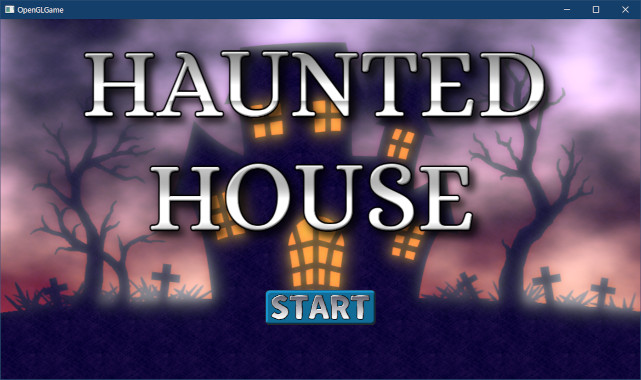

[OpenGL 3D 2023 第07回]

# タイトル画面

## 習得目標

* プログラムを関数にする利点を説明できる。
* マウスの座標とOpenGLの座標の違いを理解する。
* `std::function`に代入できる型を理解する。
* `std::function`がクラスの再利用性を高める理由を説明できる。
* `std::function`にメンバ関数を代入する方法を理解する。

## 1. タイトル画面

### 1.1 ゲームエンジンに「UIオブジェクト」を作成する機能を追加する

この章では、レンダーキューを利用してタイトル画面を作成します。

タイトル画面には複数のUIオブジェクト(`UILayout`コンポーネントを付けたゲームオブジェクトのこと)を配置することになります。UIオブジェクトを作成するたびに、ゴール画像を作成したときと同じコードを書く必要があります。

これは、やる前から面倒そうだと分かります。そこで、ゴール画像を作成するプログラムを改造して「UIオブジェクトを作成する関数」を作ることにします。この関数は、どこからでも使えるように`Engine`クラスに追加します。

まずは必要なヘッダファイルをインクルードしましょう。`Engine.h`を開き、`utility`(ユーティリティ)というヘッダファイルをインクルードしてください。

```diff
 #include "Mesh.h"
 #include <GLFW/glfw3.h>
 #include <string>
+#include <utility>

 /**
 * ゲームエンジン
```

`utility`ヘッダは、この後で使う`std::pair`(ペア)型のために必要です。

次に関数を定義します。関数名は`CreateUIObject`(クリエイト・ユーアイ・オブジェクト)とします。`Engine`クラスの定義にある`Create`関数テンプレートの定義の下に、次のメンバ関数テンプレートを追加してください。

```diff
     gameObjects.push_back(p);
     return p;
   }
+
+  /**
+  * UIオブジェクトを作成する
+  *
+  * @tparam T ゲームオブジェクトに割り当てるUILayoutまたはその派生クラス
+  *
+  * @param filename UIオブジェクトに表示する画像
+  * @param position UIオブジェクトの座標
+  * @param scale    UIオブジェクトの大きさ
+  *
+  * @return 作成したUIオブジェクト
+  */
+  template<typename T>
+  std::pair<GameObjectPtr, std::shared_ptr<T>> CreateUIObject(
+    const char* filename, const vec2& position, float scale)
+  {
+  }

   // すべてのゲームオブジェクトを削除する
   void ClearGameObjectAll();
```

`CreateUIObject`メンバ関数も、`Create`関数と同様に「関数テンプレート」として定義しました。`CreateUIObject`の場合、テンプレート引数`T`で指定されたコンポーネントを追加したゲームオブジェクトを作成します。

UIオブジェクトを作成するプログラムには、ゴール画像を作成するプログラムを流用します。
`GoalEvent.cpp`を開き、メッセージオブジェクトを登場させるプログラムをコピーしてください(コピー範囲は以下のコードを参照)。

`Engine.h`を開き、コピーしたプログラムを`CreateUIObject`メンバ関数に貼り付けてください。

```diff
   std::pair<GameObjectPtr, std::shared_ptr<T>> CreateUIObject(
     const char* filename, const vec2& position, float scale)
   {
+    // メッセージオブジェクトを登場させる
+    Engine* engine = GetOwner()->GetEngine();
+    auto object = engine->Create<GameObject>("goal text", { 0, 0, -1 });
+    object->texColor = std::make_shared<Texture>("Res/goal_text.tga");
+    object->meshId = ???; // 板ポリゴンの図形番号
+    object->renderQueue = RenderQueue_overlay;
+
+    // 画像サイズに応じて拡大率を調整
+    const float baseScale = 0.1f; // この数値は画像に合わせて変えること
+    const float aspectRatio = object->texColor->GetAspectRatio();
+    object->scale = { baseScale * aspectRatio, baseScale, 1 };
+
+    // コンポーネントを追加
+    object->AddComponent<UILayout>();
   };

   // すべてのゲームオブジェクトを削除する
```

`engine`変数は不要なので削除しましょう。`CreateUIObject`メンバ関数を次のように変更してください。

```diff
   std::pair<GameObjectPtr, std::shared_ptr<T>> CreateUIObject(
     const char* filename, const vec2& position, float scale)
   {
-    // メッセージオブジェクトを登場させる
-    Engine* engine = GetOwner()->GetEngine();
-    auto object = engine->Create<GameObject>("goal text", { 0, 0, -1 });
+    auto object = Create<GameObject>("goal text", { 0, 0, -1 });
     object->texColor = std::make_shared<Texture>("Res/goal_text.tga");
     object->meshId = ???; // 板ポリゴンの図形番号
```

それから、このままだと毎回ゴール画像が作られてしまいます。パラメータをメンバ関数の引数で置き換えて、適切なUIオブジェクトが作成されるようにしましょう。`CreateUIObject`メンバ関数を次のように変更してください。

```diff
   std::pair<GameObjectPtr, std::shared_ptr<T>> CreateUIObject(
     const char* filename, const vec2& position, float scale)
   {
-    auto object = Create<GameObject>("goal text", { 0, 0, -1 });
-    object->texColor = std::make_shared<Texture>("Res/goal_text.tga");
+    auto object = Create<GameObject>(filename, { position.x, position.y, 0 });
+    object->texColor = std::make_shared<Texture>(filename);
     object->meshId = ???; // 板ポリゴンの図形番号
     object->renderQueue = RenderQueue_overlay;
  
     // 画像サイズに応じて拡大率を調整
-    const float baseScale = 0.1f; // この数値は画像に合わせて変えること
     const float aspectRatio = object->texColor->GetAspectRatio();
-    object->scale = { baseScale * aspectRatio, baseScale, 1 };
+    object->scale = { scale * aspectRatio, scale, 1 };
  
     // コンポーネントを追加
-    object->AddComponent<UILayout>();
+    object->AddComponent<T>();
   };
```

なお、`CreateUIObject`メンバ関数では、ゲームオブジェクト名に画像ファイル名を指定するようにしました。その理由は、

>UIオブジェクトの名前を参照する機会はそれほど多くなく、オブジェクトを識別する程度の目的なら画像ファイル名で十分だと考えられる

ためです。もし固有の名前が必要な場合は、作成後に手動で設定できます。

最後に、作成したオブジェクトを戻り値として返します。コンポーネントを追加するプログラムを次のように変更してください。

```diff
     object->scale = { scale * aspectRatio, scale, 1 };
  
     // コンポーネントを追加
-    object->AddComponent<T>();
+    auto component = object->AddComponent<T>();
+
+    return { object, component };
   };
```

作成したゲームオブジェクトとコンポーネントは`std::pair`型にまとめられて返されます。
`std::pair`は「2つのテンプレート引数をメンバに持つ構造体」です。簡単な定義は次のようになります。

>```C++
>template<typename T1, typename T2>
>struct pair {
>  T1 first;
>  T2 second;
>};
>```

`pair`は、基本的にはたったこれだけの単純な「型テンプレート」です。2つの値を同時に返したい場合などに使います。

>実際の`pair`の定義には、標準ライブラリのさまざまな局面で利用される機能が含まれています。

動作テストをかねて、ゴール画像の作成を`CreateUIObject`関数に置き換えましょう。
`GoalEvent.cpp`を開き、ゴール画像を作成するプログラムを次のように変更してください。

```diff
   // メッセージオブジェクトを登場させる
   Engine* engine = GetOwner()->GetEngine();
-  auto object = engine->Create<GameObject>("goal text", { 0, 0, -1 });
-  object->texColor = std::make_shared<Texture>("Res/goal_text.tga");
-  object->meshId = ???; // 板ポリゴンの図形番号
-  object->renderQueue = RenderQueue_overlay;
-
-  // 画像サイズに応じて拡大率を調整
-  const float baseScale = 0.1f; // この数値は画像に合わせて変えること
-  const float aspectRatio = object->texColor->GetAspectRatio();
-  object->scale = { baseScale * aspectRatio, baseScale, 1 };
-
-  // コンポーネントを追加
-  object->AddComponent<UILayout>();
+  engine->CreateUIObject<UILayout>("Res/goal_text.tga", { 0, 0 }, 0.1f);
 }
```

>もし`baseScale`を`0.1f`以外に設定していた場合は、`scale`引数の値を`baseScale`の値に変更してください。

プログラムが書けたらビルドして実行してください。ゴール画像が、変更前と同じように表示されていたら成功です。

<p align="center">

</p>

### 1.2 メッシュ番号を定義する

これまで、メッシュ番号は数値を直接指定してきました。しかし、整数で指定すると、メッシュを追加したり削除したりして、番号が変わることがあると修正に大変な手間がかかります。

そこで、番号を表す列挙型を定義することにします。`Engine.h`を開き、インクルード文の下に次のプログラムを追加してください。

```diff
 #include <GLFW/glfw3.h>
 #include <string>
 #include <utility>
+
+// メッシュ番号
+// Initializeメンバ関数にあるmeshes配列と順番を合わせること
+// meshes配列に変更を加えた場合、Meshidの順序も同様に変更すること。
+enum MeshId
+{
+  MeshId_box,
+  MeshId_crystal,
+  MeshId_wall,
+  MeshId_plane_xy,
+};
 
 /**
 * ゲームエンジン
```

<pre class="tnmai_assignment">
<strong>【課題01】</strong>
コメントに書いてあるように、<code>MeshId</code>(メッシュ・アイディ)列挙型の定義順は、
<code>Engine::Initialize</code>メンバ関数にある<code>meshes</code>配列の定義順と一致させなくてはなりません。
<code>meshes</code>配列と一致するように、<code>MeshId</code>を適切に定義しなさい。
</pre>

定義したメッシュ番号を使ってみましょう。`CreateUIObject`メンバ関数テンプレートにある「板ポリゴンのメッシュ番号を設定」するプログラムを、次のように変更してください。

```diff
     object->texColor = std::make_shared<Texture>(filename);
     const float aspectRatio = object->texColor->GetAspectRatio();
     object->scale = { scale * aspectRatio, scale, 1};
-    object->meshId = ???; // 板ポリゴンのメッシュ番号を設定
+    object->meshId = MeshId_plane_xy;
     object->renderQueue = RenderQueue_overlay;

     // 画像サイズに応じて拡大率を調整
```

プログラムが書けたらビルドして実行してください。ゴール画像がこれまでと同じように表示されていたら成功です。

<p align="center">

</p>

<pre class="tnmai_assignment">
<strong>【課題02】</strong>
<code>meshId</code>に数値を設定しているコードを全て検索し(Ctrl+Shift+Fで表示される検索ウィンドウを使います)、それらの数値を全て<code>MeshId</code>列挙型の値に変更しなさい。
</pre>

### 1.3 タイトル画面クラスを定義する

続いて、本命のタイトル画面を作成しましょう。画像が必要なので、以下の画像を用意する課題を完了してください。

>ゲーム会社は作品の「創造性に対する工夫」も見ています。「プレイヤーを楽しませる機会を逃さない人物」を採用したいからです。<br>
>創造性は「何度も試してみる」ことで養われます。もし「自分には創造性がない」と感じているなら、なおのことチャレンジする回数を増やしましょう。<br>
>友人やAIに意見を求めるのもよい方法です。

<pre class="tnmai_assignment">
<strong>【課題03】</strong>
<code>https://pixabay.com/</code>などの画像ダウンロードサイトで「dark house」,「haunted house」などを検索してダウンロードし、TGA形式に変換してプロジェクトの<code>Res</code>フォルダに保存しなさい。
ファイル名は<code>title_bg.tga</code>としなさい。
</pre>

<pre class="tnmai_assignment">
<strong>【課題04】</strong>
<code>cooltext.com</code>や画像編集ソフトを利用して「ゲームのタイトルロゴ」の画像を作成し、TGA形式に変換してプロジェクトの<code>Res</code>フォルダに保存しなさい。
ファイル名は<code>title_logo.tga</code>としなさい。
</pre>

<pre class="tnmai_assignment">
<strong>【課題05】</strong>
<code>cooltext.com</code>や画像編集ソフトを利用してゲームを開始するボタンの画像を作成し、TGA形式に変換してプロジェクトの<code>Res</code>フォルダに保存しなさい。
ファイル名は<code>start_button.tga</code>としなさい。
</pre>

課題が完了したら、プロジェクトの`Src`フォルダに`TitleScene.h`という名前のヘッダファイルを追加してください。追加したファイルを開き、次のプログラムを追加してください。

```diff
+/**
+* @file TitleScene.h
+*/
+#ifndef TITLESCENE_H_INCLUDED
+#define TITLESCENE_H_INCLUDED
+#include "Engine/Scene.h"
+#include "Engine/GameObject.h"
+#include <vector>
+
+/**
+* タイトル画面
+*/
+class TitleScene : public Scene
+{
+public:
+  TitleScene() = default;
+  virtual ~TitleScene() = default;
+
+  virtual bool Initialize(Engine& engine) override;
+  virtual void Finalize(Engine& engine) override;
+};
+
+#endif // TITLESCENE_H_INCLUDED
```

### 1.4 Initializeメンバ関数を定義する

次に、初期化を行う`Initialize`メンバ関数を定義します。プロジェクトの`Src`フォルダに`TitleScene.cpp`という名前のCPPファイルを追加してください。追加したファイルを開き、次のプログラムを追加してください。

```diff
+/**
+* @file TitleScene.cpp
+*/
+#include "TitleScene.h"
+#include "MainGameScene.h"
+#include "Engine/UILayout.h"
+#include "Engine/Engine.h"
+
+/**
+* タイトル画面を初期化する
+*
+* @retval true  初期化成功
+* @retval false 初期化失敗
+*/
+bool TitleScene::Initialize(Engine& engine)
+{
+  engine.CreateUIObject<UILayout>("Res/title_bg.tga", { 0, 0 }, 1);
+  engine.CreateUIObject<UILayout>("Res/title_logo.tga", { 0, 0.3f }, 0.6f);
+  engine.CreateUIObject<UILayout>("Res/start_button.tga", { 0, -0.6f }, 0.1f);
+
+  return true; // 初期化成功
+}
```

このプログラムでは最初に定義した`CreateUIObject`メンバ関数を3回利用しています。もしコピペなどで作っていたら行数は10倍になり、もしミスを見つけた場合は3回も同じ修正をする必要があったでしょう。

このように、プログラムを関数にしたおかげで、プログラムの動作確認が1ヶ所で済むようになり(保守性の向上)、何度でも簡単に利用できます(再利用性の向上)。

`CreataeUIObject`メンバ関数の引数は、`UILayout`コンポーネントによって使用されます。つまり、指定する数値の範囲は次のようになります。

>X座標: `-aspectRatio`～`+aspectRatio`(フルHDの場合、約`-1.778`～`+1.778`)<br>
>Y座標: `-1`～`+1`<br>
>スケール: 画像の上下方向が画面をおおう比率(`1`で上下いっぱいに表示される)

### 1.5 Finalizeメンバ関数を定義する

続いて、`Finalize`(ファイナライズ)メンバ関数を定義します。`Initialize`メンバ関数の定義の下に、次のプログラムを追加してください。

```diff
   return true; // 初期化成功
 }
+
+/**
+* タイトル画面の終了処理
+*/
+void TitleScene::Finalize(Engine& engine)
+{
+  engine.ClearGameObjectAll();
+}
```

これで、タイトル画面を終了するときに、作成した全ゲームオブジェクトが削除されます。

### 1.6 ゲームがタイトル画面から始まるようにする

次に、アプリ起動時に実行されるシーンを`TitleScene`に変更します。<br>
`Main.cpp`を開き、`TitleScene.h`をインクルードしてください。

```diff
 #include "glad/glad.h"
 #include "Engine/Engine.h"
-#include "MainGameScene.h"
+#include "TitleScene.h"
 #include <GLFW/glfw3.h>

 #pragma warning(push)
```

続いて、`main`関数の定義を次のように変更してください。

```diff
   _In_ int nShowCmd)
 {
   Engine engine;
-  engine.SetNextScene<MainGameScene>();
+  engine.SetNextScene<TitleScene>();
   return engine.Run();
 }
```

プログラムが書けたらビルドして実行してください。タイトル画面が表示されたら成功です。

<p align="center">

</p>

<pre class="tnmai_assignment">
<strong>【課題06】</strong>
タイトル画面に表示される画像について、自分が適切だと思う表示になるように、<code>CreateUIObject</code>メンバ関数の引数の値を調整しなさい。
</pre>

### 1.7 マウス座標を取得できるようにする

せっかくゲーム開始ボタンを表示しているのですから、マウスでボタンをクリックできるようにしたいですよね。

そのために、マウスの座標を取得する機能を作成します。ありがたいことに、GLFWライブラリにはマウス座標を取得する`glfwGetCursorPos`(ジーエルエフダブリュー・ゲット・カーソル・ポス)関数があります。

この関数を使ってマウス座標を取得する機能を、ゲームエンジンに追加しましょう。
`Engine.h`を開き、`GetKey`メンバ関数の定義の下に次のプログラムを追加してください。

```diff
   bool GetKey(int key) const {
     return glfwGetKey(window, key) == GLFW_PRESS;
   }
+
+  // マウスカーソルの座標を取得する
+  vec2 GetMousePosition() const;

 private:
   // ワールド座標系のコライダーを表す構造体
```

次に`Engine.cpp`を開き、`SetFovY`メンバ関数の定義の下に、次のプログラムを追加してください。

```diff
   radFovY = degFovY * 3.1415926535f / 180;
   fovScale = 1 / tan(radFovY / 2); // 視野角による拡大率
 }
+
+/**
+* マウスカーソルの座標を取得する
+*
+* @return カメラ座標系のカーソル座標
+*/
+vec2 Engine::GetMousePosition() const
+{
+  // スクリーン座標系のカーソル座標を取得
+  double x, y;
+  glfwGetCursorPos(window, &x, &y);
+
+  // 戻り型に合わせるためにfloatにキャスト
+  const vec2 pos = { static_cast<float>(x), static_cast<float>(y) };
+
+  // UILayerの座標系に合わせるために、スクリーン座標系からカメラ座標系(Z=-1)に変換する
+  int w, h;
+  glfwGetFramebufferSize(window, &w, &h);
+  const vec2 framebufferSize = { static_cast<float>(w), static_cast<float>(h) };
+  const float aspectRatio = framebufferSize.x / framebufferSize.y;
+  return {
+    (pos.x / framebufferSize.x * 2 - 1) * aspectRatio,
+    (pos.y / framebufferSize.y * 2 - 1) * -1 };
+}

 /**
 * ゲームエンジンを初期化する
```

マウス座標はスクリーン座標系で返されます。そのため、画面の中心座標などはウィンドウサイズによって変化します。しかし、画面サイズによって座標が変化すると、UIを操作するときに都合が悪いです。

そこで、UIと同じカメラ座標系に変換します(正確にはZ座標が`-1`のときのカメラ座標)。これは、以下の式で計算できます。

>カメラ座標系のマウス座標.x =<br>
>&emsp;&emsp;((スクリーン座標系のマウス座標.x / 画面サイズ.x) * 2 - 1) * アスペクト比
>
>カメラ座標系のマウス座標.y =<br>
>&emsp;&emsp;((スクリーン座標系のマウス座標.y / 画面サイズ.y) * 2 - 1) * -1

Y座標の式で`-1`を掛けているのは、スクリーン座標系とカメラ座標系ではY軸の方向が逆だからです。

### 1.8 マウスボタンの状態を取得できるようにする

`Engine`にはもうひとつ、「マウスのボタンが押されているかどうか」を調べる機能を追加します。`Engine.h`に次のプログラムを追加してください。

```diff
   // マウスカーソルの座標を取得する
   vec2 GetMousePosition() const;
+
+  // マウスのボタンが押されていたらtrue, 押されていなければfalseを返す
+  bool GetMouseButton(int button) const;

 private:
   // ワールド座標系のコライダーを表す構造体
```

次に`Engine.cpp`を開き、`GetMousePosition`メンバ関数の定義の下に、次のプログラムを追加してください。

```diff
     (pos.x / framebufferSize.x * 2 - 1) * aspectRatio,
     (pos.y / framebufferSize.y * 2 - 1) * -1 };
 }
+
+/**
+* マウスボタンの状態を取得する
+*
+* @param button 調べるボタンを示すマクロ定数(GLFW_MOUSE_BUTTON_LEFT等)
+*
+* @retval true  押されている
+* @retval false 押されていない
+*/
+bool Engine::GetMouseButton(int button) const
+{
+  return glfwGetMouseButton(window, button) == GLFW_PRESS;
+}

 /**
 * ゲームエンジンを初期化する
```

### 1.9 ボタンを作成する

マウスの情報を取得する機能を使って、ボタン機能を持つ`UIButton`(ユーアイ・ボタン)コンポーネントを作成しましょう。`UIButton`コンポーネントは以下の3つの状態を取りうるものとします。

>1. 通常状態(マウスカーソルが乗っていない状態)
>2. 選択状態(マウスカーソルが乗っている状態)
>3. <ruby>押下<rt>おうか</rt></ruby>状態(マウスカーソルが乗っていて、左ボタンが押された状態)

それでは`UIButton`コンポーネントを定義しましょう。プロジェクトの`Src/Engine`フォルダに`UIButton.h`(ユーアイ・ボタン・エイチ)という名前のヘッダファイルを追加してください。追加したファイルを開き、次のプログラムを追加してください。

```diff
+/**
+* @file UIButton.h
+*/
+#ifndef UIBUTTON_H_INCLUDED
+#define UIBUTTON_H_INCLUDED
+#include "UILayout.h"
+#include <functional>
+
+/**
+* UI用のボタン制御コンポーネント
+*/
+class UIButton : public UILayout
+{
+public:
+  UIButton() = default;
+  virtual ~UIButton() = default;
+  virtual void Update(float deltaTime) override;
+
+  vec3 normalColor = { 1, 1, 1 };               // 通常色
+  vec3 highlightedColor = { 1.3f, 1.3f, 1.3f }; // 選択色
+  vec3 pressedColor = { 0.7f, 0.7f, 0.7f };     // 押下色
+
+  // デリゲート
+  using ClickEvent = std::function<void(UIButton*)>;
+  std::vector<ClickEvent> onClick;
+
+private:
+  bool prevButtonDown = false; // 前回更新時のマウス左ボタン操作状態
+};
+
+#endif // UIBUTTON_H_INCLUDED
```

C++でc#のデリゲートに相当する機能を作るには、`function`(ファンクション)型と`vector`
型を組み合わせます。

`function`型には関数、関数オブジェクト、ラムダ式を代入して変数として扱うことができます。代入した値は、いつでも普通の関数と同様に呼び出せます。

<p><code class="tnmai_code"><strong>【書式】</strong><br>
std::function<戻り型(引数リスト)>;
</code></p>

`std::function`に代入する関数をクラス外から指定できるようにしておくと、クラス自体は一切変更することなく異なる処理を実行できます。その結果、様々な場所でクラスを再利用しやすくなります。

次に、プロジェクトの`Src/Engine`フォルダに`UIButton.cpp`という名前のCPPファイルを追加してください。

```diff
+/**
+* @file UIButton.cpp
+*/
+#include "UIButton.h"
+#include "Engine.h"
+
+/**
+* 更新イベント
+*
+* @param deltaTime 前回の更新からの経過時間(秒)
+*/
+void UIButton::Update(float deltaTime)
+{
+  // 基底クラスのメンバ関数を実行
+  UILayout::Update(deltaTime);
+}
```

関数の先頭で、基底クラスの`Update`メンバ関数を実行します。基底クラスのメンバ関数をオーバーライドする場合、この操作が必要なことが多いです。

`Update`メンバ関数では、まずマウスカーソルがボタンの範囲内にあるかどうかを調べます。来てクラスのメンバ関数を実行するプログラムの下に、次のプログラムを追加してください。

```diff
 {
   // 基底クラスのメンバ関数を実行
   UILayout::Update(deltaTime);
+
+  GameObject* owner = GetOwner();
+  Engine* engine = owner->GetEngine();
+
+  const vec2 mouse = engine->GetMousePosition();
+  if (abs(mouse.x - basePosition.x) < owner->scale.x &&
+    abs(mouse.y - basePosition.y) < owner->scale.y) {
+    // カーソルがボタン領域内にある
+  } else {
+    // カーソルがボタン領域外にある
+  }
 }
```

このプログラムは、ゲームエンジンからマウス座標`mouse`を取得し、オブジェクトの座標
`basePosition`との距離がオブジェクトのスケール未満かどうかを調べます。スケール未満の場合、マウスカーソルはボタンの範囲内にあることになります。

カーソルがボタン領域の内側にある場合、次はマウスのボタンが押されたかどうかを調べます。if文の内側に、次のプログラムを追加してください。

```diff
   if (abs(mouse.x - basePosition.x) < owner->scale.x &&
     abs(mouse.y - basePosition.y) < owner->scale.y) {
     // カーソルがボタン領域内にある
+    const bool buttonDown = engine->GetMouseButton(GLFW_MOUSE_BUTTON_LEFT);
+    if (buttonDown) {
+      // 左ボタンが押されている
+      std::copy_n(&pressedColor.x, 3, owner->color);
+    } else {
+      // 左ボタンが離されている
+      std::copy_n(&highlightedColor.x, 3, owner->color);
+      // ボタンクリック判定
+      if (prevButtonDown) {
+        // デリゲートを実行
+        for (auto& e : onClick) {
+          e(this);
+        }
+      }
+    } // if buttonDown
+
+    // マウスボタンの状態を更新
+    prevButtonDown = buttonDown;
   } else {
     // カーソルがボタン領域外にある
```

マウスの左ボタンが押されている場合、ゲームオブジェクトの色を`pressedColor`(プレスド・カラー)に設定します。離されている場合は`highlightedColor`(ハイライテッド・カラー)に設定します。

左ボタンが離されている場合はさらに、前回更新時のマウスボタンの状態を表す
`prevButtonDown`(プレブ・ボタン・ダウン)変数をチェックします。

この変数が`true`の場合、ボタンが離された瞬間のフレームになるため、クリックとみなしてデリゲートを実行します。ここでは`onClick`(オン・クリック)配列に格納されているすべての`function`型変数について、関数呼び出しを行っています。

`function`型に代入した関数やラムダ式は、好きなタイミングで呼び出して使うことができます。このような仕組みは「コールバック(「折り返し電話」という意味)」や「デリゲート(「代理人、代表」という意味)」と呼ばれます。

最後に`prevButtonDown`を更新して、次回の更新に備えます。

次に、カーソルがボタン領域外にある場合を処理します。else文の内側に次のプログラムを追加してください。

```diff
     prevButtonDown = buttonDown;
   } else {
     // カーソルがボタン領域外にある
+    std::copy_n(&normalColor.x, 3, owner->color);
+    prevButtonDown = false;
   }
 }
```

マウスカーソルがボタン領域の外側にある場合、ゲームオブジェクトの色を`normalColor`(ノーマル・カラー)に設定し、さらに、`prevButtonDown`を`false`にします。

マウスボタンの状態を`false`にするのは、「ボタンクリック判定」が誤動作を起こさないようにするためです。

マウスカーソルがボタン領域外に出たときに`prevButtonDown`を`false`にしない場合、ボタン領域内でマウスボタンを押し、そのまま領域外に出てマウスボタンを離すと、`prevButtonDown`が`true`のままになります。

すると、次にマウスカーソルがボタン領域内に入ったとき、「左ボタンが離された→ボタンがクリックされた」と判定されて、デリゲートが実行されてしまいます。

ボタン領域外に出たとき常に`prevButtonDonw`を`false`にすることで、この誤動作を防ぐことができます。

### 1.10 UILayerとUIボタンを作り分ける

それではボタンを追加しましょう。`TitleScene.cpp`を開き、`UIButton.h`をインクルードしてください。

```diff
 */
 #include "TitleScene.h"
 #include "MainGameScene.h"
 #include "Engine/UILayout.h"
+#include "Engine/UIButton.h"
 #include "Engine/Engine.h"
```

次に`Initialize`メンバ関数にあるスタートボタンを作成するプログラムを、次のように変更してください。

```diff
 {
   engine.CreateUIObject<UILayout>("Res/title_bg.tga", { 0, 0 }, 1);
   engine.CreateUIObject<UILayout>("Res/title_logo.tga", { 0, 0.3f }, 0.6f);
-  engine.CreateUIObject<UILayout>("Res/start_button.tga", { 0, -0.6f }, 0.1f);
+  engine.CreateUIObject<UIButton>("Res/start_button.tga", { 0, -0.6f }, 0.1f);

   return true; // 初期化成功
 }
```

プログラムが書けたらビルドして実行してください。ボタンの上にマウスカーソルを移動させたりクリックすると、ボタンの色が変化するはずです。

### 1.11 デリゲートにラムダ式を追加する

続いて、ボタンがクリックされたときにシーンを切り替える機能を作成します。
`TitleScene.cpp`を開き、`UIButton`を作成するプログラムを次のように変更してください。

```diff
   engine.CreateUIObject<UILayout>("Res/title_bg.tga", { 0, 0 }, 1);
   engine.CreateUIObject<UILayout>("Res/title_logo.tga", { 0, 0.3f }, 0.6f);
-  engine.CreateUIObject<UIButton>("Res/start_button.tga", { 0, -0.6f }, 0.1f);
+  auto startButton = engine.CreateUIObject<UIButton>(
+    "Res/start_button.tga", { 0, -0.6f }, 0.1f);
+
+  // ボタンが押されたらメインゲームシーンに切り替えるラムダ式を設定
+  startButton.second->onClick.push_back(
+    [](UIButton* button) {
+      Engine* engine = button->GetOwner()->GetEngine();
+      engine->SetNextScene<MainGameScene>();
+    });

   return true; // 初期化成功
 }
```

プログラムが書けたらビルドして実行してください。ボタンをクリックしたとき、メインゲームシーンが開始されたら成功です。

### 1.12 画面のアスペクト比を取得できるようにする

クリックしたらいきなりスタートするのでは、プレイヤーの心の準備ができません。そこで、フェードアウトを追加することにします。

映像作品において、シーンをフェードアウトする演出は非常にバラエティ豊かで、作品の世界を演出する手段のひとつとなっています。しかし、今回は簡単で使いやすい「画面を徐々に黒くする」演出を作成します。

ところで、`UILayout`コンポーネントのY軸の範囲は常に-1～+1ですが、X軸の範囲はアスペクト比によって変動します。そのため、`UILayout`を使って画面全体を覆うには、画面のアスペクト比が分からなくてはなりません。

そこで、ゲームエンジンに画面サイズ、アスペクト比を取得する機能を追加します。
`Engine.h`を開き、`GetMouseButton`メンバ関数の宣言の下に、次のプログラムを追加してください。

```diff
   // マウスのボタンが押されていたらtrue, 押されていなければfalseを返す
   bool GetMouseButton(int button) const;
+
+  // フレームバッファの大きさを取得する
+  vec2 GetFramebufferSize() const;
+
+  // フレームバッファのアスペクト比を取得する
+  float GetAspectRatio() const;

 private:
   // ワールド座標系のコライダーを表す構造体
```

関数名は`GetFramebufferSize`(ゲット・フレームバッファ・サイズ)と`GetAspectRatio`
(ゲット・アスペクト・レシオ)としました。

次に定義を作成します。`Engine.cpp`を開き、`GetMouseButton`メンバ関数の定義の下に、次のプログラムを追加してください。

```diff
 {
   return glfwGetMouseButton(window, button) == GLFW_PRESS;
 }
+
+/**
+* フレームバッファの大きさを取得する
+*
+* @return フレームバッファの縦と横のサイズ
+*/
+vec2 Engine::GetFramebufferSize() const
+{
+  int w, h;
+  glfwGetFramebufferSize(window, &w, &h);
+  return { static_cast<float>(w), static_cast<float>(h) };
+}
+
+/**
+* フレームバッファのアスペクト比を取得する
+*
+* @return フレームバッファのアスペクト比
+*/
+float Engine::GetAspectRatio() const
+{
+  const vec2 size = GetFramebufferSize();
+  return size.x / size.y;
+}

 /**
 * ゲームエンジンを初期化する
```

これで、画面のアスペクト比を取得できるようになりました。

### 1.13 フェードアウトを追加する

それではフェードアウトを作成しましょう。とりあえず適当なテクスチャが必要なので作成しましょう。

<pre class="tnmai_assignment">
<strong>【課題07】</strong>
<code>white.tga</code>という名前で4x4サイズの白い画像(RGBA全てが255)を作成し、プロジェクトの<code>Res</code>フォルダに保存しなさい。
</pre>

「黒にフェードアウトするのに白い画像？」と不思議に思うかもしれませんが、ゲームオブジェクトにカラーを指定できることを思い出してください。

黒い画像の場合はどんなカラーを指定しても黒にしかなりませんが、白い画像の場合は、カラーを変えることで好きな色にフェードアウトさせることが可能です。

フェードアウトは時間経過をカウントする必要があります。`TitleScene.h`を開き、
`TitleScene`クラスの定義に、次のプログラムを追加してください。

```diff
   virtual ~TitleScene() = default;

   virtual bool Initialize(Engine& engine) override;
+  virtual void Update(Engine& engine, float deltaTime) override;
   virtual void Finalize(Engine& engine) override;
+
+private:
+  GameObjectPtr fadeObject;
+  float fadeTimer = 0;
 };

 #endif // TITLESCENE_H_INCLUDED
```

`fadeTimer`(フェード・タイマー)メンバ変数には、スタートボタンが押されたときに0より大きい数値を設定します。`TitleScene.cpp`を開き、スタートボタンを作成するプログラムを次のように変更してください。

```diff
   // ボタンが押されたらメインゲームシーンに切り替えるラムダ式を設定
   startButton.second->onClick.push_back(
-    [](UIButton* button) {
+    [this](UIButton* button) {
-      Engine* engine = button->GetOwner()->GetEngine();
-      engine->SetNextScene<MainGameScene>();
+      fadeTimer = 1;
     });

   return true;
```

次にフェードアウトのためのUIオブジェクトを追加します。`TitleScene.cpp`を開き、
`Initialize`メンバ関数の定義に次のプログラムを追加してください。

```diff
     [this](UIButton* button) {
       fadeTimer = 1;
     });
+
+  // フェードアウト用UIオブジェクト
+  auto fade = engine.CreateUIObject<UILayout>("Res/white.tga", { 0, 0 }, 1);
+  fadeObject = fade.first;
+  // 画面全体を覆うサイズに設定
+  const vec2 fbSize = engine.GetFramebufferSize();
+  fadeObject->scale = {fbSize.x / fbSize.y, 1, 1};
+  // カラーを「黒、透明」に設定
+  std::fill_n(fadeObject->color, 4, 0.0f);

   return true;
 }
```

最後に、フェードアウトを制御する機能を追加します。`Initialize`メンバ関数の定義の下に、次のプログラムを追加してください。

```diff
   return true;
 }
+
+/**
+* タイトル画面の更新処理
+*
+* @param engine    ゲームエンジン
+* @param deltaTime 前回の更新からの経過時間(秒)
+*/
+void TitleScene::Update(Engine& engine, float deltaTime)
+{
+  if (fadeTimer > 0) {
+    // タイマーに合わせて徐々にフェードアウトさせる
+    fadeTimer -= deltaTime;
+    fadeObject->color[3] = 1 - fadeTimer;
+
+    // タイマーが0以下になったらメインゲームシーンに切り替える
+    if (fadeTimer <= 0) {
+      engine.SetNextScene<MainGameScene>();
+    }
+  } // if fadeTimer
+}

 /**
 * タイトル画面の終了処理
```

プログラムが書けたらビルドして実行してください。スタートボタンをクリックしたとき、画面がフェードアウトしてからメインゲームが開始されたら成功です。

<p align="center">

</p>

### 1.14 ボタンを1回しか押せなくする

実は、ここまでのプログラムではボタンを何度もクリックすると、そのたびにフェードアウトが最初から実行されてしまいます。これは、ボタンを無効化する機能を付けていないからです。

そこで、ボタンの有効・無効を切り替える機能を追加しましょう。`UIButton.h`を開き、`UIButton`クラスの定義に次のプログラムを追加してください。

```diff
   UIButton() = default;
   virtual ~UIButton() = default;
   virtual void Update(float deltaTime) override;

+  bool interactable = true; // マウスに反応を、true=する false=しない
   vec3 normalColor = { 1, 1, 1 };               // 通常色
   vec3 highlightedColor = { 1.5f, 1.3f, 1.1f }; // 選択色
```

メンバ変数`interactable`(インタラクタブル)は、ボタン操作に反応するかどうかを制御します。

次に`interactable`を使ってボタンの更新を制御するプログラムを追加します。
`UIButton.cpp`を開き、`Update`メンバ関数の定義に次のプログラムを追加してください。

```diff
   GameObject* owner = GetOwner();
   Engine* engine = owner->GetEngine();
+
+  // ボタンの有効・無効判定
+  if ( ! interactable) {
+    std::copy_n(&normalColor.x, 3, owner->color);
+    owner->color[3] = 0.75f; // 無効ぽさを出すため少し透明にする
+    return;
+  }

   const vec2 mouse = engine->GetMousePosition();
   if (abs(mouse.x - basePosition.x) < owner->scale.x &&
```

これで、ボタンの有効・無効を切り替えられるようになりました。それでは、この機能を使ってスタートボタンを1回しか押せなくしましょう。

`TitleScene.cpp`を開き、スタートボタンに設定するラムダ式に次のプログラムを追加してください。

```diff
   startButton.second->onClick.push_back(
     [this](UIButton* button) {
       fadeTimer = 1;
+      button->interactable = false; // ボタンを無効化
     });

   auto fade = engine.CreateUIObject<UILayout>(
```

プログラムが書けたらビルドして実行してください。スタートボタンを何度クリックしても、フェードアウトのやり直しが発生しなければ成功です。

### 1.15 ゴールしたらタイトル画面に戻れるようにする

次は、ゴールしたときに「タイトル画面に戻るボタン」を表示します。まず「タイトルに戻る」ボタンの画像を用意してください。

<pre class="tnmai_assignment">
<strong>【課題08】</strong>
<code>cooltext.com</code>や画像編集ソフトを利用して「タイトルに戻る」ボタンの画像を作成し、TGA形式に変換してプロジェクトの<code>Res</code>フォルダに保存しなさい。
ファイル名は<code>return_button.tga</code>としなさい。
</pre>

`GoalEvent.h`を開き、`GoalEvent`クラスの定義に次のプログラムを追加してください。

```diff
   GoalEvent() = default;
   virtual ~GoalEvent() = default;
+
+  virtual void Update(float deltaTime) override;

 private:
   virtual void OnCollision(
     const ComponentPtr& self, const ComponentPtr& other) override;

   bool triggered = false; // ゴール判定が起動したらtrue
+
+  // フェードアウト用の変数
+  GameObjectPtr fadeObject;
+  float fadeTimer = 0;
 };

 #endif // GOALEVENT_H_INCLUDED
```

続いて`GoalEvent.cpp`を開き、`UIButton.h`と`TitleScene.h`をインクルードしてください(タイトル画面に戻れるようにするため)。

```diff
 */
 #include "GoalEvent.h"
 #include "Engine/UILayout.h"
+#include "Engine/UIButton.h"
 #include "Engine/Engine.h"
+#include "TitleScene.h"

 /**
 * ゴール演出の衝突イベント
```

次に、フェードアウトを制御するための`Update`メンバ関数を定義します。
`TitleScene.h`のインクルード文の下に、次のプログラムを追加してください。

```diff
 #include "Engine/UIButton.h"
 #include "Engine/Engine.h"
 #include "TitleScene.h"
+
+/**
+* 状態の更新
+*
+* @param deltaTime 前回の更新からの経過時間(秒)
+*/
+void GoalEvent::Update(float deltaTime)
+{
+  GameObject* owner = GetOwner();
+  Engine* engine = owner->GetEngine();
+
+  // タイマーに合わせて徐々にフェードアウトさせて、
+  // タイマーが0以下になったらメインゲームシーンに切り替える
+  if (fadeTimer > 0) {
+    fadeTimer -= deltaTime;
+    fadeObject->color[3] = 1 - fadeTimer;
+    if (fadeTimer <= 0) {
+      engine->SetNextScene<TitleScene>();
+    }
+  } // if fadeTimer
+}

 /**
 * ゴール演出の衝突イベント
```

それでは、UIオブジェクトを追加しましょう。`OnCollision`メンバ関数の定義に次のプログラムを追加してください。

```diff
   // メッセージオブジェクトを登場させる
   Engine* engine = GetOwner()->GetEngine();
   engine->CreateUIObject<UILayout>("Res/goal_text.tga", { 0, 0 }, 0.1f);
+
+  // 戻るボタンを追加
+  auto button = engine->CreateUIObject<UIButton>(
+    "Res/return_button.tga", { 0, -0.5f }, 0.1f);
+  button.second->onClick.push_back([this](UIButton* button) {
+    fadeTimer = 1;
+    button->interactable = false;
+    });
+
+  // フェードアウト用の画像を追加
+  auto fade = engine->CreateUIObject<UILayout>(
+    "Res/white.tga", { 0, 0 }, 1);
+  fadeObject = fade.first;
+  const vec2 fbSize = engine->GetFramebufferSize();
+  fadeObject->scale = {fbSize.x / fbSize.y, 1, 1};
+  std::fill_n(fadeObject->color, 4, 0.0f);
 }
```

プログラムが書けたらビルドして実行してください。ゴール画像の下に「戻るボタン」が表示され、クリックするとフェードアウトしてタイトル画面に戻ったら成功です。

<p align="center">

</p>

### 1.16 スタート地点を設定する

一度ゴールして、タイトル画面に戻ったら再びゲームを開始してください。すると、即座にゴール画像が表示されると思います。こうなってしまう原因は、ゲーム開始時にプレイヤーの座標を設定していないからです。

実は、マップデータの`S`はスタート地点を表しています。そこで、初期化時に`S`の地点にプレイヤーを配置するプログラムを追加しましょう。

`MainGameScene.cpp`を開き、`Initialize`メンバ関数の定義に次のプログラムを追加してください。

```diff
   floor->position = { floor->scale.x, -1, floor->scale.z };
   floor->texColor = std::make_shared<Texture>("Res/floor.tga");
   floor->meshId = MeshId_box;
+
+  // プレイヤーのスタート地点
+  vec3 startPoint = { 3, 1, 3 };

   // 壁を作成
   auto texWall = std::make_shared<Texture>("Res/wall.tga");
```

次に、壁を作成するプログラムに、スタート地点を設定するプログラムを追加してください。

```diff
         crystal->texColor = texCrystalBlue;
         crystal->meshId = MeshId_crystal;
       }
+      // スタート地点を設定
+      else if (GetMapData(x, y) == 'S') {
+        startPoint = { posX, 1, posZ };
+      }

       // ゴール判定オブジェクトを作成
       if (GetMapData(x, y) == 'G') {
```

最後に、プレイヤーオブジェクトを追加するプログラムを次のように変更してください。

```diff
   player->AddComponent<PlayerComponent>();
   auto collider = player->AddComponent<AabbCollider>();
   collider->aabb = { { -0.5f, 0, -0.5f }, { 0.5f, 1.5f, 0.5f } };
+
+  // プレイヤーとカメラをスタート地点に移動
+  GameObject& camera = engine.GetMainCamera();
+  player->position = camera.position = startPoint;
+  player->rotation = camera.rotation = { 0, 3.14f, 0 }; // +Z方向に向ける

   return true; // 初期化成功
 }
```

プログラムが書けたらビルドして実行してください。一度ゴールしてタイトル画面に戻り、再びゲームを開始したときにゴールではなくスタート地点が表示されたら成功です。

<p align="center">

</p>

>**【1章のまとめ】**
>
>* 同一のプログラムを何度も書いていたり、今後何度も書くことが予想される場合、そのプログラムを関数にする。関数にすると保守性、再利用性が向上する。
>* マウスの座標は「画面左上を原点とするスクリーン座標」として返される。OpenGLの座標系に合わせるには座標変換が必要となる。
>* マウスクリックを判定するには、ボタンが離されたタイミングを判定する。
>* `std::function`型の変数には関数やラムダ式を代入できる。代入した値は好きなタイミングで呼び出して実行できる。
>* フェードイン、フェードアウトを行うには、画面全体を覆う図形を表示し、時間経過によってアルファ値を変更する。

<div style="page-break-after: always"></div>

## 2. 敵とゲームオーバー

### 2.1 敵コンポーネントを定義する

迷路のゴールを見つけるゲームもそれなりに面白いものです。しかし、一度ゴールを見つけてしまうと、それ以上遊ぶ気にはなれないでしょう。そこで、何度も遊べるように、プレイヤーが避けるべき敵を追加しましょう。

敵モデルとして「頭蓋骨」を用意しています。以下の課題を行って「頭蓋骨」の敵モデルを追加してください。

<pre class="tnmai_assignment">
<strong>【課題09】</strong>
以下のURLから<code>skull_mesh.h</code>と<code>skull.png</code>をダウンロードし、<code>Res/MeshData</code>フォルダに保存しなさい。PNGファイルはTGAファイルに変換すること。

&emsp;https://github.com/tn-mai/OpenGL3D2023/tree/main/res/meshdata

次に、保存した<code>skull_mesh.h</code>に含まれる図形データを、<code>Engine::Initialize</code>メンバ関数の<code>meshes</code>配列に追加しなさい。
</pre>

<pre class="tnmai_assignment">
<strong>【課題10】</strong>
課題09で追加した図形データ用のIDを<code>MeshId</code>列挙型に追加しなさい。列挙子の名前は<code>MeshId_skull</code>としなさい。
</pre>

敵モデルの用意ができたら、敵コンポーネントを作成します。プロジェクトの`Src`フォルダに`EnemySkull.h`(エネミー・スカル・エイチ)という名前のヘッダファイルを追加してください。追加したファイルを開き、次のプログラムを追加してください。

```diff
+/**
+* @file EnemySkull.h
+*/
+#ifndef ENEMYSKULL_H_INCLUDED
+#define ENEMYSKULL_H_INCLUDED
+#include "Engine/Component.h"
+
+/**
+* 敵
+*/
+class EnemySkull : public Component
+{
+public:
+  EnemySkull() = default;
+  virtual ~EnemySkull() = default;
+
+  virtual void Awake() override;
+  virtual void Update(float deltaTime) override;
+
+private:
+  float timer = 0; // 動作制御用タイマー
+};
+
+#endif // ENEMYSKULL_H_INCLUDED
```

### 2.2 EnemySkullの初期化関数を定義する

次に、プロジェクトの`Src`フォルダに`EnemySkull.cpp`という名前のCPPファイルを追加してください。追加したファイルを開き、次のプログラムを追加してください。

```diff
+/**
+* @file EnemySkull.cpp
+*/
+#include "EnemySkull.h"
+#include "Engine/AabbCollider.h"
+#include "Engine/Engine.h"
+
+/**
+* コンポーネントの初期化 
+*/
+void EnemySkull::Awake()
+{
+  // 敵モデルを設定
+  auto owner = GetOwner();
+  owner->meshId = MeshId_skull;
+  owner->texColor = std::make_shared<Texture>("Res/MeshData/skull.tga");
+
+  // コライダーを設定
+  auto collider = owner->AddComponent<AabbCollider>();
+  collider->aabb = { { -0.25f, -0.25f, -0.25f }, { 0.25f, 0.25f, 0.25f } };
+  collider->isTrigger = true;
+}
```

コンポーネント経由でゲームオブジェクトを初期化する場合、`Awake`(アウェイク)または`Start`(スタート)メンバ関数をオーバーライドします。この2つは実行タイミングが異なります。

<br>

>* `Awake`は「`AddComponent`関数でコンポーネントを追加したとき」に実行される。
>* `Start`は「`AddComponent`後に、初めてゲームオブジェクトの`Update`メンバ関数が呼ばれたとき」に実行される。

このため、自分以外のゲームオブジェクトやコンポーネントを参照しなくてもできる初期化は
`Awake`で実行し、参照が必要な初期化は`Start`で実行するのが安全です。

このメンバ関数では、ゲームオブジェクトに「頭蓋骨」モデルを設定し、コライダーを「トリガーモード」に設定しています。「頭蓋骨」は比較的小さいモデルなので、コライダーのサイズは小さめの直径0.25mとしました。

### 2.3 EnemySkullの更新関数を定義する

続いて、敵の状態を更新する関数を定義します。`Awake`メンバ関数の定義の下に、次のプログラムを追加してください。

```diff
   collider->aabb = { { -0.25f, -0.25f, -0.25f }, { 0.25f, 0.25f, 0.25f } };
   collider->isTrigger = true;
 }
+
+/**
+* コンポーネントの更新
+*
+* @param deltaTime 前回の更新からの経過時間(秒)
+*/
+void EnemySkull::Update(float deltaTime)
+{
+  auto owner = GetOwner();
+
+  // 動作制御用タイマーを更新
+  timer += deltaTime;
+
+  // タイマーによって座標を上下に揺らす
+  constexpr float baseY = 1;    // 基準の高さ(m)
+  constexpr float range = 0.1f; // 揺らす高さの範囲(m)
+  constexpr float cycle = 5;    // 揺らす間隔(秒)
+  owner->position.y = baseY + sin(timer * cycle) * range;
+}
```

`Update`メンバ関数では、`sin`関数を使って敵の座標を上下に揺らしています。

### 2.4 敵を配置する

それでは、作成した敵をマップに配置しましょう。<br>
`MainGameScene.cpp`を開き、`EnemySkull.h`をインクルードしてください。

```diff
 #include "MainGameScene.h"
 #include "PlayerComponent.h"
 #include "GoalEvent.h"
+#include "EnemySkull.h"
 #include "Engine/Engine.h"
 #include "Engine/Collision.h"
```

現在のマップデータにおいて、敵は`E`で表されています。`Initialize`メンバ関数に、`E`を見つけたら敵を配置するプログラムを追加してください。

```diff
       else if (GetMapData(x, y) == 'S') {
         startPoint = { posX, 1, posZ };
       }
+      // 敵を配置
+      else if (GetMapData(x, y) == 'E') {
+        auto enemy = engine.Create<GameObject>("enemy", { posX, 0, posZ });
+        auto component = enemy->AddComponent<EnemySkull>();
+      }

       // ゴール判定オブジェクトを作成
       if (GetMapData(x, y) == 'G') {
```

プログラムが書けたらビルドして実行してください。迷路を少し進んだ先の部屋に、「頭蓋骨」が浮いていたら成功です。

<p align="center">

</p>

### 2.5 敵を移動させる

敵といっても、止まってふわふわしているだけでは大した脅威にはなりません。そこで、敵を移動させましょう。移動は以下のルールで行うことにします。

>1. 前方が壁でなければ前に進む
>2. 前方が壁なら左に90度向きを変える

さて、「前方が壁かどうか」を調べるには、`MainGameScene`クラスの`GetMapData`メンバ関数を使う必要があります。しかし、現在この関数はプライベートメンバなので外部のクラスからは使えません。

このようなとき、`EnemySkull`から`GetMapData`メンバ関数を呼び出せるようにするには、以下のような方法が考えられます。

>1. `GetMapData`をパブリックメンバにする。
>2. `GetMapData`を呼び出す「関数オブジェクト」を`EnemySkull`に追加する。
>3. マップを参照するインターフェイスを定義して`MainGameScene`クラスで実装し、`EnemySkull`はインターフェイス経由で`MainGameScene`にアクセスする。

このリストでは、下の例ほど設計が抽象的で再利用性が高まりますが、そのぶん実装が複雑になります。再利用性の高い設計をすることは重要ですが、実装を複雑にしすぎるのもよくありません。そこで、2の「関数オブジェクト」を使う方法を試そうと思います。

関数オブジェクトは「関数のように扱えるオブジェクト」のことです。C++においては「関数呼び出し構文を使えるように`operator()`をオーバーロードしたクラスまたは構造体」を意味します。これにはラムダ式も含まれます。

関数オブジェクトは`function`型に代入できます。`EnemySkull.h`を開き、次のプログラムを追加してください。

```diff
 #ifndef ENEMYSKULL_H_INCLUDED
 #define ENEMYSKULL_H_INCLUDED
 #include "Engine/Component.h"
+#include "Engine/VecMath.h"
+#include <functional>
 
 /**
 * 敵
 */
 class EnemySkull : public Component
 {
 public:
   EnemySkull() = default;
   virtual ~EnemySkull() = default;

   virtual void Awake() override;
   virtual void Update(float deltaTime) override;
+
+  // マップデータを参照する関数オブジェクト
+  std::function<int(const vec3&)> getMapData;
 
 private:
   float timer = 0; // 動作制御用タイマー
```

`getMapData`(ゲット・マップ・データ)は「関数オブジェクト」を保持する変数です。

次に、マップを参照して移動と方向転換を行うプログラムを追加します。`EnenySkull.cpp`を開き、`Update`メンバ関数の定義に次のプログラムを追加してください。

```diff
   constexpr float cycle = 5;    // 揺らす間隔(秒)
   constexpr float range = 0.1f; // 揺らす高さの範囲(m)
   owner->position.y = baseY + sin(timer * cycle) * range;
+
+  // 前方に壁がなければ前進、前方が壁または部屋の区切りなら左に90度向きを変える
+  if (getMapData) {
+    const vec3 front = { cos(owner->rotation.y), 0, -sin(owner->rotation.y) };
+    const int data = getMapData(owner->position + front);
+    if (data != '#' && data != '|' && data != '-') {
+      // 前進
+      const float speed = 1;
+      owner->position.x += front.x * speed * deltaTime;
+      owner->position.z += front.z * speed * deltaTime;
+    } else {
+      // 左に旋回
+      owner->rotation.y += 90.0f * 3.14159265f / 180.0f;
+    }
+  } // if getMapData
 }
```

>**【マップの記号について】**<br>
>`#`(シャープ)は「壁」、`|`(垂直線)と`-`(マイナス)は「部屋の区切り記号」です。

このプログラムでは、`std::function`型の変数`getMapData`を関数のように使っています。このように、`std::function`型の変数に設定した関数オブジェクトは、いつでも実行できます。

また、`std::function`型の変数を条件式に指定したとき、値が設定されていれば`true`、設定されていなければ`false`と解釈されます。上記のプログラムではこれを利用して、設定されている場合のみ移動を実行するようにしています。

それでは、`getMapData`変数に関数オブジェクトを設定しましょう。`MainGameScene.cpp`
を開き、`Initialize`メンバ関数に次のプログラムを追加してください。

```diff
       else if (GetMapData(x, y) == 'E') {
         auto enemy = engine.Create<GameObject>("enemy", { posX, 0, posZ });
         auto component = enemy->AddComponent<EnemySkull>();
+        component->getMapData = [this](const vec3& position) {
+          int x, y;
+          MapPosition(position, x, y);
+          return GetMapData(x, y);
+        };
       }

       // ゴール判定オブジェクトを作成
```

プログラムが書けたらビルドして実行してください。「頭蓋骨」が移動していたら成功です。

### 2.6 プレイヤーの状態を作成する

敵を移動させたので、次は敵に衝突したらゲームオーバーになるようにしましょう。まずプレイヤーの状態を追加します。`PlayerComponent.h`を開き、`PlayerComponent`クラスの定義に次のプログラムを追加してください。

```diff
       camera.rotation.y += 0.0005f;
     }
   }
+
+  // プレイヤーの状態を表す列挙型
+  enum class State {
+    alive, // 生きている
+    goal,  // ゴールした
+    dead,  // 死んでいる
+  };
+  State GetState() const { return state; }
+
+private:
+  State state = State::alive; // プレイヤーの状態
 };

 #endif // PLAYERCOMPONENT_H_INCLUDED
```

次に、衝突したときに実行される`OnCollision`メンバ関数をオーバーライドします。
`Udpate`メンバ関数の定義の下に、次のプログラムを追加してください。

```diff
       camera.rotation.y += 0.0005f;
     }
   }
+
+  // 衝突時の処理
+  virtual void OnCollision(
+    const ComponentPtr& self, const ComponentPtr& other) override
+  {
+    // alive以外の状態は衝突に反応しない
+    if (state != State::alive) {
+      return;
+    }
+    
+    // 名前がenemyのオブジェクトと衝突したらdead状態にする
+    // goalのオブジェクトと衝突したらgoal状態にする
+    const auto& name = other->GetOwner()->name;
+    if (name == "enemy") {
+      state = State::dead;
+    } else if (name == "goal") {
+      state = State::goal;
+    }
+  }

   // プレイヤーの状態を表す列挙型
   enum class State {
```

これで、ゲームオーバーを判定できるようになりました。

### 2.7 ゲームオーバーを作成する

それでは、ゲームオーバーを判定してゲームオーバーメッセージを表示しましょう。まずゲームオーバーの画像を用意します。

<pre class="tnmai_assignment">
<strong>【課題11】</strong>
cooltext.comなどを利用して、ゲームオーバーを表す画像を作成しなさい。
作成した画像ファイルをプロジェクトの<code>Res</code>フォルダにダウンロードし、TGA形式に変換しなさい。ファイル名は<code>game_over.tga</code>としなさい。
</pre>

画像の準備ができたらゲームオーバーを作成しましょう。<br>
ゲームオーバーの管理は`MainGameScene`クラスで行うことにします。そのために、「プレイ中」と「ゲームオーバー」という2つの状態を表す機能を追加します。

`MainGameScene.h`を開き、`fuctional`ヘッダをインクルードしてください。

```diff
 #include "Engine/GameObject.h"
 #include "Engine/VecMath.h"
 #include <vector>
+#include <functional>

 // 先行宣言
 class PlayerComponent;
```

次に、`MainGameScene`クラスの定義に次のプログラムを追加してください。

```diff
   float squareSize = 2;  // マップの1マスの大きさ
   float squareScale = squareSize / 2; // 壁・床の拡大率
   GameObjectPtr player;  // プレイヤーが操作するオブジェクト
+
+  // ゲームの状態
+  using State = std::function<void(MainGameScene*, Engine&, float)>;
+  State state = &MainGameScene::State_Playing;
+
+  // 状態に対応する更新関数
+  void State_Playing(Engine& engine, float deltaTime);
+  void State_GameOver(Engine& engine, float deltaTime);
 };

 #endif // MAINGAMESCENE_H_INCLUDED
```

上記のプログラムでは、列挙型のかわりに`std::function`型を使って「プレイ中」と「ゲームオーバー」を表現しています。

「状態」は`State_Playing`(ステート・プレイング)と`State_GameOver`(ステート・ゲームオーバー)の2つのメンバ関数によって表されます。これらは「状態を表す値」であると同時に、「各状態の更新関数」でもあります。

`std::function`にメンバ関数を指定するには、第1引数に「クラスのポインタ型」を指定します(上記のプログラムの`MainGameScene*`の部分)。

このように、「状態」を表現する方法はひとつではありません。表現方法は大きく以下の3種類に分けられるので、状況によって適切なものを選択します。

>1. **状態を「整数型」や「列挙型」で表現する**:<br>`if`や`switch`を使うパターン。単純な状態の制御ならこれで十分。
>2. **状態を「関数ポインタ」や「`std::function`」で表現する**:<br>`if`や`switch`の内容が複雑になってきて、関数が大きくなりすぎた場合に使う。<br>そのような関数が複数ある場合は3を検討する。
>3. **状態を「クラス」で表現する(いわゆるステートパターン)**:<br>「状態を扱う処理が複数ある」、「各処理が比較的長く複雑」というような、1や2の方法ではプログラムを十分に読みやすくできない場合に使う。

今回は2の方法を使いましたが、理由は「状態ごとに異なる更新処理を行いたい」からです。これは3の方法でも可能ですが、分けたい処理がひとつだけの場合は無駄が多いです。

また、1の方法を選ばなかったのは、ゲーム中にでさまざまな処理を行うことを想定すると、1の方法ではすぐに読みづらいプログラムになると予想したからです。

続いて、状態ごとに異なる更新関数が実行されるようにします。ゲームオーバー状態からタイトル画面に戻れるようにしたいので、`MainGameScene.cpp`を開き、`TitleScene.h`をインクルードしてください。

```diff
 #include "PlayerComponent.h"
 #include "GoalEvent.h"
 #include "EnemySkull.h"
+#include "TitleScene.h"
+#include "Engine/UIButton.h"
 #include "Engine/Engine.h"
 #include "Engine/Collision.h"
```

次に、「プレイ中」状態の更新関数を定義します。これは現在の`Update`メンバ関数をそのまま流用します。`Update`メンバ関数の定義を次のように変更してください。

```diff
 * シーンを更新する
 */
 void MainGameScene::Update(Engine& engine, float deltaTime)
 {
+  // 状態に対応する更新関数を実行
+  state(this, engine, deltaTime);
+}
+
+/**
+* 「プレイ中」状態のシーンを更新する
+*
+* @param engine    ゲームエンジン
+* @param deltaTime 前回の更新からの経過時間(秒)
+*/
+void MainGameScene::State_Playing(Engine& engine, float deltaTime)
+{
   constexpr vec3 playerSize = { 1, 1.5f, 1 };
 
   GameObject& camera = engine.GetMainCamera();
```

次に、「プレイヤーがgameOver状態」の場合の処理を追加します。`State_Playing`メンバ関数の定義に次のプログラムを追加してください。

```diff
   auto player = playerComponent->GetOwner();
   player->position = camera.position;
   player->rotation = camera.rotation;
+
+  // プレイヤーが死んでいたら、ゲームオーバー画面を表示して、状態をgameOverに変更
+  if (playerComponent->GetState() == PlayerComponent::State::dead) {
+    // ゲームオーバー画像を表示
+    engine.CreateUIObject<UILayout>("Res/game_over.tga", { 0, 0 }, 0.25f);
+
+    // タイトル画面に戻るボタンを表示
+    auto button = engine.CreateUIObject<UIButton>(
+      "Res/return_button.tga", { 0, -0.5f }, 0.1f);
+    button.second->onClick.push_back([](UIButton* button) {
+      Engine* engine = button->GetOwner()->GetEngine();
+      engine->SetNextScene<TitleScene>();
+      });
+
+    // 状態を「ゲームオーバー」に変更
+    state = &MainGameScene::State_GameOver;
+  }

   // 実験的に視野角を操作
   float fovY = engine.GetFovY();
```

次に「ゲームオーバー」状態に対応するメンバ関数を定義します。`State_Playing`メンバ関数の定義の下に、次のプログラムを追加してください。

```diff
     // 状態を「ゲームオーバー」に変更
     state = &MainGameScene::State_GameOver;
   }
 }
+
+/**
+* 「ゲームオーバー」状態のシーンを更新する
+*
+* @param engine    ゲームエンジン
+* @param deltaTime 前回の更新からの経過時間(秒)
+*/
+void MainGameScene::State_GameOver(Engine& engine, float deltaTime)
+{
+}

 /**
 * ワールド座標に対応するマップ座標を取得する
```

現在のところ、ゲームオーバー状態では何も実行する必要はありません。しかし、この関数が無意味なわけではありません。「プレイヤーの状態をチェックしない」という点で、十分に役目を果たしています。

プログラムが書けたらビルドして実行してください。敵に接触したとき、ゲームオーバー画像が表示されていたら成功です。

<p align="center">

</p>

### 2.8 タイトル画面に戻れるようにする

<p align="center">

</p>

ゲームオーバーになり、「戻るボタン」をクリックしてタイトル画面に戻ろうとすると、上の画面のようなエラーが表示されると思います。

このエラーは

>`EnemySkull`オブジェクトが、削除された`MainGameScene`オブジェクトを参照した

ために起きています。そして、エラーが起きる根本の原因は

>`MainGameScene`を終了するときに`EnemySkull`オブジェクトを削除していない

ことです。

`EnemySkull`はシーンが終わっても生きているので、`MainGameScene`にマップデータをもらおうとします。しかし、`MainGameScene`は既に終了しているため、データの取得などできるはずがありません。その結果、エラーになるというわけです。

修正は簡単で「シーンが終了するときにゲームオブジェクトを削除する」だけです。
`MainGameScene.h`を開き、`MainGameScene`クラスの定義に次のプログラムを追加してください。

```diff
   virtual ~MainGameScene() = default;
   virtual bool Initialize(Engine& engine) override;
   virtual void Update(Engine& engine, float deltaTime) override;
+  virtual void Finalize(Engine& engine) override;

 private:
   char GetMapData(int x, int y) const { return map[y * mapSizeX + x]; }
```

次に`MainGameScene.cpp`を開き、`Update`メンバ関数の定義の下に次のプログラムを追加してください。

```diff
   // 状態に対応する更新関数を実行
   state(this, engine, deltaTime);
 }
+
+/**
+* シーンを終了する
+*/
+void MainGameScene::Finalize(Engine& engine)
+{
+  engine.ClearGameObjectAll();
+}

 /**
 * 「プレイ中」状態のシーンを更新する
```

プログラムが書けたらビルドして実行してください。ゲームオーバーになり、「戻るボタン」をクリックしたときにタイトル画面に戻れたら成功です。

<p align="center">

</p>

### 2.9 プレイヤーを停止させる

ゲームオーバーになったらプレイヤーの移動を止めるほうがよいでしょう。
`PlayerComponent.h`を開き、`Update`メンバ関数の定義に次のプログラムを追加してください。

```diff
   {
     Engine* engine = GetOwner()->GetEngine();
     GameObject& camera = engine->GetMainCamera();
+
+    // alive以外の状態は移動できない
+    if (state != State::alive) {
+      return;
+    }

     // カメラのX軸移動
     const float cameraSpeed = 0.0005f;
```

プログラムが書けたらビルドして実行してください。ゲームオーバーになったときやゴールしたときに、プレイヤーが移動できなくなっていたら成功です。

>**【2章のまとめ】**
>
>* 本当に必要な場合は、プライベートメンバをパブリックメンバにしてもよい。
>* オブジェクトの状態ごとに関数を作成し、それらの関数を`std::function`型に代入して切り替えることで、状態の変化を表現することができる。
>* `std::function`にメンバ関数を代入するには、第1引数の型にクラスへのポインタ型を指定する。
