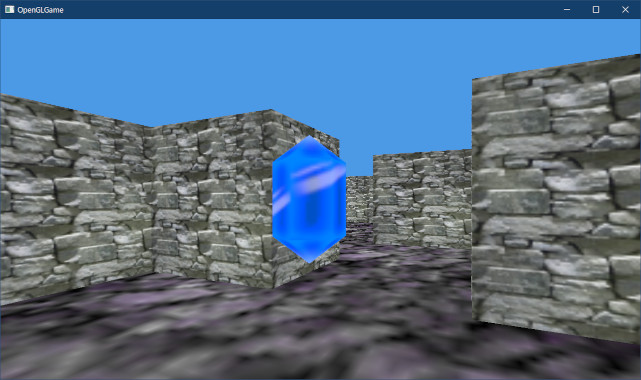
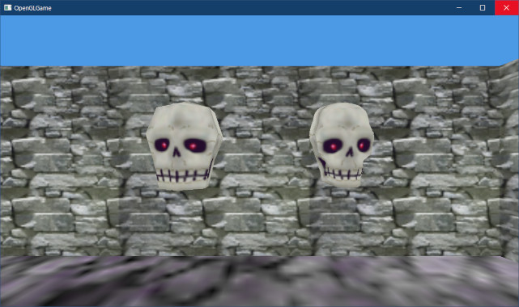

[OpenGL 3D 2023 第08回]

# OBJファイルの基礎

## 習得目標

* 「カプセル化」の定義および利点、欠点について説明できる。
* 「OBJファイル」に格納されるデータについて説明できる。
* 「OBJファイル」をOpenGL用のデータ形式に変換するプログラムを書くことができる。
* `unordered_map`(アンオーダード・マップ)クラスの使い方を説明できる。

## 1. 図形データの管理

### 1.1 デバッグ出力マクロを定義する

これまで使ってきた`OutputDebugString`マクロは、名前が長いわりに機能が貧弱で、使いやすいとは言いがたいものでした。また、使用するには`Windows.h`をインクルードしたうえで、`#pragma`による警告回避をするなどの手間もかかります。

そこで、`Windows.h`のインクルードを不要にし、さらに`printf`と同じくらい使いやすいデバッグ出力マクロを作成します。

プロジェクトの`Src/Engine`フォルダに`Debug.h`という名前のヘッダファイルを追加してください。追加したファイルを開き、次のプログラムを追加してください。

```diff
+/**
+* @file Debug.h
+*/
+#ifndef DEBUG_H_INCLUDED
+#define DEBUG_H_INCLUDED
+
+/**
+* デバッグ用の機能を格納する名前空間
+*/
+namespace Debug {
+
+// メッセージの種類
+enum class Type {
+  error,   // エラー
+  warning, // 警告
+  info,    // その他の情報
+};
+
+void Log(Type type, const char* func, const char* format, ...);
+
+} // namespace Debug
+
+#ifndef NDEBUG
+#   define ENABLE_DEBUG_LOG // このマクロを定義するとデバッグ出力が有効になる
+#endif // NDEBUG
+
+// デバッグ出力マクロ
+#ifdef ENABLE_DEBUG_LOG
+#   define LOG_ERROR(...)   Debug::Log(Debug::Type::error, __func__, __VA_ARGS__)
+#   define LOG_WARNING(...) Debug::Log(Debug::Type::warning, __func__, __VA_ARGS__)
+#   define LOG(...)         Debug::Log(Debug::Type::info, __func__, __VA_ARGS__)
+#else
+#   define LOG_ERROR(...)   ((void)0)
+#   define LOG_WARNING(...) ((void)0)
+#   define LOG(...)         ((void)0)
+#endif // ENABLE_DEBUG_LOG
+
+#endif // DEBUG_H_INCLUDED
```

プログラムを実行中になにか問題が起きたとき、プログラムの実行に支障をきたすレベルの問題には`LOG_ERROR`(ログ・エラー)、設定ミスなどの軽微な問題には`LOG_WARNING`(ログ・ワーニング)を使います。

また、問題ではないが、情報として出力したいメッセージ(例えば「確認のために実際に読み込んだファイル名を出力する」など)には、`LOG`(ログ)を使います。

これらのマクロは記述を簡単にするためのもので、実際にデバッグ出力を行うのは`Log`(ログ)関数です。関数の末尾の`...`(ピリオド3つ)は「可変引数リスト(または可変長引数リスト、可変個引数リスト)」といいます。

可変引数リストを使うと、`printf`のように引数の数が変化する関数を作ることができます。

それから、デバッグ出力をするとゲームの実行速度が遅くなるため、デバッグ時以外では無効にしています。`NDEBUG`(エヌ・デバッグ、ノー・デバッグ)は`Release`ビルドのときだけ定義されるマクロで、「デバッグ機能なし」を意味します。

このマクロと`#ifndef～#else～#endif`を組み合わせることで、`NDEBUG`が定義されているときはデバッグ出力が無効になるようにしています。

また、`ENABLE_DEBUG_LOG`(イネーブル・デバッグ・ログ)マクロをあいだにはさむことで、
`NDEBUG`とは無関係にデバッグ出力を制御できるようにしています。`Release`(リリース)ビルドでのみ発生する問題を解決する場合に使えるでしょう。

>**_DEBUGとNDEBUGの違い**<br>
>`_DEBUG`はVisual Studioが独自に定義するマクロで、`NDEBUG`はC/C++言語規格で定義されているマクロです。使うなら`NDEBUG`をおすすめします。よりよい方法は`MY_DEBUG`
>のような独自のマクロ名を定義することです。

デバッグ出力が無効な場合、`LOG_ERROR`、`LOG_WARNING`、`LOG`は`(void)0`で置きかえられます。

例えば、

`LOG_ERROR("ファイル%sを開けません", filename);`

は、

`(void)0;`

となります。空文ではなく`(void)0`に置き換えるのは、コンパイラの警告を避けるためです。

>Visual Studioの標準設定では空文でも警告されませんが、警告設定を変えたり他のコンパイラを使うと、単独の`;`に対して警告が発生します。

`__func__`(ファンク)は、コンパイル中に「その行が含まれる関数名」で置き換えられる特別なキーワードです。

`__VA_ARGS__`(バ・アーグス)は、プリプロセッサマクロ版の`...`(可変引数リスト)です。引数の数が不定なマクロを作ることができます。

それでは`Log`関数を定義しましょう。プロジェクトの`Src/Engine`フォルダに`Debug.cpp`という名前のCPPファイルを追加してください。追加したファイルを開き、次のプログラムを追加してください。

```diff
+/**
+* @file Debug.cpp
+*/
+#include "Debug.h"
+#include <Windows.h>
+#include <stdio.h>
+#include <stdarg.h>
+
+namespace Debug {
+
+/**
+* 書式付き文字列をデバッグウィンドウに表示する
+*/
+void Log(Type type, const char* func, const char* format, ...)
+{
+  char buffer[1024];
+  char* p = buffer;
+  size_t size = sizeof(buffer) - 1; // 末尾に\nを追加するため
+
+  // ログの種類と関数名を設定
+  static const char* const typeNames[] = { "エラー", "警告", "情報" };
+  size_t n = snprintf(p, size, "[%s] %s: ",
+    typeNames[static_cast<int>(type)], func);
+  p += n;
+  size -= n;
+
+  // メッセージを設定
+  va_list ap;
+  va_start(ap, format);
+  p += vsnprintf(p, size, format, ap);
+  va_end(ap);
+
+  // 末尾に改行を追加
+  p[0] = '\n';
+  p[1] = '\0';
+
+  // 作成した文字列をデバッグウィンドウに表示
+  OutputDebugString(buffer);
+}
+
+} // namespace Debug
```

可変引数リストには引数名がないため、通常の引数のように使うことはできません。個々の引数にアクセスするには`va_list`(バ・リスト)型の変数を使います。`va_list`は可変引数リストを管理するオブジェクト型です。

>`va`(バ)は`variadic arguments`(バリアディック・アーギュメンツ)の短縮形です。

`va_list`型を使って引数にアクセスするには以下の関数を使います。これらは`stdarg.h`(エスティディー・アーグ・エイチ)というヘッダファイルに定義されています。

<p><code class="tnmai_code"><strong>【書式】</strong><br>
va_start(va_list型変数, 可変引数リストの直前にある引数の名前);
</code></p>

`va_start`(バ・スタート)は、`va_list`型の変数を初期化します。

<p><code class="tnmai_code"><strong>【書式】</strong><br>
va_end(va_list型変数);
</code></p>

`va_end`(バ・エンド)は`va_list`型変数を破棄します。

<p><code class="tnmai_code"><strong>【書式】</strong><br>
引数の値 va_arg(va_list型変数, 引数の型);
</code></p>

`va_arg`(バ・アーグ)は可変引数リストから引数をひとつ取り出します。1回目の`va_arg`は1番目の引数、2回目の`va_arg`は2番目の引数、というように、呼び出すたびに次の引数を取得します。

>`va_arg`は、上記のプログラムでは使用してしません。

`vsnprintf`(ブイ・エス・エヌ・プリント・エフ)は`printf`のバリエーションのひとつです。`v`が付いた`printf`系関数は、引数として`va_list`型の変数を受け付けます。それ以外の点では`snprintf`と同じです。

<p><code class="tnmai_code"><strong>【書式】</strong><br>
int vsnprintf(出力先のアドレス, 出力可能なバイト数, 書式付き文字列,<br>
&emsp;va_list型変数);
</code></p>

`vsnprintf`関数は「出力したバイト数」を返します。この値を出力先を指すポインタ`p`に加算することで、出力結果が連続するようにしています。

### 1.2 OutputDebugStringをデバッグ出力マクロで置き換える

それでは、これまで書いてきた`OutputDebugString`をデバッグ出力マクロに置き換えましょう。`Engine.cpp`を開き、`Debug.h`をインクルードしてください。

```diff
 * @file Engine.cpp
 */
 #include "Engine.h"
+#include "Debug.h"

 #pragma warning(push)
 #pragma warning(disable:4005)
```

次に、`DebugCallback`関数にある`OutputDebugString`関数を、`LOG`マクロで置き換えてください。

```diff
     s.assign(message, message + length);
   }
   s += '\n'; // メッセージには改行がないので追加する
-  OutputDebugStringA(s.c_str());
+  LOG(s.c_str());
 }

 /**
 * シェーダファイルを読み込んでコンパイルする
```

続いて、`CompileShader`関数にある`OutputDebugString`関数を、`LOG_ERROR`マクロで置き換えてください。

```diff
   if (!file) {
-    char s[256];
-    snprintf(s, 256, "[ERROR] %s: %sを開けません\n", __func__, filename);
-    OutputDebugString(s);
+    LOG_ERROR("%sを開けません", filename);
     return 0;
   }
```

`DebugCallback`関数では`LOG`を使い、`CompileShader`では`LOG_ERROR`を使ったのには以下の理由があります。

>1. `DebugCallback`に渡されるメッセージには「エラー種別」が含まれている。ここで`LOG_ERROR`や`LOG_WARNING`を使うとエラー種別が二重に出力されて分かりづらい。`LOG`ならエラー種別を出力しないため、この問題が起きない。
>2. `CompileShader`で出力していた元のエラーメッセージを見ると、`[ERROR]`というエラー種別文字列が含まれている。`LOG_ERROR`で置き換えれば、同じエラー種別を出力できる。

また、`OutputDebugString`を使わなくなったことで、`Windows.h`のインクルードは不要になりました。`Windows.h`のインクルード文を削除してください。

```diff
 #include "Engine.h"
 #include "Debug.h"
-
-#pragma warning(push)
-#pragma warning(disable:4005)
-#include <Windows.h>
-#pragma warning(pop)
-
 #include <string>
 #include <vector>
```

<pre class="tnmai_assignment">
<strong>【課題01】</strong>
<code>Texture.cpp</code>にある<code>OutputDebugString</code>を、適切なデバッグ出力マクロで置き換えなさい。
</pre>

プログラムが書けたら、ビルドが成功することだけ確認してください(`Ctrl+Shift+B`でビルドできます)。実行の必要はありません。

### 1.3 バッファオブジェクトを管理するクラスを定義する

プログラムの構造化を進めるために、頂点バッファ、インデックスバッファ、VAOの3つを管理するクラスを定義します。

頂点バッファとインデックスバッファは図形データを格納するオブジェクトです。この2つは格納するデータこそ異なりますが、分類としてはどちらも「バッファオブジェクト(BO)」になります。

そこで、バッファオブジェクトを管理するクラスを定義します。<br>
プロジェクトの`Src/Engine`フォルダに`BufferObject.h`という名前のヘッダファイルを追加してください。追加したファイルを開き、次のプログラムを追加してください。

```diff
+/**
+* @file BufferObject.h
+*/
+#ifndef BUFFEROBJECT_H_INCLUDED
+#define BUFFEROBJECT_H_INCLUDED
+#include "glad/glad.h"
+#include <memory>
+
+// 先行宣言
+class BufferObject;
+using BufferObjectPtr = std::shared_ptr<BufferObject>;
+
+/**
+* バッファオブジェクト(BO)
+*/
+class BufferObject
+{
+public:
+  /**
+  * バッファオブジェクトを作成する
+  *
+  * @param size  バッファオブジェクトのバイトサイズ
+  * @param data  バッファにコピーするデータのアドレス
+  *              nullptrを指定すると空のバッファが作成される
+  * @param flags 用途を示すビットフラグの論理和(glBufferStorageを参照)
+  *
+  * @return 作成したバッファオブジェクトへのポインタ
+  */
+  static BufferObjectPtr Create(GLsizeiptr size,
+    const void* data = nullptr, GLbitfield flags = 0)
+  {
+    return std::make_shared<BufferObject>(size, data, flags);
+  }
+
+  // コンストラクタ
+  BufferObject(GLsizeiptr size, const void* data, GLbitfield flags)
+  {
+    bufferSize = size;
+    glCreateBuffers(1, &id);
+    glNamedBufferStorage(id, bufferSize, data, flags);
+  }
+
+  // デストラクタ
+  ~BufferObject() { glDeleteBuffers(1, &id); }
+
+  // コピーと代入を禁止
+  BufferObject(const BufferObject&) = delete;
+  BufferObject& operator=(const BufferObject&) = delete;
+
+  // 管理番号を取得
+  operator GLuint() const { return id; }
+
+  // バッファサイズを取得
+  GLsizeiptr GetSize() const { return bufferSize; }
+
+private:
+  GLuint id = 0;             // オブジェクト管理番号
+  GLsizeiptr bufferSize = 0; // バッファサイズ(バイト数)
+};
+
+#endif // BUFFEROBJECT_H_INCLUDED
```

このクラスは、それほど複雑なことをしていません。そのため、ヘッダファイルだけで完結するようにしてみました。

### 1.4 VAOを管理するクラスを定義する

続いて、VAOを管理するクラスを定義します。名前は`VertexArrayObject`(バーテックス・アレイ・オブジェクト)とします。

プロジェクトの`Src/Engine`フォルダに`VertexArrayObject.h`という名前のヘッダファイルを追加してください。追加したファイルを開き、次のプログラムを追加してください。

```diff
+/**
+* @file VertexArrayObject.h
+*/
+#ifndef VERTEXARRAYOBJECT_H_INCLUDED
+#define VERTEXARRAYOBJECT_H_INCLUDED
+#include "glad/glad.h"
+#include <memory>
+
+// 先行宣言
+class VertexArrayObject;
+using VertexArrayObjectPtr = std::shared_ptr<VertexArrayObject>;
+
+/**
+* 頂点配列オブジェクト(VAO)
+*
+* 頂点バッファに格納されている頂点データについて、
+* 各要素がどのように配置されているかを記述するオブジェクト。
+*/
+class VertexArrayObject
+{
+public:
+  /**
+  * VAOを作成する
+  *
+  * @return 作成したVAOへのポインタ
+  */
+  static VertexArrayObjectPtr Create()
+  {
+    return std::make_shared<VertexArrayObject>();
+  }
+
+  // コンストラクタ、デストラクタ
+  VertexArrayObject() { glCreateVertexArrays(1, &id); }
+  ~VertexArrayObject() { glDeleteVertexArrays(1, &id); }
+
+  // コピーと代入を禁止
+  VertexArrayObject(const VertexArrayObject&) = delete;
+  VertexArrayObject& operator=(const VertexArrayObject&) = delete;
+
+  // 管理番号を取得
+  operator GLuint() const { return id; }
+
+  /**
+  * 頂点アトリビュートを設定
+  *
+  * @param index  設定する頂点アトリビュートの番号(0～15)
+  * @param size   要素のデータ数(float=1, vec2=2, vec3=3, vec4=4)
+  * @param stride 次の頂点データにある同一要素までの間隔(バイト数)
+  * @param offset 頂点データ内における要素の位置(バイト数)
+  */
+  void SetAttribute(
+    GLuint index, GLint size, size_t stride, size_t offset)
+  {
+    glEnableVertexAttribArray(index);
+    glVertexAttribPointer(index, size, GL_FLOAT, GL_FALSE,
+      static_cast<GLsizei>(stride), reinterpret_cast<void*>(offset));
+  };
+
+private:
+  GLuint id = 0; // オブジェクト管理番号
+};
+
+#endif // VERTEXARRAYOBJECT_H_INCLUDED
```

「あるデータ(変数)と、そのデータを操作する機能(関数)をひとまとめにして定義することで、不適切なデータ操作を防ぐ手法」のことを「カプセル化」といいます。

理想的な(完全な)カプセル化では、どのような操作を行ったとしても、データは常にプログラムで意図された状態になります。C++では、データをプライベートメンバとして定義するなど、外部からの操作を制限することで実現されます。

>**【不完全なカプセル化】**<br>
>`VertexArrayObject`クラスと`BufferObject`クラスは、厳密には「カプセル化されていません」。理由は、クラスの外にあるプログラムから管理番号を取得できてしまうからです。管理番号を取得できれば、勝手にオブジェクトのサイズを変更したり削除することができてしまいます。<br>
>このような「不完全なカプセル化」はバグの原因になるため、避けるべきです。<br>
>しかし、本テキストではそれが分かったうえで、「不完全なカプセル化」を選びました。管理番号を取得できなくするには、管理番号を使う全てのOpenGL関数(少なくともプログラムで必要なもの)について、対応するメンバ関数を定義しなくてはなりません。これはクラス定義が大きくなり、作成に時間がかかることを意味します。<br>
>さらに重要なことに、プログラムの大半がメンバ関数の呼び出しによって書かれることになるため、OpenGL関数を覚えることにつながらない、という問題があります。しかし、本テキストの第一目標は「OpenGLの学習」です。そのため、厳密なカプセル化より「学習のしやすさ」を優先しました。

### 1.5 図形データを管理するクラスを定義する

次に、図形データを管理するクラスを定義します。コンピューターグラフィックスでは図形を「ポリゴンの集合」として扱います。このポリゴンの集合のことを「メッシュ」と呼びます。

そこで、管理クラスの名前は`MeshBuffer`(メッシュ・バッファ)とします。`Mesh.h`を開き、次のプログラムを追加してください。

```diff
 #ifndef MESH_H_INCLUDED
 #define MESH_H_INCLUDED
 #include "glad/glad.h"
+#include "BufferObject.h"
+#include "VertexArrayObject.h"
 #include <vector>
 #include <memory>
+
+// 先行宣言
+class MeshBuffer;
+using MeshBufferPtr = std::shared_ptr<MeshBuffer>;

 /**
 * 頂点データ形式
```

`MeshBuffer`クラスの定義には、図形データを格納するバッファオブジェクトと図形の頂点アトリビュートを定義するVAOが必要です。そのため、これらを管理するためのヘッダファイルを追加しています。

それでは、頂点データを管理する`MeshBuffer`クラスを定義しましょう。`DrawParams`構造体の定義の下に、次のプログラムを追加してください。

```diff
   const void* indices = 0;    // 描画開始インデックスのバイトオフセット
   GLint baseVertex = 0;       // インデックス0となる頂点配列内の位置
 };
+
+/**
+* 頂点データを管理するクラス
+*/
+class MeshBuffer
+{
+public:
+  /**
+  * メッシュバッファを作成する
+  *
+  * @param bufferSize 格納できる頂点データのサイズ(バイト数)
+  */
+  static MeshBufferPtr Create(size_t bufferSize)
+  {
+    return std::make_shared<MeshBuffer>(bufferSize);
+  }
+
+  // コンストラクタ・デストラクタ
+  MeshBuffer(size_t bufferSize);
+  ~MeshBuffer() = default;
+
+  // コピーと代入を禁止
+  MeshBuffer(const MeshBuffer&) = delete;
+  MeshBuffer& operator=(const MeshBuffer&) = delete;
+
+  /**
+  * 頂点データの追加
+  *
+  * @param vertices    GPUメモリにコピーする頂点データ配列
+  * @param vertexBytes verticesのバイト数
+  * @param indices     GPUメモリにコピーするインデックスデータ配列
+  * @param indexBytes  indicesのバイト数
+  * @param mode        プリミティブの種類
+  */
+  void AddVertexData(const Vertex* vertices, size_t vertexBytes,
+    const uint16_t* indices, size_t indexBytes, GLenum mode = GL_TRIANGLES);
+
+  // 全ての頂点データを削除
+  void Clear();
+
+  // 描画パラメータの取得
+  const DrawParams& GetDrawParams(size_t index) const
+  {
+    return drawParamsList[index];
+  }
+
+  // 描画パラメータの数を取得
+  size_t GetDrawParamsCount() const { return drawParamsList.size(); }
+
+  // VAOの取得
+  VertexArrayObjectPtr GetVAO() const { return vao; }
+
+private:
+  std::vector<DrawParams> drawParamsList; // 描画パラメータ配列
+  VertexArrayObjectPtr vao; // 頂点アトリビュート配列
+  BufferObjectPtr buffer;   // 頂点データおよびインデックスデータ
+  size_t usedBytes = 0;     // バッファの使用済み容量(バイト)
+};

 #endif // MESH_H_INCLUDED
```

デストラクタはデフォルトの定義を使います。明示的に破棄しなければならないメンバ変数がひとつもないからですが、これはバッファオブジェクトとVAOのクラスを適切に設計したことによるものです。

それから、`MeshBuffer`クラスは、VBOとIBOをひとつのバッファオブジェクトにまとめて管理することにしました。そのため、バッファオブジェクトはひとつしか用意していません。

頂点データとインデックスデータをひとつのバッファオブジェクトに格納する方法については、`AddVertexData`メンバ関数を定義するときに説明します。

### 1.6 MeshBufferコンストラクタを定義する

次に`MeshBuffer`クラスのコンストラクタを定義します。プロジェクトの`Src/Engine`フォルダに`Mesh.cpp`という名前のCPPファイルを追加してください。追加したファイルを開き、次のプログラムを追加してください。

```diff
+/**
+* @file Mesh.cpp
+*/
+#include "Mesh.h"
+#include "Debug.h"
+#include <numeric>
+
+/**
+* コンストラクタ
+*/
+MeshBuffer::MeshBuffer(size_t bufferSize)
+{
+  // バッファオブジェクトを作成
+  buffer = BufferObject::Create(bufferSize, nullptr, GL_DYNAMIC_STORAGE_BIT);
+
+  // VAOを作成
+  vao = VertexArrayObject::Create();
+
+  // VBOとIBOをVAOにバインド
+  glBindVertexArray(*vao);
+  glBindBuffer(GL_ELEMENT_ARRAY_BUFFER, *buffer);
+  glBindBuffer(GL_ARRAY_BUFFER, *buffer);
+
+  // 頂点アトリビュートを設定
+  vao->SetAttribute(0, 3, sizeof(Vertex), offsetof(Vertex, position));
+  vao->SetAttribute(1, 2, sizeof(Vertex), offsetof(Vertex, texcoord));
+
+  // 誤った操作が行われないようにバインドを解除
+  glBindVertexArray(0);
+  glBindBuffer(GL_ELEMENT_ARRAY_BUFFER, 0);
+  glBindBuffer(GL_ARRAY_BUFFER, 0);
+
+  // 描画パラメータの容量を予約
+  drawParamsList.reserve(100);
+}
```

`MeshBuffer`クラスでは、VBOとIBOをひとつのバッファオブジェクトにまとめています。そのため、`GL_ELEMENT_ARRAY_BUFFER`と`GL_ARRAY_BUFFER`の両方に同じバッファオブジェクトを指定しています。

>**【`glVertexAttribArray`と`GL_ARRAY_BUFFER`によるバインド関係】**<br>
>VBOは個々の頂点アトリビュートにバインドされます。これは頂点アトリビュートごとに異なるVBOをバインドできるということです。なお、バインドは「`glVertexAttribArray`関数が実行されたとき」に行われます。`glBindBuffer`関数は「VBOをOpenGLコンテキストにバインド」するだけで、頂点アトリビュートにはバインドしません。これに対して、IBOの場合は`glBindBuffer`関数によってVAOにバインドされます。VBOとIBOでバインドのタイミングが異なるので注意してください。

### 1.7 AddVertexData関数を定義する

次に`AddVertexData`(アド・バーテックス・データ)メンバ関数を定義します。コンストラクタの定義の下に、次のプログラムを追加してください。

```diff
   // 描画パラメータの容量を予約
   drawParamsList.reserve(100);
 }
+
+/**
+* 頂点データの追加
+*/
+void MeshBuffer::AddVertexData(const Vertex* vertices, size_t vertexBytes,
+  const uint16_t* indices, size_t indexBytes, GLenum mode)
+{
+  // 空き容量が足りていることを確認
+  // 必要なバイト数が空きバイト数より大きい場合は追加できない
+  const size_t totalBytes = vertexBytes + indexBytes;
+  const size_t freeBytes = buffer->GetSize() - usedBytes;
+  if (totalBytes > freeBytes) {
+    LOG_ERROR("容量が足りません(要求サイズ=%d, 使用量/最大容量=%d/%d)",
+      vertexBytes + indexBytes, usedBytes, buffer->GetSize());
+    return;
+  }
+
+  // 頂点データをGPUメモリにコピー
+  GLuint tmp[2];
+  glCreateBuffers(2, tmp);
+  glNamedBufferStorage(tmp[0], vertexBytes, vertices, 0);
+  glNamedBufferStorage(tmp[1], indexBytes, indices, 0);
+  glCopyNamedBufferSubData(tmp[0], *buffer, 0, usedBytes, vertexBytes);
+  glCopyNamedBufferSubData(tmp[1], *buffer, 0, usedBytes + vertexBytes, indexBytes);
+  glDeleteBuffers(2, tmp);
+
+  // 追加した図形の描画パラメータを作成
+  DrawParams newParams;
+  newParams.mode = mode;
+  newParams.count = static_cast<GLsizei>(indexBytes / sizeof(uint16_t));
+  // インデックスデータの位置(バイト数で指定)は頂点データの直後
+  newParams.indices = reinterpret_cast<void*>(usedBytes + vertexBytes);
+  // 頂点データの位置は頂点データ数で指定する
+  newParams.baseVertex = static_cast<GLint>(usedBytes / sizeof(Vertex));
+  drawParamsList.push_back(newParams);
+
+  // 次のデータ格納開始位置を計算
+  constexpr size_t a = std::lcm(sizeof(uint16_t), sizeof(Vertex)); // 共通の境界サイズ
+  usedBytes += ((totalBytes + a - 1) / a) * a;
+}
```

最初に「バッファオブジェクトの残り容量」と「コピーする頂点データの総バイト数」を比較し、容量が足りていることを確認します。バッファオブジェクトの容量以上のデータをコピーしようとすると、エラーになってしまうからです。

容量が足りている場合は、頂点データをバッファオブジェクトが指すGPUメモリにコピーします。コピーの手順は`Engine.cpp`にある頂点データをコピーするプログラムとほぼ同じです。違いは「VBOとIBOに同じバッファオブジェクトを指定していること」です。

バッファオブジェクトには「頂点データ→インデックスデータ」の順でデータをコピーします。この順序には特に理由はないので逆でも構いません。重要なのは、順序と描画パラメータの設定を揃えることです。

描画パラメータの`newParams.indices`(ニューパラムス・インディシーズ)変数と
`newParams.baseVertex`(ニューパラムス・ベースバーテックス)変数に設定する値は、コピー順序を考慮したものになっている必要があります。

コピー先の先頭位置は`usedBytes`(ユーズド・バイツ)メンバ変数で示されます。先にコピーしたのは頂点データなので、`baseVertex`には`usedBytes`の値を指定しています。

インデックスデータは頂点データの後ろにコピーしたので、`indices`には`vertexBytes`(バーテックス・バイツ)変数だけずらした位置を指定しています。

頂点データをコピーし、描画パラメータを作成して`drawParamsList`に追加したら、次の頂点データの追加に備えて`usedBytes`を更新します。

ここで注意することは、コピー先の位置を、頂点データとインデックスデータの共通の境界に合わせることです。共通の境界に合わせることで、どちらも正しい境界にデータをコピーできます。

インデックスデータは`uint16_t`型なので、境界サイズは2バイトです。頂点データは
`Vertex`構造体で、境界サイズは20バイトです。共通の境界は「最小公倍数」に一致するので`20`バイトになります。

2つの数値の最小公倍数を求めるには`std::lcm`(エル・シー・エム, `least common multiple`の短縮形)関数を使います。この関数は`numeric`(ニューメリック)ヘッダに定義されています。

<pre class="tnmai_code"><strong>【書式】</strong>
最小公倍数 std::lcm(数値その1, 数値その2);
</pre>

境界サイズに合わせた数値を求めるには、次の計算式を使います。

&emsp;((元の値 + 境界サイズ - 1) / 境界サイズ) * 境界サイズ

この計算式は「整数型の除算はあまりを切り捨てる」という特徴を利用して、「元の値以上かつ、最小の境界サイズの倍数」を求めています。

常に境界サイズに合わせた値を加算することで「`usedBytes`が常に境界サイズと一致する」ことを保証できます。

### 1.8 Clear関数を定義する

次に`Clear`(クリア)メンバ関数を定義します。`AddVertexData`関数の定義の下に、次のプログラムを追加してください。

```diff
   constexpr size_t a = std::lcm(sizeof(uint16_t), sizeof(Vertex)); // 共通の境界サイズ
   usedBytes += ((totalBytes + a - 1) / a) * a;
 }
+
+/**
+* 全ての頂点データを削除
+*/
+void MeshBuffer::Clear()
+{
+  usedBytes = 0;
+  drawParamsList.clear();
+}
```

`usedBytes`を0にすることで、次にデータをGPUメモリにコピーするとき、バッファオブジェクトの先頭からコピーが行われます。GPUメモリにコピーした頂点データを削除する必要はありません。これで、`MeshBuffer`クラスの定義は完了です。

### 1.9 EngineクラスにMeshBufferを追加する

図形データの管理に`MeshBuffer`を使うように、ゲームエンジンを変更します。
`Engine.h`を開き、`Engine`クラスの定義に次のプログラムを追加してください。

```diff
   GLintptr vboSize = 0; // 頂点バッファの現在のサイズ
   GLintptr iboSize = 0; // インデックスバッファの現在のサイズ
   std::vector<DrawParams> drawParamsList; // 描画パラメータ配列
+  MeshBufferPtr meshBuffer;   // 図形データ管理オブジェクト
   GameObjectList gameObjects; // ゲームオブジェクト配列
   double previousTime = 0; // 前回更新時の時刻
```

続いて、`meshBuffer`メンバ変数を初期化しましょう。`Engine.cpp`を開き、`Initialize`メンバ関数に次のプログラムを追加してください。

```diff
     { sizeof(plane_xy_vertices), sizeof(plane_xy_indices), plane_xy_vertices, plane_xy_indices },
     { sizeof(skull_vertices), sizeof(skull_indices), skull_vertices, skull_indices },
   };
+  meshBuffer = MeshBuffer::Create(32'000'000);
+  for (const auto& e : meshes) {
+    meshBuffer->AddVertexData(
+      static_cast<const Vertex*>(e.vertexData), e.vertexSize,
+      static_cast<const uint16_t*>(e.indexData), e.indexSize);
+  }
+ 
    // 図形データから描画パラメータを作成し、データをGPUメモリにコピーする
    drawParamsList.reserve(std::size(meshes));
```

図形データ用のバッファサイズは32メガバイトとしました(サイズに根拠はありません)。不足した場合はこの値を大きくしてください。

### 1.11 描画をmeshBufferで置き換える

次に、描画プログラムを`meshBuffer`を使うように書き換えます。<br>
`DrawGameObject`メンバ関数の定義を次のように変更してください。

```diff
 void Engine::DrawGameObject(
   GameObjectList::iterator begin,
   GameObjectList::iterator end)
 {
+  glBindVertexArray(*meshBuffer->GetVAO());
   for (GameObjectList::iterator i = begin; i != end; ++i) {
     const auto& e = *i;
 
     // 図形番号がリストにない場合は描画しない
-    if (e->meshId < 0 || e->meshId >= drawParamsList.size()) {
+    if (e->meshId < 0 || e->meshId >= meshBuffer->GetDrawParamsCount()) {
       continue;
     }
 
     // ユニフォーム変数にデータをコピー
     glProgramUniform4fv(prog3D, 100, 1, e->color);
     glProgramUniform3fv(prog3D, 0, 1, &e->scale.x);
     glProgramUniform3fv(prog3D, 1, 1, &e->position.x);
     glProgramUniform2f(prog3D, 2, sin(e->rotation.y), cos(e->rotation.y));
 
     // 描画に使うテクスチャを指定
     if (e->texColor) {
       const GLuint tex = *e->texColor;
       glBindTextures(0, 1, &tex);
     }
 
     // 図形を描画
-    const DrawParams& params = drawParamsList[e->meshId];
+    const DrawParams& params = meshBuffer->GetDrawParams(e->meshId);
     glDrawElementsInstancedBaseVertex(params.mode, params.count,
       GL_UNSIGNED_SHORT, params.indices, 1, params.baseVertex);
   }
+  glBindVertexArray(0);
 }
 
 /**
 * ゲームオブジェクトの状態を更新する
```

プログラムが書けたらビルドして実行してください。これまでと同じように画面が表示されていたら成功です。

<p align="center">

</p>

### 1.12 古いVBO, IBO, VAOを使ったプログラムを削除する

`meshBuffer`を使った描画に成功したので、これまて使っていたVBO, IBO, VAOは削除しましょう。`Engine.h`を開き、`Engine`クラスの定義を次のように変更してください。

```diff
   GLuint vs = 0;     // 頂点シェーダの管理番号
   GLuint fs = 0;     // フラグメントシェーダの管理番号
   GLuint prog3D = 0; // シェーダプログラムの管理番号
-  GLuint vbo = 0; // 頂点バッファの管理番号
-  GLuint ibo = 0; // インデックスバッファの管理番号
-  GLuint vao = 0; // VAOの管理番号
-  GLintptr vboSize = 0; // 頂点バッファの現在のサイズ
-  GLintptr iboSize = 0; // インデックスバッファの現在のサイズ
-  std::vector<DrawParams> drawParamsList; // 描画パラメータ配列
   MeshBufferPtr meshBuffer;   // 図形データ管理オブジェクト
   GameObjectList gameObjects; // ゲームオブジェクト配列
```

次に`Engine.cpp`を開き、`Initialize`メンバ関数の定義からVBOを作成するプログラムを削除してください。

```diff
     { {-1, 1, 1 }, { 1, 1 } },
     { {-1, 1,-1 }, { 0, 1 } },
   };
-  glCreateBuffers(1, &vbo);
-  glNamedBufferStorage(vbo, sizeof(Vertex) * 100'000, nullptr, 0);

   // インデックスデータをGPUメモリにコピー
   const GLushort indexData[] = {
```

同様に、IBOを作成するプログラムを削除してください。

```diff
     { {-1, 1, 1 }, { 1, 1 } },
     { {-1, 1,-1 }, { 0, 1 } },
   };

-  // インデックスデータをGPUメモリにコピー
   const GLushort indexData[] = {
     0, 1, 2, 2, 3, 0,
     4, 5, 6, 6, 7, 4,
     8, 9,10,10,11, 8,
    12,13,14,14,15,12,
    16,17,18,18,19,16,
    20,21,22,22,23,20,
   };
-  indexCount = static_cast<GLsizei>(std::size(indexData));
-
-  glCreateBuffers(1, &ibo);
-  glNamedBufferStorage(ibo, sizeof(uint16_t) * 500'000, nullptr, 0);
 
   // 図形データの情報
   struct MeshData {
```

最後に描画パラメータを作成するプログラムと、VAOを作成するプログラムを削除してください。

```diff
       static_cast<const Vertex*>(e.vertexData), e.vertexSize,
       static_cast<const uint16_t*>(e.indexData), e.indexSize);
   }
-  // 図形データから描画パラメータを作成し、データをGPUメモリにコピーする
-  drawParamsList.reserve(std::size(meshes));
-  for (const auto& e : meshes) {
-    // 図形データをGPUメモリにコピー
-    GLuint tmp[2];
-    glCreateBuffers(2, tmp);
-    glNamedBufferStorage(tmp[0], e.vertexSize, e.vertexData, 0);
-          ・
-          ・
-        (省略)
-          ・
-          ・
-  // 1番目の頂点属性を有効化
-  glEnableVertexAttribArray(1);
-
-  // 1番目の頂点属性を設定
-  glVertexAttribPointer(1, 2, GL_FLOAT, GL_FALSE, sizeof(Vertex),
-    reinterpret_cast<const void*>(offsetof(Vertex, texcoord)));

   // ゲームオブジェクト配列の容量を予約
   gameObjects.reserve(1000);
```

これで、VBO, IBO, VAOを扱うプログラムを管理クラスに移動させることができました。これらのクラスが正しく動作することを説明(証明)できるなら、それらを正しく使っている限りは`Initialize`メンバ関数も正しく動作すると考えてよいはずです。

このように、責任(やるべきこと、やるべきでないこと)の範囲を関数やクラスの単位で分担させると、個々の関数やクラスの責任が明確になり、行数も短くなります。結果として、プログラム全体の「管理のしやすさ」が向上します。

プログラムを修正したらビルドして実行してください。プログラムを削除する前と同じ画面が表示されていたら成功です。

<p align="center">

</p>

>**【1章のまとめ】**
>
>* `OutputDebugStringA`のように「機能が限定されていて不便な関数」がある場合、「必要な機能を追加した関数やマクロを作り、その中で元の関数を呼び出す」ことで高機能化できる。
>* VBOとIBOは格納するデータが異なるだけなので、同じ「バッファオブジェクト」として扱える。
>* 理想的なカプセル化を行うには、管理するオブジェクトを外部から一切見えなくする必要がある。理想的なカプセル化には多くのプログラムを書かなければならないが、大抵は十分な見返りが期待できる。カプセル化を弱めるとバグを生みやすくなるため、「学習用など何らかの意図がある場合」を除いて、常に理想的なカプセル化を目指すべき。
>* 「カプセル化」によって機能を管理するプログラムを関数やクラスにまとめると、個々の関数やクラスの責任が明確になり、プログラム全体を管理しやすくなる。

<div style="page-break-after: always"></div>

## 2. 図形データをファイルから読み込む

### 2.1 ファイル形式の選択

箱の図形データを作成したとき、「単純な立方体程度のモデルでも、手作業で頂点データやインデックスデータを定義するのは大変だ」と感じたのではないでしょうか。

しかし、世の多くの図形データは数千、数万の頂点データから作られています。そんな大量のデータを手作業で書くことは不可能、とは言いませんが非現実的です。

そのため、通常は図形作成用のアプリケーションを使います。このようなアプリは「3Dモデリングソフト」と呼ばれます。世の中にはさまざまな3Dモデリングソフトがあり、それぞれ価格や得意な分野が異なります。

ここで問題となるのは、ソフトによって作成されるデータの形式が異なることです。しかも、それらは3Dモデリングソフト自身が使うために設計されているため、ほかのアプリやOpenGLで使うことが難しいのです。

それでは不便なので、異なるアプリ間でデータをやり取りするための汎用形式が存在します。今回は汎用形式のひとつである`OBJ`(オブジェ)形式を扱います。

OBJ形式を選んたのは、「仕様が小さいので比較的プログラミングが簡単」であり、さらに「対応しているツールが非常に多い」からです。

>**【OBJ(オブジェ)形式について】**<br>
>Advanced Visualizer(アドバンスド・ビジュアライザ)というツールのために開発されたファイル形式です。仕様が非常に小さくまとまっていて扱いやすいのですが、標準では頂点カラーが定義できない、アニメーションを扱えないなどの制約があります。しかし、単純であること、仕様が公開されていること、定義された時期が古いために長く使われていることの3点から、ほとんどの3Dモデリングソフトが読み書きに対応しています。

### 2.2 OBJファイルを追加する

OBJファイルの仕様では、点・線・三角形に加えて多角形や曲線、曲面も定義できます。しかし、とりあえず必要なのは三角形の読み込み機能だけです。まずはこの機能を作成していきます。

OBJファイルの拡張子は`.obj`ですが、中身は単なるテキストファイルです。そのため、テキストエディタで中身を見たり編集することができます。ただ、`.obj`はありふれた名前なので、他の種類のファイルに使われていたりします。

例えば、Visual Studioはアプリをビルドするときの一時的なファイルとして、CPPファイルから拡張子が`.obj`のファイルを作成します(`x64/Debug`フォルダを見てみるとよいでしょう)。

そのため、Visual Studioプロジェクトに拡張子`.obj`のファイルを追加すると、3Dモデルファイルではなくビルド用のファイルだと認識されてしまいます。

Visual Studioプロジェクトには、3Dモデル用のOBJファイルを追加しないほうが無難でしょう。そんなわけなので、OBJファイルを作成するにはWindowsの「エクスプローラー」を使うことになります。

「エクスプローラー」でプロジェクトの`Res/MeshData`フォルダを開き、`box.obj`という名前の新規ファイルを追加してください(「ホーム→新しいアイテム→テキストドキュメント」を選択)。

>**【Visual Studioからプロジェクトフォルダを開く】**<br>
>ソリューションエクスプローラーに表示されているプロジェクト名(ソリューションではない)を右クリックして、下のほうにある「エクスプローラーでフォルダーを開く」を選択すると、プロジェクトのフォルダを開くことができます。<br>
>また、開いているファイルのタブを右クリックして「このアイテムのフォルダーを開く」を選択すると、ファイルの置かれたフォルダを開くことができます。

`box.obj`を作成したら、「右クリック→プログラムから開く」を選択して「メモ帳」を選んでファイルを開いてください。

ファイルを開いたら、以下のテキストを入力してください。`v`で始まる行は頂点座標、`vt`で始まる行はテクスチャ座標、`f`で始まる行は平面のインデックスデータです。

>空白の有無に注意すること。

```diff
+# box.obj
+
+v -1 -1  1
+v  1 -1  1
+v  1  1  1
+v -1  1  1
+v  1 -1 -1
+v -1 -1 -1
+v -1  1 -1
+v  1  1 -1
+
+vt 0 0
+vt 1 0
+vt 1 1
+vt 0 1
+
+f 1/1 2/2 3/3 4/4
+f 5/1 6/2 7/3 8/4
+f 2/1 5/2 8/3 3/4
+f 6/1 1/2 4/3 7/4
+f 4/1 3/2 8/3 7/4
+f 2/1 1/2 6/3 5/4
```

OBJファイルには頂点データ用の構文と、インデックスデータ用の構文があります。頂点データは要素ごとに異なる配列として定義されます。頂点データの構文を次に示します。

>**v** *x y z*<br>
>&emsp;頂点の座標を定義します。`v`はvertexの頭文字です。<br>
>&emsp;`x`,`y`,`z`は頂点のX,Y,Z座標を表す浮動小数点数です。

>**vt** *u v*<br>
>&emsp;テクスチャ座標を定義します。`vt`はvertex textureの頭文字です。<br>
>&emsp;`u`,`v`は頂点のU, V座標を表す浮動小数点数です。

>**vn** *i j k*<br>
>&emsp;法線を定義します。`vn`はvertex normalの頭文字です。<br>
>&emsp;`i`,`j`,`k`は法線のX,Y,Z成分を表す浮動小数点数です。<br>
>&emsp;※法線については次回以降のテキストで説明します。

OBJファイルのインデックスデータは頂点データのインデックス番号の組として定義されます。OpenGLとは異なり、番号は1番から始まることに注意してください(0ではありません)。インデックスデータの構文を次に示します。

>**p** *v1*<br>
>&emsp;点を定義します。`p`はpointの頭文字です。<br>
>&emsp;`v1`は点を構成する頂点座標のインデックスです。<br>
>&emsp;OpenGLの`GL_POINTS`プリミティブに相当します。

>**l** *v1 v2 ... vN*<br>
>&emsp;直線を定義します。`l`はlineの頭文字です。<br>
>&emsp;`v1`, `v2`, ...`vN`は直線を構成する頂点座標のインデックスです。<br>
>&emsp;OpenGLの`GL_LINES`プリミティブに相当します。

>**f** *v1 v2 ... vN*<br>
>&emsp;平面を定義します。`f`はfaceの頭文字です。<br>
>&emsp;`v1`, `v2`, ...`vN`は平面を構成する頂点座標のインデックスです。<br>
>&emsp;OpenGLの`GL_TRIANGLES`プリミティブに相当します。

>**f** *v1/vt1 v2/vt2 ... vN/vtN*<br>
>&emsp;`f`のバリエーションで、頂点座標とテクスチャ座標の組を指定します。<br>
>&emsp;`vt1`, `vt2`, ...`vtN`は平面を構成するテクスチャ座標のインデックスです。<br>
>&emsp;頂点座標インデックスとテクスチャ座標インデックスの間はスラッシュ(`/`)で分離され<br>
>&emsp;ます(インデックス番号とスラッシュの間にスペースを入れてはいけません)。<br>
>&emsp;組のあいだはスペースで区切ります。

>**f** *v1/vt1/vn1 v2/vt2/vn2 ... vN/vtN/vnN*<br>
>&emsp;`f`のバリエーションで、頂点座標、テクスチャ座標、法線の組を指定します。<br>
>&emsp;`vn1`, `vn2`, ...`vnN`は平面を構成する法線のインデックスです。

>**f** *v1//vn1 v2//vn2 ... vn//vnN*<br>
>&emsp;`f`のバリエーションで、頂点座標、法線の組を指定します。<br>
>&emsp;テクスチャ座標のインデックス部分がなくなり、2個の`/`が連続します。

OpenGLのインデックスデータと異なり、OBJファイル・フォーマットでは頂点を構成する座標、テクスチャ座標、法線のインデックスを個別に指定します。そのため、テクスチャと法線が使える`f`構文は、データの有無によって書き方が変化します。

>**【OBJファイルのコメント行の書きかた】**<br>
>OBJファイルでは、コメント記号として`#`(シャープ)を使うことができます。`#`から行末まではコメントとして扱われます。

### 2.3 3Dモデル用の構造体を定義する

OBJファイルは頂点データとインデックスデータだけでなく、3Dモデルの材質を表す「マテリアル」を指定することもできます。

あとからマテリアルに対応できるように、3Dモデル用の新しい構造体を追加します。<br>
まず`Mesh.h`を開き、`string`ヘッダをインクルードしてください。

```diff
 #ifndef MESH_H_INCLUDED
 #define MESH_H_INCLUDED
 #include "glad/glad.h"
+#include <string>
 #include <vector>
 #include <memory>
```

次に、`DrawParams`クラスの定義の下に、次の構造体を定義してください。

```diff
   const void* indices = 0;    // 描画開始インデックスのバイトオフセット
   GLint baseVertex = 0;       // インデックス0となる頂点配列内の位置
 };
+
+/**
+* 3Dモデル
+*/
+struct StaticMesh
+{
+  std::string name;    // メッシュ名
+  std::vector<DrawParams> drawParamsList; // 描画パラメータ
+};
+using StaticMeshPtr = std::shared_ptr<StaticMesh>;
+void Draw(const StaticMesh& mesh);

 } // namespace Mesh
```

ひとつのOBJファイルには、異なるマテリアルを使う複数の図形を定義することができます。しかし、`glDrawElements`関数で使えるマテリアルは1種類だけです(一般的な実装の場合)。

そのため、マテリアルごとに描画データを定義し、描画データ単位で描画する必要があります。これに対応するため、`StaticMesh`(スタティック・メッシュ)構造体は`DrawParams`を配列で管理するようにしています。

>今はまだマテリアルに対応しないので、すぐに役に立つわけではないのですが…。

次に、`StaticMesh`を描画する関数を定義します。`Mesh.cpp`を開き、インクルード文の下に次のプログラムを追加してください。

```diff
 #include <filesystem>
 #include <fstream>
 #include <stdio.h>
+
+/**
+* メッシュを描画する
+*/
+void Draw(const StaticMesh& mesh)
+{
+  for (const auto& e : mesh.drawParamsList) {
+    glDrawElementsBaseVertex(
+      e.mode, e.count, GL_UNSIGNED_SHORT, e.indices, e.baseVertex);
+  }
+}
 
 /**
 * コンストラクタ
```

### 2.4 StaticMeshを管理する機能を追加する

次に、ゲームエンジンにOBJファイルから`StaticMesh`を作成する機能を追加します。

エンジンからOBJファイルの名前を使って`StaticMesh`を取得できると便利です。名前のような文字列とデータを関連付けて記録するには、`unordered_map`(アンオーダード・マップ)というクラスを使います。

そして、`unordered_map`クラスを使うには`unordered_map`ヘッダをインクルードする必要があります。`Mesh.h`を開き、`unordered_map`ヘッダをインクルードしてください。

```diff
 #include <string>
 #include <vector>
 #include <memory>
+#include <unordered_map>

 // 先行宣言
 class VertexArray;
```

次に、`MeshBuffer`クラスの定義に次のプログラムを追加してください。

```diff
   // VAOの取得
   VertexArrayObjectPtr GetVAO() const { return vao; }

 private:
+  std::unordered_map<std::string, StaticMeshPtr> meshes;
   std::vector<DrawParams> drawParamsList; // 描画パラメータ配列
   VertexArrayObjectPtr vao; // 頂点配列
```

`unordered_map`型の宣言を次に示します。

<pre class="tnmai_code"><strong>【書式】</strong>
unordered_map&lt;キーの型, データの型&gt;
</pre>

今回の場合、ファイル名と`StaticMesh`を関連付けたいので、キーの型には`std::string`、データの型には`StaticMeshPtr`を指定しました。

次に、スタティックメッシュを取得するメンバ関数を追加します。<br>
関数名は`GetStaticMesh`(ゲット・スタティックメッシュ)とします。`MeshBuffer`クラスの定義に次のプログラムを追加してください。

```diff
  // 全ての頂点データを削除
  void Clear();
+
+  /**
+  * スタティックメッシュの取得
+  *
+  * @param name スタティックメッシュの名前
+  *
+  * @return 名前がnameと一致するスタティックメッシュ
+  */
+  StaticMeshPtr GetStaticMesh(const char* name) const;

  // 描画パラメータの取得
  const DrawParams& GetDrawParams(size_t index) const
```

続いて`GetStaticmesh`メンバ関数の定義を作成します。`Mesh.cpp`を開き、
`Clear`メンバ関数の定義の下に、次のプログラムを追加してください。

```diff
   meshes.clear();
   drawParamsList.clear();
 }
+
+// スタティックメッシュを取得
+StaticMeshPtr MeshBuffer::GetStaticMesh(const char* name) const
+{
+  auto itr = meshes.find(name);
+  if (itr != meshes.end()) {
+    return itr->second;
+  }
+  return nullptr;
+}
```

`unordered_map`クラスに格納されたデータから特定のデータを見つけるには`find`(ファインド)メンバ関数を使います。

<pre class="tnmai_code"><strong>【書式】</strong>
iterator unordered_map::find(検索するキー);
</pre>

`find`関数の引数に「検索したいキー」を指定すると、そのキーに対応する要素を指す「イテレータ」を返します。

`unrodered_map`の要素は「キー」と「値」のペアです。これらは`std::pair`型で管理されており。キーは`frist`(ファースト)メンバ、値は`second`(セカンド)メンバに代入されています。

今回の場合、キーはファイル名、値はスタティックメッシュポインタになります。そこで、
`second`を返すことでファイル名に対応するスタティックメッシュを返すことができます。

### 2.5 OBJファイルを読み込む関数を定義する

次に、OBJファイルを読み込む機能を追加します。`Mesh.h`を開き、`MeshBuffer`クラスの定義に次のプログラムを追加してください。

```diff
   // コピーと代入を禁止
   MeshBuffer(const MeshBuffer&) = delete;
   MeshBuffer& operator=(const MeshBuffer&) = delete;
+
+  /**
+  * OBJファイルを読み込む
+  *
+  * @param filename OBJファイル名
+  *
+  * @return filenameから作成したメッシュ
+  */
+  StaticMeshPtr LoadOBJ(const char* filename);

   /**
   * 頂点データの追加
```

`LoadOBJ`(ロード・オブジェ)メンバ関数は、OBJファイルを読み込んで`StaticMesh`を作成し、作成した`StaticMesh`を返します。

次に、OBJファイルを読み込むために必要なヘッダフィルをインクルードします。`Mesh.cpp`を開き、次のヘッダファイルをインクルードしてください。

```diff
 #include "Mesh.h"
 #include "Debug.h"
 #include <numeric>
+#include <algorithm>
+#include <filesystem>
+#include <fstream>
+#include <stdio.h>

 /**
 * メッシュを描画する
```

それでは、OBJファイルを読み込む`LoadOBJ`関数を定義します。`MeshBuffer`コンストラクタの定義の下に、次のプログラムを追加してください。

```diff
   // 描画パラメータの容量を予約
   drawParamsList.reserve(100);
 }
+
+/**
+* OBJファイルを読み込む
+*
+* @param filename OBJファイル名
+*
+* @return filenameから作成したメッシュ
+*/
+StaticMeshPtr MeshBuffer::LoadOBJ(const char* filename)
+{
+  // 以前に読み込んだファイルなら、作成済みのメッシュを返す
+
+  // OBJファイルを開く
+
+  // OBJファイルを解析して、頂点データとインデックスデータを読み込む
+
+  // 読み込んだデータを、OpenGLで使えるデータに変換
+
+  // 変換したデータをバッファに追加
+
+  // メッシュを作成
+
+  // 作成したメッシュを返す
+}

 /**
 * 頂点データの追加
```

関数には、OBJファイルを読み込むために必要な処理をコメントで記しています。

### 2.6 unordered_mapを使ってファイル名を比較する

ここからは、読み込み処理をひとつひとつ作成していきます。まず「以前に読み込んだファイルかどうか」を判定します。これは、`unordered_map`に「ファイル名と関連付けられたデータがあるかどうか」を調べることで実現できます。

これには`find`(ファインド)メンバ関数を使います。`LoadOBJ`関数に次のプログラムを追加してください。

```diff
 StaticMeshPtr MeshBuffer::LoadOBJ(const char* filename)
 {
   // 以前に読み込んだファイルなら、作成済みのメッシュを返す
+  {
+    auto itr = meshes.find(filename);
+    if (itr != meshes.end()) {
+      return itr->second;
+    }
+  }

   // OBJファイルを開く

   // OBJファイルを解析して、頂点データとインデックスデータを読み込む
```

<pre class="tnmai_code"><strong>【書式】</strong>
検索結果 unordered_map::find(検索するキー);
</pre>

`find`の戻り値が`unordered_map::end`関数の戻り値と同じ場合、キーと一致するデータは存在しません。この場合はファイルの読み込み処理に進みます。

`end`と異なる場合、キーと一致するデータが存在します。この場合は見つかったデータを返します。`unordered_map::find`の戻り値は`pair<キー, データ>`型です。<br>
データは`second`(セカンド)メンバ変数から取得します。

なお、上記のプログラムをブロックで囲んでいるのは、ここでしか使わない`itr`変数を後続のプログラムから見えなくするためです。

>変数のスコープをできる限り短くすることで、間違った変数を使ってしまうトラブルを減らせます。

### 2.7 OBJファイルを開く

次にOBJファイルを開きます。ファイルを開くには`ifstream`クラスを使います。作成済みのメッシュを返すプログラムの下に、次のプログラムを追加してください。

```diff
     }
   }

   // OBJファイルを開く
+  std::ifstream file(filename);
+  if (!file) {
+    LOG_ERROR("%sを開けません", filename);
+    return nullptr;
+  }

   // OBJファイルを解析して、頂点データとインデックスデータを読み込む
```

ファイルを開けなかった場合はエラーメッセージを出力して`nullptr`を返します。

### 2.8 データ読み込み用配列を用意する

さて、首尾よくファイルを開いたら、頂点データとインデックスデータを読み込みます。ただ、データ構造が違うため、OBJファイルのデータをそのまま描画に使うことはできません。

そのため、とりあえずすべてのデータを読み込んでおいて、それからOpenGLで描画できるデータに変換することにします。

まず読み込んだデータを格納する配列を定義しましょう。OBJファイルを開くプログラムの下に、次のプログラムを追加してください。

```diff
     return nullptr;
   }

   // OBJファイルを解析して、頂点データとインデックスデータを読み込む
+  std::vector<vec3> positions;
+  std::vector<vec2> texcoords;
+  struct IndexSet { int v, vt; };
+  std::vector<IndexSet> faceIndexSet;
+
+  positions.reserve(20'000);
+  texcoords.reserve(20'000);
+  faceIndexSet.reserve(20'000 * 3);

   // 読み込んだデータを、OpenGLで使えるデータに変換

   // 変換したデータをバッファに追加
```

上記のプログラムは、データの読み込みに使う型を定義し、その型の配列を定義し、そして配列の容量を予約しています。

`vec3`, `vec2`は、それぞれOBJファイルの頂点座標、テクスチャ座標を表します。<br>
`IndexSet`(インデックス・セット)はインデックスデータの組を表します。

配列の初期容量は、頂点データを20'000とし、インデックスデータはその3倍としました。インデックスデータは3個でひとつの三角形を作るので、頂点数と同じ数の三角形を扱うには3倍する必要があるからです。

次にデータを読み込みます。データの読み込みには`sscanf`関数を使います。ただし、Visual Studioでこの関数を使うとエラーになってしまいます(他の環境ではエラーになりませんし、エラーにならないのが正しいです)。

エラーが出ないようにするには、`_CRT_SECURE_NO_WARNINGS`(シーアールティ・セキュア・ノー・ワーニングス)というマクロを定義します。`Mesh.cpp`の先頭に次のプログラムを追加してください。

```diff
 /**
 * @file Mesh.cpp
 */
+#define _CRT_SECURE_NO_WARNINGS
 #include "Mesh.h"
 #include "VertexArray.h"
```

`sscanf`(エス・スキャン・エフ)関数は、`scanf`関数のバリエーションです

<p><code class="tnmai_code"><strong>【書式】</strong><br>
int sscanf(読み込みバッファ, 書式指定文字列, データ格納先アドレス, ...);
</code></p>

`scanf`は「標準入力」からデータを読み取りますが、`sscanf`は「第一引数で指定したバッファ」からデータを読み取ります。どこから読み取るかが異なる以外は同じ動作になります。戻り値は「読み取りに成功したデータの数」です。

それでは、`sscanf`によって頂点データを処理するプログラムを書きましょう。容量を予約するプログラムの下に、次のプログラムを追加してください。

```diff
   positions.reserve(20'000);
   texcoords.reserve(20'000);
   faceIndexSet.reserve(20'000 * 3);
+
+  while (!file.eof()) {
+    std::string line;
+    std::getline(file, line);
+    const char* p = line.c_str();
+
+    // 頂点座標の読み取りを試みる
+    vec3 v;
+    if (sscanf(p, " v %f %f %f", &v.x, &v.y, &v.z) == 3) {
+      positions.push_back(v);
+      continue;
+    }
+
+    // テクスチャ座標の読み取りを試みる
+    vec2 vt;
+    if (sscanf(p, " vt %f %f", &vt.x, &vt.y) == 2) {
+      texcoords.push_back(vt);
+      continue;
+    }
+  } // while eof

   // 読み込んだデータを、OpenGLで使えるデータに変換
```

ファイルから1行読み取るには`getline`関数を使っています。そのあと、`sscanf`に渡すために`const char*`型に変換しています。

1行読み取ったら頂点データの解析をしていきます。頂点データは浮動小数点数になりうるので、`%f`を使って読み取ります。なお、ここで指定している書式指定文字列は、OBJファイルの仕様を見ながら作りました。

書式指定文字列の先頭に「空白」があることに注意してください。先頭に空白を入れると行頭の空白やタブを飛ばしてくれるため、行頭にインデントがある場合に対応できます。

行が構文と一致しているかどうかは`sscanf`関数の戻り値で判定できます。「戻り値」が「データ格納用変数の数」と「一致した」ら、読み取り成功と判断しています。

読み取りに成功した場合、構文に対応する配列にデータを格納し、`continue`によって次の行の処理に進みます。読み取りに失敗した場合、別の構文の読み取りを試みます。

続いて、インデックスデータを読み取るプログラムを追加します。テクスチャ座標の読み取りを試みるプログラムの下に、次のプログラムを追加してください。

>**【ここ重要。何度も見直すこと。他の人にも確認してもらうこと】**<br>
>`%`と`/`の見間違い、空白の見落としに注意すること。人間の目と脳は見たいと思ったものを見る。決して信用してはいけない。

```diff
     if (sscanf(p, " vt %f %f", &vt.x, &vt.y) == 2) {
       texcoords.push_back(vt);
       continue;
     }
+
+    // インデックスデータの読み取りを試みる
+    IndexSet f0, f1, f2;
+    int readByte;
+    if (sscanf(p, " f %u/%u %u/%u%n",
+      &f0.v, &f0.vt, &f1.v, &f1.vt, &readByte) == 4) {
+      p += readByte; // 読み取り位置を更新
+      for (;;) {
+        if (sscanf(p, " %u/%u%n", &f2.v, &f2.vt, &readByte) != 2) {
+          break;
+        }
+        p += readByte; // 読み取り位置を更新
+        faceIndexSet.push_back(f0);
+        faceIndexSet.push_back(f1);
+        faceIndexSet.push_back(f2);
+        f1 = f2; // 次の三角形のためにデータを移動
+      }
+      continue;
+    }
   } // while eof

   // 読み込んだデータを、OpenGLで使えるデータに変換
```

`f`構文は3つ以上のインデックスデータの組を持ちます。まず1, 2, 3番目の3つで三角形を作り、次は1, 3, 4番目、その次は1, 4, 5番目というように、1番目の頂点を共有して次々に三角形を定義します。

この動作を実現するために、まず最初の`sscanf`で1, 2番目のデータを取得し、次の`sscanf`
で3番目以降のデータを取得しつつ三角形を作成する、というプログラムにしてみました。

複数の`sscanf`を組み合わせるには、すでに読み込んだデータを飛ばせる必要があります。<br>
これには`%n`という書式を使います。

`%n`の効果は「`%n`が現れるまでに読み取った文字数を引数に格納する」というものです。<br>
書式指定文字列の最後に`%n`を置くことで、`sscanf`が読み取った文字数を取得できます。

そして、次の`sscanf`に渡す読み込み位置は「`p` += 読み取った文字数」とすることで計算できます。

### 2.9 読み込んだデータを変換する

データを読み込めたら、それをOpenGLで使えるように変換しなくてはなりません。データを読み込むプログラムの下に、次のプログラムを追加してください。

```diff
   } // while eof

   // 読み込んだデータを、OpenGLで使えるデータに変換
+  std::vector<Vertex> vertices;
+  vertices.reserve(faceIndexSet.size());
+  for (const auto& e : faceIndexSet) {
+    Vertex v;
+    v.position = positions[e.v - 1];
+    v.texcoord = texcoords[e.vt - 1];
+    vertices.push_back(v);
+  }
+  std::vector<uint16_t> indices(faceIndexSet.size());
+  for (int i = 0; i < indices.size(); ++i) {
+    indices[i] = i;
+  }

   // 変換したデータをバッファに追加
```

このプログラムは、インデックスデータに対応する頂点データから`Vertex`型の作成と、実際の描画で使用するインデックスデータの作成を行っています。

データをコピーするには`copy_n`(コピー・エヌ)関数を使っています。

<p><code class="tnmai_code"><strong>【書式】</strong><br>
iterator copy_n(コピー元配列, コピーする個数, コピー先配列);
</code></p>

`copy_n`は、コピーする個数が決まっている場合に使うと便利です。

配列の添字について、`e.v - 1`のように`-1`していることに注意してください。理由は、OBJファイルのインデックスは1から始まるのに対し、C++言語の添字は0から始まるためです。

### 2.10 データをバッファに追加する

変換したデータをバッファに追加します。データを変換するプログラムの下に、次のプログラムを追加してください。

```diff
     indices[i] = i;
   }

   // 変換したデータをバッファに追加
+  AddVertexData(
+    vertices.data(), vertices.size() * sizeof(Vertex),
+    indices.data(), indices.size() * sizeof(uint16_t));

   // メッシュを作成
```

データを追加するには`AddVertices`と`AddIndices`を呼び出します。

### 2.11 メッシュを作成する

追加したデータの情報を使って、`StaticMesh`クラスのオブジェクトを作成します。変換したデータをバッファに追加するプログラムの下に、次のプログラムを追加してください。

```diff
    vertices.data(), vertices.size() * sizeof(Vertex),
    indices.data(), indices.size() * sizeof(uint16_t));

   // メッシュを作成
+  auto pMesh = std::make_shared<StaticMesh>();
+  pMesh->drawParamsList.push_back(drawParamsList.back());
+  pMesh->name = filename;
+  meshes.emplace(filename, pMesh);
+
+  LOG("%sを読み込みました(頂点数=%d, インデックス数=%d",
+    filename, vertices.size(), indices.size());

   // 作成したメッシュを返す
```

`unordered_map`にデータを追加するには`emplace`(エンプレイス)メンバ関数を使います。

<p><code class="tnmai_code"><strong>【書式】</strong><br>
pair&lt;iterator, bool&gt; emplace(キー, データ);
</code></p>

### 2.12 作成したメッシュを返す

最後に、作成したメッシュを返します。`LoadOBJ`関数の末尾に次のプログラムを追加してください。

```diff
   LOG("%sを読み込みました", filename);

   // 作成したメッシュを返す
+  return pMesh;
 }

 } // namespace Mesh
```

これでOBJファイルの読み込み関数が完成しました。

### 2.13 meshesメンバ変数の初期設定とクリアを追加する

そういえば`meshes`メンバ変数の初期化をしていませんでした。`MeshBuffer`コンストラクタの定義に次のプログラムを追加してください。

```diff
   glBindVertexArray(0);
   glBindBuffer(GL_ELEMENT_ARRAY_BUFFER, 0);
   glBindBuffer(GL_ARRAY_BUFFER, 0);
+
+  // スタティックメッシュの容量を予約
+  meshes.reserve(100);

   // 描画パラメータの容量を予約
   drawParamsList.reserve(100);
```

それから、`Clear`メンバ関数で`meshes`メンバ変数を空にする必要があります。`Clear`メンバ関数の定義に、次のプログラムを追加してください。

```diff
 void MeshBuffer::Clear()
 {
   usedBytes = 0;
+  meshes.clear();
   drawParamsList.clear();
 }
```
### 2.14 GameObjectにStaticMeshを追加する

次に`GameObject.h`を開き、次のプログラムを追加してください。

```diff
 class GameObject;
 using GameObjectPtr = std::shared_ptr<GameObject>; // ゲームオブジェクトのポインタ
 using GameObjectList = std::vector<GameObjectPtr>; // ゲームオブジェクトポインタの配列
+struct StaticMesh;
+using StaticMeshPtr = std::shared_ptr<StaticMesh>; // スタティックメッシュのポインタ

 /**
 * 描画の順序
```

そして、`GameObject`クラスの定義に次のプログラムを追加してください。

```diff
   vec3 rotation  = { 0, 0, 0 };    // 物体の回転角度
   vec3 scale     = { 1, 1, 1 };    // 物体の拡大率
   float color[4] = { 1, 1, 1, 1 }; // 物体の色
+  StaticMeshPtr staticMesh;        // 表示するスタティックメッシュ
   TexturePtr texColor;             // 表示に使うカラーテクスチャ
   int meshId = -1;                 // 表示する図形の番号
```

次に、ゲームエンジンに、追加したスタティックメッシュを描画する機能を追加します。まずスタティックメッシュが設定されているかどうかを確認しましょう。

`Engine.cpp`を開き、`DrawGameObject`メンバ関数の定義を次のように変更してください。

```diff
   for (GameObjectList::iterator i = begin; i != end; ++i) {
     const auto& e = *i;

     // 図形番号がリストにない場合は描画しない
-    if (e->meshId < 0 || e->meshId >= meshBuffer->GetDrawParamsCount()) {
+    if (!e->staticMesh && (e->meshId < 0 || e->meshId >= meshBuffer->GetDrawParamsCount())) {
       continue;
     }
```

続いて、同じ関数の「図形を描画」するプログラムを次のように変更してください。

```diff
       const GLuint tex = *e->texColor;
       glBindTextures(0, 1, &tex);
     }

     // 図形を描画
+    if (e->staticMesh) {
+      Draw(*e->staticMesh);
+    } else {
       const DrawParams& params = meshBuffer->GetDrawParams(e->meshId);
       glDrawElementsInstancedBaseVertex(params.mode, params.count,
         GL_UNSIGNED_SHORT, params.indices, 1, params.baseVertex);
+    }
   }
   glBindVertexArray(0);
```

### 2.15 GameObjectにStaticMeshを設定する

現在、ゲームエンジンの外部からスタティックメッシュを取得する方法がありません。取得できなければ設定もできないので、`Engine`クラスにスタティックメッシュを取得する機能を追加します。

`Engine.h`を開き、`Engine`クラスの定義に次のプログラムを追加してください。

```diff
  // フレームバッファのアスペクト比を取得する
  float GetAspectRatio() const;
+
+  /**
+  * スタティックメッシュの取得
+  *
+  * @param name メッシュ名
+  *
+  * @return 名前がnameと一致するスタティックメッシュ
+  */
+  StaticMeshPtr GetStaticMesh(const char* name)
+  {
+    return meshBuffer->GetStaticMesh(name);
+  }

 private:
   // ワールド座標系のコライダーを表す構造体
```

これでスタティックメッシュを取得できるようになりました。それではOBJファイルを読み込んでみましょう。

<pre class="tnmai_assignment">
<strong>【課題02】</strong>
以下のURLから<code>skull_highpoly.obj</code>(スカル・ハイポリ・オブジェ)というOBJファイルをダウンロードして、
プロジェクトの<code>Res/MeshData/skull</code>フォルダに保存しなさい(<code>skull</code>フォルダは作成すること)。

<code>https://github.com/tn-mai/OpenGL3D2023/tree/main/res/meshdata/skull</code>

OBJファイルを保存するには、ページ上部右側にある<code>Raw</code>ボタンを右クリックして「名前を付けてリンク先を保存」を選びます。
</pre>

OBJファイルをダウンロードしたら、`Engine.cpp`を開き、`Initialize`メンバ関数の定義に次のプログラムを追加してください。

```diff
       static_cast<const Vertex*>(e.vertexData), e.vertexSize,
       static_cast<const uint16_t*>(e.indexData), e.indexSize);
   }
+
+  // OBJファイルを読み込む
+  meshBuffer->LoadOBJ("Res/MeshData/skull/skull_highpoly.obj");

   // ゲームオブジェクト配列の容量を予約
   gameObjects.reserve(1000);
```

それではOBJファイルから読み込んだ図形データを表示してみましょう。`MainGameScene.cpp`を開き、`Initialize`メンバ関数の定義に次のプログラムを追加してください。

```diff
   GameObject& camera = engine.GetMainCamera();
   player->position = camera.position = startPoint;
   player->rotation = camera.rotation = { 0, 3.14f, 0 }; // +Z方向に向ける
+
+  // OBJファイル表示テスト
+  auto highpoly = engine.Create<GameObject>("skull_highpoly");
+  highpoly->position = startPoint + vec3{ 1, 0, 0 };
+  highpoly->scale = { 2, 2, 2 };
+  highpoly->rotation.y = -1.57f;
+  highpoly->staticMesh = engine.GetStaticMesh(
+    "Res/MeshData/skull/skull_highpoly.obj");
+  highpoly->texColor = std::make_shared<Texture>("Res/MeshData/skull.tga");;
+
+  // 比較用の図形データ
+  auto lowpoly = engine.Create<GameObject>("skull_lowpoly");
+  lowpoly->position = startPoint;
+  lowpoly->scale = { 2, 2, 2 };
+  lowpoly->rotation.y = -1.57f;
+  lowpoly->meshId = MeshId_skull;
+  lowpoly->texColor = std::make_shared<Texture>("Res/MeshData/skull.tga");;
+
   return true; // 初期化成功
 }
```

なお、上記のプログラムで設定している座標はマップを変更していないことを前提としています。マップを変更している場合、ゲーム開始地点から見える位置に座標を変更してください。

プログラムが書けたらビルドして実行してください。プレイヤーを1マス前進させてから振り向いたとき、2体の頭蓋骨が表示されていたら成功です。

<p align="center">

</p>

<div style="page-break-after: always"></div>

>**【2章のまとめ】**
>
>* 「OBJファイル」は3Dモデルを扱うファイル形式のひとつ。比較的単純な構造なので簡単に読み書きができ、多くのモデリングツールが対応している。
>* OBJファイルには頂点座標、テクスチャ座標、法線、インデックスの組、が記録されている。
>* OBJファイルをOpenGLで使えるようにするには、簡単なデータ変換が必要となる。
>* `unordered_map`は「キー」と「値」を関連付けて格納するクラス。例えばキーに`string`型、データに`int`型を使うと、文字列と数値を関連付けて記録することができる。
>* Visual Studioで`scanf`関数などを使うとエラーになる。エラーを消すにはファイルの先頭に`_CRT_SECURE_NO_WARNINGS`というマクロを定義する。
