[OpenGL 3D 2023 第09回]

# 迷宮に明かりを点ける

## 習得目標

*  OBJファイルの頂点を構成する3つのデータと用途を説明できる。
* 「法線」の定義について説明できる。
* 「ランバート反射」を表す式を書くことができる。
* 点光源からの距離と明るさの関係を表す式を書くことができる。
* MTLファイルに格納されているデータの種類をいくつか挙げることができる。

## 1. 法線とライティング

### 1.1 法線を読み取る

OBJファイルの頂点データには、頂点座標、テクスチャ座標のほかに「法線(ほうせん)」が含まれます。法線は、

>曲面上の1点において、その曲面に接する平面に垂直な直線

として定義されるベクトルです。とりあえず「頂点または平面から、まっすぐ上に向かう方向ベクトル」だと考えてください。

<p align="center">
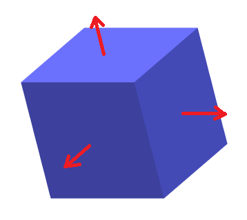 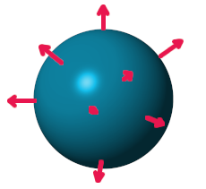<br>
[左:立方体の法線 右:球体の法線の一部]
</p>

<div style="page-break-after: always"></div>

法線にはさまざまな使いみちがあるのですが、3Dグラフィックスで最も重要なのは「光が当たったときの明るさの計算」です。どういうことかというと、

>ある地点の明るさは、その地点の法線と、その地点を照らす光の方向から計算できる

のです。光の影響を計算によって求める(シミュレートする)ことを「ライティング」といいます。

細かい話はあとにして、とりあえず法線を読み込みましょう。法線は英語で`normal`(ノーマル)というので、メンバ変数名も`normal`とします。`Mesh.h`を開き、`Vertex`構造体に法線用のメンバ変数を追加してください。

```diff
 {
   vec3 position; // 頂点座標
   vec2 texcoord; // テクスチャ座標
+  vec3 normal; // 法線ベクトル
 };
```

次に頂点アトリビュートを設定します。`Mesh.cpp`を開き、`MeshBuffer`コンストラクタに次のプログラムを追加してください。

```diff
   // 頂点アトリビュートを設定
   vao->SetAttribute(0, 3, sizeof(Vertex), offsetof(Vertex, position));
   vao->SetAttribute(1, 2, sizeof(Vertex), offsetof(Vertex, texcoord));
+  vao->SetAttribute(2, 3, sizeof(Vertex), offsetof(Vertex, normal));

   // 誤った操作が行われないようにバインドを解除
   glBindVertexArray(0);
```

これで、法線データが頂点シェーダの2番目の`in`変数に送られるようになります。

続いて、法線データを読み込む変数を用意します。`LoadOBJ`関数にある「OBJファイルを解析」するプログラムに、次のプログラムを追加してください。

```diff
   // OBJファイルを解析して、頂点データとインデックスデータを読み込む

   std::vector<vec3> positions;
   std::vector<vec2> texcoords;
+  std::vector<vec3> normals;
-  struct IndexSet { int v, vt; };
+  struct IndexSet { int v, vt, vn; };
   std::vector<IndexSet> faceIndexSet;

   positions.reserve(20'000);
   texcoords.reserve(20'000);
+  normals.reserve(20'000);
   faceIndexSet.reserve(20'000 * 3);
```

それでは`sscanf`関数を使って法線データを読み取りましょう。テクスチャ座標を読み取るプログラムの下に、次のプログラムを追加してください。

```diff
       texcoords.push_back(vt);
       continue;
     }
+
+    // 法線の読み取りを試みる
+    vec3 vn;
+    if (sscanf(p, " vn %f %f %f", &vn.x, &vn.y, &vn.z) == 3) {
+      normals.push_back(vn);
+      continue;
+    }

     // インデックスデータの読み取りを試みる
     IndexSet f0, f1, f2;
```

これで、法線データが読み取られるようになりました。

>**【なぜ垂線ではなく法線と言うの？】**<br>
> 「<ruby>法線<rt>ほうせん</rt></ruby>」という名前は、英語の`normal`(ノーマル)を翻訳したものです。ただ、`normal`
>の訳語に「法線」を当てた理由は伝わっていません。`normal`には「標準、規則、垂直」などの意味があるのですが、日本語にはこれらを一語で表せる単語がありません。<br>
>ある説では、`normal`という単語が最初に舶来したとき、法律の本から「規則→法」という翻訳がなされ、あとから数学の本に書かれている`normal`にも同じ訳があてられた、と言われています。<br>
>また、先に中国で訳されたものが入ってきたという説(中国で「`normal`→法線」と訳された理由は不明)もあります。しかし、いずれも噂に過ぎず、真相は不明です。

### 1.2 法線インデックスを読み取る

法線を持つOBJファイルの場合、`f`構文には3つのインデックスを指定します。しかし、現在のプログラムは2つのインデックスにしか対応していません。そこで、3つのインデックスに対応するプログラムを追加します。

基本構造は2つのインデックスと同じなので、コピー&ペーストで作りましょう。2つのインデックスを読み取るプログラムをコピー(`Ctrl+C`)して、元のプログラムの上に貼り付け(`Ctrl+V`)てください。

```diff
     // インデックスデータの読み取りを試みる
     IndexSet f0, f1, f2;
     int readByte;
+    if (sscanf(p, " f %u/%u %u/%u%n",
+      &f0.v, &f0.vt, &f1.v, &f1.vt, &readByte) == 4) {
+      p += readByte; // 読み取り位置を更新
+      for (;;) {
+        if (sscanf(p, " %u/%u%n", &f2.v, &f2.vt, &readByte) != 2) {
+          break;
+        }
+        p += readByte; // 読み取り位置を更新
+        faceIndexSet.push_back(f0);
+        faceIndexSet.push_back(f1);
+        faceIndexSet.push_back(f2);
+        f1 = f2; // 次の三角形のためにデータを移動
+      }
+      continue;
+    }
     if (sscanf(p, " f %u/%u %u/%u%n",
       &f0.v, &f0.vt, &f1.v, &f1.vt, &readByte) == 4) {
```

次に、内容の違いが分かるようなコメントを追加してください。

```diff
     // インデックスデータの読み取りを試みる
     IndexSet f0, f1, f2;
     int readByte;
+
+    // 頂点座標+テクスチャ座標+法線
     if (sscanf(p, " f %u/%u %u/%u%n",
       &f0.v, &f0.vt, &f1.v, &f1.vt, &readByte) == 4) {
          ・
          ・
        (省略)
          ・
          ・
         f1 = f2; // 次の三角形のためにデータを移動
       }
       continue;
     }
+
+    // 頂点座標+テクスチャ座標
     if (sscanf(p, " f %u/%u %u/%u%n",
       &f0.v, &f0.vt, &f1.v, &f1.vt, &readByte) == 4) {
```

それでは、コピーしたプログラムを、3つのインデックスを読み取るように変更してください。

>`%`と`/`の見間違い、空白の見落とし、数値の違いに注意すること。

```diff
     int readByte;

     // 頂点座標+テクスチャ座標+法線
-    if (sscanf(p, " f %u/%u %u/%u%n",
-      &f0.v, &f0.vt, &f1.v, &f1.vt, &readByte) == 4) {
+    if (sscanf(p, " f %u/%u/%u %u/%u/%u%n",
+      &f0.v, &f0.vt, &f0.vn, &f1.v, &f1.vt, &f1.vn, &readByte) == 6) {
       p += readByte; // 読み取り位置を更新
       for (;;) {
-        if (sscanf(p, " %u/%u%n", &f2.v, &f2.vt, &readByte) != 2) {
+        if (sscanf(p, " %u/%u/%u%n", &f2.v, &f2.vt, &f2.vn, &readByte) != 3) {
           break;
         }
```

それから、`IndexSet`構造体に`vn`メンバ変数を追加しましたが、2つのインデックスを読み取る処理では`vn`がないため設定できません。

`vn`に何も設定しないわけにはいかないので、法線がない場合の`vn`の扱いかたを決める必要があります。OBJファイルの場合、インデックスが`0`になることはないので、「インデックスが`0`の場合はデータがない」とするのが簡単でしょう。

2つのインデックスの読み取りを試みるプログラムに、次のプログラムを追加してください。

```diff
     // 頂点座標+テクスチャ座標
     if (sscanf(p, " f %u/%u %u/%u%n",
       &f0.v, &f0.vt, &f1.v, &f1.vt, &readByte) == 4) {
+      f0.vn = f1.vn = 0; // 法線なし
       p += readByte; // 読み取り位置を更新
       for (;;) {
         if (sscanf(p, " %u/%u%n", &f2.v, &f2.vt, &readByte) != 2) {
           break;
         }
+        f2.vn = 0; // 法線なし
         p += readByte; // 読み取り位置を更新
         faceIndexSet.push_back(f0);
```

これで法線インデックスが読み取られるようになりました。

### 1.3 法線をOpenGL用に変換する

読み取った法線インデックスを使って、OpenGL用の頂点データを作成します。読み取ったデータをOpenGLで使えるデータに変換するプログラムに、次のプログラムを追加してください。

```diff
     Vertex v;
     v.position = positions[e.v - 1];
     v.texcoord = texcoords[e.vt - 1];
+    // 法線が設定されていない場合は0を設定(あとで計算)
+    if (e.vn == 0) {
+      v.normal = { 0, 0, 0 };
+    } else {
+      v.normal = normals[e.vn - 1];
+    }
     vertices.push_back(v);
   }
```

法線が設定されていないデータの場合は法線を計算で求めることになります。法線の計算は少し長い処理なので関数にします。関数名は`FillMissingNormals`(フィル・ミッシング・ノーマルズ、「不足している法線を補う」のような意味)とします。

`Mesh.h`を開き、`MeshBuffer`クラスの定義の下に、次の関数宣言を追加してください。

```diff
   BufferObjectPtr buffer;   // 頂点データおよびインデックスデータ
   size_t usedBytes = 0;     // バッファの使用済み容量(バイト)
 };
+
+/**
+* 欠けている法線を補う
+*
+* @param vertices    頂点配列
+* @param vertexCount 頂点配列の要素数
+* @param indices     インデックス配列
+* @param indexCount  インデックス配列の要素数
+*/
+void FillMissingNormals(
+  Vertex* vertices, size_t vertexCount,
+  const uint16_t* indices, size_t indexCount);

 #endif // MESH_H_INCLUDED
```

次に`Mesh.cpp`を開き、`MeshBuffer::Clear`メンバ関数の定義の下に、次のプログラムを追加してください。

```diff
   meshes.clear();
   drawParamsList.clear();
 }
+
+// 欠けている法線を補う
+void FillMissingNormals(
+  Vertex* vertices, size_t vertexCount,
+  const uint16_t* indices, size_t indexCount)
+{
+  // 法線が設定されていない頂点を見つける
+
+  // 法線を計算
+
+  // 法線を正規化
+}
```

`FillMissingNormals`関数はコメントに書いた3段階の手順で、法線が設定されていない頂点の法線を計算します。

最初に「法線が設定されていない頂点」を見つけます。やり方はいろいろありますが、今回は
`bool`型の配列を用意して、法線が設定されていない場合は`true`を設定する方法を使います。この方法は比較的簡単で分かりやすいと思います。

`FillMissingNormals`関数の定義に次のプログラムを追加してください。

```diff
   const uint16_t* indices, size_t indexCount)
 {
   // 法線が設定されていない頂点を見つける
+  std::vector<bool> missingNormals(vertexCount, false);
+  for (int i = 0; i < vertexCount; ++i) {
+    // 法線の長さが0の場合を「設定されていない」とみなす
+    const vec3& n = vertices[i].normal;
+    if (n.x == 0 && n.y == 0 && n.z == 0) {
+      missingNormals[i] = true;
+    }
+  }

   // 法線を計算

   // 法線を正規化
```

法線が設定されていない頂点を見つけたら、次はそれらに法線を設定します。今回求める頂点の法線は「頂点を含むポリゴン面の法線の平均」と定義します。

頂点の法線を計算するには、まず「面の法線」を求めなくてはなりません。面の法線は「面に対して垂直なベクトル」です。これは「外積(がいせき)」によって計算できます。

ベクトルの外積は`a×b`のように書きます。ベクトル`a`, `b`に対して垂直な単位ベクトルを`n`、2つのベクトルのなす角を`θ`とすると、外積は次のように定義されます。

>a×b = (|a||b|sinθ)n

これは、外積が「ベクトル`a`, `b`に対して、長さが`|a||b|sinθ`で`a`と`b`に垂直なベクトル」であることを意味します。このように、外積の結果はベクトルになります。

>**【外積の重要ポイント】**
>1. 2つのベクトルに対して垂直なベクトルを求めることができる。
>2. 垂直ベクトルの長さから`sinθ`が分かる。

また、`a = (ax, ay, az)`、`b = (bx, by, bz)`とすると、外積の計算上の定義は次のようになります。

>a×b = (ay\*bz - az\*by, az\*bx - ax\*bz, ax*by - ay\*bx)

さて、外積によって法線を求めるには、ポリゴン面のうち2辺が分からなくてはなりません。<br>
これは頂点座標から計算できます。「法線を計算」というコメントの下に、次のプログラムを追加してください。

```diff
   }

   // 法線を計算
+  for (int i = 0; i < indexCount; i += 3) {
+    // 面を構成する2辺a, bを求める
+    const int i0 = indices[i + 0];
+    const int i1 = indices[i + 1];
+    const int i2 = indices[i + 2];
+    const vec3& v0 = vertices[i0].position;
+    const vec3& v1 = vertices[i1].position;
+    const vec3& v2 = vertices[i2].position;
+    const vec3 a = { v1.x - v0.x, v1.y - v0.y, v1.z - v0.z };
+    const vec3 b = { v2.x - v0.x, v2.y - v0.y, v2.z - v0.z };
+  }

   // 法線を正規化
 }
```

次に、外積を使って法線を求めます。辺a, bを求めるプログラムの下に、次のプログラムを追加してください。

```diff
     const vec3& v2 = vertices[i2].position;
     const vec3 a = { v1.x - v0.x, v1.y - v0.y, v1.z - v0.z };
     const vec3 b = { v2.x - v0.x, v2.y - v0.y, v2.z - v0.z };
+
+    // 外積によってaとbに垂直なベクトル(法線)を求める
+    const float cx = a.y * b.z - a.z * b.y;
+    const float cy = a.z * b.x - a.x * b.z;
+    const float cz = a.x * b.y - a.y * b.x;
+
+    // 法線を正規化して単位ベクトルにする
+    const float l = sqrt(cx * cx + cy * cy + cz * cz);
+    const vec3 normal = { cx / l, cy / l, cz / l };
   }

   // 法線を正規化
```

外積によって得られたベクトルの長さは`|a||b|sinθ`です。しかし、法線ベクトルは「向きを表すベクトル」なので、単位ベクトルにしておくと今後の計算が楽になります。そこで、各要素をベクトルの長さで割ることで正規化しています。

それでは、求めた法線を頂点データに設定しましょう。法線を正規化するプログラムの下に、次のプログラムを追加してください。

```diff
     // 法線を正規化して単位ベクトルにする
     const float l = sqrt(cx * cx + cy * cy + cz * cz);
     const vec3 normal = { cx / l, cy / l, cz / l };
+
+    // 法線が設定されていない頂点にだけ法線を加算
+    if (missingNormals[i0]) {
+      vertices[i0].normal += normal;
+    }
+    if (missingNormals[i1]) {
+      vertices[i1].normal += normal;
+    }
+    if (missingNormals[i2]) {
+      vertices[i2].normal += normal;
+    }
   }

   // 法線を正規化
```

複数の面の法線を加算するることで、法線の向きが平均化されます。しかしその結果、再び法線が正規化されていない状態になります。

そこで、最後に平均化された法線を正規化しなおします。「法線を正規化」というコメントの下に、次のプログラムを追加してください。

```diff
   }

   // 法線を正規化
+  for (int i = 0; i < vertexCount; ++i) {
+    if (missingNormals[i]) {
+      vec3& n = vertices[i].normal;
+      const float l = sqrt(n.x * n.x + n.y * n.y + n.z * n.z);
+      n = { n.x / l, n.y / l, n.z / l };
+    }
+  } // for i
 }
```

これで`FillMissingNormals`関数は完成です。早速この関数を呼び出しましょう。
`LoadOBJ`メンバ関数にある「読み込んだデータをOpenGLで使えるデータに変換」するプログラムの下に、次のプログラムを追加してください。

```diff
   for (int i = 0; i < indices.size(); ++i) {
     indices[i] = i;
   }
+
+  // 設定されていない法線を補う
+  FillMissingNormals(vertices.data(), vertices.size(),
+    indices.data(), indices.size());

   // 変換したデータをプリミティブバッファに追加
   AddVertexData(
```

これで、頂点データに法線が追加されるようになりました。

### 1.4 既存の図形データに法線を設定する

適切にライティングを行うには、OBJファイル以外の図形データにも法線を設定する必要があります。`Engine.cpp`を開き、`Initialize`メンバ関数にある図形データを追加するプログラムを、次のように変更してください。

```diff
   meshBuffer = MeshBuffer::Create(32'000'000);
   for (const auto& e : meshes) {
-    meshBuffer->AddVertexData(
-      static_cast<const Vertex*>(e.vertexData), e.vertexSize,
-      static_cast<const uint16_t*>(e.indexData), e.indexSize);
+    // 法線を設定するために図形データのコピーを作る
+    auto pVertex = static_cast<const Vertex*>(e.vertexData);
+    auto pIndex = static_cast<const uint16_t*>(e.indexData);
+    std::vector<Vertex> v(pVertex, pVertex + e.vertexSize / sizeof(Vertex));
+
+    // コピーした図形データに法線を設定
+    for (auto& e : v) {
+      e.normal = { 0, 0, 0 };
+    }
+    FillMissingNormals(v.data(), v.size(), pIndex, e.indexSize / sizeof(uint16_t));
+
+    // 法線を設定した図形データをGPUメモリにコピー
+    meshBuffer->AddVertexData(v.data(), e.vertexSize, pIndex, e.indexSize);
   }
 
   // 図形データから描画パラメータを作成し、データをGPUメモリにコピーする
```

元の図形データは変更できないので、図形データのコピーを作ってから、コピーしたデータに法線を設定するようにしています。

### 1.5 頂点シェーダで法線を変換する

法線の準備ができたので、次は、頂点シェーダとフラグメントシェーダに、法線によってライティングを行うプログラムを追加しましょう。

`standard.vert`を開き、法線を受け取るための`in`変数と、法線をフラグメントシェーダに送るための`out`変数を追加してください。

```diff
 // シェーダへの入力
 layout(location=0) in vec3 inPosition; // 頂点座標
 layout(location=1) in vec2 inTexcoord; // テクスチャ座標
+layout(location=2) in vec3 inNormal;   // 法線ベクトル

 // シェーダからの出力
 layout(location=1) out vec2 outTexcoord; // テクスチャ座標
+layout(location=2) out vec3 outNormal;   // 法線ベクトル

 // プログラムからの入力
 layout(location=0) uniform vec3 scale; // 拡大率
```

続いて法線を座標変換します。法線は「方向」を示すデータで、座標データとは性質が異なります。具体的には回転のみが影響し、拡大率や平行移動は行いません。

頂点座標をローカル座標系からワールド座標系に変換するプログラムの下に、次のプログラムを追加してください。

```diff
   gl_Position.y = pos.y;
   gl_Position.z = pos.x * -sinY + pos.z * cosY;
   gl_Position.xyz += position;
+
+  // ワールド法線を計算
+  outNormal.x = inNormal.x * cosY + inNormal.z * sinY;
+  outNormal.y = inNormal.y;
+  outNormal.z = inNormal.x * -sinY + inNormal.z * cosY;

   // ワールド座標系からビュー座標系に変換
   pos = gl_Position.xyz - cameraPosition;
```

この回転によって、ローカル座標系の法線(=ローカル法線)をワールド座標系の法線(=ワールド法線)に変換することができます。

>**【法線と拡大率】**<br>
>実際には、「各軸に異なる拡大率を指定」すると、法線に拡大率が影響します。例えば、球体を縦に押しつぶすような拡大率(例えばX=2,Y=1,Z=2など)を設定したとします。すると、球体の表面がゆがむため、頂点に接する平面の角度が変化します。その結果、法線の向きも変化するわけです。ただ、拡大率を反映する計算は少々複雑なため、本テキストでは対応しません。

続いて、フラグメントシェーダに法線を受け取る入力変数を加えましょう。`standard.frag`
を開き、シェーダへの入力変数を定義するプログラムに次のプログラムを追加してください。

```diff
 // シェーダへの入力
 layout(location=0) in vec4 inColor; // 頂点色
 layout(location=1) in vec2 inTexcoord; // テクスチャ座標
+layout(location=2) in vec3 inNormal;   // 法線ベクトル

 // テクスチャサンプラ
 layout(binding=0) uniform sampler2D texColor;
```

### 1.6 フラグメントシェーダで明るさを計算する

次に、明るさの元になるライトのパラメータを定義します。コンピューター・グラフィックスでは、光を放つ物体のことを「ライト」あるいは「光源(こうげん)」と呼びます。

基本的な光源には「ポイント・ライト(点光源)」、「ディレクショナル・ライト(平行光源)」、「スポット・ライト(集光光源)」、「アンビエント・ライト(環境光)」の4種類があります。

すべてを使えるようにするには時間がかかるので、今回はとりあえず「ポイント・ライト」のみ対応させることにします。「ポイントライト」は、「ろうそく」や「電球」のような「ある一点からすべての方向に光を放つ光源」を表現するためのライトです。

<p align="center">
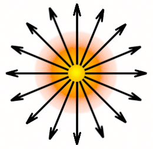<br>
[ポイントライト(点光源)のイメージ]
</p>

ポイントライトには「光源の位置」と「光の色および明るさ」という2つ(または3つ)のパラメーターがあります。この2つのパラメータを`uniform`変数として定義します。`main`関数に次のプログラムを追加してください。

```diff
 // プログラムからの入力
 layout(location=100) uniform vec4 color; // 物体の色
+
+// 点光源パラメータ
+struct PointLight
+{
+  vec3 color;    // 色と明るさ
+  vec3 position; // 位置
+};
+layout(location=101) uniform PointLight pointLight;

 void main()
 {
```

構造体の名前は`PointLight`(ポイント・ライト)としました。ライトの明るさには`color`(カラー)、位置には`position`(ポジション)という名前を付けました。ロケーション番号は、物体の色を表す`color`と重複しないように`101`とします。

ユニフォーム変数に構造体や配列を指定すると、メンバまたは配列要素ごとにロケーション番号が割り振られます。つまり、最初のメンバである`pointhight::color`が`101`、2番目の
`pointLight::position`が`102`になります。

>ロケーション番号の振られ方について、詳しくは以下の公式Wikiを参照してください。<br>
>`www.khronos.org/opengl/wiki/Uniform_(GLSL)/Explicit_Uniform_Location`

定義した`uniform`変数を使ってフラグメントの明るさを計算しましょう。コンピューター・グラフィックスでは、物体の表面の明るさも計算で算出します。しかし、現実世界の光を再現するには膨大な計算が必要です。

例えば、CG映画では1秒間に24枚の画像が次々に表示されます。この1枚の計算にどれだけの時間がかかるかというと、映像データを全て揃えたうえで、数万個のCPUを使って、短くて数時間、長い場合は数日にも及びます。

こんなに時間がかかるのでは、とてもゲームのようなリアルタイム性を求められる分野には使えません。そのため、簡単な計算でそれっぽい見た目になる方法がいくつも考案されています。

今回は、そんな方法のひとつである「ランバート反射」を学習します。

物体が反射する光は「拡散反射(ディフューズ)」と「鏡面反射(スペキュラ)」に大別されます。ランバート反射は「拡散反射」を再現します。

ランバート反射では、「入射光は物体の表面で全方位に均等に反射する」と仮定しています。これは、表面が非常に荒い物体の反射を表します。

ランバート反射の計算に「ランベルトの余弦則」という法則を利用します。ランベルトの余弦即とは次のような法則です。

>**【ランベルトの余弦則】**<br>
>物体のある点で反射した光(反射光)の強さは、その点の法線と光源方向のなす角θの余弦(コサイン)と正比例する

壁を懐中電灯で照らしているとします。懐中電灯の向きを徐々に斜めに傾けていくと、壁に当たる光は徐々に横に伸びていきます。そして、壁と水平になるまで傾けると、光は壁に沿ってまっすぐ向こう側にいってしまい、壁にはまったく当たりません。

<p align="center">
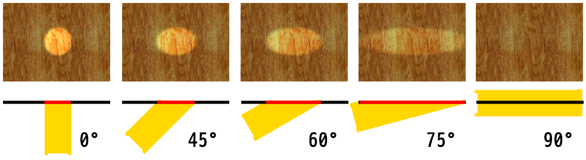<br>
[照らす面積が増えると暗くなる]
</p>

上図の赤い線は、角度によって光が照らす面積がどう変わるかを表しています。正面から照らしたときの面積を1とすると、45°で照らしたときの面積は1.4倍になります。60°で照らしたときの面積は2倍、75°だと3.8倍にもなります。

しかし、懐中電灯から出る光の量(エネルギー)は常に一定です。そのため、角度がついて照らす面積が増えると、単位面積当たりの光の量(エネルギー)が減少します。

このとき、「光源の方向」と「単位面積当たりの光の量」の関係は余弦(コサイン)で表すことができます。一般に、照射される光の量と反射する光の量は比例するため、反射光の量も余弦で表すことができます。これが「ランベルトの余弦則」です。

>**【ランバート？ ランベルト？】**<br>
>「ランバート反射」と「ランベルトの余弦則」は、これを発見したドイツの数学者「ヨハン・ハインリヒ・ランベルト(Johann Heinrich Lambert)」の名前にちなんでなづけられました。微妙に名前が違うのは、学問分野によって読み方の慣習が違うからです。物理学徒は英語読みで「ランバート」、数学徒はドイツ語読みで「ランベルト」と呼んだのです。

ランバート反射を計算するには「光源の方向」が分かっていなくてはなりません。ポイントライトの「光源の方向」は次の式で求められます。

>光源の方向 = 光源の位置 - フラグメントの位置

「光源の位置」はさきほど定義した`pointLight.position`ですが、「フラグメントの位置」は不明です。なぜなら、頂点シェーダからフラグメントシェーダに座標を渡していないからです。

この問題を解決するには、入出力変数に「座標」を追加します。`standard.vert`を開き、出力変数に次のプログラムを追加してください。

```diff
 layout(location=2) in vec3 inNormal;   // 法線ベクトル

 // シェーダからの出力
+layout(location=0) out vec3 outPosition; // ワールド座標
 layout(location=1) out vec2 outTexcoord; // テクスチャ座標
 layout(location=2) out vec3 outNormal;   // 法線ベクトル
```

次に`outPosition`にワールド座標を代入します。ローカル座標系からワールド座標系に変換するプログラムの下に、次のプログラムを追加してください。

```diff
   gl_Position.y = pos.y;
   gl_Position.z = pos.x * -sinY + pos.z * cosY;
   gl_Position.xyz += position;
+
+  outPosition = gl_Position.xyz;

   // ワールド法線を計算
   outNormal.x = inNormal.x * cosY + inNormal.z * sinY;
```

続いて、フラグメントシェーダに「ワールド座標を受け取る入力変数」を追加します。
`standard.frag`を開き、入力変数に次のプログラムを追加してください。

```diff
 #version 450

 // シェーダへの入力
-layout(location=0) in vec4 inColor; // 頂点色
+layout(location=0) in vec3 inPosition; // ワールド座標
 layout(location=1) in vec2 inTexcoord; // テクスチャ座標
 layout(location=2) in vec3 inNormal;   // 法線ベクトル
```

これで「光源の方向」を計算できます。`main`関数に次のプログラムを追加してください。

```diff
 {
   vec4 c = texture(texColor, inTexcoord);
   outColor = c * color;
+
+  // ポイントライトの方向
+  vec3 direction = pointLight.position - inPosition;
 }
```

変数名は`direction`(ディレクション, 「方向」という意味)としました。

それでは、「ランベルトの余弦則」によって光の明るさを計算しましょう。方向を計算するプログラムの下に、次のプログラムを追加してください。

```diff
   // ポイントライトの方向
   vec3 direction = pointLight.position - inPosition;
+
+  // 方向を正規化して長さを1にする
+  direction = normalize(direction);
+
+  // 線形補間によって長さが1ではなくなっているので、正規化して長さを1に復元する
+  vec3 normal = normalize(inNormal);
+
+  // ランベルトの余弦則を使って明るさを計算
+  float theta = max(dot(direction, normal), 0);
+
+  // ランバート反射による反射光のエネルギー量を入射光と等しくするためにπで割る
+  float illuminance = theta / 3.14159265;
+
+  // 拡散光の明るさを計算
+  vec3 diffuse = pointLight.color * illuminance;
+
+  // 拡散光の影響を反映
+  outColor.rgb *= diffuse;
 }
```

#### 【正規化と内積】

このプログラムではいくつかの新しい関数を使っています。`normalize`(ノーマライズ)はベクトルを「正規化(せいきか)」する関数です。

<p><code class="tnmai_code"><strong>【書式】</strong><br>
単位ベクトル normalize(ベクトル);
</code></p>

「正規化」というのは「ベクトルの長さを1にする」操作のことです。また、長さ1のベクトルのことを「単位(たんい)ベクトル」といいます。

`dot`(ドット)は「内積(ないせき)」を計算する関数です。

<p><code class="tnmai_code"><strong>【書式】</strong><br>
float dot(ベクトルa, ベクトルb);
</code></p>

ベクトルの内積は`a・b`のように書き、次のように定義されます。

>a・b = |a||b|cosθ

ここで`a`, `b`はベクトル、`|a|`は「ベクトルaの長さ」、`|b|`は「ベクトルbの長さ」、`θ`は「ベクトルa, bのなす角」を表します。

`|a|`および`|b|`の長さがどちらも`1`の場合、この式は単に`cosθ`となります。このことから、正規化したベクトル同士の内積は`cosθ`となることが分かります。

上記のプログラムでは、この性質を利用してランバート反射を求めています。

また、`a = (ax, ay, az)`、`b = (bx, by, bz)`とすると、内積は次の式で計算することができます。

>a・b = (ax \* bx) + (ay \* by) + (az \* bz)

### 【inNormalを正規化する理由】

頂点シェーダーの出力変数に格納された値は、そのままフラグメントシェーダの入力変数にコピーされるわけではありません。

頂点シェーダの計算結果はあくまで「頂点座標における値」に過ぎないからです。しかし、フラグメントシェーダは頂点間にある全てのピクセルに対して実行されます。

<p align="center">
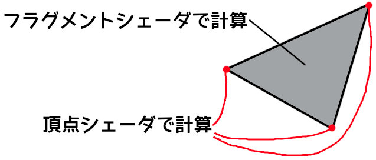
</p>

そこで、「ピクセルから頂点までの距離に応じて頂点の値を混合」することで、中間領域にあるピクセルの値を作り出します。この操作は「線形補間(せんけいほかん)」という方法で行われます。

例えば、頂点シェーダが`outColor`という出力変数に頂点の色を書き込み。フラグメントシェーダが`inColor`という入力変数でそれを受け取るとします。

頂点Aが赤(1, 0, 0)、頂点Bが青(0, 0, 1)を`outColor`に代入したとき、AとBのちょうど中間にあるピクセルの`inColor`には(0.5, 0, 0.5)という値が代入されます。

また、「Aまでの距離:Bまでの距離 = 2:8」となる位置のピクセルの`inColor`には、(0.8, 0, 0.2)という値が代入されます。中間の色を作り出すという点において、これは適切な挙動です。

<p align="center">
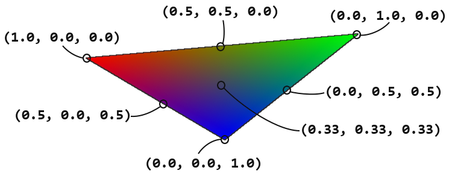
</p>

今度は、色ではなく法線を出力したとします。頂点Aが右(1, 0, 0)、頂点Bが手前(0, 0, 1)とすると、A,Bの中間にあるピクセルの法線は、色と同様に(0.5, 0, 0.5)となります。

また、A, Bからの距離の比が2:8となる位置のピクセルでは(0.8, 0, 0.2)となります。これらの数値は向きとしては問題ないのですが、長さが`1`ではなくなっています。

しかし、内積によって`cosθ`を求めるにはベクトルの長さが`1`になっている必要があります。そこで、法線を正規化することで長さを`1`にしているわけです。

#### 【最小値の制限】

`max`(マックス)関数は、引数のうち大きい方の値を返す関数です。

<p><code class="tnmai_code"><strong>【書式】</strong><br>
float dot(float, float);
</code></p>

「入射光のベクトルと法線ベクトルがなす角`θ`」が取りうる範囲は0°～90°です。`θ`がそれ以上の値の場合、面の裏側から光が当たっていることになります。このとき`cosθ`はマイナスになります。

しかし、現実の光は「マイナスの明るさ」にはなりません。そのため、マイナスは「明るさ0」とみなす必要があります。そこで、`max`関数を用いて明るさの最小値が`0`になるようにしています。

#### 【エネルギー保存の法則を守る】

拡散反射では入射光が「全方位に均等に反射」されます。このとき、ある方向に反射する光の量は入射光の`1/π`倍になります。そのため、正しい明るさを得るには内積の結果を`π`で割る必要があります。

`π`で割ることで入射光と反射光のエネルギー量が等しくなるため、「エネルギー保存の法則」を満たすことができます。「エネルギー保存の法則」を満たすことは、現実のライティングを再現するうえで最も重要な要素のひとつです。

求めた明るさは`illuminance`(イルミナンス, 「照度」という意味)変数に代入します。この照度にライトの明るさを掛けると拡散反射の明るさが求まります。この値は`diffuse`変数に代入しておきます。

>なぜ`π`なのかが気になる場合は、以下のページにある「拡散反射/cosθの半球積分」の説明を参照してください(大学数学の範囲なので分からなくても問題ありません)。<br>
>「物理ベースレンダリングの基礎」<br>
>`https://zenn.dev/mebiusbox/books/619c81d2fbeafd/viewer/239ee2`

### 1.7 点光源のパラメータを設定する

`Engine.h`を開き、インクルード文の下に次のプログラムを追加してください。

```diff
 #include <GLFW/glfw3.h>
 #include <string>
 #include <utility>
+
+// 点光源
+struct PointLight
+{
+  vec3 color;      // 色
+  float intensity; // 明るさ
+  vec3 position;   // 位置
+};

 // メッシュ番号
 // Initializeメンバ関数にあるmeshes配列と順番を合わせること
```

次に`Engine`クラスの定義に、点光源を表す変数を追加してください。

```diff
   ScenePtr scene;     // 実行中のシーン
   ScenePtr nextScene; // 次のシーン
+
+  // 点光源
+  PointLight pointLight = {
+    vec3{1.0f, 0.9f, 0.8f}, // 色
+    3, // 明るさ
+    vec3{3, 1, 3} // 座標
+  };

   // カメラオブジェクト
   GameObject camera;
```

それでは`Engine.cpp`を開き、`DrawGameObject`メンバ関数にある「3Dモデルの表示テスト」プログラムに、次のプログラムを追加してください。

```diff
   GameObjectList::iterator begin,
   GameObjectList::iterator end)
 {
+  // 点光源の情報を設定
+  glProgramUniform3f(*prog3D, 101,
+    pointLight.color.x * pointLight.intensity,
+    pointLight.color.y * pointLight.intensity,
+    pointLight.color.z * pointLight.intensity);
+  glProgramUniform3f(*prog3D, 102,
+    pointLight.position.x,
+    pointLight.position.y,
+    pointLight.position.z);
+
   glBindVertexArray(*meshBuffer->GetVAO());
   for (GameObjectList::iterator i = begin; i != end; ++i) {
```

光の色と明るさは、ユニフォーム変数に設定するときに乗算しておきます。CPU側で乗算しておけば、シェーダ側で乗算しなくて済むからです。また、`pointLight.position`変数をGPUメモリにコピーする際、ロケーション番号を`102`にしている点に注意してください。

フラグメントシェーダにユニフォーム変数を追加するときに説明しましたが、構造体や配列のユニフォーム変数の場合、要素ごとにロケーション番号が割り振られます。そのため、
`glProgramUniform～`には、要素に対応するロケーション番号を指定する必要があります。

それでは、ライティングの効果を見てみましょう。プログラムをビルドして実行してください。オブジェクトや壁に影の部分ができていたら成功です。

<p align="center">
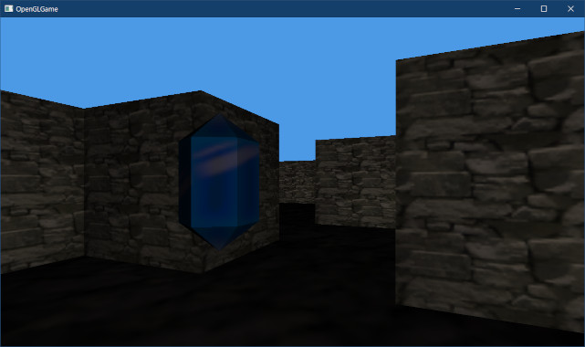 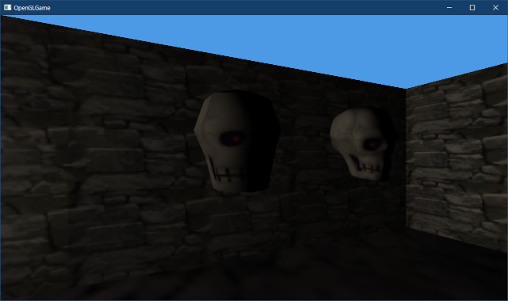
</p>

OBJファイルから読み込んだ頭蓋骨のポリゴンが目立つのは、自動的に作られた法線を使っているからです。法線を持つOBJファイルならもっと自然に見えるようになります。

<pre class="tnmai_assignment">
<strong>【課題01】</strong>
以下のURLから<code>skull_highpoly_with_normal.obj</code>というOBJファイルをダウンロードして、プロジェクトの<code>Res/MeshData/skull</code>フォルダに保存しなさい。

<code>https://github.com/tn-mai/OpenGL3D2023/tree/main/res/meshdata/skull</code>

OBJファイルを保存するには、ページ上部右側にある<code>Raw</code>ボタンを右クリックして「名前を付けてリンク先を保存」を選びます。
</pre>

ダウンロードした`skull_highpoly_with_normal.obj`を読み込みます。<br>
`Engine.cpp`を開き、`Initialize`メンバ関数に次のプログラムを追加してください。

```diff
     meshBuffer->AddVertexData(v.data(), e.vertexSize, pIndex, e.indexSize);
   }

   // OBJファイルを読み込む
-  meshBuffer->LoadOBJ("Res/MeshData/skull/skull_highpoly.obj");
+  meshBuffer->LoadOBJ(
+    "Res/MeshData/skull/skull_highpoly_with_normal.obj");

   // ゲームオブジェクト配列の容量を予約
   gameObjects.reserve(1000);
```

次に`MainGameScene.cpp`を開き、`Initialize`メンバ関数にあるスタティックメッシュの設定を次のように変更してください。

```diff
   highpoly->scale = { 2, 2, 2 };
   highpoly->rotation.y = -1.57f;
   highpoly->staticMesh = engine.GetStaticMesh(
-    "Res/MeshData/skull/skull_highpoly.obj");
+    "Res/MeshData/skull/skull_highpoly_with_normal.obj");
   highpoly->texColor = std::make_shared<Texture>("Res/MeshData/skull.tga");;

   // 比較用の図形データ
```

プログラムが書けたらビルドして実行してください。頭蓋骨の陰影がなめらかになっていたら成功です。

<p align="center">

</p>

### 1.8 ガンマ補正を行う

ところで、もしライトが妙に暗いと感じていたら、その感覚は正しいです。実際に、現在の画面は物理的に正しい明るさになっていません。

ライトが暗く感じる原因は「ガンマ補正」にあります。ガンマ補正は「画面に表示される明るさは入力値の`2.2`乗になる」というブラウン管(CRT)モニターの特性です。

>**【ガンマ補正の目的】**<br>
>ガンマ補正の目的は、「人間の視覚が持つ指数関数的な反応特性を再現する」ことです。

実は、ほとんどすべての画像は、モニターで表示したときに正しい明るさで出力されるように、`1/2.2`乗の明るさで作成されています。そのため、画像を表示するだけなら何の問題ありません。`2.2`乗と`1/2.2`乗が打ち消し合うからです。

<p align="center">
 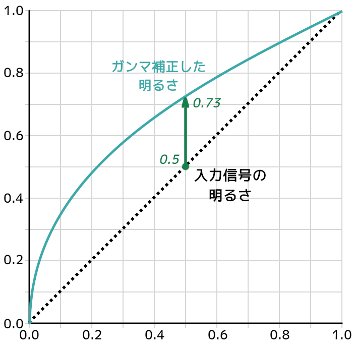
</p>

ガンマ補正があるため、ライトの明るさも`1/2.2`乗する必要があります。しかし、単純に
`1/2.2`乗すると、画像の`1/2.2`乗と重複して本来より明るい映像になってしまいます。

そこで、画像の明るさを`2.2`乗して`1/2.2`乗を打ち消してから、ライトの計算を行います。ライトの計算が終わってフラグメントの明るさが確定したら、その明るさを`1/2.2`乗して出力します。これによって、モニタには物理的に正しい明るさで表示されます。

まずは画像の明るさを`2.2`乗しましょう。`standard.frag`を開き、テクスチャを読み込むプログラムの下に次のプログラムを追加してください。

```diff
 void main()
 {
   vec4 c = texture(texColor, inTexcoord);
+
+  // テクスチャのガンマ補正を解除
+  const float crtGamma = 2.2; // CRTモニターのガンマ値
+  c.rgb = pow(c.rgb, vec3(2.2));

   outColor = c * color;

   // 光源の方向
```

べき乗を計算するには`pow`(パウ)関数を使います。

<p><code class="tnmai_code"><strong>【書式】</strong><br>
べき乗された値 pow(元の値, べき指数);
</code></p>

なお、GLSLの数学関数は、ベクトル型を受け取れるように拡張されています。引数にベクトル型を指定した場合、各要素に対して個別に数学関数が実行されます。

次に、明るさ計算後の値を`1/2.2`乗します。拡散光の影響を反映するプログラムの下に、次のプログラムを追加してください。

```diff
   vec3 diffuse = pointLight.color * illuminance;

   // 拡散光の影響を反映
   outColor.rgb *= diffuse;
+
+  // ガンマ補正を行う
+  outColor.rgb = pow(outColor.rgb, vec3(1 / 2.2));
 }
```

プログラムが書けたらビルドして実行してください。画面が明るくなっていたら成功です。

<p align="center">
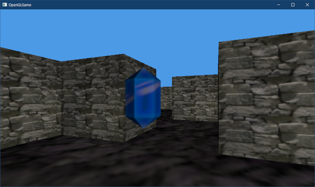 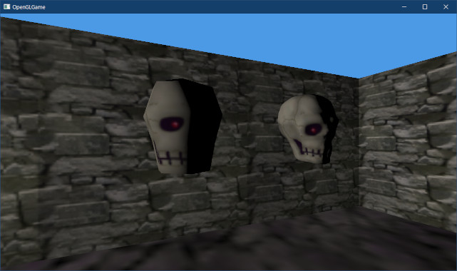
</p>

### 1.9 距離による明るさの減衰を追加する

光の明るさは、光源からの距離が遠くなるほど弱くなります。明るさは光源からの距離の２乗に反比例することが知られています。これは「逆２乗の法則」と呼ばれています。

下図は、照らされる面積がどのように拡大するかを示しています。点光源から1mの距離にある1平方mの領域が受ける光の量は、距離2mにある4平方mの領域が受ける光の量と等しく、同様に距離3mにある9平方mの領域が受ける光の量とも等しくなります。

<p align="center">
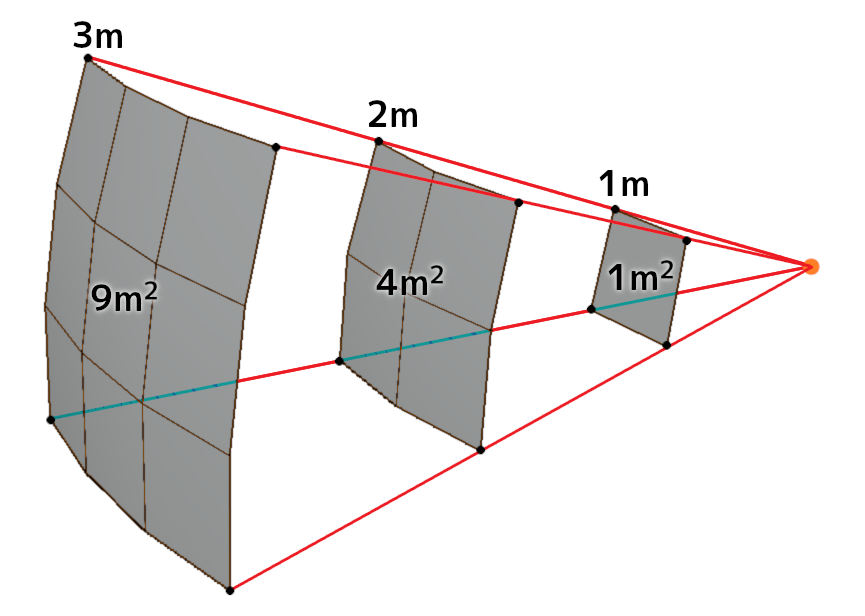
</p>

図から分かるように、点光源からの距離が遠くなるほど、同じ光の量で照らすべき領域が広くなります。単位面積あたりの光の量が低下するために暗くなるわけです。

それでは、距離による明るさを計算するために、ライトまでの距離を計算しましょう。<br>
ベクトル`(x, y, z)`があるとすると、その長さは以下の式で求められます。

>√(x^2 + y^2 + z^2)

`standard.frag`を開き、ライトの方向を計算するプログラムの下に、次のプログラムを追加してください。

```diff
   // ポイントライトの方向
   vec3 direction = pointLight.position - inPosition;
+
+  // 光源までの距離
+  float sqrDistance = dot(direction, direction);
+  float distance = sqrt(sqrDistance);
+
   // 方向を正規化して長さを1にする
   direction = normalize(direction);
```

`sqrDistance`(スクウェア・ディスタンス、「距離の2乗」という意味)は「光源までの距離の2乗」を表します。

ベクトルの長さを求めるには`dot`関数を使います。`dot`は内積を求める関数ですが、計算内容は「2つのベクトルの各要素の乗算の合計」なので、同じベクトルを指定すれば「長さの2乗」を求めるために使うことができます。

>ベクトルの長さ = √(x^2 + y^2 + z^2)

それでは、距離による明るさの減衰を計算しましょう。ランバート反射を正規化するプログラムの下に、次のプログラムを追加してください。

```diff
   // ランバート反射による反射光のエネルギー量を入射光と等しくするためにπで割る
   float illuminance = theta / 3.14159265;
+
+  // 逆2乗の法則によって明るさを減衰させる
+  // 0除算が起きないように1を足している
+  illuminance /= sqrDistance + 1;

   // 拡散光の明るさを計算
   vec3 diffuse = pointLight.color * illuminance;
```

単純に距離の2乗で割るだけだと、距離が`0`のときにおかしな表示になってしまいます(`0`では割れないため)。そこで、`0`による除算が起きないように`1`を足しています。

>この「`1`を足す」というのはUnreal Engine 4でも採用されている由緒正しい方法なのですが、物理的にはあまり正しくありません。

プログラムが書けたらビルドして実行してください。スタート地点から離れるほど暗くなっていたら成功です。

<p align="center">
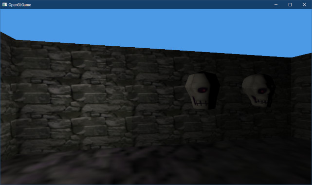
</p>

### 1.10 ライトの範囲を制限する

距離の影響を追加したらまた明るさが暗くなってしまいました。迷路が見やすくなるようにライトを明るくしましょう。

```diff
   // 点光源
   PointLight pointLight = {
     vec3{1.0f, 0.9f, 0.8f}, // 色
-    1, // 明るさ
+    10, // 明るさ
     vec3{3, 1, 3} // 座標
   };
```

プログラムが書けたらビルドして実行してください。以前より迷路が明るく表示されていたら成功です。

<p align="center">
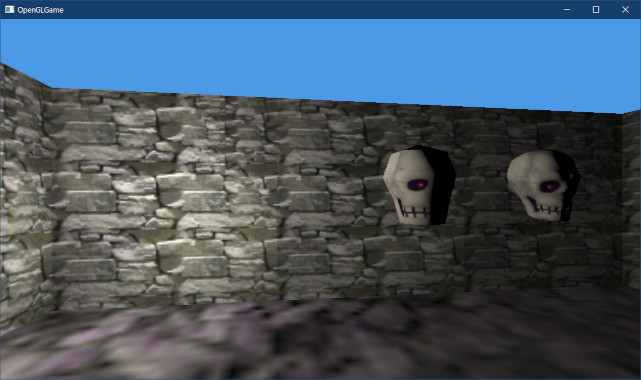
</p>

ライトの明るさを強くすると、かなり遠くまで明るくなっていることが分かります。逆２乗の法則が示すように、光源から発せられた「光が影響する距離は無限」だからです。

もっとも、これは理論上のことです。現実には光線の進路上にはさまざまな遮蔽物(しゃへいぶつ)があるため、無限の距離を旅することはほとんどありえません。しかし、現在の計算式では遮蔽物を完全に無視しており、光は壁を貫通して世界の全てを照らしています。

<p align="center">
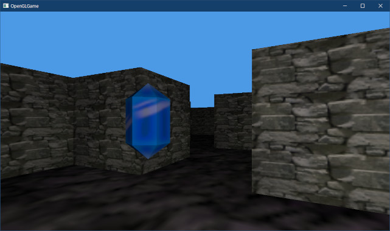
</p>

この問題は、遮蔽物を計算に入れれば解決します。しかし、遮蔽物の計算は難しいため、多くのゲームでは一部の重要なライトに限って遮蔽を計算しているのが現状です。それ以外のライトの光は壁を貫通しますが、光が届く距離を制限することで違和感を減らしています。

本テキストでも、貫通が目立たないように光が届く距離を制限することにします。
`Engine.h`を開き、`PointLight`構造体の定義に次のプログラムを追加してください。

```diff
   vec3 color;      // 色
   float intensity; // 明るさ
   vec3 position;   // 位置
+  float radius;    // ライトが届く最大半径
 };

 // メッシュ番号
```

次に、`Engine`クラスの`pointLight`メンバ変数の定義を次のように変更してください。

```diff
   PointLight pointLight = {
     vec3{1.0f, 0.9f, 0.8f}, // 色
     10, // 明るさ
-    vec3{3, 1, 3} // 座標
+    vec3{3, 1, 3}, // 座標
+    5 // 最大半径
   };

   // カメラオブジェクト
```

続いて、ライトの最大半径をGPUメモリにコピーします。`Engine.cpp`を開き、
`DrawGameObject`メンバ関数の定義を次のように変更してください。

```diff
     pointLight.color.x * pointLight.intensity,
     pointLight.color.y * pointLight.intensity,
     pointLight.color.z * pointLight.intensity);
-  glProgramUniform3f(prog3D, 102,
+  glProgramUniform4f(prog3D, 102,
     pointLight.position.x,
     pointLight.position.y,
-    pointLight.position.z);
+    pointLight.position.z,
+    pointLight.radius);

   glBindVertexArray(*meshBuffer->GetVAO());
   for (GameObjectList::iterator i = begin; i != end; ++i) {
```

次に、シェーダを最大半径に対応させましょう。`standard.frag`を開き、`PointLight`構造体の定義を次のように変更してください。

```diff
 struct PointLight
 {
   vec3 color;    // 色と明るさ
-  vec3 position; // 座標
+  vec4 positionAndRadius; // 座標と半径
 };
 layout(location=101) uniform PointLight pointLight;
```

それから、光源の方向を計算するプログラムを次のように変更してください。

```diff
   outColor = c * color;

   // 光源の方向
-  vec3 direction = pointLight.position - inPosition;
+  vec3 direction = pointLight.positionAndRadius.xyz - inPosition;

   // 光源までの距離
   float sqrDistance = dot(direction, direction);
```

それでは`radius`の値を使って範囲を制限しましょう。これは物理的な根拠に乏しい処理である以上、少なくとも見た目が自然になるように工夫する必要があります。今回はUnreal Engine 4やFrostbite 3で採用されている、以下の式を使うことにしました。

<p align="center">

</p>

>式の詳細は以下のURLを参照<br>
>`https://blog.selfshadow.com/publications/s2013-shading-course/karis/s2013_pbs_epic_notes_v2.pdf`

明るさをπで割るプログラムの下に、次のプログラムを追加してください。

```diff
   // ランバート反射による反射光のエネルギー量を入射光と等しくするためにπで割る
   float illuminance = theta / 3.14159265;
+
+  // ライトの最大距離を制限
+  const float radius = pointLight.positionAndRadius.w;
+  const float smoothFactor = clamp(1 - pow(distance / radius, 4), 0, 1);
+  illuminance *= smoothFactor * smoothFactor;

   // 逆2乗の法則によって明るさを減衰させる
   // 0除算が起きないように1を足している
   illuminance /= sqrDistance + 1;
```

プログラムが書けたらビルドして実行してください。ある程度離れたところ(今回の設定だと半径5m)が真っ黒になっていたら成功です。

<p align="center">
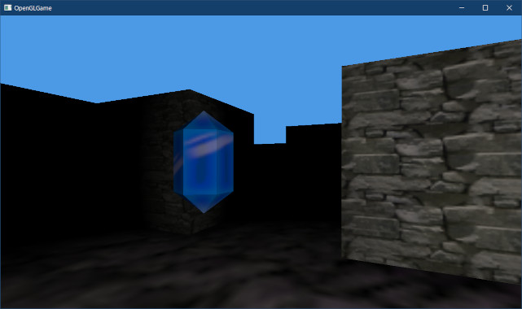
</p>

### 1.11 ライトをプレイヤーの位置に配置する

最後に、プレイヤーが迷路を動き回れるように、ライトの位置をプレイヤーの座標に追従させます。`Engine.h`を開き、`Engine`クラスの定義に次のプログラムを追加してください。

```diff
   StaticMeshPtr GetStaticMesh(const char* name)
   {
     return meshBuffer->GetStaticMesh(name);
   }
+
+  // ポイントライトの設定
+  const PointLight& GetPointLight() const { return pointLight; }
+  void SetPointLight(const PointLight& p) { pointLight = p; }

 private:
   // ワールド座標系のコライダーを表す構造体
```

次に`PlayerCompoonent.h`を開き、`Update`メンバ関数の定義に次のプログラムを追加してください。

```diff
     if (engine->GetKey(GLFW_KEY_Q)) {
       camera.rotation.y += 2 * deltaTime;
     }
+
+    // ライトの位置を設定
+    auto pointLight = engine->GetPointLight();
+    pointLight.position = camera.position;
+    engine->SetPointLight(pointLight);
   }

   // 衝突時の処理
   virtual void OnCollision(
```

プログラムが書けたらビルドして実行してください。プレイヤーを移動させたとき、常にプレイヤーを中心として周囲が明るくなっていたら成功です。

>**【1章のまとめ】**
>
>* OBJファイルの頂点には、頂点座標、テクスチャ座標、法線の3つのデータがある。
>* 法線は「曲面に接する平面に垂直な直線」で、ベクトルとして表すことができる。
>* 平面上の点の明るさは、法線と光の向きの内積で表すことができる。<br>これは「ランバート反射」と呼ばれる。
>* GPUは頂点シェーダの出力変数を「線形補間」してフラグメントシェーダの入力変数に代入する。この影響で、法線などの向きベクトルは長さが変わってしまうため「正規化」する必要がある。
>* 点光源からの光は「光源からの距離の２乗で減衰」する。<br>これは「逆２乗の法則」と呼ばれている。
>* リアルタイムコンピューターグラフィックスでは、壁などの遮蔽物の計算を完璧に行うことは難しい。そこで、「光が届く距離を制限する」ことで、不自然さを減らしている。

<div style="page-break-after: always"></div>

## 2. マテリアル

### 2.1 Material構造体を定義する

OBJファイルでは、3Dモデルの材質を「MTL(エムティーエル)ファイル」という別のファイルに記録します。MTLは`Material Template Library`(マテリアル・テンプレート・ライブラリ)の短縮形です)。

`Material`(マテリアル)は「材料」や「物質」という意味です。3Dグラフィックスでは「光に対する物質の性質」を表します。

>例:「この「手すり」モデルは鋼鉄製という設定なので、マテリアルの色は暗い灰色、反射特性は鏡面反射を強めて、透過特性は不透明にしています。」

「MTLファイル」には、以下に示すようなパラメータを設定することができます。

>* マテリアル名
>* 色
>* テクスチャ
>* 反射特性
>* 透過特性
>* (その他いろいろ・・・)

ところで、これまで色だけはベクトル型ではなく配列を使っていました。理由は、最初は必要なかったので`vec4`型を定義していなかったからですが、そろそろ`vec4`も定義しておくべきでしょう。`VecMath.h`を開き、次のプログラムを追加してください。
```diff
 #include <cmath>

 struct vec2 { float x, y; };
 struct vec3 { float x, y, z; };
+struct vec4 { float x, y, z, w; };

 // vec3同士の加算
 inline vec3& operator+=(vec3& a, const vec3& b)
```

それでは、マテリアルを管理する構造体を定義しましょう。マテリアルにはテクスチャが含まれるため、`Texture.h`をインクルードしておきます。`Mesh.h`を開き、次のプログラムを追加してください。

```diff
 #ifndef MESH_H_INCLUDED
 #define MESH_H_INCLUDED
 #include "glad/glad.h"
+#include "Texture.h"
 #include "VecMath.h"
 #include <string>
```

続いて、`Vertex`構造体の定義の下に、次のプログラムを追加してください。

```diff
   const void* indices = 0;    // 描画開始インデックスのバイトオフセット
   GLint baseVertex = 0;       // インデックス0となる頂点配列内の位置
 };
+
+/**
+* マテリアル
+*/
+struct Material
+{
+  std::string name = "<Default>";  // マテリアル名
+  vec4 baseColor = { 1, 1, 1, 1 }; // 基本色+アルファ
+  TexturePtr texBaseColor;         // 基本色テクスチャ
+};
+using MaterialPtr = std::shared_ptr<Material>;

 /**
 * 3Dモデル
```

`Material`(マテリアル)構造体には3つのメンバ変数を定義しています。`name`(ネーム)は「マテリアルの名前」です。マテリアルを識別したい場合に使います。

`baseColor`(ベース・カラー)は「マテリアルの基本色」、`texBaseColor`(テックス・ベース・カラー)は「基本色テクスチャ」です。オブジェクトはこの2つの値を乗算した色で表示されます。

実際のマテリアルは`StaticMesh`構造体に持たせます。`StaticMesh`構造体の定義に次のプログラムを追加してください。

```diff
 struct StaticMesh
 {
   std::string name;    // メッシュ名
   std::vector<DrawParams> drawParamsList;
+  std::vector<MaterialPtr> materials; // マテリアル配列
 };
 using StaticMeshPtr = std::shared_ptr<StaticMesh>;
```

続いて、`DrawParams`構造体にマテリアルを追加します。`DrawParams`構造体の定義に次のプログラムを追加してください。

```diff
   GLsizei count = 0;          // 描画するインデックス数
   const void* indices = 0;    // 描画開始インデックスのバイトオフセット
   GLint baseVertex = 0;       // インデックス0番とみなされる頂点配列内の位置
+  int materialNo = -1;        // マテリアルインデックス
 };

 /**
 * 3Dモデル
```

`StaticMesh`構造体にマテリアル配列を持たせ、`DrawParams`構造体でマテリアル配列のインデックスを指定することで、描画パラメータごとに異なるマテリアルを指定できます。

### 2.2 MTLファイルの構文

MTLファイルの構文はOBJファイルと似ています。行の最初に構文を区別する文字列があり、その後にパラメータが空白区切りで置かれる、という形式です。

また、OBJファイルと同様に、MTLファイルにもさまざまなパラメータを表す多くの構文が用意されています。

全ての構文に対応するのは時間がかかりますし、そもそも描画側が対応できていません。そこで、必要最小限の構文にだけ対応することにします。

>**newmtl** *name*<br>
>&emsp;新しいマテリアル定義の開始を宣言し、マテリアルの名前を定義します。`newmtl`はnew materialの短縮形です。`name`に指定した文字列がマテリアル名になります。

>**Kd** *r g b*<br>
>&emsp;マテリアルの拡散色(基本色)を定義します。`Kd`の`d`は`diffuse`(ディフューズ、<br>
>&emsp;拡散)の頭文字です(`K`は不明。`Konstant`の頭文字?)。<br>
>&emsp;`r`,`g`,`b`はマテリアルの赤、緑、青成分を表す浮動小数点数です。

>**d** *factor*<br>
>&emsp;マテリアルの不透明度を定義します。`d`は`dissolve`(ディゾルブ、消失)の頭文字で<br>
>&emsp;す。`factor`(ファクター)はマテリアルの不透明度を表す浮動小数点数です<br>
>&emsp;(1.0=不透明, 0.0=透明)。

>**map_Kd** *filename*<br>
>&emsp;マテリアルの拡散色(基本色)テクスチャを定義します。`map`はテクスチャマップを意
>&emsp;味します。`Kd`の`d`は`diffuse`の頭文字です(`K`は不明)。<br>
>&emsp;`filename`(ファイルネーム)はテクスチャ名を表す文字列です。

これら以外の構文については、Wikipediaの記事などを参照してください。<br>
`https://ja.wikipedia.org/wiki/Wavefront_.objファイル`

### 2.3 MTLファイル読み込み関数を定義する

それでは、MTLファイルを読み込む関数を定義しましょう。関数名は`LoadMTL`(ロード・エムティーエル)とします。`Mesh.cpp`を開き、`Draw`関数の定義の下に、次のプログラムを追加してください。

```diff
     glDrawElementsBaseVertex(
       e.mode, e.count, GL_UNSIGNED_SHORT, e.indices, e.baseVertex);
   }
 }
+
+/**
+* MTLファイルを読み込む
+*
+* @param foldername OBJファイルのあるフォルダ名
+* @param filename   MTLファイル名
+*
+* @return MTLファイルに含まれるマテリアルの配列
+*/
+std::vector<MaterialPtr> LoadMTL(
+  const std::string& foldername, const char* filename)
+{
+  // MTLファイルを開く
+  const std::string fullpath = foldername + filename;
+  std::ifstream file(fullpath);
+  if (!file) {
+    LOG_ERROR("%sを開けません", fullpath.c_str());
+    return {};
+  }
+
+  // MTLファイルを解析する
+  std::vector<MaterialPtr> materials;
+  MaterialPtr pMaterial;
+  while (!file.eof()) {
+    std::string line;
+    std::getline(file, line);
+    const char* p = line.c_str();
+  }
+
+  // 読み込んだマテリアルの配列を返す
+  return materials;
+}

 /**
 * コンストラクタ
```

最初に`ifstream`クラスを使ってファイルを開きます。もしファイルを開けなかった場合は、エラーメッセージを出力して長さ0の配列を返します。

OBJファイルにおいて、MTLファイル名は相対パスで指定されます。そのため、フルパスのファイル名を得るには、OBJファイルのフォルダ名を補足する必要があります。<br>
これは、上記のプログラムでは、`foldername + textureName`の部分が該当します。

ファイルを開くことに成功したら、`getline`関数によって1行ずつ読み込んで内容を解析し、マテリアルを作成します。

続いて、解析プログラムを書いていきます。まず`newmtl`構文を解析します。MTLファイルを解析する`while`ループの中に、次のプログラムを追加してください。

>書式指定文字列の空白に注意すること。特に、先頭の空白は見落としがちです。

```diff
   while (!file.eof()) {
     std::string line;
     std::getline(file, line);
+
+    // マテリアル定義の読み取りを試みる
+    char name[1000] = { 0 };
+    if (sscanf(line.data(), " newmtl %999s", name) == 1) {
+      pMaterial = std::make_shared<Material>();
+      pMaterial->name = name;
+      materials.push_back(pMaterial);
+      continue;
+    }
   }
   
   // 読み込んだマテリアルの配列を返す
```

`scanf`系の関数で文字列を読み取るには`%s`を使いますが、このとき`%13s`のようにsの手前に数字を書くと、読み取る文字数を制限することができます(`%13s`の場合は最大13文字)。

通常は、末尾に`￥0`が追加されることを考慮して、「配列サイズ - 1」の値を指定します。上記のプログラムでも、`name`配列のサイズに合わせて`%999s`としています。

次に`Kd`構文を解析します。`newmtl`構文を解析するプログラムの下に、次のプログラムを追加してください。

```diff
       materials.push_back(pMaterial);
       continue;
     }
+    
+    // マテリアルが定義されていない場合は行を無視する
+    if ( ! pMaterial) {
+      continue;
+    }
+
+    // 基本色の読み取りを試みる
+    if (sscanf(line.data(), " Kd %f %f %f",
+      &pMaterial->baseColor.x, &pMaterial->baseColor.y,
+      &pMaterial->baseColor.z) == 3) {
+      continue;
+    }
   }
   
   // 読み込んだマテリアルの配列を返す
```

最初に`pMaterial`が`nullptr`かどうかを調べます。行を解析しても、設定するべきマテリアルが定義されていないと意味がないからです。マテリアルが定義されていると確認できたら、
`sscanf`を使って基本色を読み取ります。

続いて、`d`構文を解析します。`Kd`を解析するプログラムの下に、次のプログラムを追加してください。

```diff
       &pMaterial->baseColor.z) == 3) {
       continue;
     }
+
+    // 不透明度の読み取りを試みる
+    if (sscanf(line.data(), " d %f", &pMaterial->baseColor.w) == 1) {
+      continue;
+    }
   }
   
   // 読み込んだマテリアルの配列を返す
```

最後に`map_Kd`構文を解析します。`Ns`構文を解析するプログラムの下に、次のプログラムを追加してください。

```diff
     if (sscanf(line.data(), " d %f", &pMaterial->baseColor.w) == 1) {
       continue;
     }
+
+    // 基本色テクスチャ名の読み取りを試みる
+    char textureName[1000] = { 0 };
+    if (sscanf(line.data(), " map_Kd %999s", &textureName) == 1) {
+      pMaterial->texBaseColor =
+        std::make_shared<Texture>((foldername + textureName).c_str());
+      continue;
+    }
   }

   // 読み込んだマテリアルの配列を返す
```

`newmtl`と同様に、配列サイズを超えないように読み込む文字数を`999`に制限しています。

MTLファイル名と同様に、`map_Kd`構文のテクスチャファイル名は相対パスで指定されます。そのため、OBJファイルのフォルダ名である`foldername`を補足しています。これで、マテリアルを読み込む準備が整いました。

### 2.4 MTLファイルを読み込む

それでは、`LoadMTL`関数を使ってマテリアルを読み込みましょう。まずフォルダ名を取得します。`LoadOBJ`関数にある「OBJファイルを開く」プログラムの下に、次のプログラムを追加してください。

```diff
     LOG_ERROR("%sを開けません", filename);
     return nullptr;
   }
+
+  // フォルダ名を取得する
+  std::string foldername(filename);
+  {
+    const size_t p = foldername.find_last_of("￥￥/");
+    if (p != std::string::npos) {
+      foldername.resize(p + 1);
+    }
+  }

   // OBJファイルを解析して、頂点データとインデックスデータを読み込む

   std::vector<vec3> positions;
```

次にマテリアル用の配列を用意します。`LoadOBJ`関数にある「OBJファイルを解析」するプログラムに、次のプログラムを追加してください。

```diff
   texcoords.reserve(20'000);
   normals.reserve(20'000);
   faceIndexSet.reserve(20'000 * 3);
+
+  // マテリアル
+  std::vector<MaterialPtr> materials;
+  materials.reserve(100);

   while (!file.eof()) {
     std::string line;
```

MTLファイルを指定するには`mtllib`(エムティーエル・リブ)構文を使います。

>**mtllib** *filename*<br>
>&emsp;`usemtl`(後述)で使用するマテリアルが格納されたMTLファイル名を定義します。<br>
>&emsp;`mtllib`は`material library`の短縮形です。<br>
>&emsp;`filename`はMTLファイル名を表す文字列です。

次に、`f`構文を解析するプログラムの下に、次のプログラムを追加してください。

```diff
         f1 = f2; // 次の三角形のためにデータを移動
       }
       continue;
     }
+
+    // MTLファイルの読み取りを試みる
+    char mtlFilename[1000];
+    if (sscanf(line.data(), " mtllib %999s", mtlFilename) == 1) {
+      const auto tmp = LoadMTL(foldername, mtlFilename);
+      materials.insert(materials.end(), tmp.begin(), tmp.end());
+      continue;
+    }
   } // while eof

   // 読み込んだデータを、OpenGLで使えるデータに変換
```

`vector`型の配列を別の配列に追加するには`insert`(インサート)メンバ関数を使います。

<p><code class="tnmai_code"><strong>【書式】</strong><br>
iterator insert(追加する配列の先頭, 追加する配列の終端);
</code></p>

>**【insert関数のオーバーロード】**<br>
>`insert`関数には複数のオーバーロード関数が存在します。詳細はcpprefjpを参照してください。<br>
>`https://cpprefjp.github.io/reference/vector/vector/insert.html`

### 2.5 マテリアルをインデックスデータに関連付ける

OBJファイルにおいて、使用するマテリアルは`usemtl`(ユーズ・エムティーエル)構文で指定します。

>**usemtl** *material_name*<br>
>&emsp;この構文以後に現れた`f`構文に割り当てるマテリアル名を定義します。<br>
>&emsp;`usemtl`はuse materialの短縮形です。<br>
>&emsp;`material_name`はマテリアル名を表す文字列です。

ファイル中に`usemtl`が現れると、それ以降の`f`構文は`usemtl`で指定されたマテリアル使用します。次の`usemtl`でマテリアルが変更されるまで同じマテリアルが使われます。

この仕組みを再現するために、マテリアルの使用範囲を表すデータを定義します。「OBJファイルを解析」するプログラムに、次のプログラムを追加してください。

```diff
   // マテリアル
   std::vector<MaterialPtr> materials;
   materials.reserve(100);
+
+  // マテリアルの使用範囲
+  struct UseMaterial {
+    std::string name;   // マテリアル名
+    size_t startOffset; // 割り当て範囲の先頭位置
+  };
+  std::vector<UseMaterial> usemtls;
+  usemtls.reserve(100);
+
+  // 仮データを追加(マテリアル指定がないファイル対策)
+  usemtls.push_back({ std::string(), 0 });

  while ( ! file.eof()) {
    std::string line;
```

`usemtls`(ユーズ・エムティーエルズ)配列に空のデータを追加しているのは、マテリアルを持たないデータに対して「デフォルトのマテリアル」を設定するためです。

それでは`usemtl`構文を解析しましょう。`mtllib`構文を解析するプログラムの下に、次のプログラムを追加してください。

```diff
       materials.insert(materials.end(), tmp.begin(), tmp.end());
       continue;
     }
+
+    // 使用マテリアル名の読み取りを試みる
+    char mtlName[1000];
+    if (sscanf(line.data(), " usemtl %999s", mtlName) == 1) {
+      usemtls.push_back({ mtlName, faceIndexSet.size() });
+      continue;
+    }
   } // while eof
+
+  // 末尾に番兵を追加
+  usemtls.push_back({ std::string(), faceIndexSet.size() });

   // 読み込んだデータを、OpenGLで使えるデータに変換
   std::vector<Vertex> vertices;
```

`UseMaterial`構造体の`startOffset`(スタート・オフセット)メンバ変数には、「`usemtl`が見つかった時点でのインデックスデータ配列サイズ」を記録します。

ここで記録されたサイズから、次の`usemtl`に記録するサイズまでの間が、この`usemtl`を適用するべきインデックスデータになります。

>```c++
>usemtl material_0             # 配列サイズ=0
>f 1/1/1 2/2/2 3/3/3           # 配列サイズ=3
>f 4/4/4 5/5/5 6/6/6           # 配列サイズ=6
>f 7/7/7 8/8/8 9/9/9           # 配列サイズ=9
>usemtl material_1             # 配列サイズ=9
>f 10/10/10 11/11/11 12/12/12  # 配列サイズ=12
>f 13/13/13 14/14/14 15/15/15  # 配列サイズ=15
>usemtl material_1             # 配列サイズ=15
>f 20/20/20 21/21/21 22/22/22  # 配列サイズ=18
>usemtl material_2             # 配列サイズ=18
>f 30/30/30 31/31/31 32/32/32  # 配列サイズ=21
>(ここに「番兵」が追加される)
>```

上記のようなOBJファイルがあるとします。`material_0`時点での配列サイズは`0`、次の
`material_1`時点では`9`なので、「`material_0`を割り当てる範囲は配列の`0`～`8`まで」ということが分かります。

そして、`material_1`を割り当てる範囲は次の`material_1`までなので、`9`～`14`となります。その次の範囲は2番目の`material_1`から`material_2`までなので、`15`～`17`となります。

最後の`material_2`には「次のマテリアル」がないため、そのままでは範囲を設定できません。ここで、プログラムによって末尾に追加された「番兵(ばんぺい)」が役立ちます。

番兵に設定されるサイズは読み込み終了時の値なので、`21`です。つまり、`material_2`の範囲は`material_2`から「番兵」までの`18`～`20`となります。

>**【番兵(Sentinel node)について】**<br>
>「番兵」の本来の意味は「拠点の出入りを警備する兵士」ですが、コンピュータープログラミングでは「配列やリストの終端に置く特殊なデータ」を指します。番兵を使うと、ループ終了の条件判定を単純化できます。C言語文字列の末尾にある`\0`は番兵の例です。

最後に、描画パラメータをマテリアル単位で分割します。メッシュを作成するプログラムを、次のように変更してください。

```diff
     indices.data(), indices.size() * sizeof(uint16_t));

   // メッシュを作成
   auto pMesh = std::make_shared<StaticMesh>();
-  pMesh->drawParamsList.push_back(drawParamsList.back());
+
+  // データの位置を取得
+  const void* indexOffset = drawParamsList.back().indices;
+  const GLint baseVertex = drawParamsList.back().baseVertex;
+
+  // マテリアルに対応した描画パラメータを作成
+  // 仮データと番兵以外のマテリアルがある場合、仮データを飛ばす
+  size_t i = 0;
+  if (usemtls.size() > 2) {
+    i = 1; // 仮データと番兵以外のマテリアルがある場合、仮データを飛ばす
+  }
+  for (; i < usemtls.size() - 1; ++i) {
+    const UseMaterial& cur = usemtls[i]; // 使用中のマテリアル
+    const UseMaterial& next = usemtls[i + 1]; // 次のマテリアル
+    if (next.startOffset == cur.startOffset) {
+      continue; // インデックスデータがない場合は飛ばす
+    }
+
+    // 描画パラメータを作成
+    DrawParams params;
+    params.mode = GL_TRIANGLES;
+    params.count = static_cast<GLsizei>(next.startOffset - cur.startOffset);
+    params.indices = indexOffset;
+    params.baseVertex = baseVertex;
+    params.materialNo = 0; // デフォルト値を設定
+    for (int i = 0; i < materials.size(); ++i) {
+      if (materials[i]->name == cur.name) {
+        params.materialNo = i; // 名前の一致するマテリアルを設定
+        break;
+      }
+    }
+    pMesh->drawParamsList.push_back(params);
+
+    // インデックスオフセットを変更
+    indexOffset = reinterpret_cast<void*>(
+      reinterpret_cast<size_t>(indexOffset) + sizeof(uint16_t) * params.count);
+  }
+
+  // マテリアル配列が空の場合、デフォルトマテリアルを追加
+  if (materials.empty()) {
+    pMesh->materials.push_back(std::make_shared<Material>());
+  } else {
+    pMesh->materials.assign(materials.begin(), materials.end());
+  }

   pMesh->name = filename;
   meshes.emplace(pMesh->name, pMesh);
```

作成したマテリアルをメッシュにコピーするには、`assign`(アサイン)メンバ関数を使います。

<p><code class="tnmai_code"><strong>【書式】</strong><br>
void assign(コピー元配列の先頭, コピー元配列の終端);
</code></p>

`assign`は`vector`配列を空にしたあと、指定された範囲のデータをコピーします。<br>
これで、マテリアルごとに違うプリミティブを指定できるようになりました。

### 2.6 Draw関数をマテリアルに対応させる

続いて、追加したユニフォーム変数にデータを設定してから描画するように`Draw`関数を修正します。`Mesh.h`を開き、`Mesh`用の`Draw`関数の宣言を次のように変更してください。

```diff
   std::vector<MaterialPtr> materials;
 };
 using StaticMeshPtr = std::shared_ptr<StaticMesh>;
-void Draw(const StaticMesh& mesh);
+void Draw(const StaticMesh& mesh, GLuint program = 0);
 
 /**
 * メッシュを管理するクラス
```

次に`Mesh.cpp`を開き、`Mesh`用の`Draw`関数の定義を次のように変更してください。

```diff
 /**
 * メッシュを描画する
 */
-void Draw(const StaticMesh& mesh)
+void Draw(const StaticMesh& mesh, GLuint program)
 {
+  // カラーパラメータを取得
+  vec4 objectColor;
+  if (program) {
+    glGetUniformfv(program, 100, &objectColor.x);
+  }
+
   for (const auto& e : mesh.drawParamsList) {
+    // マテリアルを設定
+    if (e.materialNo >= 0 && e.materialNo < mesh.materials.size()) {
+      const Material& material = *mesh.materials[e.materialNo];
+      if (program) {
+        const vec4 color = { objectColor.x * material.baseColor.x
+                             objectColor.y * material.baseColor.y,
+                             objectColor.z * material.baseColor.z,
+                             objectColor.w * material.baseColor.w };
+        glProgramUniform4fv(program, 100, 1, &color.x);
+      }
+      if (material.texBaseColor) {
+        const GLuint tex = *material.texBaseColor;
+        glBindTextures(0, 1, &tex);
+      }
+    }
+
     glDrawElementsBaseVertex(
       e.mode, e.count, GL_UNSIGNED_SHORT, e.indices, e.baseVertex);
   }
```

最後に、`Draw`関数の呼び出しを修正します。`Engine.cpp`を開き、`DrawGameObject`メンバ関数にあるメッシュを描画するプログラムを、次のように変更してください。

```diff
       glBindTextures(0, 1, &tex);
     }

     // 図形を描画
-    Draw(*e->staticMesh);
+    if (e->staticMesh) {
+      Draw(*e->staticMesh, prog3D);
+    } else {
+      const DrawParams& params = meshBuffer->GetDrawParams(e->meshId);
+      glDrawElementsInstancedBaseVertex(params.mode, params.count,
+        GL_UNSIGNED_SHORT, params.indices, 1, params.baseVertex);
+    }
   }
   glBindVertexArray(0);
```

<div style="page-break-after: always"></div>

### 2.7 マテリアルを持つOBJファイルを表示する

それではマテリアルを持つOBJファイルを表示してみましょう。

<pre class="tnmai_assignment">
<strong>【課題02】</strong>
以下のURLに、複数のマテリアルを持つ「幽霊」の図形データを用意しました。

<code>https://github.com/tn-mai/OpenGL3D2023/tree/main/res/meshdata/ghost</code>

上記のURLから以下の4つのファイルをダウンロードして、プロジェクトの<code>Res/MeshData/ghost</code>フォルダに保存しなさい(<code>ghost</code>フォルダは作成すること)。
  <code>ghost.obj</code>(ゴースト・オブジェ)
  <code>ghost.mtl</code>(ゴースト・エムティーエル)
  <code>ghost.png</code>(ゴースト・ピーエヌジー)
  <code>ghost_lantern_red.png</code>(ゴースト・ランタン・レッド・ピーエヌジー)
PNGファイルはTGAファイルに変換すること。
</pre>

ダウンロードしたファイルを表示してみましょう。`Engine.cpp`を開き、`Initialize`メンバ関数の定義に次のプログラムを追加してください。

```diff
   // OBJファイルを読み込む
   meshBuffer->LoadOBJ("Res/MeshData/skull/skull_highpoly.obj");
   meshBuffer->LoadOBJ("Res/MeshData/skull/skull_highpoly_with_normal.obj");
+  meshBuffer->LoadOBJ("Res/MeshData/ghost/ghost.obj");

   // ゲームオブジェクト配列の容量を予約
   gameObjects.reserve(1000);
```

`MainGameScene.cpp`を開き、`Initialize`メンバ関数の定義に次のプログラムを追加してください。

```diff
   highpoly->rotation.y = -1.57f;
   highpoly->staticMesh = engine.GetStaticMesh(
     "Res/MeshData/skull/skull_highpoly_with_normal.obj");
+
+  auto ghost = engine.Create<GameObject>("ghost");
+  ghost->position = startPoint + vec3{ -1, 0, 2 };
+  ghost->rotation.y = 1.57f;
+  ghost->staticMesh = engine.GetStaticMesh("Res/MeshData/ghost/ghost.obj");

   return true; // 初期化成功
 }
```

プログラムが書けたらビルドして実行してください。幽霊が表示されていたら成功です。

<p align="center">
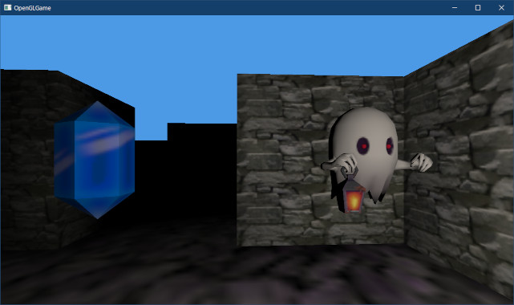
</p>

>**【2章のまとめ】**
>
>* OBJファイルで使用するテクスチャや色などの物体の質感(マテリアル)は、MTLファイルに定義されている。
>* MTLファイルには、拡散色を表す`Kd`や拡散色テクスチャを表す`map_Kd`などの専用の構文がある。
>* 複数のマテリアルを使用するOBJファイルでは、`usemtl`構文によって、以降の`f`構文で使用するマテリアルを指定する。
>* マテリアルを図形データに反映するには、`usemtl`に囲まれた各範囲に対して個別に描画パラメータを作成する。
