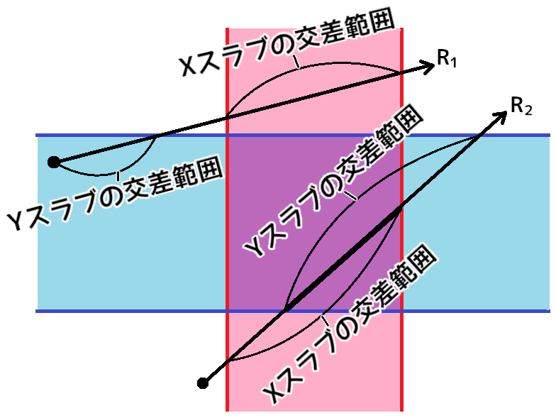

[OpenGL 3D 2023 第10回]

# レイキャスティング

## 習得目標

* 
* 
* 
* 

## 1. 3D空間をクリックする

### 1.1 ドアを配置する

プレイヤーにできることが「移動」だけというのは、2023年のゲームとしては「面白みに欠ける」と言われても仕方ないでしょう。そこで、クリックに反応する以下のオブジェクトを追加することにします。

* ドア
* レバー
* ランタン(ろうそくなどの光源に風よけを付けて持ち歩けるようにしたもの。西洋式のちょうちん)。
* 鍵

まずは「クリックすると開くドア」を作ってみましょう。以下の課題を行って、プロジェクトに3Dモデルを追加してください。

<pre class="tnmai_assignment">
<strong>【課題01】</strong>
以下のZIPファイルをダウンロードし、含まれるファイルをプロジェクトの<code>Res/meshdata</code>フォルダに展開しなさい。
<code>https://github.com/tn-mai/OpenGL3D2023/tree/main/res/meshdata/obj/door.zip</code>
<code>https://github.com/tn-mai/OpenGL3D2023/tree/main/res/meshdata/obj/lever.zip</code>
</pre>

ドアモデルは「ドア本体」である`door.obj`と、「ドアの枠」に相当する`arch.obj`の2つから構成されます。レバーモデルは「レバー本体」である`lever_arm.obj`と基部に当たる`lever_cover.obj`の2つから構成されます。

モデルが別れているのは、ドアやレバーを動かせるようにするためです。それでは、OBJファイルを読み込みましょう。`Engine.cpp`を開き、`Initialize`メンバ関数の定義に、OBJファイルを読み込むプログラムを追加してください。

```diff
   meshBuffer->LoadOBJ("Res/MeshData/skull/skull_highpoly.obj");
   meshBuffer->LoadOBJ("Res/MeshData/skull/skull_highpoly_with_normal.obj");
   meshBuffer->LoadOBJ("Res/MeshData/ghost/ghost.obj");
+  meshBuffer->LoadOBJ("Res/MeshData/door/door.obj");
+  meshBuffer->LoadOBJ("Res/MeshData/door/arch.obj");
+  meshBuffer->LoadOBJ("Res/MeshData/lever/lever_arm.obj");
+  meshBuffer->LoadOBJ("Res/MeshData/lever/lever_cover.obj");

   // ゲームオブジェクト配列の容量を予約
   gameObjects.reserve(1000);
```

次にドアを配置します。現在のマップデータでは、エリアの区切りとして`-`と`|`の記号を使っています。この「区切り記号」をドアにしましょう。

`MainGameScene.cpp`を開き、`Initialize`メンバ関数の定義にある「壁を作成」するプログラムに、次のプログラムを追加してください。

```diff
         wall->scale = { squareScale, squareScale, squareScale };
         wall->texColor = texWall;
         wall->meshId = MeshId_wall;
-      } else if (GetMapData(x, y) == 'C') {
+      }
+      // ドアを設定
+      else if (tileId == '|' || tileId == '-') {
+        // ドアの枠
+        auto arch = engine.Create<GameObject>("arch", { posX, 0, posZ });
+        arch->scale = { squareScale, squareScale, squareScale };
+        arch->staticMesh = engine.GetStaticMesh("Res/MeshData/door/arch.obj");
+
+        // ドア
+        auto door = engine.Create<GameObject>("door", { posX, 0, posZ });
+        door->scale = { squareScale, squareScale, squareScale };
+        door->staticMesh = engine.GetStaticMesh("Res/MeshData/door/door.obj");
+
+        // ドアの向きに応じて回転
+        if (tileId == '|') {
+          arch->rotation.y += 1.5708f;
+          door->rotation.y += 1.5708f;
+        }
+      }
+      // クリスタルを設定
+      else if (GetMapData(x, y) == 'C') {
         auto crystal = engine.Create<GameObject>("crystal", { posX, 1, posZ });
         crystal->scale = { 0.5f, 0.5f, 0.5f };
         crystal->texColor = texCrystalBlue;
```

プログラムが書けたらビルドして実行してください。ドアが表示されていたら成功です。

### 1.2 円周率を定義する

ところで、角度を指定するたびに円周率や、円周率の1/2, 1/4を計算するのは退屈な作業です。そこで、`VecMath.h`に円周率を表す定数を追加しましょう。`VecMath.h`を開き、次のプログラムを追加してください。

```diff
 #ifndef VECMATH_H_INCLUDED
 #define VECMATH_H_INCLUDED
 #include <cmath>
+
+// 円周率
+constexpr float pi = 3.1415926535f;

 struct vec2 { float x, y; };
 struct vec3 { float x, y, z; };
```

ついでに、度数法と弧度法を変換する関数を定義しておきます。180度や90度、45度といった角度は`pi`, `pi / 2`, `pi / 4`なのでまだ分かりやすいのですが、120度は`(pi * 2) / 3`となって直感的ではありません。

そのため、プログラムでも度数法で記述できたほうが、意味が分かりやすくなります。弧度法に変換する関数は`radians`(ラジアンズ, 「弧度数」という意味), 度数法に変換する関数は`degrees`(デグリーズ, 「度数」という意味)という名前にします。

円周率の定義の下に、次のプログラムを追加してください。

```diff
 // 円周率
 constexpr float pi = 3.14159265f;
+
+// 度数法を弧度法に変換
+constexpr float radians(float deg)
+{
+  return deg * pi / 180.0f;
+}
+
+// 弧度法を度数法に変換
+constexpr float degrees(float rad)
+{
+  return rad * 180.0f / pi;
+}

 struct vec2 { float x, y; };
 struct vec3 { float x, y, z; };
```

さっそく、定義した関数を使ってドアの向きを変えるプログラムを書き直しましょう。`MainGameScene.cpp`を開き、ドアを回転させるプログラムを次のように変更してください。

```diff
         // ドアの向きに応じて回転
         if (tileId == '|') {
-          arch->rotation.y += 1.5708f;
-          door->rotation.y += 1.5708f;
+          arch->rotation.y += radians(90);
+          door->rotation.y += radians(90);
         }
       }
       // クリスタルを設定
```

元のプログラムと比べて、「90度回転させている」ことが分かりやすくなりました。

### 1.3 ドアを通れなくする

表示されたドアは幻で、通り抜けることができてしまいます。しかし、通り抜けられないように「壁」と同じ扱いにしてしまうと、ドアを開閉することができません。そこで、コライダーコンポーネントを設定して通り抜けられないようにします。

ドアを設定するプログラムに、コライダーコンポーネントを設定するプログラムを追加してください。

```diff
         auto door = engine.Create<GameObject>("door", { posX, 0, posZ });
         door->scale = { squareScale, squareScale, squareScale };
         door->staticMesh = engine.GetStaticMesh("Res/MeshData/door/door.obj");
+
+        // ドアのコライダーを設定
+        auto collider = door->AddComponent<AabbCollider>();
+        collider->aabb = { { -1, 0, -0.5f }, { 1, 2, 0.5f } };
+        collider->isStatic = true;

         // ドアの向きに応じて回転
         if (tileId == '|') {
           arch->rotation.y += radians(90);
           door->rotation.y += radians(90);
+          collider->aabb = { { -0.5f, 0, -1 }, { 0.5f, 2, 1 } };
         }
       }
```

次に、衝突したコライダー同士が重ならないようにするプログラムを追加します。`Engine.h`を開き、`WorldCollider`構造体の定義に次のプログラムを追加してください。

```diff
   // ワールド座標系のコライダーを表す構造体
   struct WorldCollider
   {
+    // 座標を変更する
+    void AddPosition(const vec3& v) {
+      origin->GetOwner()->position += v;
+      worldAabb.min += v;
+      worldAabb.max += v;
+    }
+
     AabbColliderPtr origin;
     AABB worldAabb;
```

`Engine.cpp`を開き、`HandleWorldColliderCollision`メンバ関数の定義を次のように変更してください。

```diff
 void Engine::HandleWorldColliderCollision(
   WorldColliderList* a, WorldColliderList* b)
 {
   // コライダー単位の衝突判定
-  for (const auto& colA : *a) {
-    for (const auto& colB : *b) {
+  for (auto& colA : *a) {
+    for (auto& colB : *b) {
       // スタティックコライダー同士は衝突しない
       if (colA.origin->isStatic && colB.origin->isStatic) {
```

ここで`const`を削除する理由は、コライダーの座標を変更できるようにするためです。続いて、`colA`と`colB`の二重for文の中に、次のプログラムを追加してください。

```diff
       if (Intersect(colA.worldAabb, colB.worldAabb, penetration)) {
         GameObject* goA = colA.origin->GetOwner();
         GameObject* goB = colB.origin->GetOwner();
+
+        // コライダーが重ならないように座標を調整
+        if ( ! colA.origin->isTrigger && ! colB.origin->isTrigger) {
+          if (colA.origin->isStatic) {
+            // Aは動かないのでBを移動させる
+            colB.AddPosition(penetration);
+          } else if (colB.origin->isStatic) {
+            // Bは動かないのでAを移動させる
+            penetration *= vec3{ -1, -1, -1 };
+            colA.AddPosition(penetration);
+          } else {
+            // AとBを均等に移動させる
+            penetration *= vec3{ 0.5f, 0.5f, 0.5f };
+            colB.AddPosition(penetration);
+            penetration *= vec3{ -1, -1, -1 };
+            colA.AddPosition(penetration);
+          }
+        }
 
         // イベント関数の呼び出し
         goA->OnCollision(colA.origin, colB.origin);
```

衝突判定を行う2つのコライダーについて、少なくとも片方が「トリガー指定」されている場合、重なっても問題はないので座標調整はしません。

トリガーではない場合は、互いに重ならないようにオブジェクトの座標を調整します。また「スタティック指定」されているオブジェクトは衝突によって移動することはないので、「スタティックではないオブジェクト」だけを移動させています。

プログラムが書けたらビルドして実行してください。ドアを通り抜けられなくなっていたら成功です。

### 1.4 vec3型に演算子オーバーロードを追加する

`vec3`などのベクトル型の値`a`をN倍したいとき、現在は`a *= vec3{ N, N, N }`と書く必要があります。これはあまり分かりやすいとは言えません。そこで、`a *= N`と書けるように演算子オーバーロードを追加します。

`VecMath.h`を開き、次のプログラムを追加してください。

```diff
   return a;
 }
 inline vec3 operator*(const vec3& a, const vec3& b) { vec3 n = a; return n *= b; }
+
+// vec3とfloatの乗算
+inline vec3& operator*=(vec3& a, float b) { return a *= { b, b, b }; }
+inline vec3 operator*(const vec3& a, float b) { vec3 n = a; return n *= b; }
+inline vec3 operator*(float a, const vec3& b) { return b * a; }

 #endif // VECMATH_H_INCLUDED
```

いい機会なので、他の演算子オーバーロードも追加してしまいましょう。以下に「定義する演算子のリスト」を示します。

[x] vec3同士の`+=`, `+`演算子(実装済み)<br>
[x] vec3同士の`*=`, `*`演算子(実装済み)<br>
[x] vec3とfloatの`*=`, `*`演算子(実装済み)<br>
[ ] vec3とfloatの`+=`, `+`演算子<br>
[ ] vec3の単項`-`(たんこうマイナス)演算子<br>
[ ] vec3同士の`-=`, `-`演算子<br>
[ ] vec3とfloatの`-=`, `-`演算子<br>
[ ] vec3同士の`/=`, `/`演算子<br>
[ ] vec3とfloatの`/=`, `/`演算子<br>

それでは「vec3とfloatの`+=`, `+`演算子」から手を付けましょう。vec3同士の加算演算子の定義の下に、次のプログラムを追加してください。

```diff
   return a;
 }
 inline vec3 operator+(const vec3& a, const vec3& b) { vec3 n = a; return n += b; }
+
+// vec3とfloatの加算
+inline vec3& operator+=(vec3& a, float b) { return a += { b, b, b }; }
+inline vec3 operator+(const vec3& a, float b) { vec3 n = a; return n += b; }
+inline vec3 operator+(float a, const vec3& b) { return b + a; }

 // vec3同士の乗算
 inline vec3& operator*=(vec3& a, const vec3& b) 
```

演算子の記号を変えた以外は乗算と同じなので、コピー&ペーストで作成すると簡単です。ただし、書き換え漏れがないように最新の注意を払ってください。

>`Ctrl+F`で書き換えたい演算子記号を検索すると、検索した記号が強調表示(ハイライト)されます。書き換えていない項目が見えるようになるため、書き換え漏れを減らせるでしょう。

次に「vec3の単項`-`(マイナス)演算子」を定義します。単項`-`演算子は、`-42`のように負数を表す演算子です。`vec4`構造体の定義の下に、次のプログラムを追加してください。

```diff
 struct vec2 { float x, y; };
 struct vec3 { float x, y, z; };
 struct vec4 { float x, y, z, w; };
+
+// vec3の単項-演算子
+inline vec3 operator-(const vec3& a) { return { -a.x, -a.y, -a.z }; }

 // vec3同士の加算
 inline vec3& operator+=(vec3& a, const vec3& b)
```

ベクトル型の単項`-`演算子は、すべての要素を符号反転して返すだけです。

続いて「`-=`, `-`演算子」を定義します。`vec3`と`float`の加算を行う演算子の定義の下に、次のプログラムを追加してください。

```diff
 // vec3とfloatの加算
 inline vec3& operator+=(vec3& a, float b) { return a += { b, b, b }; }
 inline vec3 operator+(const vec3& a, float b) { vec3 n = a; return n += b; }
+
+// vec3同士の減算
+inline vec3& operator-=(vec3& a, const vec3& b)
+{
+  a.x -= b.x;
+  a.y -= b.y;
+  a.z -= b.z;
+  return a;
+}
+inline vec3 operator-(const vec3& a, const vec3& b) { vec3 n = a; return n -= b; }
+
+// vec3とfloatの減算
+inline vec3& operator-=(vec3& a, float b) { return a -= { b, b, b }; }
+inline vec3 operator-(const vec3& a, float b) { vec3 n = a; return n -= b; }
+inline vec3 operator-(float a, const vec3& b) { return vec3{ a, a, a } - b; }

 // vec3同士の乗算
 inline vec3& operator*=(vec3& a, const vec3& b) 
```
減算は交換法則が成り立たないため、`float / vec3`に対応する演算子の定義が加算や乗算とは異なります。これは次に定義する除算にも当てはまります。

<pre class="tnmai_assignment">
<strong>【課題02】</strong>
<code>vec3</code>型の除算演算子を定義しなさい。除算は交換法則が成り立たないことに注意すること。
</pre>

### 1.5 定義した演算子を使って衝突処理を書き直す

追加した演算子オーバーロードを使ってみましょう。コライダーを動かすプログラムを次のように変更してください。

```diff
             colB.AddPosition(penetration);
           } else if (colB.origin->isStatic) {
             // Bは動かないのでAを移動させる
-            penetration *= vec3{ -1, -1, -1 };
-            colA.AddPosition(penetration);
+            colA.AddPosition(-penetration);
           } else {
             // AとBを均等に移動させる
-            penetration *= vec3{ 0.5f, 0.5f, 0.5f };
-            colB.AddPosition(penetration);
-            penetration *= vec3{ -1, -1, -1 };
-            colA.AddPosition(penetration);
+            colB.AddPosition(penetration * 0.5f);
+            colA.AddPosition(penetration * -0.5f);
           }
         }
```

ささいな変更ですが、プログラムがすっきりして読みやすくなりました。演算子オーバーロードの良いところは、一度定義しさえすれば、以降はずっとこの読みやすい書き方ができる点です。

### 1.6 vec4型に演算子オーバーロードを追加する

`vec3`型と同様に、`vec4`型にも演算子オーバーロードを追加しましょう。まず単項`-`演算子を定義します。`vec3`と`float`の除算演算子の定義の下に、次のプログラムを追加してください。

```diff
 // vec3とfloatの除算
 inline vec3& operator/=(vec3& a, float b) { return a /= { b, b, b }; }
 inline vec3 operator/(const vec3& a, float b) { vec3 n = a; return n /= b; }
+
+// vec4の単項-演算子
+inline vec4 operator-(const vec4& a) { return { -a.x, -a.y, -a.z, -a.w }; }

 #endif // VECMATH_H_INCLUDED
```

続いて加算演算子を定義します。単項`-`演算子の定義の下に、次のプログラムを追加してください。

```diff
 inline vec3 operator/(const vec3& a, float b) { vec3 n = a; return n /= b; }

 // vec4の単項-演算子
 inline vec4 operator-(const vec4& a) { return { -a.x, -a.y, -a.z, -a.w }; }
+
+// vec4同士の加算
+inline vec4& operator+=(vec4& a, const vec4& b) 
+{
+  a.x += b.x;
+  a.y += b.y;
+  a.z += b.z;
+  a.w += b.w;
+  return a;
+}
+inline vec4 operator+(const vec4& a, const vec4& b) { vec4 n = a; return n += b; }
+
+// vec4とfloatの加算
+inline vec4& operator+=(vec4& a, float b) { return a += { b, b, b, b }; }
+inline vec4 operator+(const vec4& a, float b) { vec4 n = a; return n += b; }

 #endif // VECMATH_H_INCLUDED
```

`vec3`と`vec4`の演算子を比較すると、`vec4`の演算子は`vec3`の演算子に`w`要素の計算を追加しただけなことが分かります。

`vec4`の「定義する演算子のリスト」は次のとおりです。

[x] vec4の単項`-`(たんこうマイナス)演算子(実装済み)<br>
[x] vec4同士の`+=`, `+`演算子(実装済み)<br>
[ ] vec4同士の`*=`, `*`演算子<br>
[ ] vec4とfloatの`*=`, `*`演算子<br>
[ ] vec4とfloatの`+=`, `+`演算子<br>
[ ] vec4同士の`-=`, `-`演算子<br>
[ ] vec4とfloatの`-=`, `-`演算子<br>
[ ] vec4同士の`/=`, `/`演算子<br>
[ ] vec4とfloatの`/=`, `/`演算子<br>

<pre class="tnmai_assignment">
<strong>【課題03】</strong>
<code>vec4</code>用の「定義する演算子のリスト」について、まだ定義していない演算子をすべて定義し、演算子オーバーロードを完成させなさい。
</pre>

<pre class="tnmai_assignment">
<strong>【課題04】</strong>
<code>vec2</code>構造体の四則演算および単項マイナス演算子について、<code>vec3</code>や<code>vec4</code>を参考にして演算子オーバーロードを行いなさい。
</pre>

### 1.7 光線(レイ)とAABBの交差判定

3D空間をクリックするには、画面上のクリックした位置から一直線に光線を飛ばし、光線と交差するオブジェクトのうち最も近いオブジェクトを見つけます。

光線とオブジェクトのAABBの交差判定を行うために、光線を表す構造体を定義します。名前は`Ray`(レイ、「光線」という意味)とします。交差判定関数の名前は`Intersect`(インターセクト、「交差する」という意味)とします。`Collision.h`を開き、次のプログラムを追加してください。

```diff
   vec3 min;
   vec3 max;
 };
+
+/**
+* 光線
+*/
+struct Ray
+{
+  vec3 start;     // 光線の始点
+  vec3 direction; // 光線の向き
+};

 bool Intersect(const AABB& a, const AABB& b, vec3& penetration);
+bool Intersect(const AABB& a, const Ray& b, float& distance);

 #endif // COLLISION_H_INCLUDED
```

ある軸に垂直な2つの平面があるとき、その2平面の間の領域のことを「`Slab`(スラブ, 「厚板(あついた)」という意味)」といいます。AABBは「X, Y, Zの3軸のスラブが交差したもの」と考えることができます。

AABBと光線が交差している場合、3つのスラブと光線の公差範囲には重なっている部分が存在します。そのため、AABBと光線の交差は3つのスラブとの交差判定を行い、共通の交差範囲を求めることで判定できます。

<p align="center">

</p>

上の図は、2つの光線R1とR2が2DのAABBと交差する様子を示しています。光線R1はAABBと交差しません。なぜなら、XスラブとYスラブの交差範囲が重ならないからです。対して、光線R2は2つのスラブの交差範囲が重なっています。そのため、交差することが分かります。

光線の向きベクトルは「光線が一定時間にX, Y, Zの各軸方向に移動する比率」と考えられます。そのため、ある軸における「発射点からスラブまでの距離」を、向きベクトルの同じ軸成分で割ることで「交差開始時間」と「交差終了時間」が求められます。

ただし、光線とスラブが平行な場合、軸成分が0になるため時間を求めることができません。この場合は「発射点がスラブ内にあるかどうか」で判定します。

それでは、スラブと光線の交差判定を行う関数を定義しましょう。関数名は`IntersectSlab`(インターセクト・スラブ, 「スラブの交差」という意味)」とします。`Collision.cpp`を開き、AABB同士の`Intersect`関数の定義の下に、次のプログラムを追加してください。

```diff
   penetration = { 0, 0, signedLength.z };
   return true;
 }
+
+/**
+* スラブ(ある軸に垂直な2平面に囲まれた範囲)と光線の交差判定
+*
+* @param[in]  min       スラブの開始距離
+* @param[in]  max       スラブの終了距離
+* @param[in]  start     光線の発射点
+* @param[in]  direction 光線の向き
+* @param[out] tmin      AABBと光線の交差開始距離
+* @param[out] tmax      AABBと光線の交差終了距離
+*
+* @retval true  交差している
+* @retval false 交差していない
+*/
+bool IntersectSlab(float min, float max, float start, float direction,
+  float& tmin, float& tmax)
+{
+  // 光線がスラブと平行な場合
+  // 発射点がスラブ内にあれば交差している、外にあれば交差していない
+  if (abs(direction) < 0.0001f) {
+    return (start >= min) && (start <= max);
+  }
+
+  // 光線とスラブが交差する開始時刻と終了時刻を求める
+  float t0 = (min - start) / direction;
+  float t1 = (max - start) / direction;
+
+  // 時刻の早い側を開始時刻とする
+  if (t0 > t1) {
+    std::swap(t0, t1);
+  }
+
+  // 共通の公差範囲を求める
+  // 以前の開始時刻と今回の開始時刻を比較し、遅いほうを選択
+  if (t0 > tmin) {
+    tmin = t0;
+  }
+
+  // 共通の公差範囲を求める
+  // 以前の終了時刻と今回の終了時刻を比較し、早いほうを選択
+  if (t1 < tmax) {
+    tmax = t1;
+  }
+
+  // 「開始時刻 <= 終了時刻」の場合は交差している
+  return tmin <= tmax;
+}
```

続いて、AABBと光線の交差判定を行う`Intersect`関数を定義します。`IntersectSlab`関数の定義の下に、次のプログラムを追加してください。

```diff
   penetration = { 0, 0, signedLength.z };
   return true;
 }
+
+/**
+* AABBと光線の交差判定
+*
+* @param[in]  aabb     判定対象のAABB
+* @param[in]  ray      判定対象の光線
+* @param[out] distance 光線がAABBと最初に交差する距離
+*
+* @retval true  交差している
+* @retval false 交差していない
+*/
+bool Intersect(const AABB& aabb, const Ray& ray, float& distance)
+{
+  // 共通の交差範囲
+  float tmin = 0;
+  float tmax = FLT_MAX;
+
+  // Xスラブとの交差判定
+  if ( ! IntersectSlab(aabb.min.x, aabb.max.x,
+    ray.start.x, ray.direction.x, tmin, tmax)) {
+    return false; // 交差していない
+  }
+
+  // Yスラブとの交差判定
+  if ( ! IntersectSlab(aabb.min.y, aabb.max.y,
+    ray.start.y, ray.direction.y, tmin, tmax)) {
+    return false; // 交差していない
+  }
+
+  // Zスラブとの交差判定
+  if ( ! IntersectSlab(aabb.min.z, aabb.max.z,
+    ray.start.z, ray.direction.z, tmin, tmax)) {
+    return false; // 交差していない
+  }
+
+  // 交点までの距離を設定
+  distance = tmin;
+  return true; // 交差している
+}
```

このプログラムは、3つのスラブについて交差判定を行うために`IntersectSlab`関数を呼び出します。すべてのスラブの交差範囲が重なっていたら、交点までの距離を設定して`true`を返します。重なっていなければ`false`を返します。

### 1.8 マウスカーソルの座標から光線を飛ばす

次にクリックした座標を発射点とする光線を作成します。これはゲームエンジンに定義します。関数名は`GetRayFromMousePosition`(ゲット・レイ・フロム・マウスポジション)とします。`Engine.h`を開き、`Engine`クラスの定義に次のプログラムを追加してください。

```diff
   {
     return meshBuffer->GetStaticMesh(name);
   }
+
+  /**
+  * マウス座標から発射される光線を取得する
+  *
+  * @return マウス座標から発射される光線
+  */
+  Ray GetRayFromMousePosition() const;

 private:
   // ワールド座標系のコライダーを表す構造体
```

次に`Engine.cpp`を開き、`GetAspectRatio`メンバ関数の定義の下に、次のプログラムを追加してください。

```diff
   const vec2 size = GetFramebufferSize();
   return size.x / size.y;
 }
+
+/**
+* マウス座標から発射される光線を取得する
+*/
+Ray Engine::GetRayFromMousePosition() const
+{
+}

 /**
 * ゲームエンジンを初期化する
```

マウスポインタの座標は「スクリーン座標系」で定義されます。しかし、必要なのはワールド座標系の座標です。そこで、座標系の変換を繰り返して「スクリーン座標系」から「ワールド座標系」に持っていく必要があります。

必要な変換は以下のとおりです

>スクリーン座標系→NDC座標系→クリップ座標系→ビュー座標系→ワールド座標系

まずはマウスカーソルの座標を取得しましょう。`GetRayFromMousePosition`メンバ関数の定義に次のプログラムを追加してください。

```diff
 */
 Ray Engine::GetRayFromMousePosition() const
 {
+  // スクリーン座標系のマウスカーソル座標を取得
+  double x, y;
+  glfwGetCursorPos(window, &x, &y);
 }
```

次に、スクリーン座標系からNDC座標系へと変換します。ここでは、ニア平面の座標`nearPos`(ニア・ポス)とファー平面の座標`farPos`(ファー・ポス)を定義します。

NDC座標系は-1～+1の範囲の座標系なので、スクリーン座標系を画面サイズで割れば求められます。それから、OpenGLではスクリーン座標系のY軸は下がプラス、NDC座標系のY軸は上がプラスなので、Y軸を符号反転します。

マウスカーソル座標を取得するプログラムの下に、次のプログラムを追加してください。

```diff
   // スクリーン座標系のマウスカーソル座標を取得
   double x, y;
   glfwGetCursorPos(window, &x, &y);
+
+  // スクリーン座標系からNDC座標系に変換
+  int w, h;
+  glfwGetFramebufferSize(window, &w, &h);
+  vec3 nearPos = {
+    static_cast<float>(x / w * 2 - 1),
+    -static_cast<float>(y / h * 2 - 1),
+    -1 };
+  vec3 farPos = { nearPos.x, nearPos.y, 1 };
 }
```

次にNDC座標系からクリップ座標系へと変換します。この変換は、頂点シェーダで行う計算、GPUが内部で行う「wによる除算」を逆に実行することで実現できます。スクリーン座標系からNDC座標系に変換するプログラムの下に、次のプログラムを追加してください。

```diff
     -static_cast<float>(y / h * 2 - 1),
     -1 };
   vec3 farPos = { nearPos.x, nearPos.y, 1 };
+
+  // 深度値の計算結果が-1～+1になるようなパラメータA, Bを計算
+  // 頂点シェーダの値を一致させること
+  const float near = 0.35f;
+  const float far = 1000;
+  const float A = -2 * far * near / (far - near);
+  const float B = (far + near) / (far - near);
+
+  // NDC座標系からクリップ座標系に変換
+  nearPos *= near;
+  farPos *= far;
+  nearPos.z = (nearPos.z - A) / B;
+  farPos.z = (farPos.z - A) / B;
 }
```

続いて、クリップ座標系からビュー座標系に変換します。これにはFOVの比率とアスペクト比を利用します。NDC座標系からクリップ座標系へと変換するプログラムの下に、次のプログラムを追加してください。

```diff
   farPos *= far;
   nearPos.z = (nearPos.z - A) / B;
   farPos.z = (farPos.z - A) / B;
+
+  // クリップ座標系からビュー座標系に変換
+  const float aspectRatio = static_cast<float>(w) / static_cast<float>(h);
+  const float fovScale = GetFovScale();
+  nearPos.x /= fovScale / aspectRatio;
+  nearPos.y /= fovScale;
+  farPos.x /= fovScale / aspectRatio;
+  farPos.y /= fovScale;
 }
```

このプログラムは除算が多く含まれますが、除算は四則演算のなかでも特に遅いため、式を変形して乗算に置き換えることにします。上のプログラムを次のように書き換えてください。

```diff
   // クリップ座標系からビュー座標系に変換
   const float aspectRatio = static_cast<float>(w) / static_cast<float>(h);
-  const float fovScale = GetFovScale();
-  nearPos.x /= fovScale / aspectRatio;
-  nearPos.y /= fovScale;
-  farPos.x /= fovScale / aspectRatio;
-  farPos.y /= fovScale;
+  const float invFovScale = 1.0f / GetFovScale();
+  nearPos.x *= invFovScale * aspectRatio;
+  nearPos.y *= invFovScale;
+  farPos.x *= invFovScale * aspectRatio;
+  farPos.y *= invFovScale;
 }
```

このように、うまく式を変形することで、計算に時間のかかる除算の回数を減らすことができます。ゲームのようなリアルタイムアプリケーションでは、除算のように計算時間のかかる処理を避けることが重要です。

>`invFovScale`(インブ・エフオーブイ・スケール、「FOVスケールの逆数」という意味)変数の`inv`は`inverse`(インバース、「逆」という意味)の短縮形です。

次に、ビュー座標系からワールド座標系へ変換します。ワールド座標系からビュー座標系への変換では「カメラの回転の逆」の回転をしました。ビュー座標系からワールド座標系への変換はその逆なので、素直にカメラの回転を適用すればOKです。

また、ワールド座標系からビュー座標系への変換では、「カメラ座標を減算してから回転」していました。ビュー座標系からワールド座標系への変換では逆に「回転してからカメラの座標を加算」します。

クリップ座標系からビュー座標系へと変換するプログラムの下に、次のプログラムを追加してください。

```diff
   nearPos.y *= invFovScale;
   farPos.x *= invFovScale * aspectRatio;
   farPos.y *= invFovScale;
+
+  // ビュー座標系からワールド座標系に変換
+  const float cameraSinY = std::sin(camera.rotation.y);
+  const float cameraCosY = std::cos(camera.rotation.y);
+  nearPos = {
+    nearPos.x * cameraCosY - near * cameraSinY,
+    nearPos.y,
+    nearPos.x * -cameraSinY - near * cameraCosY };
+  nearPos += camera.position;
+
+  farPos = {
+    farPos.x * cameraCosY - far * cameraSinY,
+    farPos.y,
+    farPos.x * -cameraSinY - far * cameraCosY };
+  farPos += camera.position;
 }
```

最後に、光線の向きベクトルを求めます。向きベクトルは「正規化」する必要があることに注意してください。ベクトルを正規化するには、ベクトルを「ベクトルの長さ」で割ります。

ビュー座標系からワールド座標系へと変換するプログラムの下に、次のプログラムを追加してください。

```diff
     farPos.y,
     farPos.x * -cameraSinY - far * cameraCosY };
   farPos += camera.position;
+
+  // 近平面の座標と遠平面の座標から光線の向きベクトルを求める
+  vec3 direction = farPos - nearPos;
+  const float length = sqrt(
+    direction.x * direction.x +
+    direction.y * direction.y +
+    direction.z * direction.z);
+  direction *= 1.0f / length;
+
+  return Ray{ nearPos, direction };
 }
```

これで、マウス座標から光線を作成できるようになりました。

### 1.9 ゲームエンジンに光線とコライダーの交差判定を追加する

次に、ゲームエンジンが管理するゲームオブジェクトと光線の交差判定を行うメンバ関数を定義します。関数名は`Raycast`(レイキャスト、「光線を投じる」という意味)とします。

`Engine.h`を開き、`GetRayFromMousePosition`メンバ関数宣言の下に、次のプログラムを追加してください。

```diff
   * @return マウス座標から発射される光線
   */
   Ray GetRayFromMousePosition() const;
+
+  // 光線の交差判定結果
+  struct RaycastHit
+  {
+    AabbColliderPtr collider; // 最初に光線と交差したコライダー
+    vec3 point;               // 最初の交点の座標
+    float distance;           // 最初の交点までの距離
+  };
+
+  /**
+  * 交差判定の対象になるかどうかを調べる述語型
+  *
+  * @param collider 判定するコライダー
+  * @param distance 光線とコライダーの交点までの距離
+  *
+  * @retval true  交差判定の対象になる
+  * @retval false 交差判定の対象にならない
+  */ 
+  using RaycastPredicate =
+    std::function<bool(const AabbColliderPtr& collider, float distance)>;
+
+  /**
+  * 光線とコライダーの交差判定
+  *
+  * @param ray     光線
+  * @param hitInfo 光線と最初に交差したコライダーの情報
+  * @param pred    交差判定を行うコライダーを選別する述語
+  *
+  * @retval true  コライダーと交差した
+  * @retval false どのコライダーとも交差しなかった
+  */
+  bool Raycast(const Ray& ray, RaycastHit& hitInfo,
+    const RaycastPredicate& pred) const;

private:
  // ワールド座標系のコライダーを表す構造体
```

`ReycastHit`(レイキャスト・ヒット)構造体は、光線と交差したコライダーの情報を表します。`RaycastPredicate`(レイキャスト・プレディケート)は、光線との交差判定を行うコライダーかどうかを判定する「述語」です(プレディケートは「述語」という意味)。

「述語」は「ある引数が条件を満たすかどうかをboolで返す関数」のことです。基本的には別の関数に引数として渡されます。述語が単体の関数として使われることは滅多にありません。述語の例としては、`std::find_if`や`std::sort`に渡すラムダ式が挙げられます。

続いて`Raycast`メンバ関数を定義します。`Engine.cpp`を開き、`GetRayFromMousePosition`メンバ関数の定義の下に、次のプログラムを追加してください。

```diff
   direction *= 1.0f / length;

   return Ray{ nearPos, direction };
 }
+
+/**
+* 光線とコライダーの交差判定
+*/
+bool Engine::Raycast(const Ray& ray, RaycastHit& hitInfo,
+  const RaycastPredicate& pred) const
+{
+  // 交点の情報を初期化
+  hitInfo.collider = nullptr;
+  hitInfo.distance = FLT_MAX;
+
+  for (const auto& go : gameObjects) {
+    for (const auto& collider : go->colliders) {
+      // AABBをワールド座標系に変換
+      const AABB worldAabb = {
+        collider->aabb.min * go->scale + go->position,
+        collider->aabb.max * go->scale + go->position };
+
+      // 光線との交差判定
+      float d;
+      if ( ! Intersect(aabb, ray, d)) {
+        continue;
+      }
+
+      // 交差判定の対象でなければ飛ばす
+      if ( ! pred(collider, d)) {
+        continue;
+      }
+
+      // より発射点に近い交点を持つコライダーを選ぶ
+      if (d < hitInfo.distance) {
+        hitInfo.collider = collider;
+        hitInfo.distance = d;
+      }
+    } // for colliders
+  } // for gameObjects
+
+  // 交差するコライダーがあれればtrue、なければfalseを返す
+  if (hitInfo.collider) {
+    // 交点の座標を計算
+    hitInfo.point = ray.start + ray.direction * hitInfo.distance;
+    return true;
+  }
+  return false;
+}

 /**
 * ゲームエンジンを初期化する
```

これで、光線とゲームオブジェクトの交差判定ができるようになりました。

### 1.9 マウスクリックを判定する機能を追加する

それでは、`Raycast`関数を使ってマウスクリックで開くドアを作成しましょう。しかし、その前に「マウスクリック」を判定する機能を作成します。

例えば、クリックで取得可能な物体が2つ重なっているとします。`GetMouseButton`関数でクリックを判定する場合、物体をクリックしたとき、1フレーム目に手前の物体を取得し、2フレーム目に奥の物体を取得した判定になります。

これを防ぐには、ぴったり1フレームだけボタンを押してすぐに離す必要があるのですが、そんな操作は格闘ゲームでもないかぎり誰もやりたくはないはずです。

そこで、ボタンが押されてから一定時間以内にボタンが離された場合を「クリック」として判定することにします。まず`Engine`クラスにクリック判定のための変数をついかします。`Engine.h`を開き、シーン変数の定義の下に次のプログラムを追加してください。

```diff
   float deltaTime = 0;     // 前回更新からの経過時間
   ScenePtr scene;     // 実行中のシーン
   ScenePtr nextScene; // 次のシーン
+
+  // クリックと判定する速度
+  static constexpr float mouseClickSpeed = 0.3f;
+
+  // マウスボタンの状態
+  struct MouseButton {
+    bool current = false;  // 現在フレームのボタンの状態
+    bool previous = false; // 前フレームのボタンの状態
+    bool click = false;    // クリックの状態
+    float timer = 0;       // ボタンが押されている時間
+  };
+  MouseButton mouseButtons[3];

   // 点光源
   PointLight pointLight = {
```

次に`Engine.cpp`を開き、`Update`メンバ関数の定義に次のプログラムを追加してください。

```diff
   if (deltaTime >= 0.5f) {
     deltaTime = 1.0f / 60.0f;
   }
+
+  // マウスボタンの状態を取得
+  for (size_t i = 0; i < std::size(mouseButtons); ++i) {
+    MouseButton& e = mouseButtons[i];
+    e.previous = e.current;
+    e.current = glfwGetMouseButton(window, GLFW_MOUSE_BUTTON_LEFT + i);
+
+    // 押されている時間を更新
+    if (e.previous) {
+      e.timer += deltaTime;
+    } else {
+      e.timer = 0;
+    }
+
+    // 以下の条件を全て満たす場合はクリックと判定
+    // - 前フレームで押されている
+    // - 現在フレームで押されていない
+    // - 押されている時間が0.3秒以下
+    if (e.previous && !e.current && e.timer <= mouseClickSpeed) {
+      e.click = true;
+    } else {
+      e.click = false;
+    }
+  } // for i

   // シーンの切り替え
   if (nextScene) {
```

これで、マウスクリックの有無が分かるようになりました。次に、この情報を取得するメンバ関数を追加します。`Engine.h`を開き、`GetMouseButton`メンバ関数の宣言の下に、次の宣言を追加してください。

```diff
   vec2 GetMousePosition() const;

   // マウスのボタンが押されていたらtrue, 押されていなければfalseを返す
   bool GetMouseButton(int button) const;
+
+  /**
+  * マウスボタンのクリック状態を取得する
+  *
+  * @param button 調べるボタンを示すマクロ定数(GLFW_MOUSE_BUTTON_LEFT等)
+  *
+  * @retval true  押されている
+  * @retval false 押されていない
+  */
+  bool GetMouseClick(int button) const;

   // フレームバッファの大きさを取得する
   vec2 GetFramebufferSize() const;
```

続いて`Engine.cpp`を開き、`GetMosueButton`メンバ関数の定義の下に、次のプログラムを追加してください。

```diff
 bool Engine::GetMouseButton(int button) const
 {
   return glfwGetMouseButton(window, button) == GLFW_PRESS;
 }
+
+/**
+* マウスボタンのクリック状態を取得する
+*/
+bool Engine::GetMouseClick(int button) const
+{
+  // 範囲外のボタン番号は無視
+  if (button < GLFW_MOUSE_BUTTON_LEFT || button > GLFW_MOUSE_BUTTON_MIDDLE) {
+    return false;
+  }
+  return mouseButtons[button].click;
+}

 /**
 * フレームバッファの大きさを取得する
```

### 1.10 クリックでドアを開ける

それではクリックでドアを開けられるようにしましょう。`MainGameScene.cpp`を開き、`State_Playing`メンバ関数の定義に次のプログラムを追加してください。

```diff
     // 状態を「ゲームオーバー」に変更
     state = &MainGameScene::State_GameOver;
   }
+
+  // 左クリックでオブジェクトを操作する
+  if (engine.GetMouseClick(GLFW_MOUSE_BUTTON_LEFT)) {
+    // クリックした位置から光線を飛ばす
+    const Ray ray = engine.GetRayFromMousePosition();
+    Engine::RaycastHit hitInfo;
+    const bool hit = engine.Raycast(ray, hitInfo,
+      [](const AabbColliderPtr& collider, float distance) {
+        // 交点が1m以内で、プレイヤーでないなら判定対象になる
+        return distance < 1 && collider->GetOwner()->name != "player";
+      });
+
+    if (hit) {
+      GameObject* owner = hitInfo.collider->GetOwner();
+
+      // 光線がドアに衝突したらドアを開ける
+      if (owner->name == "door") {
+        owner->position.y = -2; // ドアを床下に移動
+      }
+    } // if hit
+  } // if GetMouseClick

   // 実験的に視野角を操作
   float fovY = engine.GetFovY();
```

ドアを開けるとき、うまい具合にドアを回転させられると良いのですが、そのためには少し複雑な座標計算が必要となります。そこで、今回は床下に隠すことにしました。

プログラムが書けたらビルドして実行してください。まず距離をおいてドアをクリックしてみてください。ドアは反応しないはずです。次に、ドアに少し近づいてクリックを繰り返してください。ある距離まで近づいてクリックしたとき、ドアが消えたら成功です。

>**【1章のまとめ】**
>
>* 
>* 
>* 

<div style="page-break-after: always"></div>

## 2. マップオブジェクト

### 2.1 マップデータにオブジェクトを追加する

次はレバーと連動して開くドアを作成しましょう。ただ、現在のマップデータには「連動するオブジェクト」を表現する方法がありません。そこで、マップデータにオブジェクトを定義する行を追加します。

オブジェクト定義行には以下のデータを含めることにします。

| データ名 | 説明 |
|:--------:|:-----|
| 種類 | 「オブジェクトに追加するコンポーネント」を決めるデータです。今回は`lever`(レバー)と`remote_door`(リモート・ドア)の2種類を作成します。 |
| 名前 | ゲームオブジェクトの`name`メンバ変数に設定する文字列です。「空白を含まない文字列」であれば、どんな文字でも指定できます。 |
| X座標<br>Y座標 | マップデータの左上を原点(0, 0)として、右方向が+X、下方向が+Yとなるように指定します。 |
| 向き | オブジェクトのY軸回転を度数法で指定します。 |
| 連動元オブジェクトの名前 | 種類が「リモート・ドア」の場合、ドアを開くためのレバーの名前を指定します。レバーには何も指定しません。 |

それと、「コメント行」が使えるとデータの説明などを書けるので便利です。そこで、行の先頭が`//`の場合はコメント行として扱うことにします。

`maze00.txt`を開き、迷路データを次のように変更してください。

```diff
 ###########
 # S #G#   #
-# C # ##-##
-##-## |   #
+#   # ##-##
+## ## |   #
 #   ###=###
 ###-##   E#
 #    # ## #
 #E   #    #
 ##-###-##-#
 #E   #    #
 ##-###-##-#
 #   |  #  #
 ###########
+
+// マップオブジェクトのデータ
+// 種類      名前    X座標 Y座標 向き 連動元オブジェクトの名前
+lever        lever0  3     2     0
+remote_door  door0   2     3     180  lever0
```

>スタート地点のすぐ下にある`C`を消したのは、レバー操作の結果を見やすくするためです。その下の`-`を消したのは、`remote_door`で置き換えるためです。<br>
>マップデータを変更している場合は、`lever`と`remote_door`の座標をスタート地点から操作しやすい位置に変更してください。

要素の間は1つ以上の空白で区切ることにします。上のテキストでは、表形式として見えるように空白の数を調整しています。

それでは、追加したオブジェクトデータを読み込むプログラムを作成しましょう。データの読み込みには`sscanf`(エス・スキャン・エフ)関数を使います。

`scanf`関数が「標準入力」からデータを読み取るのに対して、`sscanf`は「指定したバッファ」からデータを読み取ります。それ以外の書式指定の方法などは`scanf`と`sscanf`で違いはありません。

なお、`sscanf`を含むいくつかのC標準関数はMicrosoftが独自に非推奨としており、そのままでは使うことができません。これらの関数を使えるようにするには特別なマクロを定義する必要があります。

`MainGameScene.cpp`を開き、次のプログラムを追加してください。

```diff
 /**
 * @file MainGameScene.cpp
 */
+#define _CRT_SECURE_NO_WARNINGS
 #include "MainGameScene.h"
 #include "PlayerComponent.h"
```

`_CRT_SECURE_NO_WARNINGS`(シーアールティ・セキュア・ノー・ワーニングス)マクロ定数には「Microsoftのセキュリティ警告を無効化する」という効果があります。このマクロ定数は、関数が定義されたヘッダファイルより前に書いておく必要があります。

次にオブジェクトのデータを読み込みます。マップデータを読み込むプログラムの下に、次のプログラムを追加してください。

```diff
     } // for x
   } // for y
   ifs.ignore(); // 改行を飛ばす
+
+  // マップオブジェクトを読み込む
+  int readLines = mapSizeY + 1; // 読み込んだ行数
+  while ( ! ifs.eof()) {
+    // 1行読み込む
+    std::string s;
+    std::getline(ifs, s);
+    ++readLines;
+
+    // 行が2文字未満、または行頭がダブルスラッシュの場合、行を無視する
+    if (s.size() < 2 || (s[0] == '/' && s[1] == '/')) {
+      continue;
+    }
+
+    // オブジェクトデータを読み込む
+    char type[100];       // 1: オブジェクトの種類
+    char name[100];       // 2: オブジェクトの識別名
+    vec3 pos;             // 3,4: オブジェクトの座標
+    float rotY;           // 5: オブジェクトのY軸回転
+    char linkedName[100]; // 6: 連動するオブジェクトの識別名
+
+    const int count = sscanf(s.c_str(), "%99s %99s %f %f %f %99s",
+      type, name, &pos.x, &pos.z, &rotY, linkedName);
+
+    // 読み込みに成功したフィールド数が5個未満なら、行を無視する
+    if (count < 5) {
+      // 2個以上読み込めたなら、オブジェクト定義行(ただしエラーがある)とみなす
+      if (count >= 2) {
+        LOG_WARNING("maze00.txtの%d行目にエラーがあります(種類=%s 名前=%s)",
+          readLines, type, name);
+      }
+      continue;
+    } // if count
+  } // while

   // 床を作成
   auto floor = engine.Create<GameObject>("floor");
```

### 2.2 マップオブジェクトの基底クラスを定義する

続いて、読み込んだデータからマップオブジェクトを作成します。マップオブジェクトはコンポーネントとして定義することにします。

同じマップオブジェクトでも、レバーやリモートドアのように種類が異なると、動作も異なるはずです。しかし、マップオブジェクトを操作する側(=メインゲームシーン)からすると、種類によらず同じ関数で操作できるほうが便利です。

そこで、マップオブジェクトに共通の機能を持つ基底クラスを定義し、レバーやドアはその派生クラスとして作成することにします。規定クラスの名前は`MapObject`(マップ・オブジェクト)とします。

プロジェクトの`Src`フォルダに`MapObject.h`という名前のヘッダファイルを追加してください。追加したファイルを開き、次のプログラムを追加してください。

```diff
+/**
+* @file MapObject.h
+*/
+#ifndef MAPOBJECT_H_INCLUDED
+#define MAPOBJECT_H_INCLUDED
+#include "Engine/Component.h"
+#include <vector>
+
+// 先行宣言
+class MapObject;
+using MapObjectPtr = std::shared_ptr<MapObject>;
+
+/**
+* マップに配置するオブジェクト
+*/
+class MapObject : public Component
+{
+public:
+  MapObject() = default;
+  virtual ~MapObject() = default;
+
+  /**
+  * クリックされたときに呼び出される
+  */
+  void OnClick()
+  {
+    if (Action() == ActionResult::executeRemoteAction) {
+      for (auto& e : remoteObjects) {
+        e->RemoteAction(this);
+      }
+    } // if Action
+  }
+
+  /**
+  * 遠隔操作するマップオブジェクトを追加する
+  *
+  * @param object 遠隔操作するマップオブジェクト
+  */
+  void AddRemoteObject(const MapObjectPtr& object)
+  {
+    remoteObjects.push_back(object);
+  }
+
+  // Action関数の実行結果
+  enum class ActionResult {
+    noRemoteAction,      // リモートアクションを実行しない
+    executeRemoteAction, // リモートアクションを実行する
+  };
+
+  /**
+  * 自分がクリックされたときに実行される仮想関数
+  */
+  virtual ActionResult Action() { return ActionResult::executeRemoteAction; }
+
+  /**
+  * 関連付けられたオブジェクトがクリックされたときに呼び出される仮想関数
+  *
+  * @param linkedObject 呼び出し元のマップオブジェクト
+  */
+  virtual void RemoteAction(MapObject* linkedObject) {}
+
+private:
+  // 遠隔操作するマップオブジェクトの配列
+  std::vector<MapObjectPtr> remoteObjects;
+};
+
+#endif // MAPOBJECT_H_INCLUDED
```

各マップオブジェクトは、`Action`仮想関数と`RemoteAction`仮想関数をオーバーライドすることで、種類ごとに独自の動作(「レバーを動かす」等)を実装します。メインゲームシーンは、クリックを検出したら`OnClick`メンバ関数を呼び出します。

### 2.3 レバーコンポーネントを作成する

それではレバーコンポーネントを作成しましょう。名前は`SimpleLever`(シンプル・レバー)とします。プロジェクトの`Src`フォルダに`SimpleLever.h`という名前のヘッダファイルを追加してください。追加したファイルを開き、次のプログラムを追加してください。

```diff
+/**
+* @file SimpleLever.h
+*/
+#ifndef SIMPLELEVER_H_INCLUDED
+#define SIMPLELEVER_H_INCLUDED
+#include "MapObject.h"
+#include "Engine/Engine.h"
+
+/**
+* 他のオブジェクトを操作するレバー
+*/
+class SimpleLever : public MapObject
+{
+public:
+  SimpleLever() = default;
+  virtual ~SimpleLever() = default;
+
+  // 初期化
+  virtual void Awake() override
+  {
+    GameObject* owner = GetOwner();
+    Engine* engine = owner->GetEngine();
+    owner->staticMesh = engine->GetStaticMesh("Res/MeshData/lever/lever_arm.obj");
+
+    auto collider = owner->AddComponent<AabbCollider>();
+    collider->aabb = { {-0.5f, 0, -0.5f }, { 0.5f, 1, 0.5f } };
+    collider->isTrigger = true;
+
+    auto cover = engine->Create<GameObject>(
+      owner->name, owner->position, owner->rotation);
+    cover->staticMesh = engine->GetStaticMesh("Res/MeshData/lever/lever_cover.obj");
+  }
+
+  // レバーを動かす
+  virtual ActionResult Action() override
+  {
+    GetOwner()->rotation.y += radians(30);
+    return ActionResult::executeRemoteAction;
+  }
+};
+
+#endif // SIMPLELEVER_H_INCLUDED
```

### 2.4 リモートドア・コンポーネントを作成する

次に、リモートドア・コンポーネントを作成します。名前は`RemoteDoor`(リモート・ドア)とします。プロジェクトの`Src`フォルダに`RemoteDoor.h`という名前のヘッダファイルを追加してください。追加したファイルを開き、次のプログラムを追加してください。

```diff
+/**
+* @file RemoteDoor.h
+*/
+#ifndef REMOTEDOOR_H_INCLUDED
+#define REMOTEDOOR_H_INCLUDED
+#include "MapObject.h"
+#include "Engine/Engine.h"
+
+/**
+* 遠隔操作で開くドア
+*/
+class RemoteDoor : public MapObject
+{
+public:
+  RemoteDoor() = default;
+  virtual ~RemoteDoor() = default;
+
+  // 初期化
+  virtual void Awake() override
+  {
+    GameObject* owner = GetOwner();
+    Engine* engine = owner->GetEngine();
+    owner->staticMesh = engine->GetStaticMesh("Res/MeshData/door/door.obj");
+
+    auto collider = owner->AddComponent<AabbCollider>();
+    collider->aabb = { { -1, 0, -0.5f }, { 1, 2, 0.5f } };
+    if (owner->rotation.y == radians(90) || owner->rotation.y == radians(270)) {
+      collider->aabb = { { -0.5f, 0, -1 }, { 0.5f, 2, 1 } };
+    }
+    collider->isStatic = true;
+
+    auto arch = engine->Create<GameObject>(
+      owner->name, owner->position, owner->rotation);
+    arch->staticMesh = engine->GetStaticMesh("Res/MeshData/door/arch.obj");
+  }
+
+  // ドアを開ける
+  virtual void RemoteAction(MapObject* linkedObject) override
+  {
+    // ドアを床下に移動
+    GetOwner()->position.y = -2;
+  }
+};
+
+#endif // REMOTEDOOR_H_INCLUDED
```

`RemoteDoor`コンポーネントは、`RemoteAction`メンバ関数でドアを開けるように設定します。このコンポーネントを`SimplLever::AddRemoteObject`メンバ関数の引数に指定すると、ドアをリモート操作できるようになります。

### 2.5 レバーとドアをゲーム空間に配置する

作成したコンポーネントを使って、ゲーム空間にレバーとリモートドアを配置しましょう。`MainGameScene.cpp`を開き、`SimpleLever.h`と`RemoteDoor.h`をインクルードしてください。

```diff
 #include "MainGameScene.h"
 #include "PlayerComponent.h"
 #include "GoalEvent.h"
+#include "SimpleLever.h"
+#include "RemoteDoor.h"
 #include "EnemySkull.h"
 #include "TitleScene.h"
```

次に、作成したマップオブジェクトを記録する配列を追加します。配列名は`mapObjects`(マップ・オブジェクツ)とします。`Initialize`メンバ関数にある、マップオブジェクトを読み込むプログラムの先頭に、次のプログラムを追加してください。

```diff
   ifs.ignore(); // 改行を飛ばす

   // マップオブジェクトを読み込む
+  std::vector<MapObjectPtr> mapObjects;
+  mapObjects.reserve(100); // とりあえず100個予約
   int readLines = mapSizeY + 1; // 読み込んだ行数
   while (!ifs.eof()) {
```

`mapObjects`配列は、`maze00.txt`に指定した「連動元オブジェクト」を検索するために使用します。

続いて、読み込んだデータを使えるように変換します。読み込んだフィールド数をチェックするプログラムの下に、次のプログラムを追加してください。

```diff
         LOG_WARNING("maze00.txtの%d行目にエラーがあります(種類=%s 名前=%s)",
           readLines, type, name);
       }
       continue;
     } // if count
+
+    // マップ座標をワールド座標に変換
+    pos.x = (pos.x + 0.5f) * squareSize;
+    pos.y = 0;
+    pos.z = (pos.z + 0.5f) * squareSize;
+
+    // 度数法から弧度法に変換
+    rotY = radians(rotY);
+
+    // 読み込みに成功したフィールド数が6個以上なら「連動元オブジェクト」を検索する
+    MapObjectPtr linkedObject; // 連動元オブジェクト
+    if (count >= 6) {
+      auto i = std::find_if(mapObjects.begin(), mapObjects.end(),
+        [linkedName](const MapObjectPtr& e)
+        { return e->GetOwner()->name == linkedName; });
+      if (i != mapObjects.end()) {
+        linkedObject = *i;
+      }
+    } // if count
   } // while

   // 床を作成
```

それでは、レバーとリモートドアを配置するプログラムを追加しましょう。データを変換するプログラムの下に、次のプログラムを追加してください。

```diff
         linkedObject = *i;
       }
     } // if count
+
+    // レバーを作成
+    if (strcmp(type, "lever") == 0) {
+      auto lever = engine.Create<GameObject>(name, pos, { 0, rotY, 0 });
+      mapObjects.push_back(lever->AddComponent<SimpleLever>());
+    }
+    // リモートドアを作成
+    else if (strcmp(type == "remote_door") == 0) {
+      auto door = engine.Create<GameObject>(name, pos, { 0, rotY, 0 });
+      auto component = door->AddComponent<RemoteDoor>();
+      if (linkedObject) {
+        linkedObject->AddRemoteObject(component);
+      }
+      mapObjects.push_back(component);
+    }
   } // while

   // 床を作成
```

プログラムが書けたらビルドして実行してください。部屋の中にレバーが表示されていたら成功です。

### 2.6 コンポーネントを検索できるようにする

次に、レイが交差したゲームオブジェクトが`MapObject`コンポーネントを持っている場合、`MapObject`の`OnClick`メンバ関数を呼び出す処理を作成します。

そのために、指定した型のコンポーネントを検索する機能を作成しましょう。関数名は`GetComponent`(ゲット・コンポーネント)とします。`GameObject.h`を開き、`AddComponent`メンバ関数の定義の下に、次のプログラムを追加してください。

```diff
     p->Awake();
     return p;
   }
+
+  /**
+  * コンポーネントを検索する
+  *
+  * 多くのコンポーネントを持つゲームオブジェクトに対して使用すると、検索に時間がかかる場合があるので注意。
+  *
+  * @tparam T 検索するコンポーネントの型
+  * 
+  * @retval nullptr以外 T型の最初のコンポーネントへのポインタ
+  * @retval nullptr    T型のコンポーネントを持っていない
+  */
+  template<typename T>
+  std::shared_ptr<T> GetComponent()
+  {
+    for (auto& e : components) {
+      // shared_ptrの場合はdynamic_castではなくdynamic_pointer_castを使う
+      auto p = std::dynamic_pointer_cast<T>(e);
+      if (p) {
+        return p; // 見つかったコンポーネントを返す
+      }
+    }
+    return nullptr; // 見つからなかったのでnullptrを返す
+  }

   // ゲームオブジェクトからコンポーネントを削除する
   void RemoveDestroyedComponent();
```

このプログラムは、`範囲for`によってゲームオブジェクトが持つ全てのコンポーネントをループ処理します。

型の判定には`dynamic_pointer_cast`(ダイナミック・ポインタ・キャスト)関数テンプレートを使います。`shared_ptr`は通常のポインタではなくクラスなので、`dynamic_cast`が使えないからです。

さて、`dynamic_pointer_cast`関数テンプレートは、`dynamic_cast`と同様に「動的キャスト」または「実行時型変換(じっこうじ・かたへんかん)」と呼ばれる変換を行います。

>「動的」は`dynamic`(ダイナミック)の訳語です。プログラミング言語では「実行時」、つまり「プログラムが実行されているとき」という意味になります。

この変換では、引数で指定されたポインタが`T`型または`T`の派生クラスの場合に変換が成功し、ポインタを`shared_ptr<T>`型に変換した値を返します。ポインタが`T`と無関係のクラスの場合は変換に失敗し、空のポインタを返します。

一般に「動的キャストは時間がかかるため避けるべき」とされています。ただし、今回のように「オブジェクトのポインタから、そのオブジェクトが特定のクラスを継承しているかどうかを知りたい」という場合、選択の余地はありません。

>キャストに指定できる型に条件を設けるなど、何らかの制限を追加することで、独自のより高速な動的キャストを作成することはできます。

それでは、`MapObject`コンポーネントを取得し、`OnClick`メンバ関数を呼び出すプログラムを作成しましょう。`MainGameScene.cpp`を開き、`Raycast`を行うプログラムに次のプログラムを追加してください。

```diff
       // 光線がドアに衝突したらドアを開ける
       if (owner->name == "door") {
         owner->position.y = -2; // ドアを床下に移動
       }
+
+      // MapObjectコンポーネントを持っていたら、MapObject::OnClickを実行する
+      auto p = owner->GetComponent<MapObject>();
+      if (p) {
+        p->OnClick();
+      }
     } // if hit
   } // if GetMouseClick
```

プログラムが書けたらビルドして実行してください。レバーをクリックしたときにドアが消えたら成功です。

### 2.7 X軸回転を追加する


>**【2章のまとめ】**
>
>* 
>* 
>* 

<div style="page-break-after: always"></div>