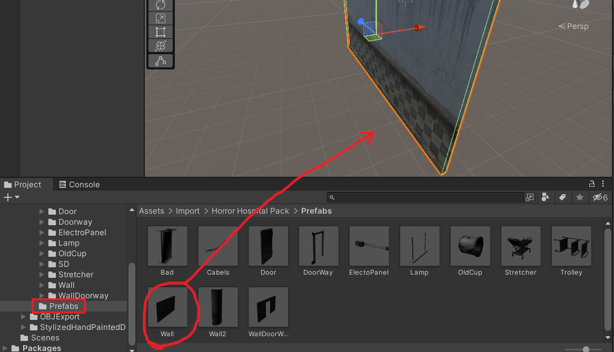
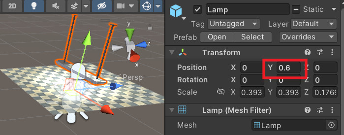

[OpenGL 3D 2023 第11回]

# 3Dモデル アセットと音声

## 習得目標

* 
* 
* 
* 

## 1. UnityのアセットをOBJファイルにする

### 1.1 アセットストアのアセットからOBJファイル作る方法

3Dゲームを作成するときの大きな問題は

>どうやって3Dモデルやテクスチャを用意するか

ということです。この問題を比較的簡単に解決する手段として、「ゲームエンジンのアセットストアを利用する」という方法があります。

例えば、Unityアセットストアにあるアセットには、Unity以外のアプリケーションでも利用可能とされているものがあります。

例えば、標準的なUnityAssetStoreライセンスのものは利用可能です。フリーか有料かを問わず、ほとんどのアセットがこのライセンスを使っているので、かなり選択の幅が広がります。

また、Unreal Engineの標準ライセンスも同様の利用規約になっています。つまり、UnityとUnreal Engineのアセットストアにある大量のアセットが利用できるわけです。

ただ、UnityにもUnreal Engineにも、OBJファイルを出力する機能がありません。そこで、以下のような方法でアセットからOBJファイルやTGAファイルを作成する必要があります。

>1. アセットフォルダにあるFBXとテクスチャをVisual Studioで開き、OBJファイルとTGAファイルとして保存する。
>2. 各エンジンのアセットストアから、OBJ変換アセット(UnityならScene OBJ Exporterなど)をインストールして変換する。
>3. アセットフォルダにあるFBXとテクスチャをBlenderなどのツールにインポートし、OBJファイルとしてエクスポートする。

`1`の方法は、Visual Studioがインストール済みなら手軽に試せます。ただし、多くのアセットを変換するには少し手間がかかります。ひとつひとつファイルを開いて変換を繰り返す必要があるからです。

`2`の方法はインストールの手間があるものの、いちばんのお勧めです。アセットストアにあるアセットは、対応するエンジンであればまず間違いなく読み込めるからです。アセットによってはまとめて変換する機能があり、変換の手間を減らせます。

`3`はアセットを修正したり、アセットの一部分を取り出して使いたい場合に便利です。ただし、FBXファイルには多くのバージョンがあるため、ツールによっては一部のバージョンしか対応していないことがあります。

あるツールでインポートできない場合は、他のツールを試してみてください。

本テキストでは、「無料のOBJ変換アセットがある」という点を考慮して、Unityを使ってアセットを取り込むことにします。Unreal EngineのOBJエクスポートはポリゴンのみで、マテリアルに対応するには有料アセットが必要です。

<div style="page-break-after: always"></div>

### 1.2 Scene OBJ Exporterアセット

Unityには標準でOBJファイルを出力する機能がありません。ですから、まずはOBJファイルを出力する方法を追加する必要があります。

OBJ出力機能を追加するにはいくつかの方法がありますが、今回はアセットストアにある「Scene OBJ Exporter(シーン・オブジェ・エクスポーター)」を使おうと思います。

「Unity Asset Store」のサイトを開き、上部の検索ボックスに「scene obj exporter」と入力すると、次のようにアセットがひとつ見つかります。

<p align="center">

</p>

このアセットをクリックすると、Scene OBJ Exporterアセットのページが開きます。

<p align="center">

</p>

ページが開いたら、「マイアセットに追加する」をクリックしてアセットを追加してください。

次に、新しいプロジェクトを作成してUnityエディタを起動します。そして、メニューから「Edit -> Package Manager」を選択してパッケージマネージャを起動してください。

「Packages」の部分をクリックして「My Assets」を選択すると、リストに「Scene OBJ Exporter」が表示されると思います。

「Scene OBJ Exporter」をクリックするとアセットの詳細が表示されるので、右下の「download」ボタンをクリックしてアセットをダウンロードしてください。

<p align="center">

</p>

ダウンロードが終わるとボタンが「Import」に変化します。「Import」ボタンを押すと「Import Unity Package」ウィンドウが開きます。

<p align="center">

</p>

右下の「Import」ボタンを押してしばらく待つと、プロジェクトに「Scene OBJ Exporter」がインポート(追加)されます。アップデートを促すダイアログが表示された場合は、左側の`Yes, for these and ...`と書かれたボタンをクリックして、APIをアップデートしてください。

<p align="center">

</p>

インポートが完了したら、左上の「File」メニューをクリックしてください。メニューの一番下に「Export」という項目が追加されていたら、「Scene OBJ Exporter」のインポートは成功です。表示されない場合は、新規プロジェクトの作成からやりなおしてみてください。

<p align="center">

</p>

### 1.3 アセットを追加する

それでは、適当なアセットから「壁」のOBJファイルを作成してみましょう。Webブラウザで`Unity Asset Store`を開き、`Hospital Horror Pack`というアセットを検索し、「マイアセットに追加」してください。

<p align="center">

</p>

<pre class="tnmai_assignment">
<strong>【課題01】</strong>
<code>Horror Hospital Pack</code>アセットを、Scene OBJ Exporterと同じプロジェクトにインポートしなさい。
なお、インポートの必要があるのは3Dモデルとテクスチャだけなので、以下のように<code>Horror Hospital Pakc</code>にだけチェックを入れて(他はすべてチェックを外して)インポートするとよいでしょう。

</pre>

さて、`Hospital Horror Pack`に含まれる壁モデルは片面だけのモデルなので、そのままでは壁ブロックとしては使えません。そこで、ブロックを囲むように四つの壁モデルを配置することにします。

とりあえず、`Wall`プレハブをシーンにドラッグ&ドロップしてください。

<p align="center">

</p>

次に、`Wall`オブジェクトを迷路のブロックサイズに合わせます。迷路のブロックサイズは2x2mなので、横幅が約2mになるようにスケールを調整します。

いくつかの数値を試した結果、スケールを`(0.375, 0.725, 0.725)`に設定すると約2mになることが分かりました。ゲームオブジェクトのスケールにこの数値を設定してください。

<p align="center">

</p>

次に、この`Wall`オブジェクトをブロックの4面に配置します。最初の`Wall`オブジェクトは-X方向を向いているので、-X側の壁にします。ゲームオブジェクトのポジションを`(-1, 1, 0)`に設定してください。

<p align="center">

</p>

続いて+Z側の壁を作成します。シーンに配置されている`Wall`オブジェクトを選択し、`Ctrl+C`, `Ctrl+V`でオブジェクトをコピーします。

次に、コピーで作られた`Wall (1)`オブジェクトのポジションとローテーションの値を、以下の画像のように変更してください。

<p align="center">

</p>

<pre class="tnmai_assignment">
<strong>【課題02】</strong>
<code>Wall</code>オブジェクトをコピー&ペーストして、+X方向の壁と-Z方向の壁を追加しなさい。外側から見たときに、壁の画像が表示されるようにすること。
</pre>

### 1.4 ブロックの角を埋める

これで、壁をブロック状に配置することができました。上下の部分は空洞ですが、迷路内からは見えない部分なのでそのままにします。

ただ、ブロックの角の部分に近寄ると、壁の下部にある「巾木(はばき)」や上部にある「廻り縁(まわりぶち)」、それと「腰壁(こしかべ、)」の上部などに、隙間が開いていることに気が付きます。

>腰壁(こしかべ)は「腰の高さより下に張りめぐらせる、素材や仕上げの異なる部分」のことです。

この隙間を埋めるために、`Wall2`プレハブを使うことにします。`Wall2`プレハブをシーンにドラッグ&ドロップしてください。

<p align="center">

</p>

次に、`Wall2`オブジェクトのポジション、ローテーション、スケールを変更して、ブロックの角に配置します。

`Wall2`オブジェクトのポジションを`(-1, 1, -1)`、スケールを`(0.2, 0.725, 0.2)`に設定してください。

<p align="center">

</p>

`Wall2`プレハブは円柱を半分にした形状なので、円柱状にするためにもうひとつの`Wall2`プレハブを追加し、180度回転させます。`Wall2`オブジェクトを選択して`Ctrl+C`, `Ctrl+V`でオブジェクトをコピーしてください。

次に、コピーした`Wall2 (1)`オブジェクトのローテションを`(0, 0, 0)`に設定してください。

<p align="center">

</p>

これで角のひとつをごまかすことができました。

<pre class="tnmai_assignment">
<strong>【課題03】</strong>
<code>Wall2</code>および<code>Wall2 (1)</code>オブジェクトをコピー&ペーストして、残りの3つの角の隙間を埋めなさい。
</pre>

これで、壁用のモデルが完成しました。

>**【出来の良いアセットの場合】**<br>
>直角に並べても角に隙間ができないよう、上手に作られているアセットの場合は、角を埋めるような操作は不要です。

### 1.5 アセットをOBJファイルとして出力する

ゲームオブジェクトからOBUファイルを作成するには、シーン内にある「OBJファイルにしたいゲームオブジェクト」だけを選択状態にします。ゲームオブジェクトに親子関係がある場合、すべての子ゲームオブジェクトを選択する必要があるので注意してください。マウスドラッグですべてのオブジェクトを囲むように選択すると簡単でしょう。

<p align="center">

</p>

出力したいオブジェクト選択したら、メニューの「File -> Export -> Wavefront OBJ」をクリックしてください。

<p align="center">

</p>

すると「Export OBJ」ウィンドウが開きます。以下の手順でチェックボックスを設定し、エクスポートしてください。

>1. `Only Selected Objects`(オンリー・セレクテッド・オブジェクツ)にチェックを入れる(入れないとシーン全体が出力される)。
>2. `Auto Mark Tex Readable`(オート・マーク・テックス・リーダブル)にチェックを入れる(入れないとテクスチャが出力されない)。
>3. `Export`(エクスポート)ボタンをクリック。

<p align="center">

</p>

すると、次のような警告ウィンドウが開きます。

<p align="center">

</p>

このウィンドウは`Auto Mark Tex Readable`にチェックを入れると表示されるもので、

>アセットのテクスチャの読み書きを可能にするよ。この変更を簡単に元に戻す方法はないよ。続けてもいいかい？

ということを聞いてきています。とはいえ、これは念のための警告で、基本的に実害はないので`Yes`を選択してください。すると、出力ファイル名を指定するウィンドウが開きます。

さて、今後さまざまなアセットからOBJファイルを作成することになりますが、そうすると、どのアセットから作成したのか分からなくなることが多いです。そこで、アセットごとにフォルダを分けることをおすすめします。

以下の手順にしたがって、作成したブロックをエクスポートしてください。

1. ExportウィンドウでOpenGLプロジェクトの`Res/MeshData`フォルダを選択。
2. Exportウィンドウの左上にある「新しいフォルダー」ボタンをクリックして、`Res/MeshData`フォルダに`HorrorHospitalPack`という名前のフォルダを作成。
3. 作成した`HorrorHospitalPack`フォルダをダブルクリックしてフォルダ内に移動。
4. ファイル名を`Wall.obj`に変更。
5. 「保存(S)」ボタンをクリック。

<p align="center">

</p>

これで、アセットからOBJファイルを作成することができました。

>**【その他の注意点】**<br>
>ゲームオブジェクトに `Mesh Renderer`コンポーネントが設定されている必要があります。また、`Skinned Mesh Renderer`には対応していません。ただし、`Skinned Mesh Renderer`から`Mesh Renderer`に変換するアセットを使えば、間接的に変換することは可能です。

>**【常に原点に配置するUnityのオプション】**<br>
>Unityエディタの「Preferences → Scene View → General」にある`Create Objects at Origin`項目にチェックを入れると、ドラッグ&ドロップで追加したオブジェクトが常に原点に配置されるようになります。この機能はUnity 2020 LST以降で利用可能です。


### 1.6 MTLファイルを修正する

Scene OBJ Exporterは、OBJファイルに加えてMTLファイルもエクスポートしてくれます。ただし、テクスチャファイルが絶対パスで指定されているため、そのままでは正しく読み込むことができません。

そこで、MTLファイルを修正します。OpenGLプロジェクトの`Res/MeshData/HorrorHospitalPack`フォルダを開き、`Wall.mtl`ファイルをVisual Studioにドラッグ&ドロップしてください(メモ帳で開いても構いません)。すると、以下のような内容になっていると思います。

```txt
newmtl WallDiffuse
Kd 1 1 1
map_Kd C:/OpenGL2023/Res/MeshData/HorrorHospitalPack/WallDiffuse.png
map_Bump C:/OpenGL2023/Res/MeshData/HorrorHospitalPack/WallNormal.png
illum 2
```

このように、2つのテクスチャファイル名が`C:/`から始まる絶対パスになっています。

現在のプログラムは相対パスにしか対応していません。そこで、ファイル名の前にあるファルダ名はすべて削除して、相対パスに変換してください。

```diff
 newmtl WallDiffuse
 Kd 1 1 1
-map_Kd C:/OpenGL2023/Res/MeshData/HorrorHospitalPack/WallDiffuse.png
-map_Bump C:/OpenGL2023/Res/MeshData/HorrorHospitalPack/WallNormal.png
+map_Kd WallDiffuse.png
+map_Bump WallNormal.png
 illum 2
```

それから、PNG形式には未対応なので拡張子を`tga`に変換してください。

```diff
 newmtl WallDiffuse
 Kd 1 1 1
-map_Kd WallDiffuse.png
-map_Bump WallNormal.png
+map_Kd WallDiffuse.tga
+map_Bump WallNormal.tga
 illum 2
```

<pre class="tnmai_assignment">
<strong>【課題04】</strong>
<code>WallDiffuse.png</code>と<code>WallNormal.png</code>をTGAファイルに変換しなさい。変換が済んだらPNGファイルは削除しておくこと。
(WallNormal.tgaは今はまだ必要ありません。ですが、そのうち使うので忘れないうちに変換しておきます)。
</pre>

### 1.7 エクスポートしたOBJファイルを表示する

それでは、エクスポートした`Wall.obj`を表示してみましょう。`Engine.cpp`を開き、`Initialize`メンバ関数にあるメッシュを追加するプログラムに、次のプログラムを追加してください。

```diff
   meshBuffer->LoadOBJ("Res/MeshData/door/arch.obj");
   meshBuffer->LoadOBJ("Res/MeshData/lever/lever_arm.obj");
   meshBuffer->LoadOBJ("Res/MeshData/lever/lever_cover.obj");
+  meshBuffer->LoadOBJ("Res/MeshData/HorrorHospitalPack/Wall.obj");

   // ゲームオブジェクト配列の容量を予約
   gameObjects.reserve(1000);
```

次に、`MainGameScene.cpp`を開き、`Initialize`メンバ関数にある壁を作成するプログラムを次のように変更してください。

```diff
         auto wall = engine.Create<GameObject>(
           "wall", { posX, 0, posZ });
         wall->scale = { squareScale, squareScale, squareScale };
-        wall->texColor = texWall;
-        wall->meshId = MeshId_wall;
+        wall->staticMesh = engine.GetStaticMesh(
+          "Res/MeshData/HorrorHospitalPack/Wall.obj");
       }
       // ドアを設定
       else if (tileId == '|' || tileId == '-') {
```

プログラムがけたらビルドして実行してください。薄汚れた病院の壁が表示されていたら成功です。

<p align="center">

</p>

このように、どんな方法でもいいのでとにかくOBJファイルに変換できれば、ゲームに登場させることができます。

### 1.8 Scene OBJ Exporterを改造する

Scene OBJ Exporterが出力する画像ファイルはPNG形式なので、Visual Studio等でTGA形式に変換する必要があります。また、MTLファイルに絶対パスが書き込まれるため、いちいち相対パスに書き換えなくてはなりません。

このような作業を毎回行うのは面倒です。そこで、Scene OBJ Exporterを改造して、直接TGAファイルが出力されるようにしましょう。

目的のスクリプトはUnityプロジェクトの`Assets/OBJExport`フォルダにあります。エクスプローラーなどでUnityプロジェクトの`Assets/OBJExport`フォルダを開き、`OBJExporter.cs`というC#ファイルをVisual Studioにドラッグ&ドロップして開いてください。

変更する場所は`OBJExporter.cs`の329～332行目のあたりです。この部分はテクスチャを変換してエクスポートするプログラムになっています。

それでは、テクスチャをエクスポートするプログラムを次のように変更してください。

```diff
           }
       }
-      string exportName = lastExportFolder + "\\" + t.name + ".png";
+      string exportName = lastExportFolder + "\\" + t.name + ".tga";
       Texture2D exTexture = new Texture2D(t.width, t.height, TextureFormat.ARGB32, false);
       exTexture.SetPixels(t.GetPixels());
-      System.IO.File.WriteAllBytes(exportName, exTexture.EncodeToPNG());
-      return exportName;
+      System.IO.File.WriteAllBytes(exportName, exTexture.EncodeToTGA());
+      return t.name + ".tga";
   }
```

UnityにはTGAに変換する関数も用意されているため、ファイルの拡張子と変換関数を変えるだけでTGAに対応できます。

また、`exportName`変数には絶対パスが格納されているため、これを戻り値にしてしまうとMTLファイルにも絶対パスが書き込まれてしまいます。そこで、戻り値を`t.name + ".tga"`に変更することで、MTLファイルにファイル名だけが出力されるようにしています。

これで、いちいちMTLファイルを編集したりPNGファイルをTGAファイルに変換する必要はなくなりました。

>**【適切なサイズのテクスチャを使う】**<br>
>特にリアル系のアセットに多いのですが、テクスチャサイズが必要以上に大きく、無圧縮TGAに変換するとファイルサイズが非常に大きくなってしまうことがあります。就職作品として提出するZIPファイルのサイズに影響するので、ファイルサイズはあまり大きくしないほうが安全です。目安として、1024x1024を超えるテクスチャは大きすぎます。目安を超えるテクスチャを見つけた場合は、手動で縮小するとよいでしょう。

### 1.9 床(ゆか)のOBJファイルを作成する

`Horror Hospital Pack`には床や天井のモデルは存在しませんが、床と天井用のマテリアルは用意されています。このような場合、Unityではメニューから`GameObject -> 3D Object -> Quad`を選択することで作成できる、1x1mの平面を利用します(`Plane`は10x10mなので大きすぎます)。

`GameObject -> 3D Object -> Quad`を選択して、シーンに`Quad`(クアッド)オブジェクトを追加してください。

>**【ゲームオブジェクトを非表示にする】**<br>
>`Wall`オブジェクトが邪魔で`Quad`が見にくい場合、ヒエラルキーウィンドウのゲームオブジェクトの左にある「眼」のアイコンをクリックして、`Wall`オブジェクトを一時的に見えなくするとよいでしょう。

追加すると分かりますが、`Quad`はXY平面として定義されています。このままでは壁になってしまうので、X軸を90度回転させてXZ平面にします(Z軸でもOK)。それから、ポジションを`(-0.5, 0, -0.5)`に設定します。

<p align="center">

</p>

次に、アセットの`Material/Floor`フォルダにある`mFloor`というマテリアルを、`Quad`オブジェクトにドラッグ&ドロップしてください。

<p align="center">

</p>

<pre class="tnmai_assignment">
<strong>【課題05】</strong>
<code>Quad</code>オブジェクトを3回コピー&ペーストして、以下の3つのポジションに配置しなさい。
( 0.5, 0, -0.5)
(-0.5, 0,  0.5)
( 0.5, 0,  0.5)
</pre>

これで床モデルは完成です。4つの`Quad`オブジェクトをすべて選択し、メニューから`File -> Export -> Wavefront OBJ`を選択してOBJファイルをエクスポートしてください。ファイル名は`Floor.obj`としてください。

### 1.10 床を表示する

作成した床(ゆか)のOBJファイルをゲームで表示してみましょう。まずOBJファイルを読み込みます。`Engine.cpp`を開き、`Initialize`メンバ関数にあるOBJファイルを読み込むプログラムに、次のプログラムを追加してください。

```diff
   meshBuffer->LoadOBJ("Res/MeshData/lever/lever_arm.obj");
   meshBuffer->LoadOBJ("Res/MeshData/lever/lever_cover.obj");
   meshBuffer->LoadOBJ("Res/MeshData/HorrorHospitalPack/Wall.obj");
+  meshBuffer->LoadOBJ("Res/MeshData/HorrorHospitalPack/Floor.obj");

   // ゲームオブジェクト配列の容量を予約
   gameObjects.reserve(1000);
```

次に`MainGameScene.cpp`を開き、床を作成するプログラムを次のように変更してください。

```diff
   } // while

   // 床を作成
-  auto floor = engine.Create<GameObject>("floor");
-  floor->scale = {
-    static_cast<float>(mapSizeX) * squareScale, 1,
-    static_cast<float>(mapSizeY) * squareScale };
-  floor->position = { floor->scale.x, -1, floor->scale.z };
-  floor->texColor = std::make_shared<Texture>("Res/floor.tga");
-  floor->meshId = MeshId_box;
+  const auto meshFloor = engine.GetStaticMesh(
+    "Res/MeshData/HorrorHospitalPack/Floor.obj");
+  for (int y = 0; y < mapSizeY; ++y) {
+    for (int x = 0; x < mapSizeX; ++x) {
+      const float posX = static_cast<float>(x + 0.5) * squareSize;
+      const float posZ = static_cast<float>(y + 0.5) * squareSize;
+
+      auto floor = engine.Create<GameObject>("floor");
+      floor->position = { posX, 0, posZ };
+      floor->staticMesh = meshFloor;
+    } // for x
+  } // for y

   // プレイヤーのスタート地点
   vec3 startPoint = { 3, 1.2f, 3 };
```

プログラムが書けたらビルドして実行してください。足元に「病院の床」が表示されていたら成功です。

<p align="center">

</p>

<pre class="tnmai_assignment">
<strong>【課題06】</strong>
床と同じ方法で「天井」のOBJファイルを作成し、ゲーム画面に表示しなさい。
</pre>

<pre class="tnmai_assignment">
<strong>【課題07】</strong>
壁と床の作成方法を参考にして「ドア」のOBJファイルを作成し、現在ゲーム中で使われている「石のアーチ」と「木のドア」を、作成したOBJファイルで置き換えなさい。
</pre>

>**【1章のまとめ】**
>
>* アセットをOBJ形式に変換するには、OBJ変換アセットを使うか、Blender, Visual Studio等にFBXを読み込んで変換する。
>* アセットに望みの図形が含まれない場合でも、Unity上で大きさや形状を整えたり、複数のアセットをうまく組み合わせれば、望みの図形を作り出すことができる。
>* スクリプトを改造することで、変換の手間を減らせる場合がある。

<div style="page-break-after: always"></div>

## 2. 半透明なモデルの描画方法

### 2.1 マップファイルに蛍光灯を追加する

壁と床と天井だけではいかにも殺風景なので、天井に蛍光灯を配置してみましょう。

Unityエディタで`Horror Hospital Pack`に含まれる`Lamp`(ランプ)プレハブを選んで、シーンにドラッグ&ドロップしてください。

`Lamp`プレハブを配置したら、ポジションを`(0.0, 0.6, 0.0)`に設定してください。

<p align="center">

</p>

<pre class="tnmai_assignment">
<strong>【課題08】</strong>
LampアセットをOBJファイルに変換し、<code>Lamp.obj</code>という名前でプロジェクトの<code>Res/MeshData/HorrorHospitalPack</code>フォルダに保存しなさい。
保存したら、<code>Engine::Initialize</code>メンバ関数に、<code>Lamp.obj</code>を読み込むプログラムを追加しなさい。
</pre>

配置したら、`Scene OBJ Exporter`を使ってOBJファイルに変換し、プロジェクトの`Res/MeshData/HorrorHospitalPack`フォルダに保存してください。ファイル名は`Lamp.obj`としてください。

蛍光灯の位置は`maze00.txt`に記述(きじゅつ)します。`maze00.txt`を開き、次のテキストを追加してください。

```diff
 // タイプ		名前	X座標	Y座標	Y角度	起動対象のオブジェクト名
 lever			lever0	3		2		0
 remote_door	door0	2		3		180		lever0
+ライト			蛍光灯	2		2		0
+ライト			蛍光灯	3		4		90
+ライト			蛍光灯	2.5		6.5		90
+ライト			蛍光灯	3.5		6.5		0
```

#### マップファイルはUTF-8(ユーティーエフ・はち)で保存すること

この例のように、マップファイルには日本語を使うこともできます。ただし、ファイルを保存するときに、文字コードを`UTF-8`にして保存してください。

「メモ帳」の場合は「ファイル→名前を指定して保存」を選びます。すると、ウィンドウ下部に文字コードを選択する領域が表示されるので、「UTF-8」を選びます。よく似た「UTF-8(BOT付き)」もありますが、これは選ばないように注意してください。

Visual Studioの場合は「名前を付けてmaze00.txtを保存」を選び、「上書き保存の右にある三角アイコン」をクリックします。そして「エンコード付きで保存」を選び、エンコードとして「UTF-8 シグネチャなし」を選んで保存します。

同じ単語や文章でも、文字コードが異なると、全く異なる数値としてデータ化されます。例えば「蛍光灯」という文字列は、今回使用する`UTF-8`と、Visual Studioの標準の文字コードである`CP932`では以下のように異なる数値に変換されます。

>蛍光灯 → UTF-8でデータ化 → 232, 155, 141, 229, 133, 137, 231, 129, 175<br>
>蛍光灯 → CP932でデータ化 → 140, 117, 140, 245, 147, 148

このように、文字コードごとにデータ化された数値が大きく異なることが分かると思います。なお、マップファイルの文字コードにUTF-8を選んだ理由は、2023年現在において「UTF-8が世界的に標準の文字コードになっているから」です。

### 2.2 蛍光灯コンポーネントを定義する

次に、マップファイルから「蛍光灯のデータ」を読み取って、`Lamp.obj`を表示するプログラムを作成しましょう。まず「蛍光灯コンポーネント」を作成します。

蛍光灯は`Fluorescent Light`(フルーレセント・ライト)というので、コンポーネント名も`FluorescentLight`とします。見慣れない単語なのでタイプしにくいと思いますが、下手に別の名前を付けて分かりにくくなるよりはいいでしょう。

プロジェクトの`Src`フォルダに`FluorescentLight.h`という名前のヘッダファイルを追加してください。追加したファイルを開き、次のプログラムを追加してください。

```diff
+/**
+* @file FluoresentLight.h
+*/
+#ifndef FLUORESCENTLIGHT_H_INCLUDED
+#define FLUORESCENTLIGHT_H_INCLUDED
+#include "Engine/Component.h"
+#include "Engine/Engine.h"
+
+/**
+* 蛍光灯(フルーレセント・ライト)コンポーネント
+*/
+class FluorescentLight : public Component
+{
+public:
+  FluorescentLight() = default;
+  virtual ~FluorescentLight() = default;
+
+  // ゲームオブジェクトに追加された時に呼び出される
+  virtual void Awake() override
+  {
+    // 蛍光灯モデルを設定
+    auto owner = GetOwner();
+    auto engine = owner->GetEngine();
+    owner->staticMesh = engine->GetStaticMesh(
+      "Res/MeshData/HorrorHospitalPack/Lamp.obj");
+  }
+};
+
+#endif // FLUORESCENTLIGHT_H_INCLUDED
```

作成した「フルーレセント・ライト」コンポーネントを使って、蛍光灯を表示しましょう。`MainGameScene.cpp`を開き、`FluorescentLight.h`をインクルードしてください。

```diff
 #include "SimpleLever.h"
 #include "RemoteDoor.h"
 #include "EnemySkull.h"
+#include "FluorescentLight.h"
 #include "TitleScene.h"
 #include "Engine/UIButton.h"
```

次に`Initialize`メンバ関数に次のプログラムを追加してください。

```diff
         linkedObject->AddRemoteObject(component);
       }
       mapObjects.push_back(component);
     }
+    // ライトを作成
+    else if (strcmp(type, u8"ライト") == 0) {
+      // 蛍光灯を作成
+      if (strcmp(name, u8"蛍光灯") == 0) {
+        pos.y = 1.75f; // 蛍光灯がいいかんじの位置に表示されるように調整
+        auto light = engine.Create<GameObject>(name, pos, { 0, rotY, 0 });
+        light->AddComponent<FluorescentLight>();
+      } // if 蛍光灯
+    }
   } // while

   // 床を作成
```

文字列の前にある`u8`(ユー・はち)は、「文字列をUTF-8としてデータ化(エンコード)する」ことを指示する「プレフィックス(「接頭辞(せっとうじ)」という意味)」です。

`u8`を付けない場合、ビルドシステムに設定された文字列が使われます。Visual Studioの標準の文字コードは`CP932`(シーピー・きゅうさんに)です。`CP932`は日本で広く使われている`Shift-JIS`(シフト・ジス)という文字コードに、いくつかの文字を追加したものです。

>**【`Shift-JIS`と`CP932`について】**<br>
>詳しくは以下のURLを参照してください。
>
>CP932とMS932の違いを調べて知ったCP932とSJISの違い:<br>
>`https://ponsuke-tarou.hatenablog.com/entry/2020/10/08/002458`
>
> Wikipedia: Microsoftコードページ932<br>
>`https://ja.wikipedia.org/wiki/Microsoftコードページ932`

前に説明したように、同じ文字列であっても文字コードが異なると数値が異なります。文字列の比較は、実際には「同じ数値かどうか」を見ているだけなので、文字コードが異なると正しい比較は行えません。

今回の場合、マップファイルは`UTF-8`でエンコードされています。そのため、比較する文字列も`UTF-8`でエンコードしなくてはならないわけです。

C++20において、文字コードを指定するプレフィックスには以下の4種類が定義されています。

| プレフィックス | エンコード | 文字の型 |
|:--:|:---|:--:|
| (なし) | (実装依存)<br>日本語WindowsではCP932 | char |
| u8 | UTF-8 | char(C++17まで), char8_t(C++20以降) |
| L  | (実装依存)<br>WindowsではUTF-16 | wchar_t |
| u  | UTF-16 | char16_t |
| U  | UTF-32 | char32_t |

プログラムが書けたらビルドして実行してください。天井に蛍光灯が表示されていたら成功です。

<p align="center">

</p>

### 2.3 ビルボードを追加する

3Dモデルを配置しただけだと「光源らしさ」が足りないように思えます。そこで、ビルボードを配置して「空気中のホコリなどによって、光源付近がぼんやりと明るくなる」表現を追加します。とりあえず、適当な画像を用意しましょう。

<pre class="tnmai_assignment">
<strong>【課題09】</strong>
以下のURLから<code>glare.png</code>(グレア)画像をダウンロードし、TGA形式に変換して、プロジェクトの<code>Res</code>フォルダに保存しなさい。
`https://github.com/tn-mai/OpenGL3D2023/blob/main/res/glare.png`
</pre>

次に`FluorescentLight.h`を開き、`Billboard.h`をインクルードしてください。

```diff
 #ifndef FLUORESCENTLIGHT_H_INCLUDED
 #define FLUORESCENTLIGHT_H_INCLUDED
 #include "Engine/Component.h"
+#include "Engine/Billboard.h"
 #include "Engine/Engine.h"

 /**
 * 蛍光灯(フルーレセント・ライト)コンポーネント
```

続いて、`Awake`メンバ関数の定義に次のプログラムを追加してください。

```diff
     auto engine = owner->GetEngine();
     owner->staticMesh = engine->GetStaticMesh(
       "Res/MeshData/HorrorHospitalPack/Lamp.obj");
+
+    // ぼんやりとした光を追加
+    auto glare = engine->Create<GameObject>("glare", owner->position);
+    glare->position.y -= 0.25f; // いいかんじ見えるように位置を調整
+    glare->meshId = MeshId_plane_xy;
+    glare->texColor = std::make_shared<Texture>("Res/glare.tga");
+    glare->AddComponent<Billboard>();
   }
 };
```

プログラムが書けたらビルドして実行してください。次のように、なんだかおかしな表示になっていたら成功です。

<p align="center">

</p>

### 2.5 レンダーキューに半透明モデル用のキューを追加する

一部が透けたような、おかしな表示になるのは「深度バッファ」と「深度テスト」の影響です。ポリゴンを描画すると、たとえそのポリゴンが完全に透明であっても、カラーバッファと深度バッファへの書き込みが行われます。

深度バッファの値が「透明な壁のある位置」に設定されるため、以後の描画では「透明な壁」より奥にあるピクセルは深度テストに失敗します。結果として、そのピクセルは描画されなくなるわけです。

以下は深度バッファを可視化したものです。カラーバッファで不自然に見える領域が、深度バッファでも四角い灰色で見えていることが分かります。

<p align="center">
&emsp;<br>
[左=カラーバッファ 右=深度バッファ]
</p>

このような「意図しない深度テストの失敗」を防ぐ方法としては、以下の2種類が考えられます。

>1. カメラから遠いゲームオブジェクトほど先に描画されるようにする。
>2. 先に完全に不透明なモデルを描画し、その後で半透明な部分を持つモデルを描画する。

どちらの方法も「描画順を制御することで問題を回避しようとする」点は共通です。しかし、処理にかかる時間では大きな違いがあります。

方法`1`では、すべてのオブジェクトについて「カメラからの距離」を計算しなくてはなりません。それに対して方法`2`では、事前に半透明かどうかを設定しておくことで、簡単に不透明のグループと半透明のグループに分けることができます。

設定の手間はあるものの、方法`2`のほうが効率的なため、本テキストでは方法`2`を採用することにしました。そして、不透明と半透明の設定は「半透明用のレンダーキュー」を追加することで対応します。

追加するレンダーキューの名前は`transparent`(トランスペアレント、「透明な」「透き通った」という意味)とします。`GameObject.h`を開き、`RenderQueue`列挙型に半透明モデル用のメンバを追加してください。

```diff
 enum RenderQueue
 {
   RenderQueue_geometry = 2000, // 一般的な図形
+  RenderQueue_transparent = 3000, // 半透明な図形
   RenderQueue_overlay  = 4000, // UI, 全画面エフェクトなど
   RenderQueue_max      = 5000, // キューの最大値
```

それでは、グレアオブジェクトのレンダーキューを設定しましょう。`FluorescentLight.h`を開き、グレアを設定するプログラムに次のプログラムを追加してください。

```diff
     // ぼんやりとした光を追加
     auto glare = engine->Create<GameObject>("glare", owner->position);
     glare->position.y -= 0.25f; // いいかんじ見えるように位置を調整
+    glare->renderQueue = RenderQueue_transparent; // 半透明として扱う
     glare->meshId = MeshId_plane_xy;
     glare->texColor = std::make_shared<Texture>("Res/glare.tga");
```

プログラムが書けたらビルドして実行してください。表示がおかしくならず、蛍光灯の周囲がほんのり明るくなっていたら成功です。

<p align="center">

</p>

このように、適切に設定したビルボードを使うと、明かりの周囲がほんのり輝く様子を再現することができます。明かりと同様に境界のはっきりしない「煙」や「炎」なども、ビルボードなら簡単に表現することが可能です。

### 2.6 深度バッファへの書き込みを禁止する

「半透明用のレンダーキュー」を追加したことで、半透明と不透明の描画を分離できるようになりました。ただ、これだけでは半透明な図形同士で同じ問題が起きてしまいます。

ゲームを起動したら迷路を少し進んで、最初の敵が登場する部屋に入ってください。この部屋には2つの蛍光灯が配置してありますが、部屋の右側から左を見たときにビルボードの見え方がおかしくなっています。

このときの深度バッファは以下のような状態になっていて、手前のビルボードが奥のビルボードを隠してしまっていることが分かります。

<p align="center">
&emsp;<br>
[左=奥のグレアが不自然に切れている 右=深度バッファにビルボードが描画されている]
</p>

このような半透明オブジェクト同士の描画では、レンダーキューによって描画順を制御するだけでは対処できないため、別の対策を併用しなくてはなりません。

半透明オブジェクトの問題は「半透明なので奥のオブジェクトが透けて見える」ことです。しかし、これは「手前のオブジェクトが奥のオブジェクトを隠すことは出来ない」ことも意味します。

つまり、半透明オブジェクト同士では深度バッファを使う意味がないわけです。しかし、不透明オブジェクトに対しては、依然として深度テストが必要です。

そこで、「深度テストは行うが、深度バッファへの書き込みは禁止する」ように設定します。こうすることで、不透明オブジェクトとの前後関係を正しく処理しつつ、半透明オブジェクトがお互いを隠すことはなくなります。

深度バッファへの書き込み禁止する範囲は、`transparent`キューから`overlay`キューのあいだです。そこで、`Engine`クラスの描画処理に、`transparent`から`overlay`までの範囲を描画する処理を追加します。

`Engine.cpp`を開き、`Render`メンバ関数の定義に次のプログラムを追加してください。

```diff
   std::stable_sort(gameObjects.begin(), gameObjects.end(),
     [](const GameObjectPtr& a, const GameObjectPtr& b) {
       return a->renderQueue < b->renderQueue; });
+
+  // transparentキューの先頭を検索
+  const auto transparentBegin = std::lower_bound(
+    gameObjects.begin(), gameObjects.end(), RenderQueue_transparent,
+    [](const GameObjectPtr& e, int value) { return e->renderQueue < value; });

   // overlayキューの先頭を検索
   const auto overlayBegin = std::lower_bound(
-    gameObjects.begin(), gameObjects.end(), RenderQueue_overlay,
+    transparentBegin, gameObjects.end(), RenderQueue_overlay,
     [](const GameObjectPtr& e, int value) { return e->renderQueue < value; });

-  // overlay以前のキューを描画
-  DrawGameObject(gameObjects.begin(), overlayBegin);
+  // transparent以前のキューを描画
+  DrawGameObject(gameObjects.begin(), transparentBegin);
+
+  // transparentからoverlayまでのキューを描画
+  glDepthMask(GL_FALSE); // 深度バッファへの書き込みを禁止
+  DrawGameObject(transparentBegin, overlayBegin);
+  glDepthMask(GL_TRUE); // 深度バッファへの書き込みを許可

   // overlay以降のキューを描画
   glDisable(GL_DEPTH_TEST); // 深度テストを無効化
```

深度バッファへの書き込みを禁止、または許可するには`glDepthMask`(ジーエル・デプス・マスク)関数を使います。

<p><code class="tnmai_code"><strong>【書式】</strong><br>
void glDepthMask(GLboolean flag);
</code></p>

`flag`引数に`GL_TRUE`を指定すると、深度バッファへの書き込みが「許可」されます。`GL_FALSE`を指定すると、深度バッファへの書き込みが「禁止」されます。

また、今回は使いませんが、`glColorMask`(ジーエル・カラー・マスク)関数を使うとカラーバッファへの書き込みを制御できます。

<p><code class="tnmai_code"><strong>【書式】</strong><br>
void glColorhMask(
  GLboolean red, GLboolean green, GLboolean blue, GLboolean alpha);
</code></p>

カラーバッファは「赤、緑、青、アルファ」の4要素で構成されます。そのため、`glColorMask`関数は「要素ごとに書き込みの許可と禁止を選択できる」ようになっています。

プログラムが書けたらビルドして実行してください。部屋の右側から左を見てみ、左側から右を見ても、奥側のグレアが正しく描画されていたら成功です。

<p align="center">
&emsp;<br>
[左=奥のグレアが正しく描画されている 右=深度バッファにビルボードが描画されていない]
</p>

### 2.7 乱数生成機能を追加する

ビルボードは輪郭のはっきりしない光や炎、煙などの表現に向いています。そこで、床にホコリか霧のようなエフェクトを表示してみようと思います。

霧の仕様は以下のようにします。

>1. 霧オブジェクトは事前に決められた範囲に発生する。
>2. 一定時間が経つごとに、範囲内のランダムな位置に霧オブジェクトがひとつ発生する。
>3. 霧オブジェクトは発生後一定時間で消える。

この仕様を踏まえて、霧自体を制御する「霧コンポーネント」と、霧を発生させる「霧ジェネレーターコンポーネント」の2種類を定義することにします。

霧は英語で`mist`(ミスト)というので、霧コンポーネントの名前は`Mist`とします。そして、霧ジェネレーターコンポーネントの名前は`MistGenerator`とします。

それはいいのですが、霧の仕様で気になるのは「範囲内のランダムな位置煮切りオブジェクトがひとつ発生する」という部分です。これは「乱数を生成する機能」が必要ということを意味します。

そこで、霧コンポーネントの前に「乱数生成機能」を作ることにします。プロジェクトの`Src/Engine`フォルダに`Random.h`という名前のヘッダファイルを追加してください。

追加したファイルを開き、次のプログラムを追加してください。

```diff
+/**
+* @file Random.h
+*/
+#ifndef RANDOM_H_INCLUDED
+#define RANDOM_H_INCLUDED
+
+/**
+* 乱数生成機能を格納する名前空間
+*/
+namespace Random {
+
+/**
+* 乱数を初期化する
+*
+* @param seed 乱数の種
+*/
+void Initialize(int seed);
+
+/**
+* 0.0～1.0の範囲の一様乱数を取得する
+*
+* @return 生成した乱数
+*/
+float Value();
+
+/**
+* 指定されたの範囲の一様乱数を取得する
+*
+* @param min 生成範囲の最小値
+* @param max 生成範囲の最大値
+*
+* @return 生成した乱数
+*/
+float Range(float min, float max);
+
+} // namespace Random
+
+#endif // RANDOM_H_INCLUDED
```

次に、プロジェクトの`Src/Engine`フォルダに`Random.cpp`という名前のCPPファイルを追加してください。追加したファイルを開き、次のプログラムを追加してください。

```diff
+/**
+* @file Random.cpp
+*/
+#include "Random.h"
+#include <random>
+
+namespace Random {
+
+// 乱数生成オブジェクト
+std::random_device rd;
+std::mt19937 randomEngine(rd());
+
+void Initialize(int seed)
+{
+  randomEngine.seed(seed);
+}
+
+float Value()
+{
+  return std::uniform_real_distribution<float>(0, 1)(randomEngine);
+}
+
+float Range(float min, float max)
+{
+  return std::uniform_real_distribution<float>(min, max)(randomEngine);
+}
+
+} // namespace Random
```

C++11以降のC++では、いくつかの乱数生成クラスが選べるようになっています。現時点で最もよく使われているのは`mt19937`(エムティ・いちきゅうきゅうさんなな)という乱数生成クラスです。

`mt19937`は「メルセンヌ・ツイスター」というアルゴリズムを使っており、同じパターンが繰り返えされる周期が非常に長いという特徴があります。

C言語の`rand`関数と同様に、`mt19937`も適切に初期化しないと毎回同じ値が同じ順番で返されます。これを防ぐには、コンストラクタ引数に「シード(種)」と呼ばれる値を指定します。

<p><code class="tnmai_code"><strong>【書式】</strong><br>
mt19937(シード);
</code></p>

ただ、毎回同じシードを指定すると、結局同じ値が返されることになります。そこで、プログラムが実行されるたびにシードを変えなくてはなりません。

C++03までは、シードとして`time`関数が返す「現在の時刻」を利用していました。しかし、C++11以降は`random_device`(ランダム・デバイス)クラスを使うことが多いです。

`time`が使われなくなったのは、「`time`で初期化すると、実行開始時刻から乱数列が予測できてしまう」ためです。

`random_device`は乱数生成クラスのひとつで、「<ruby>真<rt>しん</rt></ruby>の乱数」を返します。ここでいう「真の」とは、「常に予測不能である」という意味です。

「真の乱数」を実現するために、`random_device`は「ハードウェアが発するノイズや、キーボード、マウスの動き」といった要素から乱数を生成します。これにより、外部からシードを予測できなくなります。

#### ディストリビューションクラスによる乱数範囲の制御

乱数生成クラス自体は範囲指定の機能を持ちません。指定した範囲の一様乱数を取得するには`uniform_real_distribution`(ユニフォーム・リアル・ディストリビューション)クラスを使います。

`uniform`(ユニフォーム)は「一様(いちよう)な」、`real`(リアル)は「実数の」、`distribution`(ディストリビューション)は「分布」という意味で、「一様な実数の分布」という意味の名前になっています。

>なお、C++の乱数ライブラリにおける「実数」とは「浮動小数点数」のことです(つまり`float`や`double`)。

`uniform_real_distribution`クラスは、コンストラクタで最小値と最大値を指定します。

<p><code class="tnmai_code"><strong>【書式】</strong><br>
template<typename T>
uniform_real_distribution<T>(最小値, 最大値);
</code></p>

乱数を生成するときは、関数呼び出し演算子に乱数生成クラスのオブジェクトを指定します。すると、コンストラクタで指定した範囲の乱数が返される、という仕組みになっています。

<p><code class="tnmai_code"><strong>【書式】</strong><br>
T uniform_real_distribution::operator()(乱数生成オブジェクト);
</code></p>

### 2.8 霧コンポーネントを定義する

霧コンポーネントの作成に戻りましょう。まず、霧の画像を用意します。

<pre class="tnmai_assignment">
<strong>【課題10】</strong>
以下のURLから<code>mist.png</code>(ミスト)画像をダウンロードし、TGA形式に変換して、プロジェクトの<code>Res</code>フォルダに保存しなさい。
`https://github.com/tn-mai/OpenGL3D2023/blob/main/res/mist.png`
</pre>

霧コンポーネントと霧ジェネレーターコンポーネントは、両方とも`Mist.h`というひとつのファイルに定義することにします。これらのコンポーネントを個別に使うとは考えにくいので、分ける必然性がないからです。

プロジェクトの`Src`フォルダに`Mist.h`という名前のヘッダファイルを追加してください。追加したファイルを開き、次のプログラムを追加してください。

```diff
+/**
+* @file Mist.h
+*/
+#ifndef MIST_H_INCLUDED
+#define MIST_H_INCLUDED
+#include "Engine/Component.h"
+#include "Engine/GameObject.h"
+#include "Engine/Billboard.h"
+#include "Engine/Random.h"
+#include "Engine/Engine.h"
+
+/**
+* 霧コンポーネント
+*/
+class Mist : public Component
+{
+  friend class MistGenerator;
+
+public:
+  Mist() = default;
+  virtual ~Mist() = default;
+
+  virtual void Update(float deltaTime) override
+  {
+    // タイマーが寿命を超えたら自身を削除
+    timer += deltaTime;
+    if (timer >= lifespan) {
+      GetOwner()->Destroy();
+    }
+  }
+
+private:
+  float timer = 0;    // 経過時間タイマー
+  float lifespan = 7; // 寿命(秒)
+};
+
+#endif // MIST_H_INCLUDED
```

次に「霧ジェネレーターコンポーネント」を定義します。霧コンポーネントの定義の下に、次のプログラムを追加してください。

```diff
   float timer = 0;    // 経過時間タイマー
   float lifespan = 7; // 寿命(秒)
 };
+
+/**
+* 霧を発生させるコンポーネント
+*/
+class MistGenerator : public Component
+{
+public:
+  MistGenerator() = default;
+  virtual ~MistGenerator() = default;
+
+  virtual void Update(float deltaTime) override
+  {
+    timer += deltaTime;
+    if (timer < interval) {
+      return;
+    }
+    timer -= interval;
+
+    auto owner = GetOwner();
+    auto engine = owner->GetEngine();
+
+    // 霧を発生させる位置をランダムに選択
+    vec3 pos = owner->position;
+    pos.x += Random::Range(-range.x, range.x);
+    pos.y += 0.15f; // いいかんじに表示されるように高さを調整
+    pos.z += Random::Range(-range.y, range.y);
+
+    // 霧を生成
+    auto mist = engine->Create<GameObject>("mist", pos);
+    mist->meshId = MeshId_plane_xy;
+    mist->texColor = texMist;
+    mist->renderQueue = RenderQueue_transparent;
+    mist->AddComponent<Billboard>();
+    mist->AddComponent<Mist>();
+  }
+
+  vec2 range = { 1, 1 }; // XZ方向の発生半径
+  float interval = 1;    // 霧を発成する間隔
+
+private:
+  // 霧テクスチャ
+  TexturePtr texMist =
+    std::make_shared<Texture>("Res/mist.tga");
+  float timer = 0; // 霧発成タイマー
+};

 #endif // MIST_H_INCLUDED
```

### 2.9 マップに霧ジェネレータを配置する

次に、マップデータに霧ジェネレータを表すデータを追加します。`maze00.txt`を開き、次のテキストを追加してください。

```diff
 ライト		蛍光灯	3	4	90
 ライト		蛍光灯	2.5	6.5	90
 ライト		蛍光灯	3.5	6.5	90
+霧			3x2		2	1.5	0
```

霧ジェネレータの座標は、マップに合わせて変更してください。名前に指定した`3x2`(さん・エックス・に)というのは、霧を発生させる範囲を表しています。

続いて、マップデータから霧ジェネレータを作成するプログラムを追加します。まずは`MainGameScene.cpp`を開き、`Mist.h`をインクルードしてください。

```diff
 #include "RemoteDoor.h"
 #include "EnemySkull.h"
 #include "FluorescentLight.h"
+#include "Mist.h"
 #include "TitleScene.h"
 #include "Engine/UIButton.h"
```

次に`Initialize`メンバ関数に次のプログラムを追加してください。

```diff
         light->AddComponent<FluorescentLight>();
       }
     }
+    // 霧ジェネレータを作成
+    else if (strcmp(type, u8"霧") == 0) {
+      vec2 range;
+      if (sscanf(name, "%fx%f", &range.x, &range.y) == 2) {
+        auto mistGenerator = engine.Create<GameObject>(name, pos);
+        auto mistGen = mistGenerator->AddComponent<MistGenerator>();
+        mistGen->range = range;
+      }
+    }
  } // while

   // 床を作成
```

プログラムが書けたらビルドして実行してください。部屋の床に霧エフェクトが表示されたら成功です。

<pre class="tnmai_assignment">
<strong>【課題11】</strong>
霧オブジェクトのアルファ値を「透明→不透明→透明」の順で徐々に変化させなさい。
</pre>

<pre class="tnmai_assignment">
<strong>【課題12】</strong>
霧オブジェクトごとにサイズが変わるように、Xスケールを0.2～0.5の範囲で、Yスケールを0.1～0.2の範囲でランダムに選択するようにしなさい。
</pre>

<p align="center">
<br>
[床に霧エフェクトが表示されている]
</p>

>**【2章のまとめ】**
>
>* ビルボードを使うと、輪郭のはっきりしない光や煙、炎のような半透明の物体を表現することができる。
>* 不透明モデルと半透明モデルの両方を適切に描画するには、先に不透明モデルを描画し、その後で半透明モデルを描画する。
>* 半透明モデル同士の描画を正しく処理するには、「深度バッファへの書き込みを禁止する」という方法がある。
>* 乱数を生成するには`mt19937`クラスを使う。範囲を制限するには`uniform_real_distribution`クラスを使う。

<div style="page-break-after: always"></div>

## 3. 

### 2.1 


>**【2章のまとめ】**
>
>* 
>* 
>* 
>* 

<div style="page-break-after: always"></div>
