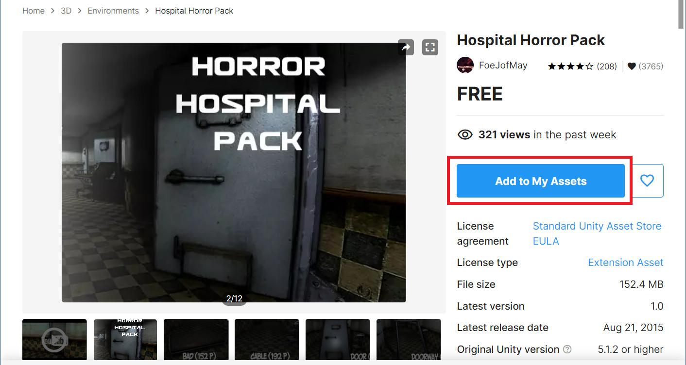

[OpenGL 3D 2023 第11回]

# 3Dモデル アセットと音声

## 習得目標

* 
* 
* 
* 

## 1. UnityのアセットをOBJファイルにする

### 1.1 アセットストアのアセットからOBJファイル作る方法

3Dゲームを作成するときの大きな問題は

>どうやって3Dモデルやテクスチャを用意するか

ということです。この問題を比較的簡単に解決する手段として、「ゲームエンジンのアセットストアを利用する」という方法があります。

例えば、Unityアセットストアにあるアセットには、Unity以外のアプリケーションでも利用可能とされているものがあります。

例えば、標準的なUnityAssetStoreライセンスのものは利用可能です。フリーか有料かを問わず、ほとんどのアセットがこのライセンスを使っているので、かなり選択の幅が広がります。

また、Unreal Engineの標準ライセンスも同様の利用規約になっています。つまり、UnityとUnreal Engineのアセットストアにある大量のアセットが利用できるわけです。

ただ、UnityにもUnreal Engineにも、OBJファイルを出力する機能がありません。そこで、以下のような方法でアセットからOBJファイルやTGAファイルを作成する必要があります。

>1. アセットフォルダにあるFBXとテクスチャをVisual Studioで開き、OBJファイルとTGAファイルとして保存する。
>2. 各エンジンのアセットストアから、OBJ変換アセット(UnityならScene OBJ Exporterなど)をインストールして変換する。
>3. アセットフォルダにあるFBXとテクスチャをBlenderなどのツールにインポートし、OBJファイルとしてエクスポートする。

`1`の方法は、Visual Studioがインストール済みなら手軽に試せます。ただし、多くのアセットを変換するには少し手間がかかります。ひとつひとつファイルを開いて変換を繰り返す必要があるからです。

`2`の方法はインストールの手間があるものの、いちばんのお勧めです。アセットストアにあるアセットは、対応するエンジンであればまず間違いなく読み込めるからです。アセットによってはまとめて変換する機能があり、変換の手間を減らせます。

`3`はアセットを修正したり、アセットの一部分を取り出して使いたい場合に便利です。ただし、FBXファイルには多くのバージョンがあるため、ツールによっては一部のバージョンしか対応していないことがあります。

あるツールでインポートできない場合は、他のツールを試してみてください。

本テキストでは、「無料のOBJ変換アセットがある」という点を考慮して、Unityを使ってアセットを取り込むことにします。Unreal EngineのOBJエクスポートはポリゴンのみで、マテリアルに対応するには有料アセットが必要です。

<div style="page-break-after: always"></div>

### 1.2 Scene OBJ Exporterアセット

Unityには標準でOBJファイルを出力する機能がありません。ですから、まずはOBJファイルを出力する方法を追加する必要があります。

OBJ出力機能を追加するにはいくつかの方法がありますが、今回はアセットストアにある「Scene OBJ Exporter(シーン・オブジェ・エクスポーター)」を使おうと思います。

「Unity Asset Store」のサイトを開き、上部の検索ボックスに「scene obj exporter」と入力すると、次のようにアセットがひとつ見つかります。

<p align="center">

</p>

このアセットをクリックすると、Scene OBJ Exporterアセットのページが開きます。

<p align="center">

</p>

ページが開いたら、「マイアセットに追加する」をクリックしてアセットを追加してください。

次に、新しいプロジェクトを作成してUnityエディタを起動します。そして、メニューから「Edit -> Package Manager」を選択してパッケージマネージャを起動してください。

「Packages」の部分をクリックして「My Assets」を選択すると、リストに「Scene OBJ Exporter」が表示されると思います。

「Scene OBJ Exporter」をクリックするとアセットの詳細が表示されるので、右下の「download」ボタンをクリックしてアセットをダウンロードしてください。

<p align="center">

</p>

ダウンロードが終わるとボタンが「Import」に変化します。「Import」ボタンを押すと「Import Unity Package」ウィンドウが開きます。

<p align="center">

</p>

右下の「Import」ボタンを押してしばらく待つと、プロジェクトに「Scene OBJ Exporter」がインポート(追加)されます。アップデートを促すダイアログが表示された場合は、左側の`Yes, for these and ...`と書かれたボタンをクリックして、APIをアップデートしてください。

<p align="center">

</p>

インポートが完了したら、左上の「File」メニューをクリックしてください。メニューの一番下に「Export」という項目が追加されていたら、「Scene OBJ Exporter」のインポートは成功です。表示されない場合は、新規プロジェクトの作成からやりなおしてみてください。

<p align="center">

</p>

### 1.3 アセットを追加する

それでは、適当なアセットから「壁」のOBJファイルを作成してみましょう。Webブラウザで`Unity Asset Store`を開き、`Hospital Horror Pack`というアセットを検索し、「マイアセットに追加」してください。

<p align="center">

</p>

<pre class="tnmai_assignment">
<strong>【課題01】</strong>
<code>Horror Hospital Pack</code>アセットを、Scene OBJ Exporterと同じプロジェクトにインポートしなさい。
なお、インポートの必要があるのは3Dモデルとテクスチャだけなので、以下のように<code>Horror Hospital Pakc</code>にだけチェックを入れて(他はすべてチェックを外して)インポートするとよいでしょう。

</pre>

さて、`Hospital Horror Pack`に含まれる壁モデルは片面だけのモデルなので、そのままでは壁ブロックとしては使えません。そこで、ブロックを囲むように四つの壁モデルを配置することにします。

とりあえず、`Wall`プレハブをシーンにドラッグ&ドロップしてください。

<p align="center">

</p>

次に、`Wall`オブジェクトを迷路のブロックサイズに合わせます。迷路のブロックサイズは2x2mなので、横幅が約2mになるようにスケールを調整します。

いくつかの数値を試した結果、スケールを`(0.375, 0.725, 0.725)`に設定すると約2mになることが分かりました。ゲームオブジェクトのスケールにこの数値を設定してください。

<p align="center">

</p>

次に、この`Wall`オブジェクトをブロックの4面に配置します。最初の`Wall`オブジェクトは-X方向を向いているので、-X側の壁にします。ゲームオブジェクトのポジションを`(-1, 1, 0)`に設定してください。

<p align="center">

</p>

続いて+Z側の壁を作成します。シーンに配置されている`Wall`オブジェクトを選択し、`Ctrl+C`, `Ctrl+V`でオブジェクトをコピーします。

次に、コピーで作られた`Wall (1)`オブジェクトのポジションとローテーションの値を、以下の画像のように変更してください。

<p align="center">

</p>

<pre class="tnmai_assignment">
<strong>【課題02】</strong>
<code>Wall</code>オブジェクトをコピー&ペーストして、+X方向の壁と-Z方向の壁を追加しなさい。外側から見たときに、壁の画像が表示されるようにすること。
</pre>

### 1.4 ブロックの角を埋める

これで、壁をブロック状に配置することができました。上下の部分は空洞ですが、迷路内からは見えない部分なのでそのままにします。

ただ、ブロックの角の部分に近寄ると、壁の下部にある「巾木(はばき)」や上部にある「廻り縁(まわりぶち)」、それと「腰壁(こしかべ、)」の上部などに、隙間が開いていることに気が付きます。

>腰壁(こしかべ)は「腰の高さより下に張りめぐらせる、素材や仕上げの異なる部分」のことです。

この隙間を埋めるために、`Wall2`プレハブを使うことにします。`Wall2`プレハブをシーンにドラッグ&ドロップしてください。

<p align="center">

</p>

次に、`Wall2`オブジェクトのポジション、ローテーション、スケールを変更して、ブロックの角に配置します。

`Wall2`オブジェクトのポジションを`(-1, 1, -1)`、スケールを`(0.2, 0.725, 0.2)`に設定してください。

<p align="center">

</p>

`Wall2`プレハブは円柱を半分にした形状なので、円柱状にするためにもうひとつの`Wall2`プレハブを追加し、180度回転させます。`Wall2`オブジェクトを選択して`Ctrl+C`, `Ctrl+V`でオブジェクトをコピーしてください。

次に、コピーした`Wall2 (1)`オブジェクトのローテションを`(0, 0, 0)`に設定してください。

<p align="center">

</p>

これで角のひとつをごまかすことができました。

<pre class="tnmai_assignment">
<strong>【課題03】</strong>
<code>Wall2</code>および<code>Wall2 (1)</code>オブジェクトをコピー&ペーストして、残りの3つの角の隙間を埋めなさい。
</pre>

これで、壁用のモデルが完成しました。

>**【出来の良いアセットの場合】**<br>
>直角に並べても角に隙間ができないよう、上手に作られているアセットの場合は、角を埋めるような操作は不要です。

### 1.5 アセットをOBJファイルとして出力する

ゲームオブジェクトからOBUファイルを作成するには、シーン内にある「OBJファイルにしたいゲームオブジェクト」だけを選択状態にします。ゲームオブジェクトに親子関係がある場合、すべての子ゲームオブジェクトを選択する必要があるので注意してください。マウスドラッグですべてのオブジェクトを囲むように選択すると簡単でしょう。

<p align="center">

</p>

出力したいオブジェクト選択したら、メニューの「File -> Export -> Wavefront OBJ」をクリックしてください。

<p align="center">

</p>

すると「Export OBJ」ウィンドウが開きます。以下の手順でチェックボックスを設定し、エクスポートしてください。

>1. `Only Selected Objects`(オンリー・セレクテッド・オブジェクツ)にチェックを入れる(入れないとシーン全体が出力される)。
>2. `Auto Mark Tex Readable`(オート・マーク・テックス・リーダブル)にチェックを入れる(入れないとテクスチャが出力されない)。
>3. `Export`(エクスポート)ボタンをクリック。

<p align="center">

</p>

すると、次のような警告ウィンドウが開きます。

<p align="center">

</p>

このウィンドウは`Auto Mark Tex Readable`にチェックを入れると表示されるもので、

>アセットのテクスチャの読み書きを可能にするよ。この変更を簡単に元に戻す方法はないよ。続けてもいいかい？

ということを聞いてきています。とはいえ、これは念のための警告で、基本的に実害はないので`Yes`を選択してください。すると、出力ファイル名を指定するウィンドウが開きます。

さて、今後さまざまなアセットからOBJファイルを作成することになりますが、そうすると、どのアセットから作成したのか分からなくなることが多いです。そこで、アセットごとにフォルダを分けることをおすすめします。

以下の手順にしたがって、作成したブロックをエクスポートしてください。

1. ExportウィンドウでOpenGLプロジェクトの`Res/MeshData`フォルダを選択。
2. Exportウィンドウの左上にある「新しいフォルダー」ボタンをクリックして、`Res/MeshData`フォルダに`HorrorHospitalPack`という名前のフォルダを作成。
3. 作成した`HorrorHospitalPack`フォルダをダブルクリックしてフォルダ内に移動。
4. ファイル名を`Wall.obj`に変更。
5. 「保存(S)」ボタンをクリック。

<p align="center">

</p>

これで、アセットからOBJファイルを作成することができました。

>**【その他の注意点】**<br>
>ゲームオブジェクトに `Mesh Renderer`コンポーネントが設定されている必要があります。また、`Skinned Mesh Renderer`には対応していません。ただし、`Skinned Mesh Renderer`から`Mesh Renderer`に変換するアセットを使えば、間接的に変換することは可能です。

>**【常に原点に配置するUnityのオプション】**<br>
>Unityエディタの「Preferences → Scene View → General」にある`Create Objects at Origin`項目にチェックを入れると、ドラッグ&ドロップで追加したオブジェクトが常に原点に配置されるようになります。この機能はUnity 2020 LST以降で利用可能です。


### 1.6 MTLファイルを修正する

Scene OBJ Exporterは、OBJファイルに加えてMTLファイルもエクスポートしてくれます。ただし、テクスチャファイルが絶対パスで指定されているため、そのままでは正しく読み込むことができません。

そこで、MTLファイルを修正します。OpenGLプロジェクトの`Res/MeshData/HorrorHospitalPack`フォルダを開き、`Wall.mtl`ファイルをVisual Studioにドラッグ&ドロップしてください(メモ帳で開いても構いません)。すると、以下のような内容になっていると思います。

```txt
newmtl WallDiffuse
Kd 1 1 1
map_Kd C:/OpenGL2023/Res/MeshData/HorrorHospitalPack/WallDiffuse.png
map_Bump C:/OpenGL2023/Res/MeshData/HorrorHospitalPack/WallNormal.png
illum 2
```

このように、2つのテクスチャファイル名が`C:/`から始まる絶対パスになっています。

現在のプログラムは相対パスにしか対応していません。そこで、ファイル名の前にあるファルダ名はすべて削除して、相対パスに変換してください。

```diff
 newmtl WallDiffuse
 Kd 1 1 1
-map_Kd C:/OpenGL2023/Res/MeshData/HorrorHospitalPack/WallDiffuse.png
-map_Bump C:/OpenGL2023/Res/MeshData/HorrorHospitalPack/WallNormal.png
+map_Kd WallDiffuse.png
+map_Bump WallNormal.png
 illum 2
```

それから、PNG形式には未対応なので拡張子を`tga`に変換してください。

```diff
 newmtl WallDiffuse
 Kd 1 1 1
-map_Kd WallDiffuse.png
-map_Bump WallNormal.png
+map_Kd WallDiffuse.tga
+map_Bump WallNormal.tga
 illum 2
```

<pre class="tnmai_assignment">
<strong>【課題04】</strong>
<code>WallDiffuse.png</code>と<code>WallNormal.png</code>をTGAファイルに変換しなさい。変換が済んだらPNGファイルは削除しておくこと。
(WallNormal.tgaは今はまだ必要ありません。ですが、そのうち使うので忘れないうちに変換しておきます)。
</pre>

### 1.7 エクスポートしたOBJファイルを表示する

それでは、エクスポートした`Wall.obj`を表示してみましょう。`Engine.cpp`を開き、`Initialize`メンバ関数にあるメッシュを追加するプログラムに、次のプログラムを追加してください。

```diff
   meshBuffer->LoadOBJ("Res/MeshData/door/arch.obj");
   meshBuffer->LoadOBJ("Res/MeshData/lever/lever_arm.obj");
   meshBuffer->LoadOBJ("Res/MeshData/lever/lever_cover.obj");
+  meshBuffer->LoadOBJ("Res/MeshData/HorrorHospitalPack/Wall.obj");

   // ゲームオブジェクト配列の容量を予約
   gameObjects.reserve(1000);
```

次に、`MainGameScene.cpp`を開き、`Initialize`メンバ関数にある壁を作成するプログラムを次のように変更してください。

```diff
         auto wall = engine.Create<GameObject>(
           "wall", { posX, 0, posZ });
         wall->scale = { squareScale, squareScale, squareScale };
-        wall->texColor = texWall;
-        wall->meshId = MeshId_wall;
+        wall->staticMesh = engine.GetStaticMesh(
+          "Res/MeshData/HorrorHospitalPack/Wall.obj");
       }
       // ドアを設定
       else if (tileId == '|' || tileId == '-') {
```

プログラムがけたらビルドして実行してください。薄汚れた病院の壁が表示されていたら成功です。

<p align="center">

</p>

このように、どんな方法でもいいのでとにかくOBJファイルに変換できれば、ゲームに登場させることができます。

### 1.8 Scene OBJ Exporterを改造する

Scene OBJ Exporterが出力する画像ファイルはPNG形式なので、Visual Studio等でTGA形式に変換する必要があります。また、MTLファイルに絶対パスが書き込まれるため、いちいち相対パスに書き換えなくてはなりません。

このような作業を毎回行うのは面倒です。そこで、Scene OBJ Exporterを改造して、直接TGAファイルが出力されるようにしましょう。

目的のスクリプトはUnityプロジェクトの`Assets/OBJExport`フォルダにあります。エクスプローラーなどでUnityプロジェクトの`Assets/OBJExport`フォルダを開き、`OBJExporter.cs`というC#ファイルをVisual Studioにドラッグ&ドロップして開いてください。

変更する場所は`OBJExporter.cs`の329～332行目のあたりです。この部分はテクスチャを変換してエクスポートするプログラムになっています。

それでは、テクスチャをエクスポートするプログラムを次のように変更してください。

```diff
           }
       }
-      string exportName = lastExportFolder + "\\" + t.name + ".png";
+      string exportName = lastExportFolder + "\\" + t.name + ".tga";
       Texture2D exTexture = new Texture2D(t.width, t.height, TextureFormat.ARGB32, false);
       exTexture.SetPixels(t.GetPixels());
-      System.IO.File.WriteAllBytes(exportName, exTexture.EncodeToPNG());
-      return exportName;
+      System.IO.File.WriteAllBytes(exportName, exTexture.EncodeToTGA());
+      return t.name + ".tga";
   }
```

UnityにはTGAに変換する関数も用意されているため、ファイルの拡張子と変換関数を変えるだけでTGAに対応できます。

また、`exportName`変数には絶対パスが格納されているため、これを戻り値にしてしまうとMTLファイルにも絶対パスが書き込まれてしまいます。そこで、戻り値を`t.name + ".tga"`に変更することで、MTLファイルにファイル名だけが出力されるようにしています。

これで、いちいちMTLファイルを編集したりPNGファイルをTGAファイルに変換する必要はなくなりました。

>**【適切なサイズのテクスチャを使う】**<br>
>特にリアル系のアセットに多いのですが、テクスチャサイズが必要以上に大きく、無圧縮TGAに変換するとファイルサイズが非常に大きくなってしまうことがあります。就職作品として提出するZIPファイルのサイズに影響するので、ファイルサイズはあまり大きくしないほうが安全です。目安として、1024x1024を超えるテクスチャは大きすぎます。目安を超えるテクスチャを見つけた場合は、手動で縮小するとよいでしょう。

### 1.9 床(ゆか)のOBJファイルを作成する

`Horror Hospital Pack`には床や天井のモデルは存在しませんが、床と天井用のマテリアルは用意されています。このような場合、Unityではメニューから`GameObject -> 3D Object -> Quad`を選択することで作成できる、1x1mの平面を利用します(`Plane`は10x10mなので大きすぎます)。

`GameObject -> 3D Object -> Quad`を選択して、シーンに`Quad`(クアッド)オブジェクトを追加してください。

>**【ゲームオブジェクトを非表示にする】**<br>
>`Wall`オブジェクトが邪魔で`Quad`が見にくい場合、ヒエラルキーウィンドウのゲームオブジェクトの左にある「眼」のアイコンをクリックして、`Wall`オブジェクトを一時的に見えなくするとよいでしょう。

追加すると分かりますが、`Quad`はXY平面として定義されています。このままでは壁になってしまうので、X軸を90度回転させてXZ平面にします(Z軸でもOK)。それから、ポジションを`(-0.5, 0, -0.5)`に設定します。

<p align="center">

</p>

次に、アセットの`Material/Floor`フォルダにある`mFloor`というマテリアルを、`Quad`オブジェクトにドラッグ&ドロップしてください。

<p align="center">

</p>

<pre class="tnmai_assignment">
<strong>【課題05】</strong>
<code>Quad</code>オブジェクトを3回コピー&ペーストして、以下の3つのポジションに配置しなさい。
( 0.5, 0, -0.5)
(-0.5, 0,  0.5)
( 0.5, 0,  0.5)
</pre>

これで床モデルは完成です。4つの`Quad`オブジェクトをすべて選択し、メニューから`File -> Export -> Wavefront OBJ`を選択してOBJファイルをエクスポートしてください。ファイル名は`Floor.obj`としてください。

### 1.10 床を表示する

作成した床(ゆか)のOBJファイルをゲームで表示してみましょう。まずOBJファイルを読み込みます。`Engine.cpp`を開き、`Initialize`メンバ関数にあるOBJファイルを読み込むプログラムに、次のプログラムを追加してください。

```diff
   meshBuffer->LoadOBJ("Res/MeshData/lever/lever_arm.obj");
   meshBuffer->LoadOBJ("Res/MeshData/lever/lever_cover.obj");
   meshBuffer->LoadOBJ("Res/MeshData/HorrorHospitalPack/Wall.obj");
+  meshBuffer->LoadOBJ("Res/MeshData/HorrorHospitalPack/Floor.obj");

   // ゲームオブジェクト配列の容量を予約
   gameObjects.reserve(1000);
```

次に`MainGameScene.cpp`を開き、床を作成するプログラムを次のように変更してください。

```diff
   } // while

   // 床を作成
-  auto floor = engine.Create<GameObject>("floor");
-  floor->scale = {
-    static_cast<float>(mapSizeX) * squareScale, 1,
-    static_cast<float>(mapSizeY) * squareScale };
-  floor->position = { floor->scale.x, -1, floor->scale.z };
-  floor->texColor = std::make_shared<Texture>("Res/floor.tga");
-  floor->meshId = MeshId_box;
+  const auto meshFloor = engine.GetStaticMesh(
+    "Res/MeshData/HorrorHospitalPack/Floor.obj");
+  for (int y = 0; y < mapSizeY; ++y) {
+    for (int x = 0; x < mapSizeX; ++x) {
+      const float posX = static_cast<float>(x + 0.5) * squareSize;
+      const float posZ = static_cast<float>(y + 0.5) * squareSize;
+
+      auto floor = engine.Create<GameObject>("floor");
+      floor->position = { posX, 0, posZ };
+      floor->staticMesh = meshFloor;
+    } // for x
+  } // for y

   // プレイヤーのスタート地点
   vec3 startPoint = { 3, 1.2f, 3 };
```

プログラムが書けたらビルドして実行してください。足元に「病院の床」が表示されていたら成功です。

<p align="center">

</p>

<pre class="tnmai_assignment">
<strong>【課題06】</strong>
床と同じ方法で「天井」のOBJファイルを作成し、ゲーム画面に表示しなさい。
</pre>

>**【1章のまとめ】**
>
>* アセットをOBJ形式に変換するには、OBJ変換アセットを使うか、Blender, Visual Studio等にFBXを読み込んで変換する。
>* アセットに望みの図形が含まれない場合でも、Unity上で大きさや形状を整えたり、複数のアセットをうまく組み合わせれば、望みの図形を作り出すことができる。
>* スクリプトを改造することで、変換の手間を減らせる場合がある。

<div style="page-break-after: always"></div>

## 2. 

### 2.1 


>**【2章のまとめ】**
>
>* 
>* 
>* 
>* 

<div style="page-break-after: always"></div>
