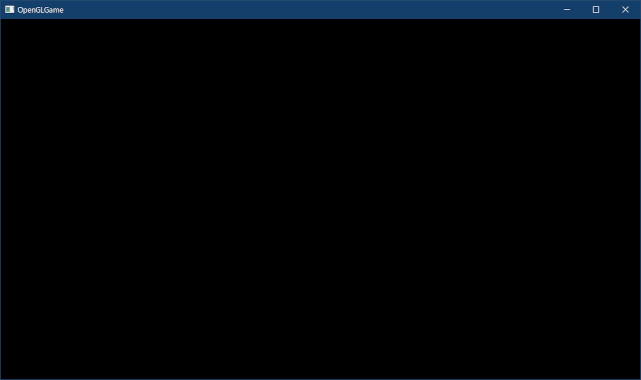
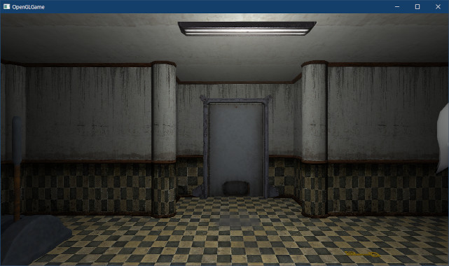
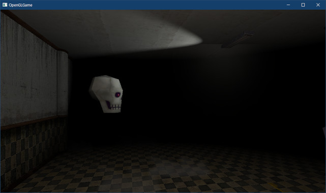
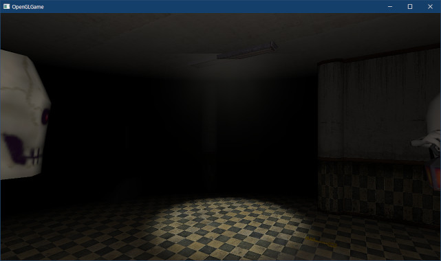
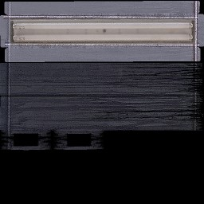
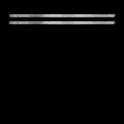
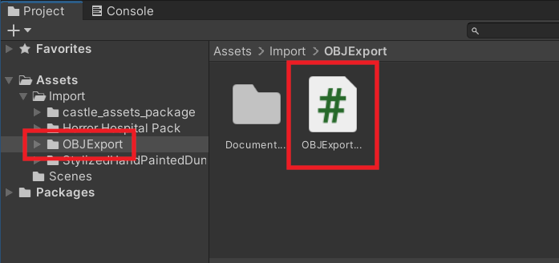
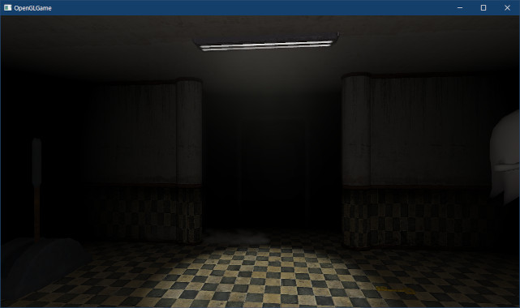
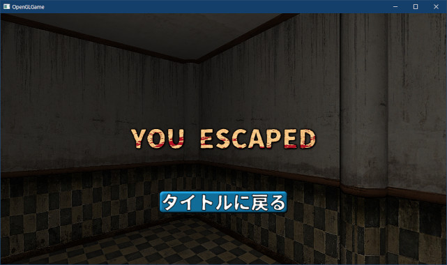

[OpenGL 3D 2023 第12回]

# ライト配列とスポットライト

## 習得目標

* ユニフォーム変数の配列を作成できる。
* 「構造体の配列」と「配列の構造体」の違いを説明できる。
* 「処理効率を重視したデータ構造」と「操作性を重視したデータ構造」の使い分けについて説明できる。
* スポットライトに必要な3つのデータを説明できる。
* エミッションテクスチャが必要な理由を説明できる。
* UIオブジェクトの描画にアンリットシェーダを使う理由を説明できる。

## 1. ライトを増やす

### 1.1 ライトの増やし方

ビルボードを使うことで、蛍光灯がほんのり光っているように見えるようになりました。しかし、本当に光っているわけではないため、蛍光灯から離れると明かりは消えてしまいます。

そこで、ライトをいくつでも配置できるようにしましょう。OpenGLでたくさんのライトを扱う方法はいくつもあり、単純で簡単なものから複雑で難しいものまでさまざまです。今回は以下の方針で作成することにしました。

>* シェーダにライト配列を定義する。配列の長さはとりあえず`16`とする。
>* ライトを「ライトコンポーネント」として定義し、いくつでも追加できるようにする。
>* 実際にシェーダにコピーするのは、カメラの前方にあるライトのうち、カメラに最も近いライトから順に最大16個まで。
>* どのライトを送るかの選択はゲームエンジンが行う。

ゲームエンジンはライトを次のように管理します。

>* ライトコンポーネントとは別に、ゲームエンジンにライトデータの`vector`を用意する。
>* 「ライトコンポーネント」を作成するとき、エンジンから「ライトデータのインデックス」をもらう。
>* ライトコンポーネントは、自身の`Update`メンバ関数において、インデックス経由でライトデータを更新する。

ポインタではなくインデックスを使う理由は、`vector`のサイズ変更によってアドレスが変化しても、元のデータを操作できるようにするためです。

`list`などのアドレスを変更しないコンテナ型を使う方法もありますが、現代のコンピューターシステムでは`vector`が効率的すぎるため、あまり選ぶ価値はありません。

また、処理の高速化のために、「未使用のライトの配列」と「使用中のライトの配列」も用意することにします。

ということで、ライトを増やす手順は次のようになります。

>1. シェーダが複数のライトを扱えるようにする。
>2. PointLight構造体に「使用状態」を示すメンバを追加する。
>3. EngineクラスにPointLightの配列、使用中ライトのインデックス配列、未使用ライトのインデックス配列を追加する。
>4. Engineクラスに、「ライトのインデックスを取得」したり、「インデックスを返却」するメンバ関数を追加する。
>5. 使用中のライトから、実際に画面に影響するライトを選ぶ。
>6. 選んだライトのデータをGPUメモリにコピーする。
>7. ライトコンポーネントを定義する。
>8. 蛍光灯にライトコンポーネントを追加する。

### 1.2 シェーダが複数のライト扱えるようにする

それでは、シェーダの改造からやっていきましょう。まずライト変数を配列にします。`standard.flag`を開き、ポイントライト構造体の定義を次のように変更してください。

```diff
 // ポイントライト
 struct PointLight
 {
-  vec3 color;    // 色と明るさ
-  vec4 positionAndRadius; // 座標と半径
+  vec3 color[16];    // 色と明るさ
+  vec4 positionAndRadius[16]; // 座標と半径
 };
+layout(location=110) uniform int lightCount; // ライトの個数
-layout(location=101) uniform PointLight pointLight;
+layout(location=111) uniform PointLight pointLight;

 void main()
 {
```

複数のデータを扱う場合「構造体の配列」と「配列の構造体」の2種類の方法が考えられます。C++では前者の「構造体の配列」が一般的ですが、GLSLでは後者の「配列の構造体」のほうが便利な場合があります。

理由は、`glProgramUniform`系の関数は決められた基本型だけを扱うように作られているので、「ユーザー定義の構造体の配列」を扱うことができないからです。

また、ライトの個数を表す`lightCount`(ライト・カウント)変数を追加しています。`pointLight`変数のロケーション番号を変更して、この変数のロケーション番号が`pointLight`変数より前に来るようにしています。

`lightCount`変数のロケーション番号を`pointLight`変数より前にしておけば、ライトの最大数が変わって`PointLight`構造体に必要なロケーションの総数が変化しても、`lightCount`変数のロケーション番号を変更する必要がないからです。

`lightCount`以外のユニフォーム変数を追加する場合も、同じことが起こり得ます。そこで、ライト用の変数のロケーション番号を`110`番からとすることで、前方に空き番号を作っています。

次に、ランバート反射の計算式を`for`ループで囲います。「光源の方向」を計算するプログラムを次のように変更してください。

```diff
   c.rgb = pow(c.rgb, vec3(2.2));

   outColor = c * color;

+  vec3 diffuse = vec3(0); // 拡散光の明るさの合計
+  for (int i = 0; i < lightCount; ++i) {
   // 光源の方向
-  vec3 direction = pointLight.positionAndRadius.xyz - inPosition;
+  vec3 direction = pointLight.positionAndRadius[i].xyz - inPosition;

   // 光源までの距離
   float sqrDistance = dot(direction, direction);
```

次に、ライトの最大距離を制限するプログラムを次のように変更してください。

```diff
   float illuminance = theta / 3.14159265;

   // ライトの最大距離を制限
-  const float radius = pointLight.positionAndRadius.w;
+  const float radius = pointLight.positionAndRadius[i].w;
   const float smoothFactor = clamp(1 - pow(distance / radius, 4), 0, 1);
   illuminance *= smoothFactor * smoothFactor;
```

最後に、明るさの計算を変更し、ループの終端の閉じカッコを追加します。「拡散光の明るさを計算」するプログラムを次のように変更してください。

```diff
   // 逆2乗の法則によって明るさを減衰させる
   // 0除算が起きないように1を足している
   illuminance /= sqrDistance + 1;

-  // 拡散光の明るさを計算
-  vec3 diffuse = pointLight.color * illuminance;
+  // 拡散光の明るさを加算
+  diffuse += pointLight.color[i] * illuminance;
+  } // for lightCount

   // 拡散光の影響を反映
   outColor.rgb *= diffuse;
```

<pre class="tnmai_assignment">
<strong>【課題01】</strong>
<code>for</code>の内側のコードについて、行頭に空白(またはタブ)を追加してインデントを正しくしなさい。
</pre>

### 1.3 ゲームエンジンにポイントライト配列用の変数を追加する

ここからはC++側の変更です。まずロケーション番号を定義します。`Engine.h`を開き、インクルード文の下に次のプログラムを追加してください。

```diff
 #include <string>
 #include <utility>
 #include <functional>
+
+// シェーダで使えるライトの数
+constexpr size_t maxShaderLightCount = 16;
+
+// シェーダのライト配列のロケーション番号
+constexpr GLint locColor = 100;
+constexpr GLint locLightCount = 110;
+constexpr GLint locLightColorAndFalloffAngle = 111;
+constexpr GLint locLightPositionAndRadius =
+  locLightColorAndFalloffAngle + maxShaderLightCount;
+constexpr GLint locLightDirectionAndConeAngle =
+  locLightColorAndFalloffAngle + maxShaderLightCount * 2;

 // 点光源
 struct PointLight
```

次に、`PointLight`構造体に「使用状態」をあらわすメンバ変数を追加します。`PointLight`構造体の定義に次のプログラムを追加してください。

```diff
   float intensity; // 明るさ
   vec3 position;   // 位置
   float radius;    // ライトが届く最大半径
+  bool used = false; // 使用中かどうか
 };

 // メッシュ番号
```

`used`(ユーズド)メンバ変数は、使用中ライトの配列から「未使用のライトを除外」するために使います。

### 1.4 Engineクラスにライトの配列を追加する

続いてライトの配列を定義します。`Engine`クラスの定義に次のプログラムを追加してください。

```diff
     vec3{3, 1, 3}, // 座標
     5 // 最大半径
   };
+
+  std::vector<PointLight> lights; // ライトデータの配列
+  std::vector<int> usedLights;    // 使用中のライトのインデックス配列
+  std::vector<int> freeLights;  // 未使用のライトのインデックス配列
+
+  // 一度に増やすライト数
+  static constexpr size_t lightResizeCount = 100;

   // カメラオブジェクト
   GameObject camera;
```

使用中のライトの配列は`usedLights`(ユーズド・ライツ、「使用中のライトの配列」という意味)、未使用のライトの配列は`freeLights`(フリー・ライツ、「自由に使えるライトの配列」という意味)という名前にしました。

ロケーション番号を表すメンバ変数には、ロケーション番号を表す変数であることが分かるように`loc`(ロック, `location`の短縮形)というプレフィックスを付けることにしました。

### 1.5 ライトのインデックスを扱うメンバ関数を定義する

次に、3.4節で追加した変数を操作するメンバ関数を作成します。`GetStaticMesh`メンバ関数の定義の下に、次のプログラムを追加してください。

```diff
   // ポイントライトの設定
   const PointLight& GetPointLight() const { return pointLight; }
   void SetPointLight(const PointLight& p) { pointLight = p; }
+
+  /**
+  * ライト配列を初期化する
+  */
+  void InitializeLight();
+
+  /**
+  * 新しいライトを取得する
+  *
+  * @return ライトのインデックス
+  */
+  int AllocateLight();
+
+  /**
+  * ライトを解放する
+  *
+  * @param index 解放するライトのインデックス
+  */
+  void DeallocateLight(int index);
+
+  /**
+  * インデックスに対応するライトデータを取得する
+  *
+  * @param index ライトのインデックス
+  * 
+  * @retval nullptr以外 indexに対応するライトデータのアドレス
+  * @retval nullptr     対応するライトデータが存在しない
+  */
+  PointLight* GetLight(int index);
+  const PointLight* GetLight(int index) const;

   /**
   * マウス座標から発射される光線を取得する
```

それでは、ひとつずつ定義を作成しましょう。`Engine.cpp`を開き、`GetAspectRatio`メンバ関数の定義の下に、次のプログラムを追加してください。

```diff
   const vec2 size = GetFramebufferSize();
   return size.x / size.y;
 }
+
+void Engine::InitializeLight()
+{
+  // 指定された数のライトを生成
+  lights.resize(lightResizeCount);
+  usedLights.reserve(lightResizeCount);
+
+  // すべてのライトを未使用ライト配列に「逆順」で追加
+  freeLights.resize(lightResizeCount);
+  for (int i = 0; i < lightResizeCount; ++i) {
+    freeLights[i] = static_cast<int>(lightResizeCount - i - 1);
+  } // for i
+}

 /**
 * マウス座標から発射される光線を取得する
```

`InitializeLight`(イニシャライズ・ライト)メンバ関数は、ライト配列を初期化します。`usedLights`配列はリザーブ、`freeLights`配列はリサイズによって初期化していることに注意してください。

また、`freeLights`配列には、ライトのインデックスを「逆順」で格納しています。これは、`AllocateLight`関数で新しいライトを取得するとき、ライト配列の先頭から取得させるためです。

次に`AllocateLight`(アロケート・ライト、`Allocate`は「割り当てる」、「分配する」という意味)メンバ関数を定義します。`InitializeLight`メンバ関数の定義の下に、次のプログラムを追加してください。

```diff
     freeLights[i] = static_cast<int>(lightResizeCount - i - 1);
   } // for i
 }
+
+int Engine::AllocateLight()
+{
+  // 未使用のライトがなければライト配列を拡張する
+  if (freeLights.empty()) {
+    const size_t oldSize = lights.size();
+    lights.resize(oldSize + lightResizeCount);
+    // 拡張したライトを未使用ライト配列に「逆順」で追加
+    for (size_t i = lights.size() - 1; i >= oldSize; --i) {
+      freeLights.push_back(static_cast<int>(i));
+    }
+  }
+
+  // 未使用ライト配列の末尾からインデックスを取り出す
+  const int index = freeLights.back();
+  freeLights.pop_back();
+
+  // 取り出したインデックスを使用中ライト配列に追加
+  usedLights.push_back(index);
+
+  // ライトの状態を「使用中」にする
+  lights[index].used = true;
+
+  // 取り出したインデックスを返す
+  return index;
+}

 /**
 * マウス座標から発射される光線を取得する
```

`AllocateLight`メンバ関数は、未使用のライトをひとつ取り出して状態を「使用中」に変更し、そのインデックスを返します。もし未使用のライトが足りない場合は、ライト配列を拡張して未使用のライトを作り出します。

この関数において「ライト配列を拡張する」と配列のアドレスが変化する場合があります。これは`vector`型の仕様です。このため、配列の要素を指すポインタは、アドレスが変化した時点で使えなくなってしまいます。

しかし、今回作成するプログラムでは、ライトはインデックスで管理しているため、アドレスが変化しても目的のライトを見つけられます。

>**【ライトをポインタで管理するには】**<br>
>ライトの最大数を決めて、それ以上増えないようにすれば、ポインタで管理しても問題ありません。最大ライト数が決まっているゲームの場合は、そのほうが効率的かもしれません。

続いて、`DeallocateLight`(デアロケート・ライト、`Deallocate`は「割り当てを取り消す、解除する」という意味)メンバ関数を定義します。`AllocateLight`メンバ関数の定義の下に、次のプログラムを追加してください。

```diff
   // 取り出したインデックスを返す
   return index;
 }
+
+void Engine::DeallocateLight(int index)
+{
+  if (index >= 0 && index < lights.size()) {
+    // インデックスを未使用ライト配列に追加
+    freeLights.push_back(index);
+
+    // ライトの状態を「未使用」にする
+    lights[index].used = false;
+  } // if
+}

 /**
 * マウス座標から発射される光線を取得する
```

`DeallocateLight`メンバ関数は、`AllocateLight`で取得したインデックスをエンジンに返却し、ライトを未使用状態にします。

最後に、ライトデータを取得する`GetLight`(ゲット・ライト)メンバ関数を定義します。`DeallocateLight`メンバ関数の定義の下に、次のプログラムを追加してください。

```diff
     // ライトの状態を「未使用」にする
     lights[index].used = false;
   } // if
 }
+
+PointLight* Engine::GetLight(int index)
+{
+  if (index >= 0 && index < lights.size() && lights[index].used) {
+    return &lights[index];
+  }
+  return nullptr;
+}
+
+const PointLight* Engine::GetLight(int index) const
+{
+  return const_cast<Engine*>(this)->GetLight(index);
+}

 /**
 * マウス座標から発射される光線を取得する
```

これで、エンジンからライトを取得したり、エンジンにライトを返したりできるようになりました。

### 1.6 実際に画面に影響するライトを選ぶ

シェーダで使えるライトの数は16個までですが、ライトデータの配列には16個よりずっと多くのライトを設定できます。この矛盾を解決するには、シェーダにコピーするライトデータを厳選する必要があります。

実際のところ、シーンにたくさんのライトが存在したとしても、実際に画面に影響するライトはその一部に限られます。例えば、遠くのライトからの光は近くまでは届きません。カメラの後方を照らすライトも無視できます。

さて、ライトを選んでGPUメモリにコピーするプログラムは、それなりの長さになることが予想されます。そこで、この機能を関数として定義することにします。関数名は`UpdateShaderLight`(アップデート・シェーダ・ライト)としましょう。

`RemoveDestroyedGameObject`メンバ関数の宣言の下に、次のプログラムを追加してください。

```diff
   void HandleWorldColliderCollision(
     WorldColliderList* a, WorldColliderList* b);
   void RemoveDestroyedGameObject();
+  void UpdateShaderLight();

   GLFWwindow* window = nullptr; // ウィンドウオブジェクト
   const std::string title = "OpenGLGame"; // ウィンドウタイトル
```

次に`Engine.cpp`を開き、`RemoveDestroyedGameObject`メンバ関数の定義の下に、次のプログラムを追加してください。

```diff
     e->OnDestroy();
   }

   // ここで実際にゲームオブジェクトが削除される(destoyListの寿命が終わるため)
 }
+
+/**
+* カメラに近いライトを選んでGPUメモリにコピーする
+*/
+void Engine::UpdateShaderLight()
+{
+  // コピーするライトがなければライト数を0に設定
+  if (usedLights.empty()) {
+    glProgramUniform1i(prog3D, locLightCount, 0);
+    return;
+  }
+
+  // 使用中ライトの配列から、未使用になったライトを除外する
+
+  // カメラの正面ベクトルを計算
+
+  // カメラからライトまでの距離を計算
+
+  // カメラに近いライトを優先する
+
+  // ライトデータをGPUメモリにコピー
+}
```

`UpdateShaderLight`関数でやるべきことはだいたいコメントに書いたとおりです。最初に、未使用になったライトを除外します。

「未使用になったライト」とは、`usedLights`配列に含まれるライトのうち「`used`メンバ変数が`false`になっているライト」のことです。

`vector`オブジェクトから特定の条件を満たすデータを削除するには、`remove_if`関数と`erase`メンバ関数を組み合わせます。`UpdateShaderLight`関数の定義に次のプログラムを追加してください。

```diff
     return;
   }

   // 使用中ライトの配列から、未使用になったライトを除外する
+  const auto itrUnused = std::remove_if(usedLights.begin(), usedLights.end(),
+    [&](int i) { return ! lights[i].used; });
+  usedLights.erase(itrUnused, usedLights.end());

   // カメラの正面ベクトルを計算

   // カメラからライトまでの距離を計算
```

次に、カメラの正面を指すベクトルを求めます。このベクトルは、ライトがカメラの前後どちらにあるのかを判定するために使われます。

```diff
   usedLights.erase(itrUnused, usedLights.end());

   // カメラの正面ベクトルを計算
+  const vec3 front = { -sin(camera.rotation.y), 0, -cos(camera.rotation.y) };

   // カメラからライトまでの距離を計算

   // カメラに近いライトを優先する
```

続いて、カメラからライトまでの距離を計算します。また、ここではカメラの背後にあるライトを除外する処理も行います。先に、いくつかのベクトル関数を定義します。`VecMath.h`を開き、次のプログラムを追加してください。

```diff
 // vec3とfloatの除算
 inline vec3& operator/=(vec3& a, float b) { return a /= { b, b, b }; }
 inline vec3 operator/(const vec3& a, float b) { vec3 n = a; return n /= b; }
 inline vec3 operator/(float a, const vec3& b) { return vec3{ a, a, a } / b; }

+// vec3の内積
+inline float dot(const vec3& a, const vec3& b)
+{
+  return a.x * b.x + a.y * b.y + a.z * b.z;
+}
+
+// vec3の長さ
+inline float length(const vec3& a) { return sqrt(dot(a, a)); }
+
+// vec3の正規化
+inline vec3 normalize(const vec3& a) { return a / length(a); }

 // vec4の単項-演算子
 inline vec4 operator-(const vec4& a) { return { -a.x, -a.y, -a.z, -a.w }; }
```

それでは、カメラからライトまでの距離を計算しましょう。`Engine.cpp`に戻り、`UpdateShaderLight`メンバ関数の定義に次のプログラムを追加してください。

```diff
   const vec3 front = { -sin(camera.rotation.y), 0, -cos(camera.rotation.y) };

   // カメラからライトまでの距離を計算
+  struct Distance {
+    float distance;      // カメラからライトの半径までの距離
+    const PointLight* p; // ライトのアドレス
+  };
+  std::vector<Distance> distanceList;
+  distanceList.reserve(lights.size());
+  for (auto index : usedLights) {
+    const auto& light = lights[index];
+    const vec3 v = light.position - camera.position;
+    // カメラの後ろにあるライトを除外
+    if (dot(front, v) <= -light.radius) {
+      continue;
+    }
+    const float d = length(v) - light.radius; // カメラからライトの半径までの距離
+    distanceList.push_back({ d, &light });
+  }
+
+  // 画面に影響するライトがなければライト数を0に設定
+  if (distanceList.empty()) {
+    glProgramUniform1i(prog3D, locLightCount, 0);
+    return;
+  }

   // カメラに近いライトを優先する

   // ライトデータをGPUメモリにコピー
```

ベクトルAとBの内積は、BをAに(またはAをBに)射影した長さとなります。ライトがカメラの後ろにある場合、`dot(flont, v)`の結果は負になります。

また、この内積の結果はライトからの垂直距離になります。この距離がライトの半径よりも遠い場合、そのライトは完全にカメラの後ろにあるため、画面には一切影響を与えません。

全ての使用中のライトをチェックした結果、もし画面に影響するライトがなければ、ライト数に0を設定して関数を終了します。

続いて、カメラに近いライトを優先するために、ライトを距離順で並べ替えます。並べ替えには`stable_sort`関数を使います。ライトまでの距離を計算するプログラムの下に、次のプログラムを追加してください。

```diff
     glProgramUniform1i(prog3D, locLightCount, 0);
     return;
   }

   // カメラに近いライトを優先する
+  std::stable_sort(distanceList.begin(), distanceList.end(),
+    [&](const auto& a, const auto& b) { return a.distance < b.distance; });

   // ライトデータをGPUメモリにコピー

 }
```

最後に、ライトデータをGPUメモリにコピーします。

```diff
   std::stable_sort(distanceList.begin(), distanceList.end(),
     [&](const auto& a, const auto& b) { return a.distance < b.distance; });

   // ライトデータをGPUメモリにコピー
+  const int lightCount = static_cast<int>(
+    std::min(distanceList.size(), maxShaderLightCount)); // コピーするライト数
+  std::vector<vec3> color(lightCount);
+  std::vector<vec4> positionAndRadius(lightCount);
+  for (int i = 0; i < lightCount; ++i) {
+    const PointLight* p = distanceList[i].p;
+    color[i] = p->color * p->intensity;
+    positionAndRadius[i] = {
+      p->position.x, p->position.y, p->position.z, p->radius };
+  }
+  glProgramUniform3fv(prog3D, locLightColor, lightCount, &color[0].x);
+  glProgramUniform4fv(prog3D, locLightPositionAndRadius,
+    lightCount, &positionAndRadius[0].x);
+  glProgramUniform1i(prog3D, locLightCount, lightCount);
 }
```

ライトデータは「構造体の配列」ですが、シェーダ側のユニフォーム変数は「配列の構造体」になっています。そこで、要素ごとにまとめてからGPUメモリにコピーしています。

これで`UpdateShaderLight`メンバ関数は閑静です。それでは、完成した関数を呼び出しましょう。`Render`メンバ関数の定義に次のプログラムを追加してください。

```diff
   // 半透明合成を有効化
   glEnable(GL_BLEND);
   glBlendFunc(GL_SRC_ALPHA, GL_ONE_MINUS_SRC_ALPHA);
   glBlendEquation(GL_FUNC_ADD);
+
+  UpdateShaderLight();

   // ゲームオブジェクトをレンダーキュー順に並べ替える
   std::stable_sort(gameObjects.begin(), gameObjects.end(),
```

これで、GPUメモリには画面に影響するライトのデータだけがコピーされます。

### 1.7 ライトコンポーネントを定義する

次は、ライトを操作する「ライトコンポーネント」を定義します。プロジェクトの`Src/Engine`フォルダに`Light.h`という名前のヘッダファイルを追加してください。追加したファイルを開き、次のプログラムを追加してください。

```diff
+/**
+* @file Light.h
+*/
+#ifndef LIGHT_H_INCLUDED
+#define LIGHT_H_INCLUDED
+#include "Component.h"
+#include "VecMath.h"
+
+/**
+* ライト・コンポーネント
+*/
+class Light : public Component
+{
+public:
+  Light() = default;
+  virtual ~Light();
+  virtual void Awake() override;
+  virtual void Update(float deltaTime) override;
+
+  vec3 color = { 1, 1, 1 }; // 色
+  float intensity = 1; // 明るさ
+  float radius = 1;    // ライトが届く最大半径
+
+private:
+  int lightIndex = -1; // ライトインデックス
+};
+
+#endif // LIGHT_H_INCLUDED
```

続いて、プロジェクトの`Src/Engine`フォルダに`Light.cpp`という名前のCPPファイルを追加してください。追加したファイルを開き、次のプログラムを追加してください。

```diff
+/**
+* @file Light.cpp
+*/
+#include "Light.h"
+#include "Engine.h"
+
+Light::~Light()
+{
+  // ライトを解放する
+  GetOwner()->GetEngine()->DeallocateLight(lightIndex);
+}
+
+void Light::Awake()
+{
+  // ライトを取得していなければ、ライトを取得する
+  if (lightIndex < 0) {
+    lightIndex = GetOwner()->GetEngine()->AllocateLight();
+  }
+}
+
+void Light::Update(float deltaTime)
+{
+  // コンポーネントの値をライトに反映する
+  auto owner = GetOwner();
+  auto light = owner->GetEngine()->GetLight(lightIndex);
+  if (light) {
+    light->position = owner->position;
+    light->intensity = intensity;
+    light->color = color;
+    light->radius = radius;
+  } // if light
+}
```

ライトコンポーネントは`Awake`でエンジンからライトインデックスを取得し、`Update`で自身に設定された値をインデックスに対応するライトに反映します。取得したライトインデックスは、デストラクタが呼ばれたときにエンジンに返されます。

### 1.8 蛍光灯にライトコンポーネントを追加する

それでは、蛍光灯にライトコンポーネントを追加しましょう。まずは`FluorescentLight.h`を開き、`Light.h`をインクルードしてください。

```diff
 #define FLUORESCENTLIGHT_H_INCLUDED
 #include "Engine/Component.h"
 #include "Engine/Billboard.h"
+#include "Engine/Light.h"
 #include "Engine/Engine.h"
```

次に、グレアを追加するプログラムの下に、ライトを追加するプログラムを追加してください。

```diff
     glare->meshId = MeshId_plane_xy;
     glare->texColor = std::make_shared<Texture>("Res/glare.tga");
     glare->AddComponent<Billboard>();
+
+    // 光源を追加
+    auto light = owner->AddComponent<Light>();
+    light->color = { 0.95f, 1.0f, 0.98f };
+    light->intensity = 6;
+    light->radius = 4;
   }
 };
```

### 1.9 プレイヤーのライトをコンポーネントで置き換える

最後に、以前に作成したライトを削除し、ライトコンポーネントで置き換えます。`Engine.h`を開き、ポイントライトを設定するメンバ関数を削除してください。

```diff
   StaticMeshPtr GetStaticMesh(const char* name)
   {
     return meshBuffer->GetStaticMesh(name);
   }
-
-  // ポイントライトの設定
-  const PointLight& GetPointLight() const { return pointLight; }
-  void SetPointLight(const PointLight& p) { pointLight = p; }

   /**
   * ライト配列を初期化する
```

次に`pointLight`メンバ変数を削除してください。

```diff
   MouseButton mouseButtons[3];

   // 点光源
-  PointLight pointLight = {
-    vec3{1.0f, 0.9f, 0.8f}, // 色
-    10, // 明るさ
-    vec3{3, 1, 3}, // 座標
-    5 // 最大半径
-  };
-
   std::vector<PointLight> lights; // ライトデータの配列
   std::vector<int> usedLights;    // 使用中のライトのインデックス配列
```

続いて`Engine.cpp`を開き、`DrawGameObject`メンバ関数の定義から、ライトを設定するプログラムを削除してください。

```diff
   GameObjectList::iterator begin,
   GameObjectList::iterator end)
 {
-  // 点光源の情報を設定
-  glProgramUniform3f(prog3D, 101,
-    pointLight.color.x * pointLight.intensity,
-    pointLight.color.y * pointLight.intensity,
-    pointLight.color.z * pointLight.intensity);
-  glProgramUniform4f(prog3D, 102,
-    pointLight.position.x,
-    pointLight.position.y,
-    pointLight.position.z,
-    pointLight.radius);
-
   glBindVertexArray(*meshBuffer->GetVAO());
   for (GameObjectList::iterator i = begin; i != end; ++i) {
```

削除したポイントライトのかわりに、プレイヤーにライトコンポーネントを追加します。`PlayerComponent.h`を開き、`Light.h`をインクルードしてください。

```diff
 #ifndef PLAYERCOMPONENT_H_INCLUDED
 #define PLAYERCOMPONENT_H_INCLUDED
 #include "Engine/Component.h"
+#include "Engine/Light.h"
 #include "Engine/Engine.h"
 #include <string>
```

次に、`Update`メンバ関数にある「ライトの座標を設定」するプログラムを削除してください。

```diff
     if (engine->GetKey(GLFW_KEY_Q)) {
       camera.rotation.y += 2 * deltaTime;
     }
-
-    // ライトの位置を設定
-    auto pointLight = engine->GetPointLight();
-    pointLight.position = camera.position;
-    engine->SetPointLight(pointLight);
   }

   // 衝突時の処理
```

最後に、`Awake`メンバ関数でライトコンポーネントを追加します。`PlayerComponent`クラスの定義に次のプログラムを追加してください。

```diff
   PlayerComponent() = default;
   virtual ~PlayerComponent() = default;
+
+  virtual void Awake() override
+  {
+    auto light = GetOwner()->AddComponent<Light>();
+    light->color = { 1.0f, 0.9f, 0.8f };
+    light->intensity = 5;
+    light->radius = 5;
+  }

   virtual void Update(float deltaTime) override
   {
```

プログラムが書けたらビルドして実行してください。おや、タイトル画面が表示されませんね？

<p align="center">
<br>
</p>

### 1.10 タイトル画面にライトを追加する

実は、タイトル画面にもライトを配置する必要があります。`TitleScene.cpp`を開き、`Light.h`をインクルードしてください。

```diff
 #include "MainGameScene.h"
 #include "Engine/UILayout.h"
 #include "Engine/UIButton.h"
+#include "Engine/Light.h"
 #include "Engine/Engine.h"
```

次に`Initialize`メンバ関数の定義に次のプログラムを追加してください。

```diff
 */
 bool TitleScene::Initialize(Engine& engine)
 {
+  // ライトを配置
+  auto lightObject = engine.Create<GameObject>("light",
+    engine.GetMainCamera().position);
+  auto light = lightObject->AddComponent<Light>();
+  light->color = { 1.0f, 0.9f, 0.8f };
+  light->intensity = 10;
+  light->radius = 5;
+
   engine.CreateUIObject<UILayout>("Res/title_bg.tga", { 0, 0 }, 1);
   engine.CreateUIObject<UILayout>("Res/title_logo.tga", { 0, 0.3f }, 0.6f);
```

プログラムが書けたらビルドして実行してください。タイトル画面が元通りに表示されていたら成功です。

<p align="center">
<br>
</p>

タイトル画面が表示されたら、そのままゲームを開始して、蛍光灯にライトが設定されていることを確認してください。蛍光灯のある空間が明るくなっていたら成功です。

<p align="center">
<br>
</p>

>**【1章のまとめ】**
>
>* ユニフォーム変数は配列にできる。
>* 「構造体の配列」は扱いやすいが、GPUメモリへデータをコピーするときに非効率になる可能性がある。「配列の構造体」は多少扱いにくいが、効率良くコピーできる。
>* 要素のアドレスが変化する可能性がある場合は、ポインタではなくインデックスで管理するとよい。
>* 処理効率を重視したデータ構造と、操作性を重視したデータ構造がある。効率的で使いやすいプログラムを作るには、この2つを用途に応じて使い分ける。

<div style="page-break-after: always"></div>

## 2. スポットライト

### 2.1 スポットライト用のユニフォーム変数を追加する

ポイントライト(点光源)を使うと、電球やろうそく、松明といった光源を表現することができます。しかし、現実世界の光源を見渡してみると、一部もしくは大部分がシェードなどで隠された、純粋な点光源ではないものが多いことに気づくでしょう。

例えば、懐中電灯や自動車のヘッドライトは正面の狭い範囲にだけ光が当たるようになっています。仮定の照明器具や町中の街灯は、上側に覆いがかぶせられ、下側だけを照らすようになっています。

コンピューターグラフィックスでは、こうした「照射角度を制限した光源」のことを「スポットライト」と呼びます。

スポットライトは、ポイントライトに「ライトの向き」と照射範囲を表す「最大照射角」を追加することで表現できます。さらに、多くのスポットライトは<ruby>外縁部<rt>がいえんぶ</rt></ruby>にいくほど光が弱くなる傾向があります。そこで、「減衰開始角(明るさが減り始める角度)」も追加することにします。

<p align="center">
<br>
</p>

これらのスポットライト用のパラメータを扱えるように、シェーダの`PointLight`構造体を変更しましょう。パラメータの名前は次のようにします。

| パラメータ | 変数名 |
|:-:|:--|
| ライトの向き | `Direction`(ディレクション、「向き」という意味) |
| 最大照射角度 | `ConeAngle`(コーン・アングル、「円錐の角度」という意味) |
| 減衰開始角度 | `FalloffAngle`(フォールオフ・アングル、「減少の角度」という意味) |

`FalloffAngle`は、パラメータの意味を正確を反映するなら`FalloffStartAngle`などとするほうがよさそうです。しかし、<ruby>後述<rt>こうじゅつ</rt></ruby>する理由からこれは少し長すぎます。そこで`Start`を消しました。少し<ruby>不明瞭<rt>ふめいりょう</rt></ruby>な名前にはなりましたが、意味は通じるでしょう。

`standard.frag`を開き、`PointLight`構造体の定義を次のように変更してください。

```diff
 // プログラムからの入力
 layout(location=100) uniform vec4 color; // 物体の色

-// ポイントライト
-struct PointLight
+// ライト
+struct Light
 {
   vec3 color[16];             // 色と明るさ
   vec4 positionAndRadius[16]; // 座標と半径
+  vec3 direction[16];         // 向き
+  float coneAngle[16];        // 最大照射角度
+  float falloffAngle[16];     // 減衰開始角度
 };
 layout(location=101) uniform int lightCount;
-layout(location=102) uniform PointLight pointLight;
+layout(location=102) uniform Light pointLight;

 void main()
```

しかし、`coneAngle`と`falloffAngle`を個別の配列にしてしまうと、ロケーション番号の消費量がかなり増えてしまいます。そこで、`vec3`型の変数を`vec4`型に変更し、`w`要素に`coneAngle`と`falloffAngle`を入れます。`Light`構造体を次のように変更してください。

```diff
 // ライト
 struct Light
 {
-  vec3 color[16];             // 色と明るさ
+  vec4 colorAndFalloffAngle[16]; // 色と明るさ, 減衰開始角度
   vec4 positionAndRadius[16]; // 座標と半径
-  vec3 direction[16];         // 向き
+  vec4 directionAndConeAngle[16]; // 向き, 最大照射角度
-  float coneAngle[16];        // 最大照射角度
-  float falloffAngle[16];     // 減衰開始角度
 };
 layout(location=101) uniform int lightCount;
```

パラメータを`vec4`にまとめることで、ロケーション番号の増加量を元の`48`個から`16`個に減らすことができました。

>**【利用できるユニフォーム変数の数】**<br>
>2023年現在のPC用GPUでは、シェーダ・ステージごとに`1024`個のユニフォーム変数が使えます。また、指定可能なロケーション番号の範囲は`0`～`4095`番です。ただし、OpenGL 4.6仕様で決められた最低保証値はこの数値よりかなり少なく、シェーダ・ステージごとに`256`個のユニフォーム変数、ロケーション番号も`0`～`1023`番となっています。<br>
>ユニフォーム変数は数が少ないため、アニメーションなどの大量のデータを扱う場合は、ユニフォーム変数以外の方法(シェーダーストレージバッファやテクスチャバッファ)を使うことが多いです。

`color`変数の名前を`colorAndFalloffAngle`に変更したので、変数を使っているプログラムを修正しなくてはなりません。拡散光の明るさを計算するプログラムを次のように変更してください。

```diff
     illuminance /= sqrDistance + 1;

     // 拡散光の明るさを計算
-    diffuse += pointLight.color[i] * illuminance;
+    diffuse += pointLight.colorAndFalloffAngle[i].xyz * illuminance;
   } // for lightCount

   // 拡散光の影響を反映
```

これで、スポットライト用のユニフォーム変数を追加することができました。

### 2.2 スポットライトの明るさを計算する

追加したユニフォーム変数を使って、フラグメントがスポットライトの照射範囲内かどうかを判定しましょう。これは、「スポットライトの方向ベクトル」と「スポットライトからフラグメントへ向かうベクトル」のなす角を求め、「最大照射角度」と比較するだけです。

ランバート反射を計算するプログラムの下に、次のプログラムを追加してください。

```diff
     float theta = max(dot(direction, normal), 0);

     // ランバート反射による反射光のエネルギー量を入射光と等しくするためにπで割る
     float illuminance = theta / 3.14159265;
+
+    // 照射角度が0より大きければスポットライトとみなす
+    const float coneAngle = pointLight.directionAndConeAngle[i].w;
+    if (coneAngle > 0) {
+      // 「ライトからフラグメントへ向かうベクトル」と「スポットライトのベクトル」のなす角を計算
+      // 角度がconeAngle以上なら範囲外
+      float angle = acos(dot(-direction, pointLight.directionAndConeAngle[i].xyz));
+      if (angle >= coneAngle) {
+        continue; // 照射範囲外
+      }
+    } // if coneAngle

     // ライトの最大距離を制限
     const float radius = pointLight.positionAndRadius[i].w;
```

`direction`変数は「フラグメントからライトへ向かうベクトル」なので、向きを逆にするためにマイナスを付けて`-direction`としている点に注意してください。

`acos`(エー・コス)関数は、コサインの値をラジアンに戻す関数です。

<p><code class="tnmai_code"><strong>【書式】</strong><br>
float acos(コサインの値);
</code></p>

スポットライトでは、最大照射角を超えると明るさが0になります。明るさが0になる場合、以後の計算を続ける必要はないので`continue`して次のライトの計算に進みます。

>**【逆三角関数】**<br>
>他に、サインをラジアンに戻す`asin`(エー・サイン)関数、タンジェントをラジアンに戻す`atan`(エー・タン)関数も存在します。これらの`a`が付く関数は「逆三角関数」と呼ばれます。
>`a`は`arc`(円弧)の頭文字で、「三角関数に対応する円弧の長さ(=ラジアン角)」を返すことから名付けられました。<br>
>`https://ja.wikipedia.org/wiki/逆三角関数`の「接頭辞arcの起源」を参照してください。

次に、「減衰開始角度」から「最大照射角度」に向かって徐々に暗くする機能を追加します。スポットライトの範囲外チェックを行うプログラムの下に、次のプログラムを追加してください。

```diff
       if (angle >= coneAngle) {
         continue; // 照射範囲外
       }
+
+      // 最大照射角度のとき0, 減衰開始角度のとき1になるように補間
+      const float falloffAngle = pointLight.colorAndFalloffAngle[i].w;
+      const float a = min((coneAngle - angle) / (coneAngle - falloffAngle), 1);
+      illuminance *= a;
     } // if coneAngle

     // ライトの最大距離を制限
```

変数`a`は、`angle`が減衰開始角度以下なら`1`になり、`angle`が最大照射角度に近づくにつれて徐々に`0`に近づき、最大照射角度と等しくなると`0`になります。なお、`angle`が最大照射角度以上になる可能性は、直前の`if`で除外されています。

これで、スポットライトのパラメータから明るさを計算できるようになりました。

<pre class="tnmai_assignment">
<strong>【課題02】</strong>
データ型と変数名が一致するように、<code>pointLight</code>ユニフォーム変数の名前を<code>light</code>に変更しなさい。
</pre>

### 2.3 ゲームエンジンがスポットライトのパラメータを扱えるようにする

次に、ゲームエンジンに「スポットライトのパラメータを扱う機能」を追加します。`Engine.h`を開き、`PointLight`構造体に次のプログラムを追加してください。

```diff
   float intensity; // 明るさ
   vec3 position;   // 位置
   float radius;    // ライトが届く最大半径
+
+  // スポットライト用の変数
+  vec3 direction;     // ライトの向き
+  float coneAngle;    // スポットライトが照らす角度
+  float falloffAngle; // スポットライトの減衰開始角度

   bool used = false; // 使用中かどうか
 };
```

次に、追加したスポットライトのパラメータがGPUメモリにコピーされるようにします。まずロケーション番号を変更します。`Engine`クラスの定義にあるロケーショ番号の定義を、次のように変更してください。

```diff
 constexpr size_t maxShaderLightCount = 16;

 // シェーダのライト配列のロケーション番号
 constexpr GLint locLightCount = 110;
-constexpr GLint locLightColor = 111;
+constexpr GLint locLightColorAndFalloffAngle = 111;
 constexpr GLint locLightPositionAndRadius =
-  locLightColor + maxShaderLightCount;
+  locLightColorAndFalloffAngle + maxShaderLightCount;
+constexpr GLint locLightDirectionAndConeAngle =
+  locLightColorAndFalloffAngle + maxShaderLightCount * 2;

 // 点光源
 struct PointLight
```

続いて`Engine.cpp`を開き、`UpdateShaderLight`メンバ関数の定義にある「ライトデータをGPUメモリにコピー」するプログラムを、次のように変更してください。

```diff
   // ライトデータをGPUメモリにコピー
   const int lightCount = static_cast<int>(
     std::min(distanceList.size(), maxShaderLightCount));
-  std::vector<vec3> color(lightCount);
+  std::vector<vec4> colorAndFalloffAngle(lightCount);
   std::vector<vec4> positionAndRadius(lightCount);
+  std::vector<vec4> directionAndConeAngle(lightCount);
   for (int i = 0; i < lightCount; ++i) {
     const PointLight* p = distanceList[i].p;
-    color[i] = p->color * p->intensity;
+    const vec3 color = p->color * p->intensity;
+    colorAndFalloffAngle[i] = {
+      color.x, color.y, color.z, p->falloffAngle };
     positionAndRadius[i] = {
       p->position.x, p->position.y, p->position.z, p->radius };
+    directionAndConeAngle[i] = {
+      p->direction.x, p->direction.y, p->direction.z, p->coneAngle };
   }
-  glProgramUniform3fv(prog3D, locLightColor, lightCount, &color[0].x);
+  glProgramUniform4fv(prog3D, locLightColorAndFalloffAngle,
+    lightCount, &colorAndFalloffAngle[0].x);
   glProgramUniform4fv(prog3D, locLightPositionAndRadius,
     lightCount, &positionAndRadius[0].x);
+  glProgramUniform4fv(prog3D, locLightDirectionAndConeAngle,
+    lightCount, &directionAndConeAngle[0].x);
   glProgramUniform1i(prog3D, locLightCount, lightCount);
 }
```

これで、ゲームエンジンがスポットライトのパラメータを扱えるようになりました。

### 2.4 Lightクラスにスポットライトのパラメータを追加する

最後に、`Light`クラスを変更して、スポットライトを扱えるようにします。`Light.h`を開き、`Light`クラスの定義に次のプログラムを追加してください。

```diff
   virtual ~Light();
   virtual void Awake() override;
   virtual void Update(float deltaTime) override;
+
+  // ライトの種類
+  enum class Type
+  {
+    pointLight, // 点光源
+    spotLight,  // スポット光源
+  };
+  Type type = Type::pointLight; // ライトの種類

   vec3 color = { 1, 1, 1 }; // 色
   float intensity = 1; // 明るさ
   float radius = 1;    // ライトが届く最大半径
+
+  // スポットライト用のパラメータ
+  // 方向はGameObject::rotationから計算
+  float coneAngle = radians(30);    // スポットライトが照らす角度
+  float falloffAngle = radians(20); // スポットライトの減衰開始角度

 private:
   int lightIndex = -1;
```

シェーダでは「効率の良さ」を優先してパラメータを`vec4`にまとめました。しかし、CPU側のデータは「操作しやすさ」を優先して個別の変数にしています。

CPU側でも効率の良さを優先すべき状況はありえますが、それはCPU側でデータ処理も行う場合がほとんどです。しかし、`Light`クラス自身はデータ処理を行わず、むしろ「データを操作するインターフェイス」として作られています。

データ処理を行わないクラスが「効率の良さ」を追求しても、データの処理速度にはほとんど影響しません。このようなクラスでは、「操作しやすさ」や「プログラムのわかりやすさ」を優先するほうがよいでしょう。


```diff
     light->intensity = intensity;
     light->color = color;
     light->radius = radius;
+    light->coneAngle = 0; // 照射角度が0以下ならポイントライト扱い
+
+    // スポットライトの場合、スポットライトのパラメータを反映
+    if (type == Type::spotLight) {
+      // ライトの向きを計算
+      vec3 direction = { 0, 0, -1 }; // 回転なしの向きベクトル
+
+      // X軸回転
+      const float sinX = sin(owner->rotation.x);
+      const float cosX = cos(owner->rotation.x);
+      direction = {
+        direction.x,
+        direction.y * cosX - direction.z * sinX,
+        direction.y * sinX + direction.z * cosX };
+
+      // Y軸回転
+      const float sinY = sin(owner->rotation.y);
+      const float cosY = cos(owner->rotation.y);
+      direction = {
+        direction.x * cosY + direction.z * sinY,
+        direction.y,
+        -direction.x * sinY + direction.z * cosY };
+
+      // パラメータを反映
+      light->direction = direction;
+      light->coneAngle = coneAngle;
+      light->falloffAngle = falloffAngle;
+    }
  } // if light
}
```

これで、スポットライトのパラメータが、ゲームエンジンのライトデータに反映されるようになりました。

<pre class="tnmai_assignment">
<strong>【課題02】</strong>
スポットライトのパラメータを追加したことで、<code>PointLight</code>構造体の名前が内容と一致しなくなりました。名前と内容が一致するように、<code>PointLight</code>構造体の名前を<code>LightData</code>に変更しなさい。
</pre>

### 2.5 蛍光灯をスポットライトにする

それでは、蛍光灯をポイントライトからスポットライトに変更してみましょう。`FluorescentLight.h`を開き、光源を追加するプログラムに次のプログラムを追加してください。

```diff
     light->color = { 0.95f, 1.0f, 0.98f };
     light->intensity = 3;
     light->radius = 4;
+    light->type = Light::Type::spotLight;
   }
 };
```

プログラムが書けたらビルドして実行してください。次の画像のように、壁にスポットライトが当たっていたら成功です。

<p align="center">
<br>
</p>

蛍光灯は下を向いているので、スポットライトも下向きに照らすべきでしょう。ライトの向きはゲームオブジェクトの向きによって決まるため、蛍光灯をX軸まわりに-90度回転させればライトは下を向きます。しかし、それでは蛍光灯モデルも回転してしまいます。

ライトだけを回転させるには、専用のゲームオブジェクトを追加します。光源を追加するプログラムを次のように変更してください。

```diff
     glare->AddComponent<Billboard>();

     // 光源を追加
+    auto lightObject = engine->Create<GameObject>("light", owner->position, owner->rotation);
+    lightObject->rotation.x = radians(-90);
-    auto light = owner->AddComponent<Light>();
+    auto light = lightObject->AddComponent<Light>();
     light->color = { 0.95f, 1.0f, 0.98f };
     light->intensity = 3;
```

プログラムが書けたらビルドして実行してください。蛍光灯の下の床に、スポットライトが当たっていたら成功です。

<p align="center">
<br>
</p>

ポイントライトとスポットライトで、どちらのライティングがよいかは「個人の好みとセンス」によります。両方を組み合わせることも可能です。ただし、一度の描画できるライト数には制限があることを忘れないでください。

>**【2章のまとめ】**
>
>* スポットライトは、ポイントライトに「ライトの向き」「最大照射角度」「減衰開始角度」の3つを追加することで作成できる。
>* スポットライトの照射範囲の制限は、内積によって実現できる。
>* ユニフォーム変数の数は有限なので、`float`型と`vec3`型をまとめて`vec4`として扱うなどの工夫が必要。

<div style="page-break-after: always"></div>

## 3. エミッション(発光)

### 3.1 エミッションテクスチャを追加する

光源をポイントライトからスポットライトに変更すると、蛍光灯が光っているようには見えなくなってしまいます。これには主に2つの理由があります。

>1. コンピューターグラフィックスのライトは物体を光らせるのではなく、無から光を放射する。そのため、モデル自体が発光することはない。
>2. ほとんどの現実世界のスポットライトは実際には点光源で、反射板を利用して照射角度を制限している。そのため、反射板の部分は光を受けて明るくなる。しかし、コンピューターグラフィックスのスポットライトは数式で照射角度を制限しているだけなので、反射板を再現できない。

これらの問題を解決するためによく使われるのが、`Emission`(エミッション、「発光」という意味)テクスチャを利用する方法です。

エミッションテクスチャには発光する領域と色が書き込まれており、一般的にはシェーダの出力色に加算されます。ライティングを無視して色をつけられるため、光源が自ら発光しているように見せかけることができます。

<p align="center">
&emsp;<br>
[左=基本色テクスチャ 右=エミッションテクスチャ]<br>
(Horror Hospital Packアセットより抜粋)
</p>

それでは、エミッションテクスチャを追加しましょう。`standard.frag`を開き、次のプログラムを追加してください。

```diff
 layout(location=2) in vec3 inNormal;   // 法線ベクトル

 // テクスチャサンプラ
 layout(binding=0) uniform sampler2D texColor;
+layout(binding=1) uniform sampler2D texEmission;

 // 出力する色データ
 out vec4 outColor;

 // プログラムからの入力
 layout(location=100) uniform vec4 color; // 物体の色
+layout(location=101) uniform vec4 emission; // 物体の発光色

 // ライト
 struct Light
```

テクスチャと共に追加した`emission`ユニフォーム変数は、エミッションテクスチャに乗算されます。これによってエミッションテクスチャのかかり具合を制御できます。

次に、拡散光の影響を反映するプログラムの下に、次のプログラムを追加してください。

```diff
   } // for lightCount

   // 拡散光の影響を反映
   outColor.rgb *= diffuse;
+
+  // 発光色を反映
+  if (emission.w > 0) {
+    outColor.rgb += texture(texEmission, inTexcoord).rgb * emission.rgb;
+  } else {
+    outColor.rgb += emission.rgb;
+  }

   // ガンマ補正を行う
   outColor.rgb = pow(outColor.rgb, vec3(1 / 2.2));
```

`emission`の`w`要素は「エミッションテクスチャの有無」を判定するために使います。`w`が`0`より大きい場合は「エミッションテクスチャあり」とみなし、エミッションテクスチャと`emission`ユニフォーム変数を乗算して`outColor`に加算します。

「エミッションテクスチャなし」の場合は`emssion`ユニフォーム変数の値を直接加算します。

### 3.2 マテリアルにエミッションテクスチャを追加する

次に、`Material`構造体にエミッションテクスチャを追加します。`Mesh.h`を開き、`Material`構造体の定義に次のプログラムを追加してください。

```diff
 struct Material
 {
   std::string name = "<Default>";  // マテリアル名
   vec4 baseColor = { 1, 1, 1, 1 }; // 基本色+アルファ
+  vec3 emission = { 0, 0, 0 };     // 発光色
   TexturePtr texBaseColor;         // 基本色テクスチャ
+  TexturePtr texEmission;          // 発光色テクスチャ
 };
```

次に`Mesh.cpp`を開き、`Draw`関数の定義に次のプログラムを追加してください。

```diff
       if (program) {
         const vec4 color = objectColor * material.baseColor;
         glProgramUniform4fv(program, 100, 1, &color.x);
+        glProgramUniform4f(program, 101,
+          material.emission.x, material.emission.y, material.emission.z,
+          static_cast<bool>(material.texEmission));
       }
       if (material.texBaseColor) {
         const GLuint tex = *material.texBaseColor;
         glBindTextures(0, 1, &tex);
       }
+      if (material.texEmission) {
+        const GLuint tex = *material.texEmission;
+        glBindTextures(1, 1, &tex);
+      } else {
+        glBindTextures(1, 1, nullptr); // テクスチャ1を未設定にする
+      }
     }

     glDrawElementsBaseVertex(
```

エミッションテクスチャが設定されていない場合は、テクスチャイメージスロットの1番を「未設定」にしていることに注意してください。

使わないテクスチャイメージスロットにテクスチャを設定したままにしておくと、シェーダの効率が低下する場合があるからです(実際に低下するかどうかはドライバやGPUによります)。

>ベースカラーテクスチャでこの処置を行っていないのは、`GameObject`側のテクスチャを利用できるようにするためです。

続いて、MTLファイルを読み込むプログラムに、エミッションカラーとエミッションテクスチャの読み取りを試みるプログラムを追加します。`LoadMTL`関数の定義に次のプログラムを追加してください。

```diff
       }
       continue;
     }
+
+    // 発光色の読み取りを試みる
+    if (sscanf(line.data(), " Ke %f %f %f",
+      &pMaterial->emission.x, &pMaterial->emission.y,
+      &pMaterial->emission.z) == 3) {
+      continue;
+    }
+
+    // 発光色テクスチャ名の読み取りを試みる
+    if (sscanf(line.data(), " map_Ke %999s", &textureName) == 1) {
+      const std::string filename = foldername + textureName;
+      if (std::filesystem::exists(filename)) {
+        pMaterial->texEmission =
+          std::make_shared<Texture>(filename.c_str());
+      } else {
+        LOG_WARNING("%sを開けません", filename.c_str());
+      }
+      continue;
+    } // if map_Ke
   }

   // 読み込んだマテリアルの配列を返す
```

エミッションカラーは`Ke`構文、エミッションテクスチャは`map_Ke`構文で定義されます。

### 3.3 Scene OBJ Exporterをエミッションテクスチャに対応させる

エミッションは拡張機能なので、ツールによっては対応していないことがあります。例えば、UnityからOBJファイルをエクスポートする「Scene OBJ Exporter」は対応していません。しかし、スクリプトをちょっと改造すればエミッションテクスチャを出力させられます。

Unityプロジェクトを開き、プロジェクトツリーにある`OBJExport`フォルダを開いてください。`OBJExporter.cs`というスクリプトファイルがあるので、ダブルクリックして開いてください。

<p align="center">
<br>
</p>

`OBJExporter.cs`を開いたら、366行目付近に`_SpecColor`を設定するプログラムがあるはずです。そのプログラムの下に、次のプログラムを追加してください。

```diff
     if (m.HasProperty("_SpecColor"))
     {
         Color sc = m.GetColor("_SpecColor");
         sb.AppendLine("Ks " + sc.r.ToString() + " " + sc.g.ToString() + " " + sc.b.ToString());
     }
+    if (m.HasProperty("_EmissionColor"))
+    {
+        Color sc = m.GetColor("_EmissionColor");
+        sb.AppendLine("Ke " +
+            sc.r.ToString() + " " + sc.g.ToString() + " " + sc.b.ToString());
+    }
     if (exportTextures) {
         //diffuse
```

次に、少し下の390行目付近に`_BumpMap`を設定するプログラムがあります。そのプログラムの下に、次のプログラムを追加してください。

```diff
             //bump map
             exResult = TryExportTexture("_BumpMap", m);
             if (exResult != "false")
             {
                 sb.AppendLine("map_Bump " + exResult);
             }
+            // emission map
+            exResult = TryExportTexture("_EmissionMap", m);
+            if (exResult != "false")
+            {
+                sb.AppendLine("map_Ke " + exResult);
+            }
     }
         sb.AppendLine("illum 2");
         return sb.ToString();
```

これで、エミッションテクスチャがエクスポートされるようになります。

<pre class="tnmai_assignment">
<strong>【課題03】</strong>
Unityエディタで蛍光灯を選択し、<code>Lamp.obj</code>という名前でエクスポートしなさい。エクスポート先は、OpenGLプロジェクトの<code>Res/MeshData/HorrorHospitalPack</code>に設定しなさい。既存の<code>Lamp.obj</code>がある場合は上書きすること。
</pre>

`Lamp.obj`をエクスポートしたら、プロジェクトの`Res/MeshData/HorrirHospitalPack`フォルダに`LampEmission.tga`が出力されていること、`Lamp.mtl`ファイルに`map_Ke`行が追加されていることを確認してください。

確認できたら、プログラムをビルドして実行してください。蛍光灯が発光しているように表示されていたら成功です。

<p align="center">
<br>
</p>

このように、エミッションテクスチャを使うと、自己発光する物体を表現することができます。エミッションテクスチャは頻繁に使うものではありませんが、ライトや炎などの「自ら光を放つ物体」を表現するには欠かせません。

>**【3章のまとめ】**
>
>* エミッションテクスチャを使うと、ライトでは再現できない「自己発光する物体」を再現できる。
>* Unity上で設定されているパラメータであれば、`OBJExporter.cs`を改造することでOBJファイルやMTLファイルに追加できる。

<div style="page-break-after: always"></div>

## 4. アンリット・シェーダ

### 4.1 ライティングを行わないシェーダを作成する

現在使っているシェーダは、3DモデルとUIを区別しません。そのため、UIであってもライトの影響を受けます。しかし、本来のUIは、ライトの影響を受けるべきではありません。

そこで、ライティングを行わないシェーダを追加し、UIはそのシェーダを使って描画することにします。ライティングを行わないので、描画効率も良くなります。

プロジェクトの`Res`フォルダにある`standard.vert`をコピーし、`unlit.vert`という名前に変更してください。`unlit.vert`を開き、ライティングに使う変数を削除してください。

>`unlit`(アンリット)は「明かりがない」という意味で、ライティングを行わないシェーダの名前としてよく使われます。

```diff
 /**
-* @file standard.vert
+* @file unlit.vert
 */
 #version 450

 // シェーダへの入力
 layout(location=0) in vec3 inPosition; // 頂点座標
 layout(location=1) in vec2 inTexcoord; // テクスチャ座標
-layout(location=2) in vec3 inNormal;   // 法線ベクトル
 
 // シェーダからの出力
 layout(location=0) out vec3 outPosition; // ワールド座標
 layout(location=1) out vec2 outTexcoord; // テクスチャ座標
-layout(location=2) out vec3 outNormal;   // 法線ベクトル

 // プログラムからの入力
 layout(location=0) uniform vec3 scale; // 拡大率
```

次に、`main`関数にある法線ベクトルの計算を削除してください。

```diff
   gl_Position.xyz = RotateXY(pos, sinCosXY.xy, sinCosXY.zw);
   gl_Position.xyz += position;

   outPosition = gl_Position.xyz;

-  // ワールド法線を計算
-  outNormal = RotateXY(inNormal, sinCosXY.xy, sinCosXY.zw);

   // ワールド座標系からビュー座標系に変換
   pos = gl_Position.xyz - cameraPosition;
```

続いてフラグメントシェーダを作成します。プロジェクトの`Res`フォルダに`unlit.frag`という名前のテキストファイルを追加してください。追加したファイルを開き、次のプログラムを追加してください。

```diff
+/**
+* @file unlit.frag
+*/
+#version 450
+
+// シェーダへの入力
+layout(location=0) in vec3 inPosition; // ワールド座標
+layout(location=1) in vec2 inTexcoord; // テクスチャ座標
+
+// テクスチャサンプラ
+layout(binding=0) uniform sampler2D texColor;
+layout(binding=1) uniform sampler2D texEmission;
+
+// 出力する色データ
+out vec4 outColor;
+
+// プログラムからの入力
+layout(location=100) uniform vec4 color; // 物体の色
+layout(location=101) uniform vec4 emission; // 物体の放射色
+
+void main()
+{
+  vec4 c = texture(texColor, inTexcoord);
+
+  // テクスチャのガンマ補正を解除
+  const float crtGamma = 2.2;
+  c.rgb = pow(c.rgb, vec3(2.2));
+
+  outColor = c * color;
+  if (emission.w > 0) {
+    outColor.rgb += texture(texEmission, inTexcoord).rgb * emission.rgb;
+  } else {
+    outColor.rgb += emission.rgb;
+  }
+
+  // ガンマ補正を行う
+  outColor.rgb = pow(outColor.rgb, vec3(1 / crtGamma));
+}
```

次に、ゲームエンジンにアンリットシェーダ用の変数を追加します。`Engine.h`を開き、`prog3D`メンバ変数の定義の下に、次のプログラムを追加してください。

```diff
   GLuint vs = 0;     // 頂点シェーダの管理番号
   GLuint fs = 0;     // フラグメントシェーダの管理番号
   GLuint prog3D = 0; // シェーダプログラムの管理番号
+
+  // アンリット・シェーダ
+  GLuint vsUnlit = 0;
+  GLuint fsUnlit = 0;
+  GLuint progUnlit = 0;

  MeshBufferPtr meshBuffer;   // 図形データ管理オブジェクト
```

それでは、アンリットシェーダを作成しましょう。`Engine.cpp`を開き、`Initialize`メンバ関数の定義にある「2つのシェーダをリンク」するプログラムの下に、次のプログラムを追加してください。

```diff
   glAttachShader(prog3D, vs);
   glAttachShader(prog3D, fs);
   glLinkProgram(prog3D);
+
+  // アンリット・シェーダを作成
+  vsUnlit = CompileShader(GL_VERTEX_SHADER, "Res/unlit.vert");
+  fsUnlit = CompileShader(GL_FRAGMENT_SHADER, "Res/unlit.frag");
+  progUnlit = glCreateProgram();
+  glAttachShader(progUnlit, vsUnlit);
+  glAttachShader(progUnlit, fsUnlit);
+  glLinkProgram(progUnlit);

   InitLight();
```

### 4.2 アンリットシェーダにカメラパラメータを設定する

さて、アンリットシェーダは「ライティングを行わないだけ」なので、座標計算にカメラなどの情報が必要です。そこで、`prog3D`にカメラパラメータを設定しているプログラムを変更して、`progUnlit`にも設定するようにします。

`Render`メンバ関数の定義にある、アスペクト比、視野角、カメラパラメータを設定するプログラムを、次のように変更してください。

```diff
   glfwGetFramebufferSize(window, &fbWidth, &fbHeight);

   // ビューポートを設定
   glViewport(0, 0, fbWidth, fbHeight);

+  const GLuint programs[] = { prog3D, progUnlit };
+  for (auto prog : programs) {
     // アスペクト比と視野角を設定
     const float aspectRatio =
       static_cast<float>(fbWidth) / static_cast<float>(fbHeight);
-    glProgramUniform2f(prog3D, 3, fovScale / aspectRatio, fovScale);
+    glProgramUniform2f(prog, 3, fovScale / aspectRatio, fovScale);

     // カメラパラメータを設定
-    glProgramUniform3fv(prog3D, 4, 1, &camera.position.x);
-    glProgramUniform2f(prog3D, 5, sin(-camera.rotation.y), cos(-camera.rotation.y));
+    glProgramUniform3fv(prog, 4, 1, &camera.position.x);
+    glProgramUniform2f(prog, 5, sin(-camera.rotation.y), cos(-camera.rotation.y));
+  }

   // 深度テストを有効化
   glEnable(GL_DEPTH_TEST);
```

これで、アンリットシェーダにもカメラパラメータが設定されるようになりました。

### 4.3 DrawGameObjects関数にシェーダ引数を追加する

ゲームオブジェクトの描画は`DrawGameObjects`メンバ関数で行いますが、この関数は常に`prog3D`を使うように作られていて、このままでは`progUnlit`を使えません。そこで、使用するシェーダを引数で受け取るように変更します。

`Engine.h`を開き、`DrawGameObjects`メンバ関数の宣言を次のように変更してください。

```diff
   int Initialize();
   void Update();
   void Render();
-  void DrawGameObject(
+  void DrawGameObject(GLuint prog,
     GameObjectList::iterator begin,
     GameObjectList::iterator end);
```

次に`Engine.cpp`を開き、`DrawGameObjects`メンバ関数の定義を次のように変更してください。

```diff
 /**
 * ゲームオブジェクト配列を描画する
 *
+* @param prog  描画に使うプログラムパイプラインオブジェクト
 * @param begin 描画するゲームオブジェクト範囲の先頭
 * @param end   描画するゲームオブジェクト範囲の終端
 */
-void Engine::DrawGameObject(
+void Engine::DrawGameObject(GLuint prog,
   GameObjectList::iterator begin,
   GameObjectList::iterator end)
```

```diff
       continue;
     }

     // ユニフォーム変数にデータをコピー
-    glProgramUniform4fv(prog3D, 100, 1, e->color);
-    glProgramUniform3fv(prog3D, 0, 1, &e->scale.x);
-    glProgramUniform3fv(prog3D, 1, 1, &e->position.x);
-    glProgramUniform4f(prog3D, 2,
+    glProgramUniform4fv(prog, 100, 1, e->color);
+    glProgramUniform3fv(prog, 0, 1, &e->scale.x);
+    glProgramUniform3fv(prog, 1, 1, &e->position.x);
+    glProgramUniform4f(prog, 2,
       sin(e->rotation.x), cos(e->rotation.x),
       sin(e->rotation.y), cos(e->rotation.y));

     // 描画に使うテクスチャを指定
     if (e->texColor) {
       const GLuint tex = *e->texColor;
       glBindTextures(0, 1, &tex);
     }

     // 図形を描画
     if (e->staticMesh) {
-      Draw(*e->staticMesh, prog3D);
+      Draw(*e->staticMesh, prog);
     } else {
       const DrawParams& params = meshBuffer->GetDrawParams(e->meshId);
```

最後に、`DrawGameObjects`メンバ仮数の呼び出しを修正します。`Render`メンバ関数の定義を次のように変更してください。

```diff
   // transparent以前のキューを描画
-  DrawGameObject(gameObjects.begin(), transparentBegin);
+  DrawGameObject(prog3D, gameObjects.begin(), transparentBegin);

   // transparentからoverlayまでのキューを描画
   glDepthMask(GL_FALSE); // 深度バッファへの書き込みを禁止
-  DrawGameObject(transparentBegin, overlayBegin);
+  DrawGameObject(prog3D, transparentBegin, overlayBegin);
   glDepthMask(GL_TRUE); // 深度バッファへの書き込みを許可

   // overlay以降のキューを描画
   glDisable(GL_DEPTH_TEST); // 深度テストを無効化
+  glUseProgram(progUnlit);
-  DrawGameObject(overlayBegin, gameObjects.end());
+  DrawGameObject(progUnlit, overlayBegin, gameObjects.end());

   glBindTextures(0, 1, nullptr);
   glUseProgram(0);
```

UIは`RenderQueue_overlay`に設定されるので、とりあえず`overlay`以降はすべてアンリットシェーダで描画するようにしてみました。`overlay`レンダーキューで3Dモデルを描画することは考えにくいため、特に問題にはならないはずです。

プログラムが書けたらビルドして実行してください。実は少し暗くなっていたタイトル画面が、元の明るさを取り戻していたら成功です。分かりにくい場合はゲームをクリアして、ゲームクリア画像を表示してみてください。画像本来の明るさになっているはずです。

<p align="center">
&emsp;<br>
[明るさを取り戻したUIたち]
</p>

>**【4章のまとめ】**
>
>* UIなどのライティングが不要なオブジェクトを描画するときは、ライティングを行わないシェーダを割り当てるとよい。ライティング設定が不要になるし、描画効率も良くなる。
>* 一般的には、UIオブジェクトごとに固有のシェーダを割り当てることは多くない。このような場合、レンダーキュー単位でシェーダを切り替える方法は十分に機能する。より高度な処理がしたくなったら、そのときに処理を変更すればよい。
