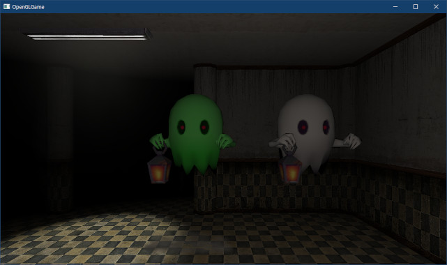

[OpenGL 3D 2023 後期 第01回]

# エンジンの基本機能を強化する

## 習得目標

* 
* 
* 
* 

## 1. 固有マテリアル、共有頂点、圧縮TGAファイル

### 1.1 ゲームオブジェクトに「固有マテリアル」を追加する

スタティックメッシュには「マテリアル(素材)」が設定されています。これは「共有マテリアル」になっています(Unityでいうところの`sharedMaterial`に相当します)。

2つのゲームオブジェクトAとBにスタティックメッシュを設定したとします。このとき、Aがマテリアルの`baseColor`を「赤」に変更すると、Bの色も「赤」に変わります。同様に、Bがマテリアルのテクスチャを変更すると、Aのテクスチャも変更されます。

このように、共有マテリアルでは「あるゲームオブジェクトがマテリアルを変更すると、同じマテリアルを参照している全てのゲームオブジェクトが影響を受ける」ことになります。

ところが、マテリアルを変更したい場面というのは、例えば「ダメージを受けたときに色を変える」とか「敵の強さによって異なるテクスチャを貼る」などのように、ゲームオブジェクト単位で設定したいことのほうが多いものです。

しかし、「共有マテリアル」ではゲームオブジェクト単位に値を変更するのは不可能です。そこで、ゲームオブジェクトごとに固有のマテリアルを持たせることにします。

まず、マテリアル配列を扱いやすくするために別名を定義します。 `Mesh.h`を開き、`Material`構造体の定義の下に、次のプログラムを追加してください。

```diff
   TexturePtr texEmission;          // 発光色テクスチャ
 };
 using MaterialPtr = std::shared_ptr<Material>;
+using MaterialList = std::vector<MaterialPtr>; // マテリアル配列型

 /**
 * スタティックメッシュ
```

次に、マテリアル配列をコピーする関数を追加します。関数名は`CloneMaterialList`(クローン・マテリアル・リスト、「マテリアルリストを複製する」という意味)とします。

`StaticMesh`構造体の定義をを次のように変更し、定義の下に`CloeMaterialList`関数の定義を追加してください。

```diff
 struct StaticMesh
 {
   std::string name;    // メッシュ名
   std::vector<DrawParams> drawParamsList; // 描画パラメータ
-  std::vector<MaterialPtr> materials; // マテリアル
+  MaterialList materials; // 共有マテリアル配列
 };
 using StaticMeshPtr = std::shared_ptr<StaticMesh>;
 void Draw(const StaticMesh& mesh, GLuint program = 0);
+
+// 共有マテリアル配列を複製する
+inline MaterialList CloneMaterialList(const StaticMeshPtr& original)
+{
+  MaterialList clone(original->materials.size());
+  for (int i = 0; i < clone.size(); ++i) {
+    clone[i] = std::make_shared<Material>(*original->materials[i]);
+  }
+  return clone;
+}

 /**
 * 頂点データを管理するクラス
```

>**【別名を定義したら別名を使うこと】**<br>
>`std::vector<MaterialPtr>`を`MaterialPtr`に変更するのは、プログラムの一貫性を維持するためです。ある部分では元の定義を使い、ある部分では別名を使うというのは、あとでプログラムを見る人(未来の自分かもしれません)に不要な疑問を抱かせます(「多くの場所で`MaterialList`を使っているのに、なぜ何箇所かは`std::vector<MaetrialList>`を使っているのだろう？ 変更を忘れただけ？ それとも、何か意味があって別名を使っていない？」)。

続いて、`GameObject`クラスに固有のマテリアル配列を追加します。`GameObject.h`を開き、次の先行宣言を追加してください。

```diff
 using GameObjectList = std::vector<GameObjectPtr>; // ゲームオブジェクトポインタの配列
 struct StaticMesh;
 using StaticMeshPtr = std::shared_ptr<StaticMesh>; // スタティックメッシュのポインタ
+struct Material;
+using MaterialPtr = std::shared_ptr<Material>; // マテリアルのポインタ
+using MaterialList = std::vector<MaterialPtr>; // マテリアル配列

 /**
 * 描画の順序
```

>**【ヘッダファイルをインクルードする代わりに先行宣言を使う理由】**<br>
>先行宣言を使う利点は「ビルド時間が減る」、「相互参照を回避できる」の2つです。<br>
>「ビルド時間が減る」理由は、先行宣言を使うとヘッダファイルをインクルードしなくて済むため、ヘッダファイルが変更されても再ビルドが発生しないからです。<br>
>相互参照とは、「`A.h`が`B.h`をインクルードし、`B.h`がインクルードしている」状態を指します。こうなると無限にインクルードしあってビルドが成立しません。<br>
>相互参照が起きるのは、「`A.h`にあるクラス`A`が`B.h`にあるクラス`B`を必要としていて、クラス`B`もまたクラス`A`を必要としている」場合です。このような場合に先行宣言を使うと、ヘッダファイルをインクルードしなくてもクラスを参照できるため、相互参照を避けられます。

次に、`staticMesh`メンバ変数の定義の下に、次のプログラムを追加してください。

```diff
   vec3 scale     = { 1, 1, 1 };    // 物体の拡大率
   float color[4] = { 1, 1, 1, 1 }; // 物体の色
   StaticMeshPtr staticMesh;        // 表示するスタティックメッシュ
+  MaterialList materials;          // ゲームオブジェクト固有のマテリアル配列
   TexturePtr texColor;             // 表示に使うカラーテクスチャ
   int meshId = -1;                 // 表示する図形の番号
```

### 1.2 共有マテリアルと固有マテリアルを使い分ける

ゲームオブジェクトに「固有マテリアル」を追加したことで、描画するときに共有マテリアルを使うのか、固有マテリアルを使うのかを選択できる必要が生じました。

そこで、`Draw`関数の引数にマテリアルリストを追加します。`Mesh.h`を開き、スタティックメッシュ用の`Draw`関数の宣言を次のように変更してください。

```diff
   MaterialList materials; // 共有マテリアル
 };
 using StaticMeshPtr = std::shared_ptr<StaticMesh>;
-void Draw(const StaticMesh& mesh, GLuint program = 0);
+void Draw(const StaticMesh& mesh, GLuint program, const MaterialList& materials);

 // マテリアル配列を複製する
 inline MaterialList CloneMaterials(const StaticMeshPtr& original)
```

次に`Mesh.cpp`を開き、`Draw`関数の定義を次のように変更してください。

```diff
 /**
 * メッシュを描画する
 */
-void Draw(const StaticMesh& mesh, GLuint program)
+void Draw(const StaticMesh& mesh, GLuint program, const MaterialList& materials)
 {
   // カラーパラメータを取得
   vec4 objectColor;
   if (program) {
     glGetUniformfv(program, 100, &objectColor.x);
   }

   for (const auto& e : mesh.drawParamsList) {
     // マテリアルを設定
-    if (e.materialNo >= 0 && e.materialNo < mesh.materials.size()) {
-      const Material& material = *mesh.materials[e.materialNo];
+    if (e.materialNo >= 0 && e.materialNo < materials.size()) {
+      const Material& material = *materials[e.materialNo];
       if (program) {
         const vec4 color = objectColor * material.baseColor;
```

続いて`Draw`関数を呼び出しているプログラムを修正します。`Engine.cpp`を開き、`DrawGameObjects`メンバ関数の定義を次のように変更してください。

```diff
     // 図形を描画
     if (e->staticMesh) {
-      Draw(*e->staticMesh, prog);
+      if (e->materials.empty()) {
+        Draw(*e->staticMesh, prog, e->staticMesh->materials);
+      } else {
+        Draw(*e->staticMesh, prog, e->materials);
+      }
     } else {
       const DrawParams& params = meshBuffer->GetDrawParams(e->meshId);
```

これで、固有マテリアルが「ない」場合は、共有マテリアルを使って描画し、固有マテリアルが「ある」場合は固有マテリアルを使って描画されます。

### 1.3 固有マテリアルを設定する

それでは、固有マテリアルの動作を確認してみましょう。ゴーストのモデルは「本体マテリアル」と「ランタンマテリアル」の2つに別れているので、片方だけを変えてみよう思います。

`MainGameScene.cpp`を開き、`Initialize`メンバ関数にあるゴーストを表示するプログラムの下に、次のプログラムを追加してください。

```diff
   ghost->position = startPoint + vec3{ -2, 0, 2 };
   ghost->rotation.y = 1.57f;
   ghost->staticMesh = engine.GetStaticMesh("Res/MeshData/ghost/ghost.obj");
+
+  // 固有マテリアルの動作テスト用ゲームオブジェクト
+  auto ghost2 = engine.Create<GameObject>("ghost");
+  ghost2->position = startPoint + vec3{ -1, 0, 2 };
+  ghost2->rotation.y = 1.57f;
+  ghost2->staticMesh = engine.GetStaticMesh("Res/MeshData/ghost/ghost.obj");
+
+  // 共有マテリアルをコピーして固有マテリアルを作る
+  ghost2->materials = CloneMaterialList(ghost2->staticMesh);
+  ghost2->materials[0]->baseColor = { 0.1f, 1, 0.05f, 1 };

   return true; // 初期化成功
 }
```

プログラムが書けたらビルドして実行してください。白(共有マテリアル)と緑(固有マテリアル)の2体のゴーストが表示されたら成功です。

<p align="center">
<br>
</p>

<pre class="tnmai_assignment">
<strong>【課題01】</strong>
マテリアルのベースカラーを変更すると、目の色まで変化してしまいます。そこで、眼以外の色を変えたテクスチャを使います。
以下のURLから<code>ghost_green.png</code>をダウンロードしてTGAファイルに変換し、プロジェクトの<code>Res/MeshData/ghost</code>フォルダに保存しなさい。

<code>github.com/tn-mai/OpenGL3D2023/tree/main/res/meshdata/ghost</code>

ダウンロードしたテクスチャを<code>ghost2</code>の<code>texBaseColor</code>に設定して表示しなさい。
</pre>

### 1.4 LoadOBJ関数が生成する頂点データを最適化する

OBJファイルの仕様から、2つの`f`構文に含まれるインデックスが全て一致する場合、その2つの`f`構文は同じ頂点データを参照していると考えられます。

しかし、現在の`LoadOBJ`関数では頂点データを共有する処理を入れていないため、`f`構文ごとに1つの頂点データが作られます。これは、同一の頂点データが何個も作られていることを意味します。

共有可能な頂点を共有しないことは、描画性能を大きく低下させる原因になります。そこで、頂点データが共有されるようにプログラムを改良することにします。アルゴリズムは次のようになります。

>1. `f`構文と頂点インデックスの「対応表」を準備。
>2. `f`構文をひとつずつ読み取り、「対応表」v,vt,vnのインデックスが全て一致するデータを検索する。
>3. 「対応表」に一致するデータがに含まれていたら、対応表にあるOpenGL頂点インデックスをインデックス配列に追加する。
>4. 一致するデータが含まれていなかったら、新しい頂点データを作成して頂点データ配列に追加する。そして、対応表に「`f`構文のインデックスと、作成した頂点データのインデックスのペア」を追加する。

このアルゴリズムで使う「対応表」は、`f`構文を添字、頂点インデックスを値」とする配列になります。

ところで、対応表を素直に作ろうとすると、`f`構文の値を添え字にして、頂点インデックスを値として記録すればよいように思えます。

`f`構文は`IndexSet`構造体に記録され、`v`, `vn`, `vt`のそれぞれが`int`型で保持されます。組み合わせの総数は「20億×20億×20億」という膨大な数になります。

とはいえ、実際に`f`構文がそれらのあらゆる組み合わせを利用する、ということはほとんどありません。利用される組み合わせの数はかなり少なくなるでしょう。

そのため、仮に「20億×20億×20億」を格納できる配列を用意できたとしても、実際に利用される要素数はその100兆分の1に過ぎないということが起こります。これはかなり非効率です。

このような「長さに対して有効な要素数が非常に少ない配列」は「<ruby>疎<rt>そ</rt></ruby>な配列(スパース・アレイ)」と呼ばれます。C++で「疎な配列」を扱うには`unordered_map`クラスを使います。

それから、仮に20億のデータを持つOBJファイルがあったとしても、2023年時点の最新GPUでもこれほど大量のデータを扱うのは難しく、到底ゲームには使えません。実際に利用するOBJファイルは自分で選択できるのですから、もう少し現実的な制限を設けるべきでしょう。

そこで、`int`型の32bitのうち下位20bitだけを扱うことにします。20bitはおよそ100万まで扱えるため、少なくともゲームに使う3Dモデルにとっては十分です。

「20bit×3=60bit」なので、連想配列のキーには`uint64_t`型を使います。また、連想配列の値は頂点インデックスなので`uint16_t`型を使います。それでは、`Mesh.cpp`を開き、`LoadOBJ`メンバ関数の定義に次のプログラムを追加してください。

```diff
   // 末尾に番兵を追加
   usemtls.push_back({ std::string(), faceIndexSet.size() });
+
+  // OBJファイルのf構文とOpenGLの頂点インデックス配列の対応表
+  std::unordered_map<uint64_t, uint16_t> indexMap;
+  indexMap.reserve(10'000);

   // 読み込んだデータを、OpenGLで使えるデータに変換
   std::vector<Vertex> vertices;
```

`f`構文のインデックスと頂点インデックスの対応表なので、変数名は`indexMap`(インデックス・マップ)としました。

次に、「読み込んだデータをOpenGLで使えるデータに変換」するプログラムに、対応表を使って頂点データを共有するプログラムを追加してください。

```diff
   // 読み込んだデータを、OpenGLで使えるデータに変換
   std::vector<Vertex> vertices;
   vertices.reserve(faceIndexSet.size());
+  std::vector<uint16_t> indices;
+  indices.reserve(faceIndexSet.size());
   for (int i = 0; i < faceIndexSet.size(); ++i) {
     const IndexSet& e = faceIndexSet[i];
+
+    // f構文の値を64ビットの「キー」に変換
+    const uint64_t key = static_cast<uint64_t>(e.v) +
+      (static_cast<uint64_t>(e.vt) << 20) + (static_cast<uint64_t>(e.vn) << 40);
+
+    // 対応表からキーに一致するデータを検索
+    const auto itr = indexMap.find(key);
+    if (itr != indexMap.end()) {
+      // 対応表にあるので既存の頂点インデックスを使う
+      indices.push_back(itr->second);
+    } else {
+      // 対応表にないので新しい頂点データを作成し、頂点配列に追加
       Vertex v;
       v.position = positions[e.v - 1];
       v.texcoord = texcoords[e.vt - 1];
       // 法線がない場合は0を設定(あとで計算)
       if (e.vn == 0) {
         v.normal = { 0, 0, 0 };
       } else {
         v.normal = normals[e.vn - 1];
       }
       vertices.push_back(v);
+
+      // 新しい頂点データのインデックスを、頂点インデックス配列に追加
+      const uint16_t index = static_cast<uint16_t>(vertices.size() - 1);
+      indices.push_back(index);
+
+      // キーと頂点インデックスのペアを対応表に追加
+      indexMap.emplace(key, index);
+    }
   }
-  std::vector<uint16_t> indices(faceIndexSet.size());
-  for (int i = 0; i < indices.size(); ++i) {
-    indices[i] = i;
-  }

   // 設定されていない法線を補う
   FillMissingNormals(vertices.data(), vertices.size(),
```

プログラムが書けたらビルドして実行してください。見た目には何も変わらないはずです(もし表示がおかしい場合はプログラムを見直してください)。

しかし、Visual Studioの「出力ログ」を確認すると、以前はインデックス数と等しかった頂点数が、1/3～1/5にまで減っていることが分かります。

頂点シェーダの処理時間が1/3～1/5になったことで、フラグメントシェーダの描画に使える時間が増え、FPSが向上します。

>```txt
>[情報] LoadMTL: Res/MeshData/ghost/ghost.mtlを読み込みました
>[情報] LoadOBJ: Res/MeshData/ghost/ghost.objを読み込みました(頂点数=640, インデックス数=2568)
>[情報] LoadMTL: Res/MeshData/door/door.mtlを読み込みました
>[情報] LoadOBJ: Res/MeshData/door/door.objを読み込みました(頂点数=278, インデックス数=756)
>[情報] LoadMTL: Res/MeshData/door/arch.mtlを読み込みました
>[情報] LoadOBJ: Res/MeshData/door/arch.objを読み込みました(頂点数=72, インデックス数=168)
>```

### 1.5 GameObjectのcolorメンバ関数をベクトル型にする

現在、`GameObject`の`color`メンバ変数は「`float`型の配列」として定義しています。しかし、GLSLコードを見れば分かるように、3Dグラフィックスでは「色」をベクトル型として扱います。そこで、`color`メンバ変数もベクトル型に変更しようと思います。

`GameObject.h`を開き、`color`メンバ変数の定義を次のように変更してください。

```diff
   vec3 position  = { 0, 0, 0 };    // 物体の位置
   vec3 rotation  = { 0, 0, 0 };    // 物体の回転角度
   vec3 scale     = { 1, 1, 1 };    // 物体の拡大率
-  float color[4] = { 1, 1, 1, 1 }; // 物体の色
+  vec4 color = { 1, 1, 1, 1 };     // 物体の色
   StaticMeshPtr staticMesh;        // 表示するスタティックメッシュ
   MaterialList materials;          // スタティックメッシュ用のマテリアル配列
```

問題は、既存のプログラムが「`color`メンバ変数は配列」という前提で書かれていることです。ですから、`float[4]`を`vec4`で置き換えるとエラーが発生します。そこで、配列とベクトル型の違いに対応しなくてはなりません。

配列とベクトル型の違いは以下の2点です。

>1. 配列は変数名を「配列の先頭アドレス」として使える。ベクトル型で同じことをするには、`&v.x`のように先頭要素のアドレスで置き換えなくてはならない。
>2. 配列の各要素にアクセスするには添字演算子を使う。ベクトル型ではメンバ名を使う。

この2つの違いのうち、1についてはプログラムを修正する以外に方法はありません。

`Engine.cpp`を開き、`DrawGameObject`メンバ関数の定義にある「ユニフォーム変数にデータをコピー」するプログラムを、次のように変更してください。

```diff
     if (!e->staticMesh) {
       continue;
     }

     // ユニフォーム変数にデータをコピー
-    glProgramUniform4fv(prog, 100, 1, e->color);
+    glProgramUniform4fv(prog, 100, 1, &e->color.x);
     glProgramUniform3fv(prog, 0, 1, &e->scale.x);
     glProgramUniform3fv(prog, 1, 1, &e->position.x);
```

`color`メンバ変数が配列ではなくなったので、代わりにベクトル型の`x`要素のアドレスを使うように変更します。

同じことを他のすべての箇所で行います。次は`UIButton.cpp`を開き、`Update`メンバ関数の定義を次のように変更してください。

```diff
   // ボタンの有効・無効判定
   if (!interactable) {
-    std::copy_n(&normalColor.x, 3, owner->color);
+    std::copy_n(&normalColor.x, 3, &owner->color.x);
     owner->color[3] = 0.75f; // 無効ぽさを出すため少し透明にする
     return;
   }

   const vec2 mouse = engine->GetMousePosition();
   if (abs(mouse.x - basePosition.x) < owner->scale.x &&
     abs(mouse.y - basePosition.y) < owner->scale.y) {
     // カーソルがボタン領域内にある
     const bool buttonDown = engine->GetMouseButton(GLFW_MOUSE_BUTTON_LEFT);
     if (buttonDown) {
       // 左ボタンが押されている
-      std::copy_n(&pressedColor.x, 3, owner->color);
+      std::copy_n(&pressedColor.x, 3, &owner->color.x);
     } else {
       // 左ボタンが離されている
-      std::copy_n(&highlightedColor.x, 3, owner->color);
+      std::copy_n(&highlightedColor.x, 3, &owner->color.x);
       // ボタンクリック判定
       if (prevButtonDown) {
         // デリゲートを実行
         for (auto& e : onClick) {
           e(this);
         }
       }
     } // if buttonDown
 
     // マウスボタンの状態を更新
     prevButtonDown = buttonDown;
   } else {
     // カーソルがボタン領域外にある
-    std::copy_n(&normalColor.x, 3, owner->color);
+    std::copy_n(&normalColor.x, 3, &owner->color.x);
     prevButtonDown = false;
   }
```

次に`TitleScene.cpp`を開き、`Initialize`メンバ関数の定義を次のように変更してください。

```diff
   const vec2 fbSize = engine.GetFramebufferSize();
   fadeObject->scale = {fbSize.x / fbSize.y, 1, 1};
   // カラーを「黒、透明」に設定
-  std::fill_n(fadeObject->color, 4, 0.0f);
+  std::fill_n(&fadeObject->color.x, 4, 0.0f);

   // BGMを再生
```

次に`GoalEvent.cpp`を開き、`OnCollision`メンバ関数の定義を次のように変更してください。

```diff
   fadeObject = fade.first;
   const vec2 fbSize = engine->GetFramebufferSize();
   fadeObject->scale = {fbSize.x / fbSize.y, 1, 1};
-  std::fill_n(fadeObject->color, 4, 0.0f);
+  std::fill_n(&fadeObject->color.x, 4, 0.0f);
 }
```

これで、テキストで作成したプログラムについては置き換えが終わりました。

### 1.5 添字(そえじ)演算子のオーバーロード

続いて、2の「配列の各要素にアクセスするには添字演算子を使う。ベクトル型ではメンバ名を使う」という違いに対応していきます。

これは「添字演算子をオーバーロードする」ことで解決できます。`VecMath.h`を開き、`vec4`型の定義を次のように変更してください。

```diff
struct vec2 { float x, y; };
struct vec3 { float x, y, z; };
-struct vec4 { float x, y, z, w; };
+
+struct vec4
+{
+  float x, y, z, w;
+
+  float operator[](size_t i) const { return *(&x + i); }
+  float& operator[](size_t i) { return *(&x + i); }
+};

 // vec2の単項-演算子
 inline vec2 operator-(const vec2& a) { return { -a.x, -a.y }; }
```

添字演算子には`const`(コンスト)版と`非const`(ひ・コンスト)版の2種類を定義する必要があります。この2つは次のように呼び分けられます。

>ほとんどのメンバ演算子は`非const`として定義する必要があるため、そもそも`const`版を定義できません。

```c++
vec4 a(0);           // 非const変数
vec4& ra = a;        // Ok. 非const変数を非constで参照
const vec4& cra = a; // Ok. 非const変数をconstで参照

float x;

x = a[0];   // Ok. 非const版が呼ばれる
x = ra[0];  // Ok. 非const版が呼ばれる
x = cra[0]; // Ok. const版が呼ばれる
a[0] = 1;   // Ok. 非const版が呼ばれる
ra[0] = 1;  // Ok. 非const版が呼ばれる
cra[0] = 1; // エラー! const版が呼ばれるため代入できない

const vec4 b(0);     // const変数
vec4& rb = b;        // エラー! const変数は非constで参照できない
const vec4& crb = b; // Ok. const変数をconstで参照

x = b[0];   // Ok. const版が呼ばれる
x = crb[0]; // Ok. const版が呼ばれる

b[0] = 1;   // エラー! const版が呼ばれるため代入できない
crb[0] = 1; // エラー! const版が呼ばれるため代入できない
```

このように、`const`が付いた変数や参照の場合は`const`版の添字演算子が呼び出され、
`const`が付かない場合のみ`非const`版が呼び出されます。

>`非const`版の添字演算子をオーバーロードしない場合、上記のすべての場合で`const`版が呼び出されます。

<pre class="tnmai_assignment">
<strong>【課題02】</strong>
<code>vec2</code>型と<code>vec3</code>型に「添字演算子」を定義しなさい。
</pre>

課題02が完了したらビルドしてください。エラーが発生していなければ成功です。

### 1.6 ベクトル型にコンストラクタを追加する

例えば、`vec4`型から`vec3`型を作成したり、逆に`vec3`型から`vec4`型を作成できると、値をコピーするプログラムが書きやすくなって便利です。これらの機能は、関数またはコンストラクタとして作成できます。

簡単なのは「関数として作成する」方法です。しかし、今回は多少面倒ですが「コンストラクタとして作成する」ことにします。理由は、C++とGLSLのベクトル型で、できるだけ同じ構文で書けるようにするためです。

C++とGLSLで機能の実現方法が異なると、覚えることが増えますし、いつどちらを使うべきかを常に考えなくてはなりません。そのため、作成が多少面倒でも、使うときに考えることが少なくなるコンストラクタのほうが良いと考えました。

それでは、`vec4`から`vec3`を作成するコンストラクタを作成しましょう。まず先行宣言を追加します。`VecMath.h`を開き、次のプログラムを追加してください。

```diff
 #ifndef VECMATH_H_INCLUDED
 #define VECMATH_H_INCLUDED
 #include <cmath>
+
+// 先行宣言
+struct vec2;
+struct vec3;
+struct vec4;

 // 円周率
 constexpr float pi = 3.14159265f;
```

次に、`vec3`型の定義に次のコンストラクタ宣言を追加してください。

```diff
 struct vec3
 {
   float x, y, z;
+
+  vec3() = default;
+  explicit constexpr vec3(const vec4&);

   float operator[](size_t i) const { return *(&x + i); }
   float& operator[](size_t i) { return *(&x + i); }
```

コンストラクタをひとつでも明示的に定義すると、コンパイラが暗黙に定義しているデフォルトコンストラクタが定義されなくなります。これは意図しないコンストラクタ呼び出しが起きないようにするためです。

そのため、他に必要なコンストラクタがあれば、それらも明示的に定義しなくてはなりません。そこで、何もしないコンストラクタを`default`指定で定義しています。

`explicit`(エクスプリシット)キーワードは「明示的な型変換を要求する」ものです。異なる型を受け取るコンストラクタが定義されていると、コンパイラは可能な状況であれば自動的に適用しようとします。つまり、以下のように書けます。

>`vec4 a;`<br>
>`vec3 b = a;`

ただ、この変換では`v4.w`が失われてしまいます。意図的に`w`をなくしたい場合はいいのですが、`vec4`と書くべきところを誤って`vec3`と書いてしまった場合には問題となります。

`explicit`を付けると次のように書く必要が生じます。

>`vec4 a;`<br>
>`vec3 b = vec3(a);`

些細な違いですが、間違えたのではなく、意図的に`w`要素を無くしているということを明示できています。

`constexpr`(コンスト・エクスプル)キーワードを関数に指定すると、その関数は「コンパイル時に実行可能な」関数として扱われます。言い換えると「コンパイル時定数を作るために使える関数」になります。

多くの関数はコンパイル時に確定しないさまざまな状態を扱うため、`constexpr`を指定しても無意味です。しかし、ベクトル型のような基本的な型では`constexpr`を指定してコンパイル時定数を作れるようにしておくと役立ちます。

なお、この時点では宣言だけで定義はしません。というのは、この行の時点では`vec4`型はまだ定義されていないので、内容を読み取れないからです。そこで、このコンストラクタの定義は`vec4`型の定義より下に書きます。

`vec4`型の定義の下に、次のプログラムを追加してください。

```diff
   float operator[](size_t i) const { return *(&x + i); }
   float& operator[](size_t i) { return *(&x + i); }
 };
+
+constexpr vec3::vec3(const vec4& v) : x(v.x), y(v.y), z(v.z) {}

 // vec2の単項-演算子
 inline vec2 operator-(const vec2& a) { return { -a.x, -a.y }; }
```

このように、まだ定義されていない型を引数にするには、必要な型を先行宣言したうえで宣言と定義を分けて書きます。

>`constexpr`関数は暗黙的に`inline`宣言されるため、`inline`キーワードを書く必要はありません。明示的に書いてもエラーにはなりません。

さて、コンストラクタを定義したことで、これまで出来ていたのに出来なくなったことがあります。それは、`vec3 v = { 0, 1, 2 };`のような「波括弧による初期化」です。

とはいえ、これはコンストラクタを追加で定義するだけで復活できます。ついでなので、GLSLで使える他のコンストラクタもまとめて定義しましょう。`vec3`型の定義に次のプログラムを追加してください。

```diff
   float x, y, z;

   vec3() = default;
   explicit constexpr vec3(const vec4&);
+  explicit constexpr vec3(float n) : x(n), y(n), z(n) {}
+  constexpr vec3(float x, float y, float z) : x(x), y(y), z(z) {}
+  constexpr vec3(const vec2& v, float z) : x(v.x), y(v.y), z(z) {}

   float operator[](size_t i) const { return *(&x + i); }
   float& operator[](size_t i) { return *(&x + i); }
```

追加したコンストラクタは以下の3つです。

>* 1つの`float`型の値を受け取り、全てのメンバにコピーするコンストラクタ。
>* 3つの`float`型の値を受け取り、対応するメンバにコピーするコンストラクタ。`vec3 v = { 0, 1, 2 };`と書けるようになる。
>* 1つの`vec2`型と1つの`float`型の値を受け取り、対応するメンバにコピーするコンストラクタ。

複数の引数を受け取るコンストラクタは「暗黙の型変換」の対象にならないため、`explciit`を付ける意味がないことに注意してください。

<pre class="tnmai_assignment">
<strong>【課題03】</strong>
<code>vec3</code>型に追加したコンストラクタを参考にして、<code>vec2</code>型と<code>vec4</code>型にコンストラクタを追加しなさい。

<code>vec2</code>型:
- 1つの<code>float</code>型の値を受け取り、全てのメンバにコピーするコンストラクタ。
- 2つの<code>float</code>型の値を受け取り、対応するメンバにコピーするコンストラクタ。
- <code>vec3</code>型から<code>vec2</code>型に変換するコンストラクタ。
- <code>vec4</code>型から<code>vec2</code>型に変換するコンストラクタ。

<code>vec4</code>型:
- 1つの<code>float</code>型の値を受け取り、全てのメンバにコピーするコンストラクタ。
- 4つの<code>float</code>型の値を受け取り、対応するメンバにコピーするコンストラクタ。
- 1つの<code>vec2</code>型と2つの<code>float</code>型の値を受け取り、対応するメンバにコピーするコンストラクタ。
- 1つの<code>vec3</code>型と1つの<code>float</code>型の値を受け取り、対応するメンバにコピーするコンストラクタ。
</pre>

>**【1章のまとめ】**
>
>* 
>* 
>* 

<div style="page-break-after: always"></div>

## 2. 読み込めるTGAファイルの種類を増やす

### 2.1 圧縮TGAファイルを読み込めるようにする

現在のプログラムでは、読み込めるTGAファイルは「32bit無圧縮」形式に限られていますが、TGAファイル自体が扱えるデータ形式は他にもあります。

例えばアルファが不要な画像に24ビット形式が使えると、ファイルサイズが小さくなるため読込み時間を短縮できます。圧縮形式では更にファイルサイズが小さくなり、それに伴って読み込み時間も短くなります。

また、ファイルサイズが小さいと、ゲームのバックアップや配布用のコピーを作るときに必要な「時間」と「ディスク容量」も減らせます。

>TGAファイル形式について、詳しくは以下のURLを参照してください。<br>
>`http://www.paulbourke.net/dataformats/tga/`

とはいえ、TGAが対応している形式は大量にあるので、あらゆる形式に対応するのは大変です。そこで、「圧縮形式」と「8, 15, 16, 24ビットのトゥルーカラー形式」に絞って対応させることにします。

まず、TGAヘッダからいくつかの情報を取り出しておきます。`Texture.cpp`を開き、`Texture`コンストラクタの定義にある「ヘッダから情報を取得」するプログラムに、次のプログラムを追加してください。

```diff
   // ヘッダから情報を取得
   const size_t tgaHeaderSize = 18; // ヘッダ情報のバイト数
+  const int imageOffset = tgaHeaderSize + buffer[0]; // 画像データの位置
+  const uint8_t imageType = buffer[2];               // 画像形式
+  const int pixelBytes = (buffer[16] + 7) / 8;       // 1ピクセルのバイト数
   width = buffer[12] + buffer[13] * 256;
   height = buffer[14] + buffer[15] * 256;
```

TGAの圧縮形式には「ランレングス・エンコーディング(Run Length Encoding, RLE)」が採用されています。ランレングスエンコーディングは、データ中にある連続する同じ値を「連続する個数+値」で置き換える方法です。

>RLEは最も単純な圧縮形式のひとつです。仕組みが単純なので、性能の低いコンピューターでも扱えるのが利点です。ただし、圧縮性能はあまり高くないため、現代ではより高度な圧縮形式と併用されます。

残念なことに、GPUは「ランレングス・エンコーディング(長いので以降は略称のRLEを使います)」に対応していません。そのため、手動で圧縮を解除してからGPUメモリにコピーしなくてはなりません。

TGAのRLEでは、圧縮データを「ヘッダ」と「データ」の組として表します。この組のことを`packet`(パケット)といいます。

ヘッダは1バイトで、次の表のように、最上位の1ビットが「パケットID」、残りの7ビットが「データ数」となっています。

| bit  |     7      | 6 5 4 3 2 1 0 |
|:----:|:----------:|:-------------:|
| 機能 | パケットID | データ数 - 1  |

パケットIDが`0`の場合は「無圧縮パケット」です。無圧縮パケットでは、ヘッダの直後に「データ数」個のピクセルデータが続きます。データを展開するときはこのデータをそのまま使います。

>ヘッダ ピクセル0 ピクセル1 ピクセル2 ...

パケットIDが`1`の場合は「圧縮パケット」になります。圧縮パケットでは、ヘッダの直後に1ピクセル分のデータだけが続きます。データを展開するときはこの1ピクセルを「データ数 + 1」個複製します。

>ヘッダ ピクセル

説明はこれくらいにして、実際にプログラムを書いていきましょう。まず、「画像形式」を調べて画像が圧縮形式かどうかを判定します。「ヘッダから情報を取得」するプログラムの下に、次のプログラムを追加してください。

```diff
   const int pixelBytes = (buffer[16] + 7) / 8;       // 1ピクセルのバイト数
   width = buffer[12] + buffer[13] * 256;
   height = buffer[14] + buffer[15] * 256;
+
+  // 圧縮形式の場合は展開する
+  //  0(0b0000): 画像なし
+  //  1(0b0001): インデックス(無圧縮)
+  //  2(0b0010): トゥルーカラー(無圧縮)
+  //  3(0b0011): 白黒(無圧縮)
+  //  9(0b1001): インデックス(RLE)
+  // 10(0b1010): トゥルーカラー(RLE)
+  // 11(0b1011): 白黒(RLE)
+  if (imageType & 0b1000) {
+  }

   // 格納方向が「上から下」の場合、データを上下反転
   const bool topToBottom = buffer[17] & 0b0010'0000;
```

画像形式の数値を見ると、第3ビットが`1`の場合はRLE形式になっていることが分かります。そのため、圧縮形式かどうかは`&`(ビット論理積)演算子によって判定できます。

次に、圧縮データの展開先となるバッファ(メモリ領域)を作成します。`buffer`配列に直接展開すると圧縮データを壊してしまうからです。圧縮形式を判定する`if`の内側に、次のプログラムを追加してください。

```diff
   // 10(0b1010): トゥルーカラー(RLE)
   // 11(0b1011): 白黒(RLE)
   if (imageType & 0b1000) {
+    // 展開用のバッファを用意
+    const int imageBytes = width * height * pixelBytes; // 展開後のバイト数
+    std::vector<uint8_t> tmp(imageOffset + imageBytes);
+
+    // swapに備えて、画像データより前の部分をコピー
+    std::copy_n(buffer.begin(), imageOffset, tmp.begin());
   }

   // 格納方向が「上から下」の場合、データを上下反転
```

バッファは一時的に作成するものなので`tmp`(テンプ, `temporary`(テンポラリ)の短縮形)という名前にしました。

バッファサイズを「画像データの位置+展開後のバイト数」としているのは、データ展開後に`swap`関数によって`tmp`と`buffer`を入れ替えるためです。

以後の処理でもTGAヘッダを参照するため、`tmp`に`buffer`のTGAヘッダをコピーすることで、ポインタが交換されても正しく処理が進むようにしています。

>`swap`関数による`vector`型同士のデータ交換は、`vector`が内部で保持している「データへのポインタ」を交換するだけなので非常に高速です。

続いて、パケットIDに応じて「圧縮データを展開」するか、「生データをコピー」するかを選択するプログラムを追加します。画像データより前の部分をコピーするプログラムの下に、次のプログラムを追加してください。

```diff
     // swapに備えて、画像データより前の部分をコピー
     std::copy_n(buffer.begin(), imageOffset, tmp.begin());
+
+    // 画像データを展開
+    const uint8_t* src = buffer.data() + imageOffset; // 圧縮データのアドレス
+    uint8_t* dest = tmp.data() + imageOffset;         // データ展開先アドレス
+    const uint8_t* const destEnd = dest + imageBytes; // 展開終了アドレス
+
+    while (dest != destEnd) {
+      // パケットヘッダからIDとデータ数を取得
+      const int isRLE = *src & 0x80;
+      const int count = (*src & 0x7f) + 1;
+      ++src; // アドレスをパケットデータの位置に進める
+
+      if (isRLE) {
+        // 圧縮データの場合、パケットデータを指定回数コピー
+        for (int a = 0; a < count; ++a) {
+          memcpy(dest, src, pixelBytes);
+          dest += pixelBytes;
+        }
+        src += pixelBytes;
+      } else {
+        // 無圧縮データの場合、パケットデータ全体をコピー
+        const int dataBytes = pixelBytes * count;
+        memcpy(dest, src, dataBytes);
+        dest += dataBytes;
+        src += dataBytes;
+      }
+    } // while
   }

   // 格納方向が「上から下」の場合、データを上下反転
```

TGAファイルでは圧縮データの終端は明示されないので、画像データ全体が展開された時点で展開完了とみなしています。

最後に`tmp`と`buffer`を入れ替えます。`while`ループの下に次のプログラムを追加してください。

```diff
         src += dataBytes;
       }
     } // while
+
+    // bufferとtmpの内容を交換
+    buffer.swap(tmp);
   }

   // 格納方向が「上から下」の場合、データを上下反転
```

これで、圧縮TGAファイルを読み込めるようになりました。

### 2.2 32ビット以外のトゥルーカラー形式を読み込めるようにする

続いて、32ビット以外のトゥルーカラー形式、つまり8, 15, 16, 24ビットの各形式を読み込めるようにしましょう。基本的には、OpenGL関数に渡す引数を適切に選択するだけです。「データを上下反転」するプログラムの下に、次のプログラムを追加してください。

```diff
       bottom -= lineByteSize; // 下の行の位置を1行上に移動
     }
   } // if topToBottom
+
+  // 1ピクセルのビット数に対応する形式のセットを検索
+  struct Format
+  {
+    int pixelDepth;     // TGAの1ピクセルのビット数
+    GLenum imageFormat; // TGAのデータ形式
+    GLenum imageType;   // TGAのデータ型
+    GLenum gpuFormat;   // GPU側のデータ形式
+  };
+  constexpr Format formatList[] = {
+    { 32, GL_BGRA, GL_UNSIGNED_BYTE,              GL_RGBA8 },
+    { 24, GL_BGR,  GL_UNSIGNED_BYTE,              GL_RGB8 },
+    { 16, GL_BGRA, GL_UNSIGNED_SHORT_1_5_5_5_REV, GL_RGB5_A1 },
+    { 15, GL_BGR,  GL_UNSIGNED_SHORT_1_5_5_5_REV, GL_RGB5 },
+    {  8, GL_RED,  GL_UNSIGNED_BYTE,              GL_R8 },
+  };
+
+  const Format* format = std::find_if(formatList, std::end(formatList) - 1,
+    [pixelDepth = buffer[16]](const Format& e) { return e.pixelDepth == pixelDepth; });

   // テクスチャを作成
   GLuint object = 0; // テクスチャの管理番号
```

「あるパラメータによって、複数のパラメータが一意に決まる」場合、パラメータを配列として定義すると便利です。`if`や`switch`と比較して、配列のほうがパラメータの追加や削除が簡単で、そのうえプログラムも短くなるからです。

今回作成するプログラムでも、TGAファイルの「1ピクセルのビット数」によってOpenGL関数に渡す全てのパラメータが決まります。そのため、配列にパラメータをまとめることにしました。

>もちろん、パラメータが決まる条件がもっと複雑な場合は`if`や`switch`を使うべきです。

また、`find_if`に指定する「終了位置」を`-1`していることに注意してください。これにより、もし未対応のビット数のTGAファイルを読み込でしまった場合でも、`format`ポインタには`formatList`配列の最後の要素が設定されることを保証しています。

次に、`format`(フォーマット)変数の値を引数に渡すように、テクスチャ作成プログラムを書き換えます。テクスチャを作成するプログラムを次のように変更してください。

```diff
   // テクスチャを作成
   GLuint object = 0; // テクスチャの管理番号
   glCreateTextures(GL_TEXTURE_2D, 1, &object);
-  glTextureStorage2D(object, 1, GL_RGBA8, width, height);
+  glTextureStorage2D(object, 1, format->gpuFormat, width, height);
   glTextureSubImage2D(object, 0, 0, 0, width, height,
-    GL_BGRA, GL_UNSIGNED_BYTE, buffer.data() + tgaHeaderSize);
+    format->imageFormat, format->imageType, buffer.data() + tgaHeaderSize);
   id = object;
   name = filename;
```

これで、32, 24, 16, 15, 8ビットの5つの形式に対応できるようになりました。

### 2.3 白黒画像に対応する

実は、1.6節のプログラムだけでは白黒画像が赤黒で表示されてしまいます。なぜなら、`GL_RED`という「赤要素だけ」のデータ形式を指定しているからです。しかし、白黒画像として扱うには、緑要素と青要素にも赤要素と同じ値を反映する必要があります。

こんなときに便利なのが「スウィズル(Swizzle、「かきまぜる」という意味)」という機能です。この機能を使うと、シェーダでテクスチャを読み取る時の、データの順序を入れ替えることができます。

スウィズルを設定するには、`glTextureParameteri`(ジーエル・テクスチャ・パラメータ・アイ)関数を使います。

<p><code class="tnmai_code"><strong>【書式】</strong><br>
void glTextureParameteri(テクスチャの管理番号, 設定するパラメータ名, 設定する値);
</code></p>

>`glTextureParameteri`に指定できるパラメータの種類と値ついて、詳しくは以下のWebページを参照してください。<br>
>`registry.khronos.org/OpenGL-Refpages/gl4/html/glTexParameter.xhtml`

それでは、テクスチャを作成するプログラムの下に、次のプログラムを追加してください。

```diff
     format->imageFormat, format->imageType, buffer.data() + tgaHeaderSize);
   id = object;
   name = filename;
+
+  // グレースケールテクスチャの場合、赤成分を緑と青にコピーするように設定する
+  if (format->imageFormat == GL_RED) {
+    glTextureParameteri(object, GL_TEXTURE_SWIZZLE_R, GL_RED);
+    glTextureParameteri(object, GL_TEXTURE_SWIZZLE_G, GL_RED);
+    glTextureParameteri(object, GL_TEXTURE_SWIZZLE_B, GL_RED);
+  }
 }
```

これで、白黒画像が赤黒ではなく白黒で表示されるようになります。

>**【白黒画像を使うと分かっている場合はシェーダ側でスウィズリングする】**<br>
>シェーダのエフェクトなどで、常に白黒画像を使うと分かっている場合、シェーダのベクトル型が持つスウィズリング機能を使うほうが効率的です。

### 2.4 アラインメント

ここまでのプログラムで、カラー画像と白黒画像の両方を意図したとおりに扱えるようになりました。これで完成としたいところですが、実はまだ対応するべき問題が残っています。

OpenGLが画像データを読み取るときは、「データを4バイト単位で読み取る」という仕組みになっています。この読み取り単位のことを「アラインメント(Alignment, 整列)」といいます。

アラインメントが存在する理由は、メモリ・チップの設計上の制約から、連続したデータを一度に読み書きするほうが読み書き速度が向上するためです。

ところで、TGAファイルの画像データは「横一列のピクセルを記録したら次の列のピクセルを記録する」というようになっています。

32ビット形式の画像データの場合、1ピクセルは4バイトなので、横一列のデータ数は常にアラインメントで割り切れます。そのため、アラインメント単位でコピーを行ってもデータがずれることはありません。

ところが、8ビット形式や24ビット形式の場合、アラインメントで割り切れるのは横幅が4の倍数のときだけです。同様に、16ビット形式では横幅が2の倍数でなくては割り切れません。

横幅がアラインメントで割り切れない場合、コンピューターは次の行から不足するバイトを読み込んで、無理やり不足分を補います。この結果、次の行のデータが足りなくなり、これが繰り返されて最後にはデータ不足でエラーが発生します。

これは大変よろしくないので、なんとか対策しなくてはなりません。この問題の解決方法は2つあります。

>1. 横一列のピクセル数が4で割り切れない画像を使わない。
>2. アラインメントを変更する。

実際の開発では、たいてい1の方法を取ります。「アラインメントを変更すると、GPUメモリへのコピー速度が低下する」からです。また、横幅が奇数サイズの画像は、わずかですがGPUメモリを余分に必要とします。

しかし、今回は2のアラインメントを変更する方法を使います。インターネットからダウンロードできる3Dモデルを使おうとすると、テクスチャ画像の横幅が4の倍数であるとは保証できないからです。

画像をコピーするときのアラインメントを変更するには`glPixelStorei`(ジーエル・ピクセル・ストア・アイ)関数を使います。

<p><code class="tnmai_code"><strong>【書式】</strong><br>
void glPixelStorei(設定するパラメータ名, 設定する値);
</code></p>

この関数は「テクスチャ用メモリ領域の動作モード」を変更します。設定可能な動作モードは複数あり、「設定するパラメータ名」によって指定します。

「GPUメモリにコピーするときのアラインメント」のパラメータ名は`GL_UNPACK_ALIGNMENT`(ジーエル・アンパック・アラインメント)です。アラインメントとして設定できる値は1, 2, 4, 8だけで、それ以外の数値を設定しようとしても無視されます。

それから、コピーが終わったらアラインメントを元に戻さなくてはなりません。元に戻さないと、プログラムの別の場所でGPUメモリにデータを転送しようとしたとき、コピー速度が遅くなってしまう可能性があるからです。

後から「なんかデータの読み込みが遅い気がするなあ」と感じたとしても、実はその原因が「`Texture`コンストラクタでアラインメントを戻し忘れたから」だなんて、なかなか気づきませんよね。

さて、アラインメントを元に戻すためには、変更前のアラインメントを覚えておく必要があります。現在のアラインメントを取得するには`glGetIntergerv`(ジーエル・ゲット・インテジャー・ブイ)関数を使います。

<p><code class="tnmai_code"><strong>【書式】</strong><br>
void glGetintegerv(取得するパラメータ名, 値を格納する変数のアドレス);
</code></p>

それでは、GPUメモリにデータをコピーするプログラムの前後に、次のプログラムを追加してください。

```diff
   const Format* format = std::find_if(formatList, std::end(formatList) - 1,
     [pixelDepth = buffer[16]](const Format& e) { return e.pixelDepth == pixelDepth; });
+
+  // 現在のアラインメントを記録
+  GLint alignment;
+  glGetIntegerv(GL_UNPACK_ALIGNMENT, &alignment);
+
+  // 画像のアラインメントを決定
+  // 1行のバイト数が4で割り切れるときは4、2で割り切れるときは2、それ以外は1に設定
+  constexpr int alignmentList[] = { 4, 1, 2, 1 };
+  const int lineByteSize = width * pixelBytes; // 1行のバイト数
+  const int imageAlignment = alignmentList[lineByteSize % 4];
+
+  // アラインメントを変更
+  if (alignment != imageAlignment) {
+    glPixelStorei(GL_UNPACK_ALIGNMENT, imageAlignment);
+  }

   // テクスチャを作成
   GLuint object = 0; // テクスチャの管理番号
   glCreateTextures(GL_TEXTURE_2D, 1, &object);
   glTextureStorage2D(object, 1, format->gpuFormat, width, height);
   glTextureSubImage2D(object, 0, 0, 0, width, height,
     format->imageFormat, format->imageType, buffer.data() + tgaHeaderSize);
+
+  // アラインメントを元に戻す
+  if (alignment != imageAlignment) {
+    glPixelStorei(GL_UNPACK_ALIGNMENT, alignment);
+  }

  // グレースケールテクスチャの場合、赤成分を緑と青にコピーするように設定する
  if (format->imageFormat == GL_RED) {
```

これで、横方向のバイト数がどんな値になる画像でも正しく読み込めるようになりました。

>**【2章のまとめ】**
>
>* 
>* 
>* 

<div style="page-break-after: always"></div>

## 3. 描画システムをスタティックメッシュに統一する

### 3.1 描画パラメータからスタティックメッシュを作成する機能を追加する

現在のプログラムでは、3Dモデルを描画するための2つの方法が存在します。ひとつは`meshId`を使う方法で、もうひとつは`staticMesh`を使う方法です。

全く異なる複数の描画方法があると、シーンに3Dモデルを追加しようとするたびに、どの方法で描画するかを考えなくてはなりません。とはいえ、`meshId`を使った描画は「OpenGLの描画機能を説明するための簡易的なもの」に過ぎません。

そして、OBJファイルを読み込めるようになった今となっては、ほとんどの3Dモデルは`staticMesh`で描画することになります。つまり、`meshId`は役目を終えたわけです。

そこで、まず`plane_xy`などのヘッダファイルとして読み込んでいるモデルをスタティックメッシュに変換して、全てを`staticMesh`で描画できるようにします。その後、`meshId`を削除します。

ヘッダファイルモデルからスタティックメッシュを作成するために、`MeshBuffer`クラスに`CreateStaticMesh`(クリエイト・スタティックメッシュ)という名前メンバ関数を追加します。

`Mesh.H`を開き、`MeshBuffer`クラスの定義にある`AddVertexData`メンバ関数宣言の下に、次のプログラムを追加してください。

```diff
   */
   void AddVertexData(const Vertex* vertices, size_t vertexBytes,
     const uint16_t* indices, size_t indexBytes, GLenum mode = GL_TRIANGLES);
+
+  /**
+  * 既存の描画パラメータとテクスチャから新しいスタティックメッシュを作成する
+  *
+  * @param name         メッシュ名
+  * @param params       メッシュの元になる描画パラメータ
+  * @param texBaseColor メッシュに設定するベースカラーテクスチャ
+  *
+  * @return 作成したスタティックメッシュ
+  */
+  StaticMeshPtr CreateStaticMesh(const char* name,
+    const DrawParams& params, const TexturePtr& texBaseColor);

   // 全ての頂点データを削除
   void Clear();
```

次に`Mesh.cpp`を開き、`AddVertexData`メンバ関数の定義の下に次のプログラムを追加してください。

```diff
   constexpr size_t a = std::lcm(sizeof(uint16_t), sizeof(Vertex));
   usedBytes += ((totalBytes + a - 1) / a) * a;
 }
+
+/**
+* 既存の描画パラメータとテクスチャから新しいスタティックメッシュを作成する
+*/
+StaticMeshPtr MeshBuffer::CreateStaticMesh(const char* name,
+  const DrawParams& params, const TexturePtr& texBaseColor)
+{
+  auto p = std::make_shared<StaticMesh>();
+  p->name = name;
+  p->drawParamsList.push_back(params);
+  p->drawParamsList[0].materialNo = 0;
+  p->materials.push_back(std::make_shared<Material>());
+  if (texBaseColor) {
+    p->materials[0]->texBaseColor = texBaseColor;
+  }
+  meshes.emplace(name, p);
+  return p;
+}

 /**
 * 全ての頂点データを削除
```

これで、描画パラメータとテクスチャを指定すれば、それらを持つスタティックメッシュを作れるようになりました。

### 3.2 図形データ配列からスタティックメッシュを作成する

ヘッダファイルから作成する3Dモデルは、`Engine.cpp`内で`meshes`配列に登録されています。この配列に、スタティックメッシュを作るために必要な「名前」と「テクスチャファイル名」を追加します。

`Engine.cpp`を開き、`Initialize`メンバ関数の定義にある`MeshData`構造体と`meshes`配列を、次のように変更してください。

>`meshes`配列は課題で作成してもらった部分が多いため、書き方や並び順が、以下のコードとはかなり異なっているかもしれません。しかし、今回の変更は、各要素の先頭に「メッシュ名」と「テクスチャファイル名」を追加するだけです。これを念頭に置いてプログラムを変更してください。

```diff
   // 図形データの情報
   struct MeshData {
+    const char* name;            // メッシュ名
+    const char* textureFilename; // テクスチャファイル名
     size_t vertexSize;      // 頂点データのバイト数
     size_t indexSize;       // インデックスデータのバイト数
     const void* vertexData; // 頂点データのアドレス
     const void* indexData;  // インデックスデータのアドレス
   };
   const MeshData meshes[] = {
+    { "box", "Res/box.tga",
-    { sizeof(vertexData), sizeof(indexData), vertexData, indexData },
+      sizeof(vertexData), sizeof(indexData), vertexData, indexData },
+    { "crystal", "Res/MeshData/crystal_blue.tga",
-    { sizeof(crystal_vertices), sizeof(crystal_indices),
+      sizeof(crystal_vertices), sizeof(crystal_indices),
       crystal_vertices, crystal_indices },
+    { "wall", "Res/wall.tga",
-    { sizeof(wall_vertices), sizeof(wall_indices),
+      sizeof(wall_vertices), sizeof(wall_indices),
       wall_vertices, wall_indices },
+    { "plane_xy", nullptr,
-    { sizeof(plane_xy_vertices), sizeof(plane_xy_indices),
+      sizeof(plane_xy_vertices), sizeof(plane_xy_indices),
       plane_xy_vertices, plane_xy_indices },
+    { "skull", "Res/MeshData/skull.tga",
-    { sizeof(skull_vertices), sizeof(skull_indices),
+      sizeof(skull_vertices), sizeof(skull_indices),
       skull_vertices, skull_indices },
   };
```

次に、追加したメッシュ名とテクスチャファイル名を使ってスタティックメッシュを作成します。`meshes`配列から描画パラメータを作成するプログラムに、次のプログラムを追加してください。

```diff
     FillMissingNormals(v.data(), v.size(), pIndex, e.indexSize / sizeof(uint16_t));

     // 法線を設定した図形データをGPUメモリにコピー
     meshBuffer->AddVertexData(v.data(), e.vertexSize, pIndex, e.indexSize);
+
+    // 直前のAddVertexDataで作成した描画パラメータを取得
+    const DrawParams& drawParams =
+      meshBuffer->GetDrawParams(meshBuffer->GetDrawParamsCount() - 1);
+
+    // テクスチャを作成
+    TexturePtr texBaseColor;
+    if (e.textureFilename) {
+      texBaseColor = std::make_shared<Texture>(e.textureFilename);
+    }
+
+    // 描画パラメータとテクスチャからスタティックメッシュを作成
+    meshBuffer->CreateStaticMesh(e.name, drawParams, texBaseColor);
  }

  // OBJファイルを読み込む
```

これで、ヘッダファイルから作成した3Dモデルをスタティックメッシュとして描画できるようになりました。

### 3.3 GameObjectクラスからmeshIdとtexColorを削除する

すべての3Dモデルをスタティックメッシュとして扱えるようになったことで、`GameObject`クラスの`meshId`メンバ変数と、一緒に使うことを想定していた`texColor`変数を削除できるようになりました。

`GameObject.h`を開き、`texColor`と`meshId`の定義を削除してください。

```diff
   float color[4] = { 1, 1, 1, 1 }; // 物体の色
   StaticMeshPtr staticMesh;        // 表示するスタティックメッシュ
   MaterialList materials;          // スタティックメッシュ用のマテリアル配列
-  TexturePtr texColor;             // 表示に使うカラーテクスチャ
-  int meshId = -1;                 // 表示する図形の番号
   int renderQueue = RenderQueue_geometry; // 描画順

 private:
```

削除した`texColor`と`meshId`はあちこちのプログラムで使われているため、当然エラーが発生します。そこで、それらを`staticMesh`で置き換えていきます。`Engine.h`を開き、`CreateUIObject`メンバ関数の定義を次のように変更してください。

```diff
   std::pair<GameObjectPtr, std::shared_ptr<T>> CreateUIObject(
     const char* filename, const vec2& position, float scale)
   {
     auto object = Create<GameObject>(filename, { position.x, position.y, 0 });
-    object->texColor = std::make_shared<Texture>(filename);
-    object->meshId = MeshId_plane_xy;
     object->renderQueue = RenderQueue_overlay;
+    object->staticMesh = GetStaticMesh("plane_xy");
+
+    // 固有マテリアルを作成し、テクスチャを差し替える
+    auto texBaseColor = std::make_shared<Texture>(filename);
+    object->materials = CloneMaterialList(object->staticMesh);
+    object->materials[0]->texBaseColor = texBaseColor;
 
     // 画像サイズに応じて拡大率を調整
-    const float aspectRatio = object->texColor->GetAspectRatio();
+    const float aspectRatio = texBaseColor->GetAspectRatio();
     object->scale = { scale * aspectRatio, scale, 1 };
 
     // コンポーネントを追加
```

UIオブジェクトはオブジェクトごとにテクスチャが異なるため、固有マテリアルを作成してテクスチャを差し替えています。

次に`Engine.cpp`を開き、`DrawGameObject`メンバ関数の定義を次のように変更してください。

```diff
   glBindVertexArray(*meshBuffer->GetVAO());
   for (GameObjectList::iterator i = begin; i != end; ++i) {
     const auto& e = *i;

-    // 図形番号がリストにない場合は描画しない
-    if ( ! e->staticMesh && (e->meshId < 0 || e->meshId >= meshBuffer->GetDrawParamsCount())) {
+    // スタティックメッシュが設定されていない場合は描画しない
+    if ( ! e->staticMesh) {
       continue;
     }

     // ユニフォーム変数にデータをコピー
     glProgramUniform4fv(prog, 100, 1, e->color);
     glProgramUniform3fv(prog, 0, 1, &e->scale.x);
     glProgramUniform3fv(prog, 1, 1, &e->position.x);
     glProgramUniform4f(prog, 2,
       sin(e->rotation.x), cos(e->rotation.x),
       sin(e->rotation.y), cos(e->rotation.y));
-
-    // 描画に使うテクスチャを指定
-    if (e->texColor) {
-      const GLuint tex = *e->texColor;
-      glBindTextures(0, 1, &tex);
-    }

     // 図形を描画
-    if (e->staticMesh) {
       if (e->materials.empty()) {
         Draw(*e->staticMesh, prog, e->staticMesh->materials);
       } else {
         Draw(*e->staticMesh, prog, e->materials);
       }
-    } else {
-      const DrawParams& params = meshBuffer->GetDrawParams(e->meshId);
-      glDrawElementsInstancedBaseVertex(params.mode, params.count,
-        GL_UNSIGNED_SHORT, params.indices, 1, params.baseVertex);
-    }
   }
   glBlendFunc(GL_SRC_ALPHA, GL_ONE_MINUS_SRC_ALPHA);
```

### 3.4 コンポーネントのmeshIdをstaticMeshに置き換える

次に、`meshId`を使用している全てのコンポーネントについて、`meshId`の代わりにスタティックメッシュを使うように変更します。

`EnemySkull`コンポーネントから始めましょう。`EnemySkull.cpp`を開き、`EnemySkull::Awake`メンバ関数の定義を次のように変更してください。

```diff
 void EnemySkull::Awake()
 {
   // 敵モデルを設定
   auto owner = GetOwner();
-  owner->meshId = MeshId_skull;
-  owner->texColor = std::make_shared<Texture>("Res/MeshData/skull.tga");
+  owner->staticMesh = owner->GetEngine()->GetStaticMesh("skull");

   // コライダーを設定
   auto collider = owner->AddComponent<AabbCollider>();
```

`skull`モデルの場合、テクスチャはスタティックメッシュに設定済みなので、固有マテリアルは不要です。

次に、蛍光灯のビルボードをスタティックメッシュで置き換えます。`FlurescentLight.h`を開き、`Awake`メンバ関数の定義にある「ぼんやりとした光を追加」するプログラムを次のように変更してください。

```diff
     auto glare = engine->Create<GameObject>("glare", owner->position);
     glare->position.y -= 0.25f; // いいかんじ見えるように位置を調整
     glare->renderQueue = RenderQueue_transparent; // 半透明として扱う
-    glare->meshId = MeshId_plane_xy;
-    glare->texColor = std::make_shared<Texture>("Res/glare.tga");
+    glare->staticMesh = engine->GetStaticMesh("plane_xy");
+    glare->materials = CloneMaterialList(glare->staticMesh);
+    glare->materials[0]->texBaseColor = std::make_shared<Texture>("Res/glare.tga");
     glare->AddComponent<Billboard>();
```

UIオブジェクトと同じく、ビルボードも固有マテリアルを作成してテクスチャを差し替える必要があります。

続いて、床の霧を発生させる`MistGenerator`コンポーネントのビルボードをスタティックメッシュにします。霧はいくつも発生するため、毎回マテリアルを作成するよりも、事前にマテリアルを作成しておいて使い回すほうが効率的です。

そこで、`Awake`メンバ関数を追加して固有マテリアルを作成します。まずマテリアル用の変数を追加しましょう。`Mist.h`を開き、`MistGenerator`クラスの定義に次のメンバ変数を追加してください。

```diff
   float interval = 1;    // 霧を発成する間隔

 private:
-  // 霧テクスチャ
-  TexturePtr texMist =
-    std::make_shared<Texture>("Res/mist.tga");
+  MaterialList mistMaterial; // 霧マテリアル
   float timer = 0; // 霧発成タイマー
 };
```

次に、`MistGenerator`コンポーネントの定義の最初に、`Awake`メンバ関数の定義を追加してください。

```diff
 public:
   MistGenerator() = default;
   virtual ~MistGenerator() = default;
+
+  virtual void Awake() override
+  {
+    // 霧マテリアルを作成
+    mistMaterial = CloneMaterialList(
+      GetOwner()->GetEngine()->GetStaticMesh("plane_xy"));
+    mistMaterial[0]->texBaseColor = std::make_shared<Texture>("Res/mist.tga");
+  }

   virtual void Update(float deltaTime) override
   {
```

続いて、`Update`メンバ関数の定義にある「霧を発生」するプログラムを、次のように変更してください。

```diff
     pos.z += Random::Range(-range.y, range.y);

     // 霧を生成
     auto mist = engine->Create<GameObject>("mist", pos);
-    mist->meshId = MeshId_plane_xy;
-    mist->texColor = texMist;
+    mist->staticMesh = engine->GetStaticMesh("plane_xy");
+    mist->materials = mistMaterial;
     mist->renderQueue = RenderQueue_transparent;
     mist->AddComponent<Billboard>();
```

このように、他のゲームオブジェクトを何個も発生させるような使い方をする場合、それらの間でだけ共有されるマテリアルを作ります。一度だけマテリアルを作ればよいので、プログラムが効率的なります。

<pre class="tnmai_assignment">
<strong>【課題04】</strong>
全ての<code>mesh</code>、<code>texColor</code>を使っているプログラムについて、スタティックメッシュを使うようにプログラムを変更しなさい。
</pre>

<pre class="tnmai_assignment">
<strong>【課題05】</strong>
<code>Engine.h</code>にある<code>MeshId</code>列挙型を削除しなさい。
</pre>

>**【3章のまとめ】**
>
>* 
>* 
>* 

<div style="page-break-after: always"></div>

## 4. テクスチャ・キャッシュ

### 4.1 同じファイルから作成するテクスチャをひとつだけにする

`Texture`コンストラクタを呼び出すと、毎回テクスチャ用のGPUメモリ領域が確保されます。そのため、内容が同じテクスチャをいくつも作成すると、GPUメモリ上に全く同じデータが重複して作成されます。これは明らかにメモリの無駄です。

そこで、テクスチャの作成に使うファイル名が、「以前に作成されたテクスチャ」と同じだった場合、「以前に作成されたテクスチャのポインタ」を返すようにします。

この動作を実現するには、どこかに「作成されたテクスチャのポインタ」と「テクスチャの元になったファイル名」のペアを記録しておく必要があります。

このような、「以前に利用したデータを、再利用を目的としてどこか隠れた場所に記録しておく」方法は`cache`(キャッシュ、「隠し場所」「貯蔵庫」という意味)と呼ばれます。

さて、今回作成するのはテクスチャ用のキャッシュ、つまり「テクスチャ・キャッシュ」です。ファイル名からテクスチャのポインタを得る必要があるので、連想配列の`std::unordered_map`を使うのが良さそうです。

一般的に、キャッシュは「特定のクラスや機能からしか触れられない場所」に定義します。例えば`Texture`クラス自身か、システム全体を管理する`Engine`クラスが候補になるでしょうか。

今回は`Engine`クラスに定義することにします。理由は、スタティックメッシュを`Engine`クラスで管理しているので、テクスチャも`Engine`クラスで管理するほうが一貫性があると考えたからです。

それでは、`Engine.h`を開き、`unordered_map`ヘッダをインクルードしてください。

```diff
 #include "Mesh.h"
 #include <GLFW/glfw3.h>
 #include <string>
+#include <unordered_map>
 #include <utility>
 #include <functional>
```

次に「テクスチャキャッシュ」メンバ変数を追加します。変数名は`textureCache`(テクスチャキャッシュ)とします。`Engine`クラスの定義にある`meshBuffer`メンバ変数の定義の下に、次のプログラムを追加してください。

```diff
   GLuint fsUnlit = 0;
   GLuint progUnlit = 0;

   MeshBufferPtr meshBuffer;   // 図形データ管理オブジェクト
+  std::unordered_map<std::string, TexturePtr> textureCache;

   GameObjectList gameObjects; // ゲームオブジェクト配列
   double previousTime = 0; // 前回更新時の時刻
```

次に、テクスチャを作成するメンバ関数を宣言します。関数名は`GetTexture`(ゲット・テクスチャ)とします。`GetStaticMesh`メンバ関数の定義の下に、次のプログラムを追加してください。

```diff
   StaticMeshPtr GetStaticMesh(const char* name)
   {
     return meshBuffer->GetStaticMesh(name);
   }
+
+  /**
+  * テクスチャの取得
+  *
+  * @param name テクスチャファイル名
+  *
+  * @return 名前がnameと一致するテクスチャ
+  */
+  TexturePtr GetTexture(const char* name);

   /**
   * ライト配列を初期化する
```

続いて`GetTexture`メンバ関数の定義を作成します。`Engine.cpp`を開き、`GetAspectRatio`メンバ関数の定義の下に、次のプログラムを追加してください。

```diff
   const vec2 size = GetFramebufferSize();
   return size.x / size.y;
 }
+
+/**
+* テクスチャの取得
+*/
+TexturePtr Engine::GetTexture(const char* name)
+{
+  // キャッシュにあれば、キャシュされたテクスチャを返す
+  auto itr = textureCache.find(name);
+  if (itr != textureCache.end()) {
+    return itr->second; // キャッシュされたテクスチャを返す
+  }
+
+  // キャッシュになければ、テクスチャを作成してキャッシュに登録
+  auto tex = std::make_shared<Texture>(name);
+  textureCache.emplace(name, tex);
+  return tex; // 作成したテクスチャを返す
+}

 void Engine::InitializeLight()
 {
```

これで、`GetTexture`関数によって作成したテクスチャは、同じGPUメモリを共有するようになりました。

あとは`std::make_shared<Texture>`を`GetTexture`に置き換えれば、テクスチャキャッシュが使われるようになります。

`Initialize`メンバ関数にある、図形データから描画パラメータとスタティックメッシュを作成するプログラムを、次のように変更してください。

```diff
     // テクスチャを作成
     TexturePtr texBaseColor;
     if (e.textureFilename) {
-      texBaseColor = std::make_shared<Texture>(e.textureFilename);
+      texBaseColor = GetTexture(e.textureFilename);
     }

     // AddVertexDataで作成された描画パラメータから、スタティックメッシュを作成
     meshBuffer->CreateStaticMesh(e.name, drawParams, texBaseColor);
```

次に`Engine.h`を開き、`Engine`クラスの`CreateUIObject`メンバ関数の定義を次のように変更してください。

```diff
     auto object = Create<GameObject>(filename, { position.x, position.y, 0 });
     object->staticMesh = GetStaticMesh("plane_xy");
     object->materials = CloneMaterialList(object->staticMesh);
-    auto texBaseColor = std::make_shared<Texture>(filename);
+    auto texBaseColor = GetTexture(filename);
     object->materials[0]->texBaseColor = texBaseColor;
     object->renderQueue = RenderQueue_overlay;
```

続いて、`FlurescentLight.h`を開き、`Awake`メンバ関数の定義を次のように変更してください。

```diff
     glare->renderQueue = RenderQueue_transparent; // 半透明として扱う

     glare->staticMesh = engine->GetStaticMesh("plane_xy");
     glare->materials = CloneMaterialList(glare->staticMesh);
-    glare->materials[0]->texBaseColor = std::make_shared<Texture>("Res/glare.tga");
+    glare->materials[0]->texBaseColor = engine->GetTexture("Res/glare.tga");
     glare->AddComponent<Billboard>();

     // 光源を追加
```

このようにして、すべての`std::make_shared<Texture>`を`GetTexture`関数に置き換えていきます。

### 4.2 Textureクラスを普通の方法では作成も削除もできなくする

すべての`std::make_shared<Texture>`を`GetTexture`関数に置き換えていくわけですが、今のところ`std::make_shared<Texture>`が使えなくなったわけではありません。

そのため、書こうと思えば`std::make_shared<Textre>`を使って、キャシュ管理されていないテクスチャを作れてしまいます。

1回限りの使い捨てのテクスチャなら構わないのですが、最初は使い捨てのつもりだったとしても、演出方法などを調整していくうちに何度も使うテクスチャになっているかもしれません。

そこで、`std::make_shared<Texture>`を使えなくしてしまいましょう。「そんなことできるの！？」と思うかもしれませんが、C++言語では大抵のことは実現可能です。その方法は、

>`Texture`クラスのコンストラクタとデストラクタを`private`メンバにする

です。コンストラクタをプライベートメンバにすると、通常の方法ではコンストラクタを呼び出せなくなります。つまり、`Texture t;`や`auto* p = new Texture;`が使えなくなります。

`new Texture;`が使えないのですから、内部で同じことを行う`std::make_shared<Texture>`も当然使えません。

プライベートデストラクタはオブジェクトの作成こそ禁止しませんが、`delete p;`が使えなくなります。これによって、キャッシュされたオブジェクトを勝手に削除できなくする効果が得られます。

もちろん、コンストラクタとデストラクタをプライベートメンバにするだけだと、誰もそのオブジェクトを作成できないため意味がありません。そこで、特定のクラスや関数を`friend`指定します。

`frined`指定されたクラス(または関数)はプライベートメンバを呼び出せるので、オブジェクトを作成できるというわけです。

それでは`Texture.h`を開き、`Engine`クラスを`friend`指定してください。

```diff
 */
 class Texture
 {
+  friend class Engine;
 public:
   explicit Texture(const char* filename);
```

次に、コンストラクタとデストラクタを`Ctrl+X`で切り取り、

```diff
 class Texture
 {
   friend class Engine;
 public:
-  explicit Texture(const char* filename);
-  ~Texture();

   // コピーと代入を禁止
   Texture(const Texture&) = delete;
```

`Ctrl+V`で`private`メンバとして貼り付けてください。

```diff
   float GetAspectRatio() const {
     return static_cast<float>(width) / static_cast<float>(height);
   }

 private:
+  explicit Texture(const char* filename);
+  ~Texture();

   std::string name; // テクスチャ名(主にデバッグ用)
   GLuint id = 0;    // オブジェクト管理番号
```

これで、`Texture`クラス自身と`Engine`クラス以外は、`Texture`オブジェクトを作れなくなりました。

しかし、これで完成ではありません。というのは、`Engine`クラス内で呼び出される`std::make_shared`関数はやっぱりプライベートメンバを使えないままだからです。

たとえプライベートメンバを使える`Engine`クラスからの呼び出しであっても、呼び出される関数自身は`Texture`の`friend`ではないため、プライベートメンバを使えるようになったりはしないのです。

そこで継承を使います。これは、実際に見てもらったほうが分かりやすいでしょう。`Engine.cpp`を開き、`GetTexture`メンバ関数の定義を次のように変更してください。

```diff
   if (itr != textureCache.end()) {
     return itr->second; // キャッシュされたテクスチャを返す
   }
+
+  // コンストラクタ、デストラクタを呼べるようにするための補助クラス
+  struct TexHelper : public Texture {
+    TexHelper(const char* p) : Texture(p) {}
+  };

   // キャッシュになければ、テクスチャを作成してキャッシュに登録
-  auto tex = std::make_shared<Texture>(name);
+  auto tex = std::make_shared<TexHelper>(name);
   textureCache.emplace(name, tex);
   return tex; // 作成したテクスチャを返す
```

追加した`TexHelper`(テックス・ヘルパー)構造体に注目してください。パブリックコンストラクタを定義することで、`TexHelper`を利用する関数は、間接的に`Texture`コンストラクタとデストラクタを呼び出せるようになります。

ただし、引数付きのコンストラクタは暗黙的(自動的)には追加されません。そのため、`const char*`を取るコンストラクタだけは明示的に定義しています。

`TexHelper`クラスが`Texture`クラスのプライベートメンバにアクセスできるのは、C++には「メンバ関数内で定義したクラス(構造体)は元のクラスのメンバとして扱われる」という仕様があるからです。

もちろん、`GetTexture`メンバ関数は、自分が定義した`TexHelper`を使って`std::make_shared`を呼び出すことができます。

そして、`TexHelper`はメンバ関数内で定義されているため、メンバ関数の外部からは参照できません(実際には`make_shared`が作りだす`shared_ptr`オブジェクトから間接的に参照はできますが、。

プログラムが書けたら、上部メニューから「ビルド→コンパイル」を選択して`Engine.cpp`をコンパイルしてください。出力ウィンドウに`ビルド: 成功 1、`が表示されていたら成功です。

このように、コンストラクタとデストラクタを`private`にすることで、あるクラスの作成と削除を制限することができます。

実際に、まだ`std::make_shared<Textre>`を使っているCPPファイル(`MainGameScene.cpp`など)を「コンパイル」するとエラーになるはずです。

### 4.3 MeshBufferクラスにテクスチャ作成コールバックを追加する

`GetTexture`メンバ関数で置き換えようとしたとき、置き換えたいプログラムから何らかの方法で`Engine`クラスを参照できる必要があります。とはいえ、大抵はシーンクラスやコンポーネントクラスなので問題はないはずです。

しかし、現在のプログラムにひとつだけ、`Engine`クラスを参照できないプログラムがあります。それが`Mesh.cpp`にある`LoadMTL`関数です。

`LoadMTL`関数は`MeshBuffer`クラスから呼び出されますが、どちらもゲームエンジンとの関わりを持っていません。そのため、現在のプログラムでは`Engine::GetTexture`メンバ関数を呼び出すことができません。

このような、直接操作できないデータや関数を扱うには、`EneySkull`クラスにおいて`MainGameScene`クラスのマップデータを参照するために使った「関数オブジェクトと`std::function`型の組み合わせ」が便利です。

`Mesh.h`を開き、`std::function`型を使うために`functional`ヘッダをインクルードしてください。

```diff
 #include <vector>
 #include <string>
 #include <unordered_map>
+#include <functional>

 // 先行宣言
 class MeshBuffer;
```

それから、プログラムを読みやすくするために、`std::function`型の別名を定義します。この型の目的は「テクスチャが必要になったときに外部の機能を呼び出す」ことです。そこで、型名は`TextureCallbak`(テクスチャ・コールバック)とします。

`MeshBuffer`クラスの定義に次のプログラムを追加してください。

```diff
   // コピーと代入を禁止
   MeshBuffer(const MeshBuffer&) = delete;
   MeshBuffer& operator=(const MeshBuffer&) = delete;
+
+  /**
+  * テクスチャ作成コールバック型
+  *
+  * 引数に指定されたファイル名からテクスチャを作成する型
+  */
+  using TextureCallback = std::function<TexturePtr(const char*)>;

   /**
   * OBJファイルを読み込む
```

`TextureCallback`型は、「引数として`const char*`を受け取り、`TexturePtr`型の値を返す関数を意味する型」です。

次に、`TextureCallback`型のメンバ変数を追加します。`MeshBuffer`クラスの定義に次のプログラムを追加してください。

```diff
   VertexArrayObjectPtr vao; // 頂点配列
   BufferObjectPtr buffer;   // 頂点データおよびインデックスデータ
   size_t usedBytes = 0;     // バッファの使用済み容量(バイト)
+  TextureCallback textureCallback; // テクスチャ作成コールバック
 };

 /**
 * 欠けている法線を補う
```

そして、`textureCallback`に関数を設定するためのメンバ関数を追加します。先程定義した`TextureCallback`型の定義の下に、次のプログラムを追加してください。

```diff
   * 引数に指定されたファイル名からテクスチャを作成する型
   */
   using TextureCallback = std::function<TexturePtr(const char*)>;
+
+  /**
+  * テクスチャ作成コールバックを設定する
+  *
+  * @param callback 設定するコールバックオブジェクト
+  */
+  void SetTextureCallback(const TextureCallback& callback)
+  {
+    textureCallback = callback;
+  }

   /**
   * OBJファイルを読み込む
```

これで、`MeshBuffer`クラスに「テクスチャを作成するコールバック関数」を設定できるようになりました。

### 4.4 LoadMTL関数をMeshBufferのメンバにする

`textureCallback`変数は`MeshBuffer`クラスのプライベートメンバなので、`LoadMTL`関数からは呼び出せません。そこで、`LoadMTL`関数を`MeshBuffer`のメンバにします。

`MeshBuffer`クラスのプライベートメンバ定義に、次のプログラムを追加してください。

```diff
   // VAOの取得
   VertexArrayObjectPtr GetVAO() const { return vao; }

 private:
+  std::vector<MaterialPtr> LoadMTL(
+    const std::string& foldername, const char* filename);

   std::unordered_map<std::string, StaticMeshPtr> meshes;
   std::vector<DrawParams> drawParamsList; // 描画パラメータ配列
```

次に`Mesh.cpp`を開き、`LoadMTL`関数の定義を次のように変更してください。

```diff
 *
 * @return MTLファイルに含まれるマテリアルの配列
 */
-std::vector<MaterialPtr> LoadMTL(
+std::vector<MaterialPtr> MeshBuffer::LoadMTL(
   const std::string& foldername, const char* filename)
 {
   // MTLファイルを開く
   const std::string fullpath = foldername + filename;
```

これで、`LoadMTL`関数は`MeshBuffer`クラスのメンバになりました。

それでは、`std::make_shared<Texture>`を`textreCallback`で置き換えましょう。`LoadMTL`関数の定義にある「基本色テクスチャの読み取りを試みる」プログラムを次のように変更してください。

```diff
       const std::string filename = foldername + textureName;
       if (std::filesystem::exists(filename)) {
         pMaterial->texBaseColor =
-          std::make_shared<Texture>(filename.c_str());
+          textureCallback(filename.c_str());
       } else {
         LOG_WARNING("%sを開けません", filename.c_str());
```

同様に、「発光色テクスチャの読み取りを試みる」プログラムを次のように変更してください。

```diff
       const std::string filename = foldername + textureName;
       if (std::filesystem::exists(filename)) {
         pMaterial->texEmission =
-          std::make_shared<Texture>(filename.c_str());
+          textureCallback(filename.c_str());
       } else {
         LOG_WARNING("%sを開けません", filename.c_str());
```

ここまでの変更は、「テクスチャを自分で作成するのではなく、外部のプログラムに作成してもらう」というものです。

今後、`MeshBuffer`を正しく動作させるには、`MeshBuffer`オブジェクトを作成した直後に「テクスチャを作成する関数を設定」しなくてはなりません。設定しないと`textureCallback`が`nullptr`のままになり、実行時エラーが発生します。

`Engine.cpp`を開き、`Initialize`メンバ関数の定義にある「図形データから描画パラメータを作成」するプログラムに、次のプログラムを追加してください。

```diff
       "Res/MeshData/skull.tga" },
   };

   // 図形データから描画パラメータを作成し、データをGPUメモリにコピーする
   meshBuffer = MeshBuffer::Create(32'000'000);
+  meshBuffer->SetTextureCallback(
+    [this](const char* filename) { return GetTexture(filename); });
   for (const auto& e : meshes) {
     // 法線を設定するために図形データのコピーを作る
```

これで、`LoadMTL`関数から`std::make_shared<Texture>`を無くすことができました。

<pre class="tnmai_assignment">
<strong>【課題06】</strong>
全ての<code>std::make_shared&lt;Texture&gt;</code>を、<code>GetTexture</code>関数で置き換えなさい。
</pre>

課題04が完了したら、プログラムをビルドして実行してください。以前と同様にゲームが起動し、最後までプレイできたら成功です。

>**【4章のまとめ】**
>
>* 
>* 
>* 
