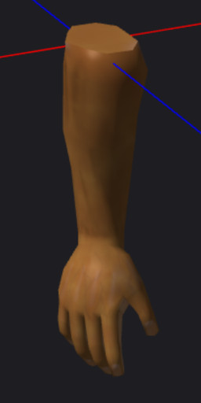

[OpenGL 3D 2023 後期 第02回]

# ゲームオブジェクトの親子関係

## 習得目標

* 
* 
* 
* 

## 1. 

### 1.1 ゲームオブジェクトに親子階層を追加する

プログラミングでは、主従関係を持つ構造を「親子階層」と呼びます。「親子階層」では、主体となる側は「親」、主体に従う側は「子」と呼ばれます。

親子階層という表現は、物理的なオブジェクトの階層に限らず、クラスの継承階層、プロセスやスレッドの階層など、主従関係を持つあらゆる場面で使われます。

ゲームにおいて「親子階層」を最も頻繁に目にするのは、画面に表示される3Dモデルでしょう。例えば、ゲーム中のキャラクターが手に道具を持っているとき、キャラクターと道具は「親子階層」になっています。

他の例として、「壁に取り付けられたドア」があります。ここでは「壁」が親で、「ドア」が子になります。

現実の親子と同様に、親子階層は何階層にも及ぶことがあります。壁とドアの例では、壁は建物の一部でもあるため、建物が親、壁が子となります。ドアは壁から見ると子で、建物から見ると孫になります。

親子階層を作成するには、オブジェクトに親へのポインタ(または参照)か、子へのポインタ(または参照)を追加するだけです。しかし、多くの実装では親へのポインタと子へのポインタの両方を持たせます。

例えば親へのポインタだけを持たせた場合を考えてみましょう。この場合、子が親を見つけるのは簡単です。しかし、親から子を見つけるには、全てのオブジェクトを検索して、自分が親となっているオブジェクトを見つけなくてはなりません。

オブジェクトに両方のポインタを持たせておけば、親と子のどちらからでも素早く相手を見つけられます。

>**【子へのポインタが不要なことってあるの？】**<br>
>プログラムの設計として、常に子が親を操作する形になっている場合、子へのポインタを持たせる必要はありません。

それでは、`GameObject`クラスに親オブジェクトと子オブジェクトのポインタを追加しましょう。`GameObject.h`を開き、次のプログラムを追加してください。

```diff
 private:
   Engine* engine = nullptr;        // エンジンのアドレス
   bool isDestroyed = false;        // 死亡フラグ
+  GameObject* parent = nullptr;      // 親オブジェクト
+  std::vector<GameObject*> children; // 子オブジェクト
   std::vector<ComponentPtr> components; // コンポーネント配列
   std::vector<AabbColliderPtr> colliders;  // コライダー配列
```

>便宜上「親子」と命名されますが、実際の構造は「親はひとつ、子は複数」です。そのため、親子よりも組織の「管理者」と「部下」の関係のほうが近いでしょう。

次に、親子階層を作成するメンバ関数を宣言します。`OnDestroy`メンバ関数の宣言の下に、次の宣言を追加してください。

```diff
   virtual void OnCollision(
     const ComponentPtr& self, const ComponentPtr& other);
   virtual void OnDestroy();
+
+  /*
+  * 親オブジェクトを取得する
+  *
+  * @retval nullptr     親がいない
+  * @retval nullptr以外 親オブジェクトのアドレス
+  */
+  GameObject* GetParent() const { return parent; }
+
+  /**
+  * 親オブジェクトを設定する
+  *
+  * @param parent 親にするゲームオブジェクト
+  *               nullptrを指定すると親子関係を解消する
+  */
+  void SetParent(GameObject* parent);
+  void SetParent(const GameObjectPtr& parent);
+
+  /**
+  * 子オブジェクトの数を取得する
+  *
+  * @return 子オブジェクトの数
+  */
+  size_t GetChildCount() const { return children.size(); }
+
+  /**
+  * 子オブジェクトを取得する
+  *
+  * @param index 子オブジェクト配列の添字
+  *              GetChildCountが返す以上の値を渡すとエラーになるので注意
+  *
+  * @return index番目の子オブジェクト
+  */
+  GameObject* GetChild(size_t index) const { return children[index]; }

   std::string name;                // オブジェクト名
   vec3 position  = { 0, 0, 0 };    // 物体の位置
```

`GetParent`(ゲット・ペアレント、「親を取得する」という意味)メンバ関数と`SetParent`(セット・ペアレント、「親を設定する」という意味)メンバ関数によって、親オブジェクトを取得または設定します。

`GetChildCount`(ゲット・チャイルド・カウント、「子の数を取得する」という意味)メンバ関数は、オブジェクトに関連付けられた子の数を返します。

`GetChild`(ゲット・チャイルド、「子を取得する」)メンバ関数は、指定されたインデックスの子オブジェクトを取得します。

次に`SetParent`メンバ関数の定義を行います。`GameObject.cpp`を開き、`OnDestroy`メンバ関数の定義の下に、次のプログラムを追加してください。

```diff
     e->OnDestroy();
   }
 }
+
+// 親オブジェクトを設定する
+void GameObject::SetParent(GameObject* parent)
+{
+  // 同じ親を指定された場合は何もしない
+  if (parent == this->parent) {
+    return;
+  }
+
+  // 別の親がある場合、その親との関係を解除する
+  if (this->parent) {
+    // 自分の位置を検索
+    auto& c = this->parent->children;
+    auto itr = std::find(c.begin(), c.end(), this);
+    if (itr != c.end()) {
+      c.erase(itr); // 配列から自分を削除
+    }
+  }
+
+  // 新たな親子関係を設定
+  if (parent) {
+    parent->children.push_back(this);
+  }
+  this->parent = parent;
+}
+
+// 親オブジェクトを設定する
+void GameObject::SetParent(const GameObjectPtr& parent)
+{
+  SetParent(parent.get());
+}
```

メンバ関数を生(なま)ポインタとシェアードポインタの2種類用意しているのは、プログラムを書きやすくするためです。

親子階層の管理自体は生ポインタで行いますが、普段の操作ではシェアードポインタを使うことが多いでしょう。もし生ポインタ版のメンバ関数しかない場合、いちいち`get`メンバ関数で生ポインタを取り出す必要があって面倒です。

つまり、シェアードポインタ版のメンバ関数の目的は、「`get`を呼び出す手間を省いてプログラムを書きやすくすること」になります。

これで、親子階層を作成できるようになりました。しかし、ひとつだけやっていないことがあります。それは、ゲームオブジェクトが削除される場合の処理です。

ゲームオブジェクトが削除されると、そのゲームオブジェクトを指すポインタは無効になります。そのため、削除される前に親と子の両方から、自身へのポインタを取り除かなくてはなりません。C++の場合、これはデストラクタで実行できます。

`GameObject.h`を開き、デストラクタの宣言から`= defalut`を削除してください。

```diff
   friend Engine;
 public:
   GameObject() = default;
-  virtual ~GameObject() = default;
+  virtual ~GameObject();

   // ゲームエンジンを取得
   Engine* GetEngine() const { return engine; }
```

次に`GameObject.cpp`を開き、インクルード文の下にデストラクタの定義を追加してください。

```diff
 */
 #include "GameObject.h"
 #include <algorithm>
+
+/**
+* デストラクタ
+*/
+GameObject::~GameObject()
+{
+  // 死ぬ前に親子関係を解除する
+  SetParent(nullptr);
+  for (auto child : children) {
+    child->parent = nullptr;
+  }
+}

 /**
 * ゲームオブジェクトから削除予定のコンポーネントを削除する
```

それと、コピーを作られるとポインタの所有権が分散するため、親子階層の適切な管理ができません。そこで、`GameObject`のコピーを禁止します。`GameObject.h`を開き、デストラクタの宣言の下に次のプログラムを追加してください。

```diff
 public:
   GameObject() = default;
   virtual ~GameObject();
+
+  // コピーと代入を禁止
+  GameObject(GameObject&) = delete;
+  GameObject& operator=(GameObject&) = delete;

   // ゲームエンジンを取得
   Engine* GetEngine() const { return engine; }
```

このように、自分が削除されるときにポインタの後始末をすることで、「削除されたオブジェクトを指すポインタ」が作られるリスクを無くしています。

### 1.2 頂点シェーダで親の座標変換パラメータを扱う

親子階層は「グラフ構造」として有用なデータ構造です。しかし、3Dグラフィックスにおける親子階層の利点は、親の拡大、回転、平行移動が子に引き継がれる点にあります。

「子オブジェクト」は「親オブジェクト」に対して一定の位置と角度を持って配置されます。親オブジェクトを移動したり回転させる場合、子オブジェクトは「親オブジェクトの原点」を中心として移動、回転します。このとき、親オブジェクトと子オブジェクトの位置と角度の関係は維持されます。

再び、「壁に取り付けられたドア」の例を考えてみましょう。ここでは「壁」が親で、「ドア」が子になります。これまでは親子階層が作れなかったため、「壁」と「ドア」は「同じ位置にあるだけの無関係なオブジェクト」でしかありませんでした。

親子階層を使って「壁」を「ドアの親」とすることで、「壁」を移動させたり回転させると「ドア」も一緒に移動したり回転するようになります。

親子階層では、「ドア」の座標や回転は「壁に対する相対的な座標と回転」として指定します。これによって、「壁の特定の位置を中心にドアを回転させる」という操作が可能になります。つまり、「ドアを開ける、閉める」という操作が簡単に再現できるということです。

さて、現在、ゲームオブジェクトの回転は頂点シェーダで行っており、「オブジェクト自身の拡大、回転、平行移動」が反映されるようになっています。

ここに親子階層を追加するには「オブジェクト自身の拡大、回転、平行移動」を計算したあとで、さらに「親の拡大、回転、平行移動」の計算を追加すればよさそうです。実際にやってみましょう。

`standard.vert`を開き、次のユニフォーム変数の定義を追加してください。

```diff
 layout(location=0) uniform vec3 scale; // 拡大率
 layout(location=1) uniform vec3 position; // 位置
 layout(location=2) uniform vec4 sinCosXY;  // X,Y軸回転
+
+// 親の座標変換パラメータ
+layout(location=10) uniform vec3 parentScale; // 拡大率
+layout(location=11) uniform vec3 parentPosition; // 位置
+layout(location=12) uniform vec4 parentSinCosXY;  // X,Y軸回転

 // アスペクト比と視野角による拡大率
 layout(location=3) uniform vec2 aspectRatioAndScaleFov;
```

ロケーション番号は、他の変数と重複しないように「オブジェクト自身の拡大、回転、平行移動のロケーション番号 + 10」としました。

次に、`main`関数にある「ローカル座標系からワールド座標系に変換」するプログラムの下に、次のプログラムを追加してください。

```diff
   vec3 pos = inPosition * scale;
   gl_Position.xyz = RotateXY(pos, sinCosXY.xy, sinCosXY.zw);
   gl_Position.xyz += position;
+
+  // 親の座標変換
+  gl_Position.xyz *= parentScale;
+  gl_Position.xyz = RotateXY(gl_Position.xyz, parentSinCosXY.xy, parentSinCosXY.zw);
+  gl_Position.xyz += parentPosition;

   outPosition = gl_Position.xyz;

   // ワールド法線を計算
   outNormal = RotateXY(inNormal, sinCosXY.xy, sinCosXY.zw);
+
+  // 親の座標変換
+  outNormal = RotateXY(outNormal, parentSinCosXY.xy, parentSinCosXY.zw);

   // ワールド座標系からビュー座標系に変換
   pos = gl_Position.xyz - cameraPosition;
```

<pre class="tnmai_assignment">
<strong>【課題01】</strong>
<code>unlit.vert</code>に「親の座標変換パラメータ」と「親の座標変換」を行うプログラムを追加しなさい。
</pre>

### 1.3 親の座標変換パラメータをGPUメモリにコピーする

続いて、「親の座標変換パラメータをGPUメモリにコピーするプログラム」を追加します。`Engine.cpp`を開き、`DrawGameObject`メンバ関数の定義に次のプログラムを追加してください。

```diff
     glProgramUniform4f(prog, 2,
       sin(e->rotation.x), cos(e->rotation.x),
       sin(e->rotation.y), cos(e->rotation.y));
+
+    // 親がいる場合:   親の座標変換パラメータをGPUメモリにコピー
+    // 親がいない場合: 「何も変換されない値」をコピーする
+    if (e->parent) {
+      const GameObject* parent = e->parent;
+      glProgramUniform3fv(prog, 10, 1, &parent->scale.x);
+      glProgramUniform3fv(prog, 11, 1, &parent->position.x);
+      glProgramUniform4f(prog, 12,
+        sin(parent->rotation.x), cos(parent->rotation.x),
+        sin(parent->rotation.y), cos(parent->rotation.y));
+    } else {
+      glProgramUniform3f(prog, 10, 1, 1, 1);
+      glProgramUniform3f(prog, 11, 0, 0, 0);
+      glProgramUniform4f(prog, 12, 0, 1, 0, 1);
+    }

     // 図形を描画
     if (e->materials.empty()) {
```

親がいない場合は「何も変換されない値」をGPUメモリにコピーするようにしました。これは、「拡大率=100%、回転=0度、平行移動=なし」という値です。

### 1.4 壁をドアの親にする

それでは、壁をドアの親に設定しましょう。`MainGameScene.cpp`を開き、`Initialize`メンバ関数にある「ドアを設定」するプログラムを、次のように変更してください。

```diff
        arch->scale = { squareScale, squareScale, squareScale };
        arch->staticMesh = engine.GetStaticMesh("Res/MeshData/HorrorHospitalPack/DoorWay.obj");

        // ドア
-       auto door = engine.Create<GameObject>("door", { posX, 0, posZ });
+       auto door = engine.Create<GameObject>("door", { 0, 0, 0 });
-       door->scale = { squareScale, squareScale, squareScale };
        door->staticMesh = engine.GetStaticMesh("Res/MeshData/HorrorHospitalPack/Door.obj");
+       door->SetParent(arch);

        // ドアのコライダーを設定
        auto collider = door->AddComponent<AabbCollider>();
        collider->aabb = { { -0.5f, 0, -0.25f }, { 1.5f, 2, 0.25f } };
        collider->isStatic = true;

        // ドアの向きに応じて回転
        if (tileId == '|') {
          arch->rotation.y += radians(90);
-         door->rotation.y += radians(90);
          collider->aabb = { { -0.25f, 0, -0.5f }, { 0.25f, 2, 1.5f } };
        }
```

子は親の拡大率を引き継ぐため、`door`の拡大率を設定する必要がなくなっている点に注意してください。

次に、ドアをクリックしたときにドアを開ける処理を変更します。`State_Playing`メンバ関数にある「光線がドアに衝突したらドアを開ける」プログラムを、次のように変更してください。

```diff
      // 光線がドアに衝突したらドアを開ける
      if (owner->name == "door") {
        if (owner->position.y > -2) {
-         owner->position.y = -2; // ドアを床下に移動
+         owner->rotation.y = radians(90); // ドアを回転
+         if (auto collider = owner->GetComponent<AabbCollider>()) {
+           collider->isTrigger = true; // 衝突判定を消す
+         }
          EasyAudio::Play(1, SE::doorOpen);
        }
      }
```

プログラムが書けたらビルドして実行してください。ドア(リモートでない)をクリックしたとき、ドアが90度回転したら成功です。

<p align="center">
<br>
[思ってたのと違うかも]
</p>

### 1.5 ドアモデルのエクスポートをやりなおす

ドアの開きかたは、思っていたものとは違ったかもしれません。ドアの中心が回転してしまうのは、そこがドアの原点になっているからです。

しかし、普通のドアは「蝶番(ちょうつがい)」の部分で回転します。同じ挙動を再現するには、3Dモデルの蝶番の座標を原点と一致させなくてはなりません。

Unityエディタを起動し、ドアモデルを選択してください。`Horror Hospital Pack`に含まれるドアモデルの場合、赤丸で囲んだ部品が「蝶番」です。

<p align="center">
<br>
</p>

この蝶番が原点に来るように、3Dモデルを移動させればいいわけです。ただ、Unityには原点を表示する機能がないため、そのままでは合わせにくいです。そこで、ガイドとして適当なモデルを原点に配置します。

メニューから`GameObject→3D Object→Cube`を選択して、シーンに立方体モデルを配置してください。配置したら、インスペクターパネルの`Position`と`Scale`を次のように変更してください。

<p align="center">
<br>
</p>

これで、原点のY軸が分かるようになりました。ドアモデルを選択し、赤いX軸ハンドルと青いZ軸ハンドルを操作して、蝶番がY軸と重なるようにドアモデルを移動させてください。位置はだいたい合っていれば大丈夫です。

>動かすのは「ドア」です。`Box`は原点から動かさないでくだださい。

<p align="center">
<br>
[ドアを動かして、蝶番の中央をBoxが貫通するように配置]
</p>

ドアの位置が決まったら、メニューから「File→Export→Wavefront OBJ」を選択して、プロジェクトの`Res`フォルダにあるドアモデルを上書きしてください。

さて、ドアモデルの座標をずらしたので、ゲーム内の座標もそのズレに対応させなくてはなりません。`MainGameScene.cpp`を開き、`Initialize`メンバ関数にあるドアを配置するプログラムを、次のように変更してください。

```diff
        arch->scale = { squareScale, squareScale, squareScale };
        arch->staticMesh = engine.GetStaticMesh("Res/MeshData/HorrorHospitalPack/DoorWay.obj");

        // ドア
-       auto door = engine.Create<GameObject>("door", { 0, 0, 0 });
+       auto door = engine.Create<GameObject>("door", { -0.5f, 0, 0 });
        door->scale = { squareScale, squareScale, squareScale };
        door->staticMesh = engine.GetStaticMesh("Res/MeshData/HorrorHospitalPack/Door2.obj");
```

それから、`RemoteDoor.h`を開き、`Awake`メンバ関数に次のプログラムを追加してください。

```diff
     auto arch = engine->Create<GameObject>(
       owner->name, owner->position, owner->rotation);
     arch->staticMesh = engine->GetStaticMesh("Res/MeshData/HorrorHospitalPack/DoorWay.obj");
+    
+    // 枠をドアの親にする
+    owner->position = { -0.5f, 0, 0 };
+    owner->rotation = { 0, 0, 0 };
+    owner->SetParent(arch);

     collider = owner->AddComponent<AabbCollider>();
     collider->aabb = { { -0.5f, 0, -0.25f }, { 1.5f, 2, 0.25f } };
```

プログラムが書けたらビルドして実行してください。クリックしてドアを開けたとき、ドアが蝶番を中心に回転していたら成功です。

>**【ドアが表示されない場合】**
>ドアが表示されない場合、ドアのX座標を`0.5f`にして試してみてください。

<p align="center">
<br>
</p>

### 1.6 ドアをアニメーションさせる

ドアがいきなり90度開くというのは、昔のゲームやインディゲームなら許されるでしょうが、2023年現在に提供するユーザー体験としては品質が低いと言わざるを得ません。そこで、ドアの開閉をアニメーションで表現する、ドア用のコンポーネントを作成しましょう。

>既に自分でドアをアニメーションさせている場合は、このコンポーネントの作成は無視してください。

プロジェクトの`Src`フォルダに`NormalDoor.h`(ノーマル・ドア)という名前のヘッダファイルを追加してください。追加したファイルを開き、次のプログラムを追加してください。

```diff
+/**
+* @file NormalDoor.h
+*/
+#ifndef NORMALDOOR_H_INCLUDED
+#define NORMALDOOR_H_INCLUDED
+#include "MapObject.h"
+#include "Engine/AabbCollider.h"
+
+/**
+* クリックで開閉できるドア
+*/
+class NormalDoor : public MapObject
+{
+public:
+  NormalDoor() = default;
+  virtual ~NormalDoor() = default;
+
+  // ゲームオブジェクトに追加された時に呼び出される
+  virtual void Awake() override;
+
+  // 状態の更新
+  virtual void Update(float deltaTime) override;
+
+  // クリックされたときに呼び出される
+  virtual ActionResult Action() override;
+
+private:
+  // ドアの開閉状態
+  enum class State {
+    closed,  // 閉じている
+    opening, // 開いている途中
+    open,    // 開いている
+    closing, // 閉じている途中
+  };
+  State state = State::closed;
+  GameObjectPtr door;
+  AabbColliderPtr collider;
+};
+
+#endif // NORMALDOOR_H_INCLUDED 
```

それではメンバ関数を定義していきましょう。まず`Awake`メンバ関数を定義します。プロジェクトの`Src`フォルダに`NormalDoor.cpp`という名前のCPPファイルを追加してください。追加したファイルを開き、次のプログラムを追加してください。

>この関数の内容は、`MainGameScene.cpp`にある「ドアを配置する」プログラムとほとんど同じです。

```diff
+/**
+* @file NormalDoor.cpp
+*/
+#include "NormalDoor.h"
+#include "Engine/Engine.h"
+#include "Engine/EasyAudio/EasyAudio.h"
+#include "AudioSettings.h"
+
+// ゲームオブジェクトに追加された時に呼び出される
+void NormalDoor::Awake()
+{
+  // ドアの枠
+  GameObject* owner = GetOwner();
+  Engine* engine = owner->GetEngine();
+  owner->staticMesh = engine->GetStaticMesh(
+    "Res/MeshData/HorrorHospitalPack/DoorWay.obj");
+
+  // 角度に対応するコライダーの形状を設定
+  collider = owner->AddComponent<AabbCollider>();
+  collider->isStatic = true;
+  if (owner->rotation.y == radians(90)) {
+    collider->aabb = { { -0.25f, 0, -1 }, { 0.25f, 2, 1 } };
+  } else {
+    collider->aabb = { { -1, 0, -0.25f }, { 1, 2, 0.25f } };
+  }
+
+  // ドア
+  door = engine->Create<GameObject>(owner->name + ".Door", { -0.5f, 0, 0 });
+  door->staticMesh = engine->GetStaticMesh(
+    "Res/MeshData/HorrorHospitalPack/Door.obj");
+  door->SetParent(owner);
+}
```

壁とドアのモデルファイル名は、みなさんが選んだファイル名で置き換えてください。

次に`Update`メンバ関数を定義します。`Awake`メンバ関数の定義の下に、次のプログラムを追加してください。

```diff
     "Res/MeshData/HorrorHospitalPack/Door2.obj");
   door->SetParent(owner);
 }
+
+// 状態の更新
+void NormalDoor::Update(float deltaTime)
+{
+  constexpr float speed = radians(120); // ドアの開閉速度
+
+  switch (state) {
+  case State::opening:
+    // 90度になるまで徐々に回転させる
+    door->rotation.y += speed * deltaTime;
+    if (door->rotation.y >= radians(90)) {
+      door->rotation.y = radians(90); // 90度になったので回転を終了
+      state = State::open;
+    }
+    break;
+
+  case State::closed:
+  case State::open:
+  case State::closing:
+    // 何もしない
+    break;
+  } // switch state
+}
```

`Update`メンバ関数では、状態が`opening`(オープニング)のときにドアを徐々に回転して開きます。そして、開き終わったら状態を`open`(オープン)に変更します。

状態を`opening`にする処理は`Action`(アクション)メンバ関数で行います。`Update`メンバ関数の定義の下に、次のプログラムを追加してください。

```diff
     break;
   } // switch state
 }
+
+// クリックされたときに実行される
+MapObject::ActionResult NormalDoor::Action()
+{
+  switch (state) {
+  case State::closed:
+  case State::closing:
+    collider->isTrigger = true; // コライダーを通過できるようにする
+    EasyAudio::Play(1, SE::doorOpen);
+    state = State::opening;
+    break;
+
+  case State::opening:
+  case State::open:
+    // 何もしない
+    break;
+  }
+  return ActionResult::executeRemoteAction;
+}
```

`Action`メンバ関数は、ドアがクリックされたときに呼び出されます。このとき、ドアの状態が`closed`(クローズド)または`closing`(クロージング)の場合、状態を`opening`に変更します。

このとき、コライダーをトリガーモードに変更することで、ドアを通過できるようにしています。

それでは、壁とドアを`NormalDoor`コンポーネントで置き換えましょう。`MainGameScene.cpp`を開き、`NormalDoor.h`をインクルードしてください。

```diff
 #include "GoalEvent.h"
 #include "SimpleLever.h"
 #include "RemoteDoor.h"
+#include "NormalDoor.h"
 #include "EnemySkull.h"
 #include "FluorescentLight.h"
```

次に、`Initialize`メンバ関数にある「ドアを設定」するプログラムを次のように変更してください。

```diff
     }
     // ドアを設定
     else if (tileId == '|' || tileId == '-') {
-      // ドアの枠
-      auto arch = engine.Create<GameObject>("arch", { posX, 0, posZ });
-      arch->scale = { squareScale, squareScale, squareScale };
-      arch->staticMesh = engine.GetStaticMesh("Res/MeshData/HorrorHospitalPack/DoorWay.obj");
-
-      // ドア
-      auto door = engine.Create<GameObject>("door", { -0.5f, 0, 0 });
-      door->scale = { squareScale, squareScale, squareScale };
-      door->staticMesh = engine.GetStaticMesh("Res/MeshData/HorrorHospitalPack/Door2.obj");
-      door->SetParent(arch);
-
-      // ドアのコライダーを設定
-      auto collider = door->AddComponent<AabbCollider>();
-      collider->aabb = { { -0.5f, 0, -0.25f }, { 1.5f, 2, 0.25f } };
-      collider->isStatic = true;
-
-      // ドアの向きに応じて回転
-      if (tileId == '|') {
-        arch->rotation.y += radians(90);
-        collider->aabb = { { -0.25f, 0, -0.5f }, { 0.25f, 2, 1.5f } };
-      }
+      auto door = engine.Create<GameObject>("NormalDoor", { posX, 0, posZ });
+      door->scale = { squareScale, squareScale, squareScale };
+      if (tileId == '|') {
+        door->rotation.y = radians(90);
+      }
+      door->AddComponent<NormalDoor>();
     }
     // クリスタルを設定
```

プログラムが書けたらビルドして実行してください。ドアをクリックしたとき、ドアが開くアニメーションが表示されたら成功です。

>ドアが表示されないときは、`NormalDoor::Awake`メンバ関数で設定しているドアの座標を調整してみてください。

<pre class="tnmai_assignment">
<strong>【課題02】</strong>
<code>RemoteDoor</code>コンポーネントにドアを開くアニメーションを追加しなさい。
</pre>

>**【1章のまとめ】**
>
>* 
>* 
>* 

<div style="page-break-after: always"></div>

## 2. 行列

### 2.1 3階層以上の親子階層に対応するには

壁とドアの例では、親子階層は2階層だけでした。3階層以上に対応するには、必要な数だけユニフォーム変数を追加すればよいように思えます。

残念ながら、これはあまり良い方法ではありません。この方法では、親の親、親の親の親、親の親の親の親、…、のように、場合によっては相当な数のユニフォーム変数を追加しなくてはならないからです。

さらにまずいのは、親を持たないオブジェクトからすると、不要な演算が大量に追加されることで処理速度が低下する問題がある点です。

そこで、計算方法を工夫することで、どれだけ階層があっても処理速度が低下せず、ユニフォーム変数の数が変わらないようにしていきます。

とりあえず、現在頂点シェーダで行っている計算を抜き出してみましょう。以下の式において`v`は頂点座標、`scale`は拡大率、`sinX`, `cosX`はX軸回転のサインとコサイン、`sinY`, `cosY`はY軸回転のサインとコサイン、`position`は平行移動を表します。

>```text
>拡大縮小
>x = v.x * scale.x
>y = v.y * scale.y 
>z = v.z * scale.z
>
>X軸回転
>x' = x
>y' = y * cosX + z * -sinX
>z' = y * sinX + z * cosX
>
>Y軸回転
>x'' = x' * cosY + z' * sinY
>y'' = y'
>z'' = x' * -sinY + z' * cosY
>
>平行移動
>x''' = x'' + position.x 
>y''' = y'' + position.y 
>z''' = z'' + position.z 
>```

次に、この計算をまとめていきます。まずx,y,zを展開すると、x',y',z'は次のようになります。

>```text
>x' = v.x * scale.x
>y' = v.y * scale.y * cosX + v.z * scale.z * -sinX
>z' = v.y * scale.y * sinX + v.z * scale.z * cosX
>```

次に展開後のx',y',z'を展開すると、x'',y'',z''は次のようになります。

>```text
>x'' = (v.x * scale.x) * cosY + (v.y * scale.y * sinX + v.z * scale.z * cosX) * sinY
>y'' = (v.y * scale.y * cosX + v.z * scale.z * -sinX)
>z'' = (v.x * scale.x) * -sinY + (v.y * scale.y * sinX + v.z * scale.z * cosX) * cosY
>```

最後にx'',y'',z''を展開すると、x''',y''',z'''は次のようになります。

>```text
>x''' = v.x * scale.x * cosY  + v.y * scale.y * sinX * sinY + v.z * scale.z * cosX * sinY + position.x
>y''' =                         v.y * scale.y * cosX        + v.z * scale.z * -sinX       + position.y
>z''' = v.x * scale.x * -sinY + v.y * scale.y * sinX * cosY + v.z * scale.z * cosX * cosY + position.z
>```

これで、要素ごとに式を1行にまとめることができました。ただ、この式はかなり見づらいです。そこで、`v`に掛ける成分をベクトルとして定義してみます。

>```text
>m0 = { scale.x * cosY,  scale.y * sinX * sinY, scale.z * cosX * sinY, position.x }
>m1 = { 0,               scale.y * cosX,        scale.z * -sinX,       position.y }
>m2 = { scale.x * -sinY, scale.y * sinX * cosY, scale.z * cosX * cosY, position.z }
>```

すると、x''',y''',z'''は次のように書くことができます。

>```text
>x''' = v.x * m0.x + v.y * m0.y + v.z * m0.z + m0.w
>y''' = v.x * m1.x + v.y * m1.y + v.z * m1.z + m1.w
>z''' = v.x * m2.x + v.y * m2.y + v.z * m2.z + m2.w
>```

式をベクトルにすることで、かなり見やすくなりました。式をよく見ると、「要素を掛けて足す」という処理を繰り返していることがわかります。これは「内積」の計算式と同じです。しかし、`w`要素だけ乗算がないため、完全な「内積」にはなりません。

そこで、頂点座標に`w`要素を追加します。すると、上の式は次のようになります。

>```text
>[v.w = 1 とする]
>x''' = v.x * m0.x + v.y * m0.y + v.z * m0.z + v.w * m0.w
>y''' = v.x * m1.x + v.y * m1.y + v.z * m1.z + v.w * m1.w
>z''' = v.x * m2.x + v.y * m2.y + v.z * m2.z + v.w * m2.w
>```

これで、式を内積で計算できるようになります。それから、`v.w`要素を追加したので、この要素の計算も追加するべきです。この計算は、計算後の`w`要素が`1`になるように定義します。`w`要素の計算を追加した式は次のようになります。

>```text
>m0 = { scale.x * cosY,  scale.y * sinX * sinY, scale.z * cosX * sinY, position.x }
>m1 = { 0,               scale.y * cosX,        scale.z * -sinX,       position.y }
>m2 = { scale.x * -sinY, scale.y * sinX * cosY, scale.z * cosX * cosY, position.z }
>m3 = { 0,               0,              0,                     1          }
>
>x''' = v.x * m0.x + v.y * m0.y + v.z * m0.z + v.w * m0.w
>y''' = v.x * m1.x + v.y * m1.y + v.z * m1.z + v.w * m1.w
>z''' = v.x * m2.x + v.y * m2.y + v.z * m2.z + v.w * m2.w
>w''' = v.x * m3.x + v.y * m3.y + v.z * m3.z + v.w * m3.w
>```

このように式を変形することで、m0～m3をCPU側で計算してユニフォーム変数にコピーしておけば、あとは簡単な計算で頂点座標を変換できるようになります。

続いて、親の座標変換を追加してみましょう。親の拡大率は`scale2`、X軸回転は`sin2X`と`cos2X`、Y軸回転は`sin2Y`と`cos2Y`、平行移動は`position2`とします。

計算自体は親子で違いはないため、m0～m3と同様のベクトルn0～n3を定義できます。これは次のようになります。

>```text
>n0 = { scale2.x * cos2Y,  scale2.y * sin2X * sin2Y, scale2.z * cos2X * sin2Y, position2.x }
>n1 = { 0,                 scale2.y * cos2X,         scale2.z * -sin2X,        position2.y }
>n2 = { scale2.x * -sin2Y, scale2.y * sin2X * cos2Y, scale2.z * cos2X * cos2Y, position2.z }
>n3 = { 0,                 0,                0,                        1           }
>```

そして、このベクトルを使ってx''',y''',z''',w'''を座標変換し、x2,y2,z2,w2を得る式は次のようになります。

>```text
>x2 = x''' * n0.x + y``` * n0.y + z``` * n0.z + w``` * n0.w
>y2 = x''' * n1.x + y``` * n1.y + z``` * n1.z + w``` * n1.w
>z2 = x''' * n2.x + y``` * n2.y + z``` * n2.z + w``` * n2.w
>w2 = x''' * n3.x + y``` * n3.y + z``` * n3.z + w``` * n3.w
>```

同じ計算をしているので当然ではあるのですが、x''',y''',z''',w'''と同じ式になっていることが分かると思います。

ここでも、これまでと同じように、x''',y''',z''',w'''を展開します。すべてを展開すると長すぎるので、とりあえずx2だけ展開してみましょう。これは次のようになります。

>```text
>x2' = (v.x * m0.x  + v.y * m0.y + v.z * m0.z + v.w * m0.w) * n0.x +
>      (v.x * m1.x  + v.y * m1.y + v.z * m1.z + v.w * m1.w) * n0.y +
>      (v.x * m2.x  + v.y * m2.y + v.z * m2.z + v.w * m2.w) * n0.z +
>      (v.x * m3.x  + v.y * m3.y + v.z * m3.z + v.w * m3.w) * n0.w
>```

この式も少し見づらいので、`v`を基準に変形しましょう。すると、次の式になります。

>```text
>x2` = v.x * (m0.x * n0.x + m1.x * n0.y + m2.x * n0.z + m3.x * n0.w) +
>      v.y * (m0.y * n0.x + m1.y * n0.y + m2.y * n0.z + m3.y * n0.w) +
>      v.z * (m0.z * n0.x + m1.z * n0.y + m2.z * n0.z + m3.z * n0.w) +
>      v.w * (m0.w * n0.x + m1.w * n0.y + m2.w * n0.z + m3.w * n0.w)
>```

このように変形すると、この式が実は「m0～m3とn0を掛けたものを頂点座標に掛けている」ということに気が付きます。ということは、m0～m3とn0を掛けたものをベクトルにすることで、式を単純化できるはずです。

>```text
>mn0 = { m0.x * n0.x + m1.x * n0.y + m2.x * n0.z + m3.x * n0.w,
>        m0.y * n0.x + m1.y * n0.y + m2.y * n0.z + m3.y * n0.w,
>        m0.z * n0.x + m1.z * n0.y + m2.z * n0.z + m3.z * n0.w,
>        m0.w * n0.x + m1.w * n0.y + m2.w * n0.z + m3.w * n0.w }
>    = m0 * n0.x + m1 * n0.y + m2 * n0.z + m3 * n0.w
>
>x2' = v.x * mn0.x + v.y * mn0.y + v.z * mn0.z * v.w * mn0.w
>```

同様にして、mn1, mn2, mn3のベクトルを定義することでき、そのベクトルを使ってy2',z2',w2'を計算できます。

>```text
>mn1 = m0 * n1.x + m1 * n1.y + m2 * n1.z + m3 * n1.w
>mn2 = m0 * n2.x + m1 * n2.y + m2 * n2.z + m3 * n2.w
>mn3 = m0 * n3.x + m1 * n3.y + m2 * n3.z + m3 * n3.w
>
>y2' = v.x * mn1.x + v.y * mn1.y + v.z * mn1.z * v.w * mn1.w
>z2' = v.x * mn2.x + v.y * mn2.y + v.z * mn2.z * v.w * mn2.w
>w2' = v.x * mn3.x + v.y * mn3.y + v.z * mn3.z * v.w * mn3.w
>```

これはつまり、mn0～mn3をCPU側で計算してユニフォーム変数にコピーしておけば、あとは簡単な計算で親子階層を考慮した座標変換ができる、ということです。

そして、この計算は親子階層がどれだけ続いても成立します。つまり、どんな親子階層であろうと、4つのベクトルをGPUにコピーするだけで親子階層を考慮した座標変換を行えるのです。

例えば、親の親の座標変換は次のようになります(全部載せると長くなるのでX座標の式だけを載せています)。

>```text
>o0 = { scale3.x * cos3Y,  scale3.y * sin3X, scale3.z * cos3X * sin3Y, position3.x }
>
>x3 = x2' * o0.x + y2` * o0.y + z2` * o0.z + w2` * o0.w
>
>x3` = v.x * (mn0.x * o0.x + mn1.x * o0.y + mn2.x * o0.z + mn3.x * o0.w) +
>      v.y * (mn0.y * o0.x + mn1.y * o0.y + mn2.y * o0.z + mn3.y * o0.w) +
>      v.z * (mn0.z * o0.x + mn1.z * o0.y + mn2.z * o0.z + mn3.z * o0.w) +
>      v.w * (mn0.w * o0.x + mn1.w * o0.y + mn2.w * o0.z + mn3.w * o0.w)
>
>mno0 = { mn0.x * o0.x + mn1.x * o0.y + mn2.x * o0.z + mn3.x * o0.w,
>         mn0.y * o0.x + mn1.y * o0.y + mn2.y * o0.z + mn3.y * o0.w,
>         mn0.z * o0.x + mn1.z * o0.y + mn2.z * o0.z + mn3.z * o0.w,
>         mn0.w * o0.x + mn1.w * o0.y + mn2.w * o0.z + mn3.w * o0.w }
>     = mn0 * o0.x + mn1 * o0.y + mn2 * o0.z + mn3 * o0.w
>
>x3' = v.x * mno0.x + v.y * mno0.y + v.z * mno0.z * v.w * mno0.w
>```

`m * n`だった部分が`mn * o`に変わった以外は全く同じ式になっていることが分かると思います。つまり、「`m * n`の計算結果に`o`を掛けた値」になっているわけです。

このことから、いくつ親子階層があったとしても、「前の計算結果に次のベクトルを掛ける」操作を繰り返すだけで、座標変換に必要な4つのベクトルが求められることが分かります。

### 2.2 頂点シェーダを座標変換ベクトル配列に対応させる

「親子階層に対応した座標変換の方法」が判明したので、式をプログラムにしていきます。手順は以下のとおりです。

>1. 頂点シェーダを座標変換ベクトル配列を使うように書き換える。
>2. オブジェクトの拡大率、回転角、平行移動量から「座標変換ベクトルの配列」を求める関数を定義する。
>3. 座標変換ベクトル配列同士をかけ合わせる関数を定義する。
>4. ゲームオブジェクト自身の座標変換ベクトル配列と、全ての親の座標変換ベクトル配列を乗算する。
>5. 座標変換ベクトル配列をユニフォーム変数にコピーする。

それでは、1番の頂点シェーダの変更から始めましょう。`standard.vert`を開き、ユニフォーム変数の定義を次のように変更してください。

```diff
 layout(location=1) out vec2 outTexcoord; // テクスチャ座標
 layout(location=2) out vec3 outNormal;   // 法線ベクトル

 // プログラムからの入力
-layout(location=0) uniform vec3 scale; // 拡大率
-layout(location=1) uniform vec3 position; // 位置
-layout(location=2) uniform vec4 sinCosXY;  // X,Y軸回転
-
-// 親の座標変換パラメータ
-layout(location=10) uniform vec3 parentScale; // 拡大率
-layout(location=11) uniform vec3 parentPosition; // 位置
-layout(location=12) uniform vec4 parentSinCosXY;  // X,Y軸回転
+layout(location=10) uniform vec4 transform[4];
+layout(location=14) uniform vec3 transformNormal[3];

 // アスペクト比と視野角による拡大率
 layout(location=3) uniform vec2 aspectRatioAndScaleFov;
```

`transform`(トランスフォーム)配列が「座標変換ベクトルの配列」に相当します。では`transformNorml`(トランスフォーム・ノーマル)配列は何なのかというと、これは「法線変換ベクトルの配列」になります。

法線は「向きベクトル」なので、回転だけが影響します。そのため、「回転だけを行う座標変換ベクトルの配列」が必要となります。これが「法線変換ベクトルの配列」です。

「法線変換ベクトルの配列」には平行移動成分がないので、`w`要素は不要です。そのため、`vec4`ではなく`vec3`を使い、配列の長さも3にしています。

次に、`main`関数にあるローカル座標系からワールド座標系へ変換するプログラムを、2.1節で解説した式に置き換えてください。

```diff
   outTexcoord = inTexcoord;

   // ローカル座標系からワールド座標系に変換
-  vec3 pos = inPosition * scale;
-  gl_Position.xyz = RotateXY(pos, sinCosXY.xy, sinCosXY.zw);
-  gl_Position.xyz += position;
-
-  // 親の座標変換
-  gl_Position.xyz *= parentScale;
-  gl_Position.xyz = RotateXY(gl_Position.xyz, parentSinCosXY.xy, parentSinCosXY.zw);
-  gl_Position.xyz += parentPosition;
+  vec4 v = vec4(inPosition, 1);
+  gl_Position = vec4(dot(v, transform[0]),
+                     dot(v, transform[1]),
+                     dot(v, transform[2]),
+                     dot(v, transform[3]));

   outPosition = gl_Position.xyz;

   // ワールド法線を計算
```

ここで`dot`関数を使っているのは、2.1節で解説した式をそのまま書くと長くなるからです。`dot`関数を展開してみれば、式自体は全く同じものだと理解できるでしょう。

同様に、ワールド法線を計算するプログラムを次のように変更してください。

```diff
   outPosition = gl_Position.xyz;

   // ワールド法線を計算
-  outNormal = RotateXY(inNormal, sinCosXY.xy, sinCosXY.zw);
-  outNormal = RotateXY(outNormal, parentSinCosXY.xy, parentSinCosXY.zw);
+  outNormal = vec3(dot(inNormal, transformNormal[0]),
+                   dot(inNormal, transformNormal[1]),
+                   dot(inNormal, transformNormal[2]));

   // ワールド座標系からビュー座標系に変換
   pos = gl_Position.xyz - cameraPosition;
```

計算が`vec3`型で行われること、`transform`の代わりに`transformNormal`を使っていることを除けば、先程の計算式と同じことをしているのが分かるでしょう。

さて、プログラムを変更したことで、`pos`変数の定義が失われました。この問題を解決しましょう。ワールド座標系からビュー座標系に変換するプログラムを次のように変更してください。

```diff
   outNormal = vec3(dot(inNormal, transformNormal[0]),
                    dot(inNormal, transformNormal[1]),
                    dot(inNormal, transformNormal[2]));

   // ワールド座標系からビュー座標系に変換
-  pos = gl_Position.xyz - cameraPosition;
+  vec3 pos = gl_Position.xyz - cameraPosition;
   float cameraSinY = cameraSinCosY.x;
   float cameraCosY = cameraSinCosY.y;
```

これで、`standard.vert`を「座標変換ベクトル配列」を使うように変更できました。続いて、同じことを`unlit.vert`に行います。

<pre class="tnmai_assignment">
<strong>【課題03】</strong>
<code>unlit.vert</code>を「座標変換ベクトルの配列」を使うように変更しなさい。アンリット・シェーダはライティングを行わないので、法線の計算が不要な点に注意すること。
</pre>

### 2.3 座標変換ベクトル配列を操作する関数を定義する

次に、2番の「座標変換ベクトルの配列」を求める関数を作成します。関数名は`GetTransformVectors`(ゲット・トランスフォーム・ベクターズ、「座標変換ベクトルの配列を得る」のような意味)とします。

ベクトルを扱う関数なので、`VecMath.h`に定義することにします。`VecMath.h`を開き、ファイルの末尾に次のプログラムを追加してください。

```diff
 // vec4とfloatの除算
 inline vec4& operator/=(vec4& a, float b) { return a /= { b, b, b, b }; }
 inline vec4 operator/(const vec4& a, float b) { vec4 n = a; return n /= b; }
 inline vec4 operator/(float a, const vec4& b) { return vec4{ a, a, a, a } / b; }
+
+// 座標変換ベクトルの配列を計算する
+inline void GetTransformVectors(vec4* result,
+  const vec3& scale, const vec3& rotation, const vec3& position)
+{
+  const float sinX = sin(rotation.x);
+  const float cosX = cos(rotation.x);
+  const float sinY = sin(rotation.y);
+  const float cosY = cos(rotation.y);
+  result[0] = { scale.x * cosY,  scale.y * sinX * sinY, scale.z * cosX * sinY, position.x };
+  result[1] = { 0,               scale.y * cosX,        scale.z * -sinX,       position.y };
+  result[2] = { scale.x * -sinY, scale.y * sinX * cosY, scale.z * cosX * cosY, position.z };
+  result[3] = { 0,               0,              0,                     1          };
+}

 #endif // VECMATH_H_INCLUDED
```

このプログラムは、2.1節で説明した`m0`～`m3`の計算式をそのまま利用しています。

続いて、3番の「座標変換ベクトル配列同士をかけ合わせる」関数を定義します。関数名は`MultiplyTransformVectors`(マルチプライ・トランスフォーム・ベクターズ、「座標変換ベクトル配列の乗算」のような意味)とします。

`GetTransformVectors`関数の定義の下に、次のプログラムを追加してください。

```diff
   result[2] = { scale.x * -sinY, scale.y * sinX, scale.z * cosX * cosY, position.z };
   result[3] = { 0,               0,              0,                     1          };
 }
+
+// 座標変換ベクトルの配列をかけ合わせる
+inline void MultiplyTransformVectors(vec4* result, const vec4* m, const vec4* n)
+{
+  vec4 mn[4];
+  for (int i = 0; i < 4; ++i) {
+    mn[i] = m[0] * n[i].x + m[1] * n[i].y + m[2] * n[i].z + m[3] * n[i].w;
+  }
+  for (int i = 0; i < 4; ++i) {
+    result[i] = mn[i];
+  }
+}

 #endif // VECMATH_H_INCLUDED
```

計算結果を直接`result`に代入するのではなく、まず`mn`配列に代入している点に注意してください。ポインタ変数`result`と`m`、`n`には同じアドレスを指定できるため、直接代入すると元のデータを壊してしまいます。

計算結果を独立した変数に代入することで、計算中に元のデータを壊してしまう危険を回避しています。

それから、法線変換ベクトル配列ですが、これは`GetTransformVectors`関数の`scale`引数に`{1, 1, 1}`、`position`引数に`{0, 0, 0}`を指定することで計算できます。

しかし、本来必要のない`scale`や`position`の計算を行うのは無駄が多いです。そこで、`GetTransformVectors`関数の「回転だけバージョン」を作成することにします。名前は`GetRotationVectors`(ゲット・ローテーション・ベクターズ)としましょう。

`MultiplyTransformVectors`関数の定義の下に、次のプログラムを追加してください。

```diff
     result[i] = mn[i];
   }
 }
+
+// 法線変換ベクトルの配列を計算する
+inline void GetRotationVectors(vec3* result, const vec3& rotation)
+{
+  const float sinX = sin(rotation.x);
+  const float cosX = cos(rotation.x);
+  const float sinY = sin(rotation.y);
+  const float cosY = cos(rotation.y);
+  result[0] = { cosY,  sinX * sinY, cosX * sinY };
+  result[1] = { 0,     cosX,        -sinX       };
+  result[2] = { -sinY, sinX * cosY, cosX * cosY };
+}

 #endif // VECMATH_H_INCLUDED
```

`vec4`型ではなく`vec3`型を使っている点に注目してください。回転だけを行うなら`w`要素は不要です。

次に法線変換ベクトル配列をかけ合わせる関数を定義します。関数名は`MultiplyRotationVectors`(マルチプライ・ローテーション・ベクターズ)とします。`GetRotationVectors`関数の定義の下に、次のプログラムを追加してください。

```diff
   result[1] = { 0,     cosX, -sinX };
   result[2] = { -sinY, sinX, cosX * cosY };
 }
+
+// 法線変換ベクトルの配列をかけ合わせる
+inline void MultiplyRotationVectors(vec3* result, const vec3* m, const vec3* n)
+{
+  vec3 mn[3];
+  for (int i = 0; i < 3; ++i) {
+    mn[i] = m[0] * n[i].x + m[1] * n[i].y + m[2] * n[i].z;
+  }
+  for (int i = 0; i < 3; ++i) {
+    result[i] = mn[i];
+  }
+}

 #endif // VECMATH_H_INCLUDED
```

### 2.4 親の座標変換ベクトルの配列をかけ合わせる

定義した関数を使って4番の「ゲームオブジェクト自身の座標変換ベクトル配列と、全ての親の座標変換ベクトル配列を乗算する」プログラムを作成します。

`Engine.cpp`を開き、`DrawGameObject`目k場関数の定義を次のように変更してください。

```diff
     // ユニフォーム変数にデータをコピー
     glProgramUniform4fv(prog, 100, 1, &e->color.x);

-    glProgramUniform3fv(prog, 0, 1, &e->scale.x);
-    glProgramUniform3fv(prog, 1, 1, &e->position.x);
-    glProgramUniform4f(prog, 2,
-      sin(e->rotation.x), cos(e->rotation.x),
-      sin(e->rotation.y), cos(e->rotation.y));
-
-    // 親がいる場合:   親の座標変換パラメータをGPUメモリにコピー
-    // 親がいない場合: デフォルト値をコピーする
-    if (e->parent) {
-      const GameObject* parent = e->parent;
-      glProgramUniform3fv(prog, 10, 1, &parent->scale.x);
-      glProgramUniform3fv(prog, 11, 1, &parent->position.x);
-      glProgramUniform4f(prog, 12,
-        sin(parent->rotation.x), cos(parent->rotation.x),
-        sin(parent->rotation.y), cos(parent->rotation.y));
-    } else {
-      glProgramUniform3f(prog, 10, 1, 1, 1);
-      glProgramUniform3f(prog, 11, 0, 0, 0);
-      glProgramUniform4f(prog, 12, 0, 1, 0, 1);
-    }
+    // 自分の座標変換ベクトル配列を求める
+    vec4 transform[4];
+    vec3 transformNormal[3];
+    GetTransformVectors(transform, e->scale, e->rotation, e->position);
+    GetRotationVectors(transformNormal, e->rotation);
+
+    // すべての親の座標変換ベクトル配列をかけ合わせる
+    for (GameObject* p = e->parent; p; p = p->parent) {
+      vec4 parentTransform[4];
+      vec3 parentTransformNormal[3];
+      GetTransformVectors(parentTransform, p->scale, p->rotation, p->position);
+      GetRotationVectors(parentTransformNormal, p->rotation);
+      MultiplyTransformVectors(transform, transform, parentTransform);
+      MultiplyRotationVectors(transformNormal, transformNormal, parentTransformNormal);
+    }

     // 図形を描画
     if (e->materials.empty()) {
```

このように、`for`によって親ポインタをたどり続けることで、全ての親の座標変換ベクトル配列をかけ合わせることができます。

最後に、5番の「座標変換ベクトル配列をユニフォーム変数にコピーする」プログラムを追加します。座標変換ベクトルの配列を求めるプログラムの下に、次のプログラムを追加してください。

```diff
       MultiplyTransformVectors(transform, transform, parentTransform);
       MultiplyRotationVectors(transformNormal, transformNormal, parentTransformNormal);
     }
+
+    // 座標変換ベクトルの配列をGPUメモリにコピー
+    glProgramUniform4fv(prog, 10, 4, &transform[0].x);
+    if (prog != progUnlit) {
+      glProgramUniform3fv(prog, 14, 3, &transformNormal[0].x);
+    }

     // 図形を描画
     if (e->materials.empty()) {
```

アンリット・シェーダは法線変換ベクトル配列を使わないので、GPUメモリへのコピーを行わないようにしている点に注目してください。

これで、2つの変換ベクトルの配列をGPUメモリにコピーするだけで、親と子が何階層あろうとも正しく機能するプログラムが完成しました。

### 2.5 手と武器を表示する

3階層以上の親子階層を作成してみましょう。現在のカメラは一人称視点(FPS視点)なので、プレイヤーオブジェクトに「手」を付け、「手」に何か「武器」を持たせることにします。

なにはともあれ、まずは「手」と「武器」の3Dモデルが必要です。以下の課題を行って3Dモデルを準備してください。

<pre class="tnmai_assignment">
<strong>【課題04】</strong>
以下のURLから<code>arm_and_hand.zip</code>をダウンロードし、プロジェクトの<code>Res/MeshData</code>フォルダに展開しなさい。
https://github.com/tn-mai/OpenGL3D2023/tree/main/res/meshdata/obj
</pre>

<pre class="tnmai_assignment">
<strong>【課題05】</strong>
アセットストアから、適当な武器のアセットをダウンロードしなさい。
ダウンロードしたアセットをOBJファイルに変換し、プロジェクトの<code>Res/MeshData</code>フォルダに保存しなさい。
OBJファイル名は自由に付けて構いません。
</pre>

<p align="center">
&emsp;
&emsp;
&emsp;
<br>
[手のモデル(4パターン)]
</p>

3Dモデルが用意できたら、それらを親子階層を使って表示しましょう。`Engine.h`を開き、`Initialize`メンバ関数に次のプログラムを追加してください。

>武器モデルのOBJファイル名は、課題05で作成したもので置き換えること。

```diff
   meshBuffer->LoadOBJ("Res/MeshData/HorrorHospitalPack/DoorWay.obj");
   meshBuffer->LoadOBJ("Res/MeshData/HorrorHospitalPack/Door.obj");
   meshBuffer->LoadOBJ("Res/MeshData/glare.obj");
+  meshBuffer->LoadOBJ("課題04で作成した手のOBJファイル名(武器に合うものを選ぶ)");
+  meshBuffer->LoadOBJ("課題05で作成した武器のOBJファイル名");

   // ゲームオブジェクト配列の容量を予約
   gameObjects.reserve(1000);
```

次に`PlayerComponent.h`を開き、`Awake`メンバ関数に次のプログラムを追加してください。

```diff
   virtual ~PlayerComponent() = default;

   virtual void Awake() override
   {
+    auto owner = GetOwner();
+    auto engine = owner->GetEngine();
+
+    // 手
+    auto hand = engine->Create<GameObject>("player.hand", { 0.2f, -0.2f, -0.2f });
+    hand->rotation.x = -radians(90);
+    hand->rotation.y = radians(180);
+    hand->staticMesh = engine->GetStaticMesh(
+      "課題04で作成した手のOBJファイル名(武器に合うものを選ぶ)");
+    hand->SetParent(owner);
+  
+    // 武器を追加
+    auto weapon = engine->Create<GameObject>("weapon", { 0, -0.35f, 0 });
+    weapon->rotation.x = radians(265);
+    weapon->rotation.y = radians(180);
+    weapon->staticMesh = engine->GetStaticMesh(
+      "課題05で作成した武器のOBJファイル名");
+    weapon->SetParent(hand);

     auto light = GetOwner()->AddComponent<Light>();
     light->color = { 1.0f, 0.9f, 0.8f };
```

プログラムが書けたらビルドして実行してください。手の先に武器が表示され、手と武器がプレイヤーの動きについてきたら成功です(移動時にブレるのは、現時点では仕様)。

武器の座標は、ある程度手になじむようにcm単位で調整する必要があるでしょう。3Dモデル側の配置

<p align="center">
<br>
[武器の座標がずれている(調整の必要あり)]
</p>

### 2.6 シェーダの座標変換ベクトルの配列を行列で置き換える

座標変換で見たように、3Dグラフィックスでは「ベクトルの配列」は頻繁に使われるアイデアです。そのため、GLSLには「ベクトル配列を表現する型」が用意されています。それが「行列(ぎょうれつ)」です。

行列型は`mat行数(縦の要素数)x列数(横の要素数)`として記述します。例えば、2行2列の行列型は`mat2x2`(マット・ツー・バイ・ツー)、3行4列の行列型は`mat3x4`(マット・スリー・バイ・フォー)のように書きます。

また、`mat2x2`や`mat4x4`のように、行数と列数が等しい場合、`mat2`(マット・ツー)や`mat4`(マット・フォー)のように列数を省略することができます。

>`mat`は`matrix`(マトリクス、「行列」という意味)の短縮形です。

実際に、座標変換ベクトルの配列を「行列」に置き換えてみましょう。`standard.vert`を開き、座標変換ベクトルの配列の定義を次のように変更してください。

```diff
 layout(location=2) out vec3 outNormal;   // 法線ベクトル

 // プログラムからの入力
-layout(location=10) uniform vec4 transform[4];
-layout(location=14) uniform vec3 transformNormal[3];
+layout(location=0) uniform mat4 transformMatrix;
+layout(location=1) uniform mat3 normalMatrix;

 // アスペクト比と視野角による拡大率
 layout(location=3) uniform vec2 aspectRatioAndScaleFov;
```

1つの行列に必要なロケーション番号は1個だけなので、ロケーション番号の消費に関してはベクトルより行列のほうが効率的です。ただし、必要なメモリ領域はベクトル配列と行列で全く同一です(どちらも`float`換算で16個分)。

OpenGL 4.5の仕様では「少なくとも1024個の`float`型を定義できる」となっており、これに従うと`vec4`なら256個、`vec4[4]`または`mat4`なら64個まで定義できます。また、ロケーション番号は「少なくとも1024個(0～1023番)を指定できる」となっています。

このような仕様になっているため、「フラグメントシェーダではロケーション番号を100番から割り振る」のような、割と自由なロケーション番号の割り振りが可能になっています。

>現代のGPUは仕様よりも制限がゆるく、4096個(GPUによってはそれ以上)の`float`型を定義できます。

続いて、座標変換プログラムを変更しましょう。`main`関数にある「ローカル座標系からワールド座標系に変換する」プログラムと「ワールド法線を計算する」プログラムを、次のように変更してください。

```diff
   outTexcoord = inTexcoord;

   // ローカル座標系からワールド座標系に変換
-  vec4 v = vec4(inPosition, 1);
-  gl_Position = vec4(dot(v, transform[0]),
-                     dot(v, transform[1]),
-                     dot(v, transform[2]),
-                     dot(v, transform[3]));
+  gl_Position = transformMatrix * vec4(inPosition, 1);

   outPosition = gl_Position.xyz;

   // ワールド法線を計算
-  outNormal = vec3(dot(inNormal, transformNormal[0]),
-                   dot(inNormal, transformNormal[1]),
-                   dot(inNormal, transformNormal[2]));
+  outNormal = normalMatrix * inNormal;

  // ワールド座標系からビュー座標系に変換
  vec3 pos = gl_Position.xyz - cameraPosition;
```

GLSLの行列には「行列とベクトルの乗算」が定義されています。そのため、必要なのはたった1行だけです。行列の乗算では、掛ける順序が変わると計算結果が変わってしまいます。GLSLでは常に

>行列 * ベクトル

の順序を使ってください。逆にしてもエラーにはなりませんが、正しい計算結果が得られません。

>**【】**<br>
>行列を使うとプログラムが短く書けますが、実際に行われる計算の回数は「ベクトル配列の乗算」と同じです(同じ計算をしないと同じ結果にはならないため)。そのため、行列に変えたからと言って、プログラムの動作が速くなったりはしません。<br>
>しかし、プログラムの読みやすさは確実に向上します。また、「行列」という道具はさまざまな場面に応用できるため、知っていると「出来ることの幅」が広がります。

<pre class="tnmai_assignment">
<strong>【課題06】</strong>
<code>unlit.vert</code>の「座標変換ベクトルの配列」を行列で書き換えなさい。
</pre>

### 2.7 C++側に行列型を定義する

GLSLには行列型が組み込まれているため、何も考えなくても行列を使えました。しかし、C++には行列型がありません。ないので作ることにします。

とはいえ、GLSLが扱えるあらゆる行列型を定義するのはちょっと大変です。なにしろ`mat2x2`から`mat4x4`まで前部で9種類もあるのです。

そこで、現在必要な`mat3`と`mat4`だけを定義することにします。実際、ほとんどの3Dグラフィックスの計算では`mat3`と`mat4`しか使いません。

`VecMath.h`を開き、先行宣言に`mat3`と`mat4`を追加してください。

```diff
 // 先行宣言
 struct vec2;
 struct vec3;
 struct vec4;
+struct mat3;
+struct mat4;

 // 円周率
 constexpr float pi = 3.14159265f;
```

次に`mat3`型と`mat4`型を定義します。`MultiplyRotationVectors`関数の定義の下に、次のプログラムを追加してください。

```diff
     result[i] = mn[i];
   }
 }
+
+/**
+* 3x3行列
+*/
+struct mat3
+{
+  vec3 data[3];
+};
+
+/**
+* 4x4行列
+*/
+struct mat4
+{
+  vec4 data[4];
+};

 #endif // VECMATH_H_INCLUDED
```

もちろん、この定義だけではあまりプログラムの役には立ちません。GLSLと行列型と同じくらい便利に使えるようにするには、いくつかの役に立つ関数を追加しなくてはなりません。

まずは`mat3`コンストラクタを定義しましょう。`mat3`型の定義に次のプログラムを追加してください。

```diff
 struct mat3
 {
   vec3 data[3];
+
+  // デフォルトコンストラクタ
+  mat3() = default;
+
+  // 3個のvec3からmat3を構築するコンストラクタ
+  mat3(const vec3& v0, const vec3& v1, const vec3& v2)
+  {
+    data[0] = v0;
+    data[1] = v1;
+    data[2] = v2;
+  }
+
+  // 1個のfloatを対角線にコピーするコンストラクタ
+  explicit mat3(float f)
+  {
+    data[0] = { f, 0, 0 };
+    data[1] = { 0, f, 0 };
+    data[2] = { 0, 0, f };
+  }
+
+  // mat4からmat3に変換するコンストラクタ
+  explicit mat3(const struct mat4& m);
 };

 /**
 * 4x4行列
```

「`mat4`から`mat3`に変換するコンストラクタ」は宣言だけ行っています。`mat4`型の定義より後でないと定義できないからです。というわけで、`mat4`型の定義の下に、`mat3`コンストラクタの定義を追加してください。

```diff
 struct mat4
 {
   vec4 data[4];
 };
+
+// mat4からmat3に変換するコンストラクタ
+inline mat3::mat3(const mat4& m)
+{
+  data[0] = vec3(m.data[0]);
+  data[1] = vec3(m.data[1]);
+  data[2] = vec3(m.data[2]);
+}

 #endif // VECMATH_H_INCLUDED
```

次に「添字演算子」を定義します。`mat3`型の定義に次のプログラムを追加してください。

```diff
   // mat4からmat3に変換するコンストラクタ
   explicit mat3(const struct mat4& m);
+
+  // 添字演算子
+  vec3& operator[](size_t i) { return data[i]; }
+  const vec3& operator[](size_t i) const { return data[i]; }
 };

 /**
 * 4x4行列
```

`mat3`と同様に`mat4`コンストラクタを定義します。`mat4`型の定義に次のプログラムを追加してください。

```diff
 struct mat4
 {
   vec4 data[4];
+
+  // デフォルトコンストラクタ
+  mat4() = default;
+
+  // 4個のvec3からmat4を構築するコンストラクタ
+  mat4(const vec4& v0, const vec4& v1, const vec4& v2, const vec4& v3)
+  {
+    data[0] = v0;
+    data[1] = v1;
+    data[2] = v2;
+    data[3] = v3;
+  }
+
+  // 1個のfloatを対角線にコピーするコンストラクタ
+  explicit mat4(float f)
+  {
+    data[0] = { f, 0, 0, 0 };
+    data[1] = { 0, f, 0, 0 };
+    data[2] = { 0, 0, f, 0 };
+    data[3] = { 0, 0, 0, f };
+  }
+
+  // mat3からmat4に変換するコンストラクタ
+  explicit mat4(const mat3& m)
+  {
+    data[0] = { m.data[0], 0 };
+    data[1] = { m.data[1], 0 };
+    data[2] = { m.data[2], 0 };
+    data[3] = { 0, 0, 0, 1 };
+  }
 };

 // mat4からmat3に変換するコンストラクタ
 inline mat3::mat3(const mat4& m)
```

続いて添字演算子を定義します。`mat3`から`mat4`に変換するコンストラクタの定義の下に、次のプログラムを追加してください。

```diff
     data[2] = { m[2],    0 };
     data[3] = { 0, 0, 0, 1 };
   }
+
+  // 添字演算子
+  vec4& operator[](size_t i) { return data[i]; }
+  const vec4& operator[](size_t i) const { return data[i]; }
 };

 // mat4からmat3に変換するコンストラクタ
 inline mat3::mat3(const mat4& m)
```

これでひとまず行列型の定義は完成です。

### 2.8 行列の乗算を定義する

次に、行列の乗算を定義します。GLSL及びOpenGLの場合、行列`mat4`とベクトル`vec4`の乗算は次のように定義されます。

>```text
> | x0 y0 z0 w0 | * (vy, vy, vz, vw) = (x0 * vx + x1 * vy + x2 * vz + x3 * vw,
> | x1 y1 z1 w1 |                       y0 * vx + y1 * vy + y2 * vz + y3 * vw,
> | x2 y2 z2 w2 |                       z0 * vx + z1 * vy + z2 * vz + z3 * vw,
> | x3 y3 z3 w3 |                       w0 * vx + w1 * vy + w2 * vz + w3 * vw)
>```

このように、行列とベクトルの乗算では、行列の縦列とベクトルの各要素を乗算して全て足し合わせた値を計算結果とします。計算結果はベクトル型になります。また、この式から`w`要素を削除すると`mat3`とベクトルの乗算になります。

>掛け順を「ベクトル * 行列」とする演算も定義可能です。しかし、OpenGLではほとんど使われないため定義しないことにしました。

行列同士の乗算は、式を`a * b`とすると、行列`a`と`b`の各行のベクトルの乗算を行うことで求められます。

>```text
> a * | b0 | = | a * b0 |
>     | b1 |   | a * b1 |
>     | b2 |   | a * b2 |
>     | b3 |   | a * b3 |
>```

計算のやり方が、「座標変換ベクトル配列の乗算」とよく似ていることに気づいたでしょうか。実際、これらの式は、座標変換ベクトル配列の計算を少し変形しただけです。

座標変換ベクトル配列は次のようになっていました。

>```text
> (ax ay az aw)
> (bx by bz bw)
> (cx cy cz cw)
> (dx dy dz dw)
>```

これを行列で書き直すと次のようになります

>```text
> | ax bx cx dx |
> | ay by cy dy |
> | az bz cz dz |
> | aw bw cw dw |
>```

実は、座標変換ベクトル配列と行列の違いは「縦と横が反転しているだけ」です。反転させる理由は、そのほうがコンピュータにとって計算しやすいからです。

それでは、これらの式を関数にしていきましょう。「`mat4`から`mat3`に変換するコンストラクタ」の定義の下に、次のプログラムを追加してください。

```diff
   data[1] = vec3(m.data[1]);
   data[2] = vec3(m.data[2]);
 }
+
+// mat3とvec3の乗算
+inline vec3 operator*(const mat3& m, const vec3& v)
+{
+  return m.data[0] * v.x + m.data[1] * v.y + m.data[2] * v.z;
+}
+
+// mat3同士の乗算
+inline mat3 operator*(const mat3& a, const mat3& b)
+{
+  mat3 m;
+  m.data[0] = a * b.data[0];
+  m.data[1] = a * b.data[1];
+  m.data[2] = a * b.data[2];
+  return m;
+}
+inline mat3& operator*=(mat3& a, const mat3& b) { a = a * b; return a; }
+
+// mat4とvec4の乗算
+inline vec4 operator*(const mat4& m, const vec4& v)
+{
+  return m.data[0] * v.x + m.data[1] * v.y + m.data[2] * v.z + m.data[3] * v.w;
+}
+
+// mat4同士の乗算
+inline mat4 operator*(const mat4& a, const mat4& b)
+{
+  mat4 m;
+  m.data[0] = a * b.data[0];
+  m.data[1] = a * b.data[1];
+  m.data[2] = a * b.data[2];
+  m.data[3] = a * b.data[3];
+  return m;
+}
+inline mat4& operator*=(mat4& a, const mat4& b) { a = a * b; return a; }

 #endif // VECMATH_H_INCLUDED
```

これで、「行列と行列の乗算」と「行列とベクトルの乗算」をプログラムに書けるようになりました。

### 2.9 座標変換行列を作成する関数を定義する

それから、`GetTransformVectors`と`GetRotationVectors`関数の行列版も必要です。それぞれ`GetTransformMatrix`(ゲット・トランスフォーム・マトリクス)、`GetRotationMatrix`(ゲット・ローテーション・マトリクス)と名付けましょう。

`mat4`同士の乗算演算子の定義の下に、次のプログラムを追加してください。

```diff
   return m;
 }
 inline mat4& operator*=(mat4& a, const mat4& b) { a = a * b; return a; }
+
+// 回転角度から回転行列を作成
+inline mat3 GetRotationMatrix(const vec3& rotation)
+{
+  const float sinX = sin(rotation.x);
+  const float cosX = cos(rotation.x);
+  const float sinY = sin(rotation.y);
+  const float cosY = cos(rotation.y);
+  return { vec3{ cosY,        0,     -sinY },
+           vec3{ sinX * sinY, cosX,  sinX * cosY },
+           vec3{ cosX * sinY, -sinX, cosX * cosY } };
+}
+
+// 拡大率、回転角度、平行移動量から座標変換行列を作成
+inline mat4 GetTransformMatrix(
+  const vec3& scale, const vec3& rotation, const vec3& position)
+{
+  const mat3 m = GetRotationMatrix(rotation);
+  return {
+    vec4{ scale.x * m.data[0], 0 },
+    vec4{ scale.y * m.data[1], 0 },
+    vec4{ scale.z * m.data[2], 0 },
+    vec4{ position, 1 } };
+}

 #endif // VECMATH_H_INCLUDED
```

回転行列の値は、`GetRotationVectors`関数の式を縦と横に反転させたものです。また、`GetTransformVectors`関数の式をよく見ると「法線変換ベクトル配列に`scale`を掛けた式」になっていることが分かります。

そこで、`GetTransformMatrix`関数では、回転成分の計算を`GetRotationMatrix`関数に任せる形にしました。同じ式を2度書く必要がなくなったので、Z軸回転を追加したくなったら`GetRotationMatrix`を変更するだけで済みます。

### 2.10 座標変換ベクトル配列を座標変換行列で置き換える

ここまでで、必要な関数が揃いました。`Engine.cpp`を開き、`DrawGameObject`メンバ関数にある座標変換ベクトル配列を計算するプログラムを、座標変換行列を計算するように書き換えてください。

```diff
     // ユニフォーム変数にデータをコピー
     glProgramUniform4fv(prog, 100, 1, &e->color.x);

     // 自分の座標変換ベクトル配列を求める
-    vec4 transform[4];
-    vec3 transformNormal[3];
-    GetTransformVectors(transform, e->scale, e->rotation, e->position);
-    GetRotationVectors(transformNormal, e->rotation);
+    mat4 transform = GetTransformMatrix(e->scale, e->rotation, e->position);
+    mat3 transformNormal = GetRotationMatrix(e->rotation);

     // すべての親の座標変換ベクトル配列をかけ合わせる
     for (GameObject* p = e->parent; p; p = p->parent) {
-      vec4 parentTransform[4];
-      vec3 parentTransformNormal[3];
-      GetTransformVectors(parentTransform, p->scale, p->rotation, p->position);
-      GetRotationVectors(parentTransformNormal, p->rotation);
-      MultiplyTransformVectors(transform, transform, parentTransform);
-      MultiplyRotationVectors(transformNormal, transformNormal, parentTransformNormal);
+      mat4 parentTransform = GetTransformMatrix(p->scale, p->rotation, p->position);
+      mat3 parentTransformNormal = GetRotationMatrix(p->rotation);
+      transform = parentTransform * transform;
+      transformNormal = parentTransformNormal * transformNormal;
     }

     // 座標変換ベクトルの配列をGPUメモリにコピー
-    glProgramUniform4fv(prog, 10, 4, &transform[0].x);
+    glProgramUniformMatrix4fv(prog, 0, 1, GL_FALSE, &transform[0].x);

     if (prog == prog3D) {
-      glProgramUniform3fv(prog, 14, 3, &transformNormal[0].x);
+      glProgramUniformMatrix3fv(prog, 1, 1, GL_FALSE, &transformNormal[0].x);
     }
```

プログラムが書けたらビルドして実行してください。座標変換ベクトル配列を使った場合と同じ画面が表示されていたら成功です。

<p align="center">
<br>
[座標変換ベクトル配列と同じ画面になるはず(武器の座標は調整しました)]
</p>

ここまでのプログラムから分かるように、「行列」は「ベクトルの計算を簡単に書くためのツール」です。

もちろん、行列そのものはAIなどの幅広い分野で応用されています。しかし、コンピューターグラフィックスで扱う範囲では「ベクトルの計算を楽にするツール」と考えて差し支えありません。

<pre class="tnmai_assignment">
<strong>【課題07】</strong>
プレイヤーに武器を使って攻撃する機能を追加し、敵を倒せるようにしなさい。
</pre>

>**【2章のまとめ】**
>
>* 
>* 
>* 
