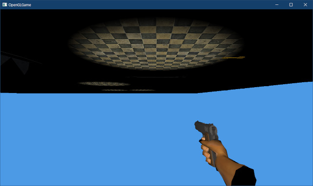

[OpenGL 3D 2023 後期 第03回]

# 球体の衝突判定

## 習得目標

* 
* 
* 
* 

## 1. 

### 1.1 球体と球体の交差判定

AABBは古き良き2Dゲームから受け継がれた偉大な衝突図形で、その単純さから2023年現在でもさまざまな用途で利用されています。

しかし、AABBは「すべての面が常にワールド座標系のXYZ軸に平行でなくてはならない」ため、図形の回転に対応できません。また、「四角い」ので、ボールのように丸い物体の表現にはまったく向いていません。

これらの問題に対応するために、いくつかの新しい衝突図形を追加することにします。

さて、最初に追加するのは「球体」です。2023年現在のほとんどのコンピューターにとって、球体はAABBよりも高速に交差判定を実行できます。球体は弾丸や爆発などの衝突判定に適しています。

`Collision.h`を開き、AABBの定義の下に、「球体の定義」を追加してください。

```diff
   vec3 min;
   vec3 max;
 };
+
+/**
+* 球体
+*/
+struct Sphere
+{
+  vec3 position; // 中心座標
+  float radius;  // 半径
+};

 /**
 * 光線
```

球体は「中心の座標」と「半径」の2つのパラメータによって定義されます。次に交差判定を行う関数を宣言します。光線の定義の下に、次の関数定義を追加してください。

```diff
   vec3 direction;
 };

 bool Intersect(const AABB& a, const AABB& b, vec3& penetration);
+bool Intersect(const Sphere& a, const Sphere& b, vec3& penetration);
+bool Intersect(const AABB& a, const Sphere& b, vec3& penetration);
+
 bool Intersect(const AABB& a, const Ray& b, float& distance);
+bool Intersect(const Sphere& a, const Ray& b, float& distance);

 #endif // COLLISION_H_INCLUDED
```

球体の交差判定を追加するには、「球体と球体」と「球体とAABB」、そして「球体と光線」という3種類の交差判定を定義する必要があります。

それでは「球体と球体」の交差判定を定義しましょう。`Collision.cpp`を開き、AABBとAABBの交差判定を行う`Intersect`関数の定義の下に、次のプログラムを追加してください。

```diff
  penetration = { 0, 0, signedLength.z };
  return true;
}
+
+/**
+* 球体と球体の交差判定
+*
+* @param a           判定対象の球体A
+* @param b           判定対象の球体B
+* @param penetration 貫通ベクトル
+*
+* @retval true  交差している
+* @retval false 交差していない
+*/
+bool Intersect(const Sphere& a, const Sphere& b, vec3& penetration)
+{
+  // 中心の間の距離の2乗を計算
+  const vec3 v = b.position - a.position; // aの中止からbの中心に向かうベクトル
+  const float d2 = dot(v, v); // vの長さの2乗
+
+  // d2が半径の合計より長い場合は交差していない
+  const float r = a.radius + b.radius; // aとbの半径の合計
+  if (d2 > r * r) { // 平方根を避けるため、2乗同士で比較する
+    return false;
+  }
+
+  // 交差しているので貫通ベクトルを求める
+  const float d = sqrt(d2); // 「長さの2乗」を「長さ」に変換
+  const float t = (r - d) / d; // 「半径の合計 - 長さ」の「長さに対する比率」を求める
+  penetration = v * t; // 貫通ベクトルを計算
+  return true;
+}

 /**
 * スラブ(ある軸に垂直な2平面に囲まれた範囲)と光線の交差判定
```

球体同士の交差判定は、「中心の間の距離」と「半径の合計」を比較します。計算上の工夫として、交差していると確定するまで「平方根の計算を延期」しています。平方根の計算は、加算や乗算の15～30倍(CPUによる)の時間がかかるからです。

球体同士の交差判定において、平方根は「中心の間の距離を求める」部分で使われます。しかし、「長さの比較は2乗同士でも成立する」という事実を利用すれば、平方根を求めなくても交差判定が可能です。

つまり、「中心の間の距離の2乗」と「半径の合計の2乗」を比較するわけです。これによって、交差していない場合は平方根の計算なしで判定が完了します。これが有効な理由は、「一般的な状況では、図形の大半は交差しない」と考えられるからです。

例えば、1000個の球体が箱に詰め込まれた状態を考えます。このように図形が密集した状態であっても、個々の球体と直接接触している他の球体の数はせいぜい10個程度でしょう。

そのため、交差していると判定されるのは1000回の交差判定中に10回だけです。つまり、990回は平方根の計算を回避できるわけです。

ここで作成した`Intersect`関数の場合、判定前に実行される計算は「加算x3, 減算x3, 乗算x4, 比較x1」で計11回です。ここに平方根が追加されると、最も高速なCPUを使っても11+15-1=25回相当の時間がかかります。

これは、交差しない場合には、平方根がない場合と比べて2倍以上遅くなることを意味します。もしCPUがより低速な場合は11+30-1=40回相当になり、平方根がない場合の約4倍の時間がかかります。

このような工夫を行うには、演算子や関数が計算にかかる時間をある程度は知っていなくてはなりません。およその感覚として、人間が難しいと感じる計算はコンピューターにとっても難しいことが多いです。

>**【小さな工夫の積み重ねが大きな違いを生む】**<br>
>こうした工夫は些細なことに思えます。しかし、プログラム全体でこのような工夫を積み重ねることで、最終的にゲームが処理できるデータ量には数倍の差が生まれます。これは、同じゲーム機用に、目を見張るようなグラフィックスのゲームと、見た目の冴えないゲームが混在する理由のひとつです。もっとも、グラフィックスが良いからといって面白いゲームであるとは限りませんが…。

### 1.2 AABBと球体の交差判定

次に、AABBと球体の交差判定を定義します。この判定のために、まずAABBと点の最近接点(さいきんせつてん)を求める関数を定義します。

AABBと点の最近接点は、点の座標をAABBの範囲に制限(クランプ)することで求められます。球体と球体の交差判定を行う`Intersect`関数の定義の下に、次のプログラムを追加してください。

```diff
   penetration = v * t; // 貫通ベクトルを計算
   return true;
 }
+
+/**
+* AABBから点への最近接点
+*
+* @param aabb  判定対象のAABB
+* @param point 判定対象の点
+*
+* @return AABBの中で最も点に近い座標
+*/
+vec3 ClosestPoint(const AABB& aabb, const vec3& point)
+{
+  vec3 result;
+  for (int i = 0; i < 3; ++i) {
+    result[i] = std::clamp(point[i], aabb.min[i], aabb.max[i]);
+  }
+  return result;
+}

 /**
 * スラブ(ある軸に垂直な2平面に囲まれた範囲)と光線の交差判定
```

`clamp`(クランプ)関数は、指定された範囲に制限された値を返します。

<p><code class="tnmai_code"><strong>【書式】</strong><br>
float std::clamp(元の値, 範囲の最小値, 範囲の最大値);
</code></p>

続いて、交差判定を行う関数を定義します。AABBと点の最近接点を求める`ClosestPoint`関数の定義の下に、次のプログラムを追加してください。

```diff
     result[i] = std::clamp(point[i], aabb.min[i], aabb.max[i]);
   }
   return result;
 }
+
+/**
+* AABBと球体の交差判定
+*
+* @param aabb        判定対象のAABB
+* @param sphere      判定対象の球体
+* @param penetration 貫通ベクトル
+*
+* @retval true  交差している
+* @retval false 交差していない
+*/
+bool Intersect(const AABB& aabb, const Sphere& sphere, vec3& penetration)
+{
+  // 最近接点までの距離が球体の半径より長ければ、交差していない
+  const vec3 p = ClosestPoint(aabb, sphere.position);
+  const vec3 v = sphere.position - p;
+  const float d2 = dot(v, v);
+  if (d2 > sphere.radius * sphere.radius) {
+    return false;
+  }
+
+  // 交差しているので、貫通ベクトルを求める
+
+  return true;
+}

 /**
 * スラブ(ある軸に垂直な2平面に囲まれた範囲)と光線の交差判定
```

AABBと球体の中心座標の最近接点を求めた後は、球体と球体の場合と同じ方法で交差判定を行います。ここでも2乗同士で比較を行い、平方根の計算を後回しにしています。

さて、交差していることが判明したら、次は貫通ベクトルを求めなくてはなりません。貫通ベクトルの求め方は、球体の中心がAABBの外部にある場合(距離が0より大きい)と、内部にある場合(距離が0)で異なります。

最初に、球体の中心がAABBの外にある場合を考えます。この場合、貫通ベクトルは「球体の中心から再近接点に向かう直線」になります。計算方法は「球体と球体の交差判定」と同じです。

交差判定を行うプログラムの下に、次のプログラムを追加してください。

```diff
     return false;
   }

   // 交差しているので、貫通ベクトルを求める
+
+  if (d2 > 0) {
+    // 距離が0より大きい場合、球体の中心はAABBの外側にある
+    // 球体の中心座標から最近接点へ向かう方向から衝突したとみなす
+    const float d = sqrt(d2);
+    penetration = v * ((sphere.radius - d) / d);
+  }

   return true;
 }
```

続いて、球体の中心がAABBの中にある場合を考えます。この場合、再近接点は球体の中心座標と一致するため、これらの座標から貫通ベクトルを求めることはできません。

この場合、「貫通距離が最も短くなる面」から衝突したとするのが一般的です。球体が突然AABBの内部に湧いて出たのでもない限り、「球体の中心に一番近い面を貫通してきた」というのは妥当な考えでしょう。

そこで、すべての面と最近接点の距離を調べて、最も短くなる方向を貫通ベクトルとします。球体の中心がAABBの外側にある場合のプログラムの下に、次のプログラムを追加してください。

```diff
     // 球体の中心座標から最近接点へ向かう方向から衝突したとみなす
     const float d = sqrt(d2);
     penetration = v * ((sphere.radius - d) / d);
+  } else {
+    // 距離が0の場合、球体の中心はAABBの内部にある
+    // 貫通距離が最も短い面から衝突したとみなす
+    int faceIndex = 0; // 貫通方向を示すインデックス
+    float distance = FLT_MAX; // 貫通距離
+    for (int i = 0; i < 3; ++i) {
+      float t0 = p[i] - aabb.min[i];
+      if (t0 < distance) {
+        faceIndex = i * 2;
+        distance = t0;
+      }
+      float t1 = aabb.max[i] - p[i];
+      if (t1 < distance) {
+        faceIndex = i * 2 + 1;
+        distance = t1;
+      }
+    }
+
+    // 「AABBが球体に対してどれだけ貫通しているか」を示すベクトルが欲しいので
+    // 面の外向きのベクトルを使う
+    static const vec3 faceNormals[] = {
+      {-1, 0, 0 }, { 1, 0, 0 }, // -X, +X,
+      { 0,-1, 0 }, { 0, 1, 0 }, // -Y, +Y,
+      { 0, 0,-1 }, { 0, 0, 1 }, // -Z, +Z,
+    };
+    penetration = faceNormals[faceIndex] * distance;
   }

   return true;
 }
```

このプログラムでは、`for`ループによってX, Y, Z軸方向の面との距離を比較し、距離が最小となる面を選びます。

>このような、`for`ループによってX, Y, Zを順番に処理する書き方ができるのは、`vec3`型の添字演算子をオーバーロードしたおかげです。

`faceIndex`(フェイス・インデックス)変数には選んだ面の番号が格納されます。`distance`(ディスタンス)には選んだ面の(つまり最小の)貫通距離が格納されます。

`faceNormals`(フェイス・ノーマルズ)配列には、面の番号に対応する単位ベクトルが格納されています。`faceIndex`を添え字にすることで、選んだ面に対応する貫通方向ベクトルが得られます。

「貫通方向ベクトル`faceNormals[faceIndex]`」と「貫通距離`distance`」を乗算すると、貫通ベクトルが得られます。

これで、AABBと球体の交差判定が完成しました。

### 1.3 球体と光線の交差判定

続いて、球体と光線の交差判定を行う関数を定義します。これは、高校数学で学習する「円と直線の共有点(交点)を求める」問題の３次元バージョンとして解くことができます。

光線の式`R`は、始点`P`、向き`D`、光線上の任意の位置を表す変数`t`を用いて次のように定義できます。

>`R(t) = P + t * D`

球体の式は、球体の中心`C`、半径`r`、球体表面の任意の座標を`X`とすると、次のように定義できます(`・`は内積を意味します)。

>`(X - C)・(X - C) = r²`

球体と光線が交差する座標は、`X`に光線の式`R(t)`を代入し、球体の式を満たす`t`を求めることで見つけられます。

>`(P + t * D - C)・(P + t * D - C) = r²`

ここで`m = P - C`とすると、上の式は次のようになります。

>`(t * D + m)・(t * D + m) = r²`

内積を展開すると、次のようになります。

>`(D・D)t² + 2(m・D)t + m・m = r²`

さらに、`D`は向きベクトルなので長さは`1`です。そのため`D・D = 1`となり、式をわずかに単純化できます。

>`t² + 2(m・D)t + m・m = r²`

この式に出てくる記号のうち`t`以外は定数です。つまり、`t`の２次方程式になっているわけです。そのため、式の解は「解の公式」

>`t = -b ± √(b² - c)`

によって与えられます。ここで`b`と`c`はそれぞれ`b = m・D`, `c = m・m - r²`です。

これで`t`を求めることができます。ただし、光線の始点があります。そのため、始点が球体の外にあり、球体から離れていく方向に発射された光線を見分けて、「交差していない」と判定することが重要です。

また、負の`t`は光線の始点より後ろ側で交差していることを意味します。この場合、`t`を`0`にして「始点=交点」とする必要があります。

それでは、AABBと光線の交差判定を行う`Intersect`関数の定義の下に、次のプログラムを追加してください。

```diff
   // 交点までの距離を設定
   distance = tmin;
   return true; // 交差している
 }
+
+/**
+* 球体と光線の交差判定
+*
+* @param[in]  sphere   判定対象の球体
+* @param[in]  ray      判定対象の光線
+* @param[out] distance 光線が球体と最初に交差する距離
+*
+* @retval true  交差している
+* @retval false 交差していない
+*/
+bool Intersect(const Sphere& sphere, const Ray& ray, float& distance)
+{
+  const vec3 m = ray.start - sphere.position;
+  const float b = dot(m, ray.direction);
+  const float c = dot(m, m) - sphere.radius * sphere.radius;
+
+  // 光線の始点が球体の外にあり(c > 0)、光線が球体から離れていく方向に
+  // 発射された(b > 0)場合、球体と光線は交差しない
+  if (c > 0 && b > 0) {
+    return false;
+  }
+
+  // 判別式が負の場合は解なし
+  const float d = b * b - c; // 判別式
+  if (d < 0) {
+    return false;
+  }
+
+  // 最初に交差する位置を計算
+  distance = -b - sqrt(d);
+
+  // 負の位置は始点より手前を指し、光線が球体内から発射されたことを意味する
+  // この場合、始点を「最初に交差する位置」とする
+  if (distance < 0) {
+    distance = 0;
+  }
+  return true;
+}
```

これで、球体と光線の交差判定は完成です。

### 1.4 基底コライダークラスを定義する

現在はAABBコライダーしか作成していないため、全ての衝突判定プログラムはAABBコライダー専用になっています。コライダーの種類を増やすには、「AABBコライダー専用プログラム」を「どんなコライダーでも動作するプログラム」に改造する必要があります。

さまざまなコライダーを処理するには、いろいろな方法が考えられます。よく使われるのは「全てのコライダーの共通基底クラス」を用意し、この「基底コライダークラス」を中心として衝突判定プログラムを組み上げる方法です。

本テキストでも、この「基底コライダークラス」を採用することにします。というわけで、早速「基底コライダークラス」を定義しましょう。クラス名は`Collider`(コライダー)とします。

プロジェクトの`Src/Engine`フォルダに`Collider.h`(コライダー・エイチ)という名前のヘッダファイルを追加してください。追加したファイルを開き、次のプログラムを追加してください。

```diff
+/**
+* @file Collider.h
+*/
+#ifndef COLLIDER_H_INCLUDED
+#define COLLIDER_H_INCLUDED
+#include "Component.h"
+#include "VecMath.h"
+#include <memory>
+
+// 先行宣言
+class Collider;
+using ColliderPtr = std::shared_ptr<Collider>;
+
+/**
+* コライダーの基底クラス
+*/
+class Collider : public Component
+{
+public:
+  Collider() = default;
+  virtual ~Collider() = default;
+
+  // 図形の種類
+  enum class Type {
+    AABB,   // 軸平行境界ボックス
+    Sphere, // 球体
+  };
+  virtual Type GetType() const = 0;
+
+  // 座標を変更する
+  virtual void AddPosition(const vec3& translate) = 0;
+
+  // 座標変換したコライダーを取得する
+  virtual ColliderPtr GetTransformedCollider(const mat4& transform) const = 0;
+
+  bool isTrigger = false; // true=重複を許可, false=重複を禁止
+  bool isStatic = false;  // true=動かない物体, false=動く物体
+};
+
+#endif // COLLIDER_H_INCLUDED
```

基底コライダークラスには、すべての図形のコライダーに必要なパラメータと仮想関数を持たせます。

`GetType`(ゲット・タイプ)仮想関数は、コライダーの実際の図形の種類を返します。派生クラスで適切な値を返すようにオーバーライドします。

`AddPosition`(アド・ポジション)仮想関数は、コライダーの座標を更新します。図形によって更新するデータが異なるため、派生クラスで適切にオーバーライドする必要があります。

`GetTransformedCollider`(ゲット・トランスフォームド・コライダー)仮想関数は、引数`transform`によって座標変換されたコライダーを返します。主にワールドコライダーを作成するために使用します。

### 1.5 AabbColliderをColliderの派生クラスにする

次に、`AabbCollider`クラスを`Collider`の派生クラスにします。`AabbzCollider.h`を開き、プログラムを次のように変更してください。

```diff
 */
 #ifndef AABBCOLLIDER_H_INCLUDED
 #define AABBCOLLIDER_H_INCLUDED
-#include "Component.h"
+#include "Collider.h"
 #include "Collision.h"
 
 /**
 * AABBコライダー
 */
-class AabbCollider : public Component
+class AabbCollider : public Collider
 {
 public:
   AabbCollider() = default;
   virtual ~AabbCollider() = default;

-  bool isTrigger = false; // true=重複を許可, false=重複を禁止
-  bool isStatic = false;  // true=動かない物体, false=動く物体
-  AABB aabb;              // 衝突判定
+  AABB aabb = { { -1, -1, -1 }, { 1, 1, 1 } }; // 図形(軸平行境界ボックス)
 };
```

メンバ変数`isTrigger`と`isStatic`は、同じものを`Collider`クラスに定義したので不要になりました。

続いて仮想関数をオーバーライドします。

```diff
  AabbCollider() = default;
  virtual ~AabbCollider() = default;
+
+  // 図形の種類
+  Type GetType() const override { return Type::AABB; }
+
+  // 座標を変更する
+  void AddPosition(const vec3& translate) override
+  {
+    aabb.min += translate;
+    aabb.max += translate;
+  }
+
+  /**
+  * 座標変換したコライダーを取得する
+  *
+  * 回転角度は90度単位で指定すること。それ以外の角度では正しい交差判定が行えない。
+  */ 
+  ColliderPtr GetTransformedCollider(const mat4& transform) const override
+  {
+    // 座標変換したコピーを作成
+    auto p = std::make_shared<AabbCollider>();
+    p->aabb.min = vec3(transform * vec4(aabb.min, 1));
+    p->aabb.max = vec3(transform * vec4(aabb.max, 1));
+
+    // minのほうが大きかったら入れ替える
+    for (int i = 0; i < 3; ++i) {
+      if (p->aabb.min[i] > p->aabb.max[i]) {
+        const float tmp = p->aabb.min[i];
+        p->aabb.min[i] = p->aabb.max[i];
+        p->aabb.max[i] = tmp;
+      }
+    }
+
+    return p;
+  }

   AABB aabb = { { -1, -1, -1 }, { 1, 1, 1 } }; // 図形(軸平行境界ボックス)
 };
```

これまで、AABBの回転は完全に無視していましたが、上記の`GetTransformCollider`メンバ関数では回転を反映させています。

回転を反映させるか、させないか、また反映させるにしてもどのように扱うかは少し迷ったのですが、素直に全て反映させることにしました。

この仕様では、回転角度を90°単位で指定しないと正しい衝突判定ができません。とはいえ、これはアプリ作成者側で気をつければなんとかなる範囲だと思います。

>90度単位以外が指定されていたら警告メッセージを出力したり、強制的に90度単位にそろえるようなプログラムを追加すると良いかもしれません。

それから、(仮想関数ではなく)普通のメンバ関数として、図形を取得するメンバ関数を定義します。`GetTransformedCollider`仮想関数の定義の下に、次のプログラムを追加してください。

```diff
     p->aabb.max = vec3(transform * vec4(aabb.max, 1));
     return p;
   }
+
+  // 図形を取得する
+  const AABB& GetShape() const { return aabb; }

   AABB aabb = { { -1, -1, -1 }, { 1, 1, 1 } }; // 図形(軸平行境界ボックス)
 };
```

このメンバ関数は、あとで`Engine`クラスの衝突判定プログラムを変更するときに利用します。

### 1.6 球体コライダークラスを定義する

次に、球体のコライダークラスを定義します。クラス名は`SphereCollider`(スフィア・コライダー)とします。

プロジェクトの`Src/Engine`フォルダに`SphereCollider.h`(スフィア・コライダー・エイチ)という名前のヘッダファイルを追加してください。追加したファイルを開き、次のプログラムを追加してください。

```diff
+/**
+* @file ShpereCollider.h
+*/
+#ifndef SPHERECOLLIDER_H_INCLUDED
+#define SPHERECOLLIDER_H_INCLUDED
+#include "Collider.h"
+#include "Collision.h"
+
+/**
+* 球体コライダー
+*/
+class SphereCollider : public Collider
+{
+public:
+  SphereCollider() = default;
+  virtual ~SphereCollider() = default;
+
+  // 図形の種類
+  Type GetType() const override { return Type::Sphere; }
+
+  // 座標を変更する
+  void AddPosition(const vec3& translate) override
+  {
+    sphere.position += translate;
+  }
+
+  // 座標変換したコライダーを取得する
+  ColliderPtr GetTransformedCollider(const mat4& transform) const override
+  {
+    // 中心座標を座標変換する
+    auto p = std::make_shared<SphereCollider>();
+    p->sphere.position = vec3(transform * vec4(sphere.position, 1));
+
+    // 球体の拡大率はオブジェクトのXYZ拡大率のうち最大のものとする(Unity準拠)
+    const float sx = std::copysign(length(vec3(transform[0])), transform[0].x);
+    const float sy = std::copysign(length(vec3(transform[1])), transform[1].y);
+    const float sz = std::copysign(length(vec3(transform[2])), transform[2].z);
+    const float scale = std::max({ sx, sy, sz });
+    p->sphere.radius = sphere.radius * scale;
+    return p;
+  }
+
+  // 図形を取得する
+  const Sphere& GetShape() const { return sphere; }
+
+  Sphere sphere = { vec3(0), 1 }; // 図形(球体)
+};
```

球体の拡大率は、XYZが等しくなくてはなりません。そうしないと楕円形になってしまい、球体として機能しないからです。

しかし、オブジェクトの拡大率はXYZを個別に指定できます。そこで、指定された「座標変換行列に含まれるXYZの拡大率のうちで最大の値」としました。これは、Unityのスフィアコライダーと同じ挙動です。

座標変換行列から拡大率だけを取り出すには、左上3x3部分の各行を3Dベクトルとして長さを求めます。長さからは元の符号が分からないので、`copysing`(コピー・サイン)関数で符号をコピーしています。

<p><code class="tnmai_code"><strong>【書式】</strong><br>
float std::copysign(符号を付ける値, 符号のコピー元になる値);
</code></p>

`copysign`関数は、第1引数の絶対値に、第2引数の符号を付けた値を返します。

>**【関数の戻り値を引数にするプログラムを読めるように練習する】**<br>
>`scale`を求めるプログラムは、`vec3`コンストラクタの戻り値を`length`関数の引数にして、`length`関数の戻り値を`copysign`関数の引数にして、`copysign`関数の戻り値を`max`関数の引数にする、ということを3回行い、`max`関数の戻り値を`scale`変数に代入する、という少々複雑な式になっています。慣れないうちは、このプログラムを読み解くのは難しいかもしれません。<br>
>とはいえ、プログラミングを続けていると、この規模のプログラムには何度も出会うことになるでしょう。今のうちに、ある程度の複雑さを持つプログラムを読む練習をしてください。

ところで、行列から拡大率を取り出す処理は、他のプログラムでも必要になるかもしれません。そこで、この機能を関数にします。関数名は`ExtractScale`(エクストラクト・スケール、「拡大率を抽出する」という意味)とします。`VecMath.h`を開き、ファイルの末尾に次のプログラムを追加してください。

```diff
     vec4{ scale.y * m.data[1], 0 },
     vec4{ scale.z * m.data[2], 0 },
     vec4{ position, 1 } };
 }
+
+// 4x4行列から拡大率を抽出する
+inline vec3 ExtractScale(const mat4& transform)
+{
+}

 #endif // VECMATH_H_INCLUDED
```

次に、`SphereCollider.h`に書いたばかりの「行列から拡大率を取り出す」プログラムを切り取ります。

```diff
     auto p = std::make_shared<SphereCollider>();
     p->sphere.position = vec3(transform * vec4(sphere.position, 1));

     // 球体の拡大率はオブジェクトのXYZ拡大率のうち最大のものとする(Unity準拠)
-    const float sx = std::copysign(length(vec3(transform[0])), transform[0].x);
-    const float sy = std::copysign(length(vec3(transform[1])), transform[1].y);
-    const float sz = std::copysign(length(vec3(transform[2])), transform[2].z);
     const float scale = std::max({ sx, sy, sz });
     p->sphere.radius = sphere.radius * scale;
```

`VecMath.h`を開き、切り取ったプログラムを`ExtractScale`関数に貼り付けてください。

```diff
 // 4x4行列から拡大率を抽出する
 inline vec3 ExtractScale(const mat4& transform)
 {
+  const float sx = std::copysign(length(vec3(transform[0])), transform[0].x);
+  const float sy = std::copysign(length(vec3(transform[1])), transform[1].y);
+  const float sz = std::copysign(length(vec3(transform[2])), transform[2].z);
 }

 #endif // VECMATH_H_INCLUDED
```

`ExtractScale`関数を完成させるために、`return`文を追加します。

```diff
   const float sx = std::copysign(length(vec3(transform[0])), transform[0].x);
   const float sy = std::copysign(length(vec3(transform[1])), transform[1].y);
   const float sz = std::copysign(length(vec3(transform[2])), transform[2].z);
+  return { sx, sy, sz };
 }

 #endif // VECMATH_H_INCLUDED
```

最後に、`SphereCollider.h`の拡大率を反映するプログラムを、次のように変更してください。

```diff
     auto p = std::make_shared<SphereCollider>();
     p->sphere.position = vec3(transform * vec4(sphere.position, 1));

     // 球体の拡大率はオブジェクトのXYZ拡大率のうち最大のものとする(Unity準拠)
-    const float scale = std::max({ sx, sy, sz });
-    p->sphere.radius = sphere.radius * scale;
+    const vec3 scale = ExtractScale(transform);
+    const float maxScale = std::max({ scale.x, scale.y, scale.z });
+    p->sphere.radius = sphere.radius * maxScale;
     return p;
   }
```

これで、「行列から拡大率を取り出す機能」を関数にすることができました。

### 1.7 GameObjectクラスをColliderに対応させる

とりあえず2種類のコライダーが用意できたので、衝突判定プログラムがそれらを使い分けられるようにしていきます。そのために、以下の4つを変更します。

>1. `GameObject`クラスが`AabbCollider`ではなく`Collider`を管理するように変更。
>2. `Engine`クラスに、座標変換行列を計算するプログラムを追加。
>3. `Engine`クラスの衝突判定プログラムを、多種のコライダーに対応できるように変更。
>4. `Engine`クラスのレイキャストプログラムを、多種のコライダーに対応できるように変更。
>5. `MainGameScene`クラスのレイキャストプログラムを、多種のコライダーに対応できるように変更。

それでは、1のゲームオブジェクトの変更から始めましょう。`GameObject.h`を開き、コライダー配列変数の定義を次のように変更してください。

```diff
   GameObject* parent = nullptr;      // 親オブジェクト
   std::vector<GameObject*> children; // 子オブジェクト
   std::vector<ComponentPtr> components; // コンポーネント配列
-  std::vector<AabbColliderPtr> colliders;  // コライダー配列
+  std::vector<ColliderPtr> colliders;   // コライダー配列
 };
 
 #endif // GAMEOBJECT_H_INCLUDED
```

次に、`AddComponent`メンバ関数テンプレートの定義を、次のように変更してください。

```diff
   std::shared_ptr<T> AddComponent() {
     auto p = std::make_shared<T>();
     p->owner = this;
-    if constexpr (std::is_base_of_v<T, AabbCollider>) {
+    if constexpr (std::is_base_of_v<Collider, T>) {
       colliders.push_back(p);
     }
```

型の変更に加えて、以前のテキスト(前期第06回)でテンプレート引数の順序を間違えて逆にしていたため、その修正も行っています。

それから、ゲームオブジェクトに座標変換行列を管理するメンバ変数を追加します。座標変換行列の作成は時間がかかる処理なので、同じフレーム中は再計算をしたくありません。このメンバ変数は、一度計算した値を覚えておくために使います。

`GameObject`クラスの定義に次のプログラムを追加してください。

```diff
 private:
   Engine* engine = nullptr;        // エンジンのアドレス
   bool isDestroyed = false;        // 死亡フラグ
+  mat4 transformMatrix = mat4(1);  // 座標変換行列
+  mat3 normalMatrix = mat3(1);     // 法線変換行列
   GameObject* parent = nullptr;      // 親オブジェクト
   std::vector<GameObject*> children; // 子オブジェクト
```

次に座標変換行列を取得するメンバ関数を追加します。`GetChild`メンバ関数の定義の下に次のプログラムを追加してください。

```diff
   * @return index番目の子オブジェクト
   */
   GameObject* GetChild(size_t index) const { return children[index]; }
+
+  // 座標変換行列を取得する
+  const mat4& GetTransformMatrix() const { return transformMatrix; }
+
+  // 法線変換行列を取得する
+  const mat3& GetNormalMatrix() const { return normalMatrix; }

   std::string name;                // オブジェクト名
   vec3 position  = { 0, 0, 0 };    // 物体の位置
```

これで，`GameObject`クラスの変更は完了です。

### 1.8 座標変換行列の計算を追加する

続いて、2の座標変換行列の計算プログラムを追加します。機能的には、前回のテキストで作成した「座標変換行列を計算するプログラム」と同一のものです。

実は、前回作成したプログラムでは、オブジェクトごとに全ての座標変換行列を計算していたため、あまり効率的とは言えないものでした。そこで、今回はもう少し効率的な計算方法を使うことにします。

アイデアは「自分の座標変換行列を先に計算しておく」というものです。事前に計算しておくことで、「親の座標変換行列を必要になるたびに計算する」という無駄を省けます。

まず自分の座標変換行列を計算しましょう。これは、自分だけのローカルな座標系の座標変換行列なので、「ローカル座標変換行列」と呼ぶことにします。`Engine.cpp`を開き、`UpdateGameObject`メンバ関数の定義に次のプログラムを追加してください。

```diff
     if (!e->IsDestroyed()) {
       e->Start();
       e->Update(deltaTime);
     }
   }
+  
+  // ローカル座標変換行列を計算
+  for (int i = 0; i < gameObjects.size(); ++i) {
+    GameObject* e = gameObjects[i].get();
+    e->transformMatrix = GetTransformMatrix(e->scale, e->rotation, e->position);
+    e->normalMatrix = GetRotationMatrix(e->rotation);
+  }
 } // UpdateGameObject

 /**
 * ゲームオブジェクトの衝突を処理する
```

このプログラムでは、自分自身のパラメータからローカル座標変換行列を作成します。次に、全ての親の座標変換行列をかけ合わせます。ローカル座標変換行列を計算するプログラムの下に、次のプログラムを追加してください。

```diff
     e->transformMatrix = GetTransformMatrix(e->scale, e->rotation, e->position);
     e->normalMatrix = GetRotationMatrix(e->rotation);
   }
+
+  // ワールド座標変換行列を計算
+  std::vector<mat4> worldTransforms(gameObjects.size());
+  std::vector<mat3> worldNormals(gameObjects.size());
+  for (int i = 0; i < gameObjects.size(); ++i) {
+    GameObject* e = gameObjects[i].get();
+    mat4 m = e->transformMatrix;
+    mat3 n = e->normalMatrix;
+    for (e = e->parent; e; e = e->parent) {
+      m = e->transformMatrix * m;
+      n = e->normalMatrix * n;
+    }
+    worldTransforms[i] = m;
+    worldNormals[i] = n;
+  }
 } // UpdateGameObject

 /**
 * ゲームオブジェクトの衝突を処理する
```

この部分は、前回の座標変換行列計算プログラムとほとんど同じです、違いは、親の座標変換行列を毎回計算する代わりに、先に計算したローカル座標変換行列を使っている点です。これによって、座標変換行列を作成する回数を減らしています。

計算されたワールド座標変換行列をメンバ変数に代入していない点に注目してください。これは、計算中にローカル座標変換行列を上書きしてしまうと、同じ親を持つ他のゲームオブジェクトの座標変換行列を計算できなくなってしまうためです。

最後に、計算結果のワールド座標変換行列をゲームオブジェクトのメンバ変数に代入します。ワールド座標変換行列を計算するプログラムの下に、次のプログラムを追加してください。

```diff
     worldTransforms[i] = m;
     worldNormals[i] = n;
   }
+
+  // ワールド座標変換行列をゲームオブジェクトに設定
+  for (int i = 0; i < gameObjects.size(); ++i) {
+    gameObjects[i]->transformMatrix = worldTransforms[i];
+    gameObjects[i]->normalMatrix = worldNormals[i];
+  }
 } // UpdateGameObject

 /**
 * ゲームオブジェクトの衝突を処理する
```

これで、ゲームオブジェクトの座標変換行列の計算は完成です。

>**【ムダはまだ隠れている】**<br>
>このプログラムには、親の座標変換行列を掛ける処理について、まだムダな部分があります。どこにムダがあるのか、どうすれば改善できるのかを考えてみてください(これは課題ではないので、実装するかどうかは各自に任せます)。

ところで、`UpdateGameObject`メンバ関数で座標変換行列の計算が完了するということは、これより後で呼び出される`DrawGameObject`メンバ関数にある座標変換行列を計算するプログラムは不要ということです。

そういうことなので、`DrawGameObject`メンバ関数の定義を次のように変更してください。

```diff
     // ユニフォーム変数にデータをコピー
     glProgramUniform4fv(prog, 100, 1, &e->color.x);
-
-    // 自分の座標変換ベクトル配列を求める
-    mat4 transform = GetTransformMatrix(e->scale, e->rotation, e->position);
-    mat3 transformNormal = GetRotationMatrix(e->rotation);
-
-    // すべての親の座標変換ベクトル配列をかけ合わせる
-    for (GameObject* p = e->parent; p; p = p->parent) {
-      mat4 parentTransform = GetTransformMatrix(p->scale, p->rotation, p->position);
-      mat3 parentTransformNormal = GetRotationMatrix(p->rotation);
-      transform = parentTransform * transform;
-      transformNormal = parentTransformNormal * transformNormal;
-    }
 
     // 座標変換ベクトルの配列をGPUメモリにコピー
-    glProgramUniformMatrix4fv(prog, 0, 1, GL_FALSE, &transform[0].x);
+    glProgramUniformMatrix4fv(prog, 0, 1, GL_FALSE, &e->GetTransformMatrix()[0].x);
     if (prog == *prog3D) {
-      glProgramUniformMatrix3fv(prog, 1, 1, GL_FALSE, &transformNormal[0].x);
+      glProgramUniformMatrix3fv(prog, 1, 1, GL_FALSE, &e->GetNormalMatrix()[0].x);
     }

     // 図形を描画
     if (e->materials.empty()) {
```

これで、事前に計算された座標変換行列が使われるようになりました(もっとも、親子関係を持つオブジェクトがほとんどない現状では、ほとんど速度には影響しないでしょうけれど)。

### 1.9 EngineクラスをColliderに対応させる

次に、3の「エンジンクラスの衝突判定プログラムを変更」を行います。`Engine.h`を開き、`WorldCollider`構造体の定義を次のように変更してください。

```diff
   struct WorldCollider
   {
     // 座標を変更する
     void AddPosition(const vec3& v) {
       origin->GetOwner()->position += v;
-      worldAabb.min += v;
-      worldAabb.max += v;
+      world->AddPosition(v);
     }

-    AabbColliderPtr origin;
-    AABB worldAabb;
+    ColliderPtr origin;
+    ColliderPtr world;
   };
   using WorldColliderList = std::vector<WorldCollider>;
```

次に`Engine.cpp`を開き、コライダーのヘッダファイルをインクルードしてください。

```diff
 #include "Engine.h"
 #include "ProgramPipeline.h"
 #include "EasyAudio/EasyAudio.h"
+#include "AabbCollider.h"
+#include "SphereCollider.h"
 #include "Debug.h"
 #include <string>
```

続いて、ワールドコライダーの作成方法を変更します。`HandleGameObjectCollision`メンバ関数の定義を次のように変更してください。

```diff
     WorldColliderList list(e->colliders.size());
     for (int i = 0; i < e->colliders.size(); ++i) {
       // オリジナルのコライダーをコピー
       list[i].origin = e->colliders[i];
-      list[i].worldAabb = e->colliders[i]->aabb;

       // コライダーの座標をワールド座標に変換
-      list[i].worldAabb.min *= e->scale;
-      list[i].worldAabb.max *= e->scale;
-      list[i].worldAabb.min += e->position;
-      list[i].worldAabb.max += e->position;
+      list[i].world = e->colliders[i]->GetTransformedCollider(e->GetTransformMatrix());
     }
     colliders.push_back(list);
   }
```

さて、実際のコライダーの型に対応する衝突判定関数を呼び出すには、コライダーの型ごとに関数を呼び分ける機能が必要です。

今は球体とAABBだけなので`if`や`switch`などで呼び分けるのは難しくないのですが、もっと図形を増やすとなると、全ての型の組み合わせについて呼び分けプログラムを書くのは結構な手間になると予想できます。

そこで、関数テンプレートを使います。関数テンプレートを使うことで、テンプレートパラメータによって異なる関数を呼び分けられます。関数名は`CallIntersect`(コール・インターセクト)とします。

`HandelGameObjectCollision`メンバ関数の定義の下に、次のプログラムを追加してください。

```diff
     } // for a
   }
 } // HandleGameObjectCollision
+
+/**
+* 型によって交差判定関数を呼び分けるための関数テンプレート
+*/
+template<typename T, typename U>
+bool CallIntersect(const ColliderPtr& a, const ColliderPtr& b, vec3& p)
+{
+  return Intersect(static_cast<T&>(*a).GetShape(),
+                   static_cast<U&>(*b).GetShape(), p);
+}

 /**
 * コライダー単位の衝突判定
```

また、例えばAABBと球体との交差判定は、ゲームオブジェクトの順序によって「AABBと球体」となる場合と「球体とAABB」となる場合の2通りが考えられます。しかし、交差判定関数は「AABBと球体」しか定義っしていません。

この問題に対処するため、ゲームオブジェクトの順序を逆にして交差判定関数を呼び出す`CallIntersectReverse`(コール・インターセクト・リバース)関数テンプレートを定義します。

`CallIntersect`関数テンプレートの定義の下に、次のプログラムを追加してください。

```diff
   return Intersect(static_cast<T&>(*a).GetShape(),
                    static_cast<U&>(*b).GetShape(), p);
 }
+
+/**
+* 型によって交差判定関数を呼び分けるための関数テンプレート
+*
+* 交差判定関数に渡す引数を逆にするバージョン
+*/
+template<typename T, typename U>
+bool CallIntersectReverse(const ColliderPtr& a, const ColliderPtr& b, vec3& p)
+{
+  if (Intersect(static_cast<U&>(*b).GetShape(),
+                static_cast<T&>(*a).GetShape(), p)) {
+    p *= -1; // 貫通ベクトルを逆向きにする
+    return true;
+  }
+  return false;
+}

 /**
 * コライダー単位の衝突判定
```

引数の順序を逆にしているだけでなく、結果の貫通ベクトルの向きを逆にしていることに注目してください。貫通ベクトルの向きは引数`a`, `b`の順序と密接に関係しているため、引数を逆にするなら貫通ベクトルも逆向きにする必要があります。

それでは、定義した関数テンプレートを使って衝突判定プログラムを変更しましょう。`HandleWorldColliderCollision`メンバ関数の定義を次のように変更してください。

```diff
 void Engine::HandleWorldColliderCollision(
   WorldColliderList* a, WorldColliderList* b)
 {
+  // 関数ポインタ型を定義
+  using FuncType = bool(*)(const ColliderPtr&, const ColliderPtr&, vec3&);
+
+  // 組み合わせに対応する交差判定関数を選ぶための配列
+  static const FuncType funcList[2][2] = {
+    {
+      CallIntersect<AabbCollider, AabbCollider>,
+      CallIntersect<AabbCollider, SphereCollider>,
+    }, {
+      CallIntersectReverse<SphereCollider, AabbCollider>,
+      CallIntersect<SphereCollider, SphereCollider>,
+    },
+  };
+
   // コライダー単位の衝突判定
   for (auto& colA : *a) {
     for (auto& colB : *b) {
       // スタティックコライダー同士は衝突しない
       if (colA.origin->isStatic && colB.origin->isStatic) {
         continue;
       }
       // 衝突判定を行う
       vec3 penetration;
+      const int typeA = static_cast<int>(colA.origin->GetType());
+      const int typeB = static_cast<int>(colB.origin->GetType());
-      if (Intersect(colA.worldAabb, colB.worldAabb, penetration)) {
+      if (funcList[typeA][typeB](colA.world, colB.world, penetration)) {
         GameObject* goA = colA.origin->GetOwner();
         GameObject* goB = colB.origin->GetOwner();
```

`FuncType`(ファンク・タイプ)は「関数ポインタ型」の定義です。関数ポインタ型を定義するには、関数名の部分に (*) を指定します。

`funcList`(ファンク・リスト)は関数ポインタの二次元配列です。このプログラムでは、コライダーの型によって関数を呼び分けるために使っています。

このプログラムでは、 `GetType`仮想関数によって型の番号を取得することで、実際の型に対応する関数を呼び出しています。もし GetType がなかったら、 dynamic_cast で型を識別したうえで、さらに`if`や`switch`で分岐させる必要があったでしょう。

このように「複数の型の組み合わせによって実行する関数を変えたい」場合、仮想関数では難しいことがあります。これは、仮想関数は「自身の型」しか考慮できないためです。

そこで、「関数ポインタと多次元配列を利用して、実行する関数を切り替える」方法を使うことにしました。これは「関数テーブル」と呼ばれる方法です。

これで衝突判定の変更は完了です。

>**【関数テーブル以外の⽅法】**<br>
>「ダブルディスパッチ」という、「仮想関数とオーバーロードを組み合わせる技法」を使うと、関数テーブルを置き換えることができます。

### 1.10 コライダーの衝突判定のバグ修正

ここでちょっとしたバグ修正をしておきます。そのバグとは、

>コライダー他院位の衝突判定において、同じゲームオブジェクトに属する他のコライダーを移動させていない

というものです。同じゲームオブジェクトに属するのなら、一緒に移動するべきなのに移動させていなかった、ということです。コライダーがひとつだけの場合は影響しないので、これまで発覚しませんでした。

ということで、`HandleWorldColliderCollision`メンバ関数にある「コライダーが重ならないように座標を調整」するプログラムを修正します。

作成するプログラムはごく短いのですが、複数の場所で同じプログラムを利用するので関数にしておきます。`Engine.h`を開き、`WorldColliderList`型の定義の下に次のプログラムを追加してください。

```diff
     ColliderPtr origin;
     ColliderPtr world;
   };
   using WorldColliderList = std::vector<WorldCollider>;
+  void ApplyPenetration(WorldColliderList*, GameObject*, const vec3&);

   int Initialize();
   void Update();
```

関数名は`ApplyPenetration`(アプライ・ペネトレーション、「貫通を適用する」という意味)としました。

次に`Engine.cpp`を開き、`CallIntersectReverse`関数の定義の下に、次のプログラムを追加してください。

```diff
     p *= -1;
     return true;
   }
   return false;
 }
+
+/**
+* 貫通ベクトルをゲームオブジェクトに反映する
+*/
+void Engine::ApplyPenetration(WorldColliderList* worldColliders,
+  GameObject* gameObject, const vec3& penetration)
+{
+  // ゲームオブジェクトを移動
+  gameObject->position += penetration;
+
+  // 全てのワールドコライダーを移動
+  for (auto& e : *worldColliders) {
+    e.world->AddPosition(penetration);
+  }
+}

/**
* コライダー単位の衝突判定
```

続いて、`HandleWorldColliderCollision`メンバ関数にある「コライダーが重ならないように座標を調整」するプログラムを、次のように変更してください。

```diff
     // コライダーが重ならないように座標を調整
     if (!colA.origin->isTrigger && !colB.origin->isTrigger) {
       if (colA.origin->isStatic) {
         // Aは動かないのでBを移動させる
-        colB.AddPosition(penetration);
+        ApplyPenetration(b, goB, penetration);
       } else if (colB.origin->isStatic) {
         // Bは動かないのでAを移動させる
-        colA.AddPosition(-penetration);
+        ApplyPenetration(a, goA, -penetration);
       } else {
         // AとBを均等に移動させる
-        colB.AddPosition(penetration * 0.5f);
-        colA.AddPosition(penetration * -0.5f);
+        ApplyPenetration(b, goB, penetration * 0.5f);
+        ApplyPenetration(a, goA, penetration * -0.5f);
       }
     }

     // イベント関数の呼び出し
     goA->OnCollision(colA.origin, colB.origin);
```

これで、同じゲームオブジェクトに属する全てのコライダーが、同時に移動するようになりました。

### 1.11 レイキャストをColliderに対応させる

`Engine`クラスで交差判定を使うプログラムは衝突判定だけはありません。レイキャストも交差判定を必要とします。まずレイキャストに使う構造体と関数型を変更します。`Engine.h`を開き、`RaycastHit`構造体の定義を次のように変更してください。

```diff
   // 光線の交差判定結果
   struct RaycastHit
   {
-    AabbColliderPtr collider; // 最初に光線と交差したコライダー
+    ColliderPtr collider;     // 最初に光線と交差したコライダー
     vec3 point;               // 最初の交点の座標
     float distance;           // 最初の交点までの距離
   };
```

次に、`RaycastPredicate`(レイキャスト・プレディケート)関数型の定義を次のように変更してください。

```diff
   * @retval true  交差判定の対象になる
   * @retval false 交差判定の対象にならない
   */
   using RaycastPredicate =
+    std::function<bool(const AabbColliderPtr& collider, float distance)>;
-    std::function<bool(const ColliderPtr& collider, float distance)>;

   /**
   * 光線とコライダーの交差判定
```

続いて`Engine.cpp`を開き、`Raycast`メンバ関数の定義を次のように変更してください。

```diff
   hitInfo.distance = FLT_MAX;

   for (const auto& go : gameObjects) {
     for (const auto& collider : go->colliders) {
-      // AABBをワールド座標系に変換
-      AABB worldAabb = {
-        collider->aabb.min * go->scale + go->position,
-        collider->aabb.max * go->scale + go->position };
+       // コライダーをワールド座標系に変換
+      const auto worldCollider =
+        collider->GetTransformedCollider(go->GetTransformMatrix());

       // 光線との交差判定
       float d;
+      bool hit = false;
+      switch (collider->GetType()) {
+      case Collider::Type::AABB:
+        hit = Intersect(static_cast<AabbCollider&>(*worldCollider).aabb, ray, d));
+        break;
+      case Collider::Type::Sphere:
+        hit = Intersect(static_cast<SphereCollider&>(*worldCollider).sphere, ray, d));
+        break;
+      }
-      if (!Intersect(worldAabb, ray, d)) {
+      if ( ! hit) {
         continue;
       }

       // 交差判定の対象でなければ飛ばす
```

気づいていた人もいると思いますが、これまでレイキャストは親子階層に対応していませんでした。今回の変更によって、レイキャストも親子階層に対応するようになっています。

レイキャストでは、2つの図形のうち片方は常に「光線」だと分かっているので分岐は単純です。この程度なら`switch`でも十分に機能します。

### 1.12 MainGameSceneクラスをColliderに対応させる

ここまでのプログラミングにより、ゲームエンジンに関する変更は終わりました。次はエンジンを利用している`MainGameScene`クラスを`Collider`クラスに対応させます。

`MainGameScene.cpp`を開き、`State_Playing`メンバ関数の定義にあるレイキャストを行うプログラムを、次のように変更してください。

```diff
     // クリックした位置から光線を飛ばす
     const Ray ray = engine.GetRayFromMousePosition();
     Engine::RaycastHit hitInfo;
     const bool hit = engine.Raycast(ray, hitInfo,
-      [](const AabbColliderPtr& collider, float distance) {
+      [](const ColliderPtr& collider, float distance) {
         // 交点が1m以内で、プレイヤーでないなら判定対象になる
         return distance < 1 && collider->GetOwner()->name != "player";
       });
```

レイキャストの引数に指定する述語型を変更したので、それに合わせてラムダ式の引数を変更しています。

プログラムが書けたらビルドして実行してください。衝突判定に多くの変更を加えましたが、とりあえず問題なく動作していれば成功です。

### 1.13 球体コライダーを試す

AABBに対する球体コライダーの利点は、AABBの角のようにとがった部分でも引っかからずに移動できることです。試してみたほうが分かると思うので、プレイヤーとマップの衝突判定を球体コライダーで行うように変更します。

`MainGameScene.cpp`を開き、`AdjustPosition`メンバ関数の衝突判定を次のように変更してください。

```diff
       walls.push_back(aabb);
     }
   } // for neighborOffsets
 
-  // 物体のAABBを作成
-  AABB a;
-  a.min = {
-    position.x - size.x * 0.5f,
-    position.y - size.y * 0.5f,
-    position.z - size.z * 0.5f, };
-  a.max = {
-    position.x + size.x * 0.5f,
-    position.y + size.y * 0.5f,
-    position.z + size.z * 0.5f, };
+  // 物体の交差判定を作成
+  Sphere a;
+  a.position = position;
+  a.radius = std::min({ size.x, size.y, size.z }) * 0.5f;
 
   // 物体と壁の衝突判定を実行
   vec3 newPos = position;
   for (const auto& e : walls) {
     vec3 penetration;
-    if (Intersect(a, e, penetration)) {
+    if (Intersect(e, a, penetration)) {
       // 交差しているので座標を補正
-      newPos.x -= penetration.x;
-      newPos.y -= penetration.y;
-      newPos.z -= penetration.z;
-      a.min = { a.min.x - penetration.x, a.min.y - penetration.y, a.min.z - penetration.z };
-      a.max = { a.max.x - penetration.x, a.max.y - penetration.y, a.max.z - penetration.z };
+      newPos += penetration;
+      a.position += penetration;
     }
   }
   return newPos; // 壁に重ならない座標を返す
```

`Intersect`関数の都合で「引数の順序を逆にしている」ことに注意してください。また、この変更によって貫通距離の向きが逆になるため、減算するのではなく加算するようにしています。

プログラムが書けたらビルドして実行してください。壁の角の部分にプレイヤーがぶつかったとき、プレイヤーが壁に沿ってすべるように移動したら成功です。

>もしプレイヤーが壁を乗り越えてしまう場合は、壁のAABBのサイズを調整してください。

大抵の人間などの動物は、壁のような角ばった部分がありません。そのため、AABBより球体のほうが衝突判定に向いています。また、底面が丸くなっていることで、多少の段差は乗り越えることができます。

>**【1章のまとめ】**
>
>* 
>* 
>* 

<div style="page-break-after: always"></div>

## 2. 階段と重力

### 2.1 階段を作成する

この章では、物理的に登り降りできる階段を作ります。まず階段モデルを用意します。

<pre class="tnmai_assignment">
<strong>【課題01】</strong>
Unityエディタなどの3Dモデルエディタを使って、5段の階段モデルを作成しなさい。大きさは2x2x2m(マップの1マスのサイズと同じ)で、一段の高さは0.4mとします。
階段の向きは、Z軸手前側から登れるようにすること(以下の画像のXYZ軸の表示を参考にするとよいでしょう)。
モデルには適当なマテリアル(テクスチャ)を設定しておくこと。

&emsp;&emsp;&emsp;&emsp;&emsp;&emsp;&emsp;[階段モデルの作例]

3Dモデルを作成したらOBJファイルとしてエクスポートし、プロジェクトの<code>Res/MeshData</code>フォルダに保存しなさい。ファイル名は<code>Stair.obj</code>としなさい(stairの読みは「ステア」、意味は「階段」です)。
</pre>

3Dモデルを作成したら、表示するために読み込みます。`Engine.cpp`を開き、`Initialize`メンバ関数に次のプログラムを追加してください。

```diff
   meshBuffer->LoadOBJ("Res/MeshData/glare.obj");
   meshBuffer->LoadOBJ("後期第02回 課題04で作成した手のOBJファイル名(武器に合うものを選ぶ)");
   meshBuffer->LoadOBJ("後期第02回 課題05で作成した武器のOBJファイル名");
+  meshBuffer->LoadOBJ("Res/MeshData/Stair.obj");

   // ゲームオブジェクト配列の容量を予約
   gameObjects.reserve(1000);
```

次に、階段をマップに配置し、階段状のコライダーを設定します。`MainGameScene.cpp`を開き、`Initialize`メンバ関数に次のプログラムを追加してください。

>これは階段の動作テストなので、座標は適当に調整してください。

```diff
   // プレイヤーとカメラをスタート地点に移動
   GameObject& camera = engine.GetMainCamera();
   player->position = camera.position = startPoint;
+
+  // 階段テスト
+  auto stair = engine.Create<GameObject>("stair");
+  stair->position = startPoint + vec3{2, -1, 0};
+  stair->rotation.y = radians(90); // 横を向ける
+  stair->staticMesh = engine.GetStaticMesh("Res/MeshData/HorrorHospitalPack/Stair.obj");
+  for (float i = 0; i < 5; ++i) {
+    // 階段状にAABBコライダーを設定
+    auto aabb = stair->AddComponent<AabbCollider>();
+    aabb->aabb = { {-1, 0,              -1.0f + 0.4f * i },
+                   { 1, 0.4f + 0.4f * i,-0.6f + 0.4f * i } };
+    aabb->isStatic = true;
+  }

   // OBJファイル表示テスト
   auto lowpoly = engine.Create<GameObject>("skull_lowpoly");
```

それから、いちばん大事なことがあります。それは、プレイヤーのコライダーを変更することです。`PlayerComponent.h`を開き、`SphereCollider.h`をインクルードしてください。

```diff
 #ifndef PLAYERCOMPONENT_H_INCLUDED
 #define PLAYERCOMPONENT_H_INCLUDED
 #include "Engine/Component.h"
+#include "Engine/SphereCollider.h"
 #include "Engine/Light.h"
 #include "Engine/Engine.h"
```

次に、`Awake`メンバ関数にコライダーを設定するプログラムを追加してください。

```diff
   virtual void Awake() override
   {
     auto owner = GetOwner();
     auto engine = owner->GetEngine();
+
+    // コライダーを設定
+    // 球体コライダーを上下に並べて置くことで、縦長の衝突形状を再現
+    for (float i = 0; i < 2; ++i) {
+      auto collider = owner->AddComponent<SphereCollider>();
+      collider->sphere.radius = 0.5f;
+      collider->sphere.position.y = -0.5f * i;
+    }

     // 手
     auto hand = engine->Create<GameObject>("player.hand", { 0.2f, -0.2f, -0.2f });
```

これで、`MainGameScene.cpp`にあるコライダーの設定プログラムは不要になります。`MainGameScene.cpp`を開き、`Initialize`メンバ関数にある「プレイヤーオブジェクトを追加するプログラム」を次のように変更してください。

```diff
   // プレイヤーオブジェクトを追加
   auto player = engine.Create<GameObject>("player", { 0, 10, 0 });
   playerComponent = player->AddComponent<PlayerComponent>();
-  auto collider = player->AddComponent<AabbCollider>();
-  collider->aabb = { { -0.5f, -1, -0.5f }, { 0.5f, 1, 0.5f } };

   // プレイヤーとカメラをスタート地点に移動
   GameObject& camera = engine.GetMainCamera();
```

プログラムが書けたらビルドして実行してください。プレイヤーの横に階段が表示されるので、階段を登ってみてください。うまく階段の上まで登れたら成功です。

>うまく階段を登れないときは、階段とプレイヤーのコライダーの設定を変更したり、階段の向きを変えることを試してみてください。

<p align="center">
&emsp;<br>
[左:階段 右:階段を登りきったところ]
</p>

### 2.2 重力を扱うコンポーネントを作成する

今度は階段を降りようとしてみてください。・・・降りられましたか？

おそらく降りられなかったと思います。階段を降りられない原因は「重力が働いていない」ことです。そこで重力を扱うコンポーネントを作成します。

実際に作成するのは、ゲームオブジェクトの速度を管理し、速度に重力加速度を加えるコンポーネントになります。名前は`CharacterMovement`(キャラクター・ムーブメント)とします。

プロジェクトの`Src/Engine`フォルダに`CharacterMovement.h`という名前のヘッダファイルを追加してください。追加したファイルを開き、次のプログラムを追加してください。

```diff
+/**
+* @file CharacterMovement.h
+*/
+#ifndef CHARACTERMOVEMENT_H_INCLUDED
+#define CHARACTERMOVEMENT_H_INCLUDED
+#include "Component.h"
+#include "GameObject.h"
+
+/**
+* ゲームオブジェクトの速度と重力を扱うコンポーネント
+*/
+class CharacterMovement : public Component
+{
+public:
+  // コンストラクタ・デストラクタ
+  CharacterMovement() = default;
+  virtual ~CharacterMovement() = default;
+
+  // 毎フレーム1回呼び出される
+  virtual void Update(float deltaTime) override
+  {
+    auto owner = GetOwner();
+
+    // 重力加速度によって速度を更新する
+    velocity.y -= gravity * gravityScale * deltaTime;
+
+    // 速度を座標に反映する
+    owner->position += velocity * deltaTime;
+  }
+
+  static constexpr float gravity = 9.81f; // 重力加速度
+  float gravityScale = 1; // 重力の影響を制御する係数
+  vec3 velocity = { 0, 0, 0 }; // 速度
+};
+using CharacterMovementPtr = std::shared_ptr<CharacterMovement>;
+
+#endif // CHARACTERMOVEMENT_H_INCLUDED
```

作成した`CharacterMovement`コンポーネントをプレイヤーに追加しましょう。まずは`PlayerComponent.h`を開き、`CharacterMovement.h`をインクルードしてください。

```diff
 #define PLAYERCOMPONENT_H_INCLUDED
 #include "Engine/Component.h"
 #include "Engine/SphereCollider.h"
+#include "Engine/CharacterMovement.h"
 #include "Engine/Light.h"
 #include "Engine/Engine.h"
```

次に、`Awake`メンバ関数に次のプログラムを追加してください。

```diff
       collider->sphere.radius = 0.5f;
       collider->sphere.position.y = -0.5f * i;
     }
+
+    owner->AddComponent<CharacterMovement>();

     // 手
     auto hand = engine->Create<GameObject>("player.hand", { 0.2f, -0.2f, -0.2f });
```

プログラムが書けたらビルドして実行してください。プレイヤーが地の底に落下していったら成功です。

<p align="center">
<br>
[プレイヤー地の底へ落下中]
</p>

### 2.3 接地判定(せっちはんてい)を追加する

落下してしまうのは、床にコライダーを設定していないからです。`MainGameScene.cpp`を開き、床を作成するプログラムの下に、次のプログラムを追加してください。

```diff
       floor->position = { posX, 0, posZ };
       floor->staticMesh = meshFloor;
     } // for x
   } // for y
+
+  // 床のコライダーを作成
+  {
+    auto floor = engine.Create<GameObject>("floor.collider");
+    auto collider = floor->AddComponent<AabbCollider>();
+    collider->aabb.min = { 0, -1, 0 };
+    collider->aabb.max = vec3(static_cast<float>(mapSizeX), 0,
+      static_cast<float>(mapSizeY)) * squareSize;
+    collider->isStatic = true;
+  }

   // プレイヤーのスタート地点
   vec3 startPoint = { 3, 1.2f, 3 };
```

プログラムが書けたらビルドして実行してください。プレイヤーが地の底へ落下しなくなっていたら成功です。

しかし、なぜか階段を上ることができません。それに、手が徐々に下に下がっていっているのも気になります。そして、しばらく待っていると、やっぱりプレイヤーは地の底へと案内されてしまいます。

<p align="center">
&emsp;<br>
[左:手と武器の位置が下がっている 右:再び地の底へご案内]
</p>

原因は、「床と衝突しているのに落下速度がリセットされない」ことにあります。そこで、床と衝突したかどうかを判定できるようにします。

まず「ゲームオブジェクトが床に触れているか」を表すフラグを定義します。変数名は`isGrounded`(イズ・グラウンデッド、「接地しているか？」という意味)としましょう。

`isGrounded`変数はオブジェクトが床に触れていたら`true`、触れていなければ`false`になります。

床の判定は「他の物体と衝突した角度」によって判定します。「衝突した角度」は「貫通ベクトル」から求められます。「貫通ベクトル」はゲームエンジンで行う衝突判定の中で計算されます。

そのため、`isGrounded`変数は、ゲームエンジンから簡単に操作できるところに定義するのがよいでしょう。こういう場合、`GameObject`クラスに追加するのが手軽です。

`GameObject.h`を開き、`isGrounded`メンバ変数の定義を追加してください。

```diff
   StaticMeshPtr staticMesh;        // 表示するスタティックメッシュ
   MaterialList materials;          // スタティックメッシュ用のマテリアル配列
   int renderQueue = RenderQueue_geometry; // 描画順
+  bool isGrounded = false;         // 足場となる物体の上に乗っているとtrueになる

 private:
   Engine* engine = nullptr;        // エンジンのアドレス
```

`isGrounded`メンバ変数は、衝突判定の直前で`false`に設定します。そして、床との衝突が起こったら`true`に設定します。

`Engine.cpp`を開き、`HandleGameObjectCollision`メンバ関数の定義に、`isGrounded`を`false`にするプログラムを追加してください。

```diff
   for (const auto& e : gameObjects) {
     if (e->colliders.empty()) {
       continue;
     }
+
+    // 「接地していない」状態にする
+    e->isGrounded = false;

     // 衝突判定を作成
     WorldColliderList list(e->colliders.size());
```

次に、床を判定して`isGrounded`を`true`にするプログラムを作成します。判定方法は、「貫通ベクトルと垂直ベクトルの角度が一定値以下かどうか」で行います。

2つの単位ベクトルのなす角は「内積」で求められます。ここでは貫通ベクトル`(px, py, pz)`と垂直ベクトル`(0, 1, 0)`の内積を求めることになります。貫通ベクトルを`P`, 垂直ベクトルを`V`とすると、この2つの内積は以下の式になります。

`|P||V|cosθ = px * 0 + py * 1 + pz * 0`

`px * 0`と`pz * 0`の計算結果は常に`0`なので消去できます。また、`py * 1`も`py`に省略できます。

`|P||V|cosθ = py`

それから、垂直ベクトル`V`の長さは`1`なので、`|V|`も消去できます。すると次の式になります。

`|P|cosθ = py`

この式が意味するところは、「貫通ベクトルと垂直ベクトルのなす角は、貫通ベクトルのY要素で表される」ということです。

そして、貫通ベクトルは衝突面に対して垂直に作られます(なぜなら、それが最短距離だからです)。そのため、「衝突ベクトルが(ワールド座標系の)垂直に近い」ならば「衝突面は(ワールド座標系の)水平に近い」と言えます。

この式を`ApplyPenetration`メンバ関数の定義に次のプログラムを追加してください。

```diff
 void Engine::ApplyPenetration(WorldColliderList* worldColliders,
   GameObject* gameObject, const vec3& penetration)
 {
+  // 接地判定
+  // 衝突ベクトルが垂直に近い場合に、床に触れたとみなす
+  static const float cosGround = cos(radians(30)); // 床とみなす角度
+  if (penetration.y > 0) {
+    // 対象が単位垂直ベクトルであることを利用して、内積による角度の比較を単純化
+    const float d = length(penetration);
+    if (penetration.y >= d * cosGround) {
+      gameObject->isGrounded = true; // 接地した
+    }
+  } // if penetration.y
+
  gameObject->position += penetration;
  for (auto& e : *worldColliders) {
```

最初の`if`文で「`penetration.y`が`0`より大きい」ことを判定しているのは、簡単に除外できる角度はベクトルの長さを求める前に除外したかったからです。

正負の判定は長さを求めなくても行えるため、時間のかかる`length`関数を使う前に除外することで、平均的な処理速度の向上が期待できます。

>`penetration.y`が`0`以下というのは「衝突面の角度が90度以上の場合」で、これはもう「壁」や「天井」と言うべきでしょう。

本来の角度の判定は、2個目の`if`文で行っています。高速化のため`θ`を求めずに`cosθ`のまま比較している点に注目してください。角度の大小を比較するだけなら`cosθ`同士でも比較できます。

これによって`acos`関数を呼び出すコストを削減できます。ただし、`cosθ`の場合は「`θ`が大きくなるほど値が**小さく**なる」ため、不等号の向きが`θ`とは逆になることに注意してください。

これで、床にいるかどうかが判定できるようになりました。`CharacterMovement.h`を開き、`Update`メンバ関数の定義に床の判定を追加してください。

```diff
   // 毎フレーム1回呼び出される
   virtual void Update(float deltaTime) override
   {
     auto owner = GetOwner();

+    if (owner->isGrounded) {
+      // 接地フラグが立っていたら、下方向への加速度を0にする
+      velocity.y = std::max(velocity.y, 0.0f);
+    } else {
       // 重力加速度によって速度を更新する
       velocity.y -= gravity * gravityScale * deltaTime;
+    }

     // 速度を座標に反映する
     owner->position += velocity * deltaTime;
```

プログラムが書けたらビルドして実行してください。階段を上ることができ、手が下がっていくこともなく、ずっと待っていても地の底に落ちていくことがなくなっていたら成功です。

>**【2章のまとめ】**
>
>* 
>* 
>* 
