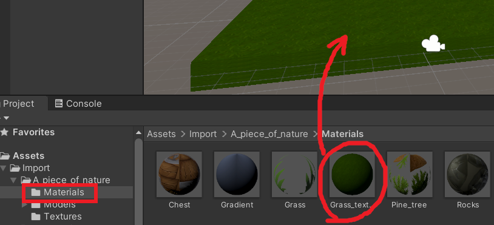
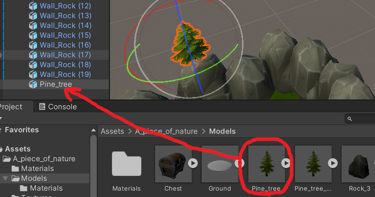
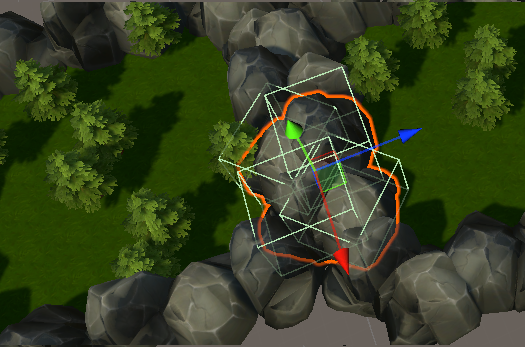
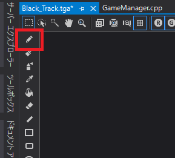
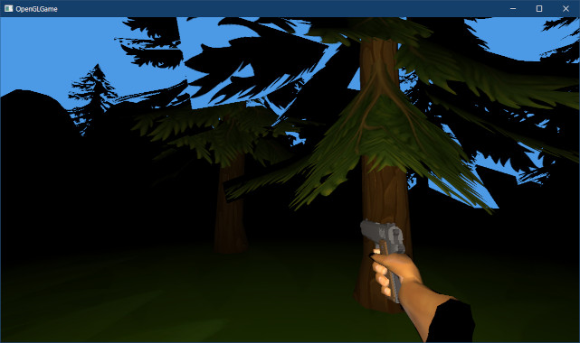
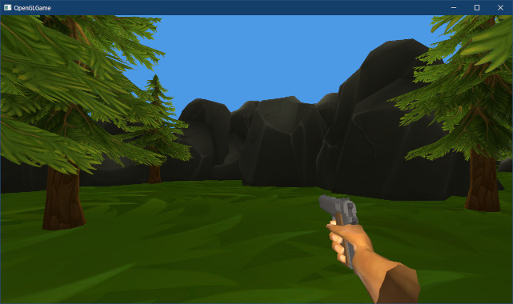

[OpenGL 3D 2023 後期 第04回]

# 有向境界ボックスとレベルデザイン

## 習得目標

* OBBを実装し、衝突判定の自由度を上げる。
* 実用に耐えるレベルをデザインする。
* 
* 

## 1. 球体とOBBの交差判定

### 1.1 有向境界ボックス(OBB)を定義する

AABBは「交差判定が高速」という点で非常に強力なツールです。しかし、「すべての面が軸と平行」なので、マップ構成が単純になるという欠点があります(斜めの壁や坂道を再現できない等)。

斜めの壁や坂道を表現するには、「好きな向きで配置できる直方体」が必要です。これは、日本語では「有向境界(ゆうこう・きょうかい)ボックス」、英語では`Oriented Bounding Box`(オリエンテッド・バウンディング・ボックス)と呼ばれます。

短縮形はOBB(オービービー)で、これは`Oriented Bounding Box`の頭文字です。OBBは多くのゲームエンジンで「ボックス・コライダー」として知られています。本テキストでも、コライダーの名前には`Box`を使うことにします。

OBBは次の3つのパラメータによって定義されます。

>* 中心座標
>* 3つの軸の向きベクトル
>* 3つの軸方向の拡大率

これを実際に定義してみましょう。`Collision.h`を開き、`Sphere`構造体の定義の下に、次のプログラムを追加してください。

```diff
 struct Sphere
 {
   vec3 position; // 中心座標
   float radius;  // 半径
 };
+
+/**
+* 有向境界ボックス(OBB)
+*/
+struct Box 
+{
+  vec3 position; // 中心座標
+  vec3 axis[3];  // 軸の向きベクトル
+  vec3 scale;    // 拡大率
+};

 /**
 * 光線
```

### 1.2 OBBと球体の最近接点

次に、有向境界ボックス(OBB)と球体の交差判定を行う関数を定義します。AABBと球体の`Intersect`関数の宣言の下に、次の宣言を追加してください。

```diff
 bool Intersect(const AABB& a, const AABB& b, vec3& penetration);
 bool Intersect(const Sphere& a, const Sphere& b, vec3& penetration);
 bool Intersect(const AABB& a, const Sphere& b, vec3& penetration);
+bool Intersect(const Box& box, const Sphere& sphere, vec3& penetration);

 bool Intersect(const AABB& a, const Ray& b, float& distance);
 bool Intersect(const Sphere& a, const Ray& b, float& distance);
```

OBBと球体の交差判定は、AABBの場合と同様に「最近接点」を求めることで実現できます。そこで、まずは最近接点を求める`ClosestPoint`(クローゼスト・ポイント)関数を定義します。

この関数は、次のような手順で最近接点を求めます。軸の向きを考慮する必要があるため、AABBの場合と比べると手順が複雑です。

<p align="center">
<br>[1. OBBの中心から球体中心へのベクトルを求める]<br><br>
<br>[2. ベクトルをOBBのX, Y, Z軸に射影する]<br><br>
<br>[3. 射影した長さをOBBのスケールに制限する]<br>
</p>

射影は内積(`dot`関数)によって求められます。それでは、`Collision.cpp`を開き、AABBと球体の`Intersect`関数の定義の下に、次のプログラムを追加してください。

```diff
     penetration = faceNormals[faceIndex] * distance;
   }
   return true;
 }
+
+/**
+* OBBから点への最近接点
+*
+* @param box   判定対象のOBB
+* @param point 判定対象の点
+*
+* @return 長方形の中で最も点に近い座標
+*/
+vec3 ClosestPoint(const Box& box, const vec3& point)
+{
+  // OBBから点に向かうベクトル
+  const vec3 v = point - box.position;
+
+  vec3 result = box.position;
+  for (int i = 0; i < 3; ++i) {
+    // ベクトルをOBBの軸に射影
+    float d = dot(v, box.axis[i]);
+
+    // 射影で得られた値をOBBの範囲内に制限
+    d = std::clamp(d, -box.scale[i], box.scale[i]);
+
+    // 最近接点を更新
+    result += d * box.axis[i];
+  }
+  return result;
+}

 /**
 * スラブ(ある軸に垂直な2平面に囲まれた範囲)と光線の交差判定
```

>ところで、AABBは「3つの軸がワールド座標系の軸と一致しているOBB」とも考えられます。そのため、OBB用の`ClosestPoint`関数はAABBと点の最近接点も求められます。<br>
>実際、AABB用の`ClosestPoint`関数は、「ワールド座標系の軸を持つOBBを前提として最適化したOBB用の`ClosestPoint`関数」になっています。

### 1.3 OBBと球体の交差判定

次に、OBB用の`ClosestPoint`関数を使って「OBBと球体の交差判定」を定義します。OBB用の`ClosestPoint`関数の定義の下に、次のプログラムを追加してください。

```diff
     result += d * box.axis[i];
   }
   return result;
 }
+
+/**
+* OBBと球体の交差判定
+*
+* @param box         判定対象のOBB
+* @param sphere      判定対象の球体
+* @param penetration 貫通ベクトル
+*
+* @retval true  交差している
+* @retval false 交差していない
+*/
+bool Intersect(const Box& box, const Sphere& sphere, vec3& penetration)
+{
+  // 最近接点から球体の中心までの距離が、球体の半径より大きければ衝突していない
+  const vec3 p = ClosestPoint(box, sphere.position);
+  const vec3 v = sphere.position - p;
+  const float d2 = dot(v, v);
+  if (d2 > sphere.radius * sphere.radius) {
+    return false;
+  }
+
+  if (d2 > 0.00001f) {
+    // 距離が0より大きい場合、球体の中心はOBBの外側にある
+    // この場合、最近接から球体の中心へ向かう方向から衝突したとみなす
+    const float d = sqrt(d2);
+    penetration = v * ((sphere.radius - d) / d);
+  } else {
+    // 距離が0の場合、球体の中心はOBBの内部にある
+    // この場合、貫通距離が最も短い面から衝突したとみなす
+  }
+  return true;
+}

 /**
 * スラブ(ある軸に垂直な2平面に囲まれた範囲)と光線の交差判定
```

OBB用の`Intersect`関数とAABB用の`Intersect`関数と見比べてみてください。両者の違いは「呼び出している`ClosestPoint`関数が異なる」くらいで、ほぼ同一のプログラムとなっていることが分かると思います。

このプログラムに、距離が0の場合のプログラムを追加します。これも基本的な部分はAABB用の`Intersect`関数と同じです。`else`節の中に、次のプログラムを追加してください。

```diff
   } else {
     // 距離が0の場合、球体の中心はOBBの内部にある
     // この場合、貫通距離が最も短い面から衝突したとみなす
+    const vec3 a = p - box.position; // OBB中心から球体中心へのベクトル
+    int faceIndex = 0; // 貫通方向を示すインデックス
+    float distance = FLT_MAX; // 貫通距離
+    float sign = 1; // 貫通ベクトルの符号
+    for (int i = 0; i < 3; ++i) {
+      const float f = dot(box.axis[i], a); // aを軸ベクトルに射影
+      const float t0 = f - (-box.scale[i]);
+      if (t0 < distance) {
+        faceIndex = i;
+        distance = t0;
+        sign = -1;
+      }
+      const float t1 = box.scale[i] - f;
+      if (t1 < distance) {
+        faceIndex = i;
+        distance = t1;
+        sign = 1;
+      }
+    }
+    penetration = box.axis[faceIndex] * (distance * sign);
   }
   return true;
 }
```

OBBの場合、貫通ベクトルには`axis`配列が利用できます。そのため、AABBのように貫通ベクトル配列を定義する必要はありません。

これで、OBBと球体の交差判定は完成です。

### 1.4 ボックスコライダーを定義する

OBBとの衝突を処理するために「ボックスコライダー」を定義します。まず新しい衝突図形を表す列挙値を追加します。`Collider.h`を開き、`Type`列挙型の定義に次のプログラムを追加してください。

```diff
   // 形状
   enum class Type {
     AABB,   // 軸平行境界ボックス
     Sphere, // 球体
+    Box,    // 有向境界ボックス
   };
   virtual Type GetType() const = 0;
```

次に、プロジェクトの`Src/Engine`フォルダに`BoxCollider.h`という名前のヘッダファイルを作成してください。作成したファイルを開き、次のプログラムを追加してください。

```diff
+/**
+* @file BoxCollider.h
+*/
+#ifndef BOXCOLLIDER_H_INCLUDED
+#define BOXCOLLIDER_H_INCLUDED
+#include "Collider.h"
+#include "Collision.h"
+
+/**
+* BOXコライダー
+*/
+class BoxCollider : public Collider
+{
+public:
+  BoxCollider() = default;
+  virtual ~BoxCollider() = default;
+
+  // 図形の種類
+  Type GetType() const override { return Type::Box; }
+
+  // 座標を変更する
+  void AddPosition(const vec3& translate) override
+  {
+    box.position += translate;
+  }
+
+  // 座標変換したコライダーを取得する
+  ColliderPtr GetTransformedCollider(const mat4& transform) const override
+  {
+    // 座標変換したコピーを作成
+    auto p = std::make_shared<BoxCollider>();
+    return p;
+  }
+
+  // 図形を取得する
+  const Box& GetShape() const { return box; }
+
+  Box box = {
+    { 0, 0, 0 },
+    { { 1, 0, 0}, { 0, 1, 0 }, { 0, 0, 1} },
+    { 1, 1, 1 } };
+};
+using BoxColliderPtr = std::shared_ptr<BoxCollider>;
+
+#endif // BOXCOLLIDER_H_INCLUDED
```

OBBを扱う場合に少し面倒なのが、ワールド座標系のコライダーに変換する処理です。OBBは「中心座標」、「3つの軸ベクトル」、「3つの拡大率」と多くの要素を持つうえ、それぞれ変換方法が異なるためです。

特に軸ベクトルは「向きベクトル」なので、座標変換行列では変換できません。座標変換行列から回転行列を抽出し、抽出した回転行列によって変換しなくてはなりません。

回転行列の抽出では、処理の都合で拡大率も抽出する必要があります。そこで、汎用性を考えて、平行移動、拡大率、回転行列の3つを抽出する関数を定義することにします。関数名は`Decompose`(デコンポーズ、「分解する」という意味)とします)。

`VecMath.h`を開き、`ExtractScale`関数の定義の下に、次のプログラムを追加してください。

```diff
   const float sy = length(vec3(transform[1]));
   const float sz = length(vec3(transform[2]));
   return { sx, sy, sz };
 }
+
+/**
+* 座標変換行列を平行移動、拡大率、回転行列の各成分に分解する
+*
+* @param[in]  transform 分解元の座標変換行列
+* @param[out] translate 平行移動の格納先となる変数
+* @param[out] scale     拡大率の格納先となる変数
+* @param[out] rotation  回転行列の格納先となる変数
+*/
+inline void Decompose(const mat4& transform,
+  vec3& translate, vec3& scale, mat3& rotation)
+{
+  // 平行移動を分解
+  translate = vec3(transform[3]);
+
+  // 拡大率を分解
+  scale = ExtractScale(transform);
+
+  // 回転行列を分解
+  rotation = mat3(transform);
+  rotation[0] /= scale.x;
+  rotation[1] /= scale.y;
+  rotation[2] /= scale.z;
+}

 #endif // VECMATH_H_INCLUDED
```

このプログラムによって3つの成分が分解できる理由は、`GetTransformMatrix`関数の内容を見ると理解できるでしょう。

それでは、作成した`Decompose`関数を使ってOBBをワールド座標系に変換しましょう。`GetTransformedCollider`メンバ関数の定義に次のプログラムを追加してください。

```diff
   ColliderPtr GetTransformedCollider(const mat4& transform) const override
   {
+    // 座標変換行列を分解
+    vec3 translate; // 未使用
+    vec3 scale;
+    mat3 rotation;
+    Decompose(transform, translate, scale, rotation);
+
     // 座標変換したコピーを作成
     auto p = std::make_shared<BoxCollider>();
+    p->box.position = vec3(transform * vec4(box.position, 1));
+    for (int i = 0; i < 3; ++i) {
+      p->box.axis[i] = rotation * box.axis[i]; // 軸ベクトル
+      p->box.scale[i] = box.scale[i] * scale[i]; // 拡大率
+    }
     return p;
   }
```

このように、OBBの座標変換では、「中心座標」、「軸ベクトル」、「拡大率」のそれぞれについて、異なる変換を実行する必要があります。

### 1.5 ゲームエンジンにボックスコライダーの衝突判定を追加する

続いて、ゲームエンジンにボックスコライダーの衝突判定を行うプログラムを追加します。`Engine.cpp`を開き、`BoxCollider.h`をインクルードしてください。

```diff
 #include "ProgramPipeline.h"
 #include "EasyAudio/EasyAudio.h"
 #include "SphereCollider.h"
+#include "BoxCollider.h"
 #include "Debug.h"
 #include <string>
```

ところで、いまのところAABBとOBBの交差判定は作成していません。そこで、この組み合わせの場合は常に`false`を返すことにします。`CallIntersectReverse`関数テンプレートの定義の下に、`NotImplemented`(ノット・インプリメンテッド、「実装されていない」という意味)という名前の関数を追加してください。

```diff
     p *= -1;
     return true;
   }
   return false;
 }
+
+/**
+* 常にfalseを返す関数テンプレート
+*
+* 未実装または実装予定のない組み合わせ用
+*/
+template<typename T, typename U>
+bool NotImplemented(const ColliderPtr& a, const ColliderPtr& b, vec3& p)
+{
+  return false;
+}

 /**
 * 貫通ベクトルをゲームオブジェクトに反映する
```

次に`HandleWorldCollderCollision`メンバ関数の定義にある`funcList`配列を、次のように変更してください。

```diff
   // 関数ポインタ型を定義
   using FuncType = bool(*)(const ColliderPtr&, const ColliderPtr&, vec3&);

   // 組み合わせに対応する交差判定関数を選ぶための配列
-  static const FuncType funcList[2][2] = {
+  static const FuncType funcList[3][3] = {
     {
       CallIntersect<AabbCollider, AabbCollider>,
       CallIntersect<AabbCollider, SphereCollider>,
+      NotImplemented<AabbCollider, BoxCollider>,
     }, {
       CallIntersectReverse<SphereCollider, AabbCollider>,
       CallIntersect<SphereCollider, SphereCollider>,
+      CallIntersectReverse<SphereCollider, BoxCollider>,
+    }, {
+      NotImplemented<BoxCollider, AabbCollider>,
+      CallIntersect<BoxCollider, SphereCollider>,
+      NotImplemented<BoxCollider, BoxCollider>,
     },
   };
```

### 1.6 ボックスコライダーを試す

それでは、ボックスコライダーを使ってどんな挙動になるかを確認しましょう。`MainGameScene.cpp`を開き、`BoxCollider.h`をインクルードしてください。

```diff
 #include "Engine/Engine.h"
 #include "Engine/Collision.h"
 #include "Engine/SphereCollider.h"
+#include "Engine/BoxCollider.h"
 #include <string>
 #include <fstream>
```

```diff
   // プレイヤーとカメラをスタート地点に移動
   GameObject& camera = engine.GetMainCamera();
   player->position = camera.position = startPoint;
   player->rotation = camera.rotation = { 0, 3.14f, 0 }; // +Z方向に向ける
+
+  // ボックスコライダーのテスト
+  {
+    auto box = engine.Create<GameObject>("box collider test");
+    box->position = startPoint + vec3{ 0, -1.2f, 2 };
+    box->staticMesh = engine.GetStaticMesh("box");
+    box->rotation.x = radians(25);
+    box->rotation.y = radians(45);
+    auto collider = box->AddComponent<BoxCollider>();
+    collider->isStatic = true;
+  }

   // 階段テスト
   auto stair = engine.Create<GameObject>("stair");
   stair->position = startPoint + vec3{ 2, -1, 0 };
```

プログラムが書けたらビルドして実行してください。傾いた箱が表示されるので、箱にプレイヤーを押し付けて衝突判定を調べてください。箱の傾きどおりの衝突判定だと感じられたら成功です。

<p align="center">
<br>
</p>

### 1.7 有向スラブと光線の交差判定

OBBをクリックして選択できるように、OBBと光線の交差判定を定義します。`Collision.h`を開き、OBB(ボックス)と光線の交差判定を行う`Intersect`関数を宣言してください。

```diff
 bool Intersect(const Box& box, const Sphere& sphere, vec3& penetration);

 bool Intersect(const AABB& a, const Ray& b, float& distance);
 bool Intersect(const Sphere& a, const Ray& b, float& distance);
+bool Intersect(const Box& a, const Ray& b, float& distance);

 #endif // COLLISION_H_INCLUDED
```

「OBBと球体の交差判定」が「AABBと球体の交差判定」と似ていたように、「OBBと光線の交差判定」も「AABBと球体の交差判定」とよく似ています。どちらも光線とスラブの交差判定を繰り返すことで判定を実行します。

ただし、OBBの場合は「有向スラブ」となるため、スラブのパラメータは範囲の最小、最大ではなく、スラブの軸ベクトルとスケールになります。また、多少でも処理を単純にするため、スラブの中心は常に原点にあると仮定します。

`Collision.cpp`を開き、球体と光線の交差判定を行う`Intersect`関数の定義の下に、OBBと光線の交差判定に使う`IntersectSlab`関数を定義してください。

```diff
     distance = 0;
   }
   return true;
 }
+
+/**
+* スラブ(ある軸に垂直な2平面に囲まれた範囲)と光線の交差判定
+*
+* @param[in]  axis      スラブの軸ベクトル
+* @param[in]  scale     スラブの幅
+* @param[in]  start     光線の発射点(スラブの中心を原点とする)
+* @param[in]  direction 光線の向き
+* @param[out] tmin      AABBと光線の交差開始距離
+* @param[out] tmax      AABBと光線の交差終了距離
+*
+* @retval true  交差している
+* @retval false 交差していない
+*/
+bool IntersectSlab(const vec3& axis, float scale,
+  const vec3& start, const vec3& direction,
+  float& tmin, float& tmax)
+{
+}
```

AABB用の`IntersectSlab`関数との違いは、「主な計算をベクトルで行うこと」、「スラブの範囲を`min`, `max`ではなく、軸ベクトルとスケールで表すこと」の2点です。軸ベクトルはスラブの厚さ方向を指すベクトルで、スラブとは直角です。

>1. 「光線の向き」を「スラブの軸ベクトル」に射影。これを`e`とする。
>2. 「光線の発射点」を「スラブの軸ベクトル」に射影。これを`f`とする。
>3. `e`が`0`なら、光線と軸ベクトルは平行。発射点がスラブの範囲内かどうかで判定する。
>4. 平行でなければ、スラブの2つの境界面から`f`までの距離を計算し、`e`で割ることで光線が境界面に到達するまでの時間を得る。
>5. AABBの場合と同様に、交差時刻による交差判定を行う。

有向スラブと光線の交差判定は、光線の向きと発射点を「スラブの軸ベクトルに射影」することから始まります。

`IntersectSlab`関数に「光線の向きと発射点を、スラブの軸ベクトルに射影するプログラム」を追加してください。

```diff
 bool IntersectSlab(const vec3& axis, float scale,
   const vec3& start, const vec3& direction,
   float& tmin, float& tmax)
 {
+  // 向きベクトルと発射点について、軸ベクトル方向の成分を求める
+  const float e = dot(axis, direction);
+  const float f = dot(axis, start);
 }
```

射影によって、向きベクトルと発射点それぞれの「軸ベクトル方向の成分」が得られます。

光線の向きを軸ベクトルに射影し、その値が0の場合、光線は軸ベクトルと直角です。これは、光線がスラブと平行であることを意味します。

この場合、発射点を射影した値がスラブの範囲内ならば「交差している」、範囲外ならば「交差していない」と判定できます。向きベクトルと発射点を射影するプログラムの下に、次のプログラムを追加してください。

```diff
   // 向きベクトルと発射点について、軸ベクトル方向の成分を求める
   const float e = dot(axis, direction);
   const float f = dot(axis, start);
+
+  // 光線がスラブと平行な場合
+  // 発射点がスラブ内にあれば交差している、外にあれば交差していない
+  if (abs(e) < 0.0001f) {
+    return (f >= -scale) && (f <= scale);
+  }
 }
```

次に、光線がスラブの境界面と交差する時間を求めます。光線がスラブと平行な場合の`if`文の下に、次のプログラムを追加してください。

```diff
   if (abs(e) < 0.0001f) {
     return (f >= -scale) && (f <= scale);
   }
+
+  // 光線とスラブが交わる範囲の開始時刻と終了時刻を求める
+  float t0 = (-scale - f) / e;
+  float t1 = (scale - f) / e;
 }
```

`e`は「光線の向きベクトルをスラブの軸ベクトルに射影した値」です。光線が1m進んだとき、軸ベクトルからは`e`m進んだように見える、という関係になります。

よって、「スラブまでの距離」を`e`で割ることで、「光線がスラブと交差するのは光線が`t0`m(または`t1`m)進んだとき」であると計算できます。

残りの部分はAABBの場合と全く同じです。開始時刻と終了時刻を求めるプログラムの下に、次のプログラムを追加してください。

```diff
   // 光線とスラブが交わる範囲の開始時刻と終了時刻を求める
   float t0 = (-scale - f) / e;
   float t1 = (scale - f) / e;
+
+  // 時刻の早い側を開始時刻とする
+  if (t0 > t1) {
+    const float tmp = t0;
+    t0 = t1;
+    t1 = tmp;
+  }
+
+  // 以前の開始時刻と今回の開始時刻を比較し、遅いほうを選択
+  if (t0 > tmin) {
+    tmin = t0;
+  }
+
+  // 以前の終了時刻と今回の終了時刻を比較し、早いほうを選択
+  if (t1 < tmax) {
+    tmax = t1;
+  }
+
+  // 「開始時刻 <= 終了時刻」の場合は交差している
+  return tmin <= tmax;
 }
```

### 1.8 OBBと光線の交差判定

作成した「有向スラブと光線の交差判定」を使って、OBBと光線の交差判定を作成します。OBB用の`IntersectSlab`関数の定義の下に、次のプログラムを追加してください。

```diff
   // 「開始時刻 <= 終了時刻」の場合は交差している
   return tmin <= tmax;
 }
+
+/**
+* OBBと光線の交差判定
+*
+* @param[in]  box      判定対象のOBB
+* @param[in]  ray      判定対象の光線
+* @param[out] distance 光線がOBBと最初に交差する距離
+*
+* @retval true  交差している
+* @retval false 交差していない
+*/
+bool Intersect(const Box& box, const Ray& ray, float& distance)
+{
+  // スラブ中心を原点とした場合の光線の発射点を計算
+  const vec3 start = ray.start - box.position;
+
+  // スラブとの交差判定
+  float tmin = 0;
+  float tmax = FLT_MAX;
+  for (int i = 0; i < 3; ++i) {
+    if ( ! IntersectSlab(box.axis[i], box.scale[i],
+      start, ray.direction, tmin, tmax)) {
+      return false; // 交差していない
+    }
+  }
+
+  // 交点までの距離を設定
+  distance = tmin;
+  return true; // 交差している
+}
```

AABBの`Intersect`関数を作成したときと今回の`Intersect`関数の大きな違いは、スラブとの交差判定が`for`ループになっていることです。ベクトル型の「添字演算子」をオーバーロードしたことで、`for`ループが使えるようになりました。

作成したOBBと光線の交差判定を、ゲームエンジンの`Raycast`メンバ関数から呼び出します。`Engine.cpp`を開き、`Raycast`メンバ関数の定義に次のプログラムを追加してください。

```diff
     case Collider::Type::Sphere:
       hit = Intersect(static_cast<SphereCollider&>(*worldCollider).sphere, ray, d);
       break;
+    case Collider::Type::Box:
+      hit = Intersect(static_cast<BoxCollider&>(*worldCollider).box, ray, d);
+      break;
     }
     if ( ! hit) {
       continue;
```

実際にOBBと光線が衝突することを確認しましょう。`MainGameScene.cpp`を開き、`State_Playing`メンバ関数にある「クリック」判定プログラムに、次のプログラムを追加してください。

```diff
         return distance < 1 && collider->GetOwner()->name != "player";
       });

     if (hit) {
       GameObject* owner = hitInfo.collider->GetOwner();
+
+      // ボックスコライダーのテスト
+      if (owner->name == "box collider test") {
+        if (engine.GetKey(GLFW_KEY_LEFT_SHIFT)) {
+          owner->rotation.x += radians(15);
+        } else {
+          owner->rotation.y += radians(15);
+        }
+      }

       // 光線がドアに衝突したらドアを開ける
       if (owner->name == "door") {
```

プログラムが書けたらビルドして実行してください。ボックスに近づいて(光線の射程を1mに制限しているため)クリックするたびに、ボックスが少しずつ回転したら成功です。

<p align="center">
<br>
</p>

>**【1章のまとめ】**
>
>* 
>* 
>* 

<div style="page-break-after: always"></div>

## 2. Unityをレベルエディタとして使う

### 2.1 Unityにゲームオブジェクトのエクスポートツールを設定する

3Dモデルを使って背景を表示するには、2DにおけるTiledのような、3Dモデルを配置するツールがあると便利です。しかし2023年9月現在、配置だけを行うツールはあまり見当たりません。

そこで、適当なゲームエンジンのレベルエディタ機能を流用します。レベルエディタ機能があれば、どのゲームエンジンでも構わないのですが、本テキストではUnityを使うことにします。

とはいえ、素のUnityには、外部のプログラムで使えるようにレベルをエクスポートする機能がありません。そこで、汎用レベルエディタとして使えるように、「シーンに配置したゲームオブジェクトをテキストファイルとして出力するスクリプト」を追加します。

<pre class="tnmai_assignment">
<strong>【課題01】</strong>
Webブラウザで以下のURLにアクセスし、<code>tools</code>フォルダにある<code>ExportGameObjectToJson.cs</code>というC#ファイルをダウンロードしなさい(Rawボタンを右クリック→「名前をつけてリンク先を保存」)。

<code>https://github.com/tn-mai/OpenGL3D2023</code>

次に、Unityプロジェクトの<code>Assets</code>フォルダに<code>GameObjectExporter</code>というフォルダを作成し、ダウンロードしたC#ファイルを追加しなさい。
</pre>

C#スクリプトを追加すると、Fileメニューの`Export`項目に`GameObject To Json`(ゲームオブジェクト・トゥ・ジェイソン)という項目が追加されます。

<p align="center">

</p>

### 2.2 レベルを作成する(アセットの追加)

練習として、適当なアセットを使ってレベルを作成しましょう。

<pre class="tnmai_assignment">
<strong>【課題02】</strong>
Unityのアセットストアを開き、<code>Lowpoly Piece of Nature</code>(ローポリ・ピース・オブ・ネイチャー)という無料アセットを購入してください。

<p align="center"></p>

購入したらUnityプロジェクトを開き、上記のアセットをインポートしてください。すると、プロジェクトウィンドウに<code>A_piece_of_nature</code>というフォルダが追加されます。
</pre>

さて、レベルを作るときは、最初に適切な縮尺を定義します。これは、アセットによって縮尺が異なる場合があるためです。適切な縮尺を決めないと、小さな妖精向けサイズの建物や巨人サイズの建物が入り乱れた非現実的なレベルが作られることになります。

本テキストでは縮尺を「Unityの1単位=1m」と定義します。これはUnityの標準的な設定でもあります。

それではレベルを作っていきましょう。一般的なゲーム開発におけるレベル作成では、「イメージボード→2Dマップ→ブロックアウト→アセット配置」のような手順をたどります。

しかし、これをプログラマが一人でやるには時間がかかりすぎます。そこで、以下の手順で適当にそれっぽいマップをでっち上げることにします。

>1. 基本となる地形を作成。
>2. 1で作成した基本地形をコピーしてランダムな座標に配置。
>3. 地形同士を適当につなぐ。

まずは基本地形を作成します。メニューから「GameObject → Create Empty」を選択して、空のゲームオブジェクトを追加してください。空のゲームオブジェクトの名前は`Terrain_MountainPath`(テレイン・マウンテンパス,「地形.山道」という意味)にしてください。

次に、インスペクターウィンドウで`Terrain_MountainPath`オブジェクトの`Position`を`(0, 0, 0)`に設定してください。

<p align="center">

</p>

次に`Terrain_MountainPath`ゲームオブジェクトを右クリックしてメニューを開き、「3D Object → Cube」を選択して直方体を追加してください。名前は`Ground`に変更してください。

<p align="center">

</p>

インスペクターウィンドウで`Ground`オブジェクトの`Position`を`(0, 0, 0)`、`Scale`を`(16, 1, 16)`に設定してください。

<p align="center">

</p>

次に、プロジェクトウィンドウの`A_piece_of_nature/Materials`フォルダにある`Grass_texture_1.mat`を、`Ground`オブジェクトにドラッグ&ドロップしてください。これで`Ground`にテクスチャが設定されます。

<p align="center">

</p>

これで地面ができました。続いて、地面の四方を岩で囲み、その内側に木を配置します。

`Piece of Nature`アセットの岩モデルは、インポート時にマテリアルが適切に設定されません。そこで、インポート設定を変更して正しいマテリアルを設定します。プロジェクトウィンドウの`A_piece_of_nature/Models`フォルダを開き、`Rock_3`モデルを選択してください。

<p align="center">

</p>

`Rock_3`を選択すると、インスペクターウィンドウには「インポート設定」が表示されます。`Material`タブをクリックして、`Location`設定を「Use Embedded Materials(ユーズ・エンベデッド・マテリアルズ、「組み込みのマテリアルを使う」という意味)」に変更してください。

<p align="center">

</p>

設定を変更すると、`Remapped Materials`(リマップド・マテリアルズ)項目が表示され、ここからマテリアルを選択できるようになります。

マテリアル名の右にある丸いアイコンをクリックすると、マテリアル選択ウィンドウが開きます。`Rocks`というマテリアルを探してダブルクリックしてください。すると、マテリアルが選択されます。

<p align="center">

</p>

`Rocks`マテリアルを選択したら、`Apply`ボタンをクリックして変更を確定してください。

<p align="center">

</p>

これで、正しいマテリアルが設定されます。

<pre class="tnmai_assignment">
<strong>【課題03】</strong>
<code>Rock_4</code>モデルについて、インポート設定を変更して<code>Rocks</code>マテリアルを設定しなさい。
</pre>

### 2.3 レベルを作成する(壁の作成)

それでは、岩の壁を作成しましょう。`Rock_3`モデルを`Terrain_MountainPath`オブジェクトの子になるようにドラッグ&ドロップしてください。そして、オブジェクトの名前を`Wall_Rock`に変更してください。

<p align="center">

</p>

次に、岩の位置と大きさを変更します。デフォルトの岩は小さすぎるので、元のサイズでは大量に配置しなくてはならないからです。インスペクターで`Wall_Rock`の`Position`を`(0, 0.5, 0)`に、`Scale`を`(5, 5, 5)`に変更してください。

<p align="center">

</p>

位置と大きさを変更したら、次はコライダーを追加します。`Add Component`ボタンをクリックして`Box Collider`を追加してください。

<p align="center">

</p>

コライダーがちょっとだけ大きすぎる気がするので、サイズを調整します。`Center`を`(0, 0.4, 0)`、`Size`を`(0.9, 0.85, 0.8)`に変更してください。

<p align="center">

</p>

続いて、岩を複製して壁にします。ヒエラルキーウィンドウで`Wall_Rock`を選択し、`Ctrl`キーを押しながら`D`キーを4回押して、岩のコピーを4個作成してください(岩の数は合計5個になります)。

>この場合の`D`は、`Duplicate`(デュプリケート、「複製する」という意味)の頭文字です。

<p align="center">

</p>

次にコピーを含む5個の岩を全て選択状態にして、インスペクターの`Position`のX座標の値を`-9`に設定してください。5個の岩が全て左側に移動するはずです。

<p align="center">

</p>

続いて、`Position`のZ座標に`L(-7, 7)`と入力してください。

<p align="center">

</p>

`L()`は「範囲内の等間隔な値」を設定する関数です。この関数を利用すると、簡単にオブジェクトを等間隔に配置できます(`L`はおそらく`Linear`(リニア)の頭文字です)。

今回の場合、`-7`から`7`までに5個のオブジェクトを配置するので、Z座標は`-7`, `-3.5`, `0`, `3.5`, `7`となります。

さて、同じ図形が等間隔に並んでいるのは味気ないので、回転を加えて見た目を変化させましょう。インスペクターの`Rotation`のY軸角度に`L(0, 540)`と入力してください。すると岩が回転します。

<p align="center">

</p>

`L()`関数により、Y軸角度には`0`, `135`, `270`, `405`, `540`が順に設定されます。これで、見た目が多少自然になりました。

まだ不自然さが抜けきらないので、もう少しだけ自然さを加えます。インスペクターの`Scale`のY要素に`R(4,6)`と入力してください。

<p align="center">

</p>

`R()`は「範囲内のランダムな値」を設定する関数です。ただ、完全ランダムなので、あまり自然に見えない(変化に乏しい)結果になることがあります。数式を入力しなおせば結果が変わるので、何度か入力しなおして自然に見える状態を見つけてください。

これで左の壁が完成しました。

次に右の壁を作成します。5個の岩をすべて選択し、`Ctrl+D`で複製してください。インスペクターで`Position`のX座標に`9`を設定してください。これで右の壁が完成しました。

<p align="center">

</p>

続いて前後の壁を作成します。10個の岩をすべて選択し、`Ctrl+D`で複製してください。回転ツールをクリックし、岩をY軸で90°回転させてください。これで、四方すべての壁が完成しました。

<p align="center">

</p>

>**【インスペクターで使える数式機能について】**<br>
>以下のBLOGの2021年12月05日の記事「Unity 2021.2で強化されたインスペクターの数式機能や、複数要素選択時の線形配置機能について」が参考になるでしょう。
>`https://qiita.com/RyotaMurohoshi`

### 2.4 レベルを作成する(木を植える)

次に木を植えます。`A_piece_of_nature`アセットに含まれる`Pine_tree`モデルを、ヒエラルキーの`Terrain_MountainPath`オブジェクトの子として追加してください。

>`Pine_tree_double`と間違えないように注意。

<p align="center">

</p>

<pre class="tnmai_assignment">
<strong>【課題04】</strong>
<code>Pine_tree</code>に<code>Box collider</code>を追加し、<code>Center</code>を(0, 2.5, 0)、<code>Size</code>を(1.5, 5, 1.5)に設定しなさい。
</pre>

ボックスコライダーを設定したら、`Ctrl+D`を7回押して木を8本に増やしてください。8本すべての木を選択し、インスペクターで`Transform`コンポーネントに次の値を設定してください。

>`R()`関数を使うパラメータは、何度か実行して好みの配置を見つけてください。

* Position X = `L(-7, 7)`
* Position Y = `0.4`
* Position Z = `R(-7, 7)`
* Rotation Y = `R(0, 360)`
* Scale Y = `R(0.8, 1.2)`

なお、`Position`のZ座標だけランダムにしているのは、両方ともランダムだと配置の制御が難しいためです。

<p align="center">
<br>
[こんなかんじで木を配置する]
</p>

これで、基本地形は完成です。

### 2.5 レベルを作成する(基本地形の配置)

次は、基本地形を複製してより広いレベルにしていきます。ヒエラルキーウィンドウの`Terrain_MountainPath`を選択し、`Ctrl+D`で3つの複製を作成してください。

複製した3つの基本地形を選択状態にして、インスペクターで`Transform`コンポーネントに次の値を設定してください。

>* Position X = `R(-16, 16)`
>* Position Z = `L(64, 20)`

これだけで、縦長のレベルが出来上がります。

<p align="center">
<br>
[配置がバラけていると地形らしくなる]
</p>

とはいえ、このままでは基本地形同士を往来できません。そこで、いくつか岩壁を削除して道を作ります。

となりあう基本地形同士があまりズレていない場合は、隣接する岩を3～4個ほど選んで削除します。

<p align="center">
&emsp;<br>
[隣接する岩壁を削除]
</p>

基本地形同士がかなりズレている場合は、互いに近い側面の岩を2個ずつ選んで削除します。

<p align="center">
&emsp;<br>
[側面の岩壁を削除]
</p>

次に、岩を削除したことで生まれた隙間に道を作ります。どの基本地形でもいいので`Ground`オブジェクトを選択し、`Ctrl+D`を1回押して複製を作成してください。

複製したら、まず名前を`Path`(パス、「道」という意味)に変更してください。そして、インスペクターで複製の`Scale`を`(6, 0.99, 6)`に設定してください。

<p align="center">
<br>
</p>

`Path`オブジェクトを移動させて、隙間を埋めるように配置してください。6x6mでは小さくて隙間が空くようなら、`Scale`を調整して隙間をなくしてください。

基本地形同士が離れていて、ひとつの`Path`オブジェクトでは隙間を埋められない場合は、さらに複製を行って`Path`オブジェクトを繋いでいってください。オブジェクト同士がある程度なめらかにつながるように、Y軸で回転させるとよいでしょう。

<p align="center">
&emsp; <br>
[Pathオブジェクトで道を作る]
</p>

<pre class="tnmai_assignment">
<strong>【課題05】</strong>
4つの基本地形の岩をいくつか削除して、互いに往来できるようにしなさい。
</pre>

<pre class="tnmai_assignment">
<strong>【課題06】</strong>
<code>Path</code>オブジェクトを複製して基本地形同士の隙間を埋め、地形間を往来できるようにしなさい。
</pre>

>**【地形の補足】**<br>
>木が邪魔な場合は削除するか移動させましょう。

これでレベルは完成です。作成したレベルをエクスポートしましょう。

上部メニューから`File → Export → GameObject To Json`を選択すると、次のようなウィンドウが表示されます。

<p align="center">

</p>

`Export`ボタンをクリックすると、ファイル名を指定するウィンドウが聞きます。OpenGLプロジェクトの`Res`フォルダを選択し、「保存」ボタンをクリックしてください(ファイル名はそのままで構いません)。

すると、シーンに配置したゲームオブジェクトの名前や座標などを記録したテキストファイルが作成されます。

### 2.6 OBJファイルをエクスポートする

レベルで使用している3つのモデルを、OBJファイルとしてエクスポートします。どれでもいいので`Ground`オブジェクトをひとつだけ選択状態にして、上部の`File`メニューから`Export → Wavefront OBJ`をクリックしてください。

エクスポート設定ウィンドウが開くので、次のように設定してから`Export`ボタンをクリックしてください。

<p align="center">
<br>
</p>

すると、保存先とファイル名を設定するウィンドウが開きます。保存先はOpenGLプロジェクトの`Res/MeshData`フォルダに新規に`a_piece_of_nature`という名前のフォルダを作成し、このフォルダを保存先としてください。ファイル名は`Ground.obj`としてください。

<p align="center">
<br>
</p>

<pre class="tnmai_assignment">
<strong>【課題07】</strong>
<code>Wall_Rock</code>と<code>Pine_tree</code>オブジェクトをOBJファイルとしてエクスポートしなさい。
保存先はOpenGLプロジェクトの<code>a_piece_of_nature</code>フォルダ、ファイル名はそれぞれ<code>Rock_3.obj</code>と</code>Pine_tree.obj</code>としなさい。
</pre>

ところで、課題07ではOBJファイルが使用するテクスチャも出力されます。その中で、`Rocks_3_4_texture.tga`はほとんど透明で表示されます。このテクスチャは「アルファ値を別の目的(スペキュラ)として利用している」ためです。しかし、本テキストで作成した3D描画システムには、アルファ値はアルファ値としてしか扱えません。

そこで、アルファ値を塗りつぶすことにします(塗りつぶしても見た目にはほとんど影響しません)。Visual Studioで`Rocks_3_4_texture.tga`を開いてください。画像を開いたら、ウィンドウ左上にある「鉛筆」アイコンをクリックします。

鉛筆を選択したら、今度は右側にあるプロパティウインドウをスクロールさせて「幅」と「チャネル」という項目を見つけてください。

<p align="center">
&emsp;<br>
[左:鉛筆アイコン&emsp;右:プロパティウィンドウ]
</p>

「幅」はペンの太さです。今回は全体を塗りつぶすので、最大値の 100 を入力してください(①)。

次に「チャネル」という文字列をクリックします。するとチャネル設定が展開されます。チャネル設定の「表示」列は、その色要素を表示するかどうか、「描画」列は、その色要素に書き込むかどうか、を示します。

今回はアルファ値だけを操作したいので、「描画」列の赤、緑、青のチェックを外し、アルファだけチェックを入れた状態にしてください(③)。

チャネルの設定をしたら、画像の上でペンをドラッグしてアルファに色を塗ってください。すると、塗った部分が不透明になります。透明な部分がなくなるように、画像全体を塗りつぶしてください。

半透明な部分がなくなったら、`Ctrl+S`で画像を上書き保存してください。

### 2.7 ゲームオブジェクト配置ファイルを読み込む関数を定義する

ゲームオブジェクトの配置ファイルはJSON(ジェイソン)形式になっています。一般的に、JSON形式はライブラリを使って読み込みます。しかし、今回はライブラリを使わず、多少無理やりですが`sscanf`関数を使って読み込むことにします。

というのも、`ExportGameObjectToJson.cs`は意図的に`sscanf`でも読みやすい形式で出力しているからです。

配置ファイルを読み込む機能はゲームエンジンに追加することにします。これは、配置ファイルに含まれる「メッシュ名」から、レベルに必要なOBJファイルを読み込めるようにするためです。

ただ、配置ファイルに含まれるメッシュ名からは、実際のファイルパスは分かりません。UnityエディタではOpenGLプロジェクトのファイル構成など分かるはずがないので、これは仕方がありません。

この「実際のファイル名がわからない問題」については、「メッシュ名と実際のファイル名を関連付けるデータ構造」を定義することで対応します。

このデータ構造は`unordered_map`によって実装します。名前は`FilepathMap`(ファイルパス・マップ)とします。`Engine.h`を開き、`CraeteUIObject`メンバ関数テンプレートの定義の下に、次のプログラムを追加してください。

```diff
     // コンポーネントを追加
     auto component = object->AddComponent<T>();
 
     return { object, component };
   }
+
+  /**
+  * ゲームオブジェクト配置ファイルに含まれるメッシュ名と実際のファイル名の対応表
+  *
+  * first=メッシュ名, second=実際のファイル名
+  */
+  using FilepathMap = std::unordered_map<std::string, std::string>;

   // すべてのゲームオブジェクトを削除する
   void ClearGameObjectAll();
```

次に、ゲームオブジェクト配置ファイルを読み込むメンバ関数を宣言します。関数名は`LoadGameObjectMap`(ロード・ゲームオブジェクト・マップ)とします。`FilepathMap`型の定義の下に、次のプログラムを追加してください。

```diff
   * first=メッシュ名, second=実際のファイル名
   */
   using FilepathMap = std::unordered_map<std::string, std::string>;
+
+  /**
+  * ゲームオブジェクト配置ファイルを読み込む
+  *
+  * @param filename ゲームオブジェクト配置ファイル名
+  *
+  * @return ファイルから読み込んだゲームオブジェクトの配列
+  */
+  GameObjectList LoadGameObjectMap(const char* filename, const FilepathMap&);

   // すべてのゲームオブジェクトを削除する
   void ClearGameObjectAll();
```

それでは定義を追加しましょう。しかし、その前に、`sscanf`を使えるようにするためのマクロを定義します。`Engine.cpp`を開き、ファイルの先頭に次のプログラムを追加してください。

```diff
 /**
 * @file Engine.cpp
 */
+#define _CRT_SECURE_NO_WARNINGS
 #include "Engine.h"
 #include "ProgramPipeline.h"
```

これで定義の準備は完了です。`Run`メンバ関数の定義の下に`LoadGameObjectMap`メンバ関数の定義を追加してください。

```diff
   glfwTerminate();
   return 0;
 }
+
+/**
+* ゲームオブジェクト配置ファイルを読み込む
+*/
+GameObjectList Engine::LoadGameObjectMap(
+  const char* filename, const FilepathMap& filepathMap)
+{
+  // ファイルを開く
+  std::ifstream ifs(filename);
+  if (!ifs) {
+    LOG_WARNING("%sを開けません", filename);
+    return {};
+  }
+
+  GameObjectList gameObjectList;
+  gameObjectList.reserve(1000); // 適当な数を予約
+
+  // 作成したゲームオブジェクト配列を返す
+  LOG("ゲームオブジェクト配置ファイル%sを読み込みました", filename);
+  return gameObjectList;
+}

 /**
 * UIレイヤーを追加する
```

次に、行単位で読み込むプログラムを追加します、ゲームオブジェクトの数を予約するプログラムの下に、次のプログラムを追加してください。

```diff
   GameObjectList gameObjectList;
   gameObjectList.reserve(100); // 適当な数を予約
+
+  // ファイルを読み込む
+  while (!ifs.eof()) {
+    std::string line;
+    std::getline(ifs, line);
+    const char* p = line.c_str();
+    int readByte = 0; // 読み込んだバイト数
+  } // while

   // 作成したゲームオブジェクト配列を返す
   LOG("3Dモデル配置ファイル%sを読み込みました", filename);
```

### 2.8 JSONのデータ型と生文字列リテラル

それでは、ゲームオブジェクトのデータを読み込むプログラムを追加しましょう。ゲームオブジェクト配置ファイルでは、ひとつゲームオブジェクトのデータは1行で表され、`{`と`}`で囲われています。

`{ ゲームオブジェクトのデータリスト },`

これは、JSONでは「オブジェクト」と呼ばれるデータ型です。「オブジェクト」には、「データ名」と「値」のペアをいくつでも定義することができます。各ペアは`,`で区切られます。

`{ データ名 : 値, データ名 : 値, ... }`

配置ファイルでは、ゲームオブジェクトの名前、座標、拡大率などを定義するために使われています。「値」部分には文字列、数値、または配列、オブジェクトが指定できます。以下はデータの例です。

`{ "name" : "Terrain", "translate" : [ 0, 0, 0 ], "rotate" : [ 0, 0, 0 ], "scale" : [ 1, 1, 1 ] },`

このデータの場合、データ名は`name`, `translate`, `rotate`, `scale`の部分です。`Terrain`は「`name`データの値」になります(`name`はゲームオブジェクト名を表すデータです)。

後述するように、読み込みプログラムではデータ名ごとに`sscanf`を実行し、読み込みに成功したら有効なデータだと判断します。

`[`と`]`で囲まれたデータは、JSONの配列です。配列型は「複数の値を`,`で区切ったもの」と定義されています。

ところで、JSON形式のデータ名などは`"`(ダブルクォーテーション)で囲むルールになっています。そのため、`sscanf`を使ってJSONを読み込むには、書式指定文字列には何度も`"`を書く必要があります。

しかし、通常の文字列の中に`"`を書くには、`￥"`のように`￥`によるエスケープが必要です。言い換えると、C++の文字列はあまりJSONの読み書きに向いていません。そこで、「生文字列(なまもじれつ)リテラル」を使うことにします。

生文字列リテラルはC++11で追加された機能で、文字列の前に`R`を付け、さらにダブルクォーテーションの内側に丸括弧`(`と`)`を付けた文字列です。

`R"(あ"いうえ"お)"`

>`R`は`Raw string literals`(ロウ・ストリング・リテラル、生文字列リテラル)の最初の文字です。

生文字列リテラルでは、ダブルクォーテーションが使える代わりに、閉じ丸括弧`)`が使えなくなります。閉じ丸括弧も使えるようにするには、次のように`(`と`)`の前後にさらに区切り文字を追加します。

`R"*(あ"い(う)え"お)*"`

このように書くことで、`R"*(`が文字列の開始、`)*"`が文字列の終端として認識されます。そのかわり、`)*`という文字列が使えなくなります。

区切り文字は`￥n`などの一部の制御文字以外ならなんでもよく、また最大16文字まで追加できます。例えば、次のように、

`R"#XYZ*(あ"い(う)え"お)#XYZ*"`

とすれば、`)#XYZ*`という文字列だけが使えなくなります。このように、生文字列リテラルの狙いは「文字列中に現れない文字を区切り文字にすることで、文字列を定義しやすくする」ことです。

それでは、生文字列リテラルを使って名前データを読み込みましょう。名前のデータ名は
`name`です。ファイルを読み込む`while`ループに次のプログラムを追加してください。

>書式指定文字列の括弧とダブルクォーテーション、空白の有無に注意すること。

```diff
     std::getline(ifs, line);
     const char* p = line.c_str();
     int readByte = 0;
+
+    // ゲームオブジェクト定義の開始判定(先頭には必ずname要素があるはず)
+    char name[256] = { 0 }; // ゲームオブジェクト名
+    if (sscanf(p, R"( { "name" : "%255[^"]" %n)", name, &readByte) != 1) {
+      continue; // 定義ではない
+    }
+    p += readByte; // 読み取り位置を更新
   } // while

   // 作成したゲームオブジェクト配列を返す
```

ゲームオブジェクト定義の先頭には必ず「ゲームオブジェクトの名前」が記録されています。そこで、名前の読み込みに成功したら「データがある」と判断します。

名前部分自体もダブルクォーテーションで囲まれた文字列なので、書式指定文字列が少し複雑になっています。実際に名前を読み込む部分は`%255[^"]`の部分です。

`scanf`系の関数では、`%`の直後に数値を書くと「その数値のバイト数を読み込む」という動作になります。名前を受け取る`name`配列は256バイトなので、末尾の`￥0`を考慮して255文字までしか読み込まないようにしています。

`%[]`は「`[`と`]`に囲まれた文字だけを読み込む」書式です。ただし、`[`の直後に`^`(ハット)記号がある場合、「`[^`と`]`に囲まれた文字*以外*を読み込む」という動作になります。

上記のプログラムでは、「`"`以外の文字」を読み込むことで、`"`に囲まれた名前要素だけを読み込んでいます。

また、以前も説明しましたが、`%n`は「読み込んだ文字数」を取得するための書式です。

>**【scanfの書式について】**<br>
>くわしくは`https://ja.wikipedia.org/wiki/Scanf`を参照してください。

次に、親オブジェクト名、メッシュファイル名、座標、回転、拡大率を読み込みます。名前を読み込むプログラムの下に、次のプログラムを追加してください。

```diff
     if (sscanf(p, R"( { "name" : "%255[^"]" %n)", name, &readByte) != 1) {
       continue; // 定義ではない
     }
     p += readByte; // 読み取り位置を更新
+
+    // 名前以外の要素を読み込む
+
+    char parentName[256] = { 0 }; // 親オブジェクト名
+    if (sscanf(p, R"(, "parent" : "%255[^"]" %n)", parentName, &readByte) == 1) {
+      parentName[255] = '\0';
+      p += readByte;
+    }
+
+    char meshName[256] = { 0 }; // メッシュ名
+    if (sscanf(p, R"(, "mesh" : "%255[^"]" %n)", meshName, &readByte) == 1) {
+      meshName[255] = '\0';
+      p += readByte;
+    }
+
+    vec3 t(0); // 平行移動
+    if (sscanf(p, R"(, "translate" : [ %f, %f, %f ] %n)",
+      &t.x, &t.y, &t.z, &readByte) == 3) {
+      p += readByte;
+    }
+
+    vec3 r(0); // 回転
+    if (sscanf(p, R"(, "rotate" : [ %f, %f, %f ] %n)",
+      &r.x, &r.y, &r.z, &readByte) == 3) {
+      p += readByte;
+    }
+
+    vec3 s(1); // 拡大率
+    if (sscanf(p, R"(, "scale" : [ %f, %f, %f ] %n)",
+      &s.x, &s.y, &s.z, &readByte) == 3) {
+      p += readByte;
+    }
   } // while

   // 作成したゲームオブジェクト配列を返す
```

このように、生文字列リテラルを使うと、ダブルクォーテーションを含む文字列を読みやすく定義することができます。

平行移動、回転、拡大率はJSONファイルでは「配列」として記録しています。ただ、これらは配列長が決まっています。そのため、上記のプログラムのでは直接`vec3`型に読み込んでいます。

### 2.9 ゲームオブジェクトを追加する

それでは、読み込んだデータからゲームオブジェクトを作成しましょう。名前以外の要素を読み込むプログラムの下に、次のプログラムを追加してください。

```diff
     if (sscanf(p, R"(, "scale" : [ %f, %f, %f ] %n)",
       &s.x, &s.y, &s.z, &readByte) == 3) {
       p += readByte;
     }
+
+    // ゲームオブジェクトを作成
+    // Unityは左手座標系なので、平行移動と回転方向を右手座標系に変換する
+    auto gameObject = Create<GameObject>(name);
+    gameObject->position = vec3(t.x, t.y, -t.z);
+    gameObject->rotation =
+      vec3(radians(-r.x), radians(-r.y), radians(r.z));
+    gameObject->scale = s;
+
+    // ゲームオブジェクトをリストに追加
+    gameObjectList.push_back(gameObject);
   } // while

   // 作成したゲームオブジェクト配列を返す
```

このプログラムで気をつけることは、UnityとOpenGLの座標系の違いです。OpenGLは右手座標系(奥方向が-Z)ですが、Unityは左手座標系(奥方向が+Z)なので、座標系を変換して読み込まなくてはなりません。

平行移動については「Z座標の符号を反転するだけ」です。回転については「各軸の正方向を向いたときの回転方向」が、右手座標系では「時計回り」、左手座標系では「反時計回り」となります。

このため、X軸回転とY軸回転は符号を反転する必要があります。Z軸は軸の向きが逆なので実質的に符号反転済みです。

次に、スタティックメッシュを設定します。ゲームオブジェクトを作成するプログラムの下に、次のプログラムを追加してください。

```diff
     gameObject->rotation =
       vec3(radians(-r.x), radians(-r.y), radians(r.z));
     gameObject->scale = s;
+
+    // メッシュを読み込む
+    if (meshName[0]) {
+      // メッシュ名に対応するファイルパスを検索
+      // 対応するファイルパスが見つかればメッシュを読み込む
+      const auto itr = filepathMap.find(meshName);
+      if (itr != filepathMap.end()) {
+        const auto& path = itr->second.c_str();
+        gameObject->staticMesh = meshBuffer->LoadOBJ(path);
+      }
+    } // if meshName[0]
+
     // ゲームオブジェクトをリストに追加
     gameObjectList.push_back(gameObject);
   } // while
```

`find`メンバ関数を使って`filepathMap`(ファイルパス・マップ)からメッシュ名に対応するデータを検索し、データが見つかった場合はOBJファイルを読み込みます。

なお、`MeshBuffer::LoadOBJ`に読み込み済みのOBJファイルを指定した場合、既に読み込まれたスタティックメッシュを返します(本当にこの動作になるのか、`LoadOBJ`メンバ関数の実装を確認してください)。

### 2.10 コライダーを追加する

ゲームオブジェクト定義行には、コライダーも含まれています。このデータを読み込むことで、Unityで設定したコライダーを再現できます。

コライダーは複数設定できるため、`[]`(配列)の中に複数の`{}`(オブジェクト)が格納される形式になっています。ここで`...`は「前と同じデータが続く」と解釈してください。

`"BoxCollider" : [ { "center" : [ 0, 0, 0 ], "size" : [ 1, 1, 1 ] }, { ... } ]`

スタティックメッシュを読み込むプログラムの下に、次のプログラムを追加してください。

```diff
         gameObject->staticMesh = meshBuffer->LoadOBJ(path);
       }/課題
     } // if meshName[0]
+
+    // ボックスコライダーを作成
+    const char strBoxCollider[] = R"(, "BoxCollider" : [)";
+    if (strncmp(p, strBoxCollider, sizeof(strBoxCollider) - 1) == 0) {
+      p += sizeof(strBoxCollider) - 1;
+      Box box = { vec3(0), { { 1, 0, 0 }, { 0, 1, 0 }, { 0, 0, 1 } }, vec3(1) };
+      for (;;) {
+        if (sscanf(p, R"( { "center" : [ %f, %f, %f ], "size" : [ %f, %f, %f ] } %n)",
+          &box.position.x, &box.position.y, &box.position.z,
+          &box.scale.x, &box.scale.y, &box.scale.z, &readByte) != 6)
+        {
+          break;
+        }
+        auto collider = gameObject->AddComponent<BoxCollider>();
+        collider->box = box;
+        collider->box.scale *= 0.5f; // UnityのBoxColliderは1x1m(0.5m四方)
+        collider->isStatic = true;
+        p += readByte;
+
+        // 末尾にカンマがある場合は飛ばす
+        if (*p == ',') {
+          ++p;
+        }
+      }
+    } // if strBoxCollider

     // ゲームオブジェクトをリストに追加
     gameObjectList.push_back(gameObject);
   } // while
```

数が不明の配列なので、`for`文によってひとつずつコライダーを読み込んでいます。JSONの仕様では、複数の要素を区切るために`,`を書く必要があります。しかし、末尾の要素に`,`を付けることは禁止されています。

そこで、末尾に`,`がある場合は、次のデータ読み込みのためにカンマをスキップするようにしています。

これで、`LoadGameObjectMap`メンバ関数は完成です。

### 2.11 ゲームオブジェクト配置ファイルを読み込む

ゲームオブジェクト配置ファイルを読み込むために、新しいシーンを作成します。プロジェクトの`Src`フォルダに`ExplorationScene.h`(エクスプロレーション・シーン・エイチ)という名前のヘッダファイルを追加してください。

追加したファイルを開き、次のプログラムを追加してください(`Exploration`は「探検、探査」という意味)。

```diff
+/**
+* @file ExplorationScene.h
+*/
+#ifndef EXPLORATIONSCENE_H_INCLUDED
+#define EXPLORATIONSCENE_H_INCLUDED
+#include "Engine/Scene.h"
+
+// 先行宣言
+class PlayerComponent;
+
+/**
+* フィールド探検シーン
+*/
+class ExplorationScene : public Scene
+{
+public:
+  ExplorationScene() = default;
+  virtual ~ExplorationScene() = default;
+
+  virtual bool Initialize(Engine& engine) override;
+
+private:
+  std::shared_ptr<PlayerComponent> playerComponent;
+};
+
+#endif // EXPLORATIONSCENE_H_INCLUDED
```

次に、プロジェクトの`Src`フォルダに`ExplorationScene.cpp`という名前のCPPファイルを追加してください。追加したファイルを開き、次のプログラムを追加してください。

```diff
+/**
+* @file ExplorationScence.cpp
+*/
+#include "ExplorationScene.h"
+#include "PlayerComponent.h"
+
+/**
+* カメラをプレイヤーに追従させるコンポーネント
+*/
+class FirstPersonCamera : public Component
+{
+public:
+  FirstPersonCamera() = default;
+  virtual ~FirstPersonCamera() = default;
+
+  virtual void Update(float deltaTime) override {
+    GameObject* owner = GetOwner();
+    Engine* engine = owner->GetEngine();
+    GameObject& camera = engine->GetMainCamera();
+    camera.position = owner->position;
+    camera.rotation = owner->rotation;
+  }
+};
+
+/**
+* シーンの初期化
+*/
+bool ExplorationScene::Initialize(Engine& engine)
+{
+  // ゲームオブジェクト配置ファイルを読み込む
+  Engine::FilepathMap filepathMap;
+  filepathMap["Cube"] = "2.6節で作成したGround.objのファイルパス";
+  filepathMap["Rock_3"] = "2.6節で作成したRock_3.objのファイルパス";
+  filepathMap["Pine_tree"] = "2.6節で作成したPine_tree.objのファイルパス";
+  engine.LoadGameObjectMap("Res/GameObjectMap.json", filepathMap);
+
+  // プレイヤーを配置
+  auto player = engine.Create<GameObject>("player", { 0, 1.5f, 0 });
+  playerComponent = player->AddComponent<PlayerComponent>();
+  player->AddComponent<FirstPersonCamera>();
+
+  return true;
+}
```

続いて、フィールド探検シーンをタイトル画面から呼び出します。`TitleScene.cpp`を開き、`ExplorationScene.h`をインクルードしてください。

```diff
 * @file TitleScene.cpp
 */
 #include "TitleScene.h"
+#include "ExplorationScene.h"
 #include "MainGameScene.h"
 #include "Engine/UILayout.h"
```

次に、タイトル画面の`Update`メンバ関数を次のように変更してください。

```diff
     fadeObject->color[3] = 1 - fadeTimer;

     // タイマーが0以下になったらメインゲームシーンに切り替える
     if (fadeTimer <= 0) {
-      engine.SetNextScene<MainGameScene>();
+      engine.SetNextScene<ExplorationScene>();
     }
   } // if fadeTimer
```

プログラムが書けたらビルドして実行してください。タイトル画面でゲーム開始を選んだあと、木と岩に囲まれた地形が表示されたら成功です。

<p align="center">

</p>

### 2.12 透明部分の描画を破棄(はき)する

地形は表示されたものの、なんだか葉っぱの描画がおかしいようです。これは、蛍光灯のエフェクトでもあった「フラグメントが透明であっても描画は行われる」というGPU側の挙動が影響しています。

蛍光灯エフェクトは全体的に半透明なことから「深度テストを無効化して、不透明な物体のあとで描画する」という回避方法がありました。

しかし、葉っぱのように「不透明と透明が混ざっている」画像の場合、深度テストを無効化すると前後関係がおかしくなってしまいます。そのため、深度テストは有効にする必要があります。

さらに、「不透明な物体のあとで描画する」しても、「葉っぱの問題」は解決しません。というのは、全ての葉っぱは不透明部分と透明部分の両方を持つからです。

このように、一見すると解決が難しそうな「葉っぱ問題」ですが、フラグメントシェーダには「葉っぱ問題」を解決できる命令が存在します。

その命令は`discard`(ディスカード、「捨てる」という意味)です。フラグメントシェーダで`discard`を使うと、その時点でフラグメントの描画が中止されます。つまり、描画が「なかったことにされる」わけです。

`if`文を使って、フラグメントの色が透明な場合だけ`discard`して、不透明な場合は通常の描画を行うことで、透明な部分の向こう側が正しく描画されるようになります。

`standard.frag`を開き、`main`関数の定義に次のプログラムを追加してください。

```diff
 void main()
 {
   vec4 c = texture(texColor, inTexcoord);
+
+  // アルファが一定値未満の場合は描画をキャンセル
+  if (c.w < 0.5) {
+    discard;
+  }

   // テクスチャのガンマ補正を解除
   const float crtGamma = 2.2;
```

プログラムが書けたらビルドして実行してください。葉っぱの不透明な部分だけが描画されていたら成功です。

<p align="center">

</p>

### 2.13 平行光源(ディレクショナル・ライト)を追加する

現在、3Dモデルは点光源(またはスポットライト光源)で照らされています。しかし、本テキストで作成したような屋外の空間では、昼間は太陽、夜間は月や星の明かりが世界を照らすはずです。

太陽や月を点光源で表すには、現実ほど遠くなくとも、それでもかなり遠方に配置し、さらに相当な明るさに設定する必要があります。このような極端な光源は意図した色や明るさを設定しにくいため、扱いにくいものになります。

実際、これら物体は点光源とは言えません。例えば太陽は地球より遥かに大きいため、地球に届く光はほとんど平行になります。そこで、太陽や月を表すために「平行光源(へいこうこうげん)」を追加します。

地球環境を前提とした場合、太陽と月はひとつずつなので平行光源はひとつで十分です。

平行光源は「色」と「向き」の2つで構成されます。この2つを`DirectionalLight`(ディレクショナル・ライト、「平行光源」という意味)という名前の構造体にします。`standard.frag`を開き、プログラムからの入力変数の定義に次のプログラムを追加してください。

```diff
 // プログラムからの入力
 layout(location=100) uniform vec4 color; // 物体の色
 layout(location=101) uniform vec4 emission; // 物体の発光色

+// 平行光源
+struct DirectionalLight
+{
+  vec3 color;     // 色と明るさ
+  vec3 direction; // 光の向き
+};
+layout(location=108) uniform DirectionalLight directionalLight;
 
 // ライト
 struct Light
```

ロケーション番号は`108`としています。点光源が`110`からなので、それより手前には空きがあります。平行光源には2つのパラメータが必要なので、`110-2=108`としました。

次に、平行光源の明るさを計算します。計算方法は点光源とほとんど同じです。ただし、平行光源には「光源の座標(発射点)」がないので、光の向きには「平行光源の向き」をそのまま使います。そして、「法線と向きの内積」で明るさを求めます。

ところで、現在の`standard.frag`では法線の正規化が`for`ループ内で行われており、平行光源に流用できなくなっています。そこで、まずは法線の正規化を`for`ループの手前に移動します。

`standard.frag`を開き、法線を正規化するプログラムを切り取ってください。

```diff
     float sqrDistance = dot(direction, direction);
     float distance = sqrt(sqrDistance);

     // 方向を正規化して長さを1にする
     direction = normalize(direction);
-
-    // 線形補間によって長さが1ではなくなっているので、正規化して長さを1に復元する
-    vec3 normal = normalize(inNormal);

     // ランベルトの余弦則を使って明るさを計算
     float theta = max(dot(direction, normal), 0);
```

それから、切り取ったプログラムを`for`文の手前に貼り付けてください。

```diff
   // テクスチャのガンマ補正を解除
   const float crtGamma = 2.2;
   c.rgb = pow(c.rgb, vec3(2.2));

   outColor = c * color;
+
+  // 線形補間によって長さが1ではなくなっているので、正規化して長さを1に復元する
+  vec3 normal = normalize(inNormal);

   vec3 diffuse = vec3(0); // 拡散光の明るさの合計
   for (int i = 0; i < lightCount; ++i) {
```

それでは、平行光源の明るさを計算しましょう。点光源とスポットライトの明るさを計算する`for`ループの直後に、次のプログラムを追加してください。

```diff
     // 拡散光の明るさを計算
     diffuse += pointLight.colorAndFalloffAngle[i].xyz * illuminance;
   } // for lightCount
+
+  // 平行光源の明るさを計算
+  float theta = max(dot(-directionalLight.direction, normal), 0);
+  diffuse += directionalLight.color * theta;

   // 拡散光の影響を反映
   outColor.rgb *= diffuse;
```

気をつける点として、「`direction`(光線の向き)をマイナスにしている」ことが挙げられます。`direction`変数には「光線の向き」が入っています。内積の計算では「フラグメントから見た光の向き」が必要なので、向きを逆にする必要があるからです。

シェーダの変更はこれだけです。ここからはゲームエンジンに平行光源の機能を追加します。`Engine.h`を開き、ロケーション番号の定義を追加してください。

```diff
 // シェーダのライト配列のロケーション番号
 constexpr GLint locColor = 100;
+constexpr GLint locDirectionalLightColor = 108;
+constexpr GLint locDirectionalLightDirection = 109;
 constexpr GLint locLightCount = 110;
 constexpr GLint locLightColorAndFalloffAngle = 111;
```

次に、`LightData`構造体の定義の下に次のプログラムを追加してください。

```diff
   float coneAngle;    // スポットライトが照らす角度
   float falloffAngle; // スポットライトの減衰開始角度
 
   bool used = false; // 使用中かどうか
 };
+
+// 平行光源
+struct DirectionalLight
+{
+  vec3 color = { 1, 1, 1 }; // 色
+  float intensity = 0.8f;   // 明るさ
+  vec3 direction = { 0.58f, -0.58f, 0.58f }; // 向き
+};

 // メッシュ番号
 // Initializeメンバ関数にあるmeshes配列と順番を合わせること
```

>`0.58`はライトの向きが45°の角度になるように選びました(いずれかの軸に平行だとライトの影響が分かりにくいため)。

次に、`lightResizeCount`メンバ変数の定義の下に、次のプログラムを追加してください。

```diff
   std::vector<int> unusedLights;  // 未使用のライトのインデックス配列

   // 一度に増やすライト数
   static constexpr size_t lightResizeCount = 100;
+
+  // 平行光源
+  DirectionalLight directionalLight;

   // カメラオブジェクト
   GameObject camera;
```

続いて`Engine.cpp`を開き、`UpdateShaderLight`メンバ関数の定義に次のプログラムを追加してください。

```diff
 * カメラに近いライトを選んでGPUメモリにコピーする
 */
 void Engine::UpdateShaderLight()
 {
+  // 平行光源のパラメータをGPUメモリにコピー
+  const vec3 color = directionalLight.color * directionalLight.intensity;
+  glProgramUniform3fv(*prog3D, locDirectionalLightColor, 1, &color.x);
+  glProgramUniform3fv(*prog3D, locDirectionalLightDirection,
+    1, &directionalLight.direction.x);

   // コピーするライトがなければライト数を0に設定
   if (usedLights.empty()) {
```

プログラムが書けたらビルドして実行してください。フィールド探検画面が遠くまで明るく表示されていたら成功です。

<p align="center">

</p>

### 2.14 環境光(アンビエント・ライト)を追加する

現実世界では、太陽に裏を向けている部分でも真っ黒にはなりません。なぜなら、裏面にも周囲の物体で反射したり大気で散乱した光が届いているからです。

このような、間接的に届く光の計算を「大域照明(グローバル・イルミネーション)」といいます。グローバルイルミネーションを実装すれば、より現実に近い明るさを再現できることになります。

<p align="center">
<br>
[左=大域照明なし 右=大域照明あり]<br>
https://commons.wikimedia.org/wiki/File:Radiosity_Comparison.jpg
</p>

しかし、グローバルイルミネーションは非常に複雑な現象です。最近でこそ、研究の成果と「ハードウェア・レイ・トレーシング」という機能の登場により、ある程度リアルタイムに再現できるようになりましたが、難しい問題であることに変わりはありません。

そこで、今回はもっとも単純なグローバルイルミネーションである「環境光(アンビエント・ライト)」を採用します。

「環境光」は、「空間全体が、間接光を平均した色の光で満たされている」と考えます。上記の画像の場合、部屋全体が「赤みがかかった白い光」で満たされていると考えるわけです。

もちろん、実際には柱の根元や天井はより赤く、へこんだ角の部分は暗くなるなど、場所によって間接光の色や強さは異なります。しかし、「環境光」ではそれらの詳細をすべて無視します。

細かい部分で違いがあるとしても、間接光の主成分が「天井・壁・柱の白と、床の赤が混ざった色」であることは間違いないからです。

まずシェーダに環境光用のユニフォーム変数を追加します。変数名は`ambientLight`(アンビエント・ライト、「環境光」という意味)とします。`standard.frag`を開き、次のプログラムを追加してください。

```diff
 // プログラムからの入力
 layout(location=100) uniform vec4 color; // 物体の色
 layout(location=101) uniform vec4 emission; // 物体の発光色
+
+// 環境光
+layout(location=107) uniform vec3 ambientLight;

 // ディレクショナルライト
 struct DirectionalLight
```

環境光は方向を持たないため、パラメータは「色」だけです。次に、環境光の計算を追加します。鏡面反射の明るさを計算するプログラムの下に、次のプログラムを追加してください。

```diff
   // 平行光源の明るさを計算
   float theta = max(dot(-directionalLight.direction, normal), 0);
   diffuse += directionalLight.color * theta;
+
+  // アンビエントライトの明るさを計算
+  diffuse += ambientLight;

   // 拡散光の影響を反映
   outColor.rgb *= diffuse;
```

次にゲームエンジンに環境光を表すメンバ変数を追加します。`Engine.h`を開き、ロケーション番号の定義を追加してください。

```diff
 // シェーダのライト配列のロケーション番号
 constexpr GLint locColor = 100;
+constexpr GLint locAmbientLight = 107;
 constexpr GLint locDirectionalLightColor = 108;
 constexpr GLint locDirectionalLightDirection = 109;
```

続いて`directionalLight`メンバ変数の定義の下に、次のプログラムを追加してください。

```diff
   // 平行光源
   DirectionalLight directionalLight;
+
+  // 環境光
+  vec3 ambientLight = vec3(0.2f);

   // カメラオブジェクト
   GameObject camera;
```

最後に、環境光をGPUメモリにコピーします。`Engine.cpp`を開き、`UpdateShaderLight`メンバ関数の定義に次のプログラムを追加してください。

```diff
 * カメラに近いライトを選んでGPUメモリにコピーする
 */
 void Engine::UpdateShaderLight()
 {
+  // 環境光をGPUメモリにコピー
+  glProgramUniform3fv(*prog3D, locAmbientLight, 1, &ambientLight.x);
+
   // 平行光源のパラメータをGPUメモリにコピー
   const vec3 color = directionalLight.color * directionalLight.intensity;
```

プログラムが書けたらビルドして実行してください。画面が全体的に明るくなり、これまで光が当たらず黒くなっていた岩壁の模様が判別できるようになっていたら成功です。

<p align="center">
&emsp;<br>
[環境光なし]&emsp;&emsp;&emsp;&emsp;&emsp;&emsp;&emsp;&emsp;&emsp;&emsp;&emsp;&emsp;&emsp;&emsp;&emsp;&emsp;&emsp;&emsp;&emsp;&emsp;[環境光あり]
</p>

<pre class="tnmai_assignment">
<strong>【課題08】</strong>
アセットを追加して新しい基本地形を作成し、現在のレベルを置き換えなさい。基本地形の作り方は以下のとおりです。

1. 地面(または床)を作成。
2. 地面の四方を壁でふさぐ。
3. 地形の雰囲気を表すオブジェクト(樹木、草、石、遺跡の柱など)をランダムに配置。

よりゲームらしいレベルを作成したい場合は、Unreal Engineのブロックアウトを作成する学習コースが参考になるでしょう(設定からSubtitlesを日本語に設定すること)。
※「ブロックアウト(またはグレーボックス)」は、レベルの構造とゲームプレイをテストするために作成される「仮のレベル」のことです。

[ゲーム開発でのレベル ブロックアウトの作成]
レベルの作り方を基礎から学ぶコースです。
https://dev.epicgames.com/community/learning/courses/Qk3/unreal-engine-b939a0

[背景アーティスト向けの高度なスキルセット]
ブロックアウトをアセットで肉付けする方法を学ぶコースです。
https://dev.epicgames.com/community/learning/courses/w1E/unreal-engine-90fe94

これらのコースは「ブロックアウトの作成」と「アセットの配置」を分けています。これは長期的なゲーム開発ではほぼ必須です。
しかし、みなさんがレベルデザインに使える時間はプロの1/100程度です(プロが半年で作ると仮定して8時間x150日x2人=2400時間、みなさんは1日2時間1ヶ月として2時間x20日=40時間)。
あまり時間をかけられないので、ブロックアウトの時点でアセットを配置することを検討してください。誰かに作ってもらうのも良い考えです。

[How to create levels FASTER in Unreal Engine 5]
地面や木の橋を素早く作成する方法を説明する動画です。
https://www.youtube.com/watch?v=GQFjS8L7tfg
</pre>

>**【2章のまとめ】**
>
>* 手作業で3Dモデルの配置を決めるのは難しいため、既存のツール(ゲームエンジンなど)を利用するとよい。
>* OpenGLとは異なる座標系を採用するツールを使う場合、うまく座標を変換しなくてはならない。
>* JSON形式のように`"`を多用するテキストを読み込むときは、「生文字列リテラル」が役に立つ。
>* 「平行光源」を使うと、太陽や月のような非常に遠くからの光を表現できる。
>* 「環境光」を使うと、直接光が当たらず影になっている部分の色が見えるようになる。
