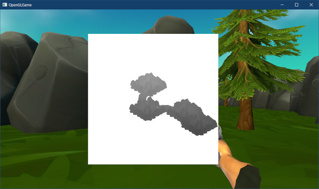
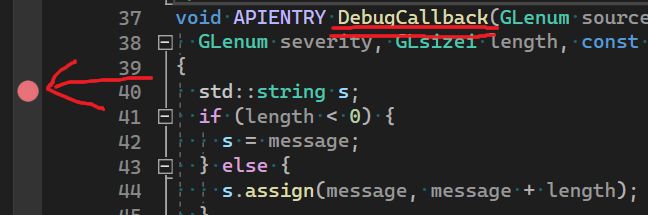

[OpenGL 3D 2023 後期 第05回]

# 平行光源と影

## 習得目標

* 点光源、平行光源、環境光の用途を説明できる。
* フレームバッファオブジェクト(FBO)を作成できる。
* 「深度バッファ」への描画手順を説明できる。
* デプスシャドウマッピングの仕組みを説明できる。
* シャドウアクネが発生する理由を説明できる。 

## 1. 平行光源と環境光

### 1.1 平行光源(ディレクショナル・ライト)を追加する

現在、3Dモデルは点光源(またはスポットライト光源)で照らされています。しかし、現実世界の屋外ならば、昼間は太陽、夜間は月や星の明かりが世界を照らしているはずです。

太陽や月を点光源で表すには、現実ほど遠くなくとも、それでもかなり遠方に配置し、さらに相当な明るさに設定する必要があります。このような極端な光源は、物体を意図した色や明るさで照らすことが難しいため、かなり扱いにくいです。

また、これら物体は実際には点光源とは言えません。例えば太陽は地球より遥かに大きいため、地球に届く光はほとんど平行になります。月は地球より小さいですが、人間が普通に知覚できる数kmの範囲ではほとんど平行になり、明るさも変化しません。

そこで、太陽や月のような光源を表現するために「平行光源(へいこうこうげん)」を追加します。平行光源は「色」と「向き」の2つで構成されます。この2つを`DirectionalLight`(ディレクショナル・ライト、「平行光源」という意味)という名前の構造体にします。

`standard.frag`を開き、入力変数の定義に次のプログラムを追加してください。

```diff
 layout(location=100) uniform vec4 color; // 物体の色
 layout(location=101) uniform vec4 emission; // 物体の発光色
 layout(location=102) uniform float alphaCutoff; // フラグメントを破棄する境界値

+// 平行光源
+struct DirectionalLight
+{
+  vec3 color;     // 色と明るさ
+  vec3 direction; // 光の向き
+};
+layout(location=108) uniform DirectionalLight directionalLight;
 
 // ライト
 struct Light
```

地球環境を前提とした場合、太陽と月はひとつずつなので平行光源はひとつで十分です。ロケーション番号は`108`としています。点光源が`110`からなので、それより手前には空きがあります。平行光源には2つのパラメータが必要なので、`110-2=108`としました。

次に、平行光源の明るさを計算します。計算方法は点光源とほとんど同じです。ただし、平行光源には「光源の座標(発射点)」がないので、光の向きには「平行光源の向き」をそのまま使います。そして、「法線と向きの内積」で明るさを求めます。

しかし、現在の`standard.frag`では法線の正規化が`for`ループ内で行われており、平行光源に流用できなくなっています。そこで、まずは法線の正規化を`for`ループの手前に移動します。`standard.frag`を開き、法線を正規化するプログラムを切り取ってください。

```diff
     // 方向を正規化して長さを1にする
     direction = normalize(direction);
-
-    // 線形補間によって長さが1ではなくなっているので、正規化して長さを1に復元する
-    vec3 normal = normalize(inNormal);

     // ランベルトの余弦則を使って明るさを計算
     float theta = max(dot(direction, normal), 0);
```

それから、切り取ったプログラムを`for`文の手前に貼り付けてください。

```diff
   const float crtGamma = 2.2;
   c.rgb = pow(c.rgb, vec3(2.2));

   outColor = c * color;
+
+  // 線形補間によって長さが1ではなくなっているので、正規化して長さを1に復元する
+  vec3 normal = normalize(inNormal);

   vec3 diffuse = vec3(0); // 拡散光の明るさの合計
   for (int i = 0; i < lightCount; ++i) {
```

それでは、平行光源の明るさを計算しましょう。点光源とスポットライトの明るさを計算する
`for`ループの直後に、次のプログラムを追加してください。

```diff
     // 拡散光の明るさを計算
     diffuse += pointLight.colorAndFalloffAngle[i].xyz * illuminance;
   } // for lightCount
+
+  // 平行光源の明るさを計算
+  float theta = max(dot(-directionalLight.direction, normal), 0);
+  float illuminance = theta / 3.14159265;
+  diffuse += directionalLight.color * illuminance;

   // 拡散光の影響を反映
   outColor.rgb *= diffuse;
```

気をつける点として、「`direction`(光線の向き)をマイナスにしている」ことが挙げられます。`direction`変数には「光線の向き」が入っています。内積の計算では「フラグメントから見た光の向き」が必要なので、向きを逆にする必要があるからです。

シェーダの変更はこれだけです。ここからはゲームエンジンに平行光源の機能を追加します。
`Engine.h`を開き、ロケーション番号の定義を追加してください。

```diff
 // シェーダのライト配列のロケーション番号
 constexpr GLint locColor = 100;
 constexpr GLint locAlphaCutoff = 102;
+constexpr GLint locDirectionalLightColor = 108;
+constexpr GLint locDirectionalLightDirection = 109;
 constexpr GLint locLightCount = 110;
 constexpr GLint locLightColorAndFalloffAngle = 111;
```

次に、`LightData`構造体の定義の下に次のプログラムを追加してください。

```diff
   float falloffAngle; // スポットライトの減衰開始角度
 
   bool used = false; // 使用中かどうか
 };
+
+// 平行光源
+struct DirectionalLight
+{
+  vec3 color = { 1.00f, 0.98f, 0.95f }; // 色
+  float intensity = 5.0f;   // 明るさ
+  vec3 direction = { 0.58f, -0.58f, 0.58f }; // 向き
+};

 // メッシュ番号
 // Initializeメンバ関数にあるmeshes配列と順番を合わせること
```

`color`と`intensity`(インテンシティ)の値は、太陽光を意識して決めました。
`direction`の値はライトの向きが45°の角度になるように選びました(いずれかの軸に平行だとライトの影響が分かりにくいため)。

次に、`lightResizeCount`メンバ変数の定義の下に、次のプログラムを追加してください。

```diff
   std::vector<int> unusedLights;  // 未使用のライトのインデックス配列

   // 一度に増やすライト数
   static constexpr size_t lightResizeCount = 100;
+
+  // 平行光源
+  DirectionalLight directionalLight;

   // カメラオブジェクト
   GameObject camera;
```

続いて`Engine.cpp`を開き、`UpdateShaderLight`メンバ関数の定義に次のプログラムを追加してください。

```diff
 * カメラに近いライトを選んでGPUメモリにコピーする
 */
 void Engine::UpdateShaderLight()
 {
+  // 平行光源のパラメータをGPUメモリにコピー
+  const vec3 color = directionalLight.color * directionalLight.intensity;
+  glProgramUniform3fv(prog3D, locDirectionalLightColor, 1, &color.x);
+  glProgramUniform3fv(prog3D, locDirectionalLightDirection,
+    1, &directionalLight.direction.x);

   // コピーするライトがなければライト数を0に設定
   if (usedLights.empty()) {
```

プログラムが書けたらビルドして実行してください。フィールド探検画面が遠くまで明るく表示されていたら成功です。

>プレイヤーに設定している点光源は、明るさを弱くするか削除してください。

<p align="center">

</p>

### 1.2 環境光(アンビエント・ライト)を追加する

現実世界では、太陽に裏を向けている部分でも真っ黒にはなりません。なぜなら、裏面にも周囲の物体で反射したり大気で散乱した光が届いているからです。

このような、間接的に届く光の計算を「大域照明(グローバル・イルミネーション)」といいます。グローバルイルミネーションを実装すれば、より現実に近い明るさが再現できます。

<p align="center">
<br>
[左=大域照明なし 右=大域照明あり]<br>
https://commons.wikimedia.org/wiki/File:Radiosity_Comparison.jpg
</p>

しかし、グローバルイルミネーションは非常に複雑な現象です。最近でこそ、研究の成果と「ハードウェア・レイ・トレーシング」という機能の登場により、ある程度リアルタイムに再現できるようになりましたが、難しい問題であることに変わりはありません。

そこで、今回はもっとも単純なグローバルイルミネーションである「環境光(アンビエント・ライト)」を採用します。

「環境光」は、「空間全体が、間接光を平均した色の光で満たされている」と考えます。上記の画像の場合、部屋全体が「赤みがかかった白い光」で満たされていると考えるわけです。

もちろん、実際には柱の根元や天井はより赤く、へこんだ角の部分は暗くなるなど、場所によって間接光の色や強さは異なります。しかし、「環境光」ではそれらの詳細をすべて無視します。

細かい部分で違いがあるとしても、間接光の主成分が「天井・壁・柱の白と、床の赤が混ざった色」であることは間違いないからです。

まずシェーダに環境光用のユニフォーム変数を追加します。変数名は`ambientLight`(アンビエント・ライト、「環境光」という意味)とします。`standard.frag`を開き、次のプログラムを追加してください。

```diff
 layout(location=100) uniform vec4 color; // 物体の色
 layout(location=101) uniform vec4 emission; // 物体の発光色
 layout(location=102) uniform float alphaCutoff; // フラグメントを破棄する境界値
+
+// 環境光
+layout(location=107) uniform vec3 ambientLight;

 // ディレクショナルライト
 struct DirectionalLight
```

環境光は方向を持たないため、パラメータは「色」だけです。次に、環境光の計算を追加します。鏡面反射の明るさを計算するプログラムの下に、次のプログラムを追加してください。

```diff
   // 平行光源の明るさを計算
   float theta = max(dot(-directionalLight.direction, normal), 0);
   diffuse += directionalLight.color * theta;
+
+  // アンビエントライトの明るさを計算
+  diffuse += ambientLight;

   // 拡散光の影響を反映
   outColor.rgb *= diffuse;
```

次にゲームエンジンに環境光を表すメンバ変数を追加します。`Engine.h`を開き、ロケーション番号の定義を追加してください。

```diff
 // シェーダのライト配列のロケーション番号
 constexpr GLint locColor = 100;
 constexpr GLint locAlphaCutoff = 102;
+constexpr GLint locAmbientLight = 107;
 constexpr GLint locDirectionalLightColor = 108;
 constexpr GLint locDirectionalLightDirection = 109;
```

続いて`directionalLight`メンバ変数の定義の下に、次のプログラムを追加してください。

```diff
   // 平行光源
   DirectionalLight directionalLight;
+
+  // 環境光
+  vec3 ambientLight = vec3(0.05f, 0.15f, 0.25f);

   // カメラオブジェクト
   GameObject camera;
```

環境光の色合いは、青空をイメージして設定しました。実際には、空だけでなく周囲にある物体の色の影響も受けるため、シーンによって環境光を調整する必要があるでしょう。例えば森の中の環境光は、緑色が強くなります。

最後に、環境光をGPUメモリにコピーします。`Engine.cpp`を開き、`UpdateShaderLight`メンバ関数の定義に次のプログラムを追加してください。

```diff
 * カメラに近いライトを選んでGPUメモリにコピーする
 */
 void Engine::UpdateShaderLight()
 {
+  // 環境光をGPUメモリにコピー
+  glProgramUniform3fv(prog3D, locAmbientLight, 1, &ambientLight.x);
+
   // 平行光源のパラメータをGPUメモリにコピー
   const vec3 color = directionalLight.color * directionalLight.intensity;
```

プログラムが書けたらビルドして実行してください。画面が全体的に明るくなり、これまで光が当たらず黒くなっていた岩壁の模様が判別できるようになっていたら成功です。

<p align="center">
&emsp;<br>
[環境光なし]&emsp;&emsp;&emsp;&emsp;&emsp;&emsp;&emsp;&emsp;&emsp;&emsp;&emsp;&emsp;&emsp;&emsp;&emsp;&emsp;&emsp;&emsp;&emsp;&emsp;[環境光あり]
</p>

### 1.3 スカイスフィア(背景球)

天井があるような閉鎖された空間でもないかぎり、どこかに空が見えています。ということは、3Dグラフィックスでも空を描画する必要があります。もちろん、「背景を空色で塗りつぶす」というのも一つの解決策です。

とはいえ、雲ひとつなくグラデーションもない空というのはあまりにも味気ないものです。プレイヤーにゲーム世界に没入してもらいたいなら、もう少し現実に近いか、情緒の感じられる空を描画するべきでしょう。

2023年現在、AAA(トリプルエー)クラスのゲームでは、空を表現するために複数のシステムを組み合わせています。これらのシステムには「大気のシミュレーション」、「雲のシミュレーション」、「天候のシミュレーション」が含まれます。

とはいえ、このレベルのシステムを作り、利用するには高度な技術力と時間の両方が必要です。そのため、多くのゲームでは「立方体や球体に青空や夜空の画像を貼り付ける」方法を使っています。これには、「アーティストが完全に背景を制御できる」という利点もあります。

背景に立方体を使う場合を「スカイボックス」、球体を使う場合を「スカイスフィア」といいます。今回はより扱いが簡単な「スカイスフィア」を使うことにします。

<pre class="tnmai_assignment">
<strong>【課題01】</strong>
以下のURLから<code>sky_sphere.zip</code>をダウンロードしなさい。
  <code>github.com/tn-mai/OpenGL3D2023/tree/main/res/meshdata/obj</code>
プロジェクトの<code>Res/MeshData</code>フォルダに<code>sky_sphere</code>フォルダを作成し、ダウンロードしたファイルを展開しなさい。
</pre>

モデルが用意できたらプログラムを書いていきましょう。通常、スカイスフィアはシーンに一つだけ表示されます。そこで、エンジンがひとつのスカイスフィアモデルを管理する形にします。

しかし、シーンによって時刻や風景が変わることはよくあります。そのため、スカイスフィアのマテリアルを変えられると便利です。

そこで、`Scene`クラスにスカイスフィア用のマテリアルを追加します。`Scene.h`を開き、次のプログラムを追加してください。

```diff
 // 先行宣言
 class Engine;
+struct Material;
+using MaterialPtr = std::shared_ptr<Material>;

 /**
 * シーンの基底クラス
 */
 class Scene
 {
 public:
   Scene() = default;
   virtual ~Scene() = default;
   virtual bool Initialize(Engine& engine) { return true; }
   virtual void Update(Engine& engine, float deltaTime) {}
   virtual void Finalize(Engine& engine) {}
+
+  MaterialPtr skysphereMaterial; // スカイスフィア用のマテリアル
 };
 using ScenePtr = std::shared_ptr<Scene>; // シーンポインタ型
```

それでは、ゲームエンジンにスカイスフィアを描画するプログラムを追加しましょう。まず、スカイスフィアモデルを読み込みます。`Engine.h`を開き、スカイスフィアモデル用のメンバ変数を追加してください。

```diff
   DirectionalLight directionalLight;

   // 環境光
   vec3 ambientLight = { 0.05f, 0.15f, 0.25f };
+
+   // スカイスフィア用モデル
+   StaticMeshPtr skySphere;

   // カメラオブジェクト
   GameObject camera;
```

次に`Engine.cpp`を開き、`Initialize`メンバ関数の定義にスカイスフィアモデルを読み込むプログラムを追加してください。

```diff
     // AddVertexDataで作成された描画パラメータから、スタティックメッシュを作成
     meshBuffer->CreateStaticMesh(e.name, drawParams, texBaseColor);
   }
   // OBJファイルを読み込む
+  skySphere = meshBuffer->LoadOBJ("Res/MeshData/sky_sphere/sky_sphere.obj");
   meshBuffer->LoadOBJ("Res/MeshData/skull/skull_highpoly.obj");
   meshBuffer->LoadOBJ("Res/MeshData/skull/skull_highpoly_with_normal.obj");
```

続いて、スカイスフィア描画用のメンバ関数を宣言します。名前は`DrawSkySphere`(ドロー・スカイスフィア)とします。`Engine.h`を開き、`UpdateShaderLight`メンバ関数の宣言の下に、次のプログラムを追加してください。

```diff
   void HandleWorldColliderCollision(
     WorldColliderList* a, WorldColliderList* b);
   void RemoveDestroyedGameObject();
   void UpdateShaderLight();
+  void DrawSkySphere();

   GLFWwindow* window = nullptr; // ウィンドウオブジェクト
   const std::string title = "OpenGLGame"; // ウィンドウタイトル
```

宣言した関数は、`Render`メンバ関数内で呼び出します。`Engine.cpp`を開き、`Render`メンバ関数にある「transparent以前のキューを描画」するプログラムの下に、次のプログラムを追加してください。

```diff
   glProgramUniform1f(prog3D, locAlphaCutoff, 0.5f);
   DrawGameObject(prog3D, gameObjects.begin(), transparentBegin);
   glProgramUniform1f(prog3D, locAlphaCutoff, 0);
+
+  DrawSkySphere();

   // transparentからoverlayまでのキューを描画
   glDepthMask(GL_FALSE); // 深度バッファへの書き込みを禁止
   DrawGameObject(prog3D, transparentBegin, overlayBegin);
```

最後に`DrawSkySphere`メンバ関数を定義します。`UpdateShaderLight`メンバ関数の定義の下に、`DrawSkySphere`メンバ関数の定義を追加してください。

```diff
   glProgramUniform4fv(prog3D, locLightDirectionAndConeAngle,
     lightCount, &directionAndConeAngle[0].x);
   glProgramUniform1i(prog3D, locLightCount, lightCount);
 }
+
+/**
+* スカイスフィアを描画する
+*/
+void Engine::DrawSkySphere()
+{
+  // シーンにスカイスフィアが設定されていない場合は描画しない
+  if (!skySphere || !scene->skysphereMaterial) {
+    return;
+  }
+
+  // アンリットシェーダで描画
+  glUseProgram(progUnlit);
+  glBindVertexArray(*meshBuffer->GetVAO());
+  glDepthMask(GL_FALSE); // 深度バッファへの書き込みを禁止
+}
```

スカイスフィアはアンリットシェーダで描画します。空にライトの陰影が描画されると見た目が不自然になるからです。

次に、座標変換行列をGPUメモリにコピーします。座標変換行列には拡大率だけを設定します。スカイスフィアは動かないので、平行移動と回転は設定しません。

スカイスフィアは最も遠くに描画される物体なので、カメラが描画できる範囲のうち、できるだけ遠い位置に描画したいです。現在、描画範囲は0.35m～1000mとなっているので、1000mの位置に描画できるのが理想です。

ただし、スカイスフィアもポリゴンモデルである以上、完全な球体ではありません。そのため、ぴったり1000mに設定すると、微妙なの凹凸によって一部が1000mを超えてしまいます。そこで、距離950mに配置することにします。

スカイスフィアモデルの`sky_sphere.obj`は半径0.5mで作成しているので、拡大率を1900倍に設定すると半径950mになります。アンリットシェーダを設定するプログラムの下に、座標変換行列を作成するプログラムを追加してください。

```diff
   // アンリットシェーダで描画
   glUseProgram(progUnlit);
   glBindVertexArray(*meshBuffer->GetVAO());
   glDepthMask(GL_FALSE); // 深度バッファへの書き込みを禁止
+
+  // スカイスフィアモデルの半径を0.5mと仮定し、描画範囲の95%の大きさに拡大
+  static const float far = 1000; // 描画範囲の最大値
+  static const float scale = far * 0.95f / 0.5f;
+  static const mat4 transformMatrix = {
+    vec4(scale, 0,    0,  0),
+    vec4(0, scale,    0,  0),
+    vec4(0,     0, scale, 0),
+    vec4(0,     0,    0,  1),
+  };
+  glProgramUniformMatrix4fv(progUnlit,
+    locTransformMatrix, 1, GL_FALSE, &transformMatrix[0].x);
 }
```

続いて、オブジェクトカラーをGPUメモリにコピーします。実際に描画される色は「オブジェクトカラー」と「マテリアルカラー」の乗算になります。スカイスフィアの色はスカイスフィア用のマテリアルで制御したいので、オブジェクトカラーには白色を設定します。

座標変換行列をGPUメモリにコピーするプログラムの下に、次のプログラムを追加してください。

```diff
   glProgramUniformMatrix4fv(
     progUnlit, locTransformMatrix, 1, GL_FALSE, &transformMatrix[0].x);
+
+  // 色はマテリアルカラーで調整するのでオブジェクトカラーは白に設定
+  static const vec4 color = { 1, 1, 1, 1 };
+  glProgramUniform4fv(progUnlit, locColor, 1, &color.x);
 }
```

続いて、カメラ座標をGPUメモリにコピーします。スカイスフィアは常にカメラを中心に描画したいので、カメラを一時的に原点に移動させます。カメラを原点とすることで、スカイスフィアがカメラから常に同じ距離で描画されます。

オブジェクトカラーを設定するプログラムの下に、次のプログラムを追加してください。

```diff
   // 色はマテリアルカラーで調整するのでオブジェクトカラーは白に設定
   static const vec4 color = { 1, 1, 1, 1 };
   glProgramUniform4fv(progUnlit, locColor, 1, &color.x);
+
+  // スカイスフィアはカメラを原点として描画
+  static const vec3 skySphereCameraPosition = { 0, 0, 0, };
+  glProgramUniform3fv(progUnlit, 4, 1, &skySphereCameraPosition.x);
 }
```

最後にスカイスフィアを描画します。カメラの座標をGPUメモリにコピーするプログラムの下に、次のプログラムを追加してください。

```diff
   // スカイスフィアはカメラを原点として描画
   static const vec3 skySphereCameraPosition = { 0, 0, 0, };
   glProgramUniform3fv(progUnlit, 4, 1, &skySphereCameraPosition.x);
+
+  // スカイスフィアを描画
+  const MaterialList materials(1, scene->skysphereMaterial);
+  Draw(*skySphere, progUnlit, materials);
+
+  glProgramUniform3fv(progUnlit, 4, 1, &camera.position.x); // カメラ座標を元に戻す
+  glDepthMask(GL_TRUE); // 深度バッファへの書き込みを許可
 }
```

描画に使うマテリアルに、シーンのスカイスフィア用マテリアルを指定している点に注目してください。この仕組みによって、シーンごとに異なるマテリアルを使えるようにしています。

最後に、スカイスフィア用マテリアルを設定します。`ExplorationScene.cpp`を開き、`Initialize`メンバ関数の定義に次のプログラムを追加してください。

```diff
   // プレイヤーを配置
   auto player = engine.Create<GameObject>("player", { 0, 1.5f, 0 });
   playerComponent = player->AddComponent<PlayerComponent>();
   player->AddComponent<FirstPersonCamera>();
+
+  // スカイスフィアを設定
+  skysphereMaterial = std::make_shared<Material>();
+  skysphereMaterial->texBaseColor = engine.GetTexture("Res/MeshData/sky_sphere/sky.tga");

   return true;
 }
```

プログラムが書けたらビルドして実行してください。木々や岩の向こうに青空が表示されていたら成功です。

<p align="center">
<br>
</p>

<pre class="tnmai_assignment">
<strong>【課題02】</strong>
以下のサイト(他のサイトでも構いません)から好みのパノラマ画像をダウンロードし、スカイスフィア用マテリアルに設定しなさい。
画像をクリックし、右側に表示される[三]ボタンからJPGをダウンロードできます。

https://polyhaven.com/hdris

または、<code>360 degree panorama image</code>で検索してもよいでしょう。
</pre>

>**【1章のまとめ】**
>
>* 「平行光源」を使うと、太陽や月のような非常に遠くからの光を表現できる。
>* 「環境光」を使うと、光が当たらず影になっている部分の色が見えるようになる。
>* 空のように遠くにある景色を表現するには「スカイスフィア」や「スカイボックス」を使う。

<div style="page-break-after: always"></div>

## 2. デプスシャドウマッピング

### 2.1 影を描画する方法

コンピューター・グラフィックス、特にゲームにおいて、適切な影を描画することは、長らく困難な問題でした。

ゲームに使われるコンピューターは価格による性能限界があること、また、1/30～1/120秒という短い時間で描画を完了しなくてはならないことがその理由です。2023年現在においても、本当らしい影を描画することは、非常に難易度の高い作業です。

それでも、現代では「デプスシャドウマッピング」という方法によって、比較的リアルな影を表現できるようになっています。「デプスシャドウマッピング」は以下の手順で影を描画します。

>1. 影描画用の「フレームバッファ・オブジェクト(FBO)」を作成する。
>2. ライトの位置にカメラを置いてビュープロジェクション行列(シャドウ行列)を作成し、「影描画用のFBO」に描画する。
>3. 本来の視点の位置にカメラを置いて通常の描画を行う。このとき、2で作成したシャドウ行列を使ってライト空間の座標を計算する。
>4. フラグメントシェーダで、4で計算したライト空間の座標と「影用のFBO」に書き込まれたZ値を比較する。
>5. 座標がZ値より奥にある場合、描画するピクセルとライトとの間に「物体」があることを意味する。 つまり、ピクセルは影の中にいるのでライトの明るさを無視する。
>6. 座標がZ値と同じ場合、描画するピクセルとライトとの間にはなにもない。つまり、直接ライトの光が届いているので、ライトの明るさをピクセルに反映する。

### 2.2 フレームバッファ・オブジェクト

デプスシャドウマッピング法によって影を描画するには「フレームバッファ・オブジェクト」というものが必要です。

「画像を描画するメモリ領域」のことを「フレームバッファ」と呼びます。OpenGLのグラフィックスパイプラインでは、頂点データを「フラグメント」に変換し、次に深度テストを行い、テストに合格したフラグメントが「フレームバッファ」に描画されます。

OpenGLコンテキストを作成すると、表示用のフレームバッファが自動的に作成され、OpenGLコンテキストに割り当てられます。

この「自動的に作成されるフレームバッファ」のことを「デフォルト・フレームバッファ」と呼びます。デフォルトフレームバッファは「実際に画面に表示されるフレームバッファ」です。

わざわざ「実際に画面に表示される」と書いたのは、「画面に表示されないフレームバッファ」も存在するからです。画面に表示されないフレームバッファは「オフスクリーン・バッファ」と呼ばれます。

OpenGLでオフスクリーン・バッファを作成、管理するには「フレームバッファ・オブジェクト(`Framebuffer Object`、短縮形は`FBO`)」を使います。

フレームバッファオブジェクト(`FBO`)は、描画先となる「テクスチャ」や「レンダーバッファ(後述)」を管理するオブジェクトです。メモリ管理機能は持たず別のオブジェクトを管理するという点で、`VAO`に似ています。

`FBO`にテクスチャを割り当て、デフォルトフレームバッファの代わりに`FBO`に描画を行うと、割り当てたテクスチャに図形が描画されます。

このテクスチャをシェーダの「テクスチャイメージスロット」に割り当てることで、描画結果を利用したさまざまなエフェクトや描画技法を実行できます。デプスシャドウマッピングでは、
`FBO`に「ライトから見た深度情報」を書き込みます。

### 2.3 FramebufferObjectクラスを定義する

それでは、`FBO`を管理するクラスを作成しましょう。クラス名は`FramebufferObject`(フレームバッファ・オブジェクト)とします(`b`は「小文字」)。

プロジェクトの`Src/Engine`フォルダに、`FramebufferObject.h`という名前のヘッダファイルを追加してください。追加したファイルを開き、次のプログラムを追加してください。

```diff
+/**
+* @file FramebufferObject.h
+*/
+#ifndef FRAMEBUFFEROBJECT_H_INCLUDED
+#define FRAMEBUFFEROBJECT_H_INCLUDED
+#include "glad/glad.h"
+#include "Texture.h"
+
+/**
+* フレームバッファ・オブジェクト(FBO)
+*/
+class FramebufferObject
+{
+public:
+  /**
+  * テクスチャからFBOを作成するコンストラクタ
+  *
+  * @param color カラーテクスチャ
+  * @param depth 深度テクスチャ
+  */
+  FramebufferObject(const TexturePtr& color, const TexturePtr& depth);
+  ~FramebufferObject();
+
+  // コピーと代入を禁止
+  FramebufferObject(const FramebufferObject&) = delete;
+  FramebufferObject& operator=(const FramebufferObject&) = delete;
+
+  // 管理番号を取得
+  operator GLuint() const { return fbo; }
+
+  // 幅と高さを取得
+  int GetWidth() const { return width; }
+  int GetHeight() const { return height; }
+
+  // テクスチャを取得
+  const TexturePtr& GetColorTexture() const { return texColor; }
+  const TexturePtr& GetDepthTexture() const { return texDepth; }
+
+private:
+  GLuint fbo = 0;      // FBOの管理番号
+  int width = 0;       // FBOの幅
+  int height = 0;      // FBOの高さ
+  TexturePtr texColor; // カラーテクスチャ
+  TexturePtr texDepth; // 深度テクスチャ
+};
+using FramebufferObjectPtr = std::shared_ptr<FramebufferObject>;
+
+#endif // FRAMEBUFFEROBJECT_H_INCLUDED
```

`FBO`には、自身の管理番号だけでなく、幅、高さ、そして、割り当てられたテクスチャを取得する関数も定義します。

次に、プロジェクトの`Src/Engine`フォルダに`Framebuffer.cpp`という名前のCPPファイルを追加してください。追加したファイルを開き、次のプログラムを追加してください。

```diff
+/**
+* @file FramebufferObject.cpp
+*/
+#include "FramebufferObject.h"
+#include "Debug.h"
+
+/**
+* 既存のテクスチャからFBOを作成するコンストラクタ
+*/
+FramebufferObject::FramebufferObject(
+  const TexturePtr& color, const TexturePtr& depth)
+  : texColor(color), texDepth(depth)
+{
+  glCreateFramebuffers(1, &fbo);
+}
```

`FBO`を作成するには`glCreateFramebuffers`(ジーエル・クリエイト・フレームバッファーズ)関数を使います。

<p><code class="tnmai_code"><strong>【書式】</strong><br>
void glCreateFramebuffers(作成するFBOの数,<br>
&emsp;作成したFBOのIDを格納する変数アドレス);
</code></p>

続いて、作成した`FBO`にテクスチャを割り当てます。`FBO`を作成するプログラムの下に、次のプログラムを追加してください。

```diff
   : texColor(color), texDepth(depth)
 {
   glCreateFramebuffers(1, &fbo);
+
+  // カラーバッファを設定
+  if (color) {
+    glNamedFramebufferTexture(fbo, GL_COLOR_ATTACHMENT0, *color, 0);
+    width = texColor->GetWidth();
+    height = texColor->GetHeight();
+  } else {
+    glNamedFramebufferDrawBuffer(fbo, GL_NONE);
+  }
+
+  // 深度バッファを設定
+  if (depth) {
+    glNamedFramebufferTexture(fbo, GL_DEPTH_ATTACHMENT, *depth, 0);
+    width = texDepth->GetWidth();
+    height = texDepth->GetHeight();
+  }
 }
```

作成した`FBO`には、必要に応じてカラーテクスチャや深度テクスチャを割り当ることができます。`FBO`にテクスチャを割り当てるには`glNamedFramebufferTexture`(ジーエル・ネームド・フレームバッファ・テクスチャ)関数を使います。

<pre class="tnmai_code"><strong>【書式】</strong><code>
void glNamedFramebufferTexture(割り当て先FBO, 用途, テクスチャID, ミップマップレベル);
</code></pre>

「用途」は以下の4種類から指定します。

| 定数名 | 用途 |
|:-------|:-----|
| GL_COLOR_ATTACHIMENT0～GL_COLOR_ATTACHIMENT31<br>(ジーエル・カラー・アタッチメント・？) | カラーバッファ |
| GL_DEPTH_ATTACHIMENT<br>(ジーエル・デプス・アタッチメント) | 深度バッファ |
| GL_STENCIL_ATTACIMENT<br>(ジーエル・ステンシル・アタッチメント) | ステンシルバッファ |
| GL_DEPTH_STENCIL_ATTACIMENT<br>(ジーエル・デプス・ステンシル・アタッチメント) | 深度バッファとステンシルバッファ<br>の両方 |

ミップマップを持つテクスチャの場合、「ミップマップレベル」を設定することで割り当てるミップマップを指定できます。ミップマップがないテクスチャの場合は`0`を指定します。

テクスチャを割り当てない場合は`glNamedFramebufferDrawBuffer`(ジーエル・ネームド・フレームバッファ・ドロー・バッファ)関数を使います。
<pre class="tnmai_code"><strong>【書式】</strong><code>
void glNamedFramebufferDrawBuffer(割り当て先FBO, 描画先のカラーバッファ);
</code></pre>

「描画先のカラーバッファ」は以下の2種類から選択します。

| 定数名 | 用途 |
|:-------|:-----|
| GL_NONE(ジーエル・ノン) | カラーを描画しない |
 GL_COLOR_ATTACHIMENT0～GL_COLOR_ATTACHIMENT31 | カラーバッファ |

深度バッファだけが必要な場合は`GL_NONE`(ジーエル・ノン)を指定します。これによって「カラーは描画しない」ことを示します。

最後に`FBO`が正しく作成されたことを確認します。深度バッファを設定するプログラムの下に、次のプログラムを追加してください。

```diff
     glNamedFramebufferTexture(fbo, GL_DEPTH_ATTACHMENT, *depth, 0);
     width = texDepth->GetWidth();
     height = texDepth->GetHeight();
   }
+
+  // FBOのエラーチェック
+  if (glCheckNamedFramebufferStatus(fbo, GL_FRAMEBUFFER) != GL_FRAMEBUFFER_COMPLETE) {
+    glDeleteFramebuffers(1, &fbo);
+    fbo = 0;
+    texColor.reset();
+    texDepth.reset();
+    LOG_ERROR("FBOの作成に失敗");
+    return;
+  }
+
+  // 作成成功
+  LOG("FBO(width=%d, height=%d)を作成", width, height);
 }
```

`FBO`の状態をチェックするには`glCheckNamedFramebufferStatus`(ジーエル・チェック・ネームド・フレームバッファ・ステータス)関数を使います。

<p><code class="tnmai_code"><strong>【書式】</strong><br>
検査結果 glCheckNamedFramebufferStatus(チェックするFBOのID,<br>
&emsp;IDが0だったとき代わりにチェックするバインディングポイント);
</code></p>

`glCheckNamedFramebufferStatus`関数の第1引数に`0`を指定すると、第2引数で指定したバインディングポイントに割り当てられている`FBO`がチェックされます。

今回、第1引数にはゼロ以外の値を指定するので、第2引数には(指定可能な値なら)どれを指定しても構いません。とりあえず`GL_FRAMEBUFFER`を指定しておきます。

>その他の指定可能な値については以下のURLを参照(または関数名でWeb検索)。<br>
>registry.khronos.org/OpenGL-Refpages/gl4/html/glCheckFramebufferStatus.xhtml

検査の結果、`FBO`が正しく構築されていたら`GL_FRAMEBUFFER_COMPLETE`(ジーエル・フレームバッファ・コンプリート)という値が返されます。`FBO`に不良がある場合はそれ以外の値が返されます。これで、コンストラクタは完成です。

### 2.4 デストラクタを定義する

続いて、デストラクタを定義します。コンストラクタの定義の下に、次のプログラムを追加してください。

```diff
   // 作成成功
   LOG("FBO(width=%d, height=%d)を作成", width, height);
 }
+
+/**
+* デストラクタ
+*/
+FramebufferObject::~FramebufferObject()
+{
+  glDeleteFramebuffers(1, &fbo);
+}
```

デストラクタに書く必要があるのは`FBO`を破棄するプログラムだけです。テクスチャはシェアードポインタで管理しているので、自動的に破棄されるからです。`FBO`を破棄するには
`glDeleteFramebuffers`(ジーエル・デリート・フレームバッファーズ)関数を使います。

<p><code class="tnmai_code"><strong>【書式】</strong><br>
void glDeleteFramebuffers(削除するFBOの数, 削除するFBOのIDの配列);
</code></p>

これで、`FramebufferObject`クラスは完成です。

### 2.5 空(から)のテクスチャを作成できるようにする

現在のゲームエンジンでテクスチャを作成するには「元になる画像ファイル」が必要です。<br>
しかし、`FBO`に割り当てるテクスチャには「元になる画像ファイル」がありません。<br>
そこで、「空(から)のテクスチャ」を作成する機能を追加しましょう。

`Texture.h`を開き、`Texture`クラスの定義に次のプログラムを追加してください。

```diff
 private:
   explicit Texture(const char* filename);
+
+  /**
+  * 空のテクスチャを作成するコンストラクタ
+  *
+  * @param name      テクスチャ識別用の名前
+  * @param width     テクスチャの幅(ピクセル数)
+  * @param height    テクスチャの高さ(ピクセル数)
+  * @param gpuFormat データ形式
+  * @param wrapMode  ラップモード
+  */
+  Texture(const char* name, int width, int height,
+    GLenum gpuFormat, GLenum wrapMode = GL_CLAMP_TO_EDGE);
+
   ~Texture();

   std::string name; // テクスチャ名(主にデバッグ用)
```

「ラップ・モード」は、「`0～1`を越えるテクスチャ座標が指定された場合の挙動」を決めるパラメータです。`GL_CLAMP_TO_EDGE`(ジーエル・クランプ・トゥ・エッジ)を指定すると、「端のピクセルが無限に広がる」という挙動になります。

>`wrap`(ラップ)は「包む」という意味です。ラップモードの詳細は`glTexParameteri`関数のドキュメントを参照してください。

次に定義を作成します。`Texture.cpp`を開き、画像ファイルからテクスチャを作成するコンストラクタの定義の下に、新しいコンストラクタの定義を追加してください。

```diff
   id = object;
   name = filename;
 }
+
+/**
+* 空のテクスチャを作成するコンストラクタ
+*/
+Texture::Texture(const char* name, int width, int height,
+  GLenum gpuFormat, GLenum wrapMode) :
+  name(name), width(width), height(height)
+{
+  glCreateTextures(GL_TEXTURE_2D, 1, &id);
+  glTextureStorage2D(id, 1, gpuFormat, width, height);
+  glTextureParameteri(id, GL_TEXTURE_WRAP_S, wrapMode);
+  glTextureParameteri(id, GL_TEXTURE_WRAP_T, wrapMode);
+
+  // 深度テクスチャの場合、シャドウマッピングのために比較モードを設定する
+  switch (gpuFormat) {
+  case GL_DEPTH_COMPONENT16:
+  case GL_DEPTH_COMPONENT24:
+  case GL_DEPTH_COMPONENT32:
+  case GL_DEPTH_COMPONENT32F:
+    glTextureParameteri(id, GL_TEXTURE_COMPARE_MODE, GL_COMPARE_REF_TO_TEXTURE);
+    break;
+  default:
+    break;
+  }
+}

 /**
 * デストラクタ
```

空のテクスチャなので、GPUメモリを確保し、ラップモードを指定するだけでほとんどの仕事は終わりです。ラップモードを指定するには`glTextureParameteri`関数を使います。

2Dテクスチャの場合、ラップモードは横と縦で個別に設定します。異なるラップモードを指定することは稀(まれ)なため、今回はどちらにも同じラップモードを設定しています。

`gpuFormat`に深度テクスチャ形式が指定された場合、テクスチャの比較モードを設定する必要があります。指定できる値は以下の2つです。

| 値 | 説明 |
|:---|:---:|
| GL_NONE(ジーエル・ノン) | 深度テクスチャの値をそのまま返す<br>(デフォルトの設定)。 |
| GL_COMPARE_REF_TO_TEXTURE<br>(ジーエル・コンペア・レフ・トゥ・テクスチャ) | 深度テクスチャの値と引数のZ座標を<br>比較した結果を返す。 |

デプスシャドウマッピングを行う場合は`GL_COMPARE_REF_TO_TEXTURE`(ジーエル・コンペア・レフ・トゥ・テクスチャ)を指定します。この設定をしないと、後述する
`sampler2DShadow`サンプラを使う場合に正しい比較が行われません。

### 2.6 外積を求める関数を定義する

現在のプログラムではカメラの回転角度と位置を使って、「ワールド座標系」から「ビュー座標系」への変換を行っています。同じ変換は、座標変換行列を使っても実行できます。

「ワールド座標系」から「ビュー(カメラ)座標系」に変換する行列のことを「ビュー行列」といいます。

>ワールド座標 → (ビュー行列を掛ける) → ビュー座標

ビュー行列の作成方法は主に2つあります。ひとつは、カメラの回転角度と位置から作成する方法です。もう一つは、カメラの位置とカメラが注目している座標から作成する方法です。

どちらを使うかは場合によりますが、デプスシャドウマッピングでは後者の方法のほうが扱いやすいです。そこで、「カメラの位置と注目座標からビュー行列を作成する関数」を作ることにします。

前準備として、ベクトルの「外積」を計算する関数を定義します。外積を使うと「2つのベクトルに対して垂直なベクトル」を求めることができます。

関数名は「外積」を英訳した`cross`(クロス)とします。`VecMath.h`を開き、vec3の内積を求める`dot`関数の定義の下に、次のプログラムを追加してください。

```diff
 inline float dot(const vec3& a, const vec3& b)
 {
   return a.x * b.x + a.y * b.y + a.z * b.z;
 }
+
+// vec3の外積
+inline vec3 cross(const vec3& a, const vec3& b)
+{
+  return {
+    a.y * b.z - a.z * b.y,
+    a.z * b.x - a.x * b.z,
+    a.x * b.y - a.y * b.x };
+}

 // vec3の長さ
 inline float length(const vec3& a) { return sqrt(dot(a, a)); }
```

外積は次のように定義されます。外積の英訳が`cross`なのは、外積の記号が`x`だからです(記号から「クロス積」とも呼ばれます)。

>`外積 = A x B = |A||B|sinθ * n`

ここで`θ`は「ベクトルAとBがなす角」、`n`は「ベクトルAとBに垂直な単位ベクトル」です。

<p align="center">
<br>
[A, Bの外積]
</p>

定義から分かるように、外積の結果はベクトルになります。このベクトルの向きは、ベクトルA, Bの両方に対して直角で、方向は「右ねじの法則」と一致します。ビュー行列の計算ではこの性質を利用します。

`n`の向きによって、ベクトルBがベクトルAの右側にあるのか、左側にあるのかを調べることができます。しかし、この性質のために`A x B`と`B x A`の答えは一致しません(`n`の方向が逆になる)。つまり、交換法則が成り立ちません。

外積の大きさは`n`を除いた`|A||B|sinθ`で表されるので、外積を`sinθ`を求めるために使うことができます(今回は使いません)。また、この「外積の大きさ」は「ベクトルA, Bによって作られる平行四辺形の面積」と一致します(これも今回は使いません)。

>**【外積の計算式の導出】**<br>
>外積の計算式について、詳しくは以下のURLを参照してください。<br>
>`https://ja.wikipedia.org/wiki/クロス積`<br>
>外積の計算方法は公式として覚えるしかありませんが、計算の並びには一定の法則があり<br>
>ます。それさえつかめば、あとは最初の`a.y * b.z`を覚えておくだけで済むでしょう。

### 2.7 ビュー行列を求める関数を定義する

続いて、ビュー行列を作成する関数を定義します。関数名は`LookAt`(ルック・アット)とします。`look at`は「～を見る」という意味です。この名称は、ワールド座標系から視点座標系への変換行列を返す関数名として、よく使われます。

`VecMath.h`を開き、`Decompose`関数の定義の下に次のプログラムを追加してください。

```diff
   rotation[0] /= scale.x;
   rotation[1] /= scale.y;
   rotation[2] /= scale.z;
 }
+
+/**
+* ビュー行列を作成する
+*
+* @param eye    視点の座標
+* @param target 注視点の座標
+* @param up     視点の上方向を指す仮のベクトル
+*
+* @return eye, target, upから作成したビュー行列
+*/
+inline mat4 LookAt(const vec3& eye, const vec3& target, const vec3& up)
+{
+  // ワールド座標系における視点座標系のXYZ軸の向きを計算
+  const vec3 axisZ = normalize(eye - target);
+  const vec3 axisX = normalize(cross(up, axisZ));
+  const vec3 axisY = normalize(cross(axisZ, axisX));
+
+  // 座標を軸ベクトルに射影するように行列を設定
+  mat4 m;
+  m[0] = { axisX.x, axisY.x, axisZ.x, 0 };
+  m[1] = { axisX.y, axisY.y, axisZ.y, 0 };
+  m[2] = { axisX.z, axisY.z, axisZ.z, 0 };
+
+  // eyeが原点となるように、eyeを各軸に射影して平行移動量を計算
+  m[3] = { -dot(axisX, eye), -dot(axisY, eye), -dot(axisZ, eye), 1 };
+
+  return m;
+}

 #endif // VECMATH_H_INCLUDED
```

>上記のコード中に出てくる`axis`(アクシス)は、「軸」という意味です。<br>
>つまり、`axisX`はX軸、`axisY`はY軸、`axisZ`はZ軸を意味します。

`LookAt`関数では、ワールド座標系における視点座標系の軸の向きを計算し、その軸に「射影(しゃえい)」するような行列を定義します。

最初に軸の向きを計算します。OpenGLの場合、カメラの正のZ軸は`target`から`eye`へ向かう方向なので、`eye - target`で求められます。そして、向きベクトルは単位ベクトルでなくてはならないため、`normalize`関数によって正規化します。

次に、カメラのX軸を求めます。X軸はY軸とZ軸の両方に垂直です。そのため、Y軸とZ軸の外積によって求めることができます。外積の結果が単位ベクトルなるとは限らないため、ここでも正規化が必要です。

そして、求められたX軸とZ軸から改めてY軸を計算しなおします。このため、`up`引数は不正確でも問題ありません。一般に、`up`にはX軸計算用の「仮のY軸」を指定します。

数学的には、Y軸の計算では正規化は不要です。この時点でX軸とZ軸は常に直角なので`θ=90°`
となり、さらにどちらも単位ベクトルなので長さは`1`です。これらを外積の定義に代入すると次のようになります。

`|A||B|sinθ * n = 1 * 1 * 1 * n = n`

しかし、浮動小数点数の計算では数学と違って誤差が生じるため、`n`の長さがわずかに`1`とは異なってしまいます。そこで、正規化することで誤差を最小限に抑えています。

視点座標系のXYZ軸を求めたら、ワールド座標をその軸に「射影」する行列を作成します。

「射影(しゃえい)」とは、

>軸に対して垂直な方向から光を当てたとき、ベクトルによって軸上に作られる影のベクトル(射影ベクトル)を求める操作

のことです。

この観点から三角関数を見ると、`cos`はX軸に対する射影、`sin`はY軸に対する射影と考えられます。あまり直感的ではありませんが、回転も射影の一種とみなすことができます。

`cos`が出てきたことから予想されるように、射影は内積によって計算できます。<br>
さらに、第10回2.9節で説明したように、行列の乗算は内積によって表すことができます。

これらのことから、行列の適切な要素に軸ベクトルの値を指定すると、射影を計算することが可能になります。これは、上記のプログラムで行っていることです。

>**【射影について】**<br>
>射影について、詳しくは以下のURLを参考にしてください。<br>
>正射影ベクトルの公式の証明と使い方: `https://manabitimes.jp/math/933`

最後に、視点の座標`eye`を実際に射影して視点座標系におけるカメラの座標を求め、行列の<br>
4行目に代入しています。値をマイナスにしているのは、視点を原点にしたいからです。

### 2.8 平行投影行列を求める関数を定義する

ビュー行列に続いて、プロジェクション行列の一種である「平行投影行列(へいこう とうえい ぎょうれつ)」を求める関数を定義します。

「平行投影」は、投影面に垂直な方向から光を当てた様子を意味します。<br>
関数名は`Orthogonal`(オーソゴナル、「垂直」という意味)とします。`VecMath.h`を開き、
`LookAt`関数の定義の下に次のプログラムを追加してください。

```diff
   // eyeが原点となるように、eyeを各軸に射影して平行移動量を計算
   m[3] = { -dot(axisX, eye), -dot(axisY, eye), -dot(axisZ, eye), 1 };
 
   return m;
 }
+
+/**
+* 平行投影行列を作成する
+*
+* @param left   描画範囲の左端までの距離
+* @param right  描画範囲の右端までの距離
+* @param bottom 描画範囲の下端までの距離
+* @param top    描画範囲の上端までの距離
+* @param zNear  描画範囲に含まれる最小Z座標
+* @param zFar   描画範囲に含まれる最大Z座標
+*
+* @return 平行投影行列
+*/
+inline mat4 Orthogonal(float left, float right, float bottom, float top,
+  float zNear, float zFar)
+{
+  // 描画範囲のサイズと中心座標を計算
+  const vec3 size = { right - left, top - bottom, zFar - zNear };
+  const vec3 center = { right + left, top + bottom, zFar + zNear };
+
+  // 描画範囲内の座標が-1～+1に変換されるように、拡大率と平行移動を設定
+  mat4 m;
+  m[0] = { 2 / size.x,          0,           0, 0 };
+  m[1] = {          0, 2 / size.y,           0, 0 };
+  m[2] = {          0,          0, -2 / size.z, 0 };
+  m[3] = vec4(-center / size, 1);
+  return m;
+}

 #endif // VECMATH_H_INCLUDED
```

プロジェクション行列の目的は、ビュー座標系の座標をクリップ座標系に変換することです。平行投影の場合、物体が近くにあろうと遠くにあろうと表示上の大きさは変化しません。そのため、座標を`±1`の範囲に変換するだけで済みます。

クリップ座標系はXYZが`±1`の座標系なので、各軸の長さは`2`です。そのため、座標に<br>
`2 / 描画範囲`を掛けることで`±1`の範囲に変換できます。Z軸だけマイナスなのは、OpenGLの視点座標系は右手系、クリップ座標系は左手系だからです。

また、平行投影では距離による図形の拡大縮小が起きないので、座標計算後の`w`の値は常に`1`になります。ですから、`standard`シェーダのような`w`と`z`の計算は不要です。

### 2.9 影を描画するシェーダを追加する

デプスシャドウマッピングに必要なのは深度バッファだけなので、カラーバッファは使いません。そのため、デプスシャドウマッピングに`standard.vert`, `standard.frag`を使うと、ムダな計算を大量に行うことになります。

そこで、デプスシャドウマッピングに必要な処理だけを組み込んだシェーダを追加することにします。

プロジェクトの`Res`フォルダに`shadow.vert`(シャドウ・バート)という名前のテキストファイルを追加してください。追加したファイルを開き、次のプログラムを追加してください。

```diff
+/**
+* @file shadow.vert
+*/
+#version 450
+
+// シェーダへの入力
+layout(location=0) in vec3 inPosition; // 頂点座標
+layout(location=1) in vec2 inTexcoord; // テクスチャ座標
+
+// シェーダからの出力
+layout(location=1) out vec2 outTexcoord; // テクスチャ座標
+
+// プログラムからの入力
+layout(location=0) uniform mat4 transformMatrix; // 座標変換行列
+layout(location=2) uniform mat4 viewProjectionMatrix; // ビュープロジェクション行列
+
+void main()
+{
+  // テクスチャ座標を設定
+  outTexcoord = inTexcoord;
+
+  // ローカル座標系からワールド座標系に変換
+  gl_Position = transformMatrix * vec4(inPosition, 1);
+  gl_Position = viewProjectionMatrix * gl_Position;
+}
```

色の計算を行わないので、法線データを扱うプログラムは書きません。<br>また、`viewProjectionMatrix`のロケーション番号を`2`にしているのは、`1`は`standard`
シェーダの`normalMatrix`で使っているからです。

>OpenGLの仕様では、異なるユニフォーム変数でロケーション番号が重複しても、それらを同時に使わない限り問題はありません。しかし、同じ番号に複数のユニフォーム変数を割り当てると、プログラムする時に番号を間違える可能性があります。そのため、異なるユニフォーム変数には異なるロケーション番号を割り当てることをおすすめします。

次にフラグメントシェーダを追加します。プロジェクトの`Res`フォルダに`shadow.frag`という名前のテキストファイルを追加してください。追加したファイルを開き、次のプログラムを追加してください。

```diff
+/**
+* @file shadow.frag
+*/
+#version 450
+
+// シェーダへの入力
+layout(location=1) in vec2 inTexcoord; // テクスチャ座標
+
+// テクスチャサンプラ
+layout(binding=0) uniform sampler2D texColor;
+
+// プログラムからの入力
+layout(location=102) uniform float alphaCutoff; // フラグメントを破棄する境界値
+
+void main()
+{
+  vec4 c = texture(texColor, inTexcoord);
+
+  // カットオフ値が指定されている場合、アルファがその値未満の場合は描画をキャンセル
+  if (alphaCutoff > 0) {
+    if (c.a < alphaCutoff) {
+      discard; // フラグメントを破棄(キャンセル)
+    }
+  }
+}
```

フラグメントシェーダでは、テクスチャのアルファ値を参照し、アルファ値がカットオフ未満の場合は`discard`(ディスカード)によって描画をキャンセルします。

このように、`shadow`シェーダは`standard`シェーダと比べて非常に簡素です。もし影の描画に`standard`シェーダを使っていたら、多くのムダな処理を行うことになっていたでしょう。

### 2.10 TexHelper構造体をエンジンクラス全体で使えるようにする

`FBO`は`Initialize`メンバ関数で作成する予定で、このとき「空のテクスチャ」を作成する必要があります。しかし、`Texture`クラスのコンストラクタとデストラクタは`private`メンバなので、そのままではテクスチャを作成できません。

この問題を解決するために、`GetTexture`メンバ関数に定義している`TexHelper`構造体を
`Engine`クラス本体に移動し、`Engine`クラス全体で使えるようにします。

`Engine.cpp`を開き、`GetTexture`メンバ関数にある`TexHelper`構造体の定義を切り取ってください。

```diff
   if (itr != textureCache.end()) {
     return itr->second; // キャッシュされたテクスチャを返す
   }

-  // コンストラクタ、デストラクタを呼べるようにするための補助クラス
-  struct TexHelper : public Texture {
-    TexHelper(const char* p) : Texture(p) {}
-  };
-
   // キャッシュになければ、テクスチャを作成してキャッシュに登録
   auto tex = std::make_shared<TexHelper>(name);
```

次に`Engine.h`を開き、切り取ったプログラムを`private`領域に貼り付けてください。

```diff
   bool Raycast(const Ray& ray, RaycastHit& hitInfo,
     const RaycastPredicate& pred) const;

 private:
+  // コンストラクタ、デストラクタを呼べるようにするための補助クラス
+  struct TexHelper : public Texture {
+    TexHelper(const char* p) : Texture(p) {}
+  };

  // ワールド座標系のコライダーを表す構造体
  struct WorldCollider
```

それから、「空のテクスチャ」に対応できるようにコンストラクタを追加します。
`TexHelper`構造体の定義に次のプログラムを追加してください。

```diff
   // コンストラクタ、デストラクタを呼べるようにするための補助クラス
   struct TexHelper : public Texture {
     TexHelper(const char* p) : Texture(p) {}
+    TexHelper(const char* p, int w, int h, GLenum f) : Texture(p, w, h, f) {}
   };

  // ワールド座標系のコライダーを表す構造体
  struct WorldCollider
```

これで、`Initialize`メンバ関数で「空のテクスチャ」が作成できるようになりました。

### 2.11 ゲームエンジンに影用変数を追加する

それでは、ゲームエンジンにデプスシャドウマッピング用のメンバ変数を追加しましょう。エンジンにFBOを追加するために、先行宣言を行います。`Engine.h`を開き、3Dモデル描画用の変数の定義の下に、次のプログラムを追加してください。

```diff
 // 先行宣言
 class ProgramPipeline;
 using ProgramPipelinePtr = std::shared_ptr<ProgramPipeline>;
+class FramebufferObject;
+using FramebufferObjectPtr = std::shared_ptr<FramebufferObject>;

 // シェーダで使えるライトの数
 constexpr size_t maxShaderLightCount = 16;
```

それから、`shadow`シェーダで使うロケーション番号も定義しておきましょう。ロケーション番号の定義に次のプログラムを追加してください。

```diff
 using ProgramPipelinePtr = std::shared_ptr<ProgramPipeline>;
 class FramebufferObject;
 using FramebufferObjectPtr = std::shared_ptr<FramebufferObject>;

-// シェーダのライト配列のロケーション番号
+// シェーダのロケーション番号
+constexpr GLint locTransformMatrix = 0;
+constexpr GLint locNormalMatrix = 1;
+constexpr GLint locViewProjectionMatrix = 2;
 constexpr GLint locColor = 100;
```

続いて、メンバ変数を追加します。`Engine`クラスの定義に次のプログラムを追加してください。

```diff
   // アンリット・シェーダ
   GLuint vsUnlit = 0;
   GLuint fsUnlit = 0;
   GLuint progUnlit = 0;
+
+  // シャドウ・シェーダ
+  GLuint vsShadow = 0;
+  GLuint fsShadow = 0;
+  GLuint progShadow = 0;
+
+  FramebufferObjectPtr fboShadow; // デプスシャドウ用FBO

   MeshBufferPtr meshBuffer;   // 図形データ管理オブジェクト
   std::unordered_map<std::string, TexturePtr> textureCache;
```

次に`Engine.cpp`を開き、`FramebufferObject.h`をインクルードしてください。

```diff
 * @file Engine.cpp
 */
 #define _CRT_SECURE_NO_WARNINGS
 #include "Engine.h"
+#include "FramebufferObject.h"
 #include "EasyAudio/EasyAudio.h"
 #include "SphereCollider.h"
```

それでは、シェーダから作成していきましょう。`Initialize`メンバ関数にある「アンリットシェーダを作成」するプログラムの下に、次のプログラムを追加してください。

```diff
   glAttachShader(progUnlit, vsUnlit);
   glAttachShader(progUnlit, fsUnlit);
   glLinkProgram(progUnlit);
+
+  // シャドウ・シェーダを作成
+  vsShadow = CompileShader(GL_VERTEX_SHADER, "Res/shadow.vert");
+  fsShadow = CompileShader(GL_FRAGMENT_SHADER, "Res/shadow.frag");
+  progShadow = glCreateProgram();
+  glAttachShader(progShadow, vsShadow);
+  glAttachShader(progShadow, fsShadow);
+  glLinkProgram(progShadow);
+  glProgramUniform1f(progShadow, locAlphaCutoff, 0.5f); // カットオフ値を設定しておく

   // 頂点データをGPUメモリにコピー
   const Vertex vertexData[] = {
```

`shadow`シェーダのカットオフ値は変更しないので、この時点で設定してしまいます。

次に、FBOを作成します。シャドウ・シェーダを作成するプログラムの下に、次のプログラムを追加してください。

```diff
   glAttachShader(progShadow, fsShadow);
   glLinkProgram(progShadow);
   glProgramUniform1f(progShadow, locAlphaCutoff, 0.5f); // カットオフ値を設定しておく
+
+  // FBOを作成
+  auto texShadow = std::make_shared<TexHelper>(
+    "FBO(depth)", 2048, 2048, GL_DEPTH_COMPONENT32);
+  fboShadow = std::make_shared<FramebufferObject>(nullptr, texShadow);

   // 頂点データをGPUメモリにコピー
   const Vertex vertexData[] = {
```

FBOを作成するにはまずFBOに割り当てるテクスチャを作成します。今回作成するFBOには深度バッファだけが必要なので、作成するのは深度テクスチャになります。深度テクスチャを作成するには、以下のいずれかのGPUデータ形式を指定します。

>* GL_DEPTH_COMPONENT16(ジーエル・デプス・コンポーネント・じゅうろく)
>* GL_DEPTH_COMPONENT24(ジーエル・デプス・コンポーネント・にじゅうよん)
>* GL_DEPTH_COMPONENT32(ジーエル・デプス・コンポーネント・さんじゅうに)
>* GL_DEPTH_COMPONENT32F(ジーエル・デプス・コンポーネント・さんじゅうに・エフ)

数字が大きいほど精度が高くなります。末尾に`F`の付いていないバッファは整数型の深度バッファで、`F`が付いているのは浮動小数点数型の深度バッファです。一般に、速度では整数型、精度では浮動小数点数型が優れていますが、GPUやドライバによります。

| GPU | 特徴 |
|:---:|:-----|
| GeForce(Nvidia) | どの形式も高速です。目的に応じて深度バッファを選択できます。|
| Radeon(AMD) | どれを選んでも32ビットで処理されるため、`32F`が最適です。 |
| Intel | GPUの世代によって異なります。`24`または`32`を選ぶのが無難です。 |

また、古いGPUやモバイル環境では`24`や`16`しか使えない場合があります。今回は、どのGPUでもそれなりの性能になることを期待して、`GL_DEPTH_COMPONENT32`を選びました。

デプスシャドウマッピング用テクスチャのサイズは影の品質に大きく影響します。できれば、GPUが扱える最大サイズのテクスチャを使いたいところです。しかし、大きくするほど描画に時間がかかるためバランスが重要です。

今回は、2023年時点のCPU組み込み型GPUの性能を考慮して`2048x2048`を選びました。オプションで解像度を選択できるとよいかもしれません。

### 2.12 ゲームエンジンに影用FBO描画関数を追加する

デプスシャドウマッピングを行うには、さまざまなパラメータを適切に設定しなくてはなりません。プログラムが複雑にならないように、デプスシャドウマッピング用の関数を定義します。

関数名は`CreateShadowMap`(クリエイト・シャドウマップ、「シャドウマップを作成する」という意味)とします。`Engine.h`を開き、`Engine`クラスの定義に次のプログラムを追加してください。

```diff
   void RemoveDestroyedGameObject();
   void UpdateShaderLight();
   void DrawSkySphere();
+  void CreateShadowMap(
+    GameObjectList::iterator begin,
+    GameObjectList::iterator end);

   GLFWwindow* window = nullptr; // ウィンドウオブジェクト
   const std::string title = "OpenGLGame"; // ウィンドウタイトル
```

次に`Engine.cpp`を開き、`DrawSkySphere`メンバ関数の定義の下に、次のプログラムを追加してください。

```diff
   glProgramUniform3fv(progUnlit, 4, 1, &camera.position.x); // カメラの座標を元に戻す
   glDepthMask(GL_TRUE); // 深度バッファへの書き込みを許可
 }
+
+/**
+* デプスシャドウマップを作成
+*/
+void Engine::CreateShadowMap(
+  GameObjectList::iterator begin,
+  GameObjectList::iterator end)
+{
+  // 描画先フレームバッファを変更
+  glBindFramebuffer(GL_FRAMEBUFFER, *fboShadow);
+
+  // ビューポートをフレームバッファのサイズに合わせる
+  const auto& texShadow = fboShadow->GetDepthTexture();
+  glViewport(0, 0, texShadow->GetWidth(), texShadow->GetHeight());
+
+  // 深度バッファをクリア
+  glClear(GL_DEPTH_BUFFER_BIT);
+
+  // VAOとシェーダをOpenGLコンテキストに割り当てる
+  glBindVertexArray(*meshBuffer->GetVAO());
+  glUseProgram(progShadow);
+
+  // ビュー行列を計算
+
+  // プロジェクション行列を計算
+
+  // ビュープロジェクション行列をGPUメモリにコピー
+
+  // メッシュを描画
+}
```

描画先をデフォルトフレームバッファからゲームウィンドウ用FBOに変更するには、
`glBindFramebuffer`(ジーエル・バインド・フレームバッファ)関数を使います。

<p><code class="tnmai_code"><strong>【書式】</strong><br>
void glBindFramebuffer(割り当て先, 割り当てるFBO);
</code></p>

割り当て先は以下の3種類から選択します。

| 割り当て先 | 説明 |
|:----------:|:----:|
| GL_DRAW_FRAMEBUFFER | 描画用フレームバッファ |
| GL_READ_FRAMEBUFFER | 読み取り用フレームバッファ |
| GL_FRAMEBUFFER | 上記の両方 |

通常は`GL_FRAMEBUFFER`を指定して、描画用と読み取り用の両方に同じFBOを割り当てます。ほとんどの場合、`GL_DRAW_FRAMEBUFFER`と`GL_READ_FRAMEBUFFER`に異なるFBOを設定する必要はありません。

>この機能は`glBlitFramebuffer`(ジーエル・ブリット・フレームバッファ)によるフレームバッファ間のコピーや、`glReadPixels`によるピクセルの読み取りなどで使います。
>しかし、2023年現在のGPUの場合、フレームバッファ間のコピーについては、通常のポリゴンによる描画のほうが高速なため、`glBlitFramebuffer`を使う意味はありません。
>`glReadPixels`はデバッグ用途などで使えるかもしれません。

`fboShadow`の画面サイズは2048x2048で、デフォルトフレームバッファとは異なります。そのため、`glViewport`関数を使って描画範囲を設定し直す必要があります。

ビューポートを設定したら、`glClear`関数でバッファの内容を消去します。カラーバッファを持たないため、`GL_DEPTH_BUFFER_BIT`だけを指定します。その後、`VAO`とシェーダをOpenGLコンテキストに割り当てます。

それでは、残りの4項目をプログラムしましょう。`VAO`とシェーダをOpenGLコンテキストに割り当てるプログラムの下に、次のプログラムを追加してください。

```diff
   // VAOとシェーダをOpenGLコンテキストに割り当てる
   glBindVertexArray(*meshBuffer->GetVAO());
   glUseProgram(progShadow);
+
+  // 影の描画パラメータ
+  const float shadowAreaSize = 100; // 影の描画範囲(XY平面)
+  const float shadowNearZ = 1;      // 影の描画範囲(近Z平面)
+  const float shadowFarZ = 200;     // 影の描画範囲(遠Z平面)
+  const float shadowCenterZ = (shadowNearZ + shadowFarZ) * 0.5f; // 描画範囲の中心
+  const vec3 target = { 0, 0, -50 }; // カメラの注視点
+  const vec3 eye =
+    target - directionalLight.direction * shadowCenterZ; // カメラの位置
+
+  // ビュープロジェクション行列を計算
+  const mat4 matShadowView = LookAt(eye, target, vec3(0, 1, 0));
+  const mat4 matShadowProj = Orthogonal(
+    -shadowAreaSize / 2, shadowAreaSize / 2,
+    -shadowAreaSize / 2, shadowAreaSize / 2,
+    shadowNearZ, shadowFarZ);
+  const mat4 matShadow = matShadowProj * matShadowView;
+
+  // ビュープロジェクション行列をGPUメモリにコピー
+  glProgramUniformMatrix4fv(progShadow,
+    locViewProjectionMatrix, 1, GL_FALSE, &matShadow[0].x);
 }
```

`fboShadow`への描画は、カメラを座標`eye`に置き、視界の中心に座標`target`が来るようにカメラを向けた状態で行います。描画範囲は縦横が`shadowAreaSize`(シャドウ・エリア・サイズ)、前後が`shadowNearZ`(シャドウ・ニア・ゼット)～`shadowFarZ`(シャドウ・ファー・ゼット)です。

注視点`eye`の座標は、シーンのサイズを奥(-Z方向)に向かって0m～100mの広さと想定し、その中心になるように決めました。同じ理由で、カメラの描画範囲は`-50`～`+50`mの範囲としました。シーンがもっと大きい場合は描画範囲を大きくしてください。

>デプスシャドウマッピングの精度を最大限に活用するには、デプスシャドウマッピングの描画範囲を、ゲームの表示領域全体がちょうと収まる範囲に設定します。

最後にメッシュを描画します。ビュープロジェクション行列をGPUメモリにコピーするプログラムの下に、次のプログラムを追加してください。

```diff
   // ビュープロジェクション行列をGPUメモリにコピー
   glProgramUniformMatrix4fv(progShadow,
     locViewProjectionMatrix, 1, GL_FALSE, &matShadow[0].x);
+
+  // メッシュを描画
+  for (GameObjectList::iterator i = begin; i != end; ++i) {
+    const auto& e = *i;
+    if (!e->staticMesh) {
+      continue;
+    }
+
+    glProgramUniformMatrix4fv(progShadow,
+      locTransformMatrix, 1, GL_FALSE, &e->GetTransformMatrix()[0].x);
+    if (e->materials.empty()) {
+      Draw(*e->staticMesh, progShadow, e->staticMesh->materials);
+    } else {
+      Draw(*e->staticMesh, progShadow, e->materials);
+    }
+  } // for
 }
```

### 2.13 CreateShadowMap関数を呼び出す

作成した`CreateShadowMap`メンバ関数を`Render`メンバ関数から呼び出します。
`Render`メンバ関数の定義に次のプログラムを追加してください。

```diff
   const auto overlayBegin = std::lower_bound(
     transparentBegin, gameObjects.end(), RenderQueue_overlay,
     [](const GameObjectPtr& e, int value) { return e->renderQueue < value; });
+
+  // デプスシャドウマップを作成
+  CreateShadowMap(gameObjects.begin(), transparentBegin);
+
+  // 描画先をデフォルトフレームバッファに戻す
+  glBindFramebuffer(GL_FRAMEBUFFER, 0);
+  glViewport(0, 0, fbWidth, fbHeight);
+  glUseProgram(prog3D);

   // transparent以前のキューを描画
   glProgramUniform1f(prog3D, locAlphaCutoff, 0.5f);
```

半透明オブジェクトは影を落とさないと仮定して、`fboShadow`に描画するのは
`RenderQueue_transparent`以前のオブジェクトだけにしています。

`CreateShadowMap`は内部でビューポートとシェーダを変更するので、描画後に再設定するのを忘れないでください。

それから、シャドウマップ作成前のシェーダとビューポートの設定は無意味になったので削除しておきます。`Render`メンバ関数の先頭にある`glUseProgram`と`glViewport`関数の呼び出しを削除してください。

```diff
   // バックバッファをクリア
   glClearColor(0.3f, 0.6f, 0.9f, 1.0f);
   glClear(GL_COLOR_BUFFER_BIT | GL_DEPTH_BUFFER_BIT);
-
-  // 描画に使うシェーダを指定
-  glUseProgram(*prog3D);

   // フレームバッファの大きさを取得
   int fbWidth, fbHeight;
   glfwGetFramebufferSize(window, &fbWidth, &fbHeight);
-
-  // ビューポートを設定
-  glViewport(0, 0, fbWidth, fbHeight);

   const GLuint programs[] = { prog3D, progUnlit };
   for (auto prog : programs) {
```

これで、`fboShadow`に深度が描画されるはずです。影を描画するにはもう少しかかりますが、「シャドウマップが正しく描画されているかどうか」は確認しておく必要があります。

overlay以降のキューを描画するプログラムの下に、次のプログラムを追加してください。

```diff
   glDisable(GL_DEPTH_TEST); // 深度テストを無効化
   glUseProgram(progUnlit);
   DrawGameObject(progUnlit, overlayBegin, gameObjects.end());
+
+#if 1
+  // シャドウマップのチェック用
+  {
+    glBindVertexArray(*meshBuffer->GetVAO());
+    MaterialList materials(1, std::make_shared<Material>());
+    materials[0]->texBaseColor = fboShadow->GetDepthTexture();
+    mat4 m = GetTransformMatrix(vec3(1), vec3(0), vec3(0, 1.5f, -4));
+    glProgramUniformMatrix4fv(progUnlit, locTransformMatrix, 1, GL_FALSE, &m[0].x);
+    Draw(*meshBuffer->GetStaticMesh("plane_xy"), progUnlit, materials);
+    glBindVertexArray(0);
+  }
+#endif

   glBindTextures(0, 1, nullptr);
   glUseProgram(0);
```

プログラムが書けたらビルドして実行してください。ゲームを開始したとき、白い四角の中に、灰色で地形が描かれた物体が表示されていたら成功です。

<p align="center">

</p>

深度バッファでは、色が黒い(0に近い)部分ほどカメラに近く、白い(1に近い)部分ほどカメラから遠いことを意味しています。

<pre class="tnmai_assignment">
<strong>【課題03】</strong>
深度バッファがどのようなものかを確認したら、上のプログラムの<code>#if 1</code>を<code>#if 0</code>に
変更して、シャドウマップのチェックプログラムを無効化してください。
</pre>

### 2.14 Draw関数から出るOpenGLエラーに対処する

このとき出力ウィンドウを見ると、以下のようなエラーメッセージが大量に表示されています。

>```txt
>[情報] DebugCallback: Error has been generated. GL error GL_INVALID_OPERATION
> in GetUniformfv: (ID: 3460805630) Generic error
>[情報] DebugCallback: Error has been generated. GL error GL_INVALID_OPERATION
> in ProgramUniform4fv: (ID: 3328860068) Generic error
>```

このエラーはどこで発生したのでしょう？　メッセージの先頭に`DebugCallback`とあるので、出力を行ったのは`DebugCallback`関数で間違いありません。

また、接続詞`in`の直後に`GetUniformfv`, `ProgramUniform4f`などがあるので、これらの関数を呼び出しているプログラムがエラーを起こしたと予想できます。名前に`gl`が付いていませんが、これらは全てOpenGLの関数です。

これらの関数がプログラムの1箇所でしか使われていなければ話は簡単なのですが、大抵はあちこちで使われているため、この情報だけで特定するのは難しいです。<br>
そこで、`DebugCallback`関数にブレークポイントを置きます。

<p align="center">
<br>
[必ず実行されるところにブレークポイントを置く]
</p>

この状態でプログラムを実行すると、`DebugCallback`関数でプログラムが一時停止します。このとき「呼び出し履歴」ウィンドウは次のような表示になっているはずです。

<p align="center">

</p>

呼び出し履歴には、プログラムが現在の位置に到達するまでに呼び出された関数が、リストの上に行くほど現在位置に近く、下に行くほど遠くなるように表示されます。右端に`C++`と表示されているのが自分で書いた関数、`不明`となっているのはライブラリやドライバの関数です。

基本的に`C++`となっているプログラムに注目してください。`不明`は無視して構いません。自分で書いた関数の名前は「実行ファイル名!関数名(引数...)」の形で表示されます。ここは「関数名」を見るようにしてください。

さて、問題のプログラムは`不明`の並びの直下にある`Draw`関数のようです。行をダブルクリックすると`Draw`関数に移動します。

<p align="center">

</p>

左側にある「緑色の曲がった矢印」アイコンは、「次に実行される行」を指します。つまり、このアイコンのすぐ上にあるのが問題のプログラムということです。

実際に見てみると、`glGetUniformfv`関数が呼び出されていることが分かります。これは先程のメラーメッセージに含まれていた関数の一つでした。どうやら「当たり」のようです。

それで、何が原因でエラーが置きたのでしょうか？　これらの関数はベースカラーとエミッションカラーを操作しているだけです。ここで思い出してほしいのですが「`shadow`シェーダでは色を扱わない」ようにプログラムしましたね。

ということは、これらの関数に指定したロケーション番号は「`shadow`シェーダには存在しない」わけです。エラーの原因が分かってきましたね。エラーの原因は・・・

>1. 間違ったシェーダが指定されたため。
>2. シェーダに存在しないロケーション番号が指定されたため。
>3. ロケーション番号を間違えたため。

正解は`2`番です。原因が分かったので修正方法を考えましょう。ロケーション番号が存在するかどうかが分かれば、存在する場合だけ関数を呼び出せるはずです。

ユニフォーム変数のロケーション番号を調べるには`glGetUniformLocation`(ジーエル・ゲット・ユニフォーム・ロケーション)関数を使います。

<p><code class="tnmai_code"><strong>【書式】</strong><br>
GLint glGetUniformLocation(プログラムパイプラインの管理番号, ユニフォーム変数名);
</code></p>

`glGetUniformLocation`関数は、指定されたユニフォーム変数名が存在していれば、その変数のロケーション番号を返します。存在しなければ`-1`を返します。

`Mesh.cpp`を開き、`Draw`関数の定義を次のように変更してください。

```diff
   // カラーパラメータを取得
   vec4 objectColor;
+  bool hasUniformColor = false; // カラー系ユニフォーム変数の有無
   if (program) {
+    hasUniformColor = glGetUniformLocation(program, "color") >= 0;
+    if (hasUniformColor) {
       glGetUniformfv(program, 100, &objectColor.x);
+    } // if loc
   }

   for (const auto& e : mesh.drawParamsList) {
     // マテリアルを設定
     if (e.materialNo >= 0 && e.materialNo < materials.size()) {
       const Material& material = *materials[e.materialNo];
-      if (program) {
+      if (hasUniformColor) {
         const vec4 color = objectColor * material.baseColor;
         glProgramUniform4fv(program, 100, 1, &color.x);
```

プログラムが書けたらビルドして実行してください。出力ウィンドウにOpenGLからのエラーメッセージが表示されなくなっていたら成功です。

### 2.15 standard.vertに影の処理を追加する

ここからは、「ライト方向から見た深度バッファ(シャドウマップ)」を利用して、物体が落とす影を描画するプログラムを作成していきます。

>* 頂点シェーダに「ライト方向から見た頂点座標」を計算するプログラムを追加する。
>* フラグメントシェーダに「ライト方向から見た頂点座標」と「シャドウマップ」から影を判定するプログラムを追加する。
>* ゲームエンジンに「ライト方向から見た頂点座標」を計算する行列を、GPUメモリにコピーするプログラムを追加する。

「ライト方向から見た頂点座標」のことを「シャドウテクスチャ座標」と呼ぶことにします。

シャドウテクスチャ座標を計算するには、「シャドウテクスチャ行列」と呼ばれる行列が必要です。また、変換した頂点座標を出力する変数も追加しなくてはなりません。
`standard.vert`を開き、次のプログラムを追加してください。

```diff
 layout(location=0) out vec3 outPosition; // ワールド座標
 layout(location=1) out vec2 outTexcoord; // テクスチャ座標
 layout(location=2) out vec3 outNormal;   // 法線ベクトル
+layout(location=3) out vec3 outShadowTexcoord; // シャドウテクスチャ座標

 // プログラムからの入力
 layout(location=0) uniform mat4 transformMatrix;
 layout(location=1) uniform mat3 normalMatrix;

 // アスペクト比と視野角による拡大率
 layout(location=3) uniform vec2 aspectRatioAndScaleFov;

 layout(location=4) uniform vec3 cameraPosition; // カメラの位置
 layout(location=5) uniform vec4 cameraSinCosXY;  // カメラのY軸回転
+
+layout(location=10) uniform mat4 shadowTextureMatrix; // シャドウテクスチャ行列

 /**
 * 座標を回転させる
```

次に、`main`関数にあるワールド法線を計算するプログラムの下に、次のプログラムを追加してください。

```diff
   // ワールド法線を計算
   outNormal = normalMatrix * inNormal;
+
+  // シャドウテクスチャ座標を計算
+  outShadowTexcoord = vec3(shadowTextureMatrix * vec4(outPosition, 1));

   // ワールド座標系からビュー座標系に変換
   vec3 pos = gl_Position.xyz - cameraPosition;
```

シャドウテクスチャ座標は、ワールド座標にシャドウテクスチャ行列を掛けることで求められます(あとで、これが成立するような行列を設定します)。

### 2.16 standard.fragに影の処理を追加する

続いて、フラグメントシェーダーに影の判定を行う機能を追加します。

まずは「シャドウテクスチャ座標」を受け取る入力変数と、深度テクスチャをバインドするサンプラを追加します。`standard.frag`を開き、次のプログラムを追加してください。

```diff
 layout(location=0) in vec3 inPosition; // ワールド座標
 layout(location=1) in vec2 inTexcoord; // テクスチャ座標
 layout(location=2) in vec3 inNormal;   // 法線ベクトル
+layout(location=3) in vec3 inShadowTexcoord; // シャドウテクスチャ座標

 // テクスチャサンプラ
 layout(binding=0) uniform sampler2D texColor;
 layout(binding=1) uniform sampler2D texEmission;
+layout(binding=2) uniform sampler2DShadow texShadow; // 影用の深度テクスチャ

 // 出力する色データ
 out vec4 outColor;
```

影テクスチャ用には、`sampler2DShadow`(サンプラ・ツーディ・シャドウ)という特別なサンプラ型が用意されています。影の判定にはこのサンプラを使います。

`sampler2D`はテクスチャから読み取った値をそのまま返しますが、`sampler2DShadow`は「テクスチャから読み取った値と引数で受け取ったZ座標を比較」して、その結果を返します。

`sampler2DShadow`は「`sampler2D`に「Z座標と比較する」という処理を追加したサンプラ」と考えてください。

それでは、影の影響を色に反映しましょう。点光源の明るさを計算するプログラムの下に、次のプログラムを追加してください。

```diff
     // 拡散光の明るさを計算
     diffuse += pointLight.colorAndFalloffAngle[i].xyz * illuminance;
   } // for lightCount
+
+  // 影を計算
+  float shadow = texture(texShadow, inShadowTexcoord).r;

   // 平行光源の明るさを計算
   float theta = max(dot(-directionalLight.direction, normal), 0);
   float illuminance = theta / 3.14159265;
-  diffuse += directionalLight.color * illuminance;
+  diffuse += directionalLight.color * illuminance * shadow;

   // アンビエントライトの明るさを計算
   diffuse += ambientLight;
```

`sampler2DShadow`サンプラに対して`texture`関数を呼び出すと、フラグメントより光源側に物体が存在する(影になる)場合は`0`、そのような物体が存在しない(影にならない)場合は
`1`が返されます。

返された値を平行光源の明るさに乗算すると、影になる場合は平行光源が無効化されるため、フラグメントが暗く表示されることになります。

また、テクスチャのフィルタモードに`GL_LINEAR`を指定した(特に指定しなければ自動的にこの値になります)場合、この比較は周囲4テクセルに対して行われます。

その後、フラグメントからテクセルまでの距離によって4つの値が線形補間され、結果として影の縁にぼかし処理を加えたような見た目が得られます。

>**【PCFシャドウ】**<br>
>このような、「周囲の複数のテクセルを調べて遮蔽率を求める技法」のことを「PCFシャドウ」といいます。PCFは`Percentage-Closer Filtering`(パーセンテージ・クローザー・フィルタリング)の短縮形で、「フラグメントが遮蔽されている割合(`Percentage-Closer`)を補間(`Filtering`)によって求める」ところから名付けられたようです。

### 2.17 NDC座標をテクスチャ座標に変換する

最後に、シャドウテクスチャ行列を`standard`シェーダに送ります。

デプスシャドウマッピングでは、フラグメントの座標を影用ビュープロジェクション行列で変換し、変換したXY座標をテクスチャ座標として深度マップを参照します。

しかし、ここでひとつ問題があります。深度マップに書き込むとき、GPUによって書き込み先がNDC座標系からスクリーン座標系に変換されますが、この変換はビュープロジェクション行列には含まれません。

また、`standard`シェーダでは深度テクスチャとして深度バッファを参照します。このときに必要なのはテクスチャ座標であってスクリーン座標ではありません。

そのため、`standard`シェーダに送るシャドウテクスチャ行列には、NDC座標系からテクスチャ座標系への変換を付け加えなくてはなりません。

NDC座標系の範囲は-1～+1で、テクスチャ座標系の範囲は0～1です。このことから、NDC座標系からテクスチャ座標系への変換は、XYZ座標を0.5倍して0.5を足すことで実現できます。

`Engine.h`をひらき、ロケーション番号の定義を追加してください。

```diff
 constexpr GLint locTransformMatrix = 0;
 constexpr GLint locNormalMatrix = 1;
 constexpr GLint locViewProjectionMatrix = 2;
+constexpr GLint locShadowTextureMatrix = 10;
 constexpr GLint locColor = 100;
 constexpr GLint locAlphaCutoff = 102;
```

次に`Engine.cpp`を開き、`CreateShadowMap`メンバ関数の定義に次のプログラムを追加してください。

```diff
       Draw(*e->staticMesh, progShadow, e->materials);
     }
   } // for
+
+  // 深度テクスチャを割り当てる
+  glBindTextureUnit(2, *texShadow);
+
+  // 深度テクスチャ座標への変換行列を作成
+  static const mat4 matTexture = {
+    { 0.5f, 0.0f, 0.0f, 0.0f },
+    { 0.0f, 0.5f, 0.0f, 0.0f },
+    { 0.0f, 0.0f, 0.5f, 0.0f },
+    { 0.5f, 0.5f, 0.5f, 1.0f } };
+
+  // シャドウテクスチャ行列をGPUメモリにコピー
+  const mat4 matShadowTexture = matTexture * matShadowProj * matShadowView;
+  glProgramUniformMatrix4fv(prog3D,
+    locShadowTextureMatrix, 1, GL_FALSE, &matShadowTexture[0].x);
 }
```

プログラムが書けたらビルドして実行してください。物体の影が表示されていたら成功です。

<p align="center">

</p>

### 2.18 シャドウアクネを回避する

影が表示されたのは喜ばしいことです。しかし、影以外の部分に黒い線が表示さています。これは、深度マップとポリゴンの角度が異なるために発生します。

<p align="center">
<br>
[黒=光が届かない 黄色=光が届く]
</p>

上図が示すように、影用のシャドウ行列と通常描画用の座標変換はそれぞれ異なる平面に描画されます。また、深度マップは画面に映るよりも広い空間を扱う必要があるため、通常の画面描画に比べて解像度が低くなりがちです。

これらの理由から、深度マップの1テクセルの範囲には複数のフラグメントが含まれることになります。その結果、一部のフラグメントが誤って影の中にいると判定されてしまうのです。

このような、解像度の違いによって生まれる物体表面の不自然な影は「シャドウ・アクネ(影のにきび)」と呼ばれています。

シャドウアクネの簡単な解決方法は、深度マップとの比較に使う座標を調整することです。より光源に近い座標を使って影の判定を行うことで、解像度の不一致による悪影響を軽減できます。

<p align="center">

</p>

座標を調整するにはいくつかの方法があります。今回は「座標を法線方向に少しだけ移動させる」という方法を使います。手順は次のとおりです。

>1. 「ワールド座標系における影用テクスチャの1テクセルの大きさ」を求める。
>2. 1で求めたサイズから移動量を決定。

シャドウアクネが最も強く出るのは、フラグメントに対して影用テクスチャがほぼ垂直になる場合です。このとき、テクセルの影響範囲から抜け出すには、少なくとも1テクセルに相当する距離をずらす必要があります。

このために、ずらす量を表すユニフォーム変数を追加します。名前は`shadowNormalOffset`
(シャドウ・ノーマル・オフセット、「影用の法線方向の補正値」という意味)とします。
`standard.vert`を開き、次のユニフォーム変数を追加してください。

```diff
 layout(location=4) uniform vec3 cameraPosition; // カメラの位置
 layout(location=5) uniform vec4 cameraSinCosXY;  // カメラのY軸回転

 layout(location=10) uniform mat4 shadowTextureMatrix; // シャドウテクスチャ行列
+layout(location=11) uniform float shadowNormalOffset; // 座標を法線方向にずらす量

 /**
 * 座標を回転させる
```

次に、シャドウテクスチャ座標を計算するプログラムを、次のように変更してください。

```diff
   outNormal = normalMatrix * inNormal;

   // シャドウテクスチャ座標を計算
+  outShadowTexcoord = outPosition + outNormal * shadowNormalOffset;
-  outShadowTexcoord = vec3(shadowTextureMatrix * vec4(outPosition, 1));
+  outShadowTexcoord = vec3(shadowTextureMatrix * vec4(outShadowTexcoord, 1));

   // ワールド座標系からビュー座標系に変換
   vec3 pos = gl_Position.xyz - cameraPosition;
```

ずらすのは影判定用の座標だけで、表示座標(`outPosition`)は一切変更しないことに注意してください。

次に`Engine.h`を開き、ユニフォーム変数の定義を追加してください。

```diff
 constexpr GLint locNormalMatrix = 1;
 constexpr GLint locViewProjectionMatrix = 2;
 constexpr GLint locShadowTextureMatrix = 10;
+constexpr GLint locShadowNormalOffset = 11;
 constexpr GLint locColor = 100;
 constexpr GLint locAlphaCutoff = 102;

```

続いて`Engine.cpp`を開き、`CreateShadowMap`メンバ関数の定義に次のプログラムを追加してください。

```diff
   const mat4 matShadowTexture = matTexture * matShadowProj * matShadowView;
   glProgramUniformMatrix4fv(prog3D,
     locShadowTextureMatrix, 1, GL_FALSE, &matShadowTexture[0].x);

+  // 法線方向の補正値を設定
+  const float texelSize = shadowAreaSize / static_cast<float>(texShadow->GetWidth());
+  glProgramUniform1f(prog3D, locShadowNormalOffset, texelSize);
 }
```

プログラムが書けたらビルドして実行してください。不自然な暗さがなくなり、もっともらしい影が表示されていたら成功です。

<p align="center">

</p>

<pre class="tnmai_assignment">
<strong>【課題04】</strong>
平行光源の向きと色を変更して、昼間や夕方の景色を再現してみてください。
</pre>

>**【2章のまとめ】**
>
>* 2つのベクトルに垂直なベクトルを求めるには「外積」を使う。
>* FBOを使うと、デプスシャドウマッピングのような特殊な表現が可能になる。
>* デプスシャドウマッピングでは「光源方向から見たオブジェクトの深度マップ」を作成し、「深度マップとフラグメントの座標を比較」することで影の状態を求める。
>* 深度マップはテクスチャなので、フラグメントの座標をテクスチャ座標に変換する処理が必要になる。
>* シャドウアクネは「深度マップと画面の解像度の違いから生じる不自然な影」。
