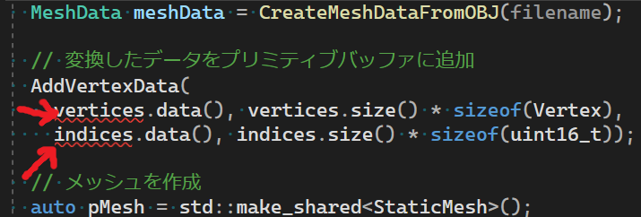
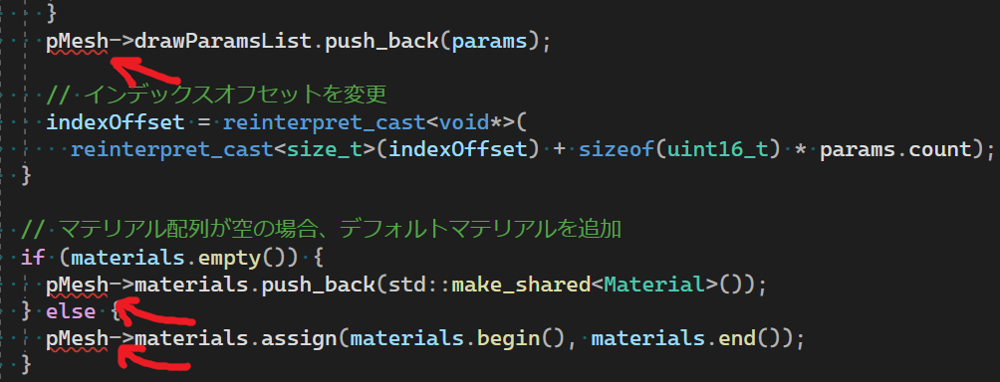
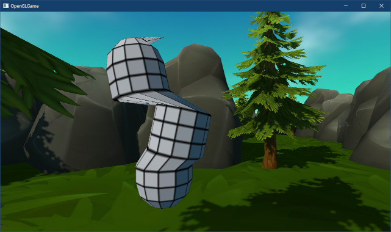
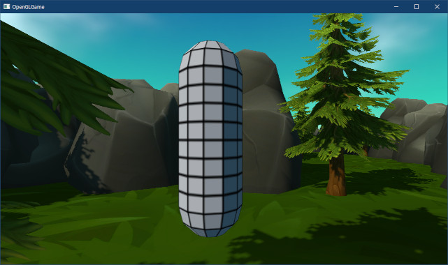
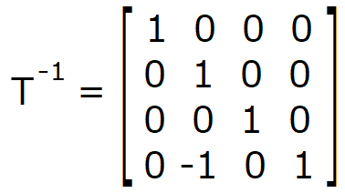
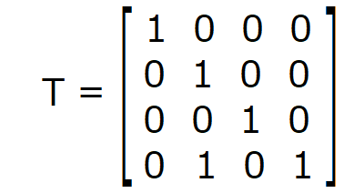
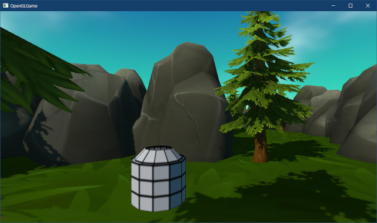
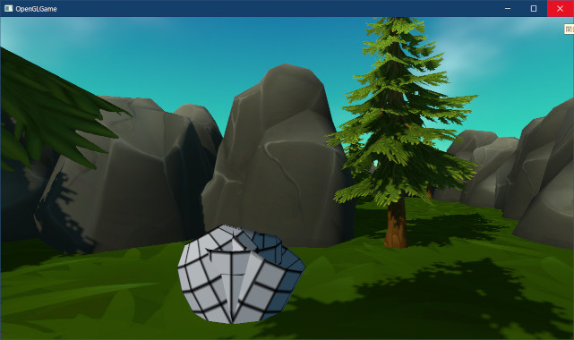
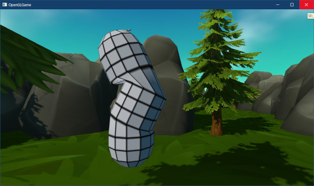
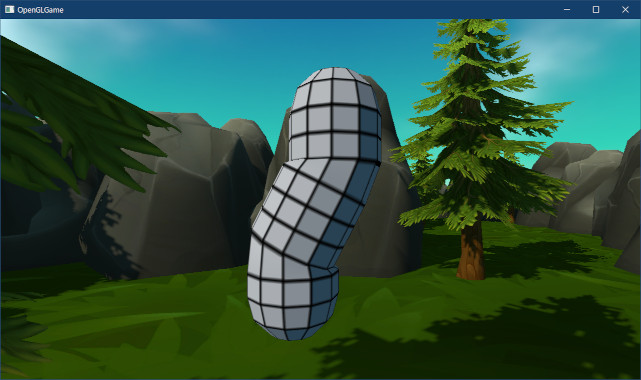

[OpenGL 3D 2023 後期 第06回]

# 関節アニメーション

## 習得目標

* 関節を表現するために必要な、頂点データに追加するパラメータについて説明できる。
* 関節を表す行列を合成し、頂点を座標変換するシェーダプログラムを書くことができる。
* バインドポーズ行列、逆バインドポーズ行列の用途を説明できる。
* 関節アニメーションのために、関節行列を合成する順序について説明できる。

## 1. スケルタルメッシュとシェーダストレージブロック

### 1.1 スケルタルメッシュ

2023年現在、ゲームを含む3Dグラフィックスでは、動植物のように形が変形する物体を表現するために、3Dモデルの形状を自在に変形させています。

モデルを変形させる方法はいくつもあるのですが、ゲームで主に使われているのは「頂点ごとに異なる座標変換行列を割り当てる」方法です。この方法には「複雑なアニメーションを作成できるうえ、アニメーションデータが比較的小さい」という特徴があります。

「頂点ごとに異なる座標変換行列を割り当てる」方法で作られた3Dモデルのうち、「関節」を表すように座標変換行列を定義した3Dモデルを「スケルタル・メッシュ」または「スキン・メッシュ」と呼びます。

さて、「頂点ごとに異なる座標変換行列を割り当てる」ための、具体的な方法は次のようになります。

>1. シェーダに「座標変換行列の配列」を追加する。
>2. 「何番目の座標変換行列を使うか」というデータを持つ頂点データ型を定義する。
>3. CPU側で、座標変換行列をGPUメモリにコピーする。
>4. シェーダにおいて、番号に対応する座標変換行列を使って頂点座標を変換する。

### 1.2 シェーダ・ストレージ・ブロック

それでは、「座標変換行列の配列」を作るところから始めましょう。ただし、今回は「ユニフォーム変数の配列」を使いません。2023年現在のスケルタルメッシュの関節を扱うには、定義可能なユニフォーム変数が足りないからです。

OpenGL 4.6仕様では「少なくとも`float`型で1024個」定義できるとされています。4x4行列は16個の`float`で構成されるため、全てを座標変換行列に割り当てたとしても、わずか64個しか定義できません。

行列から不要な部分を除外するとか(85個くらいに増やせる)、行列以外の方法で処理するとか(120個くらいに増やせる)、扱える数を増やす方法はありますが、いずれも4x4行列に変換し直す処理が必要となり、速度が低下します。

そもそも、ひとつのモデルを描画するたびに大量のユニフォーム変数をコピーする行為自体が、処理速度を大きく低下させてしまいます。

これらのユニフォーム変数の問題を解決するため、OpenGL 3.1からは「ユニフォーム・ブロック」が、OpenGL 4.3からは「シェーダ・ストレージ・ブロック」が追加されました。これらのブロックを使うと、ギガバイトを超えるメモリ領域を扱えます。

>**【ブロックの最大サイズはどれくらい?】**<br>
>ブロックの最大サイズは`GL_MAX_SHADER_STORAGE_BLOCK_SIZE`という定数で調べることができます。ただし、これは固定サイズのブロックの制限であり、以下で述べるような「配列サイズを省略したブロック」の最大サイズを調べる方法はありません。詳しくは公式フォーラムの議論を参照してください。<br>
>`https://community.khronos.org/t/107460`

「シェーダ・ストレージ・ブロック」のほうが後発なぶん、高機能かつ扱いやすくなっています。そのため、今回は「シェーダ・ストレージ・ブロック」を使って「座標変換行列の配列」を追加することにします。

さて、「関節のあるモデル(スタティックメッシュ)」と「関節のないモデル(スケルタルメッシュ)」は、座標変換行列の計算方法が異なるために、同じシェーダを使うことができません。

そこで、新しくスケルタルメッシュ用のシェーダを作成します。といっても、座標変換行列以外の法線やカメラの計算などはスケルタルメッシュと同じです。そこで、`standard.vert`のコピーを作って改造することにしましょう。

エクスプローラーでプロジェクトの`Res`フォルダを開き、`standard.vert`のコピーを作成してください。作成したら、名前を`skeletal.vert`に変更してください。

次に、Visual Studioで`skeletal.vert`を開いてください。そして、次のようにファイル名の部分を変更してください。

```diff
 /**
-* @file standard.vert
+* @file skeletal.vert
 */
 #version 450
```

それでは、座標変換行列のシェーダストレージブロックを追加しましょう。シェーダストレージブロックを定義するには`buffer`修飾子を使います。影用のユニフォーム変数の定義の下に、次のプログラムを追加してください。

```diff
 layout(location=4) uniform vec3 cameraPosition; // カメラの位置
 layout(location=5) uniform vec2 cameraSinCosY;  // カメラのY軸回転

 layout(location=10) uniform mat4 shadowTextureMatrix; // シャドウテクスチャ行列
 layout(location=11) uniform float shadowNormalOffset; // 座標を法線方向にずらす量
+
+// 関節データ用のシェーダストレージブロック
+layout(std430, binding=0) buffer JointDataBlock
+{
+  mat4 jointMatrices[]; // 関節の座標変換行列
+};

 void main()
 {
```

`layout`修飾子の部分に見慣れない単語が登場しています。`std430`(エスティーディー・よんさんぜろ)修飾子はシェーダストレージブロックの「データ配置方法」の指定です。

`std430`はシェーダストレージブロック専用で、データがC言語に近い形でメモリ上に配置されるように設定します。

>データ配置方法を指定する修飾子は他にも`packed`(パックド), `shared`(シェアード), `std140`(エスティーディー・いちよんぜろ)があります。

`binding`(バインディング)修飾子は「CPU側でシェーダストレージブロックを指定するときに使う番号」を設定します。この番号は「バインディングポイント」と呼ばれます。機能的には`location`とほぼ同じです。

シェーダストレージブロックでは、C言語の配列と同様に配列のサイズを省略することができます。サイズを省略した場合、CPU側から自由にサイズを指定できます。

>サイズ不定の配列は、ブロックの末尾にあるメンバにしか使えない点に注意してください。これはC言語と同じ制限です。

シェーダストレージブロックにデータをコピーするには、VBOやIBOと同じバッファオブジェクトを使います。シェーダストレージブロックに対応するバッファオブジェクトは「シェーダ・ストレージ・バッファ・オブジェクト」と呼ばれます。

「シェーダストレージバッファオブジェクト」はちょっと長すぎるので、以後は略称のSSBO(エスエスビーオー)で表記します。

それでは、SSBO用のメンバ変数を追加しましょう。名前は`ssboJointMatrices`(エスエスビーオー・ジョイント・マトリシーズ、「関節行列配列用のSSBO」のような意味)とします。

`Engine.h`を開き、デプスシャドウ用FBO変数の定義の下に次のプログラムを追加してください。

```diff
   // シャドウ・シェーダ
   GLuint vsShadow = 0;
   GLuint fsShadow = 0;
   GLuint progShadow = 0;

   FramebufferObjectPtr fboShadow; // デプスシャドウ用FBO
+
+  // 関節行列の配列の最大バイト数
+  static constexpr size_t jointMatricesBytes = 1024 * 1024;
+  BufferObjectPtr ssboJointMatrices; // 関節行列の配列用のバッファ

   MeshBufferPtr meshBuffer;   // 図形データ管理オブジェクト
   std::unordered_map<std::string, TexturePtr> textureCache;
```

次に`Engine.cpp`を開き、`Initialize`メンバ関数の定義に次のプログラムを追加してください。

```diff
   auto texShadow = std::make_shared<TexHelper>(
     "FBO(depth)", 2048, 2048, GL_DEPTH_COMPONENT32);
   fboShadow = std::make_shared<FramebufferObject>(nullptr, texShadow);
+
+  // 関節用のSSBOを作成
+  ssboJointMatrices = BufferObject::Create(jointMatricesBytes);

   // 頂点データをGPUメモリにコピー
   const Vertex vertexData[] = {
```

ここで作成したSSBOには、あとで関節行列をコピーします。とりあえず、データをGPUメモリにコピーする機能だけ作成しておきましょう。関数名は`CopyData`(コピー・データ、「データをコピーする」という意味)とします。

`BufferObject.h`を開き、`BufferObject`クラスの定義に次のプログラムを追加してください。

```diff
   // 管理番号を取得
   operator GLuint() const { return id; }

   // バッファサイズを取得
   GLsizeiptr GetSize() const { return bufferSize; }
+
+  /**
+  * GPUメモリにデータをコピーする
+  *
+  * @param offset コピー先(GPUメモリ)の位置
+  * @param data   コピーするデータのアドレス
+  * @param size   コピーするバイト数
+  */
+  void CopyData(size_t offset, const void* data, size_t size)
+  {
+    GLuint tmp;
+    glCreateBuffers(1, &tmp);
+    glNamedBufferStorage(tmp, size, data, 0);
+    glCopyNamedBufferSubData(tmp, id, 0, offset, size);
+    glDeleteBuffers(1, &tmp);
+  }

private:
  GLuint id = 0;             // オブジェクト管理番号
  GLsizeiptr bufferSize = 0; // バッファサイズ(バイト数)
```

`CopyData`メンバ関数は、一時的なGPUメモリ領域を作成してCPUメモリ上のデータをコピーし(この時点でGPUに適したデータ形式に変換される)、そこから本来のGPUメモリ領域に再度コピーすることで、データをCPUメモリからGPUメモリへコピーします。

こうした一見して二度手間に見える工程が必要なのは、確保済みのGPUメモリ領域はGPUが高速にアクセスすることに最適化されているため、CPUメモリから既存のGPUメモリへデータをコピーできなくなっているためです。

>**【CPUメモリからGPUメモリに直接コピーする方法】**<br>
>`glNamedBufferSubData`関数を使えば、GPU形式のメモリ領域に直接コピーすることができます。ただし、そのメモリ領域は「CPUとGPUの両方からアクセスできる、低速な形式に変換」されます。そして、以後はずっとこの低速な形式が使われます。

### 1.3 スケルタルメッシュ用の頂点データを定義する

次に、「何番目の座標変換行列を使うか」というデータを持つ頂点データ型を追加します。名前は`SkeletalVertex`(スケルタル・バーテックス)とします。`Mesh.h`を開き、次のプログラムを追加してください。

```diff
   MaterialList materials; // 共有マテリアル
 };
 using StaticMeshPtr = std::shared_ptr<StaticMesh>;
 void Draw(const StaticMesh& mesh, GLuint program, const MaterialList& materials);
+
+/**
+* 関節付き頂点データ形式
+*/
+struct SkeletalVertex
+{
+  vec3 position; // 頂点座標
+  vec2 texcoord; // テクスチャ座標
+  vec3 normal;   // 法線ベクトル
+  uint16_t joints[4];  // 影響を受ける関節の番号
+  uint16_t weights[4]; // 各関節の影響度
+};

 // マテリアル配列を複製する
 inline MaterialList CloneMaterialList(const StaticMeshPtr& original)
```

`Vertex`型との違いは、2つのメンバ変数が増えていることです。`joints`(ジョインツ)メンバ変数は、最初に説明した「何番目の座標変換行列を使うか」を表します。最大4つの行列を指定できます。

`weights`(ウェイツ)メンバ変数は、`joints`メンバ変数で指定された「座標変換行列の影響度」を表します。`joints`と`weights`が配列になっているのは、「複数の関節から影響を受ける状態」を表現するためです。

例えば、親指と人差し指の間の皮膚は、親指を動かしたときも、人差し指を動かしたときも形が変化します。このような複雑な変形を再現するために、データを配列として定義しているのです。

次に、関節付きメッシュを管理する構造体を追加します。`SkeletalVertex`構造体の定義の下に、次のプログラムを追加してください。

```diff
   uint16_t joints[4];  // 影響を受ける関節の番号
   uint16_t weights[4]; // 各関節の影響度
 };
+
+/**
+* 関節付きメッシュ
+*/
+struct SkeletalMesh
+{
+  std::string name;    // メッシュ名
+  std::vector<DrawParams> drawParamsList; // 描画パラメータ
+  MaterialList materials; // 共有マテリアル
+};
+using SkeletalMeshPtr = std::shared_ptr<SkeletalMesh>;

 // マテリアル配列を複製する
 inline MaterialList CloneMaterialList(const StaticMeshPtr& original)
```

現時点では`StaticMesh`構造体と同じメンバしかありませんが、あとで関節を表すデータを追加する予定です。

### 1.4 スケルタルメッシュ用のVAOを追加する

頂点のデータが異なるので、頂点アトリビュートも異なります。そのため、スタティックメッシュ用の`VAO`は、スケルタルメッシュには使えません。そこで、スケルタルメッシュ用の`VAO`を追加します。

`MeshBuffer`クラスの定義に次のプログラムを追加してください。

```diff
   std::unordered_map<std::string, StaticMeshPtr> meshes;
   std::vector<DrawParams> drawParamsList; // 描画パラメータ配列
   VertexArrayObjectPtr vao; // 頂点配列
+  VertexArrayObjectPtr vaoSkeletal; // スケルタルメッシュ用の頂点配列
   BufferObjectPtr buffer;   // 頂点データおよびインデックスデータ
   size_t usedBytes = 0;     // バッファの使用済み容量(バイト)
```

追加したVAOを返すメンバ関数も定義しておきましょう。`GetVAO`メンバ関数の定義の下に、次のプログラムを追加してください。

```diff
   // VAOの取得
   VertexArrayObjectPtr GetVAO() const { return vao; }
+  VertexArrayObjectPtr GetVAOSkeletal() const { return vaoSkeletal; }

 private:
   std::vector<MaterialPtr> LoadMTL(
     const std::string& foldername, const char* filename);
```

次に`Mesh.cpp`を開き、`MeshBuffer`コンストラクタの定義に次のプログラムを追加してください。

```diff
   // 頂点アトリビュートを設定
   vao->SetAttribute(0, 3, sizeof(Vertex), offsetof(Vertex, position));
   vao->SetAttribute(1, 2, sizeof(Vertex), offsetof(Vertex, texcoord));
   vao->SetAttribute(2, 3, sizeof(Vertex), offsetof(Vertex, normal));
+
+  // スケルタルメッシュ用のVAOを作成
+  vaoSkeletal = VertexArrayObject::Create();
+  glBindVertexArray(*vaoSkeletal);
+  glBindBuffer(GL_ELEMENT_ARRAY_BUFFER, *buffer);
+  glBindBuffer(GL_ARRAY_BUFFER, *buffer);
+  vaoSkeletal->SetAttribute(0, 3, sizeof(SkeletalVertex),
+    offsetof(SkeletalVertex, position));
+  vaoSkeletal->SetAttribute(1, 2, sizeof(SkeletalVertex),
+    offsetof(SkeletalVertex, texcoord));
+  vaoSkeletal->SetAttribute(2, 3, sizeof(SkeletalVertex),
+    offsetof(SkeletalVertex, normal));

  // 誤った操作が行われないようにバインドを解除
  glBindVertexArray(0);
```

`position`, `texcoord`, `normal`の3つはスタティクメッシュと同じ構成なので、頂点アトリビュートも同じ設定が使えます。

問題は`joints`と`weights`です。これらは整数型で定義しているので、`float`型を前提とする`SetAttribute`メンバ関数は使えません。さらに、`joints`は行列の番号なので整数値としてシェーダに送る必要があります。

整数値を整数値のままシェーダに送るには、`glVertexAttribIPointer`(ジーエル・バーテックス・アトリブ・アイ・ポインタ)関数を使う必要があります(名前の途中に`I`(アイ)が入っていることに注意)。

<p><code class="tnmai_code"><strong>【書式】</strong><br>
void glVertexAttribIPointer(頂点属性配列のインデックス, データの要素数,<br>
&emsp;データの型, 次のデータまでのバイト数, 最初のデータの位置);
</code></p>

`I`のない`glVertexAttribPointer`関数との違いは、「正規化の有無」を指定する引数がないことです。「正規化」は整数値を`0`～`1`または`-1`～`1`の範囲の浮動小数点数に変換することを指します。

しかし、整数値で送りたい場合は浮動小数点数に変換されると困ります。つまり、もし正規化を指定できたとしても意味がないのです。これが、この関数に「正規化の有無」を指定する引数がない理由です。

それでは、`glVertexAttribIPointer`関数を使って`joints`用の頂点アトリビュートを設定しましょう。スケルタルメッシュ用のVAOを作成するプログラムに、次のプログラムを追加してください。

```diff
   vaoSkeletal->SetAttribute(1, 2, sizeof(SkeletalVertex),
     offsetof(SkeletalVertex, texcoord));
   vaoSkeletal->SetAttribute(2, 3, sizeof(SkeletalVertex),
     offsetof(SkeletalVertex, normal));
+  glEnableVertexAttribArray(3);
+  glVertexAttribIPointer(3, 4, GL_UNSIGNED_SHORT, sizeof(SkeletalVertex),
+    reinterpret_cast<const void*>(offsetof(SkeletalVertex, joints)));

  // 誤った操作が行われないようにバインドを解除
  glBindVertexArray(0);
```

次に`weights`用の頂点アトリビュートを設定します。`SetAttribute`メンバ関数が使えないのは`joints`と同じですが、こちらは「整数を正規化」してシェーダに送るように設定します。

そのため、「`I`の付かない」`glVertexAttribPointer`関数によって頂点アトリビュートを設定します。`joints`用の頂点アトリビュートを設定するプログラムの下に、次のプログラムを追加してください。

```diff
   glEnableVertexAttribArray(3);
   glVertexAttribIPointer(3, 4, GL_UNSIGNED_SHORT, sizeof(SkeletalVertex),
     reinterpret_cast<const void*>(offsetof(SkeletalVertex, joints)));
+  glEnableVertexAttribArray(4);
+  glVertexAttribPointer(4, 4, GL_UNSIGNED_SHORT, GL_TRUE, sizeof(SkeletalVertex),
+    reinterpret_cast<const void*>(offsetof(SkeletalVertex, weights)));

  // 誤った操作が行われないようにバインドを解除
  glBindVertexArray(0);
```

符号なし整数型に対して「正規化を行う」ように指示すると、値が`0`～`1`の浮動小数点数に変換されてシェーダに送られます。例えば、`uint16_t`の値は次のように変換されます。

| `uint16_t`の値 | 変換式 | シェーダに送られる値 |
|:------|:--------------|:---------------|
| 0     | 0 / 65535     | 0.0            |
| 1     | 1 / 65535     | 0.000015259... |
| 2     | 2 / 65535     | 0.000030518... |
| 100   | 100 / 65535   | 0.0015259...   |
| 10000 | 10000 / 65535 | 0.15259...     |
| 32767 | 32767 / 65535 | 0.499992...    |
| 32768 | 32768 / 65535 | 0.500007...    |
| 65535 | 65535 / 65535 | 1.0

「正確な`0.5`を表現できない」などの欠点はあるものの、殆どの場合に問題のない精度が得られることが見て取れるでしょう。このように正規化を利用すると、必要なデータサイズを1/2や1/4に減らすことができます。

わずかな改善に思えるかもしれませんが、2023年現在のゲーム用3Dモデルでは頂点データ数が10万以上になることもあります。ひとつの頂点ではわずか数バイトの節約であっても、モデル全体ではかなりの節約が見込めます。

基本的に、頂点データにおける正規化は、頂点データのサイズを削減するために使われます。今回の場合、行列の影響度は`0`～`1`の範囲で、すべての影響度の合計が`1`になるようにしたいと考えています。

値の範囲が`0`～`1`に制限される場合、`float`ほどの精度は必要なく、256段階や65536段階で設定できれば十分なことが多いです。このような場合32bitも必要な`float`ではなく、`uint8_t`や`uint16_t`を選ぶことでデータサイズを削減できます。

>`position`, `texcoord`, `normal`を8bitや16bitで表現できないかを考えてみてください。例えば身長2mの3Dモデルがあるとして、2mを65535で割ると0.03mmの精度で座標を指定できることになります。さて、これはモデルを表現するのに十分な精度でしょうか？　それとも精度不足でしょうか？　どこかに見落としはないでしょうか？

これでVAOは作成できました。ゲームエンジンがこのVAOをOpenGLコンテキストに割り当てられるように、VAOを返す関数を追加します。`Mesh.h`を開き、`MeshBuffer`クラスの定義に次のプログラムを追加してください。

```diff
   // VAOの取得
   VertexArrayObjectPtr GetVAO() const { return vao; }
+  VertexArrayObjectPtr GetVAOSkeletal() const { return vaoSkeletal; }

 private:
   std::vector<MaterialPtr> LoadMTL(
     const std::string& foldername, const char* filename);
```

これで、他のプログラムあらスケルタルメッシュ用のVAOを取得できるようになりました。

### 1.5 行列番号と影響度を使って座標変換を行う

続いて、頂点アトリビュートで指定したデータを受け取るシェーダ変数を定義します。`skeletal.vert`を開き、次の`in`変数を追加してください。

```diff
 // シェーダへの入力
 layout(location=0) in vec3 inPosition; // 頂点座標
 layout(location=1) in vec2 inTexcoord; // テクスチャ座標
 layout(location=2) in vec3 inNormal;   // 法線ベクトル
+layout(location=3) in uvec4 inJoints;  // 座標変換行列の番号
+layout(location=4) in vec4 inWeights;  // 座標変換行列の影響度

 // シェーダからの出力
 layout(location=0) out vec3 outPosition; // ワールド座標
 layout(location=1) out vec2 outTexcoord; // テクスチャ座標
```

行列番号を受け取る`inJoints`(イン・ジョインツ)変数の型は`uvec4`(ユー・ベク・フォー)としています。GLSLにおいて、先頭に小文字の`u`が付いた型は「符号なし整数型」を意味します。また、「符号付き整数型」を表すには`i`を使います(`ivec4`など)。

それでは、追加した頂点データを使って関節行列を計算しましょう。これは、各行列に影響度を乗算したあと、すべての行列を加算することで実現できます。`main`関数の定義に次のプログラムを追加してください。

```diff
 void main()
 {
   outTexcoord = inTexcoord;
+
+  // 関節行列に影響度を掛けて加算合成
+  mat4 jointMatrix =
+    jointMatrices[inJoints.x] * inWeights.x +
+    jointMatrices[inJoints.y] * inWeights.y +
+    jointMatrices[inJoints.z] * inWeights.z +
+    jointMatrices[inJoints.w] * inWeights.w;

   // ローカル座標系からワールド座標系に変換
   gl_Position = transformMatrix * vec4(inPosition, 1);
```

次に、関節行列とゲームオブジェクトの座標変換行列を乗算し、モデル行列(3Dモデルのローカル座標系からワールド座標系に変換する行列)を作成します。関節行列を作成するプログラムの下に、次のプログラムを追加してください。

```diff
     jointMatrices[inJoints.y] * inWeights.y +
     jointMatrices[inJoints.z] * inWeights.z +
     jointMatrices[inJoints.w] * inWeights.w;
+
+  // 関節行列とゲームオブジェクトの座標変換行列を合成
+  mat4 modelMatrix = transformMatrix * jointMatrix;

   // ローカル座標系からワールド座標系に変換
   gl_Position = transformMatrix * vec4(inPosition, 1);
   outPosition = gl_Position.xyz;
```

続いて、ゲームオブジェクトの座標変換行列によって頂点座標を変換するプログラムを、モデル行列を使うように変更してください。

```diff
   // 関節行列とゲームオブジェクトの座標変換行列を合成
   mat4 modelMatrix = transformMatrix * jointMatrix;

   // ローカル座標系からワールド座標系に変換
-  gl_Position = transformMatrix * vec4(inPosition, 1);
+  gl_Position = modelMatrix * vec4(inPosition, 1);
   outPosition = gl_Position.xyz;

   // ワールド法線を計算
   outNormal = normalMatrix * inNormal;
```

同様に、すぐ下にあるワールド法線の計算も変更してください。

```diff
   gl_Position = modelMatrix * vec4(inPosition, 1);
   outPosition = gl_Position.xyz;

   // ワールド法線を計算
+  mat3 jointNormalMatrix = transpose(inverse(mat3(modelMatrix)));
-  outNormal = normalMatrix * inNormal;
+  outNormal = normalize(jointNormalMatrix * inNormal);

   // シャドウテクスチャ座標を計算
   outShadowTexcoord = outPosition + outNormal * shadowNormalOffset;
   outShadowTexcoord = vec3(shadowTextureMatrix * vec4(outShadowTexcoord, 1));
```

スケルタルメッシュの法線は「関節行列による回転」を考慮しなくてはなりません。こうなると、関節行列を考慮しない`normalMatrix`はもはや使い物になりません。そこで、モデル行列から法線を変換する行列を作成します。

`normalMatrix`を求めるときは、各軸のスケールを求めて除算することで回転だけを取得していました。同じことをしてもいいのですが、GLSLでは「逆転置(ぎゃく・てんち)行列」という行列を計算することで、より簡単に法線行列を求められます。

逆転置行列を求めるには、最初に「逆行列」を計算し、次にその「転置行列」を計算します。逆行列を求めるには`inverse`(インバース)関数、転置行列を求めるには`transpose`(トランスポーズ)関数を使います。

<p><code class="tnmai_code"><strong>【書式】</strong><br>
mat3 inverse(変換する3x3行列);<br>
mat4 inverse(変換する4x4行列);
</code></p>

<p><code class="tnmai_code"><strong>【書式】</strong><br>
mat3 transpose(変換する3x3行列);<br>
mat4 transpose(変換する4x4行列);
</code></p>

逆行列は「元の行列に掛けると単位行列になる行列」で、行列を表す英大文字の右上に`-1`を付けて表記します。例えば`T`の逆行列は<code>T<sup>-1</sup></code>と書きます。

```txt
元の行列     逆行列      単位行列
| 1 2 |   | -2    1  |   | 1 0 |
| 3 4 | * | 3/2 -1/2 | = | 0 1 |
```

逆行列は「元の行列を打ち消す行列」と考えることができるでしょう。

次に転置行列に付いて説明します。転置行列は「行成分と列成分を入れ替えた行列」です。以下に3x3行列を転置する例を示します。

```txt
| a b c |          | a d g |
| d e f | -(転置)→ | b e h |
| g h i |          | c f i |
```

ある行列の転置行列は、行列を表す英大文字の右上に`T`を付けて表記します。例えば`M`の転置行列は<code>M<sup>T</sup></code>のように書きます。また「回転行列の転置行列は、反対向きの回転行列になる」という性質があります。

#### 逆転置行列はどこから出てきたのか？

しかし、なぜ「逆行列」と「転置行列」を使うことで法線行列が求められるのでしょうか？

「逆転置行列が法線の変換の適している理由」の説明には、主に以下の3つがあります。

* 平面の向きとして考える。
* 行列を特異値分解して考える。
* グラスマン代数学のトライベクトルとして考える。

いずれも大学数学の内容ですが、比較的理解しやすいのは最初の「平面の向きとして考える」ものでしょう。とりあえずこれで説明してみることにします。

まず、「法線」は「原点を含む平面の向き」と考えることができます。この「平面」上の任意の点を`v`とし、法線を`n`とします。このとき`dot(n, v) = 0`が成り立ちます。

座標変換では、座標`v`を変換したあとも、法線`n`について上の式が成り立つようにしたいです。`v`の座標変換行列を`M`とし、`n`について上の式が成り立つような未知の行列`X`があるとすると、次の式が成り立つはずです。

`dot(X*n, M*v) = 0`

ここで回転行列と転置行列の性質を利用して両辺に`M`の転置行列を乗算し、`v`の回転を打ち消します。

`dot(X*n, M*v) = `<code>dot(M<sup>T</sup>\*X\*n, M<sup>T</sup>\*M\*v) = 0</code>

<code>M<sup>T</sup>\*M</code>は「回転→逆回転」となるため、実質的には全く変換しないのと同じです。そのため、この部分は式から除去できます。除去すると次の式になります。

<code>dot(M<sup>T</sup>\*X\*n, v) = 0</code>

さて、この式を満たす`X`は、以下の式が成り立つような行列になるはずです。

<code>M<sup>T</sup>\*X\*n = s * n</code>(ここで`s`は任意の実数)

仮に`s = 1`とすると、<code>M<sup>T</sup>\*X\*n = n</code>となります。このとき、`X`には<code>M<sup>T</sup></code>を打ち消して単位行列を作る行列が求められます。

<code>M<sup>T</sup>\*X\ = I</code>

打ち消すといえば逆行列ですね。逆行列を使って`X`に付いて解くと、次の式になります。

<code>X = (M<sup>T</sup>)<sup>-1</sup></code>

つまり、「法線`n`を変換する行列`X`」は「座標`v`を変換する座標変換行列`M`の転置行列の逆行列」になるわけです。

実際には途中で出てきた「任意の実数`s`」も考慮しなくてはなりません。この`s`は、「逆転置行列によって変換した結果が単位ベクトルになるとは限らない」ことを意味します。もっとも、これは`normalize`関数で正規化すれば解決できます。

>ここまでの説明を参考に、`jointNormalMatrix`を作成するプログラムが何をしているのかを確認してください。

とりあえず、完成したシェーダを`Engine`クラスに追加しましょう。`Engine.h`を開き、`Engine`クラスの定義に次のプログラムを追加してください。

```diff
   // アンリット・シェーダ
   GLuint vsUnlit = 0;
   GLuint fsUnlit = 0;
   GLuint progUnlit = 0;
+
+  // スケルタルメッシュ・シェーダ
+  GLuint vsSkeletal = 0;
+  GLuint fsSkeletal = 0;
+  GLuint progSkeletal = 0;

   // シャドウ・シェーダ
   GLuint vsShadow = 0;
```

次に`Engine.cpp`を開き、`Initialize`メンバ関数の定義に次のプログラムを追加してください。

```diff
   glAttachShader(progUnlit, vsUnlit);
   glAttachShader(progUnlit, fsUnlit);
   glLinkProgram(progUnlit);
+
+  // アンリット・シェーダを作成
+  vsSkeletal = CompileShader(GL_VERTEX_SHADER, "Res/skeletal.vert");
+  fsSkeletal = CompileShader(GL_FRAGMENT_SHADER, "Res/standard.frag");
+  progSkeletal = glCreateProgram();
+  glAttachShader(progSkeletal, vsSkeletal);
+  glAttachShader(progSkeletal, fsSkeletal);
+  glLinkProgram(progSkeletal);

   // シャドウ・シェーダを作成
   vsShadow = CompileShader(GL_VERTEX_SHADER, "Res/shadow.vert");
```

`skeletal`シェーダは`standard`シェーダを元に作成したので、シェーダを使う前にアスペクト比やカメラパラメータを設定する必要があります。`Render`メンバ関数の定義を次のように変更してください。

```diff
   // フレームバッファの大きさを取得
   int fbWidth, fbHeight;
   glfwGetFramebufferSize(window, &fbWidth, &fbHeight);

-  const GLuint programs[] = { prog3D, progUnlit };
+  const GLuint programs[] = { prog3D, progUnlit, progSkeletal };
   for (auto prog : programs) {
     // アスペクト比と視野角を設定
```

これで、`skeletal`シェーダを使う準備ができました。

### 1.6 LoadOBJ関数からOBJファイル読み込み処理を分離する

```diff
 private:
   std::vector<MaterialPtr> LoadMTL(
     const std::string& foldername, const char* filename);

   std::unordered_map<std::string, StaticMeshPtr> meshes;
+  std::unordered_map<std::string, SkeletalMeshPtr> skeletalMeshes;
   std::vector<DrawParams> drawParamsList; // 描画パラメータ配列
   VertexArrayObjectPtr vao; // 頂点配列
```

スケルタルメッシュといえど、OBJファイルを読み込むプログラムはスタティックメッシュと全く同じです。プログラムの保守性(後で改良したりバグを直したりすること)を考えると、同じプログラムのコピーを作るのはよくありません。、

そこで、OBJファイルを読み込む`LoadOBJ`メンバ関数を、「OBJファイルを読み込んでOpenGL用のデータに変換する部分」と「データからスタティックメッシュを作成する部分」に分離します。

「OBJファイルを読み込んでOpenGL用のデータに変換する部分」は新しい関数とします。名前は`CreateMeshDataFromOBJ`(クリエイト・メッシュ・データ・フロム・オブジェ)とします。


```diff
 private:
   std::vector<MaterialPtr> LoadMTL(
     const std::string& foldername, const char* filename);
+
+  // メッシュ構築用の中間データ
+  struct MeshData
+  {
+  };
+  MeshData CreateMeshDataFromOBJ(const char* filename);

   std::unordered_map<std::string, StaticMeshPtr> meshes;
   std::unordered_map<std::string, SkeletalMeshPtr> skeletalMeshes;
```

「データからスタティックメッシュを作成する部分」は引き続き`LoadOBJ`メンバ関数が担当することにします。そして、`LoadOBJ`から`CreateMeshDataFromOBJ`メンバ関数を呼び出すことでOBJファイルを読み込みます。

`CreateMeshDataFromOBJ`が何を返したらいいのかは作りながら考えることにします(少なくとも頂点データとインデックスデータは必要だなあ、くらいのことは考えていますが)。

それでは`LoadOBJ`メンバ関数の定義を2つの関数に分割しましょう。`Mesh.cpp`を開き、`LoadOBJ`メンバ関数の定義にある「作成済みのメッシュを判定するプログラム」の下に、次のプログラムを追加してください。

```diff
     if (itr != meshes.end()) {
       return itr->second;
     }
   }
+
+  // OBJファイルからメッシュデータを作成
+  MeshData meshData = CreateMeshDataFromOBJ(filename);
+}
+
+/**
+* OBJファイルをメッシュデータに変換する
+*
+* @param filename OBJファイル名
+*
+* @return filenameから作成したメッシュデータ
+*/
+MeshBuffer::MeshData MeshBuffer::CreateMeshDataFromOBJ(const char* filename)
+{
   // OBJファイルを開く
   std::ifstream file(filename);
   if (!file) {
```

OBJファイルの読み込み処理の大半は`CreateMesuDataFromOBJ`メンバ関数が担当します。次に、ざっと「元`LoadOBJ`メンバ関数だったプログラム」をながめて、読み込みや返還ではなくスタティックメッシュの作成に関わる部分を探します。

スタティックメッシュを作成する部分は`LoadOBJ`メンバ関数に戻す必要があるからです。見たところ「変換したデータをプリミティブバッファに追加」と「メッシュを作成」を戻せば良さそうです。

「変換したデータをプリミティブバッファに追加」と「メッシュを作成」を行うプログラムを切り取ってください。

```diff
   // 設定されていない法線を補う
   FillMissingNormals(vertices.data(), vertices.size(),
     indices.data(), indices.size());
-
-  // 変換したデータをプリミティブバッファに追加
-  AddVertexData(
-    vertices.data(), vertices.size() * sizeof(Vertex),
-    indices.data(), indices.size() * sizeof(uint16_t));
-
-  // メッシュを作成
-  auto pMesh = std::make_shared<StaticMesh>();

   // データの位置を取得
   const void* indexOffset = drawParamsList.back().indices;
   const GLint baseVertex = drawParamsList.back().baseVertex;
```

そして、切り取ったプログラムを`LoadOBJ`メンバ関数に貼り付けてください。

```diff
   }

   // OBJファイルからメッシュデータを作成
   MeshData meshData = CreateMeshDataFromOBJ(filename);
+
+  // 変換したデータをプリミティブバッファに追加
+  AddVertexData(
+    vertices.data(), vertices.size() * sizeof(Vertex),
+    indices.data(), indices.size() * sizeof(uint16_t));
+
+  // メッシュを作成
+  auto pMesh = std::make_shared<StaticMesh>();
 }

 /**
 * OBJファイルをメッシュデータに変換する
```

`CreateMeshDataFromOBJ`メンバ関数をさらに下にながめていくと、メッシュ名を設定し、スタティックメッシュ連想配列にメッシュを追加しているプログラムが見つかります。これらも「スタティックメッシュを作成するプログラム」に当たるので移動します。

`CreateMeshDataFromOBJ`メンバ関数の末尾にある、次のプログラムを切り取ってください。

```diff
   } else {
     pMesh->materials.assign(materials.begin(), materials.end());
   }
-
-  pMesh->name = filename;
-  meshes.emplace(filename, pMesh);
-
-  LOG("%sを読み込みました(頂点数=%d, インデックス数=%d)", filename, vertices.size(), indices.size());
-
-  // 作成したメッシュを返す
-  return pMesh;
 }

 /**
 * 頂点データの追加
```

そして、切り取ったプログラムを`LoadOBJ`メンバ関数の末尾に貼り付けてください。

```diff
   AddVertexData(
     vertices.data(), vertices.size() * sizeof(Vertex),
     indices.data(), indices.size() * sizeof(uint16_t));

   // メッシュを作成
   auto pMesh = std::make_shared<StaticMesh>();
+
+  pMesh->name = filename;
+  meshes.emplace(filename, pMesh);
+
+  LOG("%sを読み込みました(頂点数=%d, インデックス数=%d)", filename, vertices.size(), indices.size());
+
+  // 作成したメッシュを返す
+  return pMesh;
 }

 /**
 * OBJファイルをメッシュデータに変換する
```

この時点で、いくつかエラーが表示されていますが、一旦それはおいておいて、プログラムを移動させたことによる不具合がないかどうかを確認しましょう。

どうも、`AddVertexData`を移動したことで、`CreateMeshDataFromOBJ`メンバ関数にある`indexOffset`変数と`baseVertex`変数が正しく処理できていないように見えます。

このふたつの変数は、マテリアルごとのデータの位置を計算するために「最後に追加されたデータの先頭位置」を参照することが目的です。

しかし、データの追加は`AddVertexData`メンバ関数で行われます。この関数は別の場所に移動させてしまったので、もう「データの先頭位置」は参照できません。この対策として、

>1. `CreateMeshDataFromOBJ`メンバ関数では、とりあえず先頭位置を`0`として、マテリアルのデータ位置を計算する。
>2. `LoadOBJ`メンバ関数で改めて先頭位置を取得し、マテリアルのデータ位置を再計算する。

という手順を取ることにします。ぞれでは`1`からやっていきましょう。「データの位置を取得」するプログラムを、次のように変更してください。

```diff
   // 設定されていない法線を補う
   FillMissingNormals(vertices.data(), vertices.size(),
     indices.data(), indices.size());

-  // データの位置を取得
-  const void* indexOffset = drawParamsList.back().indices;
-  const GLint baseVertex = drawParamsList.back().baseVertex;
+  // データの位置を初期化
+  const void* indexOffset = 0;
+  const GLint baseVertex = 0;

   // マテリアルに対応した描画パラメータを作成
   // 仮データと番兵以外のマテリアルがある場合、仮データを飛ばす
```

次は`2`です。`LoadOBJ`メンバ関数の定義に次のプログラムを追加してください。

```diff
   // メッシュを作成
   auto pMesh = std::make_shared<StaticMesh>();

   pMesh->name = filename;
   meshes.emplace(filename, pMesh);
+
+  // AddVertexDataでコピーしたデータの位置を、描画パラメータに反映
+  const intptr_t baseIndexOffset =
+    reinterpret_cast<intptr_t>(drawParamsList.back().indices);
+  const GLint baseVertex = drawParamsList.back().baseVertex;
+  for (auto& e : pMesh->drawParamsList) {
+    e.baseVertex = baseVertex;
+    e.indices = reinterpret_cast<const void*>(
+      baseIndexOffset + reinterpret_cast<intptr_t>(e.indices));
+  }

   LOG("%sを読み込みました(頂点数=%d, インデックス数=%d)", filename, vertices.size(), indices.size());
```

`DrawParams::indices`メンバ変数は`const void*`型なので数値演算ができません。そのため、「整数型にキャストして演算を行い、再び`void*`にキャストする」という手順で計算しています。

これで、「`AddVertexData`メンバ関数を移動させたことによる問題」は解決しました。今度はエラーを解決していきます。エラーは`vertices`と`indices`変数で起きているので、これらを`MeshData`構造体に追加しましょう。

<p align="center">
<br>
</p>

`Mesh.h`を開き、`MeshData`構造体の定義に次のプログラムを追加してください。

```diff
   // メッシュ構築用の中間データ
   struct MeshData
   {
+    std::vector<Vertex> vertices;  // 頂点データ
+    std::vector<uint16_t> indices; // インデックスデータ
   };
   MeshData CreateMeshDataFromOBJ(const char* filename);
```

追加したメンバ変数を使ってエラーを解決します。`Mesh.cpp`を開き、`LoadOBJ`メンバ関数の定義にある`AddVertexData`メンバ関数呼び出しを、次のように変更してください。

```diff
   MeshData meshData = CreateMeshDataFromOBJ(filename);

   // 変換したデータをプリミティブバッファに追加
   AddVertexData(
-    vertices.data(), vertices.size() * sizeof(Vertex),
-    indices.data(), indices.size() * sizeof(uint16_t));
+    meshData.vertices.data(), meshData.vertices.size() * sizeof(Vertex),
+    meshData.indices.data(), meshData.indices.size() * sizeof(uint16_t));

   // メッシュを作成
   auto pMesh = std::make_shared<StaticMesh>();
```

<pre class="tnmai_assignment">
<strong>【課題01】</strong>
まだ、<code>LOG</code>マクロの<code>vertices</code>および<code>indices</code>変数でエラーが表示されています。<code>meshData</code>のメンバ変数を参照するようにして、エラーを解決しなさい。
</pre>

次に、OBJファイルから読み取った頂点データとインデックスデータが`MeshData`構造体に格納されるようにします。`LoadOBJ`メンバ関数の定義にある、`vertices`変数と`indices`変数を定義しているプログラムを次のように変更してください。

```diff
   std::unordered_map<uint64_t, uint16_t> indexMap;
   indexMap.reserve(1'000'000);

   // 読み込んだデータを、OpenGLで使えるデータに変換
+  MeshData meshData;
-  std::vector<Vertex> vertices;
+  std::vector<Vertex>& vertices = meshData.vertices;
   vertices.reserve(faceIndexSet.size());
-  std::vector<uint16_t> indices;
+  std::vector<uint16_t>& indices = meshData.indices;
   indices.reserve(faceIndexSet.size());
   for (int i = 0; i < faceIndexSet.size(); ++i) {
```

作成した`meshData`を関数から返しましょう。`CreateMeshDataFromOBJ`メンバ関数の末尾に次のプログラムを追加してください。

```diff
   } else {
     pMesh->materials.assign(materials.begin(), materials.end());
   }
+
+  return meshData;
 }

 /**
 * 頂点データの追加
```

これで、頂点データとインデックスデータを`LoadOBJ`メンバ関数に引き渡せるようになりました。

他のエラーも見てみましょう。すると、`CreateMeshDataFromOBJ`メンバ関数の末尾付近で、`pMesh`変数にエラーが起きていることが分かります。

<p align="center">
<br>
</p>

どうやら、`drawParamsList`変数と`materials`変数の2つを、`MeshData`に追加する必要がありそうです。`Mesh.h`を開き、`MeshData`構造体に次のプログラムを追加してください。

```diff
   // メッシュ構築用の中間データ
   struct MeshData
   {
     std::vector<Vertex> vertices;  // 頂点データ
     std::vector<uint16_t> indices; // インデックスデータ
+    std::vector<DrawParams> drawParamsList; // 描画パラメータ配列
+    MaterialList materials;                 // マテリアル配列
   };
   MeshData CreateMeshDataFromOBJ(const char* filename);
```

再び`Mesh.cpp`を開き、`pMesh`のエラーが出ているプログラムを次のように変更してください。

```diff
         params.materialNo = i; // 名前の一致するマテリアルを設定
         break;
       }
     }
-    pMesh->drawParamsList.push_back(params);
+    meshData.drawParamsList.push_back(params);

     // インデックスオフセットを変更
     indexOffset = reinterpret_cast<void*>(
       reinterpret_cast<size_t>(indexOffset) + sizeof(uint16_t) * params.count);
   }

   // マテリアル配列が空の場合、デフォルトマテリアルを追加
   if (materials.empty()) {
-    pMesh->materials.push_back(std::make_shared<Material>());
+    meshData.materials.push_back(std::make_shared<Material>());
   } else {
-    pMesh->materials.assign(materials.begin(), materials.end());
+    meshData.materials.assign(materials.begin(), materials.end());
   }

   return meshData;
```

これで、描画パラメータ配列とマテリアル配列を`LoadOBJ`メンバ関数に引き渡せるようになりました。早速、引き渡されたデータをスタティックメッシュに反映しましょう。`LoadOBJ`メンバ関数の定義に次のプログラムを追加してください。

```diff
   // メッシュを作成
   auto pMesh = std::make_shared<StaticMesh>();
-
+  pMesh->drawParamsList.swap(meshData.drawParamsList);
+  pMesh->materials.swap(meshData.materials);
   pMesh->name = filename;
   meshes.emplace(filename, pMesh);
```

`vector::swap`メンバ関数は、2つの`vector`型のデータを交換します。データを指すポインタを交換するだけなので、非常に高速に処理が完了します。

最後に、`CreateMeshDataFromOBJ`メンバ関数がOBJファイルの読み込みに失敗した場合に対処します。読み込みに失敗した場合、空の`MeshData`オブジェクトを返すようにします。

`CreateMeshDataFromOBJ`メンバ関数の定義にある、ファイルを開くのに失敗した場合のプログラムを次のように変更してください。

```diff
   // OBJファイルを開く
   std::ifstream file(filename);
   if (!file) {
     LOG_ERROR("%sを開けません", filename);
-    return nullptr;
+    return {}; // 空のオブジェクトを返す
   }

   // フォルダ名を取得する
   std::string foldername(filename);
```

デフォルトコンストラクト可能な型の場合、`{}`と書くことでデフォルトコンストラクタを呼び出してオブジェクトを構築できます。

それでは、`MeshData`が空かどうかを調べて成功と失敗を判定しましょう。`LoadOBJ`メンバ関数の定義にある`CreateMeshDataFromOBJ`メンバ関数呼び出しの下に、次のプログラムを追加してください。

```diff
   // OBJファイルからメッシュデータを作成
   MeshData meshData = CreateMeshDataFromOBJ(filename);
+  if (meshData.vertices.empty()) {
+    return nullptr; // 読み込み失敗
+  }

   // 変換したデータをプリミティブバッファに追加
   AddVertexData(
```

これで、`LoadOBJ`メンバ関数から「OBJファイルを読み込んでOpenGLに変換する部分」を分離することができました。

プログラムが書けたらビルドして実行してください。うまくプログラムを分離できていれば、分離前と全く同じように画面が表示されるはずです。同じように表示されていれば分離成功です。

### 1.7 スケルタルメッシュ用の読み込み関数を追加する

次は「OBJファイルを読み込んで`SkeletalMesh`オブジェクトを作成する関数」を定義します。名前は既存のメンバ関数と同じ`LoadOBJ`(ロード・オブジェ)とし、引数を増やしてオーバーロードします。

`Mesh.h`を開き、`MeshBuffer`クラスの定義に次のプログラムを追加してください。

```diff
   * @return filenameから作成したメッシュ
   */
   StaticMeshPtr LoadOBJ(const char* filename);
+
+  // 関節データ
+  struct Skeleton
+  {
+  };
+
+  /**
+  * OBJファイルを読み込み関節を設定する
+  *
+  * @param filename OBJファイル名
+  * @param skeleton 関節データ
+  *
+  * @return filenameから作成した関節付きメッシュ
+  */
+  SkeletalMeshPtr LoadOBJ(
+    const char* filename, const Skeleton& skeleton);

   /**
   * 頂点データの追加
```

オーバーロードのために「空の(メンバを持たない)構造体やクラス」を定義するのは、C++言語でよく使われるテクニックのひとつです。

それでは、スケルタルメッシュ用の`LoadOBJ`メンバ関数の定義を作成しましょう。`Mesh.cpp`を開き、従来の`LoadOBJ`メンバ関数の定義の下に、次のプログラムを追加してください。

```diff
   // 作成したメッシュを返す
   return pMesh;
 }
+
+/**
+* OBJファイルを読み込み関節を設定する
+*/
+SkeletalMeshPtr MeshBuffer::LoadOBJ(
+  const char* filename, const Skeleton& skeleton)
+{
+  // 以前に読み込んだファイルなら、作成済みのメッシュを返す
+  {
+    auto itr = skeletalMeshes.find(filename);
+    if (itr != skeletalMeshes.end()) {
+      return itr->second;
+    }
+  }
+
+  // OBJファイルからメッシュデータを作成
+  MeshData meshData = CreateMeshDataFromOBJ(filename);
+  if (meshData.vertices.empty()) {
+    return nullptr; // 読み込み失敗
+  }
+
+  LOG("%sを読み込みました(頂点数=%d, インデックス数=%d)",
+    filename, meshData.vertices.size(), meshData.indices.size());
+
+  // 作成したメッシュを返す
+  return pMesh;
+}

 /**
 * OBJファイルをメッシュデータに変換する
```

`meshData`に返される頂点データは`Vertex`型ですが、スケルタルメッシュでは`SkeletalVertex`型を使うのでデータを変換する必要があります。

OBJファイルからメッシュデータを作成するプログラムの下に、次のプログラムを追加してください。

```diff
   if (meshData.vertices.empty()) {
     return nullptr; // 読み込み失敗
   }
+
+  // Vertexの共通部分をSkeletaVertexにコピー
+  std::vector<SkeletalVertex> skeletalVertices(meshData.vertices.size());
+  for (int i = 0; i < meshData.vertices.size(); ++i) {
+    skeletalVertices[i].position = meshData.vertices[i].position;
+    skeletalVertices[i].texcoord = meshData.vertices[i].texcoord;
+    skeletalVertices[i].normal = meshData.vertices[i].normal;
+  }
+
+  // 関節行列の番号と影響度を設定(仮)
+  for (auto& vertex : skeletalVertices) {
+    std::fill_n(vertex.joints, 4, 0);
+    std::fill_n(vertex.weights, 4, 0);
+    vertex.joints[0] = 
+      static_cast<uint16_t>(std::clamp(vertex.position.y, 0.0f, 3.0f));
+    vertex.weights[0] = 65535;
+  }

   LOG("%sを読み込みました(頂点数=%d, インデックス数=%d)",
     filename, meshData.vertices.size(), meshData.indices.size());
```

一つの頂点に設定できる関節の最大数は4ですが、仮なのでひとつだけ設定しています。行列番号には、仮の値としてY座標に応じて0～3の番号を設定しています。

影響度には65535を設定します。影響度の値は正規化によって0～65535が0.0～1.0に変換されることを思い出してください。この仮データでは関節を一つしか使わないので、0番目に1.0、それ以外には0.0を指定することで、他の関節からの影響を受けなくしています。

次に、`skeletalVertices`をGPUメモリにコピーします。関節行列の番号と影響度を設定するプログラムの下に、次のプログラムを追加してください。

```diff
     vertex.joints[0] = 
       static_cast<uint16_t>(std::clamp(vertex.position.y, 0.0f, 3.0f));
     vertex.weights[0] = 65535;
   }
+
+  // 変換したデータをプリミティブバッファに追加
+  AddVertexData(
+    skeletalVertices.data(), skeletalVertices.size() * sizeof(SkeletalVertex),
+    meshData.indices.data(), meshData.indices.size() * sizeof(uint16_t));

   LOG("%sを読み込みました(頂点数=%d, インデックス数=%d)",
     filename, meshData.vertices.size(), meshData.indices.size());
```

ただ、このプログラムを書くとエラーが表示されてしまいます。`AddVertexData`メンバ関数が`SkeletalVertex`に対応していないためです。そこで、`Vertex`と`SkeletalVertex`の両方を受け入れられるように引数の型を変更しましょう。

`Mesh.h`を開き、`MeshBuffer`クラスの定義にある`AddVertexData`メンバ関数の宣言を、次のように変更してください。

```diff
   * @param vertexBytes verticesのバイト数
   * @param indices     GPUメモリにコピーするインデックスデータ配列
   * @param indexBytes  indicesのバイト数
+  * @param stride      頂点データの間隔(バイト数)
   * @param indexBytes  indicesのバイト数
   * @param mode        プリミティブの種類
   */
-  void AddVertexData(const Vertex* vertices, size_t vertexBytes,
-    const uint16_t* indices, size_t indexBytes, GLenum mode = GL_TRIANGLES);
+  void AddVertexData(const void* vertices, size_t vertexBytes,
+    const uint16_t* indices, size_t indexBytes,
+    size_t stride = sizeof(Vertex), GLenum mode = GL_TRIANGLES);
```

追加した`stride`(ストライド)引数にデフォルト値を指定しているのは、既存のプログラムを変更せずに済ませるためです。

次に`Mesh.cpp`を開き、`AddVertexData`メンバ関数の定義を次のように変更してください。

```diff
 /**
 * 頂点データの追加
 */
-void MeshBuffer::AddVertexData(const Vertex* vertices, size_t vertexBytes,
-  const uint16_t* indices, size_t indexBytes, GLenum mode)
+void MeshBuffer::AddVertexData(const void* vertices, size_t vertexBytes,
+  const uint16_t* indices, size_t indexBytes, size_t stride, GLenum mode)
 {
   // 空き容量が足りていることを確認
```

これで、`Vertex`型と`SkeletalVertex`型の両方を受け取れるようになりました。ただし、これだけでは`baseVertex`変数の計算と`usedBytes`変数の更新が`SkeletalVertex`に対応できていません。

`baseVertex`変数の計算には、追加した`stride`(ストライド)引数を使います。`AddVertexData`メンバ関数の定義にある`baseVertex`メンバの計算式を、次のように変更してください。

```diff
   newParams.mode = mode;
   newParams.count = static_cast<GLsizei>(indexBytes / sizeof(uint16_t));
   newParams.indices = reinterpret_cast<void*>(usedBytes + vertexBytes);
-  newParams.baseVertex = static_cast<GLint>(usedBytes / sizeof(Vertex));
+  newParams.baseVertex = static_cast<GLint>(usedBytes / stride);
   drawParamsList.push_back(newParams);

   // 次のデータ格納開始位置を計算
```

次に`usedBytes`変数ですが、現在は`uint16_t`と`Vertex`の最小公倍数によって新しいデータ格納位置を決めています。ここに`SkeletalVertex`を加えて、3つの数の最小公倍数を使って計算するようにします。

それでは、`AddVertexData`メンバ関数の定義を次のように変更してください。

```diff
   newParams.baseVertex = static_cast<GLint>(usedBytes / stride);
   drawParamsList.push_back(newParams);

   // 次のデータ格納開始位置を計算
-  constexpr size_t a = std::lcm(sizeof(uint16_t), sizeof(Vertex));
+  constexpr size_t a = std::lcm(sizeof(SkeletalVertex),
+    std::lcm(sizeof(uint16_t), sizeof(Vertex)));
   usedBytes += ((totalBytes + a - 1) / a) * a;
 }
```

データ格納位置の計算に「最小公倍数」を使う理由は、GPUはデータサイズ単位でデータにアクセスするように設計されているからです(前期第08回1.7節でも少し説明しました)。

そのため、データサイズをまたぐようにデータをコピーしてしまうと、GPUがデータを正しく参照できなくなってしまいます。

データサイズの等しいデータしかコピーしない場合はあまり気にする必要はないのですが、本テキストでは同じメモリ領域にデータサイズの異なるデータをコピーします。

このような場合は、コピー位置を共通の境界、つまり「データサイズの最小公倍数」にすることで、どのデータであっても適切な位置にコピーを行うことができます。

なお、`uint16_t`が2バイト、`Vertex`が32バイト(前期第08回では20バイトでしたが、メンバが増えのでサイズも増えています)、`SkeletalVertex`が48バイトなので、現時点での最小公倍数は96バイトになります。

これで`AddVertexData`に関するエラーは解決したので、`LoadOBJ`メンバ関数の作成に戻りましょう。まず、`AddVertexData`メンバ関数の呼び出しにストライド引数を指定します。

`AddVertexData`を呼び出すプログラムを次のように変更してください。

```diff
   // 変換したデータをプリミティブバッファに追加
   AddVertexData(
     skeletalVertices.data(), skeletalVertices.size() * sizeof(SkeletalVertex),
-    meshData.indices.data(), meshData.indices.size() * sizeof(uint16_t));
+    meshData.indices.data(), meshData.indices.size() * sizeof(uint16_t),
+    sizeof(SkeletalVertex));

   LOG("%sを読み込みました(頂点数=%d, インデックス数=%d)",
     filename, meshData.vertices.size(), meshData.indices.size());
```

`AddVertexData`メンバ関数で計算される`MeshData::baseVertex`は、頂点データのコピー先位置を「VAOに指定したストライド単位」で表します。これは、GPUが「VAOに指定したストライド * `baseVertex`」の位置から頂点データを読み取る仕組みになっているためです。

ところが、スタティックメッシュ用のVAOとスケルタルメッシュ用のVAOではストライドが異なります。そのため、スタティックメッシュ用のデータを追加するときは、スタティックメッシュ用VAOと同じストライドを指定する必要があるわけです。

続いて、作成したメッシュデータからスケルタルメッシュを作成し、描画パラメータにデータの位置を反映します。`AddVertexData`を呼び出すプログラムの下に、次のプログラムを追加してください。

```diff
   AddVertexData(
     skeletalVertices.data(), skeletalVertices.size() * sizeof(SkeletalVertex),
     meshData.indices.data(), meshData.indices.size() * sizeof(uint16_t),
     sizeof(SkeletalVertex));
+
+  // スケルタルメッシュを作成
+  auto pMesh = std::make_shared<SkeletalMesh>();
+  pMesh->drawParamsList.swap(meshData.drawParamsList);
+  pMesh->materials.swap(meshData.materials);
+  pMesh->name = filename;
+  skeletalMeshes.emplace(filename, pMesh);
+
+  // AddVertexDataでコピーしたデータの位置を反映
+  const intptr_t baseIndexOffset =
+    reinterpret_cast<intptr_t>(drawParamsList.back().indices);
+  const GLint baseVertex = drawParamsList.back().baseVertex;
+  for (auto& e : pMesh->drawParamsList) {
+    e.baseVertex = baseVertex;
+    e.indices = reinterpret_cast<void*>(
+      baseIndexOffset + reinterpret_cast<intptr_t>(e.indices));
+  }

   LOG("%sを読み込みました(頂点数=%d, インデックス数=%d)",
     filename, meshData.vertices.size(), meshData.indices.size());
```

この部分は、`pMesh`が`SkeletalMesh`型ポインタであることを除けば、ほぼスタティックメッシュ用の`LoadOBJ`メンバ関数と同じです。

スケルタルメッシュ用の`LoadOBJ`メンバ関数は、これでいったん完成とします。

### 1.8 ゲームオブジェクトにスケルタルメッシュを追加する

ここからは、ゲームオブジェクトにスケルタルメッシュを管理するメンバ変数を追加し、プログラムからスケルタルメッシュを表示できるようにしていきます。

まず、スケルタルメッシュ用の先行宣言を追加します。`GameObject.h`を開き、次の先行宣言を追加してください

```diff
 struct StaticMesh;
 using StaticMeshPtr = std::shared_ptr<StaticMesh>; // スタティックメッシュのポインタ
+struct SkeletalMesh;
+using SkeletalMeshPtr = std::shared_ptr<SkeletalMesh>; // スケルタルメッシュのポインタ
 struct Material;
 using MaterialPtr = std::shared_ptr<Material>; // マテリアルのポインタ
```

次に、`GameObject`クラスの定義に次のプログラムを追加してください。

```diff
   vec3 scale     = { 1, 1, 1 };    // 物体の拡大率
   vec4 color = { 1, 1, 1, 1 };     // 物体の色
   StaticMeshPtr staticMesh;        // 表示するスタティックメッシュ
+  SkeletalMeshPtr skeletalMesh;    // 表示するスケルタルメッシュ
   MaterialList materials;          // スタティックメッシュ用のマテリアル配列
   int renderQueue = RenderQueue_geometry; // 描画順
```

それでは、動作テスト用のスケルタルメッシュを読み込みましょう。

<pre class="tnmai_assignment">
<strong>【課題02】</strong>
以下のURLから<code>capsule_3m.zip</code>をダウンロードし、プロジェクトの<code>Res/MeshData</code>フォルダに展開しなさい。
<code>github.com/tn-mai/OpenGL3D2023/tree/main/res/meshdata/obj</code>
</pre>

`Engine.cpp`を開き、次のプログラムを追加してください。

```diff
   // OBJファイルを読み込む
   skySphere = meshBuffer->LoadOBJ("Res/MeshData/sky_sphere/sky_sphere.obj");
+  meshBuffer->LoadOBJ("Res/MeshData/capsule_3m.obj", MeshBuffer::Skeleton{});

   meshBuffer->LoadOBJ("Res/MeshData/skull/skull_highpoly.obj");
   meshBuffer->LoadOBJ("Res/MeshData/skull/skull_highpoly_with_normal.obj");
```

作成したスケルタルメッシュを取得するメンバ関数を定義します。`Engine.h`を開き、`GetStaticMesh`メンバ関数の定義の下に、次のプログラムを追加してください。

```diff
   StaticMeshPtr GetStaticMesh(const char* name)
   {
     return meshBuffer->GetStaticMesh(name);
   }
+
+  /**
+  * スケルタルメッシュの取得
+  *
+  * @param name メッシュ名
+  *
+  * @return 名前がnameと一致するスケルタルメッシュ
+  */
+  SkeletalMeshPtr GetSkeletalMesh(const char* name)
+  {
+    return meshBuffer->GetSkeletalMesh(name);
+  }

   /**
   * テクスチャの取得
```

`ExplorationScene.cpp`を開き、`Initialize`メンバ関数の定義に次のプログラムを追加してください。

```diff
   // スカイスフィアを設定
   skysphereMaterial = std::make_shared<Material>();
   skysphereMaterial->texBaseColor = engine.GetTexture("Res/MeshData/sky_sphere/sky.tga");
+
+  // テスト用のスケルタルメッシュを設定
+  auto skeletal = engine.Create<GameObject>("skeletal test", { 0, 0.5f, -3 });
+  skeletal->rotation.y = radians(90); // 関節が分かりやすいように横向きにする
+  skeletal->skeletalMesh = engine.GetSkeletalMesh("Res/MeshData/capsule_3m.obj");

   return true;
 }
```

スケルタルメッシュとスタティックメッシュの描画の違いはシェーダストレージブロックの有無で、描画パラメータを使って描画する部分に違いはありません。

そこで、`Draw`関数から描画パラメータ配列を処理するプログラムを分離し、どちらのメッシュでも描画できるようにします。`Mesh.h`を開き、`Draw`関数の定義の下に、描画パラメータ配列用の新しい`Draw`関数を宣言してください。

```diff
   MaterialList materials; // 共有マテリアル
 };
 using StaticMeshPtr = std::shared_ptr<StaticMesh>;
 void Draw(const StaticMesh& mesh, GLuint program, const MaterialList& materials);
+void Draw(const std::vector<DrawParams>& drawParamsList, GLuint program,
+  const MaterialList& materials, const vec4* objectColor);

 /**
 * 関節付き頂点データ形式
```

次に`Mesh.cpp`を開き、`Draw`関数の定義を次のように変更してください。

```diff
     if (hasUniformColor) {
       glGetUniformfv(program, 100, &objectColor.x);
     }
   }
+  if (hasUniformColor) {
+    Draw(mesh.drawParamsList, program, materials, &objectColor);
+  } else {
+    Draw(mesh.drawParamsList, program, materials, nullptr);
+  }
+}
+
+/**
+* 描画パラメータ配列を描画する
+*/
+void Draw(const std::vector<DrawParams>& drawParamsList, GLuint program,
+  const MaterialList& materials, const vec4* objectColor)
+{
-  for (const auto& e : mesh.drawParamsList) {
+  for (const auto& e : drawParamsList) {
     // マテリアルを設定
     if (e.materialNo >= 0 && e.materialNo < materials.size()) {
       const Material& material = *materials[e.materialNo];
-      if (hasUniformColor) {
-        const vec4 color = objectColor * material.baseColor;
+      if (objectColor) {
+        const vec4 color = *objectColor * material.baseColor;
         glProgramUniform4fv(program, 100, 1, &color.x);
         glProgramUniform4f(program, 101,
           material.emission.x, material.emission.y, material.emission.z,
```

これで、「描画パラメータ配列」を直接描画できるようになりました。

それでは、追加した「描画パラメータ配列を描画する`Draw`関数」を使って、スタティックメッシュを描画しましょう。`Engine.cpp`を開き、`DrawGameObject`メンバ関数の定義に次のプログラムを追加してください。

```diff
       } else {
         Draw(*e->staticMesh, prog, e->materials);
       }
     }
+
+    // スケルタルメッシュを描画
+    if (e->skeletalMesh) {
+      // 仮の関節行列をGPUメモリにコピー
+      std::vector<mat4> jointMatrices(4);
+      jointMatrices[0] = GetTransformMatrix(vec3(1), { 0.0f, 0, 0 }, vec3(0));
+      jointMatrices[1] = GetTransformMatrix(vec3(1), { 0.2f, 0, 0 }, vec3(0));
+      jointMatrices[2] = GetTransformMatrix(vec3(1), {-0.2f, 0, 0 }, vec3(0));
+      jointMatrices[3] = GetTransformMatrix(vec3(1), { 0.0f, 0, 0 }, vec3(0));
+      ssboJointMatrices->CopyData(0, jointMatrices.data(), sizeof(mat4) * 4);
+
+      // スケルタルメッシュ用のシェーダとVAOを割り当てる
+      glUseProgram(progSkeletal);
+      glBindVertexArray(*meshBuffer->GetVAOSkeletal());
+
+      // SSBOをバインド
+      glBindBufferRange(GL_SHADER_STORAGE_BUFFER, 0,
+        *ssboJointMatrices, 0, sizeof(mat4) * 4);
+
+      // 座標変換行列をGPUメモリにコピー
+      glProgramUniformMatrix4fv(progSkeletal, locTransformMatrix,
+        1, GL_FALSE, &e->GetTransformMatrix()[0].x);
+
+      // 固有マテリアルがあれば固有マテリアルを、なければ共有マテリアルを使って描画
+      const MaterialList* materials = &e->skeletalMesh->materials;
+      if ( ! e->materials.empty()) {
+        materials = &e->materials;
+      }
+      Draw(e->skeletalMesh->drawParamsList, progSkeletal, *materials, &e->color);
+
+      // 元のシェーダとVAOに戻す
+      glBindVertexArray(*meshBuffer->GetVAO());
+      glUseProgram(prog);
+    } // if e->skeletalMesh
   }
   glBlendFunc(GL_SRC_ALPHA, GL_ONE_MINUS_SRC_ALPHA);
   glBindVertexArray(0);
```

SSBOをGPU側のシェーダストレージブロックに割り当てるには、`glBindBufferRange`(ジーエル・バインド・バッファ・レンジ)関数を使います。

<p><code class="tnmai_code"><strong>【書式】</strong><br>
void glBindBufferRange(割り当てるデータの種類, バインディングポイント,<br>
&emsp;割り当てるバッファの管理番号, 割り当て開始位置, 割り当てるバイト数);
</code></p>

`glBindBufferRange`関数は、SSBOの指定した範囲をシェーダストレージブロックに割り当てます。「バインディングポイント」にはシェーダストレージブロックの`binding`修飾子に指定した番号を設定します。

シェーダストレージブロックに割り当てる範囲は「割り当て開始位置」と「割り当てるバイト数」で指定します。ただし、「割り当て開始位置」には「256バイト境界でなくてはならない」という制約があります。

>**【割り当て開始位置はなぜ256バイト境界なのか】**<br>
>正確には「GPUごとに決められた境界でなくてはならない」です。しかし、GPU最大手のNVIDIA製GPUはすべて256バイト境界になっていて、これはOpenGL仕様の最大値でもあります。そのため、常に256を使うほうが無難です。

プログラムが書けたらビルドして実行してください。ゲームを開始したとき、目の前に歪んだ縦長の物体が表示されていたら成功です。

<p align="center">
&emsp;<br>
[左:画面に表示される物体&emsp;右:歪みのない状態の物体]
</p>

>**【1章のまとめ】**
>
>* ユニフォーム変数では扱えないような大量のデータをシェーダで参照するには「シェーダストレージブロック」を使う。
>* シェーダストレージブロックはシェーダ側の管理構造。CPU側では「シェーダストレージバッファオブジェクト(SSBO)」によって管理する。
>* 3Dモデルを関節によって変形させるには、頂点データに「影響を受ける関節番号」と「影響度」を表すパラメータを追加する。
>* 行列は合成することができる。

<div style="page-break-after: always"></div>

## 2. 関節を再現する座標変換行列の作り方

### 2.1 関節のアニメーション

図形が歪んでいるのは関節行列によって座標を回転させているからです。現在のプログラムでは、頂点のY座標によって次のように関節が割り当てられます。

>この関節番号の割り当てかたは関節の実験のためです。後でもう少し適切な割り当てかたに変更する予定です。

| Y座標 | 関節番号 |
|:-----:|:--------:|
| 1m未満       | 0 |
| 1m以上2m未満 | 1 |
| 2m以上3m未満 | 2 |
| 3m以上       | 3 |

1.8節では関節1のX軸回転に`0.2`(約10°)、関節2のX軸回転に`-0.2`(約-10°)を指定しました。そのため、1m以上2m未満の頂点が原点周りで約10°、2m以上3m未満の頂点が原点周りで約-10°回転した状態で表示されています。

歪んでいるだけだと、元々こういう形の図形だったのかもと勘違いしそうなので、関節行列をアニメーションさせてみましょう。関節行列をコピーするプログラムを、次のように変更してください。

```diff
     // スケルタルメッシュを描画
     if (e->skeletalMesh) {
       // 仮の関節行列をGPUメモリにコピー
+      static float timer = 0;      
+      timer += 0.001f;
+      const float rx = abs(fmod(timer, 1.0f) - 0.5f);
       std::vector<mat4> jointMatrices(4);
       jointMatrices[0] = GetTransformMatrix(vec3(1), { 0.0f, 0, 0 }, vec3(0));
-      jointMatrices[1] = GetTransformMatrix(vec3(1), { 0.2f, 0, 0 }, vec3(0));
-      jointMatrices[2] = GetTransformMatrix(vec3(1), {-0.2f, 0, 0 }, vec3(0));
+      jointMatrices[1] = GetTransformMatrix(vec3(1), { rx, 0, 0 }, vec3(0));
+      jointMatrices[2] = GetTransformMatrix(vec3(1), {-rx, 0, 0 }, vec3(0));
       jointMatrices[3] = GetTransformMatrix(vec3(1), { 0.0f, 0, 0 }, vec3(0));
       ssboJointMatrices->CopyData(0, jointMatrices.data(), sizeof(mat4) * 4);
```

追加したプログラムでは、`abs`(エービーエス)関数と`fmod`(エフ・モッド)関数によって、`0.5 → 0.0 → 0.5 → 0.0 ...`のように`0`から`0.5`の範囲を行ったり来たりする値を作り出しています。

>`abs`は「絶対値を返す関数」、`fmod`は「第1引数を第2引数で割った`あまり`を返す関数」です。

プログラムが書けたらビルドして実行してください。白い物体が揺れるように(?)動いていたら成功です。

<p align="center">

</p>

これで、関節らしきものが存在することが、確認できるようになりました。

### 2.2 関節の接点を原点として回転させる

現在のプログラムの関節は、すべて原点を中心に回転を行っています。しかし、現実世界の関節は、接点を原点として回転するものです。

同じ挙動をさせるには、次のように少し面倒な計算をしなくてはなりません。

>1. 頂点座標を「関節の接点を原点とする座標系」に変換する。
>2. 1で変換した座標を「関節の座標変換行列」で変換する。
>3. 「関節の接点を原点とする座標系」から「元の座標系」に戻す。

関節の接点がY座標で0m, 1m, 2m, 3mにあるとして、2番目の関節(接点がY=1mにある)について考えてみましょう。この関節の「接点を原点とする座標系」に変換するには頂点のY座標を-1mします。この変換を行う行列を<code>T<sup>-1</sup></code>としましょう。

<p align="center">

</p>

そして、「接点を原点とする座標系」から「元の座標系」に戻すには、頂点のY座標を+1mします。この変換を行う行列を`T`としましょう。

<p align="center">

</p>

関節の座標変換行列を`J`、頂点座標を`v`とすると、このように、これらの座標変換は次の式で表されます。

><code>v' = T * J * T<sup>-1</sup> * v</code>

行列は合成できるので、すべてを合成してひとつの座標変換行列にまとめられます。

><code>M = T * J * T<sup>-1</sup></code><br>
><code>v' = M * v</code>

説明だけでは分かりにくと思うので、各行列が実際に何を行うのかを確認しておきましょう。まず<code>T<sup>-1</sup></code>の動作を確認します。関節行列をコピーするプログラムを、次のように変更してください。

```diff
       timer += 0.001f;
       const float rx = abs(fmod(timer, 1.0f) - 0.5f);
       std::vector<mat4> jointMatrices(4);
-      jointMatrices[0] = GetTransformMatrix(vec3(1), { 0.0f, 0, 0 }, vec3(0));
-      jointMatrices[1] = GetTransformMatrix(vec3(1), { rx, 0, 0 }, vec3(0));
-      jointMatrices[2] = GetTransformMatrix(vec3(1), {-rx, 0, 0 }, vec3(0));
-      jointMatrices[3] = GetTransformMatrix(vec3(1), { 0.0f, 0, 0 }, vec3(0));
+      jointMatrices[0] = GetTransformMatrix(vec3(1), vec3(0), { 0, 0, 0 });
+      jointMatrices[1] = GetTransformMatrix(vec3(1), vec3(0), { 0,-1, 0 });
+      jointMatrices[2] = GetTransformMatrix(vec3(1), vec3(0), { 0,-2, 0 });
+      jointMatrices[3] = GetTransformMatrix(vec3(1), vec3(0), { 0,-3, 0 });
       ssboJointMatrices->CopyData(0, jointMatrices.data(), sizeof(mat4) * 4);
```

平行移動成分の値に注目してください。各関節の接点はY座標が1m, 2, 3mの地点にあるため、その高さを引く行列を作ることで、「接点を原点とする座標系」に変換できます。

プログラムが書けたらビルドして実行してください。次のようにすべての関節が原点に移動していたら成功です(全部の関節が重なっていて見にくいですが)。

<p align="center">

</p>

関節らしい動作をさせるには、関節の接点が原点となるように、頂点座標を変換することから始めなくてはなりません。

次に、関節の座標変換行列を合成します。関節行列をコピーするプログラムを次のように変更してください。

```diff
       const float rx = abs(fmod(timer, 1.0f) - 0.5f);
       std::vector<mat4> jointMatrices(4);
-      jointMatrices[0] = GetTransformMatrix(vec3(1), vec3(0), { 0, 0, 0 });
-      jointMatrices[1] = GetTransformMatrix(vec3(1), vec3(0), { 0,-1, 0 });
-      jointMatrices[2] = GetTransformMatrix(vec3(1), vec3(0), { 0,-2, 0 });
-      jointMatrices[3] = GetTransformMatrix(vec3(1), vec3(0), { 0,-3, 0 });
+      jointMatrices[0] =
+        GetTransformMatrix(vec3(1), { 0, 0, 0 }, vec3(0)) *
+        GetTransformMatrix(vec3(1), vec3(0), { 0, 0, 0 });
+      jointMatrices[1] =
+        GetTransformMatrix(vec3(1), { rx, 0, 0 }, vec3(0)) *
+        GetTransformMatrix(vec3(1), vec3(0), { 0,-1, 0 });
+      jointMatrices[2] =
+        GetTransformMatrix(vec3(1), {-rx, 0, 0 }, vec3(0)) *
+        GetTransformMatrix(vec3(1), vec3(0), { 0,-2, 0 });
+      jointMatrices[3] =
+        GetTransformMatrix(vec3(1), { 0, 0, 0 }, vec3(0)) *
+        GetTransformMatrix(vec3(1), vec3(0), { 0,-3, 0 });
       ssboJointMatrices->CopyData(0, jointMatrices.data(), sizeof(mat4) * 4);
```

プログラムが書けたらビルドして実行してください。先程の映像に回転アニメーションが加わったような動きをしていれば成功です。

<p align="center">

</p>

関節の座標変換を追加したので、最後に頂点座標を元の接点の位置に戻します。関節行列をコピーするプログラムに次のプログラムを追加してください。

```diff
       const float rx = abs(fmod(timer, 1.0f) - 0.5f);
       std::vector<mat4> jointMatrices(4);
       jointMatrices[0] =
+        GetTransformMatrix(vec3(1), vec3(0), { 0, 0, 0 }) *
         GetTransformMatrix(vec3(1), { 0, 0, 0 }, vec3(0)) *
         GetTransformMatrix(vec3(1), vec3(0), { 0, 0, 0 });
       jointMatrices[1] =
+        GetTransformMatrix(vec3(1), vec3(0), { 0, 1, 0 }) *
         GetTransformMatrix(vec3(1), { rx, 0, 0 }, vec3(0)) *
         GetTransformMatrix(vec3(1), vec3(0), { 0,-1, 0 });
       jointMatrices[2] =
+        GetTransformMatrix(vec3(1), vec3(0), { 0, 2, 0 }) *
         GetTransformMatrix(vec3(1), {-rx, 0, 0 }, vec3(0)) *
         GetTransformMatrix(vec3(1), vec3(0), { 0,-2, 0 });
       jointMatrices[3] =
+        GetTransformMatrix(vec3(1), vec3(0), { 0, 3, 0 }) *
         GetTransformMatrix(vec3(1), { 0, 0, 0 }, vec3(0)) *
         GetTransformMatrix(vec3(1), vec3(0), { 0,-3, 0 });
```

プログラムが書けたらビルドして実行してください。回転アニメーションが関節の接点で行われていたら成功です。

<p align="center">

</p>

このように、関節らしい動きをさせるには「接点を原点とする座標系に変換 → 関節の座標変換 → 元の座標系に戻す」という手順を踏む必要があります。

「元の座標系」のことを「バインドポーズ(Bind Pose)」といい、「元の座標系に戻す行列」のことを「バインドポーズ行列」といいます。

また、「接点を原点とする座標系に変換する行列」は「バインドポーズ行列の逆行列」になります。そのため、「逆バインドポーズ行列」と呼ばれます。

### 1.11 関節同士を接続する

以前より関節っぽい動きにはなりましたが、まだ関節としては不完全です。現実に存在する生物や機械の関節は、関節同士が互いに接続されています。対して、現在のプログラムの関節は互いに独立しています。

つまり、「現実の関節のように動かすには、関節同士を接続しなくてはならない」ということです。例えば、関節AとBが接続されており、また関節Aは地面にくっついているとしましょう。このとき関節Bは、接続されている関節Aの影響を受けるはずです。

これは、「関節を順序付けて、順序が低い関節は順序が高い間接の影響を受ける」ということです。現在のプログラムでは関節0の接点が地面に配置されるので、関節番号をそのまま順序として使うことができそうです。

つまり、関節3は関節2の影響を受け、関節2は関節1の影響を受け、関節1は関節0の影響を受ける、という形になります。これは、順序が上の関節行列を乗算することで実現できます。関節行列をコピーするプログラムに次のプログラムを追加してください。

>関節番号を順序として使えるのはたまたまです。関節の構造によるので、常に使えるわけではありません。

```diff
       jointMatrices[0] =
         GetTransformMatrix(vec3(1), vec3(0), { 0, 0, 0 }) *
         GetTransformMatrix(vec3(1), { 0, 0, 0 }, vec3(0)) *
         GetTransformMatrix(vec3(1), vec3(0), { 0, 0, 0 });
       jointMatrices[1] =
+        jointMatrices[0] *
         GetTransformMatrix(vec3(1), vec3(0), { 0, 1, 0 }) *
         GetTransformMatrix(vec3(1), { rx, 0, 0 }, vec3(0)) *
         GetTransformMatrix(vec3(1), vec3(0), { 0,-1, 0 });
       jointMatrices[2] =
+        jointMatrices[1] *
         GetTransformMatrix(vec3(1), vec3(0), { 0, 2, 0 }) *
         GetTransformMatrix(vec3(1), {-rx, 0, 0 }, vec3(0)) *
         GetTransformMatrix(vec3(1), vec3(0), { 0,-2, 0 });
       jointMatrices[3] =
+        jointMatrices[2] *
         GetTransformMatrix(vec3(1), vec3(0), { 0, 3, 0 }) *
         GetTransformMatrix(vec3(1), { 0, 0, 0 }, vec3(0)) *
         GetTransformMatrix(vec3(1), vec3(0), { 0,-3, 0 });
```

プログラムが書けたらビルドして実行してください。関節同士が接続されているようにアニメーションしていたら成功です。

<p align="center">

</p>

このように、関節のアニメーションは「関節が次の関節に影響を与える」という操作を繰り返すことで実現できます。

>**【2章のまとめ】**
>
>* 
>* 
>* 
>* 
>* 
