[OpenGL 3D 2023 後期 第07回]

# SSBOにデータをまとめる方法

## 習得目標

* 骨格が頂点に影響を与える仕組みについて説明できる。
* オブジェクトごとに持つデータをひとつのSSBOにコピーする方法を説明できる。
* ひとつのSSBOにまとめられたデータから、オブジェクトごとのデータを取り出す方法を説明できる。
* 
* 

## 1. 骨格(スケルトン)の設定

### 1.1 複数の関節からの影響を扱う

動きを観察すると、関節の継ぎ目にあるポリゴンだけが伸びていることが分かります。これは、関節番号を実質ひとつしか割り当てていないためです。継ぎ目の前後のポリゴンに関節の影響を与えるには、2つ目の関節を設定する必要があります。

現在のプログラムでは、関節を`1m`間隔で設定しています。そこで、関節の中間(`0.5m`)を境にして、`0.5m`未満ならひとつ下の関節、`0.5m`以上ならひとつ上の関節を、2つ目の関節番号に設定します。

`Mesh.cpp`を開き、スケルタルメッシュ用の`LoadOBJ`メンバ関数の定義に次のプログラムを追加してください。

```diff
   // 関節行列の番号と影響度を設定
   for (auto& vertex : skeletalVertices) {
     std::fill_n(vertex.joints, 4, 0);
     std::fill_n(vertex.weights, 4, 0);
     vertex.joints[0] = 
       static_cast<uint16_t>(std::clamp(vertex.position.y, 0.0f, 3.0f));
+
+    // 2つ目の関節番号を設定
+    float wy = fmod(vertex.position.y, 1.0f);
+    if (wy < 0.5f) {
+      vertex.joints[1] = std::max(vertex.joints[0] - 1, 0);
+    } else {
+      vertex.joints[1] = std::min(vertex.joints[0] + 1, 3);
+    }
     vertex.weights[0] = 65535;
   }
```

現在のところ、利用可能な関節番号は0～3までです。そのため、`std::max`, `std::min`関数を使って範囲を超えないように制限しています。

次に関節の影響度を計算します。とりあえず、`wy`(ダブリュー・ワイ)変数が`0.5`のときに関節の影響度が最大(`65535`)となり、`0.0`または`1.0`に近づくほど減少し、`0.0`か`1.0`に到達すると半分(`32767`)になるようにしましょう。

`weights[0]`を設定するプログラムを、次のように変更してください。

```diff
       vertex.joints[1] = std::max(vertex.joints[0] - 1, 0);
     } else {
       vertex.joints[1] = std::min(vertex.joints[0] + 1, 3);
     }
+
+    // 関節の影響度を計算
-    vertex.weights[0] = 65535;
+    wy = 1 - abs(wy - 0.5f);
+    vertex.weights[0] = static_cast<uint16_t>(65535 * wy);
   }

   // 変換したデータをプリミティブバッファに追加
   AddVertexData(
```

この時点で`wy`には「`1`で割った余り」が入っています。つまり値の範囲は`0`～`1`で、中心が`0.5`となっています。式`wy - 0.5`によって範囲を`-0.5`～`+0.5`に変換し、さらに絶対値を求めることで「関節の中心が`0`、端が`0.5`」としています。

しかし、必要なのは「関節の中心が最大、端は中心の半分」となる式です。そこで、`1`から値を引くことで「中心が`1`、端が`0.5`」となるように変換します。最後に`65535`を掛けることで「中心が`65535`、端が`32767`」を作り出しています。

2つ目の関節の影響度は、最初の関節の影響度から求められます。関節の影響度を計算するプログラムに、次のプログラムを追加してください。

```diff
     // 関節の影響度を計算
     wy = 1 - abs(wy - 0.5f);
     vertex.weights[0] = static_cast<uint16_t>(65535 * wy);
+    vertex.weights[1] = 65535 - vertex.weights[0];
   }

   // 変換したデータをプリミティブバッファに追加
   AddVertexData(
```

プログラムが書けたらビルドして実行してください。白い物体の曲がり方が以前より柔らかくなっていたら成功です。

<p align="center">
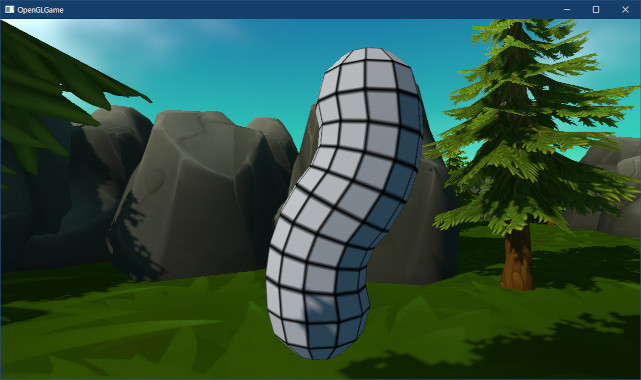
</p>

このように、頂点に影響する関節の数と影響度を調整することで、物体の硬さや柔らかさを表現することができます。

### 1.2 骨格(スケルトン)を設定する

今度は、もう少し複雑な3Dモデルを表示してみましょう。

<pre class="tnmai_assignment">
<strong>【課題01】</strong>
以下のURLから<code>human_male.zip</code>をダウンロードし、プロジェクトの<code>Res/MeshData</code>フォルダに展開しなさい。
<code>github.com/tn-mai/OpenGL3D2023/tree/main/res/meshdata/obj</code>
</pre>

`Engine.cpp`を開き、次のプログラムを追加してください。

```diff
   // OBJファイルを読み込む
   skySphere = meshBuffer->LoadOBJ("Res/MeshData/sky_sphere/sky_sphere.obj");
-  meshBuffer->LoadOBJ("Res/MeshData/capsule_3m.obj", MeshBuffer::Skeleton{});
+  meshBuffer->LoadOBJ("Res/MeshData/human_male.obj", MeshBuffer::Skeleton{});

   meshBuffer->LoadOBJ("Res/MeshData/skull/skull_highpoly.obj");
   meshBuffer->LoadOBJ("Res/MeshData/skull/skull_highpoly_with_normal.obj");
```

`ExplorationScene.cpp`を開き、`Initialize`メンバ関数の定義にあるカプセルを表示するプログラムを、次のように変更してください。

```diff
   // テスト用のスケルタルメッシュを設定
   auto skeletal = engine.Create<GameObject>("skeletal test", { 0, 0.5f, -3 });
-  skeletal->rotation.y = radians(90); // 関節が分かりやすいように横向きにする
-  skeletal->skeletalMesh = engine.GetSkeletalMesh("Res/MeshData/capsule_3m.obj");
+  skeletal->skeletalMesh = engine.GetSkeletalMesh("Res/MeshData/human_male.obj");

   return true;
 }
```

プログラムが書けたらビルドして実行してください。白い物体の代わりに男性が表示されていたら成功です。

<p align="center">
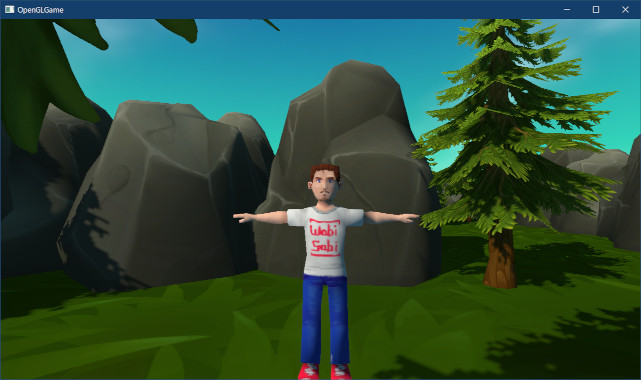
</p>

これまでの「Y座標で関節番号を設定」のような方法では、人間のように複雑な関節を持つ3Dモデルを再現できません。そこで、モデルに合った関節構造を指定できるようにしようと思います。

実際のデータ構造は、関節をつなぐ骨として作成します。骨には「始点」と「終点」、「親に当たる関節の番号」、「関節の影響範囲」の4つのパラメータを定義します。

<p align="center">
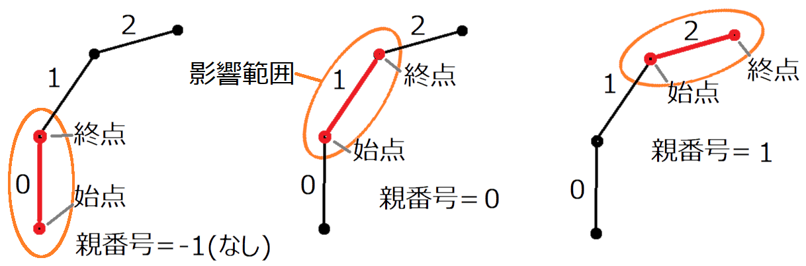
</p>

なお、この図では「親関節の終点」が「子関節の始点」と重なっていますが、データ上は終点と始点が離れていても構いません。

それでは、図に示したデータを`Skeleton`構造体に追加しましょう。`Mesh.h`を開き、`Skeleton`構造体の定義に次のプログラムを追加してください。

```diff
   // 関節データ
   struct Skeleton
   {
+    // 関節をつなぐ骨
+    struct Bone
+    {
+      vec3 start;      // 関節の始点
+      vec3 end;        // 関節の終点
+      int parent = -1; // 親関節の番号
+      float influenceRadius = 1; // 関節の影響範囲
+    };
+    std::vector<Bone> bones; // 関節リスト
   };

   /**
   * OBJファイルを読み込み関節を設定する
```

この関節データを使って頂点の関節番号と影響度を計算します。問題は「どうやって？」ということです。まず考えつくのは、「頂点に近い関節ほど影響度も高いだろう」ということです。

そう考えると、ある頂点の関節番号は「頂点とすべての関節の距離を計算し、距離が近いほうから最大4つの関節を選ぶ」ことで求められそうです。影響度についても、頂点からの距離を使って計算することができるでしょう。

関節の影響範囲は、計算が簡単なことから楕円形(だえんけい)とします。楕円は「ある2点からの距離の和が一定である点の集合」として定義されます。基準となる2点のことを「焦点」、楕円の短いほうの直径を短軸(たんじく)、長いほうの直径を長軸(ちょうじく)といいます。

TODO: ここに楕円の図を入れる

そして「頂点と関節の距離」は、「関節の始点と終点を楕円の焦点としたとき、頂点を通る楕円の短軸の長さ」とします。短軸の長さは以下の手順で求められます。

>1. 長軸の長さを求める。
>2. 楕円の中心から焦点まで長さを求める。
>3. 1, 2で求めた値を焦点の座標の公式に代入し、短軸の長さを求める。

長軸の長さは「2つの焦点からの距離の和は長軸の長さに等しい」という楕円の性質から求められます。楕円上の頂点を`P`、焦点を`F0`, `F1`とすると、長軸の長さ`2a`は以下の式で求められます。

`2a = |P - F0| + |P - F1|`

楕円の中心から焦点までの距離`c`は以下の式で求められます。

`c = |F0 - F1| * 0.5`

「焦点の座標の公式」は以下の式になります。

<code>c = √(a<sup>2</sup> - b<sup>2</sup>)</code>

これを`b`について解きます。まず両辺を2乗します。

<code>c<sup>2</sup> = a<sup>2</sup> - b<sup>2</sup></code><br>

左辺に`b`を移動します。

<code>b<sup>2</sup> = a<sup>2</sup> - c<sup>2</sup></code><br>

両辺を平方すると、「短軸の半分の長さを求める式」が得られます。

<code>b = √(a<sup>2</sup> - c<sup>2</sup>)</code><br>

今回の場合は頂点`P`と焦点`F0`, `F1`の座標が分かっています。これらの値から`a`と`c`が求められます。あとは上の式に当てはめれば、短軸の長さ`b`を求めることができます。

それではプログラムを作成しましょう。まず、以前に作成した「Y座標から関節番号と影響度を計算するプログラム」を削除します。`Mesh.cpp`を開き、`LoadOBJ`メンバ関数の定義から次のプログラムを削除してください。

```diff
     skeletalVertices[i].texcoord = meshData.vertices[i].texcoord;
     skeletalVertices[i].normal = meshData.vertices[i].normal;
   }

-  // 関節行列の番号と影響度を設定
+  // スケルトンを参照して関節番号を設定
   for (auto& vertex : skeletalVertices) {
     std::fill_n(vertex.joints, 4, 0);
     std::fill_n(vertex.weights, 4, 0);
-    vertex.joints[0] = 
-      static_cast<uint16_t>(std::clamp(vertex.position.y, 0.0f, 3.0f));
-
-    // 2つ目の関節番号を設定
-    float wy = fmod(vertex.position.y, 1.0f);
-    if (wy < 0.5f) {
-      vertex.joints[1] = std::max(vertex.joints[0] - 1, 0);
-    } else {
-      vertex.joints[1] = std::min(vertex.joints[0] + 1, 3);
-    }
-
-    // 関節の影響度を計算
-    //vertex.weights[0] = 65535;
-    wy = 1 - abs(wy - 0.5f);
-    vertex.weights[0] = static_cast<uint16_t>(65535 * wy);
-    vertex.weights[1] = 65535 - vertex.weights[0];
-  }
+  } // for vertex

   // 変換したデータをプリミティブバッファに追加
   AddVertexData(
```

次に、短軸の計算をすべてのボーンに対して行います。関節番号を設定するforループの中に、次のプログラムを追加してください。

```diff
   // スケルトンを参照して関節番号を設定
   for (auto& vertex : skeletalVertices) {
     std::fill_n(vertex.joints, 4, 0);
     std::fill_n(vertex.weights, 4, 0);
+
+    // 全てのボーンとの最短距離を求める
+    struct Distance { int index; float distance; };
+    std::vector<Distance> distanceList(skeleton.bones.size());
+    for (int i = 0; i < skeleton.bones.size(); ++i) {
+      // ボーンの始点と終点と楕円の焦点、頂点を楕円上の点として短軸の長さを求める
+      const vec3& P = vertex.position;
+      const vec3& F0 = skeleton.bones[i].start;
+      const vec3& F1 = skeleton.bones[i].end;
+      const float a = (length(P - F0) + length(P - F1)) * 0.5f;
+      const vec3 c = (F0 - F1) * 0.5f;
+      const float b = sqrt(a * a - dot(c, c));
+      distanceList[i].distance = b;
+      distanceList[i].index = i; // 関節番号
+    }
   } // for vertex

   // 変換したデータをプリミティブバッファに追加
   AddVertexData(
```

追加した`for`文では、すべてのボーンと頂点の距離を計算して`distanceList`(ディスタンス・リスト)配列に格納します。

また、このプログラムでは`c`を求めて2乗するのではなく、内積を使うことで直接<code>c<sup>2</sup></code>を求めています。この工夫により、平方根の計算が1回少なくなります。

すべてのボーンからの距離を求めたら、それらのうち距離が最も短い(頂点に近い)ボーンを4つまで選びます。距離を求める`for`文の下に、次のプログラムを追加してください。

```diff
       distanceList[i].distance = b;
       distanceList[i].index = i; // 関節番号
     }
+
+    // 距離の短い順に整列
+    std::sort(distanceList.begin(), distanceList.end(),
+      [](const Distance& lhs, const Distance& rhs) { return lhs.distance < rhs.distance; });
+
+    // 短いほうから最大4個残す(4個未満ならゼロを追加して4個にする)
+    distanceList.resize(4, Distance{ 0, 0 });
   } // for vertex

   // 変換したデータをプリミティブバッファに追加
   AddVertexData(
```

次に、距離を影響度を変換します。この変換には、ライトの明るさを計算する式を流用します。配列をリサイズするプログラムの下に、次のプログラムを追加してください。

```diff
     // 短いほうから最大4個残す(4個未満ならゼロを追加して4個にする)
     distanceList.resize(4, Distance{ 0, 0 });
+
+    // 距離を影響度に変換
+    float total = 0; // 影響度の合計
+    for (auto& e : distanceList) {
+      // 逆２乗の法則で影響度を計算
+      e.distance = 1 / (e.distance * e.distance + 0.0001f);
+      total += e.distance;
+    }
+
+    // 影響度の合計が1になるように正規化
+    for (auto& e : distanceList) {
+      e.distance /= total;
+    }
   } // for vertex

   // 変換したデータをプリミティブバッファに追加
   AddVertexData(
```

最後に、計算した関節データを頂点に設定します。影響度を正規化するプログラムの下に、次のプログラムを追加してください。

```diff
     // 影響度を正規化
     for (auto& e : distanceList) {
       e.distance /= total;
     }
+
+    // 頂点に関節データを設定
+    for (int i = 0; i < 4; ++i) {
+      vertex.weights[i] = static_cast<uint16_t>(distanceList[i].distance * 0xffff);
+      vertex.joints[i] = static_cast<uint16_t>(distanceList[i].index);
+    }
   } // for vertex

   // 変換したデータをプリミティブバッファに追加
   AddVertexData(
```

### 1.3 スケルトン情報をスタティックメッシュに追加する

スケルトンに含まれる関節の情報は、バインドポーズ行列と逆バインドポーズ行列を作成するために必要となります。そのため、スタティックメッシュにボーン情報を追加する必要がありそうです。

しかし、必要になるたびにバインドポーズ行列と逆バインドポーズ行列を計算するのは時間がもったいないです。実際のところ、関節行列の作成に必要なのはボーンそのものではなく、ボーンから計算されるバインドポーズ行列と逆バインドポーズ行列です。

そこで、スケルタルメッシュを作成するときに、同時にバインドポーズ行列と逆バインドポーズ行列を計算して記録するようにします。

まずは、記録用の構造体を追加しましょう。`Mesh.h`を開き、`SkeletalMesh`構造体の定義に次のプログラムを追加してください。

```diff
 struct SkeletalMesh
 {
   std::string name;    // メッシュ名
   std::vector<DrawParams> drawParamsList; // 描画パラメータ
   MaterialList materials; // 共有マテリアル
+
+  // 関節データ
+  struct Joint
+  {
+    mat4 bindPose;        // バインドポーズ行列
+    mat4 inverseBindPose; // 逆バインドポーズ行列
+    int32_t parent;       // 親関節の番号
+  };
+  std::vector<Joint> joints;
 };
 using SkeletalMeshPtr = std::shared_ptr<SkeletalMesh>;
```

関節データの名前は、`Skeleton::Bone`構造体と名前を間違えにくいように`Joint`(ジョイント)としました。

それでは、バインドポーズ行列と逆バインドポーズ行列を計算して、関節データに設定しましょう。`Mesh.cpp`を開き、`LoadOBJ`関数の末尾に次のプログラムを追加してください。

```diff
     e.baseVertex = baseVertex;
     e.indices = reinterpret_cast<void*>(
       baseIndexOffset + reinterpret_cast<intptr_t>(e.indices));
   }
+
+  // ジョイント設定
+  pMesh->joints.resize(skeleton.bones.size());
+  for (int i = 0; i < pMesh->joints.size(); ++i) {
+    // ボーンの始点座標を関節とみなして行列を計算
+    SkeletalMesh::Joint& joint = pMesh->joints[i];
+    const Skeleton::Bone& bone = skeleton.bones[i];
+    joint.bindPose = GetTransformMatrix(vec3(1), vec3(0), bone.start);
+    joint.inverseBindPose = GetTransformMatrix(vec3(1), vec3(0), -bone.start);
+
+    // 親関節の番号を設定
+    joint.parent = bone.parent;
+  } // for i

   LOG("%sを読み込みました(頂点数=%d, インデックス数=%d)",
     filename, meshData.vertices.size(), meshData.indices.size());
```

これで、関節のバインドポーズ行列と逆バインドポーズ行列をすぐに参照できるようになりました。

### 1.4 スケルトン構造を設定する

それでは、人間モデルのスケルトンを設定しましょう。とはいえ、手作業で複雑なボーンを設定するのは大変です。そこで、以下に示す6本のボーンだけを設定することにします。これで、手足に最低限の動きを付けられるはずです。

<p align="center">
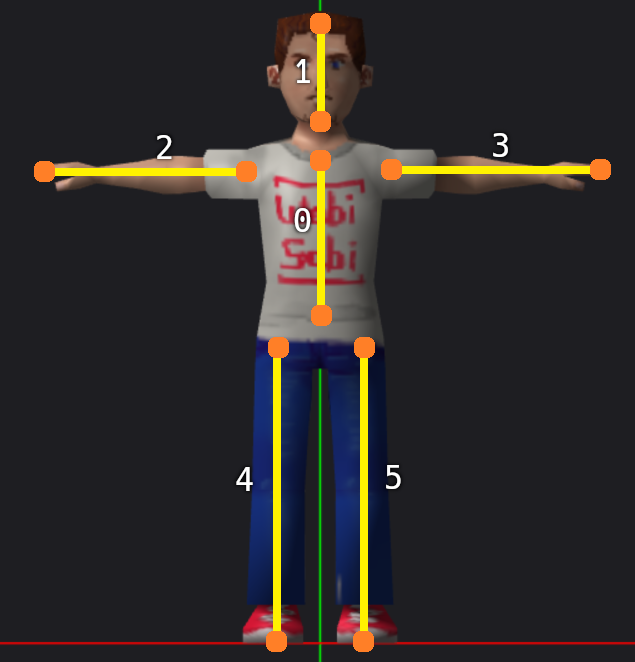
</p>

`Engine.cpp`を開き、`Initialize`メンバ関数の定義にある「OBJファイルを読み込む」プログラムを、次のように変更してください。

```diff
   // OBJファイルを読み込む
   skySphere = meshBuffer->LoadOBJ("Res/MeshData/sky_sphere/sky_sphere.obj");
-  meshBuffer->LoadOBJ("Res/MeshData/human_male.obj", MeshBuffer::Skeleton{});
+  {
+    MeshBuffer::Skeleton skeleton;
+    skeleton.bones.resize(6);
+    skeleton.bones[0] = { { 0.0f, 1.0f, 0 }, { 0.0f, 1.4f, 0 },-1, 0.5f }; // 胴体
+    skeleton.bones[1] = { { 0.0f, 1.5f, 0 }, { 0.0f, 1.8f, 0 }, 0, 0.5f }; // 頭
+    skeleton.bones[2] = { {-0.2f, 1.3f, 0 }, {-0.8f, 1.3f, 0 }, 0, 0.2f }; // 右腕
+    skeleton.bones[3] = { { 0.2f, 1.3f, 0 }, { 0.8f, 1.3f, 0 }, 0, 0.2f }; // 左腕
+    skeleton.bones[4] = { {-0.1f, 0.8f, 0 }, {-0.1f, 0.0f, 0 }, 0, 0.2f }; // 右足
+    skeleton.bones[5] = { { 0.1f, 0.8f, 0 }, { 0.1f, 0.0f, 0 }, 0, 0.2f }; // 左足
+    meshBuffer->LoadOBJ("Res/MeshData/human_male.obj", skeleton);
+  }

   meshBuffer->LoadOBJ("Res/MeshData/skull/skull_highpoly.obj");
   meshBuffer->LoadOBJ("Res/MeshData/skull/skull_highpoly_with_normal.obj");
```

次に、関節行列の計算を人間モデル用に変更します。関節行列をGPUメモリにコピーするプログラムを、次のように変更してください。

```diff
       // 仮の関節行列をGPUメモリにコピー
       static float timer = 0;
       timer += 0.001f;
       const float rx = abs(fmod(timer, 1.0f) - 0.5f);
-      std::vector<mat4> jointMatrices(4);
+      const size_t jointCount = e->skeletalMesh->joints.size();
+      std::vector<mat4> jointMatrices(jointCount, mat4(1));
-      jointMatrices[0] =
-        GetTransformMatrix(vec3(1), vec3(0), { 0, 0, 0 }) *
-        GetTransformMatrix(vec3(1), { 0, 0, 0 }, vec3(0)) *
-        GetTransformMatrix(vec3(1), vec3(0), { 0, 0, 0 });
-      jointMatrices[1] =
-        jointMatrices[0] *
-        GetTransformMatrix(vec3(1), vec3(0), { 0, 1, 0 }) *
-        GetTransformMatrix(vec3(1), { rx, 0, 0 }, vec3(0)) *
-        GetTransformMatrix(vec3(1), vec3(0), { 0,-1, 0 });
-      jointMatrices[2] =
-        jointMatrices[1] *
-        GetTransformMatrix(vec3(1), vec3(0), { 0, 2, 0 }) *
-        GetTransformMatrix(vec3(1), { -rx, 0, 0 }, vec3(0)) *
-        GetTransformMatrix(vec3(1), vec3(0), { 0,-2, 0 });
-      jointMatrices[3] =
-        jointMatrices[2] *
-        GetTransformMatrix(vec3(1), vec3(0), { 0, 3, 0 }) *
-        GetTransformMatrix(vec3(1), { 0, 0, 0 }, vec3(0)) *
-        GetTransformMatrix(vec3(1), vec3(0), { 0,-3, 0 });
+      // 両腕をアニメーション
+      jointMatrices[2] = GetTransformMatrix(vec3(1), { 0, rx, 0 }, vec3(0));
+      jointMatrices[3] = GetTransformMatrix(vec3(1), { 0,-rx, 0 }, vec3(0));
+
+      // 関節行列をGPUメモリにコピー
       ssboJointMatrices->CopyData(0, jointMatrices.data(), sizeof(mat4) * 4);

       // スケルタルメッシュ用のシェーダとVAOを割り当てる
       glUseProgram(*progSkeletal);
       glBindVertexArray(*meshBuffer->GetVAOSkeletal());
```

白い物体のアニメーションでは`jointMatrices`を計算するときに、同時にバインドポーズ行列と逆バインドポーズ行列を計算していました。ですが、今はもうジョイント構造体に計算済みの値があります。

そこで、ジョイント構造体の値を使って「バインドポーズ行列、逆バインドポーズ行列を掛ける処理」をループ処理します。両腕をアニメーションさせるプログラムの下に、次のプログラムを追加してください。

```diff
       // 両腕をアニメーション
       jointMatrices[2] = GetTransformMatrix(vec3(1), { 0, rx, 0 }, vec3(0));
       jointMatrices[3] = GetTransformMatrix(vec3(1), { 0,-rx, 0 }, vec3(0));
+
+      // 逆バインドポーズ行列とバインドポーズ行列を反映
+      for (int i = 0; i < jointCount; ++i) {
+        const SkeletalMesh::Joint& joint = e->skeletalMesh->joints[i];
+        jointMatrices[i] =
+          joint.bindPose * jointMatrices[i] * joint.inverseBindPose;
+      }
+
+      // 親ボーンの関節行列を反映
+      std::vector<mat4> m = jointMatrices;
+      for (int i = 0; i < jointCount; ++i) {
+        int32_t p = e->skeletalMesh->joints[i].parent;
+        while (p >= 0) {
+          m[i] = jointMatrices[p] * m[i];
+          p = e->skeletalMesh->joints[p].parent;
+        }
+      } // for i

       // 関節行列をGPUメモリにコピー
-      ssboJointMatrices->CopyData(0, jointMatrices.data(), sizeof(mat4) * 4);
+      ssboJointMatrices->CopyData(0, m.data(), sizeof(mat4) * jointCount);

       // スケルタルメッシュ用のシェーダとVAOを割り当てる
       glUseProgram(*progSkeletal);
```

親ボーンの関節行列を反映させる計算では、`jointMatrices`は書き換えずに新しい配列変数`m`(エム)に代入しています。親ボーンは何度も参照される可能性があるため、直接書き換えてしまうと参照された数だけ重複して計算が行われて間違った結果になるからです。

最後にバインドする範囲を変更します。SSBOをバインドするプログラムを次のように変更してください。

```diff
       // スケルタルメッシュ用のシェーダとVAOを割り当てる
       glUseProgram(*progSkeletal);
       glBindVertexArray(*meshBuffer->GetVAOSkeletal());
 
       // SSBOをバインド
       glBindBufferRange(GL_SHADER_STORAGE_BUFFER, 0,
-        *ssboJointMatrices, 0, sizeof(mat4) * 4);
+        *ssboJointMatrices, 0, sizeof(mat4) * jointCount);
 
       // 座標変換行列をGPUメモリにコピー
       glProgramUniformMatrix4fv(*progSkeletal, locTransformMatrix,
         1, GL_FALSE, &e->GetTransformMatrix()[0].x);
```

プログラムが書けたらビルドして実行してください。少し分かりにくいですが、両腕が前後に動いていたら成功です。

<p align="center">
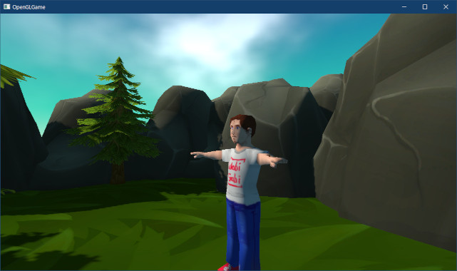
</p>

腕の振りが小さくで分かりにくいので、振りを大きくしましょう。現在、`rx`が取りうる値の範囲は`0.0`～`0.5`です。これは、およそ1/6ラジアン(30°)なので確かに分かりづらいです。倍の1/3ラジアンにしましょう。

`rx`変数を計算するプログラムを、次のように変更してください。

```diff
       // 仮の関節行列をGPUメモリにコピー
       static float timer = 0;
       timer += 0.001f;
-      const float rx = abs(fmod(timer, 1.0f) - 0.5f);
+      const float rx = abs(fmod(timer, 2.0f) - 1.0f);
       const size_t jointCount = e->skeletalMesh->joints.size();
       std::vector<mat4> jointMatrices(jointCount, mat4(1));
```

これで`rx`の取りうる範囲が`0.0`～`1.0`になるはずです。プログラムが書けたらビルドして実行してください。腕の振りが大きくなっていたら成功です。なお、`timer`に加算する値は同じなので、振りの速度は遅くなっています。

<p align="center">
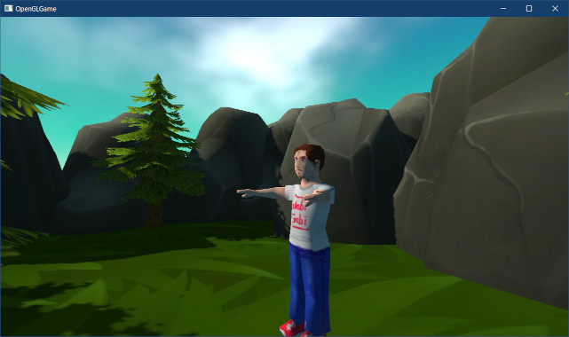
</p>

### 1.5 ボーンの影響範囲を計算する

今度は両足をアニメーションさせてみましょう。`Engine.cpp`を開き、`DrawGameObject`メンバ関数の定義に「両足をアニメーション」させるプログラムを追加してください。

```diff
       // 両腕をアニメーション
       jointMatrices[2] = GetTransformMatrix(vec3(1), { 0, rx, 0 }, vec3(0));
       jointMatrices[3] = GetTransformMatrix(vec3(1), { 0,-rx, 0 }, vec3(0));
+
+      // 両足をアニメーション
+      jointMatrices[4] = GetTransformMatrix(vec3(1), { rx, 0, 0 }, vec3(0));
+      jointMatrices[5] = GetTransformMatrix(vec3(1), {-rx, 0, 0 }, vec3(0));

       // 逆バインドポーズ行列とバインドポーズ行列を反映
       for (int i = 0; i < jointCount; ++i) {
```

プログラムが書けたらビルドして実行してください。両足がアニメーションしていれば成功、なのですが、どうも動き方がおかしいようです。

<p align="center">
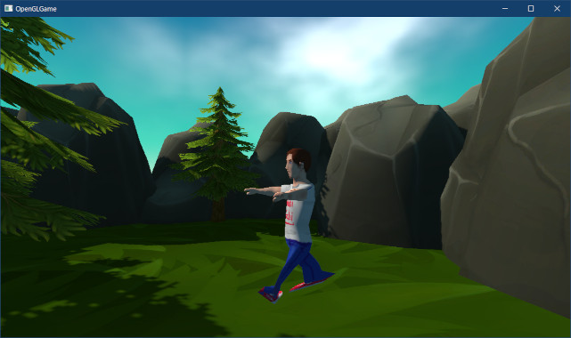
</p>

これは、反対の足のボーンの影響を受けてしまっているからです。両腕の場合は左右に離れているので、反対の腕のボーンの影響を受ける可能性は非常に低いです。それに対して、両足は隣り合っているため、反対の足の影響を受けやすいのです。

この問題を解決するには、ボーンの影響範囲外の頂点を無視するように関節番号と影響度の計算を変更します。計算式には前期第09回で使った「ライトの範囲制限の式」を流用します。

<p align="center">
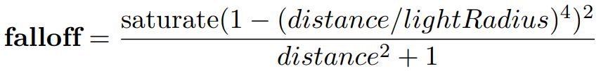<br>
[ライトの影響範囲を制限する式]
</p>

ただし、分母の`+1`の部分は`+0.0001`に変更します。ボーンの影響範囲はライトよりかなり短いため、係数が機能する最小距離をライトと同じ1mにすると、他のボーンの影響をかなり受けやすくなってしまうためです。

そこで、係数の最小距離を1cm(0.01m)として、その2乗である`0.0001`を加算することにしました。それでは、`Mesh.cpp`を開き、`LoadOBJ`メンバ関数の定義にある「距離を影響度に変換」するプログラムを次のように変更してください。

```diff
     // 距離を影響度に変換
     float total = 0; // 影響度の合計
     for (auto& e : distanceList) {
+      // 影響範囲を超えさせないための係数を計算(ライトの範囲制限と同じ式)
+      const float radius = skeleton.bones[e.index].influenceRadius;
+      const float f = std::clamp(1 - pow(e.distance / radius, 4.0f), 0.0f, 1.0f);
+
       // 逆２乗の法則で影響度を計算
-      e.distance = 1 / (e.distance * e.distance + 0.0001f);
+      e.distance = f * f / (e.distance * e.distance + 0.0001f);
       total += e.distance;
     }
```

この変更により「影響範囲の外にある頂点の影響度」は`0`になります。もしも、ある頂点がすべてのボーンの影響範囲外にある場合、すべての影響度が`0`になることを意味します。

しかし、関節行列の計算は「影響度の合計が`1.0`であること」を前提としています。そのため、影響度の合計が`0`だと間違った座標変換が行われてしまいます。

この問題への対策として、「影響度の合計が`0`の場合は一番近いボーンの影響度を`1`にする」という例外処理を追加します。影響度を正規化するプログラムを次のように変更してください。

```diff
       total += e.distance;
     }
 
     // 影響度の合計が1になるように正規化
+    if (total > 0) {
       for (auto& e : distanceList) {
         e.distance /= total;
       }
+    } else {
+      // すべてのdistanceが0の(どのボーンからも遠すぎる)場合、
+      // 一番近いボーンのみ影響するように設定
+      distanceList[0].distance = 1;
+    }

     // 頂点に関節データを設定
     for (int i = 0; i < 4; ++i) {
```

プログラムが書けたらビルドして実行してください。足のポリゴンが、反対側の足のボーンの影響を受けていない(不自然な変形をしていない)ように見えていたら成功です。

<p align="center">
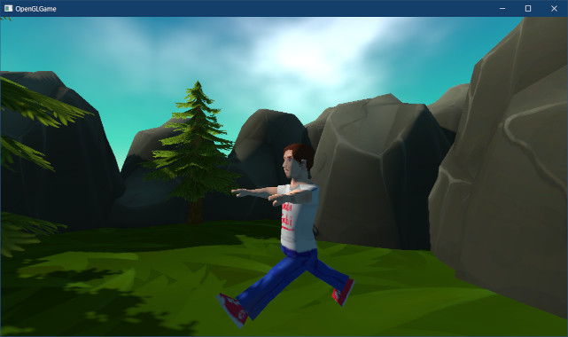
</p>

この節で見たように、スケルタルアニメーションでは「影響を受ける関節の番号や影響度を正しく設定」しないと、アニメーションが不自然になる場合があります。

>**【1章のまとめ】**
>
>* 
>* 
>* 
>* 
>* 

<div style="page-break-after: always"></div>

## 2. ゲームオブジェクト単位の関節行列

### 2.1 関節行列を管理するクラスを定義する

今度はスケルタルメッシュの数を増やしてみましょう。`ExplorationScene.cpp`を開き、スケルタルメッシュを設定するプログラムを次のように変更してください。

```diff
   // スカイスフィアを設定
   skysphereMaterial = std::make_shared<Material>();
   skysphereMaterial->texBaseColor = engine.GetTexture("Res/MeshData/sky_sphere/sky.tga");

   // テスト用のスケルタルメッシュを設定
+  for (float i = 0; i < 3; ++i) {
-    auto skeletal = engine.Create<GameObject>("joint test", { 0, 0.5f, -4 });
+    const vec3 pos = { i * 2 - 1, 0.5f, -4 };
+    auto skeletal = engine.Create<GameObject>("joint test", pos);
     skeletal->rotation.y = radians(90);
     skeletal->skeletalMesh = engine.GetSkeletalMesh("Res/MeshData/human_male.obj");
+  }
   return true;
 }
```

プログラムが書けたらビルドして実行してください。3人の男性が表示されたら成功です。

<p align="center">
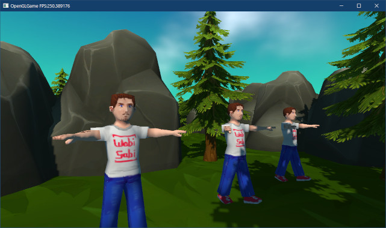
</p>

しかし、3人とも全く同じアニメーションになっています。これは、現在のプログラムが毎回同じ「関節行列の配列」を、シェーダストレージブロックに設定しているためです。

表示するオブジェクトごとに異なる動きをさせたいのなら、物体ごとに関節行列の配列を設定できなくてはなりません。

そこで、「ひとつのスタティックメッシュの関節行列の配列」を管理するクラスを作成します。名前は`SkeletalMeshRenderer`(スケルタルメッシュ・レンダラ)とします。

`SkeletalMeshRenderer`クラスは「関節行列の配列」を保持し、エンジンからの指示によって行列を更新したり、行列を使ってメッシュを描画したりします。

プロジェクトの`Src/Engine`フォルダに`SkeletalMeshRenderer.h`という名前のヘッダファイルを追加してください。追加したファイルを開き、次のプログラムを追加してください。

```diff
+/**
+* @file SkeletalMeshRenderer.h
+*/
+#ifndef SKELETALMESHRENDERER_H_INCLUDED
+#define SKELETALMESHRENDERER_H_INCLUDED
+#include "glad/glad.h"
+#include "Mesh.h"
+#include <vector>
+#include <memory>
+
+// 先行宣言
+class GameObject;
+
+/**
+* スケルタルメッシュの描画を補助するクラス
+*/
+class SkeletalMeshRenderer
+{
+public:
+  // コンストラクタ・デストラクタ
+  SkeletalMeshRenderer() = default;
+  ~SkeletalMeshRenderer() = default;
+
+  // 描画するスケルタルメッシュを設定
+  void SetMesh(const SkeletalMeshPtr& mesh) {
+    skeletalMesh = mesh;
+    jointMatrices.resize(skeletalMesh->joints.size(), mat4(1));
+  }
+
+  // 設定されているスケルタルメッシュを取得
+  const SkeletalMeshPtr& GetMesh() const { return skeletalMesh; }
+
+  // 関節の座標変換行列の数を取得
+  size_t GetJointMatrixCount() const { return jointMatrices.size(); }
+
+  // 関節の座標変換行列を取得
+  const mat4& GetJointMatrix(int i) const { return jointMatrices[i]; }
+
+  // 関節の座標変換行列を設定
+  void SetJointMatrix(int i, const mat4& m) { jointMatrices[i] = m; }
+
+private:
+  SkeletalMeshPtr skeletalMesh;    // 描画するスケルタルメッシュ
+  std::vector<mat4> jointMatrices; // 関節行列の配列
+  size_t gpuOffset = 0;            // 関節行列のGPUメモリ上の位置
+};
+using SkeletalMeshRendererPtr = std::shared_ptr<SkeletalMeshRenderer>;
+
+#endif // SKELETALMESHRENDERER_H_INCLUDED
```

`SkeletalMeshRenderer`クラスの仕事は、スケルタルメッシュと関節行列をまとめて管理し、関節行列を使ってスケルタルメッシュを描画することです。

### 2.2 関節行列を計算するメンバ関数を追加する

`SkeletalMeshRenderer`クラスがやるべきことは、前回と今回のテキストで`Engine`クラスの`DrawGameObject`メンバ関数に追加したプログラムと同じ、つまり、「関節行列を計算するプログラム」と「スケルタルメッシュを描画するプログラム」です。

そこで、これらのプログラムを実行する2つのメンバ関数を追加しましょう。名前は`CalculateJointMatrix`(カルキュレート・ジョイント・マトリクス、「関節行列を計算する」という意味)と`Draw`(ドロー、「描画する」という意味)にします。

`SkeletalMeshRenderer`クラスの定義に次のプログラムを追加してください。

```diff
   // 関節の座標変換行列を取得
   const mat4& GetJointMatrix(int i) const { return jointMatrices[i]; }

   // 関節の座標変換行列を設定
   void SetJointMatrix(int i, const mat4& m) { jointMatrices[i] = m; }
+
+  /**
+  * 座標変換行列を計算
+  *
+  * @param matrices 計算結果を格納する配列のアドレス
+  */
+  void CalculateJointMatrix(mat4* m);
+
+  /**
+  * スケルタルメッシュを描画
+  *
+  * @param gameObject  レンダラーの親オブジェクト
+  * @param program     描画に使うプログラムオブジェクト
+  * @param ssbo        関節行列がコピーされたSSBO
+  * @param bindigPoint SSBOのバインディングポイント
+  */
+  void Draw(const GameObject& gameObject,
+    GLuint program, GLuint ssbo, GLuint bindingPoint);

 private:
   SkeletalMeshPtr skeletalMesh;    // 描画するスケルタルメッシュ
   std::vector<mat4> jointMatrices; // 関節行列の配列
```

ここで追加した2つのメンバ関数には、現在`Engine`クラスの`DrawGameObject`メンバ関数に書いている「関節行列を計算するプログラム」と「スケルタルメッシュを描画するプログラム」を、それぞれ移動させます。

もちろん、元々クラスではなかった機能をクラスにするのですから、全く同じというわけにはいきません。いくつかの変更が必要です。

大きな変更は「すべてのオブジェクトの関節行列を1回の`CopyData`関数呼び出しで処理できるようにする」ことです。独立したGPUを搭載したPC環境では、CPUからGPUへデータをコピーする手順は以下のようになります。

>1. GPUとCPUはそれぞれ「PCIeインターフェイスユニット」があり、互いの「PCIeインターフェイスユニット」をつなぐことで接続されます。
>2. GPUメモリにデータをコピーするには、まずCPUが「PC側のPCIeインターフェイスユニット」にコピーコマンド(と、データ)を送信します。
>3. 「PC側のPCIeインターフェイスユニット」は、接続された「GPU側のPCIeインターフェイスユニット」に向かってコピーコマンドとデータを送信します。
>4. 「GPU側のPCIeインターフェイスユニット」がコピーコマンドを受信すると、後続するデータをGPUメモリにコピーします。

このように、CPUからGPUへのデータのコピーは、複数のユニットが協力して動作することで行われます。これは小さなネットワーク通信システムであり、ユニット同士が協力するために「相手が受信可能な状態になるのを待つ」などのさまざまな準備が必要となります。

このようなシステムでは、データを小分けにしてコピーすると、分けた数と同じ回数の準備時間がかかります。コピー時間の大半が準備時間になることもめずらしくありません。準備時間を最小にしてコピーの効率を向上させるには「データをまとめてコピー」します。

今回の場合、複数の「関節行列の配列」をまとめてコピーすることになります。シェーダストレージブロックには「コピーしたデータの位置」を割り当てるので、この「位置」は覚えておかなくてはなりません。

これは`gpuOffset`(ジーピーユー・オフセット)メンバ変数に記録します。

### 2.3 CalculateJointMatrixメンバ関数を定義する

それでは、メンバ関数を定義しましょう。プロジェクトの`Src/Engine`フォルダに`SkeletalMeshRenderer.cpp`という名前のCPPファイルを追加してください。追加したファイルを開き、次のプログラムを追加してください。

```diff
+/**
+* @file SkeletalMeshRenderer.cpp
+*/
+#include "SkeletalMeshRenderer.h"
+#include "GameObject.h"
+#include "Engine.h"
+
+/**
+* 座標変換行列を計算
+*/
+void SkeletalMeshRenderer::CalculateJointMatrix(mat4* matrices)
+{
+}
+
+/**
+* スケルタルメッシュを描画
+*/
+void SkeletalMeshRenderer::Draw(const GameObject& gameObject,
+  const GLuint program, GLuint ssbo, GLuint bindingPoint)
+{
+}
```

とりあえず、空の定義を作成しました。ここに`Engine`クラスからプログラムを移動させます。`Engine.cpp`を開き、`DrawGameObject`メンバ関数の定義にある関節行列を計算するプログラムを切り取ってください。

```diff
       // 両足をアニメーション
       jointMatrices[4] = GetTransformMatrix(vec3(1), { rx, 0, 0 }, vec3(0));
       jointMatrices[5] = GetTransformMatrix(vec3(1), {-rx, 0, 0 }, vec3(0));

-      // 逆バインドポーズ行列とバインドポーズ行列を反映
-      for (int i = 0; i < jointCount; ++i) {
-        const SkeletalMesh::Joint& joint = e->skeletalMesh->joints[i];
-        jointMatrices[i] =
-          joint.bindPose * jointMatrices[i] * joint.inverseBindPose;
-      }
-
-      // 親ボーンの関節行列を反映
-      std::vector<mat4> m = jointMatrices;
-      for (int i = 0; i < jointCount; ++i) {
-        int32_t p = e->skeletalMesh->joints[i].parent;
-        while (p >= 0) {
-          m[i] = jointMatrices[p] * m[i];
-          p = e->skeletalMesh->joints[p].parent;
-        }
-      } // for i

       // 関節行列をGPUメモリにコピー
       ssboJointMatrices->CopyData(0, m.data(), sizeof(mat4) * jointCount);
```

`SkeletalMeshRenderer.cpp`に戻り、`CalculateJointMatrix`メンバ関数の定義に、先ほど切り取ったプログラムを貼り付けてください。

```diff
 * 座標変換行列を計算
 */
 void SkeletalMeshRenderer::CalculateJointMatrix(mat4* matrices)
 {
+  // 逆バインドポーズ行列とバインドポーズ行列を反映
+  for (int i = 0; i < jointCount; ++i) {
+    const SkeletalMesh::Joint& joint = e->skeletalMesh->joints[i];
+    jointMatrices[i] =
+      joint.bindPose * jointMatrices[i] * joint.inverseBindPose;
+  }
+
+  // 親ボーンの関節行列を反映
+  std::vector<mat4> m = jointMatrices;
+  for (int i = 0; i < jointCount; ++i) {
+    int32_t p = e->skeletalMesh->joints[i].parent;
+    while (p >= 0) {
+      m[i] = jointMatrices[p] * m[i];
+      p = e->skeletalMesh->joints[p].parent;
+    }
+  } // for i
 }
 
 /**
 * スケルタルメッシュを描画
```

「`jointCount`が定義されていない」というエラがー出ているので対処しましょう。移動前はエラーがなかったので、元のプログラムには`jointCount`の定義があるはずです。その定義をコピーしましょう。

`Engine.cpp`を開き、`DrawGameObject`メンバ関数にある`jointCount`変数の定義を切り取ります。

```diff
     // 仮の関節行列をGPUメモリにコピー
     static float timer = 0;
     timer += 0.001f;
     const float rx = abs(fmod(timer, 2.0f) - 1.0f);
-    const size_t jointCount = e->skeletalMesh->joints.size();
     std::vector<mat4> jointMatrices(jointCount, mat4(1));

     // 両腕をアニメーション
     jointMatrices[2] = GetTransformMatrix(vec3(1), { 0, rx, 0 }, vec3(0));
```

`SkeletalMeshRenderer.cpp`に戻り、`CalculateJointMatrix`メンバ関数に切り取ったプログラムを貼り付けてください。

```diff
 * 座標変換行列を計算
 */
 void SkeletalMeshRenderer::CalculateJointMatrix(mat4* matrices)
 {
+  const size_t jointCount = e->skeletalMesh->joints.size();
+
   // 逆バインドポーズ行列とバインドポーズ行列を反映
   for (int i = 0; i < jointCount; ++i) {
```

今度は「`e`が定義されていない」と言われます。`SkeletalMeshRenderer`クラスは`skeletalMesh`メンバ変数を持っているので、`e->`の部分はもう必要ありません。削除してください。

```diff
 * 座標変換行列を計算
 */
 void SkeletalMeshRenderer::CalculateJointMatrix(mat4* matrices)
 {
-  const size_t jointCount = e->skeletalMesh->joints.size();
+  const size_t jointCount = keletalMesh->joints.size();

   // 逆バインドポーズ行列とバインドポーズ行列を反映
   for (int i = 0; i < jointCount; ++i) {
```

次に、`DrawGameObject`と`CalculateJointMatrix`の違いに対処していきます。

`DrawGameObject`では毎回`jointMatrices`配列を初期化し、計算途中の値を格納するためにも利用していました。そして、最終的な計算結果は`m`配列に代入され、GPUメモリへコピーしていました。

これに対して、`CalculateJointMatrix`では`jointMatrices`を変更するわけにはいきません。`jointMatrices`配列の値はクラス外から指定されるもので、`CalculateJointMatrix`が呼ばれるたびに常に初期化されるとは保証できないからです。

そこで、計算途中の値を`m`配列に代入するように変更します。逆バインドポーズ行列とバインドポーズ行列を反映するプログラムを、次のように変更してください。

```diff
   const size_t jointCount = keletalMesh->joints.size();

   // 逆バインドポーズ行列とバインドポーズ行列を反映
+  std::vector<mat4> m = jointMatrices;
   for (int i = 0; i < jointCount; ++i) {
     const SkeletalMesh::Joint& joint = e->skeletalMesh->joints[i];
-    jointMatrices[i] =
-      joint.bindPose * jointMatrices[i] * joint.inverseBindPose;
+    m[i] = joint.bindPose * jointMatrices[i] * joint.inverseBindPose;
   }

   // 親ボーンの関節行列を反映
-  std::vector<mat4> m = jointMatrices;
   for (int i = 0; i < jointCount; ++i) {
     int32_t p = e->skeletalMesh->joints[i].parent;
```

この変更により`m`配列の用途が変わったので、新しい用途を考慮して以降ののプログラムを修正しましょう。

元々の`m`配列は最終計算結果が格納されていました。対して、`CalculateJointMatrix`では計算結果を`matrices`引数に代入します。

エンジン側で大きな単一の`mat4`配列が用意され、各々の`SkeletalMeshRenderer`にはその一部が割り当てられることを想定しています。`matrices`引数には割り当てられた領域の先頭アドレスが渡されます。

`m`配列の役割が「計算途中の値の保持」、`matrices`引数の役割が「計算結果の代入先」となるように、親ボーンの関節行列を反映するプログラムを変更してください。

```diff
   // 親ボーンの関節行列を反映
   for (int i = 0; i < jointCount; ++i) {
+    matrices[i] = m[i];
     int32_t p = e->skeletalMesh->joints[i].parent;
     while (p >= 0) {
-      m[i] = jointMatrices[p] * m[i];
+      matrices[i] = m[p] * matrices[i];
       p = e->skeletalMesh->joints[p].parent;
     }
   } // for i
```

これで、関節行列の計算を`SkeletalMeshRenderer`クラスに適応させることができました。

### 2.3 Drawメンバ関数を定義する

続いて、`Draw`メンバ関数を作っていきます。これも`Engine`クラスからプログラムを移動させて作成します。今回移動させるのは「スケルタルメッシュを描画するプログラム」です。

`Engine.cpp`を開き、`DrawGameObject`メンバ関数にあるスケルタルメッシュを描画するプログラムを切り取ってください。

```diff
     // スケルタルメッシュ用のシェーダとVAOを割り当てる
     glUseProgram(*progSkeletal);
     glBindVertexArray(*meshBuffer->GetVAOSkeletal());

-    // SSBOをバインド
-    glBindBufferRange(GL_SHADER_STORAGE_BUFFER, 0,
-      *ssboJointMatrices, 0, sizeof(mat4) * jointCount);
-
-    // 座標変換行列をGPUメモリにコピー
-    glProgramUniformMatrix4fv(progSkeletal, locTransformMatrix,
-      1, GL_FALSE, &e->GetTransformMatrix()[0].x);
-
-    // 固有マテリアルがあれば固有マテリアルを、なければ共有マテリアルを使って描画
-    const MaterialList* materials = &e->skeletalMesh->materials;
-    if ( ! e->materials.empty()) {
-      materials = &e->materials;
-    }
-    Draw(e->skeletalMesh->drawParamsList, progSkeletal, *materials, &e->color);

     // 元のシェーダとVAOに戻す
     glBindVertexArray(*meshBuffer->GetVAO());
     glUseProgram(prog);
```

`SkeletalMeshRenderer.cpp`に戻り、`Draw`メンバ関数の定義に、切り取ったプログラムを貼り付けてください。

```diff
 * スケルタルメッシュを描画
 */
 void SkeletalMeshRenderer::Draw(const GameObject& gameObject,
   const GLuint program, GLuint ssbo, GLuint bindingPoint)
 {
+  // SSBOをバインド
+  glBindBufferRange(GL_SHADER_STORAGE_BUFFER, 0,
+    *ssboJointMatrices, 0, sizeof(mat4) * jointCount);
+
+  // 座標変換行列をGPUメモリにコピー
+  glProgramUniformMatrix4fv(progSkeletal, locTransformMatrix,
+    1, GL_FALSE, &e->GetTransformMatrix()[0].x);
+
+  // 固有マテリアルがあれば固有マテリアルを、なければ共有マテリアルを使って描画
+  const MaterialList* materials = &e->skeletalMesh->materials;
+  if ( ! e->materials.empty()) {
+    materials = &e->materials;
+  }
+  Draw(e->skeletalMesh->drawParamsList, progSkeletal, *materials, &e->color);
 }
```

当然のようにエラーが発生するので、ひとつずつ対処していきましょう。ということで、`glBindBufferRange`関数のエラーから直していきます。

ここのエラーは「`ssboJointMatrices`が定義されていない」というやつです。`Draw`メンバ関数では、この変数を`ssbo`引数として受け取ることを想定しています。つまり、`*ssboJointMatrices`を`ssbo`に変えればいいはずです。

`glBindBufferRange`関数呼び出しを次のように変更してください。

```diff
   // SSBOをバインド
   glBindBufferRange(GL_SHADER_STORAGE_BUFFER, 0,
-    *ssboJointMatrices, 0, sizeof(mat4) * jointCount);
+    ssbo, 0, sizeof(mat4) * jointCount);

   // 座標変換行列をGPUメモリにコピー
   glProgramUniformMatrix4fv(*progSkeletal, locTransformMatrix,
```

また、同じ関数呼び出しにおいて「`jointCount`が定義されていない」というエラーも出ています。これは`CalculateJointMatrix`メンバ関数からコピーしてこればよいでしょう。`Draw`メンバ関数の定義に`jointCount`変数の定義をコピー&ペーストしてください。

```diff
 void SkeletalMeshRenderer::Draw(const GameObject& gameObject,
   const GLuint program, GLuint ssbo, GLuint bindingPoint)
 {
+  const size_t jointCount = keletalMesh->joints.size();
+
   // SSBOをバインド
   glBindBufferRange(GL_SHADER_STORAGE_BUFFER, 0,
```

これで、`glBindBufferRange`関数の呼び出しのエラーはなくなりました。次に`glProgramUniformMatrix4fv`関数呼び出しのエラーを直します。エラーは「`progSkeletal`が定義されていない」と「`e`が定義されていない」の2つです。

`progSkeletal`変数は`program`引数として渡してもらう想定です。また、`e`変数は元の文脈ではゲームオブジェクトであり、これも`gameObject`引数で渡してもらう想定です。つまり、どちらも引数で置き換えれば直ります。

以上を踏まえて、`glProgramUniformMatrix4fv`関数呼び出しを次のように変更してください。

```diff
   // SSBOをバインド
   glBindBufferRange(GL_SHADER_STORAGE_BUFFER, 0,
     ssbo, 0, sizeof(mat4) * jointCount);

   // 座標変換行列をGPUメモリにコピー
-  glProgramUniformMatrix4fv(progSkeletal, locTransformMatrix,
-    1, GL_FALSE, &e->GetTransformMatrix()[0].x);
+  glProgramUniformMatrix4fv(program, locTransformMatrix,
+    1, GL_FALSE, &gameObject.GetTransformMatrix()[0].x);

   // 固有マテリアルがあれば固有マテリアルを、なければ共有マテリアルを使って描画
   const MaterialList* materials = &e->skeletalMesh->materials;
```

次にマテリアルの選択ですが、これも`e`に関するエラーなので、`gameObject`引数で置き換えるだけです。ただ一点、`&e->skeletalMesh`の部分は`SkeletalMeshRenderer`クラスのメンバ変数を使うように変更します。

これは、後でゲームオブジェクトから`skeletalMesh`メンバ変数を削除して、`SkeletalMeshRenderer`で置き換える予定だからです。それでは、マテリアルを選択するプログラムを次のように変更してください。

```diff
   glProgramUniformMatrix4fv(program, locTransformMatrix,
     1, GL_FALSE, &gameObject.GetTransformMatrix()[0].x);
 
   // 固有マテリアルがあれば固有マテリアルを、なければ共有マテリアルを使って描画
-  const MaterialList* materials = &e->skeletalMesh->materials;
-  if ( ! e->materials.empty()) {
-    materials = &e->materials;
+  const MaterialList* materials = &skeletalMesh->materials;
+  if ( ! gameObject.materials.empty()) {
+    materials = &gameObject.materials;
   }
   Draw(e->skeletalMesh->drawParamsList, progSkeletal, *materials, &e->color);
 }
```

最後に`Draw`関数呼び出しを直します。ここまでに直してきた変数なので、迷うことはないでしょう。`Draw`関数呼び出しを次のように変更してください。

```diff
   if ( ! gameObject.materials.empty()) {
     materials = &gameObject.materials;
   }
-  Draw(e->skeletalMesh->drawParamsList, progSkeletal, *materials, &e->color);
+  Draw(skeletalMesh->drawParamsList, program, *materials, &gameObject.color);
 }
```

しかし、どうもエラーが消えないようです。実はここには、C++に慣れていないと分かりにくいエラーがあるのです。それは「`Draw`という名前が`Mesh.h`のグローバル関数と`SkeltalMeshRenderer`のメンバ関数で重複している」というものです。

C++のルールでは、同じ名前を使う場合はグローバル関数よりメンバ関数が優先されることになっています。そのため、コンピュータは`SkeletalMeshRenderer`クラスの`Draw`メンバ関数を当てはめようとして失敗しているのです。

このような場合にグローバル関数を選択させるには、「スコープ解決演算子(`::`)」を使います。`Draw`関数呼び出しの先頭に`::`を追加してください。

```diff
   if ( ! gameObject.materials.empty()) {
     materials = &gameObject.materials;
   }
-  Draw(skeletalMesh->drawParamsList, program, *materials, &gameObject.color);
+  ::Draw(skeletalMesh->drawParamsList, program, *materials, &gameObject.color);
 }
```

これでエラーが無くなるはずです。しかし、これはどういう仕組なのでしょう？

通常、`::`(スコープ解決演算子)は「名前空間`::`メンバ名」のように書きます。これは「名前空間にある`メンバ名`のメンバ」を意味します。例えば`MyNamespace::MyFunc`と書くと、`MyNamespace`名前空間にある`MyFunc`というメンバ」が選択されます。

ただし、グローバル空間には名前がありません。そこでC++では、「名前空間を省略するとグローバル空間が選択される」という特別ルールを用意しています。つまり`::Draw`と書くと「グローバル空間の`Draw`メンバ」が選択されるわけです。

これですべてのエラーがなくなりましたので、とりあえず`Draw`メンバ関数は完成とします。

### 2.4 ゲームオブジェクトをSkeletalMeshRendererを使うように変更する

それでは、完成した`SkeletalMeshRenderer`クラスを使うようにゲームオブジェクトを変更しましょう。`GameObject.h`を開き、`SkeletalMesh`の先行宣言を削除して`SkeletalMeshRenderer`の先行宣言を追加してください。

```diff
 using GameObjectList = std::vector<GameObjectPtr>; // ゲームオブジェクトポインタの配列
 struct StaticMesh;
 using StaticMeshPtr = std::shared_ptr<StaticMesh>; // スタティックメッシュのポインタ
-struct SkeletalMesh;
-using SkeletalMeshPtr = std::shared_ptr<SkeletalMesh>; // スケルタルメッシュのポインタ
+class SkeletalMeshRenderer;
+using SkeletalMeshRendererPtr = std::shared_ptr<SkeletalMeshRenderer>;
 struct Material;
 using MaterialPtr = std::shared_ptr<Material>; // マテリアルのポインタ
```

次に、`GameObect`クラスの定義から`skeletalMesh`メンバ変数を削除し、`SkeletalMeshRenderer`型のメンバ変数で置き換えてください。

```diff
   vec3 scale     = { 1, 1, 1 };    // 物体の拡大率
   vec4 color = { 1, 1, 1, 1 };     // 物体の色
   StaticMeshPtr staticMesh;        // 表示するスタティックメッシュ
-  SkeletalMeshPtr skeletalMesh;    // 表示するスケルタルメッシュ
+  SkeletalMeshRendererPtr renderer;// 表示するスケルタルメッシュ
   MaterialList materials;          // スタティックメッシュ用のマテリアル配列
   int renderQueue = RenderQueue_geometry; // 描画順
```

この変更によって、これまで`skeletalMesh`メンバ変数を使っていたプログラムがビルドできなくなります。これを修正していきましょう。

まず、スタティックメッシュを設定するプログラムを修正します。`ExplorationScene.cpp`を開き、`SkeletalMeshRenderer.h`をインクルードしてください。

```diff
 #include "ExplorationScene.h"
 #include "PlayerComponent.h"
+#include "Engine/SkeletalMeshRenderer.h"

 /**
 * カメラをプレイヤーに追従させるコンポーネント
```

次に、`Initalize`メンバ関数の定義にある「テスト用のスケルタルメッシュを設定」するプログラムを、次のように変更してください。

```diff
   // テスト用のスケルタルメッシュを設定
   for (float i = 0; i < 3; ++i) {
     const vec3 pos = { i * 2 - 1, 0.5f, -4 };
     auto skeletal = engine.Create<GameObject>("joint test", pos);
-    skeletal->skeletalMesh = engine.GetSkeletalMesh("Res/MeshData/human_male.obj");
+    skeletal->renderer = std::make_shared<SkeletalMeshRenderer>();
+    skeletal->renderer->SetMesh(
+      engine.GetSkeletalMesh("Res/MeshData/human/human_male.obj"));
   }
   return true;
```

これで、`ExplorationScene.cpp`のエラーはなくなるはずです。

続いて`Engine`クラスのエラーを修正します。`Engine.h`を開き、SSBOのバインディングポイントを表す定数を追加してください。

```diff
 using FramebufferObjectPtr = std::shared_ptr<FramebufferObject>;
 class ProgramObject;
 using ProgramObjectPtr = std::shared_ptr<ProgramObject>;
+
+// SSBOのバインディングポイント番号
+constexpr GLuint bpJointMatrices = 0; // 関節行列

 // シェーダで使えるライトの数
 constexpr size_t maxShaderLightCount = 16;
```

次に`Engine.cpp`を開き、`DrawGameObject`メンバ関数の定義にある「スケルタルメッシュを描画」するプログラムを、次のように変更してください。

```diff
       Draw(*e->staticMesh, prog, e->materials);
     }
   }

   // スケルタルメッシュを描画
-  if (e->skeletalMesh) {
+  if (e->renderer) {
     // 仮の関節行列をGPUメモリにコピー
     static float timer = 0;
     timer += 0.001f;
```

それから、上記のプログラムの少し下にあるプログラムを、次のように変更してください。

```diff
     // スケルタルメッシュ用のシェーダとVAOを割り当てる
     glUseProgram(progSkeletal);
     glBindVertexArray(*meshBuffer->GetVAOSkeletal());
+
+    e->renderer->Draw(*e, progSkeletal, *ssboJointMatrices, bpJointMatrices);

     // 元のシェーダとVAOに戻す
     glBindVertexArray(*meshBuffer->GetVAO());
     glUseProgram(prog);
-  } // if e->skeletalMesh
+  } // if e->renderer
   glBlendFunc(GL_SRC_ALPHA, GL_ONE_MINUS_SRC_ALPHA);
   glBindVertexArray(0);
```

これで、`SkeletalMeshRenderer`クラスを使って描画されるように変更できました。

### 2.5 関節行列を計算する

次に、ゲームエンジンに関節行列を計算する関数を追加します。名前は`UpdateJointMatrix`(アップデート・ジョイント・マトリクス、「関節行列を更新する」という意味)とします。`Engine.h`を開き、次の関数宣言を追加してください。

```diff
   void DrawGameObject(GLuint prog,
     GameObjectList::iterator begin,
     GameObjectList::iterator end);
   void UpdateGameObject(float deltaTime);
+  void UpdateJointMatrix();
   void HandleGameObjectCollision();
   void HandleWorldColliderCollision(
```

続いて`Engine.cpp`を開き、`UpdateGameObject`メンバ関数の定義の下に、次のプログラムを追加してください。

```diff
     gameObjects[i]->normalMatrix = worldNormals[i];
   }
 } // UpdateGameObject
+
+/**
+* 関節行列を更新する
+*/
+void Engine::UpdateJointMatrix()
+{
+} // UpdateJointMatrix

 /**
 * ゲームオブジェクトの衝突を処理する
```

ここに関節行列をコピーするプログラムを移動します。`DrawGameObject`メンバ関数にある「関節行列をGPUメモリにコピー」するプログラムを切り取ってください。

```diff
     // 両足をアニメーション
     jointMatrices[4] = GetTransformMatrix(vec3(1), { rx, 0, 0 }, vec3(0));
     jointMatrices[5] = GetTransformMatrix(vec3(1), {-rx, 0, 0 }, vec3(0));
-
-    // 関節行列をGPUメモリにコピー
-    ssboJointMatrices->CopyData(0, jointMatrices.data(), sizeof(mat4) * jointCount);

     // スケルタルメッシュ用のシェーダとVAOを割り当てる
     glUseProgram(*progSkeletal);
```

そして、`UdpateJointMatrix`メンバ関数の定義に貼り付けてください。

```diff
 void Engine::UpdateJointMatrix()
 {
+
+  // 関節行列をGPUメモリにコピー
+  ssboJointMatrices->CopyData(0, jointMatrices.data(), sizeof(mat4) * jointCount);
 } // UpdateJointMatrix

 /**
 * ゲームオブジェクトの衝突を処理する
```

コピーするプログラムだけあっても、関節行列を計算するプログラムがなければ意味がありません。`SkeletalMeshRenderer`を持つ全てのオブジェクトをループして、関節行列を計算しましょう。

`UpdateJointMatrix`メンバ関数の定義に次のプログラムを追加してください。

```diff
 void Engine::UpdateJointMatrix()
 {
+  std::vector<mat4> jointMatrices(jointMatricesBytes / sizeof(mat4));
+  size_t toatlJointCount = 0; // コピーした関節行列の数
+
+  // 書き込み処理を1回で済ませるために、全データをバッファに蓄積
+  for (const auto& go : gameObjects) {
+    if ( ! go->renderer) {
+      continue;
+    }
+
+    // データサイズを256バイト境界(mat4換算で4個)に切り上げる
+    const size_t jointCount =
+      ((go->renderer->GetJointMatrixCount()+ 3) / 4) * 4;
+
+    // 座標変換行列を計算してバッファに設定
+    go->renderer->CalculateJointMatrix(&jointMatrices[totalJointCount]);
+
+    go->renderer->gpuOffset = totalCount * sizeof(mat4); //設定した位置を記録
+    totalJointCount += jointCount; // 関節行列の総数を更新
+  }

   // 関節行列をGPUメモリにコピー
   ssboJointMatrices->CopyData(0, jointMatrices.data(), sizeof(mat4) * jointCount);
```

このプログラムでは、スケルタルメッシュを持つオブジェクトを見つけるたびに`CalculateJointMatrix`メンバ関数を呼び出して、そのスケルタルメッシュの関節行列を計算します。

計算された関節行列は`jointMatrices`配列に格納されます。格納位置は`totalJointCount`(トータル・ジョイント・カウント)変数で表されており、関節行列を計算するたびに更新されます。

この操作を繰り返すことで、すべてのスケルタルメッシュの関節行列が`jointMatrices`配列に格納されます。`jointMatrices`配列に格納された関節行列は、ループ終了後に`CopyData`メンバ関数によってGPUメモリにコピーされます。

特に注意してほしい点は、「データサイズを256バイト境界に切り上げる」処理です。`sizeof(mat4)`は64バイトなので、`mat4`に換算すると4個分になります。

これは、バッファオブジェクトをシェーダストレージブロックに割り当てるときに、「割り当て範囲の先頭オフセットはドライバごとに決められた境界にすること」というルールがあるためです。

シェーダストレージブロックを使うには、常にこの「ドライバごとに決められた境界にする」というルールを守らなくてはなりません。もし境界ではないオフセットを指定すると割り当てに失敗します。

>**【ルールがあるのは分かったけれど、どうして256バイトなの？】**<br>
>正確には「`GL_SHADER_STORAGE_BUFFER_OFFSET_ALIGNMENT`パラメータに設定されているバイト数」になります。OpenGL 4.6仕様によると、この値の最大値は`256`です。実際に、2015年頃までのAMD製GPUでは`256`に設定されています。その他のGPUでは`16`や`4`に設定されることが多いようです。`256`は`4`と`16`の倍数なので、設定値を`256`と仮定すれば全てのGPUでの動作を保証できます。

次に、`CopyData`メンバ関数の呼び出しに表示されるエラーを解決しましょう。`CopyData`メンバ関数を呼び出すプログラムを次のように変更してください。

```diff
     go->renderer->gpuOffset = totalCount * sizeof(mat4); //設定した位置を記録
     totalJointCount += jointCount; // 関節行列の総数を更新
   }

   // 関節行列をGPUメモリにコピー
-  ssboJointMatrices->CopyData(0, jointMatrices.data(), sizeof(mat4) * jointCount);
+  const size_t size = sizeof(mat4) * totalJointCount;
+  ssboJointMatrices->CopyData(0, jointMatrices.data(), size);
 } // UpdateJointMatrix

 /**
 * ゲームオブジェクトの衝突を処理する
```

それから、ゲームの開発中やシーンによっては、`SkeletalMeshRenderer`を持つオブジェクトがひとつも存在しないことも考えられます。データサイズが`0`のときに`CopyData`を実行するとエラーになるので、`0`は除外しなくてはなりません。

`CopyData`メンバ関数を呼び出すプログラムに、次のプログラムを追加してください。

```diff
     totalJointCount += jointCount; // 関節行列の総数を更新
   }

   // 関節行列をGPUメモリにコピー
+  if (totalJointCount > 0) {
     const size_t size = sizeof(mat4) * totalJointCount;
     ssboJointMatrices->CopyData(0, jointMatrices.data(), size);
+  }
 } // UpdateJointMatrix

 /**
 * ゲームオブジェクトの衝突を処理する
```

これで`UpdateJointMatrix`メンバ関数は完成です。さっそく関数呼び出しを追加しましょう。`Update`メンバ関数の定義に次のプログラムを追加してください。

```diff
   if (scene) {
     scene->Update(*this, deltaTime);
   }

   UpdateGameObject(deltaTime);
+  UpdateJointMatrix();
   HandleGameObjectCollision();
 }
```

これで、全てのスケルタルメッシュの関節行列が、ひとつのSSBOに格納されるようになりました。

### 2.6 関節行列の位置をシェーダストレージブロックに割り当てる

関節行列をひとつのSSBOに格納するとき、それぞれのスケルタルメッシュレンダラの`gpuOffset`メンバ変数には「関節行列を格納した位置」が記録されます。

スケルタルメッシュを描画するときは、この`gpuOffset`を割り当て開始オフセットとしてバインドすることで自分用の関節行列を参照します。

この処理をまだ入れていないので追加しましょう。`SkeletalMeshRenderer.cpp`を開き、`Draw`メンバ関数にあるSSBOをバインドするプログラムを次のように変更してください。

```diff
 void SkeletalMeshRenderer::Draw(const GameObject& gameObject,
   const GLuint program, GLuint ssbo, GLuint bindingPoint)
 {
   // SSBOをバインド
   glBindBufferRange(GL_SHADER_STORAGE_BUFFER, 0,
-    *ssboJointMatrices, 0, sizeof(mat4) * jointCount);
+    *ssboJointMatrices, gpuOffset, sizeof(mat4) * jointCount);

   // 座標変換行列をGPUメモリにコピー
   glProgramUniformMatrix4fv(progSkeletal, locTransformMatrix,
```

これで、各スケルタルメッシュレンダラが自分用の関節行列を参照して描画できるようになりました。

### 2.7 アニメーションプログラムをコンポーネントにする

残っているのは「アニメーションプログラム」だけになりました。バインドポーズ行列と逆バインドポーズ行列の処理は`SkeletalMeshRenderer`クラスがやるので、アニメーションプログラムは個々の関節の行列だけを扱うように変更します。

それと、`DrawGameObject`メンバ関数にアニメーションプログラムがあるのは、手っ取り早くスケルタルメッシュの動作テストを行うためでした。本来は別の場所にあるべきです。

とはいえ、きちんとしたアニメーションを実装するには、それなりのプログラムを書く必要があります。しかし、まだスケルタルメッシュを作成中なので、ひとまず`ExplorationScene.cpp`に移動させることにします。

`ExplorationScene.cpp`を開き、次のプログラムを追加してください。

```diff
 #include "ExplorationScene.h"
 #include "PlayerComponent.h"
 #include "Engine/SkeletalMeshRenderer.h"
+
+// アニメーションの動作テスト用コンポーネント
+class AnimationTest : public Component
+{
+public:
+  virtual void Update(float deltaTime) override
+  {
+  }
+};

 /**
 * カメラをプレイヤーに追従させるコンポーネント
```

この`AnimationTest`(アニメーション・テスト)コンポーネントに、アニメーションプログラムを移動します。`Engine.cpp`を開き、`DrawGameObject`メンバ関数にあるアニメーションプログラムを切り取ってください。

```diff
   // スケルタルメッシュを描画
   if (e->renderer) {
-    // 仮の関節行列をGPUメモリにコピー
-    static float timer = 0;
-    timer += 0.001f;
-    const float rx = abs(fmod(timer, 2.0f) - 1.0f);
-    const size_t jointCount = e->skeletalMesh->joints.size();
-    std::vector<mat4> jointMatrices(jointCount, mat4(1));
-
-    // 両腕をアニメーション
-    jointMatrices[2] = GetTransformMatrix(vec3(1), { 0, rx, 0 }, vec3(0));
-    jointMatrices[3] = GetTransformMatrix(vec3(1), { 0,-rx, 0 }, vec3(0));
-
-    // 両足をアニメーション
-    jointMatrices[4] = GetTransformMatrix(vec3(1), { rx, 0, 0 }, vec3(0));
-    jointMatrices[5] = GetTransformMatrix(vec3(1), {-rx, 0, 0 }, vec3(0));

     // 関節行列をGPUメモリにコピー
     ssboJointMatrices->CopyData(0, jointMatrices.data(), sizeof(mat4) * jointCount);
```

`ExplorationScene.cpp`に戻り、`AnimationTest`クラスに切り取ったプログラムを貼り付けてください。

```diff
 public:
   virtual void Update(float deltaTime) override
   {
+    // 仮の関節行列をGPUメモリにコピー
+    static float timer = 0;
+    timer += 0.001f;
+    const float rx = abs(fmod(timer, 2.0f) - 1.0f);
+    const size_t jointCount = e->skeletalMesh->joints.size();
+    std::vector<mat4> jointMatrices(jointCount, mat4(1));
+
+    // 両腕をアニメーション
+    jointMatrices[2] = GetTransformMatrix(vec3(1), { 0, rx, 0 }, vec3(0));
+    jointMatrices[3] = GetTransformMatrix(vec3(1), { 0,-rx, 0 }, vec3(0));
+
+    // 両足をアニメーション
+    jointMatrices[4] = GetTransformMatrix(vec3(1), { rx, 0, 0 }, vec3(0));
+    jointMatrices[5] = GetTransformMatrix(vec3(1), {-rx, 0, 0 }, vec3(0));
   }
 };
```

それでは、移動させたプログラムを修正しましょう。すぐに気づくのは「`e`が定義されていない」というおなじみのエラーです。あとは「`skeletalMesh`は削除したはず」とかもありますね。

まずこのエラーを解決しましょう。`Update`メンバ関数の定義を次のように変更してください。

```diff
   virtual void Update(float deltaTime) override
   {
+    auto& renderer = GetOwner()->renderer;
+    if (renderer) {
       // 仮の関節行列をGPUメモリにコピー
       static float timer = 0;
       timer += 0.001f;
       const float rx = abs(fmod(timer, 2.0f) - 1.0f);
-      const size_t jointCount = e->skeletalMesh->joints.size();
+      const size_t jointCount = renderer->GetJointMatrixCount();
       std::vector<mat4> jointMatrices(jointCount, mat4(1));

       // 両腕をアニメーション
       jointMatrices[2] = GetTransformMatrix(vec3(1), { 0, rx, 0 }, vec3(0));
       jointMatrices[3] = GetTransformMatrix(vec3(1), { 0,-rx, 0 }, vec3(0));

       // 両足をアニメーション
       jointMatrices[4] = GetTransformMatrix(vec3(1), { rx, 0, 0 }, vec3(0));
       jointMatrices[5] = GetTransformMatrix(vec3(1), {-rx, 0, 0 }, vec3(0));
+    } // if renderer
   }
 };
```

次に、嘘情報となってしまったコメントを削除してください。

```diff
     auto& renderer = GetOwner()->renderer;
     if (renderer) {
-      // 仮の関節行列をGPUメモリにコピー
       static float timer = 0;
       timer += 0.001f;
```

アニメーションを制御する`timer`変数はスタティック変数になっています。しかし、スタティック変数はすべてのオブジェクトで共有されるので、オブジェクトごとに異なるアニメーションをさせることが難しいです。

そこで、`timer`変数をメンバ変数に変更することで、オブジェクトごとに`timer`変数が作られるようにします。`timer`変数を切り取って、メンバ変数にしてください。

```diff
     auto& renderer = GetOwner()->renderer;
     if (renderer) {
-      static float timer = 0;
       timer += 0.001f;
       const float rx = abs(fmod(timer, 2.0f) - 1.0f);
       const size_t jointCount = renderer->GetJointMatrixCount();
       std::vector<mat4> jointMatrices(jointCount, mat4(1));

       // 両腕をアニメーション
       jointMatrices[2] = GetTransformMatrix(vec3(1), { 0, rx, 0 }, vec3(0));
       jointMatrices[3] = GetTransformMatrix(vec3(1), { 0,-rx, 0 }, vec3(0));

       // 両足をアニメーション
       jointMatrices[4] = GetTransformMatrix(vec3(1), { rx, 0, 0 }, vec3(0));
       jointMatrices[5] = GetTransformMatrix(vec3(1), {-rx, 0, 0 }, vec3(0));
     } // if renderer
   }
+
+private:
+  float timer = 0;
 };

 /**
 * カメラをプレイヤーに追従させるコンポーネント
```

それと、エラーではないですが`timer`の増やしかたも変更します。移動前は`DrawGameObject`メンバ関数に書いていたので正確な時間を測ることができませんでしたが、今なら`deltaTime`によって正確な時間を計測できます。

`timer`を更新するプログラムを次のように変更してください。

```diff
     auto& renderer = GetOwner()->renderer;
     if (renderer) {
-      timer += 0.001f;
+      timer += deltaTime;
       const float rx = abs(fmod(timer, 2.0f) - 1.0f);
       const size_t jointCount = renderer->GetJointMatrixCount();
```

次に、関節行列の設定について考えてみましょう。関節行列を更新するプログラムを`SkeletalMeshRenderer`クラスに移動したので、アニメーションは`jointMatrices`ローカル変数ではなく`SkeletalMeshRenderer`クラスに設定するべきです。


`SkeletalMeshRenderer`クラスに関節行列を設定するには`SetJointMatrix`(セット・ジョイント・マトリクス)メンバ関数を使います。 また、役目を終えた`jointMatrices`ローカル変数は削除します。`Update`メンバ関数の定義を次のように変更してください。

```diff
       timer += deltaTime;
       const float rx = abs(fmod(timer, 2.0f) - 1.0f);
       const size_t jointCount = renderer->GetJointMatrixCount();
-      std::vector<mat4> jointMatrices(jointCount, mat4(1));

       // 両腕をアニメーション
-      jointMatrices[2] = GetTransformMatrix(vec3(1), { 0, rx, 0 }, vec3(0));
-      jointMatrices[3] = GetTransformMatrix(vec3(1), { 0,-rx, 0 }, vec3(0));
+      renderer->SetJointMatrix(2, GetTransformMatrix(vec3(1), { 0, rx, 0 }, vec3(0)));
+      renderer->SetJointMatrix(3, GetTransformMatrix(vec3(1), { 0,-rx, 0 }, vec3(0)));

       // 両足をアニメーション
-      jointMatrices[4] = GetTransformMatrix(vec3(1), { rx, 0, 0 }, vec3(0));
-      jointMatrices[5] = GetTransformMatrix(vec3(1), {-rx, 0, 0 }, vec3(0));
+      renderer->SetJointMatrix(4, GetTransformMatrix(vec3(1), { rx, 0, 0 }, vec3(0)));
+      renderer->SetJointMatrix(5, GetTransformMatrix(vec3(1), {-rx, 0, 0 }, vec3(0)));
     } // if renderer
   }
```

これで、`SkeletlMeshRenderer`クラスにアニメーションが設定されるようになりました。

それでは、`AnimationTest`コンポーネントをゲームオブジェクトに追加しましょう。`ExplorationScene.cpp`を開き、`Initialize`メンバ関数の定義にある「テスト用のスケルタルメッシュを設定」するプログラムに、次のプログラムを追加してください。

```diff
     auto skeletal = engine.Create<GameObject>("joint test", pos);
     skeletal->renderer = std::make_shared<SkeletalMeshRenderer>();
     skeletal->renderer->SetMesh(
       engine.GetSkeletalMesh("Res/MeshData/human/human_male.obj"));
+    // アニメーションコンポーネントを設定
+    auto a = skeletal->AddComponent<AnimationTest>();
+    a->timer = i * 0.3f; // 適当にタイミングをずらす
   }
   return true;
```

プログラムが書けたらビルドして実行してください。3つのモデルのアニメーションのタイミングが、少しずつずれて再生されていたら成功です。

<p align="center">
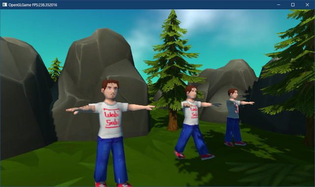
</p>

>**【機能をクラスに移動するときは、変数の役割を理解する必要がある】**<br>
>「アニメーションを関節行列に設定する」のような、ある目的を持つプログラムをクラスに移動する理由は、「目的を達成しやすくなる」、「プログラムが読みやすくなる」という利点を得るためです。<br>
>これらの理由から、移動前のプログラムで使っていた変数は「同じ役割を持つメンバ関数で置き換えられる」ことが多いです。別のプログラムで「移動前の変数」を参照している場合は、それらは「同じ役割を持つメンバ関数」に置き換えなくてはなりません。<br>
>このような状況では、変数やメンバ関数の役割を適切に理解しているかどうかが試されます。ただプログラムを書き写すだけでなく、それぞれの変数や関数の役割を考えながら書き写すように心がけてください。

### 2.8 GetRotationMatrix関数にZ軸回転を追加する

腕を横に伸ばしたモデルを歩行アニメーションさせるには、両腕を下ろして前後に振る動きを付けます。しかし、ここにちょっとした問題があります。というのも、「両腕を下ろす」という動作は「Z軸回転」だからです。

テキストどおりに進めている場合、回転行列を作成する`GetRotationMatrix`関数にはX軸回転とY軸回転だけが実装されているはずです。つまり、ここにZ軸回転を追加する必要があるわけです。

>すでに自分で`GetRotationMatrix`関数にZ軸回転を追加している場合、この節は飛ばして先に進んでください。

`VecMath.h`を開き、`GetRotationMatrix`関数の定義を次のように変更してください。

```diff
   const float cosX = cos(rotation.x);
   const float sinY = sin(rotation.y);
   const float cosY = cos(rotation.y);
+  const float sinZ = sin(rotation.z);
+  const float cosZ = cos(rotation.z);
   mat3 m = { vec3{ cosY,        0,     -sinY },
              vec3{ sinX * sinY, cosX,  sinX * cosY },
              vec3{ cosX * sinY, -sinX, cosX * cosY } };
-  return m;
+  const mat3 n = { { cosZ, sinZ, 0 },
+                   {-sinZ, cosZ, 0 },
+                   { 0, 0, 1 } };
+  return m * n;
 }
 
 // mat4とvec4の乗算
 inline vec4 operator*(const mat4& m, const vec4& v)
```

行列の乗算をオーバーロードしたので、Z軸回転の行列を作成してXY軸回転の行列と合成することでXYZ軸の回転行列を計算できます。

ただ、行列`n`の5/9は`0`と`1`なので計算効率は少し悪くなります。ソリューション構成を`Release`(リリース)にしてビルドすればコンパイラが最適化してくれますが、デバッグビルドでは処理落ちしやすくなりデバッグ効率が下がるかもしれません。

これが気になる場合は`m * n`を手動で展開するとよいでしょう。`mn = m * n`とすると、途中までは以下のように展開できます。

>```c#
>mn = m * n
>
>mn[0] = m * n[0] = m * { cosZ, sinZ, 0 } = m[0] *  cosZ + m[1] * sinZ
>mn[1] = m * n[1] = m * {-sinZ, cosZ, 0 } = m[0] * -sinZ + m[1] * cosZ
>mn[2] = m * n[2] = m * {    0,    0, 1 } = m[2]
>```

これでも多少効率的になりますが、できれば完全に展開したほうがよいでしょう。

>**【保守性とデバッグ効率を天秤にかける】**<br>
>さらに細かい話をすると、行列やベクトルの`[]`演算子はオーバーロードされているので関数呼び出しのコストがかかります。行列の場合は`mn.data[0]`のようにしたり、ベクトルの場合は要素名を直接書くことでコストを減らせます。とはいえ、リリースビルドであればどちらも同じ速度になるため、通常は保守管理しやすい`[]`演算子を使うべきです。しかし、行列やベクトルのようなプログラムの基礎となる部品は、頻繁に呼び出されるために実行速度に影響しやすいです。そうした場合、保守管理よりデバッグ効率を優先して関数を展開する、という選択は十分にありえます。さらに動作チェックまで考慮すると、2つのプログラムを切り替えられるようになっていれば完璧でしょう。

それでは、Z軸回転を設定して腕を下ろしましょう。`ExplorationScene.cpp`を開き、`AnimationTest`コンポーネントの`Update`メンバ関数の定義を次のように変更してください。

```diff
        const float rx = abs(fmod(timer, 2.0f) - 1.0f);
        const size_t jointCount = renderer->GetJointMatrixCount();

        // 両腕をアニメーション
-       renderer->SetJointMatrix(2, GetTransformMatrix(vec3(1), { 0, rx, 0 }, vec3(0)));
-       renderer->SetJointMatrix(3, GetTransformMatrix(vec3(1), { 0,-rx, 0 }, vec3(0)));
+       renderer->SetJointMatrix(2,
+         GetTransformMatrix(vec3(1), { 0, rx, radians(90) }, vec3(0)));
+       renderer->SetJointMatrix(3,
+         GetTransformMatrix(vec3(1), { 0,-rx, radians(-90) }, vec3(0)));

        // 両足をアニメーション
        renderer->SetJointMatrix(4, GetTransformMatrix(vec3(1), { rx, 0, 0 }, vec3(0)));
```

プログラムが書けたらビルドして実行してください。両腕が下がっていたら成功です。

<p align="center">
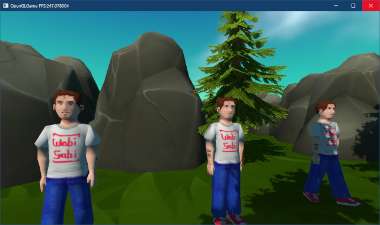
</p>

### 2.9 アニメーションを調整する

腕を下ろす前は、腕が前後に振られていたのに、腕を下ろしたあとは前後に振らなくなっています。これは、回転がZ→X→Yの順で実行されるためです。

腕を下ろす前はY軸回転によって前後に振る動きになっていましたが、Z軸回転を追加したことで「Z軸回転で腕を下ろす→下ろした腕をY軸回転する」という動きに変わったのです。

その結果、「腕をドリルのように回転させる」動きになっているわけです。腕を下ろした状態で前後に振らせるには、Y軸回転をなくしてX軸回転を使うように変更します。関節行列にアニメーションを設定するプログラムを次のように変更してください。

```diff
        // 両腕をアニメーション
        renderer->SetJointMatrix(2,
-         GetTransformMatrix(vec3(1), { 0, rx, radians(90) }, vec3(0)));
+         GetTransformMatrix(vec3(1), {-rx, 0, radians(90) }, vec3(0)));
        renderer->SetJointMatrix(3,
-         GetTransformMatrix(vec3(1), { 0,-rx, radians(-90) }, vec3(0)));
+         GetTransformMatrix(vec3(1), { rx, 0, radians(-90) }, vec3(0)));

        // 両足をアニメーション
        renderer->SetJointMatrix(4, GetTransformMatrix(vec3(1), { rx, 0, 0 }, vec3(0)));
```

プログラムが書けたらビルドして実行してください。両腕が前後に振られていたら成功です。

次に、手足を降る範囲を調整します。`rx`の範囲は`0`～`1`で、度数法にすると`0°`～`57°`、`-rx`では`0°`～`-57°`です。垂直状態が`0°`なので、前後に振りたいのなら`-28.5°`～`+28.5°`にする必要があります。

これは簡単で、`0.5 - rx`または`rx - 0.5`とするだけです。関節行列にアニメーションを設定するプログラムを次のように変更してください。

```diff
        // 両腕をアニメーション
        renderer->SetJointMatrix(2,
-         GetTransformMatrix(vec3(1), {-rx, 0, radians(90) }, vec3(0)));
+         GetTransformMatrix(vec3(1), { 0.5f - rx, 0, radians(90) }, vec3(0)));
        renderer->SetJointMatrix(3,
-         GetTransformMatrix(vec3(1), { rx, 0, radians(-90) }, vec3(0)));
+         GetTransformMatrix(vec3(1), { rx - 0.5f, 0, radians(-90) }, vec3(0)));

        // 両足をアニメーション
        renderer->SetJointMatrix(4, GetTransformMatrix(vec3(1), { rx, 0, 0 }, vec3(0)));
```

プログラムが書けたらビルドして実行してください。前後均等に腕が振られていたら成功です。

<p align="center">
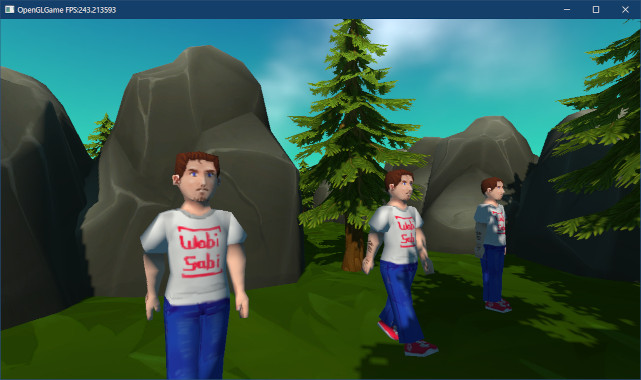
</p>

<pre class="tnmai_assignment">
<strong>【課題02】</strong>
両足の振り幅が前後均等になるように、両足をアニメーションさせるプログラムを修正しなさい。
</pre>

両手と両足がそれらしく動くようになると、胴体が空中に固定されていることに違和感を感じるでしょう。この違和感を解消するには、手足の振りに合わせて胴体を上下に動かします。

「足が回転していないとき」の腰の位置を基準とすると、「足が最大まで回転したとき」の腰の位置は少し低くなるはずです。この回転運動による位置の変化は`cos(rx)`で求められます。

「足が回転していないとき」は`0.5 - rx = 0`なので`cos(0) = 1`、「足が最大まで回転したとき」は`0.5 - rx = 0.5`なので`cos(0.5) = 約0.88`です。また、「足が回転していないとき」の高さを基準とするには、式を`cos(0.5 - rx) - 1`とします。

ただし、スケルトン定義によると足関節の長さは`0.8m`なので、この式に`0.8`を乗算しなくてはなりません。それでは、`Update`メンバ関数の定義に、腰の位置を変化させるプログラムを追加してください。

```diff
        timer += deltaTime;
        float rx = abs(fmod(timer, 2.0f) - 1.0f);
        const size_t jointCount = renderer->GetJointMatrixCount();
+
+       // 胴体をアニメーション
+      const float ty = (cos(0.5f - rx) - 1) * 0.8f;
+      renderer->SetJointMatrix(0,
+        GetTransformMatrix(vec3(1), vec3(0), { 0, ty, 0 }));

        // 両腕をアニメーション
        renderer->SetJointMatrix(2,
```

プログラムが書けたらビルドして実行してください。男性が上下に動いていたら成功です。

<p align="center">
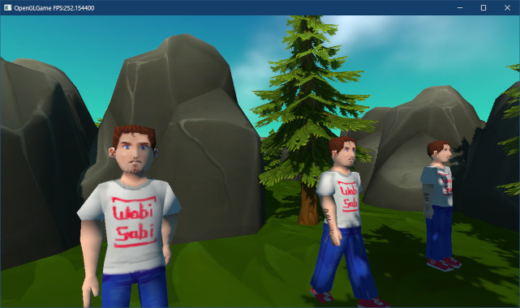
</p>

>**【2章のまとめ】**
>
>* 
>* 
>* 
>* 
