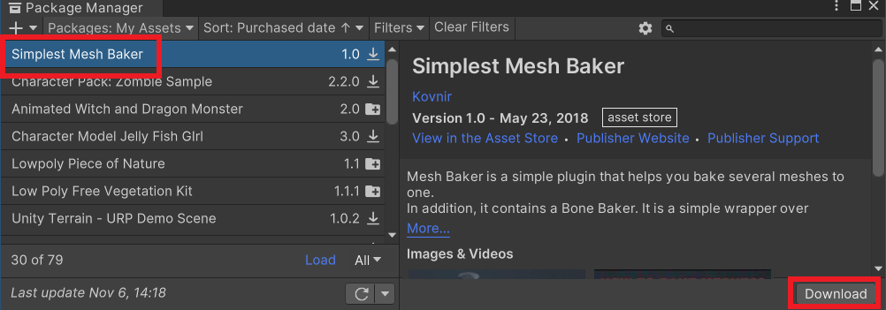
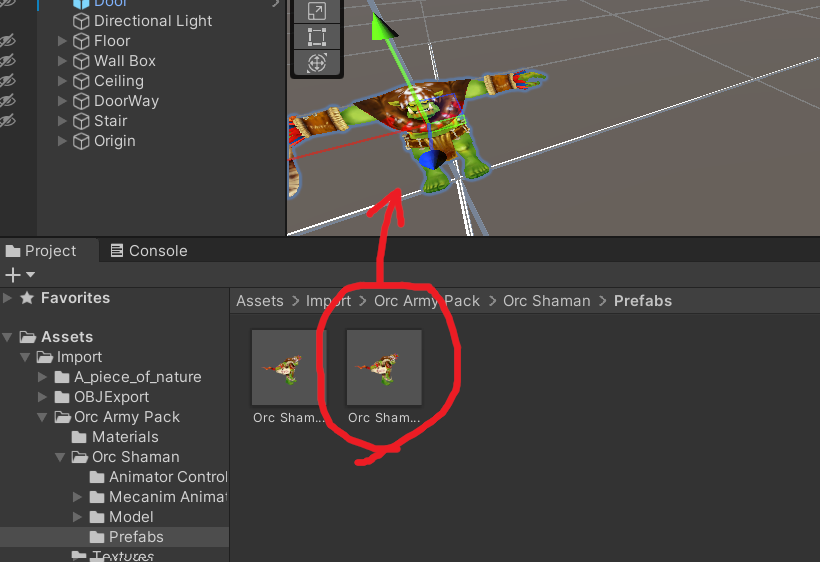
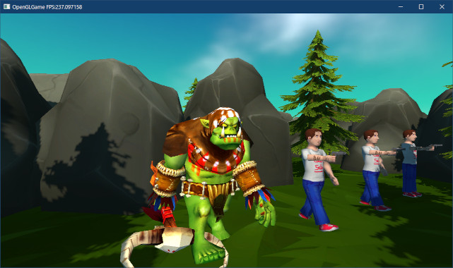
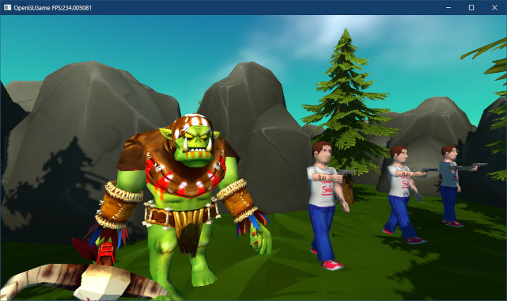

[OpenGL 3D 2023 後期 第08回]

# 汎用アニメーションコンポーネント

## 習得目標

* 
* 
* 
* 

## 1. アニメーションを行うコンポーネント

### 1.1 トリプルバッファリング

スケルタル・メッシュ(スキン・メッシュ)を実装する3回シリーズの3回目です。

現代のコンピュータシステムでは、CPUがグラフィックス命令をGPUに送り、GPUは送られた命令を順番に実行します。

あるフレームにおいて、CPUが「データをバッファAにコピー」、「バッファAのデータを使って描画」という2つの命令をGPUに送るとします。すると、GPUはコピーが完了するまで待ってから描画を開始します。

そして、次のフレームでもCPUは「データをバッファAにコピー」、「バッファAのデータを使って描画」という命令を送ったとします。このとき、GPUが前のフレームで受け取った描画命令を完了していれば問題はありません。

しかし、データが多いなどの理由でまだ描画中だった場合、バッファAに書き込んでしまうと描画中のデータが消えてしまいます。そうならないように、GPUは描画が完了するまで待ってからコピー命令を実行します。

ただ、この流れには2つの問題があります。ひとつは「データがコピーされるまで描画が待たされる」こと、もうひとつは「描画が完了するまでコピーが待たされる」ことです。

これらの問題を解決するには「ダブルバッファ」または「トリプルバッファ」と呼ばれる技法を使います。この技法は名前の通りバッファを二重または三重に持つことで、コピーするバッファと描画するバッファを分けます。

コピー命令は描画命令とは別のバッファに書き込めるために描画の完了を待つ必要がなくなります。描画命令は最初の１回だけはコピーを待たざるを得ませんが、２回目からは描画と並行してコピーされたデータを使うので、コピー完了を待つことはありません。

>ここでは「コピーのほうが早く終わり、描画はコピーより時間がかかる」と仮定しています。実際に、現代のGPUではほぼこの仮定が成り立ちます。


### 1.1 アニメーションの構成要素

`AnimationTest`コンポーネントに実装したアニメーションプログラムは、「アニメーションさせる」という目的を果たすには十分なものでした。しかし、アニメーションの種類ごとにコンポーネントを作成するのは、あまり効率的とは言えません。

そこで、「キー・フレーム」を利用したアニメーションを制御するコンポーネントを作成することにします。

「キー・フレーム(Key frame)」は、キャラクターの「動きの特徴を表現するために重要な瞬間」のことです。例えば、キャラクターが上下に移動するアニメーションでは、キャラクターが一番上および一番下に到達した瞬間がキーフレームに当たります。

そして、いくつかのキーフレームをつなぎ合わせてアニメーションを再現する手法を「キーフレーム・アニメーション」といいます。

キーフレーム・アニメーションではキーフレームだけを保存すればよいので、それ以外の瞬間の状態は不要です。そのため、「少ないデータでアニメーションが表現できる」ところが利点です。

さて、キーフレーム・アニメーションを実現するためには、以下のようなクラスが必要となります。

| クラス名 | 役割 |
|:--------:|:----|
| `Keyfram`<br>(キーフレーム) | 動きの特徴を表す構造体 |
| `AnimationCurve`<br>(アニメーションカーブ) | キーフレーム配列を管理するクラス |
| `AnimationClip`<br>(アニメーションクリップ) | アニメーションカーブ配列を管理するクラス |
| `Animator`<br>アニメーター) | アニメーションクリップ配列を管理するクラス |

これらのクラスは個別にファイルを作成するほどの規模ではないので、`Animation.h`(アニメーション・エイチ)と`Animation.cpp`(アニメーション・シーシーピー)という2つのファイルにまとめることにします。

`Animator`はキャラクターの全てのアニメーションを保持し、プログラムからの指示に応じてそのうちのひとつを再生します。

`AnimationClip`はキャラクターの個々のアニメーションを扱います。例えば「歩くアニメーションクリップ」、「剣を振るアニメーションクリップ」、「倒れるアニメーションクリップ」などです。`AnimationClip`は`Animator`に登録されます。

`AnimationCurve`はアニメーションの詳細を定義します。例えば、「歩くアニメーション」は「右腕の回転」「左腕の回転」「右足の回転」「左足の回転」「胴体の位置」の5つの`AnimationCurve`によって定義されます。

ひとつの`AnimationClip`にこれらの複数の`AnimationCurve`を登録することで、複雑なアニメーションを表現します。

`Keyframe`は`AnimationCurve`の構成要素で、「ある時刻における回転(または拡大率、位置)」を表現します。例えば「右腕を前に30°回転させた状態」「右腕を後ろに-30°回転させた状態」などです。

### 1.2 SkeletalMeshRendererをアニメーションに対応する

今回作成するアニメーション・プログラムでは、位置、回転、拡大率を個別にアニメーションできるように作成します。ただ、現在の`SkeletalMeshRenderer`コンポーネントはこれらを一つの行列としてまとめてしまっています。

そこで、新たに位置、回転、拡大率を個別に設定できるようにします。最初に、これらのパラメータをまとめた構造体を定義します。名前は`JointTransform`(ジョイント・トランスフォーム)とします。

`SkeletalMeshRenderer.h`を開き、次の構造体の定義を追加してください。

```diff
 #include <vector>
 #include <memory>

 class GameObject;
+
+/**
+* 関節の座標変換パラメータ
+*/
+struct JointTransform
+{
+  vec3 position = vec3(0); // 位置
+  vec3 rotation = vec3(0); // 回転
+  vec3 scale = vec3(1);    // 拡大率
+};

 /**
 * スケルタルメッシュの描画を補助するクラス
```

次に、`SkeletalMeshRenderer`クラスの`private`メンバに次のプログラムを追加してください。

```diff
 private:
   SkeletalMeshPtr skeletalMesh;    // 描画するスケルタルメッシュ
+  std::vector<JointTransform> jointTransforms; // 関節の座標変換パラメータ
   std::vector<mat4> jointMatrices; // 関節の座標変換行列
   size_t gpuOffset = 0; // 座標変換行列のGPUメモリ上の位置
```

続いて、追加した`jointTransforms`(ジョイント・トランスフォームズ)配列にアクセスするメンバ関数を追加してください。

```diff
   // 関節の座標変換行列を設定
   void SetJointMatrix(int i, const mat4& m) { jointMatrices[i] = m; }
+
+  // 関節の座標変換パラメータを取得
+  JointTransform& GetJointTransform(int i) { return jointTransforms[i]; }
+  const JointTransform& GetJointTransform(int i) const { return jointTransforms[i]; }

   /**
   * 座標変換行列を計算
```

最後に、設定された座標変換パラメータから座標変換行列を計算します。`SkeletalMeshRenderer.cpp`を開き、`CalculateJointMatrix`メンバ関数の定義に次のプログラムを追加してください。

```diff
 void SkeletalMeshRenderer::CalculateJointMatrix(mat4* matrices)
 {
   const size_t jointCount = skeletalMesh->joints.size();
+
+  // 位置、回転、拡大率から座標変換行列を計算
+  for (int i = 0; i < jointCount; ++i) {
+    const auto& t = jointTransforms[i];
+    jointMatrices[i] = GetTransformMatrix(t.scale, t.rotation, t.position);
+  }

   // 逆バインドポーズ行列とバインドポーズ行列を反映
   std::vector<mat4> m(jointCount);
```

これで、位置、回転、拡大率を個別に制御できるようになりました。アニメーションプログラムの作成に戻りましょう。

### 1.3 Keyframe構造体を定義する

それでは、基礎となる`Kyeframe`構造体から定義していきましょう。プロジェクトの`Src/Engine`フォルダに`Animation.h`という名前のヘッダファイルを追加してください。追加したファイルを開き、次のプログラムを追加してください。

```diff
+/**
+* @file Animation.h
+*/
+#ifndef ANIMATION_H_INCLUDED
+#define ANIMATION_H_INCLUDED
+#include "VecMath.h"
+#include "Component.h"
+#include <vector>
+#include <string>
+#include <unordered_map>
+#include <memory>
+
+// 先行宣言
+class GameObject;
+
+/**
+* 時刻とアニメーション状態のペア
+*/
+struct Keyframe
+{
+  float time; // 時刻
+  vec3 value; // アニメーション状態
+};
+
+#endif // ANIMATION_H_INCLUDED
```

キーフレームの定義はアニメーションデータやゲームエンジンによって異なります。本テキストでは「キーフレームが表す時刻」を`float`型、「キーフレームのアニメーション状態」を`vec3`型で表現することにします。

`Keyframe`構造体はこれで完成です。

>より詳細かつ汎用的な制御を行いたい場合は「アニメーション状態」の型を`float`にします。実際に、`float`型は多くのゲームエンジンのデフォルトです。ただし、`float`は`vec3`より詳細度が高いためにアニメーションの計算に時間がかかります。そのため、なんらかの最適化を行わない場合、ゲームの動作速度を低下させる可能性があります。

### 1.3 AnimationCurveクラスを定義する

次に`AnimationCurve`(アニメーション・カーブ)クラスを定義します。「カーブ」という名前は「数値の変化をグラフとして表現すると、一種の曲線とみなせる」ことから名付けています(直線も曲線の一種です)。

それではクラス定義を追加しましょう。`Keyframe`構造体の定義の下に、次のプログラムを追加してください。

```diff
   float time; // 時刻
   vec3 value; // アニメーション状態
 };
+
+/**
+* キーフレームの集合
+*/
+class AnimationCurve
+{
+public:
+  /**
+  * キーフレームを追加する
+  * 
+  * @param time  時刻
+  * @param value アニメーション状態
+  *
+  * @retval true 追加成功
+  * @retval false 追加失敗(同じ時刻のキーが存在する)
+  */
+  bool AddKey(float time, const vec3& value);
+
+  /**
+  * キーフレーム配列を追加する
+  *
+  * @param begin 配列の先頭
+  * @param end   配列の終端
+  *
+  * @return 追加したキーの数
+  */
+  int AddKey(const Keyframe* begin, const Keyframe* end);
+
+  /**
+  * 特定の時刻のアニメーション状態を取得する
+  *
+  * @param time 時刻
+  *
+  * @return timeに対応するアニメーション状態
+  */
+  vec3 Evaluate(float time) const;
+
+  /**
+  * アニメーションの長さを取得する
+  *
+  * @return アニメーションの長さ(秒)
+  */
+  float Length() const;
+
+private:
+  std::vector<Keyframe> keys;
+};
+using AnimationCurvePtr = std::shared_ptr<AnimationCurve>;

 #endif // ANIMATION_H_INCLUDED
```

アニメーションカーブクラスは「キーフレームを追加するためのメンバ関数」と「ある時刻のアニメーション状態を取得するメンバ関数」を持ちます。

また、複数のキーフレームを一度に追加できるように、「キーフレーム配列」を追加するメンバ関数も用意することにします。

### 1.4 AddKeyメンバ関数を定義する

それでは、メンバ関数の定義を作成しましょう。プロジェクトの`Src/Engine`フォルダに`Animation.cpp`という名前のCPPファイルを追加してください。追加したファイルを開き、次のプログラムを追加してください。

```diff
+/**
+* @file Animation.cpp
+*/
+#include "Animation.h"
+#include "GameObject.h"
+#include "SkeletalMeshRenderer.h"
+#include "Debug.h"
+#include <algorithm>
+
+/**
+* キーフレームを追加する
+*/
+bool AnimationCurve::AddKey(float time, const vec3& value)
+{
+  // 追加する位置を探索
+  auto itr = std::lower_bound(keys.begin(), keys.end(), time,
+    [](const Keyframe& key, float time) { return key.time < time; });
+
+  // 時刻の等しいキーフレームが存在する場合は追加できない
+  if (itr != keys.end() && itr->time == time) {
+    LOG_WARNING(
+      "時間の重複するKeyFrameは追加できません(time=%0.3f, value=%0.3f,%0.3f,%0.3f",
+      time, value.x, value.y, value.z);
+    return false; // 追加失敗
+  }
+
+  // キーフレームを追加
+  keys.insert(itr, Keyframe{ time, value });
+  return true; // 追加成功
+}
```

追加する位置の検索にはレンダーキューの分類でも利用した、`lower_bound`(ローワー・バウンド)関数を使います。`lower_bound`関数は、指定された値「以上」の数値を持つ最初の要素の位置を返します。

要素がない場合は「範囲の終端」を返します。上記のプログラムでは範囲に終端として`keys.end()`を渡しているので、戻り値が`keys.end()`と等しい場合は「要素がない」と判定できます。

ここでは、「時刻の等しいキーフレーム」を判別する`if`文に注目してください。まず`itr != keys.end()`によって「キーフレームが存在」することをチェックします。キーフレームが存在する場合、時刻が等しいかどうかをチェックします。

等しい場合はキーフレームを追加できないので、エラーメッセージを表示して`false`を返します。

### 1.5 配列版のAddKeyメンバ関数を定義する

次に、キーフレーム配列を受け取るバージョンの`AddKey`メンバ関数を定義します。キーフレームを追加する`AddKey`メンバ関数の定義の下に、次のプログラムを追加してください。

```diff
   // キーフレームを追加
   keys.insert(itr, Keyframe{ time, value });
   return true; // 追加成功
 }
+
+/**
+* キーフレーム配列を追加する
+*/
+int AnimationCurve::AddKey(const Keyframe* begin, const Keyframe* end)
+{
+  keys.reserve(end - begin); // 要素数を予約
+
+  int count = 0; // 追加した要素数
+  for (auto itr = begin; itr != end; ++itr) {
+    count += AddKey(itr->time, itr->value);
+  }
+  return count;
+}
```

配列や`vector`と同様に、初期化子リストは範囲`for`文によってループ処理することができます。このプログラムでは範囲`for`文によってすべてのキーフレームを追加しています。

初期化子リストを使う利点は、追加する要素数が分かることです。そのため、`reserve`関数によって要素数を予約する最適化が可能になっています。

### 1.6 Evaluateメンバ関数を定義する

続いて`Evaluate`(エバリュエート、「評価する」という意味)メンバ関数を定義します。配列版の`AddKey`メンバ関数の定義の下に、次のプログラムを追加してください。

```diff
     count += AddKey(e.time, e.value);
   }
   return count;
 }
+
+/**
+* 特定の時刻のアニメーション状態を取得する
+*/
+vec3 AnimationCurve::Evaluate(float time) const
+{
+  // 時刻に対応するキーフレームを検索
+  auto itr = std::lower_bound(keys.begin(), keys.end(), time,
+    [](const Keyframe& k, float time) { return k.time < time; });
+
+  // 見つけたキーフレームとひとつ前のキーフレームを線形補間する
+  auto prev = itr - 1; // ひとつ前のキーフレーム
+  const float ratio = (time - prev->time) / (itr->time - prev->time);
+  return prev->value * (1 - ratio) + itr->value * ratio;
+}
```

`AddKey`の場合と同様に、`lower_bound`関数を用いて`time`引数で指定された時刻に対応するキーフレームを検索します。`lower_bound`の戻り値は「指定された値以上の要素」なので、基本的には`time`より大きい時刻の要素が返されます。

ちょうど`time`のアニメーション状態を作り出すには、見つかった要素と「ひとつ前の要素」の中間の値を計算しなくてはなりません。これは以下の方法で求められます。

>1. 前の要素と`time`の時刻の差 / 2つの要素間の時刻の差」という式で、どちらの要素に近いかの比率を求める。
>2. 「前の要素の値 * (1 - 比率) + 見つかった要素の値 * 比率」という式で、2つの要素の値を線形補間する。

このプログラムはアニメーションカーブが取りうるほとんどの時刻を評価できます。しかし、いくつかの例外は正しく評価できません。例えば、`time`が最初のキーフレームの時刻より前の時刻を指す場合、「ひとつ前の要素」は存在しません。

同様に、`time`が最後のキーフレームより後ろの時刻を指す場合も、対応するキーフレームを見つけられません。これらの他にも例外となる場合が存在します。このような例外を適切に対処しなければ、プログラムが正常に動作しません。

まず「要素数が0(キーフレームがない)」場合と、キーフレームがひとつだけの場合の例外処理を追加します。`Evaluate`メンバ関数の定義に次のプログラムを追加してください。

```diff
 * 特定の時刻のアニメーション状態を取得する
 */
 vec3 AnimationCurve::Evaluate(float time) const
 {
+  if (keys.empty()) {
+    return vec3(0); // キーフレームがない場合
+  } else if (keys.size() == 1) {
+    return keys.begin()->value; // キーフレームがひとつの場合
+  }
+
   // 時刻に対応するキーフレームを検索
   auto itr = std::lower_bound(keys.begin(), keys.end(), time,
     [](const Keyframe& k, float time) { return k.time < time; });
```

要素がない場合にどうすべきかは難しいところですが、とりあえず`vec3(0)`を返すことにします。要素がひとつだけの場合は単にその値を返すだけです。これらはいずれも「線形補間したくても要素が足りない」という状況です。

次に、見つかった要素が「先頭」の場合、それから、「要素が見つからなかった」場合を扱うプログラムを追加します。キーフレームを検索するプログラムの下に、次のプログラムを追加してください。

```diff
   // 時刻に対応するキーフレームを検索
   auto itr = std::lower_bound(keys.begin(), keys.end(), time,
     [](const Keyframe& k, float time) { return k.time < time; });
+
+  // 先頭が見つかった場合は先頭キーフレームの値を返す
+  if (itr == keys.begin()) {
+    return itr->value;
+  }
+
+  // 見つからなかった場合は末尾のキーフレームの値を返す
+  if (itr == keys.end()) {
+    return keys.back().value;
+  }

   // 見つけたキーフレームとひとつ前のキーフレームを線形補間する
   auto prev = itr - 1;
```

先頭要素が見つかったということは、`time`は先頭のキーフレームの時刻以前を指しています。この場合は先頭要素、つまり見つかったキーフレームの値を返します。

要素が見つからなかったということは、`time`は末尾のキーフレームの時刻より後ろを指しています。この場合は末尾のキーフレームの値を返します。これで例外処理を備えた`Evaluate`メンバ関数は完成です。

### 1.7 Lengthメンバ関数を定義する

最後に、アニメーションの長さを取得する`Length`(レングス)メンバ関数を定義します。`Evaluate`メンバ関数の定義の下に、次のプログラムを追加してください。

```diff
   const float ratio = (time - prev->time) / (itr->time - prev->time);
   return prev->value * (1 - ratio) + itr->value * ratio;
 }
+
+/**
+* アニメーションの長さを取得する
+*/
+float AnimationCurve::Length() const
+{
+  if (keys.empty()) {
+    return 0;
+  }
+  return keys.back().time;
+}
```

基本的には末尾のキーフレームの時刻を返しますが、要素がひとつもない場合は`0`を返すような例外処理を入れています。

このように、プログラミング作業では、起こる確率の低い状態に対処するプログラムが全体の半分以上を占めます。これらの例外を適切に処理しないと、プログラムは簡単にクラッシュしてしまうでしょう。

### 1.8 AnimationClipクラスを定義する

次に`AnimationClip`クラスを定義するのですが、その前にこのクラスで利用する列挙型を定義しておきます。`Animation.h`を開き、`AnimationCurve`クラスの定義の下に、次のプログラムを追加してください。

```diff
   std::vector<Keyframe> keys;
 };
 using AnimationCurvePtr = std::shared_ptr<AnimationCurve>;
+
+/**
+* アニメーションの対象となるデータ
+*/
+enum class AnimationTarget
+{
+  position, // 位置
+  rotation, // 回転
+  scale,    // 拡大率
+};

 #endif // ANIMATION_H_INCLUDED
```

`AnimationTarget`(アニメーション・ターゲット)列挙型は、ボーンまたはゲームオブジェクトが持つ位置、回転角度、拡大率のうちどれをアニメーションさせるかを表します。

それでは`AnimationClip`クラスを定義しましょう。`AnimationTarget`列挙型の定義の下に、次のプログラムを追加してください。

```diff
   rotation, // 回転
   scale,    // 拡大率
 };
+
+/**
+* アニメーションカーブの集合
+*/
+class AnimationClip
+{
+public:
+  /**
+  * アニメーションカーブを追加する
+  *
+  * @param targetBone アニメーションを適用するボーンの番号
+  * @param target     アニメーションの対象となるデータ
+  * @param curve      追加するアニメーションカーブ
+  *
+  * @retval true  追加成功
+  * @retval false 追加失敗
+  */
+  bool AddCurve(int targetBone, AnimationTarget target,
+    const AnimationCurvePtr& curve);
+
+  /**
+  * アニメーションを反映する
+  *
+  * @param gameObject 反映先のゲームオブジェクト
+  * @param time       アニメーションを評価する時刻
+  */
+  void Evaluate(GameObject& gameObject, float time);
+
+  // アニメーションの再生時間を取得
+  float Length() const { return length; }
+
+  // ループフラグを取得
+  bool IsLoop() const { return isLoop; }
+
+  // ループフラグを設定
+  void SetLoopFlag(bool flag) { isLoop = flag; }
+
+private:
+  // アニメーションカーブの設定情報
+  struct CurveInfo
+  {
+    int targetBone;          // アニメーションの対象となるボーン番号
+    AnimationTarget target;  // アニメーションの対象となるデータ
+    AnimationCurvePtr curve; // アニメーションカーブ
+  };
+  std::vector<CurveInfo> curves;
+
+  float length = 0;     // アニメーションの再生時間(秒)
+  bool isLoop = false;  // true=ループする false=ループしない
+};
+using AnimationClipPtr = std::shared_ptr<AnimationClip>;

 #endif // ANIMATION_H_INCLUDED
```

`AnimationClip`クラスは、「アニメーションカーブを追加するメンバ関数」と「ある時刻のアニメーションをゲームオブジェクトに反映するメンバ関数」を持ちます。

### 1.9 AddCurveメンバ関数を定義する

それでは`AddCurve`(アド・カーブ)メンバ関数を定義しましょう。`Animation.cpp`を開き、`AnimationClip::Length`メンバ関数の定義の下に、次のプログラムを追加してください。

```diff
     return 0;
   }
   return keys.back().time;
 }
+
+/**
+* アニメーションカーブを追加する
+*/
+bool AnimationClip::AddCurve(int targetBone, AnimationTarget target,
+  const AnimationCurvePtr& curve)
+{
+  // ボーン番号とターゲットが一致するデータを検索
+  auto itr = std::find_if(curves.begin(), curves.end(),
+    [targetBone, target](const CurveInfo& info) {
+      return info.targetBone == targetBone && info.target == target; });
+
+  // ボーン番号とターゲットの両方が等しいカーブが存在する場合は設定できない
+  if (itr != curves.end()) {
+    static const char* const targetNames[] = { "position", "rotation", "scale" };
+    LOG_WARNING("ターゲットが重複するカーブは設定できません(targetBone=%d, target=%s",
+      targetBone, targetNames[static_cast<int>(target)]);
+    return false; // 追加失敗
+  }
+
+  // 新しいカーブを追加
+  curves.push_back(CurveInfo{ targetBone, target, curve });
+  length = std::max(length, curve->Length()); // 長さを更新
+  return true; // 追加成功
+}
```

最初に`lower_bound`関数を使って「同じボーン番号とターゲットを持つ要素」を検索します。この条件に一致する要素が見つかったら、アニメーションカーブを上書きします。見つからなければ要素を新規に作成します。

`AddKey`メンバ関数と同様に、一致する要素がすでに存在する場合は警告メッセージを表示して終了します。

### 1.10 Evaluateメンバ関数を定義する

続いて`Evalulate`(エバリュエート)メンバ関数を定義します。`AddCurve`メンバ関数の定義の下に、次のプログラムを追加してください。

```diff
   length = std::max(length, curve->Length()); // 長さを更新
   return true; // 追加成功
 }
+
+/**
+* アニメーションを反映する
+*/
+void AnimationClip::Evaluate(GameObject& gameObject, float time)
+{
+  // ボーン数を取得
+  size_t count = 0;
+  if (gameObject.renderer) {
+    count = gameObject.renderer->GetJointMatrixCount();
+  }
+
+  // すべてのアニメーションカーブを評価
+  for (const auto& e : curves) {
+    // カーブのボーン番号がボーン数以上の場合は何もしない
+    if (e.targetBone >= count) {
+      continue;
+    }
+
+    // timeにおけるカーブを評価
+    const vec3 v = e.curve->Evaluate(time);
+
+    // 評価結果を対象に反映
+    if (e.targetBone >= 0) {
+      // ボーン番号が0以上の場合、対応するボーンに評価結果を反映
+      // 補足: ここに来るのはcountが1以上の場合だけなので、rendererのnullチェックは不要
+      JointTransform& t = gameObject.renderer->GetJointTransform(e.targetBone);
+      switch (e.target) {
+      case AnimationTarget::position: t.position = v; break;
+      case AnimationTarget::rotation: t.rotation = v; break;
+      case AnimationTarget::scale: t.scale = v; break;
+      }
+    } else {
+      // ボーン番号がマイナスの場合、ゲームオブジェクトに評価結果を反映
+      switch (e.target) {
+      case AnimationTarget::position: gameObject.position = v; break;
+      case AnimationTarget::rotation: gameObject.rotation = v; break;
+      case AnimationTarget::scale: gameObject.scale = v; break;
+      }
+    }
+  } // for curves
+}
```

`AnimationClip`クラスの`Evaluate`メンバ関数は、登録されている全ての`AnimationCurve`について`AnimationCurve::Evaluate`メンバ関数を呼び出し、その評価結果を対象オブジェクトに反映します。

>**【位置、回転、拡大率以外をアニメーションさせるには】**<br>
>このプログラムではアニメーションの対象を、位置、回転、拡大率のみとしています。他の要素、例えば「ゲームオブジェクトの色」をアニメーションさせたい場合は`AnimationTaget`に色を表すメンバを追加し、色を反映するプログラムを作成します。

### 1.11 Animatorクラスを定義する

次に`Animator`(アニメータ)クラスを定義します。`Animation.h`を開き、`AnimationClip`クラスの定義に次のプログラムを追加してください。

```diff
   bool isLoop = false;  // true=ループする false=ループしない
 };
 using AnimationClipPtr = std::shared_ptr<AnimationClip>;
+
+/**
+* アニメーションを制御するコンポーネント
+*/
+class Animator : public Component
+{
+public:
+  // コンストラクタ・デストラクタ
+  Animator() = default;
+  virtual ~Animator() = default;
+
+  /**
+  * 状態を更新する
+  *
+  * @param deltaTime 前回の更新からの経過時間(秒)
+  */
+  virtual void Update(float deltaTime) override;
+
+  /**
+  * アニメーションクリップを追加する
+  *
+  * @param name アニメーションクリップに付ける名前
+  * @param clip 追加するアニメーションクリップ
+  */
+  void AddClip(const char* name, const AnimationClipPtr& clip);
+
+  /**
+  * アニメーションを再生する
+  *
+  * @param name 再生するアニメーションクリップの名前
+  */
+  void Play(const char* name);
+
+  // アニメーションを停止する
+  void Stop();
+
+  // 動作状態を取得
+  bool IsPlaying() const { return isPlaying; }
+
+  // 再生中のアニメーションクリップ名を取得
+  const std::string& GetCurrentClipName() const { return currentClipName; }
+
+  // アニメーション速度を取得・設定
+  float GetSpeed() const { return speed; }
+  void SetSpeed(float s) { speed = s; }
+
+  // 経過時間を取得・設定
+  float GetTimer() const { return timer; }
+  void SetTimer(float t) { timer = t; }
+
+private:
+  std::unordered_map<std::string, AnimationClipPtr> clips; // クリップ配列
+  std::string currentClipName;  // 再生中のアニメーションクリップ名
+  AnimationClipPtr currentClip; // 設定されているアニメーションクリップ
+  bool isPlaying = false;       // アニメーションを再生中ならtrue
+  float timer = 0;              // アニメーションの経過時間
+  float speed = 1;              // アニメーション速度
+};
+using AnimationPtr = std::shared_ptr<Animator>;

 #endif // ANIMATION_H_INCLUDED
```

アニメーションクリップの設定は`AddClip`(アド・クリップ)メンバ関数で行います。アニメーションの再生と停止は`Play`(プレイ)メンバ関数、`Stop`(ストップ)メンバ関数で行います。

### 1.12 Updateメンバ関数を定義する

それでは`Animator`クラスのメンバ関数を定義していきましょう。最初は`Update`メンバ関数からです。`Animation.cpp`を開き、`AnimationClip::Evaluate`メンバ関数の定義の下に、次のプログラムを追加してください。

```diff
       case AnimationTarget::scale: gameObject.scale = v; break;
       }
     }
   } // for curves
 }
+
+/**
+* 状態を更新する
+*/
+void Animator::Update(float deltaTime)
+{
+  // クリップが設定されていない、または再生されていない場合は何もしない
+  if ( ! currentClip || ! isPlaying) {
+    return;
+  }
+
+  // 経過時間を更新
+  timer += deltaTime * speed;
+
+  // ループの有無で処理を分ける
+  const float length = currentClip->Length();
+  if (currentClip->IsLoop()) {
+    // アニメーションの再生時間でループ
+    timer = fmod(timer + length, length);
+  } else {
+    // 再生時間を超過していたら再生を停止する
+    if (speed < 0 && timer <= 0) {
+      isPlaying = false;
+      timer = 0;
+    } else if (speed >= 0 && timer >= length) {
+      isPlaying = false;
+      timer = length;
+    }
+  }
+
+  // アニメーションクリップを評価
+  currentClip->Evaluate(*GetOwner(), timer);
+}
```

最初に「例外処理」として、「アニメーションクリップが設定されていない」、「再生されていない」の2つのパターンを除外しています。これによって、以後はアニメーションクリップが存在すること、再生されていることを前提としてプログラミングできます。

その後にある「経過時間を更新」するプログラムこそが、アニメーションを進行させる重要な行です。この行がなければ他のプログラムは全て無意味になってしまいます。

経過時間を更新したら、アニメーションのループ処理と終了処理を行います。ループが有効な場合、再生時間の範囲を何度も繰り返します。ループが無効な場合、再生時間を超えた時点で再生を終了します。

最後に、更新した経過時間を使ってアニメーションクリップを評価します。

### 1.13 AddClipメンバ関数を定義する

次にアニメーションクリップを追加する`AddClip`(アド・クリップ)メンバ関数を定義します。`Update`メンバ関数の定義の下に、次のプログラムを追加してください。

```diff
   // アニメーションクリップを評価
   currentClip->Evaluate(*GetOwner(), timer);
 }
+
+/**
+* アニメーションクリップを追加する
+*
+* @param name アニメーションクリップに付ける名前
+* @param clip 追加するアニメーションクリップ
+*/
+void Animator::AddClip(const char* name, const AnimationClipPtr& clip)
+{
+    auto itr = clips.find(name);
+  if (itr != clips.end()) {
+    LOG_WARNING("同じ名前のクリップは追加できません(name=%s)", name);
+    return;
+  }
+
+  // アニメーションクリップを追加
+  clips.emplace(name, clip);
+}
```

`AddKey`や`AddCurve`メンバ関数と同様に、最初に同名のアニメーションクリップの有無をチェックします。同名のクリップが存在する場合は警告メッセージを表示します。

同名のクリップが存在しない場合は、`emplace`(エンプレイス)メンバ関数によって要素を追加します。

### 1.14 Playメンバ関数を定義する

続いて`Play`(プレイ)メンバ関数を定義します。`AddClip`メンバ関数の定義の下に、次のプログラムを追加してください。

```diff
   // アニメーションクリップを追加
   clips.emplace(name, clip);
 }
+
+/**
+* アニメーションを再生する
+*/
+void Animator::Play(const char* name)
+{
+  auto itr = clips.find(name);
+  if (itr == clips.end()) {
+    LOG_WARNING("指定された名前のクリップが見つかりません(name=%s)", name);
+    return;
+  }
+
+  // クリップを設定し、再生状態にする
+  currentClipName = itr->first;
+  currentClip = itr->second;
+  isPlaying = true; // 再生状態にする
+  timer = 0; // 最初から再生
+}
```

最初に名前検索を行うのは`AddClip`メンバ関数と同じです。名前の一致するアニメーションクリップが見つからない場合は、警告メッセージを表示して終了します。

クリップが見つかった場合、見つかったアニメーションクリップの情報を`currentClipName`と`currentClip`メンバ変数に保存し、`isPlaying`を`true`にして再生状態に設定します。

### 1.15 Stopメンバ関数を定義する

次に`Stop`(ストップ)メンバ関数を定義します。`Play`メンバ関数の定義の下に、次のプログラムを追加してください。

```diff
   isPlaying = true; // 再生状態にする
   timer = 0; // 最初から再生
 }
+
+// アニメーションを停止する
+void Animator::Stop()
+{
+  isPlaying = false;
+  timer = 0;
+}
```

再生停止状態にする以外は特にすることはありません。これで`Animator`クラスは完成です。

### 1.16 Animatorコンポーネントを使う

作成した`Animator`コンポーネントを使ってみましょう。`ExplorationScene.cpp`を開き、`Animation.h`をインクルードしてください。

```diff
 #include "ExplorationScene.h"
 #include "PlayerComponent.h"
 #include "Engine/SkeletalMeshRenderer.h"
+#include "Engine/Animation.h"

 // アニメーションの動作テスト用コンポーネント
 class AnimationTest : public Component
```

次にアニメーションカーブを作成します。必要なカーブは以下の5個です。

>* 胴体の上下の動き
>* 右腕の振り
>* 左腕の振り
>* 右足の振り
>* 左足の振り

まず「胴体の上下の動き」を定義します。`Initialize`メンバ関数の定義に次のプログラムを追加してください。

```diff
   // スカイスフィアを設定
   skysphereMaterial = std::make_shared<Material>();
   skysphereMaterial->texBaseColor = engine.GetTexture("Res/MeshData/sky_sphere/sky.tga");
+
+  // 胴体を上下に移動するカーブ
+  static const Keyframe kfBody[] = {
+    {0.00f, vec3(0)},            // 初期位置
+    {0.50f, vec3(0, -0.10f, 0)}, // 下に移動
+    {1.00f, vec3(0)},            // 上に移動(初期位置に戻る)
+    {1.50f, vec3(0, -0.10f, 0)}, // 下に移動
+    {2.00f, vec3(0)} };          // 上に移動(初期位置に戻る)
+  auto curveBody = std::make_shared<AnimationCurve>();
+  curveBody->AddKey(std::begin(kfBody), std::end(kfBody));

   // テスト用のスケルタルメッシュを設定
   for (float i = 0; i < 3; ++i) {
```

キーフレーム配列の名前は`kfBody`(ケーエフ・ボディ)としました。`kf`はキーフレームの短縮形です。また、カーブ変数の名前は`curveBody`(カーブ・ボディ)としました。

このカーブは、1秒に1往復するのを2回繰り返すようになっています。手足の振りが1往復に2秒かかるので、同じ動きを繰り返して長さを合わせています。

次に、両腕を前後に振るカーブを定義します。`curveBody`の定義の下に、次のプログラムを追加してください。

```diff
     {2.00f, vec3(0)},            // 上に移動(初期位置に戻る)
   auto curveBody = std::make_shared<AnimationCurve>();
   curveBody->AddKey(std::begin(kfBody), std::end(kfBody));
+
+  // 右腕を下ろして前後に回転させるカーブ
+  static const Keyframe kfArmR[] = {
+    {0.0f, vec3( 0.0f, 0, 1.57f)},  // 初期位置
+    {0.5f, vec3( 0.5f, 0, 1.57f)},  // 後ろに振る
+    {1.5f, vec3(-0.5f, 0, 1.57f)},  // 前に降る
+    {2.0f, vec3( 0.0f, 0, 1.57f)} };// 初期位置に戻る
+  auto curveArmR = std::make_shared<AnimationCurve>();
+  curveArmR->AddKey(std::begin(kfArmR), std::end(kfArmR));
+
+  // 左腕を下ろして前後に回転させるカーブ
+  static const Keyframe kfArmL[] = {
+    {0.0f, vec3( 0.0f, 0, -1.57f)},  // 初期位置
+    {0.5f, vec3(-0.5f, 0, -1.57f)},  // 前に降る
+    {1.5f, vec3( 0.5f, 0, -1.57f)},  // 後ろに振る
+    {2.0f, vec3( 0.0f, 0, -1.57f)} };// 初期位置に戻る
+  auto curveArmL = std::make_shared<AnimationCurve>();
+  curveArmL->AddKey(std::begin(kfArmL), std::end(kfArmL));

   // テスト用のスケルタルメッシュを設定
   for (float i = 0; i < 3; ++i) {
```

右腕は`ArmR`(アーム・アール)、左腕は`ArmL`(アーム・エル)という名前にしました。なお、このカーブで使われている値`1.57`は約`π/2`、`0.5`は約`π/6`です。腕のバインドポーズは水平に上げた状態なので、Z軸で90°回転させて腕を下ろしています。

同様に、両足を前後に振るカーブを作成します。`curveArmL`の定義の下に、次のプログラムを追加してください。

```diff
     {2.0f, vec3( 0.0f, 0, -1.57f)} };// 初期位置に戻る
   auto curveArmL = std::make_shared<AnimationCurve>();
   curveArmL->AddKey(std::begin(kfArmL), std::end(kfArmL));
+
+  // 右足を前後に回転させるカーブ
+  static const Keyframe kfLegR[] = {
+    {0.0f, vec3( 0.0f, 0, 0)},
+    {0.5f, vec3(-0.5f, 0, 0)},
+    {1.5f, vec3( 0.5f, 0, 0)},
+    {2.0f, vec3( 0.0f, 0, 0)} };
+  auto curveLegR = std::make_shared<AnimationCurve>();
+  curveLegR->AddKey(std::begin(kfLegR), std::end(kfLegR));
+
+  // 左足を前後に回転させるカーブ
+  static const Keyframe kfLegL[] = {
+    {0.0f, vec3( 0.0f, 0, 0)},
+    {0.5f, vec3( 0.5f, 0, 0)},
+    {1.5f, vec3(-0.5f, 0, 0)},
+    {2.0f, vec3( 0.0f, 0, 0)} };
+  auto curveLegL = std::make_shared<AnimationCurve>();
+  curveLegL->AddKey(std::begin(kfLegL), std::end(kfLegL));

   // テスト用のスケルタルメッシュを設定
   for (float i = 0; i < 3; ++i) {
```

右足は`LegR`(レッグ・アール)、左足は`LegL`(レッグ・エル)という名前にしました。数値から想像できると思うので、キーフレームのコメントは書いていません。必要だと感じたら自分で書くとよいでしょう。

必要なアニメーションカーブを定義したので、次はアニメーションクリップを作成します。`curveLegL`を作成するプログラムの下に、次のプログラムを追加してください。

```diff
     {2.0f, vec3( 0.0f, 0, 0)} };
   auto curveLegL = std::make_shared<AnimationCurve>();
   curveLegL->AddKey(std::begin(kfLegL), std::end(kfLegL));
+
+  // 歩行アニメーションクリップ
+  auto clipWalk = std::make_shared<AnimationClip>();
+  clipWalk->AddCurve(0, AnimationTarget::position, curveBody);
+  clipWalk->AddCurve(2, AnimationTarget::rotation, curveArmR);
+  clipWalk->AddCurve(3, AnimationTarget::rotation, curveArmL);
+  clipWalk->AddCurve(4, AnimationTarget::rotation, curveLegR);
+  clipWalk->AddCurve(5, AnimationTarget::rotation, curveLegL);
+  clipWalk->SetLoopFlag(true); // ループする

   // テスト用のスケルタルメッシュを設定
   for (float i = 0; i < 3; ++i) {
```

作成した5個のアニメーションカーブのうち、`curveBody`(カーブ・ボディ)は上下運動を表しています。ですから、ターゲットには`position`を指定しなくてはなりません。他の4個のカーブは回転運動なので`rotation`を指定します。

これで、歩行アニメーションクリップが定義されました。続いて、この歩行アニメーションクリップを再生しましょう。それには、ゲームオブジェクトにアニメータコンポーネントを追加し、歩行アニメーションクリップを設定します。

テスト用のスケルタルメッシュを設定するプログラムを、次のように変更してください。

```diff
     skeletal->renderer = std::make_shared<SkeletalMeshRenderer>();
     skeletal->renderer->SetMesh(
       engine.GetSkeletalMesh("Res/MeshData/human/human_male.obj"));
-    auto a = skeletal->AddComponent<AnimationTest>();
-    a->timer = i * 0.3f;
+    auto a = skeletal->AddComponent<Animator>();
+    a->AddClip("walk", clipWalk);
+    a->Play("walk");
+    a->SetTimer(i * 0.3f);
   }
   return true;
```

プログラムが書けたらビルドして実行してください。`AnimationTest`コンポーネントを使った場合とほとんど同じアニメーションが再生されていたら成功です。

<pre class="tnmai_assignment">
<strong>【課題01】</strong>
不要になった<code>AnimationTest</code>コンポーネントの定義を削除しなさい。
</pre>

### 1.17 アニメーションを追加する

アニメーションの切り替えをテストするために、アニメーションクリップを追加作成しましょう。歩行アニメーションクリップを作成するプログラムの下に、次のプログラムを追加してください。

```diff
   clipWalk->AddCurve(4, AnimationTarget::rotation, curveLegR);
   clipWalk->AddCurve(5, AnimationTarget::rotation, curveLegL);
   clipWalk->SetLoopFlag(true); // ループする
+
+  // 静止アニメーションクリップ
+  auto clipWait = std::make_shared<AnimationClip>();
+  {
+    auto curveWaitArmR = std::make_shared<AnimationCurve>();
+    curveWaitArmR->AddKey(0.0f, vec3(0, 0, 1.57f));
+    auto curveWaitArmL = std::make_shared<AnimationCurve>();
+    curveWaitArmL->AddKey(0.0f, vec3(0, 0, -1.57f));
+    clipWait->AddCurve(2, AnimationTarget::rotation, curveWaitArmR);
+    clipWait->AddCurve(3, AnimationTarget::rotation, curveWaitArmL);
+    clipWait->SetLoopFlag(true); // ループする
+  }

   // テスト用のスケルタルメッシュを設定
   for (float i = 0; i < 3; ++i) {
```

`clipWait`(クリップ・ウェイト)は両手を下ろすカーブを設定しただけのアニメーションクリップで、「静止(待機)状態」を表します。

次に、このクリップをアニメータに登録します。アニメータに歩行アニメーションクリップを設定するプログラムの下に、次のプログラムを追加してください。

```diff
     skeletal->renderer->SetMesh(
       engine.GetSkeletalMesh("Res/MeshData/human/human_male.obj"));
     auto a = skeletal->AddComponent<Animator>();
     a->AddClip("walk", clipWalk);
+    a->AddClip("wait", clipWait);
     a->Play("walk");
     a->SetTimer(i * 0.3f);
```

しかし、このままではアニメーションを切り替えられません。そこで、動作テスト用にアニメーション切り替えコンポーネントを作成します。

テスト用コンポーネントの名前は`AnimationChanger`(アニメーション・チェンジャー、「アニメーション切り替え器」という意味)とします。`ExplorationScene.cpp`の先頭に次のプログラムを追加してください。

```diff
 #include "PlayerComponent.h"
 #include "Engine/SkeletalMeshRenderer.h"
 #include "Engine/Animation.h"
+
+/**
+* アニメーション切り替えテスト用のコンポーネント
+*/
+struct AnimationChanger : public Component
+{
+  virtual void Update(float deltaTime) override
+  {
+    GameObject* owner = GetOwner();
+    auto animator = owner->GetComponent<Animator>();
+    if (!animator) {
+      return; // アニメータがないので終了
+    }
+
+    // Pキーが押されるたびにアニメーションを切り替える
+    const bool newKey = owner->GetEngine()->GetKey(GLFW_KEY_P);
+    if (! newKey || oldKey) {
+      static const char* const names[] = { "walk", "wait" };
+      animationNo = (animationNo + 1) % std::size(names);
+      animator->Play(names[animationNo]);
+    }
+    oldKey = newKey; // キー状態を更新
+  }
+
+private:
+  bool oldKey = false; // 前回のキー状態
+  int animationNo = 0; // 再生中のアニメーション番号
+};

 /**
 * カメラをプレイヤーに追従させるコンポーネント
```

次に、`Initialize`メンバ関数にある`Animator`コンポーネントを設定するプログラムの下に、次のプログラムを追加してください。

```diff
     skeletal->renderer = std::make_shared<SkeletalMeshRenderer>();
     skeletal->renderer->SetMesh(
       engine.GetSkeletalMesh("Res/MeshData/human/human_male.obj"));
+    skeletal->AddComponent<AnimationChanger>();
     auto a = skeletal->AddComponent<Animator>();
     a->AddClip("walk", clipWalk);
```

プログラムが書けたらビルドして実行してください。Pキーを押すたびに歩行と待機が切り替わったら成功です。

### 1.18 座標変換パラメータをリセットする

待機アニメーションを切り替えたとき、足の角度が直立に戻らないことに気づくと思います。アニメーションクリップに足のアニメーションを設定していない以上は当然のことです。

理想的には全ての関節にアニメーションカーブを設定するべきですが、アニメーションしない関節にカーブを設定するのは手間がかかるだけです。

そこで、アニメーションクリップを再生するときに「座標変換パラメータをリセット」するプログラムを追加します。パラメータをリセットしてバインドポーズに戻すことで、直前のアニメーションによる影響をなくせます。

`SkeletalMeshRenderer.h`を開き、`SkeletalMeshRenderer`クラスの定義に次のプログラムを追加してください。

```diff
   // 関節の座標変換パラメータを取得
   JointTransform& GetJointTransform(int i) { return jointTransforms[i]; }
   const JointTransform& GetJointTransform(int i) const { return jointTransforms[i]; }
+
+  // 関節の座標変換パラメータを初期値に戻す
+  void ClearJointTransforms() {
+    for (auto& e : jointTransforms) {
+      e.position = vec3(0);
+      e.rotation = vec3(0);
+      e.scale = vec3(1);
+    } // for jointTransforms
+  }

  /**
  * 座標変換行列を計算
```

次に`Animation.cpp`を開き、`Play`メンバ関数の定義に次のプログラムを追加してください。

```diff
   if (itr == clips.end()) {
     LOG_WARNING("指定された名前のクリップが見つかりません(name=%s)", name);
     return;
   }
+
+  // 座標変換パラメータを初期値に戻す
+  auto owner = GetOwner();
+  if (owner->renderer) {
+    owner->renderer->ClearJointTransforms();
+  }

   // クリップを設定し、再生状態にする
   currentClipName = itr->first;
```

プログラムが書けたらビルドして実行してください。Pキーで待機アニメーションに切り替えたとき、足が初期状態に戻るようになっていたら成功です。

>**【1章のまとめ】**
>
>* 
>* 
>* 
>* 
>* 

<div style="page-break-after: always"></div>

## 2. ボーン情報を他のオブジェクトに反映する

### 2.1 関節行列を参照できるようにする

スケルタルメッシュは単独のメッシュなので、各ボーンの位置、回転、拡大率はゲームオブジェクトのようには扱えません。そのため、ゲームオブジェクトの親子関係でやったように「手の先に武器を持たせる」という表現を行うには、少し工夫が必要です。

まず、ボーンの座標変換行列を外部から参照できるようにします。現在のボーンの座標変換行列は計算した端からGPUメモリに渡しているだけで、CPU側から利用できるような設計ではないからです。

`SkeletalMeshRenderer.cpp`を開き、`CalculateJointMatrix`メンバ関数定義の末尾に次のプログラムを追加してください。

```diff
       p = skeletalMesh->joints[p].parent;
     }
   } // for i
+
+  // 他のクラスから使えるように、計算した関節行列をjointMatricesにコピーする
+  std::copy_n(matrices, jointCount, jointMatrices.data());
 }

 /**
 * スケルタルメッシュを描画
```

このプログラムは「計算済みの関節行列」を`jointMatrices`メンバにコピーします。これによって、`GetJointMatrix`メンバ関数を使うことで計算結果を参照できるようにしています。

### 2.2 ゲームオブジェクトに「親の関節番号」を追加する

「手持ち武器」のようなゲームオブジェクトは「関節の子オブジェクト」だと考えられます。そのため、スケルタルメッシュを持つゲームオブジェクトの子として設定できると自然でしょう。

そこで、親と一緒に関節番号を指定できるバージョンの`SetParent`メンバ関数を追加します。名前は`SetParentAndJoint`(セット・ペアレント・アンド・ジョイント、「親と関節を設定する」という意味)とします。

作業手順は次のようになります。

>1. 「無効な関節番号」を表す定数を定義する。
>2. `GameObject`クラスに「親の関節番号」を追加する。
>3. `GameObject`クラスに「親および親の関節番号を設定するメンバ関数」を追加する。

最初に「無効な関節番号」を定義します。名前は`invalidJointNo`(インバリッド・ジョイント・ナンバー、「無効な関節番号」という意味)とします。`GameObject.h`を開き、先行宣言の下に次のプログラムを追加してください。

```diff
 struct Material;
 using MaterialPtr = std::shared_ptr<Material>; // マテリアルのポインタ
 using MaterialList = std::vector<MaterialPtr>; // マテリアル配列
+
+// 無効な関節番号
+constexpr int invalidJointNo = -1;

 /**
 * 描画の順序
```

次に、ゲームオブジェクトに「親の関節番号」を示すメンバ変数を追加します。名前は`parentJointNo`(ペアレント・ジョイント・ナンバー、「親の関節番号」という意味)とします。

`GameObject.h`を開き、`GameObject`クラスのプライベートメンバ変数に次のプログラムを追加してください。

```diff
   mat4 transformMatrix = mat4(1);  // 座標変換行列
   mat3 normalMatrix = mat3(1);     // 法線変換行列
   GameObject* parent = nullptr;      // 親オブジェクト
+  int parentJointNo = invalidJointNo;// 親の関節番号
   std::vector<GameObject*> children; // 子オブジェクト
   std::vector<ComponentPtr> components; // コンポーネント配列
```

続いて、「親および親の関節番号を設定するメンバ関数」を宣言します。`SetParent`メンバ関数の宣言の下に、次のプログラムを追加してください。

```diff
   void SetParent(GameObject* parent);
   void SetParent(const GameObjectPtr& parent);
+
+  /**
+  * 親オブジェクトと関節番号を設定する
+  *
+  * @param parent  親にするゲームオブジェクト
+  *                nullptrを指定すると親子関係を解消する
+  * @param jointNo 関節番号
+  */
+  void SetParentAndJoint(const GameObjectPtr& parent, int jointNo);

   /**
   * 子オブジェクトの数を取得する
```

それでは`SetParentAndJoint`メンバ関数を定義しましょう。`GameObject.cpp`を開き、`SetParent`メンバ関数の定義の下に、次のプログラムを追加してください。

```diff
 void GameObject::SetParent(const GameObjectPtr& parent)
 {
   SetParent(parent.get());
 }
+
+// 親オブジェクトと関節番号を設定する
+void GameObject::SetParentAndJoint(const GameObjectPtr& parent, int jointNo)
+{
+  SetParent(parent.get());
+  parentJointNo = jointNo;
+}
```

それから、関節番号を設定しない通常の`SetParent`メンバ関数の場合、無効な関節番号を設定するようにします。生ポインタ版の`SetParent`メンバ関数の定義に次のプログラムを追加してください。

```diff
   if (parent) {
     parent->children.push_back(this);
   }
   this->parent = parent;
+  parentJointNo = invalidJointNo; // 無効な関節番号を設定
 }

 // 親オブジェクトを設定する
 void GameObject::SetParent(const GameObjectPtr& parent)
```

これで、親の関節番号を設定できるようになりました。

### 2.3 座標変換行列の計算において親の関節番号を考慮する

親の関節番号は「座標変換行列」を計算するときに使います。`Engine.cpp`を開き、`UpdateGameObject`メンバ関数の定義に次のプログラムを追加してください。

```diff
     GameObject* e = gameObjects[i].get();
     mat4 m = e->transformMatrix;
     mat3 n = e->normalMatrix;
+    int parentJointNo = e->parentJointNo; // 親の関節番号
+
+    // すべての祖先の座標変換行列を乗算する
     for (e = e->parent; e; e = e->parent) {
+      // 親の関節番号がある場合、先に関節行列を乗算する
+      if (parentJointNo >= 0 && e->renderer) {
+        const mat4& matJoint = e->renderer->GetJointMatrix(parentJointNo);
+
+        // 関節行列から回転成分を取り出す
+        vec3 t, s; // 位置と拡大率は使わない
+        mat3 matJointNormal;
+        Decompose(matJoint, t, s, matJointNormal);
+
+        // 関節行列を乗算する
+        m = matJoint * m;
+        n = matJointNormal * n;
+
+        // 次の親の関節番号を取得
+        parentJointNo = e->parentJointNo;
+      }
+
       m = e->transformMatrix * m;
       n = e->normalMatrix * n;
     }
```

これで、関節番号が指定されている(かつスケルタルメッシュが設定されている)場合は、関節行列も座標変換行列に乗算されるようになりました。

### 2.4 手に武器を持たせる

ここまでのプログラムで、関節にゲームオブジェクトを割り当てられるようになったはずです。実際に試してみましょう`ExplorationScene.cpp`を開き、テスト用のスケルタルメッシュを設定するプログラムに次のプログラムを追加してください。

```diff
     a->AddClip("walk", clipWalk);
     a->AddClip("wait", clipWait);
     a->Play("walk");
     a->SetTimer(i * 0.3f);
+
+    // 右手に武器を持たせる
+    static const vec3 posRightHand = { -0.75f, 1.3f, 0.0f };
+    static const vec3 rotRightHand = { 0, radians(90), radians(90) };
+    auto weapon = engine.Create<GameObject>("weapon", posRightHand, rotRightHand);
+    weapon->staticMesh = engine.GetStaticMesh(
+      "後期第02回の課題05で作成した武器のOBJファイル名");
+
+    // 武器を親の関節に割り当てる
+    weapon->SetParentAndJoint(skeletal, 6);
   }
   return true;
```

武器の位置と角度は`posRightHand`(ポス・ライトハンド)と`rotRightHand`(ロット・ライトハンド)定数として定義しています。武器によって適切な値は異なりますので、うまく調整してください。

プログラムが書けたらビルドして実行してください。男性モデルが右手に武器を持っていたら成功です。

<p align="center">

</p>

### 2.5 複数のアニメータを使う

`Animator`コンポーネントが行うのは座標変換パラメータを更新するだけです。そのため、ひとつのゲームオブジェクトに複数の`Animator`コンポーネントを設定することで、座標変換パラメータを上書できます。

待機アニメーションクリップを作成するプログラムの下に、次のプログラムを追加してください。

```diff
     clipWait->AddCurve(2, AnimationTarget::rotation, curveWaitArmR);
     clipWait->AddCurve(3, AnimationTarget::rotation, curveWaitArmL);
     clipWait->SetLoopFlag(true); // ループする
   }
+
+  // 右手を前に上げた状態のアニメーションクリップ
+  auto clipUpArmR = std::make_shared<AnimationClip>();
+  {
+    auto curveUpArmR = std::make_shared<AnimationCurve>();
+    curveUpArmR->AddKey(0.0f, vec3(radians(-90), 0, radians(90)));
+    clipUpArmR->AddCurve(2, AnimationTarget::rotation, curveUpArmR);
+    clipUpArmR->SetLoopFlag(true); // ループする
+  }

   // テスト用のスケルタルメッシュを設定
   for (float i = 0; i < 3; ++i) {
```

次に、`Animator`コンポーネントを設定するプログラムの下に、次のプログラムを追加してください。

```diff
     a->AddClip("wait", clipWait);
     a->Play("walk");
     a->SetTimer(i * 0.3f);
+
+    auto b = skeletal->AddComponent<Animator>();
+    b->AddClip("upArmR", clipUpArmR);
+    b->Play("upArmR");

     // 右手に武器を持たせる
     static const vec3 posRightHand = { -0.75f, 1.3f, 0.0f };
```

プログラムが書けたらビルドして実行してください。どのアニメーションを再生しても、右手を前に上げた状態になっていたら成功です。

## 3. スキンメッシュをOBJファイルに変換する

### 3.1 スキンメッシュをスタティックメッシュに変換する

アセットストアで販売されているキャラクターモデルは、ほぼ例外なく「スキンメッシュ」となっています。しかし、`Scene OBJ Exporter`は「スタティックメッシュ」にしか対応していません。

そこで、スキンメッシュをスタティックメッシュに変換するアセットを導入します。Unity Asset Storeで「Simplest Mesh Baker」(シンプレスト・メッシュ・ベイカー)を検索してください。以下のアセットが見つかるはずです。

<p align="center">

</p>

「マイアセットに追加する」(もしくは`Add to My Assets`)ボタンをクリックして、「Simplest Mesh Baker」をマイアセットに追加してください。

次にUnityエディタを起動し、Scene OBJ Expoterをインポート済みのプロジェクトを開いてください。プロジェクトを開いたら、メニューから「Window -> Package Manager」を選択してパッケージマネージャを起動してください。

「Packages」の部分をクリックして「My Assets」を選択すると、リストに「Simplest Mesh Baker」が表示されます。「Simplest Mesh Baker」をクリックするとアセットの詳細が表示されるので、右下の「download」ボタンをクリックしてアセットをダウンロードしてください。

<p align="center">

</p>

ダウンロードが終わるとボタンが「Import」に変化します。「Import」ボタンを押すと「Import Unity Package」ウィンドウが開くので、右下の「Import」ボタンを押してください。

しばらく待つと、プロジェクトに「Simplest Mesh Baker」がインポート(追加)されます。このとき、アップデートを促すダイアログが表示された場合は、左側の`Yes, for these and ...`と書かれたボタンをクリックして、APIをアップデートしてください。

インポートが完了したら、適当なスキンメッシュを変換してみましょう。WebブラウザでUnity Asset Storeを開き、`Orc Shaman`(オーク・シャーマン)というフリーアセットを検索して、「マイアセットに追加」してください。

<p align="center">

</p>

<pre class="tnmai_assignment">
<strong>【課題02】</strong>
<code>Orc Shaman</code>アセットを、Scene OBJ Exporterと同じプロジェクトにインポートしなさい。
</pre>

`Orc Shaman`をインポートしたら、Projectウィンドウから`Orc Shaman`のプレハブをシーンにドラッグ&ドロップしてください。

<p align="center">

</p>

シーンに配置したオークシャーマンはとても小さくて30cmしかありません。ゲームオブジェクトの`Scale`を見ると`3`になっているので、デフォルトでは10cmしかないことになります。

さすがにこれは小さすぎるので、身長が2mになるように`Scale`を`(20, 20, 20)`にしてください。それから、`Scene OBJ Exporter`でエクスポートすることを考えて、`Position`を`(0, 0, 0)`にしてください。

<p align="center">

</p>

それではオークシャーマンをスタティックメッシュに変換しましょう。ヒエラルキーウィンドウの`Orc Shaman`オブジェクトを右クリックしてメニューを表示し、`Bake Meshes`(ベイク・メッシズ)という項目をクリックしてください。

<p align="center">

</p>

すると、何回か質問ウィンドウが表示されます。変換するメッシュによって質問ウィンドウが表示される回数は異なります。

以下の質問ウィンドウは「マテリアルごとに出力オブジェクトを分けますか？」という質問です。

<p align="center">
<br>
[異なるマテリアルを持つオブジェクトを分けますか？]
</p>

`Simplest Mesh Baker`アセットの欠点として、「オブジェクトごとにひとつのマテリアルしか対応していない」というものがあります。そのため、この質問には常に`Yes`を選択してください。

次の質問ウィンドウは「変換後に元のオブジェクトを消しますか？」という質問です。これも通常は`Yes`を選びます。

<p align="center">
<br>
[元オブジェクトを消しますか？]
</p>

最後のウィンドウは質問ではなく、変換結果を伝えるウィンドウです。選択の余地はないので`Cool!`(素晴らしい！)ボタンをクリックしてください。

<p align="center">
<br>
[13個のメッシュをベイクしました]
</p>

これで、スキンメッシュがスタティックメッシュに変換されたはずです。ヒエラルキーウィンドウを見てみると、`Orc Shaman`が消えて、代わりに`Baked Mesh`で始まる4つのオブジェクトが生成されていることが分かります。

<p align="center">

</p>

<pre class="tnmai_assignment">
<strong>【課題03】</strong>
OpenGLプロジェクトの<code>Res/MeshData</code>フォルダに<code>OrcShaman</code>という名前のフォルダを作成しなさい。
4個の<code>Baked Mesh</code>を選択し、Scene OBJ ExporterでOBJファイルとして<code>OrcShaman</code>フォルダにエクスポートしなさい。
ファイル名は<code>OrcShaman.obj</code>としなさい。
</pre>

### 3.2 オークシャーマンを表示する

とりあえず、男性モデル用のスケルトンをコピーして、オークシャーマンをアニメーションさせてみましょう。`Engine.cpp`を開き、`human_male.obj`を読み込むプログラムの下に、次のプログラムを追加してください。

```diff
     skeleton.bones[4] = { {-0.1f, 0.8f, 0 }, {-0.1f, 0.0f, 0 }, 0, 0.2f }; // 右足
     skeleton.bones[5] = { { 0.1f, 0.8f, 0 }, { 0.1f, 0.0f, 0 }, 0, 0.2f }; // 左足
     meshBuffer->LoadOBJ("Res/MeshData/human_male.obj", skeleton);
   }
+
+  { // オークシャーマン
+    MeshBuffer::Skeleton skeleton;
+    skeleton.bones.resize(6);
+    skeleton.bones[0] = { { 0.0f, 1.0f, 0 }, { 0.0f, 1.4f, 0 },-1, 0.5f }; // 胴体
+    skeleton.bones[1] = { { 0.0f, 1.5f, 0 }, { 0.0f, 1.8f, 0 }, 0, 0.5f }; // 頭
+    skeleton.bones[2] = { {-0.2f, 1.3f, 0 }, {-0.8f, 1.3f, 0 }, 0, 0.2f }; // 右腕
+    skeleton.bones[3] = { { 0.2f, 1.3f, 0 }, { 0.8f, 1.3f, 0 }, 0, 0.2f }; // 左腕
+    skeleton.bones[4] = { {-0.1f, 0.8f, 0 }, {-0.1f, 0.0f, 0 }, 0, 0.2f }; // 右足
+    skeleton.bones[5] = { { 0.1f, 0.8f, 0 }, { 0.1f, 0.0f, 0 }, 0, 0.2f }; // 左足
+    meshBuffer->LoadOBJ("Res/MeshData/OrcShaman/OrcShaman.obj", skeleton);
+  }

   meshBuffer->LoadOBJ("Res/MeshData/skull/skull_highpoly.obj");
   meshBuffer->LoadOBJ("Res/MeshData/skull/skull_highpoly_with_normal.obj");
```

次に`Exploration.cpp`を開き、`Initialize`メンバ関数の定義にある「テスト用のスケルタルメッシュを配置」するプログラムの下に、次のプログラムを追加してください。

```diff
     weapon->staticMesh = engine.GetStaticMesh(
       "Res/MeshData/Low Poly Weapons VOL.1/M1911.obj");
     weapon->SetParentAndJoint(skeletal, 2);
   }
+
+  { // オークシャーマンを配置
+    auto orcShaman = engine.Create<GameObject>("OrcShaman", { -3, 0.5f, -4 });
+    orcShaman->renderer = std::make_shared<SkeletalMeshRenderer>();
+    orcShaman->renderer->SetMesh(
+      engine.GetSkeletalMesh("Res/MeshData/OrcShaman/OrcShaman.obj"));
+    orcShaman->AddComponent<AnimationChanger>();
+    auto a = orcShaman->AddComponent<Animator>();
+    a->AddClip("walk", clipWalk);
+    a->Play("walk");
+  }
   return true;
 }
```

プログラムが書けたらビルドして実行してください。男性の左隣にオークシャーマンが表示されていたら成功です。

<p align="center">

</p>

一応のアニメーションはできているようですが、人間の男性用に用意したスケルトンなのでところどころおかしな部分があります。フードが肩にめり込んでいたり、足の付根の位置がおかしかったり...。そこで、オークシャーマン用にスケルトンとアニメーションを調整しましょう。

スケルトンを調整するには関節の位置を調べます。Unityエディタを開いてオークシャーマンを表示してください。上部のグリッド表示パネルをクリックして設定ウィンドウを開き、`Grid Plane`を`Z`に、`Opacity`を右端に設定してください。

<p align="center">

</p>

次に、右隣のグリッドスナップパネルをクリックして設定ウィンドウを開き、`Grid Size`を`0.1`に設定してください。

<p align="center">

</p>

これらの設定によって、上下左右の平面に0.1m(=10cm)単位のグリッド線が表示されます。このグリッド線を目印にしてスケルトンの関節位置を決めていきます。実際に確認すると、以下の赤丸のあたりに関節を配置すれば良さそうです。

<p align="center">

</p>

グリッド線を参考に両肩の関節の座標を見積もると、高さ1.65m、左右0.4mの位置にあるようです。そして、両足の関節は高さ0.9m、左右0.2mの位置にあるようです。首は高さ1.7mくらいでしょうか。

また、オークシャーマンを横から見ると、首を前に突き出したデザインなっており、その影響だと思うのですが、身体の中心軸が0.2mほど後ろになるように配置されています。

それから、男性モデルと比べるとオークシャーマンは手足も胴体もかなり太く作られています。ということは、関節の影響範囲も人間より広くするべきでしょう。

これらの情報を参考にして、オークシャーマンのスケルトン定義を次のように変更してください。

```diff
   { // オークシャーマン
     MeshBuffer::Skeleton skeleton;
     skeleton.bones.resize(6);
-    skeleton.bones[0] = { { 0.0f, 1.0f, 0 }, { 0.0f, 1.4f, 0 },-1, 0.5f }; // 胴体
-    skeleton.bones[1] = { { 0.0f, 1.5f, 0 }, { 0.0f, 1.8f, 0 }, 0, 0.5f }; // 頭
-    skeleton.bones[2] = { {-0.2f, 1.3f, 0 }, {-0.8f, 1.3f, 0 }, 0, 0.2f }; // 右腕
-    skeleton.bones[3] = { { 0.2f, 1.3f, 0 }, { 0.8f, 1.3f, 0 }, 0, 0.2f }; // 左腕
-    skeleton.bones[4] = { {-0.1f, 0.8f, 0 }, {-0.1f, 0.0f, 0 }, 0, 0.2f }; // 右足
-    skeleton.bones[5] = { { 0.1f, 0.8f, 0 }, { 0.1f, 0.0f, 0 }, 0, 0.2f }; // 左足
+    skeleton.bones[0] = { { 0.0f, 1.00f,-0.2f }, { 0.0f, 1.80f,-0.2f },-1, 0.7f }; // 胴体
+    skeleton.bones[1] = { { 0.0f, 1.70f, 0.1f }, { 0.0f, 1.70f, 0.3f }, 0, 0.5f }; // 頭
+    skeleton.bones[2] = { {-0.4f, 1.65f,-0.2f }, {-1.6f, 1.65f,-0.2f }, 0, 0.5f }; // 右腕
+    skeleton.bones[3] = { { 0.4f, 1.65f,-0.2f }, { 1.6f, 1.65f,-0.2f }, 0, 0.5f }; // 左腕
+    skeleton.bones[4] = { {-0.2f, 0.90f,-0.2f }, {-0.2f, 0.00f,-0.2f }, 0, 0.3f }; // 右足
+    skeleton.bones[5] = { { 0.2f, 0.90f,-0.2f }, { 0.2f, 0.00f,-0.2f }, 0, 0.3f }; // 左足
     meshBuffer->LoadOBJ("Res/MeshData/OrcShaman/OrcShaman.obj", skeleton);
   }
```

スケルトンを変更したらビルドして実行してください。肩まわりの見た目、足のアニメーションが少しマシになっていたら成功です。

<p align="center">

</p>

それから、歩行アニメーションは両腕を下げすぎているようです。オークシャーマン用の歩行アニメーションクリップを作成して、アニメーションを改良しましょう。

`ExplorationScene.cpp`を開き、`Initialize`メンバ関数の定義にある「待機アニメーションクリップ」を作成するプログラムの下に、次のプログラムを追加してください。両腕のアニメーションカーブは、男性モデルのものをコピーすると簡単です。

```diff
     curveArmFrontR->AddKey(0.0f, vec3(radians(-90), 0, radians(90)));
     clipShot->AddCurve(2, AnimationTarget::rotation, curveArmFrontR);
     clipShot->SetLoopFlag(true); // ループする
   }
+
+  // オークの歩行
+  auto clipOrcWalk = std::make_shared<AnimationClip>();
+  {
+    // 右腕を下ろして前後に回転させるカーブ
+    static const Keyframe kfArmR[] = {
+      {0.0f, vec3( 0.0f, 0, 1.17f)},  // 初期位置
+      {0.5f, vec3( 0.5f, 0, 1.17f)},  // 後ろに振る
+      {1.5f, vec3(-0.5f, 0, 1.17f)},  // 前に降る
+      {2.0f, vec3( 0.0f, 0, 1.17f)} };// 初期位置に戻る
+    auto curveArmR = std::make_shared<AnimationCurve>();
+    curveArmR->AddKey(std::begin(kfArmR), std::end(kfArmR));
+
+    // 左腕を下ろして前後に回転させるカーブ
+    static const Keyframe kfArmL[] = {
+      {0.0f, vec3( 0.0f, 0, -1.17f)},  // 初期位置
+      {0.5f, vec3(-0.5f, 0, -1.17f)},  // 前に降る
+      {1.5f, vec3( 0.5f, 0, -1.17f)},  // 後ろに振る
+      {2.0f, vec3( 0.0f, 0, -1.17f)} };// 初期位置に戻る
+    auto curveArmL = std::make_shared<AnimationCurve>();
+    curveArmL->AddKey(std::begin(kfArmL), std::end(kfArmL));
+
+    clipOrcWalk->AddCurve(0, AnimationTarget::position, curveBody);
+    clipOrcWalk->AddCurve(2, AnimationTarget::rotation, curveArmR);
+    clipOrcWalk->AddCurve(3, AnimationTarget::rotation, curveArmL);
+    clipOrcWalk->AddCurve(4, AnimationTarget::rotation, curveLegR);
+    clipOrcWalk->AddCurve(5, AnimationTarget::rotation, curveLegL);
+    clipOrcWalk->SetLoopFlag(true);
+  }

   // テスト用のスケルタルメッシュを設定
   for (float i = 0; i < 3; ++i) {
```

両腕のアニメーションカーブのZ軸回転を`1.37`から`1.17`に変更した以外は、男性モデルの歩行アニメーションと同じです。次に、オークシャーマンを配置するプログラムを次のように変更してください。

```diff
     orcShaman->AddComponent<AnimationChanger>();
     auto a = orcShaman->AddComponent<Animator>();
-    a->AddClip("walk", clipWalk);
+    a->AddClip("walk", clipOrcWalk);
     a->Play("walk");
   }
```

プログラムが書けたらビルドして実行してください。両腕が少し開いたことで、変更前よりも自然な動きに見えていたら成功です。

<p align="center">

</p>

<pre class="tnmai_assignment">
<strong>【課題04】</strong>
オークシャーマンが攻撃するアニメーションクリップを作成して表示しなさい。
アニメーションの長さは1.0秒とします。胴体と右腕のキーフレームには以下の値を使用してください。
<table style="float: left; text-align: center; margin-right:1%">
<tr><th>胴体の回転</th></tr>
<tr><th>時間(秒)</th><th>値</th></tr>
<tr><td>0.0</td><td>( 0.0, 0.0, 0.0)</td></tr>
<tr><td>0.4</td><td>(-0.1,-0.3, 0.0)</td></tr>
<tr><td>0.6</td><td>( 0.2, 0.4, 0.0)</td></tr>
<tr><td>0.7</td><td>( 0.2, 0.5, 0.0)</td></tr>
<tr><td>1.0</td><td>( 0.2, 0.5, 0.0)</td></tr>
</table><table style="float: left; text-align: center; margin-left:1%">
<tr><th>右腕の回転</th></tr>
<tr><th>時間(秒)</th><th>値</th></tr>
<tr><td>0.0</td><td>( 0.0f, 0, 1.17)</td></tr>
<tr><td>0.4</td><td>(-2.5f, 0, 1.17)</td></tr>
<tr><td>0.6</td><td>(-1.0f, 0, 1.17)</td></tr>
<tr><td>0.7</td><td>(-1.2f, 0, 1.27)</td></tr>
<tr><td>1.0</td><td>(-1.2f, 0, 1.27)</td></tr>
</table>


上記に加えて「左腕を下ろすカーブ」も追加すると良いでしょう。さらに、頭、右足、左足に「胴体と逆に回転するカーブ」を設定すると、より自然に見えます。
</pre>

<pre class="tnmai_assignment">
<strong>【課題05】</strong>
好きな3DモデルをダウンロードしてOBJファイルに変換し、スケルトンと移動(歩く、走るなど)アニメーションを設定して表示しなさい。移動アニメーションさえあれば、攻撃は適当な光線を発射するだけ、ダメージややられたときはビルボードを表示するだけでもゲームは成立します。もう少し現実的なところでは、以下の5個のアニメーションクリップがあれば十分でしょう。

- 待機: 腕を揺らすなどの、ちょっとした動きがあるとよい。
- 移動: 歩く、走る、空中を飛ぶなど。
- 攻撃: 武器を振り上げて振り下ろす、銃を構えるなど。
- ダメージ: 胴体をのけぞらせる(前か後ろに傾ける)程度で十分です。
- 死亡: 前か後ろに倒れる。
</pre>


>**【2章のまとめ】**
>
>* 
>* 
>* 
>* 
>* 


