[OpenGL 3D 2023 後期 第09回]

# シェーダエフェクト

## 習得目標

* 式の適切な位置にカッコを追加すると、計算結果を変えずに全体の演算回数を減らせる理由を説明できる。
* ユニフォーム変数は個々のシェーダにコピーする必要があるが、SSBOは全てのシェーダで共用されることを理解する。
* 処理の遅い関数は、事前に一度だけ呼び出して結果を覚えておくことで、プログラムを高速化できる場合がある。
* FBOを利用した簡単な画像エフェクトを実装できる。

## 1. プログラムオブジェクトをクラスにする

### 1.1 ProgramObjectクラスを定義する

現在、スケルタルメッシュは影を落としません。なぜなら、スケルタルメッシュがシャドウテクスチャに描画されていないからです。

スケルタルメッシュを描画するには、関節行列を処理できるシェーダを使わなくてはなりません。しかし、シャドウテクスチャを描画する`shadow`シェーダにその能力はありません。

そこで、`shadow`シェーダに関節行列を扱う機能を追加した、新しいシェーダを作成します。シェーダ名は`shadow_skeletal`(シャドウ・スケルタル)としましょう。

既に4つのシェーダプログラムがあるので、`shadow_skeletal`シェーダを加えると総数は5になります。数が増えてきたので、この辺りでシェーダプログラムの管理をクラスにまとめておきましょう。

ということで、新しいシェーダを作る前に「シェーダプログラムを管理するクラス」を作成します。クラス名は`ProgramObject`(プログラム・オブジェクト)とします。

プロジェクトの`Src/Engine`フォルダに`ProgramObject.h`という名前のヘッダファイルを追加してください。追加したファイルを開き、次のプログラムを追加してください。

```diff
+/**
+* @file ProgramObject.h
+*/
+#ifndef PROGRAMPIPELINEOBJECT_H_INCLUDED
+#define PROGRAMPIPELINEOBJECT_H_INCLUDED
+#include "glad/glad.h"
+#include <string>
+#include <memory>
+
+// 先行宣言
+class ProgramObject;
+using ProgramObjectPtr = std::shared_ptr<ProgramObject>;
+
+/**
+* プログラム・オブジェクトを管理するクラス
+*/
+class ProgramObject
+{
+public:
+  // コンストラクタ・デストラクタ
+  ProgramObject(const char* filenameVS, const char* filenameFS);
+  ~ProgramObject();
+
+  // コピーと代入を禁止
+  ProgramObject(const ProgramObject&) = delete;
+  ProgramObject& operator=(const ProgramObject&) = delete;
+
+  // 管理番号を取得
+  operator GLuint() const { return prog; }
+
+private:
+  GLuint vs = 0;          // 頂点シェーダ
+  GLuint fs = 0;          // フラグメントシェーダ
+  GLuint prog = 0;        // プログラムオブジェクト
+  std::string filenameVS; // 頂点シェーダファイル名
+  std::string filenameFS; // フラグメントシェーダファイル名
+};
+
+#endif // PROGRAMPIPELINEOBJECT_H_INCLUDED
```

メンバ変数を見れば分かるように、`ProgramObject`クラスは、頂点シェーダとフラグメントシェーダ、そしてプログラムオブジェクトを管理します。

次に、プロジェクトの`Src/Engine`フォルダに、`ProgramObject.cpp`という名前のCPPファイルを追加してください。追加したファイルを開き、次のプログラムを追加してください。

```diff
+/**
+* @file ProgramObject.cpp
+*/
+#include "ProgramObject.h"
+#include "Debug.h"
+#include <fstream>
+#include <filesystem>
+
+// コンストラクタ
+ProgramObject::ProgramObject(
+  const char* filenameVS, const char* filenameFS) :
+  filenameVS(filenameVS), filenameFS(filenameFS)
+{
+}
+
+// デストラクタ
+ProgramObject::~ProgramObject()
+{
+  glDeleteProgram(prog);
+  glDeleteShader(fs);
+  glDeleteShader(vs);
+}
```

### 1.2 CompileShder関数の移動

続いて、コンストラクタにシェーダをコンパイルする機能を追加します。シェーダのコンパイルについては、すでに`Engine.cpp`の中に`CompileShader`という名前の関数が存在します。

シェーダに関する機能は`ProgramObject.cpp`にまとめたいので、この関数を移動させましょう。`Engine.cpp`を開き、`CompileShader`関数の定義を切り取ってください。

```diff
   s += '\n'; // メッセージには改行がないので追加する
   OutputDebugStringA(s.c_str());
 }
-
-/**
-* シェーダファイルを読み込んでコンパイルする
-*
-* @param type     シェーダの種類
-* @param filename シェーダファイル名
-* 
-* @return シェーダの管理番号
-*/
-GLuint CompileShader(GLenum type, const char* filename)
-{
-  std::ifstream file(filename, std::ios::binary); // ファイルを開く
-  if ( ! file) {
-    LOG_ERROR("%sを開けません", filename);
-    return 0;
-  }
-       ・
-       ・
-     (省略)
-       ・
-       ・
-  glShaderSource(object, 1, source, length);
-  glCompileShader(object);
-  return object;
-}

 /**
 * エントリーポイント
```

続いて`ProgramObject.cpp`を開き、切り取ったプログラムを貼り付けてください。

```diff
 #include "ProgramObject.h"
 #include "Debug.h"
 #include <fstream>
 #include <filesystem>
+
+/**
+* シェーダファイルを読み込んでコンパイルする
+*
+* @param type     シェーダの種類
+* @param filename シェーダファイル名
+*
+* @return シェーダの管理番号
+*/
+GLuint CompileShader(GLenum type, const char* filename)
+{
+  std::ifstream file(filename, std::ios::binary); // ファイルを開く
+  if (!file) {
+    LOG_ERROR("%sを開けません", filename);
+    return 0;
+  }
+       ・
+       ・
+     (省略)
+       ・
+       ・
+  glShaderSource(object, 1, source, length);
+  glCompileShader(object);
+  return object;
+}

 // コンストラクタ
 ProgramObject::ProgramObject(
```

>`CompileShader`関数を切り取ったことで`Engine.cpp`にエラーが発生します。<br>
>これらはあとで修正するので、今は無視してください。

### 1.3 ProgramObjectコンストラクタを完成させる
 
それでは、コンストラクタにプログラムオブジェクトを作成するプログラムを追加しましょう。
`ProgramObject`コンストラクタの定義に、次のプログラムを追加してください。

```diff
 ProgramObject::ProgramObject(
   const char* filenameVS, const char* filenameFS) :
   filenameVS(filenameVS), filenameFS(filenameFS)
 {
+  // シェーダを読み込んでコンパイル
+  vs = CompileShader(GL_VERTEX_SHADER, filenameVS);
+  fs = CompileShader(GL_FRAGMENT_SHADER, filenameFS);
+
+  // 2つのシェーダをリンク
+  prog = glCreateProgram();
+  glAttachShader(prog, vs);
+  glAttachShader(prog, fs);
+  glLinkProgram(prog);
 }

// デストラクタ
ProgramObject::~ProgramObject()
```

これまでのシェーダの作成では、コンパイルとリンクを行うだけでしたが、今回はエラーチェックを追加することにします。エラーが起きたことを分かりやすくするためです。
`CompileShader`関数に次のプログラムを追加してください。

```diff
   const GLuint object = glCreateShader(type);
   glShaderSource(object, 1, source, length);
   glCompileShader(object);
+
+  // コンパイル結果をチェック
+  GLint status = 0;
+  glGetShaderiv(object, GL_COMPILE_STATUS, &status);
+  if (status != GL_TRUE) {
+    LOG_ERROR("シェーダのコンパイルに失敗(%s)", filename);
+    glDeleteShader(object);
+    return 0;
+  }
+
   return object;
 }

 // コンストラクタ
 ProgramObject::ProgramObject(
```

コンパイル結果を確認するには、`glGetShaderiv`(ジーエル・ゲット・シェーダ・アイ・ブイ)関数に`GL_COMPILE_STATUS`(ジーエル・コンパイル・ステータス)定数を指定します。

<p><code class="tnmai_code"><strong>【書式】</strong><br>
void glGetShaderiv(シェーダの管理番号, 取得する情報の種類,<br>
&emsp;情報を格納する変数アドレス);
</code></p>

この関数で取得できる情報には、コンパイル結果以外にも「シェーダの種類(頂点シェーダかフラグメントシェーダか)」、「シェーダプログラムの文字数」などがあります。

次に、`ProgramObject`コンストラクタの定義に次のプログラムを追加してください。

```diff
   // シェーダを読み込んでコンパイル
   vs = CompileShader(GL_VERTEX_SHADER, filenameVS);
   fs = CompileShader(GL_FRAGMENT_SHADER, filenameFS);
+  if (vs == 0 || fs == 0) {
+    return;
+  }

   // 2つのシェーダをリンク
   prog = glCreateProgram();
   glAttachShader(prog, vs);
   glAttachShader(prog, fs);
   glLinkProgram(prog);
+
+  // リンク結果をチェック
+  GLint status = 0;
+  glGetProgramiv(prog, GL_LINK_STATUS, &status);
+  if (status != GL_TRUE) {
+    LOG_ERROR("シェーダのリンクに失敗(vs=%s, fs=%s)", filenameVS, filenameFS);
+    return;
+  }
+  LOG("シェーダを作成(vs=%s, fs=%s)", filenameVS, filenameFS);
 }

 // デストラクタ
 ProgramObject::~ProgramObject()
```

リンク結果を取得するには`glGetProgramiv`(ジーエル・ゲット・プログラム・アイ・ブイ)関数に`GL_LINK_STATUS`(ジーエル・リンク・ステータス)定数を指定します。

<p><code class="tnmai_code"><strong>【書式】</strong><br>
void glGetProgramiv(プログラムの管理番号, 取得する情報の種類,<br>
&emsp;情報を格納する変数アドレス);
</code></p>

`glGetProgramiv`関数も、リンク結果以外のさまざまな情報を取得することができます。

>詳しくは以下のURLを参照してください。<br>
>`https://registry.khronos.org/OpenGL-Refpages/gl4/html/glGetProgram.xhtml`

これで`ProgramObject`クラスは完成です。

### 1.4 プログラムオブジェクトをクラスで置き換える

それでは、作成した`ProgramObject`クラスによってシェーダプログラムの管理番号を置き換えましょう。`Engine.h`を開き、次の先行宣言を追加してください。

```diff
 // 先行宣言
 class FramebufferObject;
 using FramebufferObjectPtr = std::shared_ptr<FramebufferObject>;
+using ProgramObjectPtr = std::shared_ptr<class ProgramObject>;

 // シェーダで使えるライトの数
 constexpr size_t maxShaderLightCount = 16;
```

テンプレート引数に`class クラス名`のように書くことで、明示的な先行宣言を省略できます(ここで先行宣言した扱いになります)。

次に、シェーダプログラムを管理するメンバ変数を削除し、`ProgramObject`型の変数で置き換えてください。

```diff
  float degFovY = 60; // 垂直視野角(度数法)
  float radFovY = degFovY * 3.1415926535f / 180;
  float fovScale = 1 / tan(radFovY / 2); // 視野角による拡大率の逆数

-  GLuint vs = 0;     // 頂点シェーダの管理番号
-  GLuint fs = 0;     // フラグメントシェーダの管理番号
-  GLuint prog3D = 0; // シェーダプログラムの管理番号
-
-  // アンリット・シェーダ
-  GLuint vsUnlit = 0;
-  GLuint fsUnlit = 0;
-  GLuint progUnlit = 0;
-
-  // スケルタルメッシュ・シェーダ
-  GLuint vsSkeletal = 0;
-  GLuint fsSkeletal = 0;
-  GLuint progSkeletal = 0;
-
-  // シャドウ・シェーダ
-  GLuint vsShadow = 0;
-  GLuint fsShadow = 0;
-  GLuint progShadow = 0;
+  // シェーダ管理用のメンバ変数
+  ProgramObjectPtr prog3D;     // ライト付きシェーダ
+  ProgramObjectPtr progUnlit;  // ライトなしシェーダ
+  ProgramObjectPtr progShadow; // 影テクスチャ作成シェーダ
+  ProgramObjectPtr progSkeletal; // ライト付きスケルタルメッシュシェーダ

   FramebufferObjectPtr fboShadow; // デプスシャドウ用FBO
   MeshBufferPtr meshBuffer;   // 図形データ管理オブジェクト
```

続いて`Engine.cpp`を開き、シェーダを作成するプログラムを`ProgramObject`で置き換えてください。

```diff
   // ライトを初期化
   InitializeLight();

   // シェーダを読み込んでコンパイル
-  vs = CompileShader(GL_VERTEX_SHADER, "Res/standard.vert");
-  fs = CompileShader(GL_FRAGMENT_SHADER, "Res/standard.frag");
-
-  // 2つのシェーダをリンク
-  prog3D = glCreateProgram();
-  glAttachShader(prog3D, vs);
-  glAttachShader(prog3D, fs);
-  glLinkProgram(prog3D);
+  prog3D = std::make_shared<ProgramObject>(
+    "Res/standard.vert", "Res/standard.frag");
-
-  // アンリット・シェーダを作成
-  vsUnlit = CompileShader(GL_VERTEX_SHADER, "Res/unlit.vert");
-  fsUnlit = CompileShader(GL_FRAGMENT_SHADER, "Res/unlit.frag");
-  progUnlit = glCreateProgram();
-  glAttachShader(progUnlit, vsUnlit);
-  glAttachShader(progUnlit, fsUnlit);
-  glLinkProgram(progUnlit);
+  progUnlit = std::make_shared<ProgramObject>(
+    "Res/unlit.vert", "Res/unlit.frag");
-
-  // シャドウ・シェーダを作成
-  vsShadow = CompileShader(GL_VERTEX_SHADER, "Res/shadow.vert");
-  fsShadow = CompileShader(GL_FRAGMENT_SHADER, "Res/shadow.frag");
-  progShadow = glCreateProgram();
-  glAttachShader(progShadow, vsShadow);
-  glAttachShader(progShadow, fsShadow);
-  glLinkProgram(progShadow);
+  progShadow = std::make_shared<ProgramObject>(
+    "Res/shadow.vert", "Res/shadow.frag");
-
-  // スケルタルメッシュ・シェーダを作成
-  vsSkeletal = CompileShader(GL_VERTEX_SHADER, "Res/skeletal.vert");
-  fsSkeletal = CompileShader(GL_FRAGMENT_SHADER, "Res/standard.frag");
-  progSkeletal = glCreateProgram();
-  glAttachShader(progSkeletal, vsSkeletal);
-  glAttachShader(progSkeletal, fsSkeletal);
-  glLinkProgram(progSkeletal);
+  progSkeletal = std::make_shared<ProgramObject>(
+    "Res/skeletal.vert", "Res/standard.frag");

-  glProgramUniform1f(progShadow, locAlphaCutoff, 0.5f); // カットオフ値を設定しておく
+  glProgramUniform1f(*progShadow, locAlphaCutoff, 0.5f); // カットオフ値を設定しておく

   // FBOを作成
   auto texShadow =
     std::make_shared<TexHelper>("FBO(depth)", 2048, 2048, GL_DEPTH_COMPONENT32);
```

最後にカットオフ値を設定するとき、`progShadow`メンバ変数に`*`を付けて「<ruby>参照外<rt>さんしょうはず</rt></ruby>し」を行っています。

これは、以前のシェーダ変数が「管理番号」そのものを表す`GLuint`型の値だったのに対し、今回の変更によって変数の型が「管理オブジェクトへのポインタ」に変わったためです。

変数が「ポインタ」になったので、「参照外し」によってポインタが指す管理オブジェクトを取り出す必要が生じたわけです。

シェーダの管理番号は`Engine.cpp`の各所で利用しているため、この型の変更によってかなりの数のエラーが発生するはずです。これらのエラー全てについて「参照外し」を追加しなくてはなりません。

手始めに、`Render`メンバ関数の先頭付近にあるシェーダ管理変数に「参照外し」を追加してください。

```diff
   // フレームバッファの大きさを取得
   int fbWidth, fbHeight;
   glfwGetFramebufferSize(window, &fbWidth, &fbHeight);
 
-  const GLuint programs[] = { prog3D, progUnlit, progSkeletal };
+  const GLuint programs[] = { *prog3D, *progUnlit, *progSkeletal };
   for (auto prog : programs) {
     // アスペクト比と視野角を設定
     const float aspectRatio =
```

この例ように、他のエラー箇所にも`*`(アスタリクス)を追加して「参照外し」を行う必要があります。

<pre class="tnmai_assignment">
<strong>【課題01】</strong>
型を変更した4つのメンバ変数<code>prog3D</code>, <code>progUnlit</code>, <code>progShadow</code>, <code>progSkeletal</code>を使用しているプログラムについて、参照外しを行ってエラーを解消しなさい。
</pre>

>**【1章のまとめ】**
>
>* シェーダの管理をクラスにまとめると扱いやすくなる。
>* 既存のプログラムが流用できるときは、積極的に流用するとよい。
>* 変数の型が変わると、その変数を利用している部分でエラーが発生することがある。<br>適切な方法で全てのエラーを解消しなくてはならない。

<div style="page-break-after: always"></div>

## 2. スケルタルメッシュの影

### 2.1 スケルタルメッシュ用の影シェーダを追加する

シェーダを管理するクラスを作成したことで、シェーダを追加しやすくなりました。それでは、スケルタルメッシュをシャドウテクスチャに描画する`shadow_skeletal`シェーダを作成しましょう。

プロジェクトの`Res`フォルダにある`shadow.vert`をコピーし、`shadow_skeletal.vert`という名前の頂点シェーダファイルを作成してください。作成した`shadow_skeletal.vert`を開き、関節行列を扱うプログラムを追加してください。

>追加部分は`skeletal.vert`からコピーすると簡単でしょう。

```diff
 /**
-* @file shadow.vert
+* @file shadow_skeletal.vert
 */
 #version 450

 // シェーダへの入力
 layout(location=0) in vec3 inPosition; // 頂点座標
 layout(location=1) in vec2 inTexcoord; // テクスチャ座標
+layout(location=3) in uvec4 inJoints;  // 座標変換行列の番号
+layout(location=4) in vec4 inWeights;  // 座標変換行列の影響度

 // シェーダからの出力
 layout(location=1) out vec2 outTexcoord; // テクスチャ座標

 // プログラムからの入力
 layout(location=0) uniform mat4 transformMatrix;
 layout(location=2) uniform mat4 viewProjectionMatrix;
+
+// 関節データ用のSSBO
+layout(std430, binding=0) buffer JointDataBlock
+{
+  mat4 jointMatrices[]; // 関節の座標変換行列
+};

 void main()
 {
   outTexcoord = inTexcoord;
+
+  // 姿勢行列にウェイトを掛けて加算合成し、モデル行列を作成
+  mat4 jointMatrix =
+    jointMatrices[inJoints.x] * inWeights.x +
+    jointMatrices[inJoints.y] * inWeights.y +
+    jointMatrices[inJoints.z] * inWeights.z +
+    jointMatrices[inJoints.w] * inWeights.w;

   // ローカル座標系からワールド座標系に変換
-  gl_Position = transformMatrix * vec4(inPosition, 1);
+  gl_Position = transformMatrix * (jointMatrix * vec4(inPosition, 1));

   // ワールド座標系からクリップ座標系に変換
   gl_Position = viewProjectionMatrix * gl_Position;
 }
```

`shadow_skeletal`シェーダは、`shadow`シェーダに`skeletal`シェーダの関節行列を扱う機能を追加しただけです。

簡単な高速化として、「ローカル座標系からワールド座標系に変換」するプログラムにカッコを追加して、計算順を制御するように改良しています。これが高速化になるのは、`mat4*mat4`
よりも`mat4*vec4`のほうが圧倒的に計算回数が少ないためです。

| 式 | 計算回数 |
|:--:|:-------:|
| `mat4 * mat4` | 乗算64回, 加算48回 |
| `mat4 * vec4` | 乗算16回, 加算12回 |

カッコがない場合の式は次のようになります。

&emsp;`gl_Position = transformMatrix * jointMatrix * vec4(inPosition, 1)`

式は「左から右」に向かって処理されるため、上の式では最初に次の部分が計算されます。

&emsp;`transformMatrix * jointMatrix`

次に、`transformMatrix * jointMatrix`の結果と`vec4(inPosition, 1)`の乗算が計算されます。

この式では`mat4 * mat4`(乗算64回、加算48回)と`mat4 * vec4`(乗算16回、加算12回)の2つの計算が行われます。

高速化としてカッコを追加すると、式は次のようになります。

&emsp;`gl_Position = transformMatrix * (jointMatrix * vec4(inPosition, 1))`

この式では最初に追加したカッコの内側が計算され、`vec4`型の値が返されます。

&emsp;`jointMatrix * vec4(inPosition, 1)`

次に`transformMatrix`と、上の式から返された`vec4`型の値が乗算されます。

このカッコ付きの式では`mat4 * vec4`(乗算16回、加算12回)が2回計算されます。<br>
このように、式の計算順を変えるだけで、計算回数を大きく減らせる場合があります。

それから、フラグメントシェーダには`shadow.frag`を流用します。深度バッファの描画に必要なのはフラグメント座標とテクスチャ座標の2つですが、これは関節行列を使う場合でも使わない場合でも変わらないからです。

### 2.2 shadow_skeletalシェーダを読み込む

それでは`shadow_skeletal`シェーダを読み込みましょう。<br>
`Engine.h`を開き、`shadow_skeletal`シェーダ用のメンバ変数を追加してください。

```diff
   // シェーダ管理用のメンバ変数
   ProgramObjectPtr prog3D;     // ライト付きシェーダ
   ProgramObjectPtr progUnlit;  // ライトなしシェーダ
   ProgramObjectPtr progShadow; // 影テクスチャ作成シェーダ
   ProgramObjectPtr progSkeletal; // スケルタルメッシュのライト付きシェーダ
+  ProgramObjectPtr progShadowSkeletal;// スケルタルメッシュ用の影テクスチャ作成シェーダ

   FramebufferObjectPtr fboShadow; // デプスシャドウ用FBO
```

次に`Engine.cpp`を開き、`ProgramObject.h`をインクルードしてください。

```diff
 #define _CRT_SECURE_NO_WARNINGS
 #include "Engine.h"
 #include "FramebufferObject.h"
+#include "ProgramObject.h"
 #include "EasyAudio/EasyAudio.h"
 #include "SphereCollider.h"
```

続いて、`Initialize`メンバ関数の定義に次のプログラムを追加してください。

```diff
   progShadow = std::make_shared<ProgramObject>(
     "Res/shadow.vert", "Res/shadow.frag");
   progSkeletal = std::make_shared<ProgramObject>(
     "Res/skeletal.vert", "Res/standard.frag");
+  progShadowSkeletal = std::make_shared<ProgramObject>(
+    "Res/shadow_skeletal.vert", "Res/shadow.frag");

   glProgramUniform1f(*progShadow, locAlphaCutoff, 0.5f); // カットオフ値を設定しておく
+  glProgramUniform1f(*progShadowSkeletal, locAlphaCutoff, 0.5f);

   // FBOを作成
   auto texShadow = std::make_shared<TexHelper>(
      "FBO(depth)", 2048, 2048, GL_DEPTH_COMPONENT32);
```

`shadow_skeletal`シェーダには、`shadow`シェーダと同じフラグメントシェーダを使っています。この`shadow.frag`には、アルファ値が「カットオフ値」未満のフラグメントを破棄する機能があります。

カットオフ値はユニフォーム変数で指定しますが、ユニフォーム変数はプログラムオブジェクトごとに独立しています。そのため、同じ`shadow.frag`使っていても、プログラムオブジェクトごとにカットオフ値を設定しなくてはなりません。

>**【ユニフォーム変数とSSBOの違い】**<br>
>SSBOは「バッファオブジェクト」なので、テクスチャなどと同様にグラフィックスパイプラインに対して設定されます。そのため、一度設定すれば全てのプログラムオブジェクトから参照できます。

### 2.3 CreateShadowMap関数にスケルタルメッシュの描画を追加する

作成した`shadow_skeletal`シェーダを使って、シャドウテクスチャにスケルタルメッシュを描画しましょう。

最初に、`shadow_skeletal`シェーダのビュープロジェクション行列を設定します。<br>
`CreateShadowMap`メンバ関数の定義に次のプログラムを追加してください。

```diff
   // ビュープロジェクション行列をGPUメモリにコピー
   glProgramUniformMatrix4fv(*progShadow,
     locViewProjectionMatrix, 1, GL_FALSE, &matShadow[0].x);
+  glProgramUniformMatrix4fv(*progShadowSkeletal,
+    locViewProjectionMatrix, 1, GL_FALSE, &matShadow[0].x);

   // メッシュを描画
   for (GameObjectList::iterator i = begin; i != end; ++i) {
```

シャドウテクスチャの実体は深度マップで、深度マップにはアルファ値がありません。つまり、通常の描画のように半透明オブジェクトに起因する描画順の問題は起こらないわけです。

これは、描画順を変更しても描画結果が変わらないことを意味します。そこで、時間のかかるシェーダ切り替えを最小限に抑えるため、スケルタルメッシュとスタティックメッシュを分けて描画することにします。

手順としては、スタティックメッシュの描画中にスケルタルメッシュを記録し、スタティックメッシュ描画後に記録したスケルタルメッシュを描画する、となります。

この手順を実行するには、スケルタルメッシュを記録する配列が必要です。配列の名前は`skeletalMeshList`(スケルタル・メッシュ・リスト)とします。

`CreateShadowMap`メンバ関数の定義にあるメッシュを描画するプログラムに、次のプログラムを追加してください。

```diff
   glProgramUniformMatrix4fv(*progShadowSkeletal,
     locViewProjectionMatrix, 1, GL_FALSE, &matShadow[0].x);

   // メッシュを描画
+  std::vector<const GameObject*> skeletalMeshList;
+  skeletalMeshList.reserve(end - begin);
   for (GameObjectList::iterator i = begin; i != end; ++i) {
     const auto& e = *i;
```

次にスケルタルメッシュを記録します。メッシュを描画するプログラムに次のプログラムを追加してください。

```diff
   skeletalMeshList.reserve(end - begin);
   for (GameObjectList::iterator i = begin; i != end; ++i) {
     const auto& e = *i;
+    // スケルタルメッシュを記録
+    if (e->renderer) {
+      skeletalMeshList.push_back(e.get());
+    }

     if (!e->staticMesh) {
       continue;
```

続いて、記録したスケルタルメッシュを描画します。メッシュを描画するプログラムの下に、次のプログラムを追加してください。

```diff
       Draw(*e->staticMesh, *progShadow, e->materials);
     }
   } // for
+
+  // スケルタルメッシュを描画
+  glUseProgram(*progShadowSkeletal);
+  glBindVertexArray(*meshBuffer->GetVAOSkeletal());
+  for (const GameObject* e : skeletalMeshList) {
+    e->renderer->Draw(*e, *progShadowSkeletal, ssboJointMatrix[jointMatrixIndex], bpJointMatrices);
+  }

   // 深度テクスチャを割り当てる
   glBindTextureUnit(2, *texShadow);
```

プログラムが書けたらビルドして実行してください。再びスケルタルメッシュの影が表示されていたら成功です。

<p align="center">
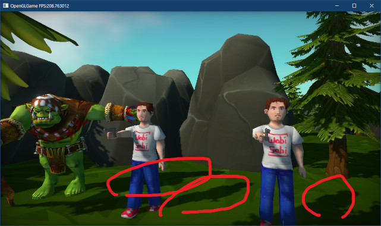
</p>

### 2.4 OpenGLエラーに対処する

影は表示されたものの、Visual Studioの出力ウィンドウを見てみると大量のエラーメッセージが表示されています。

このエラーは、`shadow_skeletal`シェーダはカラーやエミッション用のユニフォーム変数を持たないのに、`standard`シェーダと同じように設定して描画しようとしたことが原因です。

忘れているかもしれませんが、以前作成したスタティックメッシュ用の`Draw`関数では、カラー用のユニフォーム変数を持つシェーダかどうかを調べて設定を切り替えていました。

そこで、同じ方法でカラーの有無を切り替えましょう。今回は`ProgramObject`クラスにも参加してもらいます。`ProgramObject.h`を開き、次のプログラムを追加してください。

```diff
  // 管理番号を取得
  operator GLuint() const { return prog; }
+
+  // ロケーション番号を取得
+  GLint ColorLocation() const { return locColor; }

 private:
   GLuint vs = 0;          // 頂点シェーダ
   GLuint fs = 0;          // フラグメントシェーダ
   GLuint prog = 0;        // プログラムオブジェクト
   std::string filenameFS; // フラグメントシェーダファイル名
   std::string filenameVS; // 頂点シェーダファイル名
+  GLint locColor = -1;
 };
```

次に`ProgramObject.cpp`を開き、`ProgramObject`コンストラクタの定義に次のプログラムを追加してください。

```diff
     LOG_ERROR("シェーダのリンクに失敗(vs=%s, fs=%s)", filenameVS, filenameFS);
     return;
   }
+
+  // ロケーション番号を取得
+  locColor = glGetUniformLocation(prog, "color");

   LOG("シェーダを作成(vs=%s, fs=%s)", filenameVS, filenameFS);
 }
```

`glGetUniformLocation`関数は文字列の比較を行うため、処理に時間がかかります。コンストラクタで1度だけ呼び出すことで、描画のたびに文字列比較をしなくて済むので高速化が期待できます。

これで、`color`ユニフォーム変数の有無を取得できるようになりました。

次に、`SkeletalMeshRenderer`コンポーネントを`ProgramObject`に対応させます。`SkeletalMeshRenderer.h`を開き、`ProgramObject`クラスの先行宣言を追加してください。

```diff
 #include <vector>
 #include <memory>

 class GameObject;
+class ProgramObject;

 /**
 * 関節の座標変換パラメータ
```

それから、`Draw`メンバ関数の宣言を次のように変更してください。

```diff
   * @param bindigPoint SSBOのバインディングポイント
   */
   void Draw(const GameObject& gameObject,
-    GLuint program, GLuint ssbo, GLuint bindingPoint);
+    const ProgramObject& program, GLuint ssbo, GLuint bindingPoint);

 private:
   void Calc(int i, mat4* m);
```

`Draw`メンバ関数の定義に次のプログラムを追加してください。

続いて`SkeletalMeshRenderer.cpp`を開き、`ProgramObject.h`をインクルードしてください。

```diff
 * @file SkeletalMeshRenderer.cpp
 */
 #include "SkeletalMeshRenderer.h"
+#include "ProgramObject.h"
 #include "GameObject.h"
 #include "Engine.h"
```

次に、`Draw`メンバ関数の定義を次のように変更してください。

```diff
 * スケルタルメッシュを描画
 */
 void SkeletalMeshRenderer::Draw(const GameObject& gameObject,
-  GLuint program, GLuint ssbo, GLuint bindingPoint)
+  const ProgramObject& program, GLuint ssbo, GLuint bindingPoint)
 {
   const size_t jointCount = skeletalMesh->joints.size();
```

さらに、`Draw`メンバ関数の定義に次のプログラムを追加してください。

```diff
   if (!gameObject.materials.empty()) {
     materials = &gameObject.materials;
   }

+  if (program.ColorLocation() >= 0) {
     ::Draw(skeletalMesh->drawParamsList, program, *materials, &gameObject.color);
+  } else {
+    ::Draw(skeletalMesh->drawParamsList, program, *materials, nullptr);
+  }
 }
```

これで、`Draw`メンバ関数は、必要なときだけカラーを設定するようになりました。プログラムが書けたらビルドして実行してください。出力ウィンドウにエラーメッセージが表示されなくなっていたら成功です。

>**【2章のまとめ】**
>
>* カッコを利用して式の計算順を指定すると、計算量を減らせる場合がある。
>* SSBOは一度OpenGLコンテキストに割り当てれば、全てのシェーダから利用できるようになる。これはSSBOが「バッファオブジェクト」だから。個々のシェーダにコピーが必要なユニフォーム変数とは挙動が異なる。
>* 処理の遅い関数は、事前に一度だけ呼び出して結果を覚えておくことで、プログラムを高速化できる場合がある。

<div style="page-break-after: always"></div>

## 3. ポスト・エフェクト

### 3.1 3D描画用のFBOを作成する

FBOはデプスシャドウマッピングだけでなく、さまざまな画像効果に利用されます。FBOによる画像の加工は次の手順で行います。

>1. 3Dモデルを描画先するためのFBOを作成。
>2. 描画先をFBOに変更。
>3. 3DモデルをFBOに描画。
>4. 描画先をデフォルトフレームバッファに戻す。
>5. FBOをテクスチャとしてOpenGLコンテキストに割り当てる。
>6. シェーダでテクスチャを加工し、デフォルトフレームバッファに描画。

画像の加工には、考えられる限りのあらゆる方法が利用できます。画像を明るくしたり暗くしたり、白黒やセピア色にしたり、ぼかしたり、色数を減らしてポスターのようにしたり、画面の一部だけ色を変えたり、あらゆることが可能です。

画像にどんな加工を行うにしても、まずFBOを作成して描画できるようにしないと始まりません。
`Engine.h`を開き、3Dモデルを描画するためのFBOメンバ変数を追加してください。

```diff
   ProgramObjectPtr progShadow; // 影テクスチャ作成シェーダ
   ProgramObjectPtr progSkeletal; // ライト付きスケルタルメッシュシェーダ
   ProgramObjectPtr progShadowSkeletal;// スケルタルメッシュ用の影テクスチャ作成シェーダ

+  FramebufferObjectPtr fboMain;   // 3D描画用FBO
   FramebufferObjectPtr fboShadow; // デプスシャドウ用FBO
   MeshBufferPtr meshBuffer;   // 図形データ管理オブジェクト
```

ここではひとつのFBOしか追加していませんが、あとでもう少しFBOを追加する予定です。<br>
そこで、FBOをまとめて作成するための関数を定義します。

関数名は`CreateMainFBO`(クリエイト・メイン・エフビーオー)とします。`Engine`クラスの定義にある`Initialize`メンバ関数の宣言の下に、次のプログラムを追加してください。

```diff
   using WorldColliderList = std::vector<WorldCollider>;
   void ApplyPenetration(WorldColliderList*, GameObject*, const vec3&);

   int Initialize();
+  void CreateMainFBO(int width, int height);
   void Update();
   void Render();
```

次に`Engine.cpp`を開き、`Initialize`メンバ関数の定義に`CreateMainFBO`関数呼び出しを追加してください。

```diff
   glProgramUniform1f(*progShadow, locAlphaCutoff, 0.5f); // カットオフ値を設定しておく
   glProgramUniform1f(*progShadowSkeletal, locAlphaCutoff, 0.5f);

   // FBOを作成
+  CreateMainFBO(1920, 1080);
   auto texShadow = std::make_shared<TexHelper>(
     "FBO(depth)", 2048, 2048, GL_DEPTH_COMPONENT32);
```

3D描画用FBOの大きさは、とりあえず1920x1080ドットとしました。

続いて`CreateMainFBO`メンバ関数を定義します。`Initialize`メンバ関数の定義の下に、次のプログラムを追加してください。

```diff
   camera.position = { 3, 1, 3 };
   camera.rotation.y = 3.14159265f;

   return 0; // 正常に初期化された
 }
+
+/**
+* FBOを作成する
+*
+* @param width  メインFBOの幅(ピクセル単位)
+* @param height メインFBOの高さ(ピクセル単位)
+*/
+void Engine::CreateMainFBO(int width, int height)
+{
+  // 以前のFBOを削除
+  fboMain.reset();
+
+  // 新しいFBOを作成
+  auto texMainColor = std::make_shared<TexHelper>(
+    "FBO(main color)", width, height, GL_RGBA16F);
+  auto texMainDepth = std::make_shared<TexHelper>(
+    "FBO(main depth)", width, height, GL_DEPTH_COMPONENT32);
+  fboMain = std::make_shared<FramebufferObject>(texMainColor, texMainDepth);
+}

 /**
 * ゲームエンジンの状態を更新する
```

3D描画用のFBOではカラーテクスチャと深度テクスチャの両方を作成します。カラーテクスチャのピクセル形式には`GL_RGBA16F`(ジーエル・アールジービーエー・じゅうろく・エフ)を使うことにしました。

このピクセル形式は4つの色要素それぞれを16ビット浮動小数点数で表現します。合計すると64ビットになります(デフォルトフレームバッファは32ビットの`GL_RGBA8`と決まっています)。

ビット数が増えたことで色の表現力が向上し、さらに浮動小数点数になったことで小数点以下の微細な色の変化も扱えます。ビット数が増えたぶん読み書きが少し遅くなりますが、2023年現在のGPUにとっては許容範囲です。

### 3.2 描画の処理順を見直す

現在、`Render`メンバ関数の処理順は次のようになっています。

| 処理順 | 処理内容 |
|:-:|:--|
| 1 | デフォルトフレームバッファをクリア |
| 2 | 3D描画用のカメラパラメータをGPUメモリにコピー |
| 3 | OpenGLコンテキストの描画パラメータを設定 |
| 4 | ライトデータをGPUメモリにコピー |
| 5 | ゲームオブジェクトをレンダーキュー順にソート |
| 6 | シャドウマップを作成 |
| 7 | 描画先をデフォルトフレームバッファに戻す |
| 8 | 3D描画 |
| ... | ... |

改めて処理順を見直してみると、「デフォルトフレームバッファへの描画」に関わる処理が、
`1`～`4`と`7`以降に分かれしまっていることに気が付きます。これらは連続した順序にまとめられるはずです。となると、途中の`5`と`6`の処理順を考え直す必要があります。

シャドウマップはデフォルトフレームバッファへの描画に必要なので、`6`の「シャドウマップを作成」は「デフォルトフレームバッファへの描画より前」に終わらせなくてはなりません。

そして、`5`の「ゲームオブジェクトをレンダーキュー順にソート」は、3D描画とシャドウマップの両方で必要なので、最初に実行するべきです。これらの事項を考慮した処理順は次のようになります。

| 処理順(元の処理順) | 処理内容 |
|:-:|:--|
| 1(5) | ゲームオブジェクトをレンダーキュー順にソート |
| 2(6) | シャドウマップを作成 |
| 3(7) | 描画先をデフォルトフレームバッファに戻す |
| 4(1) | デフォルトフレームバッファをクリア |
| 5(2) | 3D描画用のカメラパラメータをGPUメモリにコピー |
| 6(3) | OpenGLコンテキストの描画パラメータを設定 |
| 7(4) | ライトデータをGPUメモリにコピー |
| 8(8) | 3D描画 |
| ... | ... |

こうしてみると、`5`～`7`を関数の先頭に移動させるだけでよさそうです。<br>
それでは、`Render`メンバ関数の定義から以下の範囲を切り取ってください。

```diff
   glEnable(GL_BLEND);
   glBlendFunc(GL_SRC_ALPHA, GL_ONE_MINUS_SRC_ALPHA);
   glBlendEquation(GL_FUNC_ADD);

   UpdateShaderLight();

-  // ゲームオブジェクトをレンダーキュー順に並べ替える
-  std::stable_sort(gameObjects.begin(), gameObjects.end(),
-    [](const GameObjectPtr& a, const GameObjectPtr& b) {
-      return a->renderQueue < b->renderQueue; });
-
-  // transparentキューの先頭を検索
-  const auto transparentBegin = std::lower_bound(
-    gameObjects.begin(), gameObjects.end(), RenderQueue_transparent,
-    [](const GameObjectPtr& e, int value) { return e->renderQueue < value; });
-
-  // overlayキューの先頭を検索
-  const auto overlayBegin = std::lower_bound(
-    transparentBegin, gameObjects.end(), RenderQueue_overlay,
-    [](const GameObjectPtr& e, int value) { return e->renderQueue < value; });
-
-  // デプスシャドウマップを作成
-  CreateShadowMap(gameObjects.begin(), transparentBegin);
-
-  // 描画先をデフォルトフレームバッファに戻す
-  glBindFramebuffer(GL_FRAMEBUFFER, 0);
-  glViewport(0, 0, fbWidth, fbHeight);
   glUseProgram(*prog3D);

   // transparent以前のキューを描画
   glProgramUniform1f(*prog3D, locAlphaCutoff, 0.5f);
```

そして、切り取ったプログラムを`Render`メンバ関数の先頭に貼り付けてください。

```diff
 * ゲームエンジンの状態を描画する
 */
 void Engine::Render()
 {
+  // ゲームオブジェクトをレンダーキュー順に並べ替える
+  std::stable_sort(gameObjects.begin(), gameObjects.end(),
+    [](const GameObjectPtr& a, const GameObjectPtr& b) {
+      return a->renderQueue < b->renderQueue; });
+
+  // transparentキューの先頭を検索
+  const auto transparentBegin = std::lower_bound(
+    gameObjects.begin(), gameObjects.end(), RenderQueue_transparent,
+    [](const GameObjectPtr& e, int value) { return e->renderQueue < value; });
+
+  // overlayキューの先頭を検索
+  const auto overlayBegin = std::lower_bound(
+    transparentBegin, gameObjects.end(), RenderQueue_overlay,
+    [](const GameObjectPtr& e, int value) { return e->renderQueue < value; });
+
+  // デプスシャドウマップを作成
+  CreateShadowMap(gameObjects.begin(), transparentBegin);
+
+  // 描画先をデフォルトフレームバッファに戻す
+  glBindFramebuffer(GL_FRAMEBUFFER, 0);
+  glViewport(0, 0, fbWidth, fbHeight);
   // バックバッファをクリア
   glClearColor(0.3f, 0.6f, 0.9f, 1.0f);
```

プログラムを移動したらビルドして実行してください。見たところ問題はなさそう...いえ、影が表示されていませんね。

<p align="center">
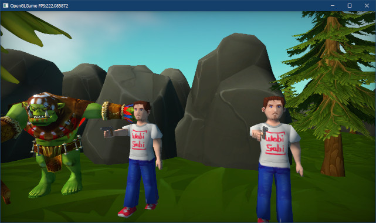<br>
[影がなくなっている]
</p>

### 3.3 影が表示されない問題に対処する

いきなり答えを言ってしまうと、影が表示されない原因は「深度テストが有効になっていない」からです。処理順を変更したことで、`glEnable(GL_DEPTH_TEST)`がシャドウマップの描画より後になってしまったわけです。

シャドウマップを描画するときは常に深度テストを有効にしたいので、`CreateShadowMap`メンバ関数で深度テストを有効にします。`CreateShadowMap`メンバ関数の定義に次のプログラムを追加してください。

```diff
   glBindFramebuffer(GL_FRAMEBUFFER, *fboShadow);
   const auto& texShadow = fboShadow->GetDepthTexture();
   glViewport(0, 0, texShadow->GetWidth(), texShadow->GetHeight());
+
+  glEnable(GL_DEPTH_TEST); // 深度テストを有効化
+  glDisable(GL_BLEND);     // 半透明合成を無効化

   // 深度バッファをクリア
   glClear(GL_DEPTH_BUFFER_BIT);
```

深度テストを有効にする以外に、半透明合成を無効化しています。理由は、シャドウマップの作成ではカラーを描画しないので、半透明合成を有効にしても無意味だからです。

>GPUやドライバによっては、使わない機能を有効にしたままにしておくと、余分な処理が行われて実行速度が低下するおそれがあります。

プログラムが書けたらビルドして実行してください。影が表示されていたら成功です。

<p align="center">

</p>

### 3.4 描画先を3D描画用FBOに変更する

それでは、描画先を3D描画用FBOに変更しましょう。描画先をデフォルトフレームバッファに戻すプログラムを次のように変更してください。

```diff
   // デプスシャドウマップを作成
   CreateShadowMap(gameObjects.begin(), transparentBegin);

-  // 描画先をデフォルトフレームバッファに戻す
-  glBindFramebuffer(GL_FRAMEBUFFER, 0);
-  glViewport(0, 0, fbWidth, fbHeight);
+  // 描画先を3D描画用FBOに変更
+  glBindFramebuffer(GL_FRAMEBUFFER, *fboMain);
+  glViewport(0, 0, fboMain->GetWidth(), fboMain->GetHeight());
+
   // バックバッファをクリア
   glClearColor(0.3f, 0.6f, 0.9f, 1.0f);
   glClear(GL_COLOR_BUFFER_BIT | GL_DEPTH_BUFFER_BIT);
```

このあと、どこかのタイミングで描画先をデフォルトフレームバッファに戻さなくてはなりません。ほとんどの画像処理では、加工したいのは3D描画された画像だけで、UIは加工しません。

UIは`overlay`キューで描画しているので、その直前にデフォルトフレームバッファへ戻すのが良さそうです。`overlay`キューを描画するプログラムの手前に、描画先をデフォルトフレームバッファに戻すプログラムを追加してください。

```diff
   // transparentからoverlayまでのキューを描画
   glDepthMask(GL_FALSE); // 深度バッファへの書き込みを禁止
   DrawGameObject(*prog3D, transparentBegin, overlayBegin);
   glDepthMask(GL_TRUE); // 深度バッファへの書き込みを許可
+
+  // 描画先をデフォルトフレームバッファに戻す
+  glBindFramebuffer(GL_FRAMEBUFFER, 0);
+  glViewport(0, 0, fbWidth, fbHeight);

   // overlay以降のキューを描画
   glDisable(GL_DEPTH_TEST); // 深度テストを無効化
   glUseProgram(*progUnlit);
```

この時点では、デフォルトフレームバッファには何も書き込まれていません。3Dモデルの描画は`fboMain`に対して行われているからです。

実際に画面に表示されるのはデフォルトフレームバッファになるので、`fboMain`に描画された画像をデフォルトフレームバッファにも書き込む必要があります。このとき、ただコピーするだけでなく、さまざまな画像処理を行うことができます。

そのために、画像処理用のシェーダを作成します。このシェーダは、`plane_xy`モデルに
`fboMain`のテクスチャを貼り付け、適当に加工して出力するものになります。

`plane_xy`モデルはサイズが±1の正方形なので、座標を変換しないで出力すると、ちょうどビューポート全体を覆うことができます。そのため、頂点シェーダではほとんど何もする必要がありません。

とてもシンプルな頂点シェーダなので、名前は`simple.vert`とします。プロジェクトの`Res`
フォルダに`simple.vert`という名前の頂点シェーダを作成してください。作成したファイルを開き、次のプログラムを追加してください。

```diff
+/**
+* @file simple.vert
+*/
+#version 450
+
+// シェーダへの入力
+layout(location=0) in vec3 inPosition; // 頂点座標
+layout(location=1) in vec2 inTexcoord; // テクスチャ座標
+
+// シェーダからの出力
+layout(location=1) out vec2 outTexcoord; // テクスチャ座標
+
+// エントリーポイント
+void main()
+{
+  outTexcoord = inTexcoord;
+  gl_Position = vec4(inPosition, 1);
+}
```

次に画像処理を行うフラグメントシェーダを作成します。画像処理は`Image Processing`(イメージ・プロセッシング)というので、ファイル名は`image_processing.frag`とします。

今回は比較的簡単な処理として、色変換行列を使用して画像をグレーやセピア色にしてみます。プロジェクトの`Res`フォルダに`image_processing.frag`という名前のファイルを追加してください。追加したファイルを開き、次のプログラムを追加してください。

```diff
+/**
+* @file image_processing.frag
+*/
+#version 450
+
+layout(location=1) in vec2 inTexcoord;
+
+out vec4 outColor;
+
+layout(binding=0) uniform sampler2D texColor;
+
+// プログラムからの入力
+layout(location=200) uniform mat3 colorMatrix;
+
+// エントリーポイント
+void main()
+{
+  outColor = texture(texColor, inTexcoord);
+
+  // 色変換行列で色を変える
+  outColor.rgb = colorMatrix * outColor.rgb;
+
+  // ガンマ補正を行う
+  outColor.rgb = pow(c.rgb, vec3(1 / 2.2));
+}
```

色変換行列のロケーション番号は、頂点シェーダやフラグメントシェーダと重複しないように
`200`としました。

続いて、画像処理シェーダのための変数を追加します。まずロケーション番号を定義しましょう。`Engine.h`を開き、色変換行列用にロケーション番号の定義を追加してください。

```diff
 constexpr GLint locLightPositionAndRadius =
   locLightColorAndFalloffAngle + maxShaderLightCount;
 constexpr GLint locLightDirectionAndConeAngle =
   locLightColorAndFalloffAngle + maxShaderLightCount * 2;
+
+// 画像処理シェーダ用のロケーション番号
+constexpr GLint locColorMatrix = 200;

 // ライト
 struct LightData
```

次に、`Engine`クラスの定義に、画像処理シェーダ用の`ProgramObjectPtr`型メンバ変数を追加してください。変数名は`progImageProcessing`(プログ・イメージ・プロセッシング、「画像処理プログラム」という意味)とします。

```diff
   ProgramObjectPtr progShadow; // 影テクスチャ作成シェーダ
   ProgramObjectPtr progSkeletal; // スケルタルメッシュのライト付きシェーダ
   ProgramObjectPtr progShadowSkeletal;// スケルタルメッシュ用の影テクスチャ作成シェーダ
+
+  ProgramObjectPtr progImageProcessing;// 画像処理シェーダ
+  mat3 colorMatrix = mat3(1); // 画像処理で使う色変換行列

   FramebufferObjectPtr fboMain;   // 3D描画用FBO
   FramebufferObjectPtr fboShadow; // デプスシャドウ用FBO
```

追加した変数に画像処理シェーダを読み込みましょう。`Engine.cpp`を開き、
`Initialize`メンバ関数の定義に次のプログラムを追加してください。

```diff
   progSkeletal = std::make_shared<ProgramObject>(
     "Res/skeletal.vert", "Res/standard.frag");
   progShadowSkeletal = std::make_shared<ProgramObject>(
     "Res/shadow_skeletal.vert", "Res/shadow.frag");
+  progImageProcessing = std::make_shared<ProgramObject>(
+    "Res/simple.vert", "Res/image_processing.frag");

   glProgramUniform1f(*progShadow, locAlphaCutoff, 0.5f); // カットオフ値を設定しておく
   glProgramUniform1f(*progShadowSkeletal, locAlphaCutoff, 0.5f);
```

これで、画像処理シェーダが使えるようになりました。それでは、`fboMain`のカラーテクスチャをデフォルトフレームバッファに書き込みましょう。

それなりの長さのプログラムになるので、関数として定義します。関数名は
`DrawMainImageToDefaultFramebuffer`(ドロー・メイン・イメージ・トゥ・デフォルト・フレームバッファ、「メイン画像をデフォルトフレームバッファに描画」という意味)とします。

`Engine.h`を開き、`Engine`クラスの定義にメンバ関数宣言を追加してください。

```diff
   void CreateShadowMap(
     GameObjectList::iterator begin,
     GameObjectList::iterator end);
+  void DrawMainImageToDefaultFramebuffer();

   GLFWwindow* window = nullptr; // ウィンドウオブジェクト
   const std::string title = "OpenGLGame"; // ウィンドウタイトル
```

次に`Engine.cpp`を開き、`Render`メンバ関数の定義に次のプログラムを追加してください。

```diff
   // 描画先をデフォルトフレームバッファに戻す
   glBindFramebuffer(GL_FRAMEBUFFER, 0);
   glViewport(0, 0, fbWidth, fbHeight);
+
+  // 3D描画の結果を画像処理してデフォルトフレームバッファに書き込む
+  DrawMainImageToDefaultFramebuffer();

   // overlay以降のキューを描画
   glDisable(GL_DEPTH_TEST); // 深度テストを無効化
```

続いて`DrawMainImageToDefaultFramebuffer`メンバ関数を定義します。
`CreateShadowMap`メンバ関数の定義の下に、次のプログラムを追加してください。


```diff
   // 法線方向の補正値を設定
   glProgramUniform1f(*prog3D, locShadowNormalOffset, texelSize);
   glProgramUniform1f(*progSkeletal, locShadowNormalOffset, texelSize);
 }
+
+/**
+* 3D描画の結果を画像処理してデフォルトフレームバッファに書き込む
+*/
+void Engine::DrawMainImageToDefaultFramebuffer()
+{
+  // フレームバッファの内容を消去
+  glClear(GL_COLOR_BUFFER_BIT | GL_DEPTH_BUFFER_BIT);
+
+  glDisable(GL_DEPTH_TEST); // 深度テストを無効化
+  glDisable(GL_BLEND); // 半透明合成を無効化
+
+  glUseProgram(*progImageProcessing);
+  glBindVertexArray(*meshBuffer->GetVAO());
+
+  // OpenGLコンテキストにテクスチャを設定
+  const GLuint tex[] = { *fboMain->GetColorTexture() };
+  glBindTextures(0, GLsizei(std::size(tex)), tex);
+
+  // 色変換行列をGPUメモリにコピー
+  glProgramUniformMatrix3fv(*progImageProcessing,
+    locColorMatrix, 1, GL_FALSE, &colorMatrix[0].x);
+
+  // 画面全体に四角形を描画
+  const auto& drawParams =
+    meshBuffer->GetStaticMesh("plane_xy")->drawParamsList[0];
+  glDrawElementsBaseVertex(drawParams.mode, drawParams.count,
+    GL_UNSIGNED_SHORT, drawParams.indices, drawParams.baseVertex);
+
+  glEnable(GL_BLEND); // 半透明合成を有効化
+}
```

プログラムが書けたらビルドして実行してください。ゲームを開始したとき、これまでどおりのゲーム画面が表示されていたら成功・・・なのですが、なんだか以前よりも明るいというか、色がくすんでいるように見えませんか？

<p align="center">
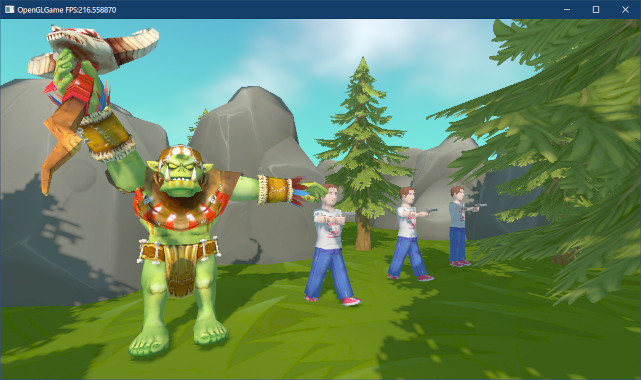
</p>

色がくすんでしまう原因は、`standard`シェーダと`image_processing`シェーダの両方でガンマ補正を行っているためです。どちらかのガンマ補正を削除しなくてはなりません。

画像処理を行うにはガンマ補正が解除されている方が都合がいいです。そこで、`standard`シェーダのガンマ補正を削除することにします。`standard.frag`を開き、ガンマ補正を行うプログラムを削除してください。

```diff
   // 発光色を反映
   if (emission.w > 0) {
     outColor.rgb += texture(texEmission, inTexcoord).rgb * emission.rgb;
   } else {
     outColor.rgb += emission.rgb;
   }
-
-  // ガンマ補正を行う
-  outColor.rgb = pow(outColor.rgb, vec3(1 / 2.2));
+  // ガンマ補正はimage_processing.fragで行うので、ここでは実行しない。
 }
```

ガンマ補正がない理由を説明するコメントを追加したのは、あとでバグと間違えることを防ぐためです。`main`関数の先頭でガンマ補正を解除しているので、普通に考えるとこのファイルのどこかで再びガンマ補正を行うべきだからです。

それなのにガンマ補正をやっていないわけで、説明がないとバグと間違えてしまうのも仕方ありません。コメントは、こうした誤読を防ぐためにも使えるのです。

プログラムが書けたらビルドして実行してください。色のくすみがなくなり、以前と同じ明るさで表示されていたら成功です。

<p align="center">
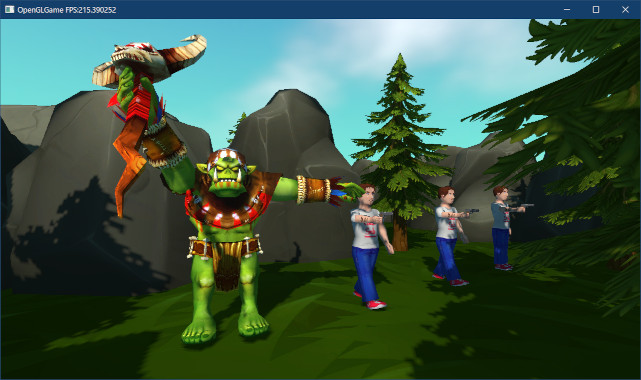
</p>

### 3.5 色変換行列

画像処理の例として、グレースケール(白黒)画像に変換するようないろ変換行列を設定してみましょう。`Engine.cpp`を開き、`DrawMainImageToDefaultFramebuffer`メンバ関数の定義に、次のプログラムを追加してください。

```diff
   // OpenGLコンテキストにテクスチャを設定
   const GLuint tex[] = { *fboMain->GetColorTexture() };
   glBindTextures(0, GLsizei(std::size(tex)), tex);
+
+  // グレースケールにする色変換行列を設定
+  colorMatrix = {
+    { 0.2126f, 0.2126f, 0.2126f },
+    { 0.7152f, 0.7152f, 0.7152f },
+    { 0.0722f, 0.0722f, 0.0722f }
+  };

   // 色変換行列をGPUメモリにコピー
   glProgramUniformMatrix3fv(*progImageProcessing,
     locColorMatrix, 1, GL_FALSE, &colorMatrix[0].x);
```

この行列は「赤=21.26%、緑=71.52%、青=7.22%」で混ぜ合わせるようになっています。RGB全てが同じ設定なので白黒画像になるわけです。

プログラムが書けたらビルドして実行してください。タイトル画面はUIなのでいつも通りですが、ゲームを開始すると白黒画像に変化していたら成功です。

<p align="center">
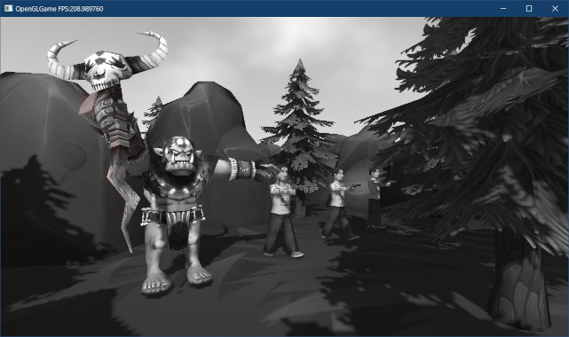
</p>

色変換行列を変更することで、さまざまな結果を生み出せます。今度はセピア調にしてみましょう。グレースケールにする色変換行列の下に、次のプログラムを追加してください。

```diff
     { 0.2126f, 0.2126f, 0.2126f },
     { 0.7152f, 0.7152f, 0.7152f },
     { 0.0722f, 0.0722f, 0.0722f }
   };
+
+  // セピア調にする色変換行列を設定
+  colorMatrix = {
+    { 0.346f, 0.278f, 0.196f },
+    { 0.678f, 0.546f, 0.385f },
+    { 0.151f, 0.124f, 0.089f },
+  };

   // 色変換行列をGPUメモリにコピー
   glProgramUniformMatrix3fv(*progImageProcessing,
     locColorMatrix, 1, GL_FALSE, &colorMatrix[0].x);
```

プログラムが書けたらビルドして実行してください。ゲームを開始したとき、茶色がかった灰色の画像に変換されていたら成功です。

<p align="center">
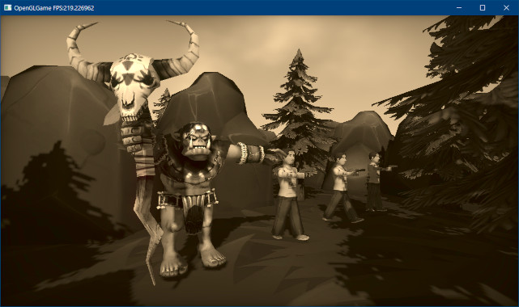
</p>

>セピア行列の値は、以下のサイトを参考にしました。<br>
>`https://qiita.com/yoya/items/9c237caf86ea5ade2617`

<pre class="tnmai_assignment">
<strong>【課題02】</strong>
<code>Engine</code>クラスに、色変換行列を選択するパブリックメンバ関数を追加しなさい。初期状態は「色変換しない」としなさい。
  案A: それぞれの色変換行列を設定する3つのメンバ関数を作成する。
  案B: 引数として色変換行列を受け取るメンバ関数を作成する。
  案C: 引数として色変換行列の種類を受け取るメンバ関数を作成する。
  ※もちろん、上記以外の案も考えられます。あなたはいくつ思いつきますか？　それぞれの案の利点と欠点はなんですか？
</pre>

### 3.6 放射状ブラー

次に、「放射状ブラー(ぼかし)効果」を追加します。まず「ブラーの中心」と「ブラーの強さ」を指定するユニフォーム変数を追加します。`image_processing.frag`を開き、次のプログラムを追加してください。

```diff
 // プログラムからの入力
 layout(location=200) uniform mat3 colorMatrix;
+
+// 放射状ブラーのパラメータ
+// xy=中心座標(NDC), z=長さ
+layout(location=201) uniform vec4 radialBlur;
 
 /**
 * エントリーポイント
```

ユニフォーム変数の名前は`radialBlur`(ラジアル・ブラー、「放射状ぼかし」という意味)としました。続いて、放射状ブラーをおこなプログラムを作成します。`main`関数の定義に次のプログラムを追加してください。

```diff
 void main()
 {
   vec4 c = texture(texColor, inTexcoord);
+
+  // 放射状ブラー
+  if (radialBlur.z > 0) {
+    // 中心へ向かうベクトルを計算
+    vec2 v = radialBlur.xy - inTexcoord;
+    v *= radialBlur.z; // ベクトルの長さを調節
+
+    // ベクトル方向のピクセルを複数サンプリングして画像をぼかす
+    c.rgb *= 1.0 / 8.0;
+    float ratio = 1.0 / 8.0;
+    for (float i = 1; i < 8; ++i) {
+      c.rgb += texture(texColor, inTexcoord + v * i).rgb * ratio;
+    }
+  } // if radialBlur.z

   // 色変換行列で色を変える
   c.rgb = colorMatrix * c.rgb;
```

放射状ブラー処理では、指定した座標へ向かうようにテクスチャを読み取ります。これによって、中心側にあるピクセルが、外側に向かって引き伸ばされたような表示になります。

上記のプログラムでは、徐々に中心に移動しながら7回テクスチャを読み取ります。`main`の先頭で1回読み取っているので、合わせて8回読み取ることになります。

それでは、ユニフォーム変数に値を設定して動作を確認しましょう。まずロケーション番号を表す変数を定義しましょう。名前は`locRadialBlur`(ロック・ラジアル・ブラー)とします。
`Engine.h`を開き、ロケーション番号の定義を追加してください。

```diff
 constexpr GLint locLightDirectionAndConeAngle =
   locLightColorAndFalloffAngle + maxShaderLightCount * 2;

 // 画像処理シェーダ用のロケーション番号
 constexpr GLint locColorMatrix = 200;
+constexpr GLint locRadialBlur = 201;

 // ライト
 struct LightData
```

次に、`Engine`クラスの定義に、放射状ブラーのパラメータを保持するメンバ変数を追加してください。

```diff
   ProgramObjectPtr progImageProcessing; // 画像処理シェーダ
   mat3 colorMatrix = mat3(1); // 画像処理で使う色変換マトリクス
+  vec2 radialBlurCenter = vec2(0.5f, 0.5f); // 放射状ブラーの中心
+  float radialBlurLength = 0.02f;           // 放射状ブラーの長さ

   FramebufferObjectPtr fboMain;   // 3D描画用FBO
   FramebufferObjectPtr fboShadow; // デプスシャドウ用FBO
```

続いて`Engine.cpp`を開き、`DrawMainImageToDefaultFramebuffer`メンバ関数の定義に次のプログラムを追加してください。

```diff
   // 色変換行列をGPUメモリにコピー
   glProgramUniformMatrix3fv(*progImageProcessing,
     locColorMatrix, 1, GL_FALSE, &colorMatrix[0].x);
+
+  // 放射状ブラーのパラメータをGPUメモリにコピー
+  glProgramUniform4f(*progImageProcessing, locRadialBlur,
+    radialBlurCenter.x, radialBlurCenter.y, radialBlurLength, 0);

   // 画面全体に四角形を描画
   const auto& drawParams =
```

プログラムが書けたらビルドして実行してください。画面の中心から拡大するように画像がボケていたら成功です。

<p align="center">
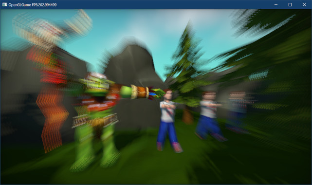
</p>

ところで、放射状ブラーの使いどころは、疾走感を出したり、画面の特定の場所に注意を向けさせたい場合です。これらの目的を考えると、中心から一定範囲はボケてほしくありません。

そこで、ブラーの開始距離を指定できるようにします。`image_processing.frag`を開き、
`radialBlur`ユニフォーム変数に次のコメントを追加してください。

```diff
 // プログラムからの入力
 layout(location=200) uniform mat3 colorMatrix;

 // 放射状ブラーのパラメータ
-// xy=中心座標(NDC), z=長さ
+// xy=中心座標(NDC), z=長さ, w=開始距離
 layout(location=201) uniform vec4 radialBlur;
 
 /**
 * エントリーポイント
```

開始距離になるまでブラーをかけないようにするには、「方向ベクトルの長さが開始距離以下」のときにベクトルの長さが0になるようにします。放射状ブラーを行うプログラムを次のように変更してください。

```diff
   if (radialBlur.z > 0) {
     // 中心へ向かうベクトルを計算
     vec2 v = radialBlur.xy - inTexcoord;
+
+    // ブラー開始距離以下の場合は方向ベクトルを0にする
+    float lenA = length(v);
+    float lenB = max(lenA - radialBlur.w, 0);
+    v *= lenB / lenA;
+
     v *= radialBlur.z; // ベクトルの長さを調節

     // ベクトル方向のピクセルを複数サンプリングして画像をぼかす
     c.rgb *= 1.0 / 8.0;
```

方向ベクトルの長さ`lenA`を求め、次に`lenA`を開始距離だけ短くした`lenB`を求めます。そして、方向ベクトルに「`lenA`に対する`lenB`の長さの比」を掛けることで、開始距離以下は長さ`0`、つまりブラーがかからないようにしています。

続いて開始距離を設定しましょう。`Engine.h`を開き、`Engine`クラスの定義に次のプログラムを追加してください。

```diff
   mat3 colorMatrix = mat3(1); // 画像処理で使う色変換マトリクス
   vec2 radialBlurCenter = vec2(0.5f, 0.5f); // 放射状ブラーの中心
   float radialBlurLength = 0.02f;           // 放射状ブラーの長さ
+  float radialBlurStart = 0.2f;             // 放射状ブラーの開始距離

   FramebufferObjectPtr fboMain;   // 3D描画用FBO
   FramebufferObjectPtr fboShadow; // デプスシャドウ用FBO
```

次に`Engine.cpp`を開き、`DrawMainImageToDefaultFramebuffer`メンバ関数の定義に次のプログラムを追加してください。

```diff
   glProgramUniformMatrix3fv(*progImageProcessing,
     locColorMatrix, 1, GL_FALSE, &colorMatrix[0].x);

   // 放射状ブラーのパラメータをGPUメモリにコピー
   glProgramUniform4f(*progImageProcessing, locRadialBlur,
-    radialBlurCenter.x, radialBlurCenter.y, radialBlurLength, 0);
+    radialBlurCenter.x, radialBlurCenter.y, radialBlurLength, radialBlurStart);

   // 画面全体に四角形を描画
   const auto& drawParams =
```

プログラムが書けたらビルドして実行してください。中央部分のボケがなくなって見やすくなっていたら成功です。

<p align="center">
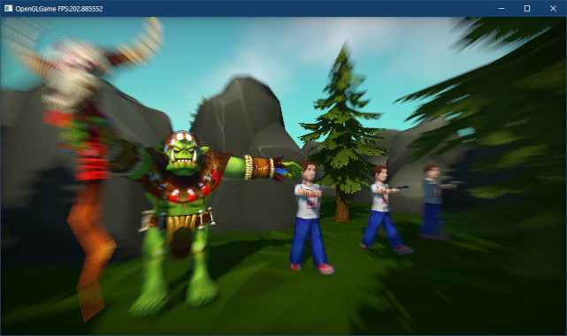
</p>

<pre class="tnmai_assignment">
<strong>【課題03】</strong>
放射状ブラーのパラメータを変更し、ブラーがかからないようにしなさい。
</pre>

<pre class="tnmai_assignment">
<strong>【課題04】</strong>
<code>Engine</code>クラスに、放射状ブラーのパラメータを設定するパブリックメンバ関数を追加しなさい。
  案A: 全てのパラメータを設定するメンバ関数をひとつだけ作成する。
  案B: ひとつのパラメータを設定するメンバ関数をパラメータの数だけ作成する。
</pre>

### 3.7 ブルームエフェクト

「ブルーム(`Bloom`)」は「(花を)咲かせる」という意味の単語です。そこから転じて、カメラで非常に明るい物体を写したとき、「明るい物体の周囲にまるで花が咲くように光が溢れ出す光学現象」を指すようになりました。

ブルームエフェクトは、カメラの光学現象を再現したエフェクトになります。ブルームエフェクトの手順は次のとおりです。

>1. 明るい領域を抽出
>2. 抽出した領域をぼかす
>3. 元の画像に加算合成

よりリアルなブルームを再現するには、手順2のぼかし処理において、とにかく大きくぼかす必要があります。放射状ブラーと同様に、これは周囲のテクスチャを何度も読み取って合成することで実現できます。

ただし、大きくぼかすにはテクスチャを大量の読み取る必要があります。例えばフレームバッファがが1920x1080だとしましょう。画面幅の10%に相当する半径でぼかそうとすると、1ピクセルぼかすたびに192x192回もテクスチャ読み取らなくてはなりません。

これは、2023年現在のGPUにとってもリアルタイムで実行するには厳しいものです。そこで、「縮小バッファ」という方法を使います。縮小バッファ技法では、名前のとおりフレームバッファの縮小コピーを作成します。

例えば、1920x1080を480x270に縮小コピーしたとします。縮小した画像の10%の半径でぼかす場合、48x48回の読み取りで済みます。これは縮小前の1/16の回数です。とはいえ、48x48回でもまだ多すぎるので、10%が3x3回くらいになるまで縮小コピーを繰り返します。

ただし、単に縮小してボカすだけでは、あまりきれいなボカしは得られません。そこで、縮小コピーを作るたびに少しずつボカし、全ての縮小コピーをさらにボカしながら拡大合成します。

手順は少し複雑になりますが、この「縮小コピー → 拡大合成」の方法を使うと、現実的な速度で非常に大きなぼかしを再現できます。

今回は、縮小コピーでは3x3相当のぼかしシェーダ、拡大合成では6x6相当のぼかしシェーダを使います。また、明るい領域を抽出するためのシェーダも必要です。

まず明るい領域を抽出するシェーダを作成しましょう。名前は`high_pass_filter`(ハイ・パス・フィルタ「高輝度部分を通す」という意味)とします。

プロジェクトの`Res`フォルダに、`high_pass_filter.frag`という名前のテキストファイルを追加してください。追加したファイルを開き、次のプログラムを追加してください。

```diff
+/**
+* @file high_pass_filter.frag
+*/
+#version 450
+
+// シェーダへの入力
+layout(location=1) in vec2 inTexcoord;
+
+// テクスチャ
+layout(binding=0) uniform sampler2D texColor;
+
+// プログラムからの入力
+// x: 高輝度とみなす明るさ(しきい値)
+// y: ブルームの強さ
+layout(location=202) uniform vec2 highPassFilter;
+
+// 出力する色データ
+out vec4 outColor;
+
+/**
+* 明るい成分を抽出する
+*/
+vec3 GetBrighterPart(in vec2 texcoord)
+{
+  // RGBのうちもっとも明るい成分をピクセルの明るさとする
+  vec3 color = texture(texColor, texcoord).rgb;
+  float brightness = max(color.r, max(color.g, color.b));
+
+  // 明るい成分の比率を計算
+  float ratio = max(brightness - hightPassFilter.x, 0) / max(brightness, 0.001);
+  return color * ratio; // 明るい成分を計算
+}
+
+/**
+* エントリーポイント
+*/
+void main()
+{
+  // テクセルサイズを計算
+  vec2 oneTexel = 1.0 / vec2(textureSize(texColor, 0));
+
+  // 明るい成分を計算し、4x4ピクセルの縮小処理を行う
+  outColor.rgb = GetBrighterPart(inTexcoord + vec2(-oneTexel.x, oneTexel.y));
+  outColor.rgb += GetBrighterPart(inTexcoord + vec2( oneTexel.x, oneTexel.y));
+  outColor.rgb += GetBrighterPart(inTexcoord + vec2(-oneTexel.x,-oneTexel.y));
+  outColor.rgb += GetBrighterPart(inTexcoord + vec2( oneTexel.x,-oneTexel.y));
+
+  // ブルームの強さを乗算
+  outColor.rgb *= (1.0 / 4.0) * hightPassFilter.y;
+  outColor.a = 1;
+}
```

このフラグメントシェーダは、実際には「明るい領域の抽出」と「画像の縮小」の両方を行います。縦横1/4(面積比1:16)に縮小することを想定して、4x4ピクセルの範囲を読み取っています。

テクスチャのフィルタモードが`LINEAR`(リニア)の場合、`texutre`関数は「指定された座標の周囲4ピクセルを読み取り、座標からの距離に応じた比率で合成した値」を返します。

そこで、2x2ピクセルの中心を指定すると4ピクセルの平均値を得ることができます。このシェーダでは4回の`texture`関数によって、4x4ピクセルの平均値を求めています。

<p align="center">
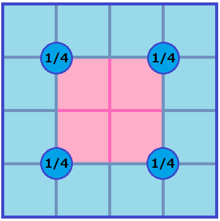<br>
[青はテクスチャのピクセル、ピンクはフレームバッファの1ピクセル]
</p>

`textureSize`(テクスチャ・サイズ)関数は、指定されたサンプラに割り当てられているテクスチャのピクセル数を返します。

今回の場合、`texColor`にはメインFBOのカラーテクスチャを割り当てる予定なので、サイズはx=1920, y=1080となるはずです。テクスチャ座標は0～1なので、1テクセル幅のテクスチャ座標は`1 / サイズ`で求められます。

「明るい成分を抽出する」処理は`GetBrighterPart`(ゲット・ブライター・パート、「より明るい部分を取得する」という意味)で行っています。

抽出の手順はコメントに書いてあるとおりです。それから、「明るい成分の比率を計算」するプログラムに現れる`0.001`は、ゼロ除算を回避することが目的です。

次に、縮小ぼかしシェーダを作成します。プロジェクトの`Res`フォルダに
`down_sampling.frag`(ダウン・サンプリング・フラグ)という名前のテキストファイルを追加してください。追加したファイルを開き、次のプログラムを追加してください。

```diff
+/**
+* @file down_sampling.frag
+*/
+#version 450
+
+// シェーダへの入力
+layout(location=1) in vec2 inTexcoord;
+
+// テクスチャ
+layout(binding=0) uniform sampler2D texColor;
+
+// 出力する色データ
+out vec4 outColor;
+
+// エントリーポイント
+void main()
+{
+  // 3x3の縮小ぼかし処理を行う
+  vec2 texel = 1.0 / vec2(textureSize(texColor, 0)); // テクセルサイズを計算
+  outColor = texture(texColor, inTexcoord) * 4;
+  outColor += texture(texColor, inTexcoord + vec2(-texel.x, texel.y));
+  outColor += texture(texColor, inTexcoord + vec2( texel.x, texel.y));
+  outColor += texture(texColor, inTexcoord + vec2(-texel.x,-texel.y));
+  outColor += texture(texColor, inTexcoord + vec2( texel.x,-texel.y));
+  outColor *= 1.0 / 8.0; // 平均化
+}
```

縮小ぼかしシェーダでも、フラグメントの周囲4x4テクセルを読み込んで平均化します。ただし、中央の2x2テクセルを余分に1回読み取ることで、中央部分の重要度を高めています。この工夫があることで、より円形に近いなめらかなぼかしになります。

<p align="center">
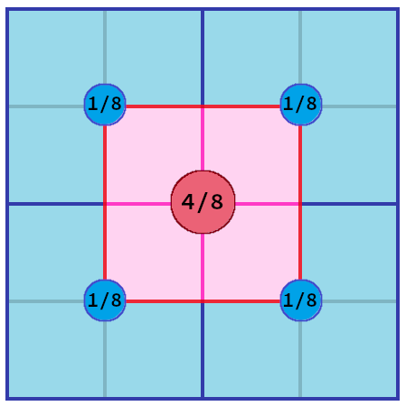
</p>

続いて、拡大ぼかしシェーダを作成します。プロジェクトの`Res`フォルダに
`up_sampling.frag`(アップ・サンプリング・フラグ)という名前のテキストファイルを追加してください。追加したファイルを開き、次のプログラムを追加してください。

```diff
+/**
+* @file up_sampling.frag
+*/
+#version 450
+
+// シェーダへの入力
+layout(location=1) in vec2 inTexcoord;
+
+// テクスチャ
+layout(binding=0) uniform sampler2D texColor;
+
+// 出力する色データ
+out vec4 outColor;
+
+// エントリーポイント
+void main()
+{
+  // 拡大ぼかし処理を行う
+  vec2 texel = 1.0 / vec2(textureSize(texColor, 0)); // テクセルサイズを計算
+  outColor = texture(texColor, inTexcoord) * 3;
+  outColor += texture(texColor, inTexcoord + vec2(-texel.x, texel.y)) * 2;
+  outColor += texture(texColor, inTexcoord + vec2( texel.x, texel.y)) * 2;
+  outColor += texture(texColor, inTexcoord + vec2( texel.x,-texel.y)) * 2;
+  outColor += texture(texColor, inTexcoord + vec2(-texel.x,-texel.y)) * 2;
+
+  outColor += texture(texColor, inTexcoord + vec2(-texel.x * 2, 0));
+  outColor += texture(texColor, inTexcoord + vec2( texel.x * 2, 0));
+  outColor += texture(texColor, inTexcoord + vec2( 0,-texel.y * 2));
+  outColor += texture(texColor, inTexcoord + vec2( 0, texel.y * 2));
+  outColor *= 1.0 / 15.0; // 平均化
+}
```

拡大ぼかしではテクスチャを9回読み取って、合計24個のテクセルの平均を計算します。読み取る範囲は次のようになります(フラグメントは中央の赤い読み取り点の真下にあります)。

<p align="center">
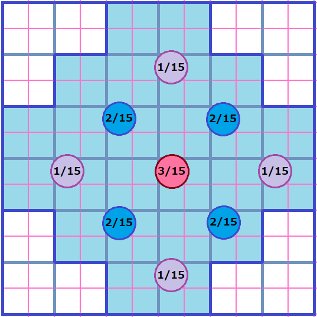<br>
[青線=テクスチャのピクセル(テクセル) 赤線=フレームバッファのピクセル]
</p>

拡大ぼかしシェーダが縮小ぼかしよりも多くのテクセルを読み取っているのは、解像度の低いテクスチャを拡大するほうが、画面のより広い範囲を読み取れる(大きくぼかせる)からです。

縮小と拡大でぼかしサイズを変えることで、ぼかし処理にかかる時間を抑えながら、より大きなぼかしを実現しています。

これで、ブルームエフェクト用のシェーダを準備できました。なお、頂点シェーダには全て
`simple.vert`を使用します。

続いて、シェーダファイルを読み込み、縮小コピーを書き込むためのFBOを作成します。
`Engine.h`を開き、`Engine`クラスの定義に次のプログラムを追加してください。

```diff
   ProgramObjectPtr progShadow; // 影テクスチャ作成シェーダ
   ProgramObjectPtr progSkeletal; // スケルタルメッシュのライト付きシェーダ
   ProgramObjectPtr progShadowSkeletal;// スケルタルメッシュ用の影テクスチャ作成シェーダ
+
+  // ブルームエフェクト
+  ProgramObjectPtr progHighPassFilter; // 明るい領域を抽出するシェーダ
+  ProgramObjectPtr progDownSampling;   // 縮小ぼかしシェーダ
+  ProgramObjectPtr progUpSampling;     // 拡大ぼかしシェーダ
+  float bloomThreshold = 1; // 明るいとみなす閾値
+  float bloomIntensity = 2; // ブルームの強さ

   ProgramObjectPtr progImageProcessing; // 画像処理シェーダ
   mat3 colorMatrix = mat3(1); // 画像処理で使う色変換マトリクス
   vec2 radialBlurCenter = vec2(0.5f, 0.5f); // 放射状ブラーの中心
   float radialBlurLength = 0.0f;            // 放射状ブラーの長さ
   float radialBlurStart = 0.2f;             // 放射状ブラーの開始距離

   FramebufferObjectPtr fboMain;   // 3D描画用FBO
+  std::vector<FramebufferObjectPtr> fboBloom; // ブルームエフェクト用FBO
   FramebufferObjectPtr fboShadow; // デプスシャドウ用FBO

   // 関節行列の配列の最大バイト数
   static constexpr size_t jointMatricesBytes = 1024 * 1024;
```

それでは、シェーダファイルを読み込んでプログラムオブジェクトを作成しましょう。
`Engine.cpp`を開き`Initialize`メンバ関数の定義に次のプログラムを追加してください。

```diff
   progSkeletal = std::make_shared<ProgramObject>(
     "Res/skeletal.vert", "Res/standard.frag");
   progShadowSkeletal = std::make_shared<ProgramObject>(
     "Res/shadow_skeletal.vert", "Res/shadow.frag");
+  progHighPassFilter = std::make_shared<ProgramObject>(
+    "Res/simple.vert", "Res/high_pass_filter.frag");
+  progDownSampling = std::make_shared<ProgramObject>(
+    "Res/simple.vert", "Res/down_sampling.frag");
+  progUpSampling = std::make_shared<ProgramObject>(
+    "Res/simple.vert", "Res/up_sampling.frag");
   progImageProcessing = std::make_shared<ProgramObject>(
     "Res/simple.vert", "Res/image_processing.frag");
```

それと、ブルーム用のFBOも作成しなくてはなりません。`CreateMainFBO`メンバ関数の定義に次のプログラムを追加してください。

```diff
   auto texMainDepth = std::make_shared<TexHelper>(
     "FBO(main depth)", width, height, GL_DEPTH_COMPONENT32);
   fboMain = std::make_shared<FramebufferObject>(texMainColor, texMainDepth);
+
+  // ブルーム用FBOを作成する
+  fboBloom.clear();
+  fboBloom.resize(6);
+  width /= 4; // 0番のブルーム用FBOは縦横1/4に縮小
+  height /= 4;
+  char name[] = "FBO(bloom[0])";
+  for (int i = 0; i < fboBloom.size(); ++i) {
+    name[10] = '0' + i;
+    auto texColor = std::make_shared<TexHelper>(name, width, height, GL_RGBA16F);
+    fboBloom[i] = std::make_shared<FramebufferObject>(texColor, nullptr);
+    width /= 2; // 1番以降のFBOは前段の縦横1/2に縮小
+    height /= 2;
+  } // for i
 }

 /**
 * ゲームエンジンの状態を更新する
```

今回は、ブルーム用に縮小されたFBOを全部で6個作成しています。インデックス0番のFBOのサイズはメインFBOの縦横`1/4`、2番目は縦横`1/8`、3番目は縦横`1/16`というように、解像度を前のFBOの半分にすることを繰り返します。

さて、ブルームエフェクトはFBOを何度も切り替えながら描画するので、多少長いプログラムになります。やはり、こういう場合は関数にするべきでしょう。関数名は`DrawBloomEffect`(ドロー・ブルーム・エフェクト)とします。

`Engine.h`を開き、`Engine`クラスの定義に次のプログラムを追加してください。

```diff
   void CreateShadowMap(
     GameObjectList::iterator begin,
     GameObjectList::iterator end);
+  void DrawBloomEffect();
   void DrawMainImageToDefaultFramebuffer();

   GLFWwindow* window = nullptr; // ウィンドウオブジェクト
```

それから、`hight_pass_filter`シェーダ用のロケーション番号を定義してください。

```diff
 // 画像処理シェーダ用のロケーション番号
 constexpr GLint locColorMatrix = 200;
 constexpr GLint locRadialBlur = 201;
+constexpr GLint locHighPassFilter = 202;

 // ライト
 struct LightData
```

次に`Engine.cpp`を開き、`Render`メンバ関数の定義に次のプログラムを追加してください。

```diff
   // transparentからoverlayまでのキューを描画
   glDepthMask(GL_FALSE); // 深度バッファへの書き込みを禁止
   DrawGameObject(*prog3D, transparentBegin, overlayBegin);
   glDepthMask(GL_TRUE); // 深度バッファへの書き込みを許可
+
+  // ブルームエフェクトを描画
+  DrawBloomEffect();

   // 描画先をデフォルトフレームバッファに戻す
   glBindFramebuffer(GL_FRAMEBUFFER, 0);
```

それでは、`DrawBloomEffect`メンバ関数を定義しましょう。`CreateShadowMap`メンバ関数の定義の下に、次のプログラムを追加してください。

```diff
   // 法線方向の補正値を設定
   glProgramUniform1f(*prog3D, locShadowNormalOffset, texelSize);
   glProgramUniform1f(*progSkeletal, locShadowNormalOffset, texelSize);
 }
+
+/**
+* ブルームエフェクトを描画する
+*/
+void Engine::DrawBloomEffect()
+{
+  // シェーダ共通の設定
+  const int bufferCount = static_cast<int>(fboBloom.size());
+  const auto& drawParams =
+    meshBuffer->GetStaticMesh("plane_xy")->drawParamsList[0];
+  glBindVertexArray(*meshBuffer->GetVAO());
+  glDisable(GL_DEPTH_TEST);
+
+  // 明るい成分を抽出
+
+  // 縮小ぼかし
+
+  // 拡大ぼかし
+
+  // メインFBOにブルームエフェクトを反映
+}

 /**
 * 3D描画の結果を画像処理してデフォルトフレームバッファに書き込む
```

最初に明るい成分を抽出します。これには`high_pass_filter`シェーダを使います。シェーダ共通の設定の下に、次のプログラムを追加してください。

```diff
   glBindVertexArray(*meshBuffer->GetVAO());
   glDisable(GL_DEPTH_TEST);

   // 明るい成分を抽出
+  glDisable(GL_BLEND);
+  glUseProgram(*progHighPassFilter);
+  glBindFramebuffer(GL_FRAMEBUFFER, *fboBloom[0]);
+  glViewport(0, 0, fboBloom[0]->GetWidth(), fboBloom[0]->GetHeight());
+  const GLuint tex0 = *fboMain->GetColorTexture();
+  glBindTextures(0, 1, &tex0);
+  glProgramUniform2f(*progHighPassFilter,
+    locHighPassFilter, bloomThreshold, bloomIntensity);
+  glDrawElementsBaseVertex(drawParams.mode, drawParams.count,
+    GL_UNSIGNED_SHORT, drawParams.indices, drawParams.baseVertex);

   // 縮小ぼかし
```

このプログラムによって、`fboMain`に描画された画像の明るい成分を持つピクセルが
`fboBloom[0]`に抽出されます。アルファブレンドは不要なため、無効化している点に注意してください。

次に、抽出した明るい成分をぼかしながら縮小します。これには`down_sampling`シェーダを使います。明るい成分を抽出するプログラムの下に、次のプログラムを追加してください。

```diff
   glDrawElementsBaseVertex(drawParams.mode, drawParams.count,
     GL_UNSIGNED_SHORT, drawParams.indices, drawParams.baseVertex);

   // 縮小ぼかし
+  glUseProgram(*progDownSampling);
+  for (int i = 1; i < bufferCount; ++i) {
+    glBindFramebuffer(GL_FRAMEBUFFER, *fboBloom[i]);
+    glViewport(0, 0, fboBloom[i]->GetWidth(), fboBloom[i]->GetHeight());
+    const GLuint tex = *fboBloom[i - 1]->GetColorTexture();
+    glBindTextures(0, 1, &tex);
+    glDrawElementsBaseVertex(drawParams.mode, drawParams.count,
+      GL_UNSIGNED_SHORT, drawParams.indices, drawParams.baseVertex);
+  }

   // 拡大ぼかし
```

「縮小ぼかし」では、for文によって画像を徐々に縮小していきます。

続いて、縮小した画像をぼかしながら拡大して、加算合成します。これには`up_sampling`<br>
シェーダを使います。縮小ぼかしプログラムの下に、次のプログラムを追加してください。

```diff
     glDrawElementsBaseVertex(drawParams.mode, drawParams.count,
       GL_UNSIGNED_SHORT, drawParams.indices, drawParams.baseVertex);
   }

   // 拡大ぼかし
+  glEnable(GL_BLEND); // 半透明合成を有効化
+  glBlendFunc(GL_ONE, GL_ONE); // 1:1の比率で加算合成
+  glUseProgram(*progUpSampling);
+  for (int i = bufferCount - 2; i >= 0; --i) {
+    glBindFramebuffer(GL_FRAMEBUFFER, *fboBloom[i]);
+    glViewport(0, 0, fboBloom[i]->GetWidth(), fboBloom[i]->GetHeight());
+    const GLuint tex = *fboBloom[i + 1]->GetColorTexture();
+    glBindTextures(0, 1, &tex);
+    glDrawElementsBaseVertex(drawParams.mode, drawParams.count,
+      GL_UNSIGNED_SHORT, drawParams.indices, drawParams.baseVertex);
+  }
+
   // メインFBOにブルームエフェクトを反映
```

最初に半透明合成を有効化している点に注意してください。縮小画像を徐々に拡大して加算合成すると、低い解像度の画像が徐々に円形に近づきます。この効果によって広範囲のぼかしが達成できます。

最後に、拡大ぼかしした画像をメインFBOに反映します。これには引き続き`up_sampling`シェーダを使いますが、合成のパラメータが異なります。拡大ぼかしプログラムの下に、次のプログラムを追加してください。

```diff
     glDrawElementsBaseVertex(drawParams.mode, drawParams.count,
       GL_UNSIGNED_SHORT, drawParams.indices, drawParams.baseVertex);
   }

   // メインFBOにブルームエフェクトを反映
+  glBlendFunc(GL_CONSTANT_COLOR, GL_ONE); // 定数:1の比率で加算合成
+  const float c = 1.0f / static_cast<float>(bufferCount); // 定数
+  glBlendColor(c, c, c, c); // 定数を設定
+  glBindFramebuffer(GL_FRAMEBUFFER, *fboMain);
+  glViewport(0, 0, fboMain->GetWidth(), fboMain->GetHeight());
+  const GLuint tex1 = *fboBloom[0]->GetColorTexture();
+  glBindTextures(0, 1, &tex1);
+  glDrawElementsBaseVertex(drawParams.mode, drawParams.count,
+    GL_UNSIGNED_SHORT, drawParams.indices, drawParams.baseVertex);
+
+  // ブレンド式を元に戻す
+  glBlendFunc(GL_SRC_ALPHA, GL_ONE_MINUS_SRC_ALPHA);
 }

 /**
 * 3D描画の結果を画像処理してデフォルトフレームバッファに書き込む
```

合成方法に指定する`GL_CONSTANT_COLOR`(ジーエル・コンスタント・カラー)は、`glBlendColor`関数で指定した「定数」を使うように設定します。

<p><code class="tnmai_code"><strong>【書式】</strong><br>
void glBlendColor(赤の定数, 緑の定数, 青の定数、アルファの定数);
</code></p>

定数として指定できるのは`0.0`～`1.0`の範囲です。もし`0.0`未満を指定すると`0.0`が設定されます。`1.0`以上を指定すると`1.0`が設定されます。

上記のプログラムでは、加算合成の際にフラグメントカラーに`1 / fboBloomの枚数`を掛けるように設定しています。

拡大ぼかし処理ではすべての画像が1:1で加算合成されるので、明るさが「`fboBloom`の枚数」倍になっています。普通に加算合成すると明るすぎるため、`1 / fboBloomの枚数`を掛けることで明るさを1倍に戻しています。
 
 ### 3.8 炎を表示する

現在のブルームの設定では、かなり明るい領域でないとブルームの効果が分かりません。そこで、赤く輝く炎を表示することにします。仕組みは簡単で、大量の炎っぽい形のテクスチャをビルボードで表示するだけです。

<pre class="tnmai_assignment">
<strong>【課題05】</strong>
以下のURLから<code>particle_fire.tga</code>というTGAファイルをダウンロードし、プロジェクトの<code>Res</code>フォルダに保存しなさい。
<code>https://github.com/tn-mai/OpenGL3D2023/tree/main/res</code>
</pre>

プロジェクトの`Src`フォルダに`FireEmitter.h`(ファイア・エミッター・エイチ)という名前のヘッダファイルを追加してください。追加したファイルを開き、次のプログラムを追加してください。

```diff
+/**
+* @file FireEmitter.h
+*/
+#ifndef FIREEMITTER_H_INCLUDED
+#define FIREEMITTER_H_INCLUDED
+#include "Engine/Component.h"
+#include "Engine/Billboard.h"
+#include "Engine/Engine.h"
+#include "Engine/GameObject.h"
+
+/**
+* 炎の粒子
+*/
+class FireParticle : public Component
+{
+public:
+  virtual void Awake() override
+  {
+    GameObject* owner = GetOwner();
+    owner->AddComponent<Billboard>(); // ビルボード化
+    owner->staticMesh = engine->GetStaticMesh("plane_xy");
+    owner->materials = CloneMaterialList(owner->staticMesh);
+    owner->materials[0]->texBaseColor = engine->GetTexture("Res/particle_fire.tga");
+    owner->materials[0]->baseColor = { 0, 0, 0, 1 }; // ライトの影響をなくす
+    owner->materials[0]->emission = { 3.0f, 0.8f, 0.2f }; // 強い赤
+    owner->renderQueue = RenderQueue_transparent; // 半透明キューで描画
+    owner->scale = vec3(0.25f);
+  }
+
+  virtual void Update(float deltaTime) override
+  {
+    // 生存期間を過ぎたら自身を削除
+    GameObject* owner = GetOwner();
+    if (lifespan <= 0) {
+      owner->Destroy();
+      return;
+    }
+
+    // 経過時間に応じて位置とかを変更
+    owner->position.y += 2 * deltaTime; // 上に移動
+    owner->scale += vec3(0.75f * deltaTime); // 徐々に拡大
+    owner->color.w -= deltaTime; // 徐々に透明化
+    lifespan -= deltaTime; // 生存期間を減らす
+  }
+
+  float lifespan = 1; // 生存期間
+};
+
+/**
+* 炎粒子の発生装置
+*/
+class FireEmitter : public Component
+{
+public:
+  virtual void Update(float deltaTime) override
+  {
+    // 一定時間ごとに炎粒子を発生させる
+    timer += deltaTime;
+    if (timer >= 0.2f) {
+      timer -= 0.2f;
+      GameObject* owner = GetOwner();
+      Engine* engine = owner->GetEngine();
+      auto fire = engine->Create<GameObject>("fire", owner->position);
+      fire->AddComponent<FireParticle>();
+    } // if timer
+  }
+
+  float timer = 0; // 粒子発生タイマー
+};
+
+#endif // FIREEMITTER_H_INCLUDED
```

それでは、シーンに発生装置を配置しましょう。`ExplorationScene.cpp`を開き、
`FireEmitter.h`をインクルードしてください。

```diff
 #include "ExplorationScene.h"
 #include "PlayerComponent.h"
+#include "FireEmitter.h"
 #include "Engine/SkeletalMeshRenderer.h"
 #include "Engine/Animation.h"
```

次に、`Initialize`メンバ関数の定義の末尾に、発生装置を配置するプログラムを追加してください。

```diff
     a->AddClip("attack", clipOrcAttack);
     a->Play("attack");
   }
+
+  // 炎発生装置を配置
+  auto f = engine.Create<GameObject>("FireEmitter", {-2, 0.7f, -4 });
+  f->AddComponent<FireEmitter>();

   return true;
 }
```

プログラムが書けたらビルドして実行してください。炎が表示されていたら成功です。さらに重要なことは、炎の赤色が「手前のオブジェクトににじみ出ている」ことです。これが「ブルームエフェクト」の効果です。

<p align="center">
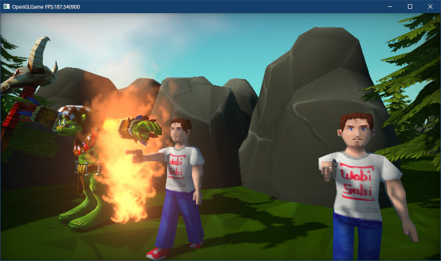
</p>

炎を様々な角度から見てみてください。ビルボードの効果によって、どの方向からも炎のように見えるはずです。

<pre class="tnmai_assignment">
<strong>【課題06】</strong>
炎粒子にZ軸回転を追加し、秒間120°の速度で回転させなさい。
</pre>

<pre class="tnmai_assignment">
<strong>【課題07】</strong>
既存のゲームなどを参考に、オリジナルの粒子と粒子発生装置を作成し、シーンに配置しなさい。あるいは、炎エフェクトを改良しても良いでしょう。
発生位置や回転角度などにランダム性を加える、炎だけでなく煙や火の粉を発生させる、などが考えられます。ビルボードの代わりに3Dモデルを表示することもできます。
例:
- ヒットエフェクト
- ジャンプや着地で生まれる砂埃(すなぼこり)
- 爆発
- 水しぶき(滝や川岸など)
- 魔法の発動
- ポケモンの技
</pre>

>**【3章のまとめ】**
>
>* FBOに描画した画像をテクスチャとして読み込むことで、さまざまな画像処理が行える。
>* 何も描画されなかったり描画結果がおかしいときは、深度テストやアルファブレンドなどの設定を見直す。
>* 画像をぼかすには、テクスチャ座標をずらしながら何回も読み込んで合成する。
>* 「ブルームエフェクト」は明るい光が周囲に拡散する現象を再現するエフェクト。画像の明るい成分をぼかすことで実現できる。
>* 簡単なパーティクルは、ビルボードオブジェクトを大量に発生させることで再現できる。パーティクルシステムは高速化が目的で、なくてもゲームは作れる。
