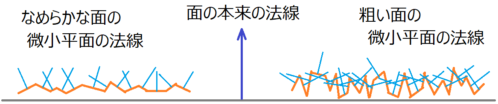

[OpenGL 3D 2023 第10回]

# マイクロファセットBRDF

## 習得目標

* 
* 
* 
* 

[ ] 物理ベースレンダリング(スペキュラ+フレネル)
[ ] ノーマルマッピング
[ ] DDSファイルを読み込めるようにする
[ ] アンビエントオクルージョン
[ ] キューブマップ(環境マップ？)
[ ] ウェイポイント
[ ] 「ジュース」について(画面を揺らす、派手な爆発と効果音)

[ ] パースペクティブ・デプスシャドウマップ
[ ] レイヤードレンダーターゲットとジオメトリシェーダによるポイントライト・デプスシャドウマップ

## 1. マイクロファセットBRDF

### 1.1 双方向反射率分布関数(BRDF)

現在のライティングでは拡散反射だけを処理しています。より現実的なライティングを行うには「鏡面反射(きょうめんはんしゃ)」と呼ばれる成分も計算する必要があります。

2024年現在、拡散反射と鏡面反射の計算には「マイクロファセットBRDF(ビーアールディーエフ)」と呼ばれるライティング技法が使われています。

「マイクロファセット」は「微小平面」という意味で、「物体表面を目に見えないほど微小な平面の集合として考える」ライティング技法のことです。

<p align="center">
<br>
[拡大図に見える小さな平面ひとつひとつがマイクロファセット]
</p>

BRDFは「双方向反射率分布関数`Bidirectional Reflectance Distribution Function`」の略称で、「ある方向からの入射光が、ある方向に出射する比率」を表します。

「双方向」という名称は、「入射ベクトルと出射ベクトルを入れ替えても結果が変わらない」ことから来ています。

この定義を満たす関数はすべてBRDFと呼ばれます。そのため、エンジンやライブラリによって計算方法の異なるBRDFが使われています。今回は`Unreal Engine`で採用されている計算方法をベースに作成していきます。

>`Unreal Engine`のBRDFを選んだのは、品質と効率のバランスが取れているためです。
>
>cdn2.unrealengine.com/Resources/files/2013SiggraphPresentationsNotes-26915738.pdf

`Unreal Engine`のBRDFは、以下の3つのパラメータを持ちます。

>* ベースカラー(基本となるRGBカラー)
>* メタリック(金属なら`1`、非金属なら`0`)
>* ラフネス(物体表面の粗さを`0.0`～`1.0`で表す)

BRDFはこれらのパラメータを用いて、拡散反射と鏡面反射の2つのBRDFを組み合わせて作成されます。また、一般に入射ベクトルには「光線(ライト)ベクトル」、出射ベクトルには「視線(カメラ)ベクトル」が使われます。

$$
\begin{aligned}
L &= 光線(ライト)ベクトル \\
V &= 視線(カメラ)ベクトル \\
N &= 法線ベクトル \\
\\
総反射率 &= 拡散反射BRDF * (1 - メタリック) + 鏡面反射BRDF \\
\\
拡散反射BRDF &= \dfrac{ベースカラー}{\pi} \\
\\
鏡面反射BRDF &= \dfrac{D * G * F}{4(N \cdot L)(N \cdot V)} \\
\end{aligned}
$$

ここで`D`は「法線分布項」、`G`は「幾何遮蔽項」、`F`は「フレネル項」を表します。`cosθi`は入射ベクトルと法線ベクトルの内積、`cosθo`は出射ベクトル(視線ベクトル)と法線ベクトルの内積です。

* 法線分布項: 「物体表面の凹凸」と「見る角度」によって、面の法線に見え方が変化する現象を再現する。
* 幾何減衰項: 物体表面の凹凸によって、表面の一部が隠れて暗くなる現象を再現する。
* フレネル項: 「水面をナナメに見たときに空の色が見える」という現象を再現する。

これらの3項目は次ように計算します。

$$
\begin{aligned}
H &= normalize(L + N) \\
\\
D &= \dfrac{ラフネス^4}{\pi * ((N \cdot H)^2 * (ラフネス^4 - 1) + 1)^2} \\
\\
k &= \dfrac{(ラフネス + 1)^2}{8} \\
G &= \dfrac{N \cdot L}{(N \cdot L)(1 - k) + k} * \dfrac{N \cdot V}{(N \cdot V)(1 - k) + k} \\
\\
F0 &= 角度0°のときのフレネル値 \\
F &= F0 + (1 - F0)(1 - L \cdot H)^5 \\
\end{aligned}
$$

本テキストでは、この式をそのまま実装していきます。各式の意味については、実装する時に個別に説明します。

### 1.2 法線分布項

表面が十分になめらかな物体では、多くの微小面の法線は表面法線に一致します。しかし、表面が粗い物体の場合、微小面はさまざまな方向を向いていると考えられます(だからザラザラに見える)。

<p align="center">

</p>

法線分布項(`Normal Distribution Function`、または`Microfacet Distribution Function`)は、 このような微小面の状態を考慮して、視点から見えるすべてのマイクロファセット法線の平均値を算出する関数です。

法線分布項を表す関数はいくつか考案されていますが、`Unreal Engine`では2007年に`Walter`氏が考案した、GGX(ジージーエックス、`ground grass unknown`)という関数が使われています。GGX関数は次のように定義されます。

$$
\begin{aligned}
H &= (L + N) * 0.5 \\
D &= \dfrac{ラフネス^4}{\pi * ((N \cdot H)^2 * (ラフネス^4 - 1) + 1)^2}
\end{aligned}
$$

`H`は「ハーフベクトル」と呼ばれ、「光線(入射)ベクトルと視線ベクトルの中間を指すベクトル」になります。物理的にはハーフベクトルは「入射光の鏡面反射量が最も多くなる微小面の向き」を意味します。

<p align="center">
<br>
[L=光線ベクトル V=視線ベクトル H=ハーフベクトル]
</p>

`N・H`は「表面法線の向きがハーフベクトルと近いほど、光線を視線方向に反射する微小平面が多くなる」ことを表します。

ラフネスは「物体表面の粗さ」を表すパラメータなのでした。ラフネスが0に近いほど表面がなめらかに、1に近いほど表面が粗くなります。GGXにおけるラフネスは「`N・H`の無視されやすさ」として機能します。

表面が粗いということは微小平面の向きもバラバラなので、ハーフベクトル方向を向いている微小平面が少なくなります。逆になめらかな場合、`N・H`はそのままハーフベクトル方向を向く微小平面の比率になります。

乗数やその他のパラメータ(`-1`や`+`のこと)は、`Unreal Engine`を使うアーティストがラフネスを直感的に操作できるようにと、試行錯誤によって決められた値です。

そ1967年およびれでは、シェーダにGGX関数を定義しましょう。`standard.frag`を開き、ユニフォーム変数の定義の下に`NormalDistributionGGX`(ノーマル・ディストリビューション・ジージーエックス、「GGXによる法線分布」という意味)という名前の関数を追加してください。

```diff
   vec4 directionAndConeAngle[16]; // 向き, 照射角度
 };
 layout(location=110) uniform int lightCount;
 layout(location=111) uniform Light pointLight;
+
+/**
+* 法線分布項
+*/
+float NormalDistributionGGX(vec3 N, vec3 H, float roughness)
+{
+  // 光線を視線方向に反射する微小平面の比率を求める
+  float NdotH = max(dot(N, H), 0);
+  float NdotH2 = NdotH * NdotH;
+
+  // dot(N, H)が影響する比率を求める
+  float r2 = roughness * roughness;
+  float r4 = r2 * r2;
+  float denom = (NdotH2 * (r4 - 1.0) + 1.0);
+  denom = 3.14159265 * denom * denom;
+
+  return r4 / denom;
+}

+/**
+* エントリーポイント
+*/
 void main()
 {
   vec4 c = texture(texColor, inTexcoord);
```

これで法線分布項は完成です。

>`denom`(デノム)は`denominator`(デノミネータ、「分母」という意味)の短縮形です。

### 1.3 幾何減衰項

表面が粗い物体には、目に見えないほど小さな凸凹がたくさん存在します。これらの凸凹によって、ある微小平面に届くはずの光が別の微小平面によって遮られたり、視線の先にある微小平面が奥にある微小平面に隠されるという現象が発生します。

<p align="center">
<br>
[左:視線が他の微小平面に遮られる 右:光線が他の微小平面に遮られる]
</p>

幾何減衰項(きかげんすいこう、`Geometric Attenuation Factor`または`Masking-Shadowing Function`)は、 このような微小面の状態を考慮して、光線が視点に到達する比率を算出する関数です。

`Unreal Engine`では、Smith(スミス)氏が1969年に考案した技法をSchlick(シュリック)氏が改良した式をベースにして、`Unreal Engine`独自の改良を加えたバージョンが使われています。これは次の式になります。

$$
\begin{aligned}
k &= \dfrac{(ラフネス + 1)^2}{8} \\
G0(x) &= \dfrac{N \cdot x}{(N \cdot x)(1 - k) + k} \\
G &= G0(L)G0(V) \\
\end{aligned}
$$

`k`は「凹凸の度合い」を表すパラメータです。`G0`(ジーゼロ)関数は、入射ベクトル(または視線ベクトル)に対する微小平面の見えやすさを計算します。

入射ベクトルが法線ベクトルと直角に近い場合、光が物体表面をかすめるように通過するので、わずかな凹凸でも光が遮られる確率が高くなります。逆に垂直に近い場合はほとんど遮られません。

また、`k`が小さい場合は物体表面の凹凸が大きいことを意味します。この場合、わずかな傾きであっても光が遮られる確率が高くなります。

ある微小平面について、入射光が視線に到達しない主な原因は以下の2つが考えられます。

>* 他の微小平面に遮られて、入射光が目的の微小平面まで届かない(シャドウイング)。
>* 他の微小平面に遮られて、視点から目的の微小平面が見えない(マスキング)。

そこで、先の式では入射ベクトルと視線ベクトルのそれぞれについて、`G'`関数を使って遮蔽率を求めます。次に、これら2つの値を乗算して「入射光が視点に到達する比率」を算出します。

入射ベクトルと視線ベクトルの両方に同じ式を使うことで、BRDFの重要な性質である「双方向性」を満たすようになっています。

それでは幾何減衰項を求める関数を定義しましょう。`NormalDistributionGGX`関数の定義の下に、`GeometricAttenuationSchlick`(ジオメトリック・アテニュエーション・シュリック、「シュリックの幾何減衰」という意味)という名前の関数を追加してください。

```diff
   denom = 3.14159265 * denom * denom;

   return r4 / denom;
 }
+
+/**
+* 幾何減衰項
+*/
+float GeometricAttenuationSchlick(float NdotL, float NdotV, float roughness)
+{
+  float k = (roughness + 1) * (roughness + 1) * 0.125;
+
+  // 光源方向から見た幾何学的減衰項を計算
+  float g0 = NdotL / (NdotL * (1 - k) + k);
+
+  // 視点方向から見た幾何学的減衰項を計算
+  float g1 = NdotV / (NdotV * (1 - k) + k);
+
+  return g0 * g1;
+}

 /**
 * エントリーポイント
 */
 void main()
```

`N・L`と`N・V`はBRDFの他の部分でも使うので、関数の外で計算して引数として受け取る形にしています。

これで、幾何減衰項は完成です。

### 1.4 フレネル項

光が屈折率の異なる物質の境界(「界面(かいめん)」といいます)に入射すると、光の一部が反射され、残りは透過します。この反射と透過の比率は「フレネル方程式」によって表せることが分かっています。

<p align="center">
<br>
Photo by Shana Van Roosbroek on https://unsplash.com/@shanavaro
</p>

流れの静かな川を見ることを考えてみましょう。水面を真上から見ると、水底まで見通すことができます。そこから、徐々に角度を付けていくと、少しずつ空の色が写り込んできます。

やがて水面をかすめるような角度になると、見えるのは空の色ばかり。水底どころか水中自体がほとんど見えません。「フレネル方程式」は、このような「見る角度によって反射率が異なる」という光のふるまいを表します。

フレネル方程式は水と空気の境界にかぎらず、あらゆる「界面(異なる物質の境界)」で発生します。リアルな映像表現を行う場合、フレネル方程式を避けて通ることはできません。しかし、フレネル方程式は複雑な計算を必要とします。

>フレネル方程式は以下のURLで確認できます。<br>
>`https://ja.wikipedia.org/wiki/フレネルの式`

前掲のURLを見てみると分かりますが、リアルタイムに計算させるには計算量が多すぎます。そこで、いろいろ違いはあるものの、ある程度同じ反射特性を表現できる「近似式(きんじしき)」が考案されました。

この近似式は、考案者の名前をとって「シュリック(Schlick)の近似式」と呼ばれています。シュリックの近似式は次のように表されます。

$$
F = F0 + (1 - F0)(1 - cosθ)^5
$$

ここで`F0`は「光線が法線と平行な角度(θ=0)で入射した場合の鏡面反射係数」です。`F0`の値は物体によって異なり、非金属の平均値は約`0.04`、金属は`0.5`～`1.0`になります。

それから、BRDFでは表面法線の代わりにハーフベクトルが使われます。これによって、`cosθ`の部分が「入射ベクトルとハーフベクトルの内積」になり、1.1節で見た以下の式につながります。

$$
\begin{aligned}
F0 &= 角度0°のときのフレネル値 \\
F &= F0 + (1 - F0)(1 - L \cdot H)^5 \\
\end{aligned}
$$

近似式なので、式自体に物理的な根拠はありません。とはいえ、`1 - L・H`という式から「入射ベクトルと法線のなす角が0°に近いほど反射が弱くなり、90°に近いほど反射が強くなる」ことが分かります。

この式によって「見る角度によって反射率が異なる」という挙動を再現しています。

それではフレネル項を扱う関数を定義しましょう。名前は`FresnelSchlick`(フレネル・シュリック)とします。`GeometricAttenuationSchlick`関数の定義の下に、次のプログラムを追加してください。

```diff
   // 視点方向から見た幾何学的減衰項を計算
   float g1 = NdotV / (NdotV * (1 - k) + k);

   return g0 * g1;
 }
+
+/**
+* フレネル項
+*/
+vec3 FresnelSchlick(vec3 f0, float VdotH)
+{
+  // シュリックの近似式
+  float vh1 = 1 - VdotH;
+  float vh2 = vh1 * vh1;
+  return f0 + (1 - f0) * (vh2 * vh2 * vh1);
+}

 /**
 * エントリーポイント
 */
 void main()
```

この定義では、引数を`LdotH`ではなく`VdotH`にしていることに注意してください。ハーフベクトル`H`は`L`と`V`の中間ベクトルなので、`LdotH`と`VdotH`は常に同じ値になります。そのため、交換しても問題ないのです。

なお、「角度0°のときのフレネル項の値」は`vec3`で受け取ります。非金属ではRGBによる違いはないので`float`で十分です。しかし、金属の場合はRGBごとに値が異なり、それが金属特有の色合いになります。

これでフレネル項は完成です。

### 1.5 鏡面反射BRDF関数を定義する

ここまでのプログラムで、鏡面反射BRDFに必要な「法線分布項`D`」「幾何減衰項`G`」「フレネル項`F`」が揃いました。この3つを組み合わせて鏡面反射BRDFを求める関数を定義しましょう。

$$
鏡面反射BRDF = \dfrac{D * G * F}{4(N \cdot L)(N \cdot V)}
$$

関数名は`SpecularBRDF`(スペキュラ・ビーアールディーエフ)とします。`FresnelSchlick`関数の定義の下に、次のプログラムを追加してください。

```diff
   float hv1 = 1 - VdotH;
   float hv2 = hv1 * hv1;
   return f0 + (1 - f0) * (hv2 * hv2 * hv1);
 }
+
+// cosθの最小値
+const float minCosTheta = 0.000001;
+
+/**
+* 鏡面反射BRDF
+*/
+vec3 SpecularBRDF(vec3 normal, vec3 H, float roughness, vec3 cameraVector, float NdotL, vec3 F)
+{
+  // 法線分布項を計算
+  float D = NormalDistributionGGX(normal, H, roughness);
+
+  // 幾何学的減衰項を計算
+  float NdotV = max(dot(normal, cameraVector), minCosTheta);
+  float G = GeometricAttenuationSchlick(NdotL, NdotV, roughness);
+
+  // 鏡面反射BRDFを計算
+  float denom = 4 * NdotL * NdotV;
+  return (D * G * F) * (1 / denom);
+}

 /**
 * エントリーポイント
 */
 void main()
```

鏡面反射BRDFの計算で登場するパラメータのうち、`N・L`、`F`、`H`は他の計算でも使用します。そこで、引数として受け取るようにしています。

`N・L`は拡散反射BRDFで使います。フレネル項`F`拡散反射BRDFと鏡面反射BRDFの合成で使います。`H`はフレネル項`F`の計算で使います。

鏡面反射BRDFの式の分母`4(N・L)(N・V)`は、`D * G * F`を正規化するための係数です。この係数によって、`入射光 = 鏡面反射 + 拡散反射`が成立するように鏡面反射BRDFの値を調整します。

### 1.6 BRDFの計算に必要なユニフォーム変数を追加する

鏡面反射BRDFを計算するために、`standard.frag`に不足しているラフネスと視線ベクトルを追加します。ただし、視線ベクトルはフラグメントによって異なります。そこで、追加するのは「視点(カメラ)座標」とします。

視線ベクトルは「視点座標 - フラグメントの座標」で求められます。フラグメントの座標は`inPosition`として定義済みなので、あとは視点座標があればいいわけです。

それでは、`standard.frag`を開き、ユニフォーム変数の定義に次のプログラムを追加してください。

```diff
 // 出力する色データ
 out vec4 outColor;
+
+layout(location=4) uniform vec3 cameraPosition; // カメラ座標

 layout(location=100) uniform vec4 color; // 物体の色
 layout(location=101) uniform vec4 emission; // 物体の発光色
 layout(location=102) uniform float alphaCutoff; // フラグメントを破棄する境界値
+
+// x=物体表面の粗さ y=金属かどうか(0=非金属 1=金属)
+layout(location=103) uniform vec2 roughnessAndMetallic;

 // 環境光
 layout(location=107) uniform vec3 ambientLight;
```

カメラ座標のロケーション番号は、頂点シェーダと同じにしています。複数のシェーダで同一のロケーション番号を指定すると、ひとつのユニフォーム変数を共有できます。

>`standard.vert`の`cameraPosition`ユニフォーム変数の定義を確認しなさい。もしロケーション番号が異なっていたら、`standard.vert`側に合わせなさい。同じ場合は何もする必要はありません。

ロケーション番号の消費を抑えるため、ラフネスとメタリックはひとつの`vec2`にまとめて定義することにしました。

>**【alphaCutoffをまとめない理由】**<br>
>`alphaCutoff`とまとめて`vec3`にすることも考えました。しかし、ラフネスとメタリックはマテリアルごとに書き換えますが、`alphaCutoff`は描画全体で見てもあまり変更されません。このように有効期間が大きく異なる変数をまとめてしまうと、有効期間が長い変数を無駄に書き換えることになってしまいます。有効期間が大きく異なるユニフォーム変数は、多少ロケーション番号が無駄になるとしても、分けておくことでトータルの書き換え量を減らせます。

### 1.7 鏡面反射BRDFと拡散反射BRDFを計算する関数を定義する

次に、鏡面反射BRDFと拡散反射BRDFをまとめて計算する関数を定義します。関数名は`CalcBRDF`(カルク・ビーアールディーエフ)とします。`SpecularBRDF`関数の定義の下に、次のプログラムを追加してください。

```diff
   // 鏡面反射を計算
   float denom = 4 * max(NdotL * NdotV, minCosTheta);
   return (D * G * F) * (1 / denom);
 }
+
+// CalcBRDFの計算結果
+struct BRDFResult
+{
+  vec3 diffuse;  // 拡散反射
+  vec3 specular; // 鏡面反射
+};
+
+/**
+* 鏡面反射BRDFと拡散反射BRDFをまとめて計算する
+*/
+BRDFResult CalcBRDF(vec3 normal, vec3 f0,
+  vec3 cameraVector, vec3 direction, vec3 color)
+{
+  // フレネルを計算
+  vec3 H = normalize(direction + cameraVector);
+  vec3 F = FresnelSchlick(f0, max(dot(cameraVector, H), 0));
+
+  // GGXで鏡面反射を計算
+  float NdotL = max(dot(normal, direction), minCosTheta);
+  vec3 specularBRDF = SpecularBRDF(
+    normal, H, roughnessAndMetallic.x, cameraVector, NdotL, F);
+  vec3 specular = color * specularBRDF * NdotL;
+
+  // 正規化ランバートで拡散反射を計算
+  float diffuseBRDF = NdotL / 3.14159265;
+  vec3 diffuse = color * diffuseBRDF * (1 - F) * (1 - roughnessAndMetallic.y);
+
+  return BRDFResult(diffuse, specular);
+}

 /**
 * エントリーポイント
 */
 void main()
```

拡散反射BRDFは、現在のシェーダと同じく「正規化ランバート」によって計算します。

フレネル効果により、角度90°では`F`が`1.0`になります。このとき、`(1 - F)`は0になります。つまり、角度90°では拡散反射は起きず、入射光は100%鏡面反射されるわけです。

>フレネル効果は現実の物体でも見られます。現実の光は複雑なので全く同じに見えるわけではありませんが、光沢のあるコップなどを観察してみるとフレネル効果が実感できるでしょう。

また、メタリックが`1`のとき、つまり金属マテリアルを描画するときは、拡散反射が無効化されることに注意してください。これは、「金属は拡散反射を起こさない」という物理現象を再現するためです。

### 1.8 BRDFの計算に共通の変数を計算する

それでは、追加したユニフォーム変数を使ってBRDFを計算しましょう。まず、すべてのライトで共通して使われる値を計算します。`main`関数の定義に次のプログラムを追加してください。

```diff
   outColor = c * color;

   // 線形補間によって長さが1ではなくなっているので、正規化して長さを1に復元する
   vec3 normal = normalize(inNormal);
+
+  // 視線ベクトル
+  vec3 cameraVector = normalize(cameraPosition - inPosition);
+
+  // 角度0のフレネル値
+  vec3 f0 = mix(vec3(0.04), outColor.rgb, roughnessAndMetallic.y);

   vec3 diffuse = vec3(0); // 拡散光の明るさの合計
+  vec3 specular = vec3(0);// 鏡面反射光の明るさの合計
   for (int i = 0; i < lightCount; ++i) {
     // 光源の方向
     vec3 direction = pointLight.positionAndRadius[i].xyz - inPosition;
```

角度0°のときのフレネル値`f0`の計算では、メタリックが`0`、つまり材質が非金属のとき`0.04`が設定されます。`0.04`は非金属の平均的なフレネル値で、「入射光の4%が鏡面反射になる」ことを意味します。

### 1.9 拡散光の計算をBRDFの計算に置き換える

これまで拡散光だけを計算していた部分をBRDFの計算で置き換えていきましょう。まず、`theta`は`CalcBRDF`関数内で計算するので削除します。これにより`illuminance`の初期値も変更されます。

`for`ループ内にある`theta`と`illuminance`を定義するプログラムを、次のように変更してください。

```diff
     // 方向を正規化して長さを1にする
     direction = normalize(direction);
-
-    // ランベルトの余弦則を使って明るさを計算
-    float theta = max(dot(direction, normal), 0);
-
-    // ランバート反射による反射光のエネルギー量を入射光と等しくするためにπで割る
-    float illuminance = theta / 3.14159265; 合計後に一括で乗算するように遅延
+    float illuminance = 1;

    // 照射角度が0より大きければスポットライトとみなす
    const float coneAngle = Get(pointLight.directionAndConeAngle, i).w;
    if (coneAngle > 0) {
```

次に、ポイントライトおよびスポットライトの拡散光の明るさを計算するプログラムを、次のように`CalcBRDF`関数で置き換えてください。

```diff
     // 逆2乗の法則によって明るさを減衰させる
     illuminance /= sqrDistance + 1;

-    // 拡散光の明るさを計算
-    diffuse += pointLight.colorAndFalloffAngle[i].xyz * illuminance;
+    // 拡散反射と鏡面反射を計算
+    vec3 color = pointLight.colorAndFalloffAngle[i].xyz * illuminance;
+    BRDFResult result = CalcBRDF(normal, f0, cameraVector, direction, color);
+    diffuse += result.diffuse;
+    specular += result.specular;
   } // for lightCount

   // 影を計算
   vec3 shadowXYZ = vec3(clamp(inShadowTexcoord.xy, 0, 1), inShadowTexcoord.z);
```

続いて、ディレクショナルライト(平行光源)の各参考の明るさを計算するプログラムを、`CalcBRDF`関数で置き換えてください。

```diff
   // 影を計算
   vec3 shadowXYZ = vec3(clamp(inShadowTexcoord.xy, 0, 1), inShadowTexcoord.z);
   float shadow = texture(texShadow, shadowXYZ).r;

   // 平行光源の明るさを計算
-  float theta = max(dot(-directionalLight.direction, normal), 0);
-  float illuminance = theta / 3.14159265;
-  diffuse += directionalLight.color * illuminance * shadow;
+  BRDFResult result = CalcBRDF(normal, f0, cameraVector,
+    -directionalLight.direction, directionalLight.color);
+  specular += result.specular * shadow;
+  diffuse += result.diffuse * shadow;

   // アンビエントライトの明るさを計算
   diffuse += ambientLight;
```

本テキストでは、平行光源のみ`shadow`変数の影響を受けることに注意してください。ポイントライトやスポットライトの影まで計算すると、計算にかなり時間がかかるため省略しています。

### 1.10 アンビエントライトをラフネスとメタリックに対応させる

アンビエントライトは、拡散反射成分と鏡面反射成分に分けて処理するようにします。アンビエントライトの明るさを計算するプログラムを、次のように変更してください。

```diff
   BRDFResult result = CalcBRDF(normal, f0, cameraVector,
     -directionalLight.direction, directionalLight.color);
   specular += result.specular * shadow;
   diffuse += result.diffuse * shadow;

   // アンビエントライトの明るさを計算
-  diffuse += ambientLight;
+  vec3 Fa = f0 + (1 - f0) * 0.0021555; // 角度45°のフレネル値
+  specular += ambientLight * Fa;
+  diffuse += ambientLight * (1 - Fa) * (1 - roughnessAndMetallic.y);

   // 拡散光の影響を反映
   outColor.rgb *= diffuse;
```

アンビエントライトは「すべての方向からの光の平均値」なので、フレネル値も「物体を見るときの平均的な角度」を選ぶ必要があります。

球体を正面から見たとき、角度45°境界の内側と外側の見かけの面積は等しくなります。そこで、「cos(45°)の5乗」を電卓で計算して`0.00021555`を求めました。

### 1.11 鏡面反射を反映する

最後に、ここまでに計算した鏡面反射の影響を反映します。拡散光の影響を反映するプログラムの下に、次のプログラムを追加してください。

```diff
   specular += ambientLight * Fa;
   diffuse += ambientLight * (1 - Fa) * (1 - roughnessAndMetallic.y);

   // 拡散光の影響を反映
   outColor.rgb *= diffuse;
+
+  // 鏡面反射の影響を反映
+  outColor.rgb += specular;

   // 発光色を反映
   if (emission.w > 0) {
```

これで、シェーダ側の変更は完了です。

### 1.12 マテリアルにラフネスとメタリックを設定する

ここからは、C++プログラム側に機能を追加していきます。手始めに`Material`構造体にラフネスとメタリックを追加しましょう。`Mesh.h`を開き、`Material`構造体に次のプログラムを追加してください。

```diff
   std::string name = "<Default>";  // マテリアル名
   vec4 baseColor = { 1, 1, 1, 1 }; // 基本色+アルファ
   vec3 emission = { 0, 0, 0 };     // 発光色
+  float roughness = 0.7f;          // 表面の粗さ
+  float metallic = 0.0f;           // 0=非金属 1=金属
   TexturePtr texBaseColor;         // 基本色テクスチャ
   TexturePtr texEmission;          // 発光色テクスチャ
```

### 1.13 MTLファイルからラフネスの値を読み取る

次に、MTLファイルの構文を解釈して、追加した`roughness`(ラフネス)メンバ変数と`metallic`(メタリック)メンバ変数に値を設定します。

MTLファイルにおいて、鏡面反射は「RGBごとの鏡面反射率(スペキュラ色)」を表す`Ks`(ケーエス)構文と、「なめらかさ(スペキュラ係数)」を表す`Ns`(エヌエス)構文の2つで定義されます。

とりあえず、これらの構文を読み込みましょう。最初に読み取り用の変数を定義します。`Mesh.cpp`を開き、`LoadMTL`メンバ関数の定義に次のプログラムを追加してください。

```diff
   // MTLファイルを解析する
   std::vector<MaterialPtr> materials;
   MaterialPtr pMaterial;
+  vec3 specularColor = vec3(1); // スペキュラ色
+  float specularPower = 12;     // スペキュラ係数
   while (!file.eof()) {
     std::string line;
     std::getline(file, line);
```

次に、読み取った2つのパラメータからラフネスを計算し、マテリアルに設定します。マテリアル定義を読み取るプログラムに、次のプログラムを追加してください。

```diff
     // マテリアル定義の読み取りを試みる
     char name[1000] = { 0 };
     if (sscanf(line.data(), " newmtl %[^\n]s", name) == 1) {
+      if (pMaterial) {
+        // スペキュラの2つのパラメータからラフネスを計算
+        specularPower *= std::max(std::max(specularColor.x, specularColor.y), specularColor.z);
+        pMaterial->roughness = std::clamp(1 - log2(specularPower) / 12, 0.0001f, 1.0f);
+
+        // スペキュラパラメータを初期値に戻す
+        specularColor = vec3(1);
+        specularPower = 12;
+
+        // テクスチャが設定されていないマテリアルの場合、white.tgaを設定しておく
+        if (!pMaterial->texBaseColor) {
+          pMaterial->texBaseColor = textureCallback("Res/white.tga");
+        }
       }
       pMaterial = std::make_shared<Material>();
       pMaterial->name = name;
       materials.push_back(pMaterial);
```

本来、スペキュラ色はRGBで異なる可能性があります。しかし、2024年現在の3Dモデル作成ではRGB全てに同じ値を設定することが一般的です。今回の描画でもRGBは区別しません。

とはいえ、同じ値が設定されている保証はありませんから、`max`関数を用いてRGBのうち最大値を使うようにしてみました。

ラフネスはスペキュラ係数から計算します。MTLファイルの仕様では、スペキュラ係数が取りうる値は`1`～`1000`とされています。定義によると、この値は鏡面反射計算において「指数」として扱う必要があります。

ラフネスには線形の値を指定しなくてはならないので、指数から線形数に変換する必要があります。これには`log2`関数が利用できます。

`log2`関数は、引数Aについて

$$
A=2^N
$$

となるNを返します。例えば引数が`16`のとき、`16`は`2`の`4`乗なので、戻り値は`4`になります。

スペキュラ係数の最大値1000は「`2`の10乗」に近いです。そこで、`log2`関数を使ってスペキュラ係数を対数に変換するとだいたい0～10の範囲が得られます。これを10で割ることで、`0.0`～`1.0`の範囲にしています。

ただし、ラフネスが`0.0`だとBRDFの計算において除数が0になってしまい計算できません。ここでは`clamp`関数を使って最小値を`0.0001f`とすることで0除算を回避しています。

最後に作成したマテリアルのために、同様の処理を`while`文の直後にも追加してください。

```diff
         LOG_WARNING("%sを開けません", filename.c_str());
       }
       continue;
     }
   }
+
+  // 最後のマテリアルのスペキュラパラメータを設定
+  if (pMaterial) {
+    // スペキュラの2つのパラメータからラフネスを計算
+    specularPower *= std::max(std::max(specularColor.x, specularColor.y), specularColor.z);
+    pMaterial->roughness = std::clamp(1 - log2(specularPower) / 12, 0.0001f, 1.0f);
+
+    // テクスチャが設定されていないマテリアルの場合、white.tgaを設定しておく
+    if (!pMaterial->texBaseColor) {
+      pMaterial->texBaseColor = textureCallback("Res/white.tga");
+    }
+  }

   // 読み込んだマテリアルの配列を返す
   LOG("%sを読み込みました", fullpath.c_str());
   return materials;
```

それでは、`Ks`構文を解析しましょう。`while`文の中にある光色テクスチャ名を読み取るプログラムの下に、次のプログラムを追加してください。

```diff
         pMaterial->texEmission =
           textureCallback(filename.c_str());
       } else {
         LOG_WARNING("%sを開けません", filename.c_str());
       }
       continue;
     }
+
+    // スペキュラ色の読み取りを試みる
+    if (sscanf(line.data(), " Ks %f %f %f",
+      &specularColor.x, &specularColor.y, &specularColor.z) == 3) {
+      continue;
+    }
   }

   // 読み込んだマテリアルの配列を返す
   LOG("%sを読み込みました", fullpath.c_str());
```

続いて`Ns`構文を解析します。`Ks`を解析するプログラムの下に、次のプログラムを追加してください。

```diff
       &specularColor.x, &specularColor.y, &specularColor.z) == 3) {
       continue;
     }
+
+    // スペキュラ係数の読み取りを試みる
+    if (sscanf(line.data(), " Ns %f", &pMaterial->specularPower) == 1) {
+      continue;
+    }
   }

   // 読み込んだマテリアルの配列を返す
   LOG("%sを読み込みました", fullpath.c_str());
```

これで、スペキュラ係数からラフネスを取得できるようになりました。

### 1.14 MTLファイルからメタリックを読み取る

次にメタリックを読み取ります。ただし、メタリックはMTLファイルには標準機能としては存在しません。ただし、一部のツールは`Pm`という構文でメタリックを表現しています。

そこで、本テキストでも`Pm`構文によってメタリックに対応することにします。スペキュラ係数を読み取るプログラムの下に、次のプログラムを追加してください。

```diff
     // スペキュラ係数の読み取りを試みる
     if (sscanf(line.data(), " Ns %f", &pMaterial->specularPower) == 1) {
       continue;
     }
+
+    // メタリックの読み取りを試みる
+    if (sscanf(line.data(), " Pm %f", &pMaterial->metallic) == 1) {
+      continue;
+    }
   }

   // 読み込んだマテリアルの配列を返す
   LOG("%sを読み込みました", fullpath.c_str());
```

これで、金属マテリアルと非金属マテリアルを使い分けられるようになりました。

### 1.15 ProgramObjectクラスにロケーション番号を扱う機能を追加する

メタリックやラフネスのように特定のシェーダにしか存在しないユニフォーム変数は、それらのユニフォーム変数を持たないシェーダに対して`glUniform`系の関数を呼び出すと失敗します。

エラーを発生させないためには、`glUniform`系の関数を呼ぶ前に特定のユニフォーム変数を持つかどうかを判定できなくてはなりません。

あるシェーダが特定のロケーション番号を持つかどうかは、`glGetUniformLocation`(ジーエル・ゲット・ユニフォーム・ロケーション)関数によって調べられます。

ただ、この関数は文字列比較を行うため、頻繁に呼び出すとプログラムの実行速度が落ちてしまいます。そこで、シェーダを読み込んだ時点で一度だけ`glGetUniformLocation`関数を呼び出すことにします。

このときの結果を記録しておけば、以後は簡単にユニフォーム変数の有無を判定できます。シェーダに関する機能なので、`ProgramObject`クラスに追加するのが適当でしょう。

`ProgramObject.h`を開き、`ProgramObject`クラスの定義に次のプログラムを追加してください。

```diff
   // 管理番号を取得
   operator GLuint() const { return prog; }
+
+  // ロケーション番号を取得
+  GLint ColorLocation() const { return locColor; }
+  GLint RoughnessAndMetallicLocation() const { return locRoughnessAndMetallic; }

 private:
   GLuint vs = 0;          // 頂点シェーダ
   GLuint fs = 0;          // フラグメントシェーダ
   GLuint prog = 0;        // プログラムオブジェクト
   std::string filenameFS; // フラグメントシェーダファイル名
   std::string filenameVS; // 頂点シェーダファイル名
+  GLint locColor = -1;
+  GLint locRoughnessAndMetallic = -1;
 };

 #endif // PROGRAMOBJECT_H_INCLUDED
```

次に`ProgramObject.cpp`を開き、`ProgramObject`コンストラクタの定義に次のプログラムを追加してください。

```diff
   if (status != GL_TRUE) {
     LOG_ERROR("シェーダのリンクに失敗(vs=%s, fs=%s)", filenameVS, filenameFS);
     return;
   }
+
+  // ロケーション番号を取得
+  locColor = glGetUniformLocation(prog, "color");
+  locRoughnessAndMetallic = glGetUniformLocation(prog, "roughnessAndMetallic");

   LOG("シェーダを作成(vs=%s, fs=%s)", filenameVS, filenameFS);
 }
```

ユニフォーム変数のロケーション番号を取得するには`glGetUniformLocation`関数を使います。

<p><code class="tnmai_code"><strong>【書式】</strong><br>
GLint glGetUniformLocation(シェーダプログラムの管理番号, ユニフォーム変数名);
</code></p>

この関数は、「ユニフォーム変数名」で指定した名前のユニフォーム変数のロケーション番号を返します。シェーダプログラムに「ユニフォーム変数名」のユニフォーム変数が存在しない場合は負数を返します。

戻り値の性質から、「ロケーション番号が負数の場合は、ユニフォーム変数が存在しない」ことが分かります。

### 1.16 Draw関数をラフネスとメタリックに対応させる

次に、メッシュの`Draw`関数をラフネスとメタリックに対応させます。`Mesh.cpp`を開き、`Mesh`用の`Draw`関数の定義を次のように変更してください。

```diff
 void Draw(const std::vector<DrawParams>& drawParamsList,
   const ProgramObject& program,
   const MaterialList& materials, const vec4* objectColor)
 {
+  const GLint locRoughnessAndMetallic = program.RoughnessAndMetallicLocation();
+
   for (const auto& e : drawParamsList) {
     // マテリアルを設定
     if (e.materialNo >= 0 && e.materialNo < materials.size()) {
       const Material& material = *materials[e.materialNo];
       if (objectColor) {
         const vec4 color = *objectColor * material.baseColor;
         glProgramUniform4fv(program, 100, 1, &color.x);
         glProgramUniform4f(program, 101,
           material.emission.x, material.emission.y, material.emission.z,
           static_cast<bool>(material.texEmission));
       }
+
+      // ラフネスとメタリックを設定
+      if (locRoughnessAndMetallic >= 0) {
+        glProgramUniform2f(program, locRoughnessAndMetallic,
+          material.roughness, material.metallic);
+      }

       if (material.texBaseColor) {
         const GLuint tex = *material.texBaseColor;
         glBindTextures(0, 1, &tex);
```

プログラムが書けたらビルドして実行してください。周囲の物体に光沢がついていたら成功です。

<p align="center">
<br>
[地面や木の葉に白い光沢が見える]
</p>

<pre class="tnmai_assignment">
<strong>【課題01】</strong>
地面モデルのMTLファイルのNs構文の値を300に設定して、鏡面反射の変化を確かめなさい。地面モデルにNs構文が定義されていない場合は新しく追加すること。
</pre>

<pre class="tnmai_assignment">
<strong>【課題02】</strong>
地面モデルのMTLファイルにPm構文を追加し、値を1に設定して、金属の表示のされ方を確かめなさい。
</pre>

>**【1章のまとめ】**
>
>* 光の反射には「拡散反射」と「鏡面反射」がある。
>* BRDFは「双方向反射率分布関数」のこと。「ある方向からの入射光が、別のある方向(例えば視点方向)に出射する比率」を求めることができる。
>* マイクロファセットBRDFは、物体表面をマイクロファセット(微小平面)の集合として考えるBRDFのこと。
>* マイクロファセットBRDFは、「法線分布項`D`」「幾何減衰項`G`」「フレネル項`F`」を組み合わせて作られる。

<div style="page-break-after: always"></div>

## 2. 

### 2.1 


>**【2章のまとめ】**
>
>* 
>* 
>* 
>* 
>* 

<div style="page-break-after: always"></div>
