[OpenGL 3D 2024 前期 第01回]

# DDS画像形式

## 習得目標

* DDS(ダイレクト・ドロー・サーフェス)のデータ圧縮の仕組みを説明できる。
* DDSファイルからテクスチャを作成できる。
* ミップマップの仕組みと利点および欠点を説明できる。

## 1. 圧縮テクスチャ

### 1.1 DDSフォーマット

現代のGPUには、データ圧縮されたテクスチャを直接扱う機能が備わっています。この機能を使うと、画質は多少下がりますが、テクスチャに必要なメモリが少なくなり、さらに処理速度が向上します。これには以下の利点があります。

>* 同時により多くのテクスチャを読み込める。
>* CPUメモリからGPUメモリへ転送する時間が短くなる。
>* 描画が速くなる(より多くのテクスチャをGPUのキャッシュメモリに格納できるため)。

このように、いいことずくめに見える圧縮フォーマットですが、残念ながら欠点もあります。JPG形式などと同様に、画像を劣化させる場合があるのです。

画像を表示してみて「これはないな」というくらい劣化を感じる場合は、無圧縮フォーマットを使うことになります。

GPUが直接扱える圧縮形式は複数あります。主なものを以下に示します。

| 名前      | 圧縮単位      | アルファビット数 | 圧縮率 |
|:----------|:-------------|:----------------|:-------|
| DDS/BC    | 4x4          | 0, 4, 8         | 1/4～1/6 |
| ETC1/ETC2 | 4x4          | 0, 4            | 1/4～1/6 |
| PVRTC     | 4x4 or 8x4   | 0, 3            | 1/6～1/16 |
| ASTC      | 4x4 ～ 12x12 | 0 ～ 8          | 1/4～1/36 |

これらのうち、2024年現在もっとも一般的に使われているのがDDS(Direct Draw Surface)と、その後継であるBC(Block Compression)です。BCが持つ7つのモードのうち、最初の3つはDDSと全く同じです。

DDSは、S3という会社が自社のグラフィックスカード用に開発したS3TC(エス・スリー・ティー・シー)という画像フォーマットを、Microsoft社がDirectX用に標準化したものです。

しかし、登場から時を経た現在では、PC用GPUの標準フォーマットとして広く利用されており、もちろんOpenGLでも利用できます

DDSの主な圧縮フォーマットは3つあり、それぞれDXT1(ディーエックスティー・ワン)、DXT3、DXT5という名前がついています。

>**【消えたDXT2とDXT4】**<br>
>DDSには5つのフォーマットがありますが、そのうちDXT2, DXT4の2つは、後継であるBCからは削除されています。というのも、機能的にはDXT2はDXT3, DXT4はDXT5と全く同じだからです。唯一の違いはRGBに「圧縮前のRGBにアルファを掛けた値」が記録されることです。これには、「GPUで半透明合成を行う際にRGBとアルファの乗算を省略できる」という利点があります。<br>
>これは、プログラマブルシェーダがまだなかった頃に、GPUのアルファ乗算を制御するためだけに異なる名称がつけられていたからです。現代ではシェーダを使って自由に制御できるため、DXT2とDXT3はまとめてBC2に、DXT4とDXT5はまとめてBC3に置き換えられています。

<br>

>**【ASTCのほうが性能良さそうだけど？】**<br>
>実際そうなのですが、少なくとも2024年現在において、ASTCはモバイルデバイス専用と考えてください。PCの主要なビデオカードメーカーであるNVIDIAとAMDが、この形式に対応していないためです。また、モバイルデバイスでも、低価格帯モデルはASTCに対応していないことが多いです。

さて、DDS/BCフォーマットでは、4x4ピクセルを1ブロックとして扱い、ブロックごとにデータを圧縮します。BC(Block Compression)という名前はこの特徴から名付けられました。
  
<p align="center">
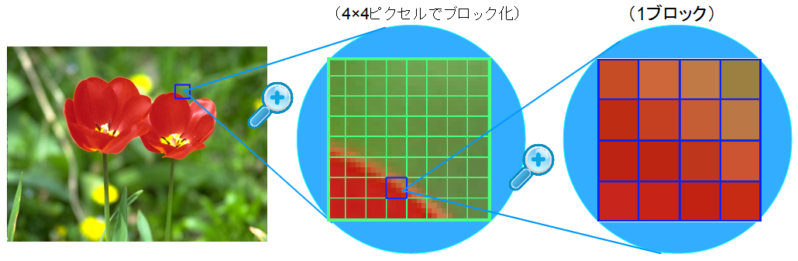<br>
https://www.webtech.co.jp/blog/optpix_labs/format/4569/
</p>

次の図ように、各ブロックはRGB成分とアルファ成分に分けて圧縮されます。
  
<p align="center">
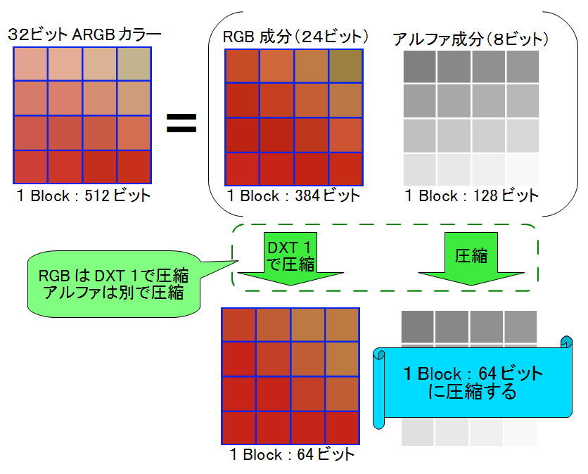<br>
https://www.webtech.co.jp/blog/optpix_labs/format/4569/
</p>

RGB成分の圧縮では、まずブロックを代表する色を2つ抽出し、これを16ビットカラーに圧縮します。この2色を線形補間して2つの中間色を作り出し、各ピクセルデータは、4色のうち最も近い色の番号で置き換えられます。

このような仕組みになっているため、4x4の中に主要な色が3色以上含まれていると正しい色を復元できなくなってしまいます。また、24ビットカラーを16ビットカラーに圧縮するため、微妙な色合いの再現は苦手です。

<p align="center">
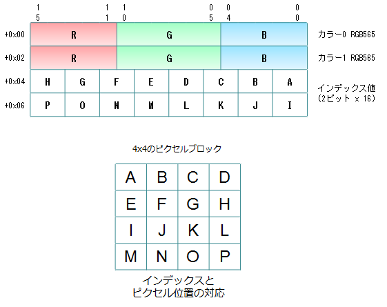<br>
https://techblog.sega.jp/entry/2016/12/26/100000
</p>

また、DXT1は中間色の片方を透明色にすることができ、限定的ながらアルファ成分を扱えます(透明か不透明かの二択)。しかし、徐々に薄くなっていく、濃くなっていくという表現はできません。これらの表現が必要な場合はDXT3とDXT5を使います。

DXT3とDXT5は、RGB成分についてはDXT1と変わりませんが、アルファ成分もブロック圧縮して保存する点が異なります。

DXT3では0.0～1.0を16等分した16色を使用し、アルファ値を最も近い色の番号で置き換えます。

DXT5ではDXT1のように2つの代表色を抽出し、この2色を線形補間して6つの中間色を作ります。ただし、カラー圧縮は行われません(8ビットのままです)。そして、各ピクセルデータを8色のうち最も近い色の番号で置き換えます。

| 種類 | アルファ成分の扱い | 32ビット画像に対する圧縮率 |
|:----:|:-----|:-:|
| DXT1 | 2段階(透明か不透明かの二択) | 1/8 |
| DXT3 | 16段階(0.0～1.0の間の等分)  | 1/4 |
| DXT5 | 8段階(代表2色と中間6色)     | 1/4 |

DXT1は透明度の対応が限定的なため、アルファが不要な一枚絵や、図形の境界がくっきりしているフォント、デカール画像などに適しています。

DXT5は1ブロック中には8段階しか扱えませんが、ブロック単位で代表色を指定できるため、透明度がゆるやかに変化する画像に適しています。ほとんどのアルファあり画像はこの形式が合います。

DXT3は1ブロック中で16段階の透明度を扱えるため、せまい範囲で透明度が急激に変化する画像に適しています。図形の境界にアンチエイリアスを伴うフォントやアイコン画像にはこの形式が合っています。

### 1.2 DDSヘッダ構造体を定義する

DDSファイルもTGAファイルと同様に、ファイルの先頭部分に画像情報が格納されています。この情報のことを「DDSヘッダ」といいます。DDSファイルを読み込むには、最初にDDSヘッダを読み込んで内容を解析する必要があります。

そこで、DDSヘッダを表す構造体を定義します。プロジェクトの`Src/Engine`フォルダに`dds.h`(ディーディーエス・エイチ)という名前のヘッダファイルを追加してください。追加したファイルを開き、次のプログラムを追加してください。

```diff
+/**
+* @file dds.h
+*/
+#ifndef DDS_H_INCLUDED
+#define DDS_H_INCLUDED
+#include "glad/glad.h"
+#include <cstdint>
+
+/**
+* DDSファイルからテクスチャを作成する
+*
+* @param filename  DDSファイル名
+*
+* @retval 0以外 作成したテクスチャの管理番号
+* @retval 0     作成失敗
+*/
+GLuint LoadDDS(const char* filename);
+
+/**
+* 画像のピクセル形式
+*/
+struct DDS_PIXEL_FORMAT
+{
+  uint32_t size;         // この構造体のバイト数(32)
+  uint32_t flags;        // 画像に含まれるデータの種類を示すフラグ
+  uint32_t fourCC;       // 画像フォーマットを示すFOURCC
+  uint32_t rgbBitCount;  // 1ピクセルのビット数
+  uint32_t redBitMask;   // 赤要素が使う部分を示すビット
+  uint32_t greenBitMask; // 緑要素が使う部分を示すビット
+  uint32_t blueBitMask;  // 青要素が使う部分を示すビット
+  uint32_t alphaBitMask; // 透明要素が使う部分を示すビット
+};
+
+/**
+* DDSファイルヘッダ
+*/
+struct DDS_HEADER
+{
+  uint32_t size;              // この構造体のバイト数(124)
+  uint32_t flags;             // どのパラメータが有効かを示す基本フラグ
+  uint32_t height;            // 画像の高さ(ピクセル数)
+  uint32_t width;             // 画像の幅(ピクセル数)
+  uint32_t pitchOrLinearSize; // 横のバイト数または画像1枚のバイト数
+  uint32_t depth;             // 画像の奥行き(枚数)(3次元テクスチャ等で使用)
+  uint32_t mipmapCount;       // 含まれているミップマップレベル数
+  uint32_t reserved1[11];     // (将来のために予約されている)
+  DDS_PIXEL_FORMAT ddspf;     // 画像のピクセル形式
+  uint32_t caps[4];           // 画像の特性を示すフラグ
+  uint32_t reserved2;         // (将来のために予約されている)
+};
+
+#endif // DDS_H_INCLUDED
```

DDSヘッダを表すために、`DDS_HEADER`(ディーディーエス・ヘッダ)という名前の構造体を定義しました。

それから、`DDS_HEADER`には「画像のピクセル形式を表す領域」があります。この部分を表す構造体として、`DDS_PIXEL_FORMAT`(ディーディーエス・ピクセル・フォーマット)を定義しました。

>**【なぜ構造体の名前が大文字なの？】**<br>
>それは、これらの構造体はMicrosoftが定義したものが元になっているからです。名前を合わせておくと、検索したときに見つけやすくなります。

DDSヘッダには複数のフラグ領域があり、それぞれが画像の異なる属性を表します。例えば`DDS_HEADER::flags`(フラッグス)は、ファイルにどのような基本データが含まれるかを表します。

また、`DDS_HEADER::caps`(キャップス)は、ファイルに格納されている画像の種類や枚数を表します。`DDS_PIXEL_FORMAT::flags`は、`DDSPixelFoamat`のどのパラメータが有効かを表します。

これらのフラグには、意味が重複する情報が含まれることがあります。そのような場合、仕様ではどちらもフラグをセットすることになっています。しかし、一部のテクスチャ圧縮ツールはいずれかしかセットしないことがあるため、注意が必要です。

### 1.3 DDSヘッダで使われるフラグを定義する

プログラムを見やすくするため、これらのフラグが取りうる値を定義します。まず`DDS_HEADER::flags`に設定される「基本フラグ」から定義しましょう。`DDS_HEADER`構造体の定義の下に、次のプログラムを追加してください。

```diff
   uint32_t caps[4];           // 画像の特性を示すフラグ
   uint32_t reserved2;         // (将来のために予約されている)
 };
+
+// 基本フラグ
+constexpr uint32_t DDSD_CAPS        = 0x00'0001; // capsが有効(必須)
+constexpr uint32_t DDSD_HEIGHT      = 0x00'0002; // widthが有効(必須)
+constexpr uint32_t DDSD_WIDTH       = 0x00'0004; // heightが有効(必須)
+constexpr uint32_t DDSD_PITCH       = 0x00'0008; // pitchOrLinearSizeのpitchが有効
+constexpr uint32_t DDSD_PIXELFORMAT = 0x00'1000; // ddspfが有効(必須)
+constexpr uint32_t DDSD_MIPMAPCOUNT = 0x02'0000; // mipmapCountが有効
+constexpr uint32_t DDSD_LINEARSIZE  = 0x08'0000; // pitchOrLinearSizeのlinearSizeが有効
+constexpr uint32_t DDSD_DEPTH       = 0x80'0000; // depthが有効

 #endif // DDS_H_INCLUDED
```

このように、基本フラグはDDSヘッダのどのメンバが有効かを表します。なお、名前の先頭にある`DDSD`は、`DDS descriptor`(DDSデスクリプタ, 「DDS記述子」という意味)の短縮形です。

次に、`DDSheader::caps`に設定されるフラグを定義します。`DDSD_DEPTH`フラグの定義の下に、次のプログラムを追加してください。

```diff
 constexpr uint32_t DDSD_MIPMAPCOUNT = 0x02'0000; // mipmapCountが有効
 constexpr uint32_t DDSD_LINEARSIZE  = 0x08'0000; // pitchOrLinearSizeのlinearSizeが有効
 constexpr uint32_t DDSD_DEPTH       = 0x80'0000; // depthが有効
+
+// 画像特性フラグ1
+constexpr uint32_t DDSCAPS_TEXTURE = 0x00'1000; // テクスチャである(必須)
+constexpr uint32_t DDSCAPS_MIPMAP  = 0x40'0000; // ミップマップが格納されている
+constexpr uint32_t DDSCAPS_COMPLEX = 0x00'0008; // 二枚以上のサーフェスが格納されている
+
+// 画像特性フラグ2
+constexpr uint32_t DDSCAPS2_CUBEMAP = 0x00'0200; // キューブマップテクスチャが格納されている
+constexpr uint32_t DDSCAPS2_VOLUME  = 0x20'0000; // ボリュームテクスチャが格納されている

 #endif // DDS_H_INCLUDED
```

画像特性フラグは、格納されている画像の種類や枚数の概要を表します。名前の先頭にある
`DDSCAPS`は、`DDS caps`(DDSキャプス, 「DDS特性」という意味)を意味します。

あと一つ、ピクセル形式に関するフラグを定義します。`DDS_PIXEL_FORMAT`構造体の定義の下に、次のプログラムを追加してください。

```diff
   uint32_t blueBitMask;  // 青要素が使う部分を示すビット
   uint32_t alphaBitMask; // 透明要素が使う部分を示すビット
 };
+
+// ピクセル形式フラグ
+constexpr uint32_t DDPF_ALPHAPIXELS = 0x01;   // alphaBitMaskが有効
+constexpr uint32_t DDPF_ALPHA       = 0x02;   // alphaBitMaskが有効(RGBのBitMaskは無効)
+constexpr uint32_t DDPF_FOURCC      = 0x04;   // fourCCが有効(BitMaskは無効)
+constexpr uint32_t DDPF_RGB         = 0x40;   // RGBのBitMaskが有効
+constexpr uint32_t DDPF_LUMINANCE = 0x2'0000; // redBitMaskが有効(GBのBitMaskは無効)

 /**
 * DDSファイルヘッダ
```

ピクセル形式フラグは、`DDS_PIXEL_FORMAT`のどのメンバが有効かを表します。名前の先頭にある`DDPF`は`Direct Draw Pixel Format`(ダイレクト・ドロー・ピクセル・フォーマット)の短縮形です。

`DDS_PIXEL_FORMAT`構造体は、以下の2つのうちどちらかの方法でピクセル形式を表します。

>* `fourCC`(フォー・シーシー)メンバによる圧縮フォーマットの指定
>* ビットマスクメンバによる無圧縮フォーマットの指定

今回は「圧縮フォーマット」に絞ってDDSの読み込み処理を作成します。DDSファイルに対応する利点は圧縮フォーマットにあるからです。

なお、`fourCC`は`four Character Code`(フォー・キャラクタ・コード)の短縮形で、「4文字で表されるデータ種別」を意味します。

例えば、DXT1形式に対応するfourCCは<br>
&emsp;`D`=0x44 `X`=0x58 `T`=0x54 `1`=0x31<br>
を連結した`0x31545844`です。

>**【無圧縮フォーマットに対応する利点】**<br>
>これは「すべてのテクスチャファイルをDDSに統一できる」ことでしょう。TGA関係のコードを削除できるため、テクスチャを読み込むプログラムが分かりやすくなります。また、2つ以上の形式が混在していると、どちらを使うべきか迷ったり、使うべき形式を間違えることが考えられます。DDSに統一できれば、そのような混乱やミスを減らせる可能性があります。

### 1.4 DDPixelFormatを読み込む関数を定義する

それでは、DDSファイルの読み込みを実装していきましょう。プロジェクトの`Src/Engine`フォルダに`dds.cpp`という名前のCPPファイルを追加してください。追加したファイルを開き、次のプログラムを追加してください。

```diff
+/**
+* @file dds.cpp
+*/
+#include "dds.h"
+#include "Debug.h"
+#include <filesystem>
+#include <fstream>
+#include <memory>
+
+namespace {
+
+/**
+* バイト列から数値を復元する
+*
+* @param p バイト列へのポインタ
+*
+* @return 復元した数値
+*/
+uint32_t Get(const char* buf)
+{
+  const uint8_t* p = reinterpret_cast<const uint8_t*>(buf);
+  return p[0] + (p[1] << 8UL) + (p[2] << 16UL) + (p[3] << 24UL);
+}
+
+} // unnamed namespace
```

`Get`関数は`char`配列の先頭4バイトを`uint32_t`型の数値として取り出します。TGAファイルヘッダの読み込みと同様に、ファイルは`char`配列として読み出されます。そのため、`char`配列から元の数値を復元す必要があります。

DDSファイルの数値はすべて`uint32_t`なので、4バイトのデータを合成する必要があります。ただ、DDSヘッダから取り出す必要のある数値は19個もあるため、数値を復元するたびに合成式を書くのは無駄すぎます。

そこで、関数として定義することにしました。また、`Get`という関数名は普遍的すぎるため、関数名が重複する可能性があります。万が一を考えて、ファイル外から名前を見えなくするために無名名前空間の中に入れています。

それでは、`Get`関数を使ってピクセル形式を読み込みましょう。<br>
関数名は`ReadDDSPixelFormat`(リード・ディーディーエス・ピクセル・フォーマット)とします。無名名前空間の下に、次のプログラムを追加してください。

```diff
   const uint8_t* p = reinterpret_cast<const uint8_t*>(buf);
   return p[0] + (p[1] << 8UL) + (p[2] << 16UL) + (p[3] << 24UL);
 }
+
+/**
+* バッファからピクセル形式を読み出す
+*
+* @param buf 読み出し元バッファ
+*
+* @return ピクセル形式を表すDDS_PIXEL_FORMAT構造体
+*/
+DDS_PIXEL_FORMAT ReadDDSPixelFormat(const char* buf)
+{
+  DDS_PIXEL_FORMAT tmp = {};
+  tmp.size = Get(buf + 0);
+  tmp.flags = Get(buf + 4);
+  tmp.fourCC = Get(buf + 8);
+  tmp.rgbBitCount = Get(buf + 12);
+  tmp.redBitMask = Get(buf + 16);
+  tmp.greenBitMask = Get(buf + 20);
+  tmp.blueBitMask = Get(buf + 24);
+  tmp.alphaBitMask = Get(buf + 28);
+  return tmp;
+}

 } // unnamed namespace
```

今回定義した構造体は、DDSファイルのバイト配置と順序を合わせてあります。そのため、先頭から順番に、4バイト単位で読み込めばすべてのデータを復元することができます。

### 1.5 DDS_HEADERを読み込む関数を定義する

次に、`DDS_HEADER`を読み込む関数を定義します。<br>
関数名は`ReadDDSHeader`(リード・ディーディーエス・ヘッダ)とします。
`ReadDDSPixelFormat`関数の定義の下に、次のプログラムを追加してください。

```diff
   tmp.alphaBitMask = Get(buf + 28);
   return tmp;
 }
+
+/**
+* バッファからDDSヘッダを読み出す
+*
+* @param buf 読み出し元バッファ
+*
+* @return DDSヘッダを表すDDS_HEADER構造体
+*/
+DDS_HEADER ReadDDSHeader(const char* buf)
+{
+  DDS_HEADER tmp = {};
+  tmp.size = Get(buf + 0);
+  tmp.flags = Get(buf + 4);
+  tmp.height = Get(buf + 8);
+  tmp.width = Get(buf + 12);
+  tmp.pitchOrLinearSize = Get(buf + 16);
+  tmp.depth = Get(buf + 20);
+  tmp.mipmapCount = Get(buf + 24);
+  for (int i = 0; i < 11; ++i) {
+    tmp.reserved1[i] = Get(buf + 28 + i * 4);
+  }
+  tmp.ddspf = ReadDDSPixelFormat(buf + 72);
+  for (int i = 0; i < 4; ++i) {
+    tmp.caps[i] = Get(buf + 104 + i * 4);
+  }
+  tmp.reserved2 = Get(buf + 120);
+  return tmp;
+}

 } // unnamed namespace
```

`reserved1`(リザーブド・ワン)と`caps`(キャプス)は配列なので、forを使って読み込みを行っています。

### 1.6 LoadDDS関数を定義する

作成した関数を使って、DDSファイルを読み込みましょう。無名名前空間の閉じカッコの下に、次のプログラムを追加してください。

```diff
   tmp.reserved2 = Get(buf + 120);
   return tmp;
 }

 } // unnamed namespace
+
+/**
+* DDSファイルからテクスチャを作成する
+*/
+GLuint LoadDDS(const char* filename)
+{
+  // ファイルを開く
+  std::ifstream ifs(filename, std::ios_base::binary);
+  if ( ! ifs) {
+    LOG_ERROR("%sを開けません", filename);
+    return 0; // 作成失敗
+  }
+
+  // ファイルの先頭部分を読み込む
+  char buf[128];
+  ifs.read(buf, 128);
+  if (buf[0] != 'D' || buf[1] != 'D' || buf[2] != 'S' || buf[3] != ' ') {
+    LOG_ERROR("%sはDDSファイルではありません", filename);
+    return 0; // 作成失敗
+  }
+
+  // DDSヘッダを取り出す
+  const DDS_HEADER header = ReadDDSHeader(buf + 4);
+  if (header.size != 124) {
+    LOG_ERROR("%sは未対応のDDSファイルです", filename);
+    return 0; // 作成失敗
+  }
+}
```

ファイルを開くことができたら、ファイルの先頭128バイトを読み込み、先頭4バイトが'DDS 'かどうかを判定します。

DDSファイルの先頭4バイトには`D`, `D`, `S`, `(空白)`の4文字が記録されています。この部分を見ることで、本当にDDSファイルかどうかを判定することができます。先頭が`DDS `以外の場合は「作成失敗」を返します。

この4バイトの直後に124バイトのDDSヘッダが存在します。DDSヘッダの`size`メンバにはヘッダのバイト数が記録されています。2024年現在、この値は常に`124`でなくてはなりません。

`size`メンバが`124`以外の場合、DDSファイルではないか、未知のDDSファイルの可能性が高いので「作成失敗」を返します。

DDSヘッダが正しいことが判明したら、次はDDSピクセル形式を調べて、対応するOpenGLのフォーマットを選択します。

DDSピクセル形式は`fourCC`によって定義されます。`fourCC`を判定するために、4つの文字から`fourCC`を計算する関数を追加します。`Get`関数の定義の下に、次のプログラムを追加してください。

```diff
   const uint8_t* p = reinterpret_cast<const uint8_t*>(buf);
   return p[0] + (p[1] << 8UL) + (p[2] << 16UL) + (p[3] << 24UL);
 }
+
+/**
+* FOURCCを作成する
+*
+* @param a FOURCCの1文字目
+* @param b FOURCCの2文字目
+* @param c FOURCCの3文字目
+* @param d FOURCCの4文字目
+*
+* @return a, b, c, dから計算したFOURCC
+*/
+constexpr uint32_t MakeFourCC(char a, char b, char c, char d)
+{
+  return a + (b << 8UL) + (c << 16UL) + (d << 24UL);
+}

 /**
 * バッファからピクセル形式を読み出す
```

また、DXT圧縮形式はOpenGLの拡張機能として定義されているため、標準では対応するマクロ定数が未定義です。そこで、必要なマクロ定数を定義します。`dds.cpp`の先頭に次のプログラムを追加してください。

```diff
 #include <filesystem>
 #include <fstream>
 #include <vector>
+
+// GL_EXT_texture_compression_s3tc
+constexpr uint32_t GL_COMPRESSED_RGBA_S3TC_DXT1_EXT = 0x83F1;
+constexpr uint32_t GL_COMPRESSED_RGBA_S3TC_DXT3_EXT = 0x83F2;
+constexpr uint32_t GL_COMPRESSED_RGBA_S3TC_DXT5_EXT = 0x83F3;

 namespace /* unnamed */ {

 /**
 * バイト列から数値を復元する
```

これで準備が整いました。`fourCC`を使ってOpenGLのピクセル形式を選択しましょう。`LoadDDS`関数に戻り、DDSヘッダを取り出すプログラムの下に次のプログラムを追加してください。

```diff
     LOG_ERROR("%sは未対応のDDSファイルです", filename);
     return 0; // 作成失敗
   }
+
+  // DDSピクセル形式に対応するOpenGLピクセル形式を選択
+  GLenum imageFormat;      // 画像データのピクセル形式
+  GLenum gpuFormat;        // GPU側のピクセル形式
+  uint32_t blockSize = 16; // 1ブロックのバイト数
+  if (header.ddspf.flags & DDPF_FOURCC) {
+    // ピクセル形式がFourCCで定義されている場合
+    constexpr struct {
+      uint32_t fourCC;
+      uint32_t blockSize;
+      GLenum imageFormat;
+    } formatList[] = {
+      { MakeFourCC('D', 'X', 'T', '1'), 8, GL_COMPRESSED_RGBA_S3TC_DXT1_EXT },
+      { MakeFourCC('D', 'X', 'T', '3'), 16, GL_COMPRESSED_RGBA_S3TC_DXT3_EXT },
+      { MakeFourCC('D', 'X', 'T', '5'), 16, GL_COMPRESSED_RGBA_S3TC_DXT5_EXT },
+    };
+    bool supported = false;
+    for (const auto& e : formatList) {
+      if (header.ddspf.fourCC == e.fourCC) {
+        imageFormat = e.imageFormat;
+        blockSize = e.blockSize;
+        supported = true;
+        break;
+      }
+    } // for formatLiat
+    if (!supported) {
+      LOG_ERROR("%sは未対応のDDSファイルです", filename);
+      return 0; // 作成失敗
+    }
+
+    // 圧縮テクスチャでは画像とGPUのピクセル形式を合わせる必要がある
+    gpuFormat = imageFormat;
+  } else {
+    LOG_ERROR("%sは圧縮DDSではありません", filename);
+    return 0; // 作成失敗
+  }
 }
```

最初に`fourCC`が有効かどうかをチェックします。これは`DDS_PIXEL_FORMAT`の`flags`メンバを調べることで判定できます。`DDPF_FOURCC`ビットが`1`の場合、ピクセル形式はFOURCCによって定義されています。

`fourCC`が有効な場合はDXT1, DXT3, DXT5のいずれかを判定し、対応するOpenGLピクセル形式とブロックのバイト数を設定します。

また、DXT1に限り、ブロックサイズは8になります。DXT1はアルファ専用データを持たないため、その分1ブロックのデータが少ないのです。

### 1.7 ミップマップに対応する

これでピクセル形式が判明したので、ようやく画像データを読み込むことができます。TGAファイルと異なり、DDSファイルはさまざまなテクスチャ形式をそのまま記録できるように作られています。

そのため、「ミップマップ」や「キューブマップ」、「テクスチャ配列」などにも対応しています。最初から全てに対応するのは大変なので、今回は「ミップマップ」にだけ対応することにします。

「ミップマップ」とは、

>あらかじめ縦横1/2, 1/4, 1/8, ...のサイズに縮小した画像を用意しておき、画面に描画される面積に応じて使い分ける

という手法のことです。

<p align="center">
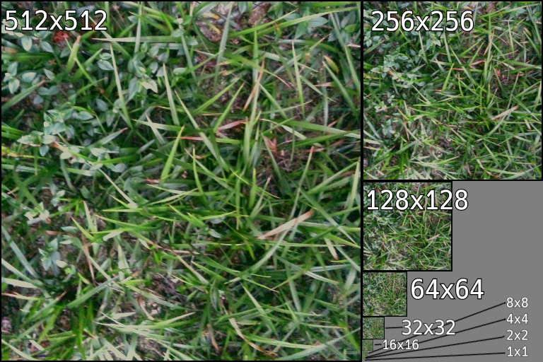
</p>

GPUは描画の効率化のため、テクスチャを小さく表示する場合でも実際に画像を縮小したりはせず、単純にそれらしい位置にあるテクセルを取得して表示します。

このため、縮小された画像の品質はあまりよくありません。そのうえ、わずかな数のピクセルを描画するためだけに、巨大なテクスチャの様々な座標にアクセスしなくてはならないため、テクセルを取得する速度が大きく低下します。

ミップマップを使うと、まず事前に高品質に縮小した画像を準備できるため、画像が縮小表示された場合でも品質が低下しません。さらに、適切なサイズのテクスチャにアクセスできるため、テクセルの取得が高速化されます。

ミップマップの欠点は、縮小画像のためにGPUメモリが余分に必要になることです。ミップマップを使用するとテクスチャサイズが1.33倍になります。

>2024年現在において、メモリ使用量が1.33倍になることは許容範囲内とされています。ただし、UI画像など2D系の画像はミップマップが不要なことが多いため、用途によって使い分けることが重要です。

DDSファイルにおけるミップマップは「元サイズの画像の次に1/2サイズの画像、その次に1/4サイズの画像、その次に1/8サイズの画像」というように、大きいサイズから順番に記録されています。

つまり、順番にデータを読み込めばミップマップを取得できます。ミップマップの数はDDSヘッダの`mipmapCount`メンバの値です。それでは、OpenGLピクセル形式を選択するプログラムの下に、次のプログラムを追加してください。

```diff
     LOG_ERROR("%sは圧縮DDSではありません", filename);
     return 0; // 作成失敗
   }
+
+  // テクスチャを作成してGPUメモリを確保
+  GLuint tex;
+  glCreateTextures(GL_TEXTURE_2D, 1, &tex);
+  glTextureStorage2D(tex, header.mipmapCount, gpuFormat, header.width, header.height);
+
+  // CPU側のメモリを確保
+  // DXT1=0.5バイト/ピクセル, DXT1以外=1バイト/ピクセル
+  auto p = std::make_unique<char[]>(header.width * header.height);
+
+  // 画像を読み込む
+  glBindTexture(GL_TEXTURE_2D, tex); // テクスチャをOpenGLコンテキストにバインド
+  uint32_t width = header.width;
+  uint32_t height = header.height;
+  for (uint32_t mipLevel = 0; mipLevel < header.mipmapCount; ++mipLevel) {
+    // 圧縮テクスチャのデータはブロック単位で記録されるので、
+    // 縦横のブロック数からバイト数を計算する
+    const uint32_t w = (width + 3) / 4;  // 横のブロック数
+    const uint32_t h = (height + 3) / 4; // 縦のブロック数
+    const uint32_t imageBytes = w * h * blockSize; // 画像のバイト数
+
+    // データを読み込んでテクスチャを作成
+    ifs.read(p.get(), imageBytes);
+    glCompressedTexSubImage2D(GL_TEXTURE_2D, mipLevel,
+      0, 0, width, height, imageFormat, imageBytes, p.get());
+
+    // 次のミップマップのために縦横を1/2サイズにする
+    width = std::max(1u, width / 2);
+    height = std::max(1u, height / 2);
+  }
+  glBindTexture(GL_TEXTURE_2D, 0); // バインド解除
 }
```

for文の先頭では、画像のバイト数を計算しています。圧縮テクスチャは4x4ピクセルのブロック単位で圧縮されています。画像の幅や高さが4の倍数でない場合、詰め物を追加して4x4にしてから圧縮されます。

そのため、画像データの総ブロック数は、幅および高さを4の倍数で切り上げて掛けたものになります。画像のバイト数を得るには、総ブロック数にブロックサイズを掛けます。次に`read`メンバ関数で画像データを読み込みます。

そして、読み込んだ画像データをGPUメモリにコピーします。圧縮テクスチャをGPUメモリにコピーするには、`glCompressedTexSubImage2D`(ジーエル・コンプレスド・テックス・サブ・イメージ・ツーディ)という、専用の関数を使う必要があります。

無圧縮テクスチャ用の`glTextureSubImage2D`関数は使えないので注意してください。

<p><code class="tnmai_code"><strong>【書式】</strong><br>
void glCompressedTexSubImage2D(バインドターゲット, ミップマップのレベル<br>
&emsp;転送先X座標, 転送先Y座標, 画像の幅, 画像の高さ,<br>
&emsp;画像のピクセル形式, 画像のバイト数, 画像データのアドレス);
</code></p>

ミップマップのレベルは0から始まります。レベル0は元サイズの画像を意味します。

注意するべきなのは、

>`glCompressedTexSubImage2D`に指定するピクセル形式は`glTextureStorage2D`に指定したピクセル形式と同じでなくてはならない。

ということです。圧縮形式の画像データは、そのままGPUメモリに配置できるように設計されているためです。

対して、無圧縮の画像データの場合はGPUメモリの構造とは無関係なことが多いです。そのため、GPUメモリを確保する`glTextureStorage2D`と、画像データをGPUメモリにコピーする`glTextureSubImage2D`は、ピクセル形式の指定方法が異なっています。

forループの末尾では、次のミップマップレベルのために縦横のサイズを半分にしています。ミップマップは段階ごとに半分のサイズになると決められているからです。

これで圧縮テクスチャを作成できました。最後に、テクスチャのパラメータを設定します。テクスチャのバインドを解除するプログラムの下に、次のプログラムを追加してください。

```diff
     height = std::max(1u, height / 2);
   }
   glBindTexture(GL_TEXTURE_2D, 0); // バインド解除
+
+  // 最大ミップマップレベルを設定
+  glTextureParameteri(tex, GL_TEXTURE_MAX_LEVEL, header.mipmapCount - 1);
+
+  // 拡大縮小フィルタを設定
+  // 縮小フィルタはミップマップを考慮して選択
+  if (header.mipmapCount > 1) {
+    glTextureParameteri(tex, GL_TEXTURE_MIN_FILTER, GL_LINEAR_MIPMAP_NEAREST);
+  } else {
+    glTextureParameteri(tex, GL_TEXTURE_MIN_FILTER, GL_LINEAR);
+  }
+  glTextureParameteri(tex, GL_TEXTURE_MAG_FILTER, GL_LINEAR);
+
+  // 作成したテクスチャを返す
+  return tex;
 }
```

OpenGLのデフォルトでは最大ミップマップレベルが1000に設定されます。当然ながら、この値は全てのミップマップテクスチャにとって大きすぎます。

そこで、`glTextureParameteri`関数を使って適切な値を設定します。レベルは0から始まるので、ミップマップ数から1を引いた値を指定します。

また、ミップマップを有効にするには、ミップマップ用の縮小フィルタを指定しなくてはなりません。これは、「ミップマップ間の補間方法」を指定する必要があるためです。

#### 【ミップマップ間の線形補間】

GPUは画像の表示面積に応じて、自動的に利用するミップマップを選択します。ただし、ミップマップは1/2単位のサイズしか存在しないため、ほとんどの場合でちょうどよい大きさのテクスチャを選ぶことはできません。

テクスチャパラメータによって、最もそれらしい大きさのミップマップで妥協するか、2つのミップマップを線形補間してより適切な色を作り出すかを選ぶことができます。利用可能な補間方法は以下の4つです。

| マクロ名 | テクスチャの線形補間 | ミップマップの線形補間 | 速度 |
|:--|:--|:--|:--|
| GL_NEAREST_MIPMAP_NEAREST | 最も近い1ピクセル       | 最も近いミップマップ        | 速い |
| GL_LINEAR_MIPMAP_NEAREST  | 周囲4ピクセルの線形補間 | 最も近いミップマップ        | 普通 |
| GL_NEAREST_MIPMAP_LINEAR  | 最も近い1ピクセル       | 2枚のミップマップの線形補間 | ちょっと遅い |
| GL_LINEAR_MIPMAP_LINEAR   | 周囲4ピクセルの線形補間 | 2枚のミップマップの線形補間 | 遅い |

マクロ名の前半は「テクスチャの補間方法」、後半は「ミップマップ間の補間方法」を表します。補間方法は`NEAREST`(ニアレスト, 「<ruby>最近傍<rt>さいきんぼう</rt></ruby>」という意味)、と`LINEAR`(リニア、「線形」という意味)の組み合わせです。

基本的な傾向として、`LINEAR`を選ぶと品質が上がり、`NEAREST`を選ぶと速度が上がります。ただ、「テクスチャの線形補間」と「ミップマップの線形補間」では変化の度合いが異なります。

| 線形補間の対象 | 品質 | 速度 |
|:--|:--|:--|
| テクスチャ | 違いが分かりやすい | 1枚のテクスチャで完結するので、ほとんど遅くならない |
| ミップマップ | 違いがあまり分からない | 2枚のミップマップを読む必要があるため、少し遅くなる |

パフォーマンスの観点から、通常は`GL_LINEAR_MIPMAP_NEAREST`が使われます。ただし、ミップマップがない(レベル0だけ)の場合、ミップマップ指定のない`GL_LINEAR`か`GL_NEAREST`のいずれかを設定する必要があります。

なお、拡大フィルタは「レベル0をさらに拡大する場合」に使われるものです。そのため、選べるのは`GL_LINEAR`と`GL_NEAREST`の2つだけです。

関数の最後では、作成したテクスチャの管理番号を返しています。これで、`LoadDDS`関数は完成です。

### 1.8 TextureコンストラクタをDDSファイルに対応させる

作成した`LoadDDS`関数を使って、`Texture`クラスのコンストラクタをDDSに対応させましょう。`Texture.cpp`を開き、`dds.h`をインクルードしてください。

```diff
 * @file Texture.cpp
 */
 #include "Texture.h"
+#include "dds.h"
 #include "Debug.h"
 #include <vector>
```

次に、`Texture`コンストラクタの定義に次のプログラムを追加してください。

```diff
 * コンストラクタ
 */
 Texture::Texture(const char* filename, GLenum wrapMode)
 {
+  // 拡張子がddsの場合はDDSファイルとみなす
+  const size_t n = strlen(filename);
+  if (n >= 4 && filename[n - 4] == '.' &&
+    tolower(filename[n - 3]) == 'd' &&
+    tolower(filename[n - 2]) == 'd' &&
+    tolower(filename[n - 1]) == 's')
+  {
+    id = LoadDDS(filename);
+    if (id) {
+      glGetTextureLevelParameteriv(id, 0, GL_TEXTURE_WIDTH, &width);
+      glGetTextureLevelParameteriv(id, 0, GL_TEXTURE_HEIGHT, &height);
+      name = filename;
+      LOG("%sを読み込みました", filename);
+    }
+    return;
+  }
+
   std::ifstream file(filename, std::ios::binary);
   if (!file) {
     LOG_ERROR("%sを開けません", filename);
```

このプログラムは、画像ファイルの拡張子が`.dds`の場合に限り、DDSファイルの読み込みを行います。`tolower`(トゥ・ローワー)は「文字を小文字に変換する」関数です。

小文字に変換してから比較することで、ファイル名が大文字か小文字かに関わらず一致判定が行えます。これでDDSファイルを読み込めるようになりました。

>大文字に変換する`toupper`(トゥ・アッパー)関数もあります。

`glGetTextureLevelParameteriv`(ジーエル・ゲット・テクスチャ・レベル・パラメータ・アイ・ブイ)関数は、テクスチャの情報を取得する関数のひとつです。

<p><code class="tnmai_code"><strong>【書式】</strong><br>
void glGetTextureLevelParameteriv(テクスチャの管理番号,<br>
&emsp;ミップマップレベル, 取得する情報を表すマクロ名, 情報を格納する変数のアドレス);
</code></p>

>この関数の詳しい使い方は、以下のURLを参照してください。<br>
>`https://registry.khronos.org/OpenGL-Refpages/gl4/html/glGetTexLevelParameter.xhtml`

### 1.9 DDSファイルを使ってみる

早速DDSファイルを読み込んで使ってみましょう。まずはDDSファイルを作成します。Visual Studioの画像エディタを使うと、画像ファイルをDDSファイルに変換することができます。

プロジェクトの`Res/MeshData`フォルダから適当なTGAファイルを選び、Visual Studioで開いてください。ゲーム起動後すぐに確認できるファイルを選ぶとよいでしょう。

次に、ファイルメニューにある「名前をつけて????.tgaを保存」を選択します。保存ダイアログボックスが開きますので、下の方にある「ファイルの種類」をDDSに変更して保存してください。

<p align="center">
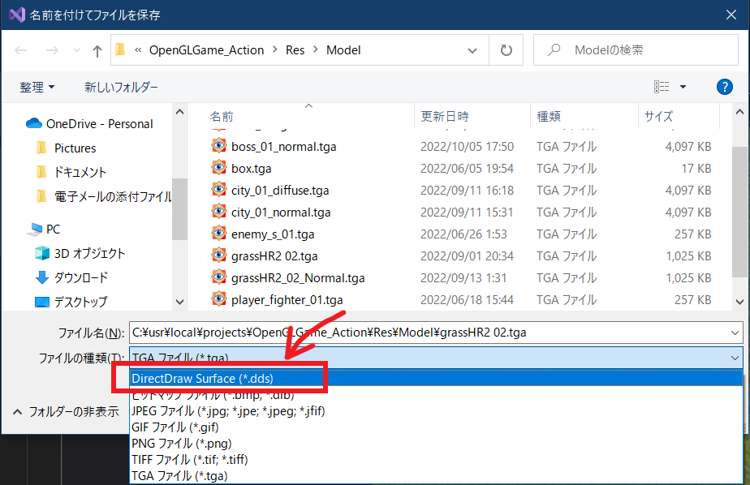
</p>

このとき、ファイルの拡張子は自動的に「.dds」に変更されます。「保存」ボタンをクリックしてファイルを保存してください。これでDDSファイルを作成することができました。

ただし、この状態では、まだ圧縮形式には変換されていません。DDSファイルのプロパティウィンドウを開き、「形式」欄を見てください。「32bpp BGRA」になっていると思います。

これは圧縮されていない形式なので圧縮形式に変更しましょう。形式欄をクリックするとリストが表示されます。上のほうにある「DXGI_FORMAT_BC1_UNORM」を選択してください。

<p align="center">
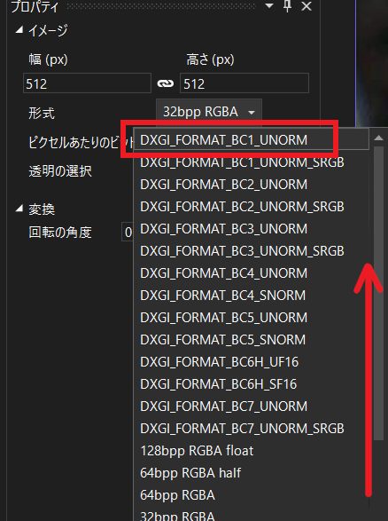
</p>

DXGI_FORMAT_BC1_UNORMはDXT1形式に相当します。形式名のBC1(ビーシー・ワン)はピクセル形式を表し、UNORM(ユー・ノーム)は`Unsinged Normalized`(アンサインド・ノーマライズド, 「符号なし、正規化あり」)を表します。

| 形式欄 | 対応するDXT形式 |
|:--|:--|
| DXGI_FORMAT_BC1_UNORM | DXT1 |
| DXGI_FORMAT_BC2_UNORM | DXT3 |
| DXGI_FORMAT_BC3_UNORM | DXT5 |

本テキストで作成したプログラムは、上記の3つの形式にしか対応していません。未対応の形式を選ばないように注意してください。

>**【変換についての注意】**<br>
>圧縮形式に変換すると元の画像に戻せなくなります。あとから画像を修正する可能性がある場合、元画像を削除しないように注意してください。

ミップマップを生成するには、画像エディタ上部の右端にある小さな`▼`(下向き三角)アイコンをクリックします。するとツールメニューが開くので「ツール→MIPSの生成」を選択します。

<p align="center">
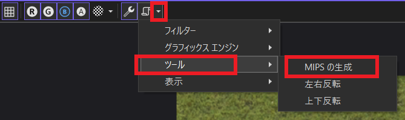
</p>

これでミップマップが作成されます。また、画像に変更を加えたり、元に戻す操作を行った場合は、もう一度「MIPSの生成」をクリックします。そうしないと、ミップマップが更新されません。

次に変換した画像を使っているMTLファイルを開き、`map_Kd`パラメータの拡張子を`.dds`に変更してください。

例として`a_piece_of_nature`フォルダの`Ground.mtl`を変更すると、次のようになります。

```diff
 newmtl Grass_texture_1
 Kd 1 1 1
-map_Kd Grass_texture_1.tga
+map_Kd Grass_texture_1.dds
 illum 2
```

MTLファイルを変更したら、プログラムをビルドして実行してください。変更した画像がこれまでと同じように表示されていたら成功です。

>**【とても重要な注意点】**<br>
>DDSファイルはDirectX用に開発されたため、画像の原点が「左上」になっています。そのため、普通にOpenGLで読み込むと上下逆になってしまいます。
>そのため、TGAファイルをDDSファイルで置き換える場合は、DDSファイルに変換すると同時に「上下反転」もやっておく必要があります。
>草テクスチャの場合はなんとなく問題なさそうに見えますが、上下左右が似ているために違いが分からないだけです。本当は上下反転する必要があります。

<pre class="tnmai_assignment">
<strong>【課題01】</strong>
ゲームに使用する3Dモデルの画像ファイルを、できるだけ多くDDSに置き換えなさい。不透明な画像はDXGI_FORMAT_BC1_UNORM, 半透明を含む画像はDXGI_FORMAT_BC3_UNORMを使ってください。
ただし、法線マップはTGAのままにしたほうがよいでしょう。DXT形式はカラー画像用に開発されたため、法線マップに使うと大きく品質が低下するからです(試しにやってみるのは良い考えです)。
</pre>

>**【1章のまとめ】**
>
>* DXT形式は、GPUが直接扱える圧縮形式。DXT1, DXT3, DXT5の3種類がある。不透明画像にはDXT1、半透明を含む画像にはDXT5が使われる。DXT3はあまり使われない。
>* DXT形式を使うと、32ビット画像データのサイズを1/8～1/4に削減できる。必要なメモリが少なくなるため、より多くの画像を読み込めるようになり、描画速度も向上する。
>* DXT形式はカラー画像用に開発された。そのため、法線マップに使うと精度が低下する(使えないわけではない)。
>* ミップマップを使うと描画品質と描画速度が向上する。その代わり、1.33倍のメモリ容量が必要になる。

<div style="page-break-after: always"></div>

## 2. BC形式に対応する

### 2.1 ブロック圧縮(BC)形式の追加データを扱う

DXT形式はカラー画像を前提として設計されているため、法線テクスチャに使うと精度不足や補間処理が影響して、正しい法線を再現できないことが多いです。

精度に関して言うと、X, Z要素は5ビット、Y要素は6ビットしかないため、X, Z要素の向きは32種類、Y要素でも64種類の向きに強制的に変換されてしまいます。

元データではXYZそれぞれが256種類の向きを持てることを考えると、DXT形式が正しい法線を再現できないのは明らかです。

そこで、BC形式では法線に適したBC5が用意されました。BC5は法線のX成分とY成分を8ビット精度を保ったまま圧縮することで、元データの1/3の圧縮率を達成します。

BC5は精度は高いのですが、圧縮率1/6のDXT1と比べるとデータ量は増えます。そのため、精度が重要なプレイヤーキャラクターなどにはBC5を使い、あまり重要でない背景にはDXT1を使う、というように使い分けることが多いです。

さて、BC形式はDDSを拡張したデータ形式として定義されています。具体的には`FourCC`に`DX10`(ディーエックス・テン)が指定されている場合、そのDDSファイルにはBC形式用の追加データが含まれます。

BC形式を読み取るために、まず追加データを定義します。`dds.h`を開き、次のプログラムを追加してください。

```diff
 // 画像特性フラグ2
 constexpr uint32_t DDSCAPS2_CUBEMAP = 0x00'0200; // キューブマップテクスチャが格納されている
 constexpr uint32_t DDSCAPS2_VOLUME  = 0x20'0000; // ボリュームテクスチャが格納されている
+
+/**
+* DirectX10で追加された拡張DDSファイルヘッダ
+*
+* fourCCが"DX10"の場合、DDS_HEADERの直後に置かれる
+*/
+struct DDS_HEADER_DXT10
+{
+  uint32_t dxgiFormat; // ピクセル形式
+  uint32_t resourceDimension; // テクスチャの次元数
+  uint32_t miscFlag;   // その他のフラグ(その1)
+  uint32_t arraySize;  // 配列テクスチャの要素数
+  uint32_t miscFlags2; // その他のフラグ(その2)
+};
+
+// ピクセル形式
+constexpr uint32_t DXGI_FORMAT_BC1_UNORM = 71; // DXT1
+constexpr uint32_t DXGI_FORMAT_BC2_UNORM = 74; // DXT3
+constexpr uint32_t DXGI_FORMAT_BC3_UNORM = 77; // DXT5
+constexpr uint32_t DXGI_FORMAT_BC4_UNORM = 80;
+constexpr uint32_t DXGI_FORMAT_BC4_SNORM = 81;
+constexpr uint32_t DXGI_FORMAT_BC5_UNORM = 83;
+constexpr uint32_t DXGI_FORMAT_BC5_SNORM = 84;
+constexpr uint32_t DXGI_FORMAT_BC6H_UF16 = 95;
+constexpr uint32_t DXGI_FORMAT_BC6H_SF16 = 96;
+constexpr uint32_t DXGI_FORMAT_BC7_UNORM = 98;

 #endif // DDS_H_INCLUDED
```

BC用の追加データはDirectX 10で追加されたので、構造体名にその名残を見ることができます。

BC1, BC2, BC3はそれぞれDXT1, DXT3, DXT5と全く同じで、名前を変えただけです。BC4は1要素の8ビットデータを圧縮します。BC5は2要素の8ビットデータを圧縮します。

BC6は浮動小数点数のRGB画像を扱います(アルファはありません)。名前に`H`が付いているのは、HDR画像用に設計されている点を強調するためです。`F16`は`Float 16`の略で「16ビット浮動小数点数」を意味します。

BC7はDXT5と同じ圧縮率ながら、より劣化の少ないRGBA画像形式です(Visual Studioでこの形式を選ぶと、圧縮完了まで数分間待たされるので注意)。

ピクセル形式に現れる`UNORM`(ユー・ノーム)や`SNORM`(エス・ノーム)はそれぞれ`Unsigned NORMalized`(符号なし正規化数)、`Signed NORMalized`(符号付き正規化数)の短縮形です。

「符号なし」バージョンの値の範囲は`0.0`～`1.0`、「符号付き」バージョンの値の範囲は`-1.0`～`+1.0`です。表現可能な範囲が狭いほど精度が高くなるので、目的に応じて符号の有無を選択する必要があります。

法線テクスチャの値の範囲は通常`-1.0`～`+1.0`なので、`SNORM`のほうが適しています。しかし、一般的には`UNORM`が使われます。後述しますが、DXT1とシェーダを共通化する場合に`UNORM`のほうが都合がよいためです。

>BC形式について、もっと詳しく知りたい場合は以下のBlogを参照してください:<br>
>`https://www.webtech.co.jp/blog/optpix_labs/format/6993/`

### 2.2 追加データを読み取る関数を定義する

次に、追加データを読み取る関数を定義します。`dds.cpp`を開き、`ReadDDSHeader`関数の定義の下に、次のプログラムを追加してください。

```diff
   tmp.reserved2 = Get(buf + 120);
   return tmp;
 }
+
+/**
+* バッファからDX10拡張ヘッダ画像情報を読み出す
+*
+* @param buf 読み出し元バッファ
+*
+* @return DX10拡張ヘッダを表すDDSHeaderDXT10構造体
+*/
+DDS_HEADER_DXT10 ReadDX10Hader(const char* buf)
+{
+  DDS_HEADER_DXT10 tmp = {};
+  tmp.dxgiFormat = Get(buf + 0);
+  tmp.resourceDimension = Get(buf + 4);
+  tmp.miscFlag = Get(buf + 8);
+  tmp.arraySize = Get(buf + 12);
+  tmp.miscFlags2 = Get(buf + 16);
+  return tmp;
+}

 } // unnamed namespace
```

### 2.3 追加データからピクセル形式を取得する

続いて、`LoadDDS`関数の定義に「DX10ヘッダを読み取って解析するプログラム」を追加します。`LoadDDS`関数にあるピクセル形式を選択するプログラムの下に、次のプログラムを追加してください。

```diff
         blockSize = e.blockSize;
         supported = true;
         break;
       }
     } // for formatList
+
+    // ピクセル形式がDX10追加データで定義されている場合
+    if (!supported && header.ddspf.fourCC == MakeFourCC('D', 'X', '1', '0')) {
+      // DX10の追加データを読み取る
+      char buf[sizeof(DDS_HEADER_DXT10)];
+      ifs.read(buf, sizeof(DDS_HEADER_DXT10));
+      const DDS_HEADER_DXT10 dx10header = ReadDX10Hader(buf);
+
+      // DX10追加データのピクセル形式とOpenGLのピクセル形式の対応表
+      constexpr struct {
+        uint32_t dxgiFormat;
+        uint32_t blockSize;
+        GLenum imageFormat;
+      } formatList[] = {
+        { DXGI_FORMAT_BC1_UNORM, 8, GL_COMPRESSED_RGBA_S3TC_DXT1_EXT },
+        { DXGI_FORMAT_BC2_UNORM, 16, GL_COMPRESSED_RGBA_S3TC_DXT3_EXT },
+        { DXGI_FORMAT_BC3_UNORM, 16, GL_COMPRESSED_RGBA_S3TC_DXT5_EXT },
+        { DXGI_FORMAT_BC4_UNORM, 8, GL_COMPRESSED_RED_RGTC1 },
+        { DXGI_FORMAT_BC4_SNORM, 8, GL_COMPRESSED_SIGNED_RED_RGTC1 },
+        { DXGI_FORMAT_BC5_UNORM, 16, GL_COMPRESSED_RG_RGTC2 },
+        { DXGI_FORMAT_BC5_SNORM, 16, GL_COMPRESSED_SIGNED_RG_RGTC2 },
+        { DXGI_FORMAT_BC6H_UF16, 16, GL_COMPRESSED_RGB_BPTC_UNSIGNED_FLOAT },
+        { DXGI_FORMAT_BC6H_SF16, 16, GL_COMPRESSED_RGB_BPTC_SIGNED_FLOAT },
+        { DXGI_FORMAT_BC7_UNORM, 16, GL_COMPRESSED_RGBA_BPTC_UNORM },
+      };
+
+      // 対応表から一致するデータを取得
+      for (const auto& e : formatList) {
+        if (dx10header.dxgiFormat == e.dxgiFormat) {
+          imageFormat = e.imageFormat;
+          blockSize = e.blockSize;
+          supported = true;
+          break;
+        }
+      }
+    } // if fourCC == DX10

     if (!supported) {
       LOG_ERROR("%sは未対応のDDSファイルです", filename);
```

### 2.4 シェーダをBC5形式に対応させる

BC5形式にはX要素とY要素しかないので、Z要素は計算で求めなくてはなりません。法線の長さは1なので、以下の式でZを求められます。

$$
X^2+Y^2+Z^2=1 \\
Z^2=1-X^2-Y^2 \\
Z = \sqrt{1-X^2-Y^2}
$$

`standard.frag`を開き、ノーマルを計算するプログラムを次のように変更してください。

```diff
   if (dot(normal, normal) > 0.0001) {
     // 8bit値であることを考慮しつつ0～1を-1～+1に変換(128を0とみなす)
     normal = normal * (255.0 / 127.0) - (128.0 / 127.0);
+ 
+    // XY成分からZ成分を復元(法線の長さは常に1なため)
+    normal.z = sqrt(1 - normal.x * normal.x - normal.y * normal.y);
 
     normal = normalize(inTBN * normal);
   } else {
```

DXT1の場合は無駄な処理にはなりますが、Zを再計算しているだけなので値は変わりません。この工夫によって、法線テクスチャにも圧縮テクスチャを使うことが可能になります。

なお、DXT1とBC5を使い分けたい場合、使えるのは`BC5_UNORM`形式のほうになります。DXT1が「符号なし正規化数」なので、同じ形式にしておかないと計算式を共用できないからです。

ただし、もしすべての法線テクスチャを`BC5_SNORM`で統一できるなら、前段にある「8bit値であることを考慮しつつ～」で行っている計算を削除できます。

>このコードには、`normal.z`について最適化の余地があります。出来の良いシェーダコンパイラなら勝手に最適化してくれるかもしれませんが、シェーダコンパイラはC++コンパイラのようには信用できないので、できる限り手動で最適化するべきです。

それでは法線テクスチャをBC5で保存して、うまく表示されるか確認しましょう。

まずはVisual Studioで適当な法線テクスチャファイルを開き、DDS形式で保存してください。

<p align="center">
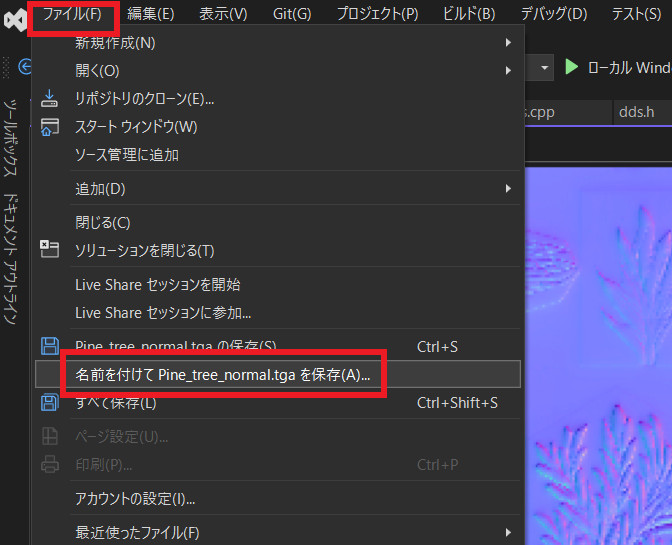
</p>

次に、プロパティウィンドウの「形式」タブから`DXGI_FORMAT_BC5_UNORM`を選択してください。

<p align="center">
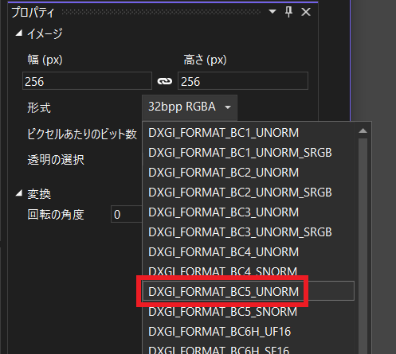
</p>

`BC5_UNORM`を選択したら、画像のタブをクリックしてファイルを選択状態にし、`Ctrl+S`キーを押してファイルを保存してください。

<p align="center">
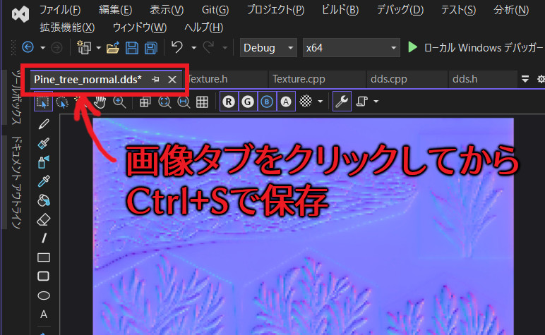
</p>

すると、画像の色が暗い黄緑色に変化します。BC5形式にはXY要素、つまりR要素とG要素に相当する要素しか記録されないので、青成分は常に0として表示されます。そのため、赤と緑が混ざって暗い黄緑色で表示されるのです。

<p align="center">
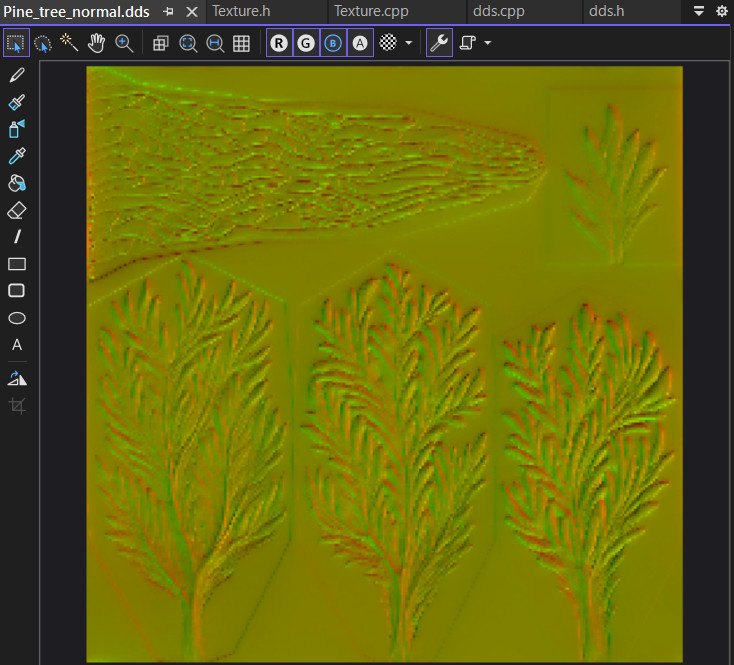
</p>

>**【UNORMと間違えてSNORMを選ぶとどうなる】**<br>
>`BC5_SNORM`を選んでも見た目は同じように見えますが、実際には画像の精度が低下しています。もし間違えてしまった場合は`Ctrl+Z`を押して画像をもとに戻し、改めて`BC5_UNORM`を選びなおしてください。

<pre class="tnmai_assignment">
<strong>【課題02】</strong>
BC5_UNORMに変更した法線テクスチャを参照しているMTLファイルを開き、ファイル名の拡張子をddsに変更してプログラムを実行しなさい。
オブジェクトの法線が、TGAのときと同じように見えていたら成功です。
</pre>

<pre class="tnmai_assignment">
<strong>【課題03】</strong>
ゲームに使用する3Dモデルの法線テクスチャファイルを、できるだけ多くBC5_UNORMに置き換えなさい。MTLファイルの変更を忘れないこと。
</pre>

>**【2章のまとめ】**
>
>* DXT1で法線テクスチャを圧縮すると、法線を正しく再現できない。
>* BC5形式は、法線テクスチャを圧縮するために作られた新しい圧縮形式。
>* BC5はXとYの2要素しか記録しない。Z要素は計算で復元する必要がある。
>* BC5_SNORMではなくBC5_UNORMを使うと、DXT1と法線の計算を共通化できる。
