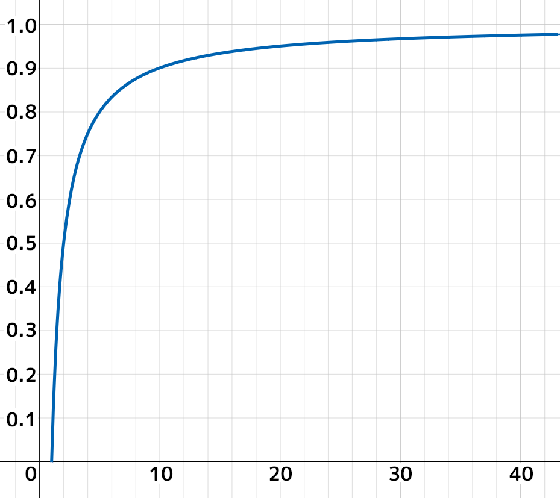
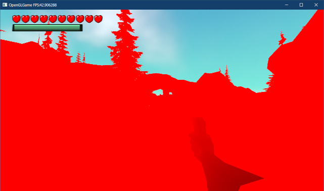
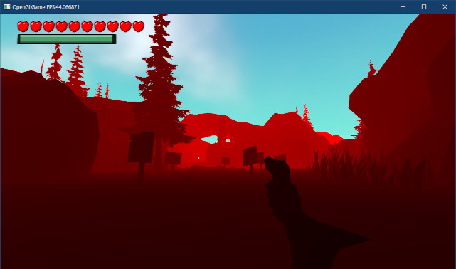
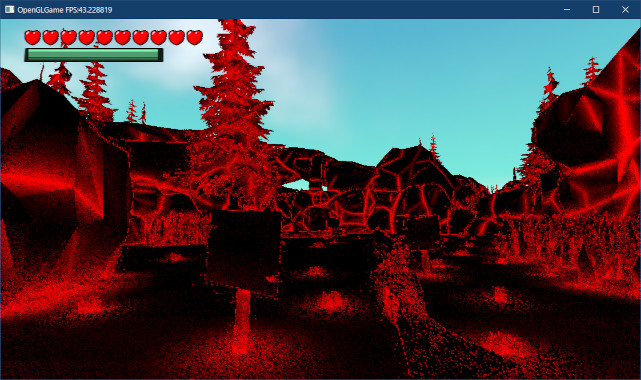
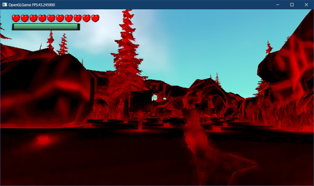
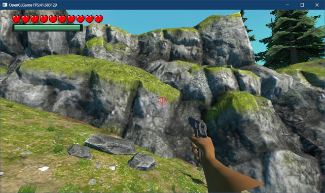
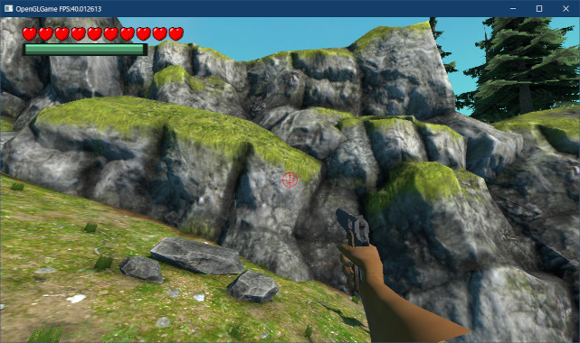

[OpenGL 3D 2024 前期 第02回]

# アンビエント オクルージョン

## 習得目標

* アンビエントオクルージョンの概念を説明できる。
* 深度バッファからビュー座標系の深度値を復元するコードが書ける。
* 偏微分関数`dFdx`、`dFdy`の機能を説明できる。

## 1. 環境遮蔽(アンビエントオクルージョン)

### 1.1 アンビエントオクルージョン(AO)について

物体上のある点について、周囲からの光がどれくらい到達するかを考えてみましょう。

点が完全な平面上にある、あるいは周囲より高い位置にある場合は、ほとんどすべての光が到達するでしょう。しかし、周囲がデコボコしていたり、周囲より低い位置にある場合、それらの環境によって光の一部が遮られます。

例えば、点の右側だけ高い壁のような形状になっている場合、右からの光は点に到達できません。結果として到達する光の量は、壁がまったくない場合と比べて半減してしまうでしょう。

現実の部屋の角や物体の継ぎ目、亀裂や穴のような部分を見てみると、実際にその外側よりも暗くなっていることが分かります。

このような、周囲の環境によって光が遮られる現象を再現する技法が「アンビエント・オクルージョン」です(Ambient=環境, Occlusion=障害、閉鎖)。日本語では「環境遮蔽(かんきょうしゃへい)」と言います。

>「アンビエントオクルージョン」は長すぎるので、以後はAO(エーオー)と呼ぶことにします。

<div style="page-break-after: always"></div>

### 1.2 SSAO(スクリーン・スペース・アンビエントオクルージョン)

物体の位置が変化しない場合、AOは事前に計算することが可能です。しかし、動く物体がある空間ではそうはいきません。

ゲーム実行中に計算すれば問題はなくなりますが、正確なAOの計算には非常に時間がかかります。そのため、ゲーム実行中に計算することは当分できないだろうと考えられていました。

しかし、2007年にCrytek(クライテック)という会社が「SSAO(スクリーン・スペース・アンビエントオクルージョン)」という技術を開発しました。

そして、実際に「Crysis(クライシス)」というゲームの実行中にAOを再現して見せたことで、状況は一変しました。現代では、ほぼすべてのゲームエンジンにSSAOが実装されています。

SSAOでは、深度バッファの情報からAOを計算します。Crytekの方法では、対象ピクセルを中心とした球体内の座標について、その座標の深度値が深度バッファの深度値より遠くにある場合に遮蔽されていると判定します。

この判定を複数のランダムな座標で行い、値の平均をピクセルの遮蔽率とします。ただ、この方法で高品質なAOを再現するには、調査するピクセル数(これを「サンプル点」、「サンプリング・ポイント」といいます)をかなり増やさなくてはなりません。

<p align="center">
<br>
Crytekの手法(実際には球体)
</p>

しかし、サンプル点を増やすと処理速度が低下します。そのため、Crysisではわずか16個のサンプル点を使い、ぼかし処理によって粗さをごまかしていました。

その後、ピクセルの後ろ側からは光が到達しないことを考慮して、調査範囲を球体ではなく半球とする方法や、ピクセルに対して線対称の座標の深度値から、ピクセルがその谷間になっているかどうかを調べる方法などが考案されています。

<p align="center">
<br>
サンプル点を減らすために、範囲を半球に限定した手法
</p>

今回は、2012年にNVidia社のMcGuire氏が考案した「SAO(スケーラブル・アンビエント・オブスキュランス)」という方法を使うことにしました。

>`obscurance`は「隠す」、「あいまいにする」という意味です。

SAOでは、対象ピクセルからサンプル点へ向かうベクトルと、対象ピクセルの法線がなす角を調べます。そして、角度が小さいほど強く遮蔽されていると判断します。

<p align="center">
<br>
サンプル点との角度差を遮蔽率とする手法(SAO)
</p>

また、既存のSSAOでは「ピクセルが視点に近い場合、サンプルする範囲が広くなりすぎて描画速度が低下する」という問題がありました。SAOでは、ブルームエフェクトのように多段階の縮小深度バッファを作成することで、速度低下を抑える工夫が導入されています。

>**【SSAOをもっと詳しく知るには】**<br>
>SSAOの種類と考え方については、以下のURLが参考になるでしょう。<br>
>`https://ambientocclusion.hatenablog.com/entry/2013/11/07/152755`

### 1.3 SAO用のシェーダを作成する

SAOではブルームエフェクトと同様に、複数のシェーダを使用します。

* 深度値を視点からの線形距離に戻すシェーダ(同時に1/2に縮小)
* 線形距離バッファを縮小するシェーダ
* SAO技法によってアンビエントオクルージョンを計算するシェーダ
* アンビエントオクルージョンをぼかすシェーダ

最初に「深度値を視点からの距離に戻すシェーダ」を作成します。`standard.frag`シェーダを確認すれば分かりますが、深度バッファに書き込まれた値は`0`～`1`に変換されます。

さらに、GPUは`w`要素による除算を自動的に行います。これらの要因があるため、深度バッファの値は視点平面からの線形距離を表しません。そのため、異なる深度のピクセルを直接比較することはできません。

以下の図の縦軸は深度バッファの値、横軸は距離です。

<p align="center">
<br>
[青=深度バッファの値 赤=本来の深度値]
</p>

図から分かるように、深度値0.2と0.3の距離の差は1mもないのに対して、深度値0.8と0.9の差は約5mになっています。このように、深度値は「どちらが手前にあるか？」には答えられますが、「2つのピクセルの奥行きの差は何メートルか？」という問いには答えられないのです。

ピクセルの間の正しい距離を計算するには、深度バッファの値を実際の線形距離に変換しなくてはなりません。

幸い、これはそんなに難しくはありません。頂点シェーダで行っている計算と逆の計算をすればいいのです。次のプログラムは、`standard.vert`から該当部分を抜き出したものです。

```c++
  const float near = 0.35;
  const float far = 1000;
  const float A = -2 * far * near / (far - near);
  const float B = (far + near) / (far - near);

  // 遠近法を有効にする
  gl_Position.w = -gl_Position.z;
  gl_Position.z = -gl_Position.z * B + A; // 深度値を補正
```

GPUによる`w`除算が行われるので、実際に深度バッファに書き込まれる値を`D`とすると、`D`は次のように計算されます。

```c++
D = 0.5 * (-gl_Position.z * B + A) / -gl_Position.z + 0.5
```

深度値を線形に戻すという問題は、`A`, `B`, `D`から`gl_Position.z`を再計算することに相当します。導出を飛ばして結論から述べると、以下の式によって線形距離に戻すことが可能です。

```c++
D` = 2 * D + 1
gl_Position.z = A / (D' - B)
```

>この式の導出は各自で行うこと。それほど難しくありません。

それではシェーダを作成しましょう。プロジェクトの`Res`フォルダに`sao_restore_depth.frag`(エスエーオー・レストア・デプス・フラグ)という名前のテキストファイルを追加してください。

追加したファイルを開き、次のプログラムを追加してください。

```diff
+#version 450
+
+out float outColor;
+
+layout(binding=0) uniform sampler2D texDepth;
+
+/**
+* 深度バッファの値からビュー空間のZ値を復元
+*/
+void main()
+{
+  // 2x2テクセルのうち、最も視点に近い値を選択
+  ivec2 uv = ivec2(gl_FragCoord.xy) * 2;
+  float d1 = texelFetch(texDepth, uv + ivec2(0, 0), 0).x;
+  float d2 = texelFetch(texDepth, uv + ivec2(0, 1), 0).x;
+  float d3 = texelFetch(texDepth, uv + ivec2(1, 1), 0).x;
+  float d4 = texelFetch(texDepth, uv + ivec2(1, 0), 0).x;
+  float depth = min(min(d1, d2), min(d3, d4));
+
+  // 深度値を線形に戻す
+  const float near = 0.35;
+  const float far = 1000;
+  const float A = -2 * far * near / (far - near);
+  const float B = (far + near) / (far - near);
+  depth = 2 * depth - 1;
+  outColor = A / (depth - B);
+}
```

このシェーダでは深度値の変換に加えて、サイズを縦横1/2(面積では1/4)に縮小する処理も行っています。テクスチャのサイズを減らすと、以後の処理でテクスチャの読み取りにかかる時間を大幅に短縮できるからです。

このような縮小処理では通常は`texture`関数を使って周辺4ピクセルの平均値を利用します。しかし、深度テクスチャの場合はこの方法は使えません。

というのは、先に説明したように「深度値が線形ではない(非線形)」だからです。このため、単純に平均すると、間違った平均値になってしまいます。

そこで、「4ピクセルのうち、最も視点に近い値」を選びます。AOの計算では隣接ピクセルとの位置関係が重要なので、手前に出っ張った部分を優先するのは理にかなっています。

周辺4ピクセルの平均値ではなく、特定のピクセルの値だけを取り出すには`texelFetch`(テクセル・フェッチ)関数を使います。

<p><code class="tnmai_code"><strong>【書式】</strong><br>
vec3 texelfetch(サンプラ, テクスチャ座標, ミップレベル);
</code></p>

`texelFech`関数では、テクスチャ座標の指定方法が「ピクセル単位」となっていることに注意してください(`texture`関数は`0.0`～`1.0`の範囲)。

例えば`texture`関数で画像の中心の色を取得するには座標に`(0.5, 0.5)`を指定します。同じことを`texelFetch`で行うには、画像が256x256だったとすると`(128,128)`を指定することになります。

ピクセル単位のテクスチャ座標を取得する方法はいろいろありますが、今回は深度テクスチャを1/2に縮小描画するため、スクリーン座標を表す`gl_FragCoord`(ジーエル・フラグ・コード)変数が利用できます。

`gl_FragCoord`はフラグメントのスクリーン座標を表します。フレームバッファサイズが960x540の場合、左下端のフラグメントの`gl_FragCoord`は`(0.5, 0.5)`、右上端は`(959.5, 539.5)`になります。

深度テクスチャは1920x1080なので、`gl_FragCoord`を2倍すると深度テクスチャの座標になります。あとは右と上方向に1ピクセルずつずらしながら4回`texelFetch`を実行します。

4つのピクセルの値を取得したら、それらうちで最も視点に近い、つまり、視点からの距離が短いピクセルを選択します。これには`min`関数を使います。

深度値`depth`を取得したら、あとは先に説明した式を使って線形距離に変換し、`outColor`に代入します。

### 1.4 線形距離を縮小するシェーダを作成する

次に、線形距離に変換したデータを更に縮小していくシェーダを作成します。これはSAOの`Scalable`(スケーラブル)という特性を実現するためです。

ブルームエフェクトのサンプリング範囲はすべてのピクセルで一定でしたが、SSAOでは視点から遠いピクセルはサンプリング範囲が狭く、視点に近いピクセルほどサンプリング範囲が広くなります。

サンプリング範囲が広くなると、それだけ広範囲のテクスチャを参照しなくてはならず、描画性能が低下するという問題がありました。

そこでSAOでは、描画範囲に応じて縮小した深度バッファを利用することで、参照するテクスチャのサイズを一定以下に抑え、性能低下を防ぐようになっています。

それでは、プロジェクトの`Res`フォルダに`sao_down_sampling.frag`(エスエーオー・ダウン・サンプリング・フラグ)という名前のテキストファイルを追加してください。

追加したファイルを開き、次のプログラムを追加してください。

```diff
+#version 450
+
+layout(binding=0) uniform sampler2D texDepth;
+
+out float outColor;
+
+layout(location=200) uniform int mipLevel; // コピー元のミップレベル
+
+void main()
+{
+  ivec2 uv = ivec2(gl_FragCoord.xy) * 2;
+  float d1 = texelFetch(texDepth, uv + ivec2(0, 0), mipLevel).x;
+  float d2 = texelFetch(texDepth, uv + ivec2(0, 1), mipLevel).x;
+  float d3 = texelFetch(texDepth, uv + ivec2(1, 1), mipLevel).x;
+  float d4 = texelFetch(texDepth, uv + ivec2(1, 0), mipLevel).x;
+  outColor = min(min(d1, d2), min(d3, d4));
+}
```

`ssao_restre_depth.frag`シェーダで線形距離への変換は済ませているので、このシェーダでは最も視点に近いピクセルを選ぶだけです。

大きな違いは、ミップレベルを指定するユニフォーム変数があることです。ミップマップは「解像度を段階的に下げた複数の画像で構成されたテクスチャ」です。

ポリゴンが視点から遠くなるほどテクスチャも縮小表示されますが、画像を効率的に縮小する方法は存在しないために描画速度が低下します。

ミップマップのアイデアは、事前に縮小した画像を用意しておき、実際に画面上に表示されるサイズに応じて適切なサイズの画像を選択することで、描画速度の低下を防ぐというものです。

SSAOでは距離が近いピクセルほどサンプリング範囲が広くなりますが、広い範囲をサンプリングすることは、機能的には画像の縮小と同じです。

そこで、SAOでは線形距離を4～5段階のミップマップ画像に縮小しておきます。サンプリング範囲に合わせたミップマップを使うことで、描画速度の低下を防ぎます。

### 1.5 深度値を線形距離に変換する

ここで、ゲームエンジンに深度バッファの線形変換と縮小処理までを実装しておきます。

まず`Texture`クラスにミップマップテクスチャを作成する機能を追加します。`Texture.h`を開き、「空のテクスチャを作成するコンストラクタ」の宣言を次のように変更してください。

```diff
   * @param height    テクスチャの高さ(ピクセル数)
   * @param gpuFormat データ形式
   * @param wrapMode  ラップモード
+  * @param levels    ミップマップテクスチャのレベル数
   */
   Texture(const char* name, int width, int height,
-    GLenum gpuFormat, GLenum wrapMode = GL_CLAMP_TO_EDGE);
+    GLenum gpuFormat, GLenum wrapMode = GL_CLAMP_TO_EDGE, int levels = 1);

   ~Texture();
```

次に`Texture.cpp`を開き、「空のテクスチャを作成するコンストラクタ」の定義を次のように変更してください。

```diff
 * 空のテクスチャを作成するコンストラクタ
 */
 Texture::Texture(const char* name, int width, int height,
-  GLenum gpuFormat, GLenum wrapMode) :
+  GLenum gpuFormat, GLenum wrapMode, int levels) :
   name(name), width(width), height(height)
 {
   glCreateTextures(GL_TEXTURE_2D, 1, &id);
-  glTextureStorage2D(id, 1, gpuFormat, width, height);
+  glTextureStorage2D(id, levels, gpuFormat, width, height);
   glTextureParameteri(id, GL_TEXTURE_WRAP_S, wrapMode);
   glTextureParameteri(id, GL_TEXTURE_WRAP_T, wrapMode);
```

ミップマップテクスチャを作成するには、`glTextureStorage2D`関数の第2引数に「作成したい最大ミップレベル」を指定するだけです。これによって、ミップマップに必要なGPUメモリが確保されます。

実際のテクスチャ作成は`TexHelper`構造体が行うので、これもミップマップに対応させます。`Engine.h`を開き、`TexHelper`構造体の定義を次のように変更してください。

```diff
   struct TexHelper : public Texture {
     TexHelper(const char* p) : Texture(p) {}
     TexHelper(const char* p, bool m, GLenum f) : Texture(p, m, f) {}
-    TexHelper(const char* p, int w, int h, GLenum f) Texture(p, w, h, f) {}
+    TexHelper(const char* p, int w, int h, GLenum f, int levels = 1) :
+      Texture(p, w, h, f, GL_CLAMP_TO_EDGE, levels) {}
   };
```

それから、描画先となるフレームバッファオブジェクトについても、書き込み先のミップマップを指定する機能を追加します。`FramebufferObject.h`を開き、コンストラクタの定義を次のように変更してください。

```diff
   * 既存のテクスチャからFBOを作成するコンストラクタ
   *
   * @param color カラーテクスチャ
   * @param depth 深度テクスチャ
+  * @param colorLevel カラーテクスチャのミップレベル
+  * @param depthLevel 深度テクスチャのミップレベル
   */
-  FramebufferObject(const TexturePtr& color, const TexturePtr& depth)
+  FramebufferObject(const TexturePtr& color, const TexturePtr& depth,
+    int colorLevel = 0, int depthLevel = 0);
   ~FramebufferObject();

   // コピーと代入を禁止
   FramebufferObject(const FramebufferObject&) = delete;
```

続いて`FramebufferObject.cpp`を開き、コンストラクタの定義を次のように変更してください。

```diff
 * 既存のテクスチャからFBOを作成するコンストラクタ
 */
 FramebufferObject::FramebufferObject(
-  const TexturePtr& color, const TexturePtr& depth)
+  const TexturePtr& color, const TexturePtr& depth,
+  int colorLevel, int depthLevel)
   : texColor(color), texDepth(depth)
 {
   glCreateFramebuffers(1, &fbo);
 
   // カラーバッファを設定
   if (color) {
-    glNamedFramebufferTexture(fbo, GL_COLOR_ATTACHMENT0, *color, 0);
+    glNamedFramebufferTexture(fbo, GL_COLOR_ATTACHMENT0, *color, colorLevel);
     width = texColor->GetWidth();
     height = texColor->GetHeight();
   } else {
     glNamedFramebufferDrawBuffer(fbo, GL_NONE);
   }
 
   // 深度バッファを設定
   if (depth) {
-    glNamedFramebufferTexture(fbo, GL_DEPTH_ATTACHMENT, *depth, 0);
+    glNamedFramebufferTexture(fbo, GL_DEPTH_ATTACHMENT, *depth, depthLevel);
     width = texDepth->GetWidth();
     height = texDepth->GetHeight();
   }
```

これで、フレームバッファの書き込み先に、特定のミップレベルを指定できるようになりました。

それでは、プログラムオブジェクトとフレームバッファオブジェクトを作成し、深度値を変換して縮小する機能を追加しましょう。`Engine.h`を開き、ブルームエフェクト用の変数定義の下に、次のプログラムを追加してください。

```diff
   ProgramObjectPtr progUpSampling;     // 拡大ぼかしシェーダ
   float bloomThreshold = 1; // 明るいとみなす閾値
   float bloomIntensity = 1; // ブルームの強さ
+
+  // SSAO用のメンバ変数
+  ProgramObjectPtr progSAORestoreDepth; // 線形距離変換シェーダ
+  ProgramObjectPtr progSAODownSampling; // 縮小シェーダ
+  FramebufferObjectPtr fboSAODepth[4];  // 深度値の縮小バッファ

   ProgramObjectPtr progImageProcessing; // 画像処理シェーダ
   mat3 colorMatrix = mat3(1); // 画像処理で使う色変換マトリクス
```

続いて`Engine.cpp`を開き、`Initialize`メンバ関数に次のプログラムを追加してください。

```diff
   progUpSampling = std::make_shared<ProgramObject>(
     "Res/simple.vert", "Res/up_sampling.frag");
   progImageProcessing = std::make_shared<ProgramObject>(
     "Res/simple.vert", "Res/image_processing.frag");
+  progSAORestoreDepth = std::make_shared<ProgramObject>(
+    "Res/simple.vert", "Res/sao_restore_depth.frag");
+  progSAODownSampling = std::make_shared<ProgramObject>(
+    "Res/simple.vert", "Res/sao_down_sampling.frag");

   glProgramUniform1f(*progShadow, locAlphaCutoff, 0.5f); // カットオフ値を設定しておく
   glProgramUniform1f(*progShadowSkeletal, locAlphaCutoff, 0.5f);
```

頂点シェーダには`simple.vert`を使います。全画面を対象とするシェーダは、とりあえず`simple.vert`を使っておけば大丈夫です。

続いてフレームバッファオブジェクトを作成します。`CreateMainFBO`メンバ関数の定義に、次のプログラムを追加してください。

```diff
   auto texMainDepth = std::make_shared<TexHelper>(
     "FBO(main depth)", width, height, GL_DEPTH_COMPONENT32);
   fboMain = std::make_shared<FramebufferObject>(texMainColor, texMainDepth);
+
+  // SAO用FBOを作成する
+  const int maxMipLevel = static_cast<int>(std::size(fboSSAODepth));
+  auto texSAODepth = std::make_shared<TexHelper>(
+    "FBO(sao depth)", width / 2, height / 2, GL_R32F, maxMipLevel);
+  for (int level = 0; level < maxMipLevel; ++level) {
+    fboSAODepth[i] = std::make_shared<FramebufferObject>(texSAODepth, nullptr, level, 0);
+  }

   // ブルーム用FBOを作成する
   fboBloom.clear();
   fboBloom.resize(6);
```

ミップマップテクスチャは複数の画像の集合です。ミップレベルごとに異なるフレームバッファオブジェクトに割り当てることができます。

作成したオブジェクトを使って、線形距離と縮小バッファを描画します。`Engine.h`を開き、`Engine`クラスのプライベートメンバに次のプログラムを追加してください。

```diff
   void CreateShadowMap(
     GameObjectList::iterator begin,
     GameObjectList::iterator end);
+  void DrawAmbientOcclusion();
   void DrawBloomEffect();
   void DrawMainImageToDefaultFramebuffer();
```

`Engine.cpp`を開き、`CreateShadowMap`メンバ関数の定義の下に、次のプログラムを追加してください。

```diff
   glProgramUniform1f(*prog3D, locShadowNormalOffset, texelSize * 1.5f);
   glProgramUniform1f(*progSkeletal, locShadowNormalOffset, texelSize * 1.5f);

   glDisable(GL_CULL_FACE);
 }
+
+/**
+* アンビエントオクルージョンを描画する
+*/
+void Engine::DrawAmbientOcclusion()
+{
+  glDisable(GL_CULL_FACE);
+  glDisable(GL_DEPTH_TEST);
+  glDisable(GL_BLEND);
+
+  glBindVertexArray(*meshBuffer->GetVAO());
+  const auto& drawParams =
+    meshBuffer->GetStaticMesh("plane_xy")->drawParamsList[0];
+
+  // 深度値を線形距離に変換(fboMain -> fboSAODepth[0])
+  glUseProgram(*progSAORestoreDepth);
+  glBindFramebuffer(GL_FRAMEBUFFER, *fboSAODepth[0]);
+  glViewport(0, 0, fboSAODepth[0]->GetWidth(), fboSAODepth[0]->GetHeight());
+  GLuint tex0 = *fboMain->GetDepthTexture();
+  glBindTextures(0, 1, &tex0);
+  glDrawElementsBaseVertex(drawParams.mode, drawParams.count,
+    GL_UNSIGNED_SHORT, drawParams.indices, drawParams.baseVertex);
+
+  glEnable(GL_BLEND);
+  glEnable(GL_DEPTH_TEST);
+  glEnable(GL_CULL_FACE);
+}

 /**
 * ブルームエフェクトを描画する
```

深度値の線形距離への変換では、カリング、深度テスト、アルファブレンドは使わないので無効化しています。そして、関数の末尾で戻しています。

>**【これらの機能を無効化しないとどうなる？】**<br>
>実際のところ、プリミティブが適切ならカリングの有無は描画に影響しません。また、`fboSAODepth`には深度バッファがアタッチされていないので、深度テストが有効であっても意味はありません。<br>
>つまり、ここで本当に無効化するべきなのは「アルファブレンド」だけです。しかし、「無効化しなくてもGPUがうまくやってくれる」ということは保証されていないため、GPUやドライバによっては速度低下の原因にならないとも限りません。使わない機能は明示的に無効化しておくほうが安全です。

次に、線形距離に変換した画像データを段階的に縮小します。深度値を線形距離に変換するプログラムの下に、次のプログラムを追加してください。

```diff
   GLuint tex0 = *fboMain->GetDepthTexture();
   glBindTextures(0, 1, &tex0);
   glDrawElementsBaseVertex(drawParams.mode, drawParams.count,
     GL_UNSIGNED_SHORT, drawParams.indices, drawParams.baseVertex);
+
+  // 縮小バッファを作成(fboSAODepth[i - 1] -> fboSAODepth[i])
+  glUseProgram(*progSAODownSampling);
+  tex0 = *fboSAODepth[0]->GetColorTexture();
+  glBindTextures(0, 1, &tex0);
+  for (int i = 1; i < std::size(fboSAODepth); ++i) {
+    glBindFramebuffer(GL_FRAMEBUFFER, *fboSAODepth[i]);
+    glViewport(0, 0, fboSAODepth[i]->GetWidth(), fboSAODepth[i]->GetHeight());
+    glProgramUniform1i(*progSAODownSampling, 200, i - 1);
+    glDrawElementsBaseVertex(drawParams.mode, drawParams.count,
+      GL_UNSIGNED_SHORT, drawParams.indices, drawParams.baseVertex);
+  }

   glEnable(GL_BLEND);
   glEnable(GL_DEPTH_TEST);
```

ミップマップテクスチャは「内部的には複数の画像の集合」ですが、テクスチャイメージユニットには「まとめてひとつのテクスチャ」として設定します。

実際、通常の3D描画ではミップマップは自動的に選択され、シェーダでミップマップを意識することはありません。しかし、今回のように「特定のミップレベルの画像だけを参照したい」場合は明示的にミップレベルを指定できます。

### 1.6 線形距離バッファを表示する

さて、線形距離バッファと縮小バッファは、SSAOを描画するための中間データです。そのため、実際に画面に表示されることはありません。

しかし、シェーダにはデバッグ機能がほとんどないため、正しく動作していることを確認するには、実際に画面に表示してみるしかありません。

そこで、テクスチャを画面に表示するだけのシェーダを用意し、線形距離バッファを確認できるようにします。

プロジェクトの`Res`フォルダに`simple.frag`という名前のテキストファイルを追加してください。追加したファイルを開き、次のプログラムを追加してください。

```diff
+#version 450
+
+layout(location=1) in vec2 inTexcoord;
+
+layout(binding=0) uniform sampler2D texColor;
+
+out vec4 outColor;
+
+void main()
+{
+  outColor = texture(texColor, inTexcoord);
+}
```

次に`Engine.h`を開き、`Engine`クラスの定義に次のプログラムを追加してください。

```diff
   // SSAO用のメンバ変数
   ProgramObjectPtr progSAORestoreDepth; // 線形距離変換シェーダ
   ProgramObjectPtr progSAODownSampling; // 縮小シェーダ
   FramebufferObjectPtr fboSAODepth[4];  // 深度値の縮小バッファ
+
+  ProgramObjectPtr progSimple; // テクスチャを描画するだけのシェーダ

   ProgramObjectPtr progImageProcessing; // 画像処理シェーダ
   mat3 colorMatrix = mat3(1); // 画像処理で使う色変換マトリクス
```

続いて`Engine.cpp`を開き、`Initialize`メンバ関数に次のプログラムを追加してください。

```diff
   progSAORestoreDepth = std::make_shared<ProgramObject>(
     "Res/simple.vert", "Res/sao_restore_depth.frag");
   progSAODownSampling = std::make_shared<ProgramObject>(
     "Res/simple.vert", "Res/sao_down_sampling.frag");
+
+  // テクスチャを描画するだけのシェーダ
+  progSimple = std::make_shared<ProgramObject>(
+    "Res/simple.vert", "Res/simple.frag");

   glProgramUniform1f(*progShadow, locAlphaCutoff, 0.5f); // カットオフ値を設定しておく
   glProgramUniform1f(*progShadowSkeletal, locAlphaCutoff, 0.5f);
```

それでは、線形距離バッファを表示しましょう。`DrawAmbientOcclusion`メンバ関数にある縮小バッファを作成するプログラムの下に、次のプログラムを追加してください。

```diff
     glProgramUniform1i(*progSAODownSampling, 200, i - 1);
     glDrawElementsBaseVertex(drawParams.mode, drawParams.count,
       GL_UNSIGNED_SHORT, drawParams.indices, drawParams.baseVertex);
   }
+
+  // (デバッグ用)線形距離バッファを描画
+  glUseProgram(*progSimple);
+  glBindFramebuffer(GL_FRAMEBUFFER, *fboMain);
+  glViewport(0, 0, fboMain->GetWidth(), fboMain->GetHeight());
+  tex0 = *fboSAODepth[0]->GetColorTexture();
+  glBindTextures(0, 1, &tex0);
+  glDrawElementsBaseVertex(drawParams.mode, drawParams.count,
+    GL_UNSIGNED_SHORT, drawParams.indices, drawParams.baseVertex);

   glEnable(GL_BLEND);
   glEnable(GL_DEPTH_TEST);
```

最後に`DrawAmbientOcclusion`メンバ関数を呼び出します。`Render`メンバ関数にある「transparent以前のキューを描画」するプログラムの下に、次のプログラムを追加してください。

```diff
   DrawGameObject(*prog3D, gameObjects.begin(), transparentBegin);
   glProgramUniform1f(*prog3D, locAlphaCutoff, 0);
   glProgramUniform1f(*progSkeletal, locAlphaCutoff, 0);
+
+  // アンビエントオクルージョンを描画
+  DrawAmbientOcclusion();

   // スカイスフィアを描画
   DrawSkySphere();
```

プログラムがけたらビルドして実行してください。次のような赤い画面が表示されたら成功です。

<p align="center">

</p>

赤くなるのは、線形距離バッファのフォーマットが`GL_R32F`、つまり赤成分だけだからです。テクスチャにない色成分は`0`になります。アルファ成分がない場合、アルファ成分は`1`になります。

しかし、ほとんどが真っ赤に染まっていて、本当に正しく描画されているのかさっぱり分かりませんね。これは深度値を線形距離に変換したことで、距離1m以上は全部赤色で表示されるためです。

こういうときは、実験として出力範囲が0～1になるようにシェーダを変更します(実験なので、後で元に戻します)。

とりあえず距離100mが1.0になるように、数値を`0.01`倍しましょう。`sao_restore_depth.frag`を開き、プログラムを次のように変更してください。

```diff
  const float A = -2 * far * near / (far - near);
  const float B = (far + near) / (far - near);
  depth = 2 * depth - 1;
- outColor = A / (depth - B);
+ outColor = A / (depth - B) * 0.01;
}
```

プログラムがけたらビルドして実行してください。距離によって濃淡がついて表示されたら、深度値の線形距離への変換はうまく動作していると考えられます。

<p align="center">

</p>

動作確認ができたので、`0.01`倍するプログラムは削除してください。

```diff
  const float A = -2 * far * near / (far - near);
  const float B = (far + near) / (far - near);
  depth = 2 * depth - 1;
- outColor = A / (depth - B) * 0.01;
+ outColor = A / (depth - B);
}
```

### 1.7 AOを計算するシェーダを作成する

本丸である「SAOによってアンビエントオクルージョンを計算するシェーダ」を作成します。このシェーダは複雑なので、段階的に作成します。

>1. 入出力変数やユニフォーム変数、定数などを定義。
>1. ピクセルの視点座標と法線を求める。
>3. 遮蔽率(アンビエントオクルージョン)の計算に使う変数の定義。
>4. `for`ですべてのサンプル点の遮蔽率を計算。
>5. 遮蔽率を平滑化(へいかつか)する。

最初に、入出力変数、ユニフォーム変数、定数を定義します。プロジェクトの`Res`フォルダに`sao.frag`という名前のテキストファイルを追加してください。

追加したファイルを開き、次のプログラムを追加してください。

```diff
+#version 450
+
+layout(location=1) in vec2 inTexcoord;
+
+out float outColor;
+
+layout(binding=0) uniform sampler2D texDepth; // 深度テクスチャ
+
+layout(location=200) uniform vec4 saoInfo;
+#define RADIUS2             (saoInfo.x) // サンプリング半径(m)の2乗
+#define RADIUS_IN_TEXCOORDS (saoInfo.y) // サンプリング半径(テクスチャ座標)
+#define BIAS                (saoInfo.z) // 平面とみなすコサイン値
+#define INTENSITY           (saoInfo.w) // AOの強度
+
+// NDC座標をビュー座標に変換するためのパラメータ
+layout(location=201) uniform vec2 ndcToView;
+
+const float twoPi = 3.14159265 * 2; // 2π(360度)
+const float samplingCount = 11;     // サンプル数
+const float spiralTurns = 7;        // サンプル点の回転回数
+const int maxMipLevel = 3;          // 最大ミップレベル
+
+// ミップレベル0になるサンプル点の距離(2^logMipOffsetピクセル)
+const int logMipOffset = 3;
```

`texDepth`(テックス・デプス)には、線形距離に変換した深度テクスチャを割り当てます。

`saoInfo`(エスエーオー・インフォ)は、SAOに使用するパラメータが設定されます。各パラメータについては実際に使うときに説明します。

`ndcToView`(エヌディーシー・トゥ・ビュー)は、NDC座標を視点(ビュー)座標に変換します。

`twoPi`(トゥー・パイ)は読んで字のごとく`2π`です。このシェーダでは、サンプリング開始位置をランダムに選択するために使用します。

SAOのサンプル点は、次のように螺旋状に選択されます。

<p align="center">

</p>

`samplingCount`(サンプリング・カウント)は、1ピクセルのAO計算で取得するサンプル数です。増やすと見た目がきれいになるかわりに描画速度が低下します。

`spiralTurns`(スパイラル・ターンズ)は、サンプリング位置を決める螺旋の巻き回数です。多すぎても少なすぎても見た目の品質が低下します。

>nvidiaによると「サンプル点の偏りを防ぐため`samplingCount`未満の最大の素数を選ぶべき」だそうです。

`maxMipLevel`(マックス・ミップ・レベル)は`texDepth`に割り当てるテクスチャの最大ミップレベルです。

GLSLには`textureQueryLevels`というミップマップ数を取得する関数があるのですが、この関数の戻り値は実装依存とされており、あまり信頼できません。そのため、定数を使うほうが安全です。

`logMipOffset`(ログ・ミップ・オフセット)は、ミップレベルが切り替わり始める距離です。サンプル点までの距離が「2の`logMipOffset`乗」ピクセルより遠い場合、より解像度の低いミップレベルが選ばれます。

GPUキャッシュの特性から、遠く離れたピクセルへのアクセスは読み取りに時間がかかります。より低解像度の画像から読み取ることで、実質的なピクセル距離を一定以下に<ruby>保<rt>たも</rt></ruby>ち、読み取り速度の低下を防ぎます。

### 1.8 ピクセルの視点座標と法線を復元する

続いて、「テクスチャ座標と深度値からピクセルの視点座標を復元する」関数を定義します。関数名は`GetViewSpacePosition`(ゲット・ビュースペース・ポジション、「視点座標系の座標を取得する」という意味)とします。

`logMipOffset`定数の定義の下に、次のプログラムを追加してください。

```diff
 // ミップレベル0になるサンプル点の距離(2^logMipOffsetピクセル)
 const int logMipOffset = 4;
+
+/**
+* ビュー座標系の座標を計算
+*/
+vec3 GetViewSpacePosition(vec2 uv, float linearDepth)
+{
+  // テクスチャ座標からNDC座標に変換
+  vec2 ndc = uv * 2 - 1;
+
+  // NDC座標から視点からの距離1mの場合の視点座標に変換
+  vec2 viewOneMeter = ndc * ndcToView;
+
+  // 距離が深度値の場合の視点座標に変換
+  return vec3(viewOneMeter * linearDepth, -linearDepth);
+}
```

`viewOneMeter`(ビュー・ワン・メーター)は、視点から線形距離1mの位置にスクリーンを表示した場合の`uv`座標を表します。この値に線形距離を掛けると、視点座標系にの座標が得られます。

続いて`main`関数を定義します。SAOシェーダはおおよそ次の手順でAOを計算します。

それでは、`GetViewSpacePosition`関数の定義の下に、次のプログラムを追加してください。

```diff
   // 距離が深度値の場合の視点座標に変換
   return vec3(viewOneMeter * linearDepth, -linearDepth);
 }
+
+/**
+* SAO(Scalable Ambient Obscurance)により遮蔽率を求める
+*/
+void main()
+{
+  // ピクセルの視点座標と法線を求める
+  float depth = textureLod(texDepth, inTexcoord, 0).x;
+  vec3 positionVS = GetViewSpacePosition(inTexcoord, depth);
+  vec3 normalVS = normalize(cross(dFdx(positionVS), dFdy(positionVS)));
+}
```

ピクセルの深度値は、常にミップレベル0(最も詳細な画像)から取得します。特定のミップレベルのテクスチャからデータを取得するには、`textureLod`(テクスチャ・エルオーディー)関数を使います。

<pre class="tnmai_code"><strong>【書式】</strong><code>
カラーデータ textureLod(サンプラ, テクスチャ座標, ミップレベル);
</code></pre>

`positionVS`(ポジション・ブイエス)変数には、テクスチャ座標と線形深度値から復元された「ピクセルの視点座標」が格納されます。`VS`は`View Space`の短縮形です。

ピクセルの法線は、視点座標を利用して計算されます。隣接するピクセルの視点座標に向かうベクトルがあるとします。このベクトルは、ピクセルが属する平面と平行なはずです。

平面に平行なベクトルが2つあれば、その2つの外積を求めることで平面に垂直なベクトルが求められます。そして、これはピクセルの法線と一致するはずです。

この工程は、普通に考えると`uv`をずらして視点座標を求めれば解決できますが、各ピクセルについて視点座標を3回求める必要があるため描画速度が低下してしまいます。

幸いなことに、この余分な計算は回避可能です。これには、隣接するピクセルの変数との差分を返す`dFdx`(ディーエフ・ディーエックス)関数と`dFdy`(ディーエフ・ディーワイ)関数を使います。

<pre class="tnmai_code"><strong>【書式】</strong><code>
X方向の差分 dFdx(差分を求めたい式);
</code></pre>

<pre class="tnmai_code"><strong>【書式】</strong><code>
Y方向の差分 dFdy(差分を求めたい式);
</code></pre>

これらの関数は、引数で指定された変数について、隣接ピクセルの同じ変数との差分を返します。`dFdx`はX軸方向の差分、`dFdy`はY軸方向の差分になります。

この関数が成立するのは、GPUが複数のピクセルのシェーダを同時平行で実行しているからです。

さて、座標AとBの差分はAからBへ向かうベクトルになります。ここではX軸方向とY軸方向の視点座標の差分を外積することで、平面の法線ベクトルを求めています。

>`dFdx`と`dFdy`による法線は「推測値」でしかない、という点に注意してください。「隣り合うピクセルがそれぞれ別の平面に属する場合」には対応できないからです。

### 1.9 AOの計算に使う変数を計算する

次に、`for`ループで何度も使用する変数を計算します。視点座標と法線を求めるプログラムの下に、次のプログラムを追加してください。

```diff
   float depth = textureLod(texDepth, inTexcoord, 0).x;
   vec3 positionVS = GetViewSpacePosition(inTexcoord, depth);
   vec3 normalVS = normalize(cross(dFdx(positionVS), dFdy(positionVS)));
+
+  // フラグメントごとに回転の開始角度をずらすことで見た目を改善する
+  const ivec2 iuv = ivec2(gl_FragCoord.xy);
+  const float startAngle = mod((3 * iuv.x ^ iuv.y + iuv.x * iuv.y) * 10, twoPi);
+
+  // ワールド座標系とスクリーン座標系のサンプリング半径
+  float radiusSS = RADIUS_IN_TEXCOORDS / depth;
+  float pixelsSS = radiusSS * textureSize(texDepth, 0).y;
+
+  float occlusion = 0; // 遮蔽率
+  for (int i = 0; i < samplingCount; ++i) {
+  }
+
+  // 平均値を求め、AOの強さを乗算する
+  occlusion = min(1.0, occlusion / samplingCount * INTENSITY);
 }
```

`iuv`(アイ・ユーブイ)は「int型のUV座標」という程度の意味です。`iuv`変数は次行で乱数計算を行うために使います。

`startAngle`(スタート・アングル)は、サンプル点の螺旋の開始角度です。シェーダでは乱数が使えないため、この奇妙な計算式によって擬似的なランダム値を生成しています。

>この式はnvidiaのサンプルプログラムから借用しました。

`radiusTS`(レイディウス・ティーエス)は、テクスチャ座標系のサンプリング半径です。`pixelsSS`(ピクセルズ・エスエス)は、スクリーン座標系のサンプリング半径です。

これらの値は、「最も外側のサンプル点までの距離」になります。

### 1.10 遮蔽率(AO)を計算する

続いて、実際にアンビエントオクルージョンを計算する`for`ループを作成します。実際の計算では以下の処理が行われます。

>1. サンプル点の位置を少しずつ遠くしていく。
>2. サンプル点までの距離に対応するミップレベルを求める。
>3. 選択したミップレベルの深度値から視点座標を計算。
>4. 「サンプル点に向かうベクトルとピクセル法線のなす角」が小さいほど、遮蔽率が高くなる。
>5. サンプル点がピクセルに近いほど、遮蔽率が高くなる。

まず1, 2, 3をプログラムします。`for`文の中に次のプログラムを追加してください。

```diff
   float occlusion = 0; // 遮蔽率
   for (int i = 0; i < samplingCount; ++i) {
+    // サンプル点の角度と距離を求める
+    float ratio = (float(i) + 0.5) * (1.0 / samplingCount);
+    float angle = ratio * (spiralTurns * twoPi) + startAngle;
+    vec2 unitOffset = vec2(cos(angle), sin(angle)); 
+
+    // サンプル点の視点座標を求める
+    vec2 uv = inTexcoord + ratio * radiusTS * unitOffset;
+
+    // 距離が遠いほど高いミップレベルを選択
+    int mipLevel = clamp(findMSB(int(ratio * pixelsSS)) - logMipOffset, 0, maxMipLevel);
+
+    // サンプル点の視点座標を求める
+    float sampleDepth = textureLod(texDepth, uv, mipLevel).x;
+    vec3 samplePositionVS = GetViewSpacePosition(uv, sampleDepth);
   }

   // 平均値を求め、AOの強さを乗算する
   occlusion = min(1.0, occlusion / samplingCount * INTENSITY);
```

ミップレベルを選択するときに`findMSB`(ファインド・エムエスビー)関数を使っています。この関数は「`1`になっている最上位ビットの位置」を返します。

<pre class="tnmai_code"><strong>【書式】</strong><code>
最上位ビットの位置 findMSB(MSBを求めたい整数);
</code></pre>

`MSB`は`Most Significant Bit`(モスト・シグニフィカント・ビット)の短縮形で、意味は「最も重要度の高いビット」です。

>なお「最も重要度の低いビット」は`Least Significant Bit`(リースト・シグニフィカント・ビット)、`LSB`と呼ばれます。これは「`1`になっている最下位ビット」を意味します。

例えば、`1`のMSBは`0`、`100`のMSBは`7`、`10000`のMSBは`13`です。整数値が`15`以下の場合、MSBが`logMipOffset`の値`3`以下になるので、距離15ピクセル以下ならミップレベル0の画像が使われます。

距離が`16`～`31`ではMSBが`4`となり、ミップレベル1の画像が使われます。更に遠くなるとミップレベル2または3の画像が使われます。

つまり、このプログラムではMSBを「おおまかな距離を示すパラメータ」として使っています。実際に、MSBが1増えるごとにピクセル距離はおよそ2倍になります。

また、ミップレベルが1増えるごとに1ピクセルの大きさは縦横2倍になります。距離が2倍遠くなるごとにミップレベルを上げると、実際のピクセル距離を増やすことなく深度値を調べられます。

もちろん、ミップレベルが上がると詳細度も下がるので、深度値はどんどん不正確になっていきます。しかし、遠くの深度値ほどピクセルに与える影響が小さくなるため、あまり問題になりません。

続いて、4と5をプログラムします。サンプル店の視点座標を求めるプログラムの下に、次のプログラムを追加してください。

```diff
     // サンプル点の視点座標を求める
     float sampleDepth = textureLod(texDepth, uv, mipLevel).x;
     vec3 samplePositionVS = GetViewSpacePosition(uv, sampleDepth);
+
+    // サンプル点へのベクトルと法線のコサインを求める
+    // コサインが1(垂直)に近いほど遮蔽率が上がる
+    vec3 v = samplePositionVS - positionVS;
+    float vn = dot(v, normalVS); // 角度による遮蔽率
+
+    // サンプル点が中心に近いほど遮蔽率が上がる
+    float vv = dot(v, v);
+    float f = max(RADIUS2 - vv, 0); // 距離による遮蔽率
+
+    // サンプル点までの距離とコサインからAOを求める
+    occlusion += f * f * f * max((vn - BIAS) / (vv + 0.001), 0);
   }

   // 平均値を求め、AOの強さを乗算する
   occlusion = min(1.0, occlusion / samplingCount * INTENSITY);
```

サンプル点の深度値から視点座標を求めたら、「サンプル店の視点座標 - ピクセルの視点座標」という式で「サンプル点に向かうベクトル」を計算します。

このベクトルと法線のなす角が0°に近いほど、そのサンプル点はピクセル平面より高い位置にあります。それだけ、サンプル点の方向からの光が遮られるため遮蔽率が高くなります。

角度から遮蔽率を求めるには内積を使います。内積を使うことで、ベクトルが平面に垂直な場合は`1`、平行な場合は`0`になります。

しかし、たとえサンプル点が高い位置にあったとしても、サンプル点が遠くにある場合は、途中の開けた空間からの光が届くはずです。つまり遠くのサンプル点は遮蔽率が低くなります。

これらの理由から、ピクセルの遮蔽率は「サンプル点までの角度と距離の両方」を総合して求めます。

このとき、`f`を3乗しているのは「3乗のカーブは1乗や2乗、4乗より見た目が良い」という、純粋に審美的な理由によります。

また`vn`には`v`の長さ成分が含まれるため、「長さの2乗」で割ることで長さの成分を軽減しています。

>**【「長さ」じゃなくて「長さの2乗」?】**<br>
>確かに、正しい角度を求めるには「長さの2乗」ではなく「長さ」を使う必要があります。しかし、長さを求めるには平方根が必要です。そして、平方根は時間のかかる処理なので、できれば入れたくありません。<br>
>また、実際に平方根を追加して「長さ」で割るようにしても、AOの見た目はあまり変わりません。参考にしたnvidiaのコードでも平方根は使っていません。<br>
>そもそもAOはブルームと同様に「それっぽくするためのエフェクト」なので、物理的な正確性を求める意味は薄いのです。

### 1.11 遮蔽率を平滑化する

最後に、隣接するピクセル間で遮蔽率を平滑化、つまり、なめらかにします。方法は「隣接するピクセルとの深度値の差が少ない場合、隣接ピクセルとの間で遮蔽率を平均化する」というものになります。

AOの平均値を求めてインテンシティを乗算するプログラムの下に、次のプログラムを追加してください。

```diff
   // 平均値を求め、AOの強さを乗算する
   occlusion = min(1.0, occlusion / samplingCount * INTENSITY);
+
+  // 水平または垂直に近い面のオクルージョンを平均化する。
+  if (abs(dFdx(positionVS.z)) < 0.02) {
+    occlusion -= dFdx(occlusion) * ((iuv.x & 1) - 0.5);
+  }
+  if (abs(dFdy(positionVS.z)) < 0.02) {
+    occlusion -= dFdy(occlusion) * ((iuv.y & 1) - 0.5);
+  }
+
+  outColor = occlusion;
 }
```

「隣接ピクセルとの深度値の差」は`dFdx`と`dFdy`で求められます。この値が一定値未満の場合は「同じ平面に属している」とみなして、遮蔽率の平均を求めます。

`dFdx`はスクリーンX座標が偶数のときは右のピクセルとの差分、奇数のときは左のピクセルとの差分を返します(`dFdy`の場合、スクリーンY座標が偶数のときは上、奇数のときは下との差分になります)。

そこで、スクリーン座標が偶数のときは差分の半分を加算、奇数のときは差分の半分を減算することで、2ピクセルの平均を求めています。

>平均化の式は巧妙に作られているため、ビット演算や`dFdx`, `dFdy`の仕様に慣れていないと理解しにくいかもしれません。

これで、SAOを計算するシェーダは完成です。

### 1.12 SAOの計算結果を表示する

作成したSAOシェーダをゲームエンジンに読み込んで、どのような表示になるかを確認しましょう。`Engine.h`を開き、SSAO用のメンバ変数の定義に次のプログラムを追加してください。

```diff
   // SSAO用のメンバ変数
   ProgramObjectPtr progSAORestoreDepth; // 線形距離変換シェーダ
   ProgramObjectPtr progSAODownSampling; // 縮小シェーダ
+  ProgramObjectPtr progSAO;             // SAO計算シェーダ
   FramebufferObjectPtr fboSAODepth[4];  // 深度値の縮小バッファ
+  FramebufferObjectPtr fboSAO;          // SAO計算結果バッファ

   ProgramObjectPtr progSimple; // テクスチャを描画するだけのシェーダ

   ProgramObjectPtr progImageProcessing; // 画像処理シェーダ
```

次に`Engine.cpp`を開き、`Initialize`メンバ関数の定義に次のプログラムを追加してください。

```diff
   progSAORestoreDepth = std::make_shared<ProgramObject>(
     "Res/simple.vert", "Res/sao_restore_depth.frag");
   progSAODownSampling = std::make_shared<ProgramObject>(
     "Res/simple.vert", "Res/sao_down_sampling.frag");
+  progSAO = std::make_shared<ProgramObject>(
+    "Res/simple.vert", "Res/sao.frag");

   // テクスチャを描画するだけのシェーダ
   progSimple = std::make_shared<ProgramObject>(
     "Res/simple.vert", "Res/simple.frag");
```

続いて、`CreateMainFBO`メンバ関数の定義に次のプログラムを追加してください。

```diff
   for (int level = 0; level < maxMipLevel; ++level) {
     fboSAODepth[i] = std::make_shared<FramebufferObject>(texSAODepth, nullptr, level, 0);
   }
+  auto texSAO = std::make_shared<TexHelper>(
+    "FBO(sao)", width / 2, height / 2, GL_R8);
+  fboSAO = std::make_shared<FramebufferObject>(texSAO, nullptr);

   // ブルーム用FBOを作成する
   fboBloom.clear();
```

SAOの計算結果を記録するテクスチャは`GL_R8`(8ビットの赤要素だけの形式)で作成します。

アンビエントオクルージョンは「へこんだ部分が多少暗く見える」程度で十分に役割を果たすので、深度値ほど詳細なデータは必要ないからです。

次に、`DrawAmbientOcclusion`メンバ関数の定義に、SAOシェーダを実行するプログラムを追加してください。

```diff
     glDrawElementsBaseVertex(drawParams.mode, drawParams.count,
       GL_UNSIGNED_SHORT, drawParams.indices, drawParams.baseVertex);
   }
+
+  // SAO制御用パラメータを設定
+  const float radius = 1.0f; // ワールド座標系におけるAOのサンプリング半径(単位=m)
+  const float bias = 0.012f; // 平面とみなして無視する角度のコサイン
+  const float intensity = 5; // AO効果の強さ
+  glProgramUniform4f(*progSAO, 200, radius * radius,
+    0.5f * radius * GetFovScale(), bias, intensity / pow(radius, 6.0f));
+
+  // NDC座標を視点座標に変換するパラメータを設定
+  const float w = static_cast<float>(fboSAODepth[0]->GetWidth());
+  const float h = static_cast<float>(fboSAODepth[0]->GetHeight());
+  const float aspectRatio = w / h;
+  const float invFovScale = 1.0f / GetFovScale();
+  glProgramUniform2f(*progSAO, 201, invFovScale * aspectRatio, invFovScale);
+
+  // SAOを計算
+  glUseProgram(*progSAO);
+  glBindFramebuffer(GL_FRAMEBUFFER, *fboSAO);
+  tex0 = *fboSAODepth[0]->GetColorTexture();
+  glBindTextures(0, 1, &tex0);
+  glDrawElementsBaseVertex(drawParams.mode, drawParams.count,
+    GL_UNSIGNED_SHORT, drawParams.indices, drawParams.baseVertex);

-  // (デバッグ用)線形距離バッファを描画
+  // (デバッグ用)SAOバッファを描画
   glUseProgram(*progSimple);
   glBindFramebuffer(GL_FRAMEBUFFER, *fboMain);
-  tex0 = *fboSAODepth[0]->GetColorTexture();
+  tex0 = *fboSAO->GetColorTexture();
   glBindTextures(0, 1, &tex0);
   glDrawElementsBaseVertex(drawParams.mode, drawParams.count,
```

`radius`(レイディウス)定数は「ピクセルから最も遠いサンプリング点までの距離」です。大きくするとAOで暗くなる範囲が広がりますが、処理速度が低下します。

`bias`(バイアス)定数は「角度のコサイン」で指定します。`0.012`を度数法で表すと約89°となります。この値はnvidiaの論文で使われている値ですが、厳格すぎるためもう少し大きくするほうが良いかもしれません。

`intensity`(インテンシティ)定数は、アンビエントオクルージョンのかかる強さです。この数値が大きいほどAOが分かりやすくなります。大きすぎると見た目が不自然になるので、ほどほどの値にしておきましょう。

ただし、実際にユニフォーム変数に設定されるのは、`intensity`を`radius`の6乗で割った値になります。`radius`が`1`の場合、この値は`intensity`と一致します。

このような計算をしているのは、SAO計算式の都合で半径が小さいと遮蔽率も小さくなってしまうためです。この計算によって、半径によらず一定の遮蔽率が維持されるようになっています。

NDC座標系から視点座標系への変換パラメータは、FOVとアスペクト比率から計算します。

プログラムが書けたらビルドして実行してください。次の画像のように、へこんだ部分の周囲が赤く、平らな部分が黒く表示されていたら成功です。

<p align="center">

</p>

### 1.13 ぼかしシェーダを作成する

SAOを計算した結果を見て気づくのは、全体的に粒子が目立つことでしょう。この粒状感は、多少サンプル数を増やす程度では改善されません。そこで、画像をぼかして粒子が目立たないようにします。

プロジェクトの`Res`フォルダに`sao_blur.frag`(エスエーオー・ブラー・フラグ)という名前のテキストファイルを追加してください。

最初に変数を定義します。追加したファイルを開き、次のプログラムを追加してください。

```diff
+#version 450
+
+layout(binding=0) uniform sampler2D texColor; // 遮蔽率
+layout(binding=1) uniform sampler2D texDepth; // 線形深度値
+
+out vec4 outColor;
+
+// ぼかし係数の配列
+const float gaussian[5] = 
+  { 0.153170, 0.444893, 0.422649, 0.392902, 0.362970 };
+
+const int blurRadius = 4;        // ぼかし半径
+const int blurScale = 2;         // ぼかし半径の拡大率
+const float edgeDistance = 0.15; // 同じ物体とみなす深度差(単位=m)
+const float edgeSharpness = 1 / edgeDistance; // 物体の輪郭をぼかさないための係数
+const float far = 1000;          // ファー平面の深度値
+
+/**
+* エントリーポイント
+*/
+void main()
+{
+}
```

`gaussian`(ガウシアン)は、中心からの距離に対応する重要度の配列です。ぼかし半径が`4`ピクセルなので、中心の0ピクセル目を加えた5要素の配列になっています。

「ガウシアン」という名前なのは、数学の「ガウス分布」にもとづいた係数になっているからです。

ただし、通常のガウス分布では中心から離れるほど係数が小さくなりますが、この配列は中心だけ例外的に小さくなっています。

これは、「同一平面にある隣接するピクセル間の遮蔽率は似ているはず」という推測によります。これは、自分自身の遮蔽率よりも周囲の遮蔽率の平均値のほうが正しい可能性が高いことを意味します。

この推測により、0番目を除く係数には本来のガウス分布に`0.3`が加算されています。

>**【足す理由は分かったけど、なぜ0.3を選んだの？】**<br>
>nvidiaのサンプルプログラムには`0.3`という数値の根拠は書いてありませんでした。こういう場合、いろいろ試して、たまたまうまくいった値である可能性が高いです。

実際のぼかし処理ではこの係数に加えて、深度値を利用した物体の輪郭判定を行い、輪郭だと判定されたら係数を小さくしてぼけにくくする処理が行われます。

このような、輪郭(と思われる)部分を残しつつ、輪郭ではない部分をぼかす処理は「バイラテラル・フィルタ」または「バイラテラル・ブラー」と呼ばれます。

`bilateral`(バイラテラル)は「2つの面を持つ」や「両側にある」という意味で、画像処理では「2つの領域の境界を維持する」というような意味で使われています。

バイラテラルフィルタを実行するために、まず基準となるピクセルの遮蔽率と深度値を取得します。`main`関数の定義に次のプログラムを追加してください。

```diff
 * エントリーポイント
 */
 void main()
 {
+  // ピクセルの遮蔽率と深度値を取得
+  ivec2 uv = ivec2(gl_FragCoord.xy);
+  outColor = texelFetch(texColor, uv, 0);
+  float depth = texelFetch(texDepth, uv, 0).x;
+
+  // 深度値がファー平面以上の場合、そのピクセルは背景なのでぼかさない
+  if (depth >= far) {
+    return;
+  }
 }
```

深度値がファー平面の値以上の場合、そのピクセルは物体の存在しない背景のはずです。物体が存在しなければなにも遮蔽されないはずで、ぼかす必要もないので即座にリターンします。

この判定によって、空などの背景にアンビエントオクルージョンがにじまないようにしています。

続いてバイラテラル・フィルタを作成します。背景を判定する`if`文の下に、次のプログラムを追加してください。

```diff
   // 深度値がファー平面以上の場合、そのピクセルは背景なのでぼかさない
   if (depth >= farPlaneZ) {
     return;
   }
+
+  // バイラテラル・フィルタを実行
+  outColor *= gaussian[0] * gaussian[0];
+  float totalWeight = gaussian[0] * gaussian[0];
+  for (int y = -blurRadius; y <= blurRadius; ++y) {
+    for (int x = -blurRadius; x <= blurRadius; ++x) {
+      // 中心は取得済みなので無視する
+      if (y == 0 && x == 0) {
+        continue;
+      }
+
+      // サンプル点のウェイト(重要度)を取得
+      float weight = gaussian[abs(x)] * gaussian[abs(y)];
+
+      // 中心との深度値の差によって物体の境界を判定し、ウェイトを調整
+      ivec2 sampleUV = uv + ivec2(x, y) * blurScale;
+      float sampleDepth = texelFetch(texDepth, sampleUV, 0).x;
+      weight *= max(0.0, 1.0 - edgeSharpness * abs(sampleDepth - depth));
+
+      // 遮蔽率と合計ウェイトを更新
+      outColor += texelFetch(texColor, sampleUV, 0) * weight;
+      totalWeight += weight;
+    }
+  }
+
+  outColor /= totalWeight;
 }
```

サンプル点の相対座標は`(x, y) * blurScale`になります。`blurScale`が2なので、サンプル点は2ピクセルおきに配置されます。

これだと飛ばされたピクセルの情報が欠落しますが、前段に当たるSAO自体が簡単なぼかし効果を持つため、2ピクセルおきでも十分な情報を集められます。

また、サンプリング範囲は`blurRadius`(ブラー・レイディウス)が`4`なので、`17x17`ピクセルの正方形になります。

さて、このプログラムをバイラテラル・フィルタとして働かせているのは、「中心との深度値の差によって物体の境界を判定し、ウェイトを調整」するプログラムです。

このプログラムでは、中央ピクセルとサンプル点の深度値の差が`edgeDistance`(エッジ・ディスタンス)に近づくほど重要度が低下し、`edgeDistance`以上になると重要度が0になります。

現在、`edgeDistance`は`0.15`、つまり15cmに設定されています。つまり、深度値の差が15cm以上ある場合は、そのサンプル点は中央ピクセルとは異なる平面に属する、と判断されるわけです。

また、15cmぴったりでちょうど切り替わるわけではなく「15cmに近いほど異なる平面に属する可能性が高まる」という設計になっています。これによって、ぼかし効果の切り替わりが不自然に目立つことを防いでいます。

>深度差の15cmは、nvidiaのSAOの論文で使用された値です。この値は大抵のシーンでうまく機能しますが、シーンによってはより自然な見た目を得るために調整する必要があるかもしれません。

これでぼかしシェーダは完成したので、ゲームエンジンで読み込んで実行しましょう。`Engine.h`を開き、SSAO用のメンバ変数定義に次のプログラムを追加してください。

```diff
   // SSAO用のメンバ変数
   ProgramObjectPtr progSAORestoreDepth; // 線形距離変換シェーダ
   ProgramObjectPtr progSAODownSampling; // 縮小シェーダ
   ProgramObjectPtr progSAO;             // SAO計算シェーダ
+  ProgramObjectPtr progSAOBlur;         // SAO用ぼかしシェーダ
   FramebufferObjectPtr fboSAODepth[4];  // 深度値の縮小バッファ
   FramebufferObjectPtr fboSAO;          // SAO計算結果バッファ
+  FramebufferObjectPtr fboSAOBlur;      // ぼかし結果バッファ

   ProgramObjectPtr progSimple; // テクスチャを描画するだけのシェーダ
```

次に`Engine.cpp`を開き、`Initialize`メンバ関数の定義に次のプログラムを追加してください。

```diff
   progSAODownSampling = std::make_shared<ProgramObject>(
     "Res/simple.vert", "Res/sao_down_sampling.frag");
   progSAO = std::make_shared<ProgramObject>(
     "Res/simple.vert", "Res/sao.frag");
+  progSAOBlur = std::make_shared<ProgramObject>(
+    "Res/simple.vert", "Res/sao_blur.frag");

   // テクスチャを描画するだけのシェーダ
   progSimple = std::make_shared<ProgramObject>(
     "Res/simple.vert", "Res/simple.frag");
```

続いて、`CreateMainFBO`メンバ関数の定義に次のプログラムを追加してください。

```diff
   auto texSAO = std::make_shared<TexHelper>(
     "FBO(sao)", width / 2, height / 2, GL_R8);
   fboSAO = std::make_shared<FramebufferObject>(texSAO, nullptr);
+  auto texSAOBlur = std::make_shared<TexHelper>(
+    "FBO(sao blur)", width / 2, height / 2, GL_R8);
+  fboSAOBlur = std::make_shared<FramebufferObject>(texSAOBlur, nullptr);

   // ブルーム用FBOを作成する
   fboBloom.clear();
```

最後に、ぼかしシェーダを実行して結果を表示します。`DrawAmbientOcclusion`メンバ関数の定義に次のプログラムを追加してください。

```diff
   tex0 = *fboSAODepth[0]->GetColorTexture();
   glBindTextures(0, 1, &tex0);
   glDrawElementsBaseVertex(drawParams.mode, drawParams.count,
     GL_UNSIGNED_SHORT, drawParams.indices, drawParams.baseVertex);
+
+  // SAOの結果をぼかす
+  glUseProgram(*progSAOBlur);
+  glBindFramebuffer(GL_FRAMEBUFFER, *fboSAOBlurred);
+  tex0 = *fboSAO->GetColorTexture();
+  glBindTextures(0, 1, &tex0);
+  GLuint tex1 = *fboSAODepth[0]->GetColorTexture();
+  glBindTextures(1, 1, &tex1);
+  glDrawElementsBaseVertex(drawParams.mode, drawParams.count,
+    GL_UNSIGNED_SHORT, drawParams.indices, drawParams.baseVertex);

-  // (デバッグ用)SAOバッファを描画
+  // (デバッグ用)ぼかしバッファを描画
   glUseProgram(*progSimple);
   glBindFramebuffer(GL_FRAMEBUFFER, *fboMain);
-  tex0 = *fboSAO->GetColorTexture();
+  tex0 = *fboSAOBlur->GetColorTexture();
   glBindTextures(0, 1, &tex0);
   glDrawElementsBaseVertex(drawParams.mode, drawParams.count,
```

プログラムがけたらビルドして実行してください。赤い部分がぼかされて粒状感が減っていたら成功です。

<p align="center">

</p>

### 1.14 AOをフレームバッファに合成する

長かったSAOの作成もようやく最後の段階に来ました。ぼかした結果をメインフレームバッファに合成します。

アンビエントオクルージョンを反映する方法はいくつかありますが、簡単なのは「黒い画像のアルファ値に遮蔽率を設定してフレームバッファにブレンドする」ことです。

これは、専用のシェーダを書く、またはテクスチャをスウィズリングする、のどちらの方法でも実現できます。今回は、新しいシェーダを書かなくて済むのでスウィズリングを使うことにします。

`CreateMainFBO`メンバ関数にある、ぼかし用バッファを作成するプログラムに、次のプログラムを追加してください。

```diff
   fboSAO = std::make_shared<FramebufferObject>(texSAO, nullptr);
   auto texSAOBlur = std::make_shared<TexHelper>(
     "FBO(sao blur)", width / 2, height / 2, GL_R8);
+  glTextureParameteri(*texSAOBlurred, GL_TEXTURE_SWIZZLE_R, GL_ZERO);
+  glTextureParameteri(*texSAOBlurred, GL_TEXTURE_SWIZZLE_G, GL_ZERO);
+  glTextureParameteri(*texSAOBlurred, GL_TEXTURE_SWIZZLE_B, GL_ZERO);
+  glTextureParameteri(*texSAOBlurred, GL_TEXTURE_SWIZZLE_A, GL_RED);
   fboSAOBlur = std::make_shared<FramebufferObject>(texSAOBlur, nullptr);

   // ブルーム用FBOを作成する
   fboBloom.clear();
```

次に`DrawAmbientOcclusion`メンバ関数の定義を次のように変更してください。

```diff
   glBindTextures(1, 1, &tex1);
   glDrawElementsBaseVertex(drawParams.mode, drawParams.count,
     GL_UNSIGNED_SHORT, drawParams.indices, drawParams.baseVertex);

-  // (デバッグ用)ぼかしバッファを描画
+  // アンビエントオクルージョンを合成
+  glEnable(GL_BLEND);
+  glBlendFunc(GL_SRC_ALPHA, GL_ONE_MINUS_SRC_ALPHA);
   glUseProgram(*progSimple);
   glBindFramebuffer(GL_FRAMEBUFFER, *fboMain);
   tex0 = *fboSAOBlur->GetColorTexture();
```

プログラムがけたらビルドして実行してください。赤黒画像ではなく普通に色のついた画面が表示され、物体同士のつなぎ目や、へこんだ部分が少し暗くなっていたら成功です。

<p align="center">
&emsp;<br>
[左=AOなし 右=AOあり]
</p>

>**【1章のまとめ】**
>
>* 「アンビエントオクルージョン」は、「周囲にオブジェクトが存在することで光が届きにくくなる現象」を再現する技法のこと。
>* 深度バッファを利用して、画面座標系でAOを計算する技法をSSAO(スクリーンスペース・アンビエントオクルージョン)という。
>* SAO(スケーラブル・アンビエント・オブスキュランス)はSSAOの一種。「サンプル点へ向かうベクトルと法線のなす角」をAOとみなすことで、少ないサンプル数でも比較的高品質なAOを再現できる。
>* 深度バッファには、いくつかの計算によって変換された深度値が格納されている。元の深度値に戻すには、逆変換を行わなくてはならない。
>* `dFdx`、`dFdy`関数を使うと、隣接するピクセルのフラグメントシェーダで計算された値を参照できる。
