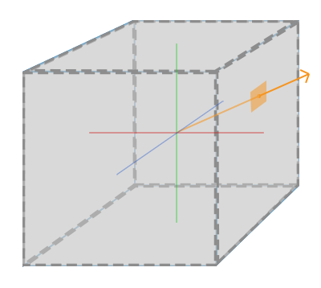

[OpenGL 3D 2024 前期 第03回]

# 

## 習得目標

* キューブテクスチャの作り方を学習する。
* 反射ベクトルの計算を学習する。
* 
* 
* 

## 1. 環境マッピング

### 1.1 映り込みを再現するには

金属や水といった物質の表面には、鏡のように周囲の風景が映り込みます。コンピューターグラフィックスでこのような物質を表現するには、光の反射方向を計算し、反射先にある物体の色を取得して表示すればよいわけです。

しかし、反射先の物体を探す処理には多くの計算が必要となります。そのため、2024年現在のコンピューターを持ってしても、リアルタイムで計算するのは難しいのです。

代替案として、「ある地点から見た周囲の風景をテクスチャとして用意しておき、法線から反射ベクトルを計算してテクスチャ座標を求める」という方法が考案されました。この方法は「環境マッピング」と呼ばれています。

環境マッピングには「球面マッピング」、「双放物面マッピング」、「キューブマッピング」の３種類の方法があります。

環境マッピングのうち、「球面マッピング」と「双放物面マッピング」は、テクスチャ・マッピング機能を持つGPUなら高速に実行可能です。

「キューブマッピング」は専用のハードウェアが必要となりますが、2024年現在ではGPUの標準的な機能となっていて、他の方法と同じくらい高速に実行できます。

そのため、2024年現在では、主にキューブマッピングが使われています。本テキストでも「キューブマッピング」を使って反射を再現します。

環境マッピングの主な制限は、カメラまたは周囲にある物体が移動した場合でも、それらが反映されないことです。「風景を事前に画像として用意する」のですから、仕方ないのですが...。

この対策としては「リアルタイムにテクスチャを再計算する」という方法があります。とはいえ、再計算にはかなり時間がかかります。そのため普段使いはできせんが、手段があることは覚えておくとよいでしょう。

さて、キューブマッピングでは各方向に1枚ずつ、合計6枚のテクスチャを使って周囲の映り込みを表現します。

<p align="center">

</p>

ピクセルの取得には方向ベクトルを指定します。この処理はGPUが自動的に行うため、プログラマはテクスチャ座標の代わりに方向ベクトルを指定するだけです。

<p align="center">
<br>
[キューブマッピングは方向ベクトルが指すピクセルを参照できる<br>
出典 https://learnopengl.com/Advanced-OpenGL/Cubemaps]
</p>

### 1.2 キューブマップ用のTextureコンストラクタを追加する

物理ベースレンダリング(PBR)では、環境光を「キューブマッピング用のテクスチャ」(長いので以後は「キューブマップ」と呼ぶことにします)で置き換えることで環境マッピングを実行します。

>1. `Texture`クラスにキューブマップを作成する機能を追加する。
>2. `Engine`クラスにキューブマップを作成する機能を追加する。
>3. `Engine`クラスに環境マッピングを制御する機能を追加する。
>4. `standard.frag`シェーダの環境光を環境マッピングで置き換える。

それでは、`Texture`クラスに「キューブマップ」を作成する機能を追加するところから始めましょう。

キューブマップは、6枚の画像をまとめてひとつのテクスチャとして扱います。そこで、ファイル名の配列を受け取ってキューブマップを作成するコンストラクタを追加します。

`Texture.h`を開き、次のコンストラクタ宣言を追加してください。

```diff
 private:
   explicit Texture(const char* filename);
   Texture(const char* filename, bool useMipmap, GLenum wrapMode = GL_REPEAT);
+
+  /**
+  * キューブマップを作成するコンストラクタ
+  *
+  * @param name             テクスチャ識別用の名前
+  * @param cubemapFilenames キューブマップを構成する6枚の画像ファイル名
+  */
+  Texture(const char* name, const char* const cubemapFilenames[6]);

   /**
   * 空のテクスチャを作成するコンストラクタ
```

次に`Texture.cpp`を開き、画像ファイルからテクスチャを作成するコンストラクタの定義の下に、キューブマップを作成するコンストラクタを追加してください。

```diff
   id = object;
   name = filename;
 }
+
+/**
+* キューブマップを作成するコンストラクタ
+*/
+Texture::Texture(const char* name, const char* const cubemapFilenames[6])
+{
+  // 画像ファイルを読み込む
+  Texture t[6] = {
+    Texture(cubemapFilenames[0]),
+    Texture(cubemapFilenames[1]),
+    Texture(cubemapFilenames[2]),
+    Texture(cubemapFilenames[3]),
+    Texture(cubemapFilenames[4]),
+    Texture(cubemapFilenames[5]),
+  };
+
+  // 1枚でもテクスチャの読み込みに失敗していたら作成しない
+  for (const auto& e : t) {
+    if (!e) {
+      LOG_ERROR("キューブマップ%sの画像の読み込みに失敗", name);
+      return; // 6枚そろっていないと作成できない
+    }
+  } // for t
+}

 /**
 * 空のテクスチャを作成するコンストラクタ
```

コンストラクタでは最初に6枚の画像を読み込みます。1枚でも画像の読み込みに失敗したらキューブマップは作成できません。

すべての画像が読み込めたら、キューブマップの作成に必要なデータを収集します。画像の読み込み判定を行う`for`文の下に、次のプログラムを追加してください。

```diff
       LOG_ERROR("キューブマップ%sの画像の読み込みに失敗", name);
       return; // 6枚そろっていないと作成できない
     }
   } // for t
+
+  // 画像サイズを取得
+  const int w = t[0].GetWidth();
+  const int h = t[0].GetHeight();
+  if (w != h) {
+    LOG_ERROR("キューブマップ%sが正方形ではありません(%dx%d)", name, w, h);
+    return; // 縦と横が同じサイズでないと作成できない
+  }
+  for (const auto& e : t) {
+    if (e.GetWidth() != w || e.GetHeight() != h) {
+      LOG_ERROR("キューブマップ%sの画像サイズが一致しません", name);
+      return; // すべてのサイズが等しくないと作成できない
+    }
+  } // for t
+
+  // 画像形式を取得
+  GLint gpuFormat;
+  glGetTextureLevelParameteriv(t[0], 0, GL_TEXTURE_INTERNAL_FORMAT, &gpuFormat);
+  for (const auto& e : t) {
+    GLint tmp;
+    glGetTextureLevelParameteriv(e, 0, GL_TEXTURE_INTERNAL_FORMAT, &tmp);
+    if (tmp != gpuFormat) {
+      LOG_ERROR("キューブマップ%sの画像形式が一致しません", name);
+      return; // すべての画像形式が一致しないと作成できない
+    }
+  } // for t
 }

 /**
 * 空のテクスチャを作成するコンストラクタ
```

必要なデータは「画像サイズ」と「画像形式」です。キューブマップに使用する画像サイズには以下の制限があります。

* 正方形である(縦と横のサイズが等しい)。
* すべての画像のサイズが等しい。
* すべての画像系恣意が等しい。

これらの条件を満たさない場合、キューブマップは作成できないので、チェックする必要があるのです。

すべての条件を満たしていたらキューブマップを作成します。画像形式をチェックする`for`文の下に、次のプログラムを追加してください。

```diff
       LOG_ERROR("キューブマップ%sの画像形式が一致しません", name);
       return; // すべての画像形式が一致しないと作成できない
     }
   } // for t
+
+  // 画像サイズからミップマップ数を計算
+  const int levels = static_cast<int>(log2(w))) + 1;
+
+  // キューブマップを作成
+  glCreateTextures(GL_TEXTURE_CUBE_MAP, 1, &id);
+  glTextureStorage2D(id, levels, gpuFormat, w, h);
+  for (int i = 0; i < 6; ++i) {
+    glCopyImageSubData(t[i], GL_TEXTURE_2D, 0, 0, 0, 0, id, GL_TEXTURE_CUBE_MAP, 0, 0, 0, i, w, h, 1);
+  }
+
+  // ミップマップを生成
+  glGenerateTextureMipmap(id);
+ 
+  // テクスチャパラメータを設定
+  glTextureParameteri(id, GL_TEXTURE_WRAP_S, GL_CLAMP_TO_EDGE);
+  glTextureParameteri(id, GL_TEXTURE_WRAP_T, GL_CLAMP_TO_EDGE);
+  glTextureParameteri(id, GL_TEXTURE_MAG_FILTER, GL_LINEAR);
+  glTextureParameteri(id, GL_TEXTURE_MIN_FILTER, GL_LINEAR_MIPMAP_LINEAR);
 }

 /**
 * 空のテクスチャを作成するコンストラクタ
```

キューブマップにミップマップを追加すると、物体表面の「粗さ」を再現できます。

ミップマップは1レベルごとに縦横が半分の大きさ(端数切り捨て)になり、最終的に1x1まで小さくなります。ミップマップを使うには、`glTextureStorage2D`関数にミップマップ数を指定する必要があります。

必要なミップマップ数は以下の式で計算できます。

$$
ミップマップ数 = int(\log_2(テクスチャの幅と高さの長い方)) + 1
$$

`log2`(ログ・ツー)は「2の対数」を返す関数です。

<p><code class="tnmai_code"><strong>【書式】</strong><br>
double log2(元になる数値);
</code></p>

`log2`は「元になる数値」が2の何乗になるか、つまり「2の対数」を返します。例えば引数に`8`を渡すと`3`が返され、引数に`128`を渡すと`7`が返されます。

また、`100`のように対数が整数にならない引数を渡しても、ちゃんと`6.6438561...`という浮動小数点数が返されます。

さて、キューブマップ用のGPUメモリは先に作成した6枚のテクスチャとは別に確保されます。そのため、テクスチャの画像データをキューブマップにコピーしなくてはなりません。

あるテクスチャから別のテクスチャにデータをコピーするには`glCopyImageSubData`(ジーエル・コピー・イメージ・サブデータ)関数を使います。

<p><code class="tnmai_code"><strong>【書式】</strong><br>
void glCopyImageSubData(コピー元の管理番号, コピー元テクスチャの種類,<br>
&emsp;コピー元ミップレベル, コピー元X座標, コピー元Y座標, コピー元Z座標,<br>
&emsp;コピー先の管理番号, コピー先テクスチャの種類,<br>
&emsp;コピー先ミップレベル, コピー先X座標, コピー先Y座標, コピー先Z座標,<br>
&emsp;コピーする幅, コピーする高さ, コピーする奥行き);
</code></p>

やたらと引数が多いのは、3Dテクスチャを含む全てのテクスチャタイプに対応するためです。

しかし、引数が「コピー元の情報」「コピー先の情報」「コピーする範囲の情報」の3グループに分けられることに気づけば、実はそれほど複雑ではありません。

すべての画像データをキューブマップにコピーしたら、OpenGLにミップマップを生成させます。ミップマップの生成には`glGenerateTextureMipmap`(ジーエル・ジェネレート・テクスチャ・ミップマップ)関数を使います。

<p><code class="tnmai_code"><strong>【書式】</strong><br>
void glGenerateTextureMipmap(テクスチャ管理番号);
</code></p>

ミップマップを生成したら、最後にテクスチャパラメータを設定します。これでキューブマップを作成するコンストラクタは閑静です。

### 1.3 ゲームエンジンにキューブマップ作成機能を追加する

テクスチャキャッシュを管理するため、すべてのテクスチャはゲームエンジンを経由して作成する必要があります。これはキューブマップも例外ではありません。

`Engine.h`を開き、`TexHelper`構造体の定義に次のプログラムを追加してください。

```diff
   struct TexHelper : public Texture {
     TexHelper(const char* p) : Texture(p) {}
     TexHelper(const char* p, int w, int h, GLenum f, int m = 1) :
       Texture(p, w, h, f, GL_CLAMP_TO_EDGE, m) {}
+    TexHelper(const char* p, const char* const c[6]) : Texture(p, c) {}
   };
```

次に、`Engine`クラスの定義にキューブマップを作成するメンバ関数を追加してください。関数名は`GetCubemapTexture`(ロード・キューブマップ・テクスチャ)とします。

```diff
   * @return 名前がnameと一致するテクスチャ
   */
   TexturePtr GetTexture(const char* name);
+
+  /**
+  * キューブマップテクスチャを読み込む
+  *
+  * @param name テクスチャ名
+  * @param cubemapFilenames キューブマップ用の画像ファイル名の配列
+  *
+  * @return 名前がnameと一致するテクスチャ
+  */
+  TexturePtr LoadCubemapTexture(
+    const char* name, const char* const cubemapFilenames[6]);

   /**
   * テクスチャキャッシュを空にする
```

続いて`Engine.cpp`を開き、`GetTexture`メンバ関数の定義の下に、次のプログラムを追加してください。

```diff
   textureCache.emplace(name, tex);
   return tex; // 作成したテクスチャを返す
 }
+
+/**
+* キューブマップテクスチャを読み込む
+*/
+TexturePtr Engine::LoadCubemapTexture(
+  const char* name, const char* const cubemapFilenames[6])
+{
+  // キャッシュにあれば、キャシュされたテクスチャを返す
+  auto itr = textureCache.find(name);
+  if (itr != textureCache.end()) {
+    return itr->second; // キャッシュされたテクスチャを返す
+  }
+
+  // キャッシュになければ、テクスチャを作成してキャッシュに登録
+  auto tex = std::make_shared<TexHelper>(name, cubemapFilenames);
+  textureCache.emplace(name, tex);
+  return tex; // 作成したテクスチャを返す
+}

 /**
 * テクスチャキャッシュを空にする
```

この関数は、基本的には`GetTexture`メンバ関数と同じことをやっています。ただし、引数と内部で呼び出す`TexHelper`コンストラクタの種類が異なります。

### 1.4 ゲームエンジンに環境マッピングを設定する機能を追加する

キューブマップを作成するだけでは意味がありません。グラフィックスパイプラインに割り当てて、環境マッピングのために利用できる必要があります。

そこで、ゲームエンジンに「グラフィックスパイプラインに割り当てるキューブマップ」を指定する機能を追加します。これは以下の流れになります。

>1. ゲームエンジンにキューブマップを保持するメンバ変数を追加。
>2. 1のメンバ変数にキューブマップを設定するメンバ関数を追加。
>3. メッシュを描画するときに、設定されたキューブマップをテクスチャイメージユニットに割り当てる。

まずは「環境マッピング用のキューブマップを保持するメンバ変数」を追加しましょう。変数名は`texEnvironment`(テックス・エンビロンメント)とします。`Environment`は「環境」や「周囲の状況・情勢」という意味です。

`Engine.h`を開き、`Engine`クラスの定義に次のプログラムを追加してください。

```diff
   // 平行光源
   DirectionalLight directionalLight;

   // 環境光
   vec3 ambientLight = { 0.05f, 0.15f, 0.25f };
+
+  // 環境マッピング用のキューブマップ
+  TexturePtr texEnvironment;

   // スカイスフィア
   StaticMeshPtr skySphere;
```

次に、`Engine`クラスの定義に「キューブマップを設定するメンバ関数」を追加してください。

```diff
   * @return 名前がnameと一致するテクスチャ
   */
   TexturePtr LoadCubemapTexture(
     const char* name, const char* const cubemapFilenames[6]);
+
+  // 環境マッピング用のキューブマップを設定する
+  void SetEnvironmentCubemap(const TexturePtr& cubemap) { texEnvironment = cubemap; }

   /**
   * テクスチャキャッシュを空にする
```

`texEnvironment`をテクスチャイメージユニットに割り当てる前に、ユニット番号を決めなくてはなりません。`standard.frag`を開いて確認すると、`0`～`3`番は既に使用中になっています。

そういうことなので、環境マッピングには`4`番のユニットを割り当てましょう。キューブマップを使うには`samplerCube`(サンプラー・キューブ)型を使います。 `standard.frag`を開き、次のプログラムを追加してください。

```diff
 layout(binding=0) uniform sampler2D texColor;
 layout(binding=1) uniform sampler2D texEmission;
 layout(binding=2) uniform sampler2DShadow texShadow; // 影用の深度テクスチャ
 layout(binding=3) uniform sampler2D texNormal;
+layout(binding=4) uniform samplerCube texEnvironment; // 環境キューブマップ

 // 出力する色データ
 out vec4 outColor;
```

番号が決まったので、ゲームエンジンにキューブマップを割り当てるプログラムを追加しましょう。`Engine.cpp`を開き、`Render`メンバ関数の定義に次のプログラムを追加してください。

```diff
   // 半透明合成を有効化
   glEnable(GL_BLEND);
   glBlendFunc(GL_SRC_ALPHA, GL_ONE_MINUS_SRC_ALPHA);

   UpdateShaderLight();
+
+  // 環境マッピング用キューブマップを設定
+  if (texEnvironment) {
+    const GLuint tex = *texEnvironment;
+    glBindTextures(4, 1, &tex);
+  }

   glUseProgram(*prog3D);

   // transparent以前のキューを描画
   glProgramUniform1f(*prog3D, locAlphaCutoff, 0.5f);
```

### 1.5 環境光を環境マッピングで置き換える

最後に、フラグメントシェーダの環境光を環境マッピングで置き換えます。

環境マッピングは、周囲からの光が物体表面で反射して視点に届く仕組みを再現します。そのために、ピクセルが光を反射する方向を計算します。この方向のことを「反射ベクトル」といいます。

反射ベクトルの計算方法については下記の図を見てください。

<div style="text-align: center;width: 100%;">

<div style="white-space: pre;">[反射ベクトル]</div>
</div>

カメラベクトル`C`と法線ベクトル`N`の内積を計算すると、結果は「CをNに射影した長さ」になります。`N`にこの長さを掛けたものが上図の`d`というベクトルです。この`d`を`C`から引くと、緑色のベクトルが得られます。

ここで反射ベクトルについて考えてみると、反射ベクトル`R`は「緑色のベクトル`C-d`の方向に逆向きにして`d`を足したもの」になります。つまり、

`R = -(C - d) + d`

です。これを変形すると次のようになります。

`R = -C + d + d = 2d - C`

キューブマップからピクセルを取得するには、こうして求めた反射ベクトルをテクスチャ座標に指定します。

それではプログラムを書きましょう。`standard.frag`を開き、アンビエントライトの明るさを計算するプログラムの下に、次のプログラムを追加してください。

```diff
   diffuse += directionalLight.color * illuminance * shadow;

   // アンビエントライトの明るさを計算
   diffuse += ambientLight;
+
+  // 環境キューブマップによるライティング
+  {
+    // カメラベクトルと法線から反射ベクトルを計算
+    vec3 d = dot(cameraVector, normal) * normal;
+    vec3 reflectionVector = 2 * d - cameraVector;
+
+    // キューブマップから環境光を取得
+    vec3 ambientSpecular = textureLod(texEnvironment, reflectionVector, 0).rgb;
+    ambientSpecular = pow(ambientSpecular, vec3(2.2)); // ガンマ補正を解除
+    specular += ambientSpecular;
+  }

   // 拡散光の影響を反映
   outColor.rgb *= diffuse;
```

一般的なテクスチャはガンマ補正されているため、ガンマ補正を解除する必要があります。

### 1.6 キューブマップ用の画像を用意する

とりあえずプログラムの方はなんとかなったので、キューブマップ用の画像ファイルを用意しましょう。

<pre class="tnmai_assignment">
<strong>【課題01】</strong>
プロジェクトの<code>Res</code>フォルダに<code>cubemap</code>フォルダを作成し、その中にキューブマップ用の画像をダウンロードして保存しなさい。

基本的には、スカイスフィアで利用したのと同じ画像ファイルを使うとよいでしょう。環境キューブマップにスカイスフィアと著しく異なる画像を割り当てると、不自然な画像になるからです。

スカイスフィアの説明で掲載した画像サイトのURLです。
<code>https://polyhaven.com/hdris</code>

パノラマ画像をキューブマップ用の6枚の画像に変換するには、以下のサイトを利用するとよいでしょう。セーブするときに「展開図1枚にまとめる」「横一列にまとめる」「個別に保存する(一番下の6枚の画像が分かれている図)」を選択できます。「個別の保存する」を選択すること。
<code>https://matheowis.github.io/HDRI-to-CubeMap/</code>

ダウンロードしたZIPファイルには以下の6枚の画像ファイルが含まれているはずです。

  px.png: +X面
  py.png: +Y面
  pz.png: +Z面
  nx.png: -X面
  ny.png: -Y面
  nz.png: -Z面

PNG形式はゲームエンジンに読み込めないので、次の手順でTGA(またはDDS)形式に変換すること。
- TGA形式: 上下反転 → TGA形式で保存
- DDS形式: DDS形式で保存 → 形式をDXT1に変換 → DDS形式で上書き
</pre>

TGA形式で保存する場合、画像を上下反転する必要があります。というのは、キューブマップのテクスチャ座標系は「左上原点」だからです。OpenGLは「左下原点」なので、上下が逆なのです。

>キューブマップに限ってテクスチャ座標原点が異なる理由は、「当時のCG業界で広く使われていた`Render Man`(レンダーマン)というグラフィックスツールの仕様を元にしているから」です。

それでは、作成した画像ファイルを読み込みましょう。`Exploration.cpp`を開き、`Initialize`メンバ関数に次のプログラムを追加してください。

```diff
   // スカイスフィアを設定
   skysphereMaterial = std::make_shared<Material>();
   skysphereMaterial->texBaseColor = engine.GetTexture("Res/MeshData/sky_sphere/sky.tga");
+
+  // 環境キューブマップを設定
+  static const char* const cubemapFilenames[6] = {
+    "Res/cubemap/px.dds",
+    "Res/cubemap/nx.dds",
+    "Res/cubemap/py.dds",
+    "Res/cubemap/ny.dds",
+    "Res/cubemap/pz.dds",
+    "Res/cubemap/nz.dds",
+  };
+  engine.SetEnvironmentCubemap(
+    engine.LoadCubemapTexture("environment", cubemapFilenames));

   // 胴体を上下に移動するカーブ
   static const Keyframe kfBody[] = {
```

プログラムが書けたらビルドして実行してください。次の画像のように、すべてのオブジェクトが風景を反射していたら成功です。

<p align="center">

</p>

### 1.7 ラフネスを反映する

物体表面がなめらかな場合、現在のプログラムで表示されるように鮮明な反射像が映ります。しかし、表面が粗い場合、反射する像はかなりぼやけて見えるはずです。

ここでミップマップが活躍します。画像を縮小すると詳細度が低下するため、高いミップレベルを選択することで、ぼやけた画像を表示することができます。

```diff
     vec3 d = dot(cameraVector, normal) * normal;
     vec3 reflectionVector = 2 * d - cameraVector;

     // キューブマップから環境光を取得
+    float maxMipmapLevel = textureQueryLevels(texEnvironment) - 1;
+    float levelCap = textureQueryLod(texEnvironment, reflectionVector).x;
+    float level = max(maxMipmapLevel * pow(roughnessAndMetallic.x, 0.5), levelCap);
-    vec3 ambientSpecular = textureLod(texEnvironment, reflectionVector, 0).rgb;
+    vec3 ambientSpecular = textureLod(texEnvironment, reflectionVector, level).rgb;
     ambientSpecular = pow(ambientSpecular, vec3(2.2)); // ガンマ補正を解除
     specular += ambientSpecular * specularRatio;
```

テクスチャのミップレベル数を取得するには`textureQueryLevels`(テクスチャ・クエリ・レベルズ)関数を使います。`Query`(クエリ)は「質問する」という意味です。

<p><code class="tnmai_code"><strong>【書式】</strong><br>
ミップレベル数 textureQueryLevels(サンプラーオブジェクト);
</code></p>

最大ミップレベルにラフネスを掛けることで、ラフネスに対応するミップレベルが得られます。

ただ、`glGenerateTextureMipmap`関数で得られるミップマップはあまりぼやけないため、ラフネスと直接対応させることができません。そこで、0.5乗することで、より高いミップレベルが選ばれるようにしています。

>ラフネスと正確に一致するミップマップを作成するには、`CubeMapGen`などのキューブマップ作成ツールを使います。自分でぼかしプログラムを作成してもよいでしょう。

`textureQueryLod`(テクスチャ・クエリ・エルオーディ)は、画面上でテクスチャが拡大縮小したり変形される比率を考慮したとき、最も適切と思われるミップレベルを返します。

<p><code class="tnmai_code"><strong>【書式】</strong><br>
vec2 textureQueryLod(サンプラーオブジェクト, 反射ベクトル);
</code></p>

戻り値の`y`要素には純粋に計算で求められた「最も適切と思われるミップレベル」が格納されます。`x`要素には「`y`要素をテクスチャに設定されたフィルタ、最小レベル、最大レベルで補正した値」が返されます。

`x`要素の値は、`texture`関数が内部で自動的に計算するミップレベルと等しいです。そのため、通常は`x`要素を使います。`y`要素は「詳細度が低い場合だけ簡易的な処理に切り替える」などの用途で使われることがあります。

この関数の価値は「このミップレベルより詳細度の高いミップレベルを選んでも、画面上ではほぼ違いが分かりませんよ」という情報が分かることです。

一般的に、解像度の低いテクスチャほど参照すべきメモリ量が減るので、描画が高速になります。そのため、「必要以上に詳細なテクスチャを選ばない」ことはとても重要です。

つまり、ラフネスから計算されるミップレベルが`textureQueryLod`が返すミップレベルより小さくなったとしても、`textureQueryLod`を優先するべきなのです。


ラフネスを考慮した適切なミップレベルが得られたら、あとはその数値を`textureLod`関数に渡すだけです。

プログラムが書けたらビルドして実行してください。以前よりも反射が不明瞭に見えたら成功なのですが、

<p align="center">

</p>

### 1.8 反射の比率を計算する

環境マッピングだからといって、入射したすべての光が反射されるわけではありません。そこは点光源や平行光源と同じで、表面の材質によって反射率や反射の方向が決まります。

点光源や平行光源では`GGX`という式によって反射を計算しました。つまり、環境マッピングでも同じ計算を行う必要があります。環境マッピングでは幾何減衰項`G`とフレネル項`F`だけを計算します。

`standard.frag`を開き、反射ベクトルを計算するプログラムの下に、次のプログラムを追加してください。

```diff
     // カメラベクトルと法線から反射ベクトルを計算
     vec3 d = normal * dot(cameraVector, normal);
     vec3 reflectionVector = 2.0 * d - cameraVector;
+
+    // スペキュラ反射率を計算
+    float NdotV = max(dot(normal, cameraVector), 0.01);
+    float G = GeometricAttenuationSchlick(NdotV, NdotV, roughnessAndMetallic.x);
+    vec3 F = FresnelSchlick(f0, max(dot(cameraVector, normal), 0));
+    float denom = NdotV;
+    vec3 specularRatio = F * (G / denom);

     // キューブマップから環境光を取得
     float maxMipmapLevel = textureQueryLevels(texEnvironment) - 1;
     float levelCap = textureQueryLod(texEnvironment, reflectionVector).x;
     float level = max(maxMipmapLevel * pow(roughnessAndMetallic.x, 0.5), levelCap);
     vec3 ambientSpecular = textureLod(texEnvironment, reflectionVector, level).rgb;
     ambientSpecular = pow(ambientSpecular, vec3(2.2)); // ガンマ補正を解除
-    specular += ambientSpecular;
+    specular += ambientSpecular * specularRatio;
   }

   // 拡散光の影響を反映
   outColor.rgb *= diffuse;
```

幾何減衰項`G`を計算する`GeometricAttenuationSchlick`には、入射(反射)ベクトルと出射(カメラ)ベクトルのコサインを渡します。

環境マッピングでは鏡面反射を想定するため、この2つのコサインの値は等しくなります。そこで、`NdotV`だけを計算して2つの引数に同じ値を設定しています。

また、視線と面がほとんど平行な場合、`NdotV`は非常に小さくなります。これは、一点から発せられる光線ならば正しいのですが、さまざまな方向から届くすべての光を表現する環境マッピングには当てはまりません。

数多くの方向から光が入射することで、光がさえぎられる量が平均化されて、カメラに到達する光量はある程度保証されるはずです。

そこで、`NdotV`の最小値を、通常のGGXより大きい`0.01`とすることで、反射される光が減りすぎないようにしています。

フレネル項`F`のハーフベクトル引数には法線を渡します。反射ベクトルとカメラベクトルから計算されるハーフベクトルは、法線と一致するからです。

あとは`G`と`F`を組み合わせて`specularRatio`(スペキュラ・レシオ)を計算します。ただし、除数`denom`(デノム)には`4 * NL * NV`ではなく、`NV`を使います。

除数から`4 * NL`を消した理由は、この部分は`D`項を正規化するためのパラメータだからです。`D`項は計算しないのですから、除数の関連する要素も消さなくてはなりません。

プログラムが書けたらビルドして実行してください。銀メッキされたような質感がなくなっていたら成功です。フレネル項の効果で、視線と平行に近い面にはまだ金属のような質感が見られるはずです。

<p align="center">

</p>

### 1.9 反射しすぎないように制限する

「視線と平衡に近い面」の反射が強すぎるように見えるため、少し反射を弱くします。反射が強くなるのは除数`denom`が小さすぎる場合です。そこで、`denom`が一定値以下にならないように制限します。

`denom`の計算式を次のように変更してください。

```diff
     // スペキュラ反射率を計算
     float NdotV = max(dot(normal, cameraVector), minCosTheta);
     float G = GeometricAttenuationSchlick(NdotV, NdotV, roughnessAndMetallic.x);
     vec3 F = FresnelSchlick(f0, max(dot(cameraVector, normal), 0));
-    float denom = NdotV;
+
+    // きつい角度の反射が強くなりすぎないように制限する値
+    const float angleThreshold = cos(radians(60));
+    float denom = mix(angleThreshold, 1, NdotV);
     vec3 specularRatio = F * (G / denom);

     // キューブマップから環境光を取得
```

`angleThreshold`(アングル・スレッショルド)は許可されるコサインの最小値です。いくつかの角度を試した結果、比較的自然に見えたために60°を選択しています。

プログラムが書けたらビルドして実行してください。視線と平衡に近い面が、制限する前より自然に見えていたら成功です。

<p align="center">

</p>

### 1.10 拡散反射を追加する

アンビエントライトには鏡面反射成分だけでなく拡散反射成分も含まれています。ここまでで鏡面反射成分には対応できたので、拡散反射成分を追加して完全にアンビエントライトを置き換えましょう。

```diff
     const float angleThreshold = cos(radians(60));
     float denom = mix(angleThreshold, 1, NdotV);
     vec3 specularRatio = F * (G / denom);

-    // キューブマップから環境光を取得
+    // キューブマップから鏡面反射成分を取得
     float maxMipmapLevel = textureQueryLevels(texEnvironment) - 1;
     float levelCap = textureQueryLod(texEnvironment, reflectionVector).x;
     float level = max(maxMipmapLevel * pow(roughnessAndMetallic.x, 0.5), levelCap);
     vec3 ambientSpecular = textureLod(texEnvironment, reflectionVector, level).rgb;
     ambientSpecular = pow(ambientSpecular, vec3(2.2)); // ガンマ補正を解除
     specular += ambientSpecular * specularRatio;
+
+    // キューブマップから拡散反射成分を取得
+    vec3 ambientDiffuse = textureLod(texEnvironment, normal, maxMipmapLevel).rgb;
+    ambientDiffuse = pow(ambientDiffuse, vec3(2.2)); // ガンマ補正を解除
+    diffuse += ambientDiffuse * (1 - specularRatio) * (1 - roughnessAndMetallic.y);
   }

   // 拡散光の影響を反映
   outColor.rgb *= diffuse;
```

拡散反射にはもっともぼかされた画像を使います。つまり、最大ミップレベルの画像です。

>最大ミップレベルを使う方法は、物理的にはあまり正確ではありません。物理的に正確な拡散反射の色を得るには、`CubeMapGen`などのツールを使うか、または自分で計算します。

物理ベースレンダリングでは、「反射光は常に入射光の明るさ以下になる」とされています。そこで、拡散反射するのは「鏡面反射しなかった成分」とします。これは`(1 - specularRatio)`によって計算されます。

それから、金属は拡散反射を起こしません。拡散反射成分はすべて物体に吸収されてしまうからです。`(1 - metallic)`とすることで、金属の場合は拡散反射を起こさないようにしています。

プログラムが書けたらビルドして実行してください。拡散反射成分を追加したことで、画面が少し明るくなっていたら成功です。

<p align="center">

</p>

このように、キューブマップで環境光を置き換えると、平行光源の影になっている領域にも陰影が生まれます。これは現実でも起きていることで、物体の立体感をわかりやすくする効果があります。

なお、屋内と屋外の移動のように、大きく環境の異なる場所を移動するゲームでは、環境によってキューブマップを切り替えます。

また、リアルタイムに背景が変化していく場合は、ゲームの実行中にキューブマップを生成することもあります。

>環境光を環境マッピングで置き換えることで、物体をよりリアルに見せることができます。ただし、ラフネスとメタリックを適切に設定する必要があります。

<pre class="tnmai_assignment">
<strong>【課題01】</strong>
<code>Engine</code>クラスで定義しているアンビエントライトの明るさを0にしなさい。
</pre>

>**【1章のまとめ】**
>
>* 環境マッピングは「周囲の風景の映り込み」を再現する技法のひとつ。環境マッピングを行う技術のひとつに「キューブマップ」がある。
>* キューブマップは立方体の6つの面にそれぞれ画像を割り当てたもの。テクスチャ座標のかわりに「方向ベクトル」によってピクセルを選択することができる。
>* 「環境光」は、環境マッピングで置き換えることができる。処理時間は長くなるが、点光源や平行光源の影になる領域にも陰影が付くため、物体がより立体的に見えるようになる。
>* ミップマップを利用すると、「表面の粗さ」に対応した映り込みを再現できる。
