[OpenGL 3D 2024 前期 第04回]

# FBXファイルの読み込み(スタティックメッシュ編)

## 習得目標

* 
* 
* 

## 1. 

### 1.1 FBX形式について

OBJ形式の利点は、多くのツールが読み書きに対応しており、比較的単純な形式のためプログラムが簡単なことです。しかし、アニメーションデータを扱えないという欠点もありました。

そのため、以前のテキストではアニメーションデータを手作業で作成して、多少無理やりにアニメーションを実行していました。この方法は、少量の簡単なアニメーションであれば十分に対応できるものでした。

しかし、この方法で「指の一本一本を動かすような詳細なアニメーション」をいくつも作成するのは、不可能ではないにしてもかなりの困難が伴います。

そこで、アニメーションデータを扱えるFBX(エフ・ビー・エックス)ファイル形式を読み込めるようにしましょう。

多くのツールがFBX形式に対応しており、対応ツールの数はOBJ形式に迫ります。そのため、かなり扱いやすい形式だといえるでしょう。

### 1.2 FBX SDKのインストール

FBX形式には「テキスト形式」と「バイナリ形式」の2種類が存在します。しかし「テキスト形式」は既に仕様の更新が終わっています。そのため、新しい機能などを扱うには「バイナリ形式」を選ぶ必要があります。

バイナリ形式はテキストに比べると読み書きが大変ですが、FBXの場合はファイルを扱うためのソフトウェア開発キット(SDK)が提供されているため、それほど難しくはありません。

FBX形式は`Autodesk`(オートデスク)という会社が管理しています。FBX SDKは以下のURL(`Autodesk`の公式サイト)からダウンロードできます。

https://www.autodesk.com/products/fbx/overview

<p align="center">
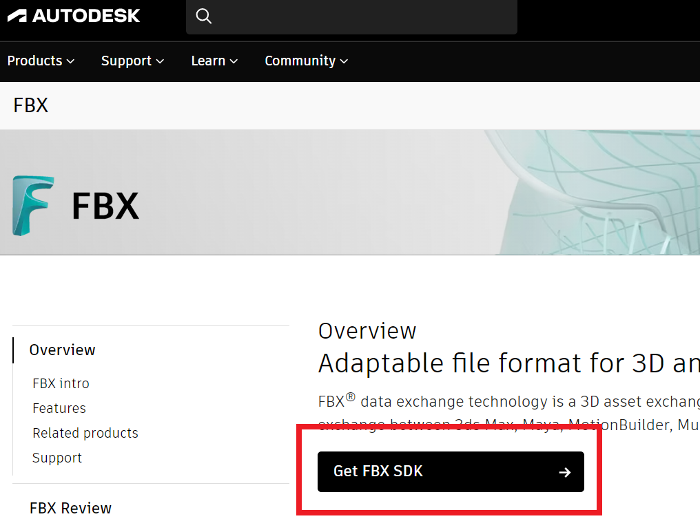
</p>

URLを開くと上の画像のようなページが表示されます。`Get FBX SDK`ボタンをクリックすると、次のようなFBX SDKのダウンロードページが表示されます。

<p align="center">
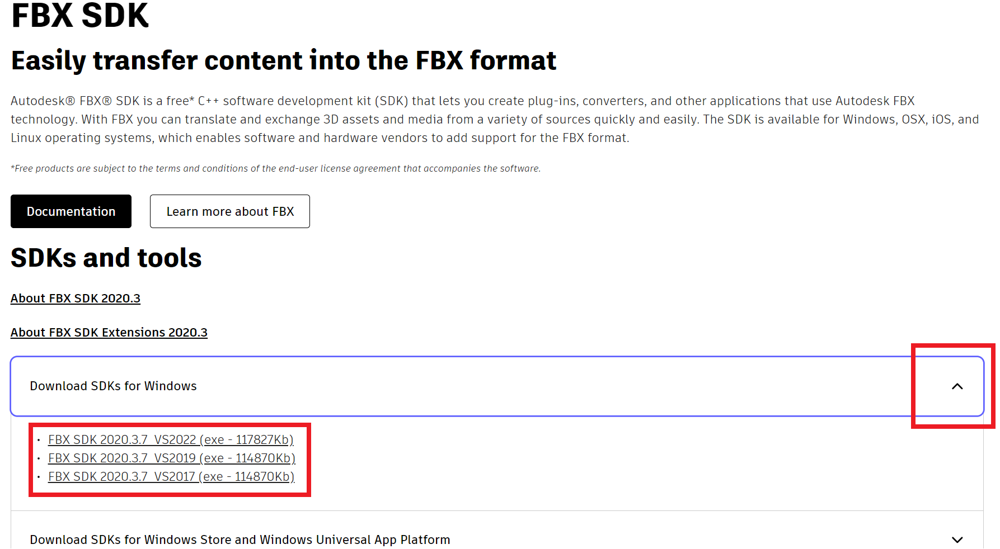
</p>

`Download SDKs for Windows`の右端にある`v`をクリックすると、Visual Studioのバージョンごとのリンクが表示されます。使用しているバージョンのURLをクリックしてください。

>**【FBX SDKの説明書(ドキュメント)について】**<br>
>このページにある`Documentation`ボタンをクリックすると、FBX SDKのドキュメントページが開きます。SDKの構成、インストール方法、Visual Studioへの設定方法、基本的な使い方、クラスと関数の説明などが記載されています。<br>
>FBX SDKの使い方に迷ったら、まずこのドキュメントを参照しましょう。インターネット上にある情報は古いSDKを使っている場合があり、現在のSDKバージョンでは役に立たないかもしれないからです。

ダウンロードしたファイルを開くと、FBX SDKのインストーラが起動します。

<p align="center">
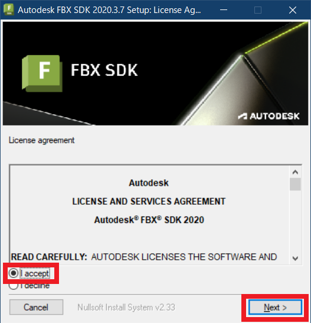
</p>

最初に「ライセンス文書」が表示されるので、文書を読むか、読んだことにして`I accept`(アイ・アクセプト、「承諾します」という意味)を選択してください。すると右下の`Next`ボタンが有効になります。

`Next`ボタンを押すと、インストール先を選択する画面に切り替わります。

<p align="center">
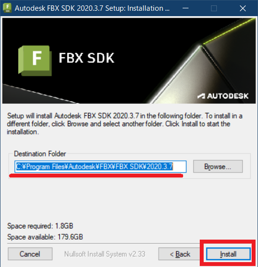
</p>

デフォルトでは「C:\Program Files\Autodesk\FBX\FBX SDK\(SDKのバージョン)」にインストールされます。インストール先はお好みで変更して構いません。

>インストール先のフォルダ名はこのあと必要となります。メモするなどで覚えておいてください。

インストール先を決定したら、右下の`Install`ボタンをクリックするとインストールが始まります。インストールが完了したら、`Close`ボタンを押してウィンドウを閉じてください。

### 1.3 FBX SDKのフォルダを環境変数に設定する

「環境変数」はWindowsなどのオペレーティングシステム(OS)が管理するデータのひとつです。環境変数はOS上で動作するすべてのプログラムから参照できるため、環境固有の設定をプログラムに渡すために利用されます。

例えば、FBX SDKのようなライブラリソフトウェアは、環境によってインストール先が異なる場合があります。

そこで、インストールフォルダ名を環境変数に設定します。そして、SDKを利用するプログラムは環境変数からインストール先を取得します。この仕組みによって、SDKのインストール先が変わっても、それを利用するプログラムは何も変更しなくても済みます。

それでは、FBX SDKのインストールフォルダを「環境変数」として追加しましょう。`Windowsキー+Rキー`を押して「ファイル名を指定して実行」ウィンドウを開いてください。

ファイル名の入力欄に`sysdm.cpl`(シスディーエム・シーピーエル)と入力して`Enter`キーを押してください。すると「システムのプロパティ」ウィンドウが開きます。

<p align="center">
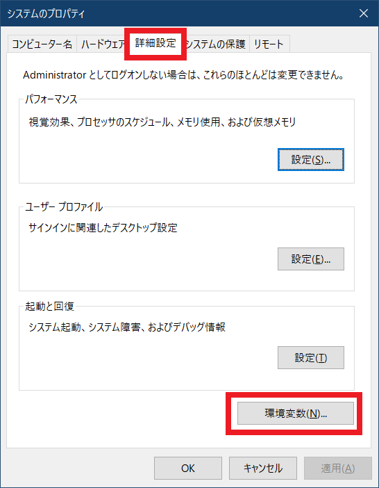
</p>

「詳細設定」タブをクリックして詳細設定ウィンドウを開き、「環境変数(N)」ボタンをクリックしてください。すると、「環境変数」ウィンドウが開きます。

<p align="center">
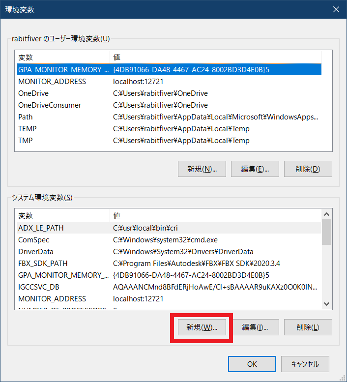
</p>

新しい環境変数を追加するために、下側の「新規(W)」ボタンをクリックしてください。すると「新しいシステム変数」ウィンドウが開きます。

>**【ユーザー環境変数とシステム環境変数の違い】**<br>
>「ユーザー環境変数」はユーザーごとに異なる値を設定する場合に使用します。「システム環境変数」はすべてのユーザーで共通の値を使いたい場合に利用します。

<p align="center">
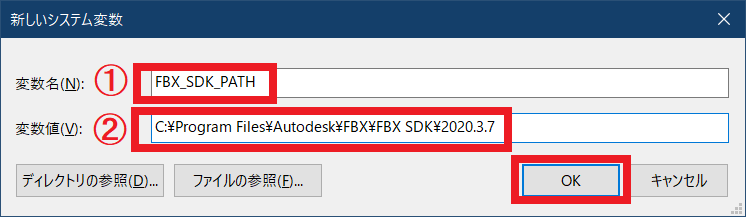
</p>

「変数名」欄(①)に`FBX_SDK_PATH`(エフビーエックス・エスディーケー・パス)と入力してください。

次に「変数値」欄(②)に、FBX SDKをインストールしたフォルダ名を入力してください。「ディレクトリの参照」からフォルダを指定することもできます。

入力したら`OK`ボタンを押してください。すると、環境変数が作成され、「環境変数」ウィンドウに戻ります。

<p align="center">
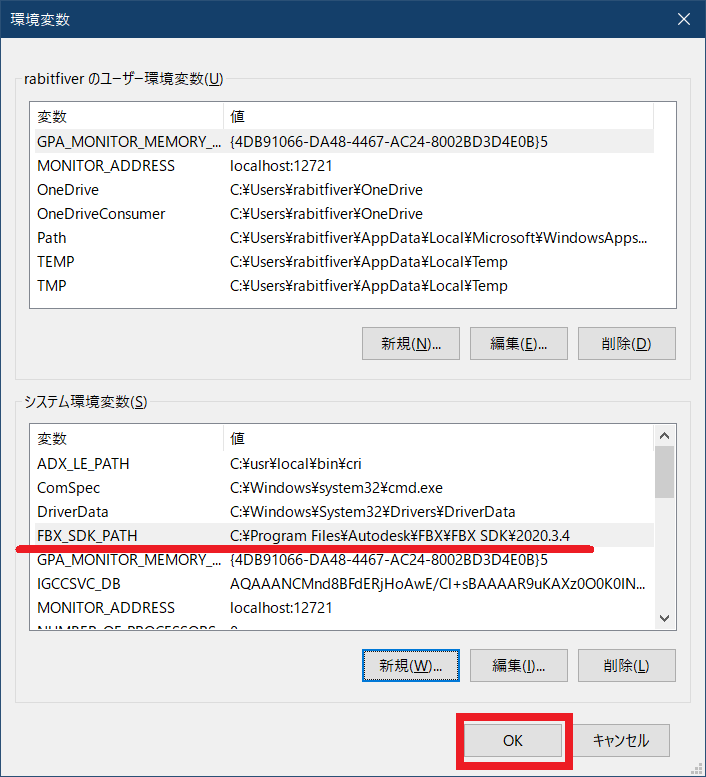
</p>

システム環境変数の中に入力した値が追加されていることを確認したら、`OK`ボタンを押してウィンドウを閉じてください。すると「システムのプロパティ」ウィンドウに戻るので、`OK`ボタンを押してウィンドウを閉じてください。

<p align="center">
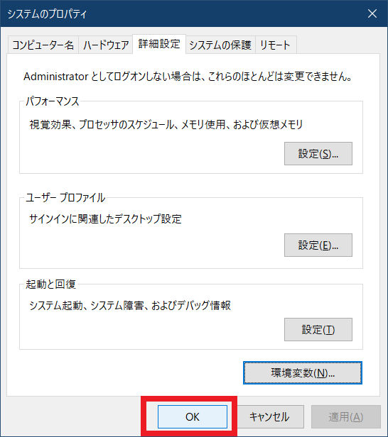
</p>

これで`FBX_SDK_PATH`という名前の「環境変数」が、お使いのOSに追加されました。

### 1.4 Visual StudioにFBX SDKのインクルードパスを追加する

続いて、Visual StudioのプロジェクトにFBX SDKを使うための設定を行います。最初に、FBX SDKのヘッダファイルのあるフォルダをプロジェクトに追加します。

Visual Studioでプロジェクトを開き、ソリューションエクスプローラーのプロジェクトファイルを右クリックし、プロジェクトのプロパティを開きます。

<p align="center">
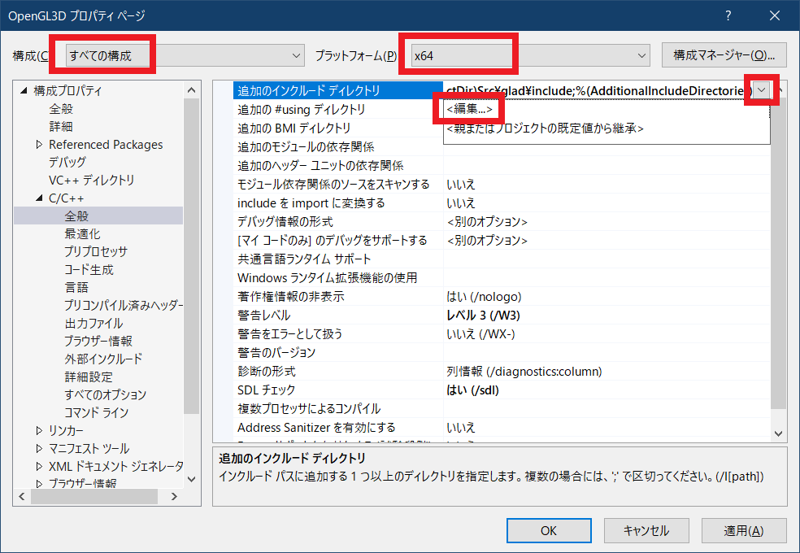
</p>

まず、上部の「構成」欄を「すべての構成」、「プラットフォーム」欄を「x64」に変更してください。これは、FBX SDK 2020にはx86用のライブラリが用意されておらず、x64専用になっているためです。

次に、左側のリストから「構成プロパティ→C/C++→全般」を選択し、右側のリストの「追加のインクルード ディレクトリ(またはAdditional Include Directories)」を選択します。

そして、その右端にある`v`アイコンを左クリックし「編集(またはEdit)」を選んでください、すると、次のような「追加のインクルードディレクトリ」ダイアログボックスが開きます。

<p align="center">
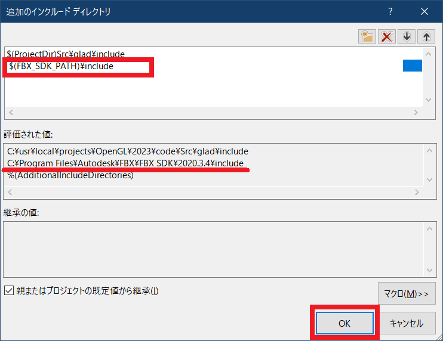
</p>

`glad`のインクルードフォルダの下の行をクリックして、以下のテキストを入力して、`Enter`キーを押してください。

>`$(FBX_SDK_PATH)￥include`

`$()`は、Visual Studioのプロパティで環境変数を参照するための構文です。

入力すると、「評価された値」欄に環境変数が値に変換された後のパスが表示されます。FBX SDKのインクルードフォルダと一致していることを確認してください。

パスが一致していたら、`OK`ボタンをクリックしてウィンドウを閉じます。その後、プロパティページの「適用」ボタンをクリックして、変更を有効化してください。

これで、FBX SDKのヘッダファイルが使えるようになりました。

>サブウィンドウで行った変更は、プロパティウィンドウで「適用」または「OK」を押すまで反映されません。うっかり「キャンセル」を押すなどで、プロパティウィンドウを閉じると変更が破棄されますので注意してください。

### 1.5 Visual Studioにライブラリファイルを追加する

次は、FBX SDKのライブラリファイルを追加します。ライブラリファイルは「クラスや関数を途中までビルドしたもの」です。このため、ライブラリファイルとアプリケーションのビルド設定が違うと、両者を「リンク」できません。

そこで、FBX SDK 2020では`x64|Debug`と`x64|Release`の2つの構成について、様々な設定でビルドしたファイルが用意されています。アプリケーションは、適切なビルド設定のファイルを選択して使います。

FBX SDKに関連するビルド設定は、プロジェクトのプロパティの中の「C/C++→コード生成」にある「ランタイムライブラリ」欄で確認できます。

特に変えていなければ、`Debug`構成では`マルチスレッド デバッグ DLL(/MDd)`、`Release`構成では`マルチスレッド DLL(/MD)`になっていると思います。

<p align="center">
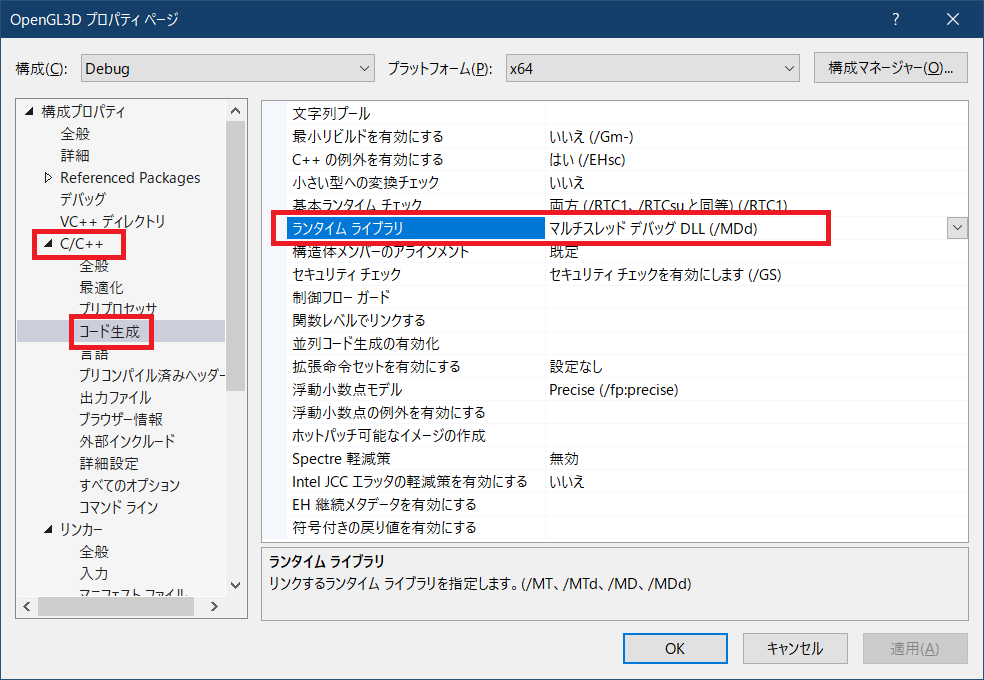<br>
[※この設定は変えないこと]
</p>

FBX SDKのインストールフォルダにある`lib`(リブ)フォルダを確認すると、FBX SDK 2020では以下の3つのライブラリファイルが必要そうです。

>* libfbxsdk系
>* libxml2系
>* zlib系

ファイル名の末尾の`-mt`や`-md`が、さきほど「ランタイムライブラリ」欄で確認したビルド設定に対応しています。プロジェクト側の設定は`/MD`だったので、末尾が`-md`のファイルを選べば良いわけです。

ライブラリファイルの設定は、プロジェクトのプロパティの中の「リンカー→入力」にある「追加の依存ファイル」欄で行います。

<p align="center">
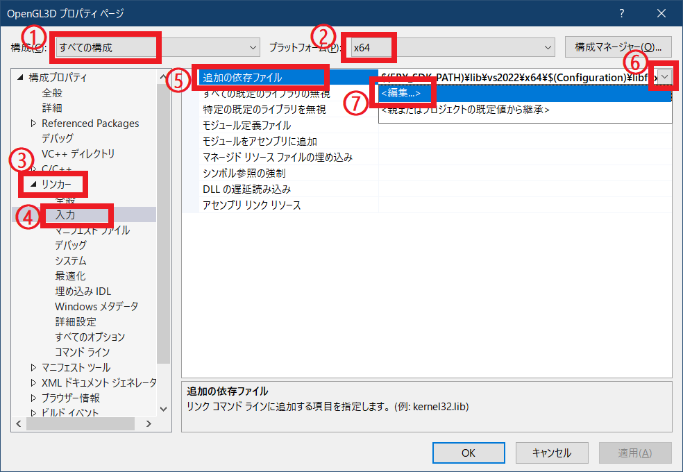
</p>

まずは構成(①)を「すべての構成」、プラットフォーム(②)を「x64」に設定してください。

次に左側リストから「リンカー→入力」(③, ④)を選択して、右側リストの「追加の依存ファイル」(⑤)をクリックしてください。すると、右端に`v`アイコンが表示されます。

この`v`アイコンをクリックすると(⑥)、操作リストが表示されます。リストから「編集」(⑦)をクリックしてください。次のような「追加の依存ファイル」ウィンドウが表示されると思います。

<p align="center">
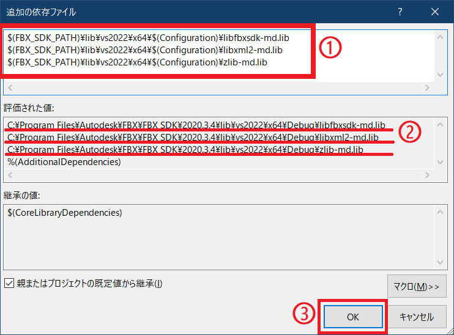
</p>

一番上の空欄をクリックして、3つのライブラリファイルのパスを追加してください(①)。

>* $(FBX_SDK_PATH)￥lib￥vs2022￥x64￥$(Configuration)\libfbxsdk-md.lib
>* $(FBX_SDK_PATH)￥lib￥vs2022￥x64￥$(Configuration)\libxml2-md.lib
>* $(FBX_SDK_PATH)￥lib￥vs2022￥x64￥$(Configuration)\zlib-md.lib

`$(Configuration)`(コンフィギュレーション)はVisual Studioに組み込まれているマクロで、「構成の名前」に置き換えられます。

追加した行の環境変数とマクロを展開した結果が「評価された値」欄に表示されます(②)。FBX SDKのインストールフォルダと比較して、パスが正しいことを確認してください。

確認できたら「OK」ボタンをクリックしてウィンドウを閉じてください(③)。その後、プロパティページの「OK」ボタンをクリックして、プロパティウィンドウを閉じてください(OKボタンでも変更は有効化されます)。

これで、FBX SDKのライブラリファイルが、プロジェクトの実行ファイルにリンクされるようになりました。

>今回のFBX SDKに限らず、ライブラリファイルが提供されているタイプのSDKやライブラリは、同様の手順でプロジェクトに追加できます。

>**【1章のまとめ】**
>
>* 
>* 
>* 

<div style="page-break-after: always"></div>

## 2. 

### 2.1 FbxLoaderインターフェイスを定義する

ここからは、FBX SDKを使ってFBXファイルを読み込むプログラムを作成していきます。

FBXファイルはOBJファイルよりかなり複雑なため、FBXファイル読み込みに特化した`FbxLoader`(エフビーエックス・ローダー)というクラスを定義することにします。

また、いきなりアニメーションまで読み込むのは大変なので、プログラムの作成は3段階に分けて行います。

>1. メッシュの読み込み(本テキストの内容)
>2. スケルトンの読み込み
>3. アニメーションの読み込み

それでは、プロジェクトの`Src/Engine`フォルダに`FbxLoader.h`という名前のヘッダファイルを追加してください。追加したファイルを開き、次のプログラムを追加してください。

```diff
+/**
+* @file FbxLoader.h
+*/
+#ifndef FBXLOADER_H_INCLUDED
+#define FBXLOADER_H_INCLUDED
+#include "Mesh.h"
+
+// 先行宣言
+class MikkTSpace;
+
+/**
+* FBXファイル読み込みオブジェクトの純粋仮想インターフェイス
+*/
+class FbxLoaderInterface
+{
+public:
+  // メッシュ構築用データ
+  struct StaticMeshData
+  {
+    std::string name;                       // メッシュ名
+    std::vector<DrawParams> drawParamsList; // 描画パラメータ配列
+    MaterialList materials;                 // マテリアル配列
+    std::vector<Vertex> vertices;           // 頂点データ
+    std::vector<uint16_t> indices;          // インデックスデータ
+  };
+
+  // 複数のメッシュをまとめたデータ
+  struct MeshScene
+  {
+    std::vector<StaticMeshData> staticMeshDataList; // スタティックメッシュ配列
+  };
+  using MeshScenePtr = std::shared_ptr<MeshScene>;
+
+  // コンストラクタ
+  FbxLoaderInterface() {}
+
+  // デストラクタ
+  virtual ~FbxLoaderInterface() = 0 {}
+
+  virtual MeshScenePtr Load(const char* filename) = 0;
+  virtual const MeshScenePtr& GetMeshScene() const = 0;
+};
+
+// FbxLoaderオブジェクトのポインタ型
+using FbxLoaderPtr = std::shared_ptr<FbxLoaderInterface>;
+
+/**
+* FbxLoaderオブジェクトを作成
+*
+* @param mikkTSpace タンジェントベクトルを生成するMikkTSpaceクラスのアドレス
+* @param textureCallback テクスチャ読み込み関数コールバック
+*
+* @return 作成したFbxLoaderオブジェクト
+*/
+FbxLoaderPtr CreateFbxLoader(MikkTSpace* mikkTSpace,
+  const MeshBuffer::TextureCallback& textureCallback);
+
+#endif // FBXLOADER_H_INCLUDED
```

FBX SDKに対して不要な依存関係を作らないように、ヘッダファイルにはインターフェイスクラスを定義し、実装はCPPファイルで完結させるように設計します。

インターフェイスクラス名は`FbxLoaderInterface`(エフビーエックス・ローダー・インターフェイス)とします。

`FbxLoaderInterface`クラスは、コンストラクタを除くすべてのメンバ関数が`= 0`で宣言されているため、インスタンス化できない「純粋仮想クラス」になります。

CPP側において、このインターフェイスクラスを継承した「実装クラス」を定義します。

ファイル外部から実装クラスを利用するには、`CreateFbxLoader`(クリエイト・エフビーエックス・ローダー)関数によって実装クラスをインスタンス化します。

このクラスの基本的な使い方は、以下のようになります。

>1. `CreateFbxLoader`でFBXローダーのインスタンスを作成。
>2. `Load`インターフェイスでFBXファイルからメッシュデータを読み込む。
>3. `GetMeshScene`インターフェイスで読み込んだメッシュデータを取得。
>4. `Mesh`クラスでメッシュデータからスタティックメッシュを構築。

### 2.2 FbxLoader実装クラスを定義する

続いて、実装クラスを定義します。実装クラスの名前は素直に`FbxLoader`(エフビーエックス・ローダー)とします。

プロジェクトの`Src/Engine`フォルダに`FbxLoader.cpp`というCPPファイルを追加してください。追加したファイルを開き、次のプログラムを追加してください。

```diff
+/**
+* @file FbxLoader.cpp
+*/
+#include "FbxLoader.h"
+#include "Animation.h"
+#include "Debug.h"
+#include "MikkTSpace.h"
+#include <fbxsdk.h>
+#include <algorithm>
+#include <filesystem>
+
+/**
+* FBX読み込みクラスの実装
+*/
+class FbxLoader : public FbxLoaderInterface
+{
+public:
+  // コンストラクタ
+  FbxLoader(MikkTSpace* mikkTSpace,
+    const MeshBuffer::TextureCallback& textureCallback);
+
+  // デストラクタ
+  virtual ~FbxLoader();
+
+  virtual MeshScenePtr Load(const char* filename) override;
+  virtual const MeshScenePtr& GetScene() const override { return meshScene; }
+
+private:
+  bool LoadFbxScene(const char* filename);
+  void GetNodeList();
+  MaterialPtr GetMaterialFromImplementation(
+    const FbxSurfaceMaterial * fbxMaterial, const std::filesystem::path& path);
+  MaterialList GetMaterialList(
+    FbxNode* fbxMeshNode, const std::filesystem::path& path);
+  void ConvertMesh(const std::filesystem::path& path);
+
+  MikkTSpace* mikkTSpace = nullptr;
+  MeshBuffer::TextureCallback textureCallback;
+  MeshScenePtr meshScene; // FBXファイルから読み込んだデータ
+
+  fbxsdk::FbxManager* fbxManager = nullptr;
+  fbxsdk::FbxScene* fbxScene = nullptr;
+  std::vector<fbxsdk::FbxNode*> fbxNodes;
+};
```

FBXファイルを読み込むにはFBX SDKの`FbxManager`クラスを使います。ファイルの内容は`FbxScene`オブジェクトに読み込まれます。

`FbxLoader`クラスは`FbxScene`オブジェクトから必要なデータを取り出し、プログラムから利用できる形式に変換して`MeshScene`オブジェクトに格納します。

FBXファイルの読み込みと変換には、さまざまな処理が必要となりますが、すべての処理をひとつの関数にまとめてしまうとプログラムが読みづらくなってしまいます。

そこで、各処理をプライベートメンバ関数に分けることにします。

>* `LoadFbxScene`(ロード・エフビーエックス・シーン)メンバ関数:<br>FBXファイルを読み込んでFBXシーンオブジェクトに設定します。
>* `GetNodeList`(ゲット・ノード・リスト)メンバ関数:<br>FBXシーンからノード配列を取得します。
>* `GetMaterialFromImplementation`(ゲット・マテリアル・フロム・インプリメンテーション)メンバ関数:<br>FBXマテリアルのシェーダパラメータからマテリアルデータを取得します。
>* `GetMaterialList`(ゲット・マテリアル・リスト)メンバ関数:<br>FBXメッシュからマテリアルを取得します。
>* `ConvertMesh`(コンバート・メッシュ)メンバ関数:<br>FBXシーンからメッシュデータを取り出してスタティックメッシュに変換します(`convert`は「変換する」という意味)。

>**【最初のクラス定義は適当で構わない】**<br>
>実際の開発では、クラス定義の時点で必要なすべてのプライベートメンバ関数が定義できることは<ruby>稀<rt>まれ</rt></ruby>です。どちらかというと、開発の過程で「この処理は関数にまとめたほうがよさそうだ」と気づいたときに、プライベートメンバ関数にすることが多いです。

### 2.3 コンストラクタを定義する

次にコンストラクタを定義します。`FbxLoader`クラスの定義の下に、次のプログラムを追加してください。

```diff
   std::string path;       // FBXファイルパス
   MeshScenePtr meshScene; // FBXファイルから読み込んだデータ
 };
+
+/**
+* コンストラクタ
+*/
+FbxLoader::FbxLoader(MikkTSpace* mikkTSpace,
+  const MeshBuffer::TextureCallback& textureCallback) :
+  mikkTSpace(mikkTSpace), textureCallback(textureCallback)
+{
+  // FBXファイル読み込み用のオブジェクトを作成する
+  fbxManager = FbxManager::Create();
+  fbxScene = FbxScene::Create(fbxManager, "");
+}
```

コンストラクタは受け取った引数をメンバ変数にコピーし、FBXマネージャとFBXシーンを作成します。

FBXマネージャの作成には`FbxManger::Create`関数を使います。プログラムにはFBXマネージャのインスタンスが1つだけ必要です。

FBX SDKによって操作されるオブジェクトの大部分は、FBXマネージャへの参照を使用して作成されます。

FBXシーンの作成には`FbxScene::Create`関数を使います。第2引数は「シーンの名前」ですが、読み込みの際に上書きされるためここで設定する意味はありません。

### 2.4 デストラクタを定義する

続いてデストラクタを定義します。コンストラクタの定義の下に、次のプログラムを追加してください。

```diff
   fbxManager = FbxManager::Create();
   fbxScene = FbxScene::Create(fbxManager, "");
 }
+
+/**
+* デストラクタ
+*/
+FbxLoader::~FbxLoader()
+{
+  // FBXマネージャを破棄する
+  // このマネージャから生成されたすべてのオブジェクトも削除される
+  FBX_SAFE_DESTROY(fbxManager);
+}
```

Fbxマネージャを破棄するには`Destroy`メンバ関数を使います。

`Destroy`メンバ関数が呼び出されると、Fbxマネージャだけでなく、マネージャを使用して作成された他のFBXオブジェクトもすべて破棄されます。

しかし、通常は`Destroy`メンバ関数を直接使うことは避けて、代わりに`FBX_SAFE_DESTROY`マクロを使います。

`FBX_SAFE_DESTROY`マクロは、引数で指定されたポインタが`nullptr`でなければ`Destory`メンバ関数を呼び出し、ポインタを`nullptr`にします。

### 2.5 Loadメンバ関数を定義する

続いて`Load`メンバ関数を定義します。デストラクタの定義の下に、次のプログラムを追加してください。

```diff
   // このマネージャから生成されたすべてのオブジェクトも削除される
   FBX_SAFE_DESTROY(fbxManager);
 }
+
+/**
+* FBXファイルを読み込んで変換する
+*/
+FbxLoader::MeshScenePtr FbxLoader::Load(const char* filename)
+{
+  if (!LoadFbxScene(filename)) {
+    return nullptr;
+  }
+
+  // ノード配列を取得する
+  GetNodeList();
+
+  // メッシュシーンオブジェクトを初期化
+  meshScene = std::make_shared<MeshScene>();
+  meshScene->staticMeshDataList.reserve(fbxNodes.size());
+  meshScene->skeletalMeshDataList.reserve(fbxNodes.size());
+
+  // フォルダ名を取得する
+  const auto path = std::filesystem::path(filename).parent_path().make_preferred();
+
+  ConvertMesh(path);
+
+  return meshScene;
+}
```

`Load`関数は、プライベートメンバ関数を順番に呼び出すことでFBXファイルからメッシュデータを取得します。この手順は次のようになります。

>1. `LoadFbxScene`メンバ関数でFBXファイルからFBXシーンにデータを読み込みます。
>2. `GetNodeList`メンバ関数でFBXシーンからFBXノード配列を取り出す。
>3. `MeshScene`オブジェクトを初期化。
>4. テクスチャ読み込み用にファイルパスからフォルダ名を作成(`std::filesystem`を使用)。
>5. `ConvertMesh`メンバ関数でFBXシーンからスタティックメッシュデータを<ruby>抽出<rt>ちゅうしゅつ</rt></ruby>。

それから、この関数ではファイルパスの表現に、C++17で追加された`std::filesystem::path`(エスティーディー・ファイルシステム・パス)クラスを使っています。

`path`変数を初期化する行では、以下のように関数の戻り値に対して次々と関数を呼び出すことで、複雑な処理を1行で完結させています。

>1. `filesystem::path`コンストラクタで`filename`パスを持つパスオブジェクトAを作成。
>2. `parent_path`メンバ関数で、オブジェクトAのフォルダ名を持つ新しいパスオブジェクトBを作成。`parent_path`の戻り値はB。
>3. `make_preferred`メンバ関数で、オブジェクトBの区切り文字をOS推奨文字に変換。戻り値は「Bの参照」。
>4. Bの参照で`path`変数を初期化。オブジェクトA, Bはこの直後に削除される。

### 2.6 LoadFbxSceneメンバ関数を定義する

続いて`LoadFbxScene`メンバ関数を定義します。`Load`メンバ関数の定義の下に、次のプログラムを追加してください。

```diff
   ConvertMesh(path);

   return meshScene;
 }
+
+/**
+* FBXシーンにデータを設定する
+*/
+bool FbxLoader::LoadFbxScene(const char* filename)
+{
+  // FBXファイルを読み込む
+  FbxIOSettings* ios = FbxIOSettings::Create(fbxManager, IOSROOT);
+  FbxImporter* fbxImporter = FbxImporter::Create(fbxManager, "");
+  const bool importStatus = fbxImporter->Initialize(filename, -1, ios);
+  if (!importStatus || !fbxImporter->Import(fbxScene)) {
+    LOG_ERROR("%sの読み込みに失敗(%s)", filename,
+      fbxImporter->GetStatus().GetErrorString());
+    FBX_SAFE_DESTROY(fbxImporter);
+    FBX_SAFE_DESTROY(ios);
+    return false;
+  }
+
+  // インポーターは読み込むときだけ必要で、以後は使わないので削除する
+  FBX_SAFE_DESTROY(fbxImporter);
+  FBX_SAFE_DESTROY(ios);
+
+  return true;
+}
```

FBXファイルを読み込むには、`FbxIOSettings`(エフビーエックス・アイ・オー・セッティングス)オブジェクトと`FbxImporter`(エフビーエックス・インポーター)オブジェクトを作成する必要があります。

これらは`Create`メンバ関数によって作成できます。`FbxIOSettings`の名前には、FBX SDKで定義されている`IOSROOT`(アイオーエス・ルート)定数を使っています。

>**【IOSROOTってなんだ？】**<br>
>`FbxIOSettings`クラスの入出力設定は階層構造になっていて、設定ごとにFBX SDKで決められた名前が付けられます。設定の名前が異なると正しい設定を取得できなくなるため、FBX SDKでは階層の最上位の設定名として`IOSROOT`を使うことが推奨されています。

`FbxImporter`オブジェクトを初期化するには`Initialize`メンバ関数を使います。インポートするファイルのファイル名と、目的に合わせて適切に設定された`FbxIOSettings`オブジェクトを指定の2つを指定して初期化します。

<pre class="tnmai_code"><strong>【書式】</strong><code>
bool FbxImporter::Initialize(
&emsp;const char* pFileName, int pFileFormat, FbxIOSettings* pIOSettings);
</code></pre>

引数`pFileFormat`には、入力ファイル形式を指定します。`-1`を指定すると、ファイルの拡張子から自動的にファイル形式を判別してくれます。

FBXファイルをインポーターに設定しただけでは、まだFBXファイルの読み込みは行われていません。実際の読み込みは`Import`(インポート)メンバ関数で行います。

<pre class="tnmai_code"><strong>【書式】</strong><code>
bool FbxImporter::Import(FbxDocument* pDocument, bool pNonBlocking = false);
</code></pre>

通常、引数`pDocument`(ピー・ドキュメント)にはFBXシーンオブジェクトのアドレスを指定します。引数`pNonBlocking`(ピー・ノンブロッキング)は、インポート処理を並列実行したい場合に設定します。

この引数は、複数のFBXファイル読み込みを高速化したい場合に使います。ただし、マルチスレッドに関する知識がない場合、デフォルトから変えないことをお勧めします。

インポートが完了したら、`FBX_SAFE_DESTROY`マクロでインポーターオブジェクトと設定オブジェクトを削除します。

次に、インポートしたFBXシーンの「軸の向き」を変換します。インポーターを削除するプログラムの下に、次のプログラムを追加してください。

```diff
   // インポータは読み込むときだけ必要で、以後は使わないので削除する
   FBX_SAFE_DESTROY(fbxImporter);
   FBX_SAFE_DESTROY(ios);
+
+  // 軸の向きをOpenGLに合わせる
+  FbxAxisSystem sceneAxisSystem = fbxScene->GetGlobalSettings().GetAxisSystem();
+  if (sceneAxisSystem != FbxAxisSystem::OpenGL) {
+    FbxAxisSystem::OpenGL.DeepConvertScene(fbxScene);
+  }

   return true;
 }
```

3Dツールによってワールド座標系の軸の向きが異なるため、FBXファイルは「軸の向き」に関する情報を保持しています。

`FbxAxisSystem`(エフビーエックス・アクシス・システム)クラスを使うと、「軸の向き」を利用する側に合わせて変換することができます。

通常はコンストラクタに軸の向きを指定して作成しますが、OpenGLやDirectXのようによく使われる軸の向きについては、それぞれに対応するオブジェクトが事前定義されています。

今回は`FbxAxisSystem::OpenGL`オブジェクトを使って、軸の向きがOpenGLと同じ「X軸=右向き、Y軸=上向き、Z軸=手前向き」になるように変換します。

変換には`DeepConvertScene`(ディープ・コンバート・シーン)メンバ関数を使います。

<pre class="tnmai_code"><strong>【書式】</strong><code>
void FbxAxisSystem::DeepConvertScene(FbxScene* pScene);
</code></pre>

続いて、ポリゴンを三角面に変換します。軸の向きを変換するプログラムの下に、次のプログラムを追加してください。

```diff
   if (sceneAxisSystem != FbxAxisSystem::OpenGL) {
     FbxAxisSystem::OpenGL.DeepConvertScene(fbxScene);
   }
+  
+  // 三角形に変換
+  FbxGeometryConverter geomConverter(fbxManager);
+  geomConverter.Triangulate(fbxScene, true);

   return true;
 }
```

FBXファイルは多角形を扱えるため、そのままのデータではOpenGLやDirectXで表示することができないことがあります。そこで全ての多角形を三角形に変換しておきます。

三角形への変換には`FbxGeometryConverter`(エフビーエックス・ジオメトリ・コンバータ)クラスの`Triangulate`(トライアンギュレート)メンバ関数を使います。

<pre class="tnmai_code"><strong>【書式】</strong><code>
bool FbxGeometryConverter::Triangulate(
&emsp;FbxScene* pScene, bool pReplace, bool pLegacy = false);
</code></pre>

引数`pScene`(ピー・シーン)には「変換したいFBXシーンのアドレス」を指定します。

引数`pReplace`(ピー・リプレース)に`true`を指定すると、変換前のデータを削除して変換後のデータに置き換えます。`false`の場合は変換前のデータを削除せず、変換後のデータが新しく追加されます。

引数`pLegacy`(ピー・レガシー)に`true`を指定すると、古い変換方法が利用されます。これは昔のデータを扱うための機能で、通常は`false`を指定して新しい変換方法を使います。

### 2.7 GetNodeListメンバ関数を定義する

次に、`GetNodeList`(ゲット・ノード・リスト)メンバ関数を定義します。`LoadFbxScene`メンバ関数の定義の下に、次のプログラムを追加してください。

```diff
   geomConverter.Triangulate(fbxScene, true);

   return true;
 }
+
+/**
+* 全てのノードを取得
+*/
+void FbxLoader::GetNodeList()
+{
+  fbxNodes.clear();
+  const int nodeCount = fbxScene->GetNodeCount();
+  fbxNodes.reserve(nodeCount);
+  for (int i = 0; i < nodeCount; ++i) {
+    fbxNodes.push_back(fbxScene->GetNode(i));
+  }
+}
```

この関数は、FBXシーンに含まれるすべてのFBXノードを取り出して`fbxNodes`配列に代入します。これは、後段の変換処理において、FBXノードへのアクセスを高速化するために行っています。

FBXファイルでは、「FBXノード」によってメッシュやスケルトンの親子階層を定義します。

FBXノードの総数を取得するには`GetNodeCount`(ゲット・ノード・カウント)メンバ関数を使います。

<pre class="tnmai_code"><strong>【書式】</strong><code>
int FbxScene::GetNodeCount();
</code></pre>

FBXノードを取得するには`GetNode`(ゲット・ノード)メンバ関数を使います。

<pre class="tnmai_code"><strong>【書式】</strong><code>
FbxNode* FbxScene::GetNode(FBXノードのインデックス);
</code></pre>

### 2.8 ConvertMesh メンバ関数を定義する

次に、メッシュデータを変換する`ConvertMesh`メンバ関数を定義します。`GetNodeList`メンバ関数の定義の下に、次のプログラムを追加してください。

```diff
   for (int i = 0; i < nodeCount; ++i) {
     fbxNodes.push_back(fbxScene->GetNode(i));
   }
 }
+
+/**
+* FBXファイルをメッシュデータに変換する
+*
+* @param filename FBXファイル名
+*
+* @return filenameから作成したメッシュデータ
+*/
+void FbxLoader::ConvertMesh(const std::filesystem::path& path)
+{
+  const size_t fbxNodeCount = fbxNodes.size();
+
+  // 頂点情報を取得
+  for (int nodeIndex = 0; nodeIndex < fbxNodeCount; ++nodeIndex) {
+    FbxNode* fbxMeshNode = fbxNodes[nodeIndex];
+    FbxMesh* fbxMesh = fbxMeshNode->GetMesh();
+    if (!fbxMesh) {
+      continue; // メッシュを持たないノードをスキップ
+    }
+
+    // メッシュ名を設定
+    StaticMeshData meshData;
+    const char* name = fbxMesh->GetName();
+    if (!name || name[0] == '\0') {
+      // FbxMeshに名前が設定されていない場合はノード名で代用する
+      name = fbxMeshNode->GetName();
+      if (!name) {
+        name = ""; // ノード名もない場合は空文字列とする
+      }
+    }
+    meshData.name = name;
+
+    // スタティックメッシュを追加
+    meshScene->staticMeshDataList.push_back(meshData);
+  } // for nodeIndex
+}
```

FBXノードからFBXメッシュを取得するには`GetMesh`メンバ関数を使います。

<pre class="tnmai_code"><strong>【書式】</strong><code>
FbxMesh* FbxNode::GetMesh();
</code></pre>

FBXノードがFBXメッシュを持たない場合は`nullptr`が返されます。

FBXメッシュが取得できたら、FBXメッシュまたはFBXノードの名前をメッシュ名として設定します。FBXオブジェクトの名前を取得するには`GetName`メンバ関数を使います。

<pre class="tnmai_code"><strong>【書式】</strong><code>
const char* FbxObject::GetName();
</code></pre>

さて、FBXファイルの3Dモデルは「ポリゴン」から構成されます。各ポリゴンには3つ以上の「頂点」が含まれており、それぞれがひとつの面を構成します。

各ポリゴンには「どのマテリアルを使用するか」という情報があります。モデルはマテリアル単位で描画することになるので、まずポリゴンをマテリアル単位で分類し、その後マテリアルごとに頂点を取得します。

それでは、ポリゴンをマテリアルごとに分類しましょう。メッシュ名を設定するプログラムの下に、次のプログラムを追加してください。

```diff
         name = ""; // ノード名もない場合は空文字列とする
       }
     }
     meshData.name = name;
+
+    // 頂点がどのマテリアルに属するかを示すマテリアルインデックスリストを取得する
+    const FbxLayerElementArrayTemplate<int>* materialIndexList = nullptr;
+    if (FbxGeometryElementMaterial* fbxMaterialLayer = fbxMesh->GetElementMaterial()) {
+      materialIndexList = &fbxMaterialLayer->GetIndexArray();
+    }
+
+    // マテリアルごとにポリゴン番号を記録
+    const int materialCount = std::max(fbxMeshNode->GetMaterialCount(), 1);
+    const int polygonCount = fbxMesh->GetPolygonCount();
+    std::vector<std::vector<int>> materialPolygons(materialCount);
+    for (auto& e : materialPolygons) {
+      e.reserve(polygonCount / materialCount + 1); // 平均ポリゴン数を予約
+    }
+    if (materialIndexList) {
+      for (int polygonIndex = 0; polygonIndex < polygonCount; ++polygonIndex) {
+        const int materialIndex = materialIndexList->GetAt(polygonIndex);
+        materialPolygons[materialIndex].push_back(polygonIndex);
+      }
+    } else {
+      // インデックスリストが無い場合、すべてのポリゴンを0番マテリアルに分類する
+      for (int i = 0; i < polygonCount; ++i) {
+        materialPolygons[0].push_back(i);
+      }
+    } // if materialIndexList

     // スタティックメッシュを追加
     meshScene->staticMeshDataList.push_back(meshData);
   } // for nodeIndex
```

ポリゴンインデックスに対応するマテリアルインデックスは、`FbxGeometryElementMaterial`(エフビーエックス・ジオメトリ・エレメント・マテリアル)オブジェクトに記録されています。

`FbxGeometryElementMaterial`オブジェクトを取得するには`GetElementMaterial`(ゲット・エレメント・マテリアル)メンバ関数を使います。

<pre class="tnmai_code"><strong>【書式】</strong><code>
FbxGeometryElementMaterial* FbxMesh::GetElementMaterial();
</code></pre>

マテリアルインデックス配列を取得するには`GetIndexArray`(ゲット・インデックス・アレイ)メンバ関数を使います。

<pre class="tnmai_code"><strong>【書式】</strong><code>
マテリアルインデックス配列 FbxGeometryElement::GetIndexArray();
</code></pre>

マテリアル単位のポリゴンインデックスは2次元`vector`に記録します。「マテリアル数」を取得するにはFBXノードクラスの`GetMaterialCount`(ゲット・マテリアル・カウント)メンバ関数を使います。

<pre class="tnmai_code"><strong>【書式】</strong><code>
マテリアル数 FbxNode::GetMaterialCount();
</code></pre>

FBXファイルの仕様では、マテリアルを持たないFBXファイルも作成可能です。その対策として、`std::max`関数を使って最小マテリアル数が1になるようにしています。

ポリゴン数を取得するにはFBXメッシュクラスの`GetPolygonCount`(ゲット・ポリゴン・カウント)メンバ関数を使います。

<pre class="tnmai_code"><strong>【書式】</strong><code>
ポリゴン数 FbxMesh::GetPolygonCount();
</code></pre>

この時点でポリゴン数を取得しているのは`vector`の容量を、ポリゴン数をマテリアル数で割った値、つまり「マテリアルあたりの平均ポリゴン数」で予約するためです。

>マテリアルごとのポリゴン数はマテリアルによって大きく異なるため、これが良い予測値だとは言い難いのですが、平均値より良い方法が思いつきませんでした。

ポリゴンが使用するマテリアルインデックスは、`GetAt`(ゲット・アット)メンバ関数で取得できます。

<pre class="tnmai_code"><strong>【書式】</strong><code>
int FbxElementArray::GetAt(インデックス);
</code></pre>

なお、インデックスリストが存在しない場合(マテリアルがひとつしかないなどの理由が考えられます)、すべてのポリゴンを0番マテリアルに分類しています。

続いて、データバッファを作成して容量を予約します。マテリアルごとのポリゴン番号を記録するプログラムの下に、次のプログラムを追加してください。

```diff
       for (int i = 0; i < polygonCount; ++i) {
         materialPolygons[0].push_back(i);
       }
     } // if materialIndexList
+
+    // ポリゴン数にもとづいて、仮データバッファの容量を予約
+    const int vertexCapacity = polygonCount * 2 / 3 + 1; // 頂点数はポリゴン数の2/3と仮定
+    const int indexCapacity = vertexCapacity * 5; // 各頂点が平均5回再利用されると仮定
+    meshData.indices.reserve(indexCapacity);
+    meshData.vertices.reserve(vertexCapacity);

     // スタティックメッシュを追加
     meshScene->staticMeshDataList.push_back(meshData);
   } // for nodeIndex
```

容量の予測値について、以下の図を見てください。

<p align="center">
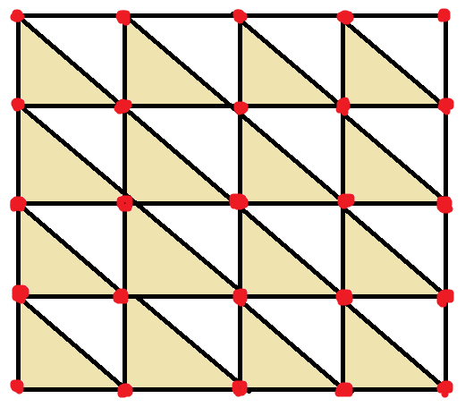
</p>

この図は25頂点、32ポリゴンで構成される平面モデルです。内側の9個の頂点に注目すると、いずれの周囲の6枚のポリゴンから共有されていることが分かります。

もちろん、外周にある頂点では共有数が減っています。しかし、多くの3Dモデルは球体や立方体のように外周を持たないため、頂点は最大限に共有されると考えられます。

とはいえ、実際にはマテリアル境界などの存在によって、外周が全く無くなることはありえません。そこで、インデックス数の計算では6回ではなく5回共有されると仮定しています。

頂点数の予測は、この図のモデルでは $ \frac{25}{32} $ でポリゴン数の約 $ \frac{4}{5} $ になっています。しかし、上下左右がつながっていると仮定すると $ \frac{16}{32} $ でポリゴン数のちょうど $ \frac{1}{2} $ になります。

そこで、 $ \frac{4}{5} $ と $ \frac{1}{2} $ の中間を取って、 $ \frac{4}{5} $ の大きさで予約することにしました。

なお、1を加算しているのは除算によって0になることを防ぐためです。

次に頂点座標配列、法線配列、テクスチャ座標配列を取得します。頂点座標配列は`FbxVector4`型の配列で、`GetControlPoints`(ゲット・コントロール・ポインツ)メンバ関数で簡単に取得できます。

データバッファを予約するプログラムの下に、次のプログラムを追加してください。

```diff
     meshData.indices.reserve(indexCapacity);
     meshData.vertices.reserve(vertexCapacity);
     indexMap.reserve(vertexCapacity);
+
+    // 頂点座標配列を取得
+    const FbxVector4* const fbxControlPoints = fbxMesh->GetControlPoints();

     // スタティックメッシュを追加
     meshScene->staticMeshDataList.push_back(meshData);
   } // for nodeIndex
```

問題は法線配列とテクスチャ座標配列のほうです。これらのデータは単純な配列の場合もあれば、データ圧縮のためにインデックス化された配列の場合もあるという、少し複雑な仕組みになっています。

そこで、データ構造に対応する「属性データ取得関数」を定義して、データ構造に応じてそれらを使い分けることにします。

まず属性データ取得関数の型を定義しますが、法線配列とテクスチャ座標配列では元になる配列型が異なります。そこで、配列型をテンプレートパラメータとする「<ruby>型<rt>かた</rt></ruby>テンプレート」として定義します。

型テンプレートの名前は`ElementGetterType`(エレメント・ゲッター・タイプ、「要素を取得する関数の型」のような意味)とします。`FbxLoader.cpp`の先頭に移動し、次のプログラムを追加してください。

```diff
 #include <fbxsdk.h>
 #include <algorithm>
 #include <filesystem>
+
+namespace /* unnamed */ {
+
+/**
+* 属性データ取得関数の型テンプレート
+*
+* @tparam T 属性データクラス
+*
+* @param mesh      メッシュオブジェクトのアドレス
+* @param layer     属性配列オブジェクトのアドレス
+* @param polyIndex ポリゴン番号
+* @param posInPoly ポリゴン内の頂点番号(0,1,2)
+* @param index     真のインデックスの格納先
+*/
+template<typename T> using ElementGetterType = T (*)(
+  const FbxMesh* mesh, const FbxLayerElementTemplate<T>* layer,
+  int polyIndex, int posInPoly, int& index);
+
+} // unnamed namespace

 /**
 * FBX読み込みクラスの実装
 */
 class FbxLoader : public FbxLoaderInterface
```

`ElementGetterType`関数の引数は5つで、最初の4つは属性配列からデータを取り出すための入力パラメータ、最後の引数は、データのインデックスを返すための出力パラメータになっています。

それでは、データ構造に対応する`ElementGetterType`型を選択する関数テンプレートを追加しましょう。`ElementGetterType`型の定義の下に、次のプログラムを追加してください。

```diff
 template<typename T> using ElementGetterType = T (*)(
   const FbxMesh* mesh, const FbxLayerElementTemplate<T>* layer,
   int polyIndex, int posInPoly, int& index);
+
+/**
+* 頂点属性配列から属性データを取り出す「属性データ取得関数」を作成する
+*
+* @param layer 頂点属性配列
+*
+* @return layerからインデックスに対応する値を取得するオブジェクト
+*/
+template<typename T>
+ElementGetterType<T> GetElementGetter(const FbxLayerElementTemplate<T>* layer)
+{
+  // 配列がない場合は常に固定値を返す
+  if (!layer) {
+    return [](const FbxMesh* mesh, const FbxLayerElementTemplate<T>* layer,
+      int polyIndex, int posInPoly, int& index) {
+        index = 0;
+        return T();
+      };
+  } // if !layer
+}

 } // unnamed namespace

 /**
 * FBX読み込みクラスの実装
```

属性データが常に存在するとは限らないため、`layer`引数が`nullptr`の場合は「常にデフォルト値を返す関数」をラムダ式として定義して返します。

次に、`layer`が存在する場合の分岐を作成します。`layer`が`nullptr`の場合のプログラムの下に、次のプログラムを追加してください。

```diff
         return T();
       };
   } // if !layer
+
+  const auto referenceMode = layer->GetReferenceMode();
+  switch (layer->GetMappingMode()) {
+  default:
+  case FbxGeometryElement::eByControlPoint:
+    // 頂点番号を使うデータ構造の場合
+    switch (referenceMode) {
+    default:
+    case FbxGeometryElement::eDirect:
+      // 頂点番号をそのまま「属性配列のインデックス」とする
+
+    case FbxGeometryElement::eIndexToDirect:
+      // 頂点番号を「インデックス配列のインデックス」として、
+      // インデックス配列から得た値を「属性配列のインデックス」とする
+    }
+
+  case FbxGeometryElement::eByPolygonVertex:
+    // ポリゴン番号とポリゴン内の頂点番号から計算するデータ構造の場合
+    switch (referenceMode) {
+    default:
+    case FbxGeometryElement::eDirect:
+      // ポリゴン番号とポリゴン内の頂点番号から計算した値を「属性配列のインデックス」とする
+
+    case FbxGeometryElement::eIndexToDirect:
+      // ポリゴン番号とポリゴン内の頂点番号から計算した値を「インデックス配列のインデックス」とし、
+      // インデックス配列から得た値を「属性配列のインデックス」とする
+    }
+  } // switch GetMappingMode()
 }

 } // unnamed namespace
```

属性データのデータ構造は、「マッピングモード」と「リファレンスモード」によって定義されます。

属性データが取りうるマッピングモードには、「頂点番号配列を参照」するか「ポリゴン番号から計算」するかによって、以下の2種類が存在します。

>* `eByControlPoint`:<br>頂点番号配列を参照するモード。`GetPolygonVertex`関数で取得できる頂点番号を、配列参照用のインデックスとする。
>* `eByPolygonVertex`<br>ポリゴン番号から計算するモード。「ポリゴン番号 * 3 + ポリゴン内の頂点番号(0,1,2のいずれか)」を、配列参照用のインデックスとする。

リファレンスモードには、配列を「直接参照」するか「インデックス配列から間接参照」するかによって、以下の2種類が存在します。

>* `eDirect`:<br>直接参照するモード。マッピングモードごとに取得(または計算)したインデックスを、そのまま属性配列のインデックスとする。
>* `eIndexToDirect`:<br>インデックス配列から間接参照するモード。マッピングモードごとに取得(または計算)したインデックスを「仮インデックス」として「インデックス配列」を参照し、「インデックス配列」から取得した「真のインデックス」を属性配列のインデックスとする。

属性配列は`GetDirectArray`メンバ関数で取得できます。

<pre class="tnmai_code"><strong>【書式】</strong><code>
属性配列 FbxLayerElement::GetDirectArray();
</code></pre>

それでは、`eByControlPoint`マッピングモード用の関数(ラムダ式)から定義しましょう。`eByControlPoint`を扱う`case`文に次のプログラムを追加してください。

```diff
     // 頂点番号を使うデータ構造の場合
     switch (referenceMode) {
     default:
     case FbxGeometryElement::eDirect:
       // 頂点番号をそのまま「属性配列のインデックス」とする
+      return [](const FbxMesh* mesh, const FbxLayerElementTemplate<T>* layer,
+        int polyIndex, int posInPoly, int& index) {
+          index = mesh->GetPolygonVertex(polyIndex, posInPoly);
+          return layer->GetDirectArray().GetAt(index);
+        };
+
     case FbxGeometryElement::eIndexToDirect:
       // 頂点番号を「インデックス配列のインデックス」として、
       // インデックス配列から得た値を「属性配列のインデックス」とする
+      return [](const FbxMesh* mesh, const FbxLayerElementTemplate<T>* layer,
+        int polyIndex, int posInPoly, int& index) {
+          const int i = mesh->GetPolygonVertex(polyIndex, posInPoly);
+          index = layer->GetIndexArray().GetAt(i);
+          return layer->GetDirectArray().GetAt(index);
+        };
     }

   case FbxGeometryElement::eByPolygonVertex:
     // ポリゴン番号とポリゴン内の頂点番号から計算するデータ構造の場合
```

`eByControlPoint`の場合、どちらのリファレンスモードでも最初は`GetPolygonVertex`メンバ関数で頂点番号を取得します。

リファレンスモードが`eDirect`なら、頂点番号がそのまま「属性配列のインデックス」になります。`eIndexToDirect`なら、頂点番号は「インデックス配列のインデックス」になります。

そして、インデックス配列から得た値が「属性配列のインデックス」になります。インデックス配列を取得するには`GetIndexArray`メンバ関数を使います。

<pre class="tnmai_code"><strong>【書式】</strong><code>
インデックス配列 FbxLayerElement::GetIndexArray();
</code></pre>

次に、マッピングモードが`eByPolygonVertex`の場合の関数(ラムダ式)を定義します。`eByPolygonVertex`を扱う`case`文に次のプログラムを追加してください。

```diff
     // ポリゴン番号とポリゴン内の頂点番号から計算するデータ構造の場合
     switch (referenceMode) {
     default:
     case FbxGeometryElement::eDirect:
       // ポリゴン番号とポリゴン内の頂点番号から計算した値を「属性配列のインデックス」とする
+      return [](const FbxMesh* mesh, const FbxLayerElementTemplate<T>* layer,
+        int polyIndex, int posInPoly, int& index) {
+          index = polyIndex * 3 + posInPoly;
+          return layer->GetDirectArray().GetAt(index);
+        };

     case FbxGeometryElement::eIndexToDirect:
       // ポリゴン番号とポリゴン内の頂点番号から計算した値を「インデックス配列のインデックス」とし、
       // インデックス配列から得た値を「属性配列のインデックス」とする
+      return [](const FbxMesh* mesh, const FbxLayerElementTemplate<T>* layer,
+        int polyIndex, int posInPoly, int& index) {
+          const int i = polyIndex * 3 + posInPoly;
+          index = layer->GetIndexArray().GetAt(i);
+          return layer->GetDirectArray().GetAt(index);
+        };
     }
   } // switch GetMappingMode()
 }
```

マッピングモードが`eByPolygonVertex`の場合、頂点番号の代わりに「ポリゴン番号 * 3 + ポリゴン内の頂点番号」を使います。それ以外は`eByControlPoint`と同じです。

これで、4種類のデータ構造に対応する関数を選べるようになりました。

ただ、あともう少しだけ作っておきたい関数があるので、それを作成します。作成したいのは「FBX SDKのベクトル型からOpenGLのベクトル型に変換する関数」です。

例えば、3要素のベクトル型はFBX SDKでは`FbxVector3`(エフビーエックス・ベクター・スリー)として定義されています。これをOpenGLの`vec3`型に変換したいというわけです。

テクスチャ座標が2要素ベクトル、頂点座標と法線が3要素ベクトルなので、それぞれ`ToVec2`(トゥ・ベク・ツー)、`ToVec3`(トゥ・ベク・スリー)という名前の関数を作成します。

`GetElementGetter`関数テンプレートの定義の下に、次のプログラムを追加してください。

```diff
           index = layer->GetIndexArray().GetAt(i);
           return layer->GetDirectArray().GetAt(index);
         };
     }
   } // switch GetMappingMode()
 }
+
+/**
+* 2要素ベクトル型の変換
+*
+* @param v  FBX SDKの2要素ベクトル
+*
+* @return vをvec2に変換した値
+*/
+constexpr static vec2 ToVec2(const FbxVector2& v)
+{
+  return {
+    static_cast<float>(v[0]),
+    static_cast<float>(v[1]) };
+}
+
+/**
+* 3要素ベクトル型の変換
+*
+* @param v  FBX SDKの3要素ベクトル
+*
+* @return vをvec3に変換した値
+*/
+constexpr static vec3 ToVec3(const FbxVector4& v)
+{
+  return {
+    static_cast<float>(v[0]),
+    static_cast<float>(v[1]),
+    static_cast<float>(v[2]) };
+}

 } // unnamed namespace

 /**
 * FBX読み込みクラスの実装
```

また、`FbxVector`系クラスのメンバ変数型は`double`です。より表現力の低い`float`型に暗黙変換すると警告されるため、`static_cast`によって警告を抑制しています。

それでは、`ConverteMesh`メンバ関数の定義に戻りましょう。

作成した`GetElementGetter`関数を使って、法線配列とテクスチャ座標配列の属性データを取得する関数を選択します。頂点座標配列を取得するプログラムの下に、次のプログラムを追加してください。

```diff
     // 頂点座標配列を取得
     const FbxVector4* const fbxControlPoints = fbxMesh->GetControlPoints();
+
+    // 法線配列を取得
+    FbxGeometryElementNormal* fbxNormals = fbxMesh->GetElementNormal();
+    const auto normalGetter = GetElementGetter(fbxNormals);
+
+    // テクスチャ座標配列を取得
+    FbxGeometryElementUV* fbxUVs = fbxMesh->GetElementUV();// uvSetNameList[0]);
+    const auto uvGetter = GetElementGetter(fbxUVs);
```

これで、法線は`normalGetter`(ノーマル・ゲッター)変数、テクスチャ座標は`uvGetter`(ユーブイ・ゲッター)変数を使うことで取得できるようになりました。

ここまでで、ようやく頂点データを取得する準備が整いました。`uvGetter`を取得するプログラムの下に、次のプログラムを追加してください。

```diff
     // テクスチャ座標配列を取得
     FbxGeometryElementUV* fbxUVs = fbxMesh->GetElementUV();// uvSetNameList[0]);
     const auto uvGetter = GetElementGetter(fbxUVs);
+
+    // 全ポリゴンをループして頂点データを取得
+    meshData.drawParamsList.resize(materialCount);
+    for (int materialIndex = 0; materialIndex < materialCount; ++materialIndex) {
+      // 各マテリアルの頂点インデックスが0番から開始されるようにする
+      GLsizei indexCount = 0;
+      uint16_t vertexCount = 0;
+      indexMap.clear();
+
+      for (auto polygonIndex : materialPolygons[materialIndex]) {
+        for (int vertexIndex = 0; vertexIndex < 3; ++vertexIndex) {
+          Vertex v = {};
+
+          // 頂点座標を取得
+          const int positionIndex =
+            fbxMesh->GetPolygonVertex(polygonIndex, vertexIndex);
+          v.position = ToVec3(fbxControlPoints[positionIndex]);
+
+          // 法線を取得
+          int normalIndex;
+          v.normal = ToVec3(normalGetter(
+            fbxMesh, fbxNormals, polygonIndex, vertexIndex, normalIndex));
+
+          // テクスチャ座標を取得
+          int texcoordIndex;
+          v.texcoord = ToVec2(uvGetter(
+            fbxMesh, fbxUVs, polygonIndex, vertexIndex, texcoordIndex));
+
+        } // for vertexIndex
+      } // for polygonIndex
+    } // for materialIndex

     // スタティックメッシュを追加
     meshScene->staticMeshDataList.push_back(meshData);
   } // for nodeIndex
```

ここでは3重ループによって、すべてのマテリアルのすべてのポリゴンの3つの頂点について、頂点データを収集しています。

さて、収集した頂点データをそのまま記録してしまうと、頂点データが共有されないことでメモリが無駄に消費され、描画効率も低下します。これはOBJファイルでも起きたことです。

そこで、OBJファイルで頂点データを共有したときと同じ仕組みを使って、メモリ消費量を低減して描画効率を向上させることにします。テクスチャ座標配列を取得するプログラムの下に、次のプログラムを追加してください。

```diff
     // テクスチャ座標配列を取得
     FbxGeometryElementUV* fbxUVs = fbxMesh->GetElementUV();// uvSetNameList[0]);
     const auto uvGetter = GetElementGetter(fbxUVs);
+
+    // FBXの頂点識別子とOpenGLの頂点インデックスの対応表
+    std::unordered_map<uint64_t, uint16_t> indexMap;
+    indexMap.reserve(indexCapacity);

     // 全ポリゴンをループして頂点データを取得
     meshData.drawParamsList.resize(materialCount);
     for (int materialIndex = 0; materialIndex < materialCount; ++materialIndex) {
```

次に、対応表に記録する識別子を計算し、対応表に一致する識別子があるかどうかによって、頂点データの処理を分岐します。テクスチャ座標を取得するプログラムの下に、次のプログラムを追加してください。

```diff
           // テクスチャ座標を取得
           int texcoordIndex;
           v.texcoord = ToVec2(uvGetter(
             fbxMesh, fbxUVs, polygonIndex, vertexIndex, texcoordIndex));
+
+          // 各要素のインデックスから、頂点データを識別する値(識別子)を計算
+          const uint64_t identifier = positionIndex +
+            (static_cast<uint64_t>(normalIndex) << 20) +
+            (static_cast<uint64_t>(texcoordIndex) << 40);
+
+          // 識別子が記録済みの頂点データと一致したら、そのインデックスを再利用
+          // まだ記録されていない識別子の場合、新しい頂点データとして記録
+          const auto itr = indexMap.find(identifier);
+          if (itr != indexMap.end()) {
+            // 対応表にあるので既存の頂点を再利用
+            meshData.indices.push_back(itr->second);
+            ++indexCount;
+          } else {
+            // 対応表にないので新しい頂点データを作成
+            meshData.indices.push_back(vertexCount);
+            ++indexCount;
+
+            // 識別子を登録
+            indexMap.emplace(identifier, vertexCount);
+
+            // 頂点データを追加
+            meshData.vertices.push_back(v);
+            ++vertexCount;
+          }
         } // for vertexIndex
       } // for polygonIndex
     } // for materialIndex
```

この対応表を使ったプログラムは、識別子の作成に使うのがインデックスデータである点を除いては、OBJファイルの対応表のプログラムとほとんど同じです。

これで、マテリアルひとつ分の頂点データが変換できたことになります。次はこのデータから描画パラメータを作成します。`polygonIndex`のループの下に、次のプログラムを追加してください。

```diff
             ++vertexCount;
           }
         } // for vertexIndex
       } // for polygonIndex
+
+      // 描画パラメータを作成
+      auto& drawParams = meshData.drawParamsList[materialIndex];
+      drawParams.materialNo = materialIndex;
+      drawParams.count = indexCount;
+      drawParams.indices = reinterpret_cast<void*>(
+        (meshData.indices.size() - indexCount) * sizeof(uint16_t));
+      drawParams.baseVertex = static_cast<GLint>(
+        meshData.vertices.size() - vertexCount);
     } // for materialIndex

     // スタティックメッシュを追加
     meshScene->staticMeshDataList.push_back(meshData);
```

すべてのマテリアルの頂点データを変換できたら、タンジェントベクトルを計算します。`materialIndex`のループの下に、次のプログラムを追加してください。

```diff
       drawParams.baseVertex = static_cast<GLint>(
         meshData.vertices.size() - vertexCount);
     } // for materialIndex
+
+    // タンジェントベクトルを計算
+    if (mikkTSpace) {
+      // MikkTSpaceライブラリでタンジェントを計算
+      MikkTSpace::UserData userData = { meshData.indices, meshData.vertices };
+      SMikkTSpaceContext context = { &mikkTSpace->interface, &userData };
+      genTangSpaceDefault(&context);
+    }

     // スタティックメッシュを追加
     meshScene->staticMeshDataList.push_back(meshData);
   } // for nodeIndex
```

これで頂点データの変換は完了です。

### 2.9 GetMaterialFromImplementationメンバ関数を定義する

次にマテリアルデータを変換していきます。FBXファイルには大きく「シェーダ」「ランバート」「フォン」という3種類のマテリアルがあります。

最初に、「シェーダ」タイプのマテリアルから情報を取り出す`GetMaterialFromImplementation`メンバ関数を定義します。`GetNodeList`メンバ関数の定義の下に、次のプログラムを追加してください。

```diff
   for (int i = 0; i < nodeCount; ++i) {
     fbxNodes.push_back(fbxScene->GetNode(i));
   }
 }
+
+/**
+* シェーダマテリアルからマテリアルデータを取得する
+*/
+MaterialPtr FbxLoader::GetMaterialFromImplementation(
+  const FbxSurfaceMaterial* fbxMaterial, const std::filesystem::path& path)
+{
+  // シェーダタイプ名のリスト
+  static const char* const targetNames[] = {
+    FBXSDK_IMPLEMENTATION_CGFX,
+    FBXSDK_IMPLEMENTATION_HLSL,
+    FBXSDK_IMPLEMENTATION_SFX,
+    FBXSDK_IMPLEMENTATION_OGS,
+    FBXSDK_IMPLEMENTATION_SSSL,
+  };
+
+  // シェーダタイプ名と一致するインプリメンテーション(シェーダパラメータ)を取得する
+  const FbxImplementation* fbxImplementation = nullptr;
+  for (const char* name : targetNames) {
+    fbxImplementation = fbxsdk::GetImplementation(fbxMaterial, name);
+    if (fbxImplementation) {
+      break;
+    }
+  }
+
+  // インプリメンテーションが見つからない場合はデフォルト値を返す
+  auto m = std::make_shared<Material>();
+  if (!fbxImplementation) {
+    return m;
+  }
+
+  return m;
+}
```

シェーダタイプのマテリアルは「FBXインプリメンテーション」オブジェクトに関連付けられています。FBXインプリメンテーションは「シェーダのパラメータを管理するオブジェクト」です。

FBXインプリメンテーションを取得するには`GetImplementation`(ゲット・インプリメンテーション)関数を使います。なお、インプリメンテーションは「実装」という意味です。FBX SDKでは「シェーダの実装技術」を意味します。

<pre class="tnmai_code"><strong>【書式】</strong><code>
FbxImplementation* GetImplementation(FBXマテリアル, インプリメンテーション名);
</code></pre>

「インプリメンテーション名」引数には、FBX SDKで事前定義された`FBXSDK_IMPLEMENTATION_CGFX`などのマクロを指定します。

マテリアルがFBXインプリメンテーションを持っている場合、インプリメンテーションが使用するデータのうち、テクスチャファイル名を取得します。

インプリメンテーションの有無を判定するプログラムの下に、次のプログラムを追加してください。

```diff
   if (!fbxImplementation) {
     return m;
   }
+
+  // インプリメンテーションに関連付けられたマテリアルデータを取得
+  auto m = std::make_shared<Material>();
+  const FbxBindingTable* fbxTable = fbxImplementation->GetRootTable();
+  const int entryCount = static_cast<int>(fbxTable->GetEntryCount());
+  for (int i = 0; i < entryCount; ++i) {
+    const FbxBindingTableEntry& fbxEntry = fbxTable->GetEntry(i);
+
+    // テーブルに登録された名前に対応するプロパティオブジェクトを取得
+    const char* entrySrcType = fbxEntry.GetEntryType(true);
+    FbxProperty fbxProp;
+    if (strcmp(FbxPropertyEntryView::sEntryType, entrySrcType) == 0) {
+      fbxProp = fbxMaterial->FindPropertyHierarchical(fbxEntry.GetSource());
+    } else if (strcmp(FbxConstantEntryView::sEntryType, entrySrcType) == 0) {
+      fbxProp = fbxImplementation->GetConstants().FindHierarchical(fbxEntry.GetSource());
+    }
+
+    // プロパティが見つからない、またはテクスチャプロパティではない場合はスキップ
+    if (!fbxProp.IsValid() || fbxProp.GetSrcObjectCount<FbxTexture>() <= 0) {
+      continue;
+    }
+  } // for entryCount
   return m;
 }
```

FBXインプリメンテーションが使用するプロパティの名前は、`FbxBindingTable`(エフビーエックス・バインディング・テーブル)オブジェクトが保持しています。

`FbxBindingTable`オブジェクトを取得するには`GetRootTable`(ゲット・ルート・テーブル)メンバ関数を使います。

<pre class="tnmai_code"><strong>【書式】</strong><code>
FbxBindingTable* FbxImplementation::GetRootTable();
</code></pre>

`FbxBindintTable`はプロパティ名を`FbxBindingTableEntry`(エフビーエックス・バインディング・テーブル・エントリ)オブジェクトの配列として保持しています。

エントリの総数を取得するには`GetEntryCount`(ゲット・エントリ・カウント)メンバ関数を使います。エントリオブジェクトを取得するには`GetEntry`(ゲット・エントリ)メンバ関数を使います。

<pre class="tnmai_code"><strong>【書式】</strong><code>
int FbxBindingTable::GetEntryCount();
</code></pre>

<pre class="tnmai_code"><strong>【書式】</strong><code>
FbxBindingTableEntry* FbxBindingTable::GetEntry(エントリのインデックス);
</code></pre>

>`entry`(エントリ)という単語にはさまざまな意味がありますが、コンピュータ用語としては「項目」や「登録された情報」という意味で使われることが多いです。

テクスチャファイル名は、「FBXマテリアルのプロパティ配列」内に登録されている場合と、「FBXインプリメンテーションの定数プロパティ配列」内に登録されている場合があります。

どちらに登録されているかは、エントリオブジェクトの`GetEntryType`(ゲット・エントリ・タイプ)メンバ関数で取得できます。

<pre class="tnmai_code"><strong>【書式】</strong><code>
const char* FbxBindingTableEntry::GetEntryType(bool pAsSource);
</code></pre>

引数`pAsSource`には、エントリの種類を取得する場合は`true`、エントリの用途を取得する場合は`false`を指定します。今回は「エントリの種類」が知りたいので`true`を指定しています。

エントリの種類が`FbxPropertyEntry`の場合はFBXマテリアルのプロパティ配列から検索します。`FbxConstantEntry`の場合はFBXインプリメンテーションの定数プロパティ配列から検索します。

FBXマテリアルのプロパティ配列から検索するには`FindPropertyHierarchical`(ファインド・プロパティ・ヒエラルチカル)メンバ関数を使います。

<pre class="tnmai_code"><strong>【書式】</strong><code>
FbxProperty FbxObject::FindPropertyHierarchical(プロパティ名);
</code></pre>

この関数はFBXマテリアルに登録されたプロパティツリーをたどって、名前の一致する最初のプロパティを返します。

定数プロパティ配列から検索するには、まず`GetConstants`(ゲット・コンスタンツ)メンバ関数でプロパティオブジェクトを取得します。

<pre class="tnmai_code"><strong>【書式】</strong><code>
FbxProperty FbxImplementation::GetConstants();
</code></pre>

次に、取得したプロパティオブジェクトに対して`FindHierarchical`(ファインド・ヒエラルチカル)メンバ関数を呼び出します。

<pre class="tnmai_code"><strong>【書式】</strong><code>
FbxProperty FbxProperty::FindHierarchical(プロパティ名);
</code></pre>

この関数は、指定されたプロパティをルートとするツリーをたどって、名前の一致する最初のプロパティを返します。

プロパティの`IsValid`(イズ・バリッド)メンバ関数が`false`を返す場合、名前に対応するプロパティは存在しません。この場合は次のエントリに進みます。

また、ここでの目的はテクスチャファイル名の取得です。有効なプロパティであってもテクスチャを持たない場合、スキップして次のエントリに進みます。

テクスチャの有無は、`GetSourceObjectCount`(ゲット・ソース・オブジェクト・カウント)メンバ関数テンプレートに`FbxTexture`パラメータを指定することで確認できます。

<pre class="tnmai_code"><strong>【書式】</strong><code>
オブジェクト数 FbxProperty::GetSourceObjectCount&lt;検索するクラス名&gt;();
</code></pre>

テクスチャオブジェクトを持っていることが確認できたら、テクスチャファイル名を取得します。プロパティを取得するプログラムの下に、次のプログラムを追加してください。

```diff
     if (!fbxProp.IsValid() || fbxProp.GetSrcObjectCount<FbxTexture>() <= 0) {
       continue;
     }
+
+    // テクスチャパラメータの場合はテクスチャファイル名を取得
+    std::string filename;
+    auto* fbxFileTexture = fbxProp.GetSrcObject<FbxFileTexture>(0);
+    if (fbxFileTexture) {
+      filename = fbxFileTexture->GetFileName();
+    } else {
+      auto* fbxLayeredTexture = fbxProp.GetSrcObject<FbxLayeredTexture>(0);
+      if (fbxLayeredTexture) {
+        auto* fbxFileTexture = fbxLayeredTexture->GetSrcObject<FbxFileTexture>(0);
+        if (fbxFileTexture) {
+          filename = fbxFileTexture->GetFileName();
+        }
+      } // if fbxLayeredTexture
+    } // if fbxFileTexture
+
+    // ファイル名が取得できない場合はスキップ
+    if (filename.empty()) {
+      continue;
+    }
   } // for entryCount
   return m;
 }
```

FBXのテクスチャオブジェクトには以下の3種類が存在します。

>* `FbxFileTexture`: 画像ファイルから作られるテクスチャ。
>* `FbxLayeredTexture`: 複数のテクスチャオブジェクトの配列。
>* `FbxProceduralTexture`: 計算式とパラメータから生成されるテクスチャ。

最後のFBXプロシージャルテクスチャは、画像ファイルではなく計算式によってピクセルを生成するものです。今回は画像ファイルの取得が目的なので対応しません。

また、今回はプロパティごとにひとつだけテクスチャファイル名を取得しています。ひとつのプロパティに複数のテクスチャオブジェクトを持たせることは可能ですが、2024年現在これを行う3Dツールは存在しません。

テクスチャファイル名の取得には`GetFileName`(ゲット・ファイル・ネーム)メンバ関数を使います。

テクスチャファイル名を取得できたら、その名前を使ってテクスチャを読み込みます。「ファイル名が取得できない場合はスキップ」するプログラムの下に、次のプログラムを追加してください。

```diff
     // ファイル名が取得できない場合はスキップ
     if (filename.empty()) {
       continue;
     }
+
+    // ファイルパスをモデルデータのパスに置き換えて、拡張子をtgaにする
+    const auto stem = std::filesystem::path(filename).stem();
+    filename = (path / stem).string() + ".tga";
+
+    // 同じものを指す場合でも、プロパティ名は3Dツールによって異なる
+    const auto name = fbxProp.GetName();
+    if (name == "DiffuseColor" || name == "DiffuseTexture" || name == "TEX_color_map") {
+      m->texBaseColor = textureCallback(filename.c_str());
+    } else if (name == "EmissiveColor" || name == "EmissiveTexture" || name == "TEX_emissive_map") {
+      m->texEmission = textureCallback(filename.c_str());
+    } else if (name == "NormalMap" || name == "NormalTexture" || name == "TEX_normal_map") {
+      m->texNormal = textureCallback(filename.c_str());
+    }
   } // for entryCount
   return m;
 }
```

テクスチャの種類はプロパティ名から判断します。今回は`Maya`3Dツールで出力される`????Color`, `????Texture`, `TEX_????_map`の3パターンに対応しています。

### 2.10 GetMaterialListメンバ関数を定義する

次に`GetMaterialList`メンバ関数を定義します。`GetMaterialFromImplementation`メンバ関数の定義の下に、次のプログラムを追加してください。

```diff
   } // for entryCount
   return m;
 }
+
+/**
+* マテリアル情報を読み取る
+*/
+MaterialList FbxLoader::GetMaterialList(
+  FbxNode* fbxMeshNode, const std::filesystem::path& path)
+{
+  // マテリアル数を予約
+  MaterialList materials;
+  const int fbxMaterialCount = fbxMeshNode->GetMaterialCount();
+  materials.reserve(fbxMaterialCount);
+
+  // マテリアル数が0の場合はデフォルトマテリアルを追加して終了
+  if (fbxMaterialCount <= 0) {
+    materials.push_back(std::make_shared<Material>());
+    return materials;
+  }
+
+  // すべてのマテリアルを取得
+  for (int i = 0; i < fbxMaterialCount; ++i) {
+    const FbxSurfaceMaterial* material = fbxMeshNode->GetMaterial(i);
+    auto m = GetMaterialFromImplementation(material, path);
+
+    materials.push_back(m);
+  } // for i < fbxMaterialCount
+}
```

FBXファイルにおいて、マテリアルはFBXノードが保持しています(FBXメッシュではありません)。FBXノードが持つマテリアル数は`GetMaterialCount`(ゲット・マテリアル・カウント)メンバ関数で取得できます。マテリアル自体は`GetMaterial`メンバ関数で取得できます。

FBX SDKのすべてのマテリアルは`FbxSurfaceMaterial`(エフビーエックス・サーフェス・マテリアル)クラスの派生クラスとして定義されています。

続いて、マテリアルが「ランバート」または「フォン」だった場合のデータ取得処理を追加します。`GetMaterialFromImplementation`関数呼び出しの下に、次のプログラムを追加してください。

```diff
   for (int i = 0; i < fbxMaterialCount; ++i) {
     const FbxSurfaceMaterial* material = fbxMeshNode->GetMaterial(i);
     auto m = GetMaterialFromImplementation(material, path);
+
+    // ランバートマテリアル(フォンマテリアル)のデータ取得を試みる
+    if (material->Is<FbxSurfaceLambert>()) {
+      const auto* lambert = static_cast<const FbxSurfaceLambert*>(material);
+
+      // ディフューズ色を取得
+      const auto diffuse = lambert->Diffuse.Get();
+      const auto diffuseFactor = lambert->DiffuseFactor.Get();
+      m->baseColor.x = static_cast<float>(diffuse[0] * diffuseFactor);
+      m->baseColor.y = static_cast<float>(diffuse[1] * diffuseFactor);
+      m->baseColor.z = static_cast<float>(diffuse[2] * diffuseFactor);
+
+      // 透明度を取得
+      if (lambert->TransparencyFactor.IsValid()) {
+        auto transparency = lambert->TransparencyFactor.Get();
+        auto color = lambert->TransparentColor.Get();
+        transparency *= (color[0] + color[1] + color[2]) / 3;
+        m->baseColor.w = static_cast<float>(1 - transparency);
+      }
+
+      // エミッション色を取得
+      const auto emissive = lambert->Emissive.Get();
+      const auto emissiveFactor = lambert->EmissiveFactor.Get();
+      m->emission.x = static_cast<float>(emissive[0] * emissiveFactor);
+      m->emission.y = static_cast<float>(emissive[1] * emissiveFactor);
+      m->emission.z = static_cast<float>(emissive[2] * emissiveFactor);
+    } // if FbxSufraceLambert
     materials.push_back(m);
   } // for i < fbxMaterialCount
 }
```

マテリアルの種類を判別するには、`Is`(イズ)メンバ関数テンプレートを使います。

<pre class="tnmai_code"><strong>【書式】</strong><code>
bool FbxObject::Is&lt;クラス名&gt;();
</code></pre>

FBXオブジェクトがテンプレート引数のクラス、またはその派生クラスだった場合は`true`、そうでない場合は`false`が返されます。

ディフューズカラー、透明度、エミッションカラーは、`FBXSurfaceLambert`(エフビーエックス・サーフェス・ランバート)クラスから取得できます。

ディフューズカラーは`Diffuse`(ディフューズ)メンバおよび`DiffuseFactor`(ディフューズ・ファクター)メンバから計算します。

透明度は`TransparencyFactor`(トランスパレンシー・ファクター)メンバと`TransparencyColor`(トランスパレンシー・カラー)メンバから計算します。

エミッションカラーは`Emissive`(エミッシブ)メンバと`EmissiveFactor`(エミッシブ・ファクター)メンバから計算します。

次に、`FbxSurfaceMaterial`オブジェクトからテクスチャファイル名を取得します。テクスチャファイル名は、シェーダマテリアルの場合と同じ方法で取得できます。

そこで、テクスチャファイル名を取得する処理を関数化して使い回すことにします。関数名は`GetTextureFilename`とします。`ToVec3`関数の定義の下に、次のプログラムを追加してください。

```diff
     static_cast<float>(v[1]),
     static_cast<float>(v[2]),
     static_cast<float>(v[3]) };
 }
+
+/**
+* FBXプロパティからテクスチャファイル名を取得
+*/
+std::string GetTextureFilename(
+  const FbxProperty& fbxProp, const std::filesystem::path& path)
+{
+  std::string filename;
+  return filename;
+}

 } // unnamed namespace

 /**
 * FBX読み込みクラスの実装
```

次に`GetMaterialFromImplementation`メンバ関数の定義に、次のプログラムを追加してください。

```diff
     if (!fbxProp.IsValid() || fbxProp.GetSrcObjectCount<FbxTexture>() <= 0) {
       continue;
     }

     // テクスチャパラメータの場合はテクスチャファイル名を取得
-    std::string filename;
+    std::string filename = GetTextureFilename(fbxProp, path);
     auto* fbxFileTexture = fbxProp.GetSrcObject<FbxFileTexture>(0);
     if (fbxFileTexture) {
       filename = fbxFileTexture->GetFileName();
```

続いて、テクスチャファイル名を取得する部分を切り取ってください。

```diff
     // テクスチャパラメータの場合はテクスチャファイル名を取得
     std::string filename = GetTextureFilename(fbxProp, path);
-    auto* fbxFileTexture = fbxProp.GetSrcObject<FbxFileTexture>(0);
-    if (fbxFileTexture) {
-      filename = fbxFileTexture->GetFileName();
-    } else {
-      auto* fbxLayeredTexture = fbxProp.GetSrcObject<FbxLayeredTexture>(0);
-      if (fbxLayeredTexture) {
-        auto* fbxFileTexture = fbxLayeredTexture->GetSrcObject<FbxFileTexture>(0);
-        if (fbxFileTexture) {
-          filename = fbxFileTexture->GetFileName();
-        }
-      } // if fbxLayeredTexture
-    } // if fbxFileTexture

     // ファイル名が取得できない場合はスキップ
     if (filename.empty()) {
       continue;
```

そして、`GetTextureFilename`関数の定義に、切り取ったプログラムを貼り付けてください。

```diff
 std::string GetTextureFilename(
   const FbxProperty& fbxProp, const std::filesystem::path& path)
 {
   std::string filename;
+  auto* fbxFileTexture = fbxProp.GetSrcObject<FbxFileTexture>(0);
+  if (fbxFileTexture) {
+    filename = fbxFileTexture->GetFileName();
+  } else {
+    auto* fbxLayeredTexture = fbxProp.GetSrcObject<FbxLayeredTexture>(0);
+    if (fbxLayeredTexture) {
+      auto* fbxFileTexture = fbxLayeredTexture->GetSrcObject<FbxFileTexture>(0);
+      if (fbxFileTexture) {
+        filename = fbxFileTexture->GetFileName();
+      }
+    } // if fbxLayeredTexture
+  } // if fbxFileTexture
   return filename;
 }

 } // unnamed namespace
```

再び`GetMaterialFromImplementation`メンバ関数に戻り、パスと拡張子を置き換えるプログラムを切り取ってください。

```diff
     // ファイル名が取得できない場合はスキップ
     if (filename.empty()) {
       continue;
     }
-
-    // ファイルパスをモデルデータのパスに置き換えて、拡張子をtgaにする
-    const auto stem = std::filesystem::path(filename).stem();
-    filename = (path / stem).string() + ".tga";

     // 同じものを指す場合でも、プロパティ名は3Dツールによって異なる
     const auto name = fbxProp.GetName();
```

`GetTextureFilename`関数の定義に、切り取ったプログラムを貼り付けてください。

```diff
       if (fbxFileTexture) {
         filename = fbxFileTexture->GetFileName();
       }
     } // if fbxLayeredTexture
   } // if fbxFileTexture
+
+    // ファイルパスをモデルデータのパスに置き換えて、拡張子をtgaにする
+    const auto stem = std::filesystem::path(filename).stem();
+    filename = (path / stem).string() + ".tga";
   return filename;
 }
```

この置き換え処理は、ファイル名が取得できた場合のみ実行する必要があります。パスと拡張子を置き換えるプログラムの前後に、ファイル名が空かどうかを判定するプログラムを追加してください。

```diff
     } // if fbxLayeredTexture
   } // if fbxFileTexture

+  if (!filename.empty()) {
    // ファイルパスをモデルデータのパスに置き換えて、拡張子をtgaにする
    const auto stem = std::filesystem::path(filename).stem();
    filename = (path / stem).string() + ".tga";
+  }
+
   return filename;
 }
```

これで、「FBXプロパティからテクスチャファイル名を取得する機能」が関数化されました。

それでは、作成した`GetTextureFilename`関数を使って、`FbxSurfaceLambert`オブジェクトからテクスチャファイル名を取得しましょう。`GetMaterialList`メンバ関数の定義に次のプログラムを追加してください。

```diff
       m->emission.x = static_cast<float>(emissive[0] * emissiveFactor);
       m->emission.y = static_cast<float>(emissive[1] * emissiveFactor);
       m->emission.z = static_cast<float>(emissive[2] * emissiveFactor);
+
+      // ディフューズテクスチャを取得
+      std::string filename = GetTextureFilename(lambert->Diffuse, path);
+      if (!filename.empty()) {
+        m->texBaseColor = textureCallback(filename.c_str());
+      }
+
+      // 法線テクスチャを取得
+      filename = GetTextureFilename(lambert->Bump, path);
+      if (!filename.empty()) {
+        m->texNormal = textureCallback(filename.c_str());
+      }
+
+      // エミッションテクスチャを取得
+      filename = GetTextureFilename(lambert->Emissive, path);
+      if (!filename.empty()) {
+        m->texEmission = textureCallback(filename.c_str());
+      }
     } // if FbxSufraceLambert
     materials.push_back(m);
   } // for i < fbxMaterialCount
```

ここまでで、シェーダマテリアルとランバートマテリアルのデータ取得が完成しました。最後に、フォンマテリアルのデータを取得します。

エミッションテクスチャを取得するプログラムの下に、次のプログラムを追加してください。

```diff
       if (!filename.empty()) {
         m->texEmission = textureCallback(filename.c_str());
       }
+
+      // フォンマテリアルのデータ取得を試みる
+      if (material->Is<FbxSurfacePhong>()) {
+        const auto* phong = static_cast<const FbxSurfacePhong*>(material);
+
+        // スペキュラ係数を計算
+        const FbxDouble specularFactor = phong->SpecularFactor.Get();
+        const FbxDouble shininess = phong->Shininess.Get();
+        double specularPower = shininess * specularFactor;
+        const FbxDouble3 specular = phong->Specular.Get();
+        specularPower *= std::max(std::max(specular[0], specular[1]), specular[2]);
+
+        // スペキュラ係数(1～4096)をラフネス(0～1)に変換
+        m->roughness = std::clamp(1 - log2(static_cast<float>(specularPower)) / 12, 0.0001f, 1.0f);
+      }
     } // if FbxSufraceLambert
     materials.push_back(m);
   } // for i < fbxMaterialCount
```

フォンマテリアルからは「ラフネス」が計算できます。実際に記録されている値は「スペキュラ」パラメータなので、スペキュラ係数からラフネスを計算します。

スペキュラ係数の計算とラフネスへの変換は、`Mesh.cpp`の`LoadMTL`関数のものを流用しています。

これで、マテリアルが読み込めるようになりました。それでは、作成した`GetMaterialList`メンバ関数使ってマテリアルを取得しましょう。

`ConvertMesh`メンバ関数の定義にある「タンジェントベクトルを計算」するプログラムの下に、次のプログラムを追加してください。

```diff
       MikkTSpace::UserData userData = { meshData.indices, meshData.vertices };
       SMikkTSpaceContext context = { &mikkTSpace->interface, &userData };
       genTangSpaceDefault(&context);
     }
+
+    // マテリアル情報を取得
+    meshData.materials = GetMaterialList(fbxMeshNode, path);

     // スタティックメッシュを追加
     meshScene->staticMeshDataList.push_back(meshData);
```

これで、FBXファイルから頂点データとマテリアルデータを読み込んで、OpenGLで使えるデータに変換できるようになりました。

### 2.11 MeshBufferクラスにFBXファイル読み込み機能を追加する

`FbxLoader`クラスを使って、メッシュバッファにスタティックメッシュを追加できるようにします。

FBXファイルにはキャラクター以外にも衣服や装飾品など複数のメッシュが格納されていることが多く、それらは基本的にまとめて扱う必要があります。

そこで、複数のメッシュをセットにして扱うための`MeshSet`(メッシュ・セット)構造体を追加します。`Mesh.h`を開き、`SkeletalMeshPtr`型の定義の下に次のプログラムを追加してください。

```diff
   std::vector<Joint> joints;
 };
 using SkeletalMeshPtr = std::shared_ptr<SkeletalMesh>;
+
+/**
+* 複数のメッシュをまとめたデータ
+*/
+struct MeshSet
+{
+  std::string name; // メッシュセット名
+  std::vector<StaticMeshPtr> staticMeshes; // スタティックメッシュ配列
+};
+using MeshSetPtr = std::shared_ptr<MeshSet>;

 /**
 * 頂点データを管理するクラス
 */
```

`vector`型の別名ではなく構造体としたのは、後からスケルタルメッシュやジョイント構造を追加する予定があるからです。

次に、FBXファイルを読み込むメンバ関数を定義します。`MeshBuffer`クラスの定義に次のプログラムを追加してください。

```diff
   * @return filenameから作成した関節付きメッシュ
   */
   SkeletalMeshPtr LoadOBJ(
     const char* filename, const Skeleton& skeleton);
+
+  /**
+  * FBXファイルを読み込む
+  *
+  * @param filename FBXファイル名
+  *
+  * @return filenameから作成したメッシュセット
+  */
+  MeshSetPtr LoadFBX(const char* filename);

   AnimationClipPtr GetAnimationClip(const char* clipName)
   {
```

それから、メッシュセットを管理するマップオブジェクトを追加します。`MeshBuffer`クラスの定義に次のプログラムを追加してください。

```diff
   std::unordered_map<std::string, StaticMeshPtr> meshes;
   std::unordered_map<std::string, SkeletalMeshPtr> skeletalMeshes;
+  std::unordered_map<std::string, MeshSetPtr> meshSets;
   std::unordered_map<std::string, AnimationClipPtr> animationClips;
   std::vector<DrawParams> drawParamsList; // 描画パラメータ配列
```

続いて`Mesh.cpp`を開き、`FbxLoader.h`をインクルードしてください。

```diff
 #include "Mesh.h"
 #include "ProgramObject.h"
 #include "Debug.h"
 #include "MikkTSpace.h"
+#include "FbxLoader.h"
 #include <numeric>
 #include <algorithm>
```

次に、`LoadOBJ`メンバ関数の定義の下に、次のプログラムを追加してください。

```diff
   // 作成したメッシュを返す
   return pMesh;
 }
+
+/**
+* FBXファイルを読み込む
+*
+* @param filename FBXファイル名
+*
+* @return filenameから作成したメッシュセット
+*/
+MeshSetPtr MeshBuffer::LoadFBX(const char* filename)
+{
+  // 以前に読み込んだファイルなら、作成済みのメッシュセットを返す
+  {
+    auto itr = meshSets.find(filename);
+    if (itr != meshSets.end()) {
+      return itr->second;
+    }
+  }
+
+  // FBXファイルを読み取る
+  FbxLoaderInterface::MeshScenePtr meshScene;
+  {
+    FbxLoaderPtr fbxLoader = CreateFbxLoader(mikkTSpace.get(), textureCallback);
+    meshScene = fbxLoader->Load(filename);
+    if (!meshScene) {
+      return nullptr; // 読み込み失敗
+    }
+  }
+}

 /**
 * OBJファイルをメッシュデータに変換する
 *
 * @param filename OBJファイル名
```

既に読み込んだFBXファイルが指定された場合は作成済みのメッシュセットを返す、という処理はOBJファイルの場合と同じです。

まだ読み込まれていないFBXファイルの場合は、`FbxLoader`オブジェクトを作成してFBXファイルを読み込みます。

FBXファイルの読み込みに成功してメッシュシーンを取得できたら、メッシュシーンをメッシュセットに変換します。最初に、必要な容量を予約します。FBXファイルを読み込むプログラムの下に、次のプログラムを追加してください。

```diff
     if (!meshScene) {
       return nullptr; // 読み込み失敗
     }
   }
+
+  // メッシュセットの容量を予約
+  MeshSetPtr meshSet = std::make_shared<MeshSet>();
+  meshSet->name = filename;
+  meshSet->staticMeshes.reserve(meshScene->staticMeshDataList.size());
+  meshSets.emplace(filename, meshSet); // メッシュセット連想配列に追加
+
+  // 作成したメッシュセットを返す
+  return meshSet;
 }

 /**
 * OBJファイルをメッシュデータに変換する
```

次に、`FbxLoader`のメッシュデータをGPUメモリにコピーし、スタティックメッシュに変換します。メッシュセットの容量を予約するプログラムの下に、次のプログラムを追加してください。


```diff
   meshSet->name = filename;
   meshSet->staticMeshes.reserve(meshScene->staticMeshDataList.size());
   meshSets.emplace(filename, meshSet); // メッシュセット連想配列に追加
+
+  // FBXファイルから読み込んだデータをメッシュセット用に変換する
+  for (auto& meshData : meshScene->staticMeshDataList) {
+    // 変換したデータをプリミティブバッファに追加
+    AddVertexData(
+      meshData.vertices.data(), meshData.vertices.size() * sizeof(Vertex),
+      meshData.indices.data(), meshData.indices.size() * sizeof(uint16_t));
+
+    // メッシュを作成
+    auto mesh = std::make_shared<StaticMesh>();
+    mesh->drawParamsList.swap(meshData.drawParamsList);
+    mesh->materials.swap(meshData.materials);
+    mesh->name = meshData.name;
+    meshSet->staticMeshes.push_back(mesh); // メッシュセットに追加
+
+    // とりあえずメッシュ連想配列にも入れておく
+    meshes.emplace(meshSet->name + ':' + mesh->name, mesh);
+
+    // AddVertexDataでコピーしたデータの位置を反映
+    const intptr_t baseIndexOffset =
+      reinterpret_cast<intptr_t>(drawParamsList.back().indices);
+    const GLint baseVertex = drawParamsList.back().baseVertex;
+    for (auto& e : mesh->drawParamsList) {
+      e.baseVertex += baseVertex;
+      e.indices = reinterpret_cast<const void*>(
+        baseIndexOffset + reinterpret_cast<intptr_t>(e.indices));
+    }
+
+    LOG("%s:%sを読み込みました(頂点数=%d, インデックス数=%d)", filename,
+      meshData.name.c_str(), meshData.vertices.size(), meshData.indices.size());
+  }

   // 作成したメッシュセットを返す
   return meshSet;
 }
```

メッシュシーンの頂点データとインデックスデータは既にOpenGL用に変換済みなので、そのまま`AddVertexData`メンバ関数に渡すことができます。

その後のスタティックメッシュを作成するプログラムは、`LoadOBJ`メンバ関数にあるスタティックメッシュを作成するプログラムとほとんど同じです。

作成したスタティックメッシュは、表示テストができるように`meshes`連想配列にも追加しておきます。登録名はファイル名とメッシュ名を`:`(コロン)でつないだ名前にしてみました。

ファイル名とメッシュ名を合成した理由は、メッシュ名は複数のFBXファイルで重複する可能性があるためです。

### 2.12 EngineクラスにFBXファイル読み込み機能を追加する

`MeshBuffer`クラスに続いて、`Engine`クラスにもFBXファイルを読み込む機能を追加します。といっても、`MeshBuffer`のメンバ関数を呼び出すだけですが。

`Engine.h`を開き、`ClearGameObjectAll`メンバ関数宣言の下に次のプログラムを追加してください。

```diff
   GameObjectList LoadGameObjectMap(const char* filename, const FilepathMap&);

   // すべてのゲームオブジェクトを削除する
   void ClearGameObjectAll();
+
+  /**
+  * FBXファイルを読み込む
+  *
+  * @param filename FBXファイル名
+  *
+  * @return filenameから作成したメッシュセット
+  */
+  MeshSetPtr LoadFBX(const char* filename)
+  {
+    return meshBuffer->LoadFBX(filename);
+  }

   // 視野角の管理
   void SetFovY(float fovY);
   float GetFovY() const { return degFovY; }
```

### 2.13 FBXファイルを表示する

それでは、FBXファイルを読み込んで表示しましょう。まず適当なFBXファイルを用意します。

Unityプロジェクトの`Assets`フォルダにある`Orc Shaman.fbx`ファイルを、OpenGLプロジェクトの`Res/MeshData/OrcShaman`フォルダにコピーしてください。

`ExplorationScene.cpp`を開き、`Initialize`メンバ関数のマップを読み込むプログラムの下に、次のプログラムを追加してください。

```diff
   filepathMap["Well"] = "Res/MeshData/Stage02/Well.obj";
   filepathMap["fence"] = "Res/MeshData/Stage02/fence.obj";
   auto list = engine.LoadGameObjectMap("Res/MapStage02.json", filepathMap);
+
+  // FBXファイルの表示テスト
+  {
+    engine.LoadFBX("Res/MeshData/OrcShaman/Orc Shaman.fbx");
+    auto fbxTest = engine.Create<GameObject>("fbx test", { 0, 2, 0 });
+    fbxTest->staticMesh = engine.GetStaticMesh(
+      "Res/MeshData/OrcShaman/Orc Shaman.fbx:_OrcBase");
+    fbxTest->scale = vec3(0.01f);
+  }

   // プレイヤーを配置
   auto player = engine.Create<GameObject>("player", { 0, 2, 0 });
```

>`fbxTest`オブジェクトの表示位置は、ゲームを開始したらすぐ見える位置になるように調整すること。

プログラムが書けたらビルドして実行してください。オークの身体だけが表示されていたら成功です。

<p align="center">
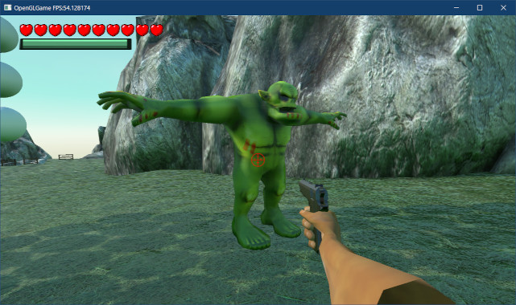
</p>

デバッグ出力を調べてみると、オークの目玉は`_Eyes`、牙は`_HighTheeth`と`_LowTheeth`というように、各パーツが別モデルになっています。そこで、それらのパーツも表示してみます。

FBXファイルの表示テストプログラムを、次のように変更してください。

```diff
   // FBXファイルの表示テスト
   {
     engine.LoadFBX("Res/MeshData/fbx/Orc Shaman.fbx");
+    static const char* const meshNames[] = {
+      "_OrcBase", "_Eyes", "_HighTheeth", "_LowTheeth", "_BELT" };
+    for (const char* meshName : meshNames) {
       auto fbxTest = engine.Create<GameObject>("fbx test", { 0, 2, 0 });
-      fbxTest->staticMesh = engine.GetStaticMesh("Res/MeshData/Orc Shaman.fbx:_OrcBase");
+      const auto name = std::string("Res/MeshData/Orc Shaman.fbx:") + meshName;
+      fbxTest->staticMesh = engine.GetStaticMesh(name.c_str());
       fbxTest->scale = vec3(0.01f);
+    } // for meshNames
   }

   // プレイヤーを配置
   auto player = engine.Create<GameObject>("player", { 0, 2, 0 });
```

プログラムが書けたらビルドして実行してください。オークに目玉と牙、そして腰のベルトが表示されていたら成功です。

<p align="center">
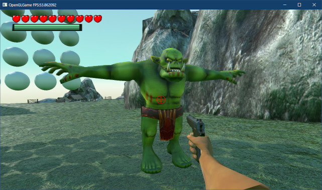
</p>

>**【2章のまとめ】**
>
>* 
>* 
>* 

<div style="page-break-after: always"></div>
