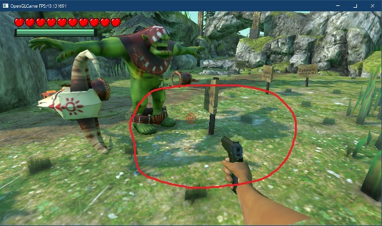

[OpenGL 3D 2024 前期 第05回]

# FBXファイルの読み込み(ジョイント編)

## 習得目標

* デバッグ出力からエラーの原因を特定し、解決できる。
* FBXファイルのスケルタルメッシュを構成する`FbxNode`、`FbxSkin`、`FbxCluster`クラスの関係を説明できる。
* FBXファイルからジョイントデータを取得する方法を説明できる。
* OBJファイルとFBXファイルのどちらを使う場合でも、描画プログラムはだいたい同じになる理由を説明できる。
* ジョイントの座標変換行列(関節行列)を使って、スケルタルメッシュを変形させることができる。

## 1. ジョイントを使った描画

### 1.1 ジョイント(関節)データを追加する

`Orc Shaman.fbx`のように複数のメッシュが含まれているFBXファイルの場合、ほとんどすべてのメッシュを表示しないと制作者が意図した状態にならない、ということがあります。

>**【OBJファイルは複数メッシュを扱える？】**<br>
>OBJファイルには`g`構文と`o`構文があり、これらを使うとメッシュを複数の単位に分割できます。テキストでこれらの構文に対応しなかったのは、アニメーション機能を持たないOBJファイルの場合、表示するだけならメッシュを分ける必要性が薄いからです。

とはいえ、そのために全てのメッシュ名を調べてゲームオブジェクトに設定するのは手間がかかります。そこで、ファイルに含まれる全てのメッシュをまとめて表示する機能を追加することにします。

また、一部のメッシュでは、FBXノードに設定された座標変換行列を使って表示することが期待されています。このようなメッシュを適切に表示するには、FBXノードの座標変換パラメータを描画に反映させなくてはなりません。

>座標変換行列は「バインドポーズ行列」に相当します。

FBXファイルは一般に複数のFBXノードを持ちます。それぞれのFBXノードは親子関係によって階層構造を構成します。また、スケルタルメッシュがある場合は階層の一部が「スケルトン(骨格)」として扱われます。

座標変換行列を扱うために、`MeshSet`構造体に階層構造を扱うジョイント配列を追加します。

```diff
 * 複数のメッシュをまとめたデータ
 */
 struct MeshSet
 {
+  // ジョイント(関節)データ
+  struct Joint
+  {
+    std::string name; // ジョイント名
+    int32_t parent;   // 親ジョイントのインデックス
+    mat4 matBindPose; // バインドポーズ行列
+    mat4 matInverseBindPose; // 逆バインドポーズ行列
+  };
+
   std::string name; // メッシュセット名
   std::vector<StaticMeshPtr> staticMeshes; // スタティックメッシュ配列
+  std::vector<Joint> joints; // ジョイント配列
 };
 using MeshSetPtr = std::shared_ptr<MeshSet>;
```

座標変換パラメータは行列で管理します。FBXファイルの座標変換パラメータには「位置・回転・拡大率」に加えて、「ピボットポイント」や「オフセット」が複数含まれており、それらの計算式はかなり複雑だからです。

幸いなことにFBX SDKには「座標変換パラメータから行列を計算する関数」が用意されており、簡単に行列を取得できます。これが、座標変換パラメータの表現方法として行列を選んだ理由です。

それから、ジョイントとスタティックメッシュを関連付ける情報も必要となります。`MeshSet`構造体の定義を次のように変更してください。

```diff
     int32_t parent;   // 親ジョイントのインデックス
     mat4 matBindPose; // バインドポーズ行列
     mat4 matInverseBindPose; // 逆バインドポーズ行列
   };
+
+  // メッシュとジョイントを関連付けるデータ
+  struct StaticMeshLink
+  {
+    StaticMeshPtr staticMesh; // ジョイントに接続されるメッシュ
+    int32_t jointId = 0;      // 接続先のジョイント番号
+  };

   std::string name; // メッシュセット名
-  std::vector<StaticMeshPtr> staticMeshes; // スタティックメッシュ配列
+  std::vector<StaticMeshLink> staticMeshes; // スタティックメッシュ配列
   std::vector<Joint> joints; // ジョイント配列
 };
 using MeshSetPtr = std::shared_ptr<MeshSet>;
```

`jointId`(ジョイント・アイディ)メンバ変数は、スタティックメッシュを表示するジョイントの位置を表します。

次に、ジョイント配列を`FbxLoader`の`MeshScene`構造体にも追加します。`FbxLoader.h`を開き、`MeshScene`構造体の定義に次のプログラムを追加してください。

```diff
   // 複数のメッシュをまとめたデータ
   struct MeshScene
   {
     std::vector<StaticMeshData> staticMeshDataList; // スタティックメッシュ配列
+    std::vector<MeshSet::Joint> joints; // ノードの接続情報
   };
   using MeshScenePtr = std::shared_ptr<MeshScene>;
```

`MeshSet`は描画用の構造体なので、読み込み用の`MeshScene`構造体にも「接続先のジョイント番号」を表すメンバ変数を追加します。`FbxLoader.h`を開き、`StaticMeshData`構造体に次のプログラムを追加してください。

```diff
   // メッシュ構築用データ
   struct StaticMeshData
   {
     std::string name;                       // メッシュ名
     std::vector<DrawParams> drawParamsList; // 描画パラメータ配列
     MaterialList materials;                 // マテリアル配列
     std::vector<Vertex> vertices;           // 頂点データ
     std::vector<uint16_t> indices;          // インデックスデータ
+    int jointId = 0;                        // 接続先のジョイント番号
   };

   // 複数のメッシュをまとめたデータ
```

FBXファイルでは「FBXノードにメッシュが割り当てられる」形になっています。そのため、素直に考えると「ジョイントにメッシュ番号を持たせる」という方法が思いつきます。

この方法で作られたデータを描画するには「すべてのノードを検査し、メッシュを持つ場合のみ描画する」という処理を行うことになります。

しかし、スケルタルメッシュのように、ひとつのメッシュ対してノードが非常に多いモデルでは、描画とは無関係なノードの検査が大量に行われます。

このような不要なノード検査をなくすために、本テキストのプログラムでは関係を逆転させて「メッシュがジョイント番号を持つ」という方法を選びました。

この方法では「メッシュを描画するときに割り当て先のノードを参照する」だけで済むため、無駄な検査は発生しません。

### 1.2 FBX SDKの行列型をmat4に変換する関数を定義する

FBX SDKの行列型は`FbxAMatrix`(エフビーエックス・エー・マトリクス)で、当然ながらそのままではOpenGLでは使えません。そこで、行列を変換する関数を定義しておきます。`ToVec3`関数の定義の下に、次のプログラムを追加してください。

```diff
   return {
     static_cast<float>(v[0]),
     static_cast<float>(v[1]),
     static_cast<float>(v[2]) };
 }
+
+/**
+* 4要素ベクトル型の変換
+*
+* @param v  FBX SDKの4要素ベクトル
+*
+* @return vをvec4に変換した値
+*/
+vec4 ToVec4(const FbxDouble4& v)
+{
+  return {
+    static_cast<float>(v[0]),
+    static_cast<float>(v[1]),
+    static_cast<float>(v[2]),
+    static_cast<float>(v[3]) };
+}
+
+/**
+* 行列型の変換
+*
+* @param m  FBX SDKの4x4行列
+*
+* @return mをmat4に変換した値
+*/
+mat4 ToMat4(const FbxAMatrix& m)
+{
+  return {
+    ToVec4(m[0]), ToVec4(m[1]), ToVec4(m[2]), ToVec4(m[3])
+  };
+}

 /**
 * FBXプロパティからテクスチャファイル名を取得
```

これで`FbxAMatrix`を`mat4`に変換できるようになりました。

>FBX SDKのドキュメントによると、`A`は`affine`(アフィン)の頭文字だそうです。`affine`はラテン語由来の数学用語で、「元の図形で直線上に並ぶ点は変換後も直線上に並ぶ」、「元の図形で平行な直線は変換後も平行」のように、変換後も図形の幾何学的な性質が維持されるような変換を意味します(この変換は「アフィン変換」と呼ばれます)。

### 1.3 ノードの階層構造をジョイントデータに変換する

次に、`FbxLoader`クラスに「ノードの階層構造をジョイントデータに変換するメンバ関数」を追加します。名前は`ConvertJoints`(コンバート・ジョインツ)とします。

`FbxLoader.cpp`を開き、`FbxLoader`クラスの定義に次のプログラムを追加してください。

```diff
   MaterialPtr GetMaterialFromImplementation(
     const FbxSurfaceMaterial * fbxMaterial, const std::filesystem::path& path);
   MaterialList GetMaterialList(
     FbxNode* fbxMeshNode, const std::filesystem::path& path);
+  void ConvertJoints(const std::filesystem::path& path);
   void ConvertMesh(const std::filesystem::path& path);
```

続いて、`Load`メンバ関数の定義に、`ConvertJoints`メンバ関数の呼び出しを追加してください。

```diff
   meshScene->staticMeshDataList.reserve(fbxNodes.size());

   // フォルダ名を取得する
   const auto path = std::filesystem::path(filename).parent_path().make_preferred();

+  ConvertJoints(path);
   ConvertMesh(path);

   return meshScene;
```

それでは、`ConvertJoints`メンバ関数を定義しましょう。`GetMaterialList`メンバ関数の定義の下に、次のプログラムを追加してください。

```diff
     materials.push_back(m);
   } // for i < fbxMaterialCount
   return materials;
 }
+
+/**
+* FBXノードの階層構造からジョイント情報を取得する
+*/
+void FbxLoader::ConvertJoints(const std::filesystem::path& path)
+{
+  // すべてのFBXノードをループ処理
+  const size_t fbxNodeCount = fbxNodes.size();
+  meshScene->joints.resize(fbxNodeCount); // ジョイント配列のサイズを設定
+  for (int i = 0; i < fbxNodeCount; ++i) {
+    FbxNode* fbxNode = fbxNodes[i];
+    MeshSet::Joint& joint = meshScene->joints[i];
+
+    // FBXノードの名前をジョイント名とする
+    joint.name = fbxNode->GetName();
+  } // for i < fbxNodeCount
+}

/**
* FBXファイルをメッシュデータに変換する
```

手始めに、すべてのFBXノードの名前をジョイント名として登録するループを作成しました。ジョイント名は描画には役立ちませんが、挙動のおかしいノードを調べたり、特定のジョイントに他のメッシュを表示したい場合などに使えます。

名前の設定からわかるように、ジョイント配列とFBXノード配列には同じインデックスを使っています。そのため、同一のインデックスで両方のデータを参照できます。

次に、親ジョイントのインデックスを計算します。`ConvertJoints`メンバ関数の定義に次のプログラムを追加してください。

```diff
 void FbxLoader::ConvertJoints()
 {
+  // ノード検索範囲を示すイテレータ
+  const auto itrBegin = fbxNodes.begin();
+  const auto itrEnd = fbxNodes.end();
+
   // すべてのFBXノードをループ処理
   const size_t fbxNodeCount = fbxNodes.size();
   meshScene->joints.resize(fbxNodeCount); // ジョイント配列のサイズを設定
   for (int i = 0; i < fbxNodeCount; ++i) {
     FbxNode* fbxNode = fbxNodes[i];
     MeshSet::Joint& joint = meshScene->joints[i];

     // FBXノードの名前をジョイント名とする
     joint.name = fbxNode->GetName();
+
+    // ジョイントの親番号を計算
+    auto itr = std::find(itrBegin, itrEnd, fbxNode->GetParent());
+    if (itr != itrEnd) {
+      joint.parent = static_cast<int32_t>(itr - itrBegin);
+    } else {
+      joint.parent = -1; // 親はいない
+    }
   } // for i < fbxNodeCount
 }
```

`itrBegin`(アイター・ビギン)は`fbsNodes`配列の先頭を指す変数、`iterEnd`(アイター・エンド)は終端を指す変数です。

この2つの変数は、親ノードの位置を検索するために使います。親ノードを取得するには`GetParent`(ゲット・ペアレント)メンバ関数を使います。

<pre class="tnmai_code"><strong>【書式】</strong><code>
親ノードのアドレス FbxNode::GetParent();
</code></pre>

親ノードを持たない場合は`nullptr`が返されます。

親ノードの番号は、親ノードのアドレスが`fbxNodes`配列の何番目にあるかを調べれば分かります。親ノードの検索には`std::find`関数を使います。

親ノードが見つかった(`find`の戻り値`itr`が`itrEnd`ではない)場合、見つかった位置`itr`から先頭位置`itrBegin`を引くと、`fbxNodes`内のインデックスが計算できます。

>`配列のインデックス = itr - itrBegin`

親ノードが見つからない(`find`の戻り値`itr`が`itrEnd`と一致する)場合、親ノードが無いことを示すために`-1`を設定しておきます。

>`親がいない = -1`

親を示すためにポインタではなくインデックス(番号)を使っているのは、ポインタの場合は配列を移動したりコピーしたときにポインタを修正しなくてはなりませんが、インデックスではその必要がないからです。

続いて、座標変換行列(バインドポーズ)を計算します。ここは、FBX SDKドキュメントの`How transformation matrices are computed`、というタイトルのページに書かれている説明を参考に作成しました。

ジョイントの親番号を計算するプログラムの下に、次のプログラムを追加してください。

```diff
       joint.parent = static_cast<int32_t>(itr - itrBegin);
     } else {
       joint.parent = -1; // 親はいない
     }
+
+    // ピボット行列を計算
+    FbxVector4 T = fbxNode->GetGeometricTranslation(FbxNode::eSourcePivot);
+    FbxVector4 R = fbxNode->GetGeometricRotation(FbxNode::eSourcePivot);
+    FbxVector4 S = fbxNode->GetGeometricScaling(FbxNode::eSourcePivot);
+    FbxAMatrix matNodePivot(T, R, S);
+
+    // ノードの座標変換行列を計算
+    joint.matBindPose = ToMat4(fbxNode->EvaluateGlobalTransform() * matNodePivot);
+    joint.matInverseBindPose = mat4(1);
+
+    LOG("ジョイント%03d=%s\t(親=%03d)", i, fbxNodes[i]->GetName(), joint.parent);
   } // for i < fbxNodeCount
 }
```

FBX SDKドキュメントによると、3ds maxなど一部のツールは座標変換行列の前に「ピボットポイント」を処理する工程が存在します。ピボットポイントを利用しているFBXファイルの場合、それを反映しなくてはなりません。

ピボットポイントは座標変換行列の適用前に、モデルの中心座標やスケールを微調整する機能です。

ピボットポイントのデータは`GetGeometricTranslation`(ゲット・ジオメトリック・トランスレーション), `GetGeometricRotation`(ゲット・ジオメトリック・ローテーション), `GetGeometricScaling`(ゲット・ジオメトリック・スケーリング)という3つのメンバ関数で取得できます。

<pre class="tnmai_code"><strong>【書式】</strong><code>
平行移動行列 FbxNode::GetGeometricTranslation();
</code></pre>

<pre class="tnmai_code"><strong>【書式】</strong><code>
回転行列 FbxNode::GetGeometricRotation();
</code></pre>

<pre class="tnmai_code"><strong>【書式】</strong><code>
拡大縮小行列 FbxNode::GetGeometricScaling();
</code></pre>

ピボットポイントを処理する行列を求めるには、これら3つの関数から得られた行列を合成します。普通に乗算してもいいのですが、FBX SDKの場合は`FbxAMatrix`コンストラクタを使うほうが効率的です。

<pre class="tnmai_code"><strong>【書式】</strong><code>
FbxAMatrix::FbxAMatrix(平行移動行列, 回転行列, 拡大縮小行列);
</code></pre>

FBXノードの座標変換行列を取得するには、`EvaluateGlobalTransform`(エバリュエート・グローバル・トランスフォーム)メンバ関数を使います(`evaluate`は「評価する」という意味)。

<pre class="tnmai_code"><strong>【書式】</strong><code>
座標変換行列 FbxNode::EvaluateGlobalTransform();
</code></pre>

この関数は「親ノードの座標変換行列が乗算された座標変換行列」を計算します。「ピボットポイントの座標変換行列」と「FBXノードのグローバル座標変換行列」を乗算することで、汎用のグローバル座標変換行列が得られます。

`EvaluateGlobalTransform`が返すのは「グローバル座標変換行列」で、これは「すべての親の行列が乗算された値」です。一般に、FBX SDKではグローバル座標変換行列を扱います。

スタティックメッシュは、ひとつだけジョイントが存在するスケルタルメッシュと考えられます。この唯一のジョイントは移動も、回転も拡大縮小もしません。そのため、逆バインドポーズ行列は単位行列になります。

それから、ループの最後にジョイント情報をデバッグ出力しておきます。この情報は、ジョイントの階層構造を確認したり、武器などを設定したいジョイント名を調べるときに役立ちます。

ここまでの計算で、スタティックメッシュ用の座標変換行列が得られます。スケルタルメッシュの座標変換行列については、別の計算が必要となります。すべてのFBXノードをループ処理する`for`文の下に、次のプログラムを追加してください。

```diff
     joint.matInverseBindPose = ToMat4(matNode.Inverse() * matNodePivot);

     LOG("ジョイント%03d=%s\t(親=%03d)", i, fbxNodes[i]->GetName(), joint.parent);
   } // for i < fbxNodeCount
+
+  // スケルタルメッシュの座標変換行列を計算
+  for (int i = 0; i < fbxNodeCount; ++i) {
+    // メッシュがない場合はなにもしない
+    FbxNode* fbxNode = fbxNodes[i];
+    FbxMesh* fbxMesh = fbxNode->GetMesh();
+    if (!fbxMesh) {
+      continue;
+    }
+
+    // スキンがない場合はなにもしない
+    FbxSkin* fbxSkin = static_cast<FbxSkin*>(fbxMesh->GetDeformer(0, FbxDeformer::eSkin));
+    if (!fbxSkin) {
+      continue;
+    }
+
+    // ピボット行列を計算
+    FbxVector4 T = fbxNode->GetGeometricTranslation(FbxNode::eSourcePivot);
+    FbxVector4 R = fbxNode->GetGeometricRotation(FbxNode::eSourcePivot);
+    FbxVector4 S = fbxNode->GetGeometricScaling(FbxNode::eSourcePivot);
+    FbxAMatrix matMeshNodePivot(T, R, S);
+  } // for i < fbxNodeCount
 }
```

スケルタルメッシュ用のループでは、`FbxSkin`(エフビーエックス・スキン)を持つ全てのノードについて、座標変換行列を再計算します。

FBXファイルでは、`FbxSkin`(エフビーエックス・スキン)クラスによって、スケルタルメッシュの頂点とジョイント(ノード)を関連付けます。

`FbxSkin`はデフォーマ(メッシュを変形させるオブジェクト)の一種なので、`FbxMesh`クラスの`GetDeformer`(ゲット・デフォーマ)メンバ関数で取得できます。

<pre class="tnmai_code"><strong>【書式】</strong><code>
FbxSkin* FbxMesh::GetDeformer(インデックス, デフォーマの種類);
</code></pre>

`FbxSkin`オブジェクトを取得するには、`GetDeformer`メンバ関数の第2引数に`FbxDeformer::eSkin`(エフビーエックス・デフォーマ・イー・スキン)を指定します。

ピボット行列は全てのジョイントに影響するので先に計算しておきます。計算方法はスタティックメッシュと同じです。

続いて、全てのジョイントの座標変換行列を計算します。ピボット行列を計算するプログラムの下に、次のプログラムを追加してください。

```diff
     FbxVector4 R = fbxNode->GetGeometricRotation(FbxNode::eSourcePivot);
     FbxVector4 S = fbxNode->GetGeometricScaling(FbxNode::eSourcePivot);
     FbxAMatrix matMeshNodePivot(T, R, S);
+
+    // すべてのジョイントをループ処理
+    const int clusterCount = fbxSkin->GetClusterCount();
+    for (int clusterIndex = 0; clusterIndex < clusterCount; ++clusterIndex) {
+      // ジョイントのピボット行列を取得
+      FbxAMatrix matTransform;
+      FbxCluster* fbxCluster = fbxSkin->GetCluster(clusterIndex);
+      fbxCluster->GetTransformMatrix(matTransform);
+
+      // ジョイントのバインドポーズ行列を取得
+      FbxAMatrix matTransformLink;
+      fbxCluster->GetTransformLinkMatrix(matTransformLink);
+
+      // クラスタに対応するノードの配列インデックスを調べる
+      const auto itr = std::find(itrBegin, itrEnd, fbxCluster->GetLink());
+      const int nodeIndex = static_cast<int>(itr - itrBegin);
+
+      // ジョイントの座標変換行列を設定
+      MeshSet::Joint& joint = meshScene->joints[nodeIndex];
+      joint.matInverseBindPose =
+        ToMat4(matTransformLink.Inverse() * matTransform * matMeshNodePivot);
+    } // for clusterIndex < clusterCount
   } // for i < fbxNodeCount
 }
```

`FbxSkin`は、メッシュの頂点を複数の「クラスタ」という単位にまとめます。そして、各クラスタは対応するジョイント(ノード)に割り当てられます。クラスタは、各頂点のジョイントに対するウェイトも管理します。

クラスタの総数を調べるには`FbxSkin`クラスの`GetClusterCount`(ゲット・クラスタ・カウント)メンバ関数を使います。

<pre class="tnmai_code"><strong>【書式】</strong><code>
クラスタ数 FbxSkin::GetClusterCount();
</code></pre>

FBX SDKにおいて、クラスタは`FbxCluster`(エフビーエックス・クラスタ)クラスとして表現されます。`FbxCluster`オブジェクトを取得するには`FbxSkin`クラスの`GetCluster`(ゲット・クラスタ)メンバ関数を使います。

<pre class="tnmai_code"><strong>【書式】</strong><code>
FbxCluster* FbxSkin::GetCluster(クラスタのインデックス);
</code></pre>

クラスタに関連付けられたボーン(ノード)を取得するには`GetLink`(ゲット・リンク)メンバ関数を使います。

<pre class="tnmai_code"><strong>【書式】</strong><code>
FbxNode* FbxCluster::GetLink();
</code></pre>

`GetLink`メンバ関数が返すのは`FbxNode`ポインタですが、本テキストではジョイントを番号(インデックス)で管理しています。そのため、ポインタを番号に変換する必要があります。

このプログラムでは`std::find`関数を使って、「ポインタがノード配列の何番目にあるか」を調べることで、番号へと変換しています。

ジョイントの座標変換行列は、3つの行列を乗算することで計算します。逆バインドポーズ行列は 座標変換の原点座標に頂点を移動させるため、

>ノードのピボット行列→ジョイントのピボット行列→逆バインドポーズ行列

の順番で実行します。また、バインドポーズ行列はスタティックメッシュと同じなので、変更の必要はありません。

これで、スケルタルメッシュの座標変換行列を取得できるようになりました。

### 1.4 メッシュとジョイントを関連付ける

次に、接続先のジョイント番号を設定します。`ConvertMesh`メンバ関数の定義の末尾にある「マテリアル情報を取得」するプログラムの下に、次のプログラムを追加してください。

```diff
     // マテリアル情報を取得
     meshData.materials = GetMaterialList(fbxMeshNode, path);
+
+    // スタティックメッシュに対応するノード番号を記録
+    meshData.jointId = nodeIndex;

     // スタティックメッシュを追加
     meshScene->staticMeshDataList.push_back(meshData);
   } // for nodeIndex < fbxNodeCount
```

これで、`jointId`には「割り当て先のジョイント番号」が設定されます。

>「ノード番号 = ジョイント番号」です。

### 1.5 MeshSet構造体にジョイント配列を追加する

FBXファイルから作成した`MeshScene`は、読み込み用の一時的なオブジェクトです。このオブジェクトのままでは描画できないので、描画用の`MeshSet`オブジェクトにデータを移動させる必要があります。

`Mesh.cpp`を開き、`LoadFBX`メンバ関数の定義を次のように変更してください。

```diff
   MeshSetPtr meshSet = std::make_shared<MeshSet>();
   meshSet->name = filename;
   meshSet->staticMeshes.reserve(meshScene->staticMeshDataList.size());
+  meshSet->joints.swap(meshScene->joints); // ジョイント配列をMeshSetに付け替える
   meshSets.emplace(filename, meshSet); // メッシュセット連想配列に追加

   // FBXファイルから読み込んだデータをメッシュセット用に変換する
   for (auto& meshData : meshScene->staticMeshDataList) {
     // 変換したデータをプリミティブバッファに追加
     AddVertexData(
       meshData.vertices.data(), meshData.vertices.size() * sizeof(Vertex),
       meshData.indices.data(), meshData.indices.size() * sizeof(uint16_t));

     // メッシュを作成
     auto mesh = std::make_shared<StaticMesh>();
     mesh->drawParamsList.swap(meshData.drawParamsList);
     mesh->materials.swap(meshData.materials);
     mesh->name = meshData.name;
-    meshSet->staticMeshes.push_back(mesh); // メッシュセットに追加
+    meshSet->staticMeshes.push_back({ mesh, meshData.jointId }); // メッシュセットに追加

     // とりあえずメッシュ連想配列にも入れておく
     meshes.emplace(meshSet->name + ':' + mesh->name, mesh);
```

これで、


### 1.5 MeshSetRendererクラスを定義する

次に、ジョイント情報を利用してメッシュを描画するクラスを作成します。名前は`MeshSetRenderer`(メッシュ・セット・レンダラー)とします。

プロジェクトの`Src/Engine`フォルダに`MeshSetRenderer.h`という名前のヘッダファイルを追加してください。追加したファイルを開き、次のプログラムを追加してください。

```diff
+/**
+* @file MeshSetRenderer.h
+*/
+#ifndef MESHSETRENDERER_H_INCLUDED
+#define MESHSETRENDERER_H_INCLUDED
+#include "glad/glad.h"
+#include <vector>
+#include <memory>
+
+// 先行宣言
+class GameObject;
+class ProgramObject;
+struct MeshSet;
+using MeshSetPtr = std::shared_ptr<MeshSet>;
+
+/**
+* FBXメッシュの描画を補助するクラス
+*/
+class MeshSetRenderer
+{
+  friend class Engine;
+public:
+  // コンストラクタ・デストラクタ
+  MeshSetRenderer() = default;
+  ~MeshSetRenderer() = default;
+
+  // 描画するメッシュセットを設定
+  void SetMeshSet(const MeshSetPtr& meshSet);
+
+  // 設定されているメッシュセットを取得
+  const MeshSetPtr& GetMeshSet() const { return meshSet; }
+
+  /**
+  * スタティックメッシュを描画
+  *
+  * @param gameObject  レンダラーの親オブジェクト
+  * @param program     描画に使うプログラムオブジェクト
+  */
+  void DrawStaticMesh(const GameObject& gameObject,
+    const ProgramObject& program);
+
+private:
+  MeshSetPtr meshSet; // 描画するメッシュセット
+};
+using MeshSetRendererPtr = std::shared_ptr<MeshSetRenderer>;
+
+#endif // MESHSETRENDERER_H_INCLUDED
```

### 1.6 SetMeshSetメンバ関数を定義する

それでは、`SetMeshSet`(セット・メッシュ・セット)メンバ関数から定義しましょう。プロジェクトの`Src/Engine`フォルダに`MeshSetRenderer.cpp`という名前のCPPファイルを追加してください。

追加したファイルを開き、次のプログラムを追加してください。

```diff
+/**
+* @file MeshSetRenderer.cpp
+*/
+#include "MeshSetRenderer.h"
+#include "ProgramObject.h"
+#include "GameObject.h"
+#include "Engine.h"
+#include "Debug.h"
+
+/**
+* 描画するメッシュセットを設定
+*/
+void MeshSetRenderer::SetMeshSet(const MeshSetPtr& meshSet);
+{
+  this->meshSet = meshSet;
+}
```

### 1.7 DrawStaticMeshメンバ関数を定義する

次に、`DrawStaticMesh`(ドロー・スタティックメッシュ)メンバ関数を定義します。`SetMeshSet`メンバ関数の定義の下に、次のプログラムを追加してください。

```diff
 void MeshSetRenderer::SetMeshSet(const MeshSetPtr& meshSet);
 {
   this->meshSet = meshSet;
 }
+
+/**
+* スタティックメッシュを描画
+*/
+void MeshSetRenderer::DrawStaticMesh(const GameObject& gameObject,
+  const ProgramObject& program)
+{
+  // メッシュセットが設定されていない場合はなにもしない
+  if (!meshSet) {
+    return;
+  }
+
+  // ゲームオブジェクトのモデル行列を取得
+  const mat4& matTransform = gameObject.GetTransformMatrix();
+
+  // シェーダにカラーユニフォーム変数がある場合、ゲームオブジェクトのカラーを使って描画
+  const vec4* color = nullptr;
+  if (program.ColorLocation() >= 0) {
+    color = &gameObject.color;
+  }
+}
```

最初にメッシュセットの有無を調べます。メッシュセットが設定されていない場合は何もする必要はありません。

次に、すべてのスタティックメッシュで使用する「ゲームオブジェクトのモデル行列」と「ゲームオブジェクトのカラー」を取得します。

続いて、すべてのスタティックメッシュを描画します。ゲームオブジェクトのカラーを取得するプログラムの下に、次のプログラムを追加してください。

```diff
   if (program.ColorLocation() >= 0) {
     color = &gameObject.color;
   }
+
+  // すべてのスタティックメッシュを描画
+  for (const auto& e : meshSet->staticMeshes) {
+    // モデル行列にジョイント行列を合成
+    mat4 matJointTransform = meshSet->joints[e.jointId].matBindPose;
+    matJointTransform = matTransform * matJointTransform;
+
+    // モデル行列をGPUメモリにコピー
+    glProgramUniformMatrix4fv(program, locTransformMatrix,
+      1, GL_FALSE, &matJointTransform[0].x);
+
+    // モデル行列から法線行列を計算
+    vec3 t, s; // 位置と拡大率は使わない
+    mat3 matJointNormal;
+    Decompose(matJointTransform, t, s, matJointNormal);
+
+    // 法線行列をGPUメモリにコピー
+    glProgramUniformMatrix3fv(program, locNormalMatrix,
+      1, GL_FALSE, &matJointNormal[0].x);
+
+    // 固有マテリアルがあれば固有マテリアルを、なければ共有マテリアルを使って描画
+    const MaterialList* materials = &e.staticMesh->materials;
+    if (!gameObject.materials.empty()) {
+      materials = &gameObject.materials;
+    }
+
+    // スタティックメッシュを描画
+    Draw(e.staticMesh->drawParamsList, program, *materials, color);
+  } // for meshSet->skeletalMeshes
 }
```

最初に、スタティックメッシュに対応するジョイントからジョイント行列を取得して、ゲームオブジェクトのモデル行列と乗算します。

次に、計算したモデル行列から回転成分だけを持つ行列を取り出します。これは法線行列になります。

そして、計算した2つの行列をGPUメモリにコピーしたら、マテリアルを選択して`Draw`関数を呼び出します。

これらの処理を全てのスタティックメッシュに対して行います。

今のところは、これで`MeshSetRenderer`は完成とします。

### 1.8 GameObjectにMeshSetRendererを追加する

続いて、`GameObject`クラスに作成した`MeshSetRenderer`クラスのオブジェクトを追加して、メッシュセットを描画できるようにします。

`GameObject.h`を開き、次の先行宣言を追加してください。

```diff
 struct StaticMesh;
 using StaticMeshPtr = std::shared_ptr<StaticMesh>; // スタティックメッシュのポインタ
 class SkeletalMeshRenderer;
 using SkeletalMeshRendererPtr = std::shared_ptr<SkeletalMeshRenderer>;
+class MeshSetRenderer;
+using MeshSetRendererPtr = std::shared_ptr<MeshSetRenderer>;
 struct Material;
 using MaterialPtr = std::shared_ptr<Material>; // マテリアルのポインタ
 using MaterialList = std::vector<MaterialPtr>; // マテリアル配列
```

そして、`GameObject`クラスの定義に次のプログラムを追加してください。

```diff
   vec3 scale     = { 1, 1, 1 };    // 物体の拡大率
   vec4 color     = { 1, 1, 1, 1 }; // 物体の色
   StaticMeshPtr staticMesh;        // 表示するスタティックメッシュ
   SkeletalMeshRendererPtr renderer; // 関節付きメッシュ
+  MeshSetRendererPtr meshSetRenderer; // メッシュセット

   MaterialList materials;          // スタティックメッシュ用のマテリアル配列
   int renderQueue = RenderQueue_geometry; // 描画順
```

次に、`Engine.cpp`を開き、`MeshSetRenderer.h`をインクルードしてください。

```diff
 #include "Engine.h"
 #include "FramebufferObject.h"
 #include "ProgramObject.h"
 #include "SkeletalMeshRenderer.h"
+#include "MeshSetRenderer.h"
 #include "EasyAudio/EasyAudio.h"
 #include "SphereCollider.h"
```

そして、`DrawGameObjects`メンバ関数の定義に、次のプログラムを追加してください。

```diff
       if (e->materials.empty()) {
         Draw(*e->staticMesh, prog, e->staticMesh->materials);
       } else {
         Draw(*e->staticMesh, prog, e->materials);
       }
     }
+
+    // メッシュセットのスタティックメッシュを描画
+    if (e->meshSetRenderer) {
+      e->meshSetRenderer->DrawStaticMesh(*e, prog);
+    }

     // スケルタルメッシュを描画
     if (e->renderer) {
```

あとは、`meshSetRenderer`メンバ変数を設定すれば、メッシュセットが描画されるはずです。

### 1.9 メッシュセットレンダラーを使う

ゲームオブジェクトに`MeshSetRenderer`オブジェクトを設定して、メッシュセットを描画しましょう。まずは`ExplorationScene.cpp`を開き、`MeshSetRenderer.h`をインクルードしてください。

```diff
 #include "PlayerComponent.h"
 #include "FireEmitter.h"
 #include "Engine/SkeletalMeshRenderer.h"
+#include "Engine/MeshSetRenderer.h"
 #include "Engine/Animation.h"
 #include "Engine/UIButton.h"
```

次に、`Initialize`メンバ関数の定義にあるFBXファイルの表示テストプログラムを、次のように変更してください。

```diff
   // FBXファイルの表示テスト
   {
     engine.LoadFBX("Res/MeshData/OrcShaman/Orc Shaman.fbx");
-    static const char* const meshNames[] = {
-      "_OrcBase", "_Eyes", "_HighTheeth", "_LowTheeth", "_BELT", "polySurface238"};
-    for (const char* meshName : meshNames) {
       auto fbxTest = engine.Create<GameObject>("fbx test", { 0, 2, 0 });
-      const auto name = std::string("Res/MeshData/OrcShaman/Orc Shaman.fbx:") + meshName;
-      fbxTest->staticMesh = engine.GetStaticMesh(name.c_str());
+      fbxTest2->meshSetRenderer = std::make_shared<MeshSetRenderer>();
+      fbxTest2->meshSetRenderer->SetMeshSet(
+        engine.LoadFBX("Res/MeshData/OrcShaman/Orc Shaman.fbx"));
       fbxTest->scale = vec3(0.2f);
-    } // for meshNames
   }
```

プログラムが書けたらビルドして実行してください。武器などの装備品の位置がおかしいですが、とりあえず全部のパーツが画面に表示されていたら成功です。

<p align="center">

</p>

### 1.10 メッシュセットの影を表示する

`MeshSetRenderer`で描画したオブジェクトの足元を見ると、影が表示されていません。

<p align="center">

</p>

そこで、メッシュセットの影を描画します。`Engine.cpp`を開き、`CreateShadowMap`メンバ関数の定義に次のプログラムを追加してください。

```diff
   // メッシュを描画
   std::vector<const GameObject*> skeletalMeshList;
   skeletalMeshList.reserve(end - begin);
+  std::vector<const GameObject*> meshSetList;
+  meshSetList.reserve(end - begin);
   for (GameObjectList::iterator i = begin; i != end; ++i) {
     const auto& e = *i;

     // スケルタルメッシュを記録
     if (e->renderer) {
       skeletalMeshList.push_back(e.get());
     }
+
+    // メッシュセットを記録
+    if (e->meshSetRenderer) {
+      meshSetList.push_back(e.get());
+    }

     if (!e->staticMesh) {
       continue;
     }
 ```

 次に、スタティックメッシュを描画する`for`ループの下に、次のプログラムを追加してください。

 ```diff
      } else {
       Draw(*e->staticMesh, *progShadow, e->materials);
     }
   } // for
+
+  // メッシュセットのスタティックメッシュを描画
+  for (const GameObject* e : meshSetList) {
+    e->meshSetRenderer->DrawStaticMesh(*e, *progShadow);
+  }

   // スケルタルメッシュを描画
   glUseProgram(*progShadowSkeletal);
   glBindVertexArray(*meshBuffer->GetVAOSkeletal());
```

プログラムが書けたらビルドして実行してください。影が表示されていれば成功です。

<p align="center">

</p>

### 1.11 OpenGLコンテキストのエラーに対処する

デバッグ出力を見てみると、以下のようなエラーメッセージが大量に表示されていると思います。

```txt
[情報] DebugCallback: Error has been generated. GL error GL_INVALID_OPERATION in ProgramUniformMatrix3fv: (ID: 1732829997) Generic error
[情報] DebugCallback: Error has been generated. GL error GL_INVALID_OPERATION in ProgramUniformMatrix3fv: (ID: 1732829997) Generic error
```

このエラーメッセージから、エラー種別は`INVALID_OPERATION`(「無効な操作」という意味)で、発生源は`ProgramUniformMatrix3fv`関数ということが分かります。

本テキストのプログラムにおいて、3x3行列を使っているのは「法線行列」だけのはずです。つまり、どこかで法線行列をGPUメモリにコピーするときにこのエラーが起きていることになります。

結論を述べると、このエラーは「影描画シェーダに対して法線行列を送ろうとしている」ことが原因で発生しています。影描画シェーダはライティングを行わないので法線行列を使わないからです。

エラーの対処方法ですが、「シェーダが法線行列ユニフォーム変数を持たない場合は`glProgramUniformMatrix3fv`を呼び出さない」という方法を取ることにします。

そのために、`ProgramObject`クラスに「法線行列ユニフォーム変数の有無」を調べるメンバ関数を追加します。名前は`NormalMatrixLocation`(ノーマル・マトリックス・ロケーション)とします。

`ProgramObject.h`を開き、次のプログラムを追加してください。

```diff
   // ロケーション番号を取得
   GLint ColorLocation() const { return locColor; }
   GLint RoughnessAndMetallicLocation() const { return locRoughnessAndMetallic; }
+  GLint NormalMatrixLocation() const { return locMatNormal; }

 private:
   GLuint vs = 0;          // 頂点シェーダ
   GLuint fs = 0;          // フラグメントシェーダ
   GLuint prog = 0;        // プログラムオブジェクト
   std::string filenameFS; // フラグメントシェーダファイル名
   std::string filenameVS; // 頂点シェーダファイル名
   GLint locColor = -1;
   GLint locRoughnessAndMetallic = -1;
+  GLint locMatNormal = -1;
 };

 #endif // PROGRAMOBJECT_H_INCLUDED
```

次に`ProgramObject.cpp`を開き、`ProgramObject`コンストラクタの定義に次のプログラムを追加してください。

```diff
   // ロケーション番号を取得
   locColor = glGetUniformLocation(prog, "color");
   locRoughnessAndMetallic = glGetUniformLocation(prog, "roughnessAndMetallic");
+  locMatNormal = glGetUniformLocation(prog, "normalMatrix");

   LOG("シェーダを作成(vs=%s, fs=%s)", filenameVS, filenameFS);
 }
```

これで、法線行列ロケーション変数の有無を調べられるようになりました。

続いて、「法線行列ロケーション変数がある場合だけ、法線行列をGPUメモリにコピー」するようにします。`MeshSetRenderer.cpp`を開き、`DrawStaticMesh`メンバ関数の定義を次のように変更してください。

```diff
     // モデル行列をGPUメモリにコピー
     glProgramUniformMatrix4fv(program, locTransformMatrix,
       1, GL_FALSE, &matJointTransform[0].x);

     // モデル行列から法線行列を計算
+    const GLint locNormalMatrix = program.NormalMatrixLocation();
+    if (locNormalMatrix >= 0) {
       vec3 t, s; // 位置と拡大率は使わない
       mat3 matJointNormal;
       Decompose(matJointTransform, t, s, matJointNormal);

       // 法線行列をGPUメモリにコピー
       glProgramUniformMatrix3fv(program, locNormalMatrix,
         1, GL_FALSE, &matJointNormal[0].x);
+    }

     // 固有マテリアルがあれば固有マテリアルを、なければ共有マテリアルを使って描画
     const MaterialList* materials = &e.staticMesh->materials;
```

これで、法線行列ロケーション変数を持たないシェーダが指定された場合は、法線行列をコピーしないようになりました。

プログラムが書けたらビルドして実行してください。デバッグ出力にエラーメッセージが表示されなくなっていたら成功です。

>**【1章のまとめ】**
>
>* 一般的に、FBXファイルのモデルは、全てのメッシュを表示しないと制作者の意図した状態にならない。
>* FBXファイルは、ノードをツリー型の階層構造にすることで複数のメッシュを管理している。
>* FBX SDKでは、メッシュはノードの子オブジェクトになっている。制作者が意図したようにメッシュを表示するには、ノードの座標変換行列を反映しなくてはならない。
>* デバッグ出力を常に確認し、エラーや警告があればすぐに対処すること。エラーや警告を放置しておくと、プログラムが正しく実行されなかったり、実行速度が低下する可能性がある。

<div style="page-break-after: always"></div>

## 2. スケルタルメッシュの表示

### 2.1 MeshScene構造体に、スケルタルメッシュ用のデータを追加する

`Orc Shaman.fbx`モデルの装備品の表示位置がおかしくなっているのは、元になるノードがずれた位置に設定されているためです。

しかし、同じモデルをUnityなどで表示してみても、装飾品の位置がずれたりはしていません。というのも、`Orc Shaman.fbx`ではこのズレを考慮してアニメーションデータが作られているからです。

実際には、本体と服がスケルタルメッシュになっていて、この2つのアニメーションに「座標を下に移動する」データが含まれています。

そのため、`Orc Shaman.fbx`をモデル制作者の意図通りに表示するには、スケルタルメッシュを作成して、アニメーションを適用しなくてはなりません。

まずはスケルタルメッシュを作成しましょう。`FbxLoader.h`を開き、`FbxLoader`クラスの定義に次のプログラムを追加してください。

```diff
     std::vector<Vertex> vertices;           // 頂点データ
     std::vector<uint16_t> indices;          // インデックスデータ
     int jointId = 0;                        // 接続先のジョイント番号
   };
+
+  // スケルタルメッシュ構築用データ
+  struct SkeletalMeshData
+  {
+    std::string name;                       // メッシュ名
+    std::vector<DrawParams> drawParamsList; // 描画パラメータ配列
+    MaterialList materials;                 // マテリアル配列
+    std::vector<SkeletalVertex> vertices;   // 頂点データ
+    std::vector<uint16_t> indices;          // インデックスデータ
+  };

   // 複数のメッシュをまとめたデータ
   struct MeshScene
   {
     std::vector<StaticMeshData> staticMeshDataList; // スタティックメッシュ配列
+    std::vector<SkeletalMeshData> skeletalMeshDataList; // スケルタルメッシュ配列
     std::vector<MeshSet::Joint> joints; // ノードの接続情報
   };
```

### 2.2 ジョイント番号とウェイトを管理するクラスを定義する

次に、頂点に影響するボーン番号とウェイトを取得します。まずボーン番号とウェイトを管理する構造体を定義します。名前は`JointWeight`(ジョイント・ウェイト)とします。

`FbxLoader.cpp`を開き、`GetTextureFilename`関数の定義の下に、次のプログラムを追加してください。

```diff
     filename = (path / stem).string() + ".tga";
   }

   return filename;
 }
+
+/**
+* 頂点のジョイント(ボーン)番号とウェイト値を管理する構造体
+*/
+struct JointWeight
+{
+  struct {
+    int index = 0;     // ジョイント番号
+    double weight = 0; // ジョイントに対応するウェイト値
+  } joints[4];  // ジョイント配列
+  int size = 0; // ジョイント数
+};

 } // unnamed namespace

 /**
 * FBX読み込みクラスの実装
```

次に、`JointWeight`構造体に以下の2つのメンバ関数を追加します。

>* `Insert`(インサート): ジョイントとウェイトのペアを追加する。
>* `Normalize`(ノーマライズ): ウェイトの合計が1.0になるようにする。

最初に、ジョイントとウェイトのペアを追加するメンバ関数を定義します。`JointWeight`構造体の定義に次のプログラムを追加してください。

```diff
     double weight = 0; // ジョイントに対応するウェイト値
   } joints[4];  // ジョイント配列
   int size = 0; // ジョイント数
+
+  /**
+  * ジョイント番号とウェイトのペアを追加
+  */
+  void Insert(int index, double weight)
+  {
+    // すでに同じジョイント番号が登録されていたら、ウェイトの大きいほうを選択する
+    for (int i = 0; i < size; ++i) {
+      if (joints[i].index == index) {
+        joints[i].weight = std::max(joints[i].weight, weight);
+        return;
+      }
+    }
+
+    // ひとつの頂点に登録されているジョイント数が4未満の場合、普通にデータを追加する
+    if (size < 4) {
+      joints[size] = { index, weight };
+      size++;
+      return;
+    }
+
+    // ひとつの頂点に4つ以上のジョイントが登録されている場合、
+    // より大きいウェイトを持つジョイントを優先する
+
+    // 最小ウェイトを持つデータを検索
+    double minWeight = DBL_MAX; // 最小ウェイト
+    int minIndex = 0; // 最小ウェイトデータのインデックス
+    for (int i = 0; i < 4; ++i) {
+      if (joints[i].weight < minWeight) {
+        minWeight = joints[i].weight;
+        minIndex = i;
+      }
+    }
+
+    // 新しいウェイトが最小ウェイトより大きい場合、新しいジョイントで置き換える
+    if (weight > minWeight) {
+      joints[minIndex] = { index, weight };
+    }
+  }
 };

 } // unnamed namespace
```

FBXファイルでは、頂点に割り当てられるジョイントの数に制限はありません。しかし、実際の描画効率を考えると`vec4`として扱えることから最大4つとするのがバランスが取れています。

そこで、`Insert`メンバ関数では`size`メンバ変数が4未満かどうかによって処理を分けています。4未満の場合は単純にデータを追加します。4以上の場合、より大きいウェイトを持つデータを優先します。

この処理によって、すべてのジョイントのうち、最もウェイトの大きい上位4つのジョイントが選ばれます。

次に、ウェイトを正規化するメンバ関数を定義します。`Insert`メンバ関数の定義の下に、次のプログラムを追加してください。

```diff
     if (weight > minWeight) {
       joints[minIndex] = { index, weight };
     }
   }
+
+  /**
+  * ウェイトを正規化
+  */
+  void Normalize()
+  {
+    double total = 0;
+    for (int i = 0; i < size; ++i) {
+      total += joints[i].weight;
+    }
+    for (int i = 0; i < size; ++i) {
+      joints[i].weight /= total;
+    }
+  }
 };

 } // unnamed namespace
```

ウェイトの正規化は、全てのウェイトを「全体に対する比率」に変換することで行います。

### 2.3 頂点ごとのJointWeightを作成する

次に、`FbxLoader`クラスに、`JointWeight`配列を取得する`ConvertJointWeights`(コンバート・ジョイント・ウェイト)メンバ関数と、スケルタルメッシュを取得する`ConvertSkeletalMesh`(コンバート・スケルタル・メッシュ)メンバ関数を宣言します。

`FbxLoader`クラスの定義に次のプログラムを追加してください。

```diff
   MaterialList GetMaterialList(
     FbxNode* fbxMeshNode, const std::filesystem::path& path);
   void ConvertJoints(const std::filesystem::path& path);
+  std::vector<JointWeight> ConvertJointWeights(FbxMesh* fbxMesh);
+  void ConvertSkeletalMesh(const std::filesystem::path& path, FbxMesh* fbxMesh,
+    std::unordered_map<int, int> vertexIndexToControlPointIndexMap, StaticMeshData& meshData);
  void ConvertMesh(const std::filesystem::path& path);

  MikkTSpace* mikkTSpace = nullptr;
```

それでは、`ConvertJointWeights`メンバ関数を定義しましょう。`ConvertJoint`メンバ関数の定義の下に、次のプログラムを追加してください。

```diff
     LOG("ジョイント%03d=%s\t(親=%03d)", i, fbxNodes[i]->GetName(), joint.parent);
   } // for fbxNodeCount
 }
+
+/**
+* 頂点のジョイント(ボーン)IDとウェイトを取得する
+*/
+std::vector<JointWeight> FbxLoader::ConvertJointWeights(FbxMesh* fbxMesh)
+{
+  // ノード検索範囲を示すイテレータ
+  const auto itrBegin = fbxNodes.begin();
+  const auto itrEnd = fbxNodes.end();
+
+  // 全てのクラスタについて、クラスタが持つ全頂点に対してジョイント番号とウェイトを登録する
+  std::vector<JointWeight> jointWeights(fbxMesh->GetControlPointsCount());
+  FbxSkin* fbxSkin = static_cast<FbxSkin*>(fbxMesh->GetDeformer(0, FbxDeformer::eSkin));
+  const int clusterCount = fbxSkin->GetClusterCount();
+  for (int clusterIndex = 0; clusterIndex < clusterCount; ++clusterIndex) {
+    FbxCluster* fbxCluster = fbxSkin->GetCluster(clusterIndex);
+
+    // クラスタに関連付けられたノード(ジョイント)の番号を検索
+    const auto itr = std::find(itrBegin, itrEnd, fbxCluster->GetLink());
+    const int nodeIndex = static_cast<int>(itr - itrBegin);
+
+    // すべての頂点について、ジョイント番号とウェイトを登録
+    const int* vertexIndices = fbxCluster->GetControlPointIndices();
+    const double* vertexWeights = fbxCluster->GetControlPointWeights();
+    const int vertexCount = fbxCluster->GetControlPointIndicesCount(); // クラスタの頂点数
+    for (int i = 0; i < vertexCount; ++i) {
+      const double vertexWeight = vertexWeights[i]; // ウェイト
+      const int vertexIndex = vertexIndices[i]; // 頂点番号
+      jointWeights[vertexIndex].Insert(nodeIndex, vertexWeight);
+    }
+  } // for clusterIndex < clusterCount
+
+  return jointWeights;
+}

 /**
 * FBXファイルをメッシュデータに変換する
```

メッシュが持つ頂点数を取得するには`GetControlPointCount`(ゲット・コントロール・ポイント・カウント)メンバ関数を使います。

<pre class="tnmai_code"><strong>【書式】</strong><code>
頂点数 FbxMesh::GetControlPointCount();
</code></pre>

>**【コントロール・ポイント？】**<br>
>FBX SDKでは頂点のことを「コントロール・ポイント」と呼ぶことがあります。「コントロール・ポイント」は「形状を制御する座標」を意味しており、頂点はその一種だからです。

さて、クラスタは自身が管理する頂点をインデックスとして保持しています。インデックスの個数は`GetControlPointIndicesCount`(ゲット・コントロール・ポイント・インディシーズ・カウント)メンバ関数で調べられます。

<pre class="tnmai_code"><strong>【書式】</strong><code>
インデックス数 FbxCluster::GetControlPointIndicesCount();
</code></pre>

クラスタが管理するインデックス配列を取得するには`GetControlPointIndices`(ゲット・コントロール・ポイント・インディシーズ)メンバ関数を使います。

<pre class="tnmai_code"><strong>【書式】</strong><code>
int* FbxCluster::GetControlPointIndices();
</code></pre>

ウェイト配列を取得するには`GetControlPointWeights`(ゲット・コントロール・ポイント・ウェイツ)メンバ関数を使います。

<pre class="tnmai_code"><strong>【書式】</strong><code>
double* FbxCluster::GetControlPointWeights();
</code></pre>

インデックス配列とウェイト配列が取得できたら、`for`ループによってこれらの配列から値を取得して、`JointWeight`オブジェクトに追加していきます。

このように、クラスタの`for`ループと頂点の`for`ループによって、全てのクラスタの全ての頂点ウェイトを、対応する`JointWeight`オブジェクトに追加します。

ところで、頂点に割り当てられたウェイトの合計値は`1.0`になるべきです。そうしないと、頂点座標を変換するときに意図しない拡大縮小が行われてしまいます。

特殊な場合を除いて、FBXファイルでは合計値が`1.0`になるようにデータが作成されるため、これは問題にはなりません。

しかし、本テキストでは最大4つのウェイトしか管理できないため、もし元のFBXファイルで5個以上のウェイトを使っていた場合は、5個目以降のウェイトが失われてしまう、という問題があります。

そこで、合計値が`1.0`になるようにウェイトを正規化しておきます。

また、データの不備などで「ウェイトがひとつも追加されていない頂点」が発生する可能性もあります。もしウェイト数が`0`の場合は「仮データ」を設定しておくことにします。

ジョイント番号とウェイトを登録するプログラムの下に、次のプログラムを追加してください。

```diff
       const int vertexIndex = vertexIndices[i]; // 頂点番号
       jointWeights[vertexIndex].Insert(nodeIndex, vertexWeight);
     }
   } // for clusterIndex < clusterCount
+
+  // ウェイトを正規化
+  for (JointWeight& e : jointWeights) {
+    // ジョイントがひとつも登録されていない頂点の場合、0番ジョイントを登録しておく
+    if (e.size <= 0) {
+      e.Insert(0, 1.0);
+    } else {
+      e.Normalize(); // ウェイトを正規化
+    }
+  } // for jointWeights

   return jointWeights;
 }
```

これで、頂点のジョイント番号とウェイトを取得できるようになりました。

### 2.4 スケルタルメッシュを取得するメンバ関数を定義する

続いて、`ConvertSkeletalMesh`メンバ関数を定義します。`ConvertJointWeights`メンバ関数の定義の下に、次のプログラムを追加してください。

```diff
   } // for jointWeights

   return jointWeights;
 }
+
+/**
+* スケルタルメッシュを取得する
+*
+* @param path     FBXファイルのパス
+* @param fbxMesh  メッシュオブジェクト
+* @param vertexIndexToControlPointIndexMap バッファ上のインデックスをFBXの頂点インデックスに変換するマップ
+* @param meshData スタティックメッシュのデータ
+*/
+void FbxLoader::ConvertSkeletalMesh(const std::filesystem::path& path, FbxMesh* fbxMesh,
+    std::unordered_map<int, int> vertexIndexToControlPointIndexMap, StaticMeshData& meshData)
+{
+  // スタティックメッシュと共通のデータをスケルタルメッシュに移動
+  SkeletalMeshData skeletalMeshData;
+  std::swap(skeletalMeshData.name, meshData.name);
+  std::swap(skeletalMeshData.drawParamsList, meshData.drawParamsList);
+  std::swap(skeletalMeshData.indices, meshData.indices);
+  std::swap(skeletalMeshData.materials, meshData.materials);
+
+  // スケルタルメッシュを追加
+  meshScene->skeletalMeshDataList.push_back(skeletalMeshData);
+}

 /**
 * FBXファイルをメッシュデータに変換する
```

この関数は、最初に`SkeletalMeshData`オブジェクトを作成し、`swap`関数によってスタティックメッシュのデータを`SkeletalMeshData`オブジェクトに移動します。

データを移動させてしまうため、この操作のあと`meshData`オブジェクトは使えなくなります。コピーでなく移動を選んだのは、実行速度を下げないようにするためです。

次に、`ConvertJointWeights`メンバ関数でジョイント番号とウェイトを取得します。データをスケルタルメッシュに移動させるプログラムの下に、次のプログラムを追加してください。

```diff
   std::swap(skeletalMeshData.drawParamsList, meshData.drawParamsList);
   std::swap(skeletalMeshData.indices, meshData.indices);
   std::swap(skeletalMeshData.materials, meshData.materials);
+
+  // 頂点のジョイント番号とウェイトを取得
+  std::vector<JointWeight> jointWeights = ConvertJointWeights(fbxMesh);

   // スケルタルメッシュを追加
   meshScene->skeletalMeshDataList.push_back(skeletalMeshData);
 }
```

続いて、`meshData`オブジェクトが持つ頂点データにジョイント番号とウェイトを加えて、スケルタルメッシュ用の頂点データに変換します。ジョイント番号とウェイトを取得するプログラムの下に、次のプログラムを追加してください。

```diff
   // 頂点のジョイント番号とウェイトを取得
   std::vector<JointWeight> jointWeights = ConvertJointWeights(fbxMesh);
+
+  // スタティックメッシュ用の頂点データをスケルタルメッシュ用に変換
+  const size_t vertexCount = meshData.vertices.size();
+  skeletalMeshData.vertices.reserve(vertexCount);
+  for (int i = 0; i < vertexCount; ++i) {
+    // 変換不要なデータをコピー
+    SkeletalVertex v;
+    const StaticMesh& sv = meshData.vertices[i];
+    v.position = meshData.vertices[i].position;
+    v.texcoord = meshData.vertices[i].texcoord;
+    v.normal = meshData.vertices[i].normal;
+    v.tangent = meshData.vertices[i].tangent;
+
+    // デフォルト値を設定しておく
+    v.joints[0] = v.joints[1] = v.joints[2] = v.joints[3] = 0;
+    v.weights[0] = 0xffff;
+    v.weights[1] = v.weights[2] = v.weights[3] = 0;
+
+    // 頂点データを追加
+    skeletalMeshData.vertices.push_back(v);
+  } // for i < vertexCount

   // スケルタルメッシュを追加
   meshScene->skeletalMeshDataList.push_back(skeletalMeshData);
 }
```

スケルタルメッシュは、「スタティックメッシュにジョイントに関する情報を追加したもの」です。そのため、頂点座標、テクスチャ座標、法線ベクトル、タンジェントベクトルの4つはどちらのデータでも同じ値です。これらはコピーするだけで変換完了です。

それから、ジョイント番号とウェイトにはデフォルト値として「0番ジョイントの影響を100%受ける」状態を設定しておきます。また、0番以外のウェイトを`0.0`にすることで、未設定の要素の影響を排除しています。

次に、ジョイント番号とウェイトを変換します。ジョイント番号とウェイトにデフォルト値を設定するプログラムの下に、次のプログラムを追加してください。

```diff
     v.joints[0] = v.joints[1] = v.joints[2] = v.joints[3] = 0;
     v.weights[0] = 0xffff;
     v.weights[1] = v.weights[2] = v.weights[3] = 0;
+
+    // バッファの頂点インデックスからジョイントデータのインデックスに変換
+    const int controlPointIndex = vertexIndexToControlPointIndexMap[i];
+
+    // ジョイントデータを取得
+    const JointWeight& jointWeight = jointWeights[controlPointIndex];
+
+    // ジョイント番号とウェイトをスケルタルメッシュ用頂点データに設定
+    for (int j = 0; j < jointWeight.size; ++j) {
+      if (jointWeight.joints[j] >= meshScene->joints.size()) {
+        LOG_WARNING("ジョイント番号が大きすぎます(番号=%d)", jointWeight.joints[j]);
+      }
+
+      // ジョイント番号をintからuint16_tに変換
+      v.joints[j] = static_cast<uint16_t>(jointWeight.joints[j]);
+
+      // ウェイトをdoubleから正規化uint16_tに変換
+      const double w = std::clamp(jointWeight.weights[j] * 65535, 0.0, 65535.0);
+      v.weights[j] = static_cast<uint16_t>(w);
+    }

     // 頂点データを追加
     skeletalMeshData.vertices.push_back(v);
   } // for i < vertexCount
```

`jointWeights`配列の並び順はFBXファイルのコントロールポイントデータの格納順です。対して、`meshData.vertices`配列の並び順は、共有頂点を除外してバッファに格納した順番になっています。

ループカウンタ変数`i`は`meshData.vertices`配列のインデックスです。そのため、`i`に対応する`JointWeight`オブジェクトを取得するには、バッファのインデックスからコントロールポイントのインデックスに変換する必要があります

上記のプログラムでは、この変換は`vertexIndexToControlPointIndexMap`変数によって行っています。この変数はバッファインデックスとコントロールポイントのインデックスの対応表です。対応表の作成プログラムはあとで追加します。

FBXファイルのウェイトは`double`型で、範囲は`0.0`～`1.0`です。対して、OpenGL側のウェイトは正規化された`uint16_t`型で、範囲は`0`～`65535`です。

つまり、`0.0`～`1.0`を`0`～`65535`に変換してから保存する必要があります。これは簡単で、`double`型の値に`65535`を掛けるだけです。

しかし、表現力が小さい型への変換には誤差がつきものです。そのため、この変換の結果、ウェイトの合計が`65535`にならないことがあります。

ただし、`uint16_t`型の精度の低さから、`double`や`float`では有効だった「合計値で割る」という戦略はうまくいきません。

そこで、合計値が`65535`未満だった場合は0番のウェイトに差分を加算、`65535`より大きい場合は0番のウェイトに差分を減算することにします。

ジョイント番号とウェイトを設定する`for`ループの下に、次のプログラムを追加してください。

```diff
       // ウェイトをdoubleから正規化uint16_tに変換
       const double w = std::clamp(jointWeight.weights[j] * 65535, 0.0, 65535.0);
       v.weights[j] = static_cast<uint16_t>(w);
     }
+
+    // 変換誤差への対処
+    // 合計値が65535未満か、より大きい場合、65535になるように0番ジョイントのウェイトを調整
+    int w = static_cast<int>(v.weights[0]) + v.weights[1] + v.weights[2] + v.weights[3];
+    if (w < 65535) {
+      v.weights[0] += 65535 - w;
+    } else if (w > 65535) {
+      v.weights[0] -= w - 65535;
+    }

     // 頂点データを追加
     skeletalMeshData.vertices.push_back(v);
   } // for i < vertexCount
```

これで、スケルタルメッシュ用のデータを作成できるようになりました。

### 2.5 バッファインデックスからコントロールポイントのインデックスへの変換表を作成する

`ConvertSkeletalMesh`メンバ関数の引数に渡す、「バッファインデックスからコントロールポイントインデックスへの変換表」を作成します。

`ConvertMesh`メンバ関数の定義に、次のプログラムを追加してください。

```diff
     // FBXの頂点識別子とOpenGLの頂点インデックスの対応表
     std::unordered_map<uint64_t, uint16_t> indexMap;
     indexMap.reserve(indexCapacity);
+
+    // バッファインデックスからコントロールポイントインデックスへの変換表
+    std::unordered_map<int, int> vertexIndexToControlPointIndexMap;

     // 全ポリゴンをループして頂点データを取得
     meshData.drawParamsList.resize(materialCount);
```

次に、`indexMap`にない新しい頂点データを登録するプログラムの下に、次のプログラムを追加してください。

```diff
             // 対応表にないので新しい頂点データを作成
             meshData.indices.push_back(vertexCount);
             ++indexCount;

             // 識別子を登録
             indexMap.emplace(identifier, vertexCount);
+            vertexIndexToControlPointIndexMap.emplace(
+              static_cast<int>(meshData.vertices.size()), positionIndex);

             // 頂点データを追加
             meshData.vertices.push_back(v);
             ++vertexCount;
```

上記のプログラムでは、`meshData.vertices.size()`が「バッファインデックス」、`positionIndex`が「コントロールポイントのインデックス」に当たります。

これで変換表が作成されるようになりました。`ConvertSkeletalMesh`メンバ関数を呼び出して、スケルタルメッシュを取得しましょう。

もう少し下にある、スタティックメッシュを追加するプログラムを次のように変更してください。

```diff
     // マテリアル情報を取得
     meshData.materials = GetMaterialList(fbxMeshNode, path);

     // スタティックメッシュに対応するノード番号を記録
     meshData.jointId = nodeIndex;

+    // スキンデフォーマがない場合はスタティックメッシュとみなす
+    if (fbxMesh->GetDeformerCount(FbxDeformer::eSkin) <= 0) {
       // スタティックメッシュを追加
       meshScene->staticMeshDataList.push_back(meshData);
+    } else {
+      // スケルタルメッシュを追加
+      ConvertSkeletalMesh(path, fbxMesh, vertexIndexToControlPointIndexMap, meshData);
+    }
   } // for nodeIndex < fbxNodeCount
 }
```

これで、スキンデフォーマがあるメッシュは、スタティックメッシュではなくスケルタルメッシュとして取得できるようになりました。

### 2.6 スケルタルメッシュデータをmeshSet用に変換する

`FbxLoader`クラスがスケルタルメッシュ用のデータを作成できるようになったので、今度は`MeshBuffer`クラスでスケルタルメッシュ用データを受け取ります。

`Mesh.h`を開き、`MeshSet`構造体の定義に次のプログラムを追加してください。

```diff
   std::string name; // メッシュセット名
   std::vector<StaticMeshLink> staticMeshes; // スタティックメッシュ配列
+  std::vector<StaticMeshPtr> skeletalMeshes; // スケルタルメッシュ配列(StaticMeshPtrで正しい)
   std::vector<Joint> joints; // ジョイント配列
 };
 using MeshSetPtr = std::shared_ptr<MeshSet>;
```

`skeletalMeshes`配列の型を`StaticMeshPtr`としていますが、これは意図的なものです。`MeshSet`クラスは全てのスケルタルメッシュで共通のジョイント配列を使用するため、`SkeletalMesh`クラスを使うと無駄が生じるからです。

スケルタルメッシュでも描画データはスタティックメッシュと変わらないため、描画時にスケルタルメッシュとして扱えば、スタティックメッシュの描画データを流用できます。

次に`Mesh.cpp`を開き、`LoadFBX`メンバ関数の定義に、スケルタルメッシュ用のバッファを予約するプログラムを追加してください。

```diff
   // メッシュセットの容量を予約
   MeshSetPtr meshSet = std::make_shared<MeshSet>();
   meshSet->name = filename;
   meshSet->staticMeshes.reserve(meshScene->staticMeshDataList.size());
+  meshSet->skeletalMeshes.reserve(meshScene->skeletalMeshDataList.size());
   meshSet->joints.swap(meshScene->joints); // ジョイント配列をMeshSetに付け替える
   meshSets.emplace(filename, meshSet); // メッシュセット連想配列に追加
```

続いて、スタティックメッシュのデータをメッシュセット用に変換する`for`ループの下に、スケルタルメッシュを変換する`for`ループを追加してください。

```diff
     LOG("%s:%sを読み込みました(頂点数=%d, インデックス数=%d)", filename,
       meshData.name.c_str(), meshData.vertices.size(), meshData.indices.size());
   }
+
+  // スケルタルメッシュデータをメッシュセット用に変換する
+  for (auto& meshData : meshScene->skeletalMeshDataList) {
+    // 変換したデータをプリミティブバッファに追加
+    AddVertexData(
+      meshData.vertices.data(), meshData.vertices.size() * sizeof(SkeletalVertex),
+      meshData.indices.data(), meshData.indices.size() * sizeof(uint16_t),
+      sizeof(SkeletalVertex));
+
+    // AddVertexDataでコピーしたデータの位置を反映
+    const intptr_t baseIndexOffset =
+      reinterpret_cast<intptr_t>(drawParamsList.back().indices);
+    const GLint baseVertex = drawParamsList.back().baseVertex;
+    for (auto& e : meshData.drawParamsList) {
+      e.baseVertex += baseVertex;
+      e.indices = reinterpret_cast<void*>(
+        baseIndexOffset + reinterpret_cast<intptr_t>(e.indices));
+    }
+
+    // メッシュを作成
+    auto pMesh = std::make_shared<StaticMesh>();
+    pMesh->drawParamsList.swap(meshData.drawParamsList);
+    pMesh->materials.swap(meshData.materials);
+    pMesh->name = meshData.name;
+    meshSet->skeletalMeshes.push_back(pMesh);
+
+    LOG("%s:%sを読み込みました(頂点数=%d, インデックス数=%d)",
+      filename, meshData.name.c_str(),
+      meshData.vertices.size(), meshData.indices.size());
+  }

   // 作成したメッシュセットを返す
   return meshSet;
```

`for`ループの内側のプログラムは、OBJファイルからスケルタルメッシュを作成するプログラムとほとんど同じです。

これで、メッシュセットにスケルタルメッシュが追加されるようになりました。

### 2.7 MeshSetRendererクラスにジョイントデータを追加する

続いては、メッシュセットに追加したスケルタルメッシュを描画できるように、`MeshSetRenderer`クラスにメンバを追加します。

まずはジョイントの座標変換行列と、座標変換行列のGPUメモリ上の位置を管理するメンバ変数を追加します。`MeshSetRenderer.h`を開き、`VecMath.h`をインクルードしてください。

```diff
 #ifndef MESHSETRENDERER_H_INCLUDED
 #define MESHSETRENDERER_H_INCLUDED
 #include "glad/glad.h"
+#include "VecMath.h"
+#include <string>
 #include <vector>
 #include <memory>
```
これで`mat4`が使えるようになります。

ジョイントの座標変換行列は`jointMatrices`(ジョイントマトリシーズ)、GPUメモリ上の位置は`gpuOffset`(ジーピーユー・オフセット)という名前にします。`MeshSetRenderer`クラスの定義に、次のプログラムを追加してください。

```diff
 private:
   MeshSetPtr meshSet; // 描画するメッシュセット
+  std::vector<mat4> jointMatrices; // 関節の座標変換行列
+  size_t gpuOffset = 0; // 座標変換行列のGPUメモリ上の位置
 };
 using MeshSetRendererPtr = std::shared_ptr<MeshSetRenderer>;
```

次に、追加したメンバ変数を操作する機能を作成します。`MeshSetRenderer`クラスの定義に次のプログラムを追加してください。

```diff
   // 描画するメッシュセットを設定
   void SetMeshSet(const MeshSetPtr& meshSet);

   // 設定されているメッシュセットを取得
   const MeshSetPtr& GetMeshSet() const { return meshSet; }
+
+  // 関節の座標変換行列の数を取得
+  size_t GetJointMatrixCount() const { return jointMatrices.size(); }
+
+  // 関節の座標変換行列を取得
+  const mat4& GetJointMatrix(int i) const { return jointMatrices[i]; }
+
+  // 関節の座標変換行列を設定
+  void SetJointMatrix(int i, const mat4& m) { jointMatrices[i] = m; }
+
+  // 関節の座標変換行列を初期値に戻す
+  void ClearJointMatrices() { for (auto& e : jointMatrices) { e = mat4(1); } }
+
+  /**
+  * ジョイント名を取得
+  *
+  * @param i ジョイント番号
+  *
+  * @return i番目のジョイントの名前
+  */
+  const std::string& GetJointName(int i) const;
+
+  /**
+  * 座標変換行列を計算
+  *
+  * @param matrices 計算結果を格納する配列のアドレス
+  */
+  void CalculateJointMatrices(mat4* m);
+
+  // GPUメモリ上の座標変換行列の位置を設定
+  void SetGpuOffset(size_t offset) { gpuOffset = offset; }
+
+  /**
+  * 設定されているメッシュセットのスタティックメッシュの有無を調べる
+  *
+  * @retval true  スタティックメッシュがある
+  * @retval false スタティックメッシュがない
+  */
+  bool HasStaticMesh() const;
+
+  /**
+  * 設定されているメッシュセットのスケルタルメッシュの有無を調べる
+  *
+  * @retval true  スケルタルメッシュがある
+  * @retval false スケルタルメッシュがない
+  */
+  bool HasSkeletalMesh() const;

  /**
  * スタティックメッシュを描画
```

追加したメンバ関数の大半は、ジョイントの座標変換行列に値を設定、または取得するものです。初期化するメンバ関数は追加していません。

### 2.8 座標変換行列を初期化する

座標変換行列の初期化は、`SetMeshSet`メンバ関数で行いますが、その前にヘッダファイルをインクルードして`MeshSet`構造体のメンバにあくせすできるようにします。`MeshSetRenderer.cpp`を開き、次のプログラムを追加してください。

```diff
 #include "MeshSetRenderer.h"
 #include "ProgramObject.h"
 #include "GameObject.h"
+#include "Mesh.h"
 #include "Engine.h"
 #include "Debug.h"
```

それでは座標変換行列の配列を初期化しましょう。`SetMeshSet`メンバ関数の定義に次のプログラムを追加してください。

```diff
 void MeshSetRenderer::SetMeshSet(const MeshSetPtr& meshSet)
 {
   this->meshSet = meshSet;
+  jointMatrices.resize(meshSet->joints.size(), mat4(1));
+  ClearJointMatrices();
 }
```

座標変換行列の配列サイズはジョイント数と一致している必要があります。ジョイント数はメッシュセットごとに異なるため、メッシュセットが指定されるまではサイズを決められません。

そのため、座標変換行列の初期化は、メッシュセットが設定されるのと同時に行うのが合理的です。

### 2.9 GetJointNameメンバ関数を定義する

次に、ジョイントの名前を取得するメンバ関数を定義します。`SetMeshSet`メンバ関数の定義の下に、次のプログラムを追加してください。

```diff
   this->meshSet = meshSet;
   jointMatrices.resize(meshSet->joints.size(), mat4(1));
   ClearJointMatrices();
 }
+
+/**
+* ジョイント名を取得
+*/
+const std::string& MeshSetRenderer::GetJointName(int i) const
+{
+  return meshSet->joints[i].name;
+}

 /**
 * スタティックメッシュを描画
```

特定のジョイントの位置にパーツを配置したりエフェクトを表示するために、ジョイント名を使ってジョイントを検索することができます。

### 2.10 CalculateJointMatricesメンバ関数を定義する

続いて、`CalculateJointMatrices`(カルキュレート・ジョイント・マトリシーズ)メンバ関数を定義します。`GetJointName`メンバ関数の定義の下に、次のプログラムを追加してください。

```diff
 const std::string& MeshSetRenderer::GetJointName(int i) const
 {
   return meshSet->joints[i].name;
 }
+
+/**
+* 座標変換行列を計算
+*/
+void MeshSetRenderer::CalculateJointMatrices(mat4* matrices)
+{
+  // コピーするだけ
+  std::copy(jointMatrices.begin(), jointMatrices.end(), matrices);
+}

 /**
 * スタティックメッシュを描画
```

この関数は、座標変換行列を指定されたアドレスにコピーします。コピーするだけなのに関数名に`Calculate`(計算する)という単語を選択した理由は、目的が`SkeletalMeshRenderer`クラスの同名のメンバ関数と同じだからです。

### 2.11 HasStaticMeshとHasSkeletalMeshメンバ関数を定義する

`HasStaticMesh`(ハズ・スタティック・メッシュ)と`HasSkeletalMesh`(ハズ・スケルタル・メッシュ)の2つのメンバ関数は、不要な描画を避けるために描画前にメッシュの有無を判定する目的で使います。

`CalculateJointMatrices`メンバ関数の定義の下に、次のプログラムを追加してください。

```diff
   // コピーするだけ
   std::copy(jointMatrices.begin(), jointMatrices.end(), matrices);
 }
+
+/**
+* 設定されているメッシュセットのスタティックメッシュの有無を調べる
+*/
+bool MeshSetRenderer::HasStaticMesh() const
+{
+  return meshSet && !meshSet->staticMeshes.empty();
+}
+
+/**
+* 設定されているメッシュセットのスケルタルメッシュの有無を調べる
+*/
+bool MeshSetRenderer::HasSkeletalMesh() const
+{
+  return meshSet && !meshSet->skeletalMeshes.empty();
+}

 /**
 * スタティックメッシュを描画
```

### 2.12 スケルタルメッシュ描画関数を追加する

ジョイントに関する機能を作り終えたので、スケルタルメッシュを描画する機能を作成しましょう。関数名は`DrawSkeletalMesh`(ドロー・スケルタル・メッシュ)とします。

`MeshSetRenderer.h`を開き、`MeshSetRenderer`クラスの定義に次のプログラムを追加してください。

```diff
  * @param program     描画に使うプログラムオブジェクト
  */
  void DrawStaticMesh(const GameObject& gameObject,
    const ProgramObject& program);
+
+  /**
+  * スケルタルメッシュを描画
+  *
+  * @param gameObject  レンダラーの親オブジェクト
+  * @param program     描画に使うプログラムオブジェクト
+  * @param ssbo        関節行列がコピーされたSSBO
+  * @param bindigPoint SSBOのバインディングポイント
+  */
+  void DrawSkeletalMesh(const GameObject& gameObject,
+    const ProgramObject& program, GLuint ssbo, GLuint bindingPoint);

private:
  MeshSetPtr meshSet; // 描画するメッシュセット
  std::vector<mat4> jointMatrices; // 関節の座標変換行列
```

次に`MeshSetRenderer.cpp`を開き、`DrawStaticMesh`メンバ関数の定義の下に、次のプログラムを追加してください。

```diff
     // スタティックメッシュを描画
     Draw(e.staticMesh->drawParamsList, program, *materials, color);
   } // for meshSet->staticMeshes
 }
+
+/**
+* スケルタルメッシュを描画
+*/
+void MeshSetRenderer::DrawSkeletalMesh(const GameObject& gameObject,
+  const ProgramObject& program, GLuint ssbo, GLuint bindingPoint)
+{
+  // メッシュセットが設定されていない場合はなにもしない
+  if (!meshSet) {
+    return;
+  }
+
+  // SSBOをバインド
+  const size_t jointCount = meshSet->joints.size();
+  glBindBufferRange(GL_SHADER_STORAGE_BUFFER, bindingPoint,
+    ssbo, gpuOffset, sizeof(mat4) * jointCount);
+
+  // 座標変換行列をGPUメモリにコピー
+  // スケルタルメッシュの法線行列はシェーダ側で計算するのでコピー不要
+  glProgramUniformMatrix4fv(program, locTransformMatrix,
+    1, GL_FALSE, &gameObject.GetTransformMatrix()[0].x);
+
+  // シェーダにカラーユニフォーム変数がある場合、ゲームオブジェクトのカラーを使って描画
+  const vec4* color = nullptr;
+  if (program.ColorLocation() >= 0) {
+    color = &gameObject.color;
+  }
+
+  // すべてのスケルタルメッシュを描画
+  for (const auto& e : meshSet->skeletalMeshes) {
+    // 固有マテリアルがあれば固有マテリアルを、なければ共有マテリアルを使って描画
+    const MaterialList* materials = &e->materials;
+    if (!gameObject.materials.empty()) {
+      materials = &gameObject.materials;
+    }
+
+    // スケルタルメッシュを描画
+    Draw(e->drawParamsList, program, *materials, color);
+  } // for meshSet->skeletalMeshes
+}
```

スタティックメッシュとの大きな違いは、SSBOをバインドしている点と、座標変換行列と法線行列の計算をシェーダ側で行うので、CPU側の処理が簡素化されている点の2つです。

これで、スケルタルメッシュの描画関数は完成です。

### 2.13 ジョイントの座標変換行列をGPUメモリにコピーする

次は、`MeshSetRenderer`クラスに追加した座標変換行列をGPUメモリにコピーする機能を、`Engine`クラスに追加します。`Engine.cpp`を開き、`UpdateJointMatrix`メンバ関数の定義に次のプログラムを追加してください。

```diff
     // 関節行列の総数を更新
     totalJointCount += jointCount;
   } // for go
+
+  // メッシュセットの座標変換行列をバッファに蓄積
+  for (const auto& go : gameObjects) {
+    // メッシュセットがない、またはスケルタルメッシュがない場合は何もしない
+    if (!go->meshSetRenderer || !go->meshSetRenderer->HasSkeletalMesh()) {
+      continue;
+    }
+
+    // データサイズを256バイト境界(mat4換算で4個)に切り上げ
+    const size_t jointCount =
+      ((go->meshSetRenderer->GetJointMatrixCount()+ 3) / 4) * 4;
+
+    // バッファに入り切らない場合は処理を打ち切る
+    if (totalJointCount + jointCount > jointMatrixSize) {
+      LOG_WARNING("バッファサイズ不足(サイズ=%dバイト)", jointMatricesBytes);
+      break;
+    }
+
+    // 座標変換行列を計算してバッファに設定
+    go->meshSetRenderer->CalculateJointMatrices(&jointMatrices[totalJointCount]);
+
+    // 設定した位置を記録
+    go->meshSetRenderer->SetGpuOffset(totalJointCount * sizeof(mat4));
+
+    // 関節行列の総数を更新
+    totalJointCount += jointCount;
+  } // for go

   // 描画完了を待つ
   if (syncJointMatrix[jointMatrixIndex]) {
     const GLuint64 timeout = 16'700'000; // 16.7ミリ秒(約1/60秒)
```

このプログラムがやっていることは、操作対象が`meshSetRenderer`に変わっていることを除いて、スケルタルメッシュの座標変換行列を処理するプログラムと同じです。

このように、読み込むファイルの種類が異なっていても、プログラムの基本的な構造はだいたい同じになります。最終的にはC++やOpenGLで動作させなくてはならない点は変わらないからです。

### 2.14 ゲームエンジンにスケルタルメッシュの描画機能を追加する

最後に、`Engine`クラスにメッシュセットが持つスケルタルメッシュを描画する機能を追加します。`DrawGameObject`メンバ関数の定義に、次のプログラムを追加してください。

```diff
       glBindVertexArray(*meshBuffer->GetVAO());
       glUseProgram(prog);
     } // if e->renderer
+
+    // メッシュセットのスケルタルメッシュを描画
+    if (e->meshSetRenderer && e->meshSetRenderer->HasSkeletalMesh()) {
+      glUseProgram(*progSkeletal);
+      glBindVertexArray(*meshBuffer->GetVAOSkeletal());
+
+      e->meshSetRenderer->DrawSkeletalMesh(
+        *e, *progSkeletal, *ssboJointMatrices[jointMatrixIndex], bpJointMatrices);
+
+      glBindVertexArray(*meshBuffer->GetVAO());
+      glUseProgram(prog);
+    } // if e->meshSetRenderer
  }
  glBlendFunc(GL_SRC_ALPHA, GL_ONE_MINUS_SRC_ALPHA);
  glBindVertexArray(0);
```

それから、スタティックメッシュの描画もジョイントの座標変換行列を使うように変更します。全てのスタティックメッシュを描画するプログラムを、次のように変更してください。

```diff
   // すべてのスタティックメッシュを描画
   for (const auto& e : meshSet->staticMeshes) {
     // モデル行列にジョイント行列を合成

-    mat4 matJointTransform = meshSet->joints[e.jointId].matBindPose;
-    matJointTransform = matTransform * matJointTransform;
+    const mat4 matJointTransform = matTransform * jointMatrices[e.jointId];

     // モデル行列をGPUメモリにコピー
     glProgramUniformMatrix4fv(program, locTransformMatrix,
```

次に、`CreateShadowMap`メンバ関数の定義に次のプログラムを追加してください。

```diff
   glBindVertexArray(*meshBuffer->GetVAOSkeletal());
   for (const GameObject* e : skeletalMeshList) {
     e->renderer->Draw(*e, *progShadowSkeletal, ssboJointMatrix[jointMatrixIndex], bpJointMatrices);
   }
+
+  // メッシュセットのスケルタルメッシュメッシュを描画
+  for (const GameObject* e : meshSetList) {
+    e->meshSetRenderer->DrawSkeletalMesh(
+      *e, *progShadowSkeletal, *ssboJointMatrices[jointMatrixIndex], bpJointMatrices);
+  }

   // 深度テクスチャを割り当てる
   glBindTextureUnit(2, *texShadow);
```

プログラムが書けたらビルドして実行してください。ノード行列を利用する前と同じように、骨だけがずれて表示されていたら成功です。

<p align="center">

</p>

### 2.15 座標変換行列を設定する

表示のズレを補正するには、ジョイントの座標変換行列を設定する必要があります。デバッグログを調べてみると、ベルトのジョイント番号は78番になっています。

```txt
[情報] ConvertJoints: ジョイント075=_Mandib	(親=073)
[情報] ConvertJoints: ジョイント076=_LowTheeth	(親=075)
[情報] ConvertJoints: ジョイント077=_Eyes	(親=073)
[情報] ConvertJoints: ジョイント078=_BELT	(親=069)
[情報] ConvertJoints: ジョイント079=polySurface253	(親=078)
[情報] ConvertJoints: ジョイント080=_Bones	(親=078)
[情報] ConvertJoints: ジョイント081=wristFeather01	(親=000)
[情報] ConvertJoints: ジョイント082=_bone13	(親=081)
[情報] ConvertJoints: ジョイント083=_bone12	(親=081)
[情報] ConvertJoints: ジョイント084=wristFeather02	(親=000)
```

「ベルトの骨」は「ベルトを親に持つジョイント」だと思われます。そうすると、「親=078」となっているジョイント番号79番の`polySurface253`と、80番の`_Bones`が該当すると考えてよいでしょう。

それから、`_bone13`、`_bone12`は右腕カバーに付いている骨のようです。

また、3Dツールなどで確認すると、骨以外のパーツはY方向に約3.4m移動しているようです。ということは、79, 80, 82, 83番以外のジョイントを下に3.4m移動させれば、ズレが解消されるはずです。

`ExplorationScene.cpp`を開き、メッシュセットの描画テストプログラムに次のプログラムを追加してください。

```diff
     auto fbxTest = engine.Create<GameObject>("fbx test", { 15, 5.3f, 2 });
     fbxTest->meshSetRenderer = std::make_shared<MeshSetRenderer>();
     fbxTest->meshSetRenderer->SetMeshSet(
       engine.LoadFBX("Res/MeshData/OrcShaman/Orc Shaman.fbx"));
+    // 座標のズレを補正する
+    const mat4 matTranslate = GetTransformMatrix(vec3(1), vec3(0), vec3(0, -3.4f, 0));
+    const size_t jointCount = fbxTest->meshSetRenderer->GetMeshSet()->joints.size();
+    for (int i = 0; i < jointCount; ++i) {
+      if (i == 79 || i == 80 || i == 82 || i == 83) {
+        continue;
+      }
+      fbxTest->meshSetRenderer->SetJointMatrix(i, matTranslate);
+    }
     fbxTest->scale = vec3(0.2f);
```

ジョイントの座標変換行列には「グローバル座標変換行列」を指定します。今回の場合、大元のジョイントに`Y=-3.4`を指定し、骨だけ`Y=+3.4`を指定した想定で設定しました。

プログラムが書けたらビルドして実行してください。モデル全体が下にずれて地面に埋まったようになるものの、ベルトの骨がちゃんとベルトの位置に表示されていたら成功です。

<p align="center">

</p>

もともと上にズレていた状態を基準に配置したので、ズレを解消したら地面に埋まってしまうのは当然です。正しい位置に表示し直しましょう。FBXファイルの表示テストを行うプログラムを次のように変更してください。

```diff
   // FBXファイルの表示テスト
   {
-    auto fbxTest = engine.Create<GameObject>("fbx test", { 0, 2, 0 });
+    auto fbxTest = engine.Create<GameObject>("fbx test", { 0, 2.7f, 0 });
     fbxTest->meshSetRenderer = std::make_shared<MeshSetRenderer>();
     fbxTest->meshSetRenderer->SetMeshSet(
       engine.LoadFBX("Res/MeshData/OrcShaman/Orc Shaman.fbx"));
```

プログラムが書けたらビルドして実行してください。地面に埋まらず、骨もちゃんとベルトの位置に表示されていたら成功です。

<p align="center">

</p>

>**【2章のまとめ】**
>
>* FBXファイルでは、ノード階層の一部がスケルタルメッシュのスケルトンとなる。
>* FBX SDKでは、`FbxSkin`クラスによってスケルタルメッシュの情報を表現する。
>* `FbxSkin`は複数の`FbxCluster`を持つ。`FbxCluster`は「ひとつのジョイントから影響を受ける頂点の集合」を表現する。
>* 頂点に影響するジョイント番号とウェイトは、`FbxCluster`から取得できる。
>* ジョイントの座標変換行列には「グローバル座標変換行列」を指定する。
