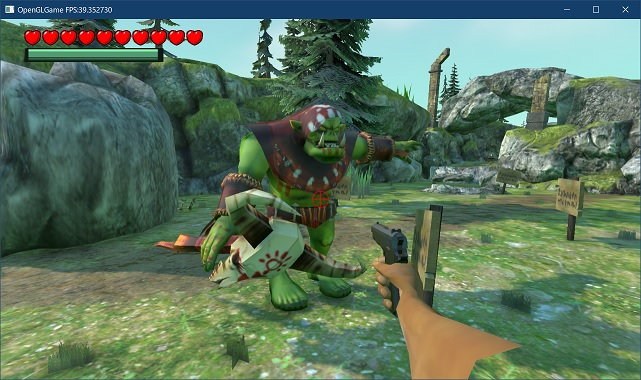
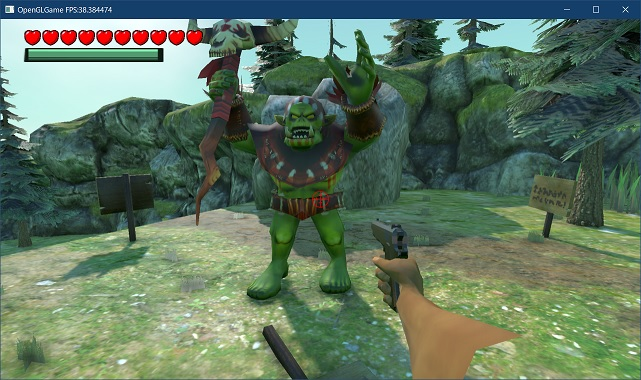

[OpenGL 3D 2024 前期 第06回]

# FBXファイルの読み込み(アニメーション編)

## 習得目標

* 
* 
* 
* 

## 1. メッシュセットをアニメーションさせる

### 1.1 アニメーションプログラムをコピーする

FBXファイルをスケルタルメッシュへ変換できるようになったので、今度はスケルタルメッシュをアニメーションさせましょう。

メッシュセットのスケルタルメッシュは、以前作成したスケルタルメッシュとはジョイント構造などが異なります。そのため、既存の`Animator`クラスではメッシュセットをアニメーションさせることは不可能です。

しかし、データ構造が違うとはいえ、アニメーションの基本的な仕組みは同じです。そこで、`Animator`クラスをコピー・改造することで、メッシュセット用のアニメーション制御クラスを作成していきます。

まずはクラスをコピーします。プロジェクトの`Src/Engine`フォルダに`MeshSetAnimation.h`という名前のヘッダファイルを追加してください。追加したファイルを開き、次のプログラムを追加してください。

```diff
+/**
+* @file MeshSetAnimation.h
+*/
+#ifndef MESHSETANIMATION_H_INCLUDED
+#define MESHSETANIMATION_H_INCLUDED
+#include "VecMath.h"
+#include "Component.h"
+#include <vector>
+#include <string>
+#include <unordered_map>
+#include <memory>
+
+#endif // MESHSETANIMATION_H_INCLUDED
```

次に`Animation.h`を開いて、インクルードガードとインクルード文を除くすべての行をコピーします。そして、`MeshSetRenderer.h`に貼り付けてください。

```diff
 #include <string>
 #include <unordered_map>
 #include <memory>
+
+// 先行宣言
+class GameObject;
+
+/**
+* 時刻とアニメーション状態のペア
+*/
+struct Keyframe
+{
+  float time; // 時刻
+  vec3 value; // アニメーション状態
+};
+
+/**
+* キーフレームの集合
+*/
+class AnimationCurve
+          ・
+          ・
+          ・
+        (省略)
+          ・
+          ・
+          ・
+private:
+  std::unordered_map<std::string, AnimationClipPtr> clips; // クリップ配列
+  std::string currentClipName;  // 再生中のアニメーションクリップ名
+  AnimationClipPtr currentClip; // 再生中のアニメーションクリップ
+  bool isPlaying = false;       // アニメーションを再生中ならtrue
+  float timer = 0;              // アニメーションの経過時間
+  float speed = 1;              // アニメーション速度
+};
+using AnimationPtr = std::shared_ptr<Animator>;
+
+/**
+* アニメーションカーブを作成する
+*
+* @param list キーフレームのリスト
+*
+* @return 作成したアニメーションカーブオブジェクト
+*/
+AnimationCurvePtr CreateAnimationCurve(
+  const std::initializer_list<Keyframe>& list);

 #endif // MESHSETANIMATION_H_INCLUDED
```

続いて、CPPファイルの内容をコピーします。プロジェクトの`Src/Engine`フォルダに`MeshSetAnimation.cpp`という名前のCPPファイルを追加してください。追加したファイルを開き、次のプログラムを追加してください。

```diff
+/**
+* @file MeshSetAnimation.cpp
+*/
+#include "MeshSetAnimation.h"
+#include "GameObject.h"
+#include "MeshSetRenderer.h"
+#include "Debug.h"
+#include <algorithm>
```

次に`Animation.cpp`を開いて、インクルード文を除くすべての行をコピーします。そして、`MeshSetAnimation.cpp`に貼り付けてください。

```diff
 * @file MeshSetAnimation.cpp
 */
 #include "MeshSetAnimation.h"
 #include "GameObject.h"
 #include "MeshSetRenderer.h"
 #include "Debug.h"
 #include <algorithm>
+
+/**
+* キーフレームを追加する
+*/
+bool AnimationCurve::AddKey(float time, const vec3& value)
+{
+  // 追加する位置を探索
+  auto itr = std::lower_bound(keys.begin(), keys.end(), time,
+    [](const Keyframe& key, float time) { return key.time < time; });
+
+  // 時刻の等しいキーフレームが存在する場合は追加できない
+  if (itr != keys.end() && itr->time == time) {
+    LOG_WARNING(
+      "時間が重複するKeyFrameは追加できません(time=%0.3f, value=%0.3f,%0.3f,%0.3f",
+          ・
+          ・
+          ・
+        (省略)
+          ・
+          ・
+          ・
+// アニメーションを停止する
+void Animator::Stop()
+{
+  isPlaying = false;
+  timer = 0;
+}
+
+/**
+* アニメーションカーブを作成する
+*/
+AnimationCurvePtr CreateAnimationCurve(
+  const std::initializer_list<Keyframe>& list)
+{
+  auto p = std::make_shared<AnimationCurve>();
+  p->AddKey(list.begin(), list.end());
+  return p;
+}
```

これで下準備は完了です。

### 1.2 Keyframe構造体を書き換える

FBXファイルのアニメーションデータは、一番深い部分では既存の`Animator`クラスが行っているのと同様に、平行移動・回転・拡大縮小が個別にデータ化されています。

しかし、実際にアニメーションを行うためには、これら以外にいくつもの行列を乗算する必要があり、全体としてかなり複雑な計算をしなくてはなりません。

ゲームでは、複雑なジョイントを持つ多数のモデルをリアルタイムでアニメーションさせる必要があるため、そのような計算を行うことは現実的とは言えません。

そこで、アニメーションデータには「全ての計算を終えた後のグローバル座標変換行列」を使うことにします。つまり、「キーフレームに`mat4`を使う」ということです。

早速、さきほどコピーした`Keyframe`構造体を改造しましょう。同じ名前は使えないので新しい名前を付けなくてはなりませｎ。新しい名前は`KeyframeMat4`(キーフレーム・マット・フォー)とします。

`MeshSetAnimation.h`を開き、`Keyframe`構造体の定義を次のように変更してください。

```diff
 /**
 * 時刻とアニメーション状態のペア
 */
-struct Keyframe
+struct KeyframeMat4
 {
   float time; // 時刻
-  vec3 value; // アニメーション状態
+  mat4 value; // アニメーション状態
 };

 /**
 * キーフレームの集合
```

### 1.3 AnimationCurveクラスを書き換える

次に、`Keyframe`構造体を使っていた`AnimationCurve`クラスと`AnimationClip`クラスを、`KeyframMat4`構造体を使うように変更します。`AnimationCurve`クラスから手を付けましょう。`AnimationCurve`クラスの定義を次のように変更してください。

```diff
 /**
 * キーフレームの集合
 */
-class AnimationCurve
+class AnimationCurveMat4
 {
 public:
   /**
   * キーフレームを追加する
   * 
   * @param time  時刻
   * @param value アニメーション状態
   *
   * @retval true 追加成功
   * @retval false 追加失敗(同じ時刻のキーが存在する)
   */
-  bool AddKey(float time, const vec3& value);
+  bool AddKey(float time, const mat4& value);

   /**
   * キーフレーム配列を追加する
   *
   * @param begin 配列の先頭
   * @param end   配列の終端
   *
   * @return 追加したキーの数
   */
-  int AddKey(const Keyframe* begin, const Keyframe* end);
+  int AddKey(const KeyframeMat4* begin, const KeyframeMat4* end);

   /**
   * 特定の時刻のアニメーション状態を取得する
   *
   * @param time 時刻
   *
   * @return timeに対応するアニメーション状態
   */
-  vec3 Evaluate(float time) const;
+  mat4 Evaluate(float time) const;

   /**
   * アニメーションの長さを取得する
   *
   * @return アニメーションの長さ(秒)
   */
   float Length() const;
 
 private:
-  std::vector<Keyframe> keys;
+  std::vector<KeyframeMat4> keys;
 };
-using AnimationCurvePtr = std::shared_ptr<AnimationCurve>;
+using AnimationCurveMat4Ptr = std::shared_ptr<AnimationCurveMat4>;

 /**
 * アニメーションの対象となるデータ
```

### 1.4 AddKeyメンバ関数の定義を書き換える

続いてメンバ関数の定義を変更していきます。`MeshSetAnimation.cpp`を開き、`AnimationCurve::AddKey`メンバ関数の定義を次のように変更してください。

```diff
 /**
 * キーフレームを追加する
 */
-bool AnimationCurve::AddKey(float time, const vec3& value)
+bool AnimationCurveMat4::AddKey(float time, const mat4& value)
 {
   // 追加する位置を探索
   auto itr = std::lower_bound(keys.begin(), keys.end(), time,
-    [](const Keyframe& key, float time) { return key.time < time; });
+    [](const KeyframeMat4& key, float time) { return key.time < time; });
 
   // 時刻の等しいキーフレームが存在する場合は追加できない
   if (itr != keys.end() && itr->time == time) {
     LOG_WARNING(
-      "時間が重複するKeyFrameは追加できません(time=%0.3f, value=%0.3f,%0.3f,%0.3f",
-      time, value.x, value.y, value.z);
+      "時間が重複するKeyFrameは追加できません(time=%0.3f", time);
     return false; // 追加失敗
   }
 
   // キーフレームを追加
-  keys.insert(itr, Keyframe{ time, value });
+  keys.insert(itr, KeyframeMat4{ time, value });
   return true; // 追加成功
 }
```

やることは`vec3`を`mat4`に書き換えて、名前の末尾に`Mat4`を付けるだけです。デバッグログ出力の部分だけは、16個の数値を出力するのはさすがに大変なので省略しました。

### 1.5 もう一つのAddKeyメンバ関数の定義を書き換える

`AddKey`メンバ関数はもうひとつありますので、こちらも書き換えていきましょう。配列を引数に取る`AddKey`メンバ関数の定義を次のように変更してください。

```diff
 /**
 * キーフレーム配列を追加する
 */
-int AnimationCurve::AddKey(const Keyframe* begin, const Keyframe* end)
+int AnimationCurveMat4::AddKey(const KeyframeMat4* begin, const KeyframeMat4* end)
 {
   keys.reserve(end - begin); // 要素数を予約
 
   int count = 0; // 追加した要素数
```

こちらは関数の宣言部分を書き換えるだけです。

### 1.6 AnimationCurve::Evaluateメンバ関数の定義を書き換える

続いて、`AnimationCurve::Evaluate`メンバ関数の定義を書き換えます。

```diff
 /**
 * 特定の時刻のアニメーション状態を取得する
 */
-vec3 AnimationCurve::Evaluate(float time) const
+mat4 AnimationCurveMat4::Evaluate(float time) const
 {
   if (keys.empty()) {
-    return vec3(0); // キーフレームがない場合
+    return mat4(1); // キーフレームがない場合
   } else if (keys.size() == 1) {
     return keys.begin()->value; // キーフレームがひとつの場合
   }
 
   // 時刻に対応するキーフレームを検索
   auto itr = std::lower_bound(keys.begin(), keys.end(), time,
-    [](const Keyframe& k, float time) { return k.time < time; });
+    [](const KeyframeMat4& k, float time) { return k.time < time; });
 
   // 先頭が見つかった場合は先頭キーフレームの値を返す
   if (itr == keys.begin()) {
     return itr->value;
   }
```

`Evaluate`メンバ関数も、`vec3`を`mat4`に置き換え、名前の末尾に`Mat4`を追加すれば書き換え完了です。

ところが、これだけでは「キーフレームを線形補間する」プログラムにおいてエラーが表示されてしまいます。

>```c++
>   // 見つけたキーフレームとひとつ前のキーフレームを線形補間する
>   auto prev = itr - 1;
>   const float ratio = (time - prev->time) / (itr->time - prev->time);
>   return prev->value * (1 - ratio) + itr->value * ratio; // この行でエラー
>```

エラーの原因は「`mat4`と`float`の乗算」と「`mat4`同士の加算」が定義されていないことです。実際、この2つの演算がないと線形補間はできません。そこで、これらの演算を定義しましょう。

`VecMath.h`を開き、`mat4`同士の乗算演算子の定義の下に、次のプログラムを追加してください。

```diff
   m.data[3] = a * b.data[3];
   return m;
 }
 inline mat4& operator*=(mat4& a, const mat4& b) { a = a * b; return a; }
+
+// mat4とfloatの乗算
+inline mat4 operator*(const mat4& a, float b)
+{
+  mat4 m(a);
+  m.data[0] *= b;
+  m.data[1] *= b;
+  m.data[2] *= b;
+  m.data[3] *= b;
+  return m;
+}
+inline mat4 operator*(float a, const mat4& b) { return b * a; }
+inline mat4& operator*=(mat4& a, float b) { a = a * b; return a; }
+
+// mat4同士の加算
+inline mat4 operator+(const mat4& a, const mat4& b)
+{
+  mat4 m(a);
+  m.data[0] += b.data[0];
+  m.data[1] += b.data[1];
+  m.data[2] += b.data[2];
+  m.data[3] += b.data[3];
+  return m;
+}
+inline mat4& operator+=(mat4& a, const mat4& b) { a = a + b; return a; }

 // 拡大率、回転角度、平行移動量から座標変換行列を作成
 inline mat4 GetTransformMatrix(
```

これで`Evaluate`メンバ関数のエラーはなくなるはずです。

>**【減算と除算】**<br>
>今回は乗算と加算を追加しただけですが、さまざまな演算を可能にするには減算演算子と除算演算子も定義しなくてはなりません。余力があれば実装してみてください。

### 1.7 AnimationCurve::Lengthメンバ関数の定義を書き換える

`Length`メンバ関数は、ヘッダファイル側では何も書き換えていませんが、そうであってもクラス名だけは書き換える必要があります。

`MeshSetAnimation.cpp`を開き、`AnimationCurve::Length`メンバ関数の定義を次のように変更してください。

```diff
 /**
 * アニメーションの長さを取得する
 */
-float AnimationCurve::Length() const
+float AnimationCurveMat4::Length() const
 {
   if (keys.empty()) {
     return 0;
   }
```

これで、`AnimationCurve`クラスから`AnimationCurveMat4`クラスへの書き換えは完了です。

### 1.8 AnimationClipクラスを書き換える

続いて、`AnimationClip`クラスを書き換えていきます。`MeshSetAnimation.h`を開き、`AnimationClip`クラスの定義を次のように変更してください。

```diff
 /**
 * アニメーションカーブの集合
 */
-class AnimationClip
+class AnimationClipMat4
 {
 public:
   /**
   * アニメーションカーブを追加する
   *
-  * @param targetBone アニメーションを適用するボーンの番号
-  * @param target     アニメーションの対象となるデータ
+  * @param targetBoneName アニメーションを適用するボーンの名前
   * @param curve      追加するアニメーションカーブ
   *
   * @retval true  追加成功
   * @retval false 追加失敗
   */
-  bool AddCurve(int targetBone, AnimationTarget target,
-    const AnimationCurvePtr& curve);
+  bool AddCurve(const char* targetBoneName,
+    const AnimationCurvePtr& curve);

   /**
   * アニメーションを反映する
   *
   * @param gameObject 反映先のゲームオブジェクト
   * @param time       アニメーションを評価する時刻
+  * @param jointIndexMap カーブ配列インデックスからジョイントインデックスへの変換表
   */
-  void Evaluate(GameObject& gameObject, float time);
+  void Evaluate(GameObject& gameObject, float time, const int* jointIndexMap);

   // アニメーションの再生時間を取得
   float Length() const { return length; }

   // ループフラグを取得
   bool IsLoop() const { return isLoop; }

   // ループフラグを設定
   void SetLoopFlag(bool flag) { isLoop = flag; }
+
+  // アニメーションクリップ名の取得・設定
+  void SetName(const char* name) { this->name = name; }
+  const std::string& GetName() const { return name; }

 private:
   // アニメーションカーブの設定情報
   struct CurveInfo
   {
-    int targetBone;          // アニメーションの対象となるボーン番号
-    AnimationTarget target;  // アニメーションの対象となるデータ
-    AnimationCurvePtr curve; // アニメーションカーブ
+    std::string targetBoneName;  // アニメーションの対象となるボーン名
+    AnimationCurveMat4Ptr curve; // アニメーションカーブ
   };
   std::vector<CurveInfo> curves;

+  std::string name;     // アニメーションクリップの名前
   float length = 0;     // アニメーションの再生時間(秒)
   bool isLoop = false;  // true=ループする false=ループしない
 };
-using AnimationClipPtr = std::shared_ptr<AnimationClip>;
+using AnimationClipMat4Ptr = std::shared_ptr<AnimationClipMat4>;
 
 /**
 * アニメーションを制御するコンポーネント
```

`AnimationClip`クラスについては、名前に`Mat4`を付けるだけでなく、対象ボーンの指定方法を「番号」から「名前」に変更しています。これは、「アニメーションデータだけを持つFBXファイル」に対応するためです。

多くのFBXファイルでは、様々なメッシュに対してアニメーションデータを流用できるように、メッシュとアニメーションを別のFBXファイルに分けて保存します。

このとき、メッシュによっては固有の装飾品などが追加または削除されて、ジョイント数が増減する場合があります。そうすると、アニメーション用のFBXファイルとメッシュ用のFBXファイルではジョイント数が違ってきます。

そして、ジョイント数が違うと、同じインデックス番号は使えません。この問題を解決するために、番号ではなく「名前によって対象のジョイントを見つける設計」に変えることにしました。

この設計変更のために、`AddCurve`メンバ関数の引数を`int`から`const char*`に変えています。

「ジョイント名からジョイント番号を見つける処理」は、あとで作成する`MeshSetAnimator`クラスで行います。見つけたジョイント番号は、`Evaluate`メンバ関数に追加した`jointIndexMap`(ジョイント・インデックス・マップ)引数で受け取ります。

それから、座標変換行列は、平行移動・回転・拡大縮小をすべて含みます。ということは、アニメーション対象を決める`AnimationTarget`は不要になるはずです。`AnimationTarget`列挙型の定義を削除してください。

```diff
 private:
   std::vector<KeyframeMat4> keys;
 };
 using AnimationCurveMat4Ptr = std::shared_ptr<AnimationCurveMat4>;
-
-/**
-* アニメーションの対象となるデータ
-*/
-enum class AnimationTarget
-{
-  position, // 位置
-  rotation, // 回転
-  scale,    // 拡大率
-};

 /**
 * アニメーションカーブの集合
```

### 1.9 AddCurveメンバ関数を書き換える

`AnimationCurveMat4`クラスと同様に、`AnimationClip`クラスのメンバ関数の定義を`AnimationClipMat4`クラスへと書き換えます。

`AddCurve`メンバ関数から書き換えていきましょう。`MeshSetAnimation.cpp`を開き、`AddCurve`メンバ関数の定義を次のように書き換えてください。

```diff
 /**
 * アニメーションカーブを追加する
 */
-bool AnimationClip::AddCurve(int targetBone, AnimationTarget target,
-  const AnimationCurvePtr& curve)
+bool AnimationClipMat4::AddCurve(const char* targetBoneName,
+  const AnimationCurveMat4Ptr& curve)
 {
   // ボーン番号とターゲットが一致するデータを検索
   auto itr = std::find_if(curves.begin(), curves.end(),
-    [targetBone, target](const CurveInfo& info) {
-      return info.targetBone == targetBone && info.target == target; });
+    [targetBoneName](const CurveInfo& info) {
+      return info.targetBoneName == targetBoneName; });
 
-  // ボーン番号とターゲットの両方が等しいカーブが存在する場合は設定できない
+  // ボーン名が等しいカーブが存在する場合は設定できない
   if (itr != curves.end()) {
-    static const char* const targetNames[] = { "position", "rotation", "scale" };
-    LOG_WARNING(
-      "ターゲットが重複するカーブは設定できません(targetBone=%d, target=%s",
-      targetBone, targetNames[static_cast<int>(target)]);
+    LOG_WARNING("ボーン名が重複するカーブは設定できません(%s)", targetBoneName);
     return false; // 追加失敗
   }
 
   // 新しいカーブを追加
-  curves.push_back(CurveInfo{ targetBone, target, curve });
+  curves.push_back(CurveInfo{ targetBoneName, curve });
   length = std::max(length, curve->Length()); // 長さを更新
   return true; // 追加成功
 }
```

`AnimationTarget`列挙型がなくなったので、プログラムが少し簡単になっています。ただ、ジョイント番号をジョイント名に変更したことで、`find_if`の処理時間が長くなっているはずです。

とはいえ、`AddCurve`が使われるのは主にステージを初期化するときです。初期化にかかる時間が多少長くなるくらいで、ゲームへの影響は少ないと考えられます。

### 1.10 AnimationClip::Evaluateメンバ関数を書き換える

次に、`AnimationClip::Evaluate`メンバ関数の定義を、次のように書き換えてください。

```diff
 /**
 * アニメーションを反映する
 */
-void AnimationClip::Evaluate(GameObject& gameObject, float time)
+void AnimationClipMat4::Evaluate(GameObject& gameObject, float time,
+  const int* jointIndexMap)
 {
   // ボーン数を取得
   size_t count = 0;
-  if (gameObject.renderer) {
-    count = gameObject.renderer->GetJointMatrixCount();
+  if (gameObject.meshSetRenderer) {
+    count = gameObject.meshSetRenderer->GetJointMatrixCount();
   }
 
   // すべてのアニメーションカーブを評価
-  for (const auto& e : curves) {
+  const size_t curveCount = curves.size();
+  for(int i = 0; i < curveCount; ++i) {
+    // カーブ配列インデックスiをボーン(ジョイント)番号に変換
+    const int targetBone = jointIndexMap[i];
+
-    // カーブのボーン番号がボーン数以上の場合は何もしない
-    if (e.targetBone >= count) {
+    // カーブのボーン番号が0未満またはボーン数以上の場合は何もしない
+    if (targetBone < 0 && targetBone >= count) {
       continue;
     }
 
     // timeにおけるカーブを評価
-    const vec3 v = e.curve->Evaluate(time);
+    const mat4 m = curves[i].curve->Evaluate(time);
 
     // 評価結果を対象に反映
-    if (e.targetBone >= 0) {
-      // ボーン番号が0以上の場合、対応するボーンに評価結果を反映
-      // 補足: ここに来るのはcountが1以上の場合だけなので、rendererのnullチェックは不要
-      JointTransform& t = gameObject.renderer->GetJointTransform(e.targetBone);
-      switch (e.target) {
-      case AnimationTarget::position: t.position = v; break;
-      case AnimationTarget::rotation: t.rotation = v; break;
-      case AnimationTarget::scale: t.scale = v; break;
-      }
-    } else {
-      // ボーン番号がマイナスの場合、ゲームオブジェクトに評価結果を反映
-      switch (e.target) {
-      case AnimationTarget::position: gameObject.position = v; break;
-      case AnimationTarget::rotation: gameObject.rotation = v; break;
-      case AnimationTarget::scale: gameObject.scale = v; break;
-      }
-    }
+    gameObject.meshSetRenderer->SetJointMatrix(targetBone, m);
   } // for curves
 }
```

主な変更点は以下の4つです。

1. データを反映する対象を`meshSetRenderer`に変更。
2. ジョイントインデックス取得のため、カーブ配列のループを「範囲for」から「通常のfor」に変更。
3. `AinmationTarget`による`switch`文の削除。
4. 評価結果をゲームオブジェクトに反映する機能の削除。

4番目の変更については少し説明が必要でしょう。これは、「FBXファイルには、FBXファイルに含まれるノードをアニメーションする機能しか含まれない」という理由によります。

つまり、FBXファイルにはゲームオブジェクト用のアニメーションデータは存在しません。そのため、ゲームオブジェクトをアニメーション対象とする機能を作る意味がないのです。

それに、ゲームオブジェクトをアニメーションさせるだけなら、従来の`Animator`クラスを使えばよいのです。`MeshSet`用のアニメーションクラスに重複する機能を持たせる必要はありません。

### 1.11 Animatorクラスを書き換える

次に、`Animator`クラスを書き換えます。他のクラスより変更点が多いので、まずは名前を`MeshSetAnimator`にすることから始めましょう。`MeshSetAnimation.h`を開き、`Animator`クラスの定義を次のように変更してください。

```diff
 /**
 * アニメーションを制御するコンポーネント
 */
-class Animator : public Component
+class MeshSetAnimator : public Component
 {
 public:
   // コンストラクタ・デストラクタ
-  Animator() = default;
-  virtual ~Animator() = default;
+  MeshSetAnimator() = default;
+  virtual ~MeshSetAnimator() = default;
 
   /**
   * 状態を更新する
```

次に、`AddClip`メンバ関数の宣言を次のように変更してください。

```diff
   *
   * @param deltaTime 前回の更新からの経過時間(秒)
   */
   virtual void Update(float deltaTime) override;
 
   /**
   * アニメーションクリップを追加する
   *
   * @param name アニメーションクリップに付ける名前
   * @param clip 追加するアニメーションクリップ
   */
-  void AddClip(const char* name, const AnimationClipPtr& clip);
+  void AddClip(const char* name, const AnimationClipMat4Ptr& clip);

   /**
   * アニメーションを再生する
```

続いて、「ジョイント番号の変換表を作成」する新しいメンバ関数を宣言します。名前は`BuildJointIndexMap`(ビルド・ジョイント・インデックス・マップ、「ジョイント番号の変換表を組み立てる」という意味)とします。

```diff
   * @param name アニメーションクリップに付ける名前
   * @param clip 追加するアニメーションクリップ
   */
   void AddClip(const char* name, const AnimationClipMat4Ptr& clip);
+
+  /**
+  * カーブ配列インデックスからジョイント番号への変換表を作成する
+  *
+  * 必要なアニメーションクリップを追加した後で呼び出す
+  */
+  void BuildJointIndexMap();

   /**
   * アニメーションを再生する
```

名前のとおり、この関数はジョイント番号の変換表を作成します。実装はあとで行いますが、内容としては「追加された全てのクリップについて変換表を作成する」というものになるでしょう。

次に、`MeshSetAnimator`クラスのメンバ変数の定義を、次のように変更してください。

```diff
   // 経過時間を取得・設定
   float GetTimer() const { return timer; }
   void SetTimer(float t) { timer = t; }
 
 private:
+  // アニメーションクリップの情報
+  struct ClipInfo
+  {
+    AnimationClipMat4Ptr clip; // アニメーションクリップ
+
+    // カーブ配列インデックスからジョイントインデックスへの変換表
+    std::vector<int> curveIndexToJointIndexMap;
+  };
+  using ClipInfoPtr = std::shared_ptr<ClipInfo>;

-  std::unordered_map<std::string, AnimationClipPtr> clips; // クリップ配列
+  std::unordered_map<std::string, ClipInfoPtr> clips; // クリップ配列
   std::string currentClipName;  // 再生中のアニメーションクリップ名
-  AnimationClipPtr currentClip; // 再生中のアニメーションクリップ
+  ClipInfoPtr currentClip;      // 再生中のアニメーションクリップ
   bool isPlaying = false;       // アニメーションを再生中ならtrue
   float timer = 0;              // アニメーションの経過時間
   float speed = 1;              // アニメーション速度
 };
```

ここでの大きな変更点は、`clips`連想配列に格納するデータ型を`AnimationClipPtr`から`ClipInfo`(クリップ・インフォ)構造体に変更したことです。

この変更に伴って、再生中のアニメーションクリップを表す型も`ClipInfoPtr`(クリップ・インフォ・ポインタ)に変更しています。

`ClipInfo`構造体には、カーブ配列インデックスをジョイントインデックスに変換する`curveIndexToJointIndexMap`(カーブ・インデックス・トゥ・ジョイント・インデックス・マップ)メンバ変数があります。

`AnimationCurveMat4`クラスを定義したときにも説明しましたが、FBXのアニメーションではジョイント名によって「対象となるジョイント」を識別します。

対象となるジョイントを見つけるには全てのジョイントに対して文字列比較を行って、一致するジョイントを探す必要があります。ただ、文字列の比較は「時間のかかる処理」なため、毎フレーム文字列比較を行うのは明らかに悪い考えです。

そこで、事前に「カーブ配列のインデックスをジョイント配列のインデックスへの変換表」を作成しておき、実行時は変換表に従って対象となるジョイントを選択します。

この方法では、クリップを登録した後で一度だけ名前の検索を行えば済むようになり、また、プログラム実行中は変換表を見れば一瞬で対象のジョイントを見つけられます。

この「実行時に使う変換表」が`curveIndexToJointIndexMap`メンバ変数です。そして、変換表の作成は先に宣言した`BuildJointIndexMap`メンバ関数によって行います。

>変換表をクリップ単位で定義している理由は、異なるFBXファイルから読み込まれたアニメーションクリップは、それぞれが異なる変換表を必要とする可能性があるからです。

さて、連想配列の型が変わったこともあり、アニメーションクリップを取得する`GetClip`メンバ関数はいろいろと変更する必要があります。`GetClip`メンバ関数の定義を次のように変更してください。

```diff
   // 再生中のアニメーションクリップ名を取得
   const std::string& GetCurrentClipName() const { return currentClipName; }
 
   // 設定されているアニメーションクリップ数を取得
   size_t GetClipCount() const { return clips.size(); }
 
   // アニメーションクリップを取得
-  std::pair<std::string, AnimationClipPtr> GetClip(size_t index) const {
-  std::pair<std::string, AnimationClipMat4Ptr> GetClip(size_t index) const {
     auto itr = clips.begin();
     for (size_t i = 0; i < index; ++i) {
       ++itr;
     }
-    return *itr;
+    return std::make_pair(itr->first, itr->second->clip);
   }
 
   // アニメーション速度を取得・設定
   float GetSpeed() const { return speed; }
   void SetSpeed(float s) { speed = s; }
```

`ClipInfo`構造体はプライベートメンバで戻り値にはできません。そこで、`AnimationClipMat4Ptr`を取り出して返すようにしました。

変換表を公開しないのは、クラスの外部に公開して勝手に書き換えられると困るからです。

最後に`using`による別名の宣言を、次のように書き換えてください。

```diff
   bool isPlaying = false;       // アニメーションを再生中ならtrue
   float timer = 0;              // アニメーションの経過時間
   float speed = 1;              // アニメーション速度
 };
-using AnimatorPtr = std::shared_ptr<Animator>;
+using MeshSetAnimatorPtr = std::shared_ptr<MeshSetAnimator>;

 #endif // ANIMATION_H_INCLUDED
```

これで、`Animator`クラスの定義を`MeshSetAnimator`クラスの定義に書き換えることができました。

### 1.12 Animator::Updateメンバ関数の定義を書き換える

続いて、`Animator`クラスのメンバ関数定義を`MeshSetAnimator`クラスのものに書き換えていきましょう。`MeshSetAnimation.cpp`を開き、`Animator::Update`メンバ関数の定義を次のように変更してください。

```diff
 /**
 * 状態を更新する
 */
-void Animator::Update(float deltaTime)
+void MeshSetAnimator::Update(float deltaTime)
 {
   // クリップが設定されていない、または再生されていない場合は何もしない
   if ( ! currentClip || ! isPlaying) {
     return;
   }
 
   // タイマー更新
   timer += deltaTime * speed;

+  auto& clip = *currentClip->clip;
-  const float length = currentClip->Length();
-  if (currentClip->IsLoop()) {
+  const float length = clip->Length();
+  if (clip->IsLoop()) {
     // アニメーションの再生時間でループ
     timer = fmod(timer + length, length);
   } else {
     // 再生時間を超過していたら再生を停止する
     if (speed < 0 && timer <= 0) {
       isPlaying = false;
       timer = 0;
     } else if (speed >= 0 && timer >= length) {
       isPlaying = false;
       timer = length;
     }
   }
 
-  currentClip->Evaluate(*GetOwner(), timer);
+  clip->Evaluate(*GetOwner(), timer, currentClip->curveIndexToJointIndexMap.data());
 }
```

名前の変更以外で主な変更点は以下の2つです。

>1. `currentClip`メンバ変数が`ClipInfo`型になったので`clip`メンバ変数を取り出す必要ができた。
>2. `Evaluate`メンバ関数の引数にジョイントインデックスの変換表を追加した。

### 1.13 AddClipメンバ関数の定義を書き換える

次に、`AddClip`メンバ関数の定義を書き換えます。`AddClip`メンバ関数の定義を次のように変更してください。

```diff
 /**
 * アニメーションクリップを追加する
 *
 * @param name アニメーションクリップに付ける名前
 * @param clip 追加するアニメーションクリップ
 */
-void Animator::AddClip(const char* name, const AnimationClipPtr& clip)
+void MeshSetAnimator::AddClip(const char* name, const AnimationClipMat4Ptr& clip)
 {
   auto itr = clips.find(name);
   if (itr != clips.end()) {
     LOG_WARNING("同じ名前のクリップは追加できません(name=%s)", name);
     return;
   }
 
   // アニメーションクリップを追加
+  auto clipInfo = std::make_shared<ClipInfo>();
+  clipInfo->clip = clip;
-  clips.emplace(name, clip);
+  clips.emplace(name, clipInfo);
 }
```

主な変更点は、`clips`連想配列に追加するデータを`ClipInfo`オブジェクトに変えたことです。

### 1.14 Playメンバ関数の定義を書き換える

続いて、`Play`メンバ関数の定義を書き換えます。`Play`メンバ関数の定義を次のように変更してください。

```diff
 /**
 * アニメーションを再生する
 *
 * @param name 再生するアニメーションクリップの名前
 */
-void Animator::Play(const char* name)
+void MeshSetAnimator::Play(const char* name)
 {
   auto itr = clips.find(name);
   if (itr == clips.end()) {
     LOG_WARNING("指定された名前のクリップが見つかりません(name=%s)", name);
     return;
   }
 
   // 座標変換パラメータを初期値に戻す
   auto owner = GetOwner();
-  if (owner->renderer) {
-    owner->renderer->ClearJointTransforms();
+  if (owner->meshSetRenderer) {
+    owner->meshSetRenderer->ClearJointMatrices();
   }
 
   // クリップを設定し、再生状態にする
   currentClipName = itr->first;
   currentClip = itr->second;
   isPlaying = true;
   timer = 0;
-  currentClip->Evaluate(*owner, timer);
+  currentClip->clip->Evaluate(*owner, timer, currentClip->curveIndexToJointIndexMap.data());
 }
```

`Play`メンバ関数の主な変更点は以下の2つです。

>1. 座標変換パラメータの初期化対象を、`renderer`から`meshSetRenderer`に変更した。
>2. `Evaluate`メンバ関数の引数にジョイントインデックスの変換表を追加した。

### 1.15 Stopメンバ関数の定義を書き換える

次に`Stop`メンバ関数の定義を書き換えます。`Stop`メンバ関数の定義を次のように変更してください。

```diff
 /**
 * アニメーションを停止する
 */
-void Animator::Stop()
+void MeshSetAnimator::Stop()
 {
   isPlaying = false;
   timer = 0;
 }
```

これは、名前を変更するだけで完了です。単純な関数であるがゆえに、他に書き換えるところはありません。

### 1.16 BuildJointIndexMapメンバ関数を定義する

最後に、新しく追加した`BuildJointIndexMap`メンバ関数を定義します。`Stop`メンバ関数の定義の下に、次のプログラムを追加してください。

```diff
 void MeshSetAnimator::Stop()
 {
   isPlaying = false;
   timer = 0;
 }
+
+/**
+* ジョイント名からジョイント番号への変換表を作成する
+*/
+void MeshSetAnimator::BuildJointIndexMap()
+{
+  // メッシュセットレンダラが未設定なら何もしない
+  const auto& renderer = GetOwner()->meshSetRenderer;
+  if (!renderer) {
+    LOG_WARNING("ゲームオブジェクト%sにMeshSetRendererが設定されていません",
+      GetOwner()->name.c_str());
+    return;
+  }
+
+  // ボーン名からジョイントインデックスへの変換表を作成
+  const size_t jointCount = renderer->GetJointMatrixCount();
+  std::unordered_map<std::string, int> nameToIndexMap;
+  nameToIndexMap.reserve(jointCount);
+  for (int i = 0; i < jointCount; ++i) {
+    nameToIndexMap.emplace(renderer->GetJointName(i), i);
+  }
+
+  // 全てのアニメーションクリップについて
+  // カーブ配列インデックスからボーンインデックスへの対応表を作成
+  for (auto& e : clips) {
+    ClipInfo& clipInfo = *e.second;
+    clipInfo.curveIndexToJointIndexMap.clear(); // 全て消去しておく
+    if (clipInfo.clip->curves.empty()) {
+      // カーブが0個なので作成の必要はない
+      clipInfo.curveIndexToJointIndexMap.shrink_to_fit();
+    } else {
+      // nameToIndexMapを利用して、ボーン名からジョイントインデックスを取得
+      const size_t curveCount = clipInfo.clip->curves.size();
+      clipInfo.curveIndexToJointIndexMap.reserve(curveCount);
+      for (int i = 0; i < curveCount; ++i) {
+        int index = -1;
+        auto itr = nameToIndexMap.find(clipInfo.clip->curves[i].targetBoneName.c_str());
+        if (itr != nameToIndexMap.end()) {
+          index = itr->second;
+        }
+        clipInfo.curveIndexToJointIndexMap.push_back(index);
+      }
+    }
+  } // for clips
+}
```

この関数でポイントとなるのは、2種類の変換表を作しているところです。

まず「ボーン名からジョイントインデックスへの変換表`nameToIndexMap`」を作成し、この変換表を使って改めて「カーブ配列インデックスからジョイントインデックスへの変換表`curveIndexToJointIndexMap`」を作成しています。

普通に考えて、ボーン名に対応するジョイントインデックスを検索するには、全てのジョイントについて名前を比較していく必要があります。

>```c++
>// 名前が一致するジョイントのインデックスを検索するサンプルプログラム
>int jointIndex = 0;
>for (; jointIndex < jointCount; ++jointIndex) {
>  if (renderer->GetJointName(i) == targetBoneName) {
>    break;
>  }
>}
>```

このプログラムを使ってジョイントインデックスを検索するのにかかる時間は、平均すると「ジョイント数/2」になるでしょう。これを全てのカーブに対して行う場合、実行時間は「カーブ数 x ジョイント数 / 2」となります。

この方法では、多くのジョイントを持つメッシュと多くのカーブをもつアニメーションの組み合わせでは、すべての検索が完了するまでに相当な時間がかかると予想されます。

検索時間を短縮するために、上記のプログラムでは、事前に「名前からジョイントインデックスへの変換表」を作成する方法をとっています。

もちろん、変換表の作成にも時間はかかります。作成部分を以下に抜粋します。

>```c++
>  // 変換表を作成
>  for (int i = 0; i < jointCount; ++i) {
>    nameToIndexMap.emplace(renderer->GetJointName(i), i);
>  }
>```

ループ条件から、作成にかかる時間は「ジョイント数」と等しくなります。しかし、一度変換表を作成すれば、あとは表を見るだけで対応するジョイントインデックスが分かるようになります。

つまり、変換表を使った場合にかかる時間は「カーブ数 + ジョイント数」になるわけです。例えば、カーブ数を10、ジョイント数を20とすると、変換表を使わない場合にかかる時間は`10 * 20 / 2 = 100`、変換表を使う場合は`10 + 20 = 30`です。

このように「表を作成して検索時間を減らす」ことは、プログラムではよく利用される技術のひとつです。

>**【変換表を作らないほうが早い場合はありうるか】**<br>
>ありえます。ただ、実際にどんなカーブ数、ジョイント数のときに起きるかは調べておくとよいでしょう(この文章は真っ赤な嘘で、常に変換表を使ったほうが早いかもしれませんよ)。

### 1.17 MeshSetAnimatorをテストする

それでは、`MeshSetAnimator`クラスの動作テストを行いましょう。`ExplorationSecene.cpp`を開き、`MeshSetAnimation.h`をインクルードしてください。

```diff
 #include "Engine/SkeletalMeshRenderer.h"
 #include "Engine/Animation.h"
 #include "Engine/MeshSetRenderer.h"
+#include "Engine/MeshSetAnimation.h"
 #include "Engine/UIButton.h"
 #include "Engine/BoxCollider.h"
```

次に、`Initialize`メンバ関数の定義にある「FBXファイルの表示テスト」を行うプログラムを、次のように変更してください。

```diff
     auto fbxTest = engine.Create<GameObject>("fbx test", { 15, 6.0f, 2 });
     fbxTest->meshSetRenderer = std::make_shared<MeshSetRenderer>();
     fbxTest->meshSetRenderer->SetMeshSet(
       engine.LoadFBX("Res/MeshData/OrcShaman/Orc Shaman.fbx"));
-    const mat4 matTranslate = GetTransformMatrix(vec3(1), vec3(0), vec3(0, -3.4f, 0));
-    const size_t jointCount = fbxTest->meshSetRenderer->GetMeshSet()->joints.size();
-    for (int i = 0; i < jointCount; ++i) {
-      if (i == 79 || i == 80 || i == 82 || i == 83) {
-        continue;
-      }
-      fbxTest->meshSetRenderer->SetJointMatrix(i, matTranslate);
-    }
     fbxTest->scale = vec3(0.2f);
+
+    // 右腕を振るアニメーションを作成
+
+    // 初期位置から動かさないジョイント用のカーブ
+    auto curveNoMove = std::make_shared<AnimationCurveMat4>();
+    curveNoMove->AddKey(0.0f, mat4(1));
+
+    // 右腕以外のぼすべてのジョイント用のカーブ
+    auto curveHips = std::make_shared<AnimationCurveMat4>();
+    const auto& joints = fbxTest->meshSetRenderer->GetMeshSet()->joints;
+    curveHips->AddKey(0.0f, joints[2].matInverseBindPose * joints[2].matBindPose);
+
+    // 右腕のジョイント用のカーブ
+    auto curveRightArm = std::make_shared<AnimationCurveMat4>();
+    const mat4 matRightArmIB = joints[11].matInverseBindPose;
+    const mat4 matRightArmB = joints[11].matBindPose;
+    static const vec3 rotations[] = {
+      { 0, 0, 1 }, { 1, 0, 1 }, { 0, 0, 1 }, {-1, 0, 1.5f }, { 0, 0, 1 } };
+    for (int i = 0; i < std::size(rotations); ++i) {
+      const float time = static_cast<float>(i) * 0.5f;
+      const mat4 matJoint = GetTransformMatrix(vec3(1), rotations[i], vec3(0));
+      curveRightArm->AddKey(time, matRightArmB * matJoint * matRightArmIB);
+    }
+
+    // カーブをアニメーションクリップに編成
+    auto clip = std::make_shared<AnimationClipMat4>();
+    for (int i = 0; i < joints.size(); ++i) {
+      auto name = joints[i].name.c_str();
+      if ((i >= 11 && i <= 28) || i == 71 || i == 81) { // 右腕、アームカバー、杖
+        clip->AddCurve(name, curveRightArm);
+      } else if (i == 79 || i == 80 || i == 82 || i == 83) { // 骨
+        clip->AddCurve(name, curveNoMove);
+      } else { // その他のジョイント
+        clip->AddCurve(name, curveHips);
+      }
+    }
+    clip->SetLoopFlag(true); // ループ再生
+
+    // アニメータにクリップを設定して再生
+    auto a = fbxTest->AddComponent<MeshSetAnimator>();
+    a->AddClip("test", clip);
+    a->BuildJointIndexMap();
+    a->Play("test");
   }

   // プレイヤーを配置
   auto player = engine.Create<GameObject>("player", { 0, 2, 0 });
```

プログラムが書けたらビルドして実行してください。右腕を振るアニメーションが再生されていたら成功です。

<p align="center">

</p>

>**【1章のまとめ】**
>
>* 
>* 
>* 
>* 

<div style="page-break-after: always"></div>

## 2. アニメーションデータを読み込む

### 2.1 アニメーション変換関数を定義する

手作りのアニメーションデータを再生できるようになったので、次はFBXファイルからアニメーションデータを読み込んで再生しましょう。

最初に、`MeshScene`構造体にアニメーションデータ配列を追加します。まずは`FbxLoader.h`を開き、アニメーションデータの先行宣言を追加してください。

```diff
 #define FBXLOADER_H_INCLUDED
 #include "Mesh.h"

 // 先行宣言
 class MikkTSpace;
+class AnimationClipMat4;
+using AnimationClipMat4Ptr = std::shared_ptr<AnimationClipMat4>;

 /**
 * FBXファイル読み込みオブジェクトの純粋仮想インターフェイス
```

次に、`MeshScene`構造体にアニメーションデータ配列の定義を追加してください。

```diff
   // 複数のメッシュをまとめたデータ
   struct MeshScene
   {
     std::vector<StaticMeshData> staticMeshDataList; // スタティックメッシュ配列
     std::vector<SkeletalMeshData> skeletalMeshDataList; // スケルタルメッシュ配列
     std::vector<MeshSet::Joint> joints; // ノードの接続情報
+    std::unordered_map<std::string, AnimationClipMat4Ptr> animationClips; // アニメーション配列
   };
   using MeshScenePtr = std::shared_ptr<MeshScene>;
```

続いて、アニメーションデータを変換する関数を定義します。名前は`ConvertAnimation`(コンバート・アニメーション)とします。`FbxLoader.cpp`を開き、`FbxLoader`クラスの定義に次のプログラムを追加してください。

```diff
   void ConvertSkeletalMesh(const std::filesystem::path& path, FbxMesh* fbxMesh,
     std::unordered_map<int, int> vertexIndexToControlPointIndexMap, StaticMeshData& meshData);
   void ConvertMesh(const std::filesystem::path& path);
+  void ConvertAnimation(const std::filesystem::path& path);

   MikkTSpace* mikkTSpace = nullptr;
   MeshBuffer::TextureCallback textureCallback;
   MeshScenePtr meshScene; // FBXファイルから読み込んだデータ
```

次に、`Load`メンバ関数の定義に`ConvertAnimation`メンバ関数の呼び出しを追加してください。


```diff
   // フォルダ名を取得する
   const auto path = std::filesystem::path(filename).parent_path().make_preferred();

   ConvertJoints(path);
   ConvertMesh(path);
+  ConvertAnimation(path);

   return meshScene;
 }
```

### 2.2 ConvertAnimationメンバ関数を定義する

アニメーションデータの読み込みは少しばかり複雑です。というのも、「すべてのアニメーションについて」、「すべてのスケルタルメッシュの」、「すべてのジョイントの」、「すべてのキーフレーム」を計算する必要があるからです。

実際に、これは4重の`for`ループになります。とりあえず、一番外側の「すべてのアニメーションについて」のループから作成しましょう。`ConvertMesh`メンバ関数の定義の下に、次のプログラムを追加してください。

```diff
       // スケルタルメッシュを追加
       ConvertSkeletalMesh(path, fbxMesh, vertexIndexToControlPointIndexMap, meshData);
     }
   } // for nodeIndex
 }
+
+/**
+* アニメーションデータの変換
+*/
+void FbxLoader::ConvertAnimation(const std::filesystem::path& path)
+{
+  const size_t nodeCount = fbxNodes.size();
+  const auto itrBegin = fbxNodes.begin();
+  const auto itrEnd = fbxNodes.end();
+
+  // FBXアニメーション名の配列を取得
+  FbxArray<FbxString*> animStackNameArray;
+  fbxScene->FillAnimStackNameArray(animStackNameArray);
+
+  // アニメーションクリップ配列の容量を予約
+  const int animStackCount = fbxScene->GetSrcObjectCount<FbxAnimStack>();
+  meshScene->animationClips.reserve(animStackCount);
+
+  // すべてのFBXアニメーションをアニメーションクリップに変換
+  for (int stackIndex = 0; stackIndex < animStackCount; ++stackIndex) {
+    // 変換するFBXアニメーションを設定
+    FbxAnimStack* fbxAnimStack = fbxScene->GetSrcObject<FbxAnimStack>(stackIndex);
+    fbxScene->SetCurrentAnimationStack(fbxAnimStack);
+
+    // アニメーションのフレームレートを取得
+    const auto& globalSettings = fbxScene->GetGlobalSettings();
+    const FbxTime::EMode timeMode = globalSettings.GetTimeMode();
+
+    // アニメーションの再生期間を取得
+    const int timeStart = (int)floor(
+      fbxAnimStack->LocalStart.Get().GetFrameCountPrecise(timeMode));
+    const int timeStop = (int)ceil(
+      fbxAnimStack->LocalStop.Get().GetFrameCountPrecise(timeMode));
+
+    // キーフレーム配列を予約
+    std::vector<KeyframeMat4> keyframes;
+    keyframes.reserve(timeStop - timeStart + 1); // 最終フレームのため1を足す
+  } // for stackIndex < animStackCount
+}
```

FBXファイルのアニメーションデータは「アニメーション・スタック」というデータで表されます。`ConvertAnimation`メンバ関数の目的は、FBXのアニメーションスタックをアニメーションクリップに変換することです。

アニメーションスタックの名前を取得するには`FbxDocument`クラスの`FillAnimStackNameArray`(フィル・アニム・スタック・ネーム・アレイ)メンバ関数を使います。

>`FbxScene`は`FbxDocument`の派生クラスです。

<pre class="tnmai_code"><strong>【書式】</strong><code>
void FbxDocument::FillAnimStackNameArray(名前を格納する文字列配列);
</code></pre>

`FbxString`クラスはFBX SDKにおいて文字列を表現し、C++の`string`型と似た機能を持っています。`FbxArray`クラスはFBX SDKにおいて配列を表現し、C++の`array`型と似た機能を持っています。

FBXファイルに含まれるアニメーションスタック数を調べるには`GetSrcObjectCount`(ゲット・ソース・オブジェクト・カウント)メンバ関数のテンプレート引数に`FbxAnimStack`(エフビーエックス・アニム・スタック)型を指定します。

<pre class="tnmai_code"><strong>【書式】</strong><code>
オブジェクト数 FbxScene::GetSrcObjectCount&lt;オブジェクトのクラス名&gt;();
</code></pre>

アニメーションスタックを取得するには`GetSrcObject`(ゲット・ソース・オブジェクト)メンバ関数を使います。

<pre class="tnmai_code"><strong>【書式】</strong><code>
オブジェクト FbxScene::GetSrcObject&lt;オブジェクトのクラス名&gt;(インデックス);
</code></pre>

アニメーションスタックからデータを取り出すには、アニメーションスタックをFBXシーンに設定します。アニメーションスタックを設定するには`SetCurrentAnimationStack`(セット・カレント・アニメーション・スタック)メンバ関数を使います。

<pre class="tnmai_code"><strong>【書式】</strong><code>
void FbxScene::SetCurrentAnimationStack(アニメーションスタック);
</code></pre>

アニメーションの再生速度に影響する「フレーム・レート」は、アニメーションスタックごとに設定できます。フレームレートはFBXシーンの「グローバル設定」から取得できます。

「グローバル設定」を取得するには`GetGlobalSettings`(ゲット・グローバル・セッティングス)メンバ関数を使います。

<pre class="tnmai_code"><strong>【書式】</strong><code>
FbxGlobalSettings& FbxScene::GetGlobalSettings();
</code></pre>

フレームレートを取得するにはグローバル設定の`GetTimeMode`(ゲット・タイム・モード)メンバ関数を使います。

<pre class="tnmai_code"><strong>【書式】</strong><code>
FbxTime::EMode FbxGlobalSettings::GetTimeMode();
</code></pre>

`GetTimeMode`メンバ関数の戻り値は`FbxTime::EMode`(エフビーエックス・タイム・イー・モード)型です。60fpsの場合は`eFrames60`、24fpsの場合は`eFrames24`のように、フレームレートごとに列挙値が定義されています。

フレームレートは、アニメーションの再生期間を「フレーム数」で取得するために利用します。アニメーションスタックの設定を無視して、常に特定のフレームレートを指定することもできます。

再生開始時間はアニメーションフレームの`LocalStart`(ローカル・スタート)メンバ変数から取得できます。再生終了時間は`LocalEnd`(ローカル・エンド)メンバ変数から取得できます。

再生開始時間のフレーム数を取得するには`GetFrameCountPrecise`(ゲット・フレーム・カウント・プレサイス)メンバ関数を使います。

<pre class="tnmai_code"><strong>【書式】</strong><code>
FbxDouble FbxTime::GetFrameCountPrecise(FbxTime::EMode);
</code></pre>

ただし、`LocalStart`メンバ変数の型は実際には`FbxPropertyT<FbxTime>`というクラステンプレートで、このテンプレートからは`FbxTime`のメンバにアクセスできません。

そのため、`Get`メンバ関数で内部データを取り出してから、目的のメンバ関数を呼び出さなくてはなりません。

<pre class="tnmai_code"><strong>【書式】</strong><code>
template<typename T>
T FbxPropertyT<T>::Get();
</code></pre>

また、`GetFrameCountPrecise`メンバ関数が返す値には小数部が含まれます。これは、「フレームとフレームの中間を指している場合がある」ということです。

フレーム単位でデータを取得する場合、このような中間の値を使うと正確なデータを得られない可能性があります。

そこで、再生開始時間は`floor`関数を使って数値以下の最大のフレーム数を計算、再生終了時間は`ceil`関数を使って数値以上の最小のフレーム数を計算しています。

### 2.3 スケルタルメッシュのキーフレームを計算する

続いて、すべてのスケルタルメッシュをループ処理します。キーフレーム配列を予約するプログラムの下に、次のプログラムを追加してください。

```diff
     // キーフレーム配列を予約
     std::vector<KeyframeMat4> keyframes;
     keyframes.reserve(timeStop - timeStart + 1); // 最終フレームのため1を足す
+
+    // 全てのスケルタルメッシュについてキーフレームを取得
+    std::vector<bool> calculatedFlags(nodeCount, false); // 計算済みフラグ配列
+    AnimationClipMat4Ptr animationClip = std::make_shared<AnimationClipMat4>();
+    for (int nodeIndex = 0; nodeIndex < nodeCount; ++nodeIndex) {
+      FbxNode* fbxNode = fbxNodes[nodeIndex];
+      FbxMesh* fbxMesh = fbxNode->GetMesh();
+      if (!fbxMesh) {
+        continue;
+      }
+
+      FbxSkin* fbxSkin = (FbxSkin*)fbxMesh->GetDeformer(0, FbxDeformer::eSkin);
+      if (!fbxSkin) {
+        continue;
+      }
+
+      // ピボット行列を計算
+      const FbxVector4 T = fbxNode->GetGeometricTranslation(FbxNode::eSourcePivot);
+      const FbxVector4 R = fbxNode->GetGeometricRotation(FbxNode::eSourcePivot);
+      const FbxVector4 S = fbxNode->GetGeometricScaling(FbxNode::eSourcePivot);
+      const FbxAMatrix matMeshNodePivot(T, R, S);
+
+    } // for nodeIndex < nodeCount
   } // for stackIndex < animStackCount
 }
```

この`for`ループでは、スケルタルメッシュを持つ(=`FbxSkin`オブジェクトを持つ)ノードを検索します。

次に、スケルタルメッシュの全てのクラスタについて、キーフレームを計算する`for`ループを追加します。ピボット行列を計算するプログラムの下に、次のプログラムを追加してください。

```diff
       const FbxVector4 T = fbxNode->GetGeometricTranslation(FbxNode::eSourcePivot);
       const FbxVector4 R = fbxNode->GetGeometricRotation(FbxNode::eSourcePivot);
       const FbxVector4 S = fbxNode->GetGeometricScaling(FbxNode::eSourcePivot);
       const FbxAMatrix matMeshNodePivot(T, R, S);
+
+      // すべてのクラスタ(ジョイント)について、キーフレームを計算
+      const int clusterCount = fbxSkin->GetClusterCount();
+      for (int clusterIndex = 0; clusterIndex < clusterCount; ++clusterIndex) {
+        FbxCluster* fbxCluster = fbxSkin->GetCluster(clusterIndex);
+        FbxNode* fbxClusterLinkedNode = fbxCluster->GetLink();
+        if (!fbxClusterLinkedNode) {
+          continue;
+        }
+
+        // ジョイントに対応するノード配列インデックスを検索
+        const auto itr = std::find(itrBegin, itrEnd, fbxClusterLinkedNode);
+        const int clusterNodeIndex = static_cast<int>(itr - itrBegin);
+
+        // カーブにキーフレームを追加
+        auto curve = std::make_shared<AnimationCurveMat4>();
+        curve->AddKey(keyframes.data(), keyframes.data() + keyframes.size());
+        animationClip->AddCurve(fbxClusterLinkedNode->GetName(), curve);
+
+        calculatedFlags[clusterNodeIndex] = true; // ノードを「計算済み」としてマーク
+      } // for clusterIndex < clusterCount
     } // for nodeIndex < nodeCount
   } // for stackIndex < animStackCount
 }
```

FBXクラスタの操作については第05回の1.3節を参照してください。

クラスタのキーフレームを計算したら、クラスタに対応するノードの「計算済みフラグ」を`true`にしておきます。これは、あとで「アニメーションを計算していないノードを見つけられるようにするため」です。

次に、キーフレームの計算を行う`for`ループを追加します。ノード配列インデックスを検索するプログラムの下に、次のプログラムを追加してください。

```diff
         // ジョイントに対応するノード配列インデックスを検索
         const auto itr = std::find(itrBegin, itrEnd, fbxClusterLinkedNode);
         const int clusterNodeIndex = static_cast<int>(itr - itrBegin);
+
+        // すべてのキーフレームを計算
+        FbxTime t;
+        keyframes.clear();
+        for (int i = timeStart; i <= timeStop; ++i) {
+          t.SetFrame(i, timeMode); // キーフレームiの時間
+
+          // ジョイントのピボット行列を取得
+          FbxAMatrix matTransform;
+          fbxCluster->GetTransformMatrix(matTransform);
+
+          // ジョイントのバインドポーズ行列を取得
+          FbxAMatrix matTransformLink;
+          fbxCluster->GetTransformLinkMatrix(matTransformLink);
+
+          // 逆バインドポーズ行列を計算
+          FbxAMatrix matInverseBindPose =
+            matTransformLink.Inverse() * matTransform * matMeshNodePivot;
+
+          // 時刻tの座標変換行列を計算
+          FbxAMatrix matGlobalTransform = fbxClusterLinkedNode->EvaluateGlobalTransform(t);
+
+          // グローバル座標変換行列を設定
+          FbxAMatrix matVertexTransform = matGlobalTransform * matInverseBindPose;
+          keyframes.push_back({ static_cast<float>(t.GetSecondDouble()), ToMat4(matVertexTransform) });
+        }

         // カーブにキーフレームを追加
         auto curve = std::make_shared<AnimationCurveMat4>();
         curve->AddKey(keyframes.data(), keyframes.data() + keyframes.size());
         animationClip->AddCurve(fbxClusterLinkedNode->GetName(), curve);
```

キーフレームの座標変換行列の計算は、第05回の1.3節で作成した「ジョイントの座標変換行列の計算」とよく似ています。

また、本テキストの1章では、バインドポーズ行列と逆バインドポーズ行列を使ってキーフレームアニメーションを作成しました。ここでの手順もそれとほとんど同じです。

グローバル座標変換行列を求めるには、`EvaluateGlobalTransform`メンバ関数によって求めた時刻`t`のグローバル座標変換行列に、逆バインドポーズ行列を掛けます。

この4重のループによって、スケルタルメッシュ部分のアニメーションを読み込むことができます。

### 2.4 残りのノードのキーフレームを計算する

FBXファイルでは、スケルタルメッシュに含まれない(=FBXクラスタに関連付けられていない)ノードもアニメーションさせることができます。実際に`Orc Shaman.fbx`では装飾品のアニメーションで使われています。

このようなアニメーションに対応するため、「計算済み」になっていない、つまり未計算のノードのための`for`ループを追加します。スケルタルメッシュを検索する`for`ループの下に、次のプログラムを追加してください。

```diff
         calculatedFlags[clusterNodeIndex] = true; // ノードを「計算済み」としてマーク
       } // for clusterIndex < clusterCount
     } // for nodeIndex < nodeCount
+
+    // スケルトンに含まれないノードのアニメーションを計算
+    for (int nodeIndex = 0; nodeIndex < nodeCount; ++nodeIndex) {
+      // 計算済みノードは無視
+      if (calculatedFlags[nodeIndex]) {
+        continue;
+      }
+
+      // ノードのピボット行列を計算
+      FbxNode* fbxNode = fbxNodes[nodeIndex];
+      const FbxVector4 T = fbxNode->GetGeometricTranslation(FbxNode::eSourcePivot);
+      const FbxVector4 R = fbxNode->GetGeometricRotation(FbxNode::eSourcePivot);
+      const FbxVector4 S = fbxNode->GetGeometricScaling(FbxNode::eSourcePivot);
+      FbxAMatrix matNodePivot(T, R, S);
+
+      // すべてのキーフレームを計算
+      FbxTime t;
+      keyframes.clear();
+      for (int i = timeStart; i <= timeStop; ++i) {
+        t.SetFrame(i, timeMode);
+        FbxAMatrix matNodeTransform = fbxNode->EvaluateGlobalTransform(t) * matNodePivot;
+        keyframes.push_back({ static_cast<float>(t.GetSecondDouble()), ToMat4(matNodeTransform) });
+      }
+      
+      // カーブにキーフレームを追加
+      auto curve = std::make_shared<AnimationCurveMat4>();
+      curve->AddKey(keyframes.data(), keyframes.data() + keyframes.size());
+      animationClip->AddCurve(fbxNode->GetName(), curve);
+    } // for nodeIndex < nodeCount
   } // for stackIndex < animStackCount
 }
```

これで、すべてのノードのアニメーションデータが計算されるようになりました。

### 2.5 アニメーションクリップをメッシュシーンに追加する

最後に、作成したアニメーションクリップをメッシュシーンオブジェクトに追加します。「スケルトンに含まれないノードのアニメーションを計算」するプログラムの下に、次のプログラムを追加してください。

```diff
       // カーブにキーフレームを追加
       auto curve = std::make_shared<AnimationCurveMat4>();
       curve->AddKey(keyframes.data(), keyframes.data() + keyframes.size());
       animationClip->AddCurve(fbxNode->GetName(), curve);
     } // for nodeIndex < nodeCount
+
+    // アニメーションクリップ名を設定
+    const char* animStackName = animStackNameArray[stackIndex]->Buffer();
+    animationClip->SetName(animStackName);
+
+    // メッシュシーンにアニメーションクリップを追加
+    meshScene->animationClips.emplace(animStackName, animationClip);
+
+    LOG("%s:%sを読み込みました(長さ=%.2f秒)", path.string().c_str(),
+      animStackNameArray[stackIndex]->Buffer(), animationClip->Length());
   } // for stackIndex < animStackCount
 }
```

これで、FBXファイルからアニメーションデータを読み取り、アニメーションクリップに変換できるようになりました。

### 2.6 アニメーションクリップをMeshBufferクラスにコピーする

他のプログラムから使えるように、変換されたアニメーションクリップを`MeshBuffer`クラスにコピーしましょう。`Mesh.h`を開き、アニメーションクリップの先行宣言を追加してください。

```diff
 // 先行宣言
 class MeshBuffer;
 using MeshBufferPtr = std::shared_ptr<MeshBuffer>;
+class AnimationClipMat4;
+using AnimationClipMat4Ptr = std::shared_ptr<AnimationClipMat4>;
 class ProgramObject;

 /**
 * 頂点データ形式
```

次に、`MeshBuffer`クラスにアニメーションクリップ連想配列を追加します。変数名は`animationClips`(アニメーション・クリップス)とします。`MeshBuffer`クラスの定義に次のプログラムを追加してください。

```diff
   std::unordered_map<std::string, StaticMeshPtr> meshes;
   std::unordered_map<std::string, SkeletalMeshPtr> skeletalMeshes;
   std::unordered_map<std::string, MeshSetPtr> meshSets;
+  std::unordered_map<std::string, AnimationClipMat4Ptr> animationClips;
   std::vector<DrawParams> drawParamsList; // 描画パラメータ配列
   VertexArrayObjectPtr vao; // 頂点配列
```

続いて、追加した`animationClips`にアニメーションクリップをコピーします。`Mesh.cpp`を開き、`LoadFBX`メンバ関数の定義に次のプログラムを追加してください。

```diff
     LOG("%s:%sを読み込みました(頂点数=%d, インデックス数=%d)",
       filename, meshData.name.c_str(),
       meshData.vertices.size(), meshData.indices.size());
   }
+
+  // アニメーションクリップをコピー
+  for (const auto& e : meshScene->animationClips) {
+    // ファイル名とクリップ名を連結
+    auto fileAndClipName = std::string(filename) + ':' + e.first;
+
+    // アニメーションクリップを追加
+    animationClips.emplace(fileAndClipName, e.second);
+  }

   // 作成したメッシュセットを返す
   return meshSet;
 }
```

これで、メッシュシーンが持つアニメーションクリップが、メッシュバッファにコピーされます。

>実際には「ポインタのコピー」が行われるだけです。オブジェクト自身はコピーされません。

### 2.7 アニメーションクリップを取り出せるようにする

`MeshBuffer`クラス以外のプログラムからアニメーションクリップが使えなければ、コピーした意味がありません。そこで、アニメーションクリップを取得するメンバ関数を追加します。

名前は`GetAnimationClip`(ゲット・アニメーション・クリップ)とします。`Mesh.h`を開き、`MeshBuffer`クラスの定義に次のプログラムを追加してください。

```diff
   * @return 名前がnameと一致するスケルタルメッシュ
   */
   SkeletalMeshPtr GetSkeletalMesh(const char* name) const;
+
+  /**
+  * アニメーションクリップを取得する
+  *
+  * @param fileAndClipName  アニメーションクリップのファイル名とクリップ名を`:`でつないだ名前
+  *
+  * @retval nullptr     名前の一致するアニメーションクリップが見つからなかった
+  * @retval nullptr以外  名前の一致するするアニメーションクリップ
+  */
+  AnimationClipMat4Ptr GetAnimationClip(const char* fileAndClipName);

   // 描画パラメータの取得
   const DrawParams& GetDrawParams(size_t index) const
```

次に`Mesh.cpp`を開き、`GetSkeletalMesh`メンバ関数の定義の下に、次のプログラムを追加してください。

```diff
   if (itr != skeletalMeshes.end()) {
     return itr->second;
   }
   return nullptr;
 }
+
+/**
+* アニメーションクリップを取得する
+*/
+AnimationClipMat4Ptr MeshBuffer::GetAnimationClip(const char* fileAndClipName)
+{
+  const auto itr = animationClips.find(fileAndClipName);
+  if (itr != animationClips.end()) {
+    return itr->second;
+  }
+  return nullptr;
+}

 // 欠けている法線を補う
 void FillMissingNormals(
```

次に、`Engine.h`を開き、`GetSkeletalMesh`メンバ関数の定義の下に次のプログラムを追加してください。

```diff
   SkeletalMeshPtr GetSkeletalMesh(const char* name)
   {
     return meshBuffer->GetSkeletalMesh(name);
   }
+
+  /**
+  * アニメーションクリップを取得する
+  * 
+  * @param fileAndClipName  アニメーションクリップのファイル名とクリップ名を`:`でつないだ名前
+  *
+  * @return 名前がfileAndClipName一致するアニメーションクリップ
+  */
+  AnimationClipMat4Ptr GetAnimationClip(const char* fileAndClipName)
+  {
+    return meshBuffer->GetAnimationClip(fileAndClipName);
+  }

   /**
   * テクスチャの取得
```

これで、ゲームエンジンからアニメーションクリップを取得できるようになりました。

### 2.8 FBXファイルから読み込んだアニメーションを再生する

それでは、アニメーションクリップを再生してみましょう。とりあえず、一度プログラムをビルドして実行します。すると、デバッグ出力にアニメーションの名前が出力されます。

>**【アニメーションデータの読み込みには時間がかかる】**<br>
>`Orc Shaman.fbx`のアニメーションはデータ量が多いので、`Debug`ビルドでは読み込みに20～30秒かかります。`Release`ビルドなら数秒に短縮されるので、ゲームバランスの調整などは`Release`ビルドで行うとよいでしょう。

デバッグ出力によると、`Orc Shaman.fbx`のアニメーションデータはひとつだけで、`Take 001`という名前のようです。

`ExplorationScene.cpp`を開き、`Inirialize`メンバ関数にある「FBXファイルの表示テスト」プログラムを、次のように変更してください。

```diff
       engine.LoadFBX("Res/MeshData/OrcShaman/Orc Shaman.fbx"));
     const mat4 matTranslate = GetTransformMatrix(vec3(1), vec3(0), vec3(0, -3.4f, 0));
     fbxTest->scale = vec3(0.2f);
+#if 0
     // 右腕を振るアニメーションを作成

     // 初期位置から動かさないジョイント用のカーブ
     auto curveNoMove = std::make_shared<AnimationCurveMat4>();
     curveNoMove->AddKey(0.0f, mat4(1));
              ・
              ・
              ・
            (省略)
              ・
              ・
              ・
       } else if (i == 79 || i == 80) {
         clip->AddCurve(name, curveNoMove);
       } else {
         clip->AddCurve(name, curveHips);
       }
     }
+#else
+    // FBXファイルのアニメーションを取得
+    auto clip = engine.GetAnimationClip(
+      "Res/MeshData/OrcShaman/Orc Shaman.fbx:Take 001");
+#endif
     clip->SetLoopFlag(true); // ループ再生

     // アニメータにクリップを設定して再生
     auto a = fbxTest->AddComponent<MeshSetAnimator>();
```

プログラムが書けたらビルドして実行してください。オークが様々なアニメーションを行っていたら成功です。

<p align="center">

</p>

>**【2章のまとめ】**
>
>* 
>* 
>* 
>* 
