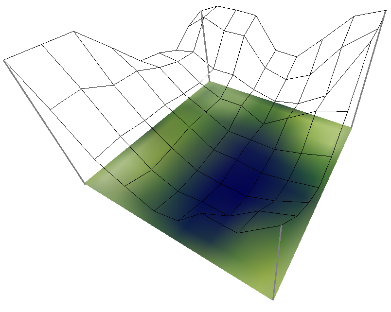
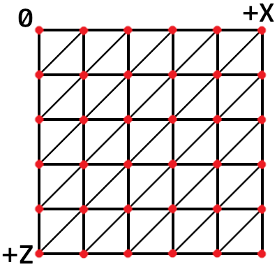
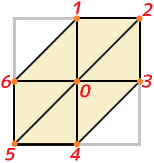
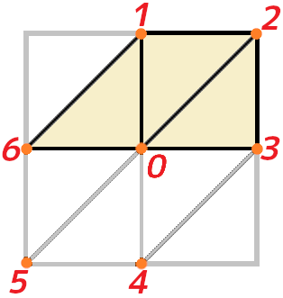
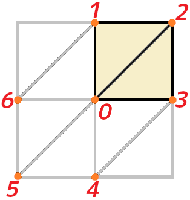
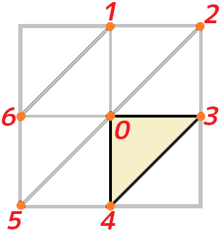
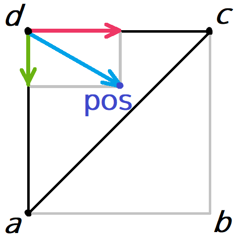
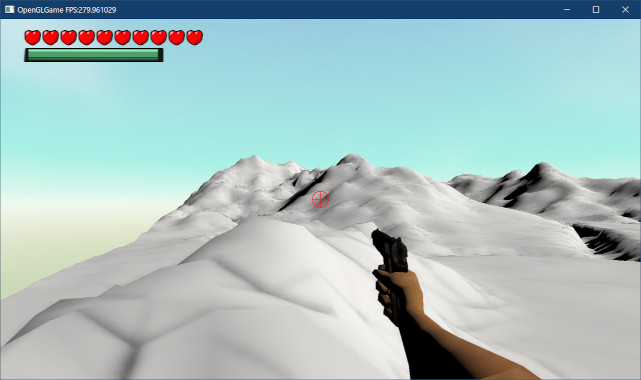
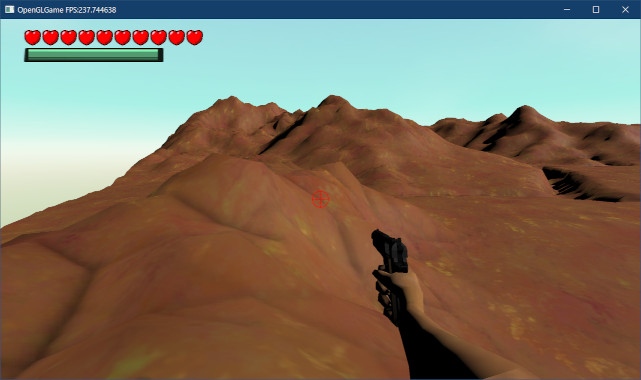
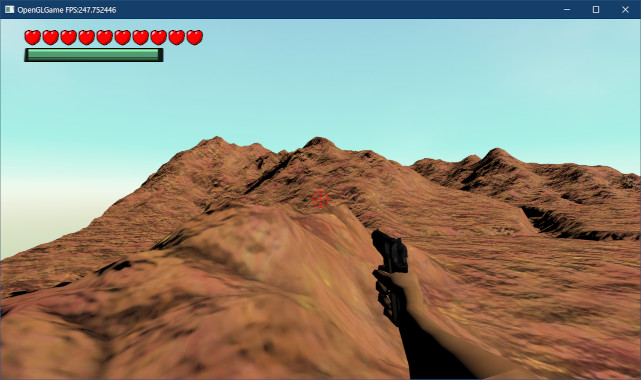

[OpenGL 3D 2024 前期 第07回]

# 複雑な地形の表示

## 習得目標

* 
* 
* 

## 1. 画像を高さデータに変換する

### 1.1 ハイトマップ

オープンワールドのような広大な世界を作るとき、愚直にモデリングしていてはいくら時間があっても足りません。そのうえ、データも巨大なものになってしまいます。
そこで、地形の標高を表すモノクロ画像から頂点データを作り出す手法が使われるようになりました。このような画像は、「ハイトマップ(height map)」と呼ばれます。

<p align="center">

</p>

ハイトマップによって節約できるデータ量を考えてみましょう。頂点データはＸ、Ｙ、Ｚの３つのfloat型からなり、float型は４バイトなので合計１２バイト必要です。対して、画像データの場合、Ｘ、Ｚ座標は画素の位置から自動的に決まるために不要であり、残りのＹだけが色データとして記録されます。そして、モノクロ画像の色データはわずか１バイトです。
つまり、頂点データを使った場合に比べて、画像データを使った場合は１／１２のデータ量で済んでしまうわけです。高さが256通りでは不足だという場合は２バイトで表すことになりますが、それでも頂点データの１／６です。

ハイトマップは画像データなので、あらゆるペイントツールを使って作成や変更ができます。例えば、PhotoShopやGIMPなどでは、「雲模様」、「ソリッドノイズ」といったフィルタを使うことで、簡単に複雑な地形を作り出すことが可能です。

Unityの場合、パッケージマネージャから`Terrain Tools`をインストールすると、`Terrain`オブジェクトをPNG形式でエクスポートできるようになります。

また、リアルな地形を自動的に作成してくれるツールも存在します。フリーバージョンが提供されているツールを以下に示します。

>* World Machine(ワールド・マシン): `https://www.world-machine.com/`
>* Terragen(テラ・ジェン): `https://planetside.co.uk/`
>* L3DT(エルスリー・ディーティー): `http://www.bundysoft.com/docs/doku.php?id=l3dt`

### 1.2 ハイトマップ用の画像を読み込めるようにする

ハイトマップには高さ情報しかないのでモノクロ画像が使われます。また、1ピクセル8bitでは256段階の高さしか表現できないため、1ピクセル16bitの画像形式が使われることも多いです。

ただ、TGA形式のモノクロ画像は8bitまでしか扱えません。そこで、16bit以上のモノクロ画像を扱えるDDS形式を利用することにします。

また、現在のDDSファイル読み込みプログラムでは、読み込んだ画像データを即座にGPUメモリにコピーしています。これだと、C++側から画像データを参照しにくいので、データ読み込みだけを行う関数を追加しましょう。

`dds.h`を開き、次のプログラムを追加してください。

```diff
 #ifndef DDS_H_INCLUDED
 #define DDS_H_INCLUDED
 #include "glad/glad.h"
+#include <vector>
+#include <memory>
 #include <cstdint>
+
+/**
+* 画像データ
+*/
+struct ImageData
+{
+  GLenum imageFormat = 0; // 画像ファイルのフォーマット
+  GLenum gpuFormat = 0;   // GPU側の画像フォーマット
+  uint32_t blockSize = 0; // 1ブロックのバイト数
+  uint32_t width = 0;     // レベル0の画像の幅
+  uint32_t height = 0;    // レベル0の画像の高さ
+  std::vector<std::unique_ptr<uint8_t[]>> images; // ミップマップ画像配列
+
+  // ミップマップ数を取得する
+  GLint GetMipmapCount() const { return static_cast<GLint>(images.size()); }
+};
+
+/**
+* DDSファイルを読み込む
+*
+* @param filename DDSファイル名
+* @param imageData 読み込んだデータの格納先
+*
+* @retval true  読み込み成功
+* @retval false 読み込み失敗
+*/
+bool LoadDDSData(const char* filename, ImageData& imageData);

 /**
 * DDSファイルからテクスチャを作成する
```

### 1.3 LoadDDS関数を分割する

次に、DDSファイルからテクスチャを作成する`LoadDDS`関数の定義を、「DDSファイルから画像データを読み込む」部分と「画像データからテクスチャを作成する」部分に分割します。

`dds.cpp`を開き、`LoadDDS`関数の定義を次のように変更してください。

```diff
   tmp.miscFlags2 = Get(buf + 16);
   return tmp;
 }

 } // unnamed namespace

 /**
-* DDSファイルからテクスチャを作成する
+* DDSファイルを読み込む
 */
-GLuint LoadDDS(const char* filename)
+bool LoadDDSData(const char* filename, ImageData& imageData)
 {
   // ファイルを開く
   std::ifstream ifs(filename, std::ios_base::binary);
```

続いて、この関数の中間にある「ピクセル形式を選択」するプログラムと「テクスチャを作成」するプログラムのあいだに、次のプログラムを追加してください。

```diff
   } else {
     LOG_ERROR("%sは圧縮DDSではありません", filename);
     return 0; // 作成失敗
   }
+
+  return true; // 読み込み成功
+}
+
+/**
+* DDSファイルからテクスチャを作成する
+*/
+GLuint LoadDDS(const char* filename)
+{
+  // ファイルから画像データを読み込む
+  ImageData imageData;
+  if (!LoadDDSData(filename, imageData)) {
+    return 0; // 作成失敗
+  }

   // テクスチャを作成してGPUメモリを確保
   GLuint tex;
   glCreateTextures(GL_TEXTURE_2D, 1, &tex);
```

これで、`LoadDDS`関数は2つの部分に分割されました。もちろん、単純に分割しただけなので多くのエラーが発生します。これらのエラーを少しずつ解決していきます。

### 1.4 LoadDDS関数のエラーに対処する

`LoadDDS`関数のほうがエラーが少ないようなので、こちらから片付けましょう。`LoadDDS`関数の定義を次のように変更してください。

```diff
   if (!LoadDDSData(filename, imageData)) {
     return 0; // 作成失敗
   }
+
+  const GLint mipmapCount = imageData.GetMipmapCount();

   // テクスチャを作成してGPUメモリを確保
   GLuint tex;
   glCreateTextures(GL_TEXTURE_2D, 1, &tex);
-  glTextureStorage2D(tex, header.mipmapCount, gpuFormat, header.width, header.height);
+  glTextureStorage2D(tex, mipmapCount,
+    imageData.gpuFormat, imageData.width, imageData.height);
-
-  // CPU側のメモリを確保
-  // DXT1=0.5バイト/ピクセル, DXT1以外=1バイト/ピクセル
-  auto p = std::make_unique<char[]>(header.width * header.height);

   // 画像を読み込む
   glBindTexture(GL_TEXTURE_2D, tex); // テクスチャをOpenGLコンテキストにバインド
-  uint32_t width = header.width;
-  uint32_t height = header.height;
-  for (uint32_t mipLevel = 0; mipLevel < header.mipmapCount; ++mipLevel) {
+  uint32_t width = imageData.width;
+  uint32_t height = imageData.height;
+  for (GLint mipLevel = 0; mipLevel < mipmapCount; ++mipLevel) {
     // 圧縮テクスチャのデータはブロック単位で記録されるので、
     // 縦横のブロック数からバイト数を計算する
     const uint32_t w = (width + 3) / 4;  // 横のブロック数
     const uint32_t h = (height + 3) / 4; // 縦のブロック数
-    const uint32_t imageBytes = w * h * blockSize; // 画像のバイト数
+    const uint32_t imageBytes = w * h * imageData.blockSize; // 画像のバイト数

-    // データを読み込んでテクスチャを作成
+    // データからテクスチャを作成
-    ifs.read(p.get(), imageBytes);
     glCompressedTexSubImage2D(GL_TEXTURE_2D, mipLevel,
-      0, 0, width, height, imageFormat, imageBytes, p.get());
+      0, 0, width, height, imageData.imageFormat, imageBytes,
+      imageData.images[mipLevel].get());


     // 次のミップマップのために縦横を1/2サイズにする
     width = std::max(1u, width / 2);
     height = std::max(1u, height / 2);
   }
   glBindTexture(GL_TEXTURE_2D, 0); // バインド解除

   // 最大ミップマップレベルを設定
-  glTextureParameteri(tex, GL_TEXTURE_MAX_LEVEL, header.mipmapCount - 1);
+  glTextureParameteri(tex, GL_TEXTURE_MAX_LEVEL, mipmapCount - 1);

   // 拡大縮小フィルタを設定
   // 縮小フィルタはミップマップを考慮して選択
-  if (header.mipmapCount > 1) {
+  if (mipmapCount > 1) {
     glTextureParameteri(tex, GL_TEXTURE_MIN_FILTER, GL_LINEAR_MIPMAP_NEAREST);
   } else {
     glTextureParameteri(tex, GL_TEXTURE_MIN_FILTER, GL_LINEAR);
   }
```

これで`LoadDDS`関数のエラーは無くなるはずです。

### 1.5 LoadDDSData関数の戻り値の型を合わせる

`LoadDDS`と`LoadDDSData`では戻り値の型が異なります。そこで、`LoadDDSData`の戻り型に合わせます。`LoadDDSData`関数の戻り値を次のように変更してください。

```diff
   // ファイルを開く
   std::ifstream ifs(filename, std::ios_base::binary);
   if ( ! ifs) {
     LOG_ERROR("%sを開けません", filename);
-    return 0; // 作成失敗
+    return false; // 読み込み失敗
   }

   // ファイルの先頭部分を読み込む
   char buf[128];
   ifs.read(buf, 128);
   if (buf[0] != 'D' || buf[1] != 'D' || buf[2] != 'S' || buf[3] != ' ') {
     LOG_ERROR("%sはDDSファイルではありません", filename);
-    return 0; // 作成失敗
+    return false; // 読み込み失敗
   }

   // DDSヘッダを取り出す
   const DDS_HEADER header = ReadDDSHeader(buf + 4);
   if (header.size != 124) {
     LOG_ERROR("%sは未対応のDDSファイルです", filename);
-    return 0; // 作成失敗
+    return false; // 読み込み失敗
   }
```

読み込み失敗を返すプログラムはもう一箇所あります。戻り値を次のように変更してください。

```diff
     gpuFormat = imageFormat;
   } else {
     LOG_ERROR("%sは圧縮DDSではありません", filename);
-    return false; // 作成失敗
+    return false; // 読み込み失敗
   }

   return true; // 読み込み成功
 }
```

### 1.6 画像データを読み込む

次に、画像データを読み込むプログラムを追加します。

```diff
     LOG_ERROR("%sは圧縮DDSではありません", filename);
     return false; // 読み込み失敗
   }
+
+  // 画像データを読み込む
+  imageData.images.resize(header.mipmapCount);
+  uint32_t width = header.width;
+  uint32_t height = header.height;
+  for (uint32_t mipLevel = 0; mipLevel < header.mipmapCount; ++mipLevel) {
+    // 圧縮テクスチャのデータはブロック単位で記録されるので、
+    // 縦横のブロック数からバイト数を計算する
+    const uint32_t w = (width + 3) / 4;  // 横のブロック数
+    const uint32_t h = (height + 3) / 4; // 縦のブロック数
+    const uint32_t imageBytes = w * h * blockSize; // 画像のバイト数
+
+    // データを読み込む
+    imageData.images[mipLevel] = std::make_unique<uint8_t[]>(imageBytes);
+    ifs.read(reinterpret_cast<char*>(imageData.images[mipLevel].get()), imageBytes);
+
+    // 次のミップマップのために縦横を1/2サイズにする
+    width = std::max(1u, width / 2);
+    height = std::max(1u, height / 2);
+  }
+
+  // 取得した情報をImageData構造体に設定
+  imageData.imageFormat = imageFormat;
+  imageData.gpuFormat = gpuFormat;
+  imageData.blockSize = blockSize;
+  imageData.width = header.width;
+  imageData.height = header.height;

   return true; // 読み込み成功
 }
```

これで、「DDSファイルから画像データを読み込む」部分と「画像データからテクスチャを作成する」部分に分離できました。

プログラムが書けたら、正しく分離できたことを確認するために、ビルドして実行してください。キューブマップなどのDDSファイルが正しく読み込めていたら成功です。

### 1.7 圧縮フラグを追加する

さて、C++から参照することを考えると、データが圧縮されて**いない**ほうが扱いやすいです。そこで、無圧縮モノクロ画像を読み込めるようにします。そして、圧縮データと無圧縮データでは、データの読み込み方が変わります。

そこで、`ImageData`構造体に圧縮の有無を判定するメンバ変数を追加します。名前は`isCompressed`(イズ・コンプレスド)とします。

`dds.h`を開き、`ImageData`構造体の定義に次のプログラムを追加してください。

```diff
   GLenum imageFormat = 0; // 画像ファイルのフォーマット
   GLenum gpuFormat = 0;   // GPU側の画像フォーマット
   uint32_t blockSize = 0; // 1ブロックのバイト数
+  bool isCompressed = false; // 圧縮の有無
   uint32_t width = 0;     // レベル0の画像の幅
   uint32_t height = 0;    // レベル0の画像の高さ
   std::vector<std::unique_ptr<uint8_t[]>> images; // ミップマップ画像配列
```

次に、圧縮画像かどうかを判定します。`dds.cpp`を開き、`LoadDDSData`関数の定義に次のプログラムを追加してください。

```diff
   // DDSピクセル形式に対応するOpenGLピクセル形式を選択
   GLenum imageFormat;      // 画像データのピクセル形式
   GLenum gpuFormat;        // GPU側のピクセル形式
   uint32_t blockSize = 16; // 1ブロックのバイト数
+  bool isCompressed = false; // 圧縮の有無
   if (header.ddspf.flags & DDPF_FOURCC) {
     // ピクセル形式がFourCCで定義されている場合
```

続いて、FourCCを判定するプログラムに、「圧縮あり」を設定するプログラムを追加してください。

```diff
       if (header.ddspf.fourCC == e.fourCC) {
         imageFormat = e.imageFormat;
         blockSize = e.blockSize;
+        isCompressed = true;
         supported = true;
         break;
       }
```

同様に、DX10追加データを判定するプログラムに、「圧縮あり」を設定するプログラムを追加してください。

```diff
         if (dx10header.dxgiFormat == e.dxgiFormat) {
           imageFormat = e.imageFormat;
           blockSize = e.blockSize;
+          isCompressed = true;
           supported = true;
           break;
         }
```

それから、関数の末尾にある「取得した情報をImageData構造体に設定」するプログラムに、次のプログラムを追加してください。

```diff
   // 取得した情報をImageData構造体に設定
   imageData.imageFormat = imageFormat;
   imageData.gpuFormat = gpuFormat;
+  imageData.isCompressed = isCompressed;
   imageData.blockSize = blockSize;
   imageData.width = header.width;
   imageData.height = header.height;
```

### 1.8 モノクロ画像を読み込めるようにする

それでは、本題であるモノクロ画像を読み込む機能を`LoadDDSData`関数に追加しましょう。まず、「DDSファイルがモノクロ画像かどうかを判定するための定数」を定義します。`dds.cpp`の先頭付近に次の定義を追加してください。

```diff
 constexpr GLenum GL_COMPRESSED_RGBA_S3TC_DXT1_EXT = 0x83F1;
 constexpr GLenum GL_COMPRESSED_RGBA_S3TC_DXT3_EXT = 0x83F2;
 constexpr GLenum GL_COMPRESSED_RGBA_S3TC_DXT5_EXT = 0x83F3;
+
+constexpr uint32_t DDSPF_RGB       = 0x0000'0040; // RGB成分がある
+constexpr uint32_t DDSPF_LUMINANCE = 0x0002'0000; // 輝度成分がある
+constexpr uint32_t DDSPF_ALPHA     = 0x0000'0002; // 透明度成分がある
+constexpr uint32_t DDSPF_FORMAT_MASK = 0x0002'0042; // RGB+輝度+透明度

 namespace {

 /**
 * バイト列から数値を復元する
```

名前の`DDSPF`の部分は`DDS Pixel Format`の短縮形です。無圧縮のモノクロ画像では、追加した定義のうち`DDSPF_LUMINANCE`(ディーディーエスピーエス・ルミナンス)だけがフラグに含まれます。

`DDSPF_FORMAT_MASK`は`DDSPF_RGB`, `DDSPF_LUMINANCE`, `DDSPF_ALPHA`を足した値になっています。

`flags`メンバ変数と`DDSPF_FORMAT_MASK`を論理和した結果が`DDSPF_LUMINACE`と一致したら、モノクロ画像と判定できます。FourCCを判定するプログラムの下に、次のプログラムを追加してください。

```diff
       LOG_ERROR("%sは未対応のDDSファイルです", filename);
       return false; // 読み込み失敗
     }

     // 圧縮テクスチャでは画像とGPUのピクセル形式を合わせる必要がある
     gpuFormat = imageFormat;
+  } else if ((header.ddspf.flags & DDSPF_LUMINANCE_ALPHA) == DDSPF_LUMINANCE) {
+    // 無圧縮の単色
+    if (header.ddspf.rgbBitCount == 8) {
+      // 8bitモノクロ画像
+      imageFormat = GL_R8;
+      gpuFormat = GL_RED;
+      blockSize = 1; // 1ピクセルのバイト数
+    } else if (header.ddspf.rgbBitCount == 16) {
+      // 16bitモノクロ画像
+      imageFormat = GL_R16;
+      gpuFormat = GL_RED;
+      blockSize = 2; // 1ピクセルのバイト数
+    } else {
+      LOG_ERROR("%sは未対応のDDSファイルです", filename);
+      return false; // 作成失敗
+    }
   } else {
     LOG_ERROR("%sは圧縮DDSではありません", filename);
     return false; // 作成失敗
```

`rgbBitCount`(アールジービー・ビット・カウント)メンバ変数には「1ピクセルのビット数」が記録されています。この数値を見れば、画像が8bit画像なのか16bit画像なのかを判別できます。

無圧縮データの場合、`blockSize`には「1ピクセルのバイト数」を格納しておきます。

これで必要な情報が得られたので、画像データの読み込みを無圧縮データに対応させます。画像データを読み込むプログラムを、次のように変更してください。

```diff
   // 画像データを読み込む
   imageData.images.resize(header.mipmapCount);
   uint32_t width = header.width;
   uint32_t height = header.height;
   for (uint32_t mipLevel = 0; mipLevel < header.mipmapCount; ++mipLevel) {
+    uint32_t imageBytes;
+    if (isCompressed) {
       // 圧縮テクスチャのデータはブロック単位で記録されるので、
       // 縦横のブロック数からバイト数を計算する
       const uint32_t w = (width + 3) / 4;  // 横のブロック数
       const uint32_t h = (height + 3) / 4; // 縦のブロック数
-      const uint32_t imageBytes = w * h * blockSize; // 画像のバイト数
+      imageBytes = w * h * blockSize; // 画像のバイト数
+    } else {
+      // 無圧縮テクスチャのデータは8バイト単位で記録される
+      const uint32_t w = ((width * blockSize + 7) / 8) * 8; // 横1ラインのバイト数
+      imageBytes = w * height; // 画像のバイト数
+    }
 
     // データを読み込む
     imageData.images[mipLevel] = std::make_unique<uint8_t[]>(imageBytes);
     ifs.read(reinterpret_cast<char*>(imageData.images[mipLevel].get()), imageBytes);
```

無圧縮データの記録単位は「ピクセル」です。ただし、横1ラインのバイト数は8バイトの倍数になります。

例えば、横30ドットの画像があり、1ピクセル16bitで表されるとすると、1ラインに必要なバイト数は`30*2=60`バイトになります。しかし、`60`は「8の倍数」ではないので、「8の倍数」に切り上げられます。

すると、1ラインに必要なバイト数は`64`バイトになります。「8の倍数」バイトに揃えるのは、それが「GPUにとってデータを効率的に扱える単位」だからです。

とにかく、これでモノクロ形式のDDSファイルを読み込めるようになりました。

>**【1章のまとめ】**
>
>* 
>* 
>* 

<div style="page-break-after: always"></div>

## 2. HeightMapクラスの定義

### 2.1 ハイトマップクラスを定義する

実際のゲームでは、データ量削減と処理負荷の軽減のために「テッセレーション」、「ジオメトリ・シェーダー」といった機能を使って、シェーダーの中でハイトマップから頂点データを生成します。

しかし、今回はC++のプログラムで頂点データを作成することにしました。理由は、まずハイトマップの基本的な仕組みを理解することが重要なためです。シェーダを使った描画は「基礎を理解したうえで応用として」学習する内容です。

それでは、ハイトマップを扱うクラスを作成しましょう。名前は`HeightMap`(ハイトマップ)とします。

プロジェクトの`Src/Engine`フォルダに、`HeightMap.h`という名前のヘッダファイルを追加してください。追加したファイルを開き、次のプログラムを追加してください。

```diff
+/**
+* @file HeightMap.h
+*/
+#ifndef HEIGHTMAP_H_INCLUDED
+#define HEIGHTMAP_H_INCLUDED
+#include "VecMath.h"
+#include <vector>
+#include <memory>
+
+// 先行宣言
+struct StaticMesh;
+using StaticMeshPtr = std::shared_ptr<StaticMesh>;
+class MeshBuffer;
+
+/**
+* 高さマップ
+*/
+class HeightMap
+{
+public:
+  // コンストラクタ・デストラクタ
+  HeightMap() = default;
+  ~HeightMap() = default;
+
+private:
+  size_t width = 0;           // 高さマップの幅
+  size_t height = 0;          // 高さマップの高さ
+  float heightScale = 1;      // 高さの拡大率
+  std::vector<float> heights; // 高さデータ
+  std::vector<vec3> normals;  // 法線データ
+};
+
+#endif //HEIGHTMAP_H_INCLUDED
```

### 2.2 Buildメンバ関数を定義する

`HeightMap`クラスには、以下の6つのパブリックメンバ関数を定義します。

>1. `Build`(ビルド): ハイトマップを作成
>2. `CreateMesh`(クリエイト・メッシュ): ハイトマップからメッシュを作成
>3. `GetHeight`(ゲット・ハイト): ある地点の高さを取得
>4. `GetNormal`(ゲット・ノーマル): ある地点の法線を取得
>5. `GetSize`(ゲット・サイズ): ハイトマップの大きさを取得
>6. `GetHeightScale`(ゲット・ハイト・スケール): ハイトマップの高さ方向の拡大率を取得
>7. `CalcNormal`(カルク・ノーマル): ハイトマップの法線を計算

それでは、番号順に作成、したいところですがしていきましょう。最初は`Build`(ビルド)メンバ関数です。`HeightMap`クラスの定義に次のプログラムを追加してください。

```diff
   // コンストラクタ・デストラクタ
   HeightMap() = default;
   ~HeightMap() = default;
+
+  /**
+  * 高さマップを作成する
+  *
+  * @param filename    高さ情報を記録したモノクロDDSファイル名
+  * @param heightScale 高さの範囲
+  *
+  * @retval true  作成成功
+  * @retval false 作成失敗
+  */
+  bool Build(const char* filename, float heightScale);

 private:
   size_t width = 0;           // 高さマップの幅
   size_t height = 0;          // 高さマップの高さ
```

次に、プロジェクトの`Src/Engine`フォルダに`HeightMap.cpp`という名前のCPPファイルを追加してください。追加したファイルを開き、次のプログラムを追加してください。

```diff
+/**
+* @file HeightMap.cpp
+*/
+#include "HeightMap.h"
+#include "Mesh.h"
+#include "dds.h"
+#include "Debug.h"
+#include <algorithm>
+
+/**
+* 高さマップを作成する
+*/
+bool HeightMap::Build(const char* filename, float heightScale)
+{
+  return true; // 作成成功
+}
```

`Build`メンバ関数では以下の処理によって「高さマップ」を作成します。

>1. 画像ファイルを読み込む
>2. 画像データを高さデータに変換
>3. 高さデータから法線を計算

最初に「画像ファイルを読み込み」ます。`Build`メンバ関数の定義に次のプログラムを追加してください。

```diff
 * 高さマップを作成する
 */
 bool HeightMap::Build(const char* filename, float heightScale)
 {
+  // 画像ファイルを読み込む
+  ImageData imageData;
+  if (!LoadDDSData(filename, imageData)) {
+    LOG_ERROR("%sを読み込めません", filename);
+    return false;
+  }
+
+  // 高さマップに使えない形式ならエラー
+  if (imageData.imageFormat != GL_R8 && imageData.imageFormat != GL_R16) {
+    LOG_ERROR("%sはモノクロ画像ではありません", filename);
+    return false;
+  }
+
+  // 画像の大きさを保存
+  width = imageData.width;
+  height = imageData.height;
+  this->heightScale = heightScale;
+
   return true; // 作成成功
 }
```

画像を読み込めなかったり、読み込めてもモノクロ画像ではない場合、エラーを返して作成を終了します。

次に、「画像データを高さデータに変換」します。画像の大きさを保存するプログラムの下に、次のプログラムを追加してください。

```diff
   // 画像の大きさを保存
   width = imageData.width;
   height = imageData.height;
   this->heightScale = heightScale;
+
+  // 「画像の濃淡」を「高さ」に変換
+  heights.resize(width * height);
+  const uint8_t* p = imageData.images[0].get(); // 画像データのアドレス
+  for (int z = 0; z < height; ++z) {
+    for (int x = 0; x < width; ++x) {
+      float h;
+      const size_t index = z * width + x;
+      if (imageData.imageFormat == GL_R8) {
+        // 8bitデータの場合
+        h = p[index];
+        h /= 255; // 0-255を0.0-1.0に変換
+      } else if (imageData.imageFormat == GL_R16) {
+        // 16bitデータの場合
+        h = p[index * 2];
+        h += p[index * 2 + 1] * 256;
+        h /= 65535; // 0-65535を0.0-1.0に変換
+      }
+      heights[index] = h * heightScale; // 拡大率を掛ける
+    } // for x
+  } // for z

   return true; // 作成成功
 }
```

画像の1ピクセルのバイト数によって、データの読み取り方を変えています。いずれの場合でも、最後には`0.0`～`heightScale`の範囲に変換しています。

続いて、高さデータから法線を計算します。高さデータは「メッシュの頂点に当たる位置のY座標」を表します。

メッシュのポリゴン配置は次のようになります。

<p align="center">

</p>

ある頂点の法線を求めるには、頂点に隣接する全ての面法線の平均を計算します。上記のメッシュの形状から、ある頂点に隣接する面の数は最大6個になります。端にある頂点の場合、隣接する面の数は少なくなります。

<p align="center">



<br>
[頂点に隣接する面数のバリエーション]
</p>

それでは、頂点の法線を計算しましょう。まず、マップ全体を処理するための2重`for`文を追加します。画像の濃淡を高さに変換するプログラムの下に、次のプログラムを追加してください。

```diff
       heights[index] = h * heightScale; // 拡大率を掛ける
     } // for x
   } // for z
+
+  // 頂点法線を計算
+  // 6&0-1
+  //  /|/|
+  // 5-*-2
+  // |/|/
+  // 4-3
+  static const int xOffsets[] = { 0, 1, 1, 0,-1,-1, 0 }; // 隣接頂点のX相対座標
+  static const int zOffsets[] = {-1,-1, 0, 1, 1, 0,-1 }; // 隣接頂点のZ相対座標
+  normals.resize(width * height);
+  for (int z = 0; z < height; ++z) {
+    for (int x = 0; x < width; ++x) {
+      // 頂点(x, z)の座標
+      const vec3 p0(static_cast<float>(x), heights[z * width + x], static_cast<float>(z));
+    } // for x
+  } // for z

   return true; // 作成成功
 }
```

次に、隣接する面法線の平均を求めます。頂点法線を計算する2重`for`文の中に、次のプログラムを追加してください。

```diff
   for (int z = 0; z < height; ++z) {
     for (int x = 0; x < width; ++x) {
       // 頂点(x, z)の座標
       const vec3 p0(static_cast<float>(x), heights[z * width + x], static_cast<float>(z));
+
+      // 頂点(x,z)を囲むポリゴンの面法線の平均値を、頂点(x, z)の法線とする
+      vec3 sum(0);
+      for (size_t i = 0; i < 6; ++i) {
+        const int x1 = x + xOffsets[i];
+        const int z1 = z + zOffsets[i];
+        if (x1 < 0 || x1 >= width || z1 < 0 || z1 >= height) {
+          continue; // 範囲外の座標は無視する
+        }
+
+        const int x2 = x + xOffsets[i + 1];
+        const int z2 = z + zOffsets[i + 1];
+        if (x2 < 0 || x2 >= width || z2 < 0 || z2 >= height) {
+          continue; // 範囲外の座標は無視する
+        }
+
+        // 中心以外の2点の座標を計算
+        const vec3 p1(static_cast<float>(x1), heights[z1 * width + x1], static_cast<float>(z1));
+        const vec3 p2(static_cast<float>(x2), heights[z2 * width + x2], static_cast<float>(z2));
+
+        // 2辺の外積から面法線を計算して加算
+        sum += normalize(cross(p2 - p0, p1 - p0));
+      } // for i
+
+      // 法線の平均を求める
+      normals[z* width + x] = normalize(sum);
     } // for x
   } // for z

   return true; // 作成成功
```

この`for`文は最大6回ループして、ポリゴンの面法線を`sum`変数に加算していきます。ポリゴンを構成する頂点がひとつでも範囲外にある場合、そのポリゴンは無視します。これにより、実際に隣接するポリゴンの面法線だけが合計されます。

面法線は外積によって求めます。すべての面法線を合計したら、`normalize`関数によって平均値を求めます。

法線の平均を求める場合、「ある程度同じ方向を向いている法線にしか使えない」ことに注意してください。例えば、真逆を向いている2つの法線の平均値は`(0, 0, 0)`となりますが、このベクトルは法線には使えません。

これで、画像データから高さマップを作成できるようになりました。

>外積の辺ベクトルを掛ける順序と垂直ベクトルの方向の関係は「右ねじの法則」になります。

### 2.3 CreateMeshメンバ関数を定義する

次に、「高さマップからスタティックメッシュを作成するメンバ関数」を定義します。`HeightMap.h`を開き、`Build`メンバ関数の宣言の下に、次のプログラムを追加してください。

```diff
   * @retval false 作成失敗
   */
   bool Build(const char* filename, float heightScale);
+
+  /**
+  * 高さマップからスタティックメッシュを作成する
+  *
+  * @param meshBuffer メッシュ作成に使うメッシュバッファオブジェクト
+  * @param meshName   作成したメッシュに付ける名前
+  * @param uvScale    テクスチャ座標の拡大率
+  *
+  * @return 作成したスタティックメッシュ
+  */
+  StaticMeshPtr CreateMesh(MeshBuffer& meshBuffer,
+    const char* meshName, float uvScale) const;

 private:
   size_t width = 0;           // 高さマップの幅
   size_t height = 0;          // 高さマップの高さ
```

続いて、`CreateMesh`メンバ関数の定義を作成します。`HeightMap.cpp`を開き、`Build`メンバ関数の定義の下に、次のプログラムを追加してください。

```diff
     } // for x
   } // for z

   return true; // 作成成功
 }
+
+/**
+* 高さマップからスタティックメッシュを作成する
+*/
+StaticMeshPtr HeightMap::CreateMesh(MeshBuffer& meshBuffer,
+  const char* meshName, float uvScale) const
+{
+  if (heights.empty()) {
+    LOG_WARNING("高さマップが作成されていません");
+    return nullptr;
+  }
+}
```

高さマップが作成されていない場合、スタティックメッシュも作成できないので`nullptr`を返します。

スタティックメッシュの作成は以下の手順で行います。

>1. 頂点データを作成
>2. インデックスデータを作成
>3. スタティックメッシュを作成
>4. 描画パラメータを作成

それでは、頂点データを作成するプログラムを追加しましょう。画像ファイルを読み込むプログラムの下に、次のプログラムを追加してください。

```diff
   if (heights.empty()) {
     LOG_WARNING("高さマップが作成されていません");
     return nullptr;
   }
+
+  // +X/+Z方向に頂点データを作成
+  std::vector<Vertex> vertices;
+  vertices.reserve(width * height);
+  for (int z = 0; z < height; ++z) {
+    for (int x = 0; x < width; ++x) {
+      const size_t index = z * width + x;
+      const Vertex v = {
+        vec3(static_cast<float>(x), heights[index], static_cast<float>(z)),
+        vec2(static_cast<float>(x), static_cast<float>(width - z)) * uvScale,
+        normals[index],
+        vec4(normalize(cross(vec3(1, 0, 0), v.normal)), 1) };
+      vertices.push_back(v);
+    } // for x
+  } // for z
 }
```

タンジェントベクトルは、`-Z`方向を向くように、右ベクトルと法線ベクトルの外積によって求めます。

> このプログラムでは、`1ピクセル = 1メートル`として頂点座標を計算しています。この比率を変更したい場合は、引数で拡大率を渡すなどの機能を追加してください。

続いて、インデックスデータを作成します。現在インデックスデータは16bitで作成しています。これは、ひとつのプリミティブとして扱える頂点数が`65536`個までに制限される、ということです。

このため、`256x256`より大きい高さマップは、ひとつのプリミティブとして作成できません。

個数制限を回避するには、「インデックスデータを32bitにする」、「スタティックメッシュを複数のプリミティブに分割してベース頂点番号を変更する」、という2つの方法があります。

インデックスデータを32bitにするほうが簡単ですが、データ量が2倍になってしまいます。データ量が増えると描画速度も低下するため、できればやりたくありません。

そこで、もうひとつの「複数のプリミティブに分割してベース頂点番号を変更する」方法を使うことにします。

先のプログラムで頂点データを作成するとき、横x縦の順番でメモリに格納しました。そこで、縦32行ごとにベース頂点番号を変えることにします。

プリミティブは32x32頂点単位で作成します。これは、将来、「画面に描画されない領域をプリミティブ単位で非表示にする機能」を作れるようにするためです。

それでは、頂点データを作成するプログラムの下に、次のプログラムを追加してください。

```diff
         vec4(normalize(cross(vec3(1, 0, 0), v.normal)), 1) };
       vertices.push_back(v);
     } // for x
   } // for z
+
+  // 32x32グリッド単位(2048ポリゴン)でインデックスデータを作成
+  size_t unitCount = 0; // 作成したデータ数(32x32単位を1個とする)
+  std::vector<uint16_t> indices;
+  indices.reserve(width * height);
+  for (int blockZ = 0; blockZ < height; blockZ += 32) {
+    // 縦のグリッド数を計算
+    const int sizeZ = std::min(32, static_cast<int>(height - 1) - blockZ);
+    if (sizeZ <= 0) {
+      continue;
+    }
+
+    for (int blockX = 0; blockX < width; blockX += 32) {
+      // 横のグリッド数を計算
+      const int sizeX = std::min(32, static_cast<int>(width - 1) - blockX);
+      if (sizeX <= 0) {
+        continue;
+      }
+
+      // インデックスデータを作成
+      for (int z = 0; z < sizeZ; ++z) {
+        for (int x = blockX; x < blockX + sizeX; ++x) {
+          // d-c
+          // |/|
+          // a-b
+          const uint16_t a = static_cast<uint16_t>((z + 1) * width + x);
+          const uint16_t b = static_cast<uint16_t>((z + 1) * width + (x + 1));
+          const uint16_t c = static_cast<uint16_t>(z * width + (x + 1));
+          const uint16_t d = static_cast<uint16_t>(z * width + x);
+
+          // 右下の三角形のインデックスデータ
+          indices.push_back(a);
+          indices.push_back(b);
+          indices.push_back(c);
+
+          // 左上の三角形のインデックスデータ
+          indices.push_back(c);
+          indices.push_back(d);
+          indices.push_back(a);
+        }
+      }
+      ++unitCount;
+    } // for blockX
+  } // for blockZ
 }
```

グリッド(マス目)の数は通常`32x32`で、これを1ブロックとしてインデックスデータを作成します。ただし、右端や下端では`32`を下回る場合があります。変数`sizeX`と`sizeZ`は実際に作成するグリッド数を表します。

例えば、画像サイズが`100x100`の場合、右端のブロックは`4x32`、下端のブロックは`32x4`、右下端のブロックは`4x4`になります。

頂点データ配列にはブロック単位の区切りはなく、全てが連続で配置されています。そのため、ある行のインデックスは

&emsp;`行インデックス = 頂点のZ座標 * 画像の幅(width) + 頂点のX座標`

になります。

これで、頂点データ配列とインデックスデータ配列が用意できました。次はこの2つの配列からスタティックメッシュを作成します。

インデックスデータを作成するプログラムの下に、次のプログラムを追加してください。

```diff
       ++unitCount;
     } // for blockX
   } // for blockZ
+
+  // 頂点データとインデックスデータからメッシュを作成
+  meshBuffer.AddVertexData(vertices.data(), vertices.size() * sizeof(Vertex),
+    indices.data(), indices.size() * sizeof(uint16_t));
+  const DrawParams baseDrawParams =
+    meshBuffer.GetDrawParams(meshBuffer.GetDrawParamsCount() - 1);
+  StaticMeshPtr p = meshBuffer.CreateStaticMesh(meshName, baseDrawParams, nullptr);
 }
```

メッシュの作成は`AddVertexData`, `GetDrawParams`, `CreateStaticMesh`の3つの関数を順番に呼び出すだけで、これまでと特に変わりません。

ただし、`AddVertexData`メンバ関数で作成される描画パラメータはひとつだけで、まだプリミティブを分割できていません。

そこで、最後にプリミティブを分割していきます。スタティックメッシュを作成するプログラムの下に、次のプログラムを追加してください。

```diff
   const DrawParams baseDrawParams =
     meshBuffer.GetDrawParams(meshBuffer.GetDrawParamsCount() - 1);
   StaticMeshPtr p = meshBuffer.CreateStaticMesh(meshName, baseDrawParams, nullptr);
+
+  // 32x32単位で描画パラメータを作成しなおす
+  p->drawParamsList.clear();
+  p->drawParamsList.reserve(unitCount);
+  intptr_t baseIndices = reinterpret_cast<intptr_t>(baseDrawParams.indices);
+  for (int blockZ = 0; blockZ < height; blockZ += 32) {
+    // 縦のグリッド数を計算
+    const int sizeZ = std::min(32, static_cast<int>(height - 1) - blockZ);
+    if (sizeZ <= 0) {
+      continue;
+    }
+
+    for (int blockX = 0; blockX < width; blockX += 32) {
+      // 横のグリッド数を計算
+      const int sizeX = std::min(32, static_cast<int>(width - 1) - blockX);
+      if (sizeX <= 0) {
+        continue;
+      }
+
+      // 描画パラメータを作成し、リストに追加
+      DrawParams drawParams;
+      drawParams.count = sizeX * sizeZ * 6; // 6 = 3頂点x2ポリゴン
+      drawParams.indices = reinterpret_cast<void*>(baseIndices);
+      drawParams.baseVertex =
+        baseDrawParams.baseVertex + static_cast<GLint>(blockZ * width);
+      drawParams.materialNo = 0;
+      p->drawParamsList.push_back(drawParams);
+
+      // インデックスデータの位置を更新
+      baseIndices += drawParams.count * sizeof(uint16_t);
+    } // for blockX
+  } // for blockZ
+
+  return p; // 作成したスタティックメッシュを返す
 }
```

インデックスデータは32x32グリッド単位で作成したので、`indices`に設定する値も32x32グリッド単位で更新します。

頂点データは連続したデータなので、`baseVertex`二設定する値は`32 * width`単位で更新します。

これで、高さマップからスタティックメッシュを作成できるようになりました。

>**【作成できるサイズについて】**<br>
>32行目の頂点からポリゴンを作成するには下に追加の1行が必要です。つまり、ベース頂点番号の切り替えは32行ごとに行いますが、`65536`個の制限は33行分の頂点に対して課されるわけです。そうすると、横方向に使える頂点数は次のようになります。
>
>&emsp;`65536 / 33 = 1985.9393...`
>
>この計算から、32行ごとにベース頂点番号を切り替える場合、横方向に最大`1985`個の頂点を配置できることが分かります。縦方向の制限はありません。<br>
>なお、市販ゲームやゲームエンジンでは、シェーダを使って「描画される範囲の地形だけを毎フレーム生成する」などの、より効率的な描画方法が使われています。

### 2.4 GetHeightメンバ関数を定義する

次に、「指定された座標の高さ」を取得するメンバ関数を作成します。`HeightMap.h`を開き、`CreateMesh`メンバ関数の宣言の下に、次のプログラムを追加してください。

```diff
   * @return 作成したスタティックメッシュ
   */
   StaticMeshPtr CreateMesh(MeshBuffer& meshBuffer,
     const char* meshName, float uvScale = 1) const;
+
+  /**
+  * 指定された座標の高さを取得する
+  *
+  * @param pos 高さを取得する座標
+  * @param pNormal 座標posの法線を格納するアドレス
+  *
+  * @return 座標posの高さ
+  */
+  float GetHeight(const vec3& pos, vec3* pNormal = nullptr) const;

 private:
   size_t width = 0;           // 高さマップの幅
   size_t height = 0;          // 高さマップの高さ
```

続いて`HeightMap.cpp`を開き、`CreateMesh`メンバ関数の定義の下に、次のプログラムを追加してください。

```diff
     } // for blockX
   } // for blockZ

   return p; // 作成したスタティックメッシュを返す
 }
+
+/**
+* 指定された座標の高さを取得する
+*/
+float HeightMap::GetHeight(const vec3& pos, vec3* pNormal) const
+{
+  // 座標が高さマップの範囲内に収まるように切り上げ、または切り捨てる
+  const float fx = std::clamp(pos.x, 0.0f, static_cast<float>(width - 1));
+  const float fz = std::clamp(pos.z, 0.0f, static_cast<float>(height - 1));
+
+  // fposが含まれるグリッドを計算
+  // 高さマップはグリッドの各頂点を表すので、グリッド数は高さマップより1小さくなる
+  const size_t x = std::min(static_cast<size_t>(fx), width - 2);
+  const size_t z = std::min(static_cast<size_t>(fz), height - 2);
+
+  // 左上頂点からの相対座標を計算
+  const float offsetX = fx - static_cast<float>(x);
+  const float offsetZ = fz - static_cast<float>(z);
+
+  // グリッドを1x1m、相対座標を(x,z)とすると、対角線の相対座標はx+z=1になる
+  // x+z<1ならばposは左上の三角形の中、x+z>=1ならばposは右下の三角形の中にある
+  //
+  // d(0,0)-c(1,0)
+  //    |    /|
+  //    |  /  |
+  //    |/    |
+  // a(0,1)-b(1,1)
+  //
+  if (offsetX + offsetZ < 1) {
+  } else {
+  } // if offsetX + offsetZ < 1
+}
```

この関数が最初に行うのは、指定された座標がどのグリッド(マス目)の中にあるかを調べることです。グリッドが1x1の場合、これは小数部を切り捨てることで簡単に求められます。

さらに、グリッドは2つのポリゴンから構成されます。そこで、座標がどちらのポリゴンに含まれるかを調べます。この判定には、座標の小数部を使います。

小数部だけを取り出すと、それは「グリッドの左上頂点からの相対座標」になります。この相対座標を`(x,z)`とすると、2つのポリゴンを分割する対角線は

$$ x+y=1 $$

で表すことができます。このとき、

$$ x + y < 1 $$

ならば、座標`pos`は左上の三角形の中にあります。

$$ x + y >= 1 $$

ならば、座標`pos`は右下の三角形の中にあります。

これで座標`pos`がどの三角形に含まれるかが判明したので、高さを求めます。ある座標の高さは、「X軸方向の高さ」と「Z軸方向の高さ」を個別に求め、それらを加算することで求められます。

<p align="center">

</p>

ある軸方向の高さは、軸の両端の高さを線形補間することで求められます。座標`pos`がどちら三角形に含まれるかを判定する`if`文に、次のプログラムを追加してください。

```diff
   //    |/    |
   // a(0,1)-b(1,1)
   //
   if (offsetX + offsetZ < 1) {
+    // 頂点インデックスを計算
+    const size_t d = z * width + x;
+    const size_t c = z * width + (x + 1);
+    const size_t a = (z + 1) * width + x;
+
+    // 線形補間で高さを計算
+    const float h0 = heights[d];
+    const float hx = (heights[c] - h0) * offsetX;
+    const float hz = (heights[a] - h0) * offsetZ;
+    return h0 + hx + hz;
   } else {
+    // 頂点インデックスを計算
+    const size_t b = (z + 1) * width + (x + 1);
+    const size_t a = (z + 1) * width + x;
+    const size_t c = z * width + (x + 1);
+
+    // 線形補間で高さを計算
+    const float h0 = heights[b];
+    const float hx = (heights[a] - h0) * (1 - offsetX);
+    const float hz = (heights[c] - h0) * (1 - offsetZ);
+    return h0 + hx + hz;
   } // if offsetX + offsetZ < 1
 }
```

同じ方法で、座標`pos`の法線を求めます。座標`pos`がどちら三角形に含まれるかを判定する`if`文に、次のプログラムを追加してください。

```diff
   if (offsetX + offsetZ < 1) {
     // 頂点インデックスを計算
     const size_t d = z * width + x;
     const size_t c = z * width + (x + 1);
     const size_t a = (z + 1) * width + x;
+
+    // 法線を計算
+    if (pNormal) {
+      const vec3& n0 = normals[d];
+      const vec3 nx = (normals[c] - n0) * offsetX;
+      const vec3 nz = (normals[a] - n0) * offsetZ;
+      *pNormal = normalize(n0 + nx + nz);
+    }

     // 線形補間で高さを計算
     const float h0 = heights[d];
     const float hx = (heights[c] - h0) * offsetX;
     const float hz = (heights[a] - h0) * offsetZ;
     return h0 + hx + hz;
   } else {
     // 頂点インデックスを計算
     const size_t b = (z + 1) * width + (x + 1);
     const size_t a = (z + 1) * width + x;
     const size_t c = z * width + (x + 1);
+
+    // 法線を計算
+    if (pNormal) {
+      const vec3& n0 = normals[b];
+      const vec3 nx = (normals[a] - n0) * (1 - offsetX);
+      const vec3 nz = (normals[c] - n0) * (1 - offsetZ);
+      *pNormal = normalize(n0 + nx + nz);
+    }

     // 線形補間で高さを計算
     const float h0 = heights[b];
     const float hx = (heights[a] - h0) * (1 - offsetX);
     const float hz = (heights[c] - h0) * (1 - offsetZ);
     return h0 + hx + hz;
   } // if offsetX + offsetZ < 1
```

これで、指定された座標の高さと法線を求められるようになりました。

### 2.5 GetSizeメンバ関数を定義する

次に、高さマップの大きさを取得する関数を定義します。`HeightMap.h`を開き、`GetHeight`メンバ関数の宣言の下に、次のプログラムを追加してください。

```diff
   * @return 座標posの高さ
   */
   float GetHeight(const vec3& pos, vec3* pNormal = nullptr) const;
+
+  /**
+  * 高さマップの大きさを取得する
+  *
+  * @return 高さマップの縦と横の大きさ
+  */
+  vec2 GetSize() const
+  {
+    return { static_cast<float>(width), static_cast<float>(height) };
+  }

 private:
   size_t width = 0;           // 高さマップの幅
   size_t height = 0;          // 高さマップの高さ
```

戻り型を`vec2`にしたのには以下の2つの理由があります。

* 整数で返すと、浮動小数点数の座標と比較するときにキャストが必要になる。
* 幅と高さのどちらかだけが必要になることは少ないので一度に返したいが、この用途に使える適切な型が`vec2`くらいだった。

### 2.6 GetHeightScaleメンバ関数を定義する

最後に、高さ方向の拡大率を取得する関数を定義します。`GetSize`メンバ関数の定義の下に、次のプログラムを追加してください。

```diff
   vec2 GetSize() const
   {
     return { static_cast<float>(width), static_cast<float>(height) };
   }
+
+  /**
+  * 高さ方向の拡大率を取得する
+  *
+  * @return Y方向の拡大率
+  */
+  float GetHeightScale() const { return heightScale; }
+
 private:
   size_t width = 0;           // 高さマップの幅
   size_t height = 0;          // 高さマップの高さ
```

これで、`HeightMap`クラスは完成です。

### 2.7 ゲームエンジンにHeightMapを組み込む

完成した`HeightMap`をゲームエンジンに組み込みましょう。`Engine.h`を開き、`HeightMap`の先行宣言を追加してください。

```diff
 // 先行宣言
 class FramebufferObject;
 using FramebufferObjectPtr = std::shared_ptr<FramebufferObject>;
 class ProgramObject;
 using ProgramObjectPtr = std::shared_ptr<ProgramObject>;
+class HeightMap;
+using HeightMapPtr = std::shared_ptr<HeightMap>;

 // SSBOのバインディングポイント番号
 constexpr GLuint bpJointMatrices = 0; // 関節行列
```

次に、`Engine`クラスの定義に次のプログラムを追加してください。

```diff
   // スカイスフィア
   StaticMeshPtr skySphere;

   // カメラオブジェクト
   GameObject camera;
+
+  // 高さマップ
+  HeightMapPtr heightMap;
 };

 #endif // ENGINE_H_INCLUDED
```

```diff
   GameObjectList LoadGameObjectMap(const char* filename, const FilepathMap&);

   // すべてのゲームオブジェクトを削除する
   void ClearGameObjectAll();
+
+  /**
+  * 高さマップを読み込んでスタティックメッシュを作成
+  *
+  * @param filename  高さ情報を記録したモノクロのDDSファイル名
+  * @param heightScale 高さの範囲
+  * @param uvScale    テクスチャ座標の拡大率
+  *
+  * @return 作成したスタティックメッシュ
+  */
+  StaticMeshPtr LoadHeightMap(
+    const char* filename, float heightScale, float uvScale);
+
+  /**
+  * 高さマップを取得
+  *
+  * @retval nullptr 高さマップが読み込まれていない
+  * @retval nullptr以外 高さマップ
+  */
+  HeightMapPtr GetHeightMap() const { return heightMap; }
+
+  /**
+  * 高さマップを削除
+  */
+  void ClearHeightMap() { heightMap.reset(); }

   /**
   * FBXファイルを読み込む
   *
   * @param filename FBXファイル名
```

次に、`Engine.cpp`を開き、`HeightMap.h`をインクルードしてください。

```diff
 #include "ProgramObject.h"
 #include "SkeletalMeshRenderer.h"
 #include "MeshSetRenderer.h"
+#include "HeightMap.h"
 #include "EasyAudio/EasyAudio.h"
 #include "SphereCollider.h"
```

そして、`ClearGameObjectAll`メンバ関数の定義の下に、次のプログラムを追加してください。

```diff
   for (auto& e : gameObjects) {
     e->OnDestroy();
   }
   gameObjects.clear();
 }
+
+/**
+* 高さマップを読み込む
+*/
+StaticMeshPtr Engine::LoadHeightMap(
+  const char* filename, float heightScale, float uvScale)
+{
+  if (!heightMap) {
+    heightMap = std::make_shared<HeightMap>();
+  }
+  heightMap->Build(filename, heightScale);
+  return heightMap->CreateMesh(*meshBuffer, "Terrain", uvScale);
+}

 /**
 * 垂直視野角を設定する
```

`LoadHeightMap`(ロード・ハイトマップ)メンバ関数は`Build`と`CreateMesh`の両方を実行します。

これで、ゲームエンジンから高さマップを作成できるようになりました。

### 2.8 高さマップの動作を確認する

適当な画像ファイルで高さマップの動作確認を行いましょう。必要なのは以下の4項目です。

>1. 高さマップ用の画像ファイルを準備する。
>2. キャラクターが高さマップの上に立てるようにする。
>3. 動作確認用のシーンを作成する。
>4. 動作確認用のシーンをタイトル画面から呼び出す。

以下のURLにテスト用の画像ファイルを用意しました。プロジェクトの`Res`フォルダの中に`Terrain`フォルダを作成し、以下のファイルをダウンロードして保存してください。

>`github.com/tn-mai/OpenGL3D2023/res/terrain/test_heightmap.dds`
>`github.com/tn-mai/OpenGL3D2023/res/terrain/terrain_rock.dds`
>`github.com/tn-mai/OpenGL3D2023/res/terrain/terrain_rock_normal.dds`

次に、キャラクターが高さマップの上に立てるようにします。`CharacterController.h`を開き、`HeightMap.h`をインクルードしてください。

```diff
 #define CHARACTERMOVEMENT_H_INCLUDED
 #include "Component.h"
 #include "GameObject.h"
 #include "Engine.h"
+#include "HeightMap.h"

 /**
 * ゲームオブジェクトの速度や重力を制御するコンポーネント
```

それでは、高さマップの接地判定を追加しましょう。今回は簡易的な交差判定として、ゲームオブジェクトのY座標と高さマップから取得したY座標を比較します。

`Update`メンバ関数の定義に、次のプログラムを追加してください。

```diff
   // 毎フレーム1回呼び出される
   virtual void Update(float deltaTime) override
   {
     auto owner = GetOwner();
+
+    // 高さマップの接地判定
+    Engine* engine = owner->GetEngine();
+    const auto& heightMap = engine->GetHeightMap();
+    if (heightMap) {
+      // Y軸方向の地面の高さを取得
+      vec3 terrainNormal;
+      const float terrainHeight =
+        heightMap->GetHeight(owner->position, &terrainNormal);
+
+      // ゲームオブジェクトのY座標が地面のY座標以下の場合、地面に触れているとみなす
+      if (owner->position.y <= terrainHeight) {
+        // ゲームオブジェクトのY座標を地面の高さに合わせる
+        owner->position.y = terrainHeight;
+        owner->isGrounded = true; // 接地状態にする
+      } else if (owner->countOfkeepingGrounded <= 0 && owner->isGrounded) {
+        // 他のコライダーに触れていない場合は空中判定にする
+        owner->isGrounded = false;
+      }
+    } // if heightMap

     if (owner->isGrounded) {
       // 接地フラグが立っていたら、下方向への加速度を0にする
       velocity.y = std::max(velocity.y, 0.0f);
```

次に、動作確認用の新しいシーンクラスを作成します。名前は`HeightMapScene`(ハイトマップ・シーン)とします。

プロジェクトの`Src`フォルダに`HeightMapScene.h`という名前のヘッダファイルを追加してください。追加したファイルを開き、次のプログラムを追加してください。

```diff
+/**
+* @file HeightMapScene.h
+*/
+#ifndef HEIGHTMAPSCENE_H_INCLUDED
+#define HEIGHTMAPSCENE_H_INCLUDED
+#include "Engine/Scene.h"
+#include <functional>
+
+// 先行宣言
+class PlayerComponent;
+
+/**
+* 高さマップの動作確認用シーン
+*/
+class HeightMapScene : public Scene
+{
+public:
+  HeightMapScene() = default;
+  virtual ~HeightMapScene() = default;
+  virtual bool Initialize(Engine& engine) override;
+  virtual void Update(Engine& engine, float deltaTime) override {}
+  virtual void Finalize(Engine& engine) override {}
+
+private:
+  std::shared_ptr<PlayerComponent> playerComponent;
+};
+
+#endif // HEIGHTMAPSCENE_H_INCLUDED
```

次に、プロジェクトの`Src`フォルダに`HeightMapScene.cpp`という名前のCPPファイルを追加してください。追加したファイルを開き、次のプログラムを追加してください。

```diff
+/**
+* @file HeightMapScene.cpp
+*/
+#include "HeightMapScene.h"
+#include "PlayerComponent.h"
+
+/**
+* シーンの初期化
+*/
+bool HeightMapScene::Initialize(Engine& engine)
+{
+  // スカイスフィアを設定
+  skysphereMaterial = std::make_shared<Material>();
+  skysphereMaterial->texBaseColor = engine.GetTexture("Res/MeshData/sky_sphere/sky.tga");
+
+  // プレイヤーを配置
+  auto player = engine.Create<GameObject>("player", { 10, 10, 10 });
+  playerComponent = player->AddComponent<PlayerComponent>();
+  player->rotation.y = -1.57f; // +X方向に向ける
+
+  // ハイトマップを作成
+  auto terrain = engine.Create<GameObject>("terrain");
+  terrain->staticMesh = engine.LoadHeightMap("Res/Terrain/test_heightmap.dds", 20, 1);
+  if (terrain->staticMesh) {
+    auto& m = terrain->staticMesh->materials[0];
+    m->texBaseColor = engine.GetTexture("Res/white.tga");
+    m->baseColor = { 0.6f, 0.6f, 0.6f, 1.0f };
+  }
+
+  return true;
+}
```

今はこれで十分です。それでは、タイトル画面から`HeightMapScene`を呼び出しましょう。`TitleScene.cpp`を開き、`HeightMapScene.h`をインクルードしてください。

```diff
 #include "TitleScene.h"
 #include "ExplorationScene.h"
 #include "MainGameScene.h"
+#include "HeightMapScene.h"
 #include "Engine/UILayout.h"
 #include "Engine/UIButton.h"
```

次に、`Update`メンバ関数の定義にあるシーンを切り替えるプログラムを、次のように変更してください。

```diff
     fadeObject->color[3] = 1 - fadeTimer;

     // タイマーが0以下になったらメインゲームシーンに切り替える
     if (fadeTimer <= 0) {
-      engine.SetNextScene<ExplorationScene>();
+      engine.SetNextScene<HeightMapScene>();
     }
   } // if fadeTimer
```

プログラムが書けたらビルドして実行してください。白い地面が表示され、キャラクターを地面に沿って移動できたら成功です。

<p align="center">

</p>

### 2.9 テクスチャを貼る

灰色の地形では味気ないのでテクスチャを貼りましょう。`HeightMapScene.cpp`を開き、ハイトマップを作成するプログラムを次のように変更してください。

```diff
   // ハイトマップを作成
   auto terrain = engine.Create<GameObject>("terrain");
   terrain->staticMesh = engine.LoadHeightMap("Res/Terrain/test_heightmap.dds", 20, 1);
   if (terrain->staticMesh) {
     auto& m = terrain->staticMesh->materials[0];
-    m->texBaseColor = engine.GetTexture("Res/white.tga");
-    m->baseColor = { 0.6f, 0.6f, 0.6f, 1.0f };
+    m->texBaseColor = engine.GetTexture("Res/terrain/terrain_rock.dds");
   }

   return true;
```

プログラムが書けたらビルドして実行してください。地面に茶色いテクスチャが貼られていたら成功です。

<p align="center">

</p>

次は法線マップを追加しましょう。ハイトマップを作成するプログラムに、次のプログラムを追加してください。

```diff
   terrain->staticMesh = engine.LoadHeightMap("Res/Terrain/test_heightmap.dds", 20, 1);
   if (terrain->staticMesh) {
     auto& m = terrain->staticMesh->materials[0];
     m->texBaseColor = engine.GetTexture("Res/terrain/terrain_rock.dds");
+    m->texNormal = engine.GetTexture("Res/terrain/terrain_rock_normal.dds");
   }

   return true;
```

プログラムが書けたらビルドして実行してください。地面に詳細な陰影が追加されて、ポリゴンが目立たなくなっていたら成功です。

<p align="center">

</p>

<pre class="tnmai_assignment">
<strong>【課題01】</strong>
ハイトマップ用の画層ファイルを作成し、<code>HeightMapScene</code>クラスで読み込んで表示しなさい。
Unityでハイトマップを作成する場合、Google Mapなどで住んでいる地域の地図を表示して、それを再現してみるのがよいでしょう。
</pre>

>**【2章のまとめ】**
>
>* 
>* 
>* 
