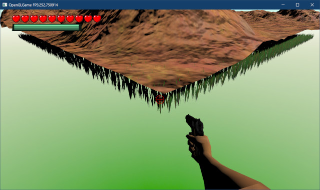
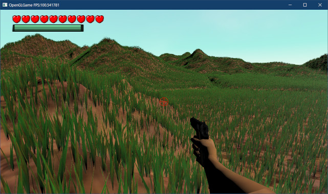
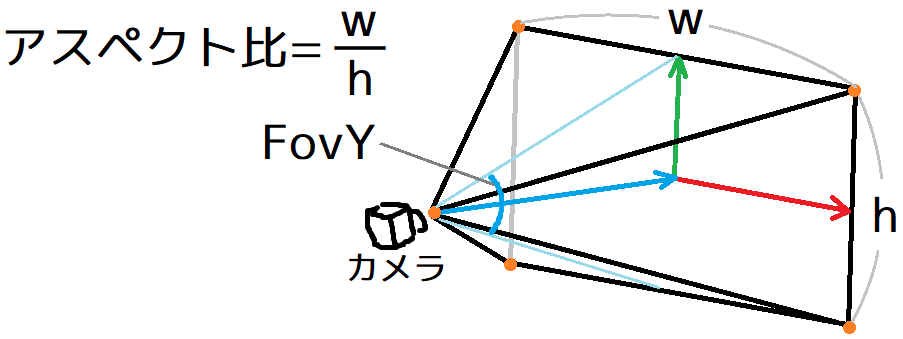
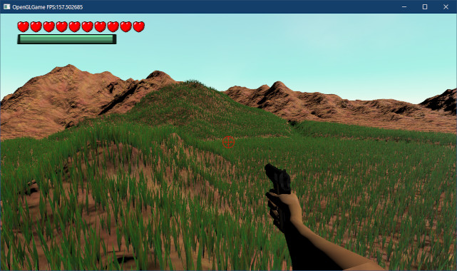
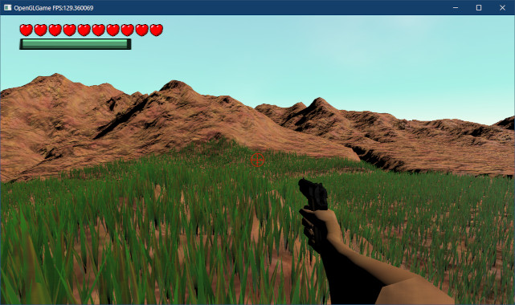

[OpenGL 3D 2024 前期 第08回]

# 地面に草を植える

## 習得目標

* 
* 
* 

## 1. インスタンシングによる草の描画

### 1.1 インスタンシングについて

現代のGPUには、効率よくポリゴンを描画するために大量のパラメータが存在します。これらのパラメータは、`glDrawElements`のような描画関数を呼び出すたびに初期化されます。

この初期化は描画を実行するたびに行われます。そのため、100万ポリゴンのメッシュを1個描画する場合は1回初期化するだけですが、1万ポリゴンのメッシュを100個描画する場合は100回の初期化が必要になります。

初期化にはある程度の時間がかかるため、初期化回数が多いと、それだけ本来の描画に使える時間が減ってしまいます。

初期化時間の問題があるため、現代のGPUは、一度に大量のポリゴンを描画することは得意ですが、そこそこの数のポリゴンを何回かに分けて描画するのは苦手です。

初期化時間を増やさない方法はいくつかあります。ひとつは、1万ポリゴンのメッシュ100個を、100万ポリゴンのメッシュ1個にまとめることです。

しかしこの方法は、初期化時間を減らす代わりに、データサイズが100倍になってしまいます。

もうひとつの方法では「インスタンシング」という機能を使います。インスタンシングを使うと、ひとつの描画関数で、同じメッシュを指定した回数だけ描画することができます。

GPUは同じメッシュを何度も描画することが分かっているため、新しいメッシュを描画するたびに最小限の初期化だけを行うことができます。

インスタンシングを使うことで、データサイズは同じままで、しかも初期化時間をほとんど増やすことなく、たくさんの数のメッシュを描画することができます。

>**【インスタンス？】**<br>
>インスタンシングとは「何か元になるデータやクラスがあって、それを元にして実際に使用したり表示したりする実体を作り出す」ことです。こうして作られた個々の実体のことを「インスタンス」といいます。
>「インスタンス」は「実例、事例、出来事」という意味の英単語です。語源は「イン + スタンス」で、「～の上に立つ、～の<ruby>傍<rt>かたわ</rt></ruby>らに立つ」というイメージを持っています。コンピューター関係の文書では「実体」と訳されることが多いです。

### 1.2 草シェーダを追加する

インスタンシングを使うと、大量のメッシュを効率よく描画できます。このとき、すべてのメッシュで描画前に設定したユニフォーム変数が使われます。

そのため、なにか工夫をしないと「同じ場所に大量のメッシュが描画されるだけ」という結果に終わります。

インスタンシング描画では、シェーダで`gl_InstanceID`(ジーエル・インスタンス・アイディ)という変数を使うことができます。

この変数は最初`0`になっていて、メッシュが描画されるたびに`1`ずつ増えていきます。簡単に思いつく方法は、`gl_InstanceID`を加工して頂点座標に加算することです。

例えば「`gl_InstanceID`を10倍してX座標に加算」すれば、X方向にずれて表示されます。

より柔軟な方法は「`gl_InstanceID`を配列の添字にする」ことです。座標の配列を使えば、自由な座標にメッシュを表示できます。行列の配列なら移動だけでなく、回転、拡大縮小まで自在に変更できます。

`gl_InstanceID`を添字として使うには、シェーダに配列を用意する必要があります。ユニフォーム変数にはきびしい容量制限があるため、十分な長さを持つ配列を定義できません。

そのため、インスタンシングではシェーダストレージバッファやテクスチャのような、メガバイト以上のデータを扱えるオブジェクトが使われます。

さて、今回はインスタンシングを利用して、地面に草を生やそうと思います。そのために、草を描画するシェーダを作成します。プロジェクトの`Res`フォルダに`grass.vert`(グラス・バート)という名前の頂点シェーダファイルを追加してください。

インスタンシングは同じモデルを自動で何回も描画してくれるだけで、座標変換などそれ以外の仕組みは通常のシェーダと変わりません。まずは`standard.vert`を丸ごとコピーして、`grass.vert`に貼り付けてください。

シェーダストレージバッファには、草を生やすマップの情報と、草を生やす位置を格納します。`grass.vert`に次のプログラムを追加してください。

```diff
 layout(location=10) uniform mat4 shadowTextureMatrix; // シャドウテクスチャ行列
 layout(location=11) uniform float shadowNormalOffset; // 座標を法線方向にずらす量
+
+// 草のインスタンスデータ
+layout(std430, binding=1) buffer GrassInstanceData
+{
+  vec2 mapSize;      // ハイトマップの大きさ
+  vec2 invMapSize;   // mapSizeの逆数
+  float heightScale; // ハイトマップの高さ係数
+  float dummy_[3];   // 16バイト境界に合わせるためのダミー配列
+  vec2 grassProperties[]; // 草を生やす位置の配列
+};

 /**
 * 座標を回転させる
```

草を生やす位置は、`grassProperties`(グラス・プロパティズ、「草の特性」という意味)配列として定義しました。

次に、`grassProperties`配列を使って草の位置を変更します。`main`関数にある「ローカル座標系からワールド座標系に変換するプログラムの下に、次のプログラムを追加してください。

```diff
void main()
{
   outTexcoord = inTexcoord;
+
+  // グリッドの中心に移動
+  gl_Position = vec4(inPosition, 1);
+  gl_Position.xz += grassProperties[gl_InstanceID];

   // ローカル座標系からワールド座標系に変換
-  gl_Position = transformMatrix * vec4(inPosition, 1);
+  gl_Position = transformMatrix * gl_Position;

   outPosition = gl_Position.xyz;

   // ワールド法線を計算
```

`gl_InstanceID`変数の初期値は`0`で、インスタンスをひとつ描画するたびに自動的にインクリメントされていきます。`gl_InstanceID`変数を使うことで、インスタンスごとに表示位置や大きさなどを変更できます。

それでは、作成した草シェーダをゲームエンジンに読み込みましょう。`Engine.h`を開き、`Engine`クラスの定義に草シェーダ用のメンバ変数を追加してください。

```diff
   ProgramObjectPtr progShadow; // 影テクスチャ作成シェーダ
   ProgramObjectPtr progSkeletal; // スケルタルメッシュのライト付きシェーダ
   ProgramObjectPtr progShadowSkeletal;// スケルタルメッシュ用の影テクスチャ作成シェーダ
+  ProgramObjectPtr progGrass; // 草シェーダ

   ProgramObjectPtr progHighPassFilter; // 明るい領域を抽出するシェーダ
   ProgramObjectPtr progDownSampling;   // 縮小ぼかしシェーダ
```

続いて、`progGrass`(プログ・グラス)変数にシェーダを読み込みます。`Engine.cpp`を開き、`Initialize`メンバ関数の定義にあるシェーダを読み込んでリンクするプログラムに、次のプログラムを追加してください。

```diff
   progSkeletal = std::make_shared<ProgramObject>(
     "Res/skeletal.vert", "Res/standard.frag");
   progShadowSkeletal = std::make_shared<ProgramObject>(
     "Res/shadow_skeletal.vert", "Res/shadow.frag");
+  progGrass = std::make_shared<ProgramObject>(
+    "Res/grass.vert", "Res/standard.frag");
   progHighPassFilter = std::make_shared<ProgramObject>(
     "Res/simple.vert", "Res/high_pass_filter.frag");
   progDownSampling = std::make_shared<ProgramObject>(
     "Res/simple.vert", "Res/down_sampling.frag");
```

草シェーダ用のフラグメントシェーダには、既存の`standard.frag`を使います。これで、ゲームエンジンの初期化時に、、草シェーダ用のプログラムオブジェクトが作成されるようになりました。

次に、作成したプログラムオブジェクトのユニフォーム変数に値を設定します。`Render`メンバ関数の定義に次のプログラムを追加してください。

```diff
   // フレームバッファの大きさを取得
   int fbWidth, fbHeight;
   glfwGetFramebufferSize(window, &fbWidth, &fbHeight);

-  const GLuint programs[] = { *prog3D, *progUnlit, *progSkeletal };
+  const GLuint programs[] = { *prog3D, *progUnlit, *progSkeletal, *progGrass };
   for (auto prog : programs) {
     // アスペクト比と視野角を設定
     const float aspectRatio =
```

続いて、少し下にある「transparent以前のキューを描画」するプログラムに、`progGrass`のアルファカットオフを設定するプログラムを追加してください。

```diff
   // transparent以前のキューを描画
   glProgramUniform1f(*prog3D, locAlphaCutoff, 0.5f);
   glProgramUniform1f(*progSkeletal, locAlphaCutoff, 0.5f);
+  glProgramUniform1f(*progGrass, locAlphaCutoff, 0.5f);
   DrawGameObject(*prog3D, gameObjects.begin(), transparentBegin);
   glProgramUniform1f(*prog3D, locAlphaCutoff, 0);
   glProgramUniform1f(*progSkeletal, locAlphaCutoff, 0);
+  glProgramUniform1f(*progGrass, locAlphaCutoff, 0);

   // アンビエントオクルージョンを描画
   DrawAmbientOcclusion();
```

次はライトの情報を設定します。`UpdateShaderLight`メンバ関数の定義を次のように変更してください。

```diff
 * カメラに近いライトを選んでGPUメモリにコピーする
 */
 void Engine::UpdateShaderLight()
 {
-  const GLuint programs[] = { *prog3D, *progSkeletal };
+  const GLuint programs[] = { *prog3D, *progSkeletal, *progGrass };
   for (auto prog : programs) {
     // 環境光をGPUメモリにコピー
     glProgramUniform3fv(prog, locAmbientLight, 1, &ambientLight.x);
```

最後に、シャドウテクスチャ行列とシャドウアクネ防止用の補正値を設定します。`CreateShadowMap`メンバ関数の定義に、次のプログラムを追加してください。

```diff
   // シャドウテクスチャ行列をGPUメモリにコピー
   const mat4 matShadowTexture = matTexture * matShadowProj * matOffset * matShadowView;
   glProgramUniformMatrix4fv(*prog3D,
     locShadowTextureMatrix, 1, GL_FALSE, &matShadowTexture[0].x);
   glProgramUniformMatrix4fv(*progSkeletal,
     locShadowTextureMatrix, 1, GL_FALSE, &matShadowTexture[0].x);
+  glProgramUniformMatrix4fv(*progGrass,
+    locShadowTextureMatrix, 1, GL_FALSE, &matShadowTexture[0].x);

   // 法線方向の補正値を設定
   glProgramUniform1f(*prog3D, locShadowNormalOffset, texelSize * 1.5f);
   glProgramUniform1f(*progSkeletal, locShadowNormalOffset, texelSize * 1.5f);
+  glProgramUniform1f(*progGrass, locShadowNormalOffset, texelSize * 1.5f);

   glDisable(GL_CULL_FACE);
 }
```

なお、草は影を生成しないことにします。というのも、草をインスタンシングによって大量に描画するとシャドウマップの生成に非常に時間がかかるからです。

また、草モデルの形状がかなり細いことも影響しています。このようなモデルは、座標の微妙な違いで影になったりならなかったりします。こうした不安定な影は、不自然な見た目になるので避けるべきです。

これで、草シェーダを読み込んでユニフォーム変数を設定することができました。

>**【やることが多い…!!】**<br>
>シェーダを追加するたびに、これらのことを<ruby>遺漏<rt>いろう</rt></ruby>(「大切なことが抜け落ちていること」という意味)なく実施するのは大変面倒です。
>こうなってしまっているのは、ゲームエンジンに少しずつ機能を追加してきたことが原因です。本テキストでは扱いませんが、あちこちに分散している設定をまとめるなどの対策を行うとよいでしょう。

### 1.3 インスタンス描画関数を追加する

インスタンス描画を行うには`glDrawElementInstanced`などの専用の描画関数を使います。そこで、インスタンス描画関数を呼び出す関数を作成します。

関数名は`DrawInstanced`(ドロー・インスタンスド)とします。`Mesh.h`を開き、次の関数宣言を追加してください。

```diff
 void Draw(const std::vector<DrawParams>& drawParamsList,
   const ProgramObject& program,
   const MaterialList& materials, const vec4* objectColor);
+
+/**
+* 描画パラメータをインスタンス描画する
+*/
+void DrawInstanced(const std::vector<DrawParams>& drawParamsList,
+  const ProgramObject& program,
+  const MaterialList& materials, const vec4* objectColor, size_t instanceCount);

 /**
 * 関節付き頂点データ形式
 */
 struct SkeletalVertex
```

次に`Mesh.cpp`を開き、`Draw`関数の定義の下に、`DrawInstanced`関数の定義を追加してください。

```diff
     glDrawElementsBaseVertex(
       e.mode, e.count, GL_UNSIGNED_SHORT, e.indices, e.baseVertex);
   }
 }
+
+/**
+* 描画パラメータをインスタンス描画する
+*/
+void DrawInstanced(const std::vector<DrawParams>& drawParamsList,
+  const ProgramObject& program,
+  const MaterialList& materials, const vec4* objectColor, size_t instanceCount)
+{
+}

 /**
 * MTLファイルを読み込む
```

異なるGL関数を呼び出す必要があるだけで、マテリアルなどのユニフォーム変数の設定は何も変わりません。そこで、すぐ上の`Draw`関数の内容をコピーし、`DrawInstanced`メンバ関数に貼り付けてください。

プログラムを貼り付けたら、関数の末尾にあるGL関数呼び出しを次のように変更してください。

```diff
       if (material.texNormal) {
         const GLuint tex = *material.texNormal;
         glBindTextures(3, 1, &tex);
       } else {
         glBindTextures(3, 1, nullptr);
       }
     }
-    glDrawElementsBaseVertex(
-      e.mode, e.count, GL_UNSIGNED_SHORT, e.indices, e.baseVertex);
+    glDrawElementsInstancedBaseVertex(
+      e.mode, e.count, GL_UNSIGNED_SHORT, e.indices,
+      static_cast<GLsizei>(instanceCount), e.baseVertex);
   }
 }

 /**
 * MTLファイルを読み込む
```

`glDrawElementsInstancedBaseVertex`(ジーエル・ドロー・エレメンツ・インスタンスド・ベースバーテックス)関数は、`glDrawElementsBaseVertex`関数のインスタンス描画バージョンです。

<pre class="tnmai_code"><strong>【書式】</strong><code>
void glDrawElementsInstancedBaseVertex(基本図形の種類, インデックスデータ数,<br>
&emsp;インデックスデータの型, インデックスデータの開始位置, 描画するインスタンス数,<br>
&emsp;インデックス0とみなす頂点番号);
</code></pre>

「描画するインスタンス数」に指定した回数だけ、プリミティブが連続して描画されます。`standard.vert`のように`gl_InstnaceID`を使わないシェーダを指定してこの関数を呼び出すと、まったく同じ場所に同じ形で連続して図形が描画されます。

### 1.4 草のための描画クラスを追加する

異なるシェーダには異なるレンダラークラスが必要です。今回は草シェーダなので、`GrasRenderer`(グラス・レンダラ)という名前のクラスを作成します。

プロジェクトの`Src/Engine`フォルダに`GrassRenderer.h`という名前のヘッダファイルを追加してください。追加したファイルを開き、次のプログラムを追加してください。

```diff
+/**
+* @file GrassRenderer.h
+*/
+#ifndef GRASSRENDERER_H_INCLUDED
+#define GRASSRENDERER_H_INCLUDED
+#include "glad/glad.h"
+#include "BufferObject.h"
+#include "VecMath.h"
+#include <memory>
+
+// 先行宣言
+class GameObject;
+class ProgramObject;
+struct StaticMesh;
+using StaticMeshPtr = std::shared_ptr<StaticMesh>;
+
+/**
+* 草インスタンスのマップ情報
+*/
+struct GrassInstanceHeader
+{
+  vec2 mapSize;      // ハイトマップの大きさ
+  vec2 invMapSize;   // mapSizeの逆数
+  float heightScale; // ハイトマップの高さ係数
+  float dummy_[3];   // 16バイト境界に合わせるためのダミー配列
+};
+
+// 草インスタンスデータ型
+using GrassInstanceData = vec2;
+
+/**
+* スタティックメッシュをインスタンス描画するクラス
+*/
+class GrassRenderer
+{
+  friend class Engine;
+public:
+  // コンストラクタ・デストラクタ
+  GrassRenderer() = default;
+  ~GrassRenderer() = default;
+
+private:
+  StaticMeshPtr staticMesh;  // 描画するスタティックメッシュ
+  BufferObjectPtr ssbo[2];   // インスタンスデータ用SSBO
+  GLsync sync[2] = { 0, 0 }; // 同期オブジェクト
+  int writeBufferIndex = 0;  // 書き込み先SSBOを示すインデックス
+  size_t count = 0;          // 描画するインスタンス数
+};
+using GrassRendererPtr = std::shared_ptr<GrassRenderer>;
+
+#endif // GRASSRENDERER_H_INCLUDED
```

C++はGLSLやCのような「サイズ不定配列」を定義できません(実際には、環境固有の拡張機能として使えることが多いです)。そこで、`grass.vert`の`GrassInstanceData`ブロックを「ヘッダ」と「データ」に分けて定義しています。

`SSBO`はダブルバッファのために2つ作成します。`wirteBufferIndex`は、書き込み用のSSBOを判別するためのインデックスです。書き込みを行うたびに`0`と`1`を切り替えます。

このクラスでは、以下のメンバ関数を作成します。

>* `SetMesh`: 描画に使うスタティックメッシュを設定する。
>* `GetMesh`: 設定されているスタティックメッシュを取得する。
>* `SetCapacity`: 最大インスタンス数を設定する。
>* `GetCapacity`: 設定されている最大インスタンス数を取得する。
>* `SetInstanceData`: インスタンスデータを設定する。
>* `DrawStaticMesh`: スタティックメッシュをインスタンス描画する。

### 1.5 SetMesh/GetMeshメンバ関数を定義する

それでは、スタティックメッシュを扱う2つのメンバ関数を定義しましょう。`GrassRenderer`クラスの定義に次のプログラムを追加してください。

```diff
   // コンストラクタ・デストラクタ
   GrassRenderer() = default;
   ~GrassRenderer() = default;
+
+  /**
+  * 描画するスタティックメッシュを設定
+  *
+  * @param mesh 描画するスタティックメッシュ
+  */
+  void SetMesh(const StaticMeshPtr& mesh) { staticMesh = mesh; }
+
+  /**
+  * 設定されているスタティックメッシュを取得
+  *
+  * @return 設定されているスタティックメッシュ
+  */
+  const StaticMeshPtr& GetMesh() const { return staticMesh; }

 private:
   StaticMeshPtr staticMesh; // 描画するスタティックメッシュ
   BufferObjectPtr ssbo[2];  // インスタンスデータ用SSBO
```

### 1.6 SetCapacityメンバ関数を定義する

次に、`SetCapacity`メンバ関数を宣言します。`GetMesh`メンバ関数の定義の下に、次のプログラムを追加してください。

```diff
   * @return 設定されているスタティックメッシュ
   */
   const StaticMeshPtr& GetMesh() const { return staticMesh; }
+ 
+  /**
+  * 最大インスタンス数を設定
+  *
+  * @param count 最大インスタンス数
+  */
+  void SetCapacity(size_t count);

 private:
   StaticMeshPtr staticMesh; // 描画するスタティックメッシュ
   BufferObjectPtr ssbo[2];  // インスタンスデータ用SSBO
```

続いて、`SetCapacity`メンバ関数の定義を作成します。プロジェクトの`Src/Engine`フォルダに`GrassRenderer.cpp`という名前のCPPファイルを追加してください。追加したファイルを開き、次のプログラムを追加してください。

```diff
+/**
+* @file GrassRenderer.cpp
+*/
+#include "GrassRenderer.h"
+#include "ProgramObject.h"
+#include "Engine.h"
+#include <vector>
+
+/**
+* 最大インスタンス数を設定
+*/
+void GrassRenderer::SetCapacity(size_t count)
+{
+  // ヘッダとデータを合わせたバイト数を計算
+  size_t bytes = sizeof(GrassInstanceHeader) + count * sizeof(GrassInstanceData);
+  bytes = ((bytes + 255) / 256) * 256; // 256バイト境界に切り上げ
+
+  // SSBOを作成
+  for (auto& e : ssbo) {
+    e = std::make_shared<BufferObject>(bytes, nullptr, 0);
+  }
+}
```

SSBOは256バイト単位で確保や割り当てを行う必要があります。そこで、インスタンスデータに必要なバイト数を計算したあと、バイト数を256バイト境界に切り上げています。

### 1.7 GetCapacityメンバ関数を定義する

次に、`GetCapacity`メンバ関数を宣言します。`GrassRenderer.h`を開き、`SetCapacity`メンバ関数の宣言の下に、次のプログラムを追加してください。

```diff
   * @param count 最大インスタンス数
   */
   void SetCapacity(size_t count);
+
+  /**
+  * 最大インスタンス数を取得
+  *
+  * @return 描画可能な最大インスタンス数
+  */
+  size_t GetCapacity() const;

 private:
   StaticMeshPtr staticMesh; // 描画するスタティックメッシュ
   BufferObjectPtr ssbo[2];  // インスタンスデータ用SSBO
```

続いて、`GetCapacity`メンバ関数の定義を作成します。`GrassRenderer.cpp`を開き、`SetCapacity`メンバ関数の定義の下に、次のプログラムを追加してください。

```diff
   for (auto& e : ssbo) {
     e = std::make_shared<BufferObject>(bytes, nullptr, 0);
   }
 }
+
+/**
+* 最大インスタンス数を取得
+*/
+size_t GrassRenderer::GetCapacity() const
+{
+  if (!ssbo[0]) {
+    return 0; // SSBOが作成されていない
+  }
+
+  const size_t bytes = ssbo[0]->GetSize();
+  return (bytes - sizeof(GrassInstanceHeader)) / sizeof(GrassInstanceData);
+}
```

設定可能な最大インスタンス数は、`SSBO`のサイズ情報から逆算します。この値は`SetCapacity`で指定したバイトサイズです。

### 1.8 SetInstanceDataメンバ関数を定義する

次に、SSBOにデータをコピーする`SetInstanceData`メンバ関数を作成します。`GrassRenderer.h`を開き、`GetCapacity`メンバ関数の宣言の下に、次のプログラムを追加してください。

```diff
   * @return 描画可能な最大インスタンス数
   */
   size_t GetCapacity() const;
+
+  /**
+  * インスタンス情報を設定
+  *
+  * @param header  設定するヘッダ情報
+  * @param data    設定するインスタンスデータ配列
+  * @param count   dataに含まれるインスタンスデータの数
+  */
+  void SetInstanceData(const GrassInstanceHeader* header,
+    const GrassInstanceData* data, size_t count);

 private:
   StaticMeshPtr staticMesh;  // 描画するスタティックメッシュ
   BufferObjectPtr ssbo[2];   // インスタンスデータ用SSBO
```

続いて`GrassRenderer.cpp`を開き、`GetCapacity`メンバ関数の定義の下に、次のプログラムを追加してください。

```diff
   const size_t bytes = ssbo[0]->GetSize();
   return (bytes - sizeof(GrassInstanceHeader)) / sizeof(GrassInstanceData);
 }
+
+/**
+* インスタンス情報を設定
+*/
+void GrassRenderer::SetInstanceData(const GrassInstanceHeader* header,
+  const GrassInstanceData* data, size_t count)
+{
+  if (!ssbo[0]) {
+    return; // SSBOが作成されていない
+  }
+
+  // 描画完了を待つ
+  if (sync[writeBufferIndex]) {
+    glClientWaitSync(sync[writeBufferIndex], GL_SYNC_FLUSH_COMMANDS_BIT, 16'700'000);
+    glDeleteSync(sync[writeBufferIndex]);
+    sync[writeBufferIndex] = 0;
+  }
+
+  // データをGPUメモリにコピー
+  count = std::min(count, GetCapacity());
+  ssbo[writeBufferIndex]->CopyData(0, header, sizeof(GrassInstanceHeader));
+  ssbo[writeBufferIndex]->CopyData(sizeof(GrassInstanceHeader),
+    data, count * sizeof(GrassInstanceData));
+
+  this->count = count; // インスタンス数を設定
+  writeBufferIndex ^= 1; // 書き込みバッファを切り替える
+}
```

書き込み先のSSBOがまだ描画中の場合、同期オブジェクトによって描画完了を待ちます。描画が終わったら同期オブジェクトを削除し、データをGPUメモリにコピーします。

最後に、描画に使うインスタンス数を設定し、書き込み先のSSBOを切り替えます。数値の切り替えには「排他的論理和」を使っています。CおよびC++において排他的論理和は記号`^`(ハット)で表され、次のような演算を意味します。

| A | B | A ^ B |
|:-:|:-:|:-----:|
| 0 | 0 |   1   |
| 1 | 0 |   1   |
| 0 | 1 |   1   |
| 1 | 1 |   0   |

この表から、`writeBufferIndex ^= 1`は、

* `wirteBufferIndex`が`0`なら`1`にする。
* `wirteBufferIndex`が`1`なら`0`にする。

という挙動になることが分かります。つまり、`0`と`1`を切り替える操作になっているわけです。

### 1.9 DrawStaticMeshメンバ関数を定義する

次に、`DrawStaticMesh`メンバ関数を宣言します。`GrassRenderer.h`を開き、`SetIntanceData`メンバ関数の宣言の下に、次のプログラムを追加してください。

```diff
   void SetInstanceData(const GrassInstanceHeader* header,
     const GrassInstanceData* data, size_t count);
+
+  /**
+  * スタティックメッシュを描画
+  *
+  * @param gameObject  レンダラーの親オブジェクト
+  * @param program     描画に使うプログラムオブジェクト
+  */
+  void DrawStaticMesh(const GameObject& gameObject,
+    const ProgramObject& program);

 private:
   StaticMeshPtr staticMesh; // 描画するスタティックメッシュ
   BufferObjectPtr ssbo[2];  // インスタンスデータ用SSBO
```

続いて、`DrawStaticMesh`の定義を作成します。`GrassRenderer.cpp`を開き、`SetInstanceData`メンバ関数の定義の下に、次のプログラムを追加してください。

```diff
   this->count = count; // インスタンス数を設定
   writeBufferIndex ^= 1; // 書き込みバッファを切り替える
 }
+
+/**
+* スタティックメッシュを描画
+*/
+void GrassRenderer::DrawStaticMesh(const GameObject& gameObject,
+  const ProgramObject& program)
+{
+  if (count <= 0) {
+    return; // インスタンス数が0の場合は何もしない
+  }
+
+  // SSBOをバインド
+  constexpr GLuint bindingPoint = 1; // grass.vertの番号と合わせる
+  const int readBufferIndex = writeBufferIndex ^ 1;
+  glBindBufferRange(GL_SHADER_STORAGE_BUFFER, bindingPoint, *ssbo[readBufferIndex],
+    0, sizeof(GrassInstanceHeader) + count * sizeof(GrassInstanceData));
+
+  // 座標変換行列をGPUメモリにコピー
+  glProgramUniformMatrix4fv(program, locTransformMatrix,
+    1, GL_FALSE, &gameObject.GetTransformMatrix()[0].x);
+
+  // 固有マテリアルがあれば固有マテリアルを、なければ共有マテリアルを使って描画
+  const MaterialList* materials = &staticMesh->materials;
+  if (!gameObject.materials.empty()) {
+    materials = &gameObject.materials;
+  }
+
+  // colorユニフォーム変数を持つシェーダなら、色データを指定
+  const vec4* color = nullptr;
+  if (program.ColorLocation() >= 0) {
+    color = &gameObject.color;
+  }
+
+  // インスタンス描画
+  DrawInstanced(staticMesh->drawParamsList, program, *materials, color, count);
+
+  // SSBOのバインドを解除
+  glBindBufferRange(GL_SHADER_STORAGE_BUFFER, bindingPoint, 0, 0, 0);
+
+  // 描画完了待ちのため、同期オブジェクトを作成
+  if (sync[readBufferIndex]) {
+    glDeleteSync(sync[readBufferIndex]); // 以前の同期オブジェクトがある場合は削除
+  }
+  sync[readBufferIndex] = glFenceSync(GL_SYNC_GPU_COMMANDS_COMPLETE, 0);
+}
```

描画用のSSBOは`readBufferIndex`変数で識別します。この変数の値は`writeBufferIndex`と`1`の排他的論理和になっています。つまり、

* `writeBufferIndex`が`0`なら、`readBufferIndex`は`0`
* `writeBufferIndex`が`1`なら、`readBufferIndex`は`1`

となります。通常の描画と異なるのは、SSBOの制御と同期オブジェクトの作成でしょう。SSBOは、描画前にバインドして描画後にバインドを解除します。

また、描画中のデータが上書きされるのを防ぐために、描画後には同期オブジェクトを作成します。ここで作成した動機オブジェクトは`SetInstanceData`メンバ関数で利用されます。

予定していたすべてのメンバ関数を定義できたので、ひとまず`GrassRenderer`クラスは完成です。

### 1.10 ゲームエンジンにGrassRendererの描画機能を追加する

`GrassRenderer`は`GameObject`クラスに持たせます。そして、ゲームエンジンが`GameObject`を描画するとき、`GrassRenderer`を持っていたら草シェーダに切り替えて描画するようにします。

それでは、`GrassRenderer`を`GameObject`に追加しましょう。`GameObject.h`を開き、次の先行宣言を追加してください。

```diff
 class SkeletalMeshRenderer;
 using SkeletalMeshRendererPtr = std::shared_ptr<SkeletalMeshRenderer>;
 class MeshSetRenderer;
 using MeshSetRendererPtr = std::shared_ptr<MeshSetRenderer>;
+class GrassRenderer;
+using GrassRendererPtr = std::shared_ptr<GrassRenderer>;
 struct Material;
 using MaterialPtr = std::shared_ptr<Material>; // マテリアルのポインタ
 using MaterialList = std::vector<MaterialPtr>; // マテリアル配列
```

次に、`GameObject`クラスの定義に次のメンバ変数を追加してください。

```diff
   StaticMeshPtr staticMesh;        // 表示するスタティックメッシュ
   SkeletalMeshRendererPtr renderer; // 関節付きメッシュ
   MeshSetRendererPtr meshSetRenderer;
+  GrassRendererPtr grassRenderer;

   MaterialList materials;          // スタティックメッシュ用のマテリアル配列
   int renderQueue = RenderQueue_geometry; // 描画順
```

続いて、ゲームエンジンに`GrassRenderer`の描画機能を追加します。まずヘッダファイルをインクルードしましょう。`Engine.cpp`を開き、`GrassRenderer.h`をインクルードしてください。

```diff
 #include "ProgramObject.h"
 #include "SkeletalMeshRenderer.h"
 #include "MeshSetRenderer.h"
+#include "GrassRenderer.h"
 #include "HeightMap.h"
 #include "EasyAudio/EasyAudio.h"
 #include "SphereCollider.h"
```

次に、`DrawGameObject`メンバ関数の定義に、`GrassRenderer`を使って描画するプログラムを追加してください。

```diff
     // メッシュセットを描画
     if (e->meshSetRenderer) {
       e->meshSetRenderer->DrawStaticMesh(*e, prog);
     }
+
+    // 草メッシュを描画
+    if (e->grassRenderer) {
+      glProgramUniformMatrix3fv(*progGrass, 1, 1, GL_FALSE, &e->GetNormalMatrix()[0].x);
+      glDisable(GL_CULL_FACE); // 裏面消去を無効化
+      glUseProgram(*progGrass);
+      e->grassRenderer->DrawStaticMesh(*e, *progGrass);
+      glUseProgram(prog);
+      glEnable(GL_CULL_FACE); // 裏面消去を有効化
+    } // if e->grassRenderer

     // スケルタルメッシュを描画
     if (e->renderer) {
```

`GL_CULL_FACE`を無効化しているのは、草モデルは単純な板ポリゴンなので、両面を描画しないと裏側から見た草が描画されないからです。

これで、`grassRenderer`が設定されていれば、草シェーダによってインスタンス描画が行われるはずです。

### 1.11 草を描画してみる

描画用の草モデルを用意しましょう。

<strong>【課題01】</strong>
以下のURLから草モデルをダウンロードし、プロジェクトの<code>Res/MeshData</code>フォルダに保存しなさい。

<code>https://github.com/tn-mai/OpenGL2023/res/meshdata/grass</code>

必要な草モデルのファイルは以下の3つです。
- grass1x1.obj
- grass1x1.mtl
- grass.tga
</pre>

シーンクラスから草モデルを読み込むために、ゲームエンジンにOBJファイルを読み込む機能を追加します。`Engine.h`を開き、`ClearHeightMap`メンバ関数の定義の下に、次のプログラムを追加してください。

```diff
   * 高さマップを削除
   */
   void ClearHeightMap() { heightMap.reset(); }
+
+  /**
+  * OBJファイルを読み込む
+  *
+  * @param filename OBJファイル名
+  *
+  * @return filenameから作成したスタティックメッシュ
+  */
+  StaticMeshPtr LoadOBJ(const char* filename)
+  {
+    return meshBuffer->LoadOBJ(filename);
+  }

   /**
   * FBXファイルを読み込む
```

次に、用意した草モデルを描画する`GrassRenderer`オブジェクトを作成します。`HeightMapScene.cpp`を開き、`GrassRenderer.h`をインクルードしてください。

```diff
 * @file HeightMapScene.cpp
 */
 #include "HeightMapScene.h"
 #include "PlayerComponent.h"
+#include "Engine/GrassRenderer.h"

 /**
 * シーンの初期化
```

続いて、`Initialize`メンバ関数の定義に、次のプログラムを追加してください。

```diff
      auto& m = terrain->staticMesh->materials[0];
      m->texBaseColor = engine.GetTexture("Res/terrain/terrain_rock.dds");
      m->texNormal = engine.GetTexture("Res/terrain/terrain_rock_normal.dds");
    }
+
+  // 草シェーダのテスト
+  {
+    // 高さマップの情報を取得
+    auto heightMap = engine.GetHeightMap();
+    const int maxInstanceCount = static_cast<int>(mapSize.x * mapSize.y);
+
+    // 草描画用のゲームオブジェクトとレンダラを作成
+    auto grass = engine.Create<GameObject>("instancing test");
+    grass->grassRenderer = std::make_shared<GrassRenderer>();
+    grass->grassRenderer->SetMesh(engine.LoadOBJ("Res/MeshData/grass1x1.obj"));
+    grass->grassRenderer->SetCapacity(maxInstanceCount);
+
+    // インスタンスヘッダを設定
+    GrassInstanceHeader instanceHeader;
+    instanceHeader.mapSize = heightMap->GetSize();
+    instanceHeader.invMapSize = 1.0f / instanceHeader.mapSize;
+    instanceHeader.heightScale = heightMap->GetHeightScale();
+
+    // インスタンスデータを設定
+    std::vector<GrassInstanceData> instanceData;
+    instanceData.reserve(maxInstanceCount);
+    for (float z = 0; z < instanceHeader.mapSize.y; ++z) {
+      for (float x = 0; x < instanceHeader.mapSize.x; ++x) {
+        instanceData.push_back({ x, z });
+      }
+    }
+    grass->grassRenderer->SetInstanceData(
+      &instanceHeader, instanceData.data(), instanceData.size());
+  } // 草シェーダのテスト

   return true;
 }
```

プログラムが書けたらビルドして実行してください。地面の下に大量の草が描画されていたら成功です。

<p align="center">

</p>

>**【1章のまとめ】**
>
>* 
>* 
>* 

<div style="page-break-after: always"></div>

## 2. 草を地表に出す

### 2.1 草を地面の高さに配置する機能をシェーダに追加する

草が地面の下に生えているのは、地面の高さを考慮していないからです。そこで、シェーダでもC++プログラムと同じ方法で地面の高さを計算し、草の高さを設定することにします。

シェーダで高さマップを扱う機能の追加は、以下の順番で進めていきます。

>1. 草を地面の高さに配置する機能をシェーダに追加する。
>2. 無圧縮モノクロDDSファイルからテクスチャを作れるようにする。
>3. 高さテクスチャを読み込んでシェーダに設定する。

まずは、草シェーダを改良しましょう。`grass.vert`を開き、高さテクスチャ用のサンプラを追加してください。

```diff
 // シェーダからの出力
 layout(location=0) out vec3 outPosition; // ワールド座標
 layout(location=1) out vec2 outTexcoord; // テクスチャ座標
 layout(location=2) out mat3 outTBN;      // 法線変換行列
 layout(location=5) out vec3 outShadowTexcoord; // シャドウテクスチャ座標
+
+// テクスチャサンプラ
+layout(binding=10) uniform sampler2D texHeightMap;

 // プログラムからの入力
 layout(location=0) uniform mat4 transformMatrix;
```

バインディングポイント番号は、フラグメントシェーダとの重複を避けるため`10`番にしてみました。一桁の番号はフラグメントシェーダに、二桁の番号は頂点シェーダに割り当てることを想定しています。

次に、高さマップを使って、ある座標の高さを求める関数を作成します。名前は`GetHeight`(ゲット・ハイト)とします。`GrassInstanceData`ブロックの定義の下に、次のプログラムを追加してください。

```diff
   float dummy_[3];   // 16バイト境界に合わせるためのダミー配列
   vec2 grassProperties[]; // 草を生やす位置の配列
 };
+
+/**
+* 地面の高さを計算する
+*
+* @param pos 高さを取得する座標
+*
+* @return 座標posの地面の高さ
+*/
+float CalcHeight(vec3 pos)
+{
+  // グリッドの左上座標を計算
+  ivec2 ipos = ivec2(pos.xz);
+
+  // 左上頂点からの相対座標を計算
+  vec2 offset = fract(pos.xz);
+
+  // 4点の高さから座標posの高さを計算
+  // h3--h2
+  // | / |
+  // h0--h1
+  float h2 = texelFetch(texHeightMap, ipos + ivec2(1, 0), 0).r;
+  float h0 = texelFetch(texHeightMap, ipos + ivec2(0, 1), 0).r;
+  float height;
+  if (offset.x + offset.y < 1.0) {
+    float h3 = texelFetch(texHeightMap, ipos, 0).r;
+    height = h3 + (h2 - h3) * offset.x + (h0 - h3) * offset.y;
+  } else {
+    float h1 = texelFetch(texHeightMap, ipos + ivec2(1, 1), 0).r;
+    height = h1 + (h0 - h1) * (1.0 - offset.x) + (h2 - h1) * (1.0 - offset.y);
+  }
+  return height * heightScale;
+}

 /**
 * 座標を回転させる
```

高さの計算方法は、`HeightMap`クラスの`GetHeight`メンバ関数と同じです。ただし、使用している関数に違いがあります。

`fract`(フラクト)関数は、引数に指定された値から小数部分だけを取り出して返します。

<pre class="tnmai_code"><strong>【書式】</strong><code>
float fract(float);
vec2 fract(vec2);
vec3 fract(vec3);
vec4 fract(vec4);
</code></pre>

`texelFetch`(テクセル・フェッチ)関数は、テクセル数で指定された座標の値を返します。

<pre class="tnmai_code"><strong>【書式】</strong><code>
テクセルの値 texelFetch(サンプラ, 取得するテクセル座標);
</code></pre>

`texture`関数のテクスチャ座標は`0.0`～`1.0`で指定しますが、`texelFetch`はテクセル数を直接指定します。例えば、128x128サイズのテクスチャの中央の値を取得することを考えます。

`texture`関数の場合は座標`(0.5, 0.5)`を指定します。対して`texelFetch`の場合は`(64,64)`を指定します。

また、`texelFetch`ではバイリニアフィルタなど、`GL_TEXTURE_MIN_FILTER`等で指定したフィルタ効果は無視されます。つまり、常にテクセルの正確な値を取得できるわけです。

それでは、地面の高さを取得して、草の座標に反映しましょう。`main`関数にある、草をグリッドの中心に移動させるプログラムの下に、次のプログラムを追加してください。

```diff
   // グリッドの中心に移動
   gl_Position = vec4(inPosition, 1);
   gl_Position.xz += grassProperties[gl_InstanceID];
+
+  // 地形の高さに移動
+  gl_Position.y += CalcHeight(gl_Position);

   // ローカル座標系からワールド座標系に変換
   gl_Position = transformMatrix * gl_Position;
```

これで、地面の高さに草を生やせるようになりました。

### 2.2 無圧縮モノクロDDSファイルからテクスチャを作成する

次に、「無圧縮モノクロDDSファイルからテクスチャを作成する機能」を作成します。

無圧縮テクスチャを作成するには、ピクセルのデータ形式に関する情報が必要です。`dds.h`を開き、`ImageData`構造体の定義に次のプログラムを追加してください。

```diff
 struct ImageData
 {
   GLenum imageFormat = 0; // 画像ファイルのフォーマット
   GLenum gpuFormat = 0;   // GPU側の画像フォーマット
+  GLenum type = 0;        // 画像ファイルのピクセル形式(非圧縮形式のみ有効)
   uint32_t blockSize = 0; // 1ブロックのバイト数
   bool isCompressed = false; // 圧縮の有無
```

次に`dds.cpp`を開き、`LoadDDSData`関数の定義に`type`ローカル変数を追加してください。

```diff
   // DDSピクセル形式に対応するOpenGLピクセル形式を選択
   GLenum imageFormat;      // 画像データのピクセル形式
   GLenum gpuFormat;        // GPU側のピクセル形式
+  GLenum type = 0;         // 画像ファイルのピクセル形式(非圧縮形式のみ有効)
   uint32_t blockSize = 16; // 1ブロックのバイト数
   bool isCompressed = false; // 圧縮の有無
```

続いて、追加した`type`変数に値を設定します。モノクロ画像のデータを設定するプログラムに、次のプログラムを追加してください。

```diff
     if (header.ddspf.rgbBitCount == 8) {
       // 8bitモノクロ画像
       imageFormat = GL_RED;
       gpuFormat = GL_R8;
+      type = GL_UNSIGNED_BYTE;
       blockSize = 1; // 1ピクセルのバイト数
     } else if (header.ddspf.rgbBitCount == 16) {
       // 16bitモノクロ画像
       imageFormat = GL_RED;
       gpuFormat = GL_R16;
+      type = GL_UNSIGNED_SHORT;
       blockSize = 2; // 1ピクセルのバイト数
     } else {
       LOG_ERROR("%sは未対応のDDSファイルです", filename);
```

最後に、`type`ローカル変数の値を`ImageData`構造体にコピーします。`ImageData`構造体に値を設定するプログラムに、次のプログラムを追加してください。

```diff
   // 取得した情報をImageData構造体に設定
   imageData.imageFormat = imageFormat;
   imageData.gpuFormat = gpuFormat;
+  imageData.type = type;
   imageData.isCompressed = isCompressed;
   imageData.blockSize = blockSize;
```

これで、画像のピクセル形式を取得できるようになりました。

追加した「ピクセル形式」情報を使って、無圧縮テクスチャを作成しましょう。`LoadDDS`ファイルにある、データからテクスチャを作成するプログラムに、次のプログラムを追加してください。


```diff
   // 画像を読み込む
   glBindTexture(GL_TEXTURE_2D, tex); // テクスチャをOpenGLコンテキストにバインド
   uint32_t width = imageData.width;
   uint32_t height = imageData.height;
   for (GLint mipLevel = 0; mipLevel < mipmapCount; ++mipLevel) {
+    if (imageData.isCompressed) {
       // 圧縮テクスチャのデータはブロック単位で記録されるので、
       // 縦横のブロック数からバイト数を計算する
       const uint32_t w = (width + 3) / 4;  // 横のブロック数
       const uint32_t h = (height + 3) / 4; // 縦のブロック数
       const uint32_t imageBytes = w * h * imageData.blockSize; // 画像のバイト数

       // データからテクスチャを作成
       glCompressedTexSubImage2D(GL_TEXTURE_2D, mipLevel,
         0, 0, width, height, imageData.imageFormat, imageBytes,
         imageData.images[mipLevel].get());
+    } else {
+      // 無圧縮データからテクスチャを作成
+      glTexSubImage2D(GL_TEXTURE_2D, mipLevel,
+        0, 0, width, height, imageData.imageFormat, imageData.type,
+        imageData.images[mipLevel].get());
+    }

     // 次のミップマップのために縦横を1/2サイズにする
     width = std::max(1u, width / 2);
     height = std::max(1u, height / 2);
```

これで、無圧縮モノクロテクスチャを作成できるようになりました。

### 2.3 高さテクスチャを読み込んでシェーダに設定する

それでは、高さテクスチャを読み込んで、草シェーダに設定しましょう。まずテクスチャを保持するメンバ変数を追加します。`Engine.h`を開き、`Engine`クラスの定義に次のメンバ変数を追加してください。

```diff
   // カメラオブジェクト
   GameObject camera;

   // 高さマップ
   HeightMapPtr heightMap;
+  TexturePtr texHeightMap;
 };

 #endif // ENGINE_H_INCLUDED
```

次に、`ClearHeightMap`メンバ関数の定義を次のように変更してください。

```diff
   /**
   * 高さマップを削除
   */
-  void ClearHeightMap() { heightMap.reset(); }
+  void ClearHeightMap()
+  {
+    heightMap.reset();
+    texHeightMap.reset();
+  }

   /**
   * OBJファイルを読み込む
```

続いて`Engine.cpp`を開き、`LoadHeightMap`メンバ関数の定義に次のプログラムを追加してください。

```diff
   if (!heightMap) {
     heightMap = std::make_shared<HeightMap>();
   }
   heightMap->Build(filename, heightScale);
+  texHeightMap = GetTexture(filename);
   return heightMap->CreateMesh(*meshBuffer, "Terrain", uvScale);
 }
```

`LoadHeightMap`メンバ関数で読み込んだテクスチャを、OpenGLコンテキストに割り当てます。`Render`メンバ関数の定義に次のプログラムを追加してください。

```diff
   glUseProgram(*prog3D);

   // transparent以前のキューを描画
+  constexpr GLuint heightMapTexUnitId = 10; // grass.vertと合わせること
+  if (texHeightMap) {
+    const GLuint tex[] = { *texHeightMap };
+    glBindTextures(heightMapTexUnitId, 1, tex);
+  }
   glProgramUniform1f(*prog3D, locAlphaCutoff, 0.5f);
   glProgramUniform1f(*progSkeletal, locAlphaCutoff, 0.5f);
   glProgramUniform1f(*progGrass, locAlphaCutoff, 0.5f);
   DrawGameObject(*prog3D, gameObjects.begin(), transparentBegin);
   glProgramUniform1f(*prog3D, locAlphaCutoff, 0);
   glProgramUniform1f(*progSkeletal, locAlphaCutoff, 0);
   glProgramUniform1f(*progGrass, locAlphaCutoff, 0);
+  glBindTextures(heightMapTexUnitId, 1, nullptr); // 高さマップの割り当てを解除

  // アンビエントオクルージョンを描画
  DrawAmbientOcclusion();
```

これで、高さテクスチャがOpenGLコンテキストに割り当てられるようになりました。プログラムが書けたらビルドして実行してください。草が地面の高さに表示されていたら成功です。

<p align="center">

</p>

### 2.4 インスタンスの描画距離を制限する関数を作成する

現在はマップ全体に草を描画しているため、マップの広さによって描画にかかる時間が変わってしまいます。それ以前に、わずか128x128mのマップでも、すべてを草で覆うとなると描画にはかなりの負荷になります。

128x128mということは、16384個の草モデルを表示しているわけで、これでは描画負荷が高くなるのも仕方ありません。

実際、多くのゲームでは草を描画する距離を制限したり、距離によって草モデルを切り替えたり、地面のテクスチャを草になじませたりして、負荷を下げつつ世界中に草が生えているように見せる工夫をしています。

>**【インスタンシングの制限】**<br>
>一度のインスタンシングで描画できるメッシュは1種類だけです。異なるメッシュを描画するには、メッシュの種類ごとに分けて描画します。

本テキストでは、比較的簡単な対策として草を描画する距離を制限し、カメラの近くに見える草だけを表示するようにします。そのために、描画距離を制限したインスタンスデータを作成する関数を作ります。

関数名は`CreateGrassInstanceData`(クリエイト・グラス・インスタンス・データ)とします。`GrassRenderer.h`を開き、ファイルの末尾に次の関数宣言を追加してください。

```diff
   int writeBufferIndex = 0;  // 書き込み先SSBOを示すインデックス
   size_t count = 0;          // 描画するインスタンス数
 };
 using GrassRendererPtr = std::shared_ptr<GrassRenderer>;
+
+/**
+* 草インスタンスデータを作成する
+*
+* @param engine ゲームエンジン
+* @param range  草を描画するカメラからの距離
+* 
+* @return 作成した草インスタンスデータ
+*
+* カメラの向いている方向の一定の範囲にある草だけをインスタンス化する
+*/
+std::vector<GrassInstanceData> CreateGrassInstanceData(
+  const Engine& engine, float range);

 #endif // GRASSRENDERER_H_INCLUDED
```

次に`GrassRenderer.cpp`を開き、`CreateGrassInstanceData`関数の定義を追加してください。

```diff
     glDeleteSync(sync[readBufferIndex]); // 以前の同期オブジェクトがある場合は削除
   }
   sync[readBufferIndex] = glFenceSync(GL_SYNC_GPU_COMMANDS_COMPLETE, 0);
 }
+
+/**
+* 草インスタンスデータを作成する
+*/
+std::vector<GrassInstanceData> CreateGrassInstanceData(
+  const Engine& engine, float range)
+{
+}
```

まず、カメラから見える範囲を計算します。カメラから見える範囲は四角錐になっています。この四角錐はカメラの回転に合わせて自由に向きを変えるので、そのままでは範囲として使いにくいです。

そこで、四角錐をぴったり囲む直方体を計算します。そして、この直方体の範囲内にある草だけをインスタンスとして登録します。

四角錐の頂点にはカメラがあります。草を描画する距離を`D`mとすると、カメラの前方`D`mの位置に四角錐の底面があります。底面の4つの頂点は、三角関数を用いてカメラの右ベクトル、上ベクトル、視野角、アスペクト比から計算できます。

<p align="center">
<br>
[オレンジの点が四角錐の頂点]
</p>

カメラの前、右、上の3つのベクトルは回転行列を使って計算します。それでは、`CreateGrassInstanceData`関数の定義に、次のプログラムを追加してください。

```diff
 std::vector<GrassInstanceData> CreateGrassInstanceData(
   const Engine& engine, float range)
 {
+  // 視野の上下方向の拡大率(前に1m進んだとき上に何m進むか)
+  const float fovScaleY = tan(radians(engine.GetFovY()) * 0.5f);
+
+  // 視野の左右方向の拡大率(前に1m進んだとき右に何m進むか)
+  const float fovScaleX = fovScaleY * engine.GetAspectRatio();
+
+  // カメラの前、右、上ベクトルを計算
+  const GameObject& mainCamera = engine.GetMainCamera();
+  const mat3 matRotation = GetRotationMatrix(mainCamera.rotation);
+  const vec3 camFront = matRotation * vec3(0, 0, -1);
+  const vec3 camRight = matRotation * vec3(fovScaleX, 0, 0);
+  const vec3 camUp = matRotation * vec3(0, fovScaleY, 0);
+
+  // カメラの描画領域(四角錐)を構成する5個の頂点座標を計算
+  const vec3 pyramidVertices[] = {
+    mainCamera.position,
+    mainCamera.position + (camFront + camRight + camUp) * range,
+    mainCamera.position + (camFront - camRight + camUp) * range,
+    mainCamera.position + (camFront + camRight - camUp) * range,
+    mainCamera.position + (camFront - camRight - camUp) * range,
+  };
 }
```

四角錐の頂点は、`pyramidVertices`(ピラミッド・バーティシーズ、「四角錐の頂点たち」という意味)配列として定義します。

次に、四角錐に密着する直方体を計算します(この直方体は実際にはAABBです)。四角錐の頂点座標を計算するプログラムの下に、次のプログラムを追加してください。

```diff
     mainCamera.position + (camFront - camRight + camUp) * range,
     mainCamera.position + (camFront + camRight - camUp) * range,
     mainCamera.position + (camFront - camRight - camUp) * range,
   };
+
+  // 四角錐を包む直方体(AABB)を計算
+  vec3 boxMin(FLT_MAX);
+  vec3 boxMax(-FLT_MAX);
+  for (const vec3& e : pyramidVertices) {
+    boxMin.x = std::min(boxMin.x, e.x);
+    boxMin.y = std::min(boxMin.y, e.y);
+    boxMin.z = std::min(boxMin.z, e.z);
+
+    boxMax.x = std::max(boxMax.x, e.x);
+    boxMax.y = std::max(boxMax.y, e.y);
+    boxMax.z = std::max(boxMax.z, e.z);
+  }
+
+  // 整数境界に拡張
+  boxMin.x = floor(boxMin.x);
+  boxMin.y = floor(boxMin.y);
+  boxMin.z = floor(boxMin.z);
+  boxMax.x = ceil(boxMax.x);
+  boxMax.y = ceil(boxMax.y);
+  boxMax.z = ceil(boxMax.z);
+
+  // 直方体がマップをはみでないように制限
+  const vec2 mapSize = engine.GetHeightMap()->GetSize();
+  boxMin.x = std::clamp(boxMin.x, 0.0f, mapSize.x);
+  boxMin.z = std::clamp(boxMin.z, 0.0f, mapSize.y);
+  boxMax.x = std::clamp(boxMax.x, 0.0f, mapSize.x);
+  boxMax.z = std::clamp(boxMax.z, 0.0f, mapSize.y);
 }
```

四角錐をぴったり包む直方体を作るには、X, Y, Zの各軸について、5つの頂点のうち最も大きい、または最も小さい値を選択します。

この時点では、直方体の座標には小数点以下の要素が含まれます。しかし、草インスタンスの位置はグリッド単位で指定する必要があります。そこで、`floor`(フロア)関数と`ceil`(セイル)関数を使って、整数境界に拡張します。

<pre class="tnmai_code"><strong>【書式】</strong><code>
float floor(float);
</code></pre>

`floor`(フロア、「床」という意味)関数は、引数で指定された値以下の最大の整数を表す浮動小数点数を返します。言い換えると「端数切り捨て」です。

<pre class="tnmai_code"><strong>【書式】</strong><code>
float ceil(float);
</code></pre>

`ceil`(セイル、「天井」という意味)関数は、引数で指定された値以上の最大の整数を表す浮動小数点数を返します。言い換えると「端数切り上げ」です。

それから、草はマップの外には生えていないはずです。そこで、`clamp`関数によって、直方体のサイズをマップサイズに制限しています。なお、マップサイズは垂直方向のパラメータがないので、Y軸は制限していません。

あとは、直方体の範囲内にある草をインスタンス化するだけです。直方体がマップをはみ出ないように制限するプログラムの下に、次のプログラムを追加してください。

```diff
   boxMin.z = std::clamp(boxMin.z, 0.0f, mapSize.y);
   boxMax.x = std::clamp(boxMax.x, 0.0f, mapSize.x);
   boxMax.z = std::clamp(boxMax.z, 0.0f, mapSize.y);
+
+  // 直方体の内部にある草だけをインスタンス化する
+  std::vector<GrassInstanceData> instanceData;
+  instanceData.reserve(static_cast<size_t>(mapSize.x * mapSize.y));
+  for (float z = boxMin.z; z < boxMax.z; ++z) {
+    for (float x = boxMin.x; x < boxMax.x; ++x) {
+      instanceData.push_back({ x, z });
+    }
+  }
+  return instanceData;
 }
```

これで、`CreateGrassInstanceData`関数は完成です。

### 2.5 草インスタンスを毎フレーム更新する

カメラは毎フレーム位置を変える可能性があるので、描画する草インスタンスも毎フレーム選び直さなくてはなりません。そのため、草インスタンスの作成は`Update`メンバ関数で行うべきです。

`HeightMapScene.h`を開き、`HeightMapScene`クラスの定義を次のように変更してください。

```diff
   HeightMapScene() = default;
   virtual ~HeightMapScene() = default;
   virtual bool Initialize(Engine& engine) override;
-  virtual void Update(Engine& engine, float deltaTime) override {}
+  virtual void Update(Engine& engine, float deltaTime) override;
   virtual void Finalize(Engine& engine) override {}

 private:
   std::shared_ptr<PlayerComponent> playerComponent;
+  GameObjectPtr grass;   // 草管理用のゲームオブジェクト
+  float grassRange = 30; // 草の描画距離
 };

 #endif // HEIGHTMAPSCENE_H_INCLUDED
```

`grass`(グラス)メンバ変数は、`Initialize`メンバ関数で作成した草オブジェクトを保持します。これは、`Update`メンバ関数で`GrassRenderer`にアクセスするために使います。

次に`HeightMapScene.cpp`を開き、`Initialize`メンバ関数の定義を次のように変更してください。

```diff
     // 高さマップの情報を取得
     auto heightMap = engine.GetHeightMap();
     const int maxInstanceCount = static_cast<int>(mapSize.x * mapSize.y);

     // 草描画用のゲームオブジェクトとレンダラを作成
-    auto grass = engine.Create<GameObject>("instancing test");
+    grass = engine.Create<GameObject>("instancing test");
     grass->grassRenderer = std::make_shared<GrassRenderer>();
     grass->grassRenderer->SetMesh(engine.LoadOBJ("Res/MeshData/grass1x1.obj"));
     grass->grassRenderer->SetCapacity(maxInstanceCount);

     // インスタンスヘッダを設定
     GrassInstanceHeader instanceHeader;
     instanceHeader.mapSize = heightMap->GetSize();
     instanceHeader.invMapSize = 1.0f / instanceHeader.mapSize;
     instanceHeader.heightScale = heightMap->GetHeightScale();

     // インスタンスデータを設定
-    std::vector<GrassInstanceData> instanceData;
-    instanceData.reserve(maxInstanceCount);
-    for (float z = 0; z < instanceHeader.mapSize.y; ++z) {
-      for (float x = 0; x < instanceHeader.mapSize.x; ++x) {
-        instanceData.push_back({ x, z });
-      }
-    }
+    const auto instanceData = CreateGrassInstanceData(engine, grassRange);
     grass->grassRenderer->SetInstanceData(
       &instanceHeader, instanceData.data(), instanceData.size());
   } // 草シェーダのテスト
```

次に、`Initialize`メンバ関数の定義の下に、`Update`メンバ関数の定義を追加してください。

```diff
     grass->grassRenderer->SetInstanceData(
       &instanceHeader, instanceData.data(), instanceData.size());
   } // 草シェーダのテスト

   return true;
 }
+
+/**
+* シーンを更新する
+*/
+void HeightMapScene::Update(Engine& engine, float deltaTime)
+{
+  // インスタンスヘッダを設定
+  GrassInstanceHeader instanceHeader;
+  const auto heightMap = engine.GetHeightMap();
+  instanceHeader.mapSize = heightMap->GetSize();
+  instanceHeader.invMapSize = 1.0f / instanceHeader.mapSize;
+  instanceHeader.heightScale = heightMap->GetHeightScale();
+
+  // インスタンスデータを設定
+  const auto instanceData = CreateGrassInstanceData(engine, grassRange);
+  grass->grassRenderer->SetInstanceData(
+    &instanceHeader, instanceData.data(), instanceData.size());
+}
```

プログラムが書けたらビルドして実行してください。遠くの草が描画されなくなっていたら成功です。

<p align="center">

</p>

### 2.6 距離の制限を追加する

位置を変えずに視点を回転させると、遠くの草が描画されたりされなかったりすることに気がつくと思います。これは、四角錐の向きによって直方体のサイズが変化するからです。

しかし、草がちらついて見えるのは、見栄えの点ではあまりよくありません。そこで、別の距離制限を追加して見栄えを向上させます。

やることは簡単で、「カメラからの距離が`range`を超えたらインスタンス化しない」という処理を追加するだけです。

`GrassRenderer.cpp`を開き、`CreateGrassInstanceData`関数の定義に次のプログラムを追加してください。

```diff
   // 直方体の内部にある草だけをインスタンス化する
   std::vector<GrassInstanceData> instanceData;
   instanceData.reserve(static_cast<size_t>(mapSize.x * mapSize.y));
   for (float z = boxMin.z; z < boxMax.z; ++z) {
     for (float x = boxMin.x; x < boxMax.x; ++x) {
+      // カメラからの距離で制限
+      const vec3 p(x, mainCamera.position.y, z);
+      const vec3 v = p - mainCamera.position;
+      const float d = dot(v, v);
+      if (d > range * range) {
+        continue; // 距離がrangeを越える場合はインスタンス化しない
+      }
+
       instanceData.push_back({ x, z });
     }
   }
   return instanceData;
```

プログラムが書けたらビルドして実行してください。視点を回転させても草がちらつかなければ成功です。

<p align="center">

</p>

>**【2章のまとめ】**
>
>* 
>* 
>* 