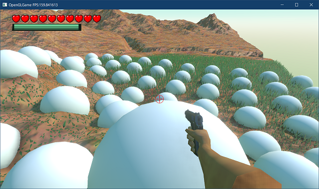
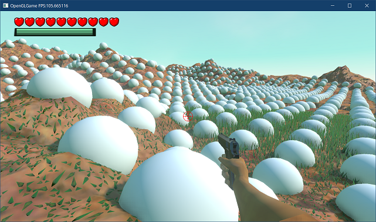
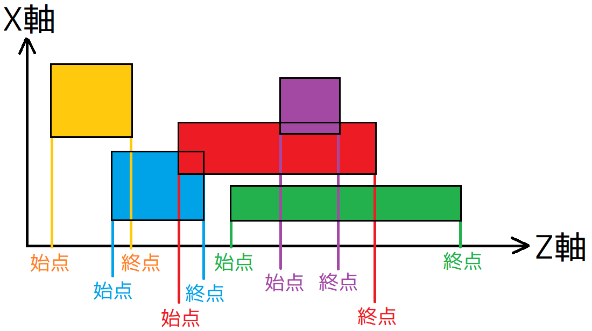
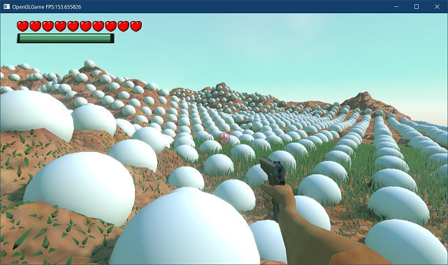
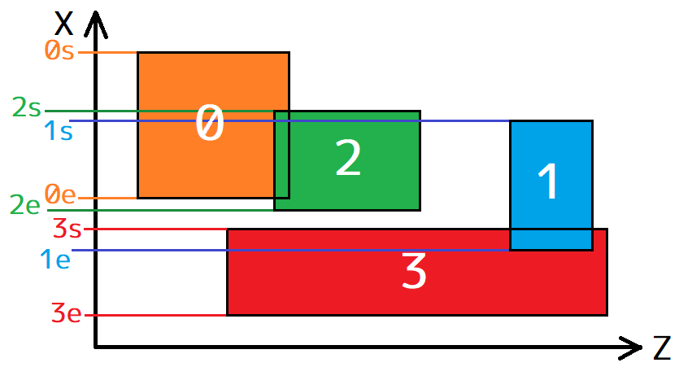
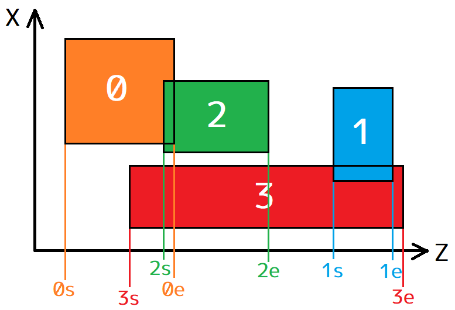

[OpenGL 3D 2024 前期 第09回]

# 衝突判定の効率化

## 習得目標

* 
* 
* 

## 1. 1次元スウィープアンドプルーン

### 1.1 現在の衝突判定の問題点

現在の衝突判定は、「コライダーを持つすべてのゲームオブジェクトの組み合わせ」について判定を行うことで実現しています。この方法は、日本語では「総当たり」、英語では「ブルートフォース」と呼ばれています。

総当り法の問題は、「ゲームオブジェクトの数が増えたとき、判定回数が指数関数的に増加する」ことです。

例えば、5個の(コライダーを持つ)ゲームオブジェクトが存在する場合、判定回数は`4+3+2+1`で`10`回になります。ゲームオブジェクトが6個の場合は`5+4+3+2+1`で`15`回、7個の場合は`6+5+4+3+2+1`で`21`回です。

| ゲームオブジェクト数 | 計算   | 判定回数 |
|-----:|----------------------:|-------:|
|    5 |               4+3+2+1 |     10 |
|    6 |             5+4+3+2+1 |     15 |
|    7 |           6+5+4+3+2+1 |     21 |
|    8 |         7+6+5+4+3+2+1 |     28 |
|    9 |       8+7+6+5+4+3+2+1 |     36 |
|   10 |     9+8+7+6+5+4+3+2+1 |     45 |
|  100 |    99+98+97+...+3+2+1 |   4950 |
| 1000 | 999+998+997+...+3+2+1 | 499500 |

このように、「総当たり法」では、ゲームオブジェクト数の増量に対して、判定回数の増量が非常に大きくなります。とはいえ、100個程度であればゲームの実行速度に大きな影響はないでしょう。

ということで、実際に確かめてみましょう。とりあえず球体モデルを用意します。

<strong>【課題01】</strong>
以下のURLから<code>ico_sphere.zip</code>をダウンロードし、プロジェクトの<code>Res/MeshData</code>フォルダに展開しなさい。

<code>https://github.com/tn-mai/OpenGL2023/tree/main/res/meshdata/obj/</code>

必要な球体モデルのファイルは以下の3つです。
- ico_sphere.obj
- ico_sphere.mtl
- ico_sphere.tga
</pre>

次に球体モデルをエンジンに読み込むのですが、モデルを追加するたびに`Engine.cpp`を書き換えるのはちょっと面倒です。そこでOBJファイルを読み込む機能をエンジンの外に公開することにします。

`Engine.h`を開き、`ClearHeightMap`メンバ関数の定義の下に、次のプログラムを追加してください。

```diff
   void ClearHeightMap()
   {
     heightMap.reset();
   }
+
+  /**
+  * OBJファイルを読み込む
+  *
+  * @param filename OBJファイル名
+  *
+  * @return filenameから作成したスタティックメッシュ
+  */
+  StaticMeshPtr LoadOBJ(const char* filename)
+  {
+    return meshBuffer->LoadOBJ(filename);
+  }

   /**
   * FBXファイルを読み込む
```

これで、自由にOBJファイルを追加できるようになりました。

それから、プログラムの実行速度を表す`FPS`(フレーム・パー・セコンド、「秒間フレーム数」)を表示する機能を追加します。`FPS`は、プログラムがどのくらい改善されたかを各にするために使います。

`Engine`クラスの定義に次のプログラムを追加してください。

```diff
   float deltaTime = 0;     // 前回更新からの経過時間
   ScenePtr scene;     // 実行中のシーン
   ScenePtr nextScene; // 次のシーン
+
+  // FPS計測用変数
+  double fpsTime = 0;
+  double fps = 0;
+  int fpsFrames = 0;

   // クリックと判定する速度
   static constexpr float mouseClickSpeed = 0.3f;
```

次に`Engine.cpp`を開き、`Update`メンバ関数の定義に次のプログラムを追加してください。

```diff
 void Engine::Update()
 {
   // デルタタイム(前回の更新からの経過時間)を計算
   const double currentTime = glfwGetTime(); // 現在時刻
+
+  // 1秒ごとにFPSを計算してタイトルバーに表示
+  const double diffTime = currentTime - fpsTime;
+  ++fpsFrames;
+  if (diffTime >= 1) {
+    fps = fpsFrames / diffTime;
+    const std::string str = title + " FPS:" + std::to_string(fps);
+    glfwSetWindowTitle(window, str.c_str());
+    fpsFrames = 0;
+    fpsTime = currentTime;
+  }

   deltaTime = static_cast<float>(currentTime - previousTime);
   previousTime = currentTime;
```

これで、タイトルバーに`FPS`が表示されるようになりました。

それでは、衝突判定用のゲームオブジェクトを作成しましょう。`HeightMapScene.cpp`を開き、`SphereCollider.h`と`BoxCollider.h`をインクルードしてください。

```diff
 * @file HeightMapScene.cpp
 */
 #include "HeightMapScene.h"
 #include "PlayerComponent.h"
+#include "Engine/SphereCollider.h"
+#include "Engine/BoxCollider.h"
 #include "Engine/GrassRenderer.h"

 /**
 * シーンの初期化
```

次に、`Initialize`メンバ関数の定義に次のプログラムを追加してください。

```diff
     grass->grassRenderer->SetInstanceData(
       instanceHeader.get(), instanceData.data(), instanceData.size());
   } // 草シェーダのテスト
+
+  // 衝突判定のテスト
+  {
+    for (int i = 0; i < 100; ++i) {
+      // 名前に番号をふる
+      std::string name = "collider.";
+      for (int div = 1; div < 10000; div *= 10) {
+        name.push_back('0' + (i / div) % 10);
+      }
+
+      // 座標を計算
+      const float x = static_cast<float>((i % 10) * 3);
+      const float z = static_cast<float>((i / 10) * 3);
+
+      // ゲームオブジェクトを作成
+      auto go = engine.Create<GameObject>(name.c_str(), { x, 15, z });
+      go->staticMesh = engine.LoadOBJ("Res/MeshData/ico_sphere.obj");
+      auto characterMovement = go->AddComponent<CharacterMovement>();
+      auto collider = go->AddComponent<SphereCollider>();
+    }
+  } // 衝突判定のテスト

   return true;
 }
```

プログラムが書けたらビルドして実行してください。100個の球体が落下し、下半分が地面に埋まったら成功です。

<p align="center">

</p>

それから、タイトルバーの`FPS`の数値を確認してください。この数値は「1秒間に実行されたゲームループの回数」を表します。数値が大きいほど、プログラムが高速に動作していることを表します。

ゲームオブジェクトの数が100個程度なら、デバッグビルドでも`60`以上の`FPS`が得られると思います。

しかし、ある程度ちゃんとしたゲーム空間を作ろうとすると、数百個以上のゲームオブジェクトが必要になります。ゲームオブジェクトを1024個に増やしてください。

```diff
   // 衝突判定のテスト
   {
-    for (int i = 0; i < 100; ++i) {
+    for (int i = 0; i < 1024; ++i) {
       // 名前に番号をふる
       std::string name = "collider.";
       for (int div = 1; div < 10000; div *= 10) {
         name.push_back('0' + (i / div) % 10);
       }

       // 座標を計算
-      const float x = static_cast<float>((i % 10) * 3);
-      const float z = static_cast<float>((i / 10) * 3);
+      const float x = static_cast<float>((i % 32) * 3);
+      const float z = static_cast<float>((i / 32) * 3);

       // ゲームオブジェクトを作成
       auto go = engine.Create<GameObject>(name.c_str(), { x, 15, z });
       go->staticMesh = engine.LoadOBJ("Res/MeshData/ico_sphere.obj");
```

プログラムが書けたらビルドして実行してください。個数を10倍に増やしたわけですが、`FPS`は`1/10`どころか`1/30`から`1/50`くらいまで低下したのではないでしょうか。

これは、前掲の表で見たように、「総当たり法」ではゲームオブジェクト数が増えると、衝突回数が指数関数的な速度で増加するためです。

<p align="center">

</p>

<strong>【課題02】</strong>
ソリューション構成を<code>Release</code>ビルドに切り替えて実行しなさい。プログラムの自動最適化が有効になるため、FPSが大きく改善するはずです。
FPSを確認できたら</code>Debug</code>ビルドに戻しなさい。
</pre>

このままではゲームとして成立しないので、ゲームオブジェクトの数を減らす必要があります。そして、敵やオブジェクトの数を少なくしたり、エフェクトをなくすなどの対策をした結果、ゲーム体験が悪化することになります。

できれば、このような事態は避けたいものです。根本の問題は、多数のゲームオブジェクトが存在する場合に「総当たり法」の性能が悪いことです。そこで、衝突判定をゲームオブジェクト数が多くても性能が低下しない方法で置き換えます。

### 1.2 ブロードフェーズとナローフェーズ

「総当たり法」では、明らかに衝突しない距離にあるゲームオブジェクト同士であっても、衝突判定が実行されます。例えば、ゲーム空間に`1000`個のゲームオブジェクトが存在する場合、ゲームオブジェクトごとに`999`回の判定が行われます。

しかし、ほとんどの場合、あるゲームオブジェクトと衝突しそうな距離にある他のゲームオブジェクトは、多くとも`10`個程度でしょう。

つまり、`999`回のうち`989`回は、衝突の可能性がほとんどないのに判定が行われているわけです。もし「衝突の可能性がほとんどないゲームオブジェクト」を除外できれば、衝突判定を高速化できるはずです。

「事前に衝突しそうにないオブジェクトを除外する操作」のことを、`Broad Phase`(ブロード・フェーズ、「広域段階」という意味)と呼びます。

そして、「ブロードフェーズ後に残ったオブジェクトを判定する操作」のことを、`Narrow Phase`(ナロー・フェーズ、「狭域段階」という意味)と呼びます。

このように衝突判定を2段階に分ける利点は、それぞれの段階で異なる最適なアルゴリズムを選択できることです。

これまでの「総当り法」では、「ブロードフェーズとナローフェーズを区別していなかったので効率が悪かった」と考えることができるでしょう。

ブロードフェーズを改善するために、さまざまな手法が提案されています。現在使われている手法を以下に示します。

>* `Sweep And Prune`(スウィープ・アンド・プルーン、掃引(そういん)と剪定(せんてい)法):<br>
オブジェクトをいずれかの軸でソートする方法。
>* `Uniform Grid`(ユニフォーム・グリッド、均一格子法):<br>
空間を均一な格子で分割する方法。
>* `Spatial Hasing`(スペーシャル・ハッシング、空間ハッシュ法):<br>
均一格子法と同じように空間を分割するが、オブジェクトが存在する格子だけを記録する方法。
>* `Binary Space Partitioning`(バイナリ・スペース・パーティショニング、空間二分法、略称`BSP`):<br>
空間を適当な平面で2つに分割し、次にそれぞれの空間に十分な数のオブジェクトが含まれる場合は、さらに別の平面で2つに分割することを繰り返す方法。
>* `Quad Tree`(クアッド・ツリー、四分木):<br>
空間をXY軸(またはXZ軸)で均等に4分割し、それぞれの空間に十分なオブジェクトが含まれる場合は、さらに各空間を均等に4分割することをを繰り返す方法。
>* `Octree`(オクトリー、八分木):<br>
空間をXYZ軸で均等に8分割し、それぞれの空間に十分なオブジェクトが含まれる場合は、さらに各空間を均等に8分割することをを繰り返す方法。
>* `kD Tree`(ケー・ディメンション・ツリー、k次元木):<br>
空間二分法の分割平面をXYZ軸に限定したバージョン。

いずれの手法にも一長一短があります。基本的に、プログラミングに手間のかかる手法ほど汎用性が高くなります。しかし、手間がかからない手法でも、性能的に十分な場合が多いです。

今回は、比較的簡単に作成できる「スウィープ・アンド・プルーン」を実装します。

### 1.3 スウィープ・アンド・プルーン

<p align="center">

</p>

`Sweep And Prune`(スウィープアンドプルーン、略称`SAP`)は、「ある座標軸にそってコライダーをソートし、座標順に衝突判定を行う」という手法です。

このとき、ゲームオブジェクトごとに軸方向の衝突境界を計算しておいて、衝突境界を超えた時点で判定を打ち切ります。

理論上、ソートに使う座標軸には、X,Y,Zに限らず任意の軸が利用できます。しかし、実行速度の点から、通常はX, Y, Z軸のいずれかが使われます。

一般的に、ゲーム空間がX軸方向に広い場合はX軸を、Z軸方向に広い場合はZ軸を選びます。

OpenGLの場合、カメラのデフォルトの向きは-Z方向なので、ゲーム空間もZ軸方向に広いことが多いと予想されます。そこで、本テキストではZ軸をソート軸に使うことにします。

スイープ・アンド・プルーンの作成手順は次ようになります。

>1. コライダークラスに、衝突境界を返すメンバ関数を追加する。
>2. ソート用の衝突境界とコライダーリストを持つ配列を作成する。
>3. 3で作成した配列を利用して衝突判定を実行する。

### 1.4 Colliderクラスに衝突境界を返すメンバ関数を追加する

まずは、`Collider`クラスに衝突境界を返すメンバ関数を追加しましょう。衝突境界には始点と終点の2つがあり、この区間に別のオブジェクトの衝突境界が存在したら「衝突の可能性あり」と判断します。

始点と終点で構成される区間のことを「境界区間(きょうかい・くかん)」と呼ぶことにします。そして、メンバ関数の名前は`GetBoundingInterval`(ゲット・バウンディング・インターバル、「境界区間を取得する」という意味)とします。

`Collider.h`を開き、`Collider`クラスの定義に次のプログラムを追加してください。

```diff
   // 座標を変更する
   virtual void AddPosition(const vec3& translate) = 0;

   // 座標変換したコライダーを取得する
   virtual ColliderPtr GetTransformedCollider(const mat4& transform) const = 0;
+
+  // 境界区間を表す構造体
+  struct BoundingInterval
+  {
+    float min; // 区間の始点(最小値)
+    float max; // 区間の終点(最大値)
+  };
+
+  /**
+  * 指定された軸方向の境界区間を取得する
+  *
+  * @param axis 軸方向(0=X軸, 1=Y軸, 2=Z軸)
+  *
+  * @return axis軸方向の境界区間
+  */
+  virtual BoundingInterval GetBoundingInterval(int axis) const = 0;

   bool isTrigger = false; // true=重複を許可, false=重複を禁止
   bool isStatic = false;  // true=動かない物体, false=動く物体
 };
```

軸方向を指定できるように設計したので、ゲーム空間がX, Y, Zのどの軸方向に広い場合でも、簡単にソート軸を変えられます。

また、このメンバ関数は「純粋仮想関数」として定義しています。境界範囲の計算方法はコライダーの形状によって異なるため、基底クラスでは計算できないからです。

そのため、実装は派生クラスで行わなくてはなりません。現在、`Collider`の派生クラスは以下の3つです。

>* `AabbCollider`
>* `SphereCollider`
>* `BoxCollider`

この3つのクラスに`GetBoundingInterval`仮想関数を定義します。`AabbCollider.h`を開き、`AabbCollider`クラスの定義に次のプログラムを追加してください。

```diff
         p->aabb.max[i] = tmp;
       }
     }
     return p;
   }
+
+  // 指定された軸方向の境界区間を取得する
+  virtual BoundingLine GetBoundingLine(int axis) const override
+  {
+    return { aabb.min[axis], aabb.max[axis] };
+  }

   // 図形を取得する
   const AABB& GetShape() const { return aabb; }
```

`AABB`は、最初から軸方向にそった範囲を持っています。そのため、指定された軸の最小値と最大値を返すだけです。

次に、`SphereCollider`クラスに`GetBindingInterval`仮想関数を追加します。`SphereCollider.h`を開き、`SphereCollider`クラスの定義に次のプログラムを追加してください。

```diff
     const float maxScale = std::max({ scale.x, scale.y, scale.z });
     p->sphere.radius = sphere.radius * maxScale;
     return p;
   }
+
+  // 指定された軸方向の境界区間を取得する
+  virtual BoundingLine GetBoundingLine(int axis) const override
+  {
+    return {
+      sphere.position[axis] - sphere.radius,
+      sphere.position[axis] + sphere.radius };
+  }

   Sphere sphere = { vec3(0), 1 };
 };
```

`SphereCollider`は球体なので、軸の方向に関わらず範囲は一定です。中心座標から半径を引く、または足すことで、境界区間を求めることができます。

最後に`BoxCollider`クラスに`GetBoundingInterval`仮想関数を追加します。`BoxCollider.h`を開き、`BoxCollider`クラスの定義に次のプログラムを追加してください。

```diff
       p->box.scale[i] = box.scale[i] * scale[i];
     }
     return p;
   }
+
+  // 指定された軸方向の境界区間を取得する
+  virtual BoundingLine GetBoundingLine(int axis) const override
+  {
+    float size = 0;
+    for (int i = 0; i < 3; ++i) {
+      size += abs(box.axis[i][axis] * box.scale[i]);
+    }
+    return { box.position[axis] - size, box.position[axis] + size };
+  }

   // 図形を取得する
   const Box& GetShape() const { return box; }
```

`BoxCollidr`はOBBなので、OBBの軸の向きによって境界区間が変化します。境界区間の座標は、3つの対角線のいずれかの頂点座標と一致します。そのため、全てのOBB軸について、求めたい軸の絶対値を合計すると、区間の半径が得られます。

これで、コライダーの境界区間を求められるようになりました。

### 1.5 ソート用の境界区間とコライダーリストを持つ配列を作成する

次に、ワールドコライダーの配列を作成します。スウィープアンドプルーン法と総当り法の性能を比較できるように、`#ifdef`プリプロセッサマクロによって処理を切り替えられるようにしておきます。

`Engine.cpp`を開き、`HandleGameObjectCollision`メンバ関数の定義に次のプログラムを追加してください。

```diff
*/
 void Engine::HandleGameObjectCollision()
 {
+#define USE_SWEEP_AND_PRUNE
+
+#ifdef USE_SWEEP_AND_PRUNE
+
+#else
+
   // ワールド座標系の衝突判定を作成
   std::vector<WorldColliderList> colliders;
   colliders.reserve(gameObjects.size());
   for (const auto& e : gameObjects) 
         ・
         ・
       (省略)
         ・
         ・
         HandleWorldColliderCollision(&*a, &*b); // コライダー単位の衝突判定
       } // for b
     } // for a
   }
+
+#endif // USE_SWEEP_AND_PRUNE
+
 } // HandleGameObjectCollision

 /**
 * 型によって交差判定関数を呼び分けるための関数テンプレート
```

マクロ定数`USE_SWEEP_AND_PRUNE`(ユーズ・スウィープアンドプルーン)は、スウィープアンドプルーン手法を使う場合に定義します。コメントアウトなどでこのマクロ定数を消去すると、既存のブルートフォース手法が使われます。

ブルートフォース手法ではコライダーリストをそのまま扱いましたが、スウィープアンドプルーンでは境界区間とコライダーリストをまとめて扱う必要があります。

そこで、まとめるための構造体を作成します。名前は`CollisionInterval`(コリジョン・インターバル、「衝突区間」のような意味)とします。

`HandleGameObjectCollision`メンバ関数の定義に、次のプログラムを追加してください。

```diff
 void Engine::HandleGameObjectCollision()
 {
 #define USE_SWEEP_AND_PRUNE

 #ifdef USE_SWEEP_AND_PRUNE
+
+  // ゲームオブジェクト単位の境界区間とコライダーリストをまとめた構造体
+  struct CollisionInterval
+  {
+    Collider::BoundingInterval zInterval;
+    WorldColliderList worldColliders;
+  };
+  std::vector<CollisionInterval> colliders; // コライダー配列
+  colliders.reserve(gameObjects.size());

 #else

   // ワールド座標系の衝突判定を作成
   std::vector<WorldColliderList> colliders;
```

次に、コライダーを持つ全てのゲームオブジェクトについて、境界区間とワールド座標系の衝突判定(コライダー)を計算します。コライダー配列を作成するプログラムの下に、次のプログラムを追加してください。

```diff
     WorldColliderList worldColliders;
   };
   std::vector<CollisionInterval> colliders; // コライダー配列
   colliders.reserve(gameObjects.size());
+
+  // ワールド座標系の衝突判定と境界区間を計算
+  for (const auto& e : gameObjects) {
+    if (e->colliders.empty()) {
+      continue; // コライダーがない場合は作成しない
+    }
+
+    // ワールド変換行列を取得
+    const mat4& m = e->GetTransformMatrix();
+
+    // ワールド座標系の衝突判定を作成
+    CollisionInterval ci;
+    ci.zInterval = { FLT_MAX, -FLT_MAX };
+    ci.worldColliders.reserve(e->colliders.size());
+    for (const auto& local : e->colliders) {
+      // ワールド座標系のコライダーを計算
+      WorldCollider col;
+      col.origin = local; // オリジナルのコライダーをコピーしておく
+      col.world = local->GetTransformedCollider(m);
+      ci.worldColliders.push_back(col);
+
+      // 境界区間を更新
+      const auto zInterval = col.world->GetBoundingInterval(2);
+      ci.zInterval.min = std::min(ci.zInterval.min, zInterval.min);
+      ci.zInterval.max = std::max(ci.zInterval.max, zInterval.max);
+    }
+    colliders.push_back(ci);
+  } // for gameObjects

 #else

   // ワールド座標系の衝突判定を作成
   std::vector<WorldColliderList> colliders;
```

ゲームオブジェクトの境界区間は、すべてのコライダーの境界区間の最小値と最大値によって定義されます。この境界区間では、ゲームオブジェクトが持ついずれかのコライダーと衝突する可能性があります。

コライダー配列の要素数が2つ未満の場合は衝突判定は不要です。衝突判定を作成する`for`ループの下に、次のプログラムを追加してください。

```diff
       ci.zInterval.max = std::max(ci.zInterval.max, zInterval.max);
     }
     colliders.push_back(ci);
   } // for gameObjects
+
+  if (colliders.size() < 2) {
+    return; // 衝突が発生し得ないので衝突判定は不要
+  }

 #else

   // ワールド座標系の衝突判定を作成
   std::vector<WorldColliderList> colliders;
```

すべての境界区間を計算し終えたら、コライダー配列を境界区間の始点の昇順で並べ替えます(ソート)。衝突判定の必要性を判断するプログラムの下に、次のプログラムを追加してください。

```diff
   if (colliders.size() < 2) {
     return; // 衝突が発生し得ないので衝突判定は不要
   }
+
+  // 境界区間の始点でソート
+  std::sort(colliders.begin(), colliders.end(),
+    [](const CollisionInterval& a, const CollisionInterval& b)
+    { return a.zInterval.min < b.zInterval.min; });

 #else

   // ワールド座標系の衝突判定を作成
   std::vector<WorldColliderList> colliders;
```

### 1.6 ソート済み配列を利用して衝突判定を実行する

コライダー配列がソート済みになったら、あとは衝突判定を実行するだけです。ソートするプログラムの下に、次のプログラムを追加してください。

```diff
   std::sort(colliders.begin(), colliders.end(),
     [](const CollisionInterval& a, const CollisionInterval& b)
     { return a.zInterval.min < b.zInterval.min; });
+
+  // 交差範囲にあるオブジェクトに対して衝突判定を実行
+  const auto end = colliders.end();
+  for (auto a = colliders.begin(); a != end - 1; ++a) {
+    const GameObject* goA = a->worldColliders[0].origin->GetOwner();
+    if (goA->IsDestroyed()) {
+      continue; // 削除済みなので飛ばす
+    }
+
+    const float intervalEnd = a->zInterval.max; // 境界区間の終点
+    for (auto b = a + 1; b != end; ++b) {
+      if (b->zInterval.min >= intervalEnd) {
+        break; // 境界区間を超えたので、これ以上は衝突しない
+      }
+      const GameObject* goB = b->worldColliders[0].origin->GetOwner();
+      if (goB->IsDestroyed()) {
+        continue; // 削除済みなので飛ばす
+      }
+
+      // コライダー単位の衝突判定
+      HandleWorldColliderCollision(&a->worldColliders, &b->worldColliders);
+    } // for b
+  } // for a

 #else

   // ワールド座標系の衝突判定を作成
   std::vector<WorldColliderList> colliders;
```

二重ループを使っている点は総当り法と同じです。重要な違いは、内側のループに「境界区間による`break`条件」が追加されていることです。

境界区間を超えた時点で、残りのオブジェクトとは衝突しないことが確定します。そのため、総当り法と比べてかなり早い段階でループを終了できます。

このように、スウィープアンドプルーン法では、衝突判定の配列を境界区間でソートし、配列の一方の端から他方の端まで順番にチェックしていきます(スウィープ工程)。

そして、境界区間が重複するコライダーについてのみ衝突判定を行います(プルーン工程)。

プログラムが書けたらビルドして実行してください。そして、スウィープアンドプルーンの効果を確かめてください。

<p align="center">
<br>
スウィープアンドプルーン法によってFPSが改善している
</p>

>**【1章のまとめ】**
>
>* 
>* 
>* 

<div style="page-break-after: always"></div>

## 2. 2次元スウィープアンドプルーン

### 2.1 

1次元スウィープアンドプルーン(1D-SAP)の時点で、総当たり法に比べて非常に効率的な衝突判定が行えるようになりました。

しかし、1次元スウィープアンドプルーンにも欠点があります。考えてみると当たり前ですが、Z軸でスウィープアンドプルーン(SAP)を行う場合、X軸やY軸方向には判定回数の削減効果がないのです。

そこで、SAPを複数の軸に対して実行することで、他の軸方向の判定回数も減らします。今回は、Z軸とX軸の2軸に対してSAPを実行します。

ZX軸の2次元スウィープアンドプルーン(2D-SAP)は、次の手順で実行されます。

>2. X軸方向で衝突の可能性のあるゲームオブジェクトのペアをリストアップ。
>1. Z軸方向で衝突の可能性のあるゲームオブジェクトのペアをリストアップ。
>3. 2つのリストのうち重複するペアだけを残す。
>4. 残ったペアに対して衝突判定を実行する。

<p align="center">
&emsp;
</p>

多くのゲームでは、ゲームオブジェクトがY軸方向に重なって存在することは少ないです。そのため、XZ軸の2D SAPでも十分な結果が得られます。

>3次元の宇宙空間を移動するようなゲームでは、XYZの3次元スウィープアンドプルーン(3D-SAP)を試してみるとよいでしょう。

それでは、2D-SAPを追加しましょう。`HandleGameObjectCollision`メンバ関数の定義にあるマクロ定義を次のように変更してください。

```diff
 void Engine::HandleGameObjectCollision()
 {
-#define USE_SWEEP_AND_PRUNE
+//#define USE_SWEEP_AND_PRUNE
+#define USE_SWEEP_AND_PRUNE_2D

 #ifdef USE_SWEEP_AND_PRUNE

   // ゲームオブジェクト単位の境界区間とコライダーリストをまとめた構造体
   struct CollisionInterval
```

次に、1D-SAPプログラムの末尾に次のプログラムを追加してください。

```diff
       // コライダー単位の衝突判定
       HandleWorldColliderCollision(&a->worldColliders, &b->worldColliders);
     } // for b
   } // for a
+
+#elif defined(USE_SWEEP_AND_PRUNE_2D)

 #else

   // ワールド座標系の衝突判定を作成
   std::vector<WorldColliderList> colliders;
```

2D-SAPでもスウィープアンドプルーン法という点は同じなので、1D-SAPプログラムをコピーして改造することにします。`CollisionInterval`構造体をコピーして、プリプロセッサマクロの下に貼り付けてください。

```diff
     } // for b
   } // for a

 #elif defined(USE_SWEEP_AND_PRUNE_2D)
+
+  // ゲームオブジェクト単位の境界区間とコライダーリストをまとめた構造体
+  struct CollisionInterval
+  {
+    Collider::BoundingInterval zInterval;
+    WorldColliderList worldColliders;
+  };
+  std::vector<CollisionInterval> colliders; // コライダー配列
+  colliders.reserve(gameObjects.size());

 #else

   // ワールド座標系の衝突判定を作成
   std::vector<WorldColliderList> colliders;
```

`CollisionInterval`構造体の変更点は、境界区間を表す変数を2要素の配列にすることです。貼り付けた`CollisionInterval`構造体の定義を次のように変更してください。

```diff
 #elif defined(USE_SWEEP_AND_PRUNE_2D)

   // ゲームオブジェクト単位の境界区間とコライダーリストをまとめた構造体
   struct CollisionInterval
   {
-    Collider::BoundingInterval zInterval;
+    Collider::BoundingInterval intervals[2];
     WorldColliderList worldColliders;
   };
   std::vector<CollisionInterval> colliders; // コライダー配列
   colliders.reserve(gameObjects.size());
``` 

次に、境界区間を計算する`for`ループをコピーして、2D-SAP用のコライダー配列の定義の下に貼り付けてください。

```diff
     Collider::BoundingInterval intervals[2];
     WorldColliderList worldColliders;
   };
   std::vector<CollisionInterval> colliders; // コライダー配列
   colliders.reserve(gameObjects.size());
+
+  // ワールド座標系のコライダーと境界区間を計算
+  for (const auto& e : gameObjects) {
+    if (e->colliders.empty()) {
+      continue; // コライダーがない場合は作成しない
+    }
+
+    // ワールド変換行列を取得
+    const mat4& m = e->GetTransformMatrix();
+
+    // ワールド座標系の衝突判定を作成
+    CollisionInterval ci;
+    ci.zInterval = { FLT_MAX, -FLT_MAX };
+    ci.worldColliders.reserve(e->colliders.size());
+    for (const auto& local : e->colliders) {
+      // ワールド座標系のコライダーを計算
+      WorldCollider col;
+      col.origin = local; // オリジナルのコライダーをコピー
+      col.world = local->GetTransformedCollider(m);
+      ci.worldColliders.push_back(col);
+
+      // 境界区間を更新
+      const auto zInterval = col.world->GetBoundingInterval(2);
+      ci.zInterval.min = std::min(ci.zInterval.min, zInterval.min);
+      ci.zInterval.max = std::max(ci.zInterval.max, zInterval.max);
+    }
+    colliders.push_back(ci);
+  } // for gameObjects
+
+  if (colliders.size() < 2) {
+    return; // 衝突が発生し得ないので衝突判定は不要
+  }

 #else

   // ワールド座標系の衝突判定を作成
   std::vector<WorldColliderList> colliders;
```

続いて、コピーした境界区間を更新するプログラムを、2つの軸を処理するように変更してください。

```diff
     // ワールド変換行列を取得
     const mat4& m = e->GetTransformMatrix();
 
     // ワールド座標系の衝突判定を作成
     CollisionInterval ci;
-    ci.zInterval = { FLT_MAX, -FLT_MAX };
+    ci.intervals[0] = {FLT_MAX, -FLT_MAX};
+    ci.intervals[1] = {FLT_MAX, -FLT_MAX};
     ci.worldColliders.reserve(e->colliders.size());
     for (const auto& local : e->colliders) {
       // ワールド座標系のコライダーを計算
       WorldCollider col;
       col.origin = local; // オリジナルのコライダーをコピー
       col.world = local->GetTransformedCollider(m);
       ci.worldColliders.push_back(col);
 
       // 境界区間を更新
-      const auto zInterval = col.world->GetBoundingInterval(2);
-      ci.zInterval.min = std::min(ci.zInterval.min, zInterval.min);
-      ci.zInterval.max = std::max(ci.zInterval.max, zInterval.max);
+      for (int i = 0; i < 2; ++i) {
+        const auto interval = col.world->GetBoundingInterval(i * 2);
+        ci.intervals[i].min = std::min(ci.intervals[i].min, interval.min);
+        ci.intervals[i].max = std::max(ci.intervals[i].max, interval.max);
+      }
     }
     colliders.push_back(ci);
   } // for gameObjects
```

次に、衝突の可能性のあるゲームオブジェクトのペアを見つけます。1D-SAPでは、ペアを見つけたらすぐに衝突判定を行っていました。しかし多次元SAPでは、見つけたペアは記録するだけで、衝突判定はまた後で行います。

ペアを記録するには「`colliders`配列のインデックス(添字)」を使います。アドレスを使わないのは、後でペアをソートするときにインデックスのほうが効率的だからです。

ただ、インデックスとアドレスのどちらを使うにしても、1D-SAPのときのように`colliders`配列を直接ソートすることはできません。

`CollisionInterval`オブジェクトの位置が変わると、インデックスもアドレスも役に立たなくなってしまうからです。

そこで、`colliders`配列のすべての要素のアドレスを、新しく作成するポインタ配列に格納します。そして、このポインタ配列をソートします。

ポインタによって間接的にソートすることで、インデックスを無効化することなく、ソートされたデータを利用できます。

まずポインタ配列を作成し、`CollisionInterval`オブジェクトのアドレスを格納しましょう。`colliders`配列の要素数を確認するプログラムの下に、次のプログラムを追加してください。

```diff
   if (colliders.size() < 2) {
     return; // 衝突が発生し得ないので衝突判定は不要
   }
+
+  // コライダー配列要素のアドレスを取得
+  std::vector<CollisionInterval*> colliderPointers; // ポインタ配列
+  colliderPointers.reserve(colliders.size());
+  for (auto& e : colliders) {
+    colliderPointers.push_back(&e);
+  }
+
+  // 衝突候補ペアを見つける
+  std::vector<uint32_t> pairList[2]; // 衝突候補ペアの配列
+  for (int i = 0; i < 2; ++i) {
+  }

 #else

   // ワールド座標系の衝突判定を作成
   std::vector<WorldColliderList> colliders;
```

衝突候補ペアを見つけるプログラムには、1D-SAPのソートと衝突判定プログラムを流用します。1D-SAPプログラムからソートと衝突判定を実行するプログラムをコピーし、衝突候補ペアを見つける`for`ループに貼り付けてください。

```diff
   // 衝突候補ペアを見つける
   std::vector<uint32_t> pairList[2]; // 衝突候補ペアの配列
   for (int i = 0; i < 2; ++i) {
+    // 境界区間の始点でソート
+    std::sort(colliders.begin(), colliders.end(),
+      [](const CollisionInterval& a, const CollisionInterval& b)
+      { return a.zInterval.min < b.zInterval.min; });
+
+    // 交差範囲にあるオブジェクトに対して衝突判定を実行
+    const auto end = colliders.end();
+    for (auto a = colliders.begin(); a != end - 1; ++a) {
+      const GameObject* goA = a->worldColliders[0].origin->GetOwner();
+      if (goA->IsDestroyed()) {
+        continue; // 削除済みなので飛ばす
+      }
+
+      const float intervalEnd = a->zInterval.max;
+      for (auto b = a + 1; b != end; ++b) {
+        if (b->zInterval.min >= intervalEnd) {
+          break; // 境界区間を超えたので、次のオブジェクトの判定に進む
+        }
+        const GameObject* goB = b->worldColliders[0].origin->GetOwner();
+        if (goB->IsDestroyed()) {
+          continue; // 削除済みなので飛ばす
+        }
+
+        // コライダー単位の衝突判定
+        HandleWorldColliderCollision(&a->worldColliders, &b->worldColliders);
+      } // for b
+    } // for a
   }

 #else

   // ワールド座標系の衝突判定を作成
   std::vector<WorldColliderList> colliders;
```

それでは、貼り付けた1D-SAPプログラムを2D-SAPに対応させましょう。まず、ソート対象をポインタ配列に変更します。境界区間の視点でソートするプログラムを次のように変更してください。

```diff
   // 衝突候補ペアを見つける
   std::vector<uint32_t> pairList[2]; // 衝突候補ペアの配列
   for (int i = 0; i < 2; ++i) {
     // 境界区間の始点でソート
-    std::sort(colliders.begin(), colliders.end(),
-      [](const CollisionInterval& a, const CollisionInterval& b)
-      { return a.zInterval.min < b.zInterval.min; });
+    std::sort(colliderPointers.begin(), colliderPointers.end(),
+      [i](const CollisionInterval* a, const CollisionInterval* b)
+      { return a->intervals[i].min < b->intervals[i].min; });

       // 交差範囲にあるオブジェクトに対して衝突判定を実行
       const auto end = colliders.end();
       for (auto a = colliders.begin(); a != end - 1; ++a) {
```

次に、衝突判定を実行するプログラムを、衝突候補のペアを記録するプログラムに変更します。衝突判定を実行するプログラムを次のように変更してください。

```diff
     std::sort(colliderPointers.begin(), colliderPointers.end(),
       [i](const CollisionInterval* a, const CollisionInterval* b)
       { return a->intervals[i].min < b->intervals[i].min; });

-    // 交差範囲にあるオブジェクトに対して衝突判定を実行
-    const auto end = colliders.end();
-    for (auto a = colliders.begin(); a != end - 1; ++a) {
-      const GameObject* goA = a->worldColliders[0].origin->GetOwner();
-      if (goA->IsDestroyed()) {
-        continue; // 削除済みなので飛ばす
-      }
+    // 交差範囲にあるオブジェクトを衝突候補ペアとして記録
+    pairList[i].reserve(colliders.size());
+    const auto collidersTop = colliders.data();
+    const auto end = colliderPointers.end();
+    for (auto a = colliderPointers.begin(); a != end - 1; ++a) {
+      // 衝突候補はcollidersのインデックスで表す
+      const uint32_t indexA = static_cast<uint32_t>(*a - collidersTop);

-      const float intervalEnd = a->zInterval.max;
+      const float intervalEnd = (*a)->intervals[i].max;
       for (auto b = a + 1; b != end; ++b) {
-        if (b->zInterval.min >= intervalEnd) {
+        if ((*b)->intervals[i].min >= intervalEnd) {
           break; // 境界区間を超えたので、次のオブジェクトの判定に進む
         }
-        const GameObject* goB = b->worldColliders[0].origin->GetOwner();
-        if (goB->IsDestroyed()) {
-          continue; // 削除済みなので飛ばす
-        }
+        // 衝突候補はcollidersのインデックスで表す
+        const uint32_t indexB = static_cast<uint32_t>(*b - collidersTop);

-        // コライダー単位の衝突判定
-        HandleWorldColliderCollision(&a->worldColliders, &b->worldColliders);
+        // インデックスの小さいほうを上位16bit、大きいほうを下位16bitに設定
+        if (indexA < indexB) {
+          pairList[i].push_back(indexA << 16 | indexB);
+        } else {
+          pairList[i].push_back(indexB << 16 | indexA);
+        }
       } // for b
     } // for a
+
+    // 衝突候補ペアの配列をソート
+    std::sort(pairList[i].begin(), pairList[i].end());
   }

 #else

   // ワールド座標系の衝突判定を作成
   std::vector<WorldColliderList> colliders;
```

このプログラムがやっていることは、1D-SAPのときの衝突判定ループとほぼ同じです。ただし、このタイミングでゲームオブジェクトが削除済み状態というのは考えにくいので、削除済み判定は行いません。

実際に衝突候補ペア配列に記録するのは、ふたつのインデックスをひとつの32bit値に合成した値です。

このため、実際にインデックスに使える16bitに制限されます。これは、「`65536`個より多くのゲームオブジェクトを使うことはないだろう」という予想によります。

>プログラムの安全性を高めるには、`65536`個以上の(コライダーを持つ)ゲームオブジェクトが存在する場合に警告、またはエラーを出力し、衝突判定をスキップするプログラムを追加します。

また、軸によってソート結果が変わるため、同じペアが検出された場合でも、インデックスの順序は異なる可能性があります。しかし、インデックスの順序がバラバラだと、同じペアを見つけるのが難しくなります。

そこで、2つのインデックスのうち小さいほうを上位16bit、大きいほうを下位16bitに設定することで、順序を統一しています。

例えば、次の図のようにゲームオブジェクトが配置されているとします。

<p align="center">
&emsp;<br>
(前の図の再掲)
</p>

このとき、`pairList`には以下のデータが記録されます。

>`pairList[0] = (0, 1), (0, 2), (1, 2), (1, 3)`<br>
>`pairList[1] = (0, 2), (0, 3), (1, 3), (2, 3)`

これで、X軸の衝突候補ペアと、Z軸の衝突候補ペアを見つけられるようになりました。

さて、実際に衝突の可能性があるのは、両方の軸で衝突候補として記録されているペアに限られます。そこで、X軸の衝突候補ペア配列から、Z軸の衝突候補ペア配列に「含まれないペア」を除外します。

すると、X軸の衝突候補ペア配列には「Z軸でも衝突の可能性があると判定されたペア」だけが残ります。

衝突候補ペアを見つける`for`ループの下に、次のプログラムを追加してください。

```diff
     // 衝突候補ペアの配列をソート
     std::sort(pairList[i].begin(), pairList[i].end());
   }
+
+  // X軸の衝突候補ペア配列から、Z軸の衝突候補ペア配列に含まれないペアを除外
+  auto readX = pairList[0].begin();
+  auto readZ = pairList[1].begin();
+  auto writeX = readX;
+  const auto endX = pairList[0].end();
+  const auto endZ = pairList[1].end();
+  while (readX != endX && readZ != endZ) {
+    if (*readX < *readZ) {
+      readX++;  // X軸側の読み取り位置を進める
+    } else if (*readX > *readZ) {
+      readZ++;  // Z軸側の読み取り位置を進める
+    } else {
+      *writeX = *readX; // 両軸に含まれるペアを書き込み位置に記録
+      writeX++; // 書き込み位置を次に進める
+      readX++;  // X軸側の読み取り位置を進める
+      readZ++;  // Z軸側の読み取り位置を進める
+    }
+  } // while

 #else

   // ワールド座標系の衝突判定を作成
   std::vector<WorldColliderList> colliders;
```

このプログラムでは、2つの配列を先頭から比較していきます。このとき、X軸側の値のほうが小さければX軸側の位置を進め、Z軸側のほうが小さければZ軸側の位置を進めます。

衝突候補ペア配列はソート済みなので、小さいほうの読み取り位置を進めていけば、値が一致する部分を見つけられます。

値が一致した場合はX軸の配列の先頭から順にコピーしていきます。結果として、`pairList[0]`の先頭から`writeX`までの範囲に、どちらの軸にも存在する全てのペアがコピーされた状態になります。

最後に、衝突判定を実行します。衝突候補ペアを除外するプログラムの下に、次のプログラムを追加してください。

```diff
       writeX++; // 書き込み位置を次に進める
       readX++;  // X軸側の読み取り位置を進める
       readZ++;  // Z軸側の読み取り位置を進める
     }
   } // while
+
+  // 両方の軸に存在する衝突候補ペアに対して衝突判定を実行
+  for (auto itr = pairList[0].begin(); itr != writeX; ++itr) {
+    auto* a = &colliders[*itr >> 16];
+    const GameObject* goA = a->worldColliders[0].origin->GetOwner();
+    if (goA->IsDestroyed()) {
+      continue; // 削除済みなので飛ばす
+    }
+
+    auto* b = &colliders[*itr & 0xffff];
+    const GameObject* goB = b->worldColliders[0].origin->GetOwner();
+    if (goB->IsDestroyed()) {
+      continue; // 削除済みなので飛ばす
+    }
+
+    // コライダー単位の衝突判定
+    HandleWorldColliderCollision(&a->worldColliders, &b->worldColliders);
+  } // for itr != writeX

 #else

   // ワールド座標系の衝突判定を作成
   std::vector<WorldColliderList> colliders;
```

すでに適切な衝突候補ペア配列を作成したあとなので、衝突判定は単独の`for`ループになります。

これで、2次元スウィープアンドプルーン法(2D-SAP)による衝突判定が完成しました。プログラムが書けたらビルドして実行してください。現在の設定では1D-SAPより少し遅くなるかもしれませんが、それでも総当たり法より高速だと思います。

球体のように衝突判定そのものが十分に高速な図形では、2D-SAPのプログラムが持つ複雑性のために、1D-SAPより低速になることが多いです。衝突判定に時間のかかる図形が増えるほど、2D-SAPのほうが高速になります。

また、ゲームオブジェクト数が100個程度の場合は、総当たり法が最も高速な手法になりえます。

どの衝突判定手法がよいかはゲーム内容によるので、自分のゲームに合った手法を選択してください。


>**【2章のまとめ】**
>
>* 
>* 
>* 

<div style="page-break-after: always"></div>

