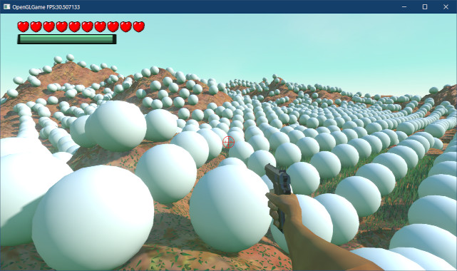

[OpenGL 3D 2024 前期 第10回]

# 地形と図形の交差判定

## 習得目標

* 
* 
* 
* 
* 

## 1. 地形と球体の交差判定

### 1.1 地形は三角形の集合

第07回で地形を作成し、地形の高さを取得できるようにしました。基本的なゲームを作成するには、地形の高さが分かれば十分です。

ただし、分かるのはある一点の高さだけです。そのため、地形に高低差が激しい凹凸が多かったり、オブジェクトが大きい場合には、オブジェクトの一部が地形に埋まってしまいます。これは、ゲームによっては問題になる可能性があります。

もっとも、これらの問題には対処法があります。例えば、高低差を適切な範囲に抑えるとか、大きいオブジェクトは使わない、または特別な処理(数点の高さを計測するなど)を追加します。

しかしながら、ゲームによってはこういった対処法が使いにくかったり、より厳密に地形に重ならないように配置したい場合もあるでしょう。その場合、地形と球体、地形と直方体の交差判定を作成する必要があります。

地形は三角形ポリゴンの集合体です。ですから、球体や直方体と地形のあいだの交差は、突き詰めると球体と三角形、または直方体と三角形の交差として捉えることができます。

つまり、「球体と三角形の交差判定」と「直方体と三角形の交差判定」の2つを作成すればよいわけです。

### 1.2 球体と三角形の交差判定

最初に、三角形をあらわす構造体を定義します。名前は`Triangle`(トライアングル、「三角形」という意味)とします。`Collision.h`を開き、`Box`構造体の定義の下に、次のプログラムを追加してください。

```diff
   vec3 position; // 中心座標
   vec3 axis[3];  // 軸の向き
   vec3 scale;    // 大きさ
 };
+
+/**
+* 三角形
+*/
+struct Triangle
+{
+  vec3 vertices[3]; // 頂点座標(反時計回り)
+  vec3 normal;      // 法線
+};

 /**
 * 光線
 */
 struct Ray
```

`Triangle`構造体は、3つの頂点と表側の法線で定義されます。

そして、`Triangle`構造体定義から少し下にある`Intersect`関数宣言リストに、球体と三角形用の`Intersect`関数宣言を追加してください。

```diff
 bool Intersect(const Sphere& a, const Sphere& b, vec3& penetration);
 bool Intersect(const AABB& a, const Sphere& b, vec3& penetration);
 bool Intersect(const Box& box, const Sphere& sphere, vec3& penetration);
+
+bool Intersect(const Sphere& a, const Triangle& b, vec3& penetration);
 
 bool Intersect(const AABB& a, const Ray& b, float& distance);
 bool Intersect(const Sphere& a, const Ray& b, float& distance);
 bool Intersect(const Box& a, const Ray& b, float& distance);
```

球体と三角形の交差判定は、以下の3つの段階から構成されます。

>1. 三角形を含む平面と球体の交差判定
>2. 三角形の面、辺、頂点のどれと交差しているかを求める
>3. 交差している部分と球体の交差判定

`1`の判定では、平面と球体中心の最短距離を計算します。これは法線に射影することで簡単に求められます。そして、最短距離が球体の半径以下かどうかを調べます。距離が半径以下なら球体と平面は交差しています。

<p align="center">
<br>
[左=最短距離が半径rより長い 右=最短距離が半径r以下]
</p>

平面と交差している場合、三角形と交差する可能性が生まれます。`2`では、球体から平面上の最近接点を求め、最近接点が三角形の3辺に対して左右どちら側にあるかを調べます。

これは外積を使います。最近接点が辺の左側にある場合、外積の結果は法線と同じ方向になります。右側にある場合は逆向きになります。そして、3辺に対する判定の結果は以下の7パターンのいずれかになります。

<p align="center">

</p>

>* `f`: 球体は三角形の面部分と交差している。
>* `e0`,`e1`,`e2`: 球体は三角形の辺と交差している。
>* `v0`,`v1`,`v2`: 球体は三角形の頂点と交差している。

`3`の判定では、交差している場所ごとに異なる方法で交差判定を行います。

それでは、`1`の「平面と球体の交差判定」から書いていきましょう。`Collision.cpp`を開き、`OBB`と球体の交差判定を行う関数定義の下に、次のプログラムを追加してください。

```diff
     penetration = box.axis[faceIndex] * ((distance + sphere.radius) * sign);
   }
   return true;
 }
+
+/**
+* 球と三角形の交差判定
+*/
+bool Intersect(const Sphere& a, const Triangle& b, vec3& penetration)
+{
+  // 球体と平面の交差判定
+  const vec3 v = a.position - b.vertices[0]; // 平面上の点と球体中心を結ぶベクトル
+  const float d = dot(v, b.normal); // 法線に射影して距離を求める
+  if (abs(d) > a.radius) {
+    return false; // 距離が半径より長いので交差しない
+  }
+}

 /**
 * スラブ(ある軸に垂直な2平面に囲まれた範囲)と光線の交差判定
 *
 * @param[in]  min       スラブの開始距離
```

次に、`2`の「三角形のどの部分と交差しているかを調べる」プログラムを追加します。平面と球体の交差判定の下に、次のプログラムを追加してください。

```diff
   if (abs(d) > a.radius) {
     return false; // 距離が半径より長いので交差しない
   }
+
+  // 最近接点と辺の関係(左右どちら側にあるか)を調べる
+  //
+  // [ビットフラグと領域の対応図]
+  //      \010/
+  //       \ /
+  //        0
+  //  011  / \  110
+  //      /111\
+  // ----1-----2----
+  // 001/  101  \100
+  //   /         \
+  vec3 p = a.position - b.normal * d; // 最近接点
+  int flags = 0; // ビットフラグ
+  for (int i = 0; i < 3; ++i) {
+    const vec3 edge = b.vertices[(i + 1) % 3] - b.vertices[i]; // 辺ベクトル
+    const vec3 v = p - b.vertices[i]; // 辺の始点から球体中心へのベクトル
+
+    // 外積が法線と同じ向きなら、最近接点は辺の左側にある
+    if (dot(cross(edge, v), b.normal) >= 0) {
+      flags |= 1 << i;
+    }
+  } // for i
 }

 /**
 * スラブ(ある軸に垂直な2平面に囲まれた範囲)と光線の交差判定
```

最近接点が各辺の左側にあれば、`flags`変数の対応するビットを`1`にします。3つのビットの状態によって、球体との交差判定を行うべき三角形の領域が分かります。

ビットが全て`1`ならば、最近接点は三角形の内側にあります。これは「面」として交差していると考えられます。

ビットが2つ`1`ならば、最近接点は「ビットが`0`の辺の右側」にあります。この場合、「球体と線分(辺)の交差判定」を行います。

ビットがひとつだけ`1`ならば、最近接点は「ビットが`0`の辺が交差する頂点の外側」にあります。この場合、「球体と点(頂点)の交差判定」を行います。

それでは、ビットごとに交差判定を分けましょう。一番簡単なのは、「ビットが全て`1`」の場合です。この場合、平面との交差判定の結果をそのまま利用できます。辺の左右を判定するプログラムの下に、次のプログラムを追加してください。

```diff
     if (dot(cross(edge, v), b.normal) >= 0) {
       flags |= 1 << i;
     }
   } // for i
+
+  // ビットフラグによって処理を分ける
+  switch (flags) {
+  case 0b001: // 頂点1との交差判定
+  case 0b010: // 頂点0との交差判定
+  case 0b100: // 頂点2との交差判定
+  {
+    return true;
+  }
+  case 0b011: // 辺0-1との交差判定
+  case 0b101: // 辺1-2との交差判定
+  case 0b110: // 辺2-0との交差判定
+  {
+    return true;
+  }
+
+  case 0b111: // 面と交差している
+    // 貫通ベクトルを求める
+    penetration = b.normal * (a.radius - d);
+    return true;
+
+  default: // ここには来ないはず
+    return false;
+  } // switch flags
 }

 /**
 * スラブ(ある軸に垂直な2平面に囲まれた範囲)と光線の交差判定
```

次に簡単なのは、「ビットがひとつだけ`1`」の場合です。この場合、球体と頂点の交差判定を行います。頂点との交差判定を行う`case`文に、次のプログラムを追加してください。

```diff
   case 0b001: // 頂点1との交差判定
   case 0b010: // 頂点0との交差判定
   case 0b100: // 頂点2との交差判定
   {
+    // 頂点までの距離を求める
+    static const int flagsToVertexIndexMap[] = { -1, 1, 0,-1, 2 };
+    const int vertexIndex = flagsToVertexIndexMap[flags]; // 頂点インデックス
+    const vec3 v = a.position - b.vertices[vertexIndex];
+    const float d2 = dot(v, v); // 距離の2乗
+
+    // 頂点までの距離が半径より長い場合は交差しない
+    if (d2 > a.radius * a.radius) {
+      return false;
+    }
+
+    // 貫通ベクトルを求める
+    const float d = sqrt(d2);
+    penetration = v * ((a.radius - d) / d);
     return true;
   }
```

貫通ベクトルの計算では、カッコによって`float`の計算を先に行うことで計算量を減らしています。

最後に、「ビットが2つ`1`」の場合を処理します。この場合、球体と辺の交差判定を行います。これは次の図のように3パターンに分類されます。

<p align="center">
<br>
[c=球体の中心 a=辺の始点 b=辺の終点 e=射影された位置(投影点)]
</p>

まず、辺の方向ベクトルに対して球体の中心を射影し、投影点を求めます。投影点と辺の始点、終点の位置関係によって、辺の最近接点が決まります。

>* 投影点が始点より前にある場合、始点が最近接点になる(上図左)。
>* 投影点が始点と終点の間にある場合、投影点(とうえいてん)が最近接点になる(上図中央)。
>* 投影点が終点より先にある場合、終点が最近接点になる(上図右)。

最近接点が分かれば、あとは球体と点の交差判定を行うだけです。それでは、辺との交差判定を行う`case`文に、次のプログラムを追加してください。

```diff
   case 0b011: // 3 辺0-1との交差判定
   case 0b101: // 5 辺1-2との交差判定
   case 0b110: // 6 辺2-0との交差判定
   {
+    // 単位辺ベクトルを求める
+    static const int flagsToStartIndexMap[] = { -1,-1,-1, 0,-1, 1, 2 };
+    const int startIndex = flagsToStartIndexMap[flags]; // 辺の始点の頂点インデックス
+    const vec3& edge = edgeVector[startIndex]; // 辺ベクトル
+    const float d = sqrt(dot(edge, edge));     // 辺ベクトルの長さ
+    const vec3 direction = edge * (1.0f / d);  // 単位辺ベクトル
+
+    // 始点から球体中心へのベクトルを、単位辺ベクトルに射影して投影点を求める
+    const float e = dot(a.position - b.vertices[startIndex], direction);
+    
+    // 辺の最近接点を求める
+    vec3 closestPoint; // 最近接点
+    if (e <= 0) {
+      // 投影点が始点の外側にある場合、始点を最近接点とする
+      closestPoint = b.vertices[startIndex];
+    } else if (e >= d) {
+      // 投影点が終点の外側にある場合、終点を最近接点とする
+      static const int flagsToEndIndexMap[] = { -1,-1,-1, 1,-1, 2, 0 };
+      closestPoint = b.vertices[flagsToEndIndexMap[flags]];
+    } else {
+      // 投影点が線分上にある場合、投影点を最近接点とする
+      closestPoint = b.vertices[startIndex] + direction * e;
+    }
+
+    // 最近接点までの距離を求める
+    const vec3 v = a.position - closestPoint;
+    const float d2 = dot(v, v); // 距離の2乗
+
+    // 最近接点までの距離が、球体の半径より長い場合は交差しない
+    if (d2 > a.radius * a.radius) {
+      return false;
+    }
+
+    // 貫通ベクトルを求める
+    const float d = sqrt(d2);
+    penetration = v * ((a.radius - d) / d);
     return true;
   }
```

これで、球体と三角形の交差判定ができるようになりました。

### 1.3 地形から三角形を取得する

地形は「多数の三角形の集合」です。すべての三角形について交差判定をしていたのでは、交差判定をしているだけで日が暮れてしまうでしょう。

交差判定にかかる時間を短縮するには、交差しそうな三角形だけを選び出す「ブロードフェーズ」が必要です。

`HeightMap.h`を開き、`Triangle`構造体を使えるように`Collision.h`をインクルードしてください。

```diff
 #ifndef HEIGHTMAP_H_INCLUDED
 #define HEIGHTMAP_H_INCLUDED
 #include "VecMath.h"
+#include "Collision.h"
 #include <vector>
 #include <memory>
```

次に、`HeightMap`クラスに三角形を取得するメンバ関数を追加します。名前は`GetTriangles`(ゲット・トライアングルズ)とします。`HeightMap`クラスの定義に次のプログラムを追加してください。

```diff
   * @return 座標posの高さ
   */
   float GetHeight(const vec3& pos, vec3* pNormal = nullptr) const;
+
+  /**
+  * 指定された範囲の三角形を取得する
+  *
+  * @param aabb 三角形を取得する範囲
+  *
+  * @return aabbに含まれる三角形の配列
+  */
+  std::vector<Triangle> GetTriangles(const AABB& aabb) const;

   /**
   * 高さマップの大きさを取得する
```

それでは`GetTriangles`メンバ関数を定義しましょう。`HeightMap.cpp`を開き、`GetHeight`メンバ関数の定義の下に、次のプログラムを追加してください。

```diff
     const float hx = (heights[a] - h0) * (1 - offsetX);
     const float hz = (heights[c] - h0) * (1 - offsetZ);
     return h0 + hx + hz;
   }
 }
+
+/**
+* 指定された範囲の三角形を取得する
+*/
+std::vector<Triangle> HeightMap::GetTriangles(const AABB& aabb) const
+{
+  // 計算誤差対策のためにXZ座標の範囲を拡大し、整数値に変換
+  const int x0 = static_cast<int>(floor(aabb.min.x - 0.1f));
+  const int z0 = static_cast<int>(floor(aabb.min.z - 0.1f));
+  const int x1 = static_cast<int>(ceil(aabb.max.x + 0.1f));
+  const int z1 = static_cast<int>(ceil(aabb.max.z + 0.1f));
+
+  // 計算誤差対策のためにY座標の範囲を拡大
+  const float top = aabb.max.y + 0.1f;
+  const float bottom = aabb.min.y - 0.1f;
+}
```

取得する範囲は`AABB`として指定します。範囲は浮動小数点数で指定しますが、地形のグリッドは整数単位です。そこで、少しでも交差するグリッドは範囲内として扱うことにします。

<p align="center">

</p>

`x0`, `z0`は範囲の「整数化した最小値」です。`floor`(フロア)関数によって、`AABB`の最小値より小さい最大の整数値を得ています。

`x1`, `z1`は範囲の「整数化した最大値」です。`ceil`(セイル)関数によって、`AABB`の最大値より大きい最小の整数値を得ています。

Y座標はグリッドとは無関係なので、`AABB`の値をそのまま使います。ただし、XYZすべての座標において、要求された値よりわずかに広い範囲となるように、`0.1`を加減算しています。

浮動小数点数の計算誤差のために、`AABB`の座標が本来意図した範囲よりわずかにずれる場合があります。また、衝突処理によってオブジェクトが移動した場合、当初想定していた`AABB`の範囲を越えることも考えられます。

範囲をわずかに拡大することで、これらの影響を最小限に抑えることができます。

さて、グリッド範囲を計算したら、範囲内のすべてのグリッドをループして座標と法線を計算します。`AABB`を整数値に変換するプログラムの下に、次のプログラムを追加してください。

```diff
   // 計算誤差対策のためにY座標の範囲を拡大
   const float top = aabb.max.y + 0.1f;
   const float bottom = aabb.min.y - 0.1f;
+
+  // (x0, z0)-(x1, z1)に含まれる全てのグリッドをループ
+  std::vector<Triangle> triangles;
+  triangles.reserve((x1 - x0) * (z1 - z0) * 2);
+  for (int x = x0; x < x1; ++x) {
+    // X座標を地形データの範囲に制限
+    const int cx0 = std::clamp(x, 0, static_cast<int>(width - 2));
+    const int cx1 = std::clamp(x + 1, 0, static_cast<int>(width - 2));
+
+    for (int z = z0; z < z1; ++z) {
+      // Z座標を地形データの範囲に制限
+      const int cz0 = std::clamp(z, 0, static_cast<int>(height - 2));
+      const int cz1 = std::clamp(z + 1, 0, static_cast<int>(height - 2));
+    } // for z
+  } // for x
+
+  return triangles;
 }
```

`AABBB`には地形データの範囲外の座標を指しているかもしれません。範囲外の座標は、高さデータを正しく参照することができません。そこで、地形データの範囲内に制限した座標値を計算しておきます。

それでは、高さデータを参照して、グリッドの4点の座標を計算しましょう。Z座標を地形データの範囲に制限するプログラムの下に、次のプログラムを追加してください。

```diff
     for (int z = z0; z < z1; ++z) {
       // Z座標を地形データの範囲に制限
       const int cz0 = std::clamp(z, 0, static_cast<int>(height - 2));
       const int cz1 = std::clamp(z + 1, 0, static_cast<int>(height - 2));
+
+      // 頂点取得時にキャストを何度も書くのは面倒なので先に済ませておく
+      const float fx = static_cast<float>(x);
+      const float fz = static_cast<float>(z);
+
+      // (x, z)を左上とする四角形の4つの頂点を取得
+      const vec3 a = { fx,     heights[cz1 * width + cx0], fz + 1 };
+      const vec3 b = { fx + 1, heights[cz1 * width + cx1], fz + 1 };
+      const vec3 c = { fx + 1, heights[cz0 * width + cx1], fz };
+      const vec3 d = { fx,     heights[cz0 * width + cx0], fz };
+
+      // Y座標の最大値と最小値を求める
+      const float t0 = std::max({ a.y, b.y, c.y, d.y });
+      const float b0 = std::min({ a.y, b.y, c.y, d.y });
+
+      // Y座標が範囲と交差する場合のみ登録する
+      if (t0 >= bottom && b0 <= top) {
+        // 辺ベクトルから面法線を計算
+        const vec3 normalRightBottom = normalize(cross(b - a, c - a));
+        const vec3 normalLeftTop = normalize(cross(c - a, d - a));
+        triangles.push_back({ { a, b, c }, normalRightBottom });
+        triangles.push_back({ { a, c, d }, normalLeftTop });
+      }
     } // for z
   } // for x

   return triangles;
 }
```

Y軸方向が`AABB`と交差しているかどうかは、4つの頂点のY座標の最大値と最小値を求め、`AABB`のY軸方向の範囲と比較することで判定しています。

この方法では、実際には交差していないのに「交差している」と判定される場合があります。とはいえ、これは境界付近で起きうるだけで、ほとんどの場合は交差していると判断して問題はありません。

この方法は誤判定こそありえますが、最大値と最小値を調べるだけなので高速です。正確な判定には時間がかかるため、実用上、十分な精度が得られるのなら、多少の誤判定があっても高速な方法を選ぶほうが良い場合があります。

面法線は、三角形の辺ベクトルの外積によって計算しています。事前に計算して配列に記録しておくことも考えましたが、2024年現在のコンピューターの場合、少々のことならその都度計算を行ったほうが結果的に高速な場合が多いです。

>時間がかかっても毎回計算するほうが速くなるのは、メモリアクセスにはそれ以上の時間がかかる場合があるからです。

これで、地形データのうち`AABB`の範囲内にある三角形のみを取得できるようになりました。

### 1.4 CharacterMovementの地形判定を書き換える

続いて、作成した機能を使って、スフィアコライダーが地形に埋まらないようにします。地形との交差判定は、コライダーをワールド座標系に変換して行います。この変換は`GetTransformedCollider`メンバ関数で実行できます。

しかし、実際に必要なのはコライダーオブジェクトが持つ`Sphere`構造体だけで、コライダーオブジェクト自体は不要です。ということは、コライダーオブジェクトの生成を省略できれば、少しだけ処理が高速化されるはずです。

そこで、スフィアコライダーに「ワールド座標系の`Sphere`構造体」を直接生成するメンバ関数を追加します。名前は`GetTransformedSphere`(ゲット・トランスフォームド・スフィア、「座標変換された球体を取得する」という意味)とします。

`SphereCollider.h`を開き、`GetTransformedCollider`メンバ関数を次のように変更してください。

```diff
   // 座標変換したコライダーを取得する
   ColliderPtr GetTransformedCollider(const mat4& transform) const override
   {
     // 中心座標を座標変換する
     auto p = std::make_shared<SphereCollider>();
+    p->sphere = GetTransformedSphere(transform);
+    return p;
+  }
+
+  // 座標変換したSphere構造体を取得する
+  Sphere GetTransformedSphere(const mat4& transform) const
+  {
+    Sphere result;
-    p->sphere.position = vec3(transform * vec4(sphere.position, 1));
+    result.position = vec3(transform * vec4(sphere.position, 1));
 
     // 球体の拡大率はオブジェクトのXYZ拡大率のうち最大のものとする(Unity準拠)
     const vec3 scale = ExtractScale(transform);
     const float maxScale = std::max({ scale.x, scale.y, scale.z });
-    p->sphere.radius = sphere.radius * maxScale;
-    return p;
+    result.radius = sphere.radius * maxScale;
+    return result;
   }
 
   // 指定された軸方向の境界区間を取得する
   virtual BoundingInterval GetBoundingInterval(int axis) const override
```

それでは、`CharactoerMovement`コンポーネントの地形との衝突判定を、球体と地形との交差判定で置き換えましょう。`CharacterMovement.h`を開き、以下のヘッダファイルをインクルードしてください。

```diff
 #define CHARACTERMOVEMENT_H_INCLUDED
 #include "Component.h"
 #include "GameObject.h"
 #include "Engine.h"
+#include "SphereCollider.h"
 #include "HeightMap.h"

 /**
 * ゲームオブジェクトの速度や重力を制御するコンポーネント
```

次に、`Update`メンバ関数の定義を次のように変更してください。

```diff
   // 毎フレーム1回呼び出される
   virtual void Update(float deltaTime) override
   {
     auto owner = GetOwner();

     // 高さマップの接地判定
     Engine* engine = owner->GetEngine();
     const auto& heightMap = engine->GetHeightMap();
     if (heightMap) {
-      // Y軸方向の地面の高さを取得
-      vec3 terrainNormal;
-      const float terrainHeight =
-        heightMap->GetHeight(owner->position, &terrainNormal);
-
-      // ゲームオブジェクトのY座標が地面のY座標以下の場合、地面に触れているとみなす
-      if (owner->position.y <= terrainHeight) {
-        // ゲームオブジェクトのY座標を地面の高さに合わせる
-        owner->position.y = terrainHeight;
-        owner->isGrounded = true; // 接地状態にする
-      }
+      // コライダーがある場合のみ判定
+      const auto collider = owner->GetComponent<Collider>();
+      if (collider) {
+        // 地形との接触情報
+        bool isCollidingTerrain = false;
+        vece terrainNormal = { 0, 1, 0 };
+
+        // コライダーの種類で処理を分ける
+        const auto colliderType = collider->GetType();
+        if (colliderType == Collider::Type::Sphere) {
+          // スフィアコライダーと地形の衝突
+          const auto& sphereCollider = static_cast<SphereCollider&>(*collider);
+
+          // ワールドコライダーを計算
+          Sphere worldSphere =
+            sphereCollider->GetTransformedSphere(owner->GetTransformMatrix());
+
+          // 地形データから、ワールドコライダーと交差する可能性のある全ての三角形を取得
+          const AABB aabb = {
+            worldSphere.position - worldSphere.radius,
+            worldSphere.position + worldSphere.radius };
+          std::vector<Triangle> triangles = heightMap->GetTriangles(aabb);
+
+          // 全ての三角形と交差判定
+          for (const auto& e : triangles) {
+            vec3 penetration;
+            if (Intersect(worldSphere, e, penetration)) {
+              // 地形と交差しない位置に移動
+              owner->position += penetration;
+              worldSphere.position += penetration;
+
+              // 接触情報を更新
+              isCollidingTerrain = true;
+              terrainNormal += e.normal;
+            }
+          } // for triangles
+        } // if colliderType
+
+        // 地形との衝突が発生していた場合、地面に触れているとみなす
+        if (isCollidingTerrain) {
+          // 貫通ベクトルが垂直に近い場合、床に触れたとみなす
+          static const float cosGround = cos(radians(30)); // 「垂直に近い」とみなす角度
+          const float d = length(terrainNormal);
+          if (terrainNormal.y >= cosGround * d) {
+            owner->isGrounded = true; // 接地状態にする
+          }
+        } // if isCollidingTerrain
+      } // if collider
     } // if heightMap
```

三角形の交差判定を追加した副産物として、衝突点の法線が分かるようになっています。そこで、法線を利用して「床」の判定を追加しています。

### 1.5 乱数を使って地形の判定を安定させる

これで、球体が地形に埋まらなくなるはずです。ただ、あとひとつだけ簡単な処理を追加します。それは、「取得した三角形配列をランダムに並べ替える」ことです。

ランダムに並べ替える理由は、複数の三角形との交差判定をいつも同じ順番で実行すると、実行結果が安定しないことがあるからです。

ここで「安定しない」というのは、フレーム1で三角形Aから押し出されて三角形Bと交差した状態で終了し、次のフレーム2で三角形Bから押し出されてまた三角形Aと交差した状態で終了する、ということを繰り返す状態を指します。

現実には全ての交差判定が同時に発生しますが、コンピューターによる交差判定ではひとつずつ処理するしかありません。そのため、このような「安定しない」状況が生まれてしまうのです。

そして、交差判定の処理順をランダム化することで、「いくつかのフレームを平均すると、全ての交差判定が同時発生した場合に近い状態」を作り出せます。そのため、「安定しない」状況になる可能性を減らすことができるのです。

それでは、処理順をランダム化しましょう。`CharacterMovement.h`に、`algorithm`と`random`の2つのヘッダファイルをインクルードしてください。

```diff
 #include "GameObject.h"
 #include "Engine.h"
 #include "SphereCollider.h"
 #include "HeightMap.h"
+#include <algorithm>
+#include <random>

 /**
 * ゲームオブジェクトの速度や重力を制御するコンポーネント
```

次に、`CharacterMovement`クラスの定義に、乱数オブジェクトを追加してください。

```diff
   static constexpr float gravity = 9.81f; // 重力定数
   float gravityScale = 1; // 重力の影響を制御する係数
   vec3 velocity = { 0, 0, 0 }; // 加速度
+
+  // 地形との交差判定をランダム化するための乱数オブジェクト
+  static inline std::minstd_rand rand = std::minstd_rand();
 };
 using CharacterMovementPtr = std::shared_ptr<CharacterMovement>;

 #endif // CHARACTERMOVEMENT_H_INCLUDED
```

`minstd_rand`(ミン・エスティーディー・ランド)クラスは、C言語の`rand`関数のパラメータを改良した乱数クラスです。`mt19937`と比べて品質は下がりますが、速度が向上します。

続いて、三角形配列を取得するプログラムの下に、次のプログラムを追加してください。

```diff
         const AABB aabb = {
           worldSphere.position - worldSphere.radius,
           worldSphere.position + worldSphere.radius };
         std::vector<Triangle> triangles = heightMap->GetTriangles(aabb);
+
+        // 衝突処理の安定性向上のため処理順をランダム化
+        std::shuffle(triangles.begin(), triangles.end(), rand);

         // 全ての三角形と交差判定
         for (const auto& e : triangles) {
           vec3 penetration;
```

`shuffle`(シャッフル)関数は、指定された範囲をランダムに並び替える関数です。これで、交差判定を行う三角形の順序がランダム化されるようになりました。

<pre class="tnmai_code"><strong>【書式】</strong><code>
void shuffle(範囲の先頭, 範囲の終端);
</code></pre>

プログラムが書けたらビルドして実行してください。球体が地面に埋まらなくなっていたら成功です。

>**【ランダム化の弊害】**<br>
>ランダム化によって別の問題が起きることも知っておくべきでしょう。最も大きな問題は、「結果の再現性がない」ことです。<br>
>例えば、ボールの反射を再現する場合を考えます。ボールが複数の三角形と同時に衝突したとき、最初にどの三角形に対して反射するかは完全にランダムです。そのため、毎回違う方向に反射することになります。<br>
>こういったランダムによる問題を避けるには、複数の衝突を同時に扱える、より高度な衝突応答処理を実装しなくてはなりません。

<p align="center">

</p>

>**【1章のまとめ】**
>
>* 
>* 
>* 

<div style="page-break-after: always"></div>

## 2. 地形と直方体の交差判定

### 2.1 OBBと三角形の分離軸判定(SAT)

球体の次は、直方体(`OBB`)と地形の交差判定を行えるようにします。`Collision.h`を開き、次の関数宣言を追加してください。

```diff
 bool Intersect(const AABB& a, const Sphere& b, vec3& penetration);
 bool Intersect(const Box& box, const Sphere& sphere, vec3& penetration);

 bool Intersect(const Sphere& a, const Triangle& b, vec3& penetration);
+bool Intersect(const Box& a, const Triangle& b, vec3& penetration);

 bool Intersect(const AABB& a, const Ray& b, float& distance);
 bool Intersect(const Sphere& a, const Ray& b, float& distance);
```

直方体と三角形の交差判定には、「分離軸判定(`Separating Axis Test`, `SAT`)」と呼ばれる手法を使います。分離軸判定は、`AABB`同士の交差判定を一般化したもので、次のように定義されます。

>ある軸に2つの図形を射影したとき、射影した範囲が交差していなければ、それらの図形は交差していない。

<p align="center">
<br>
[赤のOBBと青のOBBに対する射影]
</p>

この「ある軸」が、X軸やY軸のようなワールド座標系の軸の場合、`AABB`の交差判定と等しくなります。

さて、分離軸判定を問題は最も効率の良い「ある軸」を選ぶことです。`OBB`と三角形の場合、これは以下の13個の軸になります。

>1. 三角形の面法線
>2. `OBB`のX軸
>3. `OBB`のY軸
>4. `OBB`のZ軸
>5. `OBB`のX軸と三角形のひとつ目の辺の両方に垂直な軸
>6. `OBB`のX軸と三角形のふたつ目の辺の両方に垂直な軸
>7. `OBB`のX軸と三角形のみっつ目の辺の両方に垂直な軸
>8. `OBB`のY軸と三角形のひとつ目の辺の両方に垂直な軸
>9. `OBB`のY軸と三角形のふたつ目の辺の両方に垂直な軸
>10. `OBB`のY軸と三角形のみっつ目の辺の両方に垂直な軸
>11. `OBB`のZ軸と三角形のひとつ目の辺の両方に垂直な軸
>12. `OBB`のZ軸と三角形のふたつ目の辺の両方に垂直な軸
>13. `OBB`のZ軸と三角形のみっつ目の辺の両方に垂直な軸

数が多いので判定に時間がかかりそうなものですが、交差していない場合は最初の方の分離軸で判定できることが多いため、実際にはそこまで処理が遅くなることは少ないです。

もちろん、交差が発生する場合は13回の分離軸判定が必要なので遅くなります。しかし、分離軸判定はほぼ最速の判定方法なので、これは受け入れるしかありません。

すべての軸で交差していると判定された場合、`OBB`と三角形は実際に交差しています。そして、交差している場合、「交差範囲が最小の軸」が貫通ベクトルになります。

それでは、`OBB`と三角形の交差判定を書いていきましょう。`Collision.cpp`を開き、球体と三角形の交差判定を行う`Intersect`関数の定義の下に、次のプログラムを追加してください。

```diff
   default: // ここには来ないはず
     return false;
   }
 }
+
+/**
+* OBBと三角形の交差判定
+*/
+bool Intersect(const Box& a, const Triangle& b, vec3& penetration)
+{
+  // OBBの中心が原点となるように、三角形の座標を変換
+  const vec3 v0 = b.vertices[0] - a.position;
+  const vec3 v1 = b.vertices[1] - a.position;
+  const vec3 v2 = b.vertices[2] - a.position;
+
+  // 三角形の法線による分離軸判定
+  {
+    // OBBを法線に射影
+    const float r = a.scale.x * abs(dot(a.axis[0], b.normal)) +
+                    a.scale.y * abs(dot(a.axis[1], b.normal)) +
+                    a.scale.z * abs(dot(a.axis[2], b.normal));
+
+    // 三角形を法線に射影
+    const float s = dot(v0, b.normal);
+
+    if (abs(s) > r) {
+      return false; // OBBと三角形の射影が交差していない
+    }
+
+    // 貫通距離と貫通ベクトルを記録
+    minDistance = r - abs(s);
+    minAxis = b.normal;
+
+    // 三角形の射影がOBBの原点から見て正の側にある場合、OBBは三角形の裏側から交差しているので法線を反転
+    if (s >= 0) {
+      minAxis *= -1;
+    }
+  }
+
+  // 貫通ベクトルを計算
+  penetration = minAxis * minDistance;
+  return true;
+}
```

一般的に、多角形を射影するには「すべての頂点を射影して最大値と最小値を求める」必要があります。ただし、`OBB`は中心から見て対称なので、最大値と最小値のどちらか一方が分かれば、もう一方も判明します。

最大値を求めるには、方向ベクトルを射影した結果を絶対値にして足し合わせます。これは、`OBB`の頂点が「方向ベクトルの正負の組み合わせ」で表現できるためです。

また、このプログラムでは三角形の法線に対して射影しています。三角形の頂点は法線と垂直な同一平面上にあるため、すべて同じ位置に射影されるはずです。そのため、どれかひとつの頂点を射影するだけで済みます。

次に、`OBB`の3つの軸に対して分離軸判定を行います。三角形の法線による分離軸判定の下に、次のプログラムを追加してください。

```diff
     // 三角形の射影がOBBの原点から見て正の側にある場合、OBBは三角形の裏側から交差しているので法線を反転
     if (s >= 0) {
       minAxis *= -1;
     }
   }
+
+  // OBBのX, Y, Z軸による分離軸判定
+  for (int i = 0; i < 3; ++i) {
+    // OBBを軸に射影
+    const float r = a.scale[i];
+
+    // 三角形を軸に射影
+    const float p0 = dot(v0, a.axis[i]);
+    const float p1 = dot(v1, a.axis[i]);
+    const float p2 = dot(v2, a.axis[i]);
+    const float s0 = std::min({ p0, p1, p2 });
+    const float s1 = std::max({ p0, p1, p2 });
+
+    if (s1 < -r || s0 > r) {
+      return false; // OBBと三角形の射影が交差していない
+    }
+
+    // 貫通距離が短くなる方向を選択
+    const float diff0 = r - s0;
+    const float diff1 = r + s1;
+    const float diff = std::min(diff0, diff1);
+
+    // 貫通距離がより短いベクトルを選択
+    if (diff < minDistance) {
+      minDistance = diff;
+      minAxis = a.axis[i];
+      if (diff0 < diff1) {
+        minAxis *= -1;
+      }
+    }
+  } // for i

   // 貫通ベクトルを計算
   penetration = minAxis * minDistance;
   return true;
```

`OBB`を`OBB`の軸に射影する場合は計算の必要はありません。軸と同じ方向の`scale`を参照するだけです。各軸は互いに垂直なので、同じ軸同士の内積は常に`1`、異なる軸の内積は常に`0`になるからです。

三角形のほうは、すべての頂点を射影して最大値と最小値を求めなくてはなりません。最大値と最小値が分かれば、あとは`AABB`の交差判定と同じです。

続いて、「`OBB`の軸と三角形の辺に直角な軸」に対して分離軸判定を行います。`OBB`の軸による分離軸判定の下に、次のプログラムを追加してください。

```diff
       if (diff0 < diff1) {
         minAxis *= -1;
       }
     }
   } // for i

+  // OBB及び三角形の各辺に直角な軸(3x3=9)による分離軸判定
+  const vec3 edges[] = { v1 - v0, v2 - v1, v0 - v2 };
+  for (int j = 0; j < 3; ++j) {
+    for (int i = 0; i < 3; ++i) {
+      // OBBの軸と三角形の辺の両方に垂直な軸を求める
+      const vec3 axis = cross(a.axis[j], edges[i]);
+
+      // OBBを軸に射影
+      const float r = a.scale.x * abs(dot(a.axis[0], axis)) +
+                      a.scale.y * abs(dot(a.axis[1], axis)) +
+                      a.scale.z * abs(dot(a.axis[2], axis));
+
+      // 三角形を軸に射影
+      const float p0 = dot(v0, axis);
+      const float p1 = dot(v1, axis);
+      const float p2 = dot(v2, axis);
+      const float s0 = std::min({ p0, p1, p2 });
+      const float s1 = std::max({ p0, p1, p2 });
+
+      if (s1 < -r || s0 > r) {
+        return false; // OBBと三角形の射影が交差していない
+      }
+
+      // 貫通距離が短くなる方向を選択
+      const float diff0 = r - s0;
+      const float diff1 = r + s1;
+      const float diff = std::min(diff0, diff1);
+
+      // 貫通距離がより短いベクトルを選択
+      const float d = length(axis);
+      if (diff < minDistance * d) { // 長さをminDistance側に掛けることで除算を避ける
+        // ここまで方向ベクトルの正規化を遅らせる
+        minDistance = diff * (1.0f / d);
+        minAxis = axis * (1.0f / d);
+        if (diff0 < diff1) {
+          minAxis *= -1;
+        }
+      }
+    } // for i
+  } // for j

   // 貫通ベクトルを計算
   penetration = minAxis * minDistance;
   return true;
```

軸と辺の両方に垂直な軸を求めるには「外積」を使います。外積で得られたベクトルの長さは`sinθ`になるので、そのままでは方向ベクトルとして使えない点に注意してください。

ただし、同じベクトルに射影する限り、分離軸判定は問題なく行えます(どちらの図形にも同じ倍率がかかるため)。そこで、実際に交差していると判定されるまで正規化を遅らせています。これによって、交差しない場合が高速化されます。

これで、`OBB`と三角形の交差判定ができるようになりました。

### 2.2 CharacterMovementに直方体の判定を追加する

作成した`OBB`と三角形の交差判定を使って、`CharacterMovement`コンポーネントに地形と直方体の衝突判定を追加しましょう。`SphereCollider`と同様に、まずは`BoxCollider`コンポーネントに`Box`構造体を取得する関数を追加します。

`BoxCollider.h`を開き、`GetTransformedCollider`メンバ関数の定義を次のように変更してください。

```diff
   // 座標変換したコライダーを取得する
   ColliderPtr GetTransformedCollider(const mat4& transform) const override
   {
+    auto p = std::make_shared<BoxCollider>();
+    p->box = GetTransformedBox(transform);
+    return p;
+  }
+
+  // 座標変換したBox構造体を取得する
+  Box GetTransformedBox(const mat4& transform) const
+  {
     // 座標変換行列を分解
     vec3 translate; // 未使用
     vec3 scale;
     mat3 rotation;
     Decompose(transform, translate, scale, rotation);

     // 座標変換したコピーを作成
-    auto p = std::make_shared<BoxCollider>();
-    p->box.position = vec3(transform * vec4(box.position, 1));
+    Box result;
+    result.position = vec3(transform * vec4(box.position, 1));
     for (int i = 0; i < 3; ++i) {
-      p->box.axis[i] = rotation * box.axis[i];
-      p->box.scale[i] = box.scale[i] * scale[i];
+      result.axis[i] = rotation * box.axis[i];
+      result.scale[i] = box.scale[i] * scale[i];
     }
-    return p;
+    return result;
   }

   // 指定された軸方向の境界区間を取得する
   virtual BoundingInterval GetBoundingInterval(int axis) const override
```

それでは、地形との衝突判定を追加しましょう。`CharacterMovement.h`を開き、`Update`メンバ関数の定義に次のプログラムを追加してください。

```diff
               // 接触情報を更新
               isCollidingTerrain = true;
               terrainNormal += e.normal;
             }
           } // for triangles
+        } else if (colliderType == Collider::Type::Box) {
+          // ボックスコライダーと地形の衝突
+          const auto& boxCollider = static_cast<BoxCollider&>(*collider);
+
+          // ワールドコライダーを計算
+          Box worldBox = boxCollider.GetTransformedBox(owner->GetTransformMatrix());
+
+          // OBBにをぴったり包むAABBのサイズを計算
+          const float rx = worldBox.scale.x * abs(worldBox.axis[0].x) +
+                           worldBox.scale.y * abs(worldBox.axis[1].x) +
+                           worldBox.scale.z * abs(worldBox.axis[2].x);
+          const float ry = worldBox.scale.x * abs(worldBox.axis[0].y) +
+                           worldBox.scale.y * abs(worldBox.axis[1].y) +
+                           worldBox.scale.z * abs(worldBox.axis[2].y);
+          const float rz = worldBox.scale.x * abs(worldBox.axis[0].z) +
+                           worldBox.scale.y * abs(worldBox.axis[1].z) +
+                           worldBox.scale.z * abs(worldBox.axis[2].z);
+
+          // 地形データから、ワールドコライダーと交差する可能性のある全ての三角形を取得
+          AABB aabb = {
+            worldBox.position - vec3(rx, ry,rz),
+            worldBox.position + vec3(rx, ry,rz) };
+          std::vector<Triangle> triangles = heightMap->GetTriangles(aabb);
+
+          // 安定性向上のため処理順をランダム化
+          std::shuffle(triangles.begin(), triangles.end(), std::minstd_rand());
+
+          // 全ての三角形と交差判定
+          for (const auto& e : triangles) {
+            vec3 penetration;
+            if (Intersect(worldBox, e, penetration)) {
+              // 地形と交差しない位置に移動
+              owner->position += penetration;
+              worldBox.position += penetration;
+
+              // 接触情報を更新
+              isCollidingTerrain = true;
+              terrainNormal += e.normal;
+            }
+          } // for triangles
         } // if colliderType
 
         // 地形との衝突が発生していた場合、地面に触れているとみなす
         if (isCollidingTerrain) {
```

これで、`OBB`と地形の衝突判定ができるようになるはずです。

### 2.3 直方体を配置してを確認する

直方体モデルを追加して、本当に`OBB`が地形に埋まらなくなっているか確認しましょう。

<strong>【課題01】</strong>
以下のURLから<code>solid_box.zip</code>をダウンロードし、プロジェクトの<code>Res/MeshData</code>フォルダに展開しなさい。

<code>https://github.com/tn-mai/OpenGL3D2023/tree/main/res/meshdata/obj/</code>

必要な直方体モデルのファイルは以下の3つです。
- solid_box.obj
- solid_box.mtl
- solid_box.tga
</pre>

それでは、衝突判定用のゲームオブジェクトを作成しましょう。`HeightMapScene.cpp`を開き、`BoxCollider.h`をインクルードしてください。

```diff
 #include "HeightMapScene.h"
 #include "PlayerComponent.h"
 #include "Engine/SphereCollider.h"
+#include "Engine/BoxCollider.h"
 #include "Engine/GrassRenderer.h"

 /**
 * シーンの初期化
```

次に、`Initialize`メンバ関数の定義に次のプログラムを追加してください。

```diff
       // ゲームオブジェクトを作成
       auto go = engine.Create<GameObject>(name.c_str(), { x, 20, z });
       go->staticMesh = engine.LoadOBJ("Res/MeshData/ico_sphere.obj");
       auto characterMovement = go->AddComponent<CharacterMovement>();
       auto collider = go->AddComponent<SphereCollider>();
     }
+
+    // 金のボックスを配置
+    auto boxMesh = engine.LoadOBJ("Res/MeshData/solid_box.obj");
+    boxMesh->materials[0]->baseColor = { 1.0f, 0.766f, 0.336f, 1.0f };
+    boxMesh->materials[0]->roughness = 0.3f;
+    boxMesh->materials[0]->metallic = 1;
+    for (int i = 0; i < 25; ++i) {
+      // 名前に番号をふる
+      std::string name = "box.";
+      name.push_back('0' + i / 10);
+      name.push_back('0' + i % 10);
+
+      // 座標を計算
+      const float x = static_cast<float>((i % 5) * 20 + 13);
+      const float z = static_cast<float>((i / 5) * 20 + 11);
+
+      // ゲームオブジェクトを作成
+      auto go = engine.Create<GameObject>(name.c_str(), {x, 20, z});
+      auto cm = go->AddComponent<CharacterMovement>();
+      go->staticMesh = engine.LoadOBJ("Res/MeshData/box.obj");
+      auto collider = go->AddComponent<BoxCollider>();
+
+      // 適当に図形を回転
+      go->rotation.x = static_cast<float>(i + 1) / 5;
+      go->rotation.y = static_cast<float>(i + 3) / 9;
+    }
   } // 衝突判定のテスト

   return true;
 }
```

プログラムが書けたらビルドして実行してください。追加された金色の直方体が、地面に埋まらないように接地していたら成功です。

<p align="center">
&emsp;
</p>

>**【2章のまとめ】**
>
>* 
>* 
>* 
